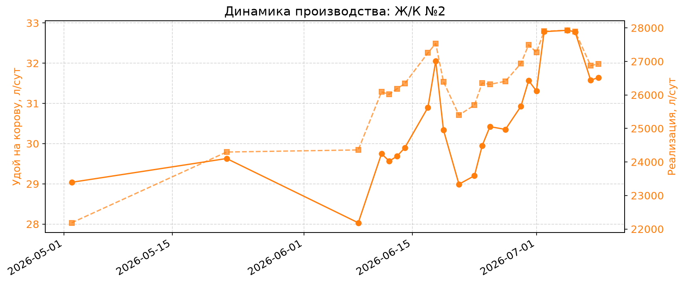
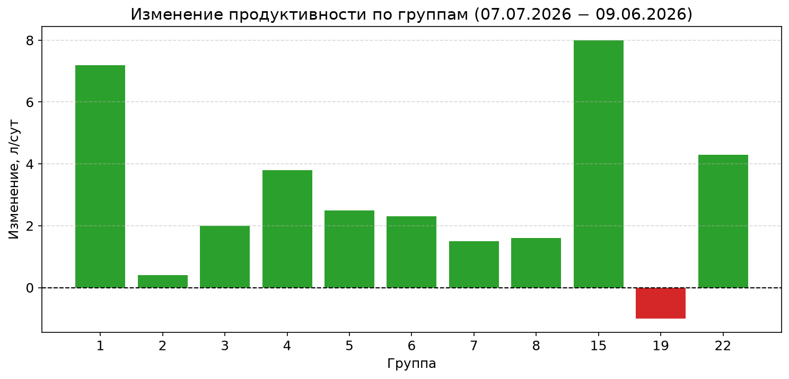
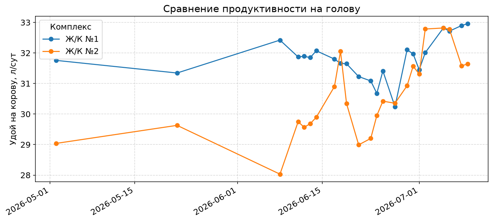
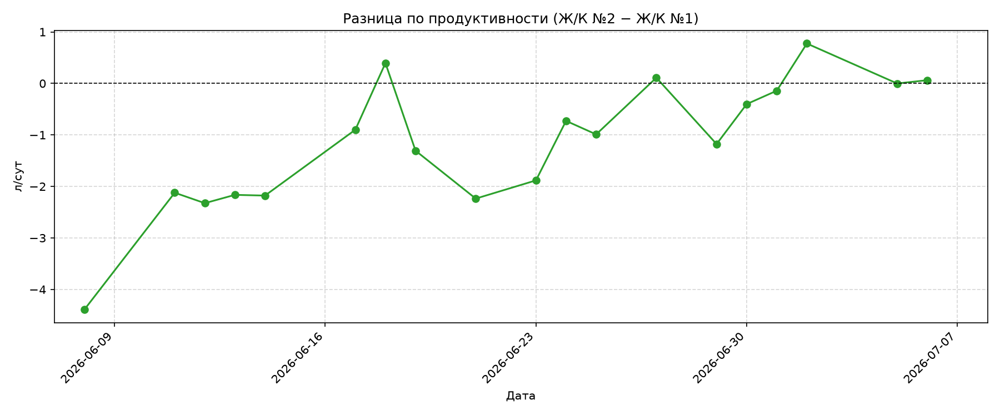
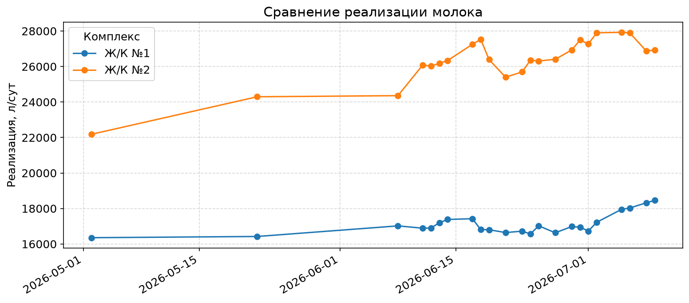
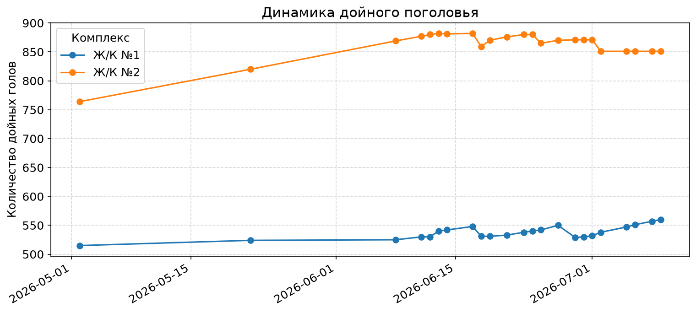

---
case_id: CASE-002
date: 2026-06-08
date_updated: 2026-07-09
farm: КТ Зенченко МТК Ленинский
author: Pilot
source_report: CASE-002/reports/Отчет_ЖК2_2026-07-07.md
category: nutrition
tags: [ration, productivity, dynamics, leninsky, CP, DMI, ЖК-№2]
status: processed
fpf_context: []
---
# CASE-002: КТ Зенченко МТК Ленинский — динамика рациона и продуктивности

> Шаблон: [TEMPLATE-CASE.md](TEMPLATE-CASE.md)
> Конвейер: CASE → DL → RULE
> Отчёт фактических результатов: [Отчет_ЖК2_2026-07-07.md](CASE-002/reports/Отчет_ЖК2_2026-07-07.md)

---

## Контекст (до)

**Параметры стада:**

- Порода: Симментал
- Лактация: 2,39
- Средний лактационный день (DIM): 191
- BCS: не измерен на момент начала кейса
- Производство:
  - Удой на корову: ~28,0 л/сут (по данным Ж/К №2 на начало периода)
  - Жир: 3,9%
  - Дойных коров: 871
  - Фуражных коров: 1004

**Важный нюанс до интервенции:**

- По данным начальника комплекса (уточнено 08.07.2026), **до 08.06.2026 в бункере смешивались различные рецепты комбикорма** (например, при нехватке рецепта 2 докидывали рецепт 5).
- С 08.06.2026 эту практику прекратили.
- Это означает, что фактическая питательность и стабильность базового рациона до интервенции были ниже, чем зафиксировано в расчётах AMTS. Это частично объясняет, почему фактический прирост молока (+4,7 л/сут) существенно превысил прогноз AMTS (+1,6 л/сут).

**Условия содержания и анализ кормления:**

- Рацион: используемый для групп 2,3,4,5,6,7,8, 19 (соматика) — [2026-06-08 Используемый Зенченко Ленинский.pdf](<CASE-002/raw/2026-06-08 Используемый Зенченко Ленинский.pdf>)
- DMI (норма / расчёт AMTS до интервенции):
  - Гр. 2–8: ~23,9 кг СВ (база для прогноза +0,1 кг СВ)
  - Гр. 15, 1: ~16,1 кг СВ (без изменения)
- DMI (факт):

| Группа | Потребление рациона | Кол-во гол. в группе | DIM | Дни стел | Продуктивность |
| ------------ | ------------------------------------- | ----------------------------------- | --- | --------------- | ---------------------------- |
| 2            | 134                                   | 97                                  | 53  | 3               | 38.1                         |
| 3            | 105                                   | 89                                  | 104 | 27              | 37.1                         |
| 4            | 105                                   | 94                                  | 165 | 56              | 33.2                         |
| 5            | 110                                   | 94                                  | 211 | 74              | 32.0                         |
| 6            | 105                                   | 85                                  | 240 | 90              | 29.1                         |
| 7            | 100                                   | 90                                  | 308 | 97              | 25.6                         |
| 8            | 143                                   | 96                                  | 339 | 91              | 25.7                         |
| 19           | 125                                   | 41                                  | 202 | 63              | 20.9                         |

- Рацион: используемый для групп раздоя 15, 1 — [2026-06-08 Используемый 15 1.pdf](<CASE-002/raw/2026-06-08 Используемый 15 1.pdf>)

Пенсильванские сита:

| Сито | TMR гр2,7,8 | Силос | Сенаж | Солома |
| -------- | ------------- | ---------- | ---------- | ------------ |
| 1        | 6.4%          | 8.7%       | 41.8%      | 37.3%        |
| 2        | 43.4%         | 71.9%      | 36.8%      | 36.2%        |
| 3        | 10.5%         | 10.3%      | 10.3       | 12.9%        |
| 4        | 39.7%         | 8.9%       | 11.1       | 11.7%        |

pef силос: 90.9%
pef сенаж: 88.9%
pef солома: 88.3%

| Группа | Потребление рациона | Кол-во гол. в группе | DIM | Дни стел | Продуктивность |
| ------------ | ------------------------------------- | ----------------------------------- | --- | --------------- | ---------------------------- |
| 15           | 120                                   | 18                                  | 25  | 5               | 23                           |
| 1            | 120                                   | 96                                  | 104 | 27              | 32.1                         |

Комментарии: в группе 15 показываются дни стельности 5. В этой группе также стот 2 головы из дойного стада. Поэтому данные группы искажаются. Продуктивность группы указана с учетом этих голов

**Исходные лабораторные показатели:**

- BHB: не измерялся в рамках данного кейса
- NEFA: не измерялся
- Другие лабораторные показатели (например, мочевина крови): не представлены

> Рекомендация: при следующем отборе крови добавить BHB для групп 15 (раздой) и 19 (отрицательная динамика) для исключения субклинического кетоза.

---

## Действие (интервенция)

**Шаг 1:**

- Дата: 10.06.2026
- Изменение рациона: 15, 1
- Рацион гр 15 и 1: /home/asus/IWE/PACK-cattle-science/cases/CASE-002/raw/2026-06-10 Ленинское 15 1 новый.pdf
- Рацион гр 2-8, 19: /home/asus/IWE/PACK-cattle-science/cases/CASE-002/raw/2026-06-10 Ленинский 2,7,8 новый.pdf
- Прогноз: увеличение продуктивности на 1.6 л, увеличение потребления до 21 кг СВ (расчёт на улучшение переваримости корма и, как следствие, увеличение потребления)
- СВ TMR гр 15 и 1 — 47.2%
- СВ TMR гр 2,7,8 — 44%
- СВ TMR гр Сух 2 — 47,5%

**Изменения по категориям:**

- **В рационе:**
  - Переход на скорректированные рецепты для групп 1–8, 15, 19 (см. PDF-рационы от 10.06.2026).
  - Снижение доли соломы на 73%, компенсировано сенажом и небольшим ростом комбикорма.
  - Улучшение физической структуры TMR: доля крупных частиц (сито 19 мм) снизилась с 6.4% до 1.7%, целевая фракция (сито 2) выросла до ~45%.
- **В управлении:**
  - С 08.06.2026 прекращено смешение разных рецептов комбикорма в бункере.
- **В лечении:**
  - Не применялось в рамках данной интервенции.

Пенсильванские сита:

| Сито | TMR гр1 | TMR гр 2,7,8 |
| -------- | --------- | -------------- |
| 1        | 3.1%      | 1.7%           |
| 2        | 45.4%     | 45.3%          |
| 3        | 11.8%     | 12.5%          |
| 4        | 39.7%     | 40.5%          |

**Шаг 2:**

- Дата: не применялся
- Изменение рациона: в рамках данного кейса дополнительных изменений рациона не вносилось
- Цель: мониторинг реакции стада на новый рацион

**Шаг 3:**

- Дата: не применялся
- Изменение рациона: дальнейшие корректировки возможны после получения фактических данных
- Цель: уточнение рациона на основе мониторинга

> Дополнительные шаги будут добавлены при получении фактических данных по продуктивности и здоровью.

---

## Результат (после)

### Прогноз AMTS (на момент внесения изменений, 10.06.2026)

| Дата   | Показатель                     | Значение                   | Изменение vs база |
| ---------- | ---------------------------------------- | ---------------------------------- | ------------------------------ |
| 2026-06-10 | Средний удой гр. 2–8       | 35.3 кг/сут                   | +1.6 кг                      |
| 2026-06-10 | Средний удой гр. 15, 1      | 31.8 кг/сут                   | +1.6 кг                      |
| 2026-06-10 | DMI гр. 2–8                           | 24.0 кг СВ                     | +0.1 кг                      |
| 2026-06-10 | DMI гр. 15, 1                          | 16.1 кг СВ                     | стабильно             |
| 2026-06-10 | Конверсия корма гр. 2–8 | 1.41 кг молока / кг СВ | +3.7%                          |
| 2026-06-10 | MUN гр. 2–8                           | 10.61 мг/дл                    | +1.0                           |
| 2026-06-10 | MUN гр. 15, 1                          | 8.23 мг/дл                     | +1.3                           |

### Фактические результаты (отчёт Ж/К №2, 08.06.2026 — 07.07.2026)

**Динамика производства по стаду:**

| Показатель                                 | Начало периода | Конец периода |               Изменение |
| ---------------------------------------------------- | --------------------------: | ------------------------: | -------------------------------: |
| Удой на корову, л/сут                |                        28,0 |                      32,8 |                   **+4,7** |
| Реализация молока, тыс. л/сут |                        24,4 |                      27,9 |                   **+3,5** |
| Дойные головы, гол.                   |                          — |                        — | 870 в среднем (851–882) |

*Рис. 1. Динамика удоя на корову и реализации молока на Ж/К №2 (скользящее среднее за 3 дня, линейный тренд, фактические суточные данные).*

**Продуктивность по группам:**

| Группа | DIM 09.06 | Удой 09.06, л/сут | DIM 07.07 | Удой 07.07, л/сут | Изменение, л/сут |
| -----------: | --------: | ------------------------: | --------: | ------------------------: | ----------------------------: |
|            1 |        20 |                      32,1 |        37 |                      39,3 |                **+7,2** |
|            2 |        53 |                      38,1 |        63 |                      38,5 |                          +0,4 |
|            3 |       104 |                      37,1 |        98 |                      39,1 |                          +2,0 |
|            4 |       165 |                      33,2 |       163 |                      37,0 |                **+3,8** |
|            5 |       211 |                      32,0 |       212 |                      34,5 |                          +2,5 |
|            6 |       240 |                      29,1 |       249 |                      31,4 |                          +2,3 |
|            7 |       308 |                      25,6 |       315 |                      27,1 |                          +1,5 |
|            8 |       339 |                      25,7 |       326 |                      27,3 |                          +1,6 |
|           15 |        25 |                       9,5 |       189 |                      17,5 |                **+8,0** |
|           19 |       202 |                      20,9 |       216 |                      19,9 |               **−1,0** |
|           22 |       358 |                       8,6 |       351 |                      12,9 |                **+4,3** |

*Рис. 2. Сравнение продуктивности по группам на 09.06.2026 и 07.07.2026.*

*Рис. 3. Изменение продуктивности по группам (07.07.2026 − 09.06.2026).*

**Ключевые находки по группам:**

- Рост зафиксирован в **10 из 11 групп**; исключение — группа 19 (−1,0 л/сут).
- **Группа 1** — лидер по продуктивности (39,3 л/сут) и приросту (+7,2 л/сут); ранний период лактации используется эффективно.
- **Группа 15** — резкий рост (+8,0 л/сут) с очень низкой базы (9,5 → 17,5 л/сут); требует уточнения статуса группы.
- **Группа 22** — низкая продуктивность (12,9 л/сут) при высоком DIM (351 день), вероятно, группа на заключительной стадии лактации или готовящаяся к сухостою.

### Физическая структура TMR после интервенции (пенсильванские сита)

**Источник:** [`Сита.xlsx`](CASE-002/raw/Сита.xlsx), лист «Лист1», дата пробы **2026-07-08**, объект — **группа 2**.

| Сито | 1 просев, г | Доля, % | 2 просев, г | Доля, % | Средняя доля, % |
|---:|---:|---:|---:|---:|---:|
| 1 | 11,5 | 2,14 | 12,0 | 2,24 | **2,19** |
| 2 | 257,0 | 47,73 | 250,0 | 46,73 | **47,23** |
| 3 | 83,0 | 15,41 | 80,0 | 14,95 | **15,18** |
| 4 | 187,0 | 34,73 | 193,0 | 36,07 | **35,40** |
| **Итого** | **538,5** | **100,00** | **535,0** | **100,00** | **100,00** |

**Сравнение с физической структурой TMR гр. 2–8 до интервенции (08.06.2026):**

| Сито | До, % | После (среднее), % | Изменение |
|---:|---:|---:|---:|
| 1 | 6,4 | 2,19 | **−4,21** |
| 2 | 43,4 | 47,23 | **+3,83** |
| 3 | 10,5 | 15,18 | **+4,68** |
| 4 | 39,7 | 35,40 | **−4,30** |

**Вывод:** через месяц после корректировки рациона доля крупных частиц (сито 1) снизилась с 6,4% до ~2,2%, а целевая фракция (сито 2) выросла до ~47%. Это подтверждает тенденцию, зафиксированную в рационе 10.06.2026 (сито 1: 1,7%). Риск сортировки снизился, но требуется контроль жвачки (≥550 мин/сут) и риска SARA.

### Хронология событий и пояснения к динамике (по заметкам пилота)

| Дата | Событие / фактор | Влияние на продуктивность |
|---|---|---|
| **До 08.06.2026** | В бункере смешивались разные рецепты комбикорма (например, рецепт 2 + рецепт 5) | Нестабильная питательность базового рациона; прогноз AMTS занижен |
| **08.06.2026** | Прекращение смешения рецептов в бункере | Улучшение стабильности кормления |
| **10.06.2026** | Интервенция: корректировка рационов групп 1–8, 15, 19 | Ожидаемый прирост молока |
| **20.06.2026** | Открыта новая траншея люцернового сенажа; температура до **36 °C** | Краткосрочное снижение продуктивности; восстановление в течение 5 дней |
| **06.07.2026** | Вакцинация против ящура; выяснилось, что рецепты комбикормов **5 и 6 перепутаны** (последние 3 недели из-за устаревших рецептов апреля) | Давление на продуктивность; нестабильность состава концентрата |
| **07.07.2026** | Отбор крови; рецепты 5 и 6 приведены в соответствие | Временное снижение молока из-за стресса; улучшение стабильности корма |
| **08.07.2026** | Проба пенсильванских сит группы 2 подтвердила снижение доли крупных частиц | Структура TMR соответствует целевой физической форме |

**Интерпретация:**
- Фактический прирост молока **+4,7 л/сут** оказался выше прогноза AMTS **+1,6 л/сут**, потому что модель не учитывала фактическую нестабильность базового рациона (смешение рецептов до 08.06.2026).
- Падения продуктивности 20.06 и 6–7.07 связаны с внешними факторами (новая траншея + жара, вакцинация + отбор крови), а не с ошибкой рациона.
- После устранения перепутанных рецептов (с 07.07.2026) и стабилизации погодных условий тренд восстановился.

**Сравнение с Ж/К №1 (07.07.2026):**

|                                 Показатель | Ж/К №2 | Ж/К №1 | Разница |
| ---------------------------------------------------: | --------: | --------: | -------------: |
|                Удой на корову, л/сут |      32,8 |      32,7 |           +0,1 |
| Реализация молока, тыс. л/сут |      27,9 |      18,0 | **+9,9** |

Ж/К №2 по продуктивности на корову сравнялся с Ж/К №1, но существенно превосходит его по общей реализации молока за счёт большего поголовья и более высокой сборосдаточности.

### Визуализация динамики по комплексам (Ж/К №1 vs Ж/К №2)

*Рис. 4. Сравнение продуктивности на корову по Ж/К №1 и Ж/К №2 (08.06.2026 — 07.07.2026). Ж/К №2 вырос с 28,0 до 32,8 л/сут; Ж/К №1 оставался стабильнее (~32,4 → 32,7 л/сут).*

*Рис. 5. Разница в продуктивности (Ж/К №2 − Ж/К №1), л/сут. Разрыв сократился с −4,3 до ~0 л/сут — то есть Ж/К №2 догнал Ж/К №1 по удою на корову.*

*Рис. 6. Сравнение реализации молока по комплексам, л/сут. Ж/К №2: 24,4 → 27,9 тыс. л/сут; Ж/К №1: ~17 тыс. л/сут.*

*Рис. 7. Динамика дойного поголовья по комплексам. Ж/К №2: ~870 гол. с падением до ~850 в конце июня; Ж/К №1: ~530–550 гол. Падение поголовья в конце июня требует проверки данных или причин выбытия.*

**Показатели после:**

- BHB: не измерялся в рамках данного кейса; рекомендуется контроль в гр. 15
- Производство: см. таблицу выше (факт)
- BCS: мониторинг запланирован через 1 месяц

**Сроки:**

- Действие проведено: 2026-06-10
- Результат зафиксирован: фактические данные по продуктивности на 07.07.2026

**Финансовый эффект (оценочный):**

- Затраты: ~+11 700 руб/мес на дополнительный комбикорм
- Выгода: +38 640 руб/мес дополнительной выручки (прогноз AMTS, +1.6 л/гол); фактический прирост +4.7 л/сут потенциально даёт существенно больший эффект, требуется пересчёт
- Чистый эффект: ~+26 900 руб/мес (оценка по прогнозу)
- ROI: окупаемость за 1–2 недели при стабильном приросте молока

---

## Сырые данные

**Отчёт Ж/К №2:**

- Markdown: [Отчет_ЖК2_2026-07-07.md](CASE-002/reports/Отчет_ЖК2_2026-07-07.md)
- DOCX: [Отчет_ЖК2_2026-07-07.docx](CASE-002/reports/Отчет_ЖК2_2026-07-07.docx)

**Исходные таблицы:**

- Динамика производства: [Зенченко Динамика производства.xlsx](<CASE-002/raw/Зенченко Динамика производства.xlsx>)
- Детализация по группам: [Группы.xlsx](CASE-002/raw/Группы.xlsx)
- Пенсильванские сита (группа 2, 2026-07-08): [Сита.xlsx](CASE-002/raw/Сита.xlsx)

**Визуализации отчёта:**

- Динамика производства Ж/К №2: [Ж_К_№2_individual.png](CASE-002/charts/Ж_К_№2_individual.png)
- Сравнение групп: [groups_comparison_bars.png](CASE-002/charts/groups_comparison_bars.png)
- Изменение продуктивности групп: [groups_delta.png](CASE-002/charts/groups_delta.png)

**Рационы AMTS:**

- Гр. 2–8 старый: [2026-06-08 Используемый Зенченко Ленинский.pdf](<CASE-002/raw/2026-06-08 Используемый Зенченко Ленинский.pdf>)
- Гр. 2–8 новый: [2026-06-10 Ленинский 2,7,8 новый.pdf](<CASE-002/raw/2026-06-10 Ленинский 2,7,8 новый.pdf>)
- Гр. 15, 1 старый: [2026-06-08 Используемый 15 1.pdf](<CASE-002/raw/2026-06-08 Используемый 15 1.pdf>)
- Гр. 15, 1 новый: [2026-06-10 Ленинское 15 1 новый.pdf](<CASE-002/raw/2026-06-10 Ленинское 15 1 новый.pdf>)

**Дополнительные визуализации:**

> Четыре графика встроены в раздел «Визуализация динамики по комплексам»: продуктивность на голову, разница между комплексами, реализация молока, динамика дойного поголовья.

Оставшиеся вспомогательные графики:

- [Зенченко_scatter.png](CASE-002/charts/Зенченко_scatter.png) — scatter «Реализация vs продуктивность», размер точки пропорционален дойному поголовью; показывает масштабный эффект Ж/К №2.
- [Зенченко_индексы.png](CASE-002/charts/Зенченко_индексы.png) — индексы продуктивности и реализации (начало периода = 100); Ж/К №2: +17% по продуктивности и +14% по реализации; Ж/К №1: +1% и +6% соответственно.
- [Зенченко_скользящее_среднее.png](CASE-002/charts/Зенченко_скользящее_среднее.png) — скользящее среднее за 7 дней: продуктивность на голову (вверху) и реализация (внизу).
- [Зенченко_совмещенный_график.png](CASE-002/charts/Зенченко_совмещенный_график.png) — совмещённая динамика удоя на корову и общей реализации для каждого комплекса на одном полотне (двойная ось).

---

## Примечания

**Что необычного:**

- Группа 15 (раздой) содержит 2 головы из дойного стада, что искажает данные по дням стельности и продуктивности.
- В AMTS группы 15 и 1 смоделированы как одна усреднённая группа «Раздой 15 1» (FBW 700 кг, DIM 120), хотя фактически гр.1 ближе к дойным (DIM 104, удой 32.1 кг), а гр.15 — к свежему раздою (DIM 25, удой 23 кг).
- При фактическом DMI ~19.3 кг дефицит энергии практически исчезает, что объясняет высокий удой гр.1.
- Рацион стал более концентрированным: доля соломы снижена на 73%, компенсирована сенажом и небольшим ростом комбикорма.
- **Фактический прирост продуктивности +4,7 л/сут за месяц существенно превысил прогноз AMTS (+1,6 л/сут).** Основная причина уточнена: до 08.06.2026 в бункере смешивались разные рецепты комбикорма, поэтому базовый рацион был менее питательным, чем рассчитано в AMTS. После прекращения смешения и корректировки рациона эффект оказался сильнее прогноза.
- В отчётном периоде зафиксировано резкое снижение дойного поголовья до ~850 голов в конце июня — требует проверки корректности данных или причин выбытия.
- Вакцинация против ящура 06.07.2026 и отбор крови 07.07.2026 вызвали временное снижение молока; это не связано с рационом.
- 20.06.2026 открытие новой траншеи люцернового сенажа на фоне жары до 36 °C также дало краткосрочное падение продуктивности с восстановлением за 5 дней.

**Вопросы:**

- ✅ Прирост молока подтвердился фактически (+4,7 л/сут) и превысил прогноз. Основная причина уточнена: смешение рецептов комбикорма в бункере до 08.06.2026 снижало базовую питательность рациона. Остаётся оценить отдельный вклад роста DMI, переваримости и групповой структуры.
- ❓ **Группа 19** — единственная с отрицательной динамикой (−1,0 л/сут). Требуется разбор: здоровье, рацион, генетика, точность доения.
- ❓ **Контроль рецептов комбикорма.** Как исключить повторное смешение рецептов (5/6 и других) и использование устаревших рецептов? Нужен ли контрольный чеклист при загрузке бункера и сверка с текущей версией рецепта?
- ❓ **Группы 15 и 22** — аномально низкая продуктивность относительно DIM. Нужно подтвердить их статус (сухостой, отель, оздоровительная группа) и, возможно, исключить из сравнения с основным стадом.
- ❓ Как повлияет снижение крупных частиц TMR (сито 19 мм: 6.4% → 1.7%) на жвачку и риск SARA?
- ❓ Требуется ли корректировка комбикорма из-за дефицита LEU (74.8% потребности)?
- ❓ Нужен ли регулярный контроль BHB в группе 15 после перехода на новый рацион?
- ❓ Почему в конце июня произошло снижение дойного поголовья до ~850 голов? Нужна проверка данных или объяснение выбытия.

**Связанные кейсы:**

- [CASE-001-bhb-threshold.md](CASE-001-bhb-threshold.md) — пример системной vs симптоматической коррекции метаболического дефицита
- [CASE-002-analytics-example.md](CASE-002-analytics-example.md) — полный расчёт рационов, энергии, протеина
- [CASE-002-executive-summary.md](CASE-002-executive-summary.md) — отчёт для руководства с финансовым прогнозом и рисками
- [CASE-002-FPF-EXAMPLE.md](CASE-002-FPF-EXAMPLE.md) — FPF-формализация решения с ChoiceRule

## FPF-основание

> **Автоматически подобрано через `fpf_reference`:**
>
> - IDs: не выявлены релевантные принципы для данного домена (кормление КРС) в текущем индексе FPF.
> - Constraints: —
> - Gaps: FPF-индекс ориентирован на мета-уровень формализации паттернов; специфические зоотехнические/нутрициологические принципы отсутствуют.

---

*Создан: 2026-06-09 (WP-101)*
*Обновлён: 2026-07-09 — проверка completeness по TEMPLATE-CASE.md; дозаполнены BCS, DMI baseline, лабораторные показатели, структура интервенции; встроены и описаны дополнительные графики по комплексам*
