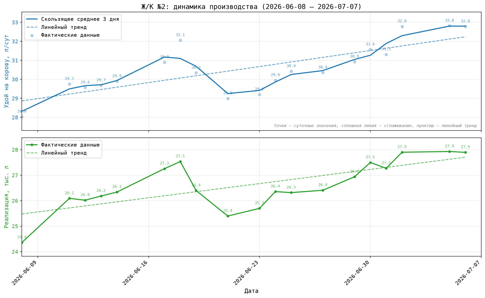
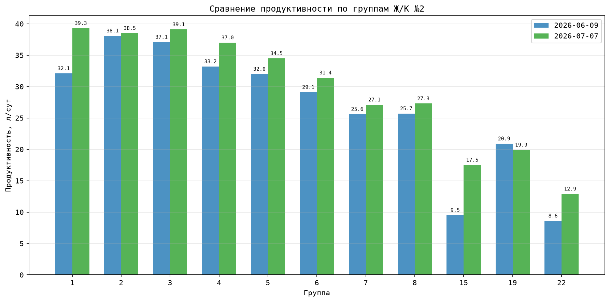
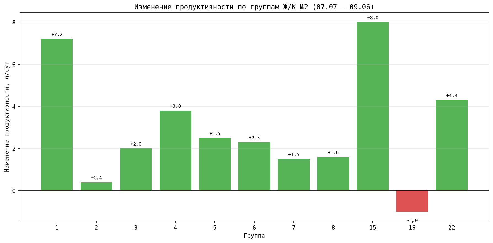

# Отчёт по производственным показателям Ж/К №2

**Период:** 08.06.2026 — 07.07.2026  
**Дата отчёта:** 07.07.2026  
**Объект:** Ж/К №2 (Зенченко)

---

## Резюме

- **Продуктивность выросла с 28,0 до 32,8 л/сут** — прирост **+4,7 л/сут** за месяц. По итоговому значению Ж/К №2 сравнялся с Ж/К №1 (32,8 против 32,7 л/сут).
- **Реализация молока увеличилась с 24,4 до 27,9 тыс. л/сут** — прирост **+3,5 тыс. л/сут**.
- **Дойное поголовье стабильно:** в среднем 870 голов (диапазон 851–882).
- **По группам рост продуктивности зафиксирован в 10 из 11 групп.** Исключение — группа 19 (−1,0 л/сут).
- **Группы 15, 19, 22** значительно отстают по продуктивности (8,6–20,9 л/сут) и, вероятно, требуют отдельного разбора как специальные/переходные группы.

---

## 1. Динамика производства

За отчётный период на Ж/К №2 зафиксирован устойчивый рост продуктивности. Средний удой на корову составил **30,6 л/сут**, минимальный — 28,0 л/сут (08.06), максимальный — 32,8 л/сут (07.07).

| Показатель | Начало периода | Конец периода | Изменение |
|---|---:|---:|---:|
| Удой на корову, л/сут | 28,0 | 32,8 | **+4,7** |
| Реализация молока, тыс. л/сут | 24,4 | 27,9 | **+3,5** |
| Дойные головы, гол. | — | — | 870 в среднем |

*Рис. 1. Динамика удоя на корову и реализации молока на Ж/К №2. Сплошная линия — скользящее среднее за 3 дня, пунктир — линейный тренд, точки — фактические суточные данные.*

**Вывод:** тренд продуктивности восходящий. Рост реализации молока опережает рост удоя на корову, что связано с увеличением дойного поголовья и/или улучшением сборосдаточных показателей.

---

## 2. Анализ продуктивности по группам

В разрезе групп наблюдается типичная кривая лактации: максимальная продуктивность у групп с низким DIM (1–3, 37–98 дней), далее происходит плавное снижение по мере роста DIM.

### 2.1. Сравнение продуктивности групп на две даты

*Рис. 2. Сравнение продуктивности по группам на 09.06.2026 и 07.07.2026.*

### 2.2. Изменение продуктивности групп за период

*Рис. 3. Изменение продуктивности по группам (07.07.2026 − 09.06.2026).*

### 2.3. Детализация по группам

| Группа | DIM 09.06 | Удой 09.06, л/сут | DIM 07.07 | Удой 07.07, л/сут | Изменение, л/сут |
|---:|---:|---:|---:|---:|---:|
| 1 | 20 | 32,1 | 37 | 39,3 | **+7,2** |
| 2 | 53 | 38,1 | 63 | 38,5 | +0,4 |
| 3 | 104 | 37,1 | 98 | 39,1 | +2,0 |
| 4 | 165 | 33,2 | 163 | 37,0 | **+3,8** |
| 5 | 211 | 32,0 | 212 | 34,5 | +2,5 |
| 6 | 240 | 29,1 | 249 | 31,4 | +2,3 |
| 7 | 308 | 25,6 | 315 | 27,1 | +1,5 |
| 8 | 339 | 25,7 | 326 | 27,3 | +1,6 |
| 15 | 25 | 9,5 | 189 | 17,5 | **+8,0** |
| 19 | 202 | 20,9 | 216 | 19,9 | **−1,0** |
| 22 | 358 | 8,6 | 351 | 12,9 | **+4,3** |

**Ключевые находки:**

- **Группа 1** — лидер по абсолютной продуктивности (39,3 л/сут) и одна из лучших по приросту (+7,2 л/сут). Пик лактации используется эффективно.
- **Группа 15** — резкий рост (+8,0 л/сут), но с очень низкой базы (9,5 → 17,5 л/сут). Требует проверки: возможно, это вновь отельная группа или группа после болезни.
- **Группа 19** — единственная группа с отрицательной динамикой (−1,0 л/сут). Необходим разбор причин: здоровье, рацион, генетика, условия содержания.
- **Группа 22** — низкая продуктивность (12,9 л/сут) при высоком DIM (351 день). Вероятно, группа на заключительной стадии лактации или готовящаяся к сухостою.

---

## 3. Сравнение с Ж/К №1

| Показатель (07.07.2026) | Ж/К №2 | Ж/К №1 | Разница |
|---:|---:|---:|---:|
| Удой на корову, л/сут | 32,8 | 32,7 | +0,1 |
| Реализация молока, тыс. л/сут | 27,9 | 18,0 | **+9,9** |

Ж/К №2 по продуктивности на корову практически сравнялся с Ж/К №1, но значительно превосходит его по общей реализации молока за счёт большего поголовья и более высокой сборосдаточности.

---

## 4. Риски и точки внимания

1. **Группа 19** — снижение продуктивности. Требуется ветеринарный и зоотехнический аудит.
2. **Группы 15 и 22** — аномально низкая продуктивность относительно DIM. Необходимо подтвердить статус этих групп (сухостой, отёл, оздоровительная группа).
3. **Дойное поголовье** — за последние дни июня в исходных данных зафиксировано резкое снижение численности (до ~850 голов). Нужно проверить корректность данных или причины выбытия.
4. **Зависимость от групп с высоким DIM** — группы 7, 8, 22 (DIM > 300) имеют пониженную продуктивность, что соответствует физиологии, но требует планирования сухостоя.

---

## 5. Рекомендации

1. **Провести разбор группы 19** — причины снижения продуктивности (−1,0 л/сут). Проверить рацион, заболеваемость маститом/кетозом, точность доения.
2. **Уточнить статус групп 15 и 22** — если это не лактирующие группы, вынести их в отдельный раздел отчёта или исключить из сравнения с основным стадом.
3. **Сохранить практики группы 1** — достижение 39,3 л/сут при росте на +7,2 л/сут указывает на успешный менеджмент раннего периода лактации.
4. **Проверить данные по поголовью** за 01–07 июля 2026 года на предмет резких выбытий.
5. **Продолжить мониторинг динамики** в еженедельном режиме, особенно по группам с DIM 150–250 дней (группы 4–6), где потенциал стабилизации продуктивности наиболее значим.

---

*Отчёт подготовлен на основе данных файлов `Зенченко Динамика производства.xlsx` и `Группы.xlsx`.*
