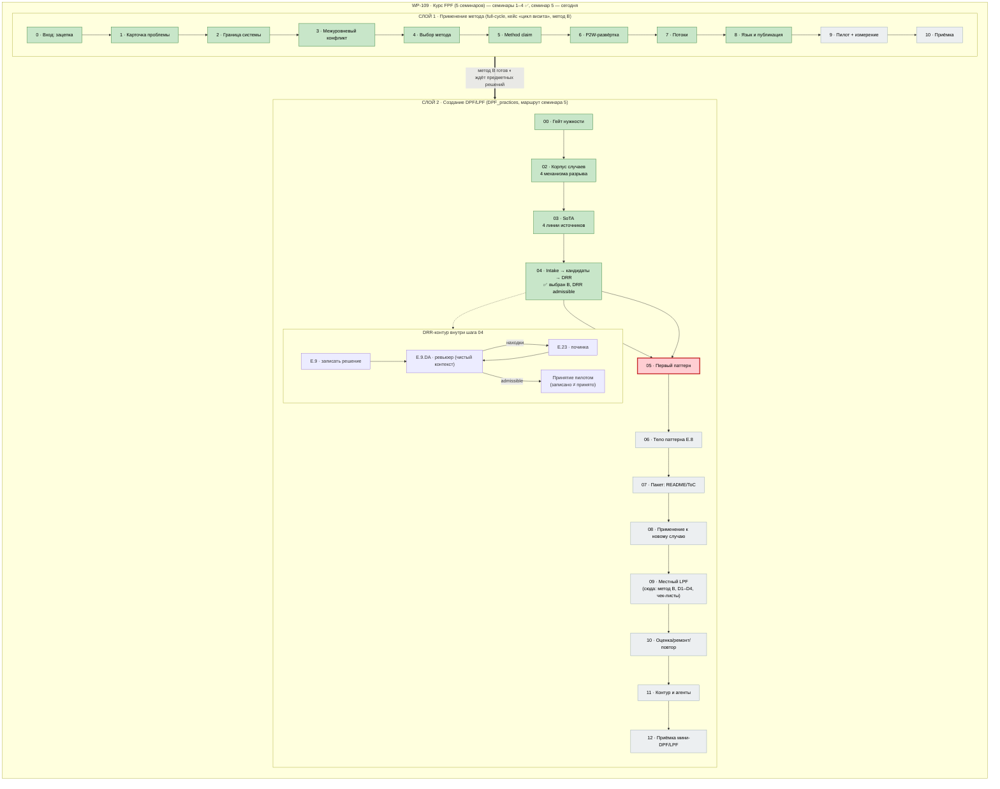

# Карта работы FPF — где мы находимся

> Открывать в VS Code (preview) или на GitHub — схема рендерится.
> Обновлять при переходе шага: переставить маркер `YOU` и классы статусов.

## Легенда

| Цвет | Значение |
|---|---|
| 🟩 зелёный | шаг пройден и принят |
| 🟨 жёлтый | на приёмке у пилота |
| 🟥 красный | **текущая позиция** |
| ⬜ серый | впереди |

## Текущее состояние одним взглядом

- **Слой 1 (применение):** шаги 0–8 пройдены, все ◐ на приёмке; метод B готов, ждёт твои предметные решения (список допуска D1, форма сигнала, эскалация) → потом шаг 9 (пилот, замер базовой линии).
- **Слой 2 (создание DPF):** гейт пройден, корпус из 4 случаев принят, SoTA из 4 линий — **на твоей приёмке** (`03-sota.md`).
- **Следующий шаг — 04:** самый важный в маршруте: кандидаты архитектуры DPF → **ты выбираешь** → агент записывает DRR → независимый ревьюер проверяет по E.9.DA → петля починки → твоё принятие.

## Куда что ложится (напоминание)

- **DPF** (переносимое ядро): различения «4 механизма разрыва цикла визита», способ распознавания, граница near-miss «ждали анализы кормов».
- **LPF отдела** (местная практика): метод B, список допуска D1, форма сигнала, чек-листы ролей (будущий РП — решение на Strategy Session W33).
- **DRR:** нужен только на шаге 04 слоя 2 (авторинг); в слое 1 не нужен («инструмент автора, не пользователя»).

---

*Обновляется вручную при смене шага. Файлы шагов — в этой же папке (`NN-*.md`), гайды — `docs/fpf/FPF_practical/`.*
