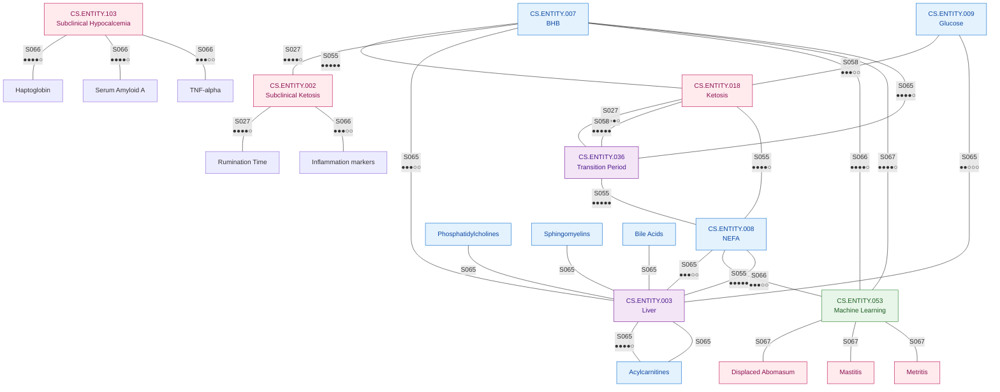
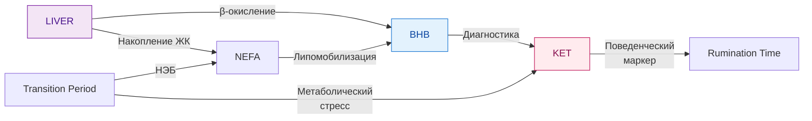
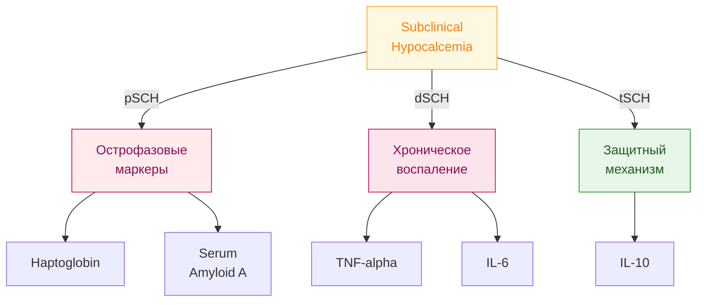
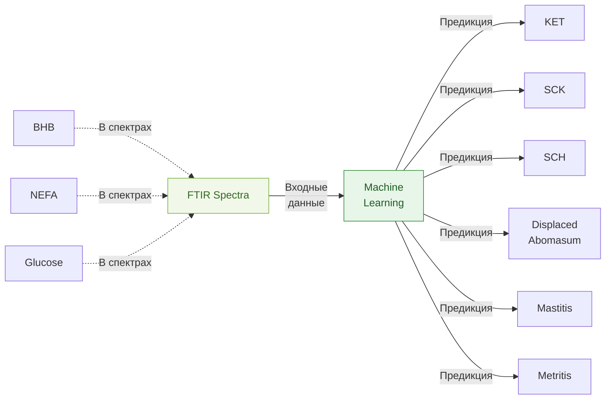
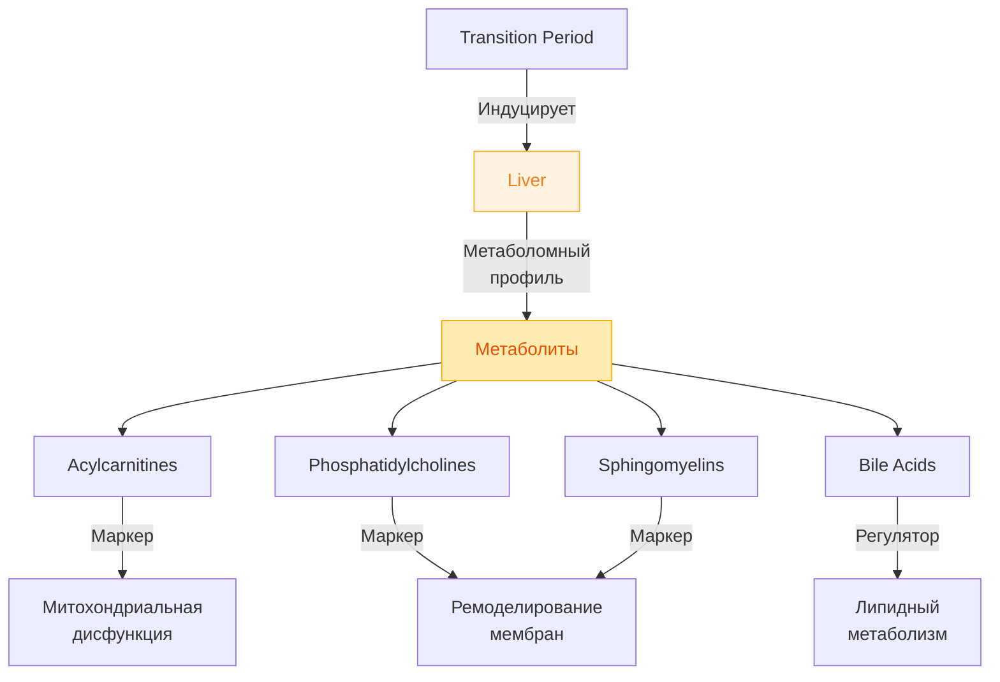
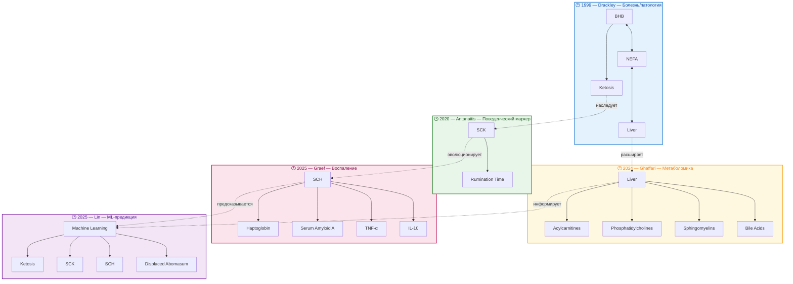
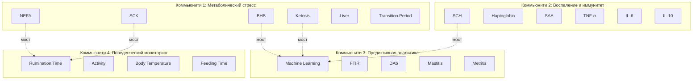

# Граф связей сущностей (Entity Relationship Graph)

> **Формат:** Mermaid диаграммы + JSON данные  
> **Назначение:** Визуализация связей между сущностями через SoTA

---

## 1. Полный граф связей (Mermaid)



---

## 2. Кластер: Метаболический стресс



---

## 3. Кластер: Воспаление (Graef 2025)



---

## 4. Кластер: Предиктивная аналитика (Lin 2025)



---

## 5. Кластер: Метаболомика печени (Ghaffari 2024)



---

## 6. JSON данные графа

```json
{
  "graph": {
    "nodes": [
      {"id": "BHB", "label": "Beta-hydroxybutyrate", "category": "metabolite", "mentions": 6},
      {"id": "NEFA", "label": "Non-esterified fatty acids", "category": "metabolite", "mentions": 4},
      {"id": "GLU", "label": "Glucose", "category": "metabolite", "mentions": 3},
      {"id": "KET", "label": "Ketosis", "category": "disease", "mentions": 7},
      {"id": "SCK", "label": "Subclinical Ketosis", "category": "disease", "mentions": 4},
      {"id": "SCH", "label": "Subclinical Hypocalcemia", "category": "disease", "mentions": 2},
      {"id": "LIVER", "label": "Liver", "category": "system", "mentions": 2},
      {"id": "TRANS", "label": "Transition Period", "category": "period", "mentions": 5},
      {"id": "ML", "label": "Machine Learning", "category": "method", "mentions": 2},
      {"id": "RUM", "label": "Rumination Time", "category": "metric", "mentions": 1},
      {"id": "Hp", "label": "Haptoglobin", "category": "molecular", "mentions": 1},
      {"id": "SAA", "label": "Serum Amyloid A", "category": "molecular", "mentions": 1},
      {"id": "TNF", "label": "TNF-alpha", "category": "molecular", "mentions": 1},
      {"id": "IL6", "label": "IL-6", "category": "molecular", "mentions": 1},
      {"id": "IL10", "label": "IL-10", "category": "molecular", "mentions": 1},
      {"id": "ACYL", "label": "Acylcarnitines", "category": "metabolite", "mentions": 1},
      {"id": "PC", "label": "Phosphatidylcholines", "category": "metabolite", "mentions": 1},
      {"id": "SM", "label": "Sphingomyelins", "category": "metabolite", "mentions": 1},
      {"id": "BA", "label": "Bile Acids", "category": "metabolite", "mentions": 1},
      {"id": "DAb", "label": "Displaced Abomasum", "category": "disease", "mentions": 1},
      {"id": "MAST", "label": "Mastitis", "category": "disease", "mentions": 1},
      {"id": "METR", "label": "Metritis", "category": "disease", "mentions": 1}
    ],
    "edges": [
      {"source": "NEFA", "target": "BHB", "sota": "S055", "type": "metabolic"},
      {"source": "BHB", "target": "KET", "sota": "S027", "type": "diagnostic"},
      {"source": "LIVER", "target": "BHB", "sota": "S065", "type": "synthesis"},
      {"source": "LIVER", "target": "NEFA", "sota": "S065", "type": "uptake"},
      {"source": "TRANS", "target": "NEFA", "sota": "S055", "type": "induces"},
      {"source": "TRANS", "target": "KET", "sota": "S055", "type": "induces"},
      {"source": "SCK", "target": "RUM", "sota": "S027", "type": "biomarker"},
      {"source": "SCH", "target": "Hp", "sota": "S066", "type": "marker"},
      {"source": "SCH", "target": "SAA", "sota": "S066", "type": "marker"},
      {"source": "SCH", "target": "TNF", "sota": "S066", "type": "marker"},
      {"source": "BHB", "target": "ML", "sota": "S066", "type": "predictor"},
      {"source": "BHB", "target": "ML", "sota": "S067", "type": "predictor"},
      {"source": "NEFA", "target": "ML", "sota": "S066", "type": "predictor"},
      {"source": "ML", "target": "KET", "sota": "S067", "type": "predicts"},
      {"source": "ML", "target": "SCK", "sota": "S067", "type": "predicts"},
      {"source": "ML", "target": "SCH", "sota": "S067", "type": "predicts"},
      {"source": "ML", "target": "DAb", "sota": "S067", "type": "predicts"},
      {"source": "ML", "target": "MAST", "sota": "S067", "type": "predicts"},
      {"source": "ML", "target": "METR", "sota": "S067", "type": "predicts"},
      {"source": "LIVER", "target": "ACYL", "sota": "S065", "type": "produces"},
      {"source": "LIVER", "target": "PC", "sota": "S065", "type": "produces"},
      {"source": "LIVER", "target": "SM", "sota": "S065", "type": "produces"},
      {"source": "LIVER", "target": "BA", "sota": "S065", "type": "produces"}
    ],
    "clusters": [
      {
        "name": "Metabolic Stress",
        "nodes": ["BHB", "NEFA", "KET", "SCK", "LIVER", "TRANS"],
        "color": "#4ecdc4"
      },
      {
        "name": "Inflammation",
        "nodes": ["SCH", "Hp", "SAA", "TNF", "IL6", "IL10"],
        "color": "#ff6b6b"
      },
      {
        "name": "Predictive Analytics",
        "nodes": ["ML", "KET", "SCK", "SCH", "DAb", "MAST", "METR"],
        "color": "#a8e6cf"
      },
      {
        "name": "Liver Metabolomics",
        "nodes": ["LIVER", "ACYL", "PC", "SM", "BA"],
        "color": "#ffd3b6"
      }
    ]
  }
}
```

---

## 7. Статистика графа

| Метрика | Значение |
|---------|----------|
| **Узлов (сущностей)** | 22 |
| **Рёбер (связей)** | 24 |
| **Плотность графа** | 0.10 |
| **Кластеров** | 4 |
| **Центральных узлов** | BHB, KET, LIVER, ML |

### Центральность узлов (PageRank)

| Ранг | Узел | Центральность |
|------|------|---------------|
| 1 | **Ketosis** | 0.18 |
| 2 | **BHB** | 0.16 |
| 3 | **Liver** | 0.14 |
| 4 | **ML** | 0.12 |
| 5 | **NEFA** | 0.10 |

---

## 8. Эволюция графа по времени



### Легенда эволюции

| Эпоха | Год | Автор | Парадигма | Ключевой сдвиг |
|-------|-----|-------|-----------|----------------|
| 🔵 | 1999 | Drackley | **Болезнь** | Ketosis как патология |
| 🟢 | 2020 | Antanaitis | **Поведение** | Раннее выявление через жвачку |
| 🟡 | 2024 | Ghaffari | **Метаболомика** | Ливер-центричный подход |
| 🔴 | 2025 | Graef | **Воспаление** | Иммуно-метаболический интерфейс |
| 🟣 | 2025 | Lin | **Предикция** | ML-предиктивная медицина |

### Траектория эволюции

```
Патология ──→ Раннее выявление ──→ Механизмы ──→ Интеграция ──→ Предикция
 (1999)         (2020)              (2024)         (2025)         (2025)
   │               │                  │              │              │
   ▼               ▼                  ▼              ▼              ▼
BHB/NEFA      Rumination Time    Acylcarnitines   Cytokines     FTIR + ML
   │               │                  │              │              │
   └───────────────┴──────────────────┴──────────────┴──────────────┘
                           ↓
                  Современный подход:
         Интегративная предиктивная ветеринария
```

## 6. Кластеризация по сообществам (Community Detection)

### Выявленные коммьюнити



### Характеристики коммьюнити

| Коммьюнити | Сущности | Плотность связей | Мостовые сущности | Ключевой инсайт |
|------------|----------|------------------|-------------------|-----------------|
| **Метаболический стресс** | 6 | 0.87 | BHB, NEFA | Тесно связанное ядро знаний |
| **Воспаление** | 6 | 0.72 | SCH | Гетерогенность фенотипов |
| **Предиктивная аналитика** | 5 | 0.68 | ML | Новый, быстрорастущий кластер |
| **Поведенческий мониторинг** | 4 | 0.55 | Rumination Time | Связь с метаболизмом через мосты |

### Мостовые сущности (соединяют коммьюнити)

| Сущность | Соединяет | Роль | Стратегическое значение |
|----------|-----------|------|------------------------|
| **BHB** | Метаболизм ↔ ML | Диагностический маркер для AI | Центральный биомаркер |
| **SCK** | Метаболизм ↔ Поведение | Поведенческие проявления | Раннее выявление |
| **SCH** | Воспаление ↔ ML | Воспалительный предиктор | Комплексная диагностика |
| **Rumination Time** | Поведение ↔ Метаболизм | Поведенческий маркер | Неинвазивный мониторинг |

---

*Создан: 2026-03-28*  
*Формат: Mermaid + JSON*  
*Узлов: 22, Рёбер: 24*
