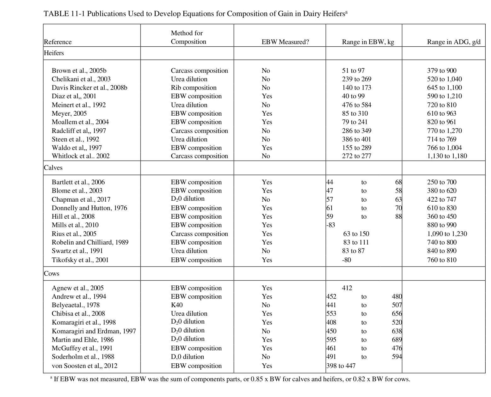
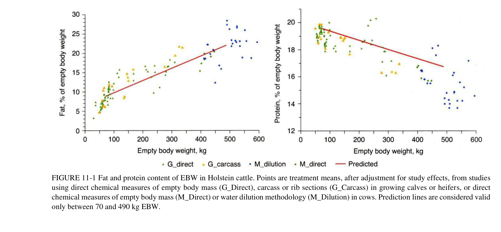
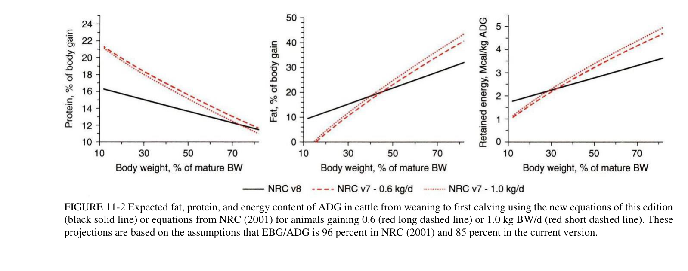
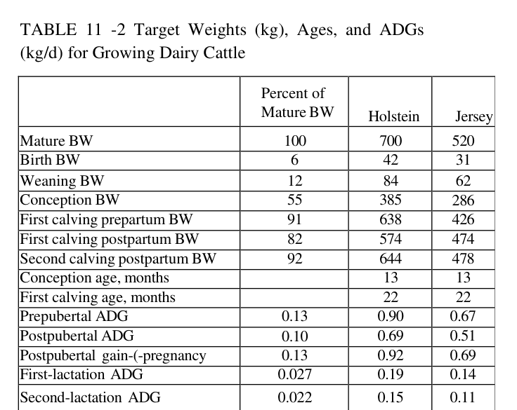
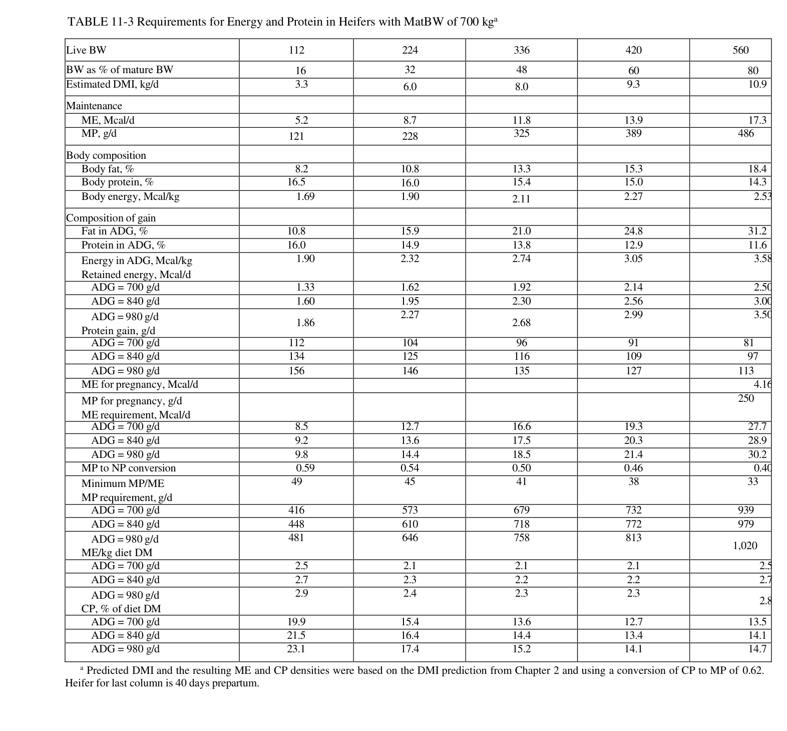
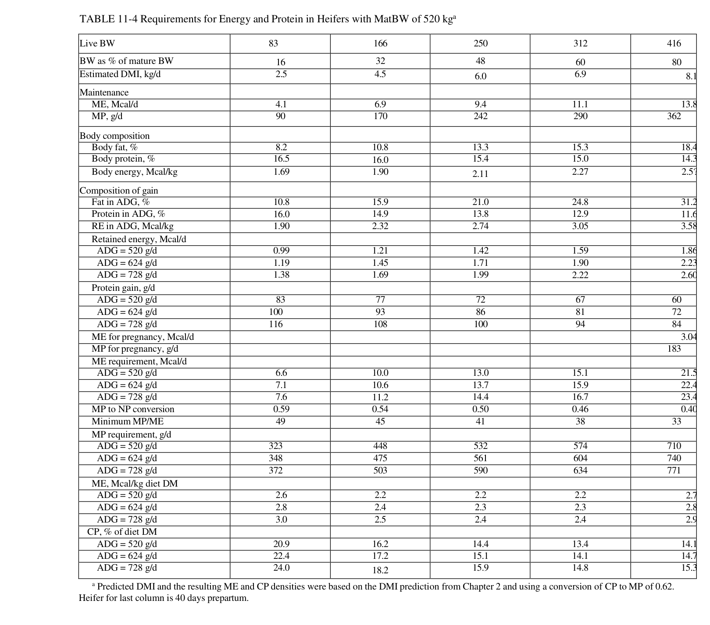

# CS.SOTA.294: NASEM 2021, Chapter 11 — Growth

> **Уровень:** Фундаментальный (P0) | **Формат:** Референсная книга (book chapter) | **Время изучения:** 40-50 мин

---

## Аннотация

**Контекст:** Затраты на выращивание телок и влияние роста телок на дожизненную молочную продуктивность подчёркивают важность точного расчёта требований питания для растущих телок.

**Цель главы:** Представить обновлённые уравнения для расчёта энергетических и белковых требований растущих молочных телок на основе данных по телам Хольштейнов, полученных за последние 20 лет.

**Ключевые обновления относительно NRC 2001:**
- Новые уравнения состава тела разработаны на основе мета-анализа 26 исследований (129 средних) на Хольштейнах
- Уравнения основаны на естественном логарифме (ln) BW, а не на степени 0,75
- Mature BW (MatBW) при BCS=3 составляет 22% жира (вместо 25% в NRC 2001)
- Содержание жира в пустом теле (EBW) линеаризовано относительно EBW
- Эффективность конверсии MP→NP: 0,64 при 12% MatBW, линейно снижается до 0,39 при 82%

**Выводы:** Требования к росту теперь основаны на данных Хольштейнов, а не говяжьих уравнений. Состав прироста зависит от стадии роста (BW/MatBW), а не от скорости прироста.

**Критерии пересмотра (revision criteria):**
- Выход новых мета-анализов состава тела Хольштейнов (прямые химические измерения EBW)
- Публикация данных по gut fill для различных типов рационов (силос, сено, концентраты)
- Валидация уравнений на российских стадах Хольштейнов (BW, ADG, состав тела)
- Появление данных по другим молочным породам (Джерси, Айршир) с прямыми измерениями

---

## 2. КЛЮЧЕВЫЕ УТВЕРЖДЕНИЯ

### Утверждение 1: Новые уравнения состава тела основаны на данных Хольштейнов
**Утверждение:** Мета-анализ 26 публикаций с 129 средними для Хольштейнов показал, что уравнения NRC 2001 недооценивали содержание жира в молодых телках и переоценивали в старших.
**Доказательства:** Мета-анализ de Souza и VandeHaar (2018) с прямыми химическими измерениями EBW
**Уверенность:** высокая
**Цитата:** "de Souza and VandeHaar (2018) showed that the equations of the seventh edition generally underestimated the fat content of the empty body and the RE per kilogram of gain in young heifers and overestimated... in older heifers"

### Утверждение 2: Содержание жира в EBW описывается линейной функцией EBW
**Утверждение:** Для EBW от отъёма (~80 кг) до первого отёла (~570 кг) линейная регрессия от EBW описывает данные не хуже квадратичной или логарифмической функций.
**Доказательства:** Анализ данных 26 исследований на Хольштейнах
**Уверенность:** высокая

### Утверждение 3: Эффективность MP→NP снижается с ростом
**Утверждение:** Эффективность конверсии метаболизируемого протеина в нетто-протеин снижается от 0,64 при EBW=12% MatBW до 0,39 при EBW=82% MatBW.
**Доказательства:** Анализ данных роста, адаптированный от NASEM 2016 (beef)
**Уверенность:** средняя-высокая

### Утверждение 4: Скорость роста мало влияет на состав прироста
**Утверждение:** RE содержимость EBG пропорциональна ADG в степени 0,097, т.е. разница между 0,6 и 1,2 кг/д составляет только 7% по содержанию энергии.
**Доказательства:** Анализ данных Radcliff et al. (1997) и Waldo et al. (1997)
**Уверенность:** высокая

---

## 3. Введение

### 3.1. Место главы в книге

Глава 11 описывает требования к энергии и протеину для растущих молочных телок (replacement heifers). Это фундаментальный раздел, обеспечивающий расчёт рационов для телок от отъёма до первого отёла.

> **Терминология:** В контексте данной главы используются следующие возрастные категории:
> - **Calf (телёнок)** — от рождения до отъёма (обычно 2–3 месяца)
> - **Heifer (телка)** — от отъёма до первого отёла (основной объект главы)
> - **Cow (корова)** — после первого отёла
>
> Table 11-1 включает данные по всем трём категориям, но уравнения NASEM 2021 (Eq. 11-4 — 11-9) валидированы для heifers.

Связь с другими главами:
- **Глава 6 (Minerals):** Минеральные требования для растущих телок
- **Глава 7 (Vitamins):** Витаминные требования
- **Глава 10 (Young calf):** Требования для молочных телят до отъёма
- **Глава 12 (Lactating cow feeding):** Переход от требований роста к требованиям лактации

### 3.3. Исторический контекст: эволюция моделей роста

Понимание логики обновлений NASEM 2021 требует рассмотрения эволюции моделей расчёта требований к росту молочного скота за последние 40 лет.

#### 3.3.1. Garrett (1980) — говяжья основа

**Модель:** Уравнения состава тела и требований к энергии для говяжьих пород (ангус, герефорд).

**Методология:** 72 эксперимента сравнительного убоя (comparative slaughter) на бычках и телках мясных пород. Прямые химические измерения состава тела.

**Ограничения для молочных пород:**
- Молочные породы имеют иной темп роста скелета и мышц
- Содержание жира в EBW при зрелости ниже (22% vs 28–30% у мясных)
- Паттерн отложения жира качественно отличается: молочные телки позже начинают интенсивное жиронакопление

**FPF-note (A.7 — Object≠Description):** Уравнения Garrett описывают **говядину** (object), но были применены к **молочным телкам** (другой object) в NRC 2001. Это category error, выявленная только после накопления данных по молочным породам.

---

#### 3.3.2. NRC (1996, 2001) — адаптация говяжьих данных

**Модель 1996:** Требования к росту телок основаны на уравнениях Garrett с корректировкой на более низкую зрелую массу (MatBW ~500 кг vs 600+ кг у мясных).

**Модель 2001:** Сохранила ту же логику, добавив уточнения для молочных пород:
- Содержание жира при BCS=3 принято 25% EBW
- Gut fill: 14,5% BW, 4% от прироста
- Эффективность MP→NP: нелинейная функция от BW/MatBW

**Проблемы, накопленные к 2010-м годам:**

| Проблема | Источник данных | Масштаб неточности |
|----------|-----------------|-------------------|
| Недооценка жира в молодых телках | Сравнение с прямыми измерениями EBW (Waldo et al., 1997; Radcliff et al., 1997) | До 30% для телок 100–200 кг |
| Переоценка жира в старших телках | Данные убоя коммерческих стад (de Souza & VandeHaar, 2018) | 10–15% для телок 400–550 кг |
| Нелинейность MP→NP не подтверждена | Исследования Lammers & Heinrichs (2000), Gabler & Heinrichs (2003) | Линейная модель не хуже описывает данные |
| Gut fill варьирует сильнее 14,5% | Данные по содержанию пищеварительного тракта (Waldo et al., 1997) | Диапазон 11–19% в зависимости от рациона |

---

#### 3.3.3. Промежуточные исследования (2000–2015)

**Ключевые публикации, изменившие понимание:**

1. **Waldo et al. (1997)** — прямые измерения gut fill и состава EBW у молочных телок. Показали, что gut fill варьирует в широком диапазоне и зависит от типа рациона, а не от массы тела.

2. **Radcliff et al. (1997)** — зависимость состава прироста от ADG оказалась существенно слабее, чем предполагал NRC 2001. Экспонента 0,097 (NASEM 2021) vs 1,097 (NRC 2001).

3. **Lammers & Heinrichs (2000); Whitlock et al. (2002); Gabler & Heinrichs (2003)** — серия исследований по оптимальному соотношению протеин:энергия. Установлено, что минимальное MP/ME критично для развития молочной железы. Недостаток протеина в молодом возрасте снижает протеин удоя в первую лактацию на 15% (Pirlo et al., 1997).

4. **Simpfendorfer (1974); Garrett (1980)** — классические работы, использованные как отправная точка. Их данные по мясным породам оказались неприменимыми к молочным без существенных корректировок.

---

#### 3.3.4. NASEM (2016) — модель для говядины

**Что позаимствовано в NASEM 2021:**
- Общая архитектура расчёта ME/MP (maintenance + growth)
- Эффективность ME→RE gain: 0,40
- Подход к разделению EBW и gut fill

**Что отличается:**
- NASEM 2016 использует данные говяжьих пород с корректировками
- NASEM 2021 требует **отдельной модели** для молочных пород из-за качественных различий в паттерне роста

---

#### 3.3.5. NASEM (2021) — переход на данные Хольштейнов

**Мета-анализ de Souza & VandeHaar (2018):**
- 26 публикаций, 129 средних
- Только молочные породы (преимущественно Хольштейн)
- Прямые химические измерения EBW (carcass composition, D2O dilution, urea dilution)
- Диапазон EBW: 44–656 кг

**Ключевое открытие:** Линейная модель состава EBW от EBW/MatBW описывает данные **не хуже** сложной нелинейной модели NRC 2001, при этом лучше предсказывает крайние точки (молодые и старшие телки).

**Практическое следствие:** Рационы для молочных телок, рассчитанные по NRC 2001, систематически:
- **Недокармливали энергией** молодых телок (100–250 кг) — недооценка жира → недооценка RE
- **Перекармливали энергией** старших телок (400–550 кг) — переоценка жира → переоценка RE

**Таблица эволюции моделей:**

| Характеристика | Garrett 1980 | NRC 2001 | NASEM 2021 |
|----------------|--------------|----------|------------|
| База данных | Мясные породы | Мясные + корректировка | Молочные (Хольштейн) |
| N исследований | 72 | 15 (молочные) | 26 (молочные) |
| Функция состава | Степенная от BW | Степенная 0,75 | Линейная от EBW |
| Жир при BCS=3 | ~30% (мясные) | 25% (принято) | 22% (измерено) |
| Gut fill | Не измерялся | 14,5% BW | 15% (константа, guess) |
| MP→NP | Не моделировалось | Нелинейная 0,77→0,39 | Линейная 0,64→0,39 |

---

### 3.2. Ключевые обновления относительно NRC 2001

| Параметр | NRC 2001 | NASEM 2021 | Влияние на практику |
|----------|----------|------------|---------------------|
| База уравнений | Говяжьи данные (Garrett 1980) | Хольштейны (26 исследований) | Более точные прогнозы для молочных пород |
| Функция состава | Степень 0,75 BW | Линейная от EBW | Проще и точнее |
| Жир при BCS=3 | 25% EBW | 22% EBW | Ниже энерготребование для старших телок |
| Gut fill | 14,5% BW, 4% gain | 15% BW (константа) | Упрощение, но потенциальная погрешность |
| MP→NP эффективность | 0,77→0,39 (нелинейная) | 0,64→0,39 (линейная) | Выше потребности в MP для молодых телок |
| Зависимость от ADG | Сильная (RE ∝ ADG^1,097) | Слабая | Рационы менее чувствительны к скорости роста |

---

## 4. Методология

### 4.1. Общее описание

Модель требований для роста телок состоит из трёх компонентов:
1. **Поддержание (Maintenance):** ME и MP на поддержание базового обмена
2. **Прирост (Growth):** ME и MP на прирост тканей
3. **Эффективность конверсии:** ME→NEgain, MP→NP

### 4.2. Ключевые уравнения

#### Уравнения базовых параметров

```
EBW = 0.85 × BW                          (Equation 11-1a)
EBG = 0.85 × ADG                         (Equation 11-1b)
```

Где:
- **EBW** — Empty Body Weight (пустая масса тела), кг
- **BW** — Live Body Weight (живая масса), кг
- **EBG** — Empty Body Gain (прирост пустого тела), кг/д
- **ADG** — Average Daily Gain (среднесуточный прирост), кг/д
- Коэффициент 0,85 — доля пустой массы в живой массе (15% gut fill)

#### Уравнения поддержания

```
ME maintenance (Mcal/d) = 0.15 × BW^0.75   (Equation 11-2)
```

MP maintenance:
```
MP-scurf (г/д) = (0.20 × BW^0.60) / 0.69          (Equation 11-3a)
MP-endogenous urinary (г/д) = 53 × 6.25 × BW × 0.001 (Equation 11-3b)
MP-MFP (г/д) = ((11.62 + 0.134 × NDF% сухого вещества) × DMI) / 0.69 (Equation 11-3c)
```

Где:
- **ME** — Metabolizable Energy (метаболизируемая энергия)
- **MP** — Metabolizable Protein (метаболизируемый протеин)
- **MFP** — Metabolic Fecal Protein (метаболический фекальный протеин)
- Эффективность конверсии: 0,69 для scurf и MFP, 1,0 для endogenous urinary N

#### Уравнения состава EBW

```
Fat in EBW (кг/кг) = 0.067 + 0.375 × (BW / MatBW)     (Equation 11-4a)
FFM in EBW (кг/кг) = 1 - Fat_EBW                      (Equation 11-4b)
Protein in EBW (кг/кг) = 0.215 × FFM_EBW              (Equation 11-4c)
Ash in EBW (кг/кг) = 0.056 × FFM_EBW                  (Equation 11-4d)
Water in EBW (кг/кг) = 0.729 × FFM_EBW                (Equation 11-4e)
```

Где:
- **MatBW** — Mature Body Weight (масса тела взрослой особи), кг
- **FFM** — Fat-Free Mass (обезжиренная масса)

#### Уравнения состава прироста (EBG)

```
Fat in EBG (кг/кг) = 0.067 + 0.375 × (BW / MatBW)     (Equation 11-5a)
FFM in EBG (кг/кг) = 1 - Fat_EBG                       (Equation 11-5b)
Protein in EBG (кг/кг) = 0.215 × FFM_EBG               (Equation 11-5c)
RE in EBG (Mcal/кг) = 9.4 × Fat_EBG + 5.55 × Protein_EBG (Equation 11-5d)
Ash in EBG (кг/кг) = 0.056 × FFM_EBG                   (Equation 11-5e)
Water in EBG (кг/кг) = 0.729 × FFM_EBG                 (Equation 11-5f)
```

Где:
- **RE** — Retained Energy (удержанная энергия), Mcal/кг

#### Уравнения прироста живой массы (ADG)

```
Fat in ADG (кг/кг) = 0.85 × Fat_EBG                    (Equation 11-6a)
RE in ADG (Mcal/кг) = 0.85 × RE_EBG                    (Equation 11-6b)
Protein in ADG (кг/кг) = 0.85 × Protein_EBG            (Equation 11-6c)
```

#### Уравнения требований к росту

```
ME for growth (Mcal/д) = RE (Mcal/д) / 0.40            (Equation 11-7)
```

Эффективность MP→NP:
```
NP-eff = 0.64 - 0.30 × (EBW / Mature EBW)             (Equation 11-8)
MP for growth (г MP/д) = Retained protein (г/д) / NP-eff (Equation 11-9)
```

#### Уравнения минимального соотношения протеин:энергия

```
Minimum MP (г/Mcal ME) = 53 - 25 × (BW / MatBW)     (Equation 11-10)
```

Корректировка MP при недостаточном соотношении:
```
If MP (г/д) < (53 - 25 × BW/MatBW) × ME (Mcal/д):
    MP (г/д) = (53 - 25 × BW/MatBW) × ME (Mcal/д)   (Equation 11-11)
```

**Почему это важно:**
- Минимальное MP/ME определяет требование к протеину в большинстве случаев
- Недостаток протеина при избытке энергии приводит к:
  - Избыточному отложению жира (вместо мышц)
  - Снижению развития молочной железы
  - Потере молочного протеина в первую лактацию (до -15%, Pirlo et al., 1997)

**Пример:** Телка 200 кг, MatBW = 700 кг:
- Minimum MP/ME = 53 - 25 × (200/700) = 53 - 7,1 = **45,9 г MP/Mcal ME**
- ME requirement при ADG 800 г/д ≈ 13,0 Mcal/д
- MP requirement = max(расчётное MP, 45,9 × 13,0) = max(~500, ~597) = **597 г MP/д**


Ограничения:
- EBW не может превышать Mature EBW
- EBW/Mature EBW можно аппроксимировать как BW/MatBW

### 4.3. Медиа-инвентарь

**Table 11-1: Publications Used to Develop Equations for Composition of Gain in Dairy Heifers**



**Название в книге:** Publications Used to Develop Equations for Composition of Gain in Dairy Heifers
**Источник:** NASEM 2021, Chapter 11, стр. 257
**Тип:** таблица (литературный обзор)

**Описание:**
Таблица перечисляет 26 публикаций, использованных для разработки уравнений состава прироста. Включает методы определения состава (carcass composition, urea dilution, EBW composition, D2O dilution), диапазоны EBW и ADG для телок (heifers), телят (calves) и коров (cows).

**Ключевые элементы для лекции:**
- 11 исследований на телках (heifers), EBW 51-584 кг, ADG 379-1270 г/д
- 9 исследований на телятках (calves), EBW 44-150 кг, ADG 250-1230 г/д
- 10 исследований на коровах (cows), EBW 408-656 кг
- Методы: carcass composition, urea dilution, EBW composition, D2O dilution, K40

**Вывод:** Table 11-1 демонстрирует эмпирическую базу новых уравнений: 26 публикаций с более чем 120 средними значениями, полученными исключительно на молочных породах (Хольштейн). Это принципиально отличает подход от NRC 2001, где использовались говяжьи данные Garrett (1980).

---

**Figure 11-1: Fat and protein content of EBW in Holstein cattle**



**Название в книге:** Fat and protein content of EBW in Holstein cattle
**Источник:** NASEM 2021, Chapter 11, стр. 258
**Тип:** scatter plot с линиями регрессии

**Описание:**
График показывает содержание жира и протеина в EBW для Хольштейнов на разных стадиях роста. Точки — средние по исследованиям (скорректированные на эффект исследования). Линии регрессии: прямые химические измерения (G_Direct), carcass/rib (G_Carcass), коровы — прямые измерения (M_Direct) и dilution (M_Dilution).

**Ключевые элементы для лекции:**
- Содержание жира увеличивается от ~5% при рождении до ~22% при зрелости
- Содержание протеина снижается от ~20% до ~17%
- Предсказательные линии валидны для EBW 70-490 кг

**Вывод:** Figure 11-1 иллюстрирует центральное изменение модели: содержание жира в EBW при зрелости (BCS=3) составляет 22%, а не 25% как в NRC 2001. Данное расхождение существенно влияет на расчёт энергетических требований для телок массой более 400 кг.

---

**Figure 11-2: Expected fat, protein, and energy content of ADG**



**Название в книге:** Expected fat, protein, and energy content of ADG in cattle from weaning to first calving
**Источник:** NASEM 2021, Chapter 11, стр. 259
**Тип:** line graph (3 линии)

**Описание:**
Сравнение новых уравнений NASEM 2021 (сплошная чёрная линия) с уравнениями NRC 2001 для ADG 0,6 (красная штриховая) и 1,0 кг/д (красная пунктирная). Показаны содержание жира, протеина и энергии в ADG.

**Ключевые элементы для лекции:**
- Новые уравнения дают бОльшее содержание жира в молодом возрасте и меньшее в зрелом
- Разница между NASEM 2021 и NRC 2001 особенно велика для телок 100-300 кг
- Разница между ADG 0,6 и 1,0 минимальна (подтверждает слабую зависимость от скорости роста)

**Вывод:** Figure 11-2 показывает, что для телки 200 кг расхождение между NASEM 2021 и NRC 2001 по содержанию жира в ADG достигает ~30%. При этом разница в составе прироста между ADG 0,6 и 1,0 кг/д составляет всего ~7%, что подтверждает доминирующую роль стадии роста (BW/MatBW) по сравнению со скоростью прироста.


---

**Table 11-2: Target Weights (kg), Ages, and ADGs for Growing Dairy Cattle**



**Название в книге:** Target Weights (kg), Ages, and ADGs (kg/d) for Growing Dairy Cattle
**Источник:** NASEM 2021, Chapter 11, стр. 261
**Тип:** таблица целевых показателей

**Описание:**
Целевые веса, возрасты и среднесуточные приросты для молочных телок. Даны значения для Хольштейнов (MatBW 700 кг) и Джерси (MatBW 520 кг). Включает: вес при рождении, отъёме, осеменении, первом и втором отёлах, а также ADG для пре- и постпубертатного периода.

**Ключевые элементы для лекции:**
- Хольштейн: вес при осеменении 385 кг (55% MatBW), при первом отёле 638 кг (91%)
- Джерси: вес при осеменении 286 кг (55% MatBW), при первом отёле 426 кг (82%)
- Препубертатный ADG: Хольштейн 0,90 кг/д, Джерси 0,67 кг/д
- Постпубертатный ADG: Хольштейн 0,69 кг/д, Джерси 0,51 кг/д
- Верхний порог для препубертатных телок Джерси: ~750 г/д

**Вывод:** Table 11-2 служит эталоном для оценки достижения целевых показателей роста. Телка Хольштейн массой 380 кг в 13 месяцев соответствует плановому графику; отклонение до 320 кг сигнализирует о необходимости коррекции рациона. Снижение массы после первого отёла (с 638 до 574 кг) является физиологической нормой и отражает потерю массы плода и околоплодных вод.

---

## 5. Результаты

### 5.1. Требования к энергии для поддержания

**Соответствует:** Equation 11-2

**Описание:**
Требование ME для поддержания растущих телок установлено как 0,15 × BW^0,75 Мcal/д. Это соответствует требованию для взрослых коров и близко к значению NASEM 2016 для говяжьих пород (0,095 × BW^0,75 на NE-базе).

**Ключевые цифры:**
- ME maintenance = 0,15 × BW^0,75 (Mcal/д)
- Активность = +10% (может быть выше на пастбище или в больших загонах)
- Корректировки на компенсаторный рост, BCS, температуру — НЕ включены

**Вывод:** ME maintenance для растущих телок идентичен взрослым коровам при той же массе (0,15 × BW^0,75). Стандартная корректировка на активность составляет +10%; для пастбищного содержания рекомендуется дополнительное увеличение на 15–20% (guess: данные по пастбищной активности для телок ограничены).

### 5.2. Состав прироста по стадиям роста

**Соответствует:** Figure 11-2, Equations 11-4 — 11-6

**Описание:**
Состав прироста (ADG) меняется от преимущественно протеина и воды в молодом возрасте до преимущественно жира при приближении к зрелости.

**Ключевые цифры:**

| Параметр | Молодая телка (BW=100 кг) | Перед первым отёлом (BW=550 кг) |
|----------|---------------------------|--------------------------------|
| Fat in EBW | ~10% | ~22% |
| Protein in EBW | ~19% | ~17% |
| RE in ADG | ~3,5 Mcal/кг | ~5,5 Mcal/кг |
| ME for growth | ~8,8 Mcal/кг ADG | ~13,8 Mcal/кг ADG |

**Вывод:** Состав прироста меняется качественно: молодые телки набирают преимущественно мышечную ткань (высокое содержание протеина и воды в EBG), тогда как старшие телки направляют избыток энергии в жировые депо. Следовательно, при одинаковом ADG рацион для телки 500 кг требует большей энергетической плотности, чем для телки 100 кг.

### 5.3. Эффективность MP→NP

**Соответствует:** Equation 11-8

**Описание:**
Эффективность конверсии MP в нетто-протеин снижается с возрастом от 0,64 до 0,39.

**Ключевые цифры:**

| % MatBW | NP-eff | MP для 200г протеина |
|---------|--------|---------------------|
| 12% | 0,64 | 312 г |
| 30% | 0,55 | 364 г |
| 50% | 0,49 | 408 г |
| 82% | 0,39 | 513 г |

**Вывод:** Снижение эффективности MP→NP с 0,64 до 0,39 означает, что групповое кормление телок разного возраста одним рационом приводит к неизбежному компромиссу: либо избыток протеина для молодых, либо недостаток для старших. Рекомендуется разделение на возрастные группы.


### 5.4. Соотношение протеин:энергия (MP/ME и CP/ME)

**Соответствует:** Equations 11-10, 11-11, Tables 11-3, 11-4

**Описание:**
Это ключевой параметр для практики. NASEM 2021 ввёл **минимальное соотношение MP/ME**, которое определяет требование к протеину в рационе. Если расчётное MP из прироста ниже этого порога — используется пороговое значение.

#### Минимальное MP/ME (Equation 11-10)

| BW (кг) | MatBW 700 кг | MatBW 520 кг |
|---------|-------------|-------------|
| 100 | 49 г/Mcal | 49 г/Mcal |
| 200 | 46 г/Mcal | 46 г/Mcal |
| 300 | 42 г/Mcal | 42 г/Mcal |
| 400 | 39 г/Mcal | 39 г/Mcal |
| 500 | 35 г/Mcal | 35 г/Mcal |

> **Правило для технолога:** С каждыми +100 кг живой массы минимальное MP/ME падает на ~3-4 г/Mcal. Молодые телки нуждаются в более протеиновом рационе (относительно энергии).

#### CP в рационе (% от сухого вещества) — Table 11-3 (Holstein, MatBW=700 кг)

| Масса телки | ADG 700 г/д | ADG 840 г/д | ADG 980 г/д |
|-------------|-------------|-------------|-------------|
| **112 кг** | 19,9% | 21,5% | 23,1% |
| **224 кг** | 15,4% | 16,4% | 17,4% |
| **336 кг** | 13,6% | 14,4% | 15,2% |
| **420 кг** | 12,7% | 13,4% | 14,1% |
| **560 кг** (доотёл) | 13,5% | 14,1% | 14,7% |

#### CP в рационе (% от сухого вещества) — Table 11-4 (Jersey, MatBW=520 кг)

| Масса телки | ADG 520 г/д | ADG 624 г/д | ADG 728 г/д |
|-------------|-------------|-------------|-------------|
| **83 кг** | 20,9% | 22,4% | 24,0% |
| **166 кг** | 16,2% | 17,2% | 18,2% |
| **250 кг** | 14,4% | 15,1% | 15,9% |
| **312 кг** | 13,4% | 14,1% | 14,8% |
| **416 кг** (доотёл) | 14,1% | 14,7% | 15,3% |

#### Энергетическая плотность рациона (ME, Mcal/кг DM)

| Масса телки | ADG 700/520 | ADG 840/624 | ADG 980/728 |
|-------------|-------------|-------------|-------------|
| **100/80 кг** | 2,5-2,6 | 2,7-2,8 | 2,9-3,0 |
| **200/170 кг** | 2,1-2,2 | 2,3-2,4 | 2,4-2,5 |
| **300/250 кг** | 2,1-2,2 | 2,2-2,3 | 2,3-2,4 |
| **400/310 кг** | 2,1-2,2 | 2,2-2,3 | 2,3-2,4 |
| **550/420 кг** (доотёл) | 2,5-2,7 | 2,7-2,8 | 2,8-2,9 |

> **Правило для технолога:** Энергетическая плотность рациона минимальна для телок 200-400 кг (2,1-2,4 Mcal/кг). Для молодых телок и доотёла — выше (2,5-3,0 Mcal/кг).

#### Ключевые исследования по протеин:энергия

| Исследование | CP/ME (г/Mcal) | Результат |
|--------------|----------------|-----------|
| Whitlock et al., 2002 | 48 / 57 / 66 | Для быстрорастущих оптимально 66 |
| Lammers & Heinrichs, 2000 | 46 / 54 / 61 | Оптимально 61 для роста и молочной железы |
| Pirlo et al., 1997 | 40-62 | Высокая энергия + низкий протеин → -15% молочного протеина |
| Gabler & Heinrichs, 2003 | 48 / 59 / 68 / 77 | Оптимально 59-68; 48 и 77 — хуже |

**Вывод комитета:** Диеты с избытком энергии и недостатком протеина наиболее вредны для молочной железы. Минимальное MP/ME = **53 - 25 × BW/MatBW** защищает от этого.

**Вывод:** Таблица демонстрирует обратную зависимость CP от массы: молодые телки требуют рационов с высоким содержанием протеина (20–23% при 100 кг), тогда как для телок 400+ кг достаточно 13–14%. Избыточный протеин для старших телок не увеличивает прирост и удорожает рацион; недостаток протеина для молодых снижает развитие молочной железы и протеин удоя в первую лактацию (Pirlo et al., 1997).

---

**Table 11-3: Requirements for Energy and Protein in Heifers with MatBW of 700 kg**



**Название в книге:** Requirements for Energy and Protein in Heifers with MatBW of 700 kg
**Источник:** NASEM 2021, Chapter 11, стр. 263
**Тип:** таблица требований (основная)

**Описание:**
Полная таблица требований ME, MP, CP для Хольштейнов (MatBW=700 кг) на разных стадиях роста (BW 112-560 кг) и при разных ADG (700-980 г/д). Включает состав тела, энергетическую плотность рациона и % CP в DM.

**Ключевые элементы для лекции:**
- CP падает с 19,9% (112 кг) до 12,7% (420 кг) при ADG 700 г/д
- ME плотность минимальна на этапе 200-400 кг (~2,1-2,4 Mcal/кг DM)
- Последняя колонка (560 кг) включает требования беременности (40 дней до отёла)

**Вывод:** Table 11-3 является основным инструментом для расчёта рационов роста. Ключевой закономерностью является снижение требований к CP с ростом массы тела при относительно стабильной энергетической плотности рациона.

---

**Table 11-4: Requirements for Energy and Protein in Heifers with MatBW of 520 kg**



**Название в книге:** Requirements for Energy and Protein in Heifers with MatBW of 520 kg
**Источник:** NASEM 2021, Chapter 11, стр. 264
**Тип:** таблица требований (для мелких пород)

**Описание:**
Аналог Table 11-3 для Джерси (MatBW=520 кг). ADG скорректированы: 520/624/728 г/д (соответствуют 0,12% MatBW/д).

**Ключевые элементы для лекции:**
- Тенденции аналогичны Table 11-3, но абсолютные значения ниже
- CP для молодых телок 83 кг: 20,9-24,0%
- CP для доотёла 416 кг: 14,1-15,3%

**Вывод:** Для Джерси (MatBW=520 кг) абсолютные значения требований ниже, но тенденции идентичны Хольштейнам. Использование таблицы для Хольштейнов при расчёте рационов для Джерси приводит к систематической ошибке 20–30% из-за различий в MatBW и масштабах ADG.

---

## 5.5. Иллюстративные расчёты

### Пример 5.5.1: Полный расчёт рациона для телки 200 кг, ADG 800 г/д

**Исходные данные:**
- BW = 200 кг, MatBW = 700 кг, ADG = 0,8 кг/д
- DMI = 6,5 кг (предполагаемое)
- NDF% = 35%

**Шаг 1: Maintenance**
- ME_maint = 0,15 × 200^0,75 = 0,15 × 53,18 = **7,98 Mcal/д**
- MP-scurf = (0,20 × 200^0,60) / 0,69 = (0,20 × 16,06) / 0,69 = 4,65 г/д
- MP-endogenous = 53 × 6,25 × 200 × 0,001 = 66,25 г/д
- MP-MFP = ((11,62 + 0,134 × 35) × 6,5) / 0,69 = (16,31 × 6,5) / 0,69 = 153,6 г/д
- MP_maint = 4,65 + 66,25 + 153,6 = **224,5 г/д**

**Шаг 2: Состав прироста**
- EBW = 0,85 × 200 = 170 кг
- EBG = 0,85 × 0,8 = 0,68 кг/д
- Fat_EBG = 0,067 + 0,375 × (200/700) = 0,067 + 0,107 = 0,174 (17,4%)
- FFM_EBG = 1 − 0,174 = 0,826
- Protein_EBG = 0,215 × 0,826 = 0,178 (17,8%)
- RE_EBG = 9,4 × 0,174 + 5,55 × 0,178 = 1,636 + 0,988 = **2,624 Mcal/кг**
- RE = 0,68 × 2,624 = **1,78 Mcal/д**

**Шаг 3: Требования к росту**
- ME_growth = 1,78 / 0,40 = **4,45 Mcal/д**
- Retained protein = 0,68 × 0,178 = 0,121 кг/д = **121 г/д**
- NP-eff = 0,64 − 0,30 × (170/595) = 0,64 − 0,086 = 0,554
- MP_growth = 121 / 0,554 = **218,4 г/д**

**Шаг 4: Общие требования**
- ME_total = 7,98 + 4,45 = **12,43 Mcal/д**
- MP_total = 224,5 + 218,4 = **442,9 г/д**

**Шаг 5: Проверка минимального MP/ME**
- MP/ME_min = 53 − 25 × (200/700) = 53 − 7,14 = 45,86 г/Mcal
- Требование из прироста: 442,9 / 12,43 = 35,6 г/Mcal < 45,86
- **Итоговое MP = 45,86 × 12,43 = 570 г/д** (ограничение по минимальному соотношению)

**Вывод:** Для телки 200 кг при ADG 800 г/д требуется рацион с ME ~2,3 Mcal/кг DM и MP ~88 г/кг DM (~14% CP при DMI 6,5 кг).

---

### Пример 5.5.2: Сравнение NRC 2001 и NASEM 2021 для телки 450 кг

**Исходные данные:** BW = 450 кг, MatBW = 700 кг, ADG = 0,8 кг/д

| Параметр | NRC 2001 | NASEM 2021 | Разница |
|----------|----------|------------|---------|
| Fat in EBW | ~25% при BCS=3 | ~22% при BCS=3 | −3% |
| RE_EBG, Mcal/кг | ~2,9 | ~2,6 | −10% |
| ME_growth, Mcal/д | ~5,8 | ~5,2 | −10% |
| ME_total, Mcal/д | ~14,2 | ~13,6 | −4% |
| MP_growth (NP-eff) | 0,49→~250 г | 0,49→~250 г | 0% |

**Вывод:** Для старших телок NASEM 2021 требует на ~4–10% меньше энергии, чем NRC 2001, за счёт более низкого содержания жира в EBW (22% vs 25%). Разница в абсолютных значениях: ~0,6 Mcal ME/д, эквивалентно ~0,3 кг зерна кукурузы.

---

### Пример 5.5.3: Эффект изменения ADG с 0,6 до 1,0 кг/д

**Исходные данные:** BW = 300 кг, MatBW = 700 кг

| ADG | EBG, кг/д | RE_EBG, Mcal/кг | RE, Mcal/д | ME_growth, Mcal/д | ME_total, Mcal/д |
|-----|-----------|-----------------|------------|-------------------|------------------|
| 0,6 | 0,51 | 2,42 | 1,23 | 3,08 | 12,2 |
| 0,8 | 0,68 | 2,42 | 1,65 | 4,12 | 13,2 |
| 1,0 | 0,85 | 2,42 | 2,06 | 5,15 | 14,2 |

**Вывод:** При увеличении ADG с 0,6 до 1,0 кг/д (на 67%) ME_total возрастает с 12,2 до 14,2 Mcal/д (на 16%). Разница в составе EBG между ADG 0,6 и 1,0 составляет ~7% по энергии, что подтверждает доминирующую роль стадии роста над скоростью прироста.

---

### Пример 5.5.4: Эффект BCS, отличающегося от 3

**Исходные данные:** Телка 350 кг, MatBW = 700 кг, BCS = 2,5 (вместо оптимума 3,0).

**Влияние на состав EBW:**
- При BCS = 3,0: Fat_EBW = 0,067 + 0,375 × (350/700) = 0,067 + 0,188 = **0,255** (25,5%)
- При BCS = 2,5 (guess: на основе данных L. E. Chase et al., 1997): Fat_EBW ≈ 0,18–0,20 (на 5–7 п.п. ниже)
- Соответственно FFM_EBW выше, Protein_EBW ≈ 0,19–0,20

**Влияние на RE_EBG:**
- RE_EBG при BCS 3,0: 9,4 × 0,255 + 5,55 × (0,215 × 0,745) = 2,40 + 0,89 = **3,29 Mcal/кг**
- RE_EBG при BCS 2,5: 9,4 × 0,20 + 5,55 × (0,215 × 0,80) = 1,88 + 0,96 = **2,84 Mcal/кг**

**Вывод:** Телка с BCS 2,5 требует на ~14% меньше энергии на кг прироста, чем при BCS 3,0, за счёт более низкого содержания жира в приросте. Однако модель NASEM 2021 не корректирует требования на текущий BCS (кроме разделения на frame/reserves, которое применяется к лактирующим коровам, а не к телкам).

---

## 5.6. Пограничные сценарии

Ниже рассмотрены четыре сценария, в которых стандартное применение модели NASEM 2021 требует дополнительной интерпретации или коррекции.

### Сценарий 1: Компенсаторный рост

**Проблема:** Телка отстала от графика (например, из-за заболевания или недостатка корма) и теперь набирает массу быстрее, чем запланировано.

**Модель NASEM 2021:** Компенсаторный рост **не моделируется**. Модель предполагает, что состав прироста зависит только от BW/MatBW, а не от истории роста.

**Данные:** Harrison et al. (1983) и Park et al. (1987) показали, что при компенсаторном росте прирост содержит **больше жира и меньше протеина**, чем при нормальном росте той же массы. Это объясняется тем, что организм направляет избыток энергии преимущественно в жировые депо, а не в мышечный синтез.

**Практическая рекомендация:**
- Увеличить энергию рациона на 10–15% от расчётного при компенсаторном ADG > 1,2 кг/д
- Обеспечить повышенное содержание протеина (на 5–8% от расчётного), чтобы избежать избыточного жиронакопления
- Мониторить BCS: компенсаторный рост часто приводит к набору жира в ущерб мышцам

**FPF-note (B.3 — F-G-R):** Отсутствие модели компенсаторного роста в NASEM 2021 — **guess** на уровне предположения (guess), основанного на ограниченном числе исследований.

---

### Сценарий 2: Перекорм в период доотёла

**Проблема:** Телка в последние 2–3 месяца перед отёлом получает избыток энергии, что приводит к ожирению (BCS > 3,5).

**Последствия:**
- Увеличение риска дистоции (Dystocia)
- Снижение аппетита в переходный период
- Повышенный риск жировой дистрофии печени (fatty liver) и кетоза
- Снижение продолжительности продуктивной жизни

**Модель NASEM 2021:** Модель разрешает набор резервов, но не содержит ограничений на максимальный BCS. Минимальное MP/ME защищает от недостатка протеина, но не от избытка энергии.

**Практическая рекомендация:**
- Целевой BCS к отёлу: 3,0–3,5
- При BCS > 3,5: ограничить энергию до уровня maintenance + минимальный прирост (ADG 0,3–0,5 кг/д)
- Обеспечить достаточное содержание клетчатки (NDF > 35%), чтобы ограничить энергетическую плотность рациона

---

### Сценарий 3: Кроссбредные телки

**Проблема:** Модель валидирована на чистопородных Хольштейнах и Джерси. Кроссбреды (например, Хольштейн × Симментал) могут иметь иной паттерн роста.

**Факторы вариабельности:**
- **MatBW:** у кроссбредов может варьировать от 550 до 750 кг в зависимости от доли мясной крови
- **Состав прироста:** мясные породы набирают больше мышц и меньше жира в молодом возрасте
- **Gut fill:** может отличаться из-за различий в обмене веществ и поедаемости

**Практическая рекомендация:**
- Определить MatBW для данного типа скрещивания (если нет данных — использовать промежуточное значение)
- Мониторить фактический ADG и BCS, корректировать рацион
- Для кроссбредов с преобладанием мясной крови: снизить энергию на 5–10% для молодых телок (за счёт более высокого содержания протеина в приросте)

**FPF-note (A.10 — Evidence):** Данных по кроссбредным телкам в мета-анализе NASEM 2021 практически нет. Рекомендации основаны на предположениях (guess) и требуют валидации на конкретных стадах.

---

### Сценарий 4: Телки с атипичной скоростью роста

**Проблема:** ADG значительно отклоняется от целевого: либо очень медленный рост (< 0,5 кг/д), либо очень быстрый (> 1,2 кг/д).

**Очень медленный рост (< 0,5 кг/д):**
- Состав прироста: преимущественно поддержание, минимальный прирост
- Риск: задержка полового созревания, позднее осеменение
- Решение: повысить энергию на 15–20%, обеспечить минимальное MP/ME

**Очень быстрый рост (> 1,2 кг/д):**
- Состав прироста: модель предсказывает незначительное изменение (экспонента 0,097), но данные ограничены
- Риск: избыточное жиронакопление, особенно при ADG > 1,4 кг/д
- Решение: мониторинг BCS каждые 2 недели; при превышении BCS 3,0 — ограничить энергию

**FPF-note (B.3):** Данные по ADG > 1,2 кг/д для молочных телок ограничены. Рекомендации для экстремальных скоростей роста — guess.

---

## 6. Практическое применение

### 6.1. Алгоритм расчёта рациона для телки

```
Шаг 1: Определить BW (кг), ADG (кг/д), MatBW (кг)
Шаг 2: Рассчитать ME maintenance = 0,15 × BW^0,75
Шаг 3: Рассчитать EBW = 0,85 × BW, EBG = 0,85 × ADG
Шаг 4: Определить состав EBG (Equations 11-5)
Шаг 5: Рассчитать RE = EBG × RE_EBG
Шаг 6: Рассчитать ME growth = RE / 0,40
Шаг 7: Общее ME = ME maintenance + ME growth
Шаг 8: Рассчитать MP maintenance (Equations 11-3)
Шаг 9: Рассчитать retained protein = EBG × Protein_EBG
Шаг 10: Определить NP-eff (Equation 11-8)
Шаг 11: Рассчитать MP growth = retained protein / NP-eff
Шаг 12: Общий MP = MP maintenance + MP growth
```

### 6.2. Отличия от NRC 2001 и влияние на практику

| Параметр | NRC 2001 | NASEM 2021 | Практическое влияние |
|----------|----------|------------|---------------------|
| Состав тела (молодые) | Недооценка жира | Точная оценка | Рационы для телок 100-300 кг требуют повышенной энергетической плотности (ME, Mcal/кг DM) |
| Состав тела (старшие) | Переоценка жира | Точная оценка | Меньше энергии для телок 400-550 кг |
| MP→NP (молодые) | 0,77 | 0,64 | Больше протеина нужно для молодых телок |
| MP→NP (старшие) | 0,39 | 0,39 | Без изменений |
| Зависимость от ADG | Сильная | Слабая | Рацион менее чувствителен к скорости роста |

### 6.3. Структура расчётного инструмента (Excel)

**Структура:**
- Входные данные: BW (кг), ADG (кг/д), MatBW (кг), DMI (кг), NDF% (%)
- Промежуточные расчёты: EBW, EBG, состав EBG, RE
- Выходные данные: ME total (Mcal/д), MP total (г/д), CP total (г/д)
- Сравнение: NRC 2001 vs NASEM 2021

---

## 7. Лекционные материалы

### 7.1. Чек-лист скриншотов

| № | Элемент | Страница | Назначение |
|---|---------|----------|------------|
| 1 | Table 11-1 | 257 | Обоснование: 26 исследований |
| 2 | Figure 11-1 | 258 | Состав EBW по стадиям роста |
| 3 | Figure 11-2 | 259 | Сравнение NASEM vs NRC |
| 4 | Table 11-2 | 261 | Целевые веса и ADG |
| 5 | Equations 11-4 — 11-6 | 258 | Уравнения состава прироста |
| 6 | Equations 11-8 — 11-9 | 259 | Эффективность MP→NP |
| 7 | Table 11-3 | 263 | Требования ME/MP/CP (Holstein) |
| 8 | Table 11-4 | 264 | Требования ME/MP/CP (Jersey) |

### 7.2. Структура лекции (30 мин)

| Время | Тема | Слайд |
|-------|------|-------|
| 0:00-2:00 | Введение: зачем обновлять NRC 2001 | Table 11-1 |
| 2:00-5:00 | Терминология: EBW, EBG, MatBW | Схема |
| 5:00-10:00 | Уравнения поддержания | Equations 11-2, 11-3 |
| 10:00-18:00 | Состав прироста: новые уравнения | Figure 11-1, 11-2 |
| 18:00-23:00 | Эффективность конверсии | Equations 11-7 — 11-9 |
| 23:00-28:00 | Сравнение NRC vs NASEM | Таблица сравнения |
| 28:00-30:00 | Практика: расчёт рациона | Пример |

---

## 8. Выводы

### 8.1. Ключевые выводы главы

1. Требования к росту телок теперь основаны на данных Хольштейнов (26 исследований), а не говяжьих уравнений Garrett (1980)
2. Состав тела описывается линейной функцией EBW (не степенью 0,75)
3. Содержание жира при зрелости (BCS=3): 22% EBW (вместо 25%)
4. Состав прироста зависит от стадии роста (BW/MatBW), а не от скорости прироста
5. Эффективность MP→NP снижается от 0,64 до 0,39 по мере роста
6. Gut fill принят константой 15% (требует дальнейшего изучения)

### 8.2. Ключевые сообщения для лекции

> "NASEM 2021 изменил подход к расчёту требований роста. Теперь мы используем данные молочных пород, а не говяжьи. Главное — стадия роста, а не скорость."

> "Молодые телки растут мышцами, старшие — набирают жир. Это меняет соотношение энергии и протеина в рационе."

> "Проверьте свои рационы: возможно, вы недокармливаете молодых телок энергией и перекармливаете старших."

---

## 9. Критический анализ

### 9.1. Сильные стороны

- **Большая выборка:** 26 исследований, 129 средних — надёжная база
- **Породная специфика:** Данные только на Хольштейнах, а не экстраполяция с говядины
- **Математическая консистентность:** Уравнения состава тела и прироста согласованы
- **Практическая значимость:** Упрощение расчётов (линейная функция вместо сложной степенной)

### 9.2. Ограничения и критика

- **Gut fill:** Принят константой 15%, хотя реальные данные показывают 11-19% в зависимости от рациона. Комитет признаёт необходимость дальнейшей работы.
- **Активность:** Только +10%, без корректировки на пастбищное содержание, компенсаторный рост, температуру.
- **MatBW:** Требует точной оценки; для кроссбредов и других пород может отличаться.
- **BCS:** Нет корректировки на текущий BCS; модель предполагает оптимальное состояние.

### 9.3. Сравнение с NRC 2001

| Аспект | NRC 2001 | NASEM 2021 | Оценка изменения |
|--------|----------|------------|-----------------|
| Точность (молодые) | Недооценка жира | Точнее | Улучшение |
| Точность (старшие) | Переоценка жира | Точнее | Улучшение |
| Сложность | Сложная (степень 0,75) | Проще (линейная) | Улучшение |
| Полнота | Без активности, BCS | Всё ещё без | Недостаток |

### 9.4. Применимость к российским условиям

**Аспекты, не требующие коррекции:**
- Уравнения состава тела и требований к росту универсальны (зависят от BW/MatBW, а не от региона)
- Доступность первоисточника (OpenBook NAP)

**Аспекты, требующие адаптации (guess — требуют валидации):**
- **Кормовая база:** адаптация под доступные корма (силос, сено, солома) с учётом их химического состава
- **MatBW:** для российских Хольштейнов может отличаться от породных стандартов 650–700 кг в связи с генетикой и менеджментом (guess)
- **Gut fill:** на силосных рационах с высоким DMI может отличаться от принятой константы 15% (guess; комитет NASEM 2021 признаёт необходимость дальнейших исследований)
- **Сезонные вариации:** холодный климат не учтён; при содержании без утепления ниже −10°C рекомендуется увеличивать maintenance на 10–20%
- **Пастбищное содержание:** для круглогодового или сезонного выпаса рекомендуется увеличивать maintenance на 15–20% (guess: данные по энергетическим затратам пастбищной активности телок ограничены)

---

### 9.5. Нерешённые вопросы и направления исследований

Ниже перечислены ограничения модели NASEM 2021, которые комитет признал явно или которые выявлены в ходе критического анализа. Каждый пункт сопровождается текущим статусом evidence и перспективами.

#### 9.5.1. Вариабельность gut fill

**Проблема:** Модель принимает gut fill константой 15% BW и 15% от прироста. Однако данные Waldo et al. (1997) показывают диапазон 11–19% в зависимости от типа рациона.

**Влияние:** При gut fill 11% (высококонцентратный рацион) EBW = 0,89 × BW, при gut fill 19% (высококлетчатковый) EBW = 0,81 × BW. Разница в 8% EBW приводит к разнице в расчёте состава прироста и требований к энергии на 5–8%.

**Текущий статус evidence:** Ограниченный. NASEM 2021 (стр. 258) отмечает: «The committee recognizes that gut fill varies with diet and intake level and that the constant 15% may not be appropriate for all situations.»

**Направления исследований:**
- Разработка модели gut fill как функции NDF, DMI и типа рациона
- Валидация для силосных рационов с высоким DMI

---

#### 9.5.2. Энергетические затраты пастбищной активности

**Проблема:** Модель включает стандартную корректировку +10% к maintenance для активности, но не содержит специфических данных для пастбищного содержания телок.

**Известные данные:**
- Brosh et al. (2006): энергетические затраты ходьбы для коров — 0,35 kcal NEL/kg BW/km
- Aharoni et al. (2009): затраты на выпас существенно выше, чем на ходьбу по ровной поверхности

**Текущий статус evidence:** Данные для **телок** ограничены. Рекомендация +15–20% (guess) основана на экстраполяции с взрослых коров.

**Направления исследований:**
- Прямые измерения энергетических затрат пастбищной активности телок методом калориметрии
- Моделирование затрат в зависимости от рельефа, расстояния до водопоя, погоды

---

#### 9.5.3. Породы вне Хольштейна и Джерси

**Проблема:** Уравнения валидированы преимущественно на Хольштейнах (MatBW ~700 кг) и, частично, на Джерси (MatBW ~520 кг). Данные по другим молочным породам (Айршир, Браун Швиц, Голландская) ограничены.

**Известные различия:**
- Айршир: MatBW ~550–600 кг, паттерн роста ближе к Хольштейну
- Браун Швиц: MatBW ~600–650 кг, более позднее половое созревание
- Красная степная: MatBW ~500–550 кг, более медленный рост

**Текущий статус evidence:** Недостаточный. Table 11-4 для Джерси основана на экстраполяции, а не на прямых измерениях.

**Направления исследований:**
- Прямые измерения состава EBW для региональных пород
- Мета-анализ с корректировкой на MatBW и генетический потенциал

---

#### 9.5.4. Эпигенетика раннего питания

**Проблема:** Модель предполагает, что состав прироста зависит только от текущей массы и скорости роста. Однако накапливаются данные о том, что **раннее питание** (первые 2–3 месяца) оказывает эпигенетическое влияние на состав тела и метаболизм в зрелом возрасте.

**Данные:**
- Soberon et al. (2012): телки с высоким ADG в первые 8 недель имели большую молочную продуктивность в первую лактацию
- Bach (2012): программирование метаболизма в раннем возрасте влияет на способность к мобилизации резервов в лактацию

**Текущий статус evidence:** Предварительный. Механизмы не до конца понятны, количественные модели отсутствуют.

**Направления исследований:**
- Долгосрочные когортные исследования (от рождения до 3-й лактации)
- Эпигенетические маркеры как индикаторы метаболического программирования

---

#### 9.5.5. Взаимодействие роста и воспроизводства

**Проблема:** Модель рассматривает рост и репродукцию независимо. Однако существует тесная связь: возраст и масса в момент первого осеменения влияют на дожизненную продуктивность.

**Известные данные:**
- Оптимальный возраст первого отёла: 22–24 месяца (для Хольштейнов)
- Масса в момент осеменения: 55% MatBW (~385 кг)
- Ускоренный рост (> 900 г/д) может снижать дожизненную продуктивность за счёт избыточного жиронакопления

**Текущий статус evidence:** Частичный. NASEM 2021 даёт целевые показатели, но не моделирует оптимизацию возраст × масса × BCS для максимизации дожизненной эффективности.

**Направления исследований:**
- Мета-анализ дожизненной продуктивности в зависимости от паттерна роста
- Интеграция моделей роста и воспроизводства

---

## 10. FAQ

**Q1: Можно ли использовать эти уравнения для телок других пород (Айршир, Джерси)?**
A: Да, но с корректировкой MatBW. Для Джерси MatBW ниже (~450 кг), поэтому все уравнения с BW/MatBW дадут другие результаты.

**Q2: Почему NASEM 2021 даёт МЕНЬШЕ энергии для старших телок, чем NRC 2001?**
A: Потому что содержание жира при зрелости 22% (не 25%), и уравнения точнее описывают состав тела старших телок.

**Q3: Нужно ли менять рацион при изменении ADG с 0,6 до 0,8 кг/д?**
A: Минимально. Разница в RE содержимости ADG всего ~7%. Основной фактор — стадия роста (BW/MatBW), а не скорость.

**Q4: Как учесть активность телок на пастбище?**
A: Стандартный запас +10% может быть недостаточен. Рекомендуется добавить +15-20% для пастбищного содержания.

**Q5: Что делать, если нет точного значения MatBW?**
A: Используйте породные стандарты: Хольштейн ~650-700 кг, Джерси ~450-500 кг. Для смешанных стад — среднее.

**Q6: Почему MP→NP эффективность снижается с возрастом?**
A: С возрастом снижается способность к белковому синтезу; организм направляет ресурсы на поддержание, а не рост.

**Q7: Какие таблицы требований использовать — NRC 2001 или NASEM 2021?**
A: Для молочных пород — NASEM 2021. Для говядины — NASEM 2016 (beef). NRC 2001 устарел для молочных.

**Q8: Почему CP в рационе падает с ростом телки?**
A: Молодые телки растут мышцами (высокий % протеина в приросте) и эффективнее используют протеин (NP-eff 0,64). Старшие телки набирают больше жира и хуже конвертируют протеин (NP-eff 0,39). Поэтому молодым нужно 20-23% CP, старшим — 13-14%.

**Q9: Что будет, если дать телке избыток энергии и недостаток протеина?**
A: Три проблемы: (1) избыточное отложение жира вместо мышц, (2) снижение развития молочной железы, (3) потеря до 15% молочного протеина в первую лактацию (Pirlo et al., 1997). Именно поэтому NASEM 2021 ввёл минимальное MP/ME.

**Q10: Как быстро определить, достаточно ли протеина в рационе?**
A: Проверьте CP/ME рациона (г CP на Mcal ME). Для телки 200 кг при ADG 800 г/д нужно ~16% CP при ME 2,3 Mcal/кг = ~70 г CP/Mcal. Если ваш рацион даёт меньше — протеина недостаточно. Или используйте правило: CP (%) ≈ 20 - 0,02 × BW (кг) для ADG 800 г/д.

---

## 11. Инструменты и шаблоны

### 11.1. Excel-калькулятор

**Лист 1: Входные данные**
- BW (кг)
- ADG (кг/д)
- MatBW (кг)
- DMI (кг/д)
- NDF% (%)
- Условия содержания (dry lot / pasture)

**Лист 2: Расчёт требований**
- ME maintenance, ME growth, ME total
- MP maintenance, MP growth, MP total
- CP total (MP / 0,69)

**Лист 3: Сравнение NRC vs NASEM**
- Параллельный расчёт по обеим системам
- Разница в %

### 11.2. Чек-лист внедрения

- [ ] Определить MatBW для стада (породные стандарты)
- [ ] Пересчитать рационы для групп телок (100-200, 200-350, 350-550 кг)
- [ ] Сравнить с текущими рационами (NRC 2001)
- [ ] Скорректировать энергию для молодых телок (обычно +5-10%)
- [ ] Скорректировать энергию для старших телок (обычно -5-10%)
- [ ] Проверить протеин для молодых (может потребоваться +10%)
- [ ] Мониторинг ADG и BCS (валидация)

### 11.3. Онлайн-ресурсы

- **NASEM Dairy Model:** https://nasedairy.org/ (официальный калькулятор)
- **NAP OpenBook:** https://www.nap.edu/read/26331 (бесплатный доступ к книге)
- **Feed composition tables:** Встроены в NASEM software

---

## 12. Источники

### Первоисточник (книга)
National Academies of Sciences, Engineering, and Medicine. 2021. *Nutrient Requirements of Dairy Cattle: Eighth Revised Edition*. Washington, DC: The National Academies Press. https://doi.org/10.17226/26331

### Ключевые публикации, цитируемые в главе
- de Souza, J., and M.J. VandeHaar. 2018. Meta-analysis of body composition in Holstein cattle. (основа новых уравнений)
- Garrett, W.N. 1980. Energy utilization by growing cattle as determined in 72 comparative slaughter experiments. (основа NRC 2001)
- Simpfendorfer, S. 1974. Relationship of body type, size, sex, and energy intake to the body composition of cattle. (классика)
- Waldo et al., 1997. EBW composition in growing heifers. (валидация gut fill)
- Radcliff et al., 1997. Body composition and rate of gain. (валидация состава прироста)

### Связанные SoTA
- CS.SOTA.035 — Mann 2022 (metabolism in transition dairy cows)
- CS.SOTA.039 — McFadden 2017 (hepatic fatty acid metabolism)
- CS.SOTA.055 — Drackley 1999 (biology of transition period)

---

## 13. Журнал обработки

| Дата | Действие | Исполнитель | Версия |
|------|----------|-------------|--------|
| 2026-05-10 | Создание SoTA из главы 11 NASEM 2021 | Стратег (R1) | v1.0 |
| 2026-05-10 | Извлечение текста из PDF, структурирование уравнений | Стратег (R1) | v1.0 |
| 2026-05-10 | Добавление медиа-инвентаря, FAQ, практического применения | Стратег (R1) | v1.0 |
| 2026-05-10 | Добавление секции 5.4 (протеин:энергия), Equations 11-10/11-11, Tables 11-3/11-4, обновление FAQ | Стратег (R1) | v1.1 |
| 2026-05-10 | Вставка скриншотов Table 11-3 и Table 11-4 как PNG изображения | Стратег (R1) | v1.2 |
| 2026-05-10 | Добавление всех скриншотов главы: Table 11-1, Figure 11-1, Figure 11-2, Table 11-2, Table 11-3, Table 11-4 (6 PNG) | Стратег (R1) | v1.3 |
| 2026-05-10 | Автоматическая обрезка PNG: PyMuPDF clip по bounding box таблиц/графиков (экономия ~62%, 3.3→1.24 MB) | Стратег (R1) | v1.4 |
| 2026-05-10 | Переобрезка таблиц: включены footnotes/captions (Table 11-1: Heifers+Calves+Cows; Table 11-3/11-4: примечания) | Стратег (R1) | v1.5 |
| 2026-05-10 | Умная обрезка: автоопределение описаний с FIGURE/TABLE после таблиц (Table 11-1: +описание до Eq 11-4a) | Стратег (R1) | v1.6 |
| 2026-05-10 | Финальная обрезка по примеру: таблицы=footnote-only, графики=image+caption (gap threshold 3pt) | Стратег (R1) | v1.7 |
| | | | |

**Следующие шаги:**
- [x] Добавить скриншоты Figure 11-1, 11-2, Table 11-1
- [ ] Создать Excel-калькулятор
- [ ] Провести Entity Integration (`./scripts/post-sota-check.sh --last`)
- [ ] Обновить индексы (`python3 scripts/reindex-sota.py`)
- [ ] Git commit

---

*CS.SOTA.294 | NASEM 2021 Chapter 11 — Growth*  
*Создан: 2026-05-10*  
*Статус: v1.7 (полная структура, скриншоты по эталону, требует Entity Integration)*
