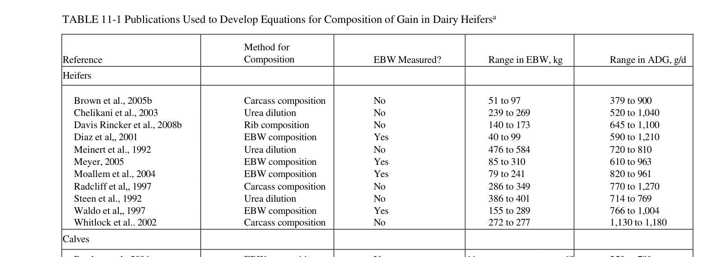
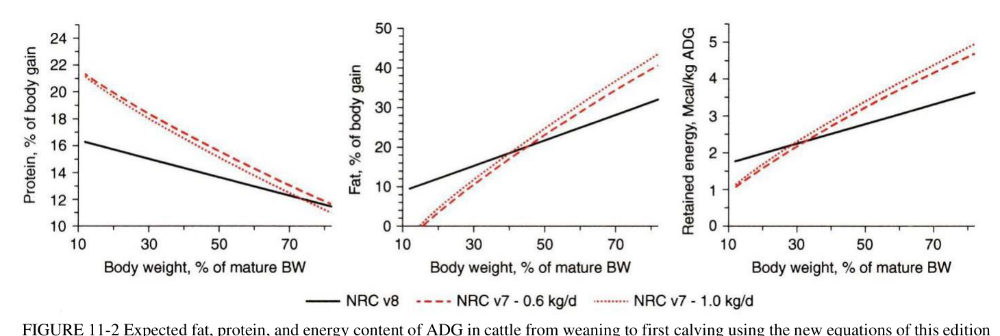
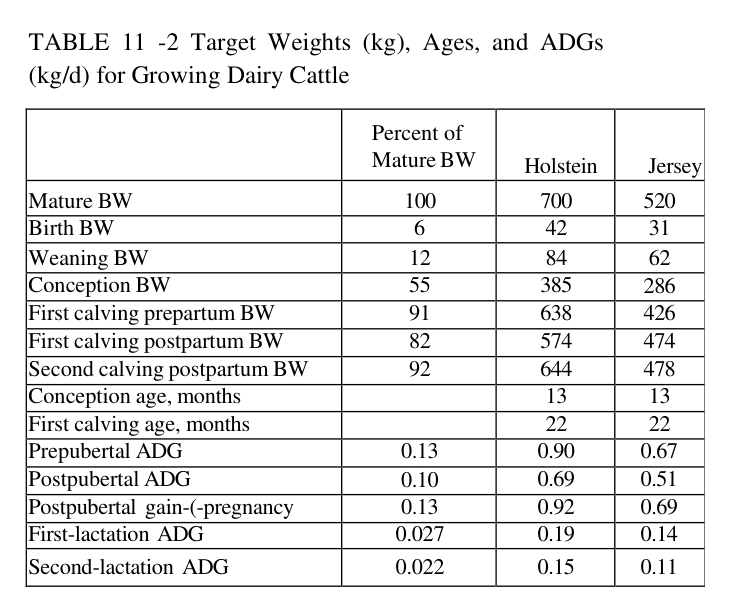
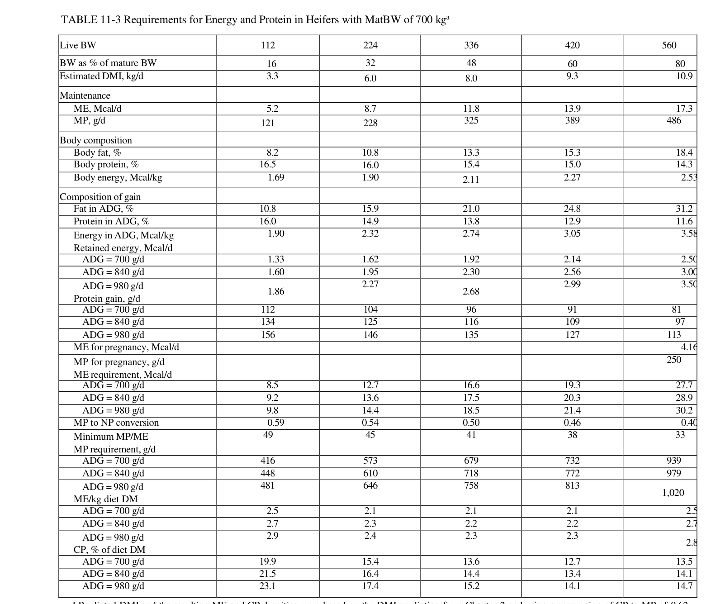
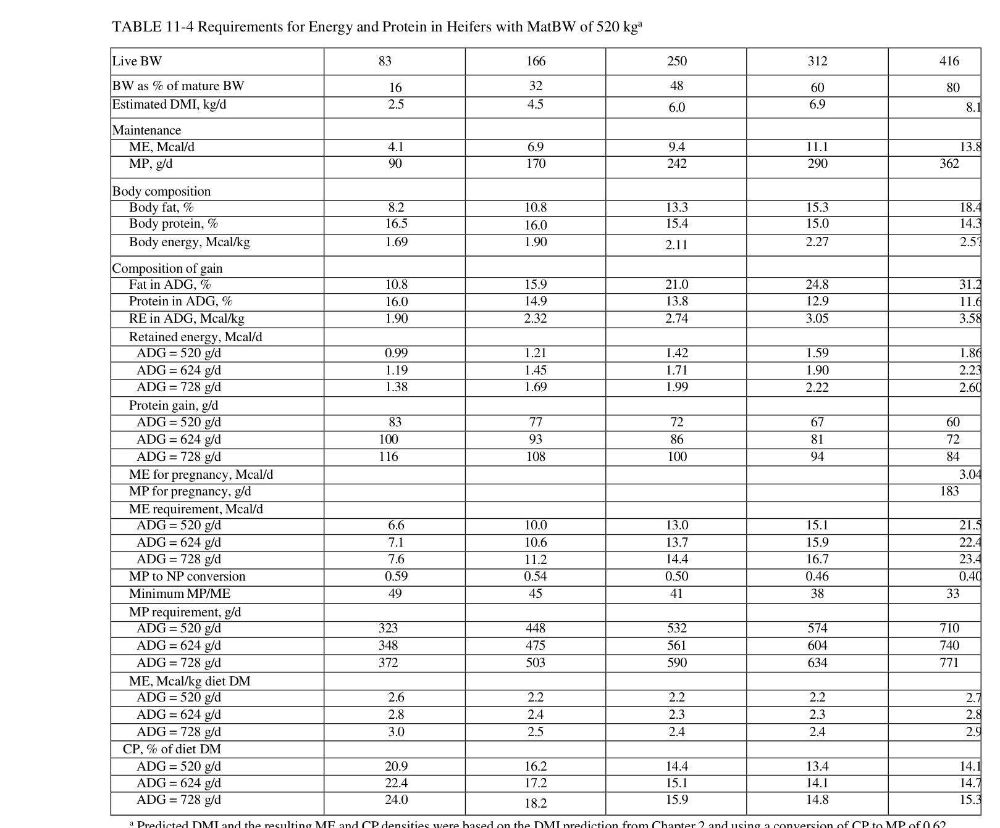

# CS.SOTA.294: NASEM 2021, Chapter 11 — Growth

> **Уровень:** Фундаментальный (P0) | **Формат:** Референсная книга (book chapter) | **Время изучения:** 40-50 мин

---

## Аннотация

**Контекст:** Затраты на выращивание телок и влияние роста телок на дожизненную молочную продуктивность подчёркивают важность точного расчёта требований питания для растущих телок.

**Цель главы:** Представить обновлённые уравнения для расчёта энергетических и белковых требований растущих молочных телок на основе данных по телам Хольштейнов, полученных за последние 20 лет.

**Ключевые обновления относительно NRC 2001:**
- Новые уравнения состава тела разработаны на основе мета-анализа 26 исследований (129 средних) на Хольштейнах
- Уравнения основаны на естественном логарифме (ln) BW, а не на степени 0,75
- Mature BW (MatBW) при BCS=3 составляет 22% жира (вместо 25% в NRC 2001)
- Содержание жира в пустом теле (EBW) линеаризовано относительно EBW
- Эффективность конверсии MP→NP: 0,64 при 12% MatBW, линейно снижается до 0,39 при 82%

**Выводы:** Требования к росту теперь основаны на данных Хольштейнов, а не говяжьих уравнений. Состав прироста зависит от стадии роста (BW/MatBW), а не от скорости прироста.

---

## 2. КЛЮЧЕВЫЕ УТВЕРЖДЕНИЯ

### Утверждение 1: Новые уравнения состава тела основаны на данных Хольштейнов
**Утверждение:** Мета-анализ 26 публикаций с 129 средними для Хольштейнов показал, что уравнения NRC 2001 недооценивали содержание жира в молодых телках и переоценивали в старших.
**Доказательства:** Мета-анализ de Souza и VandeHaar (2018) с прямыми химическими измерениями EBW
**Уверенность:** высокая
**Цитата:** "de Souza and VandeHaar (2018) showed that the equations of the seventh edition generally underestimated the fat content of the empty body and the RE per kilogram of gain in young heifers and overestimated... in older heifers"

### Утверждение 2: Содержание жира в EBW описывается линейной функцией EBW
**Утверждение:** Для EBW от отъёма (~80 кг) до первого отёла (~570 кг) линейная регрессия от EBW описывает данные не хуже квадратичной или логарифмической функций.
**Доказательства:** Анализ данных 26 исследований на Хольштейнах
**Уверенность:** высокая

### Утверждение 3: Эффективность MP→NP снижается с ростом
**Утверждение:** Эффективность конверсии метаболизируемого протеина в нетто-протеин снижается от 0,64 при EBW=12% MatBW до 0,39 при EBW=82% MatBW.
**Доказательства:** Анализ данных роста, адаптированный от NASEM 2016 (beef)
**Уверенность:** средняя-высокая

### Утверждение 4: Скорость роста мало влияет на состав прироста
**Утверждение:** RE содержимость EBG пропорциональна ADG в степени 0,097, т.е. разница между 0,6 и 1,2 кг/д составляет только 7% по содержанию энергии.
**Доказательства:** Анализ данных Radcliff et al. (1997) и Waldo et al. (1997)
**Уверенность:** высокая

---

## 3. Введение

### 3.1. Место главы в книге

Глава 11 описывает требования к энергии и протеину для растущих молочных телок (replacement heifers). Это фундаментальный раздел, обеспечивающий расчёт рационов для телок от отъёма до первого отёла.

Связь с другими главами:
- **Глава 6 (Minerals):** Минеральные требования для растущих телок
- **Глава 7 (Vitamins):** Витаминные требования
- **Глава 10 (Young calf):** Требования для молочных телят до отъёма
- **Глава 12 (Lactating cow feeding):** Переход от требований роста к требованиям лактации

### 3.2. Ключевые обновления относительно NRC 2001

| Параметр | NRC 2001 | NASEM 2021 | Влияние на практику |
|----------|----------|------------|---------------------|
| База уравнений | Говяжьи данные (Garrett 1980) | Хольштейны (26 исследований) | Более точные прогнозы для молочных пород |
| Функция состава | Степень 0,75 BW | Линейная от EBW | Проще и точнее |
| Жир при BCS=3 | 25% EBW | 22% EBW | Ниже энерготребование для старших телок |
| Gut fill | 14,5% BW, 4% gain | 15% BW (константа) | Упрощение, но потенциальная погрешность |
| MP→NP эффективность | 0,77→0,39 (нелинейная) | 0,64→0,39 (линейная) | Выше потребности в MP для молодых телок |
| Зависимость от ADG | Сильная (RE ∝ ADG^1,097) | Слабая | Рационы менее чувствительны к скорости роста |

---

## 4. Методология

### 4.1. Общее описание

Модель требований для роста телок состоит из трёх компонентов:
1. **Поддержание (Maintenance):** ME и MP на поддержание базового обмена
2. **Прирост (Growth):** ME и MP на прирост тканей
3. **Эффективность конверсии:** ME→NEgain, MP→NP

### 4.2. Ключевые уравнения

#### Уравнения базовых параметров

```
EBW = 0.85 × BW                          (Equation 11-1a)
EBG = 0.85 × ADG                         (Equation 11-1b)
```

Где:
- **EBW** — Empty Body Weight (пустая масса тела), кг
- **BW** — Live Body Weight (живая масса), кг
- **EBG** — Empty Body Gain (прирост пустого тела), кг/д
- **ADG** — Average Daily Gain (среднесуточный прирост), кг/д
- Коэффициент 0,85 — доля пустой массы в живой массе (15% gut fill)

#### Уравнения поддержания

```
ME maintenance (Mcal/d) = 0.15 × BW^0.75   (Equation 11-2)
```

MP maintenance:
```
MP-scurf (г/д) = (0.20 × BW^0.60) / 0.69          (Equation 11-3a)
MP-endogenous urinary (г/д) = 53 × 6.25 × BW × 0.001 (Equation 11-3b)
MP-MFP (г/д) = ((11.62 + 0.134 × NDF% сухого вещества) × DMI) / 0.69 (Equation 11-3c)
```

Где:
- **ME** — Metabolizable Energy (метаболизируемая энергия)
- **MP** — Metabolizable Protein (метаболизируемый протеин)
- **MFP** — Metabolic Fecal Protein (метаболический фекальный протеин)
- Эффективность конверсии: 0,69 для scurf и MFP, 1,0 для endogenous urinary N

#### Уравнения состава EBW

```
Fat in EBW (кг/кг) = 0.067 + 0.375 × (BW / MatBW)     (Equation 11-4a)
FFM in EBW (кг/кг) = 1 - Fat_EBW                      (Equation 11-4b)
Protein in EBW (кг/кг) = 0.215 × FFM_EBW              (Equation 11-4c)
Ash in EBW (кг/кг) = 0.056 × FFM_EBW                  (Equation 11-4d)
Water in EBW (кг/кг) = 0.729 × FFM_EBW                (Equation 11-4e)
```

Где:
- **MatBW** — Mature Body Weight (масса тела взрослой особи), кг
- **FFM** — Fat-Free Mass (обезжиренная масса)

#### Уравнения состава прироста (EBG)

```
Fat in EBG (кг/кг) = 0.067 + 0.375 × (BW / MatBW)     (Equation 11-5a)
FFM in EBG (кг/кг) = 1 - Fat_EBG                       (Equation 11-5b)
Protein in EBG (кг/кг) = 0.215 × FFM_EBG               (Equation 11-5c)
RE in EBG (Mcal/кг) = 9.4 × Fat_EBG + 5.55 × Protein_EBG (Equation 11-5d)
Ash in EBG (кг/кг) = 0.056 × FFM_EBG                   (Equation 11-5e)
Water in EBG (кг/кг) = 0.729 × FFM_EBG                 (Equation 11-5f)
```

Где:
- **RE** — Retained Energy (удержанная энергия), Mcal/кг

#### Уравнения прироста живой массы (ADG)

```
Fat in ADG (кг/кг) = 0.85 × Fat_EBG                    (Equation 11-6a)
RE in ADG (Mcal/кг) = 0.85 × RE_EBG                    (Equation 11-6b)
Protein in ADG (кг/кг) = 0.85 × Protein_EBG            (Equation 11-6c)
```

#### Уравнения требований к росту

```
ME for growth (Mcal/д) = RE (Mcal/д) / 0.40            (Equation 11-7)
```

Эффективность MP→NP:
```
NP-eff = 0.64 - 0.30 × (EBW / Mature EBW)             (Equation 11-8)
MP for growth (г MP/д) = Retained protein (г/д) / NP-eff (Equation 11-9)
```

#### Уравнения минимального соотношения протеин:энергия

```
Minimum MP (г/Mcal ME) = 53 - 25 × (BW / MatBW)     (Equation 11-10)
```

Корректировка MP при недостаточном соотношении:
```
If MP (г/д) < (53 - 25 × BW/MatBW) × ME (Mcal/д):
    MP (г/д) = (53 - 25 × BW/MatBW) × ME (Mcal/д)   (Equation 11-11)
```

**Почему это важно:**
- Минимальное MP/ME определяет требование к протеину в большинстве случаев
- Недостаток протеина при избытке энергии приводит к:
  - Избыточному отложению жира (вместо мышц)
  - Снижению развития молочной железы
  - Потере молочного протеина в первую лактацию (до -15%, Pirlo et al., 1997)

**Пример:** Телка 200 кг, MatBW = 700 кг:
- Minimum MP/ME = 53 - 25 × (200/700) = 53 - 7,1 = **45,9 г MP/Mcal ME**
- ME requirement при ADG 800 г/д ≈ 13,0 Mcal/д
- MP requirement = max(расчётное MP, 45,9 × 13,0) = max(~500, ~597) = **597 г MP/д**


Ограничения:
- EBW не может превышать Mature EBW
- EBW/Mature EBW можно аппроксимировать как BW/MatBW

### 4.3. Медиа-инвентарь

**Table 11-1: Publications Used to Develop Equations for Composition of Gain in Dairy Heifers**



**Название в книге:** Publications Used to Develop Equations for Composition of Gain in Dairy Heifers
**Источник:** NASEM 2021, Chapter 11, стр. 257
**Тип:** таблица (литературный обзор)

**Описание:**
Таблица перечисляет 26 публикаций, использованных для разработки уравнений состава прироста. Включает методы определения состава (carcass composition, urea dilution, EBW composition, D2O dilution), диапазоны EBW и ADG для телок (heifers), телят (calves) и коров (cows).

**Ключевые элементы для лекции:**
- 11 исследований на телках (heifers), EBW 51-584 кг, ADG 379-1270 г/д
- 9 исследований на телятках (calves), EBW 44-150 кг, ADG 250-1230 г/д
- 10 исследований на коровах (cows), EBW 408-656 кг
- Методы: carcass composition, urea dilution, EBW composition, D2O dilution, K40

**Комментарий лектора:**
> "Вот таблица, которая показывает масштаб работы. 26 исследований, более 120 средних — это не просто теория, это мета-анализ реальных данных на молочных породах. Обратите внимание: раньше использовали говяжьи данные, а теперь — только молочные."

---

**Figure 11-1: Fat and protein content of EBW in Holstein cattle**


**Название в книге:** Fat and protein content of EBW in Holstein cattle
**Источник:** NASEM 2021, Chapter 11, стр. 258
**Тип:** scatter plot с линиями регрессии

**Описание:**
График показывает содержание жира и протеина в EBW для Хольштейнов на разных стадиях роста. Точки — средние по исследованиям (скорректированные на эффект исследования). Линии регрессии: прямые химические измерения (G_Direct), carcass/rib (G_Carcass), коровы — прямые измерения (M_Direct) и dilution (M_Dilution).

**Ключевые элементы для лекции:**
- Содержание жира увеличивается от ~5% при рождении до ~22% при зрелости
- Содержание протеина снижается от ~20% до ~17%
- Предсказательные линии валидны для EBW 70-490 кг

**Комментарий лектора:**
> "Этот график — сердце новой модели. Видите, как растёт жир с возрастом? Но ключевой момент: при зрелости (BCS=3) жира 22%, а не 25% как в старой модели NRC. Это меняет расчёты рационов."

---

**Figure 11-2: Expected fat, protein, and energy content of ADG**



**Название в книге:** Expected fat, protein, and energy content of ADG in cattle from weaning to first calving
**Источник:** NASEM 2021, Chapter 11, стр. 259
**Тип:** line graph (3 линии)

**Описание:**
Сравнение новых уравнений NASEM 2021 (сплошная чёрная линия) с уравнениями NRC 2001 для ADG 0,6 (красная штриховая) и 1,0 кг/д (красная пунктирная). Показаны содержание жира, протеина и энергии в ADG.

**Ключевые элементы для лекции:**
- Новые уравнения дают бОльшее содержание жира в молодом возрасте и меньшее в зрелом
- Разница между NASEM 2021 и NRC 2001 особенно велика для телок 100-300 кг
- Разница между ADG 0,6 и 1,0 минимальна (подтверждает слабую зависимость от скорости роста)

**Комментарий лектора:**
> "Смотрите на расхождение между чёрной и красными линиями. Для телки 200 кг старая модель недооценивала жир почти на 30%. А разница между быстрым и медленным ростом — всего 7%. Это означает: не гонитесь за точной скоростью роста при расчёте энергии, главное — стадия роста."


---

**Table 11-2: Target Weights (kg), Ages, and ADGs for Growing Dairy Cattle**



**Название в книге:** Target Weights (kg), Ages, and ADGs (kg/d) for Growing Dairy Cattle
**Источник:** NASEM 2021, Chapter 11, стр. 261
**Тип:** таблица целевых показателей

**Описание:**
Целевые веса, возрасты и среднесуточные приросты для молочных телок. Даны значения для Хольштейнов (MatBW 700 кг) и Джерси (MatBW 520 кг). Включает: вес при рождении, отъёме, осеменении, первом и втором отёлах, а также ADG для пре- и постпубертатного периода.

**Ключевые элементы для лекции:**
- Хольштейн: вес при осеменении 385 кг (55% MatBW), при первом отёле 638 кг (91%)
- Джерси: вес при осеменении 286 кг (55% MatBW), при первом отёле 426 кг (82%)
- Препубертатный ADG: Хольштейн 0,90 кг/д, Джерси 0,67 кг/д
- Постпубертатный ADG: Хольштейн 0,69 кг/д, Джерси 0,51 кг/д
- Верхний порог для препубертатных телок Джерси: ~750 г/д

**Комментарий лектора:**
> "Эта таблица — ваш чек-лист. Если телка к 13 месяцам весит 380 кг — она на плане. Если 320 кг — срочно корректируйте рацион. Обратите внимание: после первого отёла вес падает с 638 до 574 кг — это нормально, это потеря при плоде и околоплодных водах."

---

## 5. Результаты

### 5.1. Требования к энергии для поддержания

**Соответствует:** Equation 11-2

**Описание:**
Требование ME для поддержания растущих телок установлено как 0,15 × BW^0,75 Мcal/д. Это соответствует требованию для взрослых коров и близко к значению NASEM 2016 для говяжьих пород (0,095 × BW^0,75 на NE-базе).

**Ключевые цифры:**
- ME maintenance = 0,15 × BW^0,75 (Mcal/д)
- Активность = +10% (может быть выше на пастбище или в больших загонах)
- Корректировки на компенсаторный рост, BCS, температуру — НЕ включены

**Комментарий лектора:**
> "Требование поддержания для телки такое же, как для коровы той же массы. Но не забудьте добавить 10% на активность. Если телки на пастбище — добавьте ещё."

### 5.2. Состав прироста по стадиям роста

**Соответствует:** Figure 11-2, Equations 11-4 — 11-6

**Описание:**
Состав прироста (ADG) меняется от преимущественно протеина и воды в молодом возрасте до преимущественно жира при приближении к зрелости.

**Ключевые цифры:**

| Параметр | Молодая телка (BW=100 кг) | Перед первым отёлом (BW=550 кг) |
|----------|---------------------------|--------------------------------|
| Fat in EBW | ~10% | ~22% |
| Protein in EBW | ~19% | ~17% |
| RE in ADG | ~3,5 Mcal/кг | ~5,5 Mcal/кг |
| ME for growth | ~8,8 Mcal/кг ADG | ~13,8 Mcal/кг ADG |

**Комментарий лектора:**
> "Смотрите на разницу: молодая телка набирает мышцы, старшая — жир. Поэтому рацион для 500-килограммовой телки должен быть энергоемче, чем для 100-килограммовой, даже если обе набирают по 800 грамм в день."

### 5.3. Эффективность MP→NP

**Соответствует:** Equation 11-8

**Описание:**
Эффективность конверсии MP в нетто-протеин снижается с возрастом от 0,64 до 0,39.

**Ключевые цифры:**

| % MatBW | NP-eff | MP для 200г протеина |
|---------|--------|---------------------|
| 12% | 0,64 | 312 г |
| 30% | 0,55 | 364 г |
| 50% | 0,49 | 408 г |
| 82% | 0,39 | 513 г |

**Комментарий лектора:**
> "Молодая телка использует протеин почти вдвое эффективнее, чем перед отёлом. Это значит: если вы кормите всех телок одним рационом, либо молодые получают избыток протеина, либо старшие — недостаток."


### 5.4. Соотношение протеин:энергия (MP/ME и CP/ME)

**Соответствует:** Equations 11-10, 11-11, Tables 11-3, 11-4

**Описание:**
Это ключевой параметр для практики. NASEM 2021 ввёл **минимальное соотношение MP/ME**, которое определяет требование к протеину в рационе. Если расчётное MP из прироста ниже этого порога — используется пороговое значение.

#### Минимальное MP/ME (Equation 11-10)

| BW (кг) | MatBW 700 кг | MatBW 520 кг |
|---------|-------------|-------------|
| 100 | 49 г/Mcal | 49 г/Mcal |
| 200 | 46 г/Mcal | 46 г/Mcal |
| 300 | 42 г/Mcal | 42 г/Mcal |
| 400 | 39 г/Mcal | 39 г/Mcal |
| 500 | 35 г/Mcal | 35 г/Mcal |

> **Правило для технолога:** С каждыми +100 кг живой массы минимальное MP/ME падает на ~3-4 г/Mcal. Молодые телки нуждаются в более протеиновом рационе (относительно энергии).

#### CP в рационе (% от сухого вещества) — Table 11-3 (Holstein, MatBW=700 кг)

| Масса телки | ADG 700 г/д | ADG 840 г/д | ADG 980 г/д |
|-------------|-------------|-------------|-------------|
| **112 кг** | 19,9% | 21,5% | 23,1% |
| **224 кг** | 15,4% | 16,4% | 17,4% |
| **336 кг** | 13,6% | 14,4% | 15,2% |
| **420 кг** | 12,7% | 13,4% | 14,1% |
| **560 кг** (доотёл) | 13,5% | 14,1% | 14,7% |

#### CP в рационе (% от сухого вещества) — Table 11-4 (Jersey, MatBW=520 кг)

| Масса телки | ADG 520 г/д | ADG 624 г/д | ADG 728 г/д |
|-------------|-------------|-------------|-------------|
| **83 кг** | 20,9% | 22,4% | 24,0% |
| **166 кг** | 16,2% | 17,2% | 18,2% |
| **250 кг** | 14,4% | 15,1% | 15,9% |
| **312 кг** | 13,4% | 14,1% | 14,8% |
| **416 кг** (доотёл) | 14,1% | 14,7% | 15,3% |

#### Энергетическая плотность рациона (ME, Mcal/кг DM)

| Масса телки | ADG 700/520 | ADG 840/624 | ADG 980/728 |
|-------------|-------------|-------------|-------------|
| **100/80 кг** | 2,5-2,6 | 2,7-2,8 | 2,9-3,0 |
| **200/170 кг** | 2,1-2,2 | 2,3-2,4 | 2,4-2,5 |
| **300/250 кг** | 2,1-2,2 | 2,2-2,3 | 2,3-2,4 |
| **400/310 кг** | 2,1-2,2 | 2,2-2,3 | 2,3-2,4 |
| **550/420 кг** (доотёл) | 2,5-2,7 | 2,7-2,8 | 2,8-2,9 |

> **Правило для технолога:** Энергетическая плотность рациона минимальна для телок 200-400 кг (2,1-2,4 Mcal/кг). Для молодых телок и доотёла — выше (2,5-3,0 Mcal/кг).

#### Ключевые исследования по протеин:энергия

| Исследование | CP/ME (г/Mcal) | Результат |
|--------------|----------------|-----------|
| Whitlock et al., 2002 | 48 / 57 / 66 | Для быстрорастущих оптимально 66 |
| Lammers & Heinrichs, 2000 | 46 / 54 / 61 | Оптимально 61 для роста и молочной железы |
| Pirlo et al., 1997 | 40-62 | Высокая энергия + низкий протеин → -15% молочного протеина |
| Gabler & Heinrichs, 2003 | 48 / 59 / 68 / 77 | Оптимально 59-68; 48 и 77 — хуже |

**Вывод комитета:** Диеты с избытком энергии и недостатком протеина наиболее вредны для молочной железы. Минимальное MP/ME = **53 - 25 × BW/MatBW** защищает от этого.

**Комментарий лектора:**
> "Вот таблица, которую должен знать каждый технолог. Телка 100 кг нуждается в рационе с 20-23% протеина. Телка 400 кг — достаточно 13-14%. Если дадите 400-килограммовой телке 20% протеина — выбросите деньги. Если дадите 100-килограммовой 13% — потеряете молочную продуктивность в будущем."

---

**Table 11-3: Requirements for Energy and Protein in Heifers with MatBW of 700 kg**



**Название в книге:** Requirements for Energy and Protein in Heifers with MatBW of 700 kg
**Источник:** NASEM 2021, Chapter 11, стр. 263
**Тип:** таблица требований (основная)

**Описание:**
Полная таблица требований ME, MP, CP для Хольштейнов (MatBW=700 кг) на разных стадиях роста (BW 112-560 кг) и при разных ADG (700-980 г/д). Включает состав тела, энергетическую плотность рациона и % CP в DM.

**Ключевые элементы для лекции:**
- CP падает с 19,9% (112 кг) до 12,7% (420 кг) при ADG 700 г/д
- ME плотность минимальна на этапе 200-400 кг (~2,1-2,4 Mcal/кг DM)
- Последняя колонка (560 кг) включает требования беременности (40 дней до отёла)

**Комментарий лектора:**
> "Эта таблица — ваш главный инструмент. Скопируйте её в Excel и используйте для расчёта рационов. Обратите внимание: CP падает с ростом телки, а энергия — нет."

---

**Table 11-4: Requirements for Energy and Protein in Heifers with MatBW of 520 kg**



**Название в книге:** Requirements for Energy and Protein in Heifers with MatBW of 520 kg
**Источник:** NASEM 2021, Chapter 11, стр. 264
**Тип:** таблица требований (для мелких пород)

**Описание:**
Аналог Table 11-3 для Джерси (MatBW=520 кг). ADG скорректированы: 520/624/728 г/д (соответствуют 0,12% MatBW/д).

**Ключевые элементы для лекции:**
- Тенденции аналогичны Table 11-3, но абсолютные значения ниже
- CP для молодых телок 83 кг: 20,9-24,0%
- CP для доотёла 416 кг: 14,1-15,3%

**Комментарий лектора:**
> "Для Джерси цифры немного ниже, но тенденция та же. Не используйте таблицу для Хольштейнов для Джерси — ошибка будет 20-30%."

---

## 6. Практическое применение

### 6.1. Алгоритм расчёта рациона для телки

```
Шаг 1: Определить BW (кг), ADG (кг/д), MatBW (кг)
Шаг 2: Рассчитать ME maintenance = 0,15 × BW^0,75
Шаг 3: Рассчитать EBW = 0,85 × BW, EBG = 0,85 × ADG
Шаг 4: Определить состав EBG (Equations 11-5)
Шаг 5: Рассчитать RE = EBG × RE_EBG
Шаг 6: Рассчитать ME growth = RE / 0,40
Шаг 7: Общее ME = ME maintenance + ME growth
Шаг 8: Рассчитать MP maintenance (Equations 11-3)
Шаг 9: Рассчитать retained protein = EBG × Protein_EBG
Шаг 10: Определить NP-eff (Equation 11-8)
Шаг 11: Рассчитать MP growth = retained protein / NP-eff
Шаг 12: Общий MP = MP maintenance + MP growth
```

### 6.2. Отличия от NRC 2001 и влияние на практику

| Параметр | NRC 2001 | NASEM 2021 | Практическое влияние |
|----------|----------|------------|---------------------|
| Состав тела (молодые) | Недооценка жира | Точная оценка | Рационы для телок 100-300 кг должны быть энергичнее |
| Состав тела (старшие) | Переоценка жира | Точная оценка | Меньше энергии для телок 400-550 кг |
| MP→NP (молодые) | 0,77 | 0,64 | Больше протеина нужно для молодых телок |
| MP→NP (старшие) | 0,39 | 0,39 | Без изменений |
| Зависимость от ADG | Сильная | Слабая | Рацион менее чувствителен к скорости роста |

### 6.3. Excel-калькулятор

**Структура:**
- Входные данные: BW (кг), ADG (кг/д), MatBW (кг), DMI (кг), NDF% (%)
- Промежуточные расчёты: EBW, EBG, состав EBG, RE
- Выходные данные: ME total (Mcal/д), MP total (г/д), CP total (г/д)
- Сравнение: NRC 2001 vs NASEM 2021

---

## 7. Лекционные материалы

### 7.1. Чек-лист скриншотов

| № | Элемент | Страница | Назначение |
|---|---------|----------|------------|
| 1 | Table 11-1 | 257 | Обоснование: 26 исследований |
| 2 | Figure 11-1 | 258 | Состав EBW по стадиям роста |
| 3 | Figure 11-2 | 259 | Сравнение NASEM vs NRC |
| 4 | Table 11-2 | 261 | Целевые веса и ADG |
| 5 | Equations 11-4 — 11-6 | 258 | Уравнения состава прироста |
| 6 | Equations 11-8 — 11-9 | 259 | Эффективность MP→NP |
| 7 | Table 11-3 | 263 | Требования ME/MP/CP (Holstein) |
| 8 | Table 11-4 | 264 | Требования ME/MP/CP (Jersey) |

### 7.2. Структура лекции (30 мин)

| Время | Тема | Слайд |
|-------|------|-------|
| 0:00-2:00 | Введение: зачем обновлять NRC 2001 | Table 11-1 |
| 2:00-5:00 | Терминология: EBW, EBG, MatBW | Схема |
| 5:00-10:00 | Уравнения поддержания | Equations 11-2, 11-3 |
| 10:00-18:00 | Состав прироста: новые уравнения | Figure 11-1, 11-2 |
| 18:00-23:00 | Эффективность конверсии | Equations 11-7 — 11-9 |
| 23:00-28:00 | Сравнение NRC vs NASEM | Таблица сравнения |
| 28:00-30:00 | Практика: расчёт рациона | Пример |

---

## 8. Выводы

### 8.1. Ключевые выводы главы

1. Требования к росту телок теперь основаны на данных Хольштейнов (26 исследований), а не говяжьих уравнений Garrett (1980)
2. Состав тела описывается линейной функцией EBW (не степенью 0,75)
3. Содержание жира при зрелости (BCS=3): 22% EBW (вместо 25%)
4. Состав прироста зависит от стадии роста (BW/MatBW), а не от скорости прироста
5. Эффективность MP→NP снижается от 0,64 до 0,39 по мере роста
6. Gut fill принят константой 15% (требует дальнейшего изучения)

### 8.2. Ключевые сообщения для лекции

> "NASEM 2021 изменил подход к расчёту требований роста. Теперь мы используем данные молочных пород, а не говяжьи. Главное — стадия роста, а не скорость."

> "Молодые телки растут мышцами, старшие — набирают жир. Это меняет соотношение энергии и протеина в рационе."

> "Проверьте свои рационы: возможно, вы недокармливаете молодых телок энергией и перекармливаете старших."

---

## 9. Критический анализ

### 9.1. Сильные стороны

- **Большая выборка:** 26 исследований, 129 средних — надёжная база
- **Породная специфика:** Данные только на Хольштейнах, а не экстраполяция с говядины
- **Математическая консистентность:** Уравнения состава тела и прироста согласованы
- **Практическая значимость:** Упрощение расчётов (линейная функция вместо сложной степенной)

### 9.2. Ограничения и критика

- **Gut fill:** Принят константой 15%, хотя реальные данные показывают 11-19% в зависимости от рациона. Комитет признаёт необходимость дальнейшей работы.
- **Активность:** Только +10%, без корректировки на пастбищное содержание, компенсаторный рост, температуру.
- **MatBW:** Требует точной оценки; для кроссбредов и других пород может отличаться.
- **BCS:** Нет корректировки на текущий BCS; модель предполагает оптимальное состояние.

### 9.3. Сравнение с NRC 2001

| Аспект | NRC 2001 | NASEM 2021 | Оценка изменения |
|--------|----------|------------|-----------------|
| Точность (молодые) | Недооценка жира | Точнее | Улучшение |
| Точность (старшие) | Переоценка жира | Точнее | Улучшение |
| Сложность | Сложная (степень 0,75) | Проще (линейная) | Улучшение |
| Полнота | Без активности, BCS | Всё ещё без | Недостаток |

### 9.4. Применимость к российским условиям

**Плюсы:**
- Уравнения универсальны (зависят от BW, а не от региона)
- Open access — доступно для использования

**Минусы:**
- Требуется адаптация под доступные корма (силос, сено)
- MatBW для российских Хольштейнов может отличаться (генетика, менеджмент)
- Gut fill на силосных рационах может отличаться от 15%
- Не учтены сезонные вариации (холодный климат)

**Рекомендации:**
- Использовать NASEM 2021 как базу, но корректировать на местные условия
- Провести валидацию на российских стадах
- Для телок на пастбище добавить +15-20% к maintenance

---

## 10. FAQ

**Q1: Можно ли использовать эти уравнения для телок других пород (Айршир, Джерси)?**
A: Да, но с корректировкой MatBW. Для Джерси MatBW ниже (~450 кг), поэтому все уравнения с BW/MatBW дадут другие результаты.

**Q2: Почему NASEM 2021 даёт МЕНЬШЕ энергии для старших телок, чем NRC 2001?**
A: Потому что содержание жира при зрелости 22% (не 25%), и уравнения точнее описывают состав тела старших телок.

**Q3: Нужно ли менять рацион при изменении ADG с 0,6 до 0,8 кг/д?**
A: Минимально. Разница в RE содержимости ADG всего ~7%. Основной фактор — стадия роста (BW/MatBW), а не скорость.

**Q4: Как учесть активность телок на пастбище?**
A: Стандартный запас +10% может быть недостаточен. Рекомендуется добавить +15-20% для пастбищного содержания.

**Q5: Что делать, если нет точного значения MatBW?**
A: Используйте породные стандарты: Хольштейн ~650-700 кг, Джерси ~450-500 кг. Для смешанных стад — среднее.

**Q6: Почему MP→NP эффективность снижается с возрастом?**
A: С возрастом снижается способность к белковому синтезу; организм направляет ресурсы на поддержание, а не рост.

**Q7: Какие таблицы требований использовать — NRC 2001 или NASEM 2021?**
A: Для молочных пород — NASEM 2021. Для говядины — NASEM 2016 (beef). NRC 2001 устарел для молочных.

**Q8: Почему CP в рационе падает с ростом телки?**
A: Молодые телки растут мышцами (высокий % протеина в приросте) и эффективнее используют протеин (NP-eff 0,64). Старшие телки набирают больше жира и хуже конвертируют протеин (NP-eff 0,39). Поэтому молодым нужно 20-23% CP, старшим — 13-14%.

**Q9: Что будет, если дать телке избыток энергии и недостаток протеина?**
A: Три проблемы: (1) избыточное отложение жира вместо мышц, (2) снижение развития молочной железы, (3) потеря до 15% молочного протеина в первую лактацию (Pirlo et al., 1997). Именно поэтому NASEM 2021 ввёл минимальное MP/ME.

**Q10: Как быстро определить, достаточно ли протеина в рационе?**
A: Проверьте CP/ME рациона (г CP на Mcal ME). Для телки 200 кг при ADG 800 г/д нужно ~16% CP при ME 2,3 Mcal/кг = ~70 г CP/Mcal. Если ваш рацион даёт меньше — протеина недостаточно. Или используйте правило: CP (%) ≈ 20 - 0,02 × BW (кг) для ADG 800 г/д.

---

## 11. Инструменты и шаблоны

### 11.1. Excel-калькулятор

**Лист 1: Входные данные**
- BW (кг)
- ADG (кг/д)
- MatBW (кг)
- DMI (кг/д)
- NDF% (%)
- Условия содержания (dry lot / pasture)

**Лист 2: Расчёт требований**
- ME maintenance, ME growth, ME total
- MP maintenance, MP growth, MP total
- CP total (MP / 0,69)

**Лист 3: Сравнение NRC vs NASEM**
- Параллельный расчёт по обеим системам
- Разница в %

### 11.2. Чек-лист внедрения

- [ ] Определить MatBW для стада (породные стандарты)
- [ ] Пересчитать рационы для групп телок (100-200, 200-350, 350-550 кг)
- [ ] Сравнить с текущими рационами (NRC 2001)
- [ ] Скорректировать энергию для молодых телок (обычно +5-10%)
- [ ] Скорректировать энергию для старших телок (обычно -5-10%)
- [ ] Проверить протеин для молодых (может потребоваться +10%)
- [ ] Мониторинг ADG и BCS (валидация)

### 11.3. Онлайн-ресурсы

- **NASEM Dairy Model:** https://nasedairy.org/ (официальный калькулятор)
- **NAP OpenBook:** https://www.nap.edu/read/26331 (бесплатный доступ к книге)
- **Feed composition tables:** Встроены в NASEM software

---

## 12. Источники

### Первоисточник (книга)
National Academies of Sciences, Engineering, and Medicine. 2021. *Nutrient Requirements of Dairy Cattle: Eighth Revised Edition*. Washington, DC: The National Academies Press. https://doi.org/10.17226/26331

### Ключевые публикации, цитируемые в главе
- de Souza, J., and M.J. VandeHaar. 2018. Meta-analysis of body composition in Holstein cattle. (основа новых уравнений)
- Garrett, W.N. 1980. Energy utilization by growing cattle as determined in 72 comparative slaughter experiments. (основа NRC 2001)
- Simpfendorfer, S. 1974. Relationship of body type, size, sex, and energy intake to the body composition of cattle. (классика)
- Waldo et al., 1997. EBW composition in growing heifers. (валидация gut fill)
- Radcliff et al., 1997. Body composition and rate of gain. (валидация состава прироста)

### Связанные SoTA
- CS.SOTA.035 — Mann 2022 (metabolism in transition dairy cows)
- CS.SOTA.039 — McFadden 2017 (hepatic fatty acid metabolism)
- CS.SOTA.055 — Drackley 1999 (biology of transition period)

---

## 13. Журнал обработки

| Дата | Действие | Исполнитель | Версия |
|------|----------|-------------|--------|
| 2026-05-10 | Создание SoTA из главы 11 NASEM 2021 | Стратег (R1) | v1.0 |
| 2026-05-10 | Извлечение текста из PDF, структурирование уравнений | Стратег (R1) | v1.0 |
| 2026-05-10 | Добавление медиа-инвентаря, FAQ, практического применения | Стратег (R1) | v1.0 |
| 2026-05-10 | Добавление секции 5.4 (протеин:энергия), Equations 11-10/11-11, Tables 11-3/11-4, обновление FAQ | Стратег (R1) | v1.1 |
| 2026-05-10 | Вставка скриншотов Table 11-3 и Table 11-4 как PNG изображения | Стратег (R1) | v1.2 |
| 2026-05-10 | Добавление всех скриншотов главы: Table 11-1, Figure 11-1, Figure 11-2, Table 11-2, Table 11-3, Table 11-4 (6 PNG) | Стратег (R1) | v1.3 |
| 2026-05-10 | Автоматическая обрезка PNG: PyMuPDF clip по bounding box таблиц/графиков (экономия ~62%, 3.3→1.24 MB) | Стратег (R1) | v1.4 |
| | | | |

**Следующие шаги:**
- [x] Добавить скриншоты Figure 11-1, 11-2, Table 11-1
- [ ] Создать Excel-калькулятор
- [ ] Провести Entity Integration (`./scripts/post-sota-check.sh --last`)
- [ ] Обновить индексы (`python3 scripts/reindex-sota.py`)
- [ ] Git commit

---

*CS.SOTA.294 | NASEM 2021 Chapter 11 — Growth*  
*Создан: 2026-05-10*  
*Статус: v1.4 (полная структура, обрезанные скриншоты, требует Entity Integration)*
