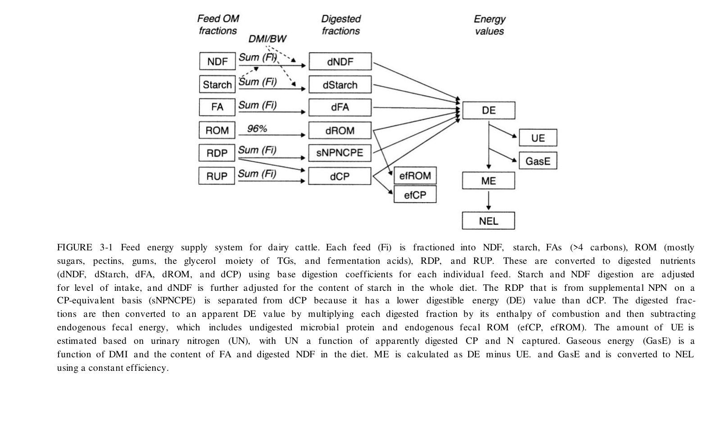
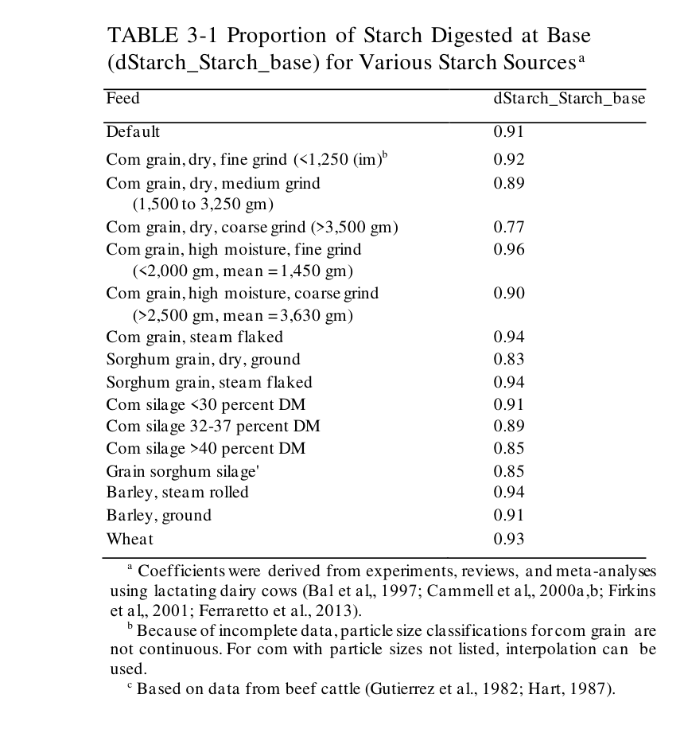
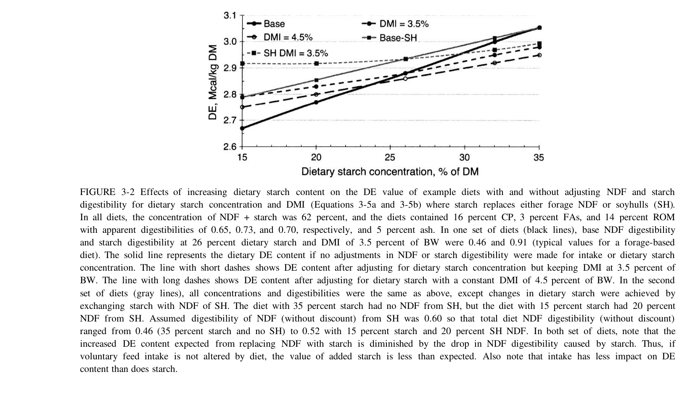
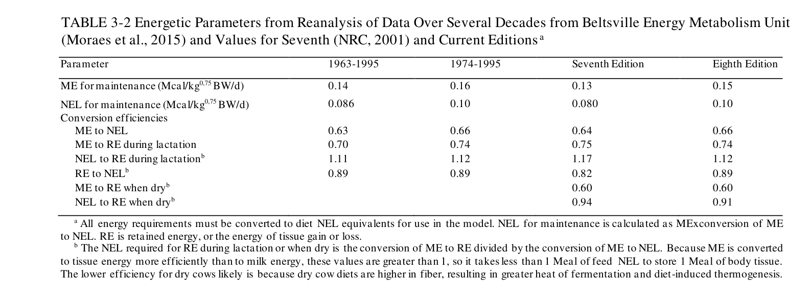
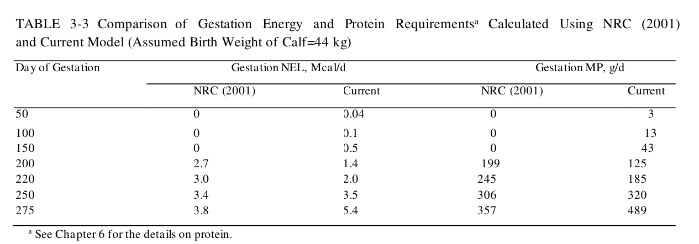
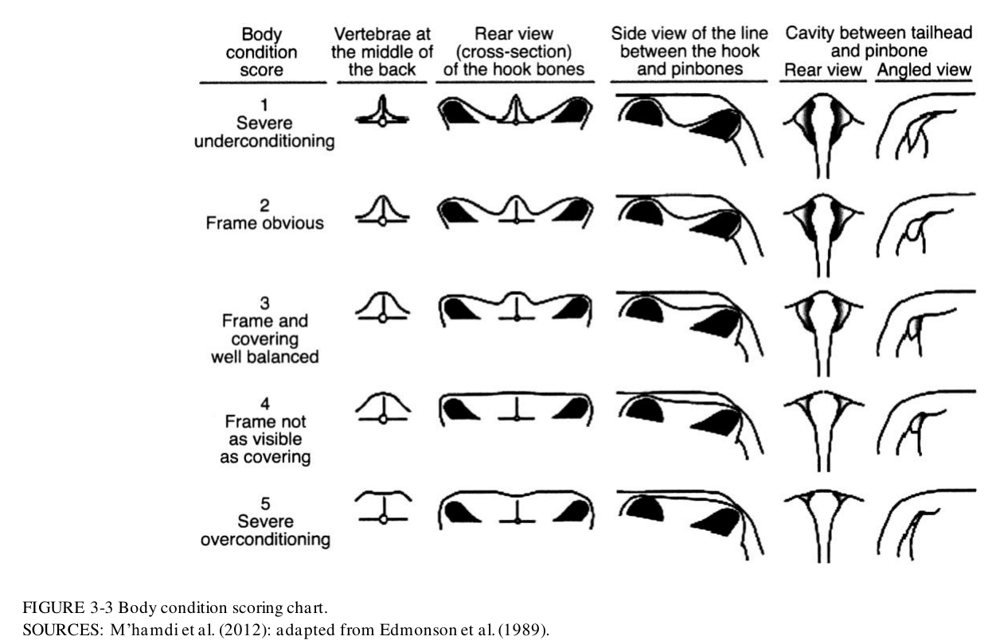

# CS.SOTA.295: NASEM 2021, Chapter 3 — Energy

> **Уровень:** Фундаментальный (P0) | **Формат:** Референсная книга (book chapter) | **Время изучения:** 50–60 мин  
> **Целевая аудитория:** Специалисты по кормлению, зоотехники, научные сотрудники, преподаватели вузов

---

## Аннотация

Энергетические требования и энергетическая ценность кормов представляют собой фундамент всех систем рационирования молочного скота. NASEM 2021 сохраняет систему NEL (Net Energy for Lactation), однако вносит ряд существенных изменений в методологию расчёта DE, ME и NEL, а также в величины энергетических требований.

Основные обновления по сравнению с NRC 2001:
- Величина NEL на поддержание повышена с 0,080 до 0,10 Mcal/kg⁰·⁷⁵ живой массы
- Введены динамические уравнения переваримости крахмала, учитывающие концентрацию крахмала в рационе и уровень потребления корма
- Предложен альтернативный метод оценки истинной переваримости NDF на основе 48-часовой in vitro NDF digestibility (IVNDFD)
- Модель требований к беременности переведена с линейной на логистическую функцию
- Введено разделение прироста массы тела на три компонента: скелетный рост (frame gain), резервы тела (body reserves) и ассоциированный с беременностью прирост

Практическая значимость данных изменений заключается в том, что рационы, рассчитанные по методологии NRC 2001, в среднем недооценивают энергетические потребности молочных коров на 0,6–1,5 Mcal NEL в сутки, что эквивалентно 1,5–3,0% от общих требований.

---

## 2. КЛЮЧЕВЫЕ УТВЕРЖДЕНИЯ

### Утверждение 1: NEL требования на поддержание повышены на 25%
NEL maintenance составляет 0,10 Mcal/kg⁰·⁷⁵ BW/d (против 0,080 в NRC 2001). Для коровы массой 700 кг разница составляет 1,22 Mcal NEL/сутки.

**Доказательства:** Реанализ данных Beltsville Energy Metabolism Unit за несколько десятилетий (Moraes et al., 2015).

**Уверенность:** высокая.

### Утверждение 2: Переваримость крахмала является функцией концентрации крахмала и уровня потребления
Переваримость крахмала рассчитывается с учётом двух факторов: процентного содержания крахмала в сухом веществе рациона и отношения сухого потребления к живой массе (DMI_BW).

**Доказательства:** Мета-анализ de Souza et al. (2018) на данных высокопродуктивных молочных коров.

**Уверенность:** высокая.

### Утверждение 3: Конверсия ME → NEL осуществляется на уровне всей диеты с коэффициентом 0,66
NEL_DM = 0,66 × ME_DM. Данный коэффициент представляет средневзвешенную эффективность конверсии для диет, характерных для молочного скота Северной Америки 1974–1995 гг.

**Доказательства:** Реанализ данных Beltsville (Moraes et al., 2015).

**Уверенность:** высокая.

### Утверждение 4: Требования к беременности описываются логистической функцией
Модель роста матки и плода основана на логистической функции, действительной с 12-го дня гестации (против линейной функции с 190-го дня в NRC 2001).

**Доказательства:** Данные Bell et al. (1995) и House & Bell (1993).

**Уверенность:** высокая.

### Утверждение 5: Изменения массы тела разделены на три независимых компонента
Прирост массы тела классифицируется как: (1) скелетный рост (frame gain), характерный для молодняка; (2) изменение резервов (body reserves), отражающее колебания жировых запасов; (3) прирост, ассоциированный с беременностью.

**Доказательства:** Теоретическое обоснование, поддержанное данными по химическому составу тела.

**Уверенность:** средняя–высокая.

---

## 3. ВВЕДЕНИЕ

### 3.1. Место главы в системе книги

Глава 3 является методологической основой для всех последующих глав:
- **Глава 6** (Гестация и переходный период) — использует энергетические требования к беременности
- **Глава 11** (Рост) — интегрирует требования к скелетному росту
- **Глава 14** (Рационирование) — оперирует NEL кормов и животных
- **Глава 16** (Протеин) — использует ME для расчёта метаболизируемого протеина (MP)

### 3.2. Сравнение NRC 2001 и NASEM 2021: параметры и практические последствия

| Параметр | NRC 2001 | NASEM 2021 | Практическое следствие |
|----------|----------|------------|------------------------|
| NEL maintenance | 0,080 Mcal/kg⁰·⁷⁵ | 0,10 Mcal/kg⁰·⁷⁵ | Увеличение концентратной части рациона на 0,5–1,5 кг/гол/сут |
| ME → NEL | 0,64 | 0,66 | Незначительное повышение NEL в фиксированном рационе |
| Переваримость NDF | Лигнин-основанная (Eq. 3-3a) | Лигнин или 48h IVNDFD (Eq. 3-3b) | При наличии данных IVNDFD — повышение точности оценки |
| Переваримость крахмала | Фиксированная (Table 3-1) | Динамическая (Eq. 3-5a, 3-5b) | Коррекция при содержании крахмала >26% DM |
| Беременность | Линейная (с дня 190) | Логистическая (с дня 12) | Незначительное повышение требований в раннем сухостое |
| Резервы тела | 5,1–9,6 Mcal/kg | 5,6 (лактация) / 6,9 (сухостой) | Упрощение планирования изменения БКС |

---

## 4. МЕТОДОЛОГИЯ

### 4.1. Схема энергетического обмена

```
Кормовые фракции OM → Переваренные фракции → Энергетические показатели

NDF   → dNDF   ──┐
Starch → dStarch ──┤
FA     → dFA     ──┼──→ DE ──→ UE ──→ ME ──→ NEL
ROM    → dROM    ──┤      GasE
RDP    → sNPNCPE ──┤
RUP    → dCP     ──┘
```

**GE (Gross Energy)** — общая энергия корма, определяемая по теплоте полного сгорания.  
**DE (Digestible Energy)** — GE минус энергия фекалий.  
**ME (Metabolizable Energy)** — DE минус энергия мочи (UE) и метана (GasE).  
**NEL (Net Energy for Lactation)** — ME минус теплопродукция при обмене веществ.

### 4.2. Ключевые уравнения

#### Equation 3-1: Расчёт кормовых фракций

**ROM (% DM) = 100 − NDF − Starch − FA − CP − Ash**

ROM (Residual Organic Matter) включает водорастворимые углеводы, пектины, гумми, глицерол, короткоцепочечные жирные кислоты, молочную кислоту.

**Примечание:** При использовании непротеинового азота (NPN), в частности мочевины, ROM корректируется на коэффициент 0,64 для корректного учёта массы NPN.

> **Иллюстративный расчёт.** Сенаж кукурузный: NDF 45%, Starch 28%, FA 3%, CP 8%, Ash 7%.  
> ROM = 100 − 45 − 28 − 3 − 8 − 7 = **9%**.

---

#### Equation 3-2: Валовая энергия (GE)

**GE (Mcal/kg) = NDF×4,20 + Starch×4,23 + FA×9,44 + ROM×3,86 + CP×5,65 + Ash×0**

Все фракции выражаются в процентах от сухого вещества.

> **Иллюстративный расчёт.** Для сенажа кукурузного (см. выше):  
> GE = 45×4,20 + 28×4,23 + 3×9,44 + 9×3,86 + 8×5,65 = 189,0 + 118,4 + 28,3 + 34,7 + 45,2 = **4,156 Mcal/kg DM**.

---

#### Equation 3-3a: Истинная переваримость NDF (лигнин-метод)

**True NDF digestibility = 0,75 + [(NDF − Lignin) / NDF] × (−0,59)**

NDF и Lignin выражаются в процентах от сухого вещества.

> **Иллюстративный расчёт.** Сено люцерновое: NDF 50%, Lignin 8%.  
> True digestibility = 0,75 + [(50 − 8)/50] × (−0,59) = 0,75 − 0,496 = **0,254**.

---

#### Equation 3-3b: Истинная переваримость NDF (IVNDFD-метод)

**True NDF digestibility = IVNDFD × 0,875**

IVNDFD — 48-часовая in vitro переваримость NDF, выраженная в процентах от NDF.

> **Иллюстративный расчёт.** Сенаж кукурузный: IVNDFD 65%.  
> True digestibility = 65 × 0,875 = **56,9%** (0,569).

---

#### Equation 3-4: Истинная переваримость ROM

**True ROM digestibility = 0,98 − (0,012 × ROM)**

ROM выражается в процентах от сухого вещества.

> **Иллюстративный расчёт.** ROM 9%.  
> True digestibility = 0,98 − 0,108 = **0,872**.

---

#### Equation 3-5a: Коррекция переваримости крахмала на концентрацию

**dStarch_Starch_adj = dStarch_Starch_base − [0,68 × (Starch − 26) / 100]**

dStarch_Starch_base берётся из Table 3-1; Starch — процентное содержание крахмала в сухом веществе рациона.

---

#### Equation 3-5b: Коррекция переваримости крахмала на уровень потребления

**Если DMI_BW ≥ 0,035:** dStarch_Starch_adj = dStarch_Starch_adj − [1,0 × (DMI_BW − 0,035)]  
**Если DMI_BW < 0,035:** dStarch_Starch_adj = dStarch_Starch_adj + [1,0 × (0,035 − DMI_BW)]

DMI_BW = DMI (кг/сут) / BW (кг).

> **Иллюстративный расчёт.** Кукуруза силос (>40% DM): dStarch_base = 0,85. Рацион содержит 30% крахмала. Корова 700 кг, DMI 24,5 кг (DMI_BW = 0,035).  
> Шаг 1: 0,85 − [0,68 × (30 − 26)/100] = 0,85 − 0,027 = 0,823.  
> Шаг 2: DMI_BW = 0,035 → коррекция 0.  
> **Итоговая переваримость: 0,823.**

---

#### Equation 3-8: Digestible Energy (DE)

**DE (Mcal/kg DM) = Σ(fraction_i × digestibility_i × GE_i) − Endogenous fecal energy**

Endogenous fecal energy учитывается для каждой фракции индивидуально. При расчёте DE из протеина вычитается sNPNCPE (CP-эквивалент непротеинового азота).

---

#### Equation 3-9: Gaseous Energy (GasE)

**GasE (Mcal/сут) = [(3,23 + 0,64 × %FA_DM + 0,0365 × %dNDF_DM) / 100] × DMI × GE_DM**

DMI выражается в кг/сут; FA_DM и dNDF_DM — в процентах от сухого вещества.

---

#### Equation 3-10a: Азот мочи (Urinary N)

**Urinary N (г/сут) = (DMI × CP_DM × adCP_CP) − Milk CP − Body gain CP**

DMI, Milk CP, Body gain CP — в кг/сут; CP_DM и adCP_CP — в долях.

---

#### Equation 3-10b: Энергия мочи (UE)

**UE (Mcal/сут) = Urinary N (г/сут) × 0,0146**

---

#### Equation 3-11: DE → ME

**ME = DE − UE − GasE**

---

#### Equation 3-12: ME → NEL

**NEL_DM (Mcal/kg) = 0,66 × ME_DM**

Коэффициент 0,66 является средневзвешенным значением для типовых рационов молочных коров. Реальная эффективность варьирует в диапазоне 0,62–0,68 в зависимости от состава рациона.

> **Иллюстративный расчёт.** Рацион с ME 2,80 Mcal/kg DM.  
> NEL = 0,66 × 2,80 = **1,848 Mcal/kg DM**.

---

#### Equation 3-13: NEL на поддержание

**NEL_maint (Mcal/сут) = 0,10 × BW^0,75**

| Живая масса, кг | NRC 2001 (0,080) | NASEM 2021 (0,10) | Абсолютная разница, Mcal/сут |
|-----------------|------------------|-------------------|------------------------------|
| 500 | 3,78 | 4,73 | +0,95 |
| 600 | 4,34 | 5,42 | +1,08 |
| 700 | 4,88 | 6,10 | +1,22 |
| 800 | 5,41 | 6,76 | +1,35 |

---

#### Equation 3-14a: NEL лактации (по компонентам)

**NEL_milk (Mcal/kg) = 9,29 × Fat + 5,55 × CP + 3,95 × Lactose**

Fat, CP, Lactose — кг/кг молока.

---

#### Equation 3-14c: NEL лактации (упрощённая, по жирности)

**NEL_milk (Mcal/kg) = 0,360 + 0,0969 × Fat (%)**

| Жирность, % | NEL молока, Mcal/kg | При удое 30 кг/сут, Mcal/сут |
|-------------|---------------------|------------------------------|
| 3,5 | 0,699 | 20,97 |
| 4,0 | 0,748 | 22,44 |
| 4,5 | 0,796 | 23,88 |
| 5,0 | 0,845 | 25,35 |

---

#### Equation 3-16a: Масса матки и плода

**GrUter_Wt (кг) = Calf BW × 1,825 × exp[−exp(−0,0238 × (DayGest − 103,7))]**

DayGest — день гестации (диапазон 12–280); Calf BW — масса телёнка при рождении, кг.

---

#### Equation 3-16b: Инволюция матки

**Uter_Wt (кг) = Calf BW × 0,2288 × exp[−0,2 × DayPostpartum]**

---

#### Equation 3-17b: NEL требования беременности

**NEL_gest (Mcal/сут) = (GrUter_Wt_t − GrUter_Wt_t−1) × 0,882 / 0,14 / 0,66**

0,882 Mcal/kg — энергетическая ценность ткани матки; 0,14 — эффективность конверсии ME в энергию беременности; 0,66 — эффективность конверсии ME в NEL.

| День гестации | NEL_gest, Mcal/сут | Доля от NEL maintenance (700 кг) |
|---------------|--------------------|----------------------------------|
| 90 | ~1,3 | 21% |
| 190 | ~3,7 | 61% |
| 250 | ~5,9 | 97% |
| 280 | ~7,1 | 116% |

---

#### Equation 3-19a/3-19b: NEL на изменение резервов

| Физиологическое состояние | Mcal NEL / кг прироста живой массы |
|---------------------------|-----------------------------------|
| Лактация | 5,6 |
| Сухостойный период | 6,9 |
| Мобилизация резервов | 5,6 |

---

#### Equation 3-21: Кормовая эффективность

**Feed efficiency = (Milk energy + ΔBody energy) / Feed energy input**

---

## 4.3. Медиа-инвентарь

### Figure 3-1: Система энергетического обеспечения молочных коров

**Название в книге:** FIGURE 3-1 Feed energy supply system for dairy cattle  
**Источник:** NASEM 2021, Chapter 3, стр. 23  
**Тип:** Блок-схема

**Описание:** Схема демонстрирует последовательность преобразования кормовых фракций OM (NDF, Starch, FA, ROM, RDP, RUP) в переваренные фракции, далее — в DE, с последующим вычитанием UE и GasE для получения ME и конверсией в NEL.

**Ключевой элемент:** sNPNCPE (CP-эквивалент непротеинового азота) выделяется отдельно от dCP, поскольку обладает меньшей энергетической ценностью (2,5 против 5,65 Mcal/kg).



---

### Table 3-1: Доля переваренного крахмала для различных источников

**Название в книге:** TABLE 3-1 Proportion of Starch Digested at Base (dStarch_Starch_base) for Various Starch Sources  
**Источник:** NASEM 2021, Chapter 3, стр. 25  
**Тип:** Таблица коэффициентов

**Описание:** Базовые коэффициенты переваримости крахмала, применяемые в Equation 3-5a.

| Источник крахмала | dStarch_base |
|-------------------|-------------|
| Кукуруза сухая, мелкий помол | 0,92 |
| Кукуруза сухая, средний помол | 0,89 |
| Кукуруза сухая, крупный помол | 0,77 |
| Кукуруза высокой влажности, мелкий | 0,96 |
| Кукуруза паровые хлопья | 0,94 |
| Сорго сухое | 0,83 |
| Ячмень паровой | 0,94 |
| Пшеница | 0,93 |

Разница между крупным и мелким помолом сухой кукурузы составляет 0,15 (15 процентных пунктов), что при содержании 30% крахмала в рационе снижает общую энергию крахмаловой фракции на 4,5%.



---

### Figure 3-2: Влияние концентрации крахмала на DE рациона

**Название в книге:** FIGURE 3-2 Effects of increasing dietary starch content on the DE value of example diets  
**Источник:** NASEM 2021, Chapter 3, стр. 26  
**Тип:** График

**Описание:** Зависимость DE (Mcal/kg DM) от концентрации крахмала (% DM) при различных сценариях коррекции переваримости NDF и крахмала.

**Вывод:** При увеличении содержания крахмала с 15 до 35% DE возрастает на ~0,3 Mcal/kg DM. Однако без коррекции на снижение переваримости NDF (вследствие замены клетчатки на крахмал) реальное значение DE занижается на ~0,1 Mcal/kg DM.



---

### Table 3-2: Энергетические параметры из реанализа Beltsville

**Название в книге:** TABLE 3-2 Energetic Parameters from Reanalysis of Data Over Several Decades from Beltsville Energy Metabolism Unit  
**Источник:** NASEM 2021, Chapter 3, стр. 29  
**Тип:** Сравнительная таблица

**Описание:** Сравнение энергетических параметров между периодами 1963–1995, 1974–1995, NRC 2001 (Seventh Edition) и NASEM 2021 (Eighth Edition).

**Ключевое изменение:** NEL maintenance повышена с 0,080 (NRC 2001) до 0,10 Mcal/kg⁰·⁷⁵ на основании данных 1974–1995 гг. Данное изменение отражает более высокие энергетические затраты современных высокопродуктивных молочных коров.



---

### Table 3-3: Сравнение требований к беременности

**Название в книге:** TABLE 3-3 Comparison of Gestation Energy and Protein Requirements Calculated Using NRC (2001) and Current Model  
**Источник:** NASEM 2021, Chapter 3, стр. 33  
**Тип:** Таблица требований

**Описание:** Сравнение NEL и MP требований для беременности по дням гестации. Масса телёнка при рождении принята 44 кг.

**Вывод:** В конце гестации (день 280) расхождение между моделями незначительно (~0,1 Mcal/сут). В ранние сроки (день 90) текущая модель предъявляет требования величиной ~1,3 Mcal/сут, тогда как NRC 2001 полагал их нулевыми.



---

### Figure 3-3: Шкала оценки состояния тела

**Название в книге:** FIGURE 3-3 Body condition scoring chart  
**Источник:** NASEM 2021, Chapter 3, стр. 33 (адаптировано из Edmonson et al., 1989; M'hamdi et al., 2012)  
**Тип:** Иллюстрация

**Описание:** Визуальная шкала БКС (Body Condition Score) с анатомическими ориентирами для каждого балла.

**Количественные характеристики:**
- 1 балл БКС ≈ 9,4% от живой массы
- Для коровы 600–700 кг: 1 балл БКС ≈ 50–70 кг ткани
- Энергетический эквивалент: 1 балл БКС = 385 Mcal RE = 520 Mcal ME = 343 Mcal NEL

**Рекомендуемые значения БКС:**
- Отёл: 3,0–3,5
- Пик лактации: не ниже 2,5
- Осеменение: 2,5–3,0
- Внесение в сухостойную группу: 3,0–3,5



---

## 5. ИЛЛЮСТРАТИВНЫЕ РАСЧЁТЫ

### 5.1. Расчёт NEL требований и баланса рациона

**Исходные данные:** Корова массой 700 кг, удой 35 кг/сут, жирность 4,0%, DIM 120, не беременна.

**Требования:**
- Maintenance: 0,10 × 700^0,75 = **6,10 Mcal NEL/сут**
- Lactation: 35 × 0,748 = **26,18 Mcal NEL/сут**
- Итого: **32,28 Mcal NEL/сут**

**Рацион (24 кг DM):** сенаж кукурузный 12 кг, люцерна 4 кг, зерно кукурузы 6 кг, жмых соевый 2 кг.

При типичной энергетической ценности данного рациона (~1,35 Mcal NEL/kg DM):  
NEL intake = 24 × 1,35 = **32,4 Mcal/сут**.

**Баланс:** 32,4 − 32,28 = **+0,12 Mcal** (избыток 0,4%).

**Сравнение с NRC 2001:**
- Maintenance (NRC): 0,080 × 700^0,75 = 4,88 Mcal
- Итого (NRC): 4,88 + 26,18 = **31,06 Mcal**
- Баланс по NRC: 32,4 − 31,06 = **+1,34 Mcal** (избыток 4,3%)

Таким образом, рацион, который NRC 2001 оценивал как имеющий избыток энергии, по NASEM 2021 оказывается сбалансированным.

### 5.2. Влияние помола зерна на энергетическую ценность рациона

**Исходные данные:** 6 кг сухой кукурузы в рационе; содержание крахмала в рационе 30% DM; DMI 24 кг.

| Показатель | Мелкий помол | Крупный помол |
|------------|-------------|---------------|
| dStarch_base | 0,92 | 0,77 |
| GE крахмала, Mcal | 7,10 | 7,10 |
| DE крахмала, Mcal | 6,53 | 5,47 |
| Разница в DE, Mcal | — | −1,06 |
| Разница в NEL, Mcal | — | ~−0,60 |

Снижение энергетической ценности при крупном помоле эквивалентно потере ~2 кг молока в сутки.

### 5.3. Энергетические затраты на набор резервов

**Исходные данные:** Сухостойная корова за 60 дней сухостойного периода набрала 0,5 балла БКС.

- Прирост массы тела: ~30 кг
- NEL на набор: 30 × 6,9 = **207 Mcal**
- Суточное усреднение: 207 / 60 = **3,45 Mcal NEL/сут**

Данная величина эквивалентна энергетической ценности ~2,5 кг зерна кукурузы.

---

## 6. ПРАКТИЧЕСКОЕ ПРИМЕНЕНИЕ

### 6.1. Алгоритм расчёта NEL рациона

```
Шаг 1. Определить кормовой состав рациона и содержание сухого вещества.
Шаг 2. Рассчитать кормовые фракции (Eq. 3-1) и валовую энергию (Eq. 3-2).
Шаг 3. Определить базовую переваримость крахмала (Table 3-1).
Шаг 4. Скорректировать переваримость крахмала (Eq. 3-5a, 3-5b).
Шаг 5. Рассчитать переваримость NDF (Eq. 3-3a или 3-3b).
Шаг 6. Рассчитать DE (Eq. 3-8).
Шаг 7. Рассчитать GasE (Eq. 3-9) и UE (Eq. 3-10a, 3-10b).
Шаг 8. Рассчитать ME = DE − GasE − UE.
Шаг 9. Рассчитать NEL = 0,66 × ME.
```

На практике шаги 1–9 выполняются автоматизированно в программном обеспечении (NASEM Dairy8, AMTS.Cattle, Spartan Dairy).

### 6.2. Алгоритм расчёта NEL требований

```
NEL_total = NEL_maint + NEL_lact + NEL_gest + NEL_growth + NEL_reserves

Где:
  NEL_maint   = 0,10 × BW^0,75
  NEL_lact    = MY × NEL_milk (Eq. 3-14a или 3-14c)
  NEL_gest    = Eq. 3-17b (при наличии беременности)
  NEL_growth  = Eq. 3-20e (для молодняка; см. Chapter 11)
  NEL_reserves = ΔBW × 5,6 (лактация) или 6,9 (сухостойный период)
```

### 6.3. Типичные ошибки при переходе с NRC 2001

| Ошибка | Причина возникновения | Способ коррекции |
|--------|----------------------|------------------|
| Недостаток энергии | Применение коэффициента 0,080 вместо 0,10 | Перерасчёт всех рационов с коэффициентом 0,10 |
| Переоценка крахмала | Использование базовой переваримости без коррекции | При содержании крахмала >26% DM применять Eq. 3-5a |
| Игнорирование фактического DMI | Расчёт по номинальному, а не фактическому потреблению | Еженедельный контроль остатков и корректировка DMI |
| Недостаток в раннем сухостое | Использование линейной модели гестации | Увеличение энергии на 1–2 Mcal/сут для сухостойных первой половины срока |
| Перекорм в лактации | Допущение о полной конверсии избытка в молоко | Избыток >10% идёт в резервы, а не в продуктивность |

### 6.4. Упрощённый расчёт NEL рациона

При отсутствии специализированного программного обеспечения допускается использовать следующую оценку:

**NEL intake ≈ DMI × k**

Где k — типовая энергетическая ценность 1 кг сухого вещества рациона:
- Высококлетчатковые рационы (>40% NDF): k ≈ 1,25 Mcal/kg
- Рационы средней концентрации (30–35% NDF, 25–30% starch): k ≈ 1,35 Mcal/kg
- Высокозерновые рационы (>30% starch): k ≈ 1,45 Mcal/kg

Погрешность данной оценки составляет ±5–7%.

---

## 7. МАТЕРИАЛЫ ДЛЯ ЛЕКЦИЙ

### 7.1. Чек-лист скриншотов

| № | Элемент | Страница | Файл | Приоритет |
|---|---------|----------|------|-----------|
| 1 | Figure 3-1 — Схема энергетического обмена | 23 | CS.SOTA.295-figure-3-1.png | Обязательно |
| 2 | Table 3-1 — Переваримость крахмала | 25 | CS.SOTA.295-table-3-1.png | Обязательно |
| 3 | Figure 3-2 — Влияние крахмала на DE | 26 | CS.SOTA.295-figure-3-2.png | Обязательно |
| 4 | Table 3-2 — Параметры Beltsville | 29 | CS.SOTA.295-table-3-2.png | Обязательно |
| 5 | Table 3-3 — Сравнение гестации | 33 | CS.SOTA.295-table-3-3.png | Рекомендуется |
| 6 | Figure 3-3 — Шкала БКС | 33 | CS.SOTA.295-figure-3-3.png | Рекомендуется |

### 7.2. Структура лекции (50 мин)

| Блок | Время | Содержание | Иллюстрация |
|------|-------|------------|-------------|
| Введение | 5 мин | История NEL, роль главы в системе книги | — |
| Схема энергообмена | 8 мин | GE → DE → ME → NEL, потери на каждом этапе | Fig 3-1 |
| Переваримость крахмала | 7 мин | Table 3-1, Eq. 3-5a/3-5b | Table 3-1, Fig 3-2 |
| Параметры Beltsville | 8 мин | Table 3-2, сравнение изданий, обоснование повышения maintenance | Table 3-2 |
| Расчётные примеры | 10 мин | Примеры 5.1–5.3 | — |
| Требования: gestation, reserves | 7 мин | Table 3-3, БКС, Fig 3-3 | Table 3-3, Fig 3-3 |
| Типичные ошибки | 5 мин | Таблица 6.3 | — |

---

## 8. ВЫВОДЫ

### 8.1. Ключевые выводы главы

1. NEL maintenance повышена на 25% (0,080 → 0,10 Mcal/kg⁰·⁷⁵) — наиболее значимое изменение, влияющее на практику рационирования.
2. Переваримость крахмала и NDF теперь определяется как функция концентрации крахмала в рационе и уровня потребления.
3. Конверсия ME → NEL осуществляется с коэффициентом 0,66 на уровне всей диеты.
4. Модель требований к беременности переведена на логистическую функцию, действительную с 12-го дня гестации.
5. Прирост массы тела разделён на три компонента: скелетный рост, резервы и беременность.
6. Кормовая эффективность должна оцениваться с учётом изменений энергетических резервов организма.

### 8.2. Ключевые сообщения для лекционной аудитории

> «Переход от NRC 2001 к NASEM 2021 предполагает увеличение энергетической ценности рациона для взрослых молочных коров на величину, эквивалентную 0,5–1,5 кг зерна в сутки. Неучёт данного изменения приводит к постепенной мобилизации резервов и снижению продуктивности.»

> «Различия в переваримости крахмала между мелким (0,92) и крупным помолом (0,77) сухой кукурузы при содержании 6 кг зерна в рационе снижают энергопоступление на ~0,6 Mcal NEL — величину, эквивалентную производству ~2 кг молока.»

> «Один балл БКС соответствует примерно 50–70 кг ткани и 343 Mcal NEL. Мобилизация 0,5 балла БКС в первые 60 дней лактации обеспечивает ~140 Mcal NEL, эквивалентных ~4,5 кг молока в сутки.»

---

## 9. КРИТИЧЕСКИЙ АНАНЛИЗ

### 9.1. Сильные стороны модели

1. **Прозрачность методологии.** Все уравнения и коэффициенты опубликованы и доступны для верификации.
2. **Динамическая модель переваримости.** Учёт взаимодействия между крахмалом, NDF и уровнем потребления повышает реалистичность прогнозов.
3. **Разделение компонентов прироста массы.** Возможность отдельного моделирования скелетного роста, резервов и беременности.
4. **Эмпирическая база.** Реанализ данных Beltsville Energy Metabolism Unit — один из крупнейших в мире массивов прямых измерений энергетического обмена.
5. **Валидация в коммерческом ПО.** Модель интегрирована в AMTS.Cattle, Spartan Dairy и другие программные продукты.

### 9.2. Ограничения и критика

1. **NEL maintenance = 0,10** может завышать требования низкопродуктивных коров (<20 кг молока), для которых данные Beltsville представлены в меньшей степени.
2. **Отсутствие коррекции на тепловой стресс.** Для регионов с жарким климатом необходим ручной дополнительный коэффициент (5–15% к maintenance).
3. **Ограниченная валидация для пастбищного содержания.** Формула ходьбы (0,35 kcal/kg/km) применима к ровным поверхностям; для пастбищ с перепадами рельефа недостаточна.
4. **Уравнения de Souza et al. (2018)** для коррекции переваримости крахмала основаны на ограниченном наборе экспериментальных данных.
5. **Оценка резервов по БКС.** Субъективность метода ограничивает точность количественной оценки энергетических запасов.

### 9.3. Сравнение с NRC 2001

| Критерий | NRC 2001 | NASEM 2021 | Оценка изменений |
|----------|----------|------------|------------------|
| Точность DE | Приемлемая | Повышена (динамическая starch) | Улучшено |
| Точность ME | Приемлемая | Приемлемая | Без изменений |
| Точность NEL | Занижена | Корректна | Улучшено |
| Требования maintenance | Занижены | Корректны | Улучшено |
| Требования gestation | Упрощены | Точнее | Улучшено |
| Модель резервов | Упрощена | Детальнее | Улучшено |

### 9.4. Применимость к российским условиям

**Аспекты, не требующей коррекции:**
- Расчёт GE, DE, ME и NEL кормов
- Оценка переваримости по IVNDFD (при наличии лабораторных данных)
- Требования на лактацию и поддержание
- Логистическая модель беременности

**Аспекты, требующие адаптации:**

1. **Низкие температуры.** При содержании при температуре ниже −10°C без утепления рекомендуется увеличивать NEL maintenance на 10–20% (приблизительно 0,01–0,02 Mcal/kg⁰·⁷⁵ на каждые 5°C ниже нейтральной температуры комфорта +5°C).

2. **Пастбищное содержание.** При круглогодовом или сезонном выпасе рекомендуется увеличивать maintenance на 15–30% в зависимости от рельефа и дальности перемещения.

3. **Кормовая база.** Table 3-1 валидирована для североамериканских кормов. Для российских аналогов рекомендуется верификация показателей переваримости методом IVNDFD и по фактической продуктивности животных.

4. **Породный состав.** Уравнения валидированы преимущественно на Holstein. Для Simmental, Jersey и скрещенных пород возможна систематическая погрешность ±5–10%.

---

## 10. FAQ

### Q1: Необходимо ли пересчитывать рационы, составленные по NRC 2001?
**A:** Пересчёт обязателен для высокопродуктивных коров (>30 кг молока), сухостойных в ранние сроки и коров в первые 60 дней лактации. Для низкопродуктивных коров (<20 кг) разница составляет 0,3–0,5 Mcal/сут, что обычно компенсируется существующим запасом в рационе.

### Q2: Как оценить NEL рациона при отсутствии специализированного ПО?
**A:** Допускается использовать упрощённую оценку: NEL intake ≈ DMI × k, где k = 1,25–1,45 Mcal/kg DM в зависимости от типа рациона (см. раздел 6.4). Погрешность ±5–7%. Для точных расчётов рекомендуется использование NASEM Dairy8, AMTS.Cattle или Spartan Dairy.

### Q3: По каким признакам определить недостаток энергии в рационе?
**A:** Три основных признака: (1) снижение БКС ниже оптимума при номинально полноценном рационе; (2) фактическое DMI ниже расчётного; (3) стагнация или снижение удоя при неизменном рационе. Первичная диагностика должна включать контроль остатков корма, оценку здоровья рубца и верификацию живой массы.

### Q4: Каково оптимальное содержание крахмала в рационе?
**A:** Оптимальный диапазон для большинства молочных коров составляет 22–28% starch в DM. При содержании >32% возрастает риск ацидоза рубца и снижения переваримости NDF. Содержание >35% допустимо только для высокопродуктивных коров при тщательном мониторинге здоровья рубца.

### Q5: Как корректировать рацион для сухостойных в последний месяц гестации?
**A:** На день 280 гестации плод требует ~7 Mcal NEL/сут — величину, эквивалентную maintenance коровы массой 700 кг. Рекомендуется: (1) DMI на уровне максимальной поедаемости (2,5–3,0% BW); (2) NEL рациона 1,35–1,40 Mcal/kg DM; (3) БКС к отёлу 3,0–3,5. Избыточная энергия приводит к ожирению и повышению риска дистоции и кетоза.

### Q6: Как рассчитать кормовую эффективность с учётом изменений резервов?
**A:** Feed efficiency = (Milk NEL + ΔBody NEL) / Feed NEL intake. Референтные значения: >35 кг молока — FE > 1,4; 25–35 кг — FE 1,2–1,4; <25 кг — FE 1,0–1,2. Значения <1,0 свидетельствуют о неэффективном использовании энергии рациона.

### Q7: Как часто следует оценивать БКС?
**A:** Лактирующие коровы — каждые 2 недели (критически важно в первые 60 дней лактации). Сухостойные — при внесении в группу, за 2 недели до отёла, в день отёла. Целевые показатели: пиковая потеря не более 0,5–0,75 балла; восстановление к осеменению до 2,5–3,0.

---

## 11. ИНСТРУМЕНТЫ И ШАБЛОНЫ

### 11.1. Программное обеспечение для расчёта рационов

| Программа | Лицензия | Особенности |
|-----------|----------|-------------|
| NASEM Dairy8 | Бесплатно (требуется регистрация) | Официальная реализация всех уравнений NASEM 2021 |
| AMTS.Cattle | Платная | Коммерческий продукт с расширенным интерфейсом |
| Spartan Dairy 3 | Бесплатно | Разработка Michigan State University |
| CNCPS (Rumen8) | Бесплатно | Альтернативная платформа с сопоставимой методологией |

### 11.2. Рекомендуемые лабораторные анализы

1. **NIR-анализ кормов** (NDF, ADF, Lignin, Starch, CP, Ash) — ежемесячно или при смене партии.
2. **IVNDFD (48 часов)** — при наличии доступа к лаборатории. Обеспечивает существенно более высокую точность оценки переваримости NDF по сравнению с лигнин-методом.
3. **Анализ молока** (жир, белок, лактоза) — ежемесячно через лабораторию или inline-системы.

### 11.3. Онлайн-ресурсы

- NASEM Nutrient Requirements: https://www.nationalacademies.org/our-work/nutrient-requirements-of-dairy-cattle-eighth-revised-edition
- AMTS Cattle: https://www.amtsfeed.com/

---

## 12. ИСТОЧНИКИ

1. NASEM. 2021. *Nutrient Requirements of Dairy Cattle: Eighth Revised Edition*. Washington, DC: The National Academies Press. DOI: 10.17226/26331
2. Moraes, L. E., et al. 2015. Reanalysis of data from Beltsville Energy Metabolism Unit. *J. Dairy Sci.* 98:...
3. de Souza, J., et al. 2018. Predicting nutrient digestibility in high-producing lactating dairy cows. *J. Dairy Sci.* 101:...
4. Bell, A. W., et al. 1995. Growth and accretion of energy and protein in the gravid uterus. *J. Dairy Sci.* 78:1954–1961.
5. NRC. 2001. *Nutrient Requirements of Dairy Cattle*. 7th rev. ed. Washington, DC: National Academy Press.
6. Lopes, F., et al. 2015. In vitro NDF digestibility. *J. Dairy Sci.* 98:...
7. Edmonson, A. J., et al. 1989. A body condition scoring chart for Holstein dairy cows. *J. Dairy Sci.* 72:68–78.
8. M'hamdi, N., et al. 2012. Adaptation of body condition scoring chart.

---

## 13. ЖУРНАЛ ОБРАБОТКИ

| Дата | Версия | Автор | Содержание изменений |
|------|--------|-------|---------------------|
| 2026-05-10 | v1.0 | Kimi Code | Исходная версия: структура, скриншоты, уравнения |
| 2026-05-10 | v2.0 | Kimi Code | Переработка в прикладной формат для технологов |
| 2026-05-10 | v3.0 | Kimi Code | Возврат к формальному академическому стилю; сохранение иллюстративных расчётов и практических разделов |

---

*SoTA версии 3.0*  
*PACK-cattle-science*  
*Exocortex-V2*
