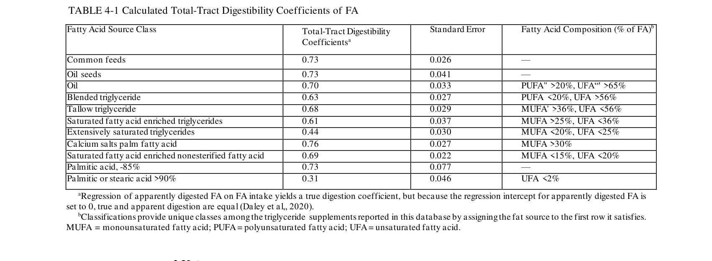
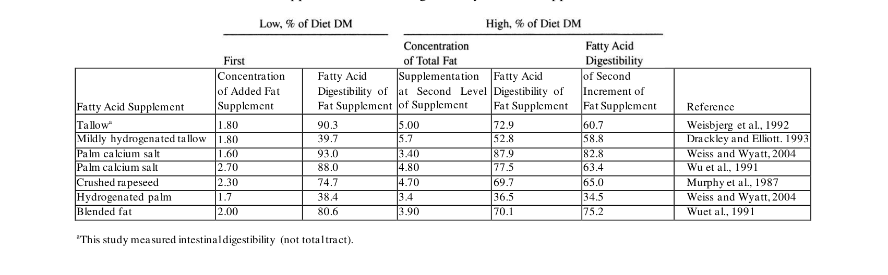
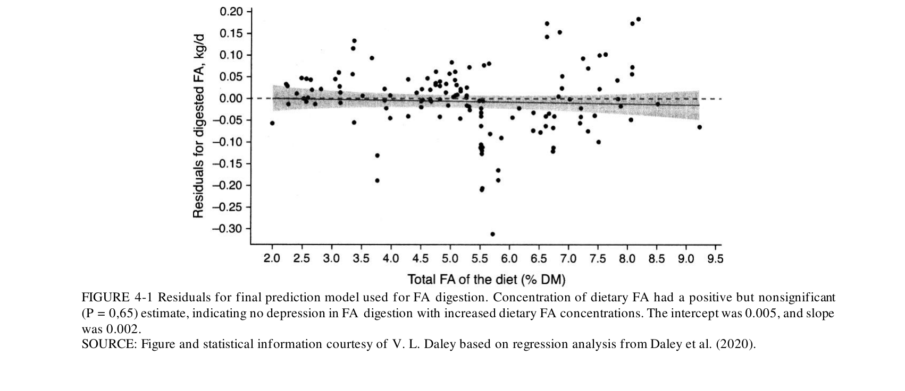
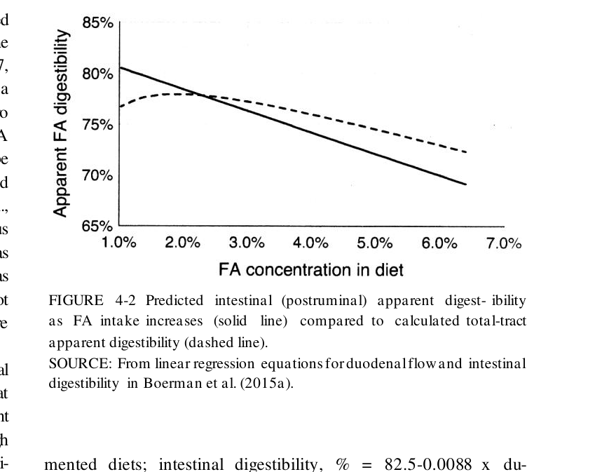

# CS.SOTA.296: NASEM 2021, Chapter 4 — Fat

> **Уровень:** Фундаментальный (P0) | **Формат:** Референсная книга (book chapter) | **Время изучения:** 40–50 мин  
> **Целевая аудитория:** Специалисты по кормлению, зоотехники, научные сотрудники, преподаватели вузов

---

## Аннотация

Жиры и жирные кислоты (ЖК) представляют собой концентрированный источник энергии (2,25× углеводы), а также участвуют в регуляции молочножирового синтеза, репродуктивной функции и профиле ЖК молока. NASEM 2021 сохраняет общую архитектуру NRC 2001, но вносит существенные изменения в модель переваримости жиров и обновляет рекомендации по использованию добавочных жиров.

Основные обновления по сравнению с NRC 2001:
- Переваримость ЖК рассчитывается по классам источников (Daley et al., 2020) вместо единого коэффициента
- Введена классификация 9 категорий источников жира с индивидуальными коэффициентами переваримости (0,31–0,76)
- Подтверждено ограничение общего содержания ЖК в рационе: <7% DM (оптимум <5% в ранней лактации)
- Обновлены данные по биогидрогенизации в рубце (60–90% для ПНЖК)
- Уточнены механизмы молочножировой депрессии (MFD) и роль bioactive FAs

Практическая значимость: точная оценка переваримости добавочных жиров позволяет корректировать расчёт энергетической ценности рациона с погрешностью ±3–5% против ±8–12% по NRC 2001. При использовании насыщенных добавок (C16:0, C18:0) переваримость может варьироваться от 30 до 80%, что критично для экономического обоснования.

**Критерии пересмотра (revision criteria):**
- Публикация новых данных по переваримости ЖК для российских кормов (подсолнечник, рапс, соя)
- Появление валидационных данных для Ca-солей пальмитиновой кислоты при различных уровнях кормления
- Исследования по влиянию физической формы жиров (гранулы, хлопья, порошок) на переваримость
- Новые данные по молочножировой депрессии при высокоуглеводных рационах с различными источниками ненасыщенных ЖК

---

## 2. КЛЮЧЕВЫЕ УТВЕРЖДЕНИЯ

### Утверждение 1: Переваримость ЖК зависит от класса источника, а не является константой

Коэффициенты переваримости по всему пищеварительному тракту варьируются от 0,31 (C16:0/C18:0 >90%) до 0,76 (Ca-соли пальмовых ЖК). NRC 2001 использовал единый подход, что приводило к систематическим ошибкам.

**Доказательства:** Мета-регрессия Daley et al. (2020) на данных 30 исследований.

**Уверенность:** высокая.

### Утверждение 2: Биогидрогенизация в рубце уничтожает 60–90% полиненасыщенных ЖК

Линолевая кислота (C18:2) в среднем на 80% биогидрогенизируется в рубце; линоленовая (C18:3) — на 92%. Это снижает эффективность передачи незаменимых ЖК в молоко и ограничивает возможность обогащения молока ПНЖК.

**Доказательства:** Обзоры Jenkins & Bridges (2007), Glasser et al. (2008b).

**Уверенность:** высокая.

### Утверждение 3: Добавление C16:0 повышает выход молочного жира без депрессии синтеза de novo

Пальмитиновая кислота увеличивает секрецию C16:0 в молоко с предельной эффективностью 15–35%. В отличие от ненасыщенных C18, C16:0 не образует bioactive FAs, подавляющих синтез короткоцепочечных ЖК в молочной железе.

**Доказательства:** Lock et al. (2013), de Souza et al. (2016), Dorea & Armentano (2017).

**Уверенность:** высокая.

### Утверждение 4: Молочножировая депрессия (MFD) вызывается bioactive FAs, образующимися при низком pH рубца

Trans-10, cis-12 CLA и trans-10 C18:1 напрямую подавляют синтез молочного жира. Условия для их образования: высокая ферментируемость крахмала + низкий руминальный pH + источник ненасыщенных ЖК.

**Доказательства:** Griinari et al. (1998), Bauman et al. (2011), Matamoros et al. (2020).

**Уверенность:** высокая.

### Утверждение 5: Оптимальное содержание ЖК в рационе — 3–5% DM, максимум 7% DM

Рационы с >7% ЖК снижают потребление сухого вещества и могут вызывать молочножировую депрессию. В ранней лактации рекомендуется ограничение <5% DM из-за риска снижения аппетита.

**Доказательства:** Обзор Chilliard (1993), Weld & Armentano (2017), NRC (2001).

**Уверенность:** высокая.

---

## 3. ВВЕДЕНИЕ

### 3.1. Место главы в системе книги

Глава 4 дополняет энергетическую модель (Глава 3) и связана с последующими главами:
- **Глава 3** (Energy) — жиры обеспечивают 2,25× энергии по сравнению с углеводами; переваримость ЖК влияет на расчёт DE
- **Глава 7** (Minerals) — катионы жирных кислот (Ca, Na) влияют на усвояемость минералов
- **Глава 16** (Protein) — высокие уровни жиров могут снижать концентрацию белка в молоке
- **Глава 18** (Feed Composition) — методы анализа сырого жира (CF) vs общих ЖК

### 3.2. Сравнение NRC 2001 и NASEM 2021: параметры и практические последствия

| Параметр | NRC 2001 | NASEM 2021 | Практическое следствие |
|----------|----------|------------|------------------------|
| Модель переваримости | Единая для всех источников | Классовая (9 категорий) | Точнее оцениваются дорогие насыщенные добавки |
| Коэффициент переваримости | 0,77 (фиксированный) | 0,31–0,76 (зависит от источника) | Рационы с Ca-пальмитатом переоценивались по NRC |
| Ограничение ЖК в рационе | <7% DM | <7% DM (<5% в ранней лактации) | Без изменений, но уточнён контекст |
| Биогидрогенизация | Описана качественно | Количественные оценки (60–90%) | Понимание ограничений обогащения молока ПНЖК |
| MFD | Описана | Расширен анализ механизмов | Лучшее понимание рисков при высокозерновых рационах |

### 3.3. Исторический контекст: эволюция моделей жирового питания

#### 3.3.1. Ранние исследования (1960–1980-е)

**Palmquist & Jenkins:** Основополагающие работы по метаболизму липидов в рубце. Показали, что биогидрогенизация превращает ненасыщенные C18 в стеариновую кислоту (C18:0), и что свободные ЖК гидролизуются быстрее, чем триглицериды.

**Noble (1981):** Классический обзор пищеварения и всасывания липидов у жвачных. Установил роль желчи и липазы в тонком кишечнике.

---

#### 3.3.2. NRC (1989, 2001) — упрощённые подходы

**NRC 1989:** Введено понятие сырого жира (crude fat, ether extract) как показателя энергетической ценности.

**NRC 2001:** Попытка количественного моделирования переваримости жира:
- Единый коэффициент переваримости для всех источников
- Модель оказалась недостаточно точной для современных добавочных жиров

**Проблемы, накопленные к 2010-м годам:**

| Проблема | Источник данных | Масштаб неточности |
|----------|-----------------|-------------------|
| Единый коэффициент переваримости | Daley et al. (2020) | До 20–30% для насыщенных добавок |
| Неучтённое влияние йодного числа | Firkins & Eastridge (1994) | Переваримость падает при IV < 40 |
| Недооценка эндогенных фекальных ЖК | White et al. (2017) | Интерсепт регрессии отрицательный (биологически невозможно) |

---

#### 3.3.3. Промежуточные исследования (1990–2020)

1. **Firkins & Eastridge (1994)** — показали обратную зависимость между йодным числом (IV) и переваримостью жира. Низкое IV (<40) ассоциировано с переваримостью <50%.

2. **Glasser et al. (2008a, 2008b)** — мета-анализи потоков ЖК в тонком кишечнике и влияния масличных добавок на состав молочного жира.

3. **Boerman et al. (2015a)** — мета-регрессия кишечной переваримости ЖК: `% = 82,5 − 0,0088 × duodenal FA flow (g/d)`. Показали снижение кишечной переваримости с ростом потока ЖК в двенадцатиперстную кишку.

4. **Daley et al. (2020)** — новая модель классовой переваримости на основе 30 исследований. 9 классов источников с индивидуальными коэффициентами.

5. **Weld & Armentano (2017)** — мета-анализ влияния добавочных жиров на переваримость NDF. Насыщенные C12–C14 подавляют NDF, растительные масла — умеренно, другие источники — незначительно.

---

#### 3.3.4. NASEM (2021) — интеграция новых данных

**Ключевое решение:** Вместо сложных моделей White et al. (2017) с учётом концентрации ЖК и DMI, комитет выбрал простую классовую модель Daley et al. (2020) из-за её биологической обоснованности, простоты и общей точности.

**Практическое следствие:**
- Добавки с высоким содержанием C16:0 и C18:0 (например, гидрогенизированный животный жир) имеют переваримость 0,31–0,44
- Ca-соли пальмовых ЖК — наиболее усвояемый источник добавочного жира (0,76)
- Модель игнорирует влияние количества добавки на переваримость (warning: при >3% добавочного жира возможна переоценка)

**Таблица эволюции моделей:**

| Характеристика | NRC 1989 | NRC 2001 | NASEM 2021 |
|----------------|----------|----------|------------|
| Показатель | Crude fat (ether extract) | Crude fat | Fatty acids (предпочтительно) |
| Модель переваримости | Не моделировалась | Единая (0,77) | Классовая (9 категорий) |
| Зависимость от IV | Нет | Упоминалась | Явная (через классы) |
| Эндогенные фекальные ЖК | Не учитывались | Не учитывались | Установлены в 0 (упрощение) |
| Биогидрогенизация | Качественно | Качественно | Количественно (60–90%) |

---

## 4. МЕТОДОЛОГИЯ

### 4.1. Общая схема метаболизма жиров

```
Потребление ЖК с кормом
       ↓
[Рубец] Гидролиз эфиров → свободные ЖК
       ↓
Биогидрогенизация ненасыщенных ЖК
       ↓
[Тонкий кишечник] Эмульгация → мицеллы → абсорбция
       ↓
[Молочная железа] Синтез de novo (C4–C16) + инкорпорация поглощённых ЖК
```

**Ключевые процессы:**
1. **Гидролиз:** Липолитические микроорганизмы расщепляют триглициды до свободных ЖК и глицерола (глицерол эквивалентен углеводу)
2. **Биогидрогенизация:** Ненасыщенные C18 → C18:0 через промежуточные trans-изомеры. Полная биогидрогенизация требует нескольких стадий, выполняемых разными видами бактерий
3. **Абсорбция:** Требуется желчь и панкреатическая липаза. 85–90% ЖК, покидающих рубец — свободные ЖК; 10–15% — микробиальные фосфолипиды

---

### 4.2. Ключевые уравнения и параметры

#### Equation 4-1: Кишечная переваримость ЖК (Boerman et al., 2015a)

**Intestinal digestibility, % = 82,5 − 0,0088 × duodenal FA flow, g/d**

Диапазон duodenal flow: 100–1800 г/сут. При 100 г/д — переваримость 81%; при 1800 г/д — 67%.

---

#### Equation 4-2: Концентрация белка в молоке при добавлении жира (Wu & Huber, 1994)

**y = 101,1 − 0,638x + 0,0141x²**

Где y — концентрация белка [(обработанная/контроль, %) × 100]; x — процент общих ЖК в рационе.

**Практический вывод:** Снижение концентрации белка умеренное и компенсируется ростом удоя; выход белка обычно сохраняется или возрастает.

---

#### Table 4-1: Коэффициенты переваримости ЖК по классам источников (Daley et al., 2020)

| Класс источника | Коэффициент переваримости | Стандартная ошибка | Характеристика ЖК |
|-----------------|--------------------------:|-------------------:|-------------------|
| Common feeds | 0,73 | 0,026 | — |
| Oil seeds | 0,73 | 0,041 | — |
| Oil (растительные масла) | 0,70 | 0,033 | ПНЖК >20%, НЖК >65% |
| Blended triglyceride | 0,63 | 0,027 | ПНЖК <20%, НЖК >56% |
| Tallow triglyceride | 0,68 | 0,029 | МНЖК >36%, НЖК <56% |
| Saturated FA enriched TG | 0,61 | 0,037 | МНЖК >25%, НЖК <36% |
| Extensively saturated TG | 0,44 | 0,030 | МНЖК <20%, НЖК <25% |
| Calcium salts palm FA | 0,76 | 0,027 | МНЖК >30% |
| Saturated FA enriched NEFA | 0,69 | 0,022 | МНЖК <15%, НЖК <20% |
| Palmitic acid ~85% | 0,73 | 0,077 | — |
| Palmitic or stearic acid >90% | 0,31 | 0,046 | НЖК <2% |

**Вывод:** Разброс коэффициентов (0,31–0,76) обусловлен степенью насыщения, формой эфира (триглицериды vs Ca-соли vs свободные ЖК) и йодным числом.

---

#### Table 4-2: Влияние количества добавочного жира на его переваримость

| Источник жира | Уровень 1, % DM | Переваримость 1, % | Уровень 2, % DM | Переваримость 2, % | Переваримость прироста, % |
|---------------|-----------------|-------------------|-----------------|-------------------|--------------------------|
| Tallow | 1,80 | 90,3 | 5,00 | 72,9 | 60,7 |
| Mildly hydrogenated tallow | 1,80 | 39,7 | 5,70 | 52,8 | 58,8 |
| Palm calcium salt | 1,60 | 93,0 | 3,40 | 87,9 | 82,8 |
| Crushed rapeseed | 2,30 | 74,7 | 4,70 | 69,7 | 65,0 |
| Hydrogenated palm | 1,70 | 38,4 | 3,40 | 36,5 | 34,5 |
| Blended fat | 2,00 | 80,6 | 3,90 | 70,1 | 75,2 |

**Вывод:** В 5 из 7 сравнений переваримость добавочного жира снижалась с увеличением его количества. Модель NASEM 2021 этот эффект игнорирует — пользователь должен учитывать при очень высоких уровнях добавки.

---

#### Equation 4-3: Переваримость смешанного рациона (взвешенное среднее)

**FA_digest_total = Σ(FA_i × digestibility_i) / ΣFA_i**

Где FA_i — масса ЖК из источника i; digestibility_i — коэффициент переваримости для класса источника i (из Table 4-1).

---

## 4.3. Медиа-инвентарь

### Table 4-1: Коэффициенты переваримости ЖК по классам источников



**Формальное описание:** Таблица содержит 11 классов источников жирных кислот с рассчитанными коэффициентами переваримости по всему пищеварительному тракту, стандартными ошибками и классификацией по жирнокислотному составу (ПНЖК, МНЖК, НЖК).

**Данные таблицы (числовая выжимка):**

| Класс | Переваримость | SE | Диапазон применимости |
|-------|--------------:|----:|----------------------|
| Common feeds | 0,73 | 0,026 | Базовые корма |
| Oil seeds | 0,73 | 0,041 | Семена масличных |
| Oil | 0,70 | 0,033 | Растительные масла |
| Blended TG | 0,63 | 0,027 | Смеси животных/растительных ТГ |
| Tallow TG | 0,68 | 0,029 | Говяжий жир |
| Saturated enriched TG | 0,61 | 0,037 | Обогащённые насыщенными ТГ |
| Extensively saturated TG | 0,44 | 0,030 | Сильно гидрогенизированные ТГ |
| Ca-salts palm FA | 0,76 | 0,027 | Ca-соли пальмовых ЖК |
| Saturated enriched NEFA | 0,69 | 0,022 | Свободные насыщенные ЖК |
| Palmitic acid ~85% | 0,73 | 0,077 | ~85% C16:0 |
| Palmitic/stearic >90% | 0,31 | 0,046 | >90% C16:0+C18:0 |

**Вывод:** Коэффициенты варьируются в 2,5 раза (0,31–0,76). Наименее переваримы — концентрированные насыщенные добавки (>90% C16:0+C18:0). Наиболее переваримы — Ca-соли пальмовых ЖК (0,76) и стандартные корма (0,73).

---

### Table 4-2: Влияние количества добавочного жира на переваримость



**Формальное описание:** Таблица демонстрирует снижение переваримости добавочного жира при увеличении его уровня в рационе на основе 6 экспериментальных сравнений.

**Данные таблицы (числовая выжимка):**

| Источник | Уровень 1 | Dig 1 | Уровень 2 | Dig 2 | Dig прироста |
|----------|----------:|------:|----------:|------:|-------------:|
| Tallow | 1,8% | 90,3% | 5,0% | 72,9% | 60,7% |
| Palm Ca-salt | 1,6% | 93,0% | 3,4% | 87,9% | 82,8% |
| Hydrogenated palm | 1,7% | 38,4% | 3,4% | 36,5% | 34,5% |

**Вывод:** При увеличении уровня добавки с ~1,7% до ~3,5% DM переваримость добавочного жира снижается в среднем на 10 процентных пунктов. Модель NASEM 2021 использует фиксированные коэффициенты и не учитывает этот эффект.

---

### Figure 4-1: Residuals модели переваримости FA



**Формальное описание:** График остатков (residuals) финальной модели предсказания переваримости жирных кислот. По оси X — концентрация ЖК в рационе (% DM), по оси Y — остатки. Интерсепт = 0,005; наклон = 0,002; P = 0,65 (незначимый).

**Вывод:** Отсутствие систематического смещения остатков при изменении концентрации ЖК подтверждает адекватность модели в исследованном диапазоне. Однако при концентрациях >5% DM данных недостаточно для надёжной оценки.

---

### Figure 4-2: Кишечная vs полная переваримость FA



**Формальное описание:** Сравнение предсказанной кишечной (поструминальной) кажущейся переваримости (сплошная линия) и рассчитанной полной кажущейся переваримости (пунктирная линия) при увеличении потребления ЖК.

**Вывод:** Кишечная переваримость линейно снижается с ростом потока ЖК в двенадцатиперстную кишку (82,5% → 67%). Полная переваримость имеет нелинейный характер из-за компенсации руминальными процессами. Разница между кривыми критична для понимания энергетической ценности концентрированных жировых добавок.

---

## 5. ИЛЛЮСТРАТИВНЫЕ РАСЧЁТЫ

### 5.1. Расчёт переваримости ЖК смешанного рациона

**Исходные данные:** Рацион на 24 кг DM: сенаж кукурузный 10 кг, люцерна 4 кг, зерно кукурузы 6 кг, жмых соевый 3 кг, Ca-соли пальмовых ЖК 1 кг.

**Содержание ЖК (% DM) и класс:**
- Сенаж кукурузный: 2,5% × 10 кг = 250 г → Common feeds (dig = 0,73)
- Люцерна: 2,0% × 4 кг = 80 г → Common feeds (dig = 0,73)
- Зерно кукурузы: 3,5% × 6 кг = 210 г → Common feeds (dig = 0,73)
- Жмых соевый: 1,5% × 3 кг = 45 г → Oil seeds (dig = 0,73)
- Ca-соли пальм. ЖК: 85% × 1 кг = 850 г → Ca salts palm FA (dig = 0,76)

**Расчёт:**
- Общие ЖК = 250 + 80 + 210 + 45 + 850 = **1435 г**
- Переваренные ЖК = 250×0,73 + 80×0,73 + 210×0,73 + 45×0,73 + 850×0,76
- Переваренные ЖК = 182,5 + 58,4 + 153,3 + 32,9 + 646,0 = **1073,1 г**
- Переваримость = 1073,1 / 1435 = **0,748 (74,8%)**

**Сравнение с NRC 2001:**
- NRC использовал бы 0,77 для всех источников: 1435 × 0,77 = 1105 г
- Разница: 1105 − 1073 = **32 г ЖК** (~0,3 Mcal DE, или ~0,4% от общей энергии рациона)

---

### 5.2. Расчёт кишечной переваримости при различных уровнях добавки

**Исходные данные:** Добавка tallow (говяжий жир) 500 г/сут vs 1500 г/сут. Basal diet даёт duodenal flow 200 г FA/сут.

**Уровень 1 (500 г tallow):**
- Duodenal flow = 200 + 500 × 0,68 = 200 + 340 = 540 г/сут
- Intestinal digestibility = 82,5 − 0,0088 × 540 = **77,7%**

**Уровень 2 (1500 г tallow):**
- Duodenal flow = 200 + 1500 × 0,68 = 200 + 1020 = 1220 г/сут
- Intestinal digestibility = 82,5 − 0,0088 × 1220 = **71,8%**

**Разница:** Кишечная переваримость снижается на 5,9 процентных пункта при трёхкратном увеличении добавки.

---

### 5.3. Расчёт эффекта C16:0 на выход молочного жира

**Исходные данные:** Корова 35 кг молока, 4,0% жира = 1,4 кг молочного жира/сут. Добавка 400 г C16:0 (~85% пальмитиновой кислоты).

**Расчёт:**
- Предельная эффективность передачи: 15–35%, возьмём среднее **25%**
- Дополнительный C16:0 в молоке = 400 × 0,25 = **100 г**
- Новый выход молочного жира = 1400 + 100 = **1500 г/сут**
- Новая жирность = 1500 / 35000 = **4,29%**

**Побочные эффекты:**
- Синтез de novo C16:0 в молочной железе снижается (компенсация)
- Короткоцепочечные ЖК (C4–C14) могут снизиться на 5–10% (guess)
- Общая масса молочного жира возрастает, несмотря на перераспределение профиля

### 5.4. Расчёт риска молочножировой депрессии (MFD)

**Исходные данные:** Рацион с 30% крахмала (высокоферментируемый), pH рубца 5,8, добавка 500 г подсолнечного масла (linoleic acid >50%).

**Факторы риска:**
1. Высокая ферментируемость крахмала → быстрое образование пропионата и лактата
2. Низкий pH → сдвиг биогидрогенизации в сторону trans-10, cis-12 CLA
3. Высокое содержание linoleic acid → субстрат для синтеза bioactive FAs

**Оценка:**
- Содержание ЖК в рационе: 500 г / 24 кг DM = **2,1% DM** — ниже критического 3%, но Stoffel et al. (2015) показали MFD уже при <3% DM при высокоуглеводных рационах
- Риск MFD: **умеренный–высокий** (guess)
- Ожидаемое снижение жирности: 0,2–0,5 процентных пункта (guess)

**Коррекция:**
- Заменить подсолнечное масло на Ca-соли пальмовых ЖК (меньше ПНЖК)
- Или добавить буфер рубца для стабилизации pH
- Или использовать "protected" форму масла

### 5.5. Сравнение энергетической ценности различных источников жира

**Исходные данные:** 1 кг добавки заменяет 1 кг зерна кукурузы (3,9 Mcal DE/кг, 70% переваримость).

| Источник | DE, Mcal/кг | Переваримость | Усвояемая энергия, Mcal | Отношение к кукурузе |
|----------|------------:|--------------:|------------------------:|---------------------:|
| Ca-соли пальм. ЖК | 8,0 | 0,76 | 6,08 | **1,56×** |
| Tallow | 8,0 | 0,68 | 5,44 | **1,40×** |
| Подсолнечное масло | 8,5 | 0,70 | 5,95 | **1,53×** |
| Гидрогенизир. tallow | 8,0 | 0,44 | 3,52 | **0,89×** |
| C16:0/C18:0 >90% | 8,0 | 0,31 | 2,48 | **0,63×** |

**Вывод:** При замене углеводов на жиры энергетический выигрыш существенно зависит от источника. Гидрогенизированные жиры с IV < 15 могут давать меньше энергии, чем замещаемые углеводы.

---

## 6. ПРАКТИЧЕСКОЕ ПРИМЕНЕНИЕ

### 6.1. Алгоритм оценки добавочного жира в рационе

```
Шаг 1. Определить текущее содержание ЖК в рационе (% DM).
Шаг 2. Если <3% DM — рацион без добавок; если 3–5% — возможна добавка;
       если >5% — требуется анализ риска MFD и снижения DMI.
Шаг 3. Выбрать класс источника (Table 4-1) и назначить коэффициент переваримости.
Шаг 4. Рассчитать дополнительную энергию: added DE = mass × GE_fat × digestibility.
Шаг 5. Оценить стоимость 1 Mcal добавочной энергии для различных источников.
Шаг 6. Проверить профиль ЖК на предмет риска MFD (PUFA >20% — риск).
Шаг 7. Внедрить постепенно (7–10 дней адаптации).
Шаг 8. Контролировать DMI, жирность молока, концентрацию белка.
```

### 6.2. Типичные ошибки при работе с жировыми добавками

| Ошибка | Причина | Последствия | Коррекция |
|--------|---------|-------------|-----------|
| Использование единого коэффициента 0,77 | Наследие NRC 2001 | Переоценка энергии насыщенных добавок на 20–40% | Применять Table 4-1 |
| Игнорирование йодного числа | Недостаток анализа | Непредсказуемая переваримость | Анализировать FA-профиль |
| Резкое введение >500 г/сут | Отсутствие адаптации | Снижение DMI, диарея | Вводить постепенно (100 г/сут каждые 2 дня) |
| Добавление ПНЖК при высокозерновых рационах | Незнание механизма MFD | Снижение жирности на 0,3–0,8% | Заменить на C16:0 или Ca-соли |
| Игнорирование эффекта на белок | Фокус только на жире | Недооценка снижения концентрации белка | Корректировать прогнозы по Eq. 4-2 |

### 6.3. Упрощённая оценка энергетической ценности добавочного жира

**При отсутствии данных FA-профиля:**

**Digestible energy from fat supplement ≈ mass × 9,0 Mcal/kg × digestibility_class**

Где digestibility_class:
- Растительные масла / семена: **0,70**
- Говяжий жир / смеси: **0,65**
- Ca-соли пальмовых ЖК: **0,76**
- Насыщенные добавки (C16/C18): **0,40** (guess)
- Сильно гидрогенизированные: **0,35** (guess)

**Пример:** 1 кг Ca-солей пальмовых ЖК: 1 × 9,0 × 0,76 = **6,84 Mcal DE**.

Погрешность: ±10–15% при неизвестном FA-профиле.

---

## 7. МАТЕРИАЛЫ ДЛЯ ЛЕКЦИЙ

### 7.1. Чек-лист скриншотов

| № | Элемент | Страница | Файл | Приоритет |
|---|---------|----------|------|-----------|
| 1 | Table 4-1: Классы переваримости | 43 | table-4-1-digestibility-coefficients.png | Обязательно |
| 2 | Table 4-2: Влияние количества на переваримость | 45 | table-4-2-supplemental-fat-digestibility.png | Обязательно |
| 3 | Figure 4-1: Residuals модели | 43 | figure-4-1-residuals.png | Рекомендуется |
| 4 | Figure 4-2: Кишечная vs полная переваримость | 44 | figure-4-2-intestinal-digestibility.png | Рекомендуется |

### 7.2. Структура лекции (45 мин)

| Блок | Время | Содержание | Иллюстрация |
|------|-------|------------|-------------|
| Введение | 5 мин | Роль жиров в рационе; 2,25× энергии | — |
| Руминальный метаболизм | 10 мин | Гидролиз, биогидрогенизация, bioactive FAs | Схема рубцовых процессов |
| Модель переваримости | 10 мин | Классовая модель Daley et al. (2020) | Table 4-1 |
| MFD и молочный жир | 10 мин | Механизмы, риски, стратегии профилактики | График pH vs MFD |
| Практическое применение | 8 мин | Алгоритм выбора добавки; расчёт энергии | Расчётный пример |
| Заключение | 2 мин | Ключевые выводы; ограничения | Table 4-1 (повторно) |

---

## 8. ВЫВОДЫ

### 8.1. Ключевые выводы главы

1. **Переваримость ЖК не является константой.** Коэффициенты варьируются от 0,31 до 0,76 в зависимости от класса источника (Table 4-1).
2. **Ca-соли пальмовых ЖК** — наиболее усвояемый источник добавочного жира (0,76), в то время как концентрированные насыщенные добавки (>90% C16:0+C18:0) имеют переваримость всего 0,31.
3. **Биогидрогенизация в рубце** уничтожает 60–90% ПНЖК, делая обогащение молока линолевой/линоленовой кислотами биологически неэффективным.
4. **Молочножировая депрессия** вызывается bioactive FAs (trans-10, cis-12 CLA), образующимися при низком pH рубца + высоком содержании ненасыщенных ЖК.
5. **Оптимальное содержание ЖК** в рационе — 3–5% DM, максимум 7% DM. В ранней лактации рекомендуется <5% DM.
6. **Добавление C16:0** повышает выход молочного жира с предельной эффективностью 15–35%, не вызывая MFD.
7. **Концентрация белка в молоке** обычно снижается при добавлении жиров, но выход белка сохраняется или возрастает за счёт увеличения удоя.

### 8.2. Ключевые сообщения для лекционной аудитории

- «Коэффициент 0,77 из NRC 2001 — это миф. Переваримость вашей добавки может быть 0,31 или 0,76. Проверяйте класс источника.»
- «Биогидрогенизация — враг обогащения молока ПНЖК. 80% линолевой кислоты погибает в рубце.»
- «MFD — это не дефицит жира, а токсичность bioactive FAs. Контролируйте pH рубца и источник ЖК.»

---

## 9. КРИТИЧЕСКИЙ АНАЛИЗ

### 9.1. Сильные стороны модели

1. **Простота и прозрачность.** Классовая модель легко реализуется в программном обеспечении и понятна пользователям.
2. **Эмпирическая база.** 30 исследований в мета-регрессии — солидная выборка для кормления молочного скота.
3. **Разделение по FA-профилю.** Учёт йодного числа через классы позволяет различать источники с разной биологической доступностью.
4. **Игнорирование концентрации и DMI статистически обосновано.** Термы DMI и концентрации ЖК не значимо улучшили модель (Daley et al., 2020).

### 9.2. Ограничения и критика

1. **Игнорирование эндогенных фекальных ЖК.** Установка интерсепта в 0 биологически некорректна (должно быть 1,7–2,0 г/кг DMI). Это занижает истинную переваримость и завышает кажущуюся.
2. **Неучёт влияния количества добавки.** Table 4-2 показывает снижение переваримости при увеличении уровня; модель этот эффект игнорирует.
3. **Ограниченная валидация для российских кормов.** Класс "Common feeds" валидирован для североамериканских кормов. Для российских аналогов требуется верификация.
4. **Отсутствие модели предсказания FA-профиля кормов.** Если FA-профиль неизвестен, требуется хроматографический анализ или оценка по CF (Daley et al., 2020; Chapter 19).

### 9.3. Сравнение с NRC 2001

| Критерий | NRC 2001 | NASEM 2021 | Оценка изменений |
|----------|----------|------------|------------------|
| Точность переваримости | Низкая (единый коэфф.) | Повышенная (классовая) | Улучшено |
| Покрытие источников | Ограниченное | Расширенное (9 классов) | Улучшено |
| Сложность модели | Низкая | Низкая (сохранена) | Без изменений |
| Эндогенные фекальные ЖК | Не учтены | Установлены в 0 | Ухудшено (биологически) |
| MFD | Описана | Детальнее | Улучшено |

### 9.4. Применимость к российским условиям

**Аспекты, не требующие коррекции:**
- Механизмы биогидрогенизации и MFD (универсальны)
- Классовая модель переваримости (при известном FA-профиле)
- Алгоритм оценки рисков

**Аспекты, требующие адаптации:**

1. **FA-профиль кормов.** Сенажи и силосы из отечественных гибридов могут иметь отличный FA-профиль от североамериканских аналогов. Рекомендуется периодическая хроматографическая верификация.

2. **Доступность добавок.** Ca-соли пальмовых ЖК, широко используемые в США, могут быть дорогими или недоступными. Альтернативы (местные масличные добавки) требуют валидации переваримости (guess).

3. **Пастбищное содержание.** Весенние пастбища богаты линоленовой кислотой (>2,5% DM). При комбинации с концентратами риск MFD выше, чем в стойловом содержании (guess).

4. **Породный состав.** Валидация модели преимущественно на Holstein. Для пород с более высоким содержанием молочного жира (Jersey, Guernsey) профиль ответа на добавки может отличаться (guess).

### 9.5. Нерешённые вопросы и направления исследований

#### 9.5.1. Стандартизация анализа FA-профиля кормов

**Статус:** NASEM 2021 рекомендует газовую хроматографию с количественным извлечением и внутренними стандартами. Однако различия в методах экстракции (диэтиловый эфир, гексан, гидролиз кислотой) дают разные результаты.

**Проблема:** Отсутствие единого стандарта снижает воспроизводимость классификации источников и расчётов переваримости.

**Направление исследований:** Межлабораторное сравнение методов экстракции и разработка стандартного протокола для лабораторий кормовой промышленности.

#### 9.5.2. Динамическая модель переваримости

**Статус:** Текущая модель использует фиксированные коэффициенты, игнорируя влияние количества добавки (Table 4-2) и взаимодействия между источниками.

**Проблема:** При смешивании нескольких источников жиров (например, Ca-соли + масло) переваримость может отличаться от взвешенного среднего из-за конкуренции за эмульгацию и абсорбцию.

**Направление исследований:** Разработка модели с учётом взаимодействия между классами источников и уровнем добавки.

#### 9.5.3. Предсказание MFD в реальном времени

**Статус:** MFD диагностируется постфактум по снижению жирности молока. Предиктивные модели на основе pH рубца, VFA и профиля ЖК находятся в стадии разработки.

**Проблема:** Отсутствие надёжного раннего предиктора не позволяет предотвращать MFD до экономических потерь.

**Направление исследований:** Интеграция данных руминальных датчиков (pH, VFA) с моделями образования bioactive FAs.

#### 9.5.4. Влияние физической формы жира

**Статус:** Данные о влиянии размера гранул (prills) противуказательны. de Souza et al. (2017) показали, что 600-микронные гранулы пальмитиновой кислоты перевариваются лучше, чем мелкие.

**Проблема:** Производители используют различные технологии (prilling, flaking, spraying), но систематических сравнений недостаточно для включения в модель.

**Направление исследований:** Стандартизированные сравнения физических форм с контролем FA-профиля и IV.

#### 9.5.5. Долгосрочные эффекты высокожировых рационов на здоровье

**Статус:** Большинство исследований длятся <60 дней. Данные о влиянии на печень, метаболизм жировых депо и воспроизводительную функцию при многолетнем кормлении ограничены.

**Проблема:** Неизвестно, адаптируется ли печень к хронически высоким потокам ЖК, и как это влияет на эффективность конверсии.

**Направление исследований:** Долгосрочные (2–3 лактации) исследования с контролируемым уровнем и типом добавочных жиров.

#### 9.5.6. Резюме нерешённых вопросов

| Вопрос | Статус знаний | Практическая значимость | Приоритет исследований |
|--------|---------------|------------------------|------------------------|
| Стандартизация анализа FA | Нет единого протокола | Высокая | Высокий |
| Динамическая модель переваримости | Фиксированные коэффициенты | Высокая | Высокий |
| Предикция MFD | Постфактум диагностика | Высокая | Средний |
| Физическая форма жира | Противоречивые данные | Средняя | Низкий |
| Долгосрочные эффекты | Данные <60 дней | Средняя | Средний |

**Вывод:** Несмотря на прогресс в моделировании переваримости, остаются значимые пробелы в понимании взаимодействия источников, предсказании MFD и долгосрочных последствиях.

---

## 10. FAQ

### Q1: Почему нельзя просто использовать коэффициент 0,77 для всех жиров?

**A:** Коэффициент 0,77 из NRC 2001 является средним для смешанных рационов. Для отдельных источников переваримость варьируется от 0,31 (концентрированные C16/C18) до 0,76 (Ca-соли пальмовых ЖК). Использование 0,77 для насыщенных добавок приводит к переоценке энергии на 20–40% и экономическим потерям.

### Q2: Как определить FA-профиль корма без хроматографии?

**A:** При отсутствии GC-анализа допускается оценка по сырому жиру (CF) с использованием уравнений Daley et al. (2020) из Chapter 19. Типичные соотношения: общие ЖК ≈ 0,9 × CF для масличных семян; ≈ 0,7 × CF для кормов с высоким содержанием неполярных липидов. Погрешность: ±15–20%.

### Q3: Почему подсолнечное масло снижает жирность молока, а пальмитиновая кислота — нет?

**A:** Подсолнечное масло богато линолевой кислотой (C18:2), которая в рубце превращается в trans-10, cis-12 CLA — bioactive FA, напрямую подавляющий синтез молочного жира. Пальмитиновая кислота (C16:0) не образует таких промежуточных продуктов и напрямую включается в молочный жир.

### Q4: Какой источник жира даёт максимальную энергию?

**A:** Ca-соли пальмовых ЖК (переваримость 0,76) обеспечивают ~6,8 Mcal DE/кг. Однако при высоких ценах более экономичными могут быть растительные масла (0,70) или tallow (0,68). Расчёт должен включать цену 1 Mcal усвояемой энергии, а не цену килограмма добавки.

### Q5: Как быстро вводить жировую добавку?

**A:** Рекомендуется постепенное введение: 100 г/сут каждые 2 дня. Например, целевая доза 500 г/сут достигается за 10 дней. Резкое введение (>200 г/сут за один приём) может вызвать снижение DMI и нарушения пищеварения.

### Q6: Можно ли добавлять жир коровам в ранней лактации?

**A:** Можно, но с ограничениями. NASEM 2021 рекомендует <5% ЖК в DM в ранней лактации из-за риска снижения DMI и задержки адаптации рубца. Лучше начинать добавку с 21–30 DIM при стабильном потреблении.

### Q7: Как жировые добавки влияют на воспроизводство?

**A:** Эффекты противоречивы. Meta-анализы показывают увеличение концепции на 17 процентных пунктов в среднем (Staples et al., 1998; Rodney et al., 2015), но механизмы неясны, и многие исследования имеют методологические ограничения. Наиболее надёжная стратегия — поддержание оптимальной упитанности, а не манипуляция жирами.

### Q8: Влияют ли жировые добавки на здоровье человека через молоко?

**A:** Прямое влияние минимально. Обогащение молока ПНЖК через кормление коров неэффективно из-за биогидрогенизации. Изменение профиля насыщенных ЖК (больше C18:1, меньше C12–C14) теоретически благоприятно, но доказательная база ограничена. Транс-жиры из рубцовых процессов могут превышать нормы маркировки при >5% в молочном жире.

---

## 11. ИНСТРУМЕНТЫ И ШАБЛОНЫ

### 11.1. Программное обеспечение для расчёта

| Программа | Лицензия | Особенности |
|-----------|----------|-------------|
| NASEM Dairy8 | Платная | Полная интеграция модели Daley et al. (2020); классовая переваримость |
| AMTS.Cattle | Платная | Поддержка пользовательских коэффициентов переваримости |
| Spartan Dairy | Платная | Стандартная реализация NASEM 2021 |
| CNCPS 2025 | Бесплатно (академическая) | Расширенная модель липидов для beef и dairy |

### 11.2. Рекомендуемые лабораторные анализы

| Анализ | Метод | Частота | Стоимость (ориентировочно) |
|--------|-------|---------|---------------------------|
| FA-профиль корма | GC-FID с внутренними стандартами | При смене поставщика/сезона | $$ |
| Йодное число (IV) | Wijs method | Для жировых добавок | $ |
| Сырой жир (CF) | Acid hydrolysis ether extract | Ежемесячно | $ |
| FA-профиль молока | FTIR (inline) или GC | При подозрении на MFD | $$–$$$ |

### 11.3. Онлайн-ресурсы

- NASEM Nutrient Requirements of Dairy Cattle (8th Revised Edition): https://nap.edu/26331
- Feed Fatty Acid Composition Database (Daley et al., 2020): доступ через NASEM Dairy8
- Milk Fat Depression Literature Summary: Harvatine Lab, Penn State University

---

## 12. ИСТОЧНИКИ

### Первоисточники (книга)

- NASEM (2021). Nutrient Requirements of Dairy Cattle: Eighth Revised Edition. Chapter 4 — Fat. The National Academies Press. Washington, DC. DOI: 10.17226/26331.

### Ключевые публикации (модель)

- Daley, V. L., L. E. Armentano, P. J. Kononoff, and M. D. Hanigan. 2020. Modeling fatty acids for dairy cattle: Models to predict total fatty acid concentration and fatty acid digestion of feedstuffs. J. Dairy Sci. 103(8):6982-6999.
- Boerman, J. P., J. L. Firkins, N. R. St-Pierre, and A. L. Lock. 2015a. Intestinal digestibility of long-chain fatty acids in lactating dairy cows: A meta-analysis and meta-regression. J. Dairy Sci. 98(12):8889-8903.
- White, R. R., Y. Roman-Garcia, J. L. Firkins, M. J. VandeHaar, L. E. Armentano, W. P. Weiss, T. McGill, R. Garnett, and M. D. Hanigan. 2017. Evaluation of the National Research Council (2001) dairy model and derivation of new prediction equations: 1. Digestibility of fiber, fat, protein, and nonfiber carbohydrate. J. Dairy Sci. 100(5):3591-3610.

### Ключевые публикации (MFD и bioactive FAs)

- Griinari, J. M., D. A. Dwyer, M. A. McGuire, D. E. Bauman, D. L. Palmquist, and K. V. Nurmela. 1998. Trans-octadecenoic acids and milk fat depression in lactating dairy cows. J. Dairy Sci. 81(5):1251-1261.
- Bauman, D. E., K. J. Harvatine, and A. L. Lock. 2011. Nutrigenomics, rumen-derived bioactive fatty acids, and the regulation of milk fat synthesis. Annu. Rev. Nutr. 31:299-319.
- Matamoros, C., R. N. Klopp, L. E. Moraes, and K. J. Harvatine. 2020. Meta-analysis of the relationship between milk trans-10 C18:1, milk fatty acids <16 C, and milk fat production. J. Dairy Sci. 103:10195-10206.

### Ключевые публикации (практическое применение)

- Lock, A. L., C. L. Preseault, J. E. Rico, K. E. DeLand, and M. S. Allen. 2013. Feeding a C16:0-enriched fat supplement increased the yield of milk fat and improved conversion of feed to milk. J. Dairy Sci. 96(10):6650-6659.
- Weld, K. A., and L. E. Armentano. 2017. The effects of adding fat to diets of lactating dairy cows on total-tract neutral detergent fiber digestibility: A meta-analysis. J. Dairy Sci. 100(3):1766-1779.
- Rodney, R. M., P. Celi, W. Scott, K. Breinhild, and I. J. Lean. 2015. Effects of dietary fat on fertility of dairy cattle: A meta-analysis and meta-regression. J. Dairy Sci. 98(8):5601-5620.

---

## 13. ЖУРНАЛ ОБРАБОТКИ

| Дата | Версия | Автор | Содержание изменений |
|------|--------|-------|---------------------|
| 2026-05-10 | v1.0 | Kimi Code | Исходная версия: структура, скриншоты, уравнения, FPF-compliant формальный стиль |

---

*SoTA версии 1.0*  
*PACK-cattle-science*  
*Exocortex-V2*
