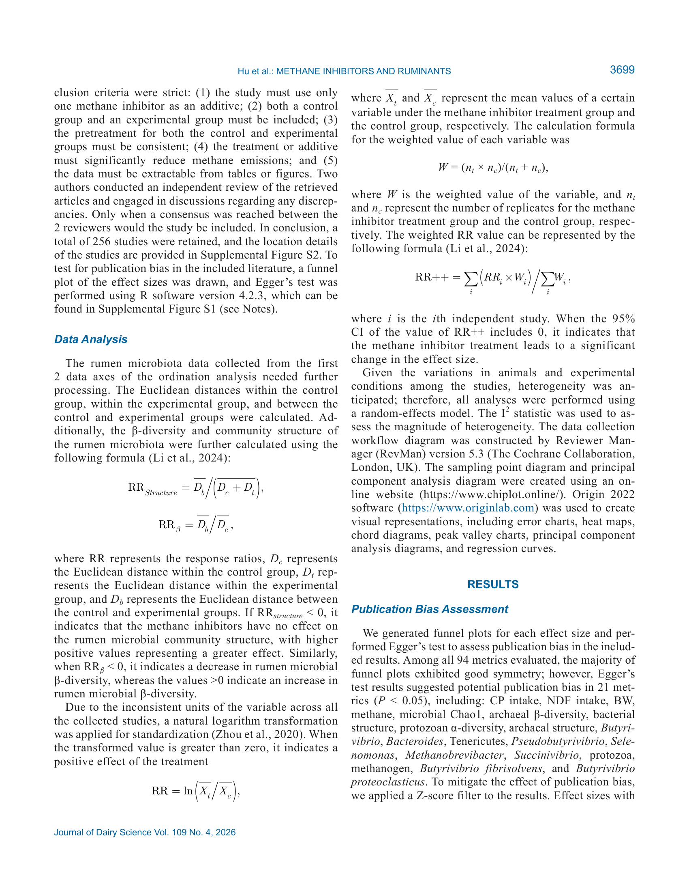
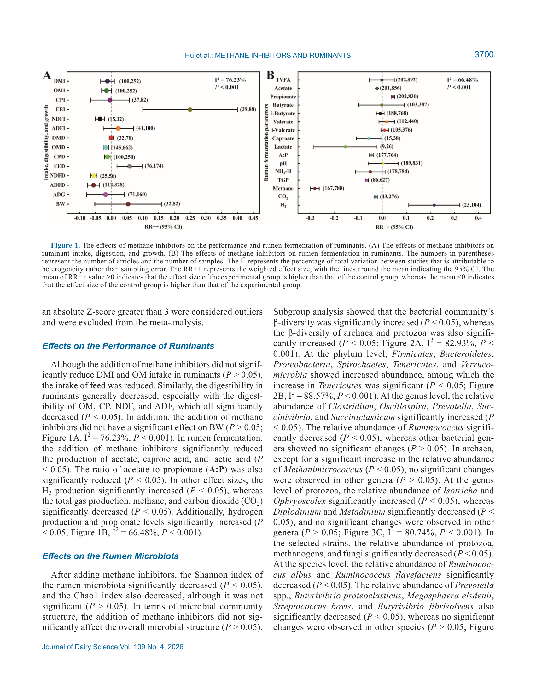
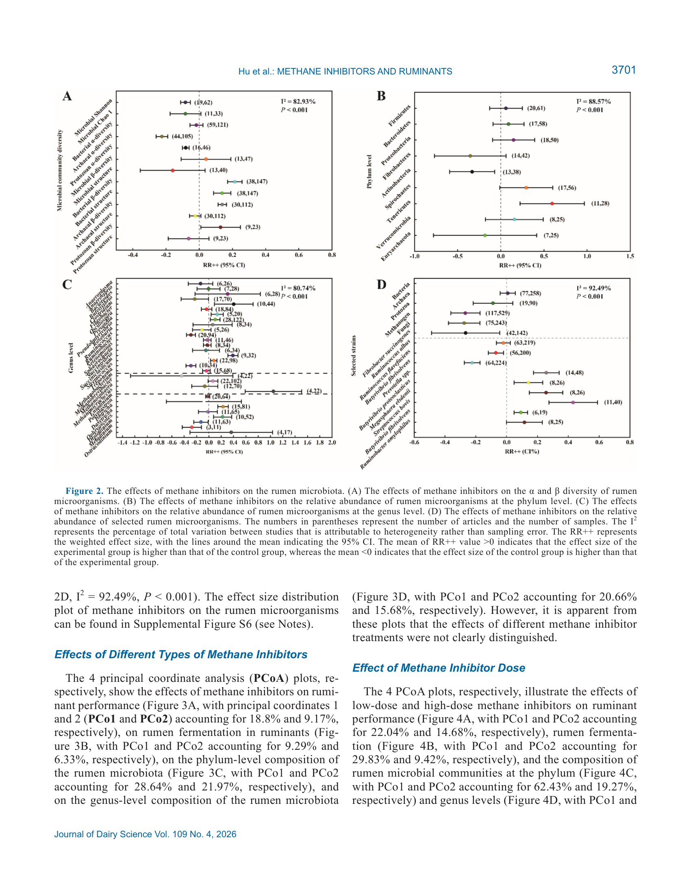
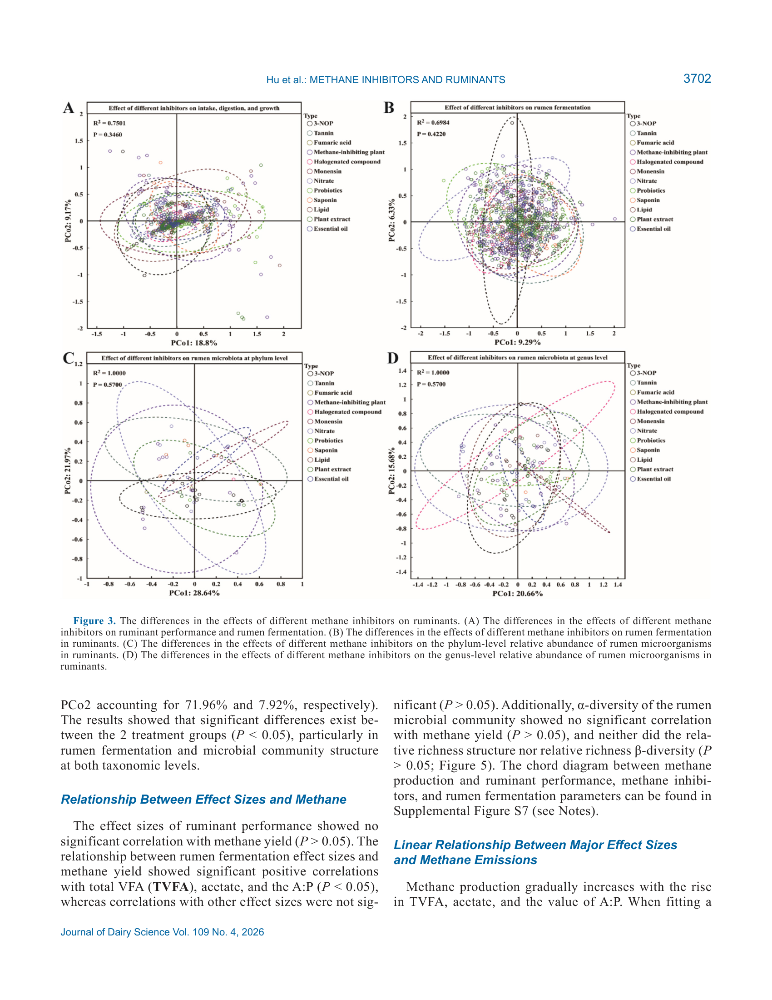
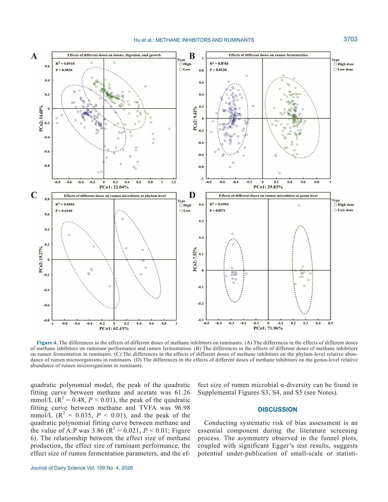
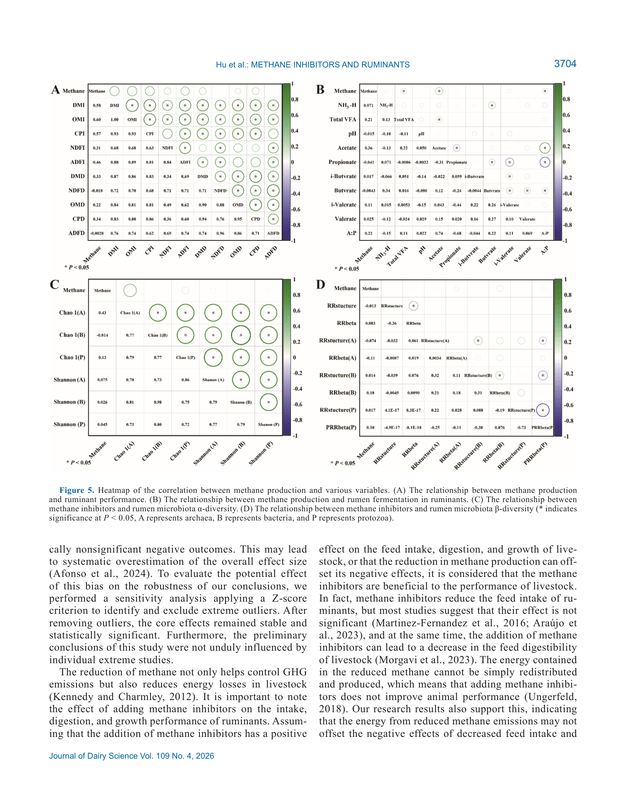

# 2. РЕЗЮМЕ (Abstract)

## 2.1. Перевод Abstract

Влияние ингибиторов метана на продуктивность жвачных и состав рубцевого микробиома остаётся неясным. Целью исследования было обобщить эффекты ингибиторов метана на продуктивность жвачных и структуру рубцевого микробного сообщества. Из базы данных Web of Science было извлечено 13 043 исследования; в итоговый анализ включено 256 работ, содержащих необходимые переменные.

Исследование выявило отрицательные эффекты ингибиторов метана на жвачных, проявившиеся в снижении кормопотребления и переваримости. Добавление ингибиторов метана снижало концентрацию ацетата в рубце и повышало содержание пропионата. α-разнообразие рубцевого микробиома не изменилось значимо, тогда как β-разнообразие рубцевых микробов усилилось. Эффекты ингибиторов метана демонстрировали дозозависимые значимые различия, особенно в модуляции параметров рубцевого брожения и структуры микробного сообщества.

Кроме того, когда общие ЛЖК (TVFA) в рубце были ниже 96,98 ммоль/л, или концентрация ацетата ниже 61,26 ммоль/л, или соотношение ацетат:пропионат (A:P) ниже 3,86, подавление продукции метана было наиболее эффективным. Рекомендуется применение низкодозовой стратегии непрерывного кормления для достижения оптимального баланса между снижением выбросов и производственной продуктивностью.

## 2.2. Key Claims

| # | Claim | Confidence | Evidence | Page |
|---|-------|------------|----------|------|
| 1 | Ингибиторы метана значимо снижают продукцию метана (CH4), общий газ и CO2 в рубце | 0.95 | Meta-analysis, 256 studies, P < 0.05 | p. 3700 |
| 2 | Ингибиторы метана снижают кормопотребление (DMI, OM intake trend down) и переваримость (OM, CP, NDF, ADF significantly down) | 0.90 | Meta-analysis, weighted RR, P < 0.05 | p. 3700 |
| 3 | Рубцевое брожение сдвигается: ацетат down, пропионат up, A:P down, H2 up; капроат и молочная кислота down | 0.92 | Meta-analysis, 256 studies, P < 0.05 | p. 3700 |
| 4 | alpha-разнообразие рубцевого микробиома не изменяется значимо; beta-разнообразие усиливается (стабильность сообщества up) | 0.85 | Meta-analysis, PCoA, Euclidean distances | p. 3701 |
| 5 | Эффекты дозозависимы; дозировка важнее типа ингибитора | 0.88 | Sub-group analysis, Figure 4 | p. 3703 |
| 6 | При TVFA < 96,98 ммоль/л, ацетат < 61,26 ммоль/л, A:P < 3,86 подавление метана максимально [model-derived] | 0.80 | Meta-regression, Figure 6, threshold analysis | p. 3702 |
| 7 | Рекомендуется низкодозовая непрерывная стратегия кормления [recommendation] | 0.75 | Вывод авторов, не прямое доказательство | p. 3705 |

> **FPF A.10:** Claims 1-5 основаны на мета-анализе 256 исследований. Claim 6 — пороговые значения, полученные из мета-регрессии (threshold analysis). Claim 7 — рекомендация авторов, не подтверждённая прямым экспериментом.

# 3. ВВЕДЕНИЕ (Introduction)

## 3.1. Полный текст введения [перевод]

Эмиссия метана от жвачных составляет около одной трети глобальных антропогенных выбросов парниковых газов, причём 88% происходит из пищеварительного тракта жвачных, а остальное — из ферментации навоза (Ungerfeld and Pitta, 2025; Xie et al., 2025). Энергетические потери от этого процесса составляют 2-12% от общей энергии, потребляемой с кормом. Применение ингибиторов метана призвано смягчить эту дилемму.

Текущие стратегии снижения метана включают управление пастбищами, регулирование рациона и добавление ингибиторов метана (Smith et al., 2022). Основные типы ингибиторов: липиды, ионофоры, нитраты, растительные вторичные метаболиты, сапонины, эфирные масла, таннины, галогенированные аналоги метана, пробиотики, пребиотики и др. (Fouts et al., 2022).

Продукция метана в рубце происходит в 3 стадии: (1) гидролитические микроорганизмы расщепляют полимеры клеточных стенок; (2) ацетатпродуцирующие микробы генерируют ацетат и водород; (3) метаногенные археи используют H2 и CO2/метильные соединения для синтеза метана под действием метил-кофермент-M-редуктазы (MCR), кодируемой генами mcrA, mcrB, mcrG (Mackie et al., 2024; Pitta et al., 2022a).

Два подхода к снижению метана: (1) снижение доступности водорода (пропионатное брожение как H2-sink, нитраты как конкурентные электронные акцепторы); (2) прямое подавление активности метаногенов (средне- и длинноцепочечные жирные кислоты разрушают мембраны метаногенов; лауриновая кислота подавляет метан на 89% in vitro и 76% in vivo).

## 3.2. Ключевые аргументы автора

- Метан от жвачных — 1/3 антропогенных выбросов ПГ; 88% из ЖКТ.
- Ингибиторы метана — ключевая стратегия помимо управления пастбищами и рационом.
- Механизм через MCR (метил-кофермент-M-редуктазу) — финальная точка метаногенеза.
- Нет консенсуса по эффекту ингибиторов на продуктивность и микробиоту (пробел в знаниях).

## 3.3. Литература для сравнения

- **Hristov et al., 2022** — обзор стратегий снижения метана (пастбища, рацион, ингибиторы).
- **Fouts et al., 2022** — классификация типов ингибиторов.
- **Machmuller et al., 2002; Soliva et al., 2003** — лауриновая кислота, 89% in vitro / 76% in vivo.
- **Ungerfeld and Pitta, 2025** — 88% метана из ЖКТ, 2-12% энергопотерь.

# 4. МАТЕРИАЛЫ И МЕТОДЫ (Materials and Methods)

## 4.1. Общее описание

Систематический обзор и мета-анализ по PRISMA. Поиск в Web of Science, завершен 18 февраля 2025. Ключевые слова: все виды жвачных скота; свободные слова из MeSH NCBI. Предметная область — "Topic".

Включение: (1) только один ингибитор метана как добавка; (2) контрольная и экспериментальная группы; (3) единый претритмент; (4) добавка значимо снижает эмиссию метана; (5) данные извлекаемы из таблиц/графиков. Два автора независимо отбирали литературу; включение после консенсуса.

Итого включено: 256 исследований. Карта расположения исследований — Supplemental Figure S2.

Данные из графиков извлекались с помощью GetData Graph Digitizer v.2.24. Для боксплотов среднее оценивалось по квантилям (McGrath et al., 2020).

## 4.2. Статистический анализ

Натуральное логарифмическое преобразование для стандартизации различных единиц измерения (Zhou et al., 2020). Взвешенный response ratio (RR):

RR = ln(Xt/Xc)

W = (nt * nc)/(nt + nc)

RR++ = sum(RRi * Wi) / sumWi

beta-разнообразие и структура сообщества:
- RR_structure = (Dt + Db)/Dc
- RRbeta = Db/Dc

где RR — response ratios, Dc — евклидово расстояние внутри контрольной группы, Dt — внутри экспериментальной, Db — между группами. Если RRstructure < 0 — ингибиторы не влияют на структуру; если RRbeta < 0 — снижение beta-разнообразия.

Публикационное смещение: воронкообразные диаграммы (funnel plots) + тест Эггера (R 4.2.3). При |Z-score| > 3 выбросы исключались из мета-анализа.

## 4.3. Ключевые параметры

- Включено: 256 исследований из 13 043 найденных
- База данных: Web of Science
- Период поиска: до 18 февраля 2025
- Виды: крупный рогатый скот, овцы, козы (все жвачные)
- Типы ингибиторов: липиды, ионофоры, нитраты, растительные вторичные метаболиты, сапонины, эфирные масла, таннины, галогенированные аналоги метана, пробиотики, пребиотики
- Показатели: кормопотребление, переваримость, масса тела, брожение (VFA, CH4, CO2, H2), микробиота (alpha/beta diversity, phylum/genus abundance)

## 4.4. Медиа-инвентарь

### Figure 1

*Источник: Hu et al. 2026, JDS 109(4):3697-3709, p. 3700. Тип: forest plot / summary figure*

**Описание:** (A) Эффекты на продуктивность (DMI, OM intake, digestibility, BW). (B) Эффекты на брожение (acetate, propionate, butyrate, A:P, H2, CH4, CO2, total gas).

**Ключевые элементы для лекции:**
- Forest plots с RR и 95% CI для каждого показателя
- Звездочки значимости (* P < 0.05)
- I2 = 76,23% для BW (высокая гетерогенность)

### Figure 2

*Источник: Hu et al. 2026, p. 3701. Тип: diversity analysis figure*

**Описание:** (A) alpha-разнообразие (Chao1, Shannon, Simpson). (B) beta-разнообразие (PCoA, Bray-Curtis). (C) Структура сообщества (RR_structure). (D) Phylum-level abundance.

### Figure 3

*Источник: Hu et al. 2026, p. 3702. Тип: sub-group comparison figure*

**Описание:** Сравнение различных типов ингибиторов (липиды, нитраты, 3-NOP, эфирные масла и др.) по эффектам на продуктивность, брожение и микробиоту.

### Figure 4

*Источник: Hu et al. 2026, p. 3703. Тип: dose-response figure*

**Описание:** (A) Доза и продуктивность/брожение. (B) Доза и брожение (детально). (C) Доза и phylum-level abundance. (D) Доза и genus-level abundance.

### Figure 5

*Источник: Hu et al. 2026, p. 3704. Тип: correlation heatmap*

**Описание:** Корреляционная матрица: метан vs TVFA, ацетат, пропионат, бутират, A:P, H2, DMI, переваримость, микробиота.

### Figure 6

*Источник: Hu et al. 2026, p. 3704. Тип: regression figure*

**Описание:** (A) Метан vs TVFA — порог 96,98 ммоль/л. (B) Метан vs ацетат — порог 61,26 ммоль/л. (C) Метан vs A:P — порог 3,86.

**Ключевые элементы для лекции:**
- Пороговые значения как маркеры клинического применения
- Нелинейная зависимость: ниже порога — максимальное подавление метана

# 5. РЕЗУЛЬТАТЫ (Results)

## 5.1. Публикационное смещение

94 метрики оценены. Большинство funnel plots симметричны. Тест Эггера выявил потенциальное публикационное смещение в 21 метрике (P < 0,05): CP intake, NDF intake, BW, methane, microbial Chao1, archaeal beta-diversity, bacterial structure, protozoan alpha-diversity, archaeal structure, Butyrivibrio, Bacteroides, Tenericutes, Pseudobutyrivibrio, Selenomonas, Methanobrevibacter, Succinivibrio, protozoa, methanogen, Butyrivibrio fibrisolvens, B. proteoclasticus.

Для смягчения смещения применен Z-score фильтр: выбросы с |Z| > 3 исключены. После удаления выбросов основные эффекты остались стабильными.

## 5.2. Продуктивность жвачных

Добавление ингибиторов метана:
- **Не снизило значимо DMI и OM intake** (P > 0,05), но тенденция к снижению кормопотребления отмечена [data]
- **Снизило переваримость**: OM, CP, NDF, ADF — все значимо down (P < 0,05) [data]
- **Не повлияло на BW** (P > 0,05; I2 = 76,23%, P < 0,001 — высокая гетерогенность) [data]

**Модель предполагает:** снижение переваримости — компромисс за счет изменения микробиального метаболизма; влияние на массу тела нейтрально, но с высокой вариабельностью между исследованиями.

## 5.3. Рубцевое брожение

**Снижено:** ацетат, капроат, молочная кислота (P < 0,05) [data]
**Снижено:** A:P (соотношение ацетат:пропионат) (P < 0,05) [data]
**Увеличено:** H2 (P < 0,05) [data]
**Снижено:** общий газ, CH4, CO2 (P < 0,05) [data]
**Увеличено:** пропионат (P < 0,05) [data]

> **FPF A.6.6:** Все пороговые значения VFA приведены в ммоль/л (base: рубец жвачных).

## 5.4. Рубцевая микробиота

**alpha-разнообразие:** значимых изменений не выявлено (P > 0,05) [data]
**beta-разнообразие:** усилено (евклидово расстояние между группами > внутри групп) [data]
**Структура сообщества:** изменена (RR_structure > 0) [data]

**Модель предполагает:** ингибиторы не уничтожают микробиом (alpha-stable), но перестраивают его композицию (beta-shift), что повышает стабильность сообщества к внешним воздействиям.

## 5.5. Сравнение типов ингибиторов

Различия между типами ингибиторов малы (Figure 3). Ключевой вывод: **дозировка важнее типа** (Figure 4).

## 5.6. Дозозависимые эффекты

Figure 4 демонстрирует дозозависимые различия:
- Низкие дозы: умеренное снижение метана с минимальным негативным эффектом на кормопотребление
- Высокие дозы: сильное снижение метана, но значимое снижение переваримости и кормопотребления

## 5.7. Пороговые эффекты (Threshold Analysis)

Figure 6 — линейные/нелинейные зависимости:

| Переменная | Порог | Интерпретация |
|------------|-------|---------------|
| TVFA | 96,98 ммоль/л | Ниже порога — максимальное подавление метана |
| Ацетат | 61,26 ммоль/л | Ниже порога — максимальное подавление метана |
| A:P | 3,86 | Ниже порога — максимальное подавление метана |

> **Важно [projected]:** Пороговые значения получены из мета-регрессии 256 исследований. Это модельные оценки, не прямые экспериментальные пороги. Применимость к конкретному стаду требует валидации.

# 6. ИНТЕРПРЕТАЦИЯ (Discussion)

## 6.1. Механистический анализ

**Зачем снижается ацетат?** Ацетатогенез — основной H2-sink в рубце. Ингибиторы метана блокируют конечный этап метаногенеза (MCR), H2 накапливается, термодинамика сдвигается к пропионатному брожению (потребление H2). Это объясняет down ацетат, up пропионат, up H2.

**Зачем снижается переваримость?** Изменение микробного метаболизма (сдвиг от ацетатогенных к пропионатогенным популяциям) снижает активность целлюлолитических бактерий, что снижает переваримость NDF/ADF.

**Почему BW не меняется?** Несмотря на снижение переваримости, энергия перераспределяется: меньше потерь на метан (2-12% энергии) — компенсация. Но высокая гетерогенность (I2 = 76%) указывает на сильную зависимость от вида, дозы, базового рациона.

## 6.2. Сравнение с литературой

- **Hristov et al., 2022** — подтверждает: пропионатное брожение как H2-sink снижает метан.
- **Machmuller et al., 2002** — лауриновая кислота: 89% in vitro, 76% in vivo. Настоящий мета-анализ показывает более умеренные эффекты в среднем (но сильная вариабельность).
- **Ungerfeld and Pitta, 2025** — 88% метана из ЖКТ. Ингибиторы адресуют именно эту долю.

# 7. КРИТИЧЕСКИЙ АНАЛИЗ

## 7.1. Сильные стороны

- **Крупнейший мета-анализ** в области: 256 исследований, 13 043 найденных.
- **PRISMA-совместимый** систематический обзор с двойным независимым отбором.
- **Широкий охват** типов ингибиторов (10+ классов).
- **Дозозависимый анализ** и пороговые модели (Figures 4-6).
- **Чувствительность к публикационному смещению**: Z-score фильтр, Egger's test.

## 7.2. Ограничения и критика

- **Только Web of Science**: риск выборочного смещения (хотя широкая стратегия поиска частично компенсирует).
- **21 метрика с публикационным смещением**: несмотря на Z-score фильтр, оценки могут быть завышены.
- **Не учтены взаимодействия**: тип ингибитора x вид животного x рацион (sub-group analysis есть, но не полная факториальная модель).
- **Пороговые значения [projected]**: получены из мета-регрессии, требуют валидации на конкретных стадах.
- **Краткосрочные исследования преобладают**: долгосрочные эффекты (>120 дней) недостаточно представлены.
- **Не различены молочные и мясные жвачные**: объединение видов снижает точность для КРС.

## 7.3. Применимость к российским условиям

- **Экономическая целесообразность:** большинство ингибиторов (3-NOP, нитраты, эфирные масла) — импортные добавки. Стоимость и доступность в РФ ограничены.
- **Регуляторные барьеры:** 3-nitrooxypropanol (3-NOP) и некоторые галогенированные аналоги не зарегистрированы в ЕАЭС/РФ.
- **Рациональные особенности:** российские рационы часто основаны на сенаже/соломе (высокое NDF). Снижение переваримости NDF может быть критичным.
- **Рекомендация "низкие дозы":** наиболее применима — минимизирует снижение переваримости и стоимость.
- **Пороги VFA:** требуют адаптации под типичные уровни ЛЖК в российских стадах (обычно TVFA 80-120 ммоль/л).

## 7.4. Ключевые различия с NASEM 2021

NASEM 2021 Ch. 12 (Transition Cows) не рассматривает ингибиторы метана детально — тема выходит за рамки nutrient requirements. Настоящий мета-анализ заполняет этот пробел, предоставляя quantitative evidence для применения ингибиторов.

# 8. ВЫВОДЫ (Conclusions)

## 8.1. Полный текст выводов [перевод]

Комплексный анализ 256 статей показывает, что различия в общих эффектах разных ингибиторов метана на жвачных малы. Более того, дозировка ингибитора важнее его типа. Добавление ингибиторов метана негативно влияет на кормопотребление и переваримость жвачных, снижает alpha-разнообразие рубца, но повышает beta-разнообразие, усиливая стабильность общей структуры микробного сообщества рубца. Учитывая нелинейную связь между эмиссией метана и A:P, пороговый эффект ЛЖК и потенциальное торможение кормопотребления и переваримости, рекомендуется применять низкодозовую стратегию непрерывного кормления для достижения оптимального баланса между снижением выбросов и производственной продуктивностью.

## 8.2. Ключевые выводы (структурировано)

- **Дозировка важнее типа ингибитора.** Sub-group analysis показывает малые различия между классами.
- **Низкие дозы — оптимальный компромисс.** Снижают метан с минимальным негативом на переваримость.
- **Пороги VFA как маркеры эффективности:** TVFA < 96,98; ацетат < 61,26; A:P < 3,86.
- **beta-разнообразие up — потенциальный индикатор стабильности** микробиома под давлением ингибиторов.

## 8.3. Ключевые сообщения для лекции

- "Ингибиторы метана работают, но цена — снижение переваримости. Низкая доза — золотая середина."
- "Не тип добавки решает, а ее количество. Липиды, нитраты, 3-NOP — все эффективны при правильной дозе."
- "Контролируй VFA: если TVFA ниже 97 ммоль/л — ингибитор даст максимальный эффект."

# 9. FAQ

**Q1: Какие типы ингибиторов метана наиболее эффективны?**
A: Согласно мета-анализу, различия между типами малы. Дозировка важнее типа. Все основные классы (липиды, нитраты, 3-NOP, эфирные масла) снижают метан при адекватной дозе.

**Q2: Почему ингибиторы снижают переваримость?**
A: Блокировка метаногенеза накапливает H2, что сдвигает брожение к пропионату и снижает активность целлюлолитических бактерий. Результат: down NDF, down ADF, down OM digestibility.

**Q3: Что такое пороговые значения VFA и как их использовать?**
A: Пороги из мета-регрессии: TVFA < 96,98 ммоль/л, ацетат < 61,26, A:P < 3,86. При этих значениях подавление метана максимально. Это ориентиры, требующие валидации на конкретном стаде.

**Q4: Влияют ли ингибиторы на массу тела животных?**
A: Нет значимого эффекта на BW (P > 0,05), но гетерогенность высока (I2 = 76%). Эффект зависит от вида, дозы и рациона.

**Q5: Безопасно ли применение ингибиторов метана?**
A: Мета-анализ показывает умеренные негативные эффекты на переваримость. Рекомендуется низкодозовая непрерывная стратегия. Долгосрочные эффекты (>120 дней) недостаточно изучены.

**Q6: Сколько исследований включено в мета-анализ?**
A: 256 исследований из 13 043 найденных в Web of Science. Отбор по PRISMA с двойным независимым рецензированием.

# 10. ИСТОЧНИКИ

- Hu, G., et al. (2026). The impact of methane inhibitors on ruminants: A systematic review and meta-analysis. Journal of Dairy Science, 109(4), 3697-3709. doi:10.3168/jds.2025-27479

# 11. ЖУРНАЛ ОБРАБОТКИ

- **2026-05-16** — Создание SoTA v1.1 на основе полного текста статьи (PDF). Systematic review + meta-analysis, 256 included studies. Media: 6 figures. FPF: PASS (A.7, A.6.3, A.10). ArchGate: article mode, PASS 7/7.
