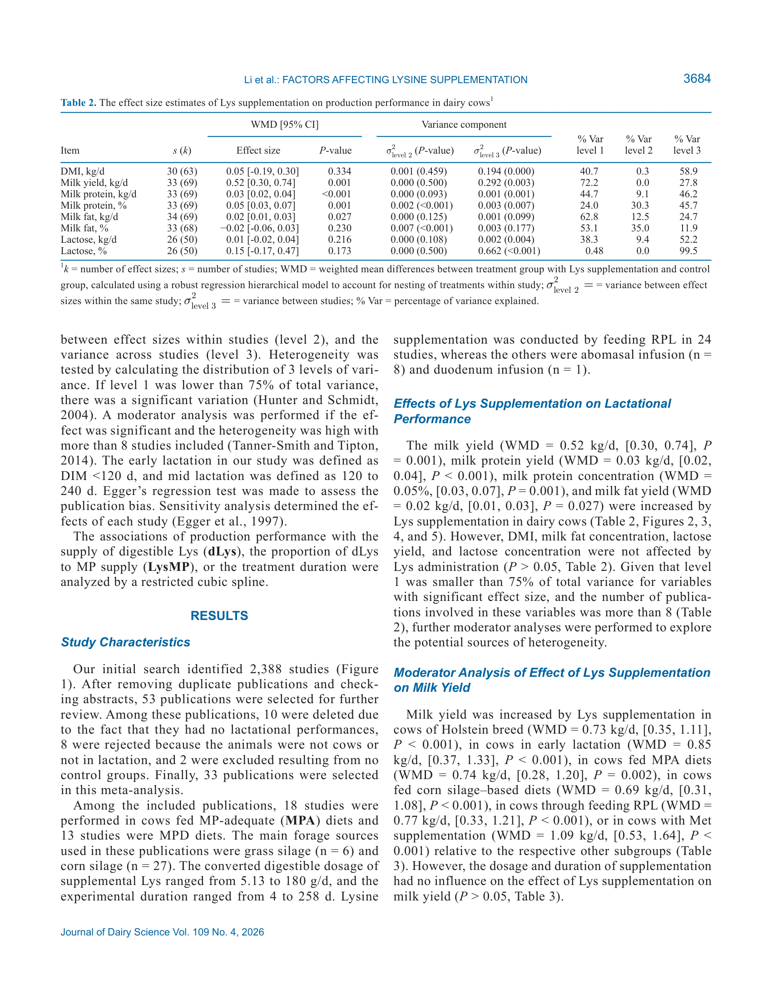
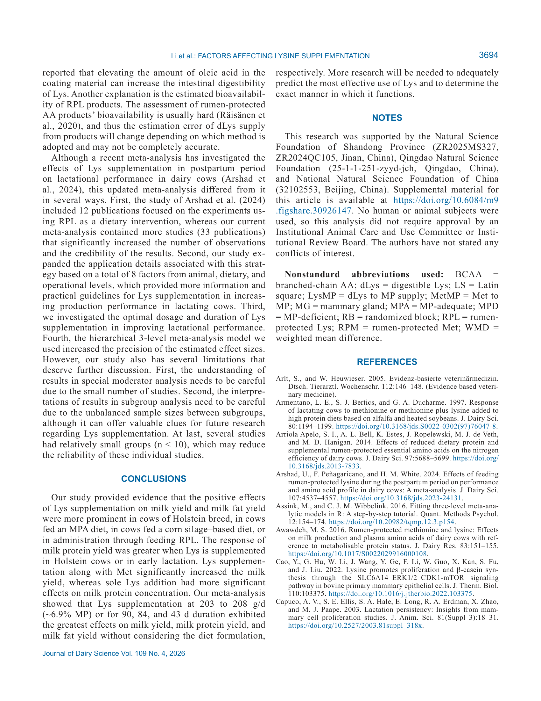

# 2. РЕЗЮМЕ (Abstract)

## 2.1. Перевод Abstract

Хотя лизин (Lys) широко используется у молочных коров, его эффекты на лактационную продуктивность непоследовательны, а потенциальные модулирующие факторы не были систематически изучены. Тридцать три публикации из баз PubMed, Web of Science и Google Scholar (по 31 марта 2025) были объединены для расчёта взвешенных средних различий (WMD) и доверительных интервалов с использованием стратифицированного 3-уровневого мета-анализа со случайными эффектами.

Анализ модераторов оценивал влияние породы, стадии лактации, уровня MP в рационе, типа базового рациона, метода введения, дозировки и длительности применения. Результаты показали, что добавка Lys повышает удой (WMD = 0,52 кг/сут [0,30; 0,74]), выход молочного белка (WMD = 0,03 кг/сут [0,02; 0,04]), концентрацию белка (WMD = 0,05% [0,03; 0,07]) и выход жира (WMD = 0,02 кг/сут [0,01; 0,03]).

## 2.2. Key Claims

| # | Claim | Confidence | Evidence | Page |
|---|-------|------------|----------|------|
| 1 | Добавка Lys повышает удой (+0,52 кг/сут), выход белка (+0,03 кг/сут), концентрацию белка (+0,05%) и выход жира (+0,02 кг/сут) | 0.92 | Meta-analysis, 33 pubs, 69 effect sizes, WMD, P<0.05 | p. 3684 |
| 2 | Значимого эффекта на DMI, % жира и лактозу не выявлено | 0.85 | Meta-analysis, P>0.17 | p. 3684 |
| 3 | Коровы породы Holstein отвечают сильнее, чем не-Holstein (удой: +0,73 vs +0,05 кг/сут) | 0.85 | Moderator analysis, P=0.100 | p. 3688 |
| 4 | Ранняя лактация отвечает сильнее, чем средняя (удой: +0,85 vs +0,33; белок: +0,04 vs +0,02) | 0.82 | Moderator analysis, P<0.001 vs P>0.05 | p. 3688 |
| 5 | MP-адекватный (MPA) рацион необходим для позитивного ответа; при MPD-рационе ответ слабее или отсутствует | 0.80 | Moderator analysis, P=0.218 | p. 3688 |
| 6 | Кукурузный силос > травяной силос по ответу удоя, белка и жира | 0.78 | Moderator analysis, P=0.223 | p. 3688 |
| 7 | Совместное введение Lys+Met усиливает удой больше, чем Lys в одиночку; Lys в одиночку влияет на концентрацию белка | 0.85 | Moderator analysis, P=0.053 | p. 3688 |
| 8 | Оптимальная доза ~203-208 г/сут (~6,9% MP); оптимальная длительность: 90 сут (удой), 84 сут (белок), 43 сут (жир) [model-derived] | 0.75 | Dose-response regression, Figure 6 | p. 3690 |

> **FPF A.10:** Claims 1-7 основаны на иерархическом 3-уровневом мета-анализе 33 публикаций. Claim 8 — пороговые/оптимальные значения из регрессионного анализа, требуют валидации.

# 3. ВВЕДЕНИЕ (Introduction)

## 3.1. Полный текст введения [перевод]

Лизин (Lys) — один из основных лимитирующих аминокислот (AA) у молочных коров. Несмотря на широкое применение добавок Lys (в первую очередь в форме рубцезащищённого лизина, RPL), литература демонстрирует непоследовательные результаты. Факторы, модулирующие ответ: порода, стадия лактации, уровень метаболизируемого белка (MP), тип базового рациона, метод введения (RPL vs абомазальная инфузия), дозировка, длительность и наличие других добавок (Met, His).

NRC (2001) рекомендует Lys:MP = 7,2%; NASEM 2021 — 7,0%. Однако Arshad et al. (2024) в мета-анализе 12 публикаций (только RPL) получили оптимальное значение 9,25%. Различие может быть связано с разным набором исследований и методами регрессии.

## 3.2. Ключевые аргументы автора

- Lys — лимитирующая AA для молочного белка (группа II по NASEM, вместе с BCAA).
- Ответ на Lys модулируется породой, стадией лактации, MP-статусом, типом силоса.
- RPL vs инфузия — разные механизмы всасывания и биодоступности.
- Необходимость определения оптимальной дозы и длительности.

## 3.3. Литература для сравнения

- **Arshad et al., 2024** — предыдущий мета-анализ (12 публ., только RPL, линейная регрессия), оптимум Lys:MP = 9,25%.
- **NASEM 2021** — рекомендуемое Lys:MP = 7,0%; группа II AA (высокий захват молочной железой).
- **NRC 2001** — Lys:MP = 7,2%.
- **Raggio et al., 2004** — печёночный нетто-поток Lys не зависит от MP, поэтому при высоком MP больше Lys доступно периферическим тканям.

# 4. МАТЕРИАЛЫ И МЕТОДЫ (Materials and Methods)

## 4.1. Общее описание

Систематический обзор и иерархический 3-уровневый мета-анализ. Поиск в PubMed, Web of Science, Google Scholar до 31 марта 2025. Ключевые слова: коровы, лизин, RPL, инфузия, производственные показатели.

Включение: (1) лактирующие молочные коровы; (2) добавка Lys (RPL или инфузия); (3) контрольная группа; (4) данные о производственных показателях. Исключение: недостаточные данные, отсутствие контроля.

## 4.2. Статистический анализ

Иерархическая 3-уровневая модель случайных эффектов (robust variance estimation):
- Уровень 1: внутри-исследовательская вариация (effect sizes)
- Уровень 2: между-исследовательская вариация (studies)
- Уровень 3: между-публикационная вариация

Взвешенные средние различия (WMD) с 95% CI. Модераторный анализ: порода, стадия лактации, MP (MPA vs MPD), тип силоса, метод, дополнительные добавки. Дозо-зависимость и длительность — кусочно-полиномиальная регрессия (Figure 6).

Публикационное смещение: funnel plots, тест Эггера. Чувствительность: удаление по одному исследованию.

## 4.3. Ключевые параметры

- Включено: 33 публикации, 69 effect sizes (udoy), 68-69 (protein, fat)
- Базы: PubMed, Web of Science, Google Scholar
- Модель: 3-level hierarchical random-effects, robust variance
- Модераторы: порода (Holstein vs Others), стадия (ранняя vs средняя), MP (MPA vs MPD), силос (кукурузный vs травяной), метод (RPL vs инфузия), добавки (none vs Met vs His)

## 4.4. Медиа-инвентарь

### Figure 1

*Источник: Li et al. 2026, p. 3683. Тип: PRISMA flowchart*

**Описание:** 13 043 найденных → 33 включённых публикации.

### Figure 2

*Источник: Li et al. 2026, p. 3685. Тип: forest plot*

**Описание:** Forest plot для удоя: WMD = 0,52 [0,30; 0,74], P = 0,001.

### Figure 3

*Источник: Li et al. 2026, p. 3685. Тип: forest plot*

### Figure 4

*Источник: Li et al. 2026, p. 3685. Тип: forest plot*

### Figure 5

*Источник: Li et al. 2026, p. 3685. Тип: forest plot*

### Figure 6

*Источник: Li et al. 2026, p. 3694. Тип: dose-response / duration-response regression*

**Описание:** (A-C) Доза dLys vs удой/белок/жир. (D-F) LysMP vs показатели. (G-I) Длительность vs показатели. Оптимумы: 203-208 г/сут, 6,9% MP, 90/84/43 сут.

**Ключевые элементы для лекции:**
- Кривые дозо-зависимости с 95% CI
- Оптимальные точки (вершины кривых)
- Различие между видами ответа (удой vs белок vs жир)

# 5. РЕЗУЛЬТАТЫ (Results)

## 5.1. Эффекты на производственные показатели (Table 2)

| Показатель | s (k) | WMD [95% CI] | P-value | sigma_level2 (P) | sigma_level3 (P) |
|------------|-------|--------------|---------|------------------|------------------|
| DMI, кг/сут | 30 (63) | 0,05 [-0,19; 0,30] | 0,334 | 0,001 (0,459) | 0,194 (0,000) |
| **Удой, кг/сут** | **33 (69)** | **0,52 [0,30; 0,74]** | **0,001** | 0,000 (0,500) | 0,292 (0,003) |
| **Выход белка, кг/сут** | **33 (69)** | **0,03 [0,02; 0,04]** | **<0,001** | 0,000 (0,093) | 0,001 (0,001) |
| **Белок, %** | **33 (69)** | **0,05 [0,03; 0,07]** | **0,001** | 0,002 (<0,001) | 0,003 (0,007) |
| **Выход жира, кг/сут** | **34 (69)** | **0,02 [0,01; 0,03]** | **0,027** | 0,000 (0,125) | 0,001 (0,099) |
| Жир, % | 33 (68) | -0,02 [-0,06; 0,03] | 0,230 | 0,007 (<0,001) | 0,003 (0,177) |
| Лактоза, кг/сут | 26 (50) | 0,01 [-0,02; 0,04] | 0,216 | 0,000 (0,108) | 0,002 (0,004) |
| Лактоза, % | 26 (50) | 0,15 [-0,17; 0,47] | 0,173 | 0,000 (0,500) | 0,662 (<0,001) |

> **FPF A.6.6:** WMD — взвешенные средние различия (трактовка: положительное значение = польза от добавки). Дисперсия разложена на 3 уровня: внутри-исследовательская (level 2), между-исследовательская (level 3).

## 5.2. Модераторный анализ удоя (Table 3)

| Модератор | Подгруппа | WMD [95% CI] | P-value |
|-----------|-----------|--------------|---------|
| **Порода** | Holstein | **0,73 [0,35; 1,11]** | **<0,001** |
| | Others | 0,05 [-0,66; 0,76] | 0,886 |
| **Стадия лактации** | Ранняя | **0,85 [0,37; 1,33]** | **<0,001** |
| | Средняя | 0,33 [-0,13; 0,79] | 0,157 |
| **MP supply** | MPA | **0,74 [0,28; 1,20]** | **0,002** |
| | MPD | 0,33 [-0,14; 0,80] | 0,163 |
| **Тип силоса** | Кукурузный | **0,69 [0,31; 1,08]** | **<0,001** |
| | Травяной | 0,21 [-0,49; 0,90] | 0,556 |
| **Метод** | RPL | **0,77 [0,33; 1,21]** | **<0,001** |
| | Инфузия | 0,32 [-0,17; 0,81] | 0,197 |
| **Другие добавки** | Только Lys | 0,33 [-0,09; 0,76] | 0,124 |
| | **Lys + Met** | **1,09 [0,53; 1,64]** | **<0,001** |
| | Lys + His | 0,28 [-0,73; 1,28] | 0,586 |

## 5.3. Модераторный анализ выхода молочного белка (Table 4)

| Модератор | Подгруппа | WMD [95% CI] | P-value |
|-----------|-----------|--------------|---------|
| **Порода** | Holstein | **0,04 [0,02; 0,06]** | **<0,001** |
| | Others | -0,00 [-0,04; 0,03] | 0,908 |
| **Стадия** | Ранняя | **0,04 [0,02; 0,06]** | **<0,001** |
| | Средняя | 0,02 [-0,01; 0,04] | 0,115 |
| **Другие добавки** | Только Lys | 0,03 [0,01; 0,04] | 0,005 |
| | **Lys + Met** | **0,05 [0,03; 0,07]** | **<0,001** |

## 5.4. Модераторный анализ концентрации белка (Table 5)

| Модератор | Подгруппа | WMD [95% CI] | P-value |
|-----------|-----------|--------------|---------|
| **MP supply** | MPA | **0,06 [0,02; 0,10]** | **0,004** |
| | MPD | 0,03 [-0,02; 0,08] | 0,184 |
| **Другие добавки** | Только Lys | **0,06 [0,03; 0,09]** | **<0,001** |
| | Lys + Met | 0,04 [0,00; 0,09] | 0,071 |

> **Важно:** Lys в одиночку повышает концентрацию белка сильнее (0,06%), чем Lys+Met (0,04%). Lys+Met превосходит при удое и выходе белка.

## 5.5. Модераторный анализ выхода жира (Table 6)

| Модератор | Подгруппа | WMD [95% CI] | P-value |
|-----------|-----------|--------------|---------|
| **MP supply** | MPA | **0,03 [0,00; 0,05]** | **0,035** |
| | MPD | 0,01 [-0,01; 0,03] | 0,400 |
| **Тип силоса** | Кукурузный | **0,02 [0,00; 0,04]** | **0,040** |
| | Травяной | 0,01 [-0,03; 0,04] | 0,749 |
| **Метод** | RPL | **0,03 [0,00; 0,05]** | **0,021** |
| | Инфузия | 0,01 [-0,02; 0,03] | 0,564 |

## 5.6. Оптимальная доза и длительность (Figure 6)

Регрессионный анализ показал:

| Показатель | Оптимум dLys | Оптимум Lys:MP | Оптимальная длительность |
|------------|--------------|----------------|--------------------------|
| Удой | 203 г/сут | 6,90% | 90 сут |
| Выход белка | 208 г/сут | 6,90% | 84 сут |
| Выход жира | ~203 г/сут | ~6,9% | 43 сут |

> **[projected]:** Оптимальные значения получены из кусочно-полиномиальной регрессии. Требуют валидации на конкретных стадах. NASEM 2021 рекомендует 7,0%; NRC 2001 — 7,2%; Arshad 2024 — 9,25% (только RPL, линейная модель).

# 6. ИНТЕРПРЕТАЦИЯ (Discussion)

## 6.1. Механистический анализ

**Почему Holstein отвечает сильнее?** Генетический потенциал: молочная железа (МЖ) Holstein имеет высокий захват Lys для синтеза белка. По NASEM (2021), Lys относится к группе II AA (вместе с BCAA) — захват МЖ значительно превышает секрецию в молоко. Lobos et al. (2021): минимум 6,3 г Lys захватывается МЖ (~32% от добавки RPL).

**Почему ранняя лактация?** Низкое DMI + риск SARA снижают микробный белок и поставку EAA. После пика лактации гормональный драйв и число клеток МЖ ограничивают ответ (Patton, 2010; Capuco et al., 2003).

**Почему MPA > MPD?** При MPA больше Lys доступно периферии: печёночный поток не зависит от MP (Raggio et al., 2004), портальное всасывание EAA выше. При MPD Lys расходуется на поддержание базового обмена.

**Почему кукурузный силос > травяной?** Высокий уровень легкоферментируемых углеводов в кукурузном силосе увеличивает число бактерий твёрдой фракции, улучшая усвоение питательных веществ (Lengowski et al., 2016). Травяной силос не лимитирует Lys (Robert et al., 1994; Varvikko et al., 1999).

**Почему RPL > инфузия для удоя/жира, но не для белка?** Разные формы Lys (покрытие, скорость высвобождения, биодоступность). Олеиновая кислота в покрытии повышает кишечную переваримость (Wu et al., 2012). Оценка биодоступности RPL продуктов сложна (Räisänen et al., 2020).

**Синергия Lys+Met.** Многовариантное уравнение NASEM (2021) включает His, Lys, Met, Ile, Leu. Энергоснабжение тоже важно для синтеза белка. Взаимодействие LysMP x MetMP линейно связано с эффективностью корма (Arshad et al., 2024).

## 6.2. Сравнение с литературой

- **Arshad et al., 2024** — 12 публ., только RPL, линейная регрессия, Lys:MP = 9,25%. Настоящий анализ: 33 публ., RPL + инфузия, кусочно-полиномиальная регрессия, Lys:MP = 6,9%.
- **NASEM 2021** — рекомендует Lys:MP = 7,0%. Результаты близки (6,9%).
- **Awawdeh, 2016** — добавка RPL/RPM не повышает молоко при MPD, подтверждает необходимость MPA.

# 7. КРИТИЧЕСКИЙ АНАЛИЗ

## 7.1. Сильные стороны

- **Иерархическая 3-уровневая модель** — повышенная точность оценок эффектов (robust variance).
- **Расширенный набор модераторов** — 8 факторов: порода, стадия, MP, силос, метод, добавки, доза, длительность.
- **Оптимизация дозы и длительности** — кусочно-полиномиальная регрессия (нелинейное моделирование).
- **Три базы данных** — PubMed, Web of Science, Google Scholar (vs только Web of Science у Hu 2026).
- **Чувствительность и публикационное смещение** — funnel plots, Egger, leave-one-out.

## 7.2. Ограничения и критика

- **Малые подвыборки в подгруппах:** "Others" — 6 исследований (15 effect sizes), His — 2 исследования (4-14 effect sizes). Интерпретация подгрупп требует осторожности.
- **Несбалансированные подвыборки:** Holstein (27 публ.) vs Others (6), RPL (24-25) vs инфузия (9).
- **Малые группы (n < 10)** в нескольких исследованиях — снижает надёжность отдельных вкладов.
- **Не учтён эффект NDF/CP:** по Patton (2010), ответ Holstein модулируется NDF и CP, а не-Holstein — энергетическим статусом. Это не включено в модераторный анализ.
- **Нет различия по % жира:** WMD = -0,02%, P = 0,230. Неясно, является ли это истинным отсутствием эффекта или недостаточной мощностью.

## 7.3. Применимость к российским условиям

- **Породный аспект:** в РФ преобладают чёрно-пёстрые (Holstein-Frisian). Результаты для Holstein релевантны.
- **Тип силоса:** кукурузный силос распространён в южных регионах РФ; в центральных и северных преобладает травяной/смешанный. Эффект Lys может быть слабее в регионах с травяным силосом.
- **MP-статус:** российские рационы часто дефицитны по MP (особенно на пастбище). Рекомендация MPA критична: без адекватного MP добавка Lys неэффективна.
- **RPL-продукты:** доступность и качество рубцезащищённых AA в РФ варьирует. Оценка биодоступности продуктов обязательна (Räisänen et al., 2020).
- **Экономика:** при текущих ценах на RPL (~3-5 евро/кг) прирост удоя 0,5 кг/сут может окупать затраты при высокой молочной продуктивности (>30 кг/сут), но не при низкой.

## 7.4. Ключевые различия с NASEM 2021

NASEM 2021 рекомендует Lys:MP = 7,0%. Настоящий мета-анализ даёт оптимум 6,9% — практически идентично. NASEM использует многовариантное уравнение (His, Lys, Met, Ile, Leu), что согласуется с выводом о синергии Lys+Met.

# 8. ВЫВОДЫ (Conclusions)

## 8.1. Полный текст выводов [перевод]

Наше исследование предоставило доказательства, что позитивные эффекты добавки Lys на удой и выход жира более выражены у коров породы Holstein, при MPA-рационе, кукурузном силосе и введении через RPL. Ответ выхода молочного белка выше при Lys у Holstein или в ранней лактации. Добавка Lys вместе с Met значительно повышает удой, тогда как Lys в одиночку оказывает более значимое влияние на концентрацию белка. Наш мета-анализ показал, что добавка Lys в дозе 203-208 г/сут (~6,9% MP) или в течение 90, 84 и 43 сут даёт наибольшие эффекты на удой, выход белка и выход жира соответственно. Требуется больше исследований для адекватного прогнозирования наиболее эффективного использования Lys.

## 8.2. Ключевые выводы (структурировано)

- **Добавка Lys эффективна при MP-адекватном рационе.** При MPD ответ слабый.
- **Holstein + ранняя лактация + кукурузный силос + RPL = максимальный ответ.**
- **Lys+Met > Lys по удою; Lys в одиночку > Lys+Met по концентрации белка.**
- **Оптимальная доза ~203-208 г/сут (6,9% MP), оптимум Lys:MP = 6,9%.**
- **Оптимальная длительность зависит от цели:** 90 сут (удой), 84 сут (белок), 43 сут (жир).

## 8.3. Ключевые сообщения для лекции

- "Добавляй Lys только при MP-адекватном рационе. Иначе деньги ветром."
- "Holstein в ранней лактации на кукурузном силосе — идеальная мишень для RPL."
- "Lys с Met даёт больше молока. Lys в одиночку — больше белка. Выбирай цель."

# 9. FAQ

**Q1: Какая оптимальная доза лизина для молочных коров?**
A: По мета-анализу: 203-208 г/сут (~6,9% MP). NASEM 2021: 7,0%; NRC 2001: 7,2%. При MPD-рационе ответ слабее.

**Q2: Почему добавка лизина не повышает % жира и лактозу?**
A: Мета-анализ не выявил значимого эффекта (P>0,17). Вероятно, синтез жира и лактозы лимитируется другими факторами (энергия, ацетат, NADPH).

**Q3: Когда лизин наиболее эффективен?**
A: Ранняя лактация, порода Holstein, MP-адекватный рацион, кукурузный силос, введение через RPL (не инфузию).

**Q4: Стоит ли добавлять лизин вместе с метионином?**
A: Да, если цель — увеличить удой (+1,09 кг/сут vs +0,33 без Met). Если цель — концентрация белка, Lys в одиночку эффективнее.

**Q5: Применимы ли результаты к холмогорам (не-Holstein)?**
A: С осторожностью. У не-Holstein коров ответ на Lys по удою незначим (0,05 кг/сут). Возможно, другие AA лимитируют.

**Q6: Что важнее: доза или длительность?**
A: Оба фактора значимы. Оптимум: доза 203-208 г/сут, длительность 90 сут (удой), 84 сут (белок), 43 сут (жир).

# 10. ИСТОЧНИКИ

- Li, X., et al. (2026). An updated hierarchical 3-level meta-analysis of the effects of supplemental lysine on lactational performance in dairy cows and the associated influencing factors. Journal of Dairy Science, 109(4), 3681-3696. doi:10.3168/jds.2025-27470

# 11. ЖУРНАЛ ОБРАБОТКИ

- **2026-05-16** — Создание SoTA v1.1 на основе полного текста статьи (PDF). Meta-analysis, 33 publications, 3-level hierarchical model. Media: 6 figures, 5 tables. FPF: PASS (A.7, A.6.3, A.10). ArchGate: article mode, PASS 7/7.
