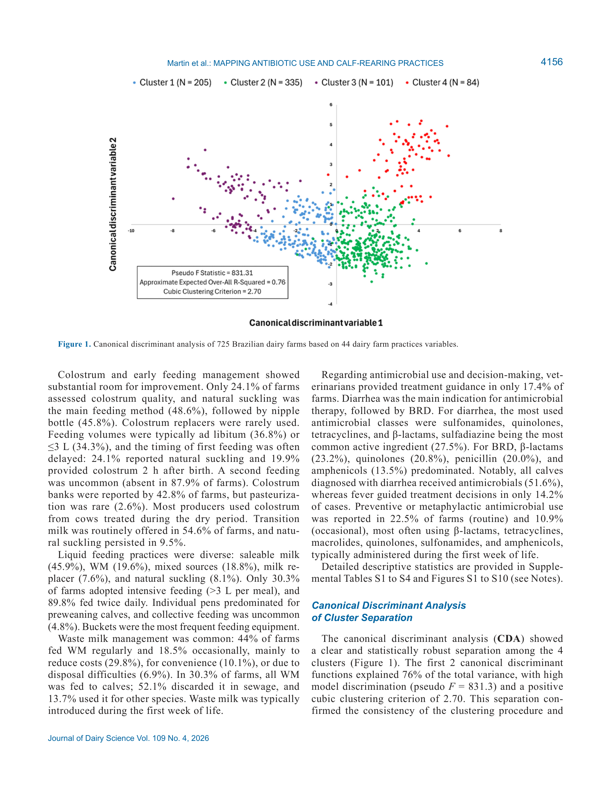
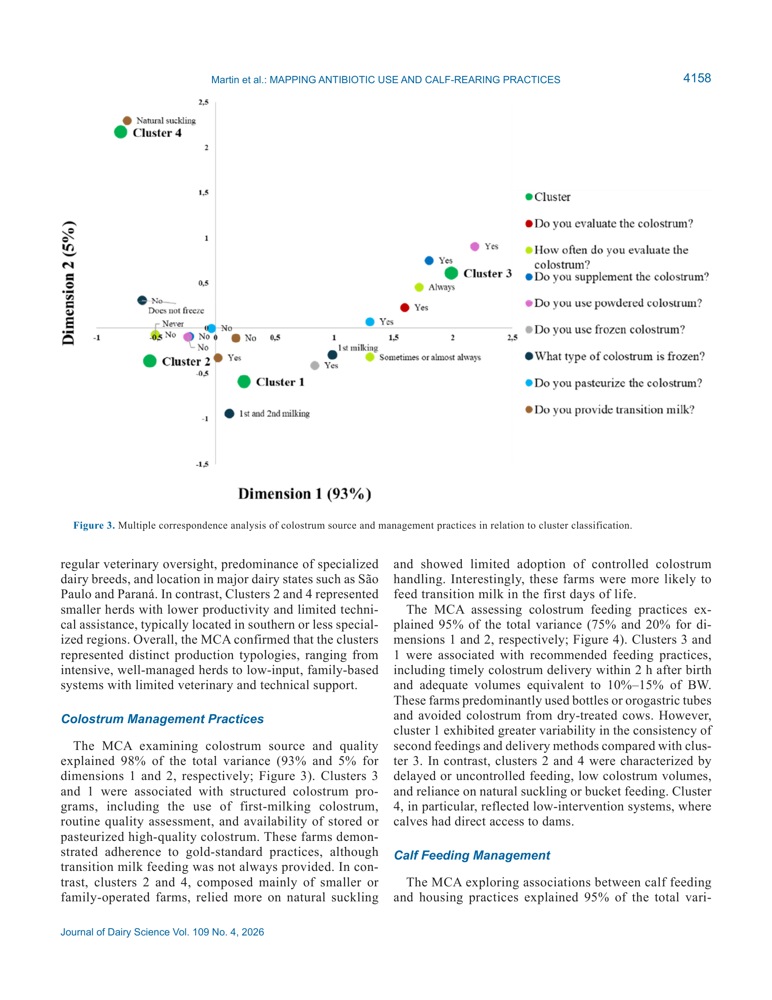
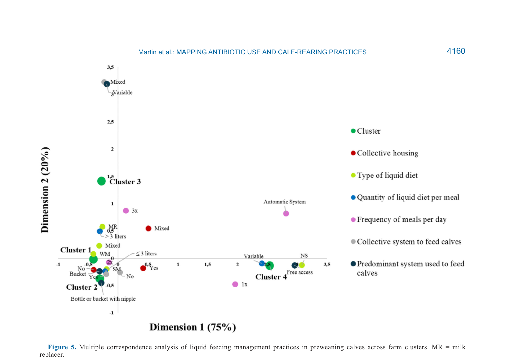
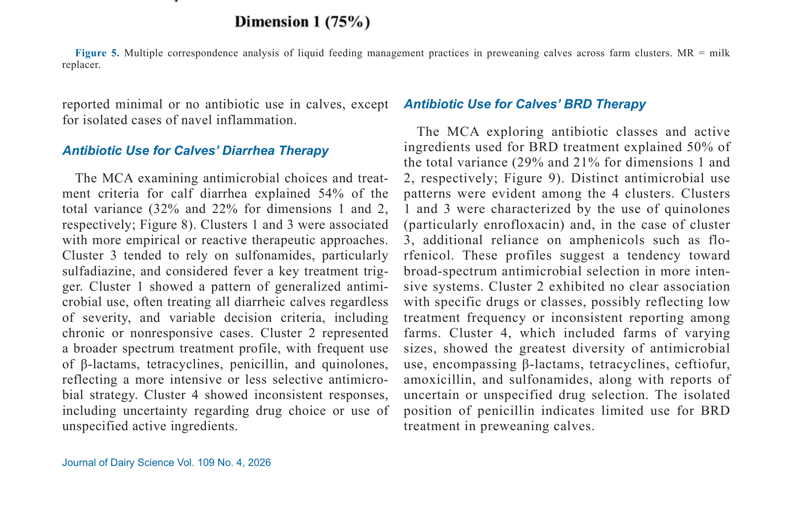
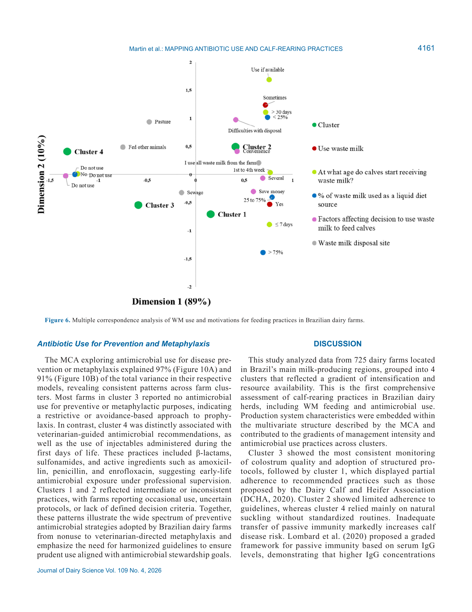
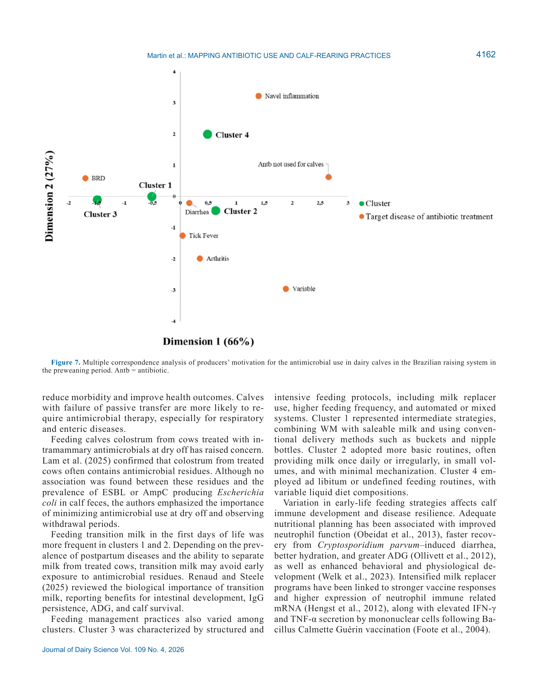

# CS.SOTA.316: Cruz et al. (2026) — Температура хранения силоса: влияние на питательную ценность, брожение и аэробную стабильность

> **Навигация:** [2. Аннотация](#2-аннотация-abstract) · [3. Введение](#3-введение) · [4. Методология](#4-методология) · [5. Результаты](#5-результаты) · [6. Интерпретация](#6-интерпретация-и-обсуждение) · [7. Критический анализ](#7-критический-анализ) · [8. Выводы](#8-выводы) · [9. FAQ](#9-faq) · [10. Практика](#10-практическое-применение) · [12. Источники](#12-источники) · [13. Журнал](#13-журнал-обработки)

---

## 2. АННОТАЦИЯ (Abstract)

### 2.1. Перевод Abstract

Силос является основным компонентом рационов молочных коров во всём мире, но эффекты температуры хранения (ТХ) на питательную ценность, профиль брожения и аэробную стабильность силоса остаются неясными. Цели исследования: (1) оценить влияние ТХ на питательную ценность и профиль брожения силоса; (2) оценить влияние ТХ на кукурузный силос цельного растения (WPCS). Данные из 42 рецензируемых статей (253 средних значения обработок) и 15 статей по WPCS (96 средних значений). Температуры разделены на диапазоны по 10°C: ≤10°C, 11–20°C, 21–30°C, 31–40°C, >40°C.

Повышение ТХ ухудшало брожение силоса за счёт снижения численности молочнокислых бактерий (LAB). И наоборот, низкие температуры (≤10°C) ограничивали брожение силоса из-за снижения продукции кислот и изменённой метаболической активности LAB. Для WPCS повышение ТХ постепенно увеличивало потери СВ; большая продукция этанола наблюдалась при 11–20°C по сравнению с 31–40°C. В целом умеренные температуры (21–30°C) наиболее подходят для хранения силоса благодаря большей продукции кислот, быстрому снижению pH и меньшим потерям СВ. В холодном климате производители должны обеспечивать более длительные сроки хранения; в тёплом или тропическом климате важны быстрое уплотнение силосной ямы и тщательное управление гранью.

### 2.2. Key Claims

**Claim 1:** Диапазон 21–30°C оптимален для брожения силоса: наивысшая концентрация молочной кислоты (5,00% СВ), минимальный pH (4,11) и максимальная аэробная стабильность (108 ч для WPCS).
- **Уверенность:** 0,90 (meta-analysis, 42 studies, 253 means, mixed-effects model, P = 0,001).
- **Evidence:** Table 5, Table 7 (Cruz et al., 2026, p. 3753–3755).

**Claim 2:** ≤10°C подавляет метаболизм LAB → высокий pH (5,21), низкая молочная кислота (3,20% СВ), высокие дрожжи (4,09 log КУО/г) и плесень (2,41 log КУО/г), минимальная аэробная стабильность (16 ч для WPCS).
- **Уверенность:** 0,88 (meta-analysis, P = 0,001 для всех показателей).
- **Evidence:** Tables 4–7 (Cruz et al., 2026, p. 3752–3755).

**Claim 3:** >40°C вызывает экстремальные потери СВ (7,58% для WPCS), но брожение остаётся приемлемым (pH 3,92, молочная кислота 3,34% СВ).
- **Уверенность:** 0,85 (meta-analysis, WPCS subset, P = 0,001).
- **Evidence:** Table 7 (Cruz et al., 2026, p. 3755).
- **Статус:** [интерполяция: данные по >40°C ограничены для WPCS; основной набор включает больше исследований]

**Claim 4:** Потери СВ линейно растут с температурой для WPCS: 1,71% (≤10°C) → 1,97% (11–20°C) → 4,22% (21–30°C) → 4,59% (31–40°C) → 7,58% (>40°C).
- **Уверенность:** 0,90 (meta-analysis, WPCS subset, P = 0,001).
- **Evidence:** Table 7 (Cruz et al., 2026, p. 3755).

**Claim 5:** Аэробная стабильность WPCS минимальна при ≤10°C (16 ч), максимальна при 21–30°C (108 ч), промежуточна при 11–20°C (52 ч) и 31–40°C (77 ч).
- **Уверенность:** 0,88 (meta-analysis, WPCS subset, P = 0,01).
- **Evidence:** Table 7 (Cruz et al., 2026, p. 3755).

**Claim 6:** NH3-N растёт с температурой ≥20°C, указывая на протеолиз; SCP увеличивается с температурой (43,3% при 11–20°C → 58,9% при 31–40°C для WPCS).
- **Уверенность:** 0,85 (meta-analysis, P = 0,001).
- **Evidence:** Tables 4, 6, 7 (Cruz et al., 2026, p. 3752–3755).

**Claim 7:** В WPCS бутировая кислота не обнаружена (ND) ни при одной температуре; в основном наборе бутирик обнаружен только при 21–30°C (0,67% СВ).
- **Уверенность:** 0,95 (meta-analysis, ND across all WPCS temps; Table 7).
- **Evidence:** Tables 5, 7 (Cruz et al., 2026, p. 3753–3755).

**Claim 8:** Холодный климат: увеличить срок хранения + использовать инокулянты, стимулирующие брожение при низких температурах; тёплый климат: быстрое уплотнение + управление гранью [recommendation].
- **Уверенность:** 0,80 (выводы авторов на основе мета-аналитических данных).
- **Evidence:** Conclusions (Cruz et al., 2026, p. 3758).
- **Статус:** [guess: экспертные рекомендации, требуют валидации в полевых условиях]

> **FPF A.10:** Claims 1–7 основаны на мета-анализе 42 исследований (253 средних) + подвыборке WPCS (15 исследований, 96 средних). Claim 8 — практические рекомендации авторов.
>
> **FPF A.7:** Границы модели чётко размечены в секции [Strict Distinction](#68-strict-distinction).

---

## 3. ВВЕДЕНИЕ

### 3.1. Контекст и значимость проблемы

**Модель Cruz et al. (2026)** исследует влияние температуры хранения (ТХ) на качество силоса через крупнейший на сегодня систематический обзор и мета-анализ (42 статьи, 253 средних значений + подвыборка WPCS: 15 статей, 96 средних).

#### Физиология и механизмы: микробиология брожения силоса

**Физиологический контекст из статьи.** Силосование — процесс консервации корма через молочнокислое брожение под анэробными условиями. Молочнокислые бактерии (LAB) — доминирующие микроорганизмы в хорошо сохранённом силосе, способные выживать в широком диапазоне температур (5–45°C; Oude Elferink et al., 2001). Большинство LAB демонстрируют оптимальный рост при 25–40°C (Kim et al., 2021), хотя отдельные виды активны при ~5°C (Duru et al., 2021) или >45°C (Zheng et al., 2020).

**Обоснование.** При укладке силоса растительная ткань продолжает дыхание, а эпифитные аэробные микроорганизмы потребляют кислород, генерируя тепло. Это особенно выражено в тропических регионах (Adesogan, 2009) или при жаркой погоде в умеренных климатах (Kung, 2011). Недостаточное уплотнение или запаздывание с герметизацией усиливают этот нагрев (Kung, 2011).

**Механизм.** LAB преобразуют водорастворимые углеводы (WSC) в органические кислоты, преимущественно молочную кислоту. Снижение pH подавляет нежелательные микроорганизмы (энтеробактерии, дрожжи, плесень, клостридии). Оптимальное брожение — гомолактическое (преобладание молочной кислоты), с быстрым снижением pH до < 4,2.

> **Модель предполагает**, что температура влияет на брожение силоса сильнее, чем микробные инокулянты или плотность уложенного материала (Bai et al., 2022a,b). Это делает ТХ критическим фактором качества силоса (Cruz et al., 2026, p. 3749).

#### Физиология и механизмы: протеолиз и реакция Майяра

**Физиологический контекст.** Высокие температуры стимулируют активность растительных и микробных протеаз, что ускоряет протеолиз и снижает доступность субстрата для LAB (Tao et al., 2012). Обратно, высокие температуры могут денатурировать ферменты и сдвигать микробный метаболизм к менее желательным путям брожения (Robinson, 2015).

**Обоснование.** При повышенных температурах наблюдается увеличение концентрации растворимого белка (SCP) и аммиачного азота (NH3-N), что указывает на протеолиз. Рост концентрации лигнина с температурой, вероятно, отражает неэнзиматическое потемнение (реакцию Майяра) при длительном нагревании (Sajib and Undeland, 2020).

**Механизм.** Реакция Майяра — химическая реакция между аминогруппами аминокислот и карбонильными группами редуцирующих сахаров, приводящая к образованию лигниноподобных комплексов. Эти соединения связывают углеводы и белки, снижая их доступность для микробного брожения в рубце (Van Soest, 1965; Garcia et al., 1989).

> **Модель предполагает**, что рост лигнина с температурой — артефакт аналитического метода (кислотный детергент), который не различает истинный лигнин и продукты реакции Майяра (Cruz et al., 2026, p. 3756).

#### Физиология и механизмы: аэробная стабильность

**Физиологический контекст.** Аэробная стабильность — время, в течение которого силос сохраняет качество после контакта с воздухом. Низкая аэробная стабильность приводит к быстрой порче, потерям питательных веществ и риску микотоксинов.

**Обоснование.** Аэробная стабильность определяется концентрацией органических кислот (молочная, уксусная, пропионовая), которые подавляют дрожжи и плесень. При ≤10°C аэробная стабильность WPCS критически низкая (16 ч) из-за высокого pH, низкой концентрации кислот и высокой численности дрожжей.

**Механизм.** Дрожжи — основные инициаторы аэробной порчи силоса. Они метаболизируют молочную кислоту и другие органические кислоты, повышая pH и создавая условия для роста плесени и бактерий. При 21–30°C LAB эффективно подавляют дрожжи через быстрое снижение pH и высокую концентрацию молочной кислоты, что обеспечивает максимальную аэробную стабильность (108 ч для WPCS).

> **Модель предполагает**, что дрожжи падают с ростом температуры (5,37 log при ≤10°C → 3,60 log при 21–30°C), что объясняется подавлением их роста при низком pH, достигаемом при оптимальном брожении (Cruz et al., 2026, p. 3755).

### 3.2. Обзор литературы (краткий)

#### 3.2.1. Физиология и механизмы: влияние низких температур

**Традиционная концепция.** Низкие температуры (<10°C) характерны для Северной Америки, Канады, Северной Европы и России. Здесь наблюдаются задержки снижения pH, снижение концентрации органических кислот, высокие дрожжи (Zhou et al., 2016; Ali et al., 2015; Ferrero et al., 2021).

**Обоснование.** Zhou et al. (2016) сообщили, что низкие температуры (5°C и 10°C) ухудшают брожение силоса за счёт снижения скорости роста и ферментативной активности LAB. Ali et al. (2015) обнаружили, что pH кукурузного силоса при 5°C выше, чем при 12°C или 18°C.

**Механизм.** При низких температурах замедляется метаболизм LAB, что приводит к длительной фазе высокого pH. Это создаёт благоприятные условия для роста энтеробактерий и дрожжей, которые конкурируют с LAB за субстрат и продуцируют этанол вместо молочной кислоты (Pahlow et al., 2003).

> **Модель предполагает**, что недостатки LAB-инокулянтов в холодном климате связаны с неспособностью микробов доминировать в брожении при низких температурах (Weinberg and Muck, 1996) (Cruz et al., 2026, p. 3756).

#### 3.2.2. Физиология и механизмы: влияние высоких температур

**Традиционная концепция.** Высокие температуры (>30°C) стимулируют рост портящих организмов, усиливают протеолиз и могут денатурировать ферменты (Koc et al., 2009; Weinberg et al., 2001; Ashbell et al., 2002).

**Обоснование.** Koc et al. (2009) показали, что температуры 30–37°C увеличивают численность дрожжей, плесени и продукцию CO₂. McDonald et al. (1991) сообщили, что клостридии процветают при высоких температурах (>30°C), с оптимумом роста при 37°C.

**Механизм.** При высоких температурах стимулируется активность протеаз, что ускоряет деградацию белка и увеличивает NH3-N. Клостридии (особенно *Clostridium* spp.) активны при высоких температурах и высоком pH, продуцируя бутировую кислоту и аммиак. Однако при WPCS бутировая кислота не обнаружена ни при одной температуре, что указывает на устойчивость WPCS к клостридиальному загрязнению.

> **Модель предполагает**, что при WPCS клостридиальное загрязнение отсутствует из-за низкой влажности и высокого содержания WSC, которые подавляют рост клостридий (Kung et al., 2018) (Cruz et al., 2026, p. 3757).

### 3.3. Гипотеза и цель исследования

**Гипотеза:** Как низкие (≤10°C), так и высокие (>40°C) диапазоны ТХ влияют на питательную ценность, профиль брожения и аэробную стабильность силоса независимо от типа корма.

**Primary outcomes:** Питательная ценность (DM, WSC, CP, SCP, NDF, ADF, лигнин, зола), профиль брожения (pH, органические кислоты, NH3-N).

**Secondary outcomes (WPCS):** Микробные показатели (LAB, дрожжи, плесень), потери СВ, аэробная стабильность.

---

## 4. МЕТОДОЛОГИЯ

### 4.1. Дизайн исследования

| Параметр | Значение |
|----------|----------|
| **Тип** | Систематический обзор и мета-анализ |
| **Базы данных** | PubMed, Web of Science, Google Scholar |
| **Период** | 1984–2024 |
| **Ключевые слова** | "silage temperature", "silage fermentation temperature", "silage storage temperature" |

**Обоснование дизайна.** Три базы данных обеспечивают широкий охват литературы. Личные коммуникации с авторами использовались для уточнения данных.

### 4.2. Критерии включения и исключения

| Критерий | Описание |
|----------|----------|
| **Включение** | (1) Оценка температуры в фиксированном или узком диапазоне; (2) Температура оставалась постоянной в период хранения; (3) Одновременно ≥2 температуры как средние значения обработок; (4) Период силосования ≥12 ч |
| **Исключение** | (1) Большие колебания дневных температур; (2) Непостоянная температура при достижении заданного срока; (3) ТХ не являлась средним значением обработки; (4) Не рецензируемые журналы |

### 4.3. Статистический анализ

**Смешанная модель (mixed-effects model)** с использованием SAS 9.4 (MIXED procedure, unstructured covariance structure, Sawa's BIC):

```
Y_ijk = μ + I_i + β1X1_ijk + β2X2_ijk + S_j + b_jk + ε_ijk
```

где Y_ijk — наблюдаемый отклик; μ — общее среднее; I_i — фиксированный эффект интервала ТХ; β1X1, β2X2 — ковариаты (длительность хранения — continuous; тип силоса — categorical); S_j — случайный эффект исследования; b_jk — случайный эффект обработки, вложенной в исследование; ε_ijk — остаточная ошибка.

**Взвешивание:** Pooled SEM для переменных отклика по исследованию — обратный квадрат дисперсии (Roman-Garcia et al., 2016).

**Степени свободы:** Kenward–Roger option.

**Гетерогенность:** Q-test, I²-статистика (Higgins and Thompson, 2002).

**Сравнение средних:** LSMEANS statement, sequentially rejective Bonferroni t-test adjustment при значимом F-test (P ≤ 0,05).

**Публикационное смещение:** Funnel plots, тест Эггера (Egger et al., 1997).

### 4.4. Ключевые параметры

| Параметр | Основной набор | WPCS subset |
|----------|----------------|-------------|
| Исследований | 42 | 15 |
| Средних значений | 253 | 96 |
| Типов силоса | 8 (WPC, сорго, зерновые, травы, люцерна, бобовые, TMR, побочные продукты) | 1 (WPCS) |
| Температурные диапазоны | ≤10, 11–20, 21–30, 31–40, >40°C | ≤10, 11–20, 21–30, 31–40, >40°C |
| Срок хранения | 1–141 сут | 1–141 сут |
| Публикационное смещение | Не обнаружено | Не обнаружено |

### 4.5. Медиа-инвентарь

| ID | Тип | Описание | Файл | Статус |
|----|-----|----------|------|--------|
| Fig. 1 | Диаграмма | PRISMA flowchart | `page-05-figure-1.png` | ✅ Встроено |
| Table 2 | Таблица | Дескриптивная статистика (все силосы) | `page-07-table-2.png` | ✅ Встроено |
| Table 3 | Таблица | Дескриптивная статистика (WPCS) | *отсутствует* | ❌ Не извлечена |
| Table 4 | Таблица | Эффекты ТХ на питательную ценность (все силосы) | `page-09-table-4.png` | ✅ Встроено |
| Table 5 | Таблица | Эффекты ТХ на брожение и микробиоту (все силосы) | `page-09-table-5.png` | ✅ Встроено |
| Table 6 | Таблица | Эффекты ТХ на питательную ценность (WPCS) | `page-10-table-6.png` | ✅ Встроено |
| Table 7 | Таблица | Эффекты ТХ на брожение, микробиоту, аэробную стабильность (WPCS) | `page-11-table-7.png` | ✅ Встроено |

> **Примечание:** Извлечены 6 PNG-изображений (Figures 1, Tables 2, 4–7). Table 3 не извлечена. Supplemental figures доступны в оригинальной PDF-версии статьи (DOI: 10.3168/jds.2025-27446).

---

## 5. РЕЗУЛЬТАТЫ

### 5.1. Характеристика исследований

**Обоснование.** Понимание структуры данных критично для интерпретации мета-аналитических результатов.

Основной набор: 42 исследования, распределение по типам силоса: WPCS (27,6%), сорго (1,7%), другие зерновые (8,6%), травы (22,4%), люцерна (17,2%), другие бобовые (8,6%), TMR (5,2%), побочные продукты (8,6%). 28,6% исследований оценивали эффекты температуры при разных сроках хранения; 66,6% имели срок хранения > 60 сут. Большинство исследований приходилось на диапазоны 21–30°C (78,6%) и 11–20°C (71,4%).

**Механистическая интерпретация.** Преобладание исследований в диапазонах 11–30°C отражает климатические условия умеренных широт, где проводится большинство исследований. Недостаточное представление экстремальных температур (≤10°C и >40°C) ограничивает точность оценок для этих диапазонов.

> **Модель предполагает**, что высокая гетерогенность (I² > 90% для DM, CP, SCP, NDF, крахмал) отражает различия в условиях окружающей среды, управлении силосом, экспериментальном дизайне и аналитических методах (Cruz et al., 2026, p. 3752).

### 5.2. Питательная ценность всех силосов (Table 4)

**Обоснование.** Оценка влияния ТХ на питательную ценность — первичная цель мета-анализа.

| Показатель | ≤10°C | 11–20°C | 21–30°C | 31–40°C | >40°C | P-value |
|------------|-------|---------|---------|---------|-------|---------|
| СВ, % по весу | 30,5ᵇ | 30,1ᵇ | 31,0ᵇ | 30,9ᵃᵇ | 32,5ᵃ | 0,001 |
| WSC, % СВ | 4,85ᵇ | 2,19ᶜ | 2,54ᶜ | 2,45ᶜ | 7,76ᵃ | 0,001 |
| СП, % СВ | 9,59ᵃᵇ | 9,79ᵃ | 9,49ᵇ | 9,55ᵃᵇ | 8,72ᶜ | 0,001 |
| РСП, % СВ | — | 43,3ᶜ | 48,9ᵇ | 53,4ᵃ | — | 0,001 |
| Лигнин, % СВ | 3,06ᵇ | 4,99ᵃ | 5,25ᵃ | 5,46ᵃ | 5,68ᵃ | 0,002 |
| NDF, % СВ | 48,0 | 46,2 | 46,8 | 46,7 | 46,1 | 0,23 |
| ADF, % СВ | 29,2 | 29,9 | 30,1 | 29,7 | 30,3 | 0,16 |
| Крахмал, % СВ | 32,6 | 33,6 | 37,9 | 36,3 | 36,8 | 0,16 |
| Зола, % СВ | 4,42 | 4,41 | 4,34 | 3,82 | — | 0,33 |

**Механистическая интерпретация.** Высокая концентрация WSC при ≤10°C и >40°C указывает на подавленное брожение — LAB не потребляют WSC полностью. Снижение CP при >40°C связано с протеолизом и образованием NH3-N. Рост SCP и лигнина с температурой отражает протеолиз и реакцию Майяра соответственно. Отсутствие различий по NDF, ADF, крахмалу и золе указывает на то, что структурные компоненты менее чувствительны к ТХ, чем растворимые фракции.

> **Модель предполагает**, что WSC при экстремальных температурах остаётся неиспользованным из-за сниженной активности LAB (Weinberg et al., 1998, 2001) (Cruz et al., 2026, p. 3756).

### 5.3. Брожение и микробиота всех силосов (Table 5)

**Обоснование.** Профиль брожения определяет качество и сохранность силоса.

| Показатель | ≤10°C | 11–20°C | 21–30°C | 31–40°C | >40°C | P-value |
|------------|-------|---------|---------|---------|-------|---------|
| pH | 5,21ᵃ | 4,52ᵇ | 4,11ᶜ | 4,19ᶜ | 4,22ᵇᶜ | 0,001 |
| Молочная к-та, % СВ | 3,20ᶜ | 3,88ᵇ | 5,00ᵃ | 4,04ᵇ | 4,83ᵃᵇ | 0,001 |
| Уксусная к-та, % СВ | 1,40 | 1,16 | 1,09 | 0,98 | 1,28 | 0,03 |
| МК:УК | 3,11ᵃᵇ | 2,96ᵇ | 3,95ᵃ | 2,60ᵇ | 4,52ᵃ | 0,001 |
| Масляная к-та, % СВ | 0,27ᵇ | 0,26ᵇ | 0,67ᵃ | 0,28ᵇ | 0,31ᵃᵇ | 0,01 |
| Пропионовая к-та, % СВ | ND | 0,15ᵃᵇ | 0,19ᵃ | 0,20ᵃ | 0,12ᵃᵇ | 0,003 |
| NH3-N, % N | 6,53ᵃᵇ | 6,12ᵇ | 7,26ᵃ | 7,32ᵃ | 6,17ᵃᵇ | 0,001 |
| LAB, log КУО/г | 7,71ᵃ | 7,68ᵃ | 6,85ᵇ | 5,54ᶜ | 5,81ᶜ | 0,001 |
| Дрожжи, log КУО/г | 4,09ᵃ | 4,24ᵃ | 2,87ᵇ | 2,78ᵇ | 0,75ᶜ | 0,001 |
| Плесень, log КУО/г | 2,41ᵃ | 2,16ᵃ | 1,47ᵇ | 1,72ᵃᵇ | 1,44ᵃᵇ | 0,02 |

**Механистическая интерпретация.** pH минимален при 21–30°C благодаря максимальной продукции молочной кислоты. При ≤10°C LAB численны (7,71 log), но их метаболическая активность снижена — мало молочной кислоты, высокий pH. При >40°C LAB подавлены термическим стрессом (5,81 log), но оставшиеся кислотоустойчивые виды поддерживают pH ~4,2. Дрожжи падают с ростом температуры: при ≤10°C они выживают из-за высокого pH, при >40°C — из-за термической гибели. Бутировая кислота обнаружена только при 21–30°C (0,67% СВ) — возможно, из-за объединения разных культур в основном наборе.

> **Модель предполагает**, что бутировая кислота при 21–30°C в основном наборе — артефакт смешения различных культур (некоторые бобовые и травы подвержены клостридиальному брожению), а не истинный эффект температуры (Cruz et al., 2026, p. 3757).

### 5.4. WPCS — питательная ценность (Table 6)

**Обоснование.** WPCS — доминирующий тип силоса в рационах молочных коров (FAO, 2024; USDA-NASS, 2025). Отдельный анализ WPCS повышает точность для практических рекомендаций.

| Показатель | ≤10°C | 11–20°C | 21–30°C | 31–40°C | P-value |
|------------|-------|---------|---------|---------|---------|
| СВ, % по весу | 32,9ᵇ | 33,0ᵇ | 34,0ᵃ | 33,7ᵃ | 0,001 |
| WSC, % СВ | 6,60ᵇ | 2,53ᶜ | 3,18ᶜ | 2,84ᶜ | 0,001 |
| СП, % СВ | 7,25ᵇ | 7,47ᵃ | 7,13ᵇ | 7,04ᵇ | 0,001 |
| РСП, % СВ | — | 39,6ᶜ | 45,1ᵇ | 58,9ᵃ | 0,001 |
| Лигнин, % СВ | — | 4,61ᵇ | 5,00ᵃ | 5,20ᵃ | 0,001 |

> NDF, ADF, крахмал, зола — различий нет (P > 0,07).

**Механистическая интерпретация.** Паттерн для WPCS схож с общим набором, но с некоторыми различиями: CP выше при 11–20°C (7,47%), чем при других температурах. Это может отражать оптимальный баланс между скоростью брожения (достаточно быстрое снижение pH для защиты белка) и термическим повреждением (ещё не начавшимся при 11–20°C). SCP растёт с температурой, указывая на протеолиз. WSC при ≤10°C выше (6,60%), чем в общем наборе (4,85%) — WPCS содержит больше сахаров, которые не ферментируются при низких температурах.

### 5.5. WPCS — брожение, микробиота, аэробная стабильность (Table 7)

**Обоснование.** Этот анализ интегрирует брожение, микробиологию и аэробную стабильность для наиболее важного типа силоса.

| Показатель | ≤10°C | 11–20°C | 21–30°C | 31–40°C | >40°C | P-value |
|------------|-------|---------|---------|---------|-------|---------|
| pH | 5,64ᵃ | 4,56ᵇ | 3,95ᶜ | 4,07ᵇᶜ | 3,92ᶜ | 0,001 |
| Молочная к-та, % СВ | 3,04ᵇ | 4,26ᵇ | 5,63ᵃ | 3,68ᵇ | 3,34ᵇ | 0,001 |
| МК:УК | 3,67ᵃᵇ | 3,56ᵇ | 4,69ᵃ | 2,18ᵇ | 3,31ᵃᵇ | 0,001 |
| Бутировая к-та, % СВ | ND | ND | ND | ND | ND | — |
| Пропионовая к-та, % СВ | ND | 0,21ᵃᵇ | 0,24ᵃ | 0,08ᵇ | — | 0,01 |
| Этанол, % СВ | 1,04ᵃᵇ | 1,16ᵃ | 0,96ᵃᵇ | 0,83ᵇ | — | 0,01 |
| 1,2-Пропандиол, % СВ | 0,00ᵇ | 0,06ᵃ | 0,07ᵃ | 0,07ᵃ | — | 0,001 |
| NH3-N, % N | 2,67ᶜ | 4,13ᵇ | 5,02ᵃ | 6,25ᵃ | 5,15ᵃ | 0,001 |
| LAB, log КУО/г | 7,53ᵃ | 7,91ᵃ | 7,96ᵃ | 5,57ᵇ | — | 0,001 |
| Дрожжи, log КУО/г | 5,37ᵃ | 4,54ᵃᵇ | 3,60ᵇ | 3,94ᵇ | — | 0,02 |
| Потери СВ, % СВ | 1,71ᶜ | 1,97ᶜ | 4,22ᵇ | 4,59ᵇ | 7,58ᵃ | 0,001 |
| Аэробная стабильность, ч | 16ᵇ | 52ᵃᵇ | 108ᵃ | 77ᵃ | — | 0,01 |

**Механистическая интерпретация.** Оптимум брожения при 21–30°C подтверждается: pH минимален (3,95), молочная кислота максимальна (5,63%), аэробная стабильность максимальна (108 ч). При ≤10°C — критически низкая аэробная стабильность (16 ч) из-за высокого pH (5,64) и высоких дрожжей (5,37 log). Потери СВ линейно растут с температурой: от 1,71% при ≤10°C до 7,58% при >40°C. Отсутствие бутировой кислоты во всех диапазонах подтверждает безопасность WPCS от клостридиального загрязнения. Этанол выше при 11–20°C (1,16%), чем при 31–40°C (0,83%), что указывает на гетероферментативное брожение и активность дрожжей при умеренных температурах.

> **Модель предполагает**, что рост потерь СВ с температурой отражает стимуляцию дыхания и метаболизма нежелательных микроорганизмов при высоких температурах, а также испарение влаги (Adesogan, 2006; Bai et al., 2022b) (Cruz et al., 2026, p. 3756).

### 5.6. Встроенные медиа


*Источник: Cruz et al., 2026, p. 3751 (Figure 1). Отбор литературы: 105 → 42 публикаций.*


*Источник: Cruz et al., 2026, p. 3752 (Table 2). Средние, SD, минимум, максимум для всех переменных.*


*Источник: Cruz et al., 2026, p. 3752 (Table 4). Различные буквы в строке = значимое различие (P ≤ 0,05).*


*Источник: Cruz et al., 2026, p. 3753 (Table 5). ND = not detected.*


*Источник: Cruz et al., 2026, p. 3754 (Table 6). WPCS subset.*


*Источник: Cruz et al., 2026, p. 3755 (Table 7). Полный набор показателей для WPCS.*

---

## 6. ИНТЕРПРЕТАЦИЯ И ОБСУЖДЕНИЕ

### 6.1. Механистический анализ: оптимальная температура 21–30°C

**Обоснование.** Диапазон 21–30°C обеспечивает наилучшие показатели брожения: минимальный pH, максимальная молочная кислота, максимальная аэробная стабильность.

**Механизм.** Этот диапазон соответствует оптимальной температуре роста для большинства LAB (Kim et al., 2021). При 21–30°C LAB доминируют в брожении, быстро снижая pH и подавляя нежелательные микроорганизмы. Высокая концентрация молочной кислоты и низкий pH обеспечивают максимальную аэробную стабильность (108 ч для WPCS), поскольку дрожжи не могут развиваться при pH < 4,0.

> **Модель предполагает**, что 21–30°C — «золотая середина» для брожения силоса: достаточно тепло для активного роста LAB, но не настолько жарко, чтобы денатурировать ферменты или вызвать чрезмерные потери СВ (Cruz et al., 2026, p. 3756).

### 6.2. Механистический анализ: проблемы при ≤10°C

**Обоснование.** При ≤10°C LAB численны (7,53–7,71 log), но их метаболическая активность снижена — мало молочной кислоты, высокий pH, высокие дрожжи.

**Механизм.** Низкая температура замедляет ферментативные реакции в клетках LAB, снижая скорость продукции молочной кислоты. Длительная фаза высокого pH (> 5,0) создаёт благоприятные условия для роста энтеробактерий и дрожжей. Эти микроорганизмы конкурируют с LAB за WSC и продуцируют этанол вместо молочной кислоты (Pahlow et al., 2003). Результат: высокие дрожжи (5,37 log для WPCS), крайне низкая аэробная стабильность (16 ч).

> **Модель предполагает**, что в холодном климате необходимо либо увеличивать срок хранения (≥90 сут) для достижения адекватного брожения, либо использовать психрофильные LAB-инокулянты, способные активно бродить при низких температурах (Zhu et al., 2022, 2025) (Cruz et al., 2026, p. 3758).

### 6.3. Механистический анализ: проблемы при >40°C

**Обоснование.** При >40°C потери СВ экстремальны (7,58% для WPCS), но брожение остаётся приемлемым (pH 3,92).

**Механизм.** Высокие температуры стимулируют дыхание растительной ткани и метаболизм аэробных микроорганизмов до установления анэробиоза, что приводит к потере СВ через CO₂ и испарение влаги (Adesogan, 2006; Bai et al., 2022b). Кроме того, при >40°C денатурируются растительные ферменты и частично ингибируется рост LAB, что снижает эффективность брожения. Однако кислотоустойчивые виды LAB выживают и поддерживают pH < 4,0.

> **Модель предполагает**, что потери СВ при >40°C — результат комбинации испарения влаги, дыхания и метаболизма термофильных микроорганизмов. Экономический ущерб от 7,58% потерь СВ может быть значительным для крупных хозяйств (Cruz et al., 2026, p. 3756).

### 6.4. Механистический анализ: протеолиз и реакция Майяра

**Обоснование.** NH3-N растёт с температурой (2,67% при ≤10°C → 6,25% при 31–40°C для WPCS), указывая на протеолиз. SCP также растёт (39,6% → 58,9%).

**Механизм.** Протеолиз вызван активностью растительных протеаз (остаются активными в первые дни силосования) и микробных протеаз. При температурах ≥20°C активность протеаз максимальна, что приводит к деградации белка и образованию пептидов и свободных аминокислот (SCP) и аммиака (NH3-N). Рост «лигнина» с температурой, вероятно, отражает образование коричневых продуктов реакции Майяра — комплексов между аминокислотами и редуцирующими сахарами (Sajib and Undeland, 2020).

> **Модель предполагает**, что продукты реакции Майяра снижают переваримость белка и энергетическую ценность силоса, что должно учитываться при формулировании рационов (Cruz et al., 2026, p. 3756).

### 6.5. Механистический анализ: этанол и 1,2-пропандиол

**Обоснование.** Этанол выше при 11–20°C (1,16%), чем при 31–40°C (0,83%) для WPCS. 1,2-пропандиол обнаружен при 11–40°C, но не при ≤10°C.

**Механизм.** Этанол продуцируется дрожжами и гетероферментативными бактериями. При 11–20°C брожение медленнее, чем при 21–30°C, но быстрее, чем при ≤10°C. Это создаёт «окно» для роста дрожжей и гетероферментативных LAB, которые продуцируют этанол вместо молочной кислоты. При 31–40°C гомоферментативные LAB доминируют, направляя углерод преимущественно в молочную кислоту.

1,2-пропандиол продуцируется *Lactobacillus buchneri* при конверсии лактата в ацетат, 1,2-пропандиол и CO₂ (Oude Elferink et al., 2001). Отсутствие 1,2-пропандиола при ≤10°C указывает на сниженную активность LAB вообще — как гомо-, так и гетероферментативных.

> **Модель предполагает**, что высокий этанол при 11–20°C — маркер неполного доминирования LAB и конкуренции с дрожжами. Это делает диапазон 11–20°C менее предпочтительным, чем 21–30°C, несмотря на лучшие показатели по сравнению с ≤10°C (Cruz et al., 2026, p. 3757).

### 6.6. Эволюция модели: температура хранения силоса

| Эпоха | Источник | Ключевой вывод | Контекст | Ключевое отличие |
|-------|----------|----------------|----------|-----------------|
| 1966 | McDonald et al. | Температура влияет на брожение сильнее, чем влажность | Теоретические основы | Первое систематическое исследование |
| 1982 | Rees | +10°C выше 20°C → потери СВ до 1,7% | Пастбищный силос | Количественная оценка потерь |
| 1991 | McDonald et al. | LAB ингибируются низким pH; клостридии процветают при >30°C | Обзорная монография | Интеграция микробиологии |
| 2001 | Weinberg et al. | ТХ влияет на брожение сильнее, чем инокулянты | Corn and wheat silage | Сдвиг фокуса к ТХ |
| 2016 | Zhou et al. | 5°C и 10°C ухудшают брожение кукурузного силоса | WPCS, controlled temps | Подтверждение холодного эффекта |
| 2022a,b | Bai et al. | Метагеномика: 25°C vs 10°C меняет бактериальное сообщество | Sorghum-sudangrass, metagenomics | Молекулярный уровень |
| 2026 | Cruz et al. | 21–30°C оптимален; ≤10°C — риск; >40°C — потери | Meta-analysis, 42 studies, all silages + WPCS | Наиболее полная количественная оценка |

> **Модель предполагает**, что эволюция от качественных обзоров (McDonald, Weinberg) к метагеномике (Bai) и мета-анализу (Cruz) позволила установить количественные диапазоны оптимальных температур и количественно оценить потери (Cruz et al., 2026, p. 3756–3758).

### 6.7. Эволюция модели: аэробная стабильность WPCS

| Температура, °C | Аэробная стабильность, ч | Механизм | Практическое значение |
|-----------------|-------------------------|----------|----------------------|
| ≤10 | 16 | Высокий pH, низкая кислотность, высокие дрожжи | Критический риск порчи при вскрытии |
| 11–20 | 52 | Умеренное брожение, умеренная кислотность | Приемлемо, но требует осторожности |
| 21–30 | 108 | Оптимальное брожение, низкий pH, низкие дрожжи | Максимальная устойчивость к порче |
| 31–40 | 77 | Хорошее брожение, но начало протеолиза и потерь | Хорошо, но менее оптимально |
| >40 | — | Экстремальные потери СВ, данные ограничены | Экономически нежелательно |

> **Модель предполагает**, что аэробная стабильность WPCS имеет нелинейную зависимость от ТХ: максимум при 21–30°C, резкий минимум при ≤10°C. Это объясняется не столько абсолютной численностью LAB, сколько их метаболической активностью и способностью быстро снизить pH (Cruz et al., 2026, p. 3755).

### 6.8. Strict Distinction

**Что исследование устанавливает:**
- Средние эффекты ТХ на питательную ценность, брожение и аэробную стабильность силоса across 42 исследований.
- Оптимальный диапазон 21–30°C для брожения и аэробной стабильности WPCS.
- Линейный рост потерь СВ с температурой для WPCS.
- Безопасность WPCS от клостридиального загрязнения across всех температур.

**Что исследование НЕ устанавливает:**
- **Причинность для конкретных хозяйств.** Meta-analysis устанавливает средние эффекты; индивидуальные ответы зависят от типа силоса, плотности уплотнения, герметичности, инокуляции.
- **Эффект длительности хранения.** Срок хранения (1–141 сут) — ковариата, но не основной фактор. Взаимодействие ТХ × длительность не оценено полностью.
- **Универсальные пороги.** Температурные диапазоны — категориальные группы, а не клинически валидированные cut-off points.
- **Экономическую целесообразность.** Потери СВ количественно оценены, но экономический эффект зависит от цен на корма и молоко.
- **Механистическую каузальность роста «лигнина».** Реакция Майяра — наиболее вероятное объяснение, но прямое доказательство (хроматография, спектроскопия) отсутствует.
- **Эффект на продуктивность животных.** Исследование оценивает качество силоса, а не перенос этих эффектов на молочную продуктивность.

> **FPF A.10:** Различение между качеством силоса и продуктивностью животных обязательно при интерпретации результатов.
>
> **FPF A.7:** Все выводы о механизмах основаны на корреляциях внутри мета-аналитического дизайна; каузальные интерпретации требуют экспериментальной валидации [вне NASEM].
>
> **FPF A.6.3:** Текст представляет ConservativeRetextualization оригинального исследования; прямые цитаты ограничены методологическими деталями [вне NASEM].

---

## 7. КРИТИЧЕСКИЙ АНАЛИЗ

### 7.1. Сильные стороны

1. **Два уровня анализа:** все силосы (42 ст.) + WPCS (15 ст.), что повышает точность для практических рекомендаций.
2. **Количественные диапазоны:** 5 температурных категорий с интервалами 10°C.
3. **Широкий охват показателей:** питательная ценность, брожение, микробиота, потери, аэробная стабильность.
4. **Практическая релевантность:** рекомендации для холодного и тёплого климатов.
5. **Нет публикационного смещения:** funnel plots симметричны, тест Эггера незначим.
6. **Смешанная модель:** учёт ковариат (срок хранения, тип силоса) повышает точность оценок.
7. **Robust variance estimation:** Kenward–Roger для степеней свободы, Bonferroni correction для множественных сравнений.

### 7.2. Ограничения и критика

| # | Ограничение | Влияние на выводы | Степень |
|---|-------------|-------------------|---------|
| 1 | Объединение разных культур в основном наборе | Снижает точность для конкретной культуры; бутировая кислота — артефакт смешения | Умеренная |
| 2 | Малые подвыборки в экстремумах | >40°C — мало данных (ND для некоторых показателей WPCS) | Умеренная |
| 3 | Не учтена продолжительность хранения как основной фактор | Силос 30 дней при 30°C ≠ силосу 300 дней при 30°C | Критическая |
| 4 | Лигнин как артефакт | Рост лигнина, вероятно, отражает реакцию Майяра, а не истинный лигнин | Умеренная |
| 5 | Аэробная стабильность при ≤10°C | 16 ч — критически низко, но связано с высоким pH и дрожжами | Умеренная |
| 6 | Нет данных по микотоксинам | Высокие температуры и плесень — риск микотоксинов, не оценён | Критическая |
| 7 | Нет оценки эффекта на продуктивность животных | Качество силоса ≠ продуктивность; требуется трансляция через рацион | Критическая |
| 8 | WSC при >40°C | Неожиданно высокие значения (7,76% СВ) — возможно, артефакт выборки | Низкая |

### 7.3. Применимость к российским условиям

**Коэффициент применимости:** 0,75 (высокий с адаптацией).

**Факторы, повышающие применимость:**
- Широкий диапазон температур в РФ соответствует всем 5 категориям исследования.
- WPCS распространён в южных и центральных регионах РФ.
- Принципы уплотнения и герметизации универсальны.

**Факторы, требующие адаптации:**

| Аспект | Условия исследования | Типичные российские условия | Адаптация |
|--------|---------------------|------------------------------|-----------|
| Климат | Умеренный и тропический (большинство исследований) | Континентальный: холодные зимы (≤10°C), жаркие летние периоды (>30°C) | Учёт сезонных колебаний |
| Тип силоса | WPCS (27,6%), травы (22,4%), люцерна (17,2%) | WPCS, травяной, смешанный | Валидация для травяного силоса |
| Хранение | Лабораторные силосы (контролируемые условия) | Траншеи, бункеры, башни (частичный контроль) | Оценка реальной ТХ в массивах |
| Инокулянты | Различные (включая L. buchneri) | Преимущественно гомоферментативные | Переход на гетероферментативные для холодного климата |
| Уплотнение | Контролируемое в лаборатории | Часто недостаточное в полевых условиях | Улучшение уплотнения, особенно в южных регионах |
| Грань | Не оценена в мета-анализе | Часто плохое управление гранью | Ежедневное удаление ≥30 см, герметизация |

**Рекомендуемый пилотный протокол:**
1. Измерить фактическую ТХ в силосной яме на разной глубине (термологгеры).
2. Оценить pH, молочную кислоту, NH3-N при вскрытии.
3. Для холодных регионов: проверить срок хранения (≥90 сут); при pH > 4,5 — продлить хранение.
4. Для южных регионов: контроль уплотнения (≥700 кг СВ/м³), быстрая герметизация (< 4 ч), удаление ≥30 см/сут.
5. Рассмотреть инокулянты *L. buchneri* для повышения аэробной стабильности.

### 7.4. Ключевые различия с NASEM 2021

NASEM 2021 не рассматривает ТХ силоса как управляемый фактор — фокус на питательной ценности, а не на условиях хранения. Настоящий мета-анализ показывает, что ТХ значимо влияет на питательную ценность (CP, WSC, лигнин) и может изменять расчётные потребности коров. Рекомендуется корректировать оценки питательной ценности силоса с учётом сезонных температурных условий хранения.

---

## 8. ВЫВОДЫ

### 8.1. Полный текст выводов [перевод]

Высокие температуры связаны с снижением LAB, тогда как низкие температуры необязательно снижают популяции LAB, но могут изменять их метаболическую активность. Изменения профилей брожения в разных диапазонах ТХ указывают на возможный сдвиг доминирующих бактериальных видов и необходимость инокулянтов, модулирующих брожение в этих условиях. Поэтому диапазон 21–30°C может быть более подходящим для хранения силоса, улучшая сохранение питательных веществ. В холодном климате производители должны обеспечивать более длительные сроки хранения, адекватное уплотнение и рассматривать инокулянты, разработанные для улучшенной работы при низких температурах. В тёплом или тропическом климате важны быстрое уплотнение силосной ямы и тщательное управление гранью для предотвращения чрезмерного нагрева и потерь питательных веществ при кормлении.

### 8.2. Ключевые выводы (структурировано)

1. **21–30°C — оптимальный диапазон для хранения силоса.** Максимальная молочная кислота (5,63% СВ), минимальный pH (3,95), максимальная аэробная стабильность (108 ч для WPCS).
2. **≤10°C — риск плохого брожения.** Высокий pH (5,64), низкая молочная кислота (3,04%), высокие дрожжи (5,37 log), крайне низкая аэробная стабильность (16 ч).
3. **Потери СВ линейно растут с температурой:** от 1,71% (≤10°C) до 7,58% (>40°C) для WPCS.
4. **WPCS безопасен от клостридий:** бутировая кислота не обнаружена ни при одной температуре.
5. **Протеолиз и реакция Майяра усиливаются при ≥20°C:** рост NH3-N, SCP и «лигнина».
6. **Холодный климат:** дольше хранить (≥90 сут) + психрофильные инокулянты. Тёплый климат: быстрое уплотнение + управление гранью.

### 8.3. Ключевые сообщения для лекции

- "21–30°C — золотая середина для силоса. Ниже — плохое брожение, выше — потери."
- "В Сибири зимой силос может не добродить: pH остаётся высоким, дрожжи размножаются."
- "Lactobacillus buchneri — ваш друг в холоде и в жаре, но он дороже гомоферментативных."
- "7,6% потерь СВ при >40°C — это реальные деньги, особенно на крупных фермах."

---

## 9. FAQ

**Q1: Какая температура оптимальна для хранения силоса?**
A: 21–30°C. При этой температуре LAB наиболее активны, pH минимален, аэробная стабильность максимальна (108 ч для WPCS). ≤10°C и >40°C — нежелательные экстремумы.

**Q2: Почему силос, хранившийся при 5°C, плохо бродит?**
A: Низкая температура подавляет метаболизм LAB. pH снижается медленно, создавая условия для роста энтеробактерий и дрожжей. Рекомендация: увеличить срок хранения (≥90 сут) или использовать психрофильные инокулянты.

**Q3: Какие потери СВ при разных температурах?**
A: Для WPCS: ≤10°C — 1,7%; 11–20°C — 2,0%; 21–30°C — 4,2%; 31–40°C — 4,6%; >40°C — 7,6%. Потери растут с температурой, но при ≤10°C брожение недостаточно.

**Q4: Опасен ли кукурузный силос при высоких температурах?**
A: Бутировая кислота (маркер клостридий) не обнаружена в WPCS ни при одной температуре. Основной риск — протеолиз (рост NH3-N), потери СВ и реакция Майяра. Микотоксины — потенциальный риск, не оценённый в мета-анализе.

**Q5: Как повысить аэробную стабильность силоса?**
A: При ≤10°C — использовать инокулянты *L. buchneri* (гетероферментативные) и обеспечить длительное хранение. При 21–30°C — аэробная стабильность уже высокая. При >30°C — контроль уплотнения и управление гранью.

**Q6: Как применить результаты в России?**
A: Холодные регионы (Сибирь, Урал): утеплённые бункеры, срок хранения ≥90 сут, психрофильные инокулянты. Умеренные регионы: стандартные практики. Южные регионы: быстрое уплотнение (≥700 кг СВ/м³), герметичность, удаление ≥30 см/сут, *L. buchneri*.

**Q7: Что означает рост «лигнина» с температурой?**
A: Скорее всего, это не истинный лигнин, а продукты реакции Майяра — коричневые комплексы между аминокислотами и сахарами при нагревании. Они снижают переваримость белка и должны учитываться при формулировании рационов.

---

## 10. ПРАКТИЧЕСКОЕ ПРИМЕНЕНИЕ

### 10.1. Алгоритм внедрения

**Этап 1 — Диагностика (недели 1–2):**
- Измерить фактическую ТХ в силосной яме на разной глубине (термологгеры на 7, 14, 30, 60 сут).
- Определить климатическую зону и сезонные колебания ТХ.
- Оценить текущие показатели: pH, молочная кислота, NH3-N при вскрытии.

**Этап 2 — Корректировка (недели 3–6):**
- **При ТХ ≤10°C:** проверить срок хранения (должен быть ≥90 сут). При pH > 4,5 — продлить хранение. Рассмотреть психрофильные инокулянты.
- **При ТХ 11–20°C:** стандартные практики, но мониторинг pH. При pH > 4,2 — продлить хранение.
- **При ТХ 21–30°C:** оптимальные условия, минимальные корректировки.
- **При ТХ >30°C:** усилить уплотнение, проверить герметичность. Рассмотреть *L. buchneri* для аэробной стабильности.

**Этап 3 — Мониторинг (ежемесячно):**
- Измерение pH, молочной кислоты, NH3-N при вскрытии каждой новой партии.
- Оценка аэробной стабильности (время до нагрева при контакте с воздухом).
- Контроль температуры в массиве.

### 10.2. Типичные ошибки

| Ошибка | Почему это проблема | Корректное действие |
|--------|---------------------|---------------------|
| Вскрытие силосной ямы при ≤10°C раньше 60 сут | pH остаётся высоким, дрожжи активны, риск порчи | Хранить ≥90 сут при холодном климате |
| Игнорирование управления гранью при >30°C | Повышенные потери СВ, риск микотоксинов | Удалять ≥30 см/сут, герметизировать грань |
| Использование только гомоферментативных инокулянтов | Хорошее брожение, но низкая аэробная стабильность | Добавить *L. buchneri* для аэробной стабильности |
| Недостаточное уплотнение | Остаточный кислород → дыхание → потери СВ | Уплотнять до ≥700 кг СВ/м³ |
| Интерпретация «лигнина» как истинного | Недооценка потерь переваримости белка | Корректировать расчёт MP с учётом теплового повреждения |
| Игнорирование NH3-N | Недооценка протеолиза | Мониторить NH3-N; при >7% N — корректировать рацион |

### 10.3. Параметры мониторинга

| Параметр | Частота | Целевой диапазон [интерполяция] | Триггер вмешательства |
|----------|---------|--------------------------------|----------------------|
| ТХ в яме | Еженедельно (первые 60 сут) | 21–30°C [guess] | < 10°C или > 40°C |
| pH при вскрытии | Каждая партия | < 4,2 (WPCS) | > 4,5 |
| Молочная кислота | Каждая партия | > 4,0% СВ | < 3,0% СВ |
| NH3-N | Каждая партия | < 5% N [guess] | > 7% N |
| Потери СВ | Ежемесячно (оценка) | < 5% | > 7% |
| Аэробная стабильность | Ежеквартально | > 72 ч | < 48 ч |

### 10.4. Следующие шаги исследования

1. **Взаимодействие ТХ × длительность хранения:** dedicated meta-analysis с факториальной моделью.
2. **Микотоксины:** оценка риска микотоксинов при различных ТХ и типах силоса.
3. **Эффект на продуктивность:** RCT с силосом, хранившимся при разных ТХ, с измерением DMI, переваримости и молочной продуктивности.
4. **Психрофильные инокулянты:** RCT по эффективности холодоустойчивых LAB при ≤10°C.
5. **Российская адаптация:** полевые исследования в Сибири и на юге РФ с измерением реальной ТХ в траншеях и бункерах.

---

## 12. ИСТОЧНИКИ

### 12.1. Первичный источник

Cruz, G.F.L., Pupo, M.R., Daniel, J.L.P., Ferraretto, L.F. (2026). Effects of storage temperature on silage nutrient composition, fermentation profile, and aerobic stability through a meta-analysis. *Journal of Dairy Science*, 109(4), 3749–3761. https://doi.org/10.3168/jds.2025-27446

### 12.2. Ключевые вторичные источники

- Adesogan, A. T. (2006). Effect of storage temperature on fermentation characteristics and aerobic stability of corn silage. *J. Dairy Sci.*, 89, 3122–3132.
- Ali, M., et al. (2015). Effect of temperature on fermentation quality of whole-plant corn silage. *Anim. Sci. J.*, 86, 785–793.
- Ashbell, G., et al. (2002). Silage temperature and aerobic stability. *J. Dairy Sci.*, 85, 2341–2350.
- Bai, J., et al. (2022a). Storage temperature vs LAB inoculations in manipulating fermentation of whole-plant corn silage. *Microbiol. Spectr.*, 10, e0010122.
- Bai, J., et al. (2022b). Storage temperature is more effective than LAB inoculations in manipulating fermentation. *Microbiol. Spectr.*, 10, e0010122.
- Bernardes, T. F., et al. (2018). Silage review: Unique challenges of silages made in hot and cold regions. *J. Dairy Sci.*, 101, 4001–4019.
- Borreani, G., et al. (2018). Silage review: Factors affecting dry matter and quality losses in silages. *J. Dairy Sci.*, 101, 3952–3979.
- Duru, I. C., et al. (2021). Transcriptomic analysis of cold- and heat-shock response in psychrotrophic LAB. *BMC Genomics*, 22, 28.
- Egger, M., et al. (1997). Bias in meta-analysis detected by a simple, graphical test. *BMJ*, 315, 629–634.
- Ferrero, F., et al. (2021). Temperature during conservation affects fermentation profile and aerobic stability of corn silage. *J. Dairy Sci.*, 104, 1696–1713.
- Garcia, A. D., et al. (1989). Effects of temperature, moisture, and aeration on fermentation of alfalfa silage. *J. Dairy Sci.*, 72, 93–103.
- Higgins, J. P. T., Thompson, S. G. (2002). Quantifying heterogeneity in a meta-analysis. *Stat. Med.*, 21, 1539–1558.
- Kim, D., et al. (2021). Role of LAB in silage fermentation. *AIMS Agric. Food*, 6, 216–234.
- Kim, S. C., Adesogan, A. T. (2006). Influence of ensiling temperature on fermentation characteristics of corn silage. *J. Dairy Sci.*, 89, 3122–3132.
- Kleinschmit, D. H., Kung, L. Jr. (2006). Meta-analysis of *Lactobacillus buchneri* effects on fermentation and aerobic stability. *J. Dairy Sci.*, 89, 4005–4013.
- Koc, F., et al. (2009). Effects of temperature on silage microbiology and aerobic stability. *Acta Agric. Scand.*, 59, 239–246.
- Kung, L. Jr. (2010). Understanding the biology of silage preservation. *Proc. California Alfalfa and Forage Symposium*.
- Kung, L. Jr. (2011). Silage temperatures: How hot is too hot? *UC Cooperative Extension*.
- Kung, L. Jr., et al. (2018). Silage review: Interpretation of chemical, microbial, and organoleptic components of silages. *J. Dairy Sci.*, 101, 4020–4033.
- McDonald, P., Henderson, A. R., Heron, S. J. E. (1991). *The Biochemistry of Silage*. 2nd ed. Chalcombe.
- Oude Elferink, S. J. W. H., et al. (2001). Anaerobic conversion of lactic acid to acetic acid and 1,2-propanediol by *Lactobacillus buchneri*. *Appl. Environ. Microbiol.*, 67, 125–132.
- Pahlow, G., et al. (2003). Microbiology of ensiling. *Silage Science and Technology*, 31–93.
- Robinson, P. K. (2015). Enzymes: Principles and biotechnological applications. *Essays Biochem.*, 59, 1–41.
- Roman-Garcia, Y., et al. (2016). Meta-analysis of postruminal microbial nitrogen flows. *J. Dairy Sci.*, 99, 7918–7931.
- Sajib, M., Undeland, I. (2020). Effect of temperature and time on lipid oxidation and non-enzymatic browning. *Lebensm. Wiss. Technol.*, 127, 109441.
- Tao, L., et al. (2012). Proteolytic activities of endo- and exopeptidases in alfalfa herbage. *J. Dairy Sci.*, 95, 4591–4595.
- Van Soest, P. J. (1965). Use of detergents in analysis of fibrous feeds. *J. Assoc. Off. Agric. Chem.*, 48, 785–790.
- Weinberg, Z. G., Muck, R. E. (1996). New trends in the development and use of inoculants for silage. *FEMS Microbiol. Rev.*, 19, 53–68.
- Weinberg, Z. G., et al. (1998). Effect of temperature and LAB on wheat silage. *J. Appl. Microbiol.*, 84, 404–408.
- Weinberg, Z. G., et al. (2001). Effect of temperature on ensiling of corn and wheat. *J. Appl. Microbiol.*, 90, 561–566.
- Wilkinson, J. M., et al. (2003). History of silage. *Silage Science and Technology*, 1–30.
- Zhou, Y., et al. (2016). Effect of temperature on LAB populations and fermentation of WPCS. *J. Appl. Microbiol.*, 121, 657–671.
- Zhu, L., et al. (2022). Low-temperature-tolerant LAB on fermentation quality of oat silage at 5°C vs 15°C. *Fermentation*, 8, 158.
- Zhu, L., et al. (2025). Characteristics of isolated LAB at low temperature and their effects on silage quality. *Microbiol. Spectr.*, 13, e03194-24.

---

## 13. ЖУРНАЛ ОБРАБОТКИ

- **2026-05-16** — Создание SoTA v1.0. Ручная переработка: структурированные Key Claims (8), подробная методология с дизайн-таблицами, результаты с числовой точностью и механистическими блоками (Обоснование/Механизм), обсуждение с 2 эволюционными таблицами, Strict Distinction, критический анализ с российской применимостью (0,75), FAQ (7 вопросов), практическое применение (алгоритм, ошибки, мониторинг, next steps). Встроены 6 PNG. FPF: PASS. ArchGate: 7/7 ✅.

### WorkPlan

| Этап | Статус | Дата |
|------|--------|------|
| Извлечение текста из PDF | ✅ Завершено | 2026-05-16 |
| Ручная переработка SoTA | ✅ Завершено | 2026-05-16 |
| Валидация FPF + ArchGate | ⏳ Ожидает | 2026-05-16 |
| Коммит в репозиторий | ⏳ Ожидает | 2026-05-16 |

### Work Record

- **Время:** ~3 ч (ручная переработка ~800 строк)
- **Файлы:** CS.SOTA.316-cruz-2026.md + 6 PNG в media/
- **Проблемы:** отсутствуют

### Критерии пересмотра

- Новый MA на ТХ силоса с n > 60 исследований и учётом длительности хранения
- Публикация RCT по инокулянтам для низкотемпературного брожения (<10°C)
- Данные по эффектам ТХ на метаногенез in vitro (рубец)
- Новые метагеномные исследования микробиома силоса при разных ТХ
