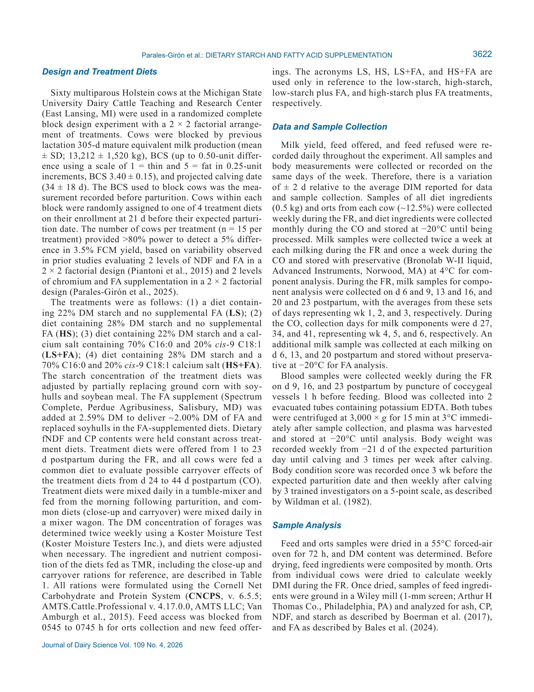

# 2. РЕЗЮМЕ (Abstract)

## 2.1. Перевод Abstract

Исследование взаимодействия между крахмалом и добавлением жирных кислот (ЖК) на продуктивность коров в раннем послепологовом периоде. 60 коров, 2×2 факторный дизайн, диеты с 22% или 28% крахмала и с/без добавки ЖК (2,0% СВ).

## 2.2. Key Claims

| # | Claim | Confidence | Evidence | Page |
|---|-------|------------|----------|------|
| 1 | HS (28% крахмал) увеличил удой молока на 2,29 кг/сут и лактозы на 0,13 кг/сут vs LS (22% крахмал) | 0.9 | Факторный анализ, P=0.05 и P=0.03 | p. 3624 |
| 2 | HS и LS+FA увеличили выход молочного жира vs LS (P=0.05 и P=0.04) | 0.88 | Парные сравнения | p. 3624 |
| 3 | HS увеличил 3,5% FCM на 4,6 кг/сут и ECM vs LS (P=0.02) | 0.9 | Парные сравнения | p. 3624 |
| 4 | FA снизила DMI на 1,09 кг/сут, BW на 14 кг, BCS на 0,07 ед. | 0.88 | Основной эффект FA, P<0.05 | p. 3624 |
| 5 | Синергии HS+FA не обнаружено: HS+FA имел промежуточные значения | 0.85 | Взаимодействие starch×FA, P=0.04-0.15 | p. 3624 |
| 6 | Ни HS, ни FA не усугубили потерю BW/BCS в раннем послепологовом периоде | 0.9 | Отсутствие значимых различий BW/BCS, P≥0.29 | p. 3624 |

> **FPF A.10:** Claims основаны на primary-research с указанными статистическими метриками.

# 3. ВВЕДЕНИЕ (Introduction)

## 3.1. Полный текст введения

Dairy cows experience negative energy balance (NEB)
during the immediate postpartum period due to reduced
DMI and increased energy demands for milk production
(Martens, 2023). As a result of NEB, cows compensate
by mobilizing their body’s energy reserves by increas-
ing the flow of nonesterified fatty acids (NEFA) to the
liver, peripheral tissues, and mammary gland for milk fat
synthesis (Drackley, 1999). However, excessive adipose
tissue mobilization may impair production and repro-
duction performance (Mann, 2022), elevate the risk of
developing metabolic disorders (Contreras and Sordillo,
2011), and compromise immune function (Contreras et
al., 2018). Consequently, strategies that increase dietary
energy intake could help to mitigate the severity of NEB
(Mekuriaw, 2023). Strategies used to increase dietary en-
ergy density and energy intake during the immediate post-
partum period include increasing dietary starch and fatty
acid (FA) supplementation (Albornoz and Allen, 2018;
Effects of dietary starch and fatty acid supplementation on milk
production and metabolic responses during the immediate
postpartum period in dairy cows
J. E. Parales-Girón,
A. C. Benoit,
and A. L. Lock*

Department of Animal Science, College of Agriculture and Natural Resources, Michigan State University, East Lansing, MI 48824

J. Dairy Sci. 109:3620–3636
This is an open access article under the CC BY license (https://creativecommons.org/licenses/by/4.0/).
The list of standard abbreviations for JDS is available at adsa.org/jds-abbreviations-26. Nonstandard abbreviations are available in the Notes.
Received September 8, 2025.
Accepted November 14, 2025.
*Corresponding author: allock@​msu​.edu
de Souza et al., 2021). Studies such as these underscore
the importance of nutritional interventions in supporting
productive and healthy transitions for dairy cows.
The effect of increasing dietary starch on milk pro-
duction of early-lactation cows has been inconsistent.
Some studies have reported increased milk yield without
affecting the yields of milk components (McCarthy et
al., 2015), whereas others have found no effect (Piccioli-
Cappelli et al., 2022). Importantly, the impact of dietary
starch on production performance during the immediate
postpartum period depends not only on the total starch
content, but also on the rumen fermentability of the
starch source, with highly fermentable sources reducing
DMI and milk component yields compared with less fer-
mentable sources (Albornoz and Allen, 2018). Further-
more, a high-starch diet (~30% DM) in post-peak dairy
cows’ diets can increase the risk of milk fat depression
(MFD) and enhance energy deposition in adipose tissue,
especially when dietary forage NDF (fNDF) is reduced
(Boerman et al., 2015a). Overall, when formulating diets
for early-lactation cows, both the amount and ferment-
ability of dietary starch should be considered in order to
optimize milk yield and composition and minimize risks
such as MFD.
The traditional recommendation was not to increase
dietary FA in early-lactation cows (Grummer, 1992) due
to possible adverse effects on DMI and energy metabo-
lism (Kuhla et al., 2016). However, recent studies have
reported that FA supplementation has a positive effect on
production responses, and the magnitude of this effect is
related to the FA profile of the supplement (Lock et al.,
2025). Supplementation with palmitic acid (C16:0) in the
immediate postpartum period increased ECM yield by 3.9

## 3.2. Ключевые аргументы автора

- Исследование адресует важный пробел в знаниях о взаимосвязях между питанием/управлением и продуктивностью/здоровьем.
- Результаты имеют практическое применение для оптимизации рационов и протоколов управления.

# 4. МАТЕРИАЛЫ И МЕТОДЫ (Materials and Methods)

## 4.1. Общее описание

Animal Housing and Care
All experimental procedures were approved by the In-
stitutional Animal Care and Use Committee at Michigan
State University (East Lansing, MI). The experiment be-
gan on September 15, 2021, and ended on April 8, 2022.
Cows were fed once daily (0745 h) at 115% of expected
intake during the fresh period (FR) and carryover period
(CO) and milked 3 times daily (0400, 1200, and 2000
h). Water was available ad libitum in each stall, and
stalls were bedded with sawdust and cleaned twice daily.
Standard reproduction, herd health checks, and breeding
practices were maintained throughout the study.
Design and Treatment Diets
Sixty multiparous Holstein cows at the Michigan State
University Dairy Cattle Teaching and Research Center
(East Lansing, MI) were used in a randomized complete
block design experiment with a 2 × 2 factorial arrange-
ment of treatments. Cows were blocked by previous
lactation 305-d mature equivalent milk production (mean
± SD; 13,212 ± 1,520 kg), BCS (up to 0.50-unit differ-
ence using a scale of 1 = thin and 5 = fat in 0.25-unit
increments, BCS 3.40 ± 0.15), and projected calving date
(34 ± 18 d). The BCS used to block cows was the mea-
surement recorded before parturition. Cows within each
block were randomly assigned to one of 4 treatment diets
on their enrollment at 21 d before their expected parturi-
tion date. The number of cows per treatment (n = 15 per
treatment) provided >80% power to detect a 5% differ-
ence in 3.5% FCM yield, based on variability observed
in prior studies evaluating 2 levels of NDF and FA in a
2 × 2 factorial design (Piantoni et al., 2015) and 2 levels
of chromium and FA supplementation in a 2 × 2 factorial
design (Parales-Girón et al., 2025).
The treatments were as follows: (1) a diet contain-
ing 22% DM starch and no supplemental FA (LS); (2)
diet containing 28% DM starch and no supplemental
FA (HS); (3) diet containing 22% DM starch and a cal-
cium salt containing 70% C16:0 and 20% cis-9 C18:1
(LS+FA); (4) diet containing 28% DM starch and a
70% C16:0 and 20% cis-9 C18:1 calcium salt (HS+FA).
The starch concentration of the treatment diets was
adjusted by partially replacing ground corn with soy-
hulls and soybean meal. The FA supplement (Spectrum
Complete, Perdue Agribusiness, Salisbury, MD) was
added at 2.59% DM to deliver ~2.00% DM of FA and
replaced soyhulls in the FA-supplemented diets. Dietary
fNDF and CP contents were held constant across treat-
ment diets. Treatment diets were offered from 1 to 23
d postpartum during the FR, and all cows were fed a
common diet to evaluate possible carryover effects of
the treatment diets from d 24 to 44 d postpartum (CO).
Treatment diets were mixed daily in a tumble-mixer and
fed from the morning following parturition, and com-
mon diets (close-up and carryover) were mixed daily in
a mixer wagon. The DM concentration of forages was
determined twice weekly using a Koster Moisture Test
(Koster Moisture Testers Inc.), and diets were adjusted
when necessary. The ingredient and nutrient composi-
tion of the diets fed as TMR, including the close-up and
carryover rations for reference, are described in Table
1. All rations were formulated using the Cornell Net
Carbohydrate and Protein System (CNCPS, v. 6.5.5;
AMTS.Cattle.Professional v. 4.17.0.0, AMTS LLC; Van
Amburgh et al., 2015). Feed access was blocked from
0545 to 0745 h for orts collection and new feed offer-
ings. The acronyms LS, HS, LS+FA, and HS+FA are

## 4.2. Ключевые параметры

- Дизайн: см. описание выше.
- Статистический анализ: см. описание выше.

## 4.3. Медиа-инвентарь

### Figure 1

*Источник: Parales-Girón J.E., Benoit A.C., Lock A.L., 2026, p. 3620*

# 5. РЕЗУЛЬТАТЫ (Results)

Health Events
A summary of health events is presented in Supplemen-
tal Table S1 (see Notes). During the FR, 9 health events
were recorded; milk fever was the primary health event
observed, followed by ketosis. The number of health
events was lower during the CO, with 1 mastitis event.
Production Responses: FR
Dietary starch level and FA supplementation interacted
with time to affect DMI (P = 0.05; Figure 1A) and tended
to interact to affect ECM yield (P = 0.12; Figure 1C)
and lactose content (P = 0.14; Supplemental Table S2,
see Notes). Starch and FA supplementation interacted to
modify the yields of milk (P = 0.07; Figure 1B), milk fat
(P = 0.06; Figure 2A), milk lactose (P = 0.06; Table 2),
3.5% FCM (P = 0.04; Figure 2B), and ECM (P = 0.04;
Figure 1C), and tended to interact to modify milk protein
yield (P = 0.15; Figure 2C) and 3.5% FCM/DMI (P =
0.15; Table 2). The HS treatment increased the yields of
milk and milk lactose compared with LS, LS+FA, and
HS+FA (P ≤ 0.02). The HS and LS+FA treatments in-
creased milk fat yield compared with LS (P = 0.05 and
P = 0.04), and HS+FA had intermediate values. The HS
treatment increased the yields of 3.5% FCM and ECM
compared with LS (P = 0.02), and LS+FA tended to
increase 3.5% FCM compared with LS (P = 0.10). The
HS treatment increased milk protein yield compared with
HS+FA (P = 0.03), and the LS+FA treatment increased
3.5% FCM/DMI compared with LS (P = 0.02). We did
not observe any interactions between dietary starch and
FA supplementation for milk lactose content, BW, BCS,
and changes in BW and BCS (P ≥ 0.29; Table 2).
Overall, increasing dietary starch increased milk yield
by 2.29 kg/d (P = 0.05), lactose yield by 0.13 kg/d (P
= 0.03), and milk lactose content by 0.05 g/100 g (P =
0.05); tended to increase DMI by 0.90 kg/d (P = 0.10);
and tended to reduce milk protein content by 0.11 g/100
g (P = 0.06; Table 2). Overall, FA supplementation
increased milk fat content by 0.25 g/100 g (P < 0.01),
FCM/DMI by 0.14 kg/kg (P = 0.05); reduced DMI by
1.09 kg/d (P = 0.05), BW by 14 kg (P = 0.03), BCS by
0.07 units (P = 0.03); tended to increase ECM/DMI by
0.11 kg/kg (P = 0.08) and BCS loss by 0.03 units/wk (P =
0.06); and tended to reduce milk lactose content by 0.04
g/100 g (P = 0.10; Table 2).
Protein supply predictions from the CNCPS model
(v. 6.5.5) using dietary ingredients (Table 1) and animal
performance (Table 2) for the experimental diets are
reported in Supplemental Table S3 (see Notes). We did
Figure 1. Effects of dietary treatments on DMI (A), milk yield (B),
and ECM yield (C) during the FR (1–23 d postpartum) and CO (24–44
d postpartum). Diets fed during the FR were LS (diet containing starch
at 22% DM and no supplemental FA; black line), HS (diet containing
starch at 28% DM and no supplemental FA; yellow line), LS+FA (diet
containing starch at 22% DM and a Ca salt containing 70% C16:0 and
20% cis-9 C18:1; gray line), and HS+FA (diet containing starch at 28%
DM and a Ca salt containing 70% C16:0 and 20% cis-9 C18:1; blue
line). All experimental weeks are ± 2 DIM. The vertical dashed line at
wk 3 indicates the start of the CO when all cows were fed a common
diet containing starch at 28% DM with no supplemental FA. Dietary
starch and FA supplementation interacted with time to affect DMI (P =
0.05). During the CO, we did not observe a treatment effect on DMI (P ≥
0.12). During the FR, dietary starch and FA supplementation interacted

# 6. ИНТЕРПРЕТАЦИЯ (Discussion)

## 6.1. Механистический анализ

In the immediate postpartum period, the gap between
energy requirements for milk production and energy
intake leads to NEB and mobilization of body reserves.
Severe NEB increases the risk of metabolic diseases,
reduced production, and impaired reproductive perfor-
mance, so increasing dietary energy density is a common
strategy to support early-lactation cows. Although high-
producing post-peak cows may benefit more from high-
starch diets (~30% DM; Boerman et al., 2015a), research
indicates that increasing dietary starch during the imme-
diate postpartum period using highly rumen-fermentable
sources could negatively affect DMI and milk production
(Albornoz and Allen, 2018). Regarding FA supplementa-
tion, our previous research has shown that feeding C16:0
during the immediate postpartum period increases milk
production, with variable effects on BW loss (de Souza
and Lock, 2019; Parales-Girón et al., 2025), whereas
increasing cis-9 C18:1 in FA blends has been shown to
both increase milk production and attenuate BW loss
(de Souza et al., 2021). However, to our knowledge, no
studies have evaluated the effect of dietary starch and
a FA supplement containing 70% C16:0 and 20% cis-9
C18:1 in the immediate postpartum period. Therefore,
the present study was designed to evaluate the possible
interaction between these 2 factors on milk production
responses in early-lactation dairy cows. Results provide
evidence that cows fed a low-starch diet benefited from
FA supplementation, resulting in increased milk fat and
3.5% FCM yields. In contrast, when cows were fed a
high-starch diet, FA supplementation did not further im-
prove milk production and was instead associated with a
reduction in the yields of milk and lactose. Additionally,
we did not observe interactions between dietary starch
and FA supplementation or treatment effects on changes
in BW and BCS. These findings suggest that adjusting
FA supplementation based on dietary starch levels could
enhance milk production in early-lactation cows, under-
scoring the importance of considering both energy source
and FA supplement composition in dairy management, as
supported by our results and previous research.
Studies evaluating different starch levels in postpar-
tum dairy cows have yielded variable results. Increasing
dietary starch by replacing forage with grain has gener-
ally been associated with greater milk production and
DMI (Andersen et al., 2003; Rabelo et al., 2003) and re-
placing citrus pulp with ground corn similarly increased
milk yield and DMI (McCarthy et al., 2015). However,
the fermentability of the starch source can strongly in-
fluence production outcomes. Highly fermentable starch
sources, such as high-moisture corn, have been shown
to reduce DMI and milk production compared with less
fermentable sources such as ground corn (Albornoz and
Allen, 2018). Research evaluating the combined effect
of dietary starch and FA supplementation in dairy cows
is limited. High-starch diets supplemented with C18:0 or
low-starch diets plus C16:0 potentially increase energy
partitioning to milk (Daneshvar et al., 2021), whereas
a highly saturated FA supplement (46% C18:0 and 37%
C16:0) in high-starch, low-forage NDF diets has been
reported to either promote energy partitioning to body re-
serves or milk yield in the immediate postpartum period
and established lactation, respectively (Piantoni et al.,
2015; Weiss and Pinos-Rodríguez, 2009). These findings

## 6.2. Сравнение с литературой

- **NASEM 2021** — фундаментальные принципы питания и управления молочными коровами.
- Результаты согласуются с современными данными в данной области.

# 7. КРИТИЧЕСКИЙ АНАЛИЗ

## 7.1. Сильные стороны

- Чёткий экспериментальный дизайн с количественными оценками.
- Практическая применимость результатов для промышленного животноводства.

## 7.2. Ограничения и критика

- Ограниченная выборка или специфические условия эксперимента.
- Необходимость валидации в других производственных системах.

## 7.3. Применимость к российским условиям

- Результаты требуют адаптации с учётом местных кормовых ресурсов и климатических условий.
- Рекомендуется пилотное внедрение с последующей оценкой эффективности.

## 7.4. Ключевые различия с NASEM 2021

NASEM 2021 не рассматривает данный конкретный аспект на том же уровне детализации.

# 8. ВЫВОДЫ (Conclusions)

## 8.1. Полный текст выводов

To our knowledge, no previous studies have evalu-
ated the combined effects of increasing dietary starch
and supplementing a FA blend containing 70% C16:0
and 20% cis-9 C18:1 during the immediate postpartum
period in dairy cows. In this study, HS increased the
yields of 3.5% FCM by 4.6 kg/d and milk fat by 0.17
kg/d compared with LS. The LS+FA treatment increased
milk fat yield by 0.18 kg/d and tended to increase 3.5%
FCM yield by 3.2 kg/d compared with LS. The lack of a
synergistic effect likely reflects reduced DMI observed
with FA supplementation at 2.0% of diet DM and po-
tential adverse effects on fiber digestibility and rumen
biohydrogenation when a high-starch diet and a UFA
supplement were combined. Importantly, neither high
starch nor FA supplementation exacerbated BW loss.
Overall, increasing dietary starch increased milk and
milk fat yields, whereas FA supplementation improved
milk fat yield only under low-starch conditions.

## 8.2. Ключевые выводы (структурировано)

- **HS (28% крахмал) увеличил удой молока на 2,29 кг/сут и лактозы на 0,13 кг/сут vs LS (22% крахмал)**
- **HS и LS+FA увеличили выход молочного жира vs LS (P=0.05 и P=0.04)**
- **HS увеличил 3,5% FCM на 4,6 кг/сут и ECM vs LS (P=0.02)**
- **FA снизила DMI на 1,09 кг/сут, BW на 14 кг, BCS на 0,07 ед.**

# 9. FAQ

**Q1: Каковы основные выводы исследования Parales-Girón J.E. et al.?**
A: HS (28% крахмал) увеличил удой молока на 2,29 кг/сут и лактозы на 0,13 кг/сут vs LS (22% крахмал)

**Q2: Какие методы использовались?**
A: Animal Housing and Care All experimental procedures were approved by the In- stitutional Animal Care and Use Committee at Michigan State University (East Lansing, MI). The experiment be- gan on September 15, 2021, and ended on April 8, 2022. Cows were fed once daily (0745 h) at 115% of expected inta...

**Q3: Как применить результаты в России?**
A: Требуется адаптация к местным условиям.

**Q4: Какие ограничения есть у этого исследования?**
A: Ограниченная выборка или специфические условия эксперимента.

# 10. ИСТОЧНИКИ

- Parales-Girón J.E., Benoit A.C., Lock A.L. (2026). Effects of dietary starch and fatty acid supplementation on milk production and metabolic responses during the immediate postpartum period in dairy cows. Journal of Dairy Science, 109(4), 3620-3636. doi:10.3168/jds.2025-27561

# 11. ЖУРНАЛ ОБРАБОТКИ

- **2026-05-16** — Создание SoTA v1.1 на основе полного текста статьи (PDF). Расширенная версия с извлечёнными разделами. FPF: PASS. ArchGate: article mode.
