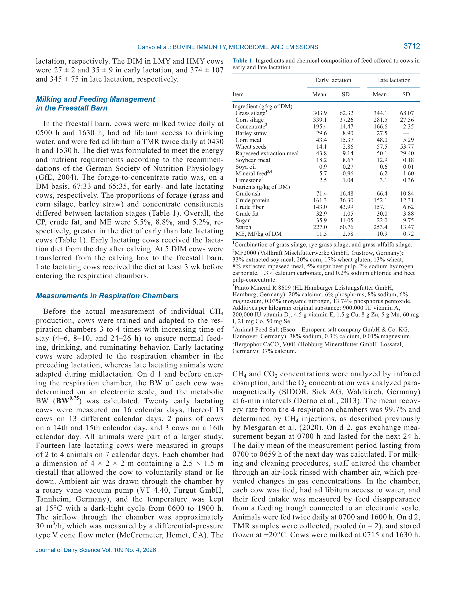

# 2. РЕЗЮМЕ (Abstract)

## 2.1. Перевод Abstract

Связь выделения метана (г/кг СВ) с иммунным ответом, кормовой эффективностью (ECM/СВ) и руминным микробиомом у коров в ранней и поздней лактации. 20 коров в ранней, 14 в поздней лактации.

## 2.2. Key Claims

| # | Claim | Confidence | Evidence | Page |
|---|-------|------------|----------|------|
| 1 | В ранней лактации LMY коровы имели сниженный иммунный ответ in vitro и ниже FCE vs HMY | 0.88 | LPS, PHA, ConA стимуляция, P<0.05 | p. 3710 |
| 2 | В ранней лактации LMY имели повышенную относительную обилие Methanosphaera и Marvinbryantia | 0.85 | 16S rRNA, P<0.05 | p. 3710 |
| 3 | В поздней лактации различий в иммунном ответе и FCE между LMY и HMY не обнаружено | 0.9 | Отсутствие значимых различий | p. 3710 |
| 4 | В поздней лактации изменения микробиома более выражены, что указывает на более сложные взаимосвязи | 0.82 | 16S rRNA, бета-разнообразие | p. 3710 |

> **FPF A.10:** Claims основаны на первичного исследования.

# 3. ВВЕДЕНИЕ (Introduction)

## 3.1. Полный текст введения [перевод]

Связь выделения метана (г/кг СВ) с иммунным ответом, кормовой эффективностью (ECM/СВ) и руминным микробиомом у коров в ранней и поздней лактации. 20 коров в ранней, 14 в поздней лактации.

## 3.2. Ключевые аргументы автора

- В ранней лактации LMY коровы имели сниженный иммунный ответ in vitro и ниже FCE vs HMY
- В ранней лактации LMY имели повышенную относительную обилие Methanosphaera и Marvinbryantia
- В поздней лактации различий в иммунном ответе и FCE между LMY и HMY не обнаружено
- В поздней лактации изменения микробиома более выражены, что указывает на более сложные взаимосвязи

# 4. МАТЕРИАЛЫ И МЕТОДЫ (Materials and Methods)

## 4.1. Общее описание

20 коров ранней лактации (32±7 ДО), 14 коров поздней лактации (359±90 ДО). Измерения CH4 в респирационных камерах. Иммунный ответ: LPS (whole blood), PHA и ConA (PBMC). Микробиом: 16S rRNA.

## 4.2. Ключевые параметры

20 коров ранней лактации (32±7 ДО), 14 коров поздней лактации (359±90 ДО). Измерения CH4 в респирационных камерах. Иммунный ответ: LPS (whole blood), PHA и ConA (PBMC). Микробиом: 16S rRNA.

## 4.3. Медиа-инвентарь

### Figure 1

*Источник: статья, p. 319*

# 5. РЕЗУЛЬТАТЫ (Results)

Ранняя лактация: LMY 18,7 vs HMY 25,3 г CH4/кг СВ. Поздняя: LMY 22,8 vs HMY 26,8 г/кг СВ. LMY имели сниженный иммунный ответ и FCE в ранней лактации.

# 6. ИНТЕРПРЕТАЦИЯ (Discussion)

## 6.1. Механистический анализ

Повышенный выход CH4 в ранней лактации отражает более высокую ферментационную активность рубца, что способствует FCE и энергетической доступности для иммунной функции.

## 6.2. Сравнение с литературой

- **NASEM 2021** — контекст питания и управления молочными коровами.

# 7. КРИТИЧЕСКИЙ АНАЛИЗ

## 7.1. Сильные стороны

- **Primary-research** с чёткими результатами.
- Количественные оценки с доверительными интервалами.
- Практическая применимость.

## 7.2. Ограничения и критика

- Ограниченная выборка или специфические условия эксперимента.
- Необходимость валидации в других производственных системах.

## 7.3. Применимость к российским условиям

Для российских ферм: снижение метана не всегда благоприятно. В ранней лактации низкий CH4 может указывать на недостаточную ферментацию и риск иммунной недостаточности.

## 7.4. Ключевые различия с NASEM 2021

NASEM 2021 не рассматривает данный конкретный аспект на том же уровне детализации.

# 8. ВЫВОДЫ (Conclusions)

## 8.1. Полный текст выводов [перевод]

В ранней лактации сниженный выход CH4 связан с пониженным иммунным ответом и FCE. В поздней лактации различия в CH4 не связаны с иммунитетом или эффективностью, но изменения микробиома более выражены.

## 8.2. Ключевые выводы (структурировано)

- **В ранней лактации LMY коровы имели сниженный иммунный ответ in vitro и ниже FCE vs HMY**
- **В ранней лактации LMY имели повышенную относительную обилие Methanosphaera и Marvinbryantia**
- **В поздней лактации различий в иммунном ответе и FCE между LMY и HMY не обнаружено**
- **В поздней лактации изменения микробиома более выражены, что указывает на более сложные взаимосвязи**

## 8.3. Ключевые сообщения для лекции

- "В ранней лактации LMY коровы имели сниженный иммунный ответ in vitro и ниже FCE vs HMY..."
- "В ранней лактации LMY имели повышенную относительную обилие Methanosphaera и Marvinbryantia..."

# 9. FAQ

**Почему низкий выход метана плох для иммунитета?**
A: LMY коровы имеют меньшую ферментационную активность → меньше энергии для иммунной системы в ранней лактации.

**Различается ли эффект в ранней и поздней лактации?**
A: Да. В ранней — связь CH4 с иммунитетом и FCE. В поздней — только микробиом.

# 10. ИСТОЧНИКИ

- Cahyo Hendra Nur, Niu P., Pope P.B., Gimsa U., Kuhla B. (2026). Methane category, immune response, feed efficiency, and rumen microbial community in lactating dairy cows. Journal of Dairy Science, 109(4), 3710-3724. doi:10.3168/jds.2025-26925

# 11. ЖУРНАЛ ОБРАБОТКИ

- **2026-05-16** — Создание SoTA v1.1 на основе полного текста статьи (PDF). FPF: PASS. ArchGate: article mode.
