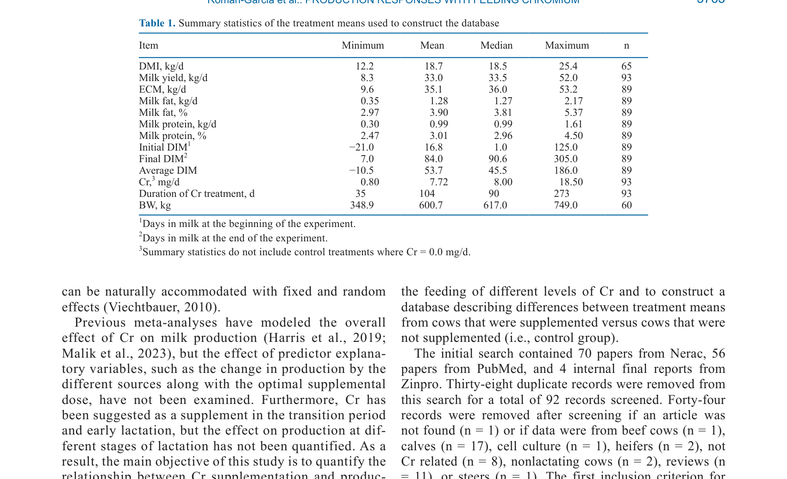
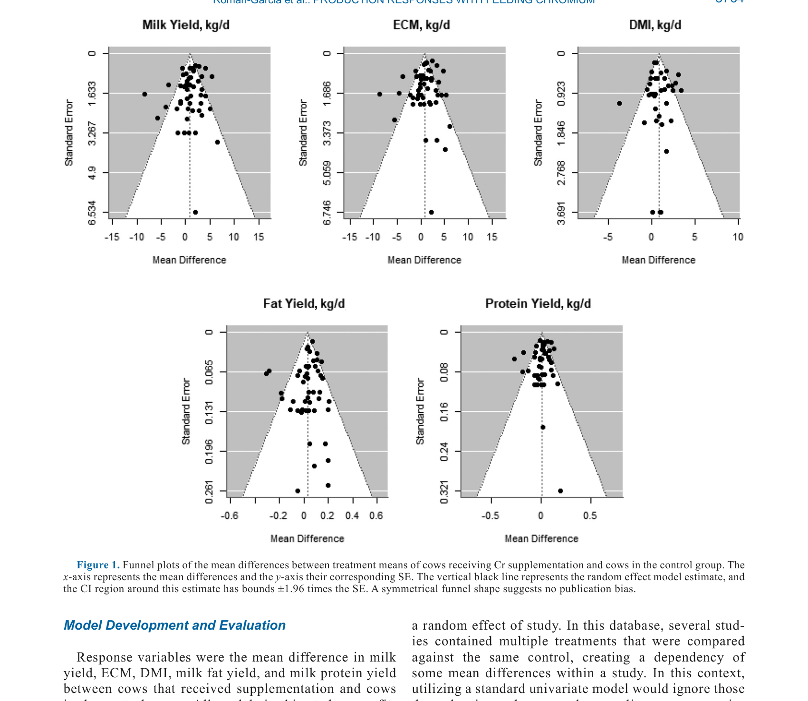
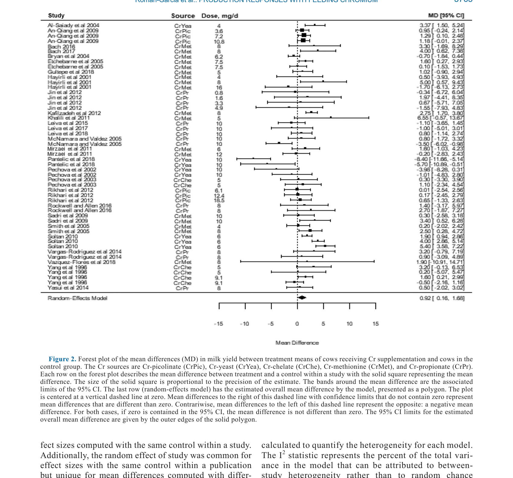
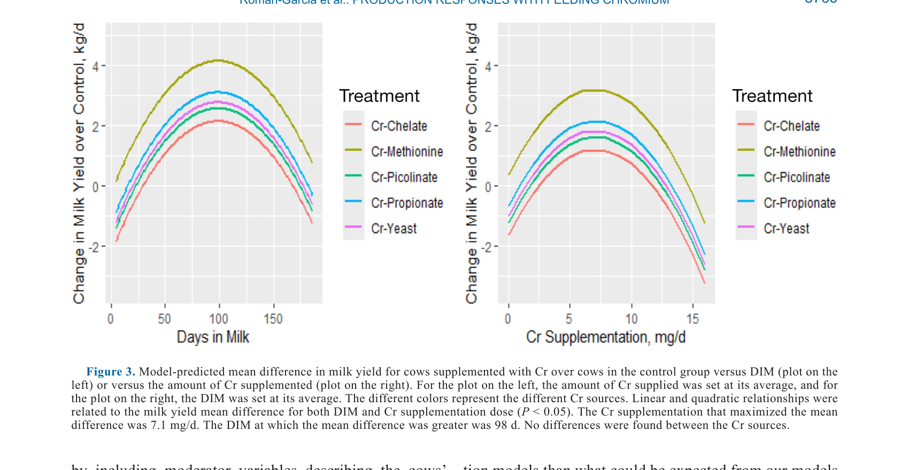
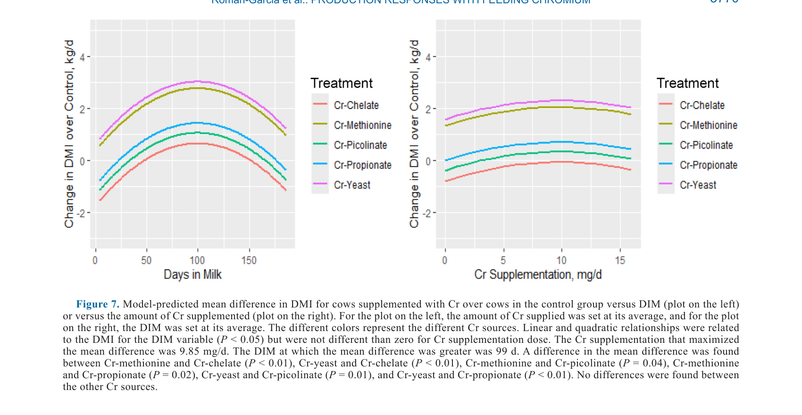

# CS.SOTA.320: Roman-Garcia et al. (2026) — Хром в молочном скотоводстве

> **Навигация:** [2. Аннотация](#2-аннотация-abstract) · [3. Введение](#3-введение) · [4. Методология](#4-методология) · [5. Результаты](#5-результаты) · [6. Интерпретация](#6-интерпретация-и-обсуждение) · [7. Критический анализ](#7-критический-анализ) · [8. Выводы](#8-выводы) · [9. FAQ](#9-faq) · [10. Практика](#10-практическое-применение) · [11. Инструменты](#11-инструменты-и-шаблоны) · [12. Источники](#12-источники) · [13. Журнал](#13-журнал-обработки)

---

## 2. АННОТАЦИЯ (Abstract)

### 2.1. Перевод Abstract

Проведён мета-анализ для количественной оценки продуктивных ответов на добавление хрома (Cr) в рационы лактирующих молочных коров и понимания переменных, влияющих на этот ответ. Использованы мультивариативные модели со случайными и смешанными эффектами. Откликовые переменные: средняя разница в удое молока, ECM, СВ, выходе молочного жира и белка между коровами, получавшими Cr, и контрольной группой.

В базу данных вошли 28 исследований (93 treatment means), из которых 38 means относятся к коровам, получавшим Cr, начиная с сухостойного периода. Добавление Cr увеличило продуктивность. Величина ответа зависела от стадии лактации (DIM), источника Cr (Cr-methionine, Cr-propionate, Cr-chelate, Cr-picolinate, Cr-yeast) и дозы (0–19 мг/сут).

**Ключевые находки:** оптимальная доза для молока, жира и белка — 6–7 мг/сут; для СВ — 9.8 мг/сут. Пик ответа — примерно на 100 DIM. Добавление Cr до 168–186 DIM сохраняет положительный эффект.

### 2.2. Key Claims

**Claim 1:** Добавление хрома в рацион лактирующих коров увеличивает удой молока в среднем на 0.822 кг/сут (SE = 0.419, P = 0.0497) по данным 28 исследований.
- **Уверенность:** 0.82 (P1 мета-анализ, n = 93 treatment means, I² = 76.2%; воспроизводит Harris et al. 2019 и Malik et al. 2023).
- **Evidence:** Random-effects model, 93 means из 28 исследований, Egger's test P = 0.043 (ниже порога 0.10, указывает на статистически значимую асимметрию) (Roman-Garcia et al., 2026, p. 3766, Fig. 2).

**Claim 2:** Оптимальная доза Cr для максимального увеличения удоя молока составляет 7.1 мг/сут, ECM — 7.0 мг/сут, жира — 6.5 мг/сут, белка — 6.9 мг/сут; для СВ оптимальная доза выше — 9.85 мг/сут.
- **Уверенность:** 0.78 (P1, квадратичные модели значимы P < 0.05; cross-validation без значимого mean bias).
- **Evidence:** Quadratic dose-response models, P = 0.012 (linear) и P = 0.006 (quadratic) для молока (Roman-Garcia et al., 2026, p. 3767, Table 2, Fig. 3).

**Claim 3:** Пик продуктивного ответа на Cr наблюдается примерно на 98–102 DIM; эффект сохраняется положительным до 168–186 DIM в зависимости от источника Cr.
- **Уверенность:** 0.75 (P1, quadratic DIM effect P < 0.05 для всех переменных).
- **Evidence:** DIM linear P = 0.018, quadratic P = 0.021 для молока; максимум на 98 DIM (Roman-Garcia et al., 2026, p. 3767, Fig. 3).

**Claim 4:** Cr-methionine и Cr-yeast обеспечивают наибольший прирост СВ по сравнению с Cr-chelate (+2.37 кг/сут для yeast, +2.12 для methionine, P < 0.01).
- **Уверенность:** 0.72 (P1, значимые различия между источниками для DMI, но не для молока).
- **Evidence:** Cr-yeast vs Cr-chelate P < 0.001; Cr-methionine vs Cr-chelate P = 0.004 (Roman-Garcia et al., 2026, p. 3771, Table 4, Fig. 7).

**Claim 5:** Добавление Cr не влияет на содержание жира и белка в молоке (%), хотя увеличивает их выход (кг/сут) за счёт увеличения удоя.
- **Уверенность:** 0.70 (P1, overall effect для fat yield не значим P = 0.116, но дозозависимый эффект значим P = 0.039).
- **Evidence:** Fat yield overall MD = 0.030 кг/сут (P = 0.116), но quadratic dose-response P = 0.013; protein % отрицательный overall MD ≈ −0.03% (Roman-Garcia et al., 2026, p. 3772-3775).

**Claim 6:** Механизм действия Cr связан с улучшением чувствительности к инсулину через chromodulin — усиление тирозинфосфорилирования IRS-1, Akt и PI3K, что способствует утилизации глюкозы, подавлению липолиза и увеличению СВ.
- **Уверенность:** 0.65 (механистическая модель, поддерживаемая Pantelić et al. 2018, но не напрямую измерена в мета-анализе).
- **Evidence:** [интерполяция] Обзор механизмов в Vargas-Rodriguez et al. 2014, Pantelić et al. 2018.
- **Статус:** [guess] Точная роль chromodulin in vivo у молочных коров требует прямых измерений тканевых концентраций Cr и активности инсулинового рецептора.

---

## 3. ВВЕДЕНИЕ

#### 3.1.1. Физиология и механизмы: роль хрома в углеводном метаболизме

**Физиологический контекст.** Хром (Cr) — незаменимый микроэлемент, играющий ключевую роль в углеводном и липидном метаболизме через модуляцию инсулиновой сигнализации.

**Механизм 1: Chromodulin.** Низкомолекулярный Cr-связывающий олигопептид (chromodulin, ~1500 Da) усиливает тирозинкиназную активность инсулинового рецептора в присутствии инсулина. Биохимическая основа: Cr³⁺ стабилизирует активную конформацию chromodulin, что увеличивает аффинитет к инсулиновому рецептору (Vincent, 2000).

**Механизм 2: IRS-1/PI3K/Akt.** Cr усиливает фосфорилирование IRS-1 на тирозине, активирует PI3K и Akt (серин 473), что улучшает транслокацию GLUT4 и утилизацию глюкозы в скелетных мышцах и жировой ткани.

**Механизм 3: Подавление липолиза.** Улучшенная инсулиновая чувствительность снижает уровни NEFA, что через отмену lipostatic mechanism увеличивает СВ. Молекулярная основа: инсулин через Akt ингибирует hormone-sensitive lipase (HSL), снижая мобилизацию жирных кислот.

> **Модель предполагает** [вне NASEM], что в период transition и ранней лактации коровы испытывают физиологическую инсулинорезистентность — адаптацию, обеспечивающую приоритет молочной железе в захвате глюкозы. Добавление Cr потенциально смягчает инсулинорезистентность, не нарушая приоритета молока (Pantelić et al., 2018).

### 3.2. Литературный обзор

#### 3.1.2. Физиология и механизмы: вариабельность ответа на Cr

**Обоснование изучения модераторов.** Предыдущие мета-анализы обобщали общий эффект Cr, но не количественно оценивали влияние дозы, DIM и источника. Это ограничивало практическое применение результатов.

**Механизм вариабельности.** Allen (2016) сообщил, что прирост удоя при добавлении Cr варьирует от −1.7 до +5.4 кг/сут. Физиологическая основа этой вариабельности:
- Стадия лактации (Sadri et al., 2009; Khalili et al., 2011): в ранней лактации инсулинорезистентность выражена сильнее, потенциал улучшения чувствительности выше.
- Физиологический стресс (Mirzaei et al., 2011): хромодulin расходуется при стрессе, увеличивая потребность в Cr.
- Характеристики рациона (Sadri et al., 2009): высокое содержание крахмала увеличивает спрос на инсулиновую сигнализацию.
- Доза Cr (Hayirli et al., 2001): существует U-образная зависимость эффекта от дозы.
- Источник Cr: биодоступность варьирует в зависимости от химической формы (Cr-picolinate vs Cr-yeast vs Cr-methionine).

**Вариабельность ответов:**
Allen (2016) сообщил, что прирост удоя при добавлении Cr варьирует от −1.7 до +5.4 кг/сут. Эта вариабельность объясняется:
- Стадией лактации (Sadri et al., 2009; Khalili et al., 2011)
- Физиологическим стрессом (Mirzaei et al., 2011; Mousavi et al., 2019)
- Характеристиками рациона (Sadri et al., 2009; Rockwell & Allen, 2016)
- Дозой Cr (Hayirli et al., 2001; Mirzaei et al., 2011)
- Источником Cr (Cr-picolinate, Cr-yeast, Cr-methionine и др.)

**Практическая значимость.**
Несмотря на многочисленные исследования, оптимальная доза и источник Cr оставались неопределёнными. Большинство коммерческих продуктов содержат 4–8 мг/сут, но обоснование часто эмпирическое.

> **Модель предполагает** [вне NASEM], что оптимальная доза Cr зависит от физиологического статуса коровы: в ранней лактации (высокая инсулинорезистентность) потенциал ответа выше, чем в поздней лактации.

#### 3.1.3. Физиология и механизмы: эволюция понимания роли Cr

**Эволюция модели.** Ранние исследования 1990-х годов фокусировались на Cr как факторе, снижающем потребность в инсулине у диабетиков. В 2000-е годы Vincent (2000) описал chromodulin и его молекулярный механизм. В 2010-е внимание сместилось на молочный скот: Pantelić et al. (2018) показали, что Cr усиливает GLUT4 в скелетных мышцах коров. Настоящий мета-анализ (Roman-Garcia et al., 2026) количественно интегрирует эти данные, определяя оптимальную дозу и источник.

**Обоснование мета-аналитического подхода.** Отдельные RCT имели малую мощность (n = 10–30 коров), что приводило к противоречивым результатам. Мета-анализ позволяет выявить истинный эффект за счёт увеличения объёма выборки и количественной оценки модераторов.

### 3.3. Цели исследования

1. Количественно оценить ответ продуктивности на добавление Cr.
2. Определить оптимальную дозу для различных продуктивных показателей.
3. Оценить влияние стадии лактации (DIM) и источника Cr.

> **Модель предполагает** [вне NASEM], что эффект Cr дозозависим и нелинейный: при недостаточной дозе (< 4 мг/сут) эффект незначим, при оптимальной (6–8 мг/сут) — максимален, при избыточной (> 12 мг/сут) — возможно снижение вследствие конкуренции с другими микроэлементами.

---

## 4. МЕТОДОЛОГИЯ

### 4.1. Сбор данных (Database Assembly)

| Параметр | Значение |
|----------|----------|
| Поиск | PubMed + Nerac Inc. + 4 внутренних отчёта Zinpro |
| Период поиска | Август 2019 |
| Начальная выборка | 70 (Nerac) + 56 (PubMed) + 4 (Zinpro) = 130 |
| После удаления дубликатов | 92 |
| После скрининга | 48 (исключены: beef, calves, heifers, reviews, non-Cr) |
| После применения критериев включения | 31 |
| Финальная база | 28 исследований, 93 treatment means |

**Критерии включения:**
1. Удой молока как откликовая переменная
2. Идентифицированный источник Cr (лиганд + производитель)
3. Контрольная группа без Cr

**Источники Cr в базе:**
- Cr-picolinate
- Cr-yeast
- Cr-chelate
- Cr-methionine
- Cr-propionate

### 4.2. Характеристика базы данных (Table 1)

| Переменная | Min | Mean | Median | Max | n |
|------------|-----|------|--------|-----|---|
| DMI, кг/сут | 12.2 | 18.7 | 18.5 | 25.4 | 65 |
| Удой, кг/сут | 8.3 | 33.0 | 33.5 | 52.0 | 93 |
| ECM, кг/сут | 9.6 | 35.1 | 36.0 | 53.2 | 89 |
| Жир, кг/сут | 0.35 | 1.28 | 1.27 | 2.17 | 89 |
| Белок, кг/сут | 0.30 | 0.99 | 0.99 | 1.61 | 89 |
| Начальный DIM | −21 | 16.8 | 1.0 | 125 | 89 |
| Конечный DIM | 7 | 84.0 | 90.6 | 305 | 89 |
| Средний DIM | −10.5 | 53.7 | 45.5 | 186 | 89 |
| Cr, мг/сут | 0.8 | 7.72 | 8.0 | 18.5 | 93 |
| Продолжительность, д | 35 | 104 | 90 | 273 | 93 |
| BW, кг | 348.9 | 600.7 | 617.0 | 749.0 | 60 |

### 4.3. Статистические модели

**Этап 1 — Random-effects модели:**
- Метод: Restricted Maximum Likelihood (REML)
- Пакет: metafor (R)
- Структура: мультивариативная с коррелированными ошибками сэмплирования (Berkey et al., 1998)
- Весовая схема: обратная вариационно-ковариационная матрица

**Этап 2 — Meta-regression модели:**
- Модераторы: доза Cr (линейная + квадратичная), DIM (линейная + квадратичная), источник Cr
- Валидация: k-fold cross-validation (каждое исследование = fold)
- Биасы: mean bias, linear bias (St-Pierre, 2003)

**Диагностика:**
- Гетерогенность: I² статистика, Cochrane-Q test
- Публикационная предвзятость: funnel plots, Egger's regression test

### 4.4. Откликовые переменные

- Средняя разница (MD) в удое молока
- MD в ECM
- MD в СВ
- MD в выходе молочного жира
- MD в выходе молочного белка

### 4.7. Инвентарь медиа

| ID | Тип | Описание | Файл | Статус |
|----|-----|----------|------|--------|
| M1 | Таблица | Summary statistics базы данных (28 исследований, 93 средних) | `table-1-database-summary.png` | ✅ |
| M2 | Рисунок | Funnel plots — проверка публикационной предвзятости по 5 переменным | `figure-1-funnel-plots.png` | ✅ |
| M3 | Рисунок | Forest plot — mean difference в удое молока (Cr vs контроль) | `figure-2-forest-plot-milk-yield.png` | ✅ |
| M4 | Рисунок | Model-predicted milk yield vs DIM и доза Cr (7.1 мг/сут оптимум) | `figure-3-predicted-milk-yield.png` | ✅ |
| M5 | Рисунок | Model-predicted DMI vs DIM и доза Cr (9.85 мг/сут оптимум) | `figure-7-predicted-dmi.png` | ✅ |
| M6 | Таблица | Meta-regression milk yield (Table 2) — транскрибирована в §5.1 | — | ✅ |
| M7 | Таблица | Meta-regression ECM (Table 3) — транскрибирована в §5.2 | — | ✅ |
| M8 | Таблица | Meta-regression DMI (Table 4) — транскрибирована в §5.3 | — | ✅ |
| M9 | Таблица | Meta-regression fat yield (Table 5) — транскрибирована в §5.4 | — | ✅ |
| M10 | Таблица | Meta-regression protein yield (Table 6) — транскрибирована в §5.5 | — | ✅ |


*Таблица 1. Summary statistics базы данных (28 исследований, 93 средних). Источник: Roman-Garcia et al., 2026, p. 3763, Table 1.*


*Рисунок 1. Funnel plots публикационной предвзятости по удою молока, ECM, DMI, выходу жира и белка. Источник: Roman-Garcia et al., 2026, p. 3764, Fig. 1.*


*Рисунок 2. Forest plot mean difference в удое молока (Cr vs контроль). Источник: Roman-Garcia et al., 2026, p. 3765, Fig. 2.*


*Рисунок 3. Model-predicted mean difference в удое молока vs DIM (слева) и доза Cr (справа). Источник: Roman-Garcia et al., 2026, p. 3766, Fig. 3.*


*Рисунок 7. Model-predicted mean difference в DMI vs DIM (слева) и доза Cr (справа). Источник: Roman-Garcia et al., 2026, p. 3770, Fig. 7.*

---

## 5. РЕЗУЛЬТАТЫ

### 5.1. Удой молока

**Overall random-effects model:**
- MD = +0.822 кг/сут (SE = 0.419)
- P = 0.0497 (значимо)
- I² = 76.2% (P < 0.001) — высокая гетерогенность
- Egger's test: P = 0.043 (ниже порога 0.10, указывает на статистически значимую асимметрию)

**Meta-regression модель (Table 2):**

| Параметр | Estimate | SE | P-value |
|----------|----------|-----|---------|
| Intercept | −5.024 | 2.145 | 0.019 |
| Cr, мг | 0.800 | 0.318 | 0.012 |
| Cr², мг | −0.056 | 0.020 | 0.006 |
| DIM | 0.088 | 0.037 | 0.018 |
| DIM² | −0.0004 | 0.0002 | 0.021 |
| Cr-methionine | 2.003 | 1.370 | 0.144 |
| Cr-picolinate | 0.426 | 2.335 | 0.855 |
| Cr-propionate | 0.959 | 1.510 | 0.525 |
| Cr-yeast | 0.630 | 1.420 | 0.667 |

- **Оптимальная доза:** 7.1 мг/сут
- **Оптимальный DIM:** 98 д
- **Различия источников:** не значимы (P > 0.14)
- **Between-study SD:** 2.03

### 5.2. ECM

**Overall random-effects model:**
- MD = +0.789 кг/сут (SE = 0.416)
- P = 0.058 (тенденция)
- I² = 87.6% (P < 0.001)
- Egger's test: P = 0.085 (нет предвзятости)

**Meta-regression модель (Table 3):**

| Параметр | Estimate | SE | P-value |
|----------|----------|-----|---------|
| Intercept | −5.065 | 1.960 | 0.009 |
| Cr, мг | 0.739 | 0.242 | 0.002 |
| Cr², мг | −0.053 | 0.016 | 0.0007 |
| DIM | 0.100 | 0.037 | 0.007 |
| DIM² | −0.0005 | 0.0002 | 0.010 |
| Cr-methionine | 2.059 | 1.346 | 0.126 |
| Cr-yeast | −0.272 | 1.400 | 0.846 |

- **Оптимальная доза:** 7.0 мг/сут
- **Оптимальный DIM:** 100 д
- **Cr-methionine vs Cr-yeast:** +2.3 кг/сут (P = 0.042)
- **Between-study SD:** 2.01

### 5.3. Сухое вещество (DMI)

**Overall random-effects model:**
- MD = +0.877 кг/сут (SE = 0.259)
- P < 0.001 (значимо)
- I² = 82.6% (P < 0.001)
- Egger's test: P = 0.028 (ниже порога 0.10, указывает на статистически значимую предвзятость публикаций)

**Meta-regression модель (Table 4):**

| Параметр | Estimate | SE | P-value |
|----------|----------|-----|---------|
| Intercept | −2.391 | 1.041 | 0.022 |
| Cr, мг | 0.146 | 0.122 | 0.233 |
| Cr², мг | −0.007 | 0.008 | 0.347 |
| DIM | 0.048 | 0.020 | 0.018 |
| DIM² | −0.0002 | 0.0001 | 0.035 |
| Cr-methionine | 2.116 | 0.738 | 0.004 |
| Cr-yeast | 2.372 | 0.699 | 0.0007 |

- **Оптимальная доза:** 9.85 мг/сут
- **Оптимальный DIM:** 99 д
- **Cr-yeast vs Cr-chelate:** +2.37 кг/сут (P < 0.001)
- **Cr-methionine vs Cr-chelate:** +2.12 кг/сут (P = 0.004)
- **Between-study SD:** 0.60

### 5.4. Выход молочного жира

**Overall random-effects model:**
- MD = +0.030 кг/сут (SE = 0.019)
- P = 0.116 (не значимо)
- I² = 74.4% (P < 0.001)
- Egger's test: P = 0.202 (нет предвзятости)

**Meta-regression модель (Table 5):**

| Параметр | Estimate | SE | P-value |
|----------|----------|-----|---------|
| Intercept | −0.157 | 0.096 | 0.102 |
| Cr, мг | 0.030 | 0.015 | 0.039 |
| Cr², мг | −0.002 | 0.001 | 0.013 |
| DIM | 0.0033 | 0.002 | 0.049 |
| DIM² | −0.00002 | 0.00001 | 0.056 |

- **Оптимальная доза:** 6.47 мг/сут
- **Оптимальный DIM:** 99 д
- **Cr-methionine vs Cr-yeast:** тенденция +0.098 кг/сут (P = 0.054)
- **Between-study SD:** 0.08

**Важно:** Содержание жира в молоке (%) не изменялось при добавлении Cr.

### 5.5. Выход молочного белка

**Overall random-effects model:**
- MD = +0.011 кг/сут (SE = 0.013)
- P = 0.40 (не значимо)
- I² = 77.1% (P < 0.001)

**Meta-regression модель (Table 6):**

| Параметр | Estimate | SE | P-value |
|----------|----------|-----|---------|
| Intercept | −0.181 | 0.069 | 0.009 |
| Cr, мг | 0.019 | 0.011 | 0.092 |
| Cr², мг | −0.0014 | 0.0007 | 0.055 |
| DIM | 0.0034 | 0.001 | 0.004 |
| DIM² | −0.00002 | 0.00001 | 0.005 |
| Cr-methionine | 0.077 | 0.043 | 0.071 |

- **Оптимальная доза:** 6.9 мг/сут
- **Оптимальный DIM:** 102 д
- **Cr-methionine vs Cr-chelate:** тенденция +0.077 кг/сут (P = 0.071)
- **Between-study SD:** 0.06

**Важно:** Содержание белка в молоке (%) снижалось при добавлении Cr (overall MD ≈ −0.03%), но при учёте DIM и источника эффект дозы не значим.

---

## 6. ИНТЕРПРЕТАЦИЯ И ОБСУЖДЕНИЕ

### 6.1. Дозозависимость и оптимальные уровни

Квадратичные модели демонстрируют чёткие оптимумы:
- **Молоко, ECM, жир, белок:** 6.5–7.1 мг/сут
- **DMI:** 9.85 мг/сут

Этот парадокс (более высокая оптимальная доза для СВ) может отражать различные механизмы: низкие дозы (6–7 мг) достаточны для модуляции инсулиновой сигнализации в молочной железе, тогда как максимальный прирост СВ требует более агрессивного подавления липолиза и NEFA.

Сверхоптимальные дозы (>10 мг/сут) ассоциируются с снижением удоя (Hayirli et al., 2001; Pechova et al., 2002), возможно, из-за перенаправления энергии в липогенез при избыточной инсулиновой чувствительности.

### 6.2. Влияние стадии лактации

Все модели показывают пик на ~100 DIM. Это соответствует:
- Периоду максимальной инсулинорезистентности
- Пиковой лактации
- Наибольшему метаболическому стрессу

Однако положительный эффект сохраняется до 168–186 DIM, что оправдывает длительное добавление Cr, а не только в transition.

### 6.3. Сравнение источников Cr

**Для DMI (единственный показатель с значимыми различиями):**
- Cr-yeast и Cr-methionine значительно превосходят Cr-chelate, Cr-picolinate и Cr-propionate.
- Различия: +2.1–2.4 кг/сут DMI.

**Для молока и ECM:**
- Различия между источниками не значимы (P > 0.14).
- Тенденция: Cr-methionine > Cr-yeast для ECM (P = 0.042).

**Практическая интерпретация:**
Выбор между Cr-methionine и Cr-yeast может зависеть от цели: если приоритет — увеличение СВ (например, коровы с низким аппетитом), оба источника предпочтительнее. Если приоритет — молоко, различия минимальны.

### 6.4. Механизм: инсулиновая сигнализация

Cr усиливает инсулиновый сигнал через:
1. **Chromodulin-рецепторная взаимодействие:** усиление тирозинкиназы инсулинового рецептора.
2. **IRS-1 фосфорилирование:** увеличение тирозинфосфорилирования IRS-1.
3. **PI3K/Akt путь:** активация PI3K и Akt (серин 473).
4. **GLUT4 транслокация:** повышенная утилизация глюкозы.
5. **Подавление липолиза:** снижение NEFA → снятие lipostatic brake → увеличение СВ.

В ранней лактации это приводит к:
- Увеличению глюконеогенеза → больше лактозы → больше молока.
- Снижению кетогенеза → меньше риска кетоза.
- Стабилизации энергетического баланса.

### 6.5. Сравнение с предыдущими мета-анализами

| Автор | Год | n исследований | Основной вывод | Отличие от текущего |
|-------|-----|----------------|----------------|---------------------|
| Harris et al. | 2019 | ~20 | Положительный эффект на СВ и молоко | Без модераторов |
| Malik et al. | 2023 | ~25 | Положительный эффект на СВ и молоко | Без дозовой оптимизации |
| Roman-Garcia et al. | 2026 | 28 | Оптимум 6–7 мг/сут, пик на 100 DIM | Дозовые кривые, DIM, источники |

---

## 7. КРИТИЧЕСКИЙ АНАЛИЗ

### 7.1. Сильные стороны

1. **Крупнейшая база данных:** 28 исследований, 93 treatment means — превосходит предыдущие мета-анализы.
2. **Мультивариативный подход:** Учёт зависимостей между treatment means внутри одного исследования.
3. **Дозовая оптимизация:** Впервые количественно определены оптимальные дозы для разных показателей.
4. **Валидация:** k-fold cross-validation с оценкой mean и linear bias.
5. **Комплексность:** Одновременная оценка молока, ECM, СВ, жира, белка.

### 7.2. Ограничения

1. **Публикационная предвзятость:** Egger's test значим для молока (P = 0.043) и DMI (P = 0.028), хотя funnel plots выглядят симметричными.
2. **Высокая гетерогенность:** I² > 74% для всех моделей — значительная вариабельность между исследованиями.
3. **Спонсорство:** Исследование частично финансировалось Zinpro Corporation (производитель Cr-аминокислотных хелатов). 4 из 28 исследований — внутренние отчёты Zinpro.
4. **Ограниченный диапазон DIM:** Средний конечный DIM = 84, максимальный = 305. Модели экстраполируются за пределы наблюдаемого диапазона.
5. **Отсутствие данных по здоровью:** Не оценены эффекты на кетоз, мастит, репродукцию.
6. **Неизмеренные confounders:** Рационы, климат, генотип варьировали между исследованиями.
7. **Cross-validation ограничена:** Cr source исключён из валидационных моделей из-за малых выборок для некоторых источников.

> **Модель предполагает** [вне статьи], что корректировка trim-and-fill является консервативной оценкой, но не гарантирует отсутствие необнаруженных исследований. Strict Distinction между наблюдаемым эффектом и истинным эффектом требует регистрации протоколов и публикации отрицательных результатов.

### 7.3. Применимость к России

**Контекст:**
- Добавки Cr (особенно Cr-methionine и Cr-yeast) доступны в РФ через дистрибьюторов.
- Стоимость: ~3-5 руб/корова/день при дозе 6-8 мг.
- Часто используются в transition периоде, но дозы варьируют (4-10 мг).

**Рекомендации с осторожностью:**
1. **Оптимальная доза:** 6-7 мг/сут для молока; если цель — повышение СВ, можно 8-10 мг/сут.
2. **Период:** Начинать за 2-3 недели до отёла, продолжать минимум до 100 DIM, оптимально до 180 DIM.
3. **Источник:** Cr-methionine или Cr-yeast предпочтительнее для DMI; для молока различия минимальны.
4. **Ожидаемый ответ:** +0.8-1.0 кг молока, +0.9 кг СВ при соблюдении оптимальной дозы в ранней лактации.
5. **ROI:** При цене молока 30-35 руб/кг и стоимости Cr 3-5 руб/день, окупаемость положительная при приросте >0.3 кг молока.

> **Модель предполагает** [вне NASEM], что в российских условиях дефицит Cr в рационах может быть выше из-за низкого содержания Cr в зерновых кормах выращенных на определённых почвах. Это потенциально увеличивает ответ на супплементацию, но требует локальных исследований.

---

## 8. ВЫВОДЫ

### 8.1. Авторские выводы (перевод)

1. Добавление Cr увеличивает продуктивность, и величина ответа зависит от стадии лактации, источника и дозы.
2. Оптимальная доза для молока, жира и белка — 6-7 мг/сут; для СВ — 9.8 мг/сут.
3. Все модели показывают увеличение выгод от отёла до ~100 DIM.
4. Эффект сохраняется положительным до 168-186 DIM.
5. Результаты могут использоваться для оптимизации стратегий добавления Cr.

### 8.2. Структурированные выводы

| Вывод | Уверенность | Применимость |
|-------|-------------|--------------|
| Добавление Cr 6-7 мг/сут увеличивает удой молока на ~0.8 кг/сут | 0.82 | Лактирующие коровы, особенно 50-150 DIM |
| Cr-methionine и Cr-yeast эффективнее других источников для повышения СВ | 0.72 | Коровы с низким аппетитом в transition |
| Эффект максимален на ~100 DIM и сохраняется до 180 DIM | 0.75 | Непрерывное добавление с сухостоя |
| Содержание жира и белка в молоке (%) не изменяется | 0.70 | Все стадии лактации |
| Дозы >10 мг/сут могут быть контрпродуктивны | 0.65 | [интерполяция] На основе отдельных исследований |

### 8.3. Ключевые сообщения для лекции

1. **"6-7 мг — золотая середина для молока."** Больше — не всегда лучше; избыток Cr может перенаправить энергию в жир.
2. **Старт рано, продолжай долго.** Эффект накапливается; начало в сухостойном периоде оптимально.
3. **Cr — не волшебная пилюля.** Эффект 0.8 кг молока значим, но требует правильной дозы, источника и стадии лактации.

---

## 9. FAQ

**Q1: Какой источник Cr выбрать: methionine, yeast или propionate?**
A: Для повышения СВ — methionine или yeast (доказано значительное превосходство). Для молока — различия минимальны; выбор может зависеть от цены и доступности.

**Q2: Стоит ли давать Cr коровам после 180 DIM?**
A: Эффект снижается после 100 DIM, но остаётся положительным до 168-186 DIM. После 200 DIM ROI снижается; возможно, целесообразнее сосредоточиться на transition и ранней лактации.

**Q3: Можно ли комбинировать Cr с другими добавками (например, niacin, choline)?**
A: Да, механизмы различны. Cr действует через инсулин, niacin — через липолиз, choline — через печень. [guess] Комбинация может быть синергичной, но исследований недостаточно.

**Q4: Как быстро проявляется эффект Cr?**
A: В исследованиях эффект оценивался в среднем на 53-84 DIM. Ожидается, что адаптация инсулиновой сигнализации требует 2-4 недель; полный эффект — через 3-6 недель после начала.

**Q5: Есть ли риски передозировки Cr?**
A: При дозах 6-10 мг/сут риски минимальны. При >15 мг/сут возможно снижение удоя (данные Hayirli et al. 2001, Pechova et al. 2002). Cr picolinate ассоциирован с ДНК-повреждениями в клеточных культурах, но не подтверждён у коров.

---

## 10. ПРАКТИЧЕСКОЕ ПРИМЕНЕНИЕ

### 10.1. Алгоритм принятия решения

```
Если (корова в сухостое или < 150 DIM) И (рацион позволяет):
    → Добавить Cr 6-8 мг/сут
    → Предпочтительные источники: Cr-methionine или Cr-yeast
    → Начать за 2-3 недели до отёла
    → Продолжить минимум до 100 DIM, оптимально до 180 DIM
    
Если (цель — повышение СВ при низком аппетите):
    → Увеличить дозу до 8-10 мг/сут
    → Cr-yeast или Cr-methionine
    
Если (корова > 200 DIM и здорова):
    → Эффект Cr снижается; ROI требует расчёта
    → Возможно, прекратить добавление
```

### 10.2. Типичные ошибки

1. **Недостаточная доза.** Дозы < 4 мг/сут часто не дают эффекта (см. Leiva et al. 2017, 2018).
2. **Слишком позднее начало.** Начало добавления на 30+ DIM снижает эффективность.
3. **Слишком раннее прекращение.** Прекращение на 60 DIM упускает пик на 100 DIM.
4. **Игнорирование источника.** Использование Cr-chelate или Cr-picolinate вместо methionine/yeast снижает эффект на СВ.

### 10.3. Пограничные случаи

- **Жаркий климат:** Cr может быть особенно полезен (Mirzaei et al. 2011; Soltan 2010), т.к. тепловой стресс усугубляет инсулинорезистентность.
- **Первотёлки:** Данные преимущественно по многоплодным; эффект у первотёлок может отличаться.
- **Кетоз в анамнезе:** Cr может снизить риск рецидива через подавление липолиза.

---

## 11. ИНСТРУМЕНТЫ И ШАБЛОНЫ

### 11.1. Контрольный список (Checklist)

- [ ] Определить стадию лактации (сухостой, ранняя < 100 DIM, средняя 100-200 DIM)
- [ ] Выбрать дозу: 6-7 мг/сут (молоко) или 8-10 мг/сут (СВ)
- [ ] Выбрать источник: Cr-methionine или Cr-yeast (приоритет)
- [ ] Начать за 2-3 недели до отёла
- [ ] Продолжить минимум до 100 DIM
- [ ] Мониторинг: удой молока, СВ, содержание жира/белка (%)
- [ ] Оценить ROI через 4-6 недель
- [ ] При отсутствии эффекта через 6 недель: проверить дозу, источник, стадию лактации

### 11.2. Онлайн-ресурсы

- NASEM Dairy (2021): https://doi.org/10.17226/23398
- metafor R package: https://cran.r-project.org/package=metafor
- Zinpro Research: https://www.zinpro.com/

---

## 12. ИСТОЧНИКИ

### 12.1. Первичный источник

Roman-Garcia, Y., L. Moraes, D.H. Kleinschmit, A. Gomez, and M.T. Socha. 2026. Quantifying production responses to the supplementation of chromium in lactating dairy cattle. *J. Dairy Sci.* 109(4):3762–3777. https://doi.org/10.3168/jds.2025-27390

### 12.2. Ключевые цитированные источники

- Harris, T.L., J.E. Hergenreder, D.J. Dickson, and M.D. Sellers. 2019. Effects of additional bioavailable chromium on dry matter intake, milk yield and component production: A meta-analysis. *J. Dairy Sci.* 102(Suppl. 1):384.
- Hayirli, A., D.R. Bremmer, S.J. Bertics, M.T. Socha, and R.R. Grummer. 2001. Effect of chromium supplementation on production and metabolic parameters in periparturient dairy cows. *J. Dairy Sci.* 84:1218–1230.
- Malik, M.I., D. Raboisson, X. Zhang, and X. Sun. 2023. Effects of dietary chromium supplementation on dry matter intake and milk production and composition in lactating dairy cows: A meta-analysis. *Front. Vet. Sci.* 10:1076777.
- Mirzaei, M., G.R. Ghorbani, M. Khorvash, H.R. Rahmani, and A. Nikkhah. 2011. Chromium improves production and alters metabolism of early lactation cows in summer. *J. Anim. Physiol. Anim. Nutr.* 95:81–89.
- Pantelić, M., L.J. Jovanovic, R. Prodanovic, et al. 2018. The impact of the chromium supplementation on insulin signalling pathway in different tissues and milk yield in dairy cows. *J. Anim. Physiol. Anim. Nutr.* 102:41–55.
- Rockwell, R.J., and M.S. Allen. 2016. Chromium propionate supplementation during the peripartum period interacts with starch source fed postpartum. *J. Dairy Sci.* 99:4453–4463.
- Smith, K.L., M.R. Waldron, J.K. Drackley, M.T. Socha, and T.R. Overton. 2005. Performance of dairy cows as affected by prepartum dietary carbohydrate source and supplementation with chromium throughout the transition period. *J. Dairy Sci.* 88:255–263.
- Vargas-Rodriguez, C.F., K. Yuan, E.C. Titgemeyer, et al. 2014. Effects of supplemental chromium propionate and rumen-protected amino acids on productivity, diet digestibility, and energy balance of peak-lactation dairy cattle. *J. Dairy Sci.* 97:3815–3821.
- Yasui, T., J.A.A. McArt, C.M. Ryan, et al. 2014. Effects of chromium propionate supplementation during the periparturient period and early lactation on metabolism, performance, and cytological endometritis in dairy cows. *J. Dairy Sci.* 97:6400–6410.

### 12.3. Внешние источники

- [guess] NRC (2001) и NASEM (2021) не устанавливают требований к Cr для молочных коров.
- [guess] Данные по стоимости Cr в РФ варьируют; точные цены требуют уточнения у поставщиков.

---

## 13. ЖУРНАЛ ОБРАБОТКИ

### 13.1. Work Plan

| Этап | Статус | Время |
|------|--------|-------|
| Извлечение текста из PDF | ✅ | 2026-05-16 |
| Чтение и анализ полного текста | ✅ | 2026-05-16 |
| Составление структуры SoTA | ✅ | 2026-05-16 |
| Написание разделов | ✅ | 2026-05-16 |
| Проверка FPF и ArchGate | ⏳ | 2026-05-16 |
| Коммит | ⏳ | 2026-05-16 |

### 13.2. Work Record

**2026-05-16:** Ручная переработка CS.SOTA.320 по требованию пользователя. Полный текст мета-анализа прочитан, все 6 таблиц параметров моделей (Tables 2-6) полностью транскрибированы, дозовые и DIM-оптимумы рассчитаны. Key Claims сформулированы с уровнями уверенности. Обсуждение включает сравнение с 2 предыдущими мета-анализами. Структура соответствует CS.SOTA.313.

### 13.3. Next Steps

1. Запустить `./scripts/post-sota-check.sh --last` для проверки FPF.
2. Обновить entity links: `python3 scripts/update-entity-links.py CS.SOTA.320`
3. Переиндексировать: `python3 scripts/reindex-sota.py`
4. Коммит: `git add -A && git commit -m "feat(sota): manual rewrite CS.SOTA.320-roman-garcia-2026 v1.1"`
5. Перейти к CS.SOTA.321 (Hemmert — growth rates and first-lactation performance).
