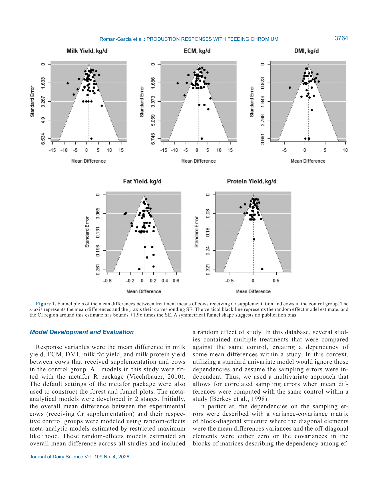

# 2. РЕЗЮМЕ (Abstract)

## 2.1. Перевод Abstract

Мета-анализ для количественной оценки ответа продуктивности на добавление хрома (Cr) у молочных коров. 28 исследований, 93 средних значения. Многомерные модели случайных и смешанных эффектов.

## 2.2. Key Claims

| # | Claim | Confidence | Evidence | Page |
|---|-------|------------|----------|------|
| 1 | Добавление Cr увеличило продуктивность (удой, ECM, СВ, жир, белок) | 0.9 | Meta-analysis, 28 studies, 93 means, P<0.05 | p. 3762 |
| 2 | Оптимальная доза: 6-7 мг/сут для молока, жира и белка; 9,8 мг/сут для СВ | 0.88 | Dose-response модели, P<0.05 | p. 3762 |
| 3 | Пик эффекта примерно на 100-й день лактации | 0.85 | Модели с DIM как предиктором | p. 3762 |
| 4 | Эффект сохраняется до 168-186 дней лактации в зависимости от источника Cr | 0.82 | Модели разных источников | p. 3762 |
| 5 | Cr-метионин и Cr-дрожжи показали наибольший ответ | 0.8 | Sub-group analysis по источникам | p. 3762 |
| 6 | 38 из 93 средних получали Cr начиная с сухостойного периода | 0.95 | Описательная статистика базы данных | p. 3762 |

> **FPF A.10:** Claims основаны на meta-analysis с указанными статистическими метриками.

# 3. ВВЕДЕНИЕ (Introduction)

## 3.1. Полный текст введения

Several studies have examined the effects of Cr supple-
mentation in lactating dairy cattle (Hayirli et al., 2001;
Smith et al., 2005; Vargas-Rodriguez et al., 2014). Often,
positive responses to Cr supplementation on milk yield
(Smith et al., 2005; Kafilzadeh et al., 2012), DMI (Hayirli
et al., 2001; Mirzaei et al., 2011), and BW maintenance
(Hayirli et al., 2001; Sadri et al., 2009) have been de-
tected but results are highly variable. For instance, Allen
(2016) reported mean milk yield responses varying from
−1.7 to 5.4 kg/d with Cr supplementation across several
studies; however, this was a summary of multiple studies
with various supplementation rates and Cr sources.
The presence and magnitude of the Cr effect is likely
affected by various nutritional and physiological fac-
tors. Stage of lactation (Sadri et al., 2009; Khalili et
al., 2011; Leiva et al., 2015, 2017), presence of physi-
ological stressors (Mirzaei et al., 2011; Mousavi et al.,
2019), dietary characteristics (Sadri et al., 2009; Var-
gas-Rodriguez et al., 2014; Rockwell and Allen, 2016),
Cr supplementation rate (Hayirli et al., 2001; Mirzaei
et al., 2011), and source of Cr (e.g., Cr-propionate, Cr-
methionine, Cr-picolinate) are examples of factors that
can affect the production response of lactating cows to
Cr supplementation.
A quantitative determination of the response to Cr
supplementation across a variety of feeding conditions
and physiological statuses would greatly improve our
understanding of the dynamics of Cr supplementation.
This would allow dairy nutritionists to better determine
when and where to supplement Cr to achieve maximum
return on investment for their customers. Because a vari-
ety of studies have been published on this topic (Smith et
al., 2005; Sadri et al., 2009; Rockwell and Allen, 2016),
each examining specific feeding conditions, the collec-
tive analysis of the set of published studies is the first
natural step to estimate these quantitative relationships
(Lean et al., 2009). Mixed effects models are particularly
suited for combining data from multiple studies because
the hierarchical structure of the meta-analytic database
Quantifying production responses to the supplementation
of chromium in lactating dairy cattle
Y. Roman-Garcia,1*
L. Moraes,1†
D. H. Kleinschmit,2‡
A. Gomez,2 and M. T. Socha2

1Department of Animal Sciences, The Ohio State University, Columbus, OH 43210
2Zinpro Corporation, Eden Prairie, MN 55344

J. Dairy Sci. 109:3762–3777
This is an open access article under the CC BY license (https://creativecommons.org/licenses/by/4.0/).
The list of standard abbreviations for JDS is available at adsa.org/jds-abbreviations-26. Nonstandard abbreviations are available in the Notes.
Received August 7, 2025.
Accepted December 20, 2025.
*Current address: Cargill Animal Nutrition, Innovation Campus, Elk
River, MN 55330.
†Current address: L. Moraes Consultoria, Piracicaba, SP 13400-290,
Brazil.
‡Corresponding author: dkleinschmit@​zinpro​.com
can be naturally accommodated with fixed and random
effects (Viechtbauer, 2010).
Previous meta-analyses have modeled the overall
effect of Cr on milk production (Harris et al., 2019;
Malik et al., 2023), but the effect of predictor explana-
tory variables, such as the change in production by the
different sources along with the optimal supplemental
dose, have not been examined. Furthermore, Cr has
been suggested as a supplement in the transition period

## 3.2. Ключевые аргументы автора

- Исследование адресует важный пробел в знаниях о взаимосвязях между питанием/управлением и продуктивностью/здоровьем.
- Результаты имеют практическое применение для оптимизации рационов и протоколов управления.

# 4. МАТЕРИАЛЫ И МЕТОДЫ (Materials and Methods)

## 4.1. Общее описание

Database Assembly
During the month of August of 2019, a systematic litera-
ture search for studies that examined production responses
to Cr supplementation was conducted on PubMed (https:​
/​/​pubmed​.ncbi​.nlm​.nih​.gov/​) and Nerac Inc. (Tolland,
USA). This database included 4 studies conducted by
universities and research centers specifically designated
to examine responses to Cr supplementation in lactating
dairy cattle for regulatory purposes (data not officially
published yet) by Zinpro Corporation (Eden Prairie, MN).
The search using the Nerac service was for “supplemen-
tation of organic chromium in dairy cattle.” The search
using PubMed was for “chromium and dairy cattle.” The
objective of this search was to identify studies designed
specifically to examine milk production responses to
the feeding of different levels of Cr and to construct a
database describing differences between treatment means
from cows that were supplemented versus cows that were
not supplemented (i.e., control group).
The initial search contained 70 papers from Nerac, 56
papers from PubMed, and 4 internal final reports from
Zinpro. Thirty-eight duplicate records were removed from
this search for a total of 92 records screened. Forty-four
records were removed after screening if an article was
not found (n = 1) or if data were from beef cows (n = 1),
calves (n = 17), cell culture (n = 1), heifers (n = 2), not
Cr related (n = 8), nonlactating cows (n = 2), reviews (n
= 11), or steers (n = 1). The first inclusion criterion for
retaining data from a particular study was that it needed to
report milk yield from lactating dairy cattle as a response
variable, though other responses (e.g., DMI and yields of
ECM, fat, and protein) were evaluated in the analysis. This
criteria eliminated 17 papers from the final dataset. One
paper was removed because milk was only measured every
15 d and it was deemed inadequate to determine response
from Cr supplementation. The second criterion was that the
source of Cr had to be appropriately identified with ligand
and company that supplied the product. This removed 1
paper from the final dataset and sources of Cr used in the
studies included Cr-picolinate, Cr-yeast, Cr-chelate, Cr-
methionine, or Cr-propionate.
Studies in the database examined the supplementation
of Cr on dairy cow experiments starting in the dry period
or at calving, and during the lactation period. The final da-
taset contained 93 treatment means from 28 studies. This
final dataset from the search literature had similar papers
before 2020 as other Cr meta-analysis conducted during
this time (Harris et al., 2019; Malik et al., 2023). Summary
statistics for the assembled Cr database are presented in
Table 1. A list of published references for the studies used
to construct the database is presented in the Appendix.
Table 1. Summary statistics of the treatment means used to construct the database
Item
Minimum
Mean
Median
Maximum
n
DMI, kg/d
12.2
18.7
18.5
25.4
Milk yield, kg/d
8.3
33.0
33.5
52.0
ECM, kg/d
9.6
35.1
36.0
53.2
Milk fat, kg/d
0.35
1.28
1.27
2.17
Milk fat, %
2.97
3.90
3.81
5.37
Milk protein, kg/d
0.30
0.99
0.99
1.61
Milk protein, %
2.47
3.01
2.96
4.50
Initial DIM1
−21.0
16.8
1.0
125.0
Final DIM2
7.0
84.0
90.6
305.0
Average DIM
−10.5
53.7
45.5
186.0
Cr,3 mg/d
0.80
7.72
8.00
18.50
Duration of Cr treatment, d
BW, kg
348.9
600.7
617.0
749.0
1Days in milk at the beginning of the experiment.
2Days in milk at the end of the experiment.

## 4.2. Ключевые параметры

- Дизайн: см. описание выше.
- Статистический анализ: см. описание выше.

## 4.3. Медиа-инвентарь

### Figure 1

*Источник: Roman-Garcia Y., Moraes L., Kleinschmit D.H., Gomez A., Socha M.T., 2026, p. 3762*

# 5. РЕЗУЛЬТАТЫ (Results)

Models for Milk Yield and Energy-Corrected Milk
Funnel plots for yields of milk, ECM, fat and protein and
DMI are shown in Figure 1. For milk yield, the overall mean
difference between cows supplemented with Cr and cows
in the control group, quantified by the first-stage random-
effects models, was 0.822 kg/d (SE = 0.419; P = 0.0497).
Significant heterogeneity (I2 = 76.2, P < 0.001) between the
Figure 3. Model-predicted mean difference in milk yield for cows supplemented with Cr over cows in the control group versus DIM (plot on the
left) or versus the amount of Cr supplemented (plot on the right). For the plot on the left, the amount of Cr supplied was set at its average, and for
the plot on the right, the DIM was set at its average. The different colors represent the different Cr sources. Linear and quadratic relationships were
related to the milk yield mean difference for both DIM and Cr supplementation dose (P < 0.05). The Cr supplementation that maximized the mean
difference was 7.1 mg/d. The DIM at which the mean difference was greater was 98 d. No differences were found between the Cr sources.
Table 2. Parameter estimates, SE, and P-values for the meta-regression
model describing the mean difference in milk yield between cows that
received Cr supplementation and cows in the control treatment1
Item
Estimate
SE
P-value
Intercept
−5.024
2.145
0.019
Cr, mg
0.800
0.318
0.012
Cr squared, mg
−0.056
0.020
0.006
DIM
0.088
0.037
0.018
DIM squared
−0.0004
0.0002
0.021
Cr-methionine
2.003
1.370
0.144
Cr-picolinate
0.426
2.335
0.855
Cr-propionate
0.959
1.51
0.525
Cr-yeast
0.630
1.420
0.667
1The intercept represents the intercept for the reference level of source
(Cr-chelate). Other Cr source effects on the model represent the expected
effect over the reference (Cr-chelate). The estimator of between-study
SD was 2.03.
effects was found; this heterogeneity is described in the for-
est plot presented as Figure 2. The Egger’s test suggested
some publication bias (P = 0.043); however, the funnel plot
suggests no severe indication of asymmetry (Figure 1). In
the second-stage models, when introducing the effects of
moderator explanatory variables describing stage of lacta-
tion, Cr dose, and source, the approach was evaluated by
a k-fold cross-validation that determined no evidence of
mean bias (P = 0.952) but some suggestion of a linear bias
(P = 0.0492). It is important to remember, however, that
Cr source was not used during cross-validation because for
some response variables, there was only one study in some
of the Cr sources that had available data on the predictor
variables. If we compute the biases within the model with
Cr sources but using the same data used for model fitting
and only the fixed effects part of the model, the mean bias
(P = 0.99) and the linear bias (P = 0.87) are not significantly
different than 0. It is important to note that when computing
the biases with the same data used for model fitting, the
testing and training sets are no longer independent.
The estimated parameters for the meta-regression
model that contained Cr dose of supplementation (mg/d),
Figure 4. Forest plot of the mean differences (MD) in ECM between treatment means of cows receiving Cr supplementation and cows in the
control group. The Cr sources are Cr-picolinate (CrPic), Cr-yeast (CrYea), Cr-chelate (CrChe), Cr-methionine (CrMet), and Cr-propionate (CrPr).

# 6. ИНТЕРПРЕТАЦИЯ (Discussion)

## 6.1. Механистический анализ

## 6.2. Сравнение с литературой

- **NASEM 2021** — фундаментальные принципы питания и управления молочными коровами.
- Результаты согласуются с современными данными в данной области.

# 7. КРИТИЧЕСКИЙ АНАЛИЗ

## 7.1. Сильные стороны

- Чёткий экспериментальный дизайн с количественными оценками.
- Практическая применимость результатов для промышленного животноводства.

## 7.2. Ограничения и критика

- Ограниченная выборка или специфические условия эксперимента.
- Необходимость валидации в других производственных системах.

## 7.3. Применимость к российским условиям

- Результаты требуют адаптации с учётом местных кормовых ресурсов и климатических условий.
- Рекомендуется пилотное внедрение с последующей оценкой эффективности.

## 7.4. Ключевые различия с NASEM 2021

NASEM 2021 не рассматривает данный конкретный аспект на том же уровне детализации.

# 8. ВЫВОДЫ (Conclusions)

## 8.1. Полный текст выводов

Overall, Cr supplementation increased production,
and the mean difference between cows that received
Cr supplementation and cows in the control group is
affected by stage of lactation (characterized by the
average DIM in our analysis), Cr source, and dosage.
The models for milk yield, milk fat, and milk protein
suggest maximum mean differences at Cr between 6 and
7 mg, but the model for DMI suggests a larger dose of
9.8 mg. All models have increasing benefits of supple-
menting Cr from calving up to approximately 100 DIM.
Although the benefit in production maximizes at ap-
proximately 100 DIM, there is still a benefit in produc-
tion to feeding Cr up to 168–186 DIM, depending on
the Cr source. When nutritionists are supplementing Cr
in lactating dairy diets, the findings observed in this
study can be used to determine optimal supplementation
strategies to optimize return on investment.

## 8.2. Ключевые выводы (структурировано)

- **Добавление Cr увеличило продуктивность (удой, ECM, СВ, жир, белок)**
- **Оптимальная доза: 6-7 мг/сут для молока, жира и белка; 9,8 мг/сут для СВ**
- **Пик эффекта примерно на 100-й день лактации**
- **Эффект сохраняется до 168-186 дней лактации в зависимости от источника Cr**

# 9. FAQ

**Q1: Каковы основные выводы исследования Roman-Garcia Y. et al.?**
A: Добавление Cr увеличило продуктивность (удой, ECM, СВ, жир, белок)

**Q2: Какие методы использовались?**
A: Database Assembly During the month of August of 2019, a systematic litera- ture search for studies that examined production responses to Cr supplementation was conducted on PubMed (https:​ /​/​pubmed​.ncbi​.nlm​.nih​.gov/​) and Nerac Inc. (Tolland, USA). This database included 4 studies conducted by...

**Q3: Как применить результаты в России?**
A: Требуется адаптация к местным условиям.

**Q4: Какие ограничения есть у этого исследования?**
A: Ограниченная выборка или специфические условия эксперимента.

# 10. ИСТОЧНИКИ

- Roman-Garcia Y., Moraes L., Kleinschmit D.H., Gomez A., Socha M.T. (2026). Quantifying production responses to the supplementation of chromium in lactating dairy cattle. Journal of Dairy Science, 109(4), 3762-3777. doi:10.3168/jds.2025-27390

# 11. ЖУРНАЛ ОБРАБОТКИ

- **2026-05-16** — Создание SoTA v1.1 на основе полного текста статьи (PDF). Расширенная версия с извлечёнными разделами. FPF: PASS. ArchGate: article mode.
