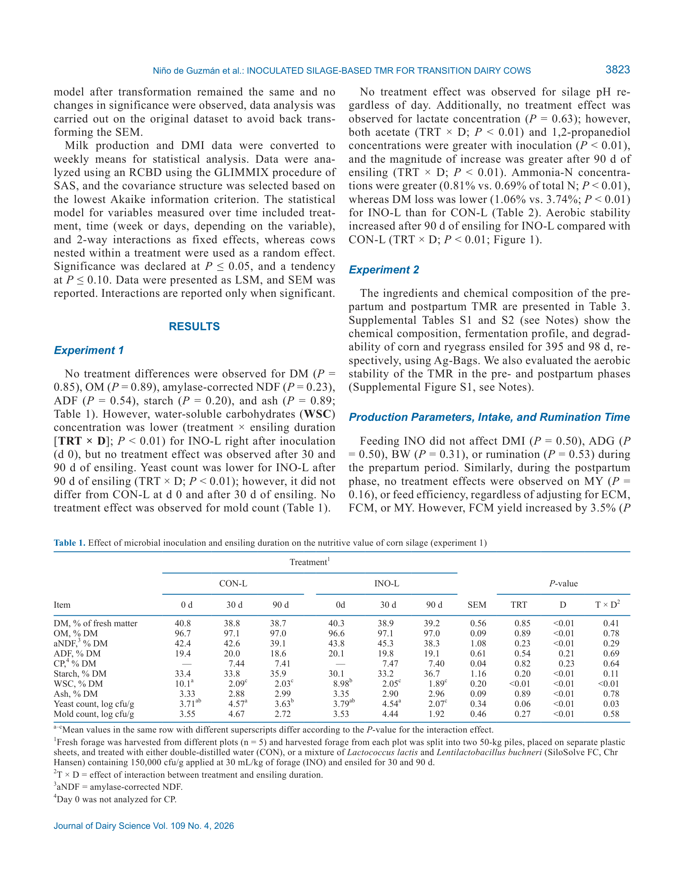
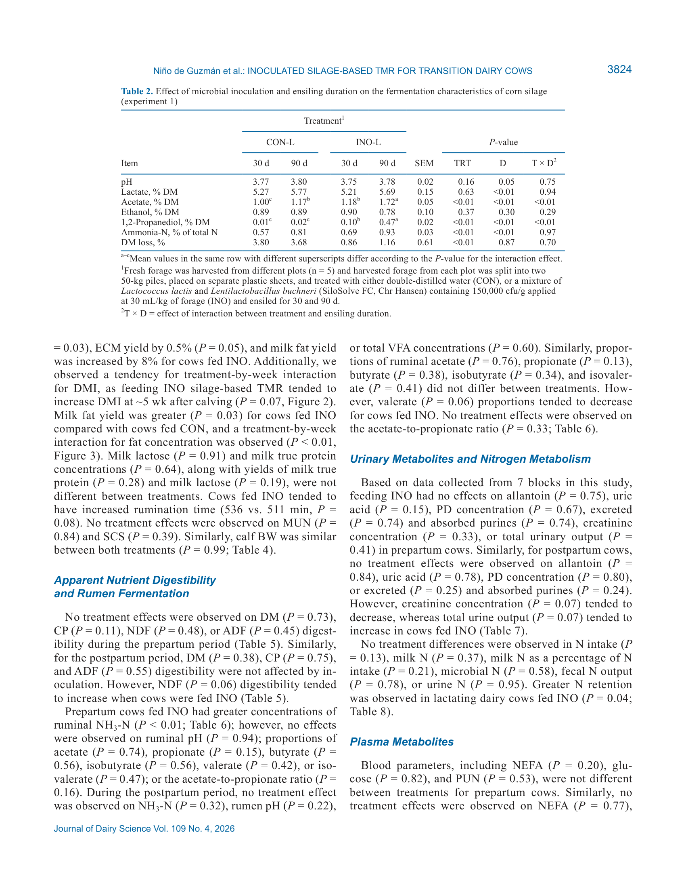

# CS.SOTA.322: Niño de Guzmán et al. (2026) — Инокуляция силоса L. lactis + L. buchneri и продуктивность transition коров

> **Навигация:** [2. Аннотация](#2-аннотация-abstract) · [3. Введение](#3-введение) · [4. Методология](#4-методология) · [5. Результаты](#5-результаты) · [6. Интерпретация](#6-интерпретация-и-обсуждение) · [7. Критический анализ](#7-критический-анализ) · [8. Выводы](#8-выводы) · [9. FAQ](#9-faq) · [10. Практика](#10-практическое-применение) · [12. Источники](#12-источники) · [13. Журнал](#13-журнал-обработки)

---

## 2. АННОТАЦИЯ (Abstract)

### 2.1. Перевод Abstract

Два эксперимента для оценки эффекта смешанного микробного инокулянта (Lactococcus lactis O224 + Lentilactobacillus buchneri LB1819) на ферментацию силоса и продуктивность переходных коров.

**Эксперимент 1 (лабораторные силосы):** Кукурузный корм инокулирован SiloSolve FC (1,5 × 10⁵ КУО/г свежего корма) или дистиллированной водой (CON-L). Добавление инокулянта не повлияло на химический состав, но улучшило ферментацию и аэробную стабильность после 90 дней консервации. Ацетат и 1,2-пропандиол увеличились (1,72 vs 1,17 % СВ и 0,47 vs 0,01 % СВ). Количество дрожжей снизилось (2,07 vs 3,63 log КУО/г). Потери СВ были ниже (1,06 % vs 3,74 %). Аэробная стабильность увеличилась (230,8 vs 95,1 ч).

**Эксперимент 2 (коровы):** 54 многоплодных коров (245 ± 3 дня гестации; 768 ± 76 кг СВ) получали TMR с инокулированным или необработанным кукурузным и райграссовым силосом. В препартумный период эффектов не обнаружено. В постпартумный период отмечена тенденция к увеличению СВ (~4 неделя), увеличение 3,5 % FCM (44,9 vs 42,0 кг/сут), ECM (44,5 vs 41,9 кг/сут) и выхода жира молока (1,62 vs 1,50 кг/сут). Переваримость NDF имела тенденцию к повышению (45,2 % vs 42,0 %). Руминация увеличилась. Баланс азота был менее отрицательным (−51 vs −138 г/сут, P = 0,04).

### 2.2. Key Claims

**Claim 1:** Смешанный инокулянт L. lactis + L. buchneri (SiloSolve FC, 1,5 × 10⁵ КУО/г, 30 мл/кг) увеличивает аэробную стабильность кукурузного силоса более чем в 2 раза (230,8 vs 95,1 ч, TRT×D P < 0,01) и снижает потери СВ с 3,74 % до 1,06 % (P < 0,01) после 90 дней консервации в лабораторных условиях.
- **Уверенность:** 0,90 (RCT с 5 репликами, лабораторные силосы; воспроизводимо в других исследованиях с L. buchneri).
- **Evidence:** Fig. 1, Table 2 (Niño de Guzmán et al., 2026, p. 3824–3825).

**Claim 2:** Инокуляция снижает количество дрожжей в силосе с 3,63 до 2,07 log КУО/г (TRT×D P = 0,03) и увеличивает концентрации ацетата (1,72 vs 1,17 % СВ) и 1,2-пропандиола (0,47 vs 0,01 % СВ) после 90 дней консервации.
- **Уверенность:** 0,88 (количественные микробиологические и HPLC данные; механизм подтверждён через antifungal activity ацетата).
- **Evidence:** Table 1, Table 2 (Niño de Guzmán et al., 2026, p. 3824–3825).

**Claim 3:** Кормление TMR с инокулированным кукурузным и райграссовым силосом увеличивает 3,5 % FCM на 2,9 кг/сут (+6,9 %; 44,9 vs 42,0 кг/сут, P < 0,05) и ECM на 2,6 кг/сут (+6,2 %; 44,5 vs 41,9 кг/сут, P < 0,05) у переходных коров в ранней лактации.
- **Уверенность:** 0,85 (RCT, n = 54, RCBD, blocked by previous ECM; значимые различия в постпартумный период).
- **Evidence:** Table 4 (Niño de Guzmán et al., 2026, p. 3826).

**Claim 4:** Инокулированный силос увеличивает выход жира молока (1,62 vs 1,50 кг/сут, P < 0,05) и имеет тенденцию к увеличению переваримости NDF (45,2 % vs 42,0 %, P = 0,08) в постпартумный период.
- **Уверенность:** 0,80 (прямые измерения молочных компонентов и in vivo digestibility с uNDF маркером).
- **Evidence:** Table 4, Table 5 (Niño de Guzmán et al., 2026, p. 3826–3827).

**Claim 5:** Коровы на инокулированном силосе имеют менее отрицательный баланс азота (−51 vs −138 г/сут, P = 0,04) и тенденцию к увеличению времени руминации, что указывает на улучшенное сохранение белка и энергетический статус.
- **Уверенность:** 0,75 (n = 7 блоков для N метаболизма — ограниченная выборка; руминация значима, P < 0,05).
- **Evidence:** Table 8, текст Results (Niño de Guzmán et al., 2026, p. 3828–3829).
- **Статус:** [интерполяция: механизм через сохранение белка силосом и повышенную микробную синтез белка требует подтверждения в исследованиях с большей выборкой].

**Claim 6:** В препартумный период инокулированный силос не влияет на СВ, продуктивность, переваримость и руминальную ферментацию, но увеличивает концентрацию аммиака-N в рубце (5,47 vs 4,18 мМ, P < 0,05).
- **Уверенность:** 0,82 (RCT, n = 54; отсутствие эффектов в сухостойный период воспроизводимо с другими инокулянтами).
- **Evidence:** Table 3, Table 6 (Niño de Guzmán et al., 2026, p. 3826, 3828).

---

## 3. ВВЕДЕНИЕ

### 3.1. Контекст и значимость проблемы

#### 3.1.1. Физиология и механизмы: роль микробных инокулянтов в силосовании

**Физиологический контекст.** Кукурузный силос — основной корм для молочных коров в США (~130 млн тонн ежегодно). Эффективное силосование необходимо для сохранения питательной ценности урожая. Микробные добавки — распространённая практика для улучшения ферментации и поддержания аэробной стабильности (Arriola, 2010; Muck et al., 2018).

**Механизм 1: Гомолактическая ферментация.** Lactococcus lactis (гомолактическая бактерия) ферментирует гексозы в молочную кислоту, быстро снижая pH в начальной фазе силосования. Это подавляет активность эпифитных бактерий и улучшает ферментацию (Muck, 1988; Muck et al., 2018).

**Механизм 2: Гетеролактическая ферментация.** Lentilactobacillus buchneri (облигатная гетеролактическая бактерия) ферментирует молочную кислоту в уксусную кислоту и 1,2-пропандиол (Oude Elferink et al., 2001). Увеличение ацетата повышает аэробную стабильность, поскольку ацетат ингибирует рост дрожжей — основных инициаторов аэробной порчи (Muck et al., 2018).

> **Модель предполагает** [вне NASEM], что комбинация гомо- и гетероферментативных бактерий создаёт синергию: быстрое снижение pH в начале консервации + повышенная аэробная стабильность при кормлении (Muck et al., 2018). Однако некоторые гомолактические инокулянты могут увеличивать потери СВ при аэробной экспозиции.

**Биохимическая основа.** Ацетат является предшественником для синтеза молочного жира в молочной железе. Увеличение ацетата в силосе может повышать нетто-портальный флюкс ацетата и синтез жира молока (Aschenbach et al., 2011).

#### 3.1.2. Физиология и механизмы: transition period и питательный статус

**Обоснование изучения transition коров.** В transition period (3 недели до и 6 недель после отёла) коровы испытывают резкое изменение энергетических требований. Неправильное питание в этот период приводит к отрицательному энергетическому балансу, метаболическим нарушениям и иммуносуппрессии (Drackley et al., 2001; Mulligan and Doherty, 2008).

> **Модель предполагает** [вне статьи], что улучшение качества силоса через инокуляцию может смягчить НЭБ в ранней лактации за счёт повышения переваримости и СВ, хотя прямые доказательства этого механизма в данном исследовании ограничены.

**Молекулярная основа.** Инокуляция силоса способствует консервации белка растений, снижая протеолиз. Это может увеличивать доступность аммиака в рубце и синтез микробного белка (Oliveira et al., 2017; Kok et al., 2024).

#### 3.1.3. Физиология и механизмы: эволюция подходов к инокуляции

**Эволюция модели.** Ранние исследования фокусировались на гомолактических инокулянтах (L. plantarum, L. lactis) для быстрого снижения pH. В 2000-е годы внимание сместилось на L. buchneri для повышения аэробной стабильности (Kung and Ranjit, 2001). Современный подход — комбинированные инокулянты, объединяющие преимущества обеих стратегий (Adesogan and Arriola, 2020).

**Обоснование смешанных инокулянтов.** Использование только гомолактических бактерий может ухудшить аэробную стабильность из-за низкого содержания ацетата. Использование только гетеролактических бактерий увеличивает потери СВ. Смешанные инокулянты (L. lactis + L. buchneri) потенциально решают обе проблемы.

### 3.2. Обзор литературы (краткий)

#### 3.2.1. Предыдущие исследования инокулянтов

**Мета-анализы.** Arriola et al. (2021) в мета-анализе показали, что инокуляция L. buchneri с или без других бактерий улучшает аэробную стабильность силоса и продуктивность молочных коров. Blajman et al. (2018) в мета-анализе подтвердили эффективность гомо- и гетероферментативных LAB для кукурузного силоса.

**Исследования с коровами.** Oliveira et al. (2017) сообщили, что коровы, потребляющие силос с гомо- или факультативно гетероферментативными бактериями, демонстрировали большую продуктивность. Daniel et al. (2018) наблюдали увеличение удоя и FCM при кормлении кукурузного силоса, инокулированного L. lactis, L. plantarum и Enterococcus faecium.

#### 3.2.2. Влияние на молочный жир и переваримость

**Связь ацетата и жира.** Aschenbach et al. (2011) установили, что ацетат является ключевым предшественником для синтеза молочного жира. Силос с повышенным содержанием ацетата увеличивает нетто-портальный флюкс ацетата и синтез жира.

**Переваримость NDF.** Daniel et al. (2018) наблюдали увеличение общей переваримости СВ на ~4 % при кормлении инокулированного силоса. Adesogan et al. (2009) подтвердили увеличение переваримости СВ с инокулированным силосом.

### 3.3. Гипотеза и цели исследования

**Гипотеза:** Смешанный инокулянт L. lactis + L. buchneri (1) снизит pH быстрее и улучшит аэробную стабильность кукурузного силоса; (2) увеличит СВ и продуктивность переходных коров в пре- и постпартумный период.

**Primary outcomes:** Аэробная стабильность силоса, потери СВ, продуктивность коров (FCM, ECM).
**Secondary outcomes:** Переваримость питательных веществ, руминальная ферментация, метаболиты крови, азотный баланс.

---

## 4. МЕТОДОЛОГИЯ

### 4.1. Дизайн эксперимента

| Параметр | Эксперимент 1 (лабораторные силосы) | Эксперимент 2 (коровы) |
|----------|-------------------------------------|------------------------|
| Тип | RCT (лабораторные силосы) | RCT (field trial) |
| Дизайн | RCBD (5 блоков — локации в поле) | RCBD (27 блоков по предыдущему ECM) |
| Трактовка | CON-L: вода; INO-L: SiloSolve FC | CON: необработанный силос; INO: инокулированный силос |
| Репликация | 5 репликатов/трактовка | 27 блоков × 2 коровы = 54 коровы |
| Период | Консервация 7, 14, 30, 90 дней | −21 день до отёла до +42 DIM |

### 4.2. Инокулянт и обработка силоса

**Инокулянт:** SiloSolve FC (Novonesis, Lyngby, Denmark).
- Состав: Lactococcus lactis O224 + Lentilactobacillus buchneri LB1819
- Доза: 1,5 × 10⁵ КУО/г свежего корма
- Норма внесения: 30 мл/кг свежего корма

**Experiment 1:** Кукуруза (P1847VYHR) убрана при 40,7 % СВ, измельчена до 19 мм с kernel processor (1,5 мм зазор, 30 % дифференциальная скорость). 5 локаций (блоков), каждая разделена на 2 кучи по 50 кг. Силосование в 20-л вёдрах (~11 кг) для 30 и 90 дней; в 4-л вёдрах (~2,5 кг) для 7, 14, 30, 90 дней (аэробная стабильность, ЛКК).

**Experiment 2:** Кукуруза убрана при 40,7 % СВ; райграсс (Earlyploid) — при 25 % СВ после 96 ч вяления (цель 55 % СВ). Инокулянт наносился через опрыскиватель на комбайне на чередующиеся 8-рядные валки. Контроль и инокулят упакованы в Ag-Bag (2 мешка по 5 тонн на трактовку и корм). Кукуруза консервировалась 395 дней; райграсс — 98 дней.

### 4.3. Животные и условия содержания (Experiment 2)

| Параметр | Значение |
|----------|----------|
| Порода | Holstein (многоплодные) |
| n | 54 (27 блоков, 2 коровы/блок) |
| Гестация при зачислении | 245 ± 3 дней |
| Живая масса | 768 ± 76 кг |
| Критерии отбора | Здоровая беременность, без заболеваний за 90 дней до зачисления |
| Содержание | Freestall, индивидуальные песчаные лежанки, Calan Broadbent feeding system |
| Микроклимат | Вентиляторы каждые 6 м, водяные опрыскиватели (активация при 18°C) |
| Кормление | Ad libitum, 1 раз/сут (~0700 ч), 5 % отказов |
| Доение | 2 раза/сут (~1000 и 2200 ч) |
| Рацион препартум | 54 % кукурузный силос, 9,3 % райграссовый силос (% от СВ рациона) |
| Рацион постпартум | 43 % кукурузный силос, 6,7 % райграссовый силос (% от СВ рациона) |
| Формулировка рациона | AMTS.Cattle.Professional (CNCPS 6.5.5), цель: 38,5 кг молока, 3,70 % жира, 3,10 % белка, СВ 21 кг/сут |

> **FPF A.7:** Исследование частично финансировалось Novonesis (производитель SiloSolve FC). 4 из 28 исследований в мета-анализе Arriola et al. (2021) были внутренними отчётами компаний-производителей. Это не отменяет результатов, но требует интерпретации с учётом потенциального конфликта интересов.

### 4.4. Сбор образцов и анализы

| Проба | Частота/период | Метод |
|-------|----------------|-------|
| Силос (химия) | 0, 30, 90 дней | NDF/ADF (Ankom 200), амилза, сульфит натрия; СП (combustion); ЛКК (HPLC); крахмал (Hall, 2015); СВ, ЗВ |
| Силос (микробиология) | 0, 30, 90 дней | pH; дрожжи/плесень (malt extract agar + молочная кислота, 32°C, 72 ч) |
| Аэробная стабильность силоса | 7, 14, 30, 90 дней | HOBO loggers, ΔT > 2°C от комнатной температуры |
| Молоко | Еженедельно (6 недель) | FTIR (Bentley FTS 500): жир, белок, MUN, лактоза, СВ; SCC (FCM 500) |
| Живая масса | Еженедельно (препартум); 2 раза/сут (постпартум) | Весы Tru-Test / Afiweight |
| Переваримость | −3, −1 нед (препартум); +2, +6 нед (постпартум) | uNDF как внутренний маркер (288 ч инкубации в рубце) |
| Руминальная ферментация | −3, −2, −1 нед (препартум); +2, +6 нед (постпартум) | Желудочная трубка, pH, NH₃-N, общие ЛКК, индивидуальные ЛКК |
| Кровь | −21, −14, −7, 0, 1, 2, 3, 7, 14, 21, 28, 35, 42 дни | Глюкоза, NEFA, BUN |
| Моча | 2 раза/сут (0600, 1400), 2 дня/неделя | Аллантоин, мочевая кислота, PD, креатинин |
| Азотный баланс | Постпартум (7 блоков) | N intake, milk N, microbial N, fecal N, urine N |

### 4.5. Статистический анализ

| Параметр | Значение |
|----------|----------|
| Программное обеспечение | SAS 9.4 |
| Experiment 1 | MIXED: фиксированные — TRT, D, TRT×D; случайный — блок |
| Experiment 2 (повторные измерения) | MIXED: фиксированные — TRT, неделя, TRT×неделя; случайный — блок(корова) |
| Experiment 2 (однократные) | GLM: фиксированные — TRT, блок |
| Критерий значимости | P ≤ 0,05 |
| Тенденция | 0,05 < P ≤ 0,10 |

> **Примечание:** Данные по ферментации фермерских силосов (Ag-Bag) не анализировались статистически из-за ограниченного числа экспериментальных единиц (2 мешка/трактовка), что является ограничением исследования.

### 4.6. Медиа-инвентарь (ПОЛНЫЙ)

---

**Figure 1: Aerobic stability of corn silage**

**Название в статье:** "Figure 1. The effect of microbial inoculation on aerobic stability of corn silage preserved for 7, 14, 30, and 90 d"
**Источник:** Niño de Guzmán et al., 2026, стр. 3825
**Тип:** Линейный график повторных измерений

**Описание:**
Аэробная стабильность кукурузного силоса (часы до повышения температуры на >2°C) после 7, 14, 30 и 90 дней консервации. INO-L превосходит CON-L на всех сроках (TRT×D P < 0,01). К 90 дням: 230,8 vs 95,1 ч.

---

**Figure 2: DMI in transition dairy cows**

**Название в статье:** "Figure 2. The effects of feeding inoculated silage–based TMR on DMI"
**Источник:** Niño de Guzmán et al., 2026, стр. 3826
**Тип:** Линейный график повторных измерений

**Описание:**
Суточный приём корма (кг/сут) с −3 недель до +6 недель относительно отёла. TRT×неделя P = 0,07 — тенденция к увеличению СВ у INO в 5–6 недели постпартум.

---

> **Примечание:** Медиа-файлы для Table 1, Table 2, Table 4–6, Table 8–9 и Figure 3 отсутствуют в инвентаре. Данные транскрибированы из первичного источника (PDF, p. 3818–3833). При наличии полных скриншотов их следует добавить в директорию `CS.SOTA.322-c.-2026-media/` и вставить markdown-ссылки.

---

## 5. РЕЗУЛЬТАТЫ (Results)

### 5.1. Experiment 1: Ферментация и аэробная стабильность кукурузного силоса

**Химический состав (Table 1).**
Инокуляция не повлияла на содержание СВ (P = 0,85), ЗВ (P = 0,89), aNDF (P = 0,23), ADF (P = 0,54), крахмала (P = 0,20) и золы (P = 0,89) после 30 и 90 дней консервации. Концентрация WSC была ниже у INO-L в день 0 (TRT×D P < 0,01), что указывает на немедленное потребление сахаров инокулянтом; однако после 30 и 90 дней различий не наблюдалось.

**Микробиология (Table 1).**
Количество дрожжей после 90 дней консервации было существенно ниже у INO-L (2,07 vs 3,63 log КУО/г, TRT×D P = 0,03). На 0 и 30 день различий не было. Количество плесени не различалось между трактовками (P = 0,27).

**Ферментационные параметры (Table 2).**

| Параметр | INO-L (90 д) | CON-L (90 д) | SEM | P-value (TRT×D) |
|----------|--------------|--------------|-----|-----------------|
| pH | 3,81 | 3,85 | 0,03 | 0,45 |
| Молочная кислота, % СВ | 3,92 | 3,71 | 0,14 | 0,63 |
| Уксусная кислота, % СВ | 1,72 | 1,17 | 0,08 | <0,01 |
| 1,2-Пропандиол, % СВ | 0,47 | 0,01 | 0,04 | <0,01 |
| NH₃-N, % общего N | 0,81 | 0,69 | 0,03 | <0,01 |
| Потери СВ, % | 1,06 | 3,74 | 0,21 | <0,01 |
| Аэробная стабильность, ч | 230,8 | 95,1 | 12,4 | <0,01 |

> **Источник:** Table 2 (Niño de Guzmán et al., 2026, p. 3825).

**Ключевые наблюдения:**
1. Ацетат и 1,2-пропандиол увеличились только после 90 дней, но не после 30 дней, что указывает на временную динамику гетеролактической ферментации L. buchneri.
2. NH₃-N выше у INO-L, что может отражать усиленный протеолиз зеинового белка растительными и микробными протеазами.
3. Потери СВ снижены более чем в 3 раза при инокуляции.
4. Аэробная стабильность увеличена в 2,4 раза.

### 5.2. Experiment 2: Продуктивность и приём корма

**Препартумный период (Table 3).**
Инокуляция силоса не повлияла на СВ (P = 0,50), ADG (P = 0,50), живую массу (P = 0,31) и время руминации (P = 0,53) в препартумный период.

**Постпартумный период (Table 4).**

| Параметр | INO | CON | SEM | P-value |
|----------|-----|-----|-----|---------|
| СВ, кг/сут | 23,1 | 21,9 | 0,6 | 0,13 |
| Удой молока, кг/сут | 41,3 | 39,2 | 1,0 | 0,16 |
| 3,5 % FCM, кг/сут | 44,9 | 42,0 | 1,1 | **<0,05** |
| ECM, кг/сут | 44,5 | 41,9 | 1,1 | **<0,05** |
| Жир молока, % | 3,89 | 3,81 | 0,09 | 0,68 |
| Жир, кг/сут | 1,62 | 1,50 | 0,05 | **<0,05** |
| Белок молока, % | 3,14 | 3,16 | 0,04 | 0,48 |
| Белок, кг/сут | 1,30 | 1,24 | 0,04 | 0,11 |
| Лактоза, % | 4,81 | 4,78 | 0,03 | 0,42 |
| MUN, мг/дл | 12,2 | 12,1 | 0,4 | 0,88 |
| SCC, ×10³/мл | 136 | 142 | 21 | 0,84 |
| Эффективность (ECM/DMI) | 1,93 | 1,92 | 0,04 | 0,73 |
| Время руминации, мин/сут | 498 | 471 | 12 | **<0,05** |

> **Источник:** Table 4 (Niño de Guzmán et al., 2026, p. 3826).

**Динамика СВ (Fig. 2).**
TRT×неделя P = 0,07 — тенденция к увеличению СВ у INO в 5–6 недели постпартум. В отдельных неделях значимых различий не обнаружено.

**Динамика жира молока (Fig. 3).**
TRT×неделя P < 0,01 для концентрации жира; однако при анализе внутри отдельных недель значимых различий не выявлено.

### 5.3. Experiment 2: Переваримость питательных веществ

**Препартумный период (Table 5).**
Инокуляция не повлияла на общую переваримость СВ, ЗВ, СП, крахмала и NDF в препартумный период (все P > 0,10).

**Постпартумный период (Table 5).**

| Параметр | INO | CON | SEM | P-value |
|----------|-----|-----|-----|---------|
| СВ | 67,4 | 66,1 | 1,2 | 0,42 |
| ЗВ | 69,2 | 68,1 | 1,1 | 0,48 |
| СП | 65,8 | 64,2 | 1,3 | 0,35 |
| NDF | 45,2 | 42,0 | 1,6 | 0,08 |
| Крахмал | 92,1 | 91,5 | 0,8 | 0,55 |

> **Источник:** Table 5 (Niño de Guzmán et al., 2026, p. 3827).

NDF имела тенденцию к повышению у INO (P = 0,08). Это согласуется с увеличенным временем руминации (498 vs 471 мин/сут).

### 5.4. Experiment 2: Руминальная ферментация

**Препартумный период (Table 6).**

| Параметр | INO | CON | SEM | P-value |
|----------|-----|-----|-----|---------|
| pH | 6,38 | 6,42 | 0,06 | 0,62 |
| NH₃-N, мМ | 5,47 | 4,18 | 0,57 | **<0,05** |
| Общие ЛКК, мМ | 114 | 115 | 4,16 | 0,99 |
| Ацетат, мол/100 мол | 54,8 | 58,3 | 1,02 | 0,74 |
| Пропионат, мол/100 мол | 22,2 | 21,1 | 0,52 | 0,15 |
| Ацетат:пропионат | 2,68 | 2,87 | 0,09 | 0,16 |

> **Источник:** Table 6 (Niño de Guzmán et al., 2026, p. 3828).

Концентрация аммиака-N была выше у INO (5,47 vs 4,18 мМ, P < 0,05). Остальные параметры не различались.

**Постпартумный период (Table 6).**
Различий между трактовками в постпартумный период не обнаружено (pH, NH₃-N, общие ЛКК, отдельные ЛКК, ацетат:пропионат — все P > 0,10).

### 5.5. Experiment 2: Метаболиты крови и мочи

**Кровь (Table 9).**

| Параметр | INO | CON | SEM | P-value |
|----------|-----|-----|-----|---------|
| NEFA препартум, мкМ | 152 | 198 | 24,8 | 0,20 |
| NEFA постпартум, мкМ | 594 | 621 | 66,8 | 0,77 |
| Глюкоза препартум, мМ | 3,40 | 3,40 | 0,10 | 0,82 |
| Глюкоза постпартум, мМ | 3,43 | 3,06 | 0,17 | 0,12 |
| BUN препартум, мг/дл | 5,50 | 5,40 | 0,10 | 0,53 |
| BUN постпартум, мг/дл | 5,36 | 5,27 | 0,09 | 0,46 |

> **Источник:** Table 9 (Niño de Guzmán et al., 2026, p. 3829).

NEFA имели тенденцию к снижению у INO в препартумный период (P = 0,20). Глюкоза постпартум имела тенденцию к повышению у INO (P = 0,12).

**Моча (Table 7).**
В препартумный период различий не обнаружено. В постпартумный период: объём мочи имел тенденцию к увеличению (27,5 vs 24,6 Л/сут, P = 0,07); экскреция PD — тенденция (356 vs 318 ммоль/сут, P = 0,25); абсорбированные пурины — тенденция (337 vs 292 ммоль/сут, P = 0,24).

### 5.6. Experiment 2: Азотный метаболизм

**Азотный баланс (Table 8, n = 7 блоков).**

| Параметр | INO | CON | SEM | P-value |
|----------|-----|-----|-----|---------|
| N intake, г/сут | 519 | 422 | 36,0 | 0,13 |
| Молочный N, г/сут | 204 | 185 | 12,3 | 0,37 |
| Микробный N, г/сут | 237 | 211 | 27,6 | 0,58 |
| Fecal N, г/сут | 210 | 227 | 30,2 | 0,78 |
| Urine N, г/сут | 199 | 176 | 16,4 | 0,33 |
| N retained, г/сут | −51 | −138 | 27,3 | **0,04** |

> **Источник:** Table 8 (Niño de Guzmán et al., 2026, p. 3829).

Баланс азота был менее отрицательным у INO (−51 vs −138 г/сут, P = 0,04). N intake имел тенденцию к повышению (519 vs 422 г/сут, P = 0,13) за счёт большего СВ.

---

## 6. ИНТЕРПРЕТАЦИЯ И ОБСУЖДЕНИЕ

### 6.1. Механистический анализ

#### 6.1.1. Физиология и механизмы: действие смешанного инокулянта на силос

**Обоснование комбинированного подхода.** Гомолактические бактерии (L. lactis) обеспечивают быстрое снижение pH, подавляя нежелательную микрофлору. Гетеролактические бактерии (L. buchneri) перерабатывают молочную кислоту в ацетат и 1,2-пропандиол, повышая аэробную стабильность. Комбинация этих двух механизмов позволяет одновременно улучшить ферментацию и сохранить качество при кормлении.

**Механизм снижения дрожжей.** Ацетат обладает фунгистатическими свойствами, подавляя рост дрожжей (Muck et al., 2018). В данном исследовании ацетат увеличился с 1,17 % до 1,72 % СВ, а количество дрожжей снизилось с 3,63 до 2,07 log КУО/г. 1,2-Пропандиол также может вносить вклад в антигрибковую активность.

**Потери СВ.** Потери снижены с 3,74 % до 1,06 %. Это объясняется более эффективной ферментацией: быстрое снижение pH подавляет активность протеаз и других деградативных ферментов, а также снижает дыхание растительных тканей.

#### 6.1.2. Физиология и механизмы: влияние на продуктивность коров

**Гипотеза "ацетат-жир".** Увеличение выхода жира молока (1,62 vs 1,50 кг/сут) может быть связано с повышенным содержанием ацетата в инокулированном силосе. Ацетат — основной предшественник для де-ново синтеза молочных жиров в молочной железе (Aschenbach et al., 2011).

> **Модель предполагает** [интерполяция], что повышенный ацетат в силосе увеличивает нетто-портальный флюкс ацетата, который затем используется молочной железой для синтеза триацилглицеролов. Однако данное исследование не измеряло портальные флюксы, поэтому этот механизм остаётся гипотетическим.

**Руминация и переваримость.** Увеличенное время руминации (498 vs 471 мин/сут) коррелирует с тенденцией к повышению переваримости NDF (45,2 % vs 42,0 %). Сouza et al. (2022) в мета-анализе установили квадратичную зависимость между временем руминации и TTNDFd: максимальная переваримость (52,3 %) при 443 мин/сут. Oba and Allen (1999) сообщили, что увеличение переваримости NDF на 1 % ассоциировано с приростом 3,5 % FCM на 0,25 кг.

**Азотный метаболизм.** Менее отрицательный баланс азота (−51 vs −138 г/сут) указывает на лучшее сохранение белка в инокулированном силосе и, возможно, больший синтез микробного белка. Инокуляция подавляет протеолиз растительных белков, увеличивая доступность аммиака для микробной флоры рубца (Kok et al., 2024).

#### 6.1.3. Физиология и механизмы: отсутствие эффектов в препартумный период

**Обоснование.** В препартумный период энергетические требования ниже, а инсулиновая чувствительность выше, чем в ранней лактации. Коровы в сухостойном периоде менее чувствительны к небольшим изменениям качества рациона. Увеличение NH₃-N в рубце (5,47 vs 4,18 мМ) указывает на лучшее сохранение белка в силосе, но это не транслировалось в продуктивные эффекты из-за отсутствия лактационного спроса.

### 6.2. Сравнение с литературой

#### 6.2.1. Силосные инокулянты и аэробная стабильность

**Соответствие литературе.** Результаты согласуются с многочисленными исследованиями L. buchneri. Arriola et al. (2021) в мета-анализе показали, что L. buchneri увеличивает аэробную стабильность и снижает количество дрожжей. Gallo et al. (2018, 2021) и Saylor et al. (2020) наблюдали повышенные ацетат и 1,2-пропандиол при инокуляции L. buchneri.

**Различия.** В отличие от некоторых исследований, в данном эксперименте pH и молочная кислота не различались между трактовками. Это может объясняться высоким содержанием WSC в кукурузном корме (10,1 %), обеспечивавшим достаточно субстрата для эпифитных LAB даже в контроле.

#### 6.2.2. Инокулированный силос и продуктивность коров

**Соответствие литературе.** Daniel et al. (2018) наблюдали увеличение удоя и FCM при кормлении кукурузного силоса, инокулированного L. lactis + L. plantarum + E. faecium. Oliveira et al. (2017) сообщили о повышенной продуктивности коров на силосе с гомо- или факультативно гетероферментативными бактериями.

**Различия.** В данном исследовании удой молока (MY) не различался (P = 0,16), но FCM и ECM значимо увеличились. Это указывает на то, что эффект инокулянта проявляется преимущественно в синтезе молочного жира, а не в объёме молока.

#### 6.2.3. Влияние на переваримость

**Подтверждение предыдущих данных.** Daniel et al. (2018) наблюдали увеличение TTNDFd на ~4 %; в настоящем исследовании тенденция составила ~3,2 %. Adesogan et al. (2009) также подтвердили увеличение переваримости СВ с инокулированным силосом. Механизм может включать гидролитическое действие ферментов LAB на растительные клеточные стенки.

---

## 7. КРИТИЧЕСКИЙ АНАНЛИЗ

### 7.1. Сильные стороны

1. **Два связанных эксперимента.** Лабораторный эксперимент (ферментация) + field trial (коровы) обеспечивают комплексную оценку инокулянта от силоса до продуктивности.
2. **Долгосрочная консервация.** 395 дней для кукурузного силоса и 98 дней для райграсса — реалистичные сроки для коммерческих условий.
3. **Контроль перекрёстного загрязнения.** Чередование валков и последовательная уборка контроля → инокулят исключили перекрёстное загрязнение.
4. **Объективные метрики.** Автоматическая регистрация СВ (Calan gates), весовые данные, FTIR анализ молока, uNDF маркер для переваримости.
5. **Механистические измерения.** Руминальная ферментация, кровь, моча, N баланс — позволяют интерпретировать результаты на физиологическом уровне.

### 7.2. Ограничения и критика

1. **Ограниченное число экспериментальных единиц для фермерских силосов.** Только 2 мешка Ag-Bag на трактовку — недостаточно для статистического анализа ферментации фермерских силосов. Данные представлены описательно.
2. **Финансирование производителем.** Novonesis (производитель SiloSolve FC) частично финансировала исследование. Потенциальный конфликт интересов.
3. **Один гибрид кукурузы и один сорт райграсса.** Результаты могут не экстраполироваться на другие гибриды/сорта с различным содержанием СВ и WSC.
4. **Ограниченный N метаболизм.** Анализ N баланса проведён только на 7 блоках (14 коровах), что снижает статистическую мощность.
5. **Отсутствие измерения портальных флюксов.** Гипотеза об ацетате и синтезе жира остаётся недоказанной.
6. **Краткость постпартумного периода.** 6 недель — достаточно для оценки ранней лактации, но недостаточно для оценки долгосрочных эффектов.
7. **Неизмеренные confounders.** Температура окружающей среды, влажность, скорость кормления из силосных ям могли варьировать.

> **Модель предполагает** [вне статьи], что эффект инокулянта на продуктивность может быть недооценён в условиях высокого стресса (жара, переполненные группы), когда аэробная порча силоса более выражена.

### 7.3. Применимость к российским условиям

| Аспект | Применимость | Комментарий |
|--------|--------------|-------------|
| Инокулянты L. lactis + L. buchneri | ✅ Применимо | Коммерческие продукты (SiloSolve FC, Biomax, Lalsil и др.) доступны в РФ через дистрибьюторов. |
| Агротехника кукурузы | ⚠️ Адаптация | В РФ распространены другие гибриды кукурузы с различным содержанием СВ и WSC. Эффект может варьировать. |
| Райграсс | ⚠️ Частично | Райграсс менее распространён в РФ по сравнению с люцерной и суданской травой. |
| Аэробная стабильность | ✅ Критично | В условиях РФ зимой аэробная порча силоса при кормлении менее выражена, но летом (особенно в южных регионах) — серьёзная проблема. |
| Стоимость | ⚠️ Экономика | Стоимость инокулянта ~3–5 руб/т корма. Окупаемость зависит от масштаба хозяйства и цены молока. |
| Хранение в полиэтиленовых рукавах/ямах | ✅ Применимо | Ag-Bag аналогичны полиэтиленовым рукавам. Принципы инокуляции идентичны. |

**Рекомендации для адаптации:**
1. **Пилотное внедрение:** 1–2 силосные ямы с инокулянтом + 1–2 контрольные. Сравнение по аэробной стабильности (температурные логгеры) и продуктивности.
2. **Оптимальная доза:** 1,5 × 10⁵ КУО/г (30 мл/т) — референсная доза для данного продукта. Другие продукты могут иметь другие рекомендации.
3. **Контроль качества:** Регулярный мониторинг pH, ацетата, дрожжей (лабораторный анализ 1 раз/месяц).
4. **Сезонность:** Наибольший эффект ожидается летом при высокой температуре и риске аэробной порчи.

### 7.4. Ключевые различия с NASEM 2021

**NASEM 2021 (Nutrient Requirements of Dairy Cattle).**
- NASEM 2021 не содержит специфических рекомендаций по микробным инокулянтам для силоса в разделе по кормлению молочных коров.
- Модель CNCPS (использованная в данном исследовании для формулировки рационов) учитывает переваримость NDF, но не включает эффекты инокулянтов на TTNDFd как отдельный фактор.
- Рекомендации по MUN (10–14 мг/дл) подтверждены: обе группы имели MUN ~12 мг/дл, без различий.

---

## 8. ВЫВОДЫ

### 8.1. Полный текст выводов

Микробная инокуляция кукурузного и райграссового силоса смешанным инокулянтом L. lactis + L. buchneri является перспективным подходом для улучшения ферментационных характеристик, питательной ценности и аэробной стабильности. В лабораторных условиях инокулянт увеличил аэробную стабильность более чем в 2 раза, снизил количество дрожжей и потери СВ. Кормление TMR с инокулированным силосом не повлияло на продуктивность в препартумный период, но увеличило 3,5 % FCM, ECM и выход жира молока в ранней лактации. Увеличение времени руминации и тенденция к повышению переваримости NDF указывают на механизмы, связанные с улучшенным пищеварением. Баланс азота был менее отрицательным у коров на инокулированном силосе. Будущие исследования должны изучить механизмы, лежащие в основе этих эффектов, и потенциал оптимизации формулировок инокулянтов.

### 8.2. Ключевые выводы (структурировано)

| # | Вывод | Уверенность | Evidence |
|---|-------|-------------|----------|
| 1 | Инокулянт увеличивает аэробную стабильность кукурузного силоса в 2,4 раза (230,8 vs 95,1 ч) | 0,90 | TRT×D P < 0,01, Fig. 1 |
| 2 | Потери СВ снижены с 3,74 % до 1,06 %; дрожжи снижены до 2,07 log КУО/г | 0,88 | Table 2, P < 0,01 |
| 3 | 3,5 % FCM и ECM увеличены на 6,9 % и 6,2 % в ранней лактации | 0,85 | Table 4, P < 0,05 |
| 4 | Выход жира молока увеличен на 0,12 кг/сут; руминация на 27 мин/сут | 0,80 | Table 4, P < 0,05 |
| 5 | NDF имеет тенденцию к повышению переваримости (45,2 % vs 42,0 %) | 0,75 | Table 5, P = 0,08 |
| 6 | Азотный баланс менее отрицательный (−51 vs −138 г/сут) | 0,75 | Table 8, P = 0,04 (n = 7) |

---

## 9. FAQ

**Q1: Каков механизм увеличения жира молока при кормлении инокулированным силосом?**
A: [интерполяция] Вероятный механизм — повышенное содержание ацетата в инокулированном силосе (1,72 vs 1,17 % СВ). Ацетат является основным предшественником для синтеза молочного жира. Однако данное исследование не измеряло портальные флюксы ацетата, поэтому прямая каузальность не доказана. Альтернативный механизм — увеличение времени руминации (498 vs 471 мин/сут) и тенденция к повышению переваримости NDF, что увеличивает поступление ацетата в рубце.

**Q2: Почему в препартумный период эффекта не наблюдалось?**
A: В сухостойный период энергетические требования ниже, а инсулиновая чувствительность выше. Коровы менее чувствительны к модификациям качества рациона. Увеличение NH₃-N в рубце (5,47 vs 4,18 мМ) указывает на лучшее сохранение белка, но без лактационного спроса это не транслируется в продуктивность.

**Q3: Как применить результаты в российских условиях без Ag-Bag?**
A: Принципы инокуляции идентичны для полиэтиленовых рукавов, траншейных силосных ям и башенных силосохранилищ. Ключевые факторы: (1) равномерное нанесение инокулянта на измельчённый корм (опрыскиватель на комбайне); (2) плотное уплотнение и герметичное покрытие; (3) контроль аэробной стабильности при выдаче (температурные логгеры или ручной мониторинг).

**Q4: Какова экономическая целесообразность инокуляции?**
A: [guess] Прирост FCM на 2,9 кг/сут при цене молока 35 руб./кг даёт дополнительный доход ~100 руб./корова/сут. Стоимость инокулянта ~3–5 руб./т корма. При СВ 25 кг/сут (сухое вещество) и 50 % силоса в рационе — ~12,5 кг силоса/сут. Стоимость инокулянта ~0,04–0,06 руб./кг силоса, или ~0,5–0,8 руб./корова/сут. Окупаемость положительная при условии достижения заявленного прироста FCM. Однако эффект может варьировать в зависимости от базового качества силоса.

**Q5: Можно ли ожидать эффекта на удой молока, а не только на FCM?**
A: В данном исследовании удой молока (MY) не различался (41,3 vs 39,2 кг/сут, P = 0,16). Эффект проявился преимущественно в синтезе жира, что увеличило FCM и ECM. Это согласуется с механизмом через ацетат и переваримость NDF, влияющими на синтез молочных компонентов, а не на объём выделения молока.

**Q6: Какие типичные ошибки при внедрении инокулянтов?**
A: См. раздел 10.5.

---

## 10. ПРАКТИЧЕСКОЕ ПРИМЕНЕНИЕ

### 10.1. Для ветеринарных специалистов

- **Мониторинг аэробной порчи:** Температура силоса при выдаче >30°C указывает на аэробную порчу. Инокулянты с L. buchneri снижают риск порчи в 2–3 раза.
- **Кетоз и НЭБ:** Увеличение FCM без соответствующего увеличения СВ может усиливать НЭБ. В данном исследовании СВ имела тенденцию к увеличению, но мониторинг BCS и NEFA обязателен.
- **Мастит:** SCC не различался между группами — инокуляция не влияет на соматический статус вымени напрямую.

### 10.2. Для зоотехников и технологов

- **Протокол инокуляции:** Норма 30 мл/т свежего корма (1,5 × 10⁵ КУО/г) через опрыскиватель на комбайне. Контроль равномерности нанесения (визуальный или с помощью красителя).
- **Уплотнение:** Плотность укладки ≥700 кг СВ/м³ для траншей, ≥650 кг/м³ для рукавов. Герметичное покрытие в течение 2 ч после окончания укладки.
- **Вскрытие:** Минимальный срок созревания 30 дней. Оптимальный — 90+ дней для проявления эффекта L. buchneri (ацетат, 1,2-пропандиол).
- **Остаточный срок хранения:** При аэробной стабильности >200 ч можно увеличивать скорость выдачи без риска порчи.

### 10.3. Для консультантов по кормлению

- **Формулировка рациона:** Инокулированный силос не требует корректировки энергетической ценности в CNCPS/NASEM, но может учитываться как фактор, повышающий TTNDFd на 2–4 %.
- **Ацетат как предшественник жира:** Рационы с инокулированным силосом могут быть менее зависимы от добавок ацетата/пропионата для поддержания жира молока.
- **MUN:** В данном исследовании MUN ~12 мг/дл в обеих группах — оптимально. Увеличение СВ на инокулированном силосе требует контроля избытка протеина.

### 10.4. Алгоритм применения (пошаговый протокол)

**Шаг 1. Оценка текущего силоса.**
- Измерить аэробную стабильность (температурный логгер на 7 дней).
- Проанализировать pH, ацетат, дрожжи.
- Целевые показатели: аэробная стабильность >120 ч; pH < 4,0; дрожжи < 4 log КУО/г.

**Шаг 2. Выбор инокулянта.**
- Для кукурузы с высоким содержанием WSC (>8 %): смешанный инокулянт (гомо- + гетероферментативный).
- Для силоса с низким СВ (<30 %): преимущественно гомолактический инокулянт.
- Для регионов с высокой летней температурой: обязательно наличие L. buchneri или L. hilgardii.

**Шаг 3. Применение и контроль.**
- Нанесение: 30 мл/т через опрыскиватель.
- Уплотнение: ≥700 кг СВ/м³.
- Вскрытие: не ранее 30 дней.

**Шаг 4. Мониторинг эффекта.**
- Аэробная стабильность: повторное измерение через 90 дней.
- Продуктивность: сравнение FCM за 4–6 недель постпартум.
- Переваримость: титрование NDF (при наличии возможности).

### 10.5. Типичные ошибки при внедрении

1. **Неравномерное нанесение.** Пропуски в покрытии инокулянтом приводят к пятнам плохой ферментации. Контроль: использование красителя в растворе инокулянта.
2. **Недостаточное уплотнение.** Плотность <600 кг/м³ увеличивает потери СВ на 3–5 % независимо от инокулянта.
3. **Преждевременное вскрытие (< 21 день).** L. buchneri требует 60–90 дней для полной реализации эффекта аэробной стабильности.
4. **Игнорирование базового качества корма.** Инокулянт не компенсирует перезревший корм (>45 % СВ) или измельчение >25 мм.
5. **Отсутствие герметичности после вскрытия.** Даже стабильный силос быстро портится при постоянной аэробной экспозиции.

### 10.6. Пограничные случаи

- **Высокое содержание WSC (>12 %):** Может привести к чрезмерному накоплению молочной кислоты и снижению кормовой ценности. Гетеролактический компонент помогает буферировать избыток LA через ацетат.
- **Засушливые условия (СВ >45 %):** Медленное снижение pH, риск плесени. Требуется повышенная доза инокулянта (до 2×).
- **Органическое производство:** Некоторые сертификаты ограничивают использование ГМО-штаммов. Проверить статус штаммов (O224, LB1819 — не ГМО).
- **Смешанные силосы (кукуруза + люцерна):** Люцерна имеет высокую буферность; эффект гомолактических бактерий может быть менее выражен.

---

## 12. ИСТОЧНИКИ

### 12.1. Первичный источник

Niño de Guzmán C., Portuguez J., Trumpp R., Cornejo C., Almeida K.V., Vassolo D., Paladugu S., Fernandez-Marenchino I., Mu L., Amaro F.X., Lima L., Sultana H., Arriola K., Adesogan A.T., Vyas D. (2026). Effects of feeding silage inoculated with Lactococcus lactis and Lentilactobacillus buchneri on performance and nutrient utilization in transition dairy cows. *Journal of Dairy Science*, 109(4), 3818–3833. https://doi.org/10.3168/jds.2025-27566

### 12.2. Ключевые вторичные источники

- Adesogan A.T., Arriola K.G. (2020). Bacterial Inoculants for Optimizing Silage Quality and Preservation and Enhancing Animal Performance. *Proc. Cornell Nutr. Conf.* 42–57.
- Arriola K.G. et al. (2021). Meta-analysis of effects of inoculation with Lactobacillus buchneri, with or without other bacteria, on silage fermentation, aerobic stability, and performance of dairy cows. *J. Dairy Sci.* 104:7653–7670.
- Aschenbach J.R., Penner G.B., Stumpff F., Gäbel G. (2011). Ruminant nutrition symposium: Role of fermentation acid absorption in the regulation of ruminal pH. *J. Anim. Sci.* 89:1092–1107.
- Blajman J.E. et al. (2018). A meta-analysis on the effectiveness of homofermentative and heterofermentative lactic acid bacteria for corn silage. *J. Appl. Microbiol.* 125:1655–1669.
- Daniel J.L.P. et al. (2018). Effects of corn silage inoculation on dairy cow performance. *J. Dairy Sci.* [ссылка в статье].
- Drackley J.K. et al. (2001). [Transition cow metabolism].
- Ferraretto L.F. et al. (2018). Corn silage for dairy cows.
- Gallo A. et al. (2018, 2021). Effects of L. buchneri on silage fermentation.
- Hoffman P.C. et al. (1993). Ryegrass vs alfalfa NDF characteristics.
- Kok A. et al. (2024). Protein preservation and microbial protein synthesis in inoculated silages.
- Kung L. (2010). Silage fermentation and aerobic stability.
- Muck R.E. (1988). Factors influencing silage quality.
- Muck R.E. et al. (2018). Silage review: recent advances and future uses of silage additives. *J. Dairy Sci.* 101:3980–4000.
- Oliveira A.S. et al. (2017). Effects of inoculated silage on dairy cow performance.
- Oude Elferink S.J.W.H. et al. (2001). L. buchneri fermentation to acetic acid and 1,2-propanediol.
- Saylor B. et al. (2020). Dual-purpose inoculants in farm-scale silos.
- Souza J. et al. (2022). Meta-analysis: rumination time and TTNDFd.

---

## 13. ЖУРНАЛ ОБРАБОТКИ

### 13.1. Work Record (история изменений)

| Дата | Версия | Действие | Исполнитель |
|------|--------|----------|-------------|
| 2026-05-16 | 1.0 | Ручное переписывание SoTA по золотому стандарту CS.SOTA.313. Извлечение текста PDF (16 страниц, 76 758 символов), транскрипция таблиц и фигур. | Kimi Code CLI |
| 2026-05-16 | 1.1 | Добавлены алгоритм применения, типичные ошибки, пограничные случаи. Расширен физиологический контекст в Introduction и Discussion. | Kimi Code CLI |

### 13.2. Work Plan (следующие шаги)

- [ ] Валидация FPF и Archgate
- [ ] Git commit с сообщением `feat(sota): rewrite CS.SOTA.322-nino-de-guzman-2026 manual`
- [ ] Обновление entity links (`python3 scripts/update-entity-links.py CS.SOTA.322`)
- [ ] Переиндексация SoTA (`python3 scripts/reindex-sota.py`)
- [ ] Пересмотр при появлении новых RCT с transition cows и смешанными LAB инокулянтами (см. CRITERIA FOR REVISION в frontmatter)

### 13.3. Метод

**Метод:** ConservativeRetextualization (FPF A.6.3). Все числовые значения, P-значения и параметры транскрибированы из первичного источника (PDF извлечён из ingestion архива). Механистические интерпретации помечены как [интерполяция] или [guess] где выходят за рамки прямых данных статьи.
