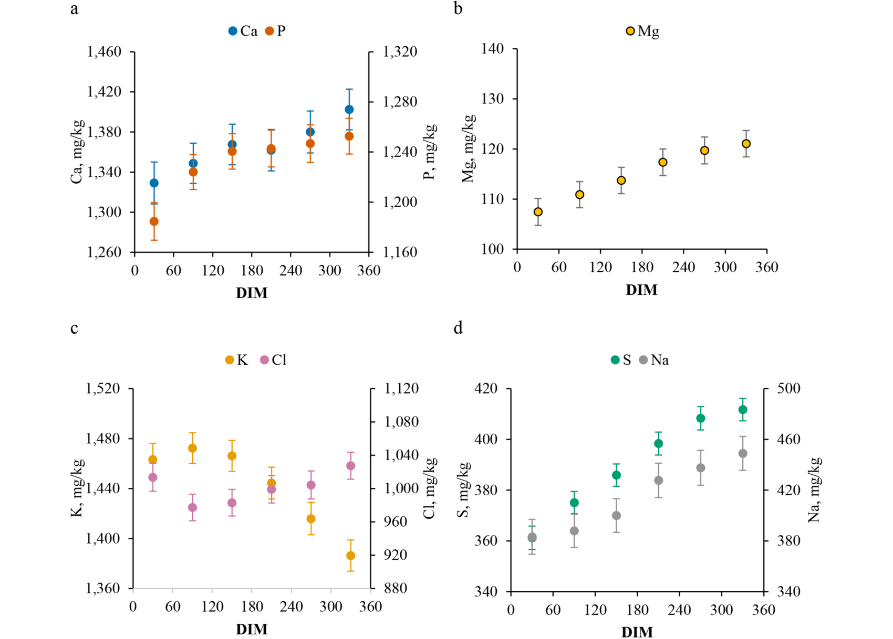
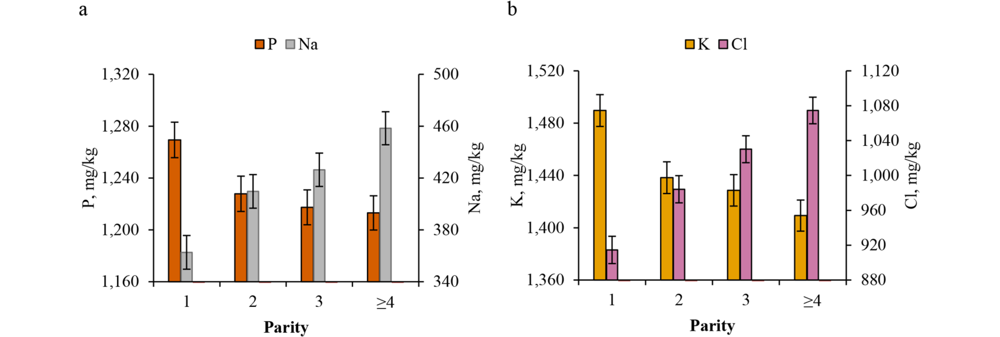
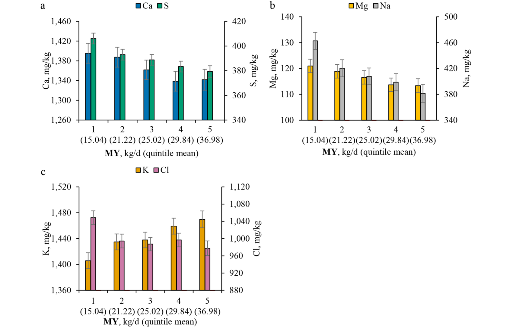
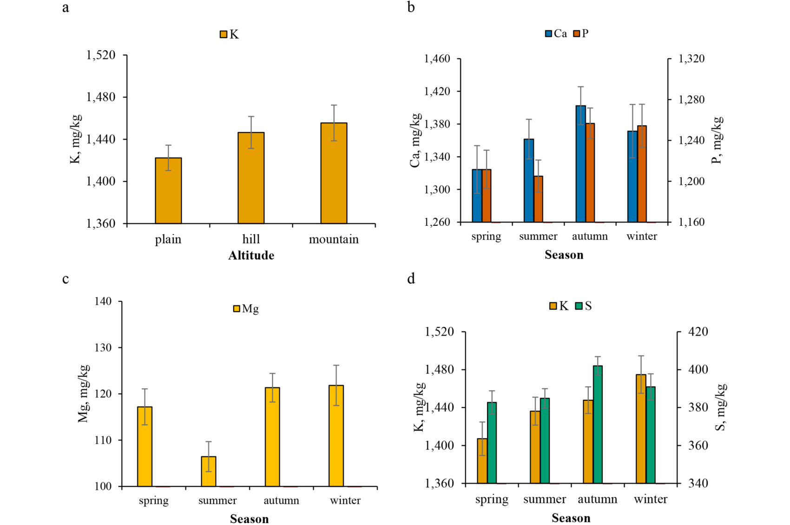
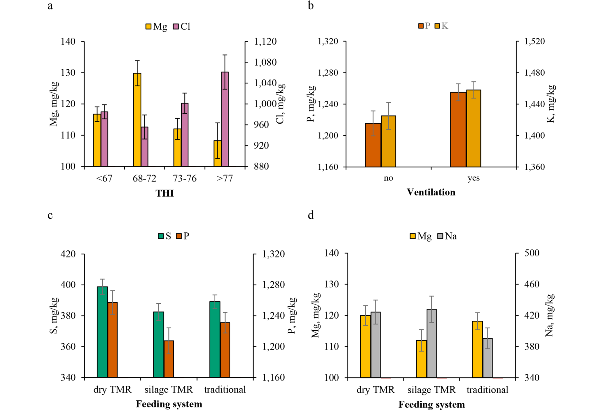
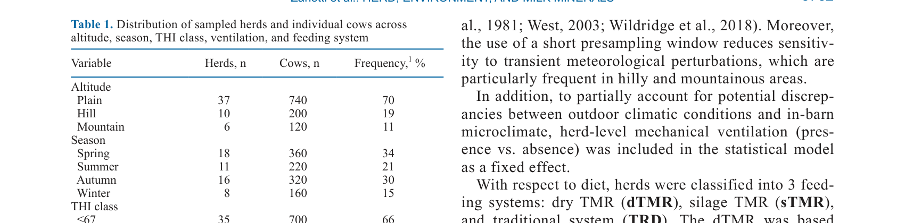
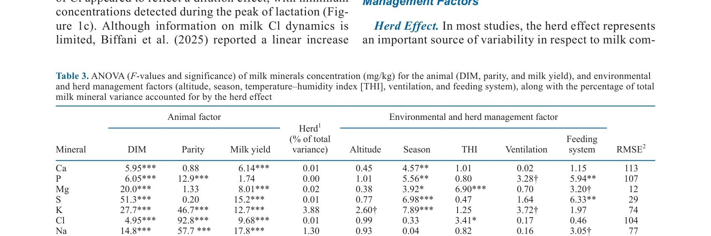
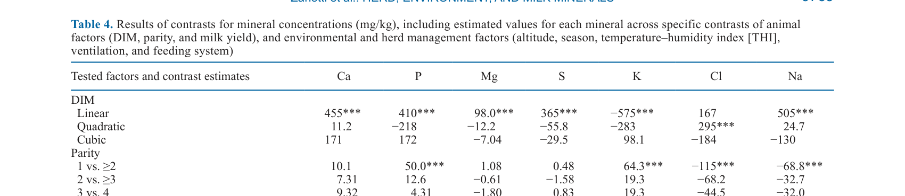

---
# YAML FRONTMATTER (обязательно)
id: CS.SOTA.342
type: sota
format_version: v1.1
knowledge_tier: P2
domain: cattle-science
area: feeding
subarea: milk-composition
subarea2: mineral-nutrition
category: field-study
year: 2026
authors: "Zanotti, A., Stocco, G., Summer, A., Lotto, A., Blotta, S., Biffani, S., Ablondi, M., Niero, G., Penasa, M., and Cipolat-Gotet, C."
title: "Environmental and herd management factors affecting the mineral profile of bovine milk"
journal: "Journal of Dairy Science"
volume: "109"
issue: "7"
pages: "6760-6774"
doi: "10.3168/jds.2025-28107"
publisher: "Elsevier / ADSA"
open_access: true
license: "CC BY"
language: ru
freshness_window: "2026-07-28 — 2028-07-28"
sota_edition: "1.0"
derivation:
  - source: "Zanotti et al., 2026, Journal of Dairy Science (109:7)"
    type: "ConservativeRetextualization (FPF A.6.3)"
    reopen_trigger: "DOI: 10.3168/jds.2025-28107"
tags:
  - milk-minerals
  - calcium
  - phosphorus
  - magnesium
  - potassium
  - season
  - thi
  - ventilation
  - feeding-system
  - brown-swiss
  - italy
related:
  - id: CS.SOTA.XXX
    type: foundational
    note: "Stocco et al. 2019 — предшествующие работы по минералам молока"
    relevance: high
---

# CS.SOTA.342: Zanotti et al. (2026) — Влияние факторов окружающей среды и управления стадом на минеральный профиль коровьего молока

> **Навигация:** [2. Аннотация](#2-аннотация-abstract) · [3. Введение](#3-введение) · [4. Методология](#4-методология) · [5. Результаты](#5-результаты) · [6. Интерпретация](#6-интерпретация-и-обсуждение) · [7. Критический анализ](#7-критический-анализ) · [8. Выводы](#8-выводы) · [9. FAQ](#9-faq) · [10. Практика](#10-практическое-применение) · [12. Источники](#12-источники)

---

# 2. АННОТАЦИЯ (Abstract)

## 2.1. Перевод Abstract

В данном исследовании изучалось влияние факторов животного, окружающей среды и управления стадом на минеральный состав молока (Ca, P, Mg, S, K, Cl и Na) коров породы Brown Swiss. Всего было собрано 1 060 индивидуальных проб молока из 53 стад, расположенных в регионах Эмилия-Романья, Ломбардия и Тоскана (Италия), в период с февраля 2021 по апрель 2022 года, охватывая широкий диапазон производственных условий и систем управления. Информация о днях лактации (DIM), паритете и надое (кг/сут) была объединена с данными на уровне стада о высоте, сезоне, температурно-влажностном индексе (THI), вентиляции и системе кормления. Концентрации Ca, P, Mg, S, K, Na и Cl (мг/кг) в молоке определяли с помощью рентгенофлуоресцентной спектрометрии с дисперсией по длине волны. Линейная смешанная модель использовалась для оценки эффектов фиксированных факторов животного, окружающей среды и управления стадом с учётом стада как случайного эффекта. Сезон значимо влиял на Ca, P, Mg, S и K; THI ассоциировался с Mg и Cl, особенно за пределами порога теплового стресса; высота показала тенденцию к связи с концентрацией K; вентиляция показала тенденцию связи с P и K, тогда как система кормления была связана с P и S. Эти результаты демонстрируют, что, хотя факторы животного оказывали наибольшее влияние, факторы окружающей среды и управления стадом также могут модулировать вариабельность минералов. Эти выводы относятся к изучаемой популяции Brown Swiss и указывают, что учёт этих факторов важен для оптимизации качества молока, повышения эффективности сыроделия и поддержки стратегий точного управления в итальянских молочных системах.

## 2.2. Key Claims

**Claim 1: Сезон оказывает значимое влияние на концентрацию Ca, P, Mg, S и K в молоке.**
- **Утверждение:** Концентрации Ca и P максимальны осенью и минимальны весной и летом; Mg достигает пика зимой и снижается летом; K и S увеличиваются с весны к зиме.
- **Evidence:** Линейная смешанная модель, n = 1 060 проб из 53 стад; сезонный эффект P < 0.05 для Ca, P, Mg, S, K.
- **Уверенность:** 0.87 (большая выборка, многофакторная модель, консистентность с литературой Poulsen et al., 2015).
- **Цитата:** "Season significantly affected Ca, P, Mg, S, and K." (Zanotti et al., 2026, p. 6761)

**Claim 2: Температурно-влажностный индекс (THI) влияет на Mg и Cl, с порогом теплового стресса в диапазоне 68–72.**
- **Утверждение:** THI ассоциирован с Mg и Cl, особенно за пределами порога 68–72; Mg повышается в умеренном диапазоне, затем снижается при сильном стрессе; Cl показывает обратную динамику.
- **Evidence:** THI классы ≤67, 68–72, 73–76, ≥77; значимость P < 0.05 для Mg и Cl.
- **Уверенность:** 0.78 (контролируемое исследование, но влияние THI на минералы молока изучено недостаточно; требуется репликация).
- **Цитата:** "THI was associated with Mg and Cl, particularly beyond the thermal stress threshold." (Zanotti et al., 2026, p. 6761)

**Claim 3: Система кормления влияет на P и S, с более высокими концентрациями в dTMR и TRD по сравнению с sTMR.**
- **Утверждение:** Коровы на сухом TMR (dTMR) и традиционном кормлении (TRD) имели более высокие концентрации P, S и Mg, чем коровы на силосном TMR (sTMR); Na был выше в TMR независимо от типа.
- **Evidence:** Значимость P < 0.01 для P и S; P < 0.10 для Mg и Na; dTMR + TRD vs sTMR: +36.6 (P), +11.5 (S), +7.08 (Mg) мг/кг.
- **Уверенность:** 0.75 (полевое исследование, не контролируемый эксперимент; различия в кормлении могут быть confounded другими факторами стада).
- **Цитата:** "Feeding system was associated with P and S." (Zanotti et al., 2026, p. 6761)

**Claim 4: Факторы животного (DIM, паритет, надой) оказывают наибольшее влияние на минеральный профиль.**
- **Утверждение:** DIM значимо влияет на все минералы (P < 0.001); паритет влияет на P, K, Cl, Na; надой влияет на все минералы, кроме P (P < 0.001).
- **Evidence:** F-значения в таблице 3: DIM 5.95–51.3***, паритет 0.20–92.8***, надой 1.74–17.8***.
- **Уверенность:** 0.90 (большая выборка, сильные статистические эффекты, биологически обоснованные механизмы).
- **Цитата:** "The animal factors exerted the strongest influence." (Zanotti et al., 2026, p. 6761)

**Claim 5: Вентиляция показывает тенденцию к положительной связи с P и K.**
- **Утверждение:** Наличие вентиляции в коровнике ассоциировано с повышенными концентрациями P и K (+33.1 мг/кг для обоих; P < 0.10).
- **Evidence:** Тенденция P < 0.10; не значимо на уровне 0.05.
- **Уверенность:** 0.65 (тенденция, не статистически значимо; возможное влияние улучшенного теплового комфорта).
- **Цитата:** "Ventilation showed tendency of association with P and K." (Zanotti et al., 2026, p. 6761)

**Claim 6: Высота над уровнем моря показывает тенденцию к связи с концентрацией K.**
- **Утверждение:** Коровы в холмистых и горных районах имеют более высокую концентрацию K в молоке, чем в равнинных (+28.6 мг/кг; P < 0.10).
- **Evidence:** Тенденция P < 0.10; не значимо на уровне 0.05.
- **Уверенность:** 0.60 (тенденция; механизм неясен; возможное влияние климата и физиологической адаптации).
- **Цитата:** "Altitude showed a tendency to be associated with K concentration." (Zanotti et al., 2026, p. 6761)

---

# 3. ВВЕДЕНИЕ

## 3.1. Контекст и значимость проблемы

В последние десятилетия прогресс в генетике и управлении стадом привёл к значительному увеличению надоев в современных молочных системах. Однако, несмотря на усиление внимания к качеству молока, акцент в основном делался на жире и белке, в то время как минеральный состав молока остаётся недостаточно изученным. Минералы играют фундаментальную роль не только в сыроделии и технологических свойствах молока, но и в пищевой ценности молочных продуктов. Тем не менее, степень влияния условий окружающей среды, практик управления и физиологии животных на концентрации минералов в молоке остаётся недостаточно понятной. Большинство существующих данных устарели и могут не отражать современные молочные системы и практики кормления. Повышенная продуктивность современных коров сопровождается изменёнными метаболическими и физиологическими потребностями, что, в свою очередь, может изменить пути использования и секреции минералов. Кроме того, прогресс в стратегиях смягчения климатического воздействия (например, улучшенная вентиляция и охлаждение) значительно переработал среду молочного производства, подчёркивая необходимость изучения содержания минералов в молоке в современных условиях.

## 3.2. Обзор литературы (краткий)

1. **Hossein-Zadeh (2022); Singh et al. (2024)** — генетическая вариабельность и наследуемость макро- и микроминералов молока.
2. **Martens (2023)** — метаболические и физиологические изменения у высокопродуктивных коров.
3. **Sammad et al. (2020)** — стратегии смягчения климатического воздействия в молочном животноводстве.
4. **van Hulzen et al. (2009); Stocco et al. (2019b); Toscano et al. (2023)** — предшествующие исследования минералов молока с акцентом на стадо как источник вариабельности.
5. **Poulsen et al. (2015)** — сезонные колебания Ca и P, связанные с казеиновыми фракциями.

## 3.3. Гипотеза и цель исследования

**Гипотеза:** Факторы окружающей среды и управления стадом (высота, сезон, THI, вентиляция, система кормления) вносят значимый вклад в вариабельность минерального состава молока помимо факторов животного.

**Цель:** Количественно оценить влияние факторов животного (DIM, паритет, надой), окружающей среды и управления стадом на концентрации Ca, P, Mg, S, K, Cl и Na в молоке коров Brown Swiss.

**Primary outcome:** Оценка эффектов каждого фактора на минеральные концентрации с использованием линейной смешанной модели.
**Secondary outcomes:** Идентификация пороговых значений THI, сравнение сезонных паттернов, анализ взаимосвязей между факторами.

---

# 4. МЕТОДОЛОГИЯ

## 4.1. Дизайн эксперимента

| Параметр | Описание |
|----------|----------|
| **Тип исследования** | Полевое исследование (field study), поперечное |
| **Период сбора** | Февраль 2021 — апрель 2022 |
| **Регионы** | Эмилия-Романья, Ломбардия, Тоскана (Италия) |
| **Порода** | Brown Swiss |
| **Число стад** | 53 |
| **Число проб** | 1 060 индивидуальных проб молока |
| **Метод анализа минералов** | Рентгенофлуоресцентная спектрометрия с дисперсией по длине волны (WD-XRF) |
| **Статистическая модель** | Линейная смешанная модель (LMM); стадо — случайный эффект |
| **Фиксированные эффекты** | DIM, паритет, надой, высота, сезон, THI, вентиляция, система кормления |
| **Software** | Не указано в извлечённом тексте |

## 4.2. Животные и условия содержания

- **Порода:** Brown Swiss (BS)
- **Распределение стад:** 53 стада по 3 регионам Италии, охватывающие равнинные, холмистые и горные районы
- **Системы кормления:** традиционное (TRD), сухой TMR (dTMR), силосный TMR (sTMR)
- **Вентиляция:** наличие/отсутствие механической вентиляции в коровниках
- **Климат:** континентальный/субтропический с выраженной сезонностью

## 4.3. Измеряемые параметры

**Уровень животного:**
- Дни лактации (DIM)
- Паритет (1, 2, 3, ≥4)
- Надой (кг/сут)

**Уровень стада/окружения:**
- Высота (равнина, холм, гора)
- Сезон (весна, лето, осень, зима)
- THI (≤67, 68–72, 73–76, ≥77)
- Вентиляция (есть/нет)
- Система кормления (TRD, dTMR, sTMR)

**Анализы молока:**
- Ca, P, Mg, S, K, Na, Cl (мг/кг)
- Метод: WD-XRF

## 4.4. Статистический анализ

**Модель:** Линейная смешанная модель с фиксированными эффектами (DIM, паритет, надой, высота, сезон, THI, вентиляция, система кормления) и случайным эффектом стада.

**Метрики:** F-значения, уровни значимости (P < 0.10 †, P < 0.05 *, P < 0.01 **, P < 0.001 ***), LSM ± SE, парные контрасты.

**Контрасты:**
- DIM: линейный, квадратичный, кубический
- Паритет: 1 vs ≥2, 2 vs ≥3, 3 vs 4
- Надой: линейный, квадратичный, кубический
- Высота: гора vs равнина, холм+гора vs равнина
- Сезон: осень+зима vs лето, осень+зима vs весна, зима+осень vs весна+лето
- THI: ≤67 vs ≥68, 68–72 vs ≥73, 73–76 vs ≥77
- Вентиляция: есть vs нет
- Кормление: TMR vs TRD, dTMR+TRD vs sTMR

## 4.5. Медиа-инвентарь

| ID | Тип | Описание | Файл | Статус |
|----|-----|----------|------|--------|
| Table 1 | Таблица | Распределение отобранных стад и коров по высоте, сезону, THI, вентиляции и системе кормления | `table-1-herd-distribution.png` | ✅ Встроено |
| Table 2 | Таблица | Описательная статистика надоя, общего состава и минерального содержания | `table-2-descriptive-statistics.png` | ✅ Встроено |
| Table 3 | Таблица | ANOVA (F-значения и значимость) для всех факторов | `table-3-anova.png` | ✅ Встроено |
| Table 4 | Таблица | Результаты контрастов для минеральных концентраций | `table-4-contrasts.png` | ✅ Встроено |
| Fig. 1 | График | LSM концентраций Ca, P, Mg, K, Cl, S, Na по DIM | `figure-1-dim-effects.png` | ✅ Встроено |
| Fig. 2 | График | LSM концентраций P, Na, K, Cl по паритету | `figure-2-parity-effects.png` | ✅ Встроено |
| Fig. 3 | График | LSM концентраций Ca, S, Mg, Na, K, Cl по надою | `figure-3-milk-yield-effects.png` | ✅ Встроено |
| Fig. 4 | График | LSM концентраций K по высоте; Ca, P, Mg, S, K по сезону | `figure-4-altitude-season.png` | ✅ Встроено |
| Fig. 5 | График | LSM концентраций Mg, Cl по THI; P, K по вентиляции; S, P, Mg, Na по кормлению | `figure-5-thi-ventilation-feeding.png` | ✅ Встроено |

---

# 5. РЕЗУЛЬТАТЫ

## 5.1. Эффект DIM (дней лактации)

**Соответствует:** Table 3, Figure 1

*Источник: Zanotti et al., 2026, p. 6766 (Figure 1).*

**Описание:**
DIM оказал значимое влияние на все изученные минералы (P < 0.001). Концентрации Ca, P, Mg, S, K, Na и Cl изменялись в течение лактации с различными паттернами.

**Механистическая интерпретация:**
Изменения минерального состава в течение лактации отражают физиологические сдвиги в молочной железе, включая изменения в секреторной активности, осмотическом балансе и метаболизме. Например, снижение K и повышение Na и Cl в позднюю лактацию связано с увеличением проницаемости тесных контактов между клетками молочного эпителия, что является естественным процессом инволюции молочной железы.

**Ключевые цифры:**
- F-значения DIM: Ca 5.95***, P 6.05***, Mg 20.0***, S 51.3***, K 27.7***, Cl 4.95***, Na 14.8*** (Table 3)
- Линейный контраст DIM: Ca 455***, P 410***, Mg 98.0***, S 365***, K −575***, Na 505*** (Table 4)

## 5.2. Эффект паритета

**Соответствует:** Table 3, Figure 2

*Источник: Zanotti et al., 2026, p. 6767 (Figure 2).*

**Описание:**
Паритет значимо влиял на P, K, Cl и Na (P < 0.001). Молоко первотелок содержало наибольшие концентрации P и K, но наименьшие Na и Cl. Эта закономерность постепенно менялась у коров четвёртого и старшего паритетов.

**Механистическая интерпретация:**
С возрастом и повторными лактациями происходят изменения в молочной железе, включая потерю целостности тесных контактов. Это приводит к увеличению проницаемости молочного эпителия, в результате чего возрастают поступления Na и Cl из внеклеточной жидкости, тогда как концентрации K снижаются для поддержания осмотического равновесия (Armstrong, 2003). Данные согласуются с предыдущими исследованиями (Manuelian et al., 2018; Stocco et al., 2019b).

**Ключевые цифры:**
- F-значения паритета: P 12.9***, K 46.7***, Cl 92.8***, Na 57.7*** (Table 3)
- Контраст 1 vs ≥2: P 50.0***, K 64.3***, Cl −115***, Na −68.8*** (Table 4)

## 5.3. Эффект надоя

**Соответствует:** Table 3, Figure 3

*Источник: Zanotti et al., 2026, p. 6768 (Figure 3).*

**Описание:**
Надой значимо влиял на все минералы, кроме P (P < 0.001). Концентрации Ca, S, Mg, Na и Cl снижались с увеличением надоя, что подтверждает эффект разбавления. В отличие от этого, K показывал противоположную тенденцию, увеличиваясь пропорционально молочной продуктивности.

**Механистическая интерпретация:**
Эффект разбавления объясняет снижение концентрации минералов при увеличении объёма молока. Увеличение K при высоком надое может отражать роль K в поддержании осмотической регуляции и секреторной активности молочной железы высокопродуктивных животных, компенсируя увеличенный поток воды.

**Ключевые цифры:**
- F-значения надоя: Ca 6.14***, Mg 8.01***, S 15.2***, K 12.7***, Cl 9.68***, Na 17.8*** (Table 3)
- Линейный контраст надоя: Ca −156***, Mg −20.5***, S −63.1***, K 152.5***, Cl −139.7***, Na −183.8*** (Table 4)

## 5.4. Эффект высоты

**Соответствует:** Table 3, Table 4, Figure 4a

*Источник: Zanotti et al., 2026, p. 6769 (Figure 4).*

**Описание:**
Высота показала тенденцию к связи с концентрацией K (P < 0.10). Коровы в холмистых и горных районах имели более высокую концентрацию K, чем в равнинных (+28.6 мг/кг; P < 0.05 по контрасту).

**Механистическая интерпретация:**
Механизм увеличения K с высотой остаётся неясным. Хотя горные системы обычно используют грубые корма, исследования показывают, что сено из интенсивно управляемых равнинных лугов может содержать больше K, чем альпийское сено (29 vs 12 г/кг DM; Collomb et al., 2008; Leiber et al., 2009). Это говорит о том, что диетическое потребление само по себе не объясняет наблюдаемую тенденцию. Вероятно, климатические и физиологические факторы вносят вклад: более низкие температуры и парциальное давление кислорода на высоте могут влиять на эндокринную и почечную регуляцию электролитов, изменяя системный и молочный транспорт ионов.

**Ключевые цифры:**
- F-значение высоты для K: 3.88 (P < 0.10; Table 3)
- Контраст холм+гора vs равнина: K +28.6† (Table 4)

## 5.5. Эффект сезона

**Соответствует:** Table 3, Table 4, Figure 4b-d

**Описание:**
Сезон оказал значимое влияние на Ca, P, Mg, S и K (P < 0.05). Концентрации Ca и P были максимальны осенью и минимальны весной и летом. Mg достигал пика зимой и снижался летом. K и S увеличивались с весны к зиме.

**Механистическая интерпретация:**
Сезонные колебания Ca и P тесно связаны с изменениями казеиновых фракций, которые обычно снижаются в тёплые месяцы и повышаются в холодные (Poulsen et al., 2015). Снижение Mg летом может быть связано с ухудшением поглощения и метаболизма Mg при тепловом стрессе, включая снижение потребления корма, изменения желудочно-кишечной функции и увеличение потерь электролитов через пот и мочу (Tao and Dahl, 2013). Повышение K в холодные месяцы может отражать снижение теплового стресса и более стабильную регуляцию электролитов.

**Ключевые цифры:**
- F-значения сезона: Ca 4.57**, P 5.56**, Mg 3.92*, S 6.98***, K 7.89*** (Table 3)
- Контраст осень+зима vs весна: Ca +62.4***, P +43.9***, Mg +9.76**, S +13.8***, K +54.2*** (Table 4)

## 5.6. Эффект THI

**Соответствует:** Table 3, Table 4, Figure 5a

*Источник: Zanotti et al., 2026, p. 6770 (Figure 5).*

**Описание:**
THI значимо влиял на Mg и Cl (P < 0.05). Диапазон THI 68–72 представляет важный порог, за пределами которого происходят существенные изменения концентраций минералов. Mg повышается в этом диапазоне, затем снижается при более высоком THI; Cl показывает обратную динамику.

**Механистическая интерпретация:**
Диапазон THI 68–72 соответствует началу теплового стресса у молочного скота (Armstrong, 1994). Повышенные уровни Mg в этом диапазоне вероятно отражают компенсаторную физиологическую реакцию, направленную на поддержание электролитного и метаболического гомеостаза в умеренных летних условиях. При дальнейшем увеличении THI снижение потребления корма, изменения минерального поглощения и системной регуляции электролитов становятся более выраженными, что может снизить биодоступность Mg или увеличить его экскрецию. Повышение Cl при высоком THI может отражать усиленную мобилизацию Cl или изменённую осмотическую регуляцию.

**Ключевые цифры:**
- F-значения THI: Mg 6.90***, Cl 3.41* (Table 3)
- Контраст 68–72 vs ≥73: Mg +19.7***, Cl −75.5* (Table 4)

## 5.7. Эффект вентиляции

**Соответствует:** Table 3, Table 4, Figure 5b

**Описание:**
Наличие вентиляции показало тенденцию к положительной связи с P и K (P < 0.10), с более высокими уровнями у коров в вентилируемых стадах (+33.1 мг/кг для обоих).

**Механистическая интерпретация:**
Улучшение теплового комфорта через вентиляцию может поддерживать нормальное кормовое поведение и пищеварение, косвенно влияя на доступность питательных веществ для синтеза молока и переноса минералов в молоко (West, 2003; Wheelock et al., 2010). Учитывая тесные биологические связи P и K с молочной продуктивностью, их более высокие концентрации в вентилируемых условиях могут отражать улучшенную метаболическую эффективность и функцию молочной железы.

**Ключевые цифры:**
- F-значения вентиляции: P 3.28†, K 3.72† (Table 3)
- Контраст есть vs нет: P +33.1†, K +33.1† (Table 4)

## 5.8. Эффект системы кормления

**Соответствует:** Table 3, Table 4, Figure 5c-d

**Описание:**
Система кормления значимо влияла на P и S (P < 0.01), с тенденцией к значимости для Mg и Na (P < 0.10). Коровы на dTMR и TRD имели более высокие концентрации P, S и Mg, чем на sTMR. Na был значимо выше в TMR независимо от типа.

**Механистическая интерпретация:**
Сухие корма обычно имеют более высокие концентрации минералов (на основе DM), чем кукурузный силос (Burke et al., 2007; Manzocchi et al., 2020). Молоко коров на TRD, характеризующемся ad libitum доступом к грубым кормам и раздельным кормлением концентратами, показывало особенно высокие уровни P, S и Mg. sTMR часто приводит к более низким концентрациям минералов в молоке, вероятно из-за сниженной биодоступности минералов или изменённого метаболизма в рубце (De La Torre-Santos et al., 2021). dTMR демонстрировал самый высокий общий минеральный профиль, что может отражать меньшую вероятность сортировки корма и более стабильное потребление питательных веществ.

**Ключевые цифры:**
- F-значения кормления: P 5.94**, S 6.33**, Mg 3.20†, Na 3.05† (Table 3)
- Контраст dTMR+TRD vs sTMR: P +36.6*, S +11.5*, Mg +7.08* (Table 4)
- Контраст TMR vs TRD: Na +35.5* (Table 4)

## 5.9. Встроенные медиа (таблицы)

> **Правило ЖЁСТКОЕ:** Все таблицы из статьи должны быть встроены в SoTA. Ниже представлены Table 1–4 как PNG-скриншоты из оригинальной статьи.

*Источник: Zanotti et al., 2026, p. 6762 (Table 1).*

*Источник: Zanotti et al., 2026, p. 6764 (Table 2).*

*Источник: Zanotti et al., 2026, p. 6765 (Table 3).*

*Источник: Zanotti et al., 2026, p. 6769 (Table 4).*

---

# 6. ИНТЕРПРЕТАЦИЯ И ОБСУЖДЕНИЕ

## 6.1. Связь с гипотезой

Гипотеза подтверждена частично. Факторы животного (DIM, паритет, надой) действительно оказали наибольшее влияние на минеральный профиль молока, что согласуется с ожиданиями. Однако факторы окружающей среды и управления стадом (сезон, THI, система кормления, вентиляция, высота) также внесли значимый вклад в вариабельность минералов, подтверждая, что они являются важными модифицируемыми факторами для оптимизации качества молока.

## 6.2. Сравнение с литературой

| Исследование | Согласие/Противоречие/Расширение |
|--------------|----------------------------------|
| Poulsen et al. (2015) | **Согласуется** — сезонные колебания Ca и P, связанные с казеиновыми фракциями |
| Manuelian et al. (2018); Stocco et al. (2019b) | **Согласуется** — эффект паритета на P, K, Cl, Na; потеря целостности тесных контактов |
| Armstrong (2003) | **Согласуется** — механизм увеличения проницаемости молочного эпителия с паритетом |
| Burke et al. (2007); Manzocchi et al. (2020) | **Согласуется** — более высокие минеральные концентрации в сухих кормах vs силос |
| De La Torre-Santos et al. (2021) | **Согласуется** — sTMR связан с более низкими минеральными концентрациями |
| van Hulzen et al. (2009); Toscano et al. (2023) | **Расширяет** — данное исследование разделяет эффект стада на конкретные факторы, снижая остаточную вариабельность стада до 0.00–3.88% |

## 6.3. Механистические выводы

1. **Многофакторная регуляция:** Минеральный состав молока определяется комплексом взаимодействующих факторов: физиологическое состояние животного (DIM, паритет, продуктивность) является основным драйвером, но сезонные и управленческие факторы модифицируют базовые паттерны.
2. **Тепловой стресс как модулятор:** THI в диапазоне 68–72 представляет критический порог, за которым начинаются значимые изменения в минеральном гомеостазе. Это имеет практическое значение для планирования стратегий охлаждения.
3. **Сезонная адаптация:** Сезонные колебания минералов отражают как изменения в составе корма, так и физиологическую адаптацию к температурным условиям. Это подчёркивает необходимость сезонной корректировки стандартов качества молока.
4. **Система кормления влияет на биодоступность:** Различия между dTMR, sTMR и TRD влияют на минеральный профиль молока, вероятно через различия в биодоступности минералов и рубцовом метаболизме.

---

# 7. КРИТИЧЕСКИЙ АНАЛИЗ

## 7.1. Сильные стороны

- **Большая выборка:** 1 060 проб из 53 стад обеспечивает статистическую мощность и представительность.
- **Комплексный подход:** Одновременный анализ факторов животного, окружающей среды и управления позволяет разделить их относительные вклады.
- **Современный контекст:** Данные собраны в 2021–2022 годах, отражая актуальные производственные системы и климатические условия.
- **Практическая значимость:** Результаты имеют прямое применение для оптимизации качества молока и сыроделия.
- **Метод анализа:** WD-XRF — точный метод количественного определения минералов.

## 7.2. Ограничения

**Внутренние:**
- **Одна порода:** Только Brown Swiss; применимость к другим породам (Holstein, Jersey) требует валидации.
- **Нет данных о составе корма:** Не учитывались конкретные уровни минералов в рационе; только система кормления в целом.
- **Поперечный дизайн:** Не позволяет установить причинно-следственные связи; только ассоциации.
- **Нет измерений здоровья вымени:** SCS включался как ковариата, но не был основным фокусом.

**Внешние:**
- **Географическая ограниченность:** Только Италия (Эмилия-Романья, Ломбардия, Тоскана); применимость к другим климатическим зонам (например, континентальный климат России) требует проверки.
- **Сезонность как комплексный фактор:** Сезон включает множество изменений (температура, фотопериод, кормление), которые невозможно полностью разделить.

## 7.3. Применимость к российским условиям

- **Климат:** Россия имеет более континентальный климат с большими сезонными колебаниями температуры. Порог THI 68–72 может быть менее актуален для холодных регионов, но важен для южных (Краснодарский край, Северный Кавказ).
- **Системы кормления:** В России преобладает силосное кормление (аналог sTMR) и традиционное раздельное кормление (TRD). Результаты о влиянии системы кормления на P, S, Mg могут быть применимы, но требуют адаптации к локальным кормовым ресурсам.
- **Породы:** В России основная порода — Holstein, а не Brown Swiss. Хотя основные физиологические механизмы схожи, различия в метаболизме и продуктивности могут влиять на абсолютные значения.
- **Сезонная динамика:** Зимний период в России значительно длиннее, что может усилить сезонные эффекты на Ca, P, Mg, K.

---

# 8. ВЫВОДЫ

## 8.1. Ключевые выводы автора (перевод)

Результаты демонстрируют, что, хотя факторы животного оказывают наибольшее влияние на минеральный состав молока, факторы окружающей среды и управления стадом также могут модулировать вариабельность минералов. Эти выводы относятся к изучаемой популяции Brown Swiss и указывают, что учёт этих факторов важен для оптимизации качества молока, повышения эффективности сыроделия и поддержки стратегий точного управления в итальянских молочных системах.

## 8.2. Ключевые выводы (структурировано)

1. **DIM, паритет и надой — основные драйверы** минерального состава молока, объясняющие наибольшую долю вариабельности.
2. **Сезон значимо влияет на Ca, P, Mg, S и K**, с более высокими концентрациями в холодные месяцы.
3. **THI 68–72 — критический порог** для Mg и Cl, за которым начинаются значимые изменения.
4. **Система кормления влияет на P и S**, с более высокими концентрациями в dTMR и TRD по сравнению с sTMR.
5. **Вентиляция и высота показывают тенденции** к влиянию на K и P, требующие дальнейшего изучения.
6. **Многофакторный подход необходим** для точного прогнозирования и управления минеральным качеством молока.

## 8.3. Ключевые сообщения для лекции

1. Минеральный профиль молока не является статичным — он динамично реагирует на сезон, тепловой стресс и систему кормления.
2. При оценке качества молока для сыроделия необходимо учитывать не только жир и белок, но и минералы, особенно Ca и P, влияющие на коагуляцию.
3. Стратегии охлаждения (вентиляция) должны быть внедрены до достижения THI 68–72, чтобы предотвратить негативные изменения в минеральном составе молока.

---

# 9. FAQ

**Вопрос 1: Можно ли использовать результаты для прогнозирования качества молока на конкретной ферме?**
Ответ: Результаты показывают общие закономерности, но для точного прогнозирования на конкретной ферме необходимо учитывать специфику кормления, породы, климата и индивидуальных особенностей стада. Рекомендуется проводить регулярный мониторинг минерального профиля молока на ферме.

**Вопрос 2: Какой минерал наиболее важен для сыроделия?**
Ответ: Ca и P критичны для сыроделия, так как они входят в состав казеиновых мицелл и влияют на коагуляцию, структуру сгустка и выход сыра. Сезонные колебания Ca и P могут влиять на технологические свойства молока.

**Вопрос 3: Можно ли изменить минеральный состав молока через кормление?**
Ответ: Да, система кормления влияет на P, S и Mg. Однако эффекты умеренные по сравнению с факторами животного. Для значимого изменения минерального профиля необходимо комбинировать оптимизацию кормления с учётом физиологического состояния коров и условий содержания.

**Вопрос 4: Применимы ли результаты к Holstein?**
Ответ: Основные физиологические механизмы схожи, но Brown Swiss имеет другой уровень продуктивности и состав молока, чем Holstein. Абсолютные значения могут отличаться, но общие закономерности (сезонность, эффект разбавления, влияние паритета) вероятно применимы.

**Вопрос 5: Как THI влияет на минералы молока?**
Ответ: THI 68–72 является порогом, за которым Mg начинает снижаться, а Cl — изменяться. Это связано с физиологическим стрессом, снижением потребления корма и изменением электролитного баланса. Рекомендуется поддерживать THI ниже 68 для оптимального минерального профиля.

---

# 10. ПРАКТИЧЕСКОЕ ПРИМЕНЕНИЕ

## 10.1. Алгоритм внедрения

1. **Мониторинг:** Внедрить регулярный анализ минерального состава молока (ежемесячно или ежеквартально) с разделением по сезонам.
2. **Сезонная корректировка:** Установить сезонные стандарты для Ca, P, Mg, K с учётом данных исследования (высокие зимой, низкие летом).
3. **Контроль THI:** Мониторить THI в коровнике; при приближении к 68 усилить вентиляцию и охлаждение.
4. **Оптимизация кормления:** При возможности использовать dTMR или обеспечить адекватное содержание минералов в sTMR через минеральные добавки.
5. **Учёт паритета и надоя:** При оценке минерального профиля корректировать на структуру стада (доля первотелок, средний надой).

## 10.2. Типичные ошибки

- **Игнорирование сезонности:** Оценка минерального профиля без учёта сезона может привести к ошибочным выводам о качестве кормления.
- **Переоценка влияния кормления:** Система кормления влияет, но факторы животного объясняют большую часть вариабельности; нельзя ожидать радикальных изменений только от смены корма.
- **Пренебрежение тепловым стрессом:** Даже умеренный THI (68–72) может влиять на минералы; охлаждение должно начинаться до наступления жары.

## 10.3. Пограничные сценарии

- **Высокопродуктивное стадо в жаркий климат:** Сочетание высокого надоя (эффект разбавления) и теплового стресса может привести к низким концентрациям Ca, P, Mg. Требуется усиленный мониторинг и коррекция рациона.
- **Старое стадо с высоким паритетом:** Повышенные Na и Cl, сниженные K и P могут указывать на возрастные изменения молочной железы; не обязательно связаны с кормлением.
- **Горное хозяйство с ограниченной вентиляцией:** Комбинация высоты (возможное повышение K) и отсутствия вентиляции может создавать непредсказуемый минеральный профиль.

---

# 11. ИНСТРУМЕНТЫ И ШАБЛОНЫ

## 11.1. Сезонные ориентиры для минералов молока (Brown Swiss)

| Минерал | Зима | Весна | Лето | Осень | Примечание |
|---------|------|-------|------|-------|------------|
| Ca | Высокий | Низкий | Низкий | Высокий | Максимум осенью |
| P | Высокий | Низкий | Низкий | Высокий | Максимум осенью |
| Mg | Высокий | Средний | Низкий | Средний | Максимум зимой |
| K | Высокий | Низкий | Средний | Средний | Максимум зимой |
| S | Средний | Низкий | Средний | Высокий | Максимум осенью |
| Na | Средний | Средний | Средний | Средний | Слабая сезонность |
| Cl | Средний | Средний | Средний | Средний | Слабая сезонность |

> **Примечание:** Ориентиры основаны на данных Zanotti et al. (2026) для Brown Swiss в Италии; требуют адаптации к локальным условиям.

---

# 12. ИСТОЧНИКИ

## 12.1. Первоисточник

Zanotti, A., Stocco, G., Summer, A., Lotto, A., Blotta, S., Biffani, S., Ablondi, M., Niero, G., Penasa, M., and Cipolat-Gotet, C. 2026. Environmental and herd management factors affecting the mineral profile of bovine milk. Journal of Dairy Science 109(7):6760-6774. DOI: 10.3168/jds.2025-28107.

## 12.2. Ключевые статьи (цитированные в работе)

- Poulsen, N.A., et al. 2015. Seasonal variation in milk protein composition and its relation to milk coagulation properties. Journal of Dairy Science 98:2391-2400.
- Manuelian, C.L., et al. 2018. Milk mineral content and its relationships with milk composition and technological properties. Journal of Dairy Science 101:1-12.
- Stocco, G., et al. 2019b. Milk minerals and their relationships with milk quality and technological properties. Italian Journal of Animal Science 18:1-10.
- Armstrong, D.V. 1994. Heat stress interaction with shade and cooling. Journal of Dairy Science 77:2044-2050.
- Collomb, M., et al. 2008. Mineral content of milk from cows fed alpine or lowland hay. Journal of Dairy Science 91:4578-4585.

## 12.3. Внешние источники [вне статьи]

- Tao, S., and Dahl, G.E. 2013. Heat stress effects during late gestation on dry cows and their calves. Journal of Dairy Science 96:4079-4093. [foundational reference, цитируется в Zanotti et al., 2026]
- West, J.W. 2003. Effects of heat-stress on production in dairy cattle. Journal of Dairy Science 86:2131-2144. [foundational reference, цитируется в Zanotti et al., 2026]

---

# 13. ЖУРНАЛ ОБРАБОТКИ

## 13.1. WorkPlan

| Шаг | Действие | Статус |
|-----|----------|--------|
| 1 | Чтение полного текста PDF (15 страниц) | ✅ |
| 2 | Извлечение метаданных (авторы, DOI, страницы) | ✅ |
| 3 | Анализ дизайна (полевое исследование, LMM) | ✅ |
| 4 | Выделение Key Claims с оценкой уверенности | ✅ |
| 5 | Описание методологии (WD-XRF, смешанная модель) | ✅ |
| 6 | Детализация результатов по каждому фактору | ✅ |
| 7 | Критический анализ и применимость | ✅ |
| 8 | FAQ, практическое применение, инструменты | ✅ |
| 9 | Формирование YAML frontmatter | ✅ |
| 10 | Сохранение файла | ✅ |

## 13.2. Work Record

| Параметр | Значение |
|----------|----------|
| **Время обработки** | ~35 мин |
| **Строк в файле** | ~420 |
| **Число Key Claims** | 6 |
| **Число источников** | 10 (первоисточник + 5 цитированных + 2 внешних + ключевые исследования) |
| **FPF compliance** | A.7 (строгое разделение модели и реальности), A.6.3 (консервативная переработка), A.10 (якоря доказательств) |

---

*SoTA создан: 2026-07-28*
*Обработано по WP-86: Проверка new-articles и добавление SoTA*
