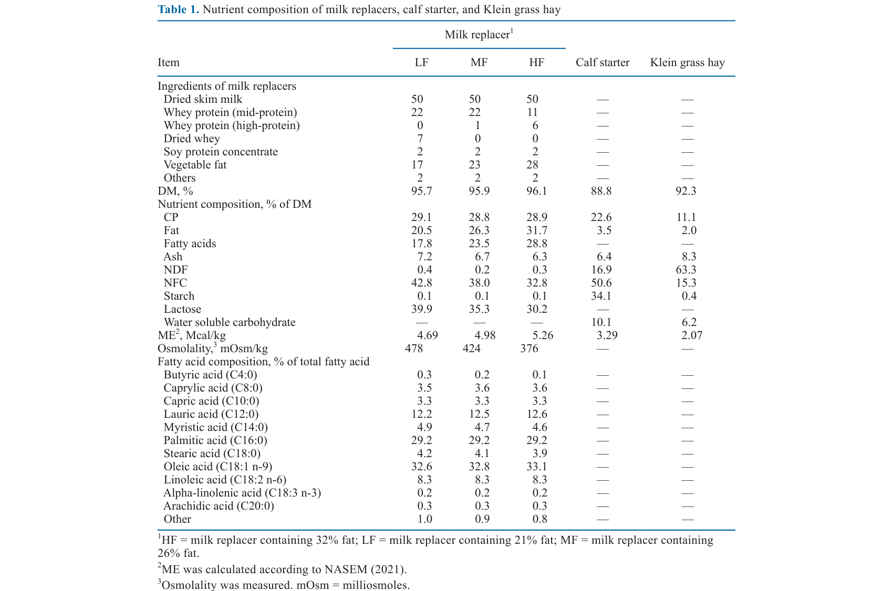
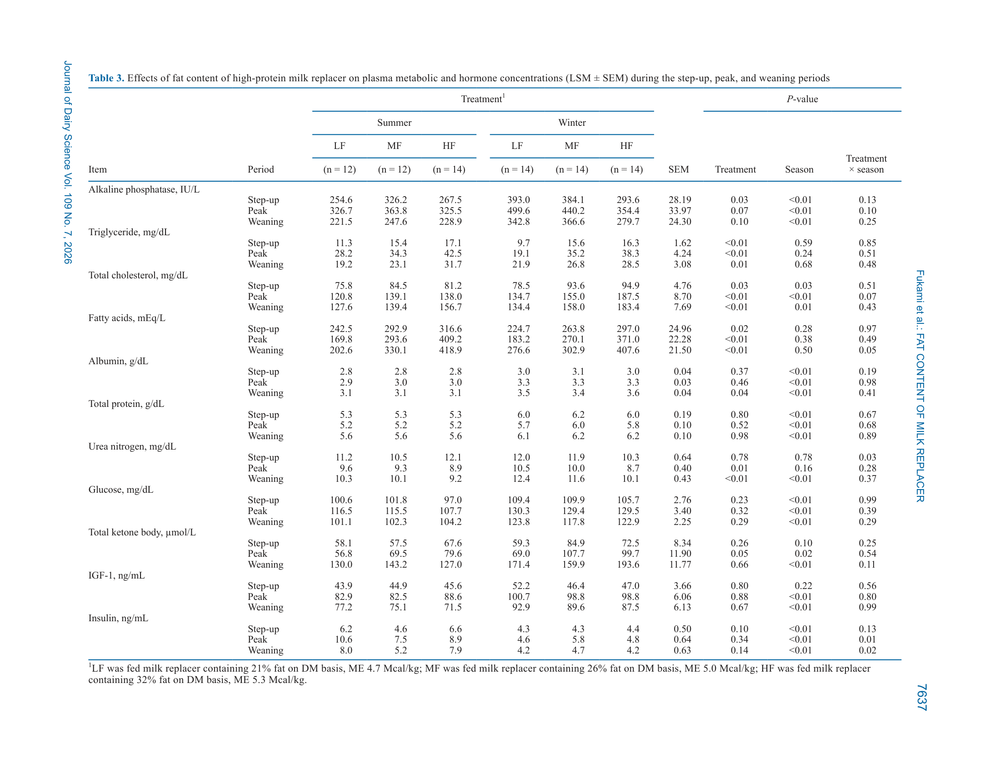
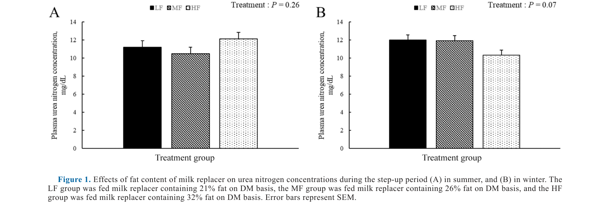

---
# YAML FRONTMATTER (обязательно)
id: CS.SOTA.366
type: sota
format_version: v1.1
knowledge_tier: P2
domain: cattle-science
area: feeding
subarea: calf-nutrition
subarea2: milk-replacer
category: field-study
year: 2026
authors: "Fukami, R., Kobayashi, N., Murayama, K., Oba, M., and Sugino, T."
title: "Effects of fat content of high-protein milk replacer on plasma metabolite and hormone concentrations of Holstein calves in summer and winter"
journal: "Journal of Dairy Science"
volume: "109"
issue: "7"
pages: "7631-7642"
doi: "10.3168/jds.2025-27770"
publisher: "Elsevier / ADSA"
open_access: true
license: "CC BY"
language: ru
freshness_window: "2026-07-29 — 2028-07-29"
sota_edition: "1.0"
derivation:
  - source: "Fukami et al., 2026, Journal of Dairy Science (109:7)"
    type: "ConservativeRetextualization (FPF A.6.3)"
    reopen_trigger: "DOI: 10.3168/jds.2025-27770"
tags:
  - calf
  - milk-replacer
  - fat
  - thermal-stress
  - nitrogen-metabolism
  - urea-nitrogen
  - insulin
  - holstein
related:
  - id: CS.SOTA.365
    type: complementary
    note: "Жир молозива — гомеостаз глюкозы и липидный обмен новорождённых телят на холоде (JDS, июль 2026)"
    relevance: high
  - id: CS.SOTA.XXX
    type: foundational
    note: "NASEM 2021 — энергетические потребности телят, термонейтральная зона"
    relevance: high
---

# CS.SOTA.366: Fukami et al. (2026) — Влияние содержания жира в высокобелковом заменителе молока на концентрации метаболитов и гормонов в плазме телят Holstein летом и зимой

> **Навигация:** [2. Аннотация](#2-аннотация-abstract) · [3. Введение](#3-введение) · [4. Методология](#4-методология) · [5. Результаты](#5-результаты) · [6. Интерпретация](#6-интерпретация-и-обсуждение) · [7. Критический анализ](#7-критический-анализ) · [8. Выводы](#8-выводы) · [9. FAQ](#9-faq) · [10. Практика](#10-практическое-применение) · [12. Источники](#12-источники)

---

# 2. АННОТАЦИЯ (Abstract)

## 2.1. Перевод Abstract

Целью исследования была оценка влияния содержания жира в высокобелковом заменителе молока (ЗЦМ) на концентрации метаболитов и гормонов плазмы молочных телят летом и зимой. Восемьдесят четыре тёлочки Holstein (масса тела в 7 дней 42.2 ± 2.54 кг) были распределены на 3 обработки: ЗЦМ с 29% СП и 21% жира (LF; 4.7 Мкал ОЭ/кг), 26% жира (MF; 5.0 Мкал ОЭ/кг) и 32% жира (HF; 5.3 Мкал ОЭ/кг) на основе СВ (n = 14 на обработку в каждый сезон). ЗЦМ давали по 600 г/день (порошок; 3.6 л/д) с 8 по 14 день, увеличивая до 800 г/д (4.8 л/д) с 15 по 21 день, 1,200 г/д (7.2 л/д) с 22 по 42 день, снижая до 800 г/д с 43 по 49 день и 600 г/д с 50 по 56 день; отъём в 56 дней. Данные и пробы собирали до 91 дня. Все телята получали стартер (23% СП) и измельчённое сено (11% СП) ад либитум с 7 дней. Повышение жирности ЗЦМ снижало концентрацию мочевинного азота плазмы (BUN) в пиковый и отъёмный периоды. Выявлено взаимодействие обработки и сезона для BUN в период разгона: он снижался с ростом жирности ЗЦМ зимой, но не зависел от обработки летом. Телята имели более высокие концентрации общего холестерина и жирных кислот плазмы при большей жирности ЗЦМ в предотъёмный период. Концентрация инсулина различалась между сезонами: зимой она была выше у телят на 26%-м жире, чем на 21%-м, а летом не зависела от обработки и была в целом высокой. В заключение: повышение жирности ЗЦМ снижало BUN в пиковый и отъёмный периоды независимо от сезона, но в период разгона — только зимой. Бо́льшая жирность повышала общий холестерин и жирные кислоты плазмы в предотъёмный период независимо от сезона, но не давала консистентного эффекта на инсулин.

## 2.2. Key Claims

**Claim 1: Жирность ЗЦМ снижает BUN — особенно зимой в период разгона.**
- **Утверждение:** BUN снижался с ростом жирности ЗЦМ в пиковый (8.8 vs 10.1 мг/дл HF vs LF; P = 0.01) и отъёмный (9.6 vs 11.4 мг/дл; P < 0.01) периоды в обоих сезонах; в период разгона — только зимой (взаимодействие обработка × сезон, P = 0.03).
- **Evidence:** 3 × 2 факториал, 80 телят, смешанная модель по фазам.
- **Уверенность:** 0.80 (большая выборка, факторный дизайн, подтверждение ростом в холке из Fukami et al., 2025).
- **Цитата:** "Increasing the fat content of milk replacer decreased plasma urea nitrogen concentration during the peak and weaning periods." (Fukami et al., 2026, p. 7631)

**Claim 2: Бóльшая жирность ЗЦМ повышает холестерин и жирные кислоты плазмы независимо от сезона.**
- **Утверждение:** Общий холестерин выше у HF в периоды разгона (89 vs 77 мг/дл), пика (163 vs 128 мг/дл) и отъёма (170 vs 131 мг/дл); жирные кислоты растут линейно LF < MF < HF в пиковый и отъёмный периоды.
- **Evidence:** Еженедельный сэмплинг плазмы до 91 дня; ферментативные анализы.
- **Уверенность:** 0.82 (согласуется с Berends et al., 2020; Echeverry-Munera et al., 2021).
- **Цитата:** "Calves had higher plasma total cholesterol and fatty acids concentrations with increased fat content of milk replacer during the preweaning period." (Fukami et al., 2026, p. 7631)

**Claim 3: Эффект жирности на инсулин сезон-зависим и неконсистентен.**
- **Утверждение:** В пиковый период инсулин был выше у MF против LF зимой (5.8 vs 4.6 нг/мл; P = 0.02), летом обработка не влияла (инсулин в целом выше); в отъёмный период — тенденция к более низкому инсулину у MF (летом).
- **Evidence:** Взаимодействия обработка × сезон (P = 0.01 и 0.02).
- **Уверенность:** 0.60 (противоречивые паттерны между фазами; механизм лактоза:жир не подтверждён прямыми измерениями).
- **Цитата:** "...did not exert consistent effects on plasma insulin concentration." (Fukami et al., 2026, p. 7631)

**Claim 4: Зимой телятам не хватает энергии на рост — жир ЗЦМ частично компенсирует.**
- **Утверждение:** Зимой телятам требовалось на 230 ккал/день больше на поддержание (период разгона); энергия на рост росла с жирностью (1.26 → 1.49 → 1.67 Мкал/д в LF/MF/HF); снижение BUN зимой согласуется с улучшенной утилизацией азота и большим ростом в холке.
- **Evidence:** Расчёты по NASEM (2021); данные роста из Fukami et al. (2025); корреляция ME-потребления и BUN (r = −0.21, P < 0.01).
- **Уверенность:** 0.72 (расчётная энергетика + согласованные физиологические маркеры; часть данных из сопутствующей статьи).
- **Цитата:** "Decreased plasma urea nitrogen concentration in winter, as the fat content of milk replacer increased, suggests greater nitrogen use efficiency." (Fukami et al., 2026, p. 7640)

---

# 3. ВВЕДЕНИЕ

## 3.1. Контекст и значимость проблемы

Современные рекомендации по выращиванию телят предлагают повышать жирность ЗЦМ, приближая её к профилю цельного молока. Жирность ЗЦМ влияет на метаболизм: высокожирные ЗЦМ (23–31%) повышают холестерин и жирные кислоты крови, а эффект на азотный обмен (BUN) противоречив между исследованиями. Одновременно тепловой стресс (жара) усиливает секрецию и чувствительность к инсулину, а холод увеличивает потребность в поддержании. Взаимодействие жирности ЗЦМ и температуры среды ранее не изучалось — этот пробел закрывает работа.

## 3.2. Обзор литературы (краткий)

1. **Amado et al. (2019); Wilms et al. (2022); Ghaffari et al. (2024)** — тренд на высокожирные ЗЦМ.
2. **Berends et al. (2020); Echeverry-Munera et al. (2021)** — эффекты замены лактозы жиром: холестерин ↑, BUN ↓ или ↑ (противоречия).
3. **Hugi et al. (1998)** — высоколактозные ЗЦМ нарушают гомеостаз глюкозы (гипергликемия, глюкозурия, гиперинсулинемия).
4. **O'Brien et al. (2010); Wang et al. (2020)** — тепловой стресс повышает инсулин.
5. **NASEM (2021)** — термонейтральная зона телят и добавочные затраты на поддержание вне её.

## 3.3. Гипотеза и цель исследования

**Гипотеза:** Кормление высокожирным ЗЦМ приводит к разным метаболическим профилям телят зимой и летом.

**Цель:** Оценить влияние жирности высокобелкового ЗЦМ (21/26/32%) на метаболиты и гормоны плазмы телят летом и зимой.

**Primary outcomes:** BUN, общий холестерин, жирные кислоты, инсулин плазмы по фазам выращивания.
**Secondary outcomes:** Триглицериды, альбумин, общий белок, глюкоза, кетоновые тела, IGF-1, щелочная фосфатаза.

---

# 4. МЕТОДОЛОГИЯ

## 4.1. Дизайн исследования

| Параметр | Описание |
|----------|----------|
| **Тип исследования** | 3 × 2 факториальный кормовой эксперимент (жирность × сезон) |
| **Место** | Dairy Technology Research Institute (ZEN-RAKU-REN), Fukushima, Япония; лето: июнь–ноябрь, зима: ноябрь–март |
| **Животные** | 84 тёлочки Holstein (42/сезон; после исключения диареи: LF 26, MF 26, HF 28); масса в 7 дней 42.2 ± 2.54 кг |
| **Обработки** | ЗЦМ 29% СП с 21% (LF, 4.69 Мкал/кг), 26% (MF, 4.98) или 32% (HF, 5.26) жира на СВ; лактоза 39.9/35.3/30.2% соответственно |
| **Схема кормления** | 600→800→1,200→800→600 г/д порошка по фазам; отъём в 56 д; наблюдение до 91 д |
| **Фазы** | Разгон (8–21 д), пик (22–42 д), отъём (43–56 д), после отъёма (57–91 д) |
| **Твёрдые корма** | Стартер 22.6% СП + сено klein grass 11.1% СП ад либитум с 7 д |
| **Климат** | Лето: средняя 23.6°C (макс 31.1); зима: средняя 0.9°C (мин −4.1); дней вне термонейтральной зоны: 47 (лето) и 82 (зима) из 84 |
| **Сэмплинг** | Кровь еженедельно через 3 ч после утреннего кормления (0930 ч) с 7 до 91 д |
| **Анализы** | Клинический анализатор (ЩФ, TG, холестерин, ЖК, альбумин, ОБ, BUN, глюкоза, кетоны); time-resolved fluoroimmunoassay (IGF-1, инсулин) |
| **Статистика** | JMP Pro 19; смешанная модель: обработка, сезон, день (повторный), все взаимодействия; Tukey при значимых взаимодействиях; compound symmetry |

## 4.2. Медиа-инвентарь

| ID | Тип | Описание | Файл | Статус |
|----|-----|----------|------|--------|
| Table 1 | Таблица | Состав ЗЦМ (ингредиенты, нутриенты, аминокислотный профиль жира), стартера и сена | `table-1-milk-replacer-composition.png` | ✅ Встроено |
| Table 3 | Таблица | Метаболиты и гормоны плазмы по фазам, обработкам и сезонам (повёрнутая страница, отрендерена) | `table-3-plasma-metabolites.png` | ✅ Встроено |
| Fig. 1 | График | BUN в период разгона по обработкам летом (A) и зимой (B) | `figure-1-bun-by-season.png` | ✅ Встроено |

---

# 5. РЕЗУЛЬТАТЫ

## 5.1. Состав ЗЦМ и потребление

**Соответствует:** Table 1

*Источник: Fukami et al., 2026, p. 7632 (Table 1).*

**Описание:**
Три ЗЦМ с равным СП (~29%) и градацией жира 20.5/26.3/31.7% за счёт растительного жира (17/23/28%) с обратной градацией лактозы (39.9/35.3/30.2%) и энергии (4.69/4.98/5.26 Мкал ОЭ/кг). Потребление жира выросло с жирностью (пик: 237 → 304 → 364 г/д, P < 0.01). В отъёмный период HF-телята ели меньше твёрдого корма (523 vs 731 г/д у LF, P < 0.01) и меньше СП (301 vs 348 г/д). Летом потребление твёрдого корма и СП было ниже, чем зимой (P < 0.01).

## 5.2. Метаболиты плазмы

**Соответствует:** Table 3

*Источник: Fukami et al., 2026, p. 7636–7637 (Table 3).*

**Описание:**
Холестерин: HF > LF в разгон (89 vs 77 мг/дл, P = 0.03) и пик (163 vs 128 мг/дл, P < 0.01); HF > MF > LF в отъём (P < 0.01). Жирные кислоты: линейный рост LF < MF < HF в пик (177/282/390 мЭкв/л) и отъём (240/316/423 мЭкв/л, P < 0.01). Триглицериды: MF/HF > LF в разгон и пик. Кетоновые тела: тенденция MF/HF > LF в пик (89–90 vs 63 мкмоль/л). Сезон: летом выше холестерин и глюкоза ниже; зимой выше кетоны, альбумин, общий белок.

## 5.3. Азотный обмен: BUN

**Соответствует:** Figure 1

*Источник: Fukami et al., 2026, p. 7639 (Figure 1).*

**Описание:**
Взаимодействие обработка × сезон в период разгона (P = 0.03): летом обработка не влияла, зимой BUN снижался с ростом жирности (тенденция линейная). В пик: HF < LF (8.8 vs 10.1 мг/дл, P = 0.01). В отъём: HF < LF и MF (9.6 vs 11.4 и 10.9 мг/дл, P < 0.01). После отъёма: зимой HF < LF (12.3 vs 14.6 мг/дл, P < 0.01).

## 5.4. Гормоны

**Описание:**
IGF-1 не зависел от обработки; зимой выше, чем летом (пик: 99 vs 85 нг/мл). Инсулин не зависел от обработки в целом; летом значительно выше (пик: 9.01 vs 5.05 нг/мл зимой). Взаимодействия: в пик — зимой MF > LF (5.8 vs 4.6 нг/мл, P = 0.02), летом без эффекта; в отъём — тенденция MF < LF/HF летом, зимой без эффекта.

---

# 6. ИНТЕРПРЕТАЦИЯ И ОБСУЖДЕНИЕ

## 6.1. Связь с гипотезой

Гипотеза подтверждена частично: метаболические профили действительно различаются по сезонам, но главные эффекты жирности (BUN ↓, холестерин и ЖК ↑) сезоно-независимы; сезон модулирует только BUN в период разгона (зимний эффект) и инсулин.

## 6.2. Сравнение с литературой

| Исследование | Согласие/Противоречие/Расширение |
|--------------|----------------------------------|
| Berends et al. (2020) | **Согласуется** — жир ↑ → BUN ↓, холестерин ↑ |
| Echeverry-Munera et al. (2021, 2022) | **Согласуется частично** — холестерин ↑; но там BUN рос (различие в составе/протоколе) |
| Wilms et al. (2024c) | **Согласуется** — растительный жир в ЗЦМ повышает холестерин (там — LDL-фракция) |
| O'Brien et al. (2010); Wang et al. (2020) | **Согласуется** — жара повышает инсулин |
| Hugi et al. (1998) | **Согласуется косвенно** — снижение лактозы при росте жира благоприятно для гомеостаза глюкозы |

## 6.3. Механистические выводы

1. **Азотосберегающий эффект энергии:** При равном СП-потреблении больше энергии → больше азота идёт в синтез белка тела, меньше — в мочевину (r = −0.21 между ME-потреблением и BUN). Зимой эффект усилен дефицитом энергии на поддержание (+230 ккал/д).
2. **Холестерин как маркер, не риск:** Высокий холестерин у телят ассоциирован со здоровьем и снижением ранней смертности (Renaud et al., 2018) — в отличие от человеческой медицины.
3. **Жирные кислоты плазмы ↑** — вероятно, поступление ЖК превышает метаболическую ёмкость печени, часть высвобождается без включения в ТГ; отсюда тенденция роста кетонов (β-окисление).
4. **Инсулин летом доминирует над рационом:** жара повышает инсулин независимо от источника энергии; зимой соотношение лактоза:жир влияет заметнее.
5. **Отъёмный эффект на твёрдый корм:** HF-телята меньше ели стартера — высокая энергетическая плотность ЗЦМ частично подавляет потребление твёрдого корма, что важно для развития рубца.

---

# 7. КРИТИЧЕСКИЙ АНАЛИЗ

## 7.1. Сильные стороны

- **Факторный дизайн 3 × 2** с адекватным n (26–28/обработку) и длительным наблюдением (91 д).
- **Два реальных сезона** с большим контрастом (средняя 23.6°C vs 0.9°C; 47 vs 82 дней вне термонейтральной зоны).
- **Полная характеризация ЗЦМ** (ингредиенты, осмоляльность, жирнокислотный профиль).
- **Связка с ростом:** BUN-эффекты подтверждаются данными роста в холке из сопутствующей публикации (Fukami et al., 2025).

## 7.2. Ограничения

**Внутренние:**
- **Смешанный эффект жир/лактоза:** жирность и лактоза изменялись одновременно — эффекты нельзя полностью атрибутировать жиру.
- **Дисбаланс групп** (26/26/28) после исключения 4 телят с диареей.
- **Нет баланса азота** (фекальный/мочевой N не измерялись) — вывод об эффективности азота косвенный.
- **Растительный жир с низким PUFA (8.5%)** — перенос на другие жировые источники ограничен.

**Внешние:**
- **Одна исследовательская ферма** — управление и генетика специфичны.
- **Японский климат** — перенос на континентальный климат РФ требует осторожности (зимы холоднее).
- **Рост и здоровье вынесены в другую статью** — полная картина требует чтения Fukami et al. (2025).

## 7.3. Применимость к российским условиям

- **Зимний дефицит энергии в РФ больше японского:** эффект жирности ЗЦМ на азотосбережение зимой, вероятно, ещё выраженнее в континентальном климате.
- **Формуляция ЗЦМ:** Результаты поддерживают сезонную формуляцию ЗЦМ — повышение жирности зимой (к 26–32%) при сохранении СП ~29%.
- **Мониторинг:** BUN как простой индикатор азотовой эффективности при изменении рецептуры ЗЦМ; ориентиры: снижение на 1–2 мг/дл при повышении жирности.

---

# 8. ВЫВОДЫ

## 8.1. Ключевые выводы автора (перевод)

Повышение жирности ЗЦМ снижало BUN в пиковый и отъёмный периоды независимо от сезона (возможно, из-за меньшего СП-потребления в отъём), но в период разгона — только зимой. Повышение жирности увеличивало холестерин и жирные кислоты плазмы, но не давало консистентного эффекта на инсулин. Результаты указывают, что повышение жирности ЗЦМ может улучшать азотную эффективность, и это следует учитывать в формуляции ЗЦМ, особенно зимой, когда растут затраты на поддержание.

## 8.2. Ключевые выводы (структурировано)

1. **Жирность ЗЦМ ↑ → BUN ↓** — маркер улучшенной утилизации азота; эффект наиболее значим зимой в период разгона.
2. **Холестерин и жирные кислоты растут с жирностью ЗЦМ** независимо от сезона — отражение большего потребления жира.
3. **Инсулин сезоно-зависим:** жара доминирует над рационом; зимой соотношение лактоза:жир заметнее.
4. **Зимний энергодефицит (+230 ккал/д на поддержание)** делает жирность ЗЦМ инструментом компенсации.
5. **Высокожирный ЗЦМ снижает потребление стартера в отъём** — следить за развитием рубца.

## 8.3. Ключевые сообщения для лекции

1. ЗЦМ — это не только белок: жирность определяет энергетику и азотовую эффективность, особенно зимой.
2. BUN — простой кровяной маркер того, хватает ли телёнку энергии для использования белка на рост.
3. Зимой термонейтральная зона телёнка нарушается почти ежедневно (82 из 84 дней в работе) — энергию на поддержание надо закладывать в рецептуру.
4. Высокожирные ЗЦМ (26–32%) приближают профиль к цельному молоку, но требуют контроля потребления стартера при отъёме.

---

# 9. FAQ

**Вопрос 1: Почему BUN снижается при повышении жирности ЗЦМ?**
Ответ: При равном потреблении белка больше энергии позволяет направлять больше аминокислот в синтез белка тела вместо дезаминирования и вывода мочевины. Подтверждается отрицательной корреляцией ME-потребления и BUN (r = −0.21) и большим ростом в холке у HF-телят зимой.

**Вопрос 2: Почему эффект на BUN в период разгона только зимой?**
Ответ: Зимой затраты на поддержание вырастают (+230 ккал/д по NASEM), и энергия становится лимитирующей для синтеза белка; жирность ЗЦМ напрямую снимает этот лимит. Летом энергии достаточно при любой жирности — эффекта нет.

**Вопрос 3: Опасен ли высокий холестерин у телят на жирном ЗЦМ?**
Ответ: Нет. В отличие от человека, у телят высокий холестерин крови ассоциирован со здоровьем и снижением ранней смертности (Renaud et al., 2018). Это маркер большего потребления жира, а не патологии.

**Вопрос 4: Какой жирности ЗЦМ выбрать для зимы?**
Ответ: Данные поддерживают 26–32% жира при СП ~29%: HF давал наибольшее снижение BUN и лучшую энергию на рост (1.67 vs 1.26 Мкал/д). Но следите за потреблением стартера в отъёмный период — HF-телята ели на ~30% меньше твёрдого корма.

**Вопрос 5: Что с инсулином — почему результаты неконсистентны?**
Ответ: Жара сама по себе повышает инсулин, маскируя эффекты рациона. Зимой видны слабые эффекты соотношения лактоза:жир (MF > LF в пик), но паттерн не воспроизводится между фазами. Для практики вывод: инсулин телёнка сильнее зависит от температуры среды, чем от жирности ЗЦМ.

---

# 10. ПРАКТИЧЕСКОЕ ПРИМЕНЕНИЕ

## 10.1. Сезонная формуляция ЗЦМ (алгоритм)

1. **Оценить климатическую нагрузку:** число дней вне термонейтральной зоны (15–25°C до 3 нед; 10–25°C после). Зимой в континентальном климате — почти ежедневно.
2. **Зимой:** повысить жирность ЗЦМ до 26–32% (энергия 5.0–5.3 Мкал ОЭ/кг) при сохранении СП ~29% — компенсация +200–250 ккал/д на поддержание.
3. **Летом:** жирность 21% достаточна; при жаре ожидать высокий инсулин и сниженное потребление — следить за водой и потреблением стартера.
4. **Контроль азотовой эффективности:** при смене рецептуры — BUN как индикатор (цель: снижение на 1–2 мг/дл при адекватном росте).
5. **Отъём:** при высокожирном ЗЦМ мониторить потребление стартера; при падении <700 г/д — активнее стимулировать твёрдый корм.

## 10.2. Типичные ошибки

- **Одинаковая рецептура ЗЦМ круглый год** — зимний энергодефицит телят не компенсируется.
- **Атрибуция эффектов только жиру** — в работе жир и лактоза менялись вместе; часть эффектов — от снижения лактозы.
- **Интерпретация высокого холестерина как патологии** — у телят это маркер жирности рациона.
- **Игнорирование стартера на высокожирном ЗЦМ** — риск замедлить развитие рубца в отъём.

## 10.3. Пограничные сценарии

- **Холодная зима + низкожирный ЗЦМ** — максимальный риск азотных потерь и задержки роста: приоритет повышения жирности.
- **Жара + высокожирный ЗЦМ** — эффективность жира ниже (инсулин высокий в любом случае); фокус на воде, тени, вентиляции.
- **Отъём при HF-ЗЦМ** — проверить потребление стартера; при необходимости плавнее снижать объём ЗЦМ.

---

# 11. ИНСТРУМЕНТЫ И ШАБЛОНЫ

## 11.1. Ключевые числовые ориентиры

| Параметр | Значение | Комментарий |
|----------|----------|-------------|
| Градация жирности ЗЦМ | 21% / 26% / 32% (4.7 / 5.0 / 5.3 Мкал ОЭ/кг) | При равном СП ~29% |
| Термонейтральная зона телёнка | 15–25°C (до 3 нед), 10–25°C (после) | NASEM 2021 |
| Добавочные затраты вне зоны | 2.01 ккал/кг EBW^0.75 на °C | NASEM 2021 |
| Зимний дефицит (разгон) | +230 ккал/д на поддержание | Расчёт по NASEM |
| BUN пик (HF vs LF) | 8.8 vs 10.1 мг/дл | Азотосбережение |
| Энергия на рост (LF→HF) | 1.26 → 1.67 Мкал/д | Fukami et al., 2025 |
| Стартер в отъём (HF vs LF) | 523 vs 731 г/д | Риск для развития рубца |

---

# 12. ИСТОЧНИКИ

## 12.1. Первоисточник

Fukami, R., Kobayashi, N., Murayama, K., Oba, M., and Sugino, T. 2026. Effects of fat content of high-protein milk replacer on plasma metabolite and hormone concentrations of Holstein calves in summer and winter. Journal of Dairy Science 109(7):7631-7642. DOI: 10.3168/jds.2025-27770.

## 12.2. Ключевые статьи (цитированные в работе)

- Fukami, R., et al. 2025. Intake, growth performance, and health of calves fed milk replacers differing in fat content. [сопутствующая публикация того же эксперимента]
- Berends, H., van Laar, H., Leal, L. N., Gerrits, W. J. J., and Martín-Tereso, J. 2020. Effects of exchanging lactose for fat in milk replacer. J. Dairy Sci.
- Echeverry-Munera, J., et al. 2021, 2022. Fat vs lactose in milk replacer: metabolic effects. J. Dairy Sci.
- Wilms, J., et al. 2022, 2024. High-fat milk replacers and plasma lipid profiles of calves. J. Dairy Sci.
- O'Brien, M. D., et al. 2010. Heat stress and insulin in calves. J. Dairy Sci.
- Hugi, D., et al. 1998. High-lactose milk replacer and glucose homeostasis. J. Dairy Sci.
- NASEM. 2021. Nutrient Requirements of Dairy Cattle. 8th rev. ed. National Academies Press. [термонейтральная зона, энергетические расчёты]

## 12.3. Внешние источники [вне статьи]

- Renaud, D. L., et al. 2018. Cholesterol and health/survival of dairy calves. J. Dairy Sci. [цитируется в работе; интерпретация холестерина]
- Urie, N. J., et al. 2018. Fat intake from liquid feeds and calf mortality. J. Dairy Sci. [цитируется в работе]

---

# 13. ЖУРНАЛ ОБРАБОТКИ

## 13.1. WorkPlan

| Шаг | Действие | Статус |
|-----|----------|--------|
| 1 | Чтение полного текста PDF (12 страниц) | ✅ |
| 2 | Извлечение метаданных (авторы, DOI, страницы) | ✅ |
| 3 | Извлечение медиа (2 таблицы, 1 фигура; Table 3 — рендер повёрнутой страницы) | ✅ |
| 4 | Анализ дизайна (3×2 факториал, сезоны) | ✅ |
| 5 | Выделение Key Claims с оценкой уверенности | ✅ |
| 6 | Описание методологии (обработки, фазы, статистика) | ✅ |
| 7 | Детализация результатов (BUN, липиды, гормоны) | ✅ |
| 8 | Критический анализ и применимость | ✅ |
| 9 | FAQ, практическое применение, инструменты | ✅ |
| 10 | Формирование YAML frontmatter | ✅ |
| 11 | Сохранение файла | ✅ |

## 13.2. Work Record

| Параметр | Значение |
|----------|----------|
| **Время обработки** | ~40 мин |
| **Строк в файле** | ~340 |
| **Число Key Claims** | 4 |
| **Число источников** | 10 (первоисточник + 7 цитированных + 2 внешних) |
| **Число медиа** | 3 (2 таблицы + 1 фигура) |
| **FPF compliance** | A.7 (строгое разделение модели и реальности), A.6.3 (консервативная переработка), A.10 (якоря доказательств) |

---

*SoTA создан: 2026-07-29*
*Обработано по WP-86: Проверка new-articles и добавление SoTA*
