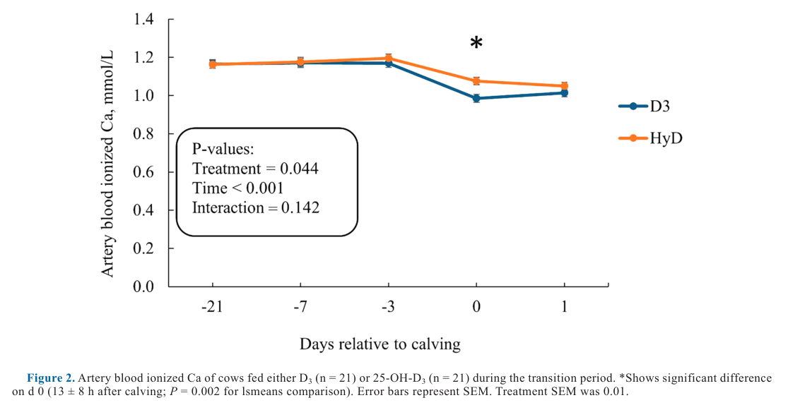
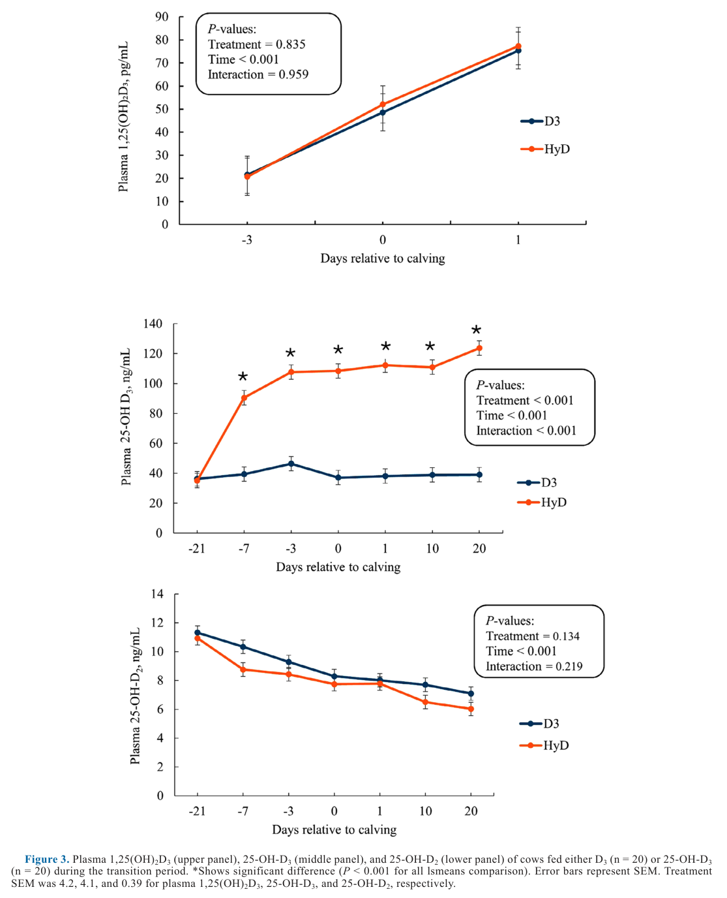

---
# YAML FRONTMATTER (обязательно)
id: CS.SOTA.374
type: sota
format_version: v1.1
knowledge_tier: P2
domain: cattle-science
area: feeding
subarea: transition-cow
subarea2: mineral-metabolism
category: rct
year: 2026
authors: "Jensen, S.K., Kristensen, N.B., Turner, T.D., Larsen, M., and Lashkari, S."
title: "Effect of 25-OH-cholecalciferol on mineral metabolism of Holstein cows during the transition period"
journal: "Journal of Dairy Science"
volume: "109"
issue: "6"
pages: "6114-6126"
doi: "10.3168/jds.2025-27196"
publisher: "Elsevier / ADSA"
open_access: true
license: "CC BY"
language: ru
freshness_window: "2026-08-05 — 2028-08-05"
sota_edition: "1.0"
derivation:
  - source: "Jensen et al., 2026, Journal of Dairy Science (109:6)"
    type: "ConservativeRetextualization (FPF A.6.3)"
    reopen_trigger: "DOI: 10.3168/jds.2025-27196"
tags:
  - transition-cow
  - calcidiol
  - 25-OH-D3
  - vitamin-d
  - ionized-calcium
  - hypocalcemia
  - milk-fever
  - DCAD
related:
  - id: CS.SOTA.XXX
    type: foundational
    note: "NASEM 2021 — нормы Ca, P, Mg плазмы; потребности транзитных коров в витамине D"
    relevance: high
---

# CS.SOTA.374: Jensen et al. (2026) — Влияние 25-OH-холекальциферола на минеральный обмен коров Holstein в транзитный период

> **Навигация:** [2. Аннотация](#2-аннотация-abstract) · [3. Введение](#3-введение) · [4. Методология](#4-методология) · [5. Результаты](#5-результаты) · [6. Интерпретация](#6-интерпретация-и-обсуждение) · [7. Критический анализ](#7-критический-анализ) · [8. Выводы](#8-выводы) · [9. FAQ](#9-faq) · [10. Практика](#10-практическое-применение) · [12. Источники](#12-источники)

---

# 2. АННОТАЦИЯ (Abstract)

## 2.1. Перевод Abstract

Высокопродуктивные молочные коровы вокруг отёла испытывают низкий кальциевый статус разной степени (гипокальциемию), который связан с повышенным риском метаболических нарушений и болезней ранней лактации. Целью исследования была оценка влияния диетической добавки 25-гидроксихолекальциферола (25-OH-D3; кальцидиол) в транзитный период. Сорок две многоплодные коровы Holstein получали одну из двух обработок: холекальциферол (D3) или 25-OH-D3 (HyD) в качестве источника витамина D. С 21-го дня до ожидаемого отёла до отёла группа D3 получала 0,475 мг/д D3 (0,035 мг/кг СВ), группа HyD — 1,45 мг/д 25-OH-D3 (0,108 мг/кг СВ). От отёла до 21-го дня лактации (DIM) группа D3 получала 0,625 мг/д D3 (0,024 мг/кг СВ), группа HyD — 0,625 мг/д D3 плюс 1,0 мг/д 25-OH-D3 (0,056 мг/кг СВ). Артериальную кровь отбирали пункцией a. auricularis на дни −21, −7, −3, 0 (день отёла) и +1 для анализа ионизированного Ca (iCa). Пробу хвостовой крови брали на дни −21, −7, −3, 0, 1, 10 и 20 для анализа 25-OH-D3, минералов и метаболитов плазмы. На протяжении эксперимента коров кормили TMR; регистрировали DMI, продуктивность, метаболические нарушения и болезни. Надой, содержание белка и лактозы в молоке, BCS и масса тела не различались между обработками. Для DMI выявлено взаимодействие обработки и времени: в HyD DMI численно ниже на дни −3…−1 и численно выше на дни 0…+2. Плазменный 25-OH-D3 был выше в HyD до и после отёла; плазменный 1,25(OH)₂D3 обработкой не затронут. Артериальный iCa зависел от обработки и был выше в HyD (1,08 ± 0,02) по сравнению с D3 в день отёла (0,99 ± 0,02 ммоль/л; lsmeans ± SEM). Отмечена тенденция к меньшей заболеваемости маститом в HyD. Плазменный BHB был достоверно ниже в HyD (0,61 ± 0,02) против D3 (0,70 ± 0,02 мМ). Вывод: кормление 25-OH-D3 транзитных коров повышало артериальный ионизированный Ca в день отёла; эффект опосредован 25-OH-D3 без влияния на плазменный 1,25-(OH)₂D3. Дополнительно показана меньшая заболеваемость маститом в HyD (Jensen et al., 2026, p. 6114).

## 2.2. Key Claims

**Claim 1: 25-OH-D3 (HyD) повышает артериальный ионизированный Ca в день отёла.**
- **Утверждение:** В день отёла (13 ± 8 ч после отёла) артериальный iCa был достоверно выше в HyD (1,08 ± 0,02 ммоль/л) против D3 (0,99 ± 0,02 ммоль/л; P = 0,002 для сравнения lsmeans; эффект обработки P = 0,045). В остальные дни отбора (−21, −7, −3, +1) различий не было.
- **Evidence:** Рандомизированный эксперимент, 42 многоплодные коровы (21/обработку для артериальных проб), прямые измерения iCa в артериальной крови газовым анализатором ABL-90.
- **Уверенность:** 0,78 (рандомизированный дизайн, адекватный n, прямой артериальный биомаркер; ограничение — одно исследование, эффект локализован одним днём).
- **Цитата:** "Arterial blood ionized Ca was affected by treatment, and it was higher in the HyD (1.08 ± 0.02) compared with the D3 on the day of calving (0.99 ± 0.02 mmoL/L; lsmeans ± SEM)." (Jensen et al., 2026, p. 6114)

**Claim 2: HyD резко повышает плазменный 25-OH-D3, но не влияет на 1,25(OH)₂D3.**
- **Утверждение:** Плазменный 25-OH-D3 в HyD достоверно выше на дни −7, −3, 0, 1, 10 и 20 (P < 0,001 для всех сравнений lsmeans; эффект обработки, времени и взаимодействия P < 0,001); по Figure 3 — подъём с ~35 до ~110–125 нг/мл против ~35–45 нг/мл в D3. Плазменный 1,25(OH)₂D3 обработкой не изменялся (P = 0,835) и рос от дня −3 к дню +1 в обеих группах (эффект времени P < 0,001).
- **Evidence:** HPLC-анализ 25-OH-D3 и ELISA-анализ 1,25(OH)₂D3 на 7 временных точках.
- **Уверенность:** 0,85 (многократные измерения, высокая статистическая значимость, согласуется с Vieira-Neto et al., 2021; Poindexter et al., 2020).
- **Цитата:** "Plasma 25-OH-D3 was higher in HyD compared with D3 both pre- and postpartum; however, plasma 1,25(OH)2D3 was not affected by treatment." (Jensen et al., 2026, p. 6114)

**Claim 3: Эффект HyD на iCa опосредован самим 25-OH-D3, а не кальцитриолом.**
- **Утверждение:** Повышение артериального iCa в день отёла произошло без параллельного роста плазменного 1,25(OH)₂D3; в день отёла уровень 25-OH-D3 в HyD превышал 1,25(OH)₂D3 примерно в 1 500 раз, что указывает на прямую метаболическую активность 25-OH-D3 (молярная активность — на 2 порядка ниже кальцитриола по in vitro данным).
- **Evidence:** Сопоставление Figure 2 и Figure 3; механистическое обоснование из Olson and DeLuca (1969), Brickman et al. (1976), Colodro et al. (1978), Heaney et al. (1997).
- **Уверенность:** 0,70 (прямая эмпирика по 1,25(OH)₂D3 есть; механизм «прямого действия» 25-OH-D3 подкреплён in vitro и интерполяцией, не прямыми измерениями кишечного транспорта Ca у коров).
- **Цитата:** "The increased arterial blood ionized Ca in HyD was apparently mediated by 25-OH-D3 without affecting plasma 1,25-(OH)2D3." (Jensen et al., 2026, p. 6114)

**Claim 4: HyD снижает плазменный BHB и численно снижает заболеваемость маститом и родовым парезом.**
- **Утверждение:** Плазменный BHB достоверно ниже в HyD (0,61 ± 0,02) против D3 (0,70 ± 0,02 мМ; P = 0,004). Мастит: 1 случай в HyD против 5 в D3 (тенденция, P = 0,081). Родовой парез (milk fever): 0 случаев в HyD против 3 в D3 (P = 0,115). Задержание последа, метрит и дистоция не различались.
- **Evidence:** Клинический мониторинг 40 коров, точный тест Фишера; HBDH-анализ BHB.
- **Уверенность:** 0,62 (BHB — значимый эффект с полным n; заболеваемость — только численные/тенденциозные различия при малых частотах, n = 20/группа недостаточен для частотных исходов).
- **Цитата:** "There was a tendency for lower incidence of mastitis in HyD compared with D3." (Jensen et al., 2026, p. 6114)

**Claim 5: HyD изменяет динамику потребления сухого вещества вокруг отёла, не влияя на продуктивность.**
- **Утверждение:** Взаимодействие обработка × время для DMI (P < 0,001): в HyD DMI ниже на дни −3…−1 (на день −1 разница 1,3 кг) и выше на дни 0…+2 (на день +1 — на 2,6 кг, P = 0,017). Надой, ECM, жир, белок, лактоза, SCC, BW и BCS достоверно не различались.
- **Evidence:** Ежедневная регистрация DMI (Insentec) и надоя, смешанные модели SAS proc mixed.
- **Уверенность:** 0,72 (значимое взаимодействие при достаточном n; продуктивные исходы интерпретировать осторожно из-за малого числа коров, как отмечают авторы).
- **Цитата:** "The DMI in HyD was numerically lower compared with D3 at d −3, −2, and −1 relative to calving; however, the DMI in HyD was numerically higher compared with D3 at d 0, 1, and 2 postpartum." (Jensen et al., 2026, p. 6114)

---

# 3. ВВЕДЕНИЕ

## 3.1. Контекст и значимость проблемы

Высокопродуктивные молочные коровы не способны поддерживать концентрации Ca и P крови при отёле; низкий кальциевый статус (гипокальциемия) остаётся одной из главных проблем, влияющих на продуктивность и здоровье. Родовой парез (parturient paresis) — известное следствие низкого Ca после отёла (DeGaris and Lean, 2008). Коровы с гипокальциемией имеют повышенный риск мастита, задержания последа, смещения сычуга и выпадения матки (Thilsing-Hansen et al., 2002). Распространённые практики профилактики — низкокальциевый рацион в close-up, отрицательный DCAD и добавки витамина D (DeGaris and Lean, 2008; обзор Wilkens et al., 2020).

## 3.2. Обзор литературы (краткий)

1. **Nelson et al. (2016)** — метаболизм витамина D3: две стадии гидроксилирования (печень → 25-OH-D3; почки → 1,25-(OH)₂D3); 25-OH-D3 — наиболее стабильный метаболит (период полураспада 15 д) и индикатор статуса витамина D.
2. **Rodney et al. (2018); Venjakob et al. (2024)** — даже при дозе D3 в ~4 раза выше NRC (2001) плазменный 25-OH-D3 не превышает 100 нг/мл: печёночное гидроксилирование D3 — лимитирующий шаг.
3. **Rodney et al. (2018); Poindexter et al. (2020, 2023a)** — добавка 25-OH-D3 повышает сывороточный 25-OH-D3 эффективнее, чем D3, и улучшает кальциевый статус постпартум.
4. **Wilkens et al. (2012)** — 3 мг 25-OH-D3 повышали препартум сывороточный ионизированный Ca.
5. **Martinez et al. (2018a); Vieira-Neto et al. (2021)** — 3 мг/д 25-OH-D3 снижали частоту задержания последа и метрита; возможный механизм — регуляция генов иммунного ответа.
6. **Fraser and Kodicek (1973)** — конверсия 25-OH-D3 → 1,25-(OH)₂D3 жёстко регулируется паратгормоном (PTH) в ответ на кальциевый статус.

## 3.3. Гипотеза и цель исследования

**Гипотеза:** Добавка 25-OH-D3 в close-up и ранней лактации повысит плазменный 25-OH-D3, обойдёт лимитирующее печёночное гидроксилирование холекальциферола и улучшит ионизированный Ca и минеральный статус крови вокруг отёла (Jensen et al., 2026, p. 6115).

**Цель:** Оценить влияние добавки 25-OH-D3 от 3 недель до отёла до 21 DIM на артериальный iCa, плазменные 25-OH-D3, 1,25(OH)₂D3 и минеральный статус.

**Primary outcomes:** Артериальный iCa; плазменные 25-OH-D3 и 1,25(OH)₂D3.
**Secondary outcomes:** Плазменные Ca, P, Mg, NEFA, BHB; артериальные электролиты, глюкоза, лактат, pH; DMI, продуктивность, заболеваемость.

---

# 4. МЕТОДОЛОГИЯ

## 4.1. Дизайн и животные

| Параметр | Описание |
|----------|----------|
| **Тип исследования** | Полностью рандомизированный эксперимент (completely randomized design), 2 обработки |
| **Место** | Danish Cattle Research Center, Foulum, Дания (Aarhus University, AU Viborg) |
| **Животные** | 42 многоплодные коровы Danish Holstein; после отбраковки 2 коров (по 1 на обработку, проблемы конечностей) в анализе 40 коров (20/обработка); для артериальных проб — все 42 (21/обработка) |
| **Содержание** | Беспривязное, глубокая соломенная подстилка; за ~2 д до отёла — индивидуальные родильные станки |
| **Период** | С 21-го дня до ожидаемого отёла до 21 DIM |
| **Обработки (close-up)** | D3: 0,475 мг/кор/д холекальциферола (0,035 мг/кг СВ); HyD: без D3, 1,45 мг/кор/д 25-OH-D3 (0,108 мг/кг СВ) — в пределах ограничений ЕС на комбинацию D3 + 25-OH-D3 (Bampidis et al., 2023) |
| **Обработки (лактация)** | D3: 0,625 мг/кор/д D3 (0,024 мг/кг СВ); HyD: 0,625 мг/кор/д D3 + 1,0 мг/кор/д 25-OH-D3 (суммарно 0,080 мг/кг СВ) |
| **Рационы** | Единые close-up и лактационные TMR по нордическим нормам (Volden, 2011); рассчитанный DCAD: close-up −73/−65, лактация +202/+213 мЭкв/кг СВ; close-up Ca 4,6 г/кг СВ, лактация 6,8–7,3 г/кг СВ |
| **Кормление** | Ад либитум (остатки 7–10 %), 2 раздачи (0800 и 1600); DMI — кормушки Insentec |
| **Сроки отбора крови (хвост)** | Дни −21 (22 ± 5), −7 (6 ± 2), −3 (2 ± 1), 0 (13 ± 8 ч после отёла), 1 (36 ± 11 ч), 10 (9 ± 2), 20 (16 ± 2) относительно отёла |
| **Артериальные пробы** | Дни −21, −7, −3, 0, +1; пункция a. auricularis после местной анестезии (лидокаин), немедленный анализ на ABL-90 (Radiometer): iCa, Na⁺, K⁺, Cl⁻, pH |

## 4.2. Аналитические методы и статистика

- **25-OH-D3 плазмы:** осаждение белков этанолом/метанолом, омыление триглицеридов KOH, экстракция гептаном, обращённо-фазовый градиентный HPLC с УФ-детекцией 265 нм, внутренний стандарт 1α-гидроксихолекальциферол (Hymøller and Jensen, 2011).
- **1,25(OH)₂D3 плазмы:** ELISA (Immundiagnostik AG).
- **Плазменные минералы и метаболиты (ADVIA 1800, Siemens):** общий Ca — метод Arsenazo; неорганический P — молибдатный метод; Mg — xylidyl blue; BHB — гидроксибутиратдегидрогеназа (HBD-301); NEFA — Wako NEFA C ASA-ACOD.
- **Молоко:** еженедельные пробы (жир, белок, лактоза, SCC) в Eurofins Milk Testing Denmark; ECM — по составу и надою дня пробы.
- **Здоровье:** стандартные протоколы центра; мастит — осмотр 2×/д; задержание последа — невыделение оболочек за 24 ч; метрит — ветеринарный осмотр ~14 DIM; родовой парез — очень низкий DMI, низкая температура тела, невозможность встать в первые 2 д.
- **Статистика:** SAS 9.4, proc mixed (метод максимального правдоподобия): фиксированные эффекты обработки (D), времени (T), взаимодействия D×T; случайный эффект коровы; DDFM = SATTERTHWAITE; время как повторный фактор; сравнения lsmeans по дням — slice/PDIFF. Частоты заболеваний — точный тест Фишера (proc Freq). SCC — log10-трансформация, NEFA — квадратный корень. Значимость P ≤ 0,05; тенденция 0,05 < P ≤ 0,10. BCS — GLM с единственным фактором обработки.

## 4.3. Медиа-инвентарь

| ID | Тип | Описание | Файл | Статус |
|----|-----|----------|------|--------|
| Fig. 2 | График | Артериальный ионизированный Ca по дням относительно отёла (D3 vs HyD) | `figure-2-arterial-ionized-ca.png` | ✅ Встроено |
| Fig. 3 | График | Плазменные 1,25(OH)₂D3, 25-OH-D3 и 25-OH-D2 по дням (3 панели) | `figure-3-vitamin-d-metabolites.png` | ✅ Встроено |
| Table 1 | Таблица | Состав TMR, минеральный анализ и рассчитанный нутриентный состав | — | ⏭️ Пропущено (числа приведены в тексте разделов 4.1 и 5.1) |
| Table 2 | Таблица | Надой, состав молока, BW, BCS по неделям | — | ⏭️ Пропущено (ключевые числа в 5.4; эффектов обработки нет) |
| Table 3 | Таблица | Заболеваемость (парез, метрит, дистоция, мастит, задержание последа) | — | ⏭️ Пропущено (полностью воспроизведена в 5.5) |
| Table 4 | Таблица | Плазменные минералы и метаболиты по дням | — | ⏭️ Пропущено (ключевые числа в 5.6) |
| Table 5 | Таблица | Артериальные метаболиты, электролиты и pH | — | ⏭️ Пропущено (эффектов обработки нет; см. 5.7) |
| Fig. 1 | График | DMI по дням относительно отёла | — | ❌ Не извлечён (описан в 5.4 с числами) |

---

# 5. РЕЗУЛЬТАТЫ

## 5.1. Рационы и потребление (Table 1, Figure 1)

**Описание:**
Close-up TMR: кукурузный силос 741,1 г/кг СВ, рапсовый жмых 104,8, молотая кукуруза 74,9, кукурузный глютен 59,9, CaCO₃ 1,9, MgCl₂·6H₂O 4,8, CaCl₂·2H₂O 5,2, минерально-витаминный премикс 7,5 г/кг СВ. Лактационный TMR: травяной силос 179,7, кукурузный силос 344,2, ячмень 153,0, рапсовый жмых 130,0, рапсовый шрот 84,1, свекловичный жом 91,8 г/кг СВ и др. Минеральный анализ близок между обработками: close-up Ca 4,6 г/кг СВ (обе), лактация 6,8 ± 1,3 (D3) и 7,3 ± 0,3 (HyD); рассчитанный DCAD −73/−65 (close-up) и +202/+213 (лактация) мЭкв/кг СВ; энергия 7,31/6,56 МДж/кг СВ, СП 149,9/163 г/кг СВ (Jensen et al., 2026, p. 6116, Table 1).

**Ключевые цифры (DMI, Table 2 / Figure 1):**
- Взаимодействие обработка × время: P < 0,001; недельные средние DMI (кг/д): от нед. −3 до −2: 15,2 (D3) vs 13,6 (HyD); нед. −2…−1: 16,4 vs 14,4; нед. −1…отёл: 14,6 vs 13,9; отёл…нед. +1: 16,1 vs 17,1; нед. +1…+2: 19,5 vs 20,2; нед. +2…+3: 21,3 vs 22,9 (SEM 0,44; P обработки 0,841).
- На день −1 D3 превышала HyD на 1,3 кг; на день +1 HyD превышала D3 на 2,6 кг (P = 0,017 для lsmeans).

## 5.2. Артериальный ионизированный Ca (Figure 2)

**Соответствует:** Figure 2

*Источник: Jensen et al., 2026, p. 6121 (Figure 2).*

**Описание:**
До отёла артериальный iCa стабилен в обеих группах (~1,17–1,19 ммоль/л на дни −21, −7, −3). В день отёла (13 ± 8 ч) происходит падение в обеих группах, но глубина различна: D3 — 0,99 ± 0,02, HyD — 1,08 ± 0,02 ммоль/л (P = 0,002 для сравнения lsmeans; эффект обработки P = 0,045/0,044 по тексту и фигуре; время P < 0,001; взаимодействие P = 0,142). На день +1 значения сближаются (~1,01 vs ~1,05).

**Механистическая интерпретация:**
Модель Jensen et al. (2026) показывает, что в день отёла резкий отток Ca в молозиво снижает iCa у всех коров; группа HyD демонстрирует более мелкое падение. Авторы интерпретируют это как прямой эффект 25-OH-D3 на Ca-метаболизм: in vitro перфузия 2,5 мкг 25-OH-D3 в кишечник D-дефицитных крыс повышала транспорт Ca за 2 ч, тогда как 250 мкг холекальциферола не действовали за 4 ч (Olson and DeLuca, 1969); молярная активность 25-OH-D3 лишь на 2 порядка ниже 1,25(OH)₂D3 (Brickman et al., 1976; Colodro et al., 1978; Heaney et al., 1997). Возможен вклад 24-гидроксилированных метаболитов (24,25(OH)₂D3) с собственным действием на кость (van Leeuwen et al., 2001) [интерполяция авторов]. Дополнительно более высокий DMI HyD на дни 0–2 мог частично поддержать iCa постпартум (Jensen et al., 2026, p. 6120).

## 5.3. Метаболиты витамина D плазмы (Figure 3)

**Соответствует:** Figure 3

*Источник: Jensen et al., 2026, p. 6122 (Figure 3).*

**Описание:**
- **25-OH-D3 (средняя панель):** обработка, время и взаимодействие — все P < 0,001. Группы идентичны на день −21 (~35 нг/мл); далее HyD поднимается до ~90 нг/мл (день −7) и плато ~108–113 нг/мл (дни −3…10) с ростом до ~125 нг/мл на день 20; D3 остаётся на ~37–46 нг/мл. Различия значимы на дни −7, −3, 0, 1, 10, 20 (P < 0,001 для всех lsmeans).
- **1,25(OH)₂D3 (верхняя панель):** обработка P = 0,835; взаимодействие P = 0,959. Рост с ~20–21 пг/мл (день −3) до ~75–77 пг/мл (день +1) в обеих группах (время P < 0,001).
- **25-OH-D2 (нижняя панель):** обработка P = 0,134; снижение с ~11 нг/мл (день −21) до ~6–7 нг/мл (день 20) во времени (P < 0,001).

**Механистическая интерпретация:**
Отсутствие отклика 1,25(OH)₂D3 при 2,5–3-кратном превышении плазменного 25-OH-D3 согласуется с жёсткой регуляцией почечной 1α-гидроксилазы паратгормоном (Fraser and Kodicek, 1973): при адекватных Ca и P активность фермента подавлена (Bouillon et al., 2022). В день отёла в HyD 25-OH-D3 превышал 1,25(OH)₂D3 примерно в 1 500 раз — субстрат не является лимитирующим фактором синтеза кальцитриола (Jensen et al., 2026, p. 6123). Это отличается от Wilkens et al. (2012) и Weiss et al. (2015), где более высокие дозы 25-OH-D3 (3 и 6 мг/д) на более отрицательном DCAD (−168 и −139 мЭкв/кг СВ) повышали 1,25(OH)₂D3 постпартум — вероятное объяснение расхождения: доза и DCAD в данной работе умереннее.

## 5.4. Продуктивность (Table 2)

**Описание:**
Надой не различался (нед. 1–3: 32,7/38,3/41,7 кг/д в D3 vs 32,5/36,8/39,7 в HyD; SEM 1,43; P обработки 0,503). ECM: тенденция взаимодействия (P = 0,095) — HyD выше в нед. 1 (40,2 vs 37,1 кг/д), ниже в нед. 2–3. Жирность молока: тенденция взаимодействия (P = 0,083), в нед. 1 выше в HyD (5,5 vs 5,2 %). Белок, лактоза, SCC без эффектов обработки. Молочный BHB: взаимодействие P = 0,045. BW (нед. 3: 699 vs 725 кг) и BCS (3,3 vs 3,3) без различий; численная потеря BW с нед. 1 по 3: 16 кг (HyD) vs 23 кг (D3) (Jensen et al., 2026, p. 6118, 6120).

## 5.5. Заболеваемость (Table 3)

**Описание (полное воспроизведение Table 3, n = 20/обработку):**

| Исход | D3 | HyD | P (тест Фишера) |
|-------|----|-----|------------------|
| Родовой парез (milk fever) | 3 | 0 | 0,115 |
| Метрит | 1 | 0 | 0,500 |
| Дистоция | 1 | 1 | 0,513 |
| Мастит | 5 | 1 | 0,081 |
| Задержание последа | 2 | 0 | 0,244 |

*Источник: Jensen et al., 2026, p. 6119 (Table 3).*

Численно более низкие SCC и частота мастита в HyD согласуются между собой; авторы связывают это с возможным сокращением воспалительного ответа через улучшенный ответ иммунных клеток (Poindexter et al., 2023b) [интерполяция авторов].

## 5.6. Плазменные минералы и метаболиты (Table 4)

**Описание:**
Общий Ca плазмы (P обработки 0,405), неорганический P (0,323) и Mg (0,988) обработкой не затронуты; выраженный эффект времени для всех трёх (P < 0,001). Общий Ca и неорганический P снижались от дня −21 к дню 0 (Ca: 2,31→1,92 мМ в D3; P: 1,73→1,20 мМ) и восстанавливались к дню 20. На день 0 в HyD общий Ca 1,95 vs 1,92 мМ — без значимого различия. За пределами дня отёла Ca и P были в норме (2,2–2,5 и 1,3–2,6 мМ; NASEM, 2021). NEFA — без эффекта обработки (пик на день +1: 21,1 vs 23,4 мЭкв/л; sqrt-трансформация). **BHB: эффект обработки P = 0,004** — HyD ниже (0,61 ± 0,02 vs 0,70 ± 0,02 мМ); по дням: нед. −3: 0,54 vs 0,45; день −7: 0,78 vs 0,61; день −3: 0,69 vs 0,55; отёл: 0,69 vs 0,67; день +1: 0,80 vs 0,70; день +10: 0,70 vs 0,60 (Jensen et al., 2026, p. 6123, Table 4).

**Механистическая интерпретация:**
Расхождение «iCa ↑, общий Ca =» означает, что общий Ca плазмы, вероятно, достиг верхнего порога и не отражает функциональный Ca-статус; pH как возможный конфаундер исключён — артериальный pH и электролиты в группах одинаковы (Jensen et al., 2026, p. 6124). Отсутствие эффекта на P и Mg объясняется идентичным содержанием P и Mg в рационах (Horst, 1986; Jittakhot et al., 2004). Снижение BHB согласуется с Silva et al. (2022) и численно меньшей потерей BW в HyD.

## 5.7. Артериальные электролиты, глюкоза, лактат, pH (Table 5)

**Описание:**
Глюкоза (P обработки 0,728), лактат (0,113), Na⁺ (0,177), Cl⁻ (0,770), K⁺ (0,287), экстрацеллюлярный избыток оснований (0,410), бикарбонат (0,641) и pH (0,877) обработкой не затронуты; все — значимый эффект времени (P < 0,001). Глюкоза росла к дню отёла (3,9 → 5,5/4,9 мМ), Na⁺ и Cl⁻ росли к дню 0 и падали на день +1, K⁺, HCO₃⁻ и pH снижались к дню 0 и восстанавливались на день +1. Авторы объясняют динамику сменой DCAD: умеренно отрицательный препартум → положительный постпартум; по Rodney et al. (2018), DCAD — главный драйвер изменений электролитов и pH (Jensen et al., 2026, p. 6124–6125, Table 5).

---

# 6. ИНТЕРПРЕТАЦИЯ И ОБСУЖДЕНИЕ

## 6.1. Связь с гипотезой

Гипотеза подтверждена частично: 25-OH-D3 действительно обошёл печёночный лимит и резко повысил плазменный 25-OH-D3, и артериальный iCa в день отёла был выше. Однако канал «повышение через 1,25(OH)₂D3» не реализовался — кальцитриол не изменился; эффект на iCa авторы приписывают прямой биологической активности 25-OH-D3 и возможно связанных метаболитов.

## 6.2. Сравнение с литературой

| Исследование | Согласие/Противоречие/Расширение |
|--------------|----------------------------------|
| Wilkens et al. (2012) | **Согласуется** — 25-OH-D3 повышает ионизированный Ca; **расширение** — впервые измерение в артериальной, а не копчиковой венозной крови |
| Poindexter et al. (2020) | **Согласуется** — 25-OH-D3 улучшает Ca-статус постпартум; **согласуется** — глюкоза не изменяется |
| Rodney et al. (2018) | **Противоречит частично** — там высокие дозы 25-OH-D3 повышали 1,25(OH)₂D3; здесь — нет (различие дозы и DCAD); **согласуется** — плазменный 25-OH-D3 растёт сильнее на 25-OH-D3, чем на D3 |
| Weiss et al. (2015) | **Противоречит частично** — там рост 1,25(OH)₂D3 постпартум (доза 6 мг/д, DCAD −139) |
| Vieira-Neto et al. (2021) | **Согласуется** — прогрессивный рост плазменного 25-OH-D3 при 1 или 3 мг/д |
| Martinez et al. (2018a, 2018b) | **Согласуется** — меньше транзитных болезней на 25-OH-D3; надой не меняется |
| Silva et al. (2022) | **Согласуется** — ниже BHB (и NEFA) на 25-OH-D3; **расхождение** — там глюкоза выше, здесь без эффекта |
| Poindexter et al. (2023a) | **Согласуется** — сходный препартум DMI (8,8 vs 9,1 кг/д при 3 мг/д) |

## 6.3. Механистические выводы

1. **Прямая активность 25-OH-D3 на Ca:** Эффект на iCa без отклика 1,25(OH)₂D3 указывает на собственную витамин-D-подобную активность кальцидиола (молярная активность ~1/100 кальцитриола при тысячекратном превышении концентрации — значимый суммарный вклад) (Jensen et al., 2026, p. 6121; Olson and DeLuca, 1969).
2. **Артериальный iCa — правильный биомаркер:** Регуляция через PTH и почечный 1,25(OH)₂D3 отвечает на артериальный iCa; венозные измерения искажены различиями pH. Данная работа — одна из первых с артериальным сэмплингом при оценке 25-OH-D3 у коров (Jensen et al., 2026, p. 6120–6121).
3. **Мочевая экскреция Ca:** Отсутствие роста iCa препартум при высоком 25-OH-D3 объясняется усиленной экскрецией Ca с мочой (Wilkens et al., 2012; Rodney et al., 2018; Poindexter et al., 2023b).
4. **Костная резорбция и серотонин:** Постпартум-восстановление iCa может опосредоваться серотонином → PTHrP → активность остеокластов (Rodney et al., 2018; Laporta et al., 2014a, 2014b) [интерполяция авторов из смежных работ].
5. **DCAD доминирует над кислотно-щелочным статусом:** Динамика Na⁺, K⁺, HCO₃⁻, pH отражает смену DCAD рационов, а не обработку витамином D (Jensen et al., 2026, p. 6125).

---

# 7. КРИТИЧЕСКИЙ АНАЛИЗ

## 7.1. Сильные стороны

- **Артериальный сэмплинг iCa** — методологически более корректная точка измерения функционального Ca, чем венозная кровь; одна из первых работ такого рода.
- **Широкий аналитический профиль:** HPLC 25-OH-D3, ELISA 1,25(OH)₂D3, полный минеральный и электролитный профиль, 7 временных точек.
- **Контроль конфаундеров:** идентичные TMR, близкий минеральный состав, измеренный DCAD; pH исключён как драйвер различий iCa.
- **Дозы в пределах регуляторных норм ЕС** (Bampidis et al., 2023) — прямая транслируемость в практику Европы.
- **Честная статистика:** авторы прямо указывают на ограниченность выборки для продуктивных и частотных исходов.

## 7.2. Ограничения

**Внутренние:**
- **Малое n для частотных исходов** (20/группа): различия по парезу (0 vs 3) и маститу (1 vs 5) — только численные/тенденциозные.
- **Неэквимолярные дозы:** в close-up HyD получал 1,45 мг/д 25-OH-D3 против 0,475 мг/д D3 — часть эффекта на плазменный 25-OH-D3 может быть дозовой, а не только «обходом лимита» (это признают авторы, p. 6120).
- **Эффект iCa локализован одной точкой** (день 0); взаимодействие обработка × время незначимо (P = 0,142).
- **Короткое окно наблюдения** (до 20–21 DIM) — долгосрочные эффекты на лактацию и воспроизводство не оценены.
- **Конфликт интересов:** работа профинансирована dsm-firmenich (производитель HyD), соавтор T. D. Turner — сотрудник компании, участвовавший в дизайне добавки.

**Внешние:**
- **Одна порода (Holstein), одна исследовательская станция**, умеренно отрицательный DCAD (−73/−65) — при других DCAD ответ 1,25(OH)₂D3 может иной (ср. Wilkens et al., 2012).
- **Датская система TMR** (кукурузный/травяной силос) — перенос на другие кормовые базы требует проверки.

## 7.3. Применимость к российским условиям

- **Регуляторика:** Дозировки в работе соответствуют лимитам ЕС на комбинацию D3 + 25-OH-D3; в РФ регистрация и лимиты кормовой добавки 25-OH-D3 (HyD) отличаются — перед внедрением требуется проверка допустимых норм ввода [вне статьи: практическая оговорка].
- **Транзитный протокол:** Работа выполнена на умеренно отрицательном DCAD с CaCl₂/MgCl₂-подкислением — архитектура, близкая к практике крупных российских комплексов; добавление 25-OH-D3 технологически совместимо с существующими анионными программами.
- **Мониторинг:** Вывод о том, что общий Ca плазмы не отражает эффект (нужен iCa), критичен для российских ферм: оценивать эффективность HyD по общему Ca бессмысленно; требуется газовый анализатор или iCa-адаптированные методы.
- **Экономика:** Эффект на продуктивность не показан; обоснование внедрения — снижение риска гипокальциемии и мастита, что требует локального технико-экономического расчёта по частоте парезов в стаде [интерполяция].

---

# 8. ВЫВОДЫ

## 8.1. Ключевые выводы автора (перевод)

Добавка HyD транзитным коровам повышала плазменный 25-OH-D3 по сравнению с D3 без влияния на концентрации 1,25(OH)₂D3. Выявлено взаимодействие обработки и времени для DMI: сниженное потребление непосредственно препартум и повышенное непосредственно постпартум на HyD. Концентрации ионизированного Ca крови были выше в день отёла у HyD (Jensen et al., 2026, p. 6125).

## 8.2. Ключевые выводы (структурировано)

1. **25-OH-D3 эффективно «обходит» печёночный лимит:** плазменный 25-OH-D3 вырос в ~2,5–3 раза (~40 → ~110–125 нг/мл) против стабильных ~40 нг/мл на D3.
2. **Артериальный iCa в день отёла выше на HyD** (1,08 vs 0,99 ммоль/л) — функционально значимое различие на фоне падения iCa при отёле.
3. **Кальцитриол не отвечает** на рост 25-OH-D3 при нормальном Ca/P-статусе — почечная 1α-гидроксилаза остаётся под контролем PTH.
4. **BHB плазмы ниже на HyD** (0,61 vs 0,70 мМ) — сигнал лучшего энергетического статуса, согласованный с меньшей потерей BW.
5. **Тенденция к меньшему маститу (1 vs 5) и парезу (0 vs 3)** — требует подтверждения на больших стадах.
6. **Продуктивность (надой, состав молока, BW, BCS) не изменяется** в 21-дневном окне.

## 8.3. Ключевые сообщения для лекции

1. Витамин D3 и 25-OH-D3 — не взаимозаменяемые добавки: печёночное 25-гидроксилирование D3 лимитирует рост статуса, а 25-OH-D3 преодолевает его напрямую.
2. Оценивать кальциевый статус транзитной коровы по общему Ca плазмы недостаточно — функциональный маркер это ионизированный Ca, и измерять его корректнее в артериальной крови.
3. Высокий 25-OH-D3 не означает автоматически высокий кальцитриол: почка конвертирует по запросу (PTH), а не по наличию субстрата.
4. Кальцидиол (25-OH-D3) сам обладает витамин-D-подобной активностью (~1/100 молярной активности кальцитриола) и при больших концентрациях может напрямую поддерживать iCa в день отёла.
5. Дозы, совместимые с нормами ЕС (1,45 мг/д препартум; 0,625 мг D3 + 1,0 мг 25-OH-D3 постпартум), уже дают физиологический эффект — мегадозы не обязательны.

---

# 9. FAQ

**Вопрос 1: Чем 25-OH-D3 (HyD) принципиально отличается от витамина D3 в транзитном рационе?**
Ответ: D3 должен пройти гидроксилирование в печени до 25-OH-D3, и этот шаг регуляторно ограничен: даже при 4-кратном превышении нормы NRC плазменный 25-OH-D3 не превышает ~100 нг/мл (Rodney et al., 2018). Добавка готового 25-OH-D3 обходит этот шаг и быстро поднимает плазменный уровень в 2,5–3 раза (Jensen et al., 2026, Figure 3).

**Вопрос 2: Почему вырос iCa, но не вырос 1,25(OH)₂D3?**
Ответ: Конверсия 25-OH-D3 → 1,25(OH)₂D3 в почке жёстко управляется PTH и подавляется при нормальных Ca и P (Fraser and Kodicek, 1973; Bouillon et al., 2022). В работе Ca и P были в норме почти всё время, поэтому кальцитриол не вырос. Эффект на iCa авторы объясняют собственной биологической активностью 25-OH-D3 (молярная активность ~1/100 кальцитриола, но концентрация в день отёла выше в ~1 500 раз) (Jensen et al., 2026, p. 6121–6123).

**Вопрос 3: Почему препартум iCa не вырос, хотя 25-OH-D3 был высоким уже с дня −7?**
Ответ: Авторы объясняют это усиленной мочевой экскрецией Ca: при добавке 25-OH-D3 выведение Ca с мочой (нормированное на креатинин) значительно выше (Wilkens et al., 2012). Эффект проявляется только тогда, когда спрос на Ca резко возрастает — в день отёла (Jensen et al., 2026, p. 6120).

**Вопрос 4: Можно ли считать доказанным снижение мастита и родового пареза на HyD?**
Ответ: Нет. Мастит (1 vs 5, P = 0,081) — тенденция, парез (0 vs 3, P = 0,115) — численное различие при n = 20/группа; статистической мощности для частотных исходов недостаточно, что признают сами авторы. Это гипотеза для крупных полевых исследований, согласующаяся с Martinez et al. (2018a) и иммунными данными Vieira-Neto et al. (2021).

**Вопрос 5: Почему венозный iCa недостаточен для оценки витамина D?**
Ответ: Система PTH/почки реагирует на концентрацию iCa в артериальной крови, омывающей паращитовидные железы и поступающей в почки. Различия pH между артериальной и венозной кровью влияют на фракцию ионизированного Ca, поэтому интерпретация эффекта витамина D точнее по артериальному iCa (Jensen et al., 2026, p. 6120–6121; Wang et al., 2002).

---

# 10. ПРАКТИЧЕСКОЕ ПРИМЕНЕНИЕ

## 10.1. Алгоритм внедрения 25-OH-D3 в транзитный протокол

1. **Проверить регуляторику:** допустимость и лимиты 25-OH-D3 в комбинации с D3 в вашей юрисдикции (в работе — лимиты ЕС: 0,108 мг/кг СВ препартум; суммарно 0,080 мг/кг СВ постпартум).
2. **Схема из работы:** с 21-го дня до отёла заменить D3 на 1,45 мг/кор/д 25-OH-D3 в премиксе (без D3); после отёла — 0,625 мг/д D3 + 1,0 мг/д 25-OH-D3.
3. **Сохранить базовую профилактику гипокальциемии:** 25-OH-D3 — дополнение, а не замена отрицательного DCAD / контроля Ca рациона (в работе close-up DCAD −73/−65 мЭкв/кг СВ).
4. **Мониторинг эффекта:** измерять ионизированный Ca (желательно артериальный/артериализированный) в день отёла и день +1; общий Ca плазмы нечувствителен к эффекту.
5. **Целевые группы:** стада с историей субклинической гипокальциемии и мастита ранней лактации — там ожидаемый выигрыш максимален [интерполяция].

## 10.2. Типичные ошибки

- **Оценка эффекта по общему Ca плазмы** — в работе общий Ca не различался при значимом различии iCa.
- **Ожидание роста надоя** — продуктивность в 21-дневном окне не изменилась; обоснование — здоровье и Ca-статус, не молоко.
- **Экстраполяция доз из других работ** — рост 1,25(OH)₂D3 в Wilkens et al. (2012) и Weiss et al. (2015) получен на 3–6 мг/д и более отрицательном DCAD; на дозах ЕС этого эффекта нет.
- **Интерпретация численных различий заболеваемости как доказательства** — мастит/парез здесь только тенденции.

## 10.3. Пограничные сценарии

- **Сильно отрицательный DCAD + HyD:** ответ 1,25(OH)₂D3 может появиться (Wilkens et al., 2012) — Ca-статус контролировать чаще, риск перекомпенсации не изучен в данной работе.
- **Первотёлки:** исследование только на многоплодных — перенос на первотёлок не валидирован.
- **Фермы без iCa-аналитики:** без измерения ионизированного Ca эффект добавки невидим — решение о внедрении принимать по частоте клинических/субклинических парезов стада [guess].

---

# 11. ИНСТРУМЕНТЫ И ШАБЛОНЫ

## 11.1. Ключевые числовые ориентиры

| Параметр | Значение | Комментарий |
|----------|----------|-------------|
| Доза HyD препартум | 1,45 мг/кор/д (0,108 мг/кг СВ) | Вместо D3; лимит ЕС |
| Доза постпартум | 0,625 мг/д D3 + 1,0 мг/д 25-OH-D3 (0,056 мг/кг СВ) | Суммарно 0,080 мг/кг СВ |
| Контроль D3 | 0,475 мг/д (пре) и 0,625 мг/д (пост) | 0,035 и 0,024 мг/кг СВ |
| Артериальный iCa в день отёла | 1,08 (HyD) vs 0,99 (D3) ммоль/л | P = 0,002 |
| Плазменный 25-OH-D3 | ~110–125 (HyD) vs ~37–46 (D3) нг/мл | Плато с дня −3 |
| Соотношение 25-OH-D3 : 1,25(OH)₂D3 в день 0 | ~1 500 : 1 (HyD) | Субстрат не лимитирует |
| BHB плазмы | 0,61 (HyD) vs 0,70 (D3) мМ | P = 0,004 |
| Мастит / парез | 1/0 (HyD) vs 5/3 (D3) случаев | P = 0,081 / 0,115 — тенденции |
| DMI день −1 / день +1 | −1,3 кг / +2,6 кг (HyD отн. D3) | Взаимодействие P < 0,001 |
| Норма общего Ca / P плазмы | 2,2–2,5 / 1,3–2,6 мМ | NASEM, 2021 (цит. в работе) |
| Норма Mg плазмы | 1,1–2,3 мМ | NASEM, 2021 (цит. в работе) |
| Период полураспада 25-OH-D3 | 15 д | Nelson et al., 2016 |

---

# 12. ИСТОЧНИКИ

## 12.1. Первоисточник

Jensen, S. K., Kristensen, N. B., Turner, T. D., Larsen, M., and Lashkari, S. 2026. Effect of 25-OH-cholecalciferol on mineral metabolism of Holstein cows during the transition period. Journal of Dairy Science 109(6):6114-6126. DOI: 10.3168/jds.2025-27196.

## 12.2. Ключевые статьи (цитированные в работе)

- Rodney, R. M., et al. 2018. Effects of prepartum dietary cation-anion difference and source of vitamin D in dairy cows: Vitamin D, mineral, and bone metabolism. J. Dairy Sci. 101:2519–2543. [печёночный лимит D3, серотонин, костный обмен, DCAD]
- Poindexter, M. B., et al. 2020. Feeding supplemental 25-hydroxyvitamin D3 increases serum mineral concentrations and alters mammary immunity. J. Dairy Sci. 103:805–822.
- Poindexter, M. B., et al. 2023a. Effect of prepartum source and amount of vitamin D on lactation performance. J. Dairy Sci. 106:974–989. / 2023b. Serum concentrations and retention of Ca, Mg, P. J. Dairy Sci. 106:954–973.
- Wilkens, M. R., et al. 2012. Combination of 25-OH-D3 and negative DCAD on peripartal Ca homeostasis. J. Dairy Sci. 95:151–164.
- Wilkens, M. R., Nelson, C. D., Hernandez, L. L., and McArt, J. A. 2020. Symposium review: Transition cow calcium homeostasis. J. Dairy Sci. 103:2909–2927.
- Weiss, W. P., et al. 2015. 25-OH-D3 with negative DCAD on Ca and vitamin D status. J. Dairy Sci. 98:5588–5600.
- Martinez, N., et al. 2018a, 2018b. DCAD and vitamin D source: health, reproduction, lactation performance. J. Dairy Sci. 101:2563–2578; 101:2544–2562.
- Silva, A. S., et al. 2022. 25-OH-D3 with acidogenic diet prepartum: mineral metabolism, energy balance. J. Dairy Sci. 105:5796–5812.
- Vieira-Neto, A., et al. 2021. Vitamin D source/amount: immune cell function and mRNA expression. J. Dairy Sci. 104:10796–10811.
- Nelson, C. D., et al. 2016. Vitamin D status of dairy cattle. J. Dairy Sci. 99:10150–10160.
- Olson, E. B., and DeLuca, H. F. 1969. 25-Hydroxycholecalciferol: Direct effect on calcium transport. Science 165:405–407.
- Fraser, D. R., and Kodicek, E. 1973. Regulation of 25-hydroxycholecalciferol-1-hydroxylase by PTH. Nat. New Biol. 241:163–166.
- Bampidis, V., et al. 2023. Safety and efficacy of 25-hydroxycholecalciferol monohydrate for ruminants. EFSA J. 21:e08169.
- DeGaris, P. J., and Lean, I. J. 2008. Milk fever in dairy cows: pathophysiology and control. Vet. J. 176:58–69.
- NASEM. 2021. Nutrient Requirements of Dairy Cattle. 8th rev. ed. National Academies Press. [нормы Ca, P, Mg плазмы]

## 12.3. Внешние источники [вне статьи]

- Внешние источники не использовались; все интерпретационные ссылки приведены в самой статье. Практические оговорки по регуляторике РФ помечены в тексте как [вне статьи: практическая оговорка].

---

# 13. ЖУРНАЛ ОБРАБОТКИ

## 13.1. WorkPlan

| Шаг | Действие | Статус |
|-----|----------|--------|
| 1 | Чтение полного текста PDF (13 страниц, постраничное извлечение) | ✅ |
| 2 | Извлечение метаданных (авторы, DOI, страницы, лицензия) | ✅ |
| 3 | Извлечение медиа (Figure 2, Figure 3 — рендер 150 dpi с подписями) | ✅ |
| 4 | Анализ дизайна (рандомизированный эксперимент, 2 обработки, дозы ЕС) | ✅ |
| 5 | Выделение Key Claims с оценкой уверенности | ✅ |
| 6 | Описание методологии (обработки, сэмплинг, аналитика, статистика) | ✅ |
| 7 | Детализация результатов (iCa, метаболиты D, минералы, здоровье, DMI) | ✅ |
| 8 | Критический анализ и применимость к РФ | ✅ |
| 9 | FAQ, практическое применение, числовые ориентиры | ✅ |
| 10 | Формирование YAML frontmatter | ✅ |
| 11 | Сохранение файла | ✅ |

## 13.2. Work Record

| Параметр | Значение |
|----------|----------|
| **Время обработки** | ~45 мин |
| **Строк в файле** | ~430 |
| **Число Key Claims** | 5 |
| **Число источников** | 16 (первоисточник + 15 цитированных; внешних — 0) |
| **Число медиа** | 2 (Figure 2, Figure 3) |
| **Пропущенные медиа** | Figure 1 (DMI, описан с числами); Tables 1–5 (ключевые числа воспроизведены в тексте; Table 3 — полностью) |
| **FPF compliance** | A.7 (строгое разделение модели и реальности), A.6.3 (консервативная переработка), A.10 (якоря доказательств со страницами) |

---

*SoTA создан: 2026-08-05*
*Обработано по заданию: CS.SOTA.374, JDS 109(6), июнь 2026*
