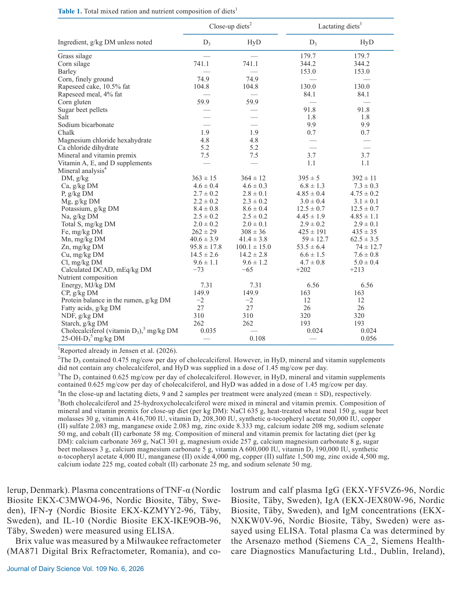
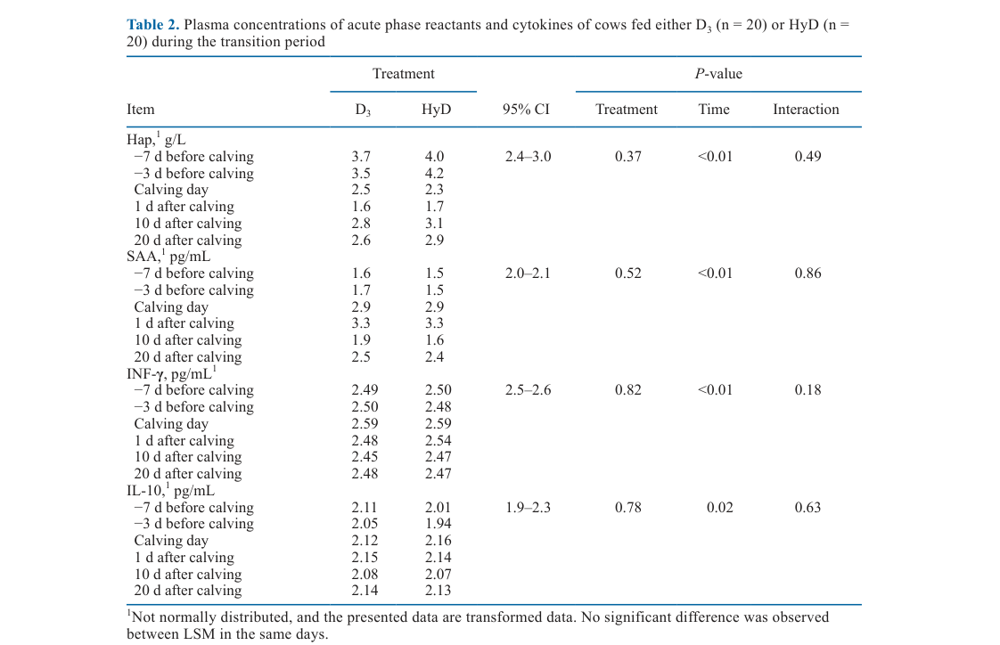
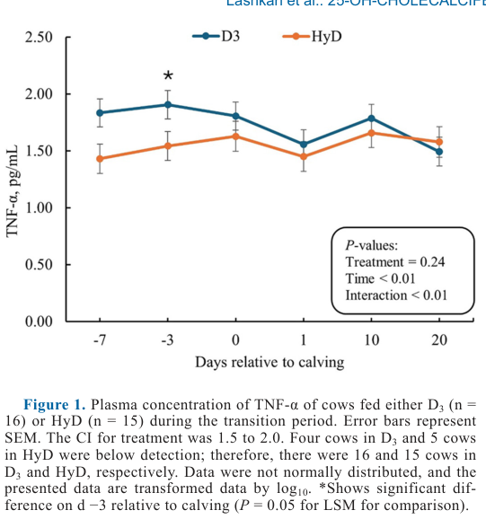
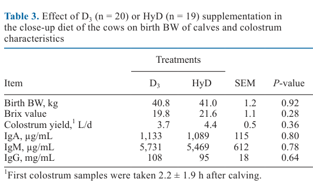
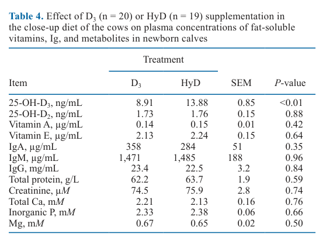
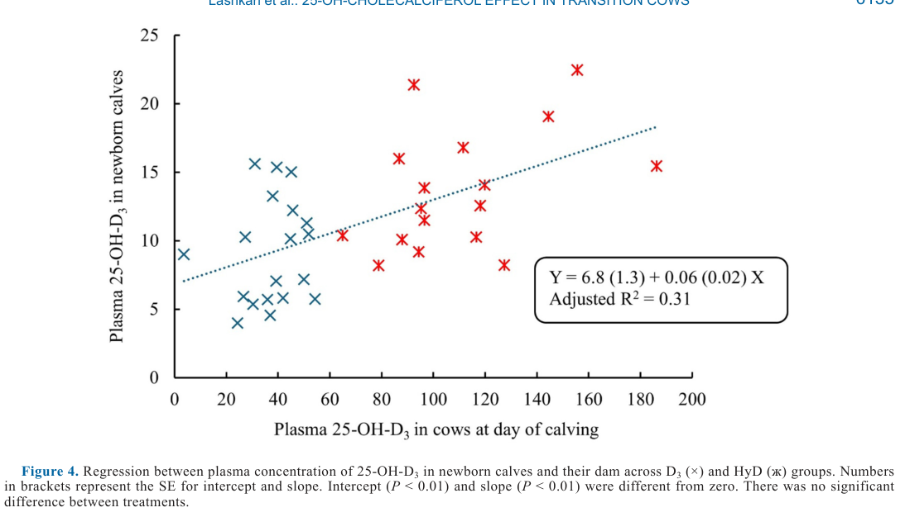

---
# YAML FRONTMATTER (обязательно)
id: CS.SOTA.375
type: sota
format_version: v1.1
knowledge_tier: P2
domain: cattle-science
area: feeding
subarea: transition-cow
subarea2: vitamin-d
category: field-study
year: 2026
authors: "Lashkari, S., Vestergaard, M., Kristensen, N. B., Turner, T. D., and Jensen, S. K."
title: "Effect of 25-OH-cholecalciferol supplementation on acute phase reactants, cytokines, and colostrum quality of Holstein cows during the transition period and plasma metabolites of newborn calves"
journal: "Journal of Dairy Science"
volume: "109"
issue: "6"
pages: "6127-6139"
doi: "10.3168/jds.2025-27582"
publisher: "Elsevier / ADSA"
open_access: true
license: "CC BY"
language: ru
freshness_window: "2026-08-05 — 2028-08-05"
sota_edition: "1.0"
derivation:
  - source: "Lashkari et al., 2026, Journal of Dairy Science (109:6)"
    type: "ConservativeRetextualization (FPF A.6.3)"
    reopen_trigger: "DOI: 10.3168/jds.2025-27582"
  - source: "Jensen et al., 2026, Journal of Dairy Science (109:6):6114-6126 — сопутствующая публикация того же эксперимента"
    type: "companion"
    relevance: "Данные по DMI, надою, 25-OH-D3 и 1,25(OH)2D3 плазмы коров, артериальному ионизированному Ca"
tags:
  - 25-hydroxycholecalciferol
  - vitamin-d
  - transition-cow
  - acute-phase-proteins
  - cytokines
  - colostrum
  - immunoglobulin
  - newborn-calf
related:
  - id: CS.SOTA.XXX
    type: foundational
    note: "NASEM 2021 — нормы витамина D, классификация гипокальциемии, рекомендуемый диапазон 25-OH-D3 (30–50 нг/мл)"
    relevance: high
  - id: CS.SOTA.XXX
    type: companion
    note: "Jensen et al., 2026 (JDS 109:6114–6126, doi 10.3168/jds.2025-27196) — минеральный обмен тех же коров: +130% плазменного 25-OH-D3, выше артериальный iCa в день отёла"
    relevance: high
---

# CS.SOTA.375: Lashkari et al. (2026) — Влияние добавки 25-OH-холекальциферола на белки острой фазы, цитокины и качество молозива коров Holstein в транзитный период и на метаболиты плазмы новорождённых телят

> **Навигация:** [2. Аннотация](#2-аннотация-abstract) · [3. Введение](#3-введение) · [4. Методология](#4-методология) · [5. Результаты](#5-результаты) · [6. Интерпретация](#6-интерпретация-и-обсуждение) · [7. Критический анализ](#7-критический-анализ) · [8. Выводы](#8-выводы) · [9. FAQ](#9-faq) · [10. Практика](#10-практическое-применение) · [12. Источники](#12-источники)

---

# 2. АННОТАЦИЯ (Abstract)

## 2.1. Перевод Abstract

Исследование оценивало влияние добавки 25-гидроксихолекальциферола (HyD) на (1) концентрации белков острой фазы, цитокинов и Ig в молозиве многоплодных коров Holstein от 3 недель до отёла до 21 дня лактации (DIM) и (2) концентрации жирорастворимых витаминов, Ig, минералов и метаболитов плазмы новорождённых телят. Сорок две коровы были распределены на получение холекальциферола (D3) или HyD. От 21 дня до ожидаемого отёла до отёла группа D3 получала 0.475 мг/д D3 (0.035 мг/кг СВ), группа HyD — 1.45 мг/д HyD (0.108 мг/кг СВ). От отёла до 21 DIM группа D3 получала 0.625 мг/д D3 (0.024 мг/кг СВ), группа HyD — 0.625 мг/д D3 плюс 1.0 мг/д HyD (0.056 мг/кг СВ, суммарно 0.080 мг/кг СВ). Пробы крови из хвостовой вены коров собирали в дни −7, −3, 0, 1, 10 и 20 относительно отёла для анализа жирорастворимых витаминов (A и E), белков острой фазы (гаптоглобин [Hap] и сывороточный амилоид A [SAA]) и цитокинов (TNF-α, IFN-γ и IL-10); кровь телят брали из яремной вены через 48 ± 3 ч после рождения. Для TNF-α плазмы коров выявлено взаимодействие обработки и времени: препартум концентрации были ниже у HyD по сравнению с D3, различие уменьшилось к отёлу и исчезло к 20 DIM. Эффекта обработки на Hap, SAA, IFN-γ и IL-10 не обнаружено. Концентрация 25-OH-D3 плазмы новорождённых телят группы HyD была выше, чем у телят группы D3 (13.9 и 8.9 нг/мл соответственно), при этом 25-OH-D2, витамин A и витамин E плазмы от обработки не зависели. Выявлена линейная связь между 25-OH-D3 плазмы телят и их матерей. Концентрации IgA, IgM и IgG молозива от обработки не зависели; в соответствии с этим IgA, IgM и IgG плазмы телят также не различались. Значимых различий по Ca и неорганическому P плазмы новорождённых телят не выявлено. В заключение: добавка HyD оказала ограниченное влияние на белки острой фазы и цитокины транзитных коров; добавка HyD в close-up период повысила 25-OH-D3 плазмы новорождённых телят без влияния на Ca и неорганический P; повышенный 25-OH-D3 не повлиял на концентрации Ig ни в молозиве, ни в плазме телят (Lashkari et al., 2026, p. 6127).

## 2.2. Key Claims

**Claim 1: HyD в close-up рационе повышает 25-OH-D3 плазмы новорождённых телят на 36 %, и статус телёнка линейно связан со статусом матери.**
- **Утверждение:** Плазменный 25-OH-D3 телят в 48 ч жизни: 13.88 (HyD) vs 8.91 (D3) нг/мл (SEM 0.85, P < 0.01); регрессия «телёнок–мать»: Y = 6.8 (1.3) + 0.06 (0.02) X, скорр. R² = 0.31, интерцепт и наклон P < 0.01.
- **Evidence:** Контролируемый эксперимент, 20 и 19 телят; HPLC-анализ; линейная регрессия по парам «корова–телёнок».
- **Уверенность:** 0.80 (значимый эффект при адекватном n; согласуется с Weiss et al., 2015; часть эффекта может идти через молозиво/переходное молоко — не измерялось).
- **Цитата:** "Plasma 25-OH-D3 concentration of newborn calves from HyD group was 36% greater than that of newborn calves in the D3 group (P < 0.01)." (Lashkari et al., 2026, p. 6132)

**Claim 2: HyD снижает плазменный TNF-α препартум, но не влияет на белки острой фазы и остальные цитокины.**
- **Утверждение:** Взаимодействие обработка × время для TNF-α (P < 0.01): на день −3 до отёла D3 > HyD (P = 0.05); к 20 DIM различие исчезло. Для Hap (P = 0.37), SAA (P = 0.52), IFN-γ (P = 0.82) и IL-10 (P = 0.78) эффекта обработки нет.
- **Evidence:** Смешанная модель с повторными измерениями (6 точек, −7…20 дней), 20 коров/обработку; трансформированные данные.
- **Уверенность:** 0.72 (одно исследование, n = 20/группа, 9 коров ниже предела детекции TNF-α; эффект ограничен одной точкой и исчезает постпартум).
- **Цитата:** "Plasma TNF-α concentration in cows was greater in the D3 group compared to the HyD group on d −3 relative to calving (P = 0.05 for LSM comparison)." (Lashkari et al., 2026, p. 6131)

**Claim 3: HyD не влияет на концентрации Ig в молозиве и в плазме телят.**
- **Утверждение:** Молозиво: IgA 1133 vs 1089 мкг/мл (P = 0.80), IgM 5731 vs 5469 мкг/мл (P = 0.78), IgG 108 vs 95 мг/мл (P = 0.64); Brix 19.8 vs 21.6 (P = 0.28). Плазма телят: IgA (P = 0.35), IgM (P = 0.96), IgG (P = 0.84) — без различий.
- **Evidence:** ELISA молозива (отбор 2.2 ± 1.9 ч после отёла) и плазмы телят (48 ± 3 ч).
- **Уверенность:** 0.75 (консистентные нулевые результаты по 3 изотипам в двух компартментах; согласуется с Poindexter et al., 2023 по IgA молозива; противоречит Martinez et al., 2018 по IgG — там DCAD −128 мЭкв/кг и доза 3 мг/д).
- **Цитата:** "The results of the present study showed no effect of treatment on the colostrum and plasma IgA, IgM, and IgG concentrations." (Lashkari et al., 2026, p. 6136)

**Claim 4: Повышенный 25-OH-D3 телят не меняет минеральный статус (Ca, P, Mg) в первые 48 ч жизни.**
- **Утверждение:** Общий Ca 2.21 vs 2.13 мМ (P = 0.76), неорганический P 2.33 vs 2.38 мМ (P = 0.66), Mg 0.67 vs 0.65 мМ (P = 0.50) у телят D3 и HyD соответственно.
- **Evidence:** Клинический анализатор (Arsenazo, молибдат, ксилидиловый синий); n = 20/19 телят.
- **Уверенность:** 0.70 (нулевой результат при умеренной мощности; интерпретация авторов — высокая доступность Ca и P из молозива маскирует роль 25-OH-D3).
- **Цитата:** "...despite the significant difference in plasma 25-OH-D3 concentrations, there was no significant difference in plasma Ca and inorganic P concentrations between the D3 and HyD groups in newborn calves." (Lashkari et al., 2026, p. 6136)

**Claim 5: Все новорождённые телята имеют 25-OH-D3 ниже рекомендованного для взрослых диапазона (30–50 нг/мл) — плацентарный барьер лимитирует транспорт.**
- **Утверждение:** Даже при +130 % плазменного 25-OH-D3 у коров группы HyD (Jensen et al., 2026) телята остаются на уровне ~14 нг/мл; низкий статус объясняется плацентарным барьером, низким содержанием липидов и недостатком связывающих белков у плода.
- **Evidence:** Сравнение с нормой NASEM (2021); механистические данные Bouillon et al. (1977) и Ashley et al. (2022) о плацентарной утилизации (лишь ~5 % 1,25(OH)2D3 достаётся плоду).
- **Уверенность:** 0.68 (наблюдение прямое, но оптимум для телят не установлен — порог 30–50 нг/мл экстраполирован со взрослых животных [интерполяция]).
- **Цитата:** "The results of the present study showed that all the newborn calves had a lower 25-OH-D3 than the recommended concentration in adult animals (Nelson et al., 2012, 2016b)." (Lashkari et al., 2026, p. 6136)

---

# 3. ВВЕДЕНИЕ

## 3.1. Контекст и значимость проблемы

Холекальциферол (витамин D3) — жирорастворимый витамин, стандартно добавляемый в рационы молочного скота; его метаболиты регулируют гомеостаз Ca и P (Nelson et al., 2010a). Конверсия D3 в 25-OH-D3 в печени лимитирована регуляторным механизмом: даже при 4-кратном превышении норм NRC (2001) плазменный 25-OH-D3 не превышал 100 нг/мл (Rodney et al., 2018). Добавка готового 25-гидроксихолекальциферола (HyD) эффективнее поднимает статус витамина D (Poindexter et al., 2020, 2023). При этом новорождённые телята рождаются с низким 25-OH-D3 (в среднем 11 нг/мл, диапазон 3–17 нг/мл; Nelson et al., 2016a) даже при достаточном статусе матери (54 нг/мл), что связано с плацентарным барьером для жирорастворимых витаминов и низким содержанием липидов в плазме новорождённых жвачных (Leat, 1967; Pazak and Scholz, 1996). Одновременно почти все коровы переживают воспаление в транзитный период независимо от здоровья (Humblet et al., 2006; Horst et al., 2021), а метаболиты витамина D (особенно 1,25(OH)2D3) участвуют в регуляции врождённого иммунитета: иммунные клетки экспрессируют 1α-гидроксилазу и VDR, что обеспечивает локальный синтез активной формы (Waters et al., 2001; Liu et al., 2006) (Lashkari et al., 2026, p. 6127–6128).

## 3.2. Обзор литературы (краткий)

1. **Rodney et al. (2018); Poindexter et al. (2020, 2023)** — HyD эффективнее D3 поднимает сывороточный 25-OH-D3 и 1,25(OH)2D3.
2. **Vieira-Neto et al. (2021); Silva et al. (2022)** — HyD в close-up повышает плазменный 25-OH-D3; отмена после отёла ведёт к истощению ниже 100 нг/мл (Guo et al., 2018).
3. **Nelson et al. (2010a, 2010b)** — интракринный путь витамина D в моноцитах и молочной железе при инфекции (iNOS, RANTES).
4. **Hewison (2012); Hoe et al. (2016)** — витамин D смещает баланс Th1/Th17 ↔ Th2/Treg и снижает провоспалительные цитокины ex vivo.
5. **Nelson et al. (2016a); Goff et al. (1982); Weiss et al. (2015)** — низкий витамин-D статус новорождённых телят и его связь со статусом матери.

## 3.3. Гипотеза и цель исследования

**Гипотеза:** Добавка HyD в транзитный период (от 21 дня до отёла до 21 DIM) улучшит показатели белков острой фазы и цитокинов за счёт поддержания плазменного 25-OH-D3 выше порога оптимальной иммунной функции, что отразится в более высоких концентрациях Ig в молозиве и, соответственно, в плазме телят; также HyD в close-up улучшит витамин-D статус новорождённых телят по сравнению с D3 (Lashkari et al., 2026, p. 6128).

**Цель:** Оценить влияние HyD на (1) белки острой фазы (Hap, SAA) и цитокины (TNF-α, IFN-γ, IL-10) транзитных коров и Ig молозива; (2) витамин-D статус, Ig, минералы и метаболиты плазмы новорождённых телят.

**Primary outcomes:** Hap, SAA, TNF-α, IFN-γ, IL-10 плазмы коров; IgA/IgM/IgG молозива; 25-OH-D3 плазмы телят.
**Secondary outcomes:** Витамины A и E плазмы коров и телят, 25-OH-D2, Ca, P, Mg, общий белок, креатинин, масса при рождении, Brix молозива.

---

# 4. МЕТОДОЛОГИЯ

## 4.1. Дизайн исследования

| Параметр | Описание |
|----------|----------|
| **Тип исследования** | Контролируемый кормовой эксперимент, 2 обработки, повторные измерения во времени |
| **Место** | Danish Cattle Research, Aarhus University, Research Centre Foulum, Дания; разрешение № 2020-15-0201-00709 |
| **Животные** | 42 многоплодные датские Holstein (30 второго отёла, 12 старше; parity 3 ± 1); 2 выбракованы (проблемы конечностей) → 40 в анализе (20/обработку); надой на последней неделе пред. лактации 31.9 (HyD) и 29.6 (D3) кг; МТ 723.8 и 738.1 кг |
| **Обработки** | Close-up: D3 0.475 мг/кор/сут (0.035 мг/кг СВ) vs HyD 1.45 мг/кор/сут (0.108 мг/кг СВ) без D3. Лактация: D3 0.625 мг/сут (0.024 мг/кг СВ) vs D3 0.625 + HyD 1.0 мг/сут (0.056 мг/кг СВ; суммарно 0.080 мг/кг СВ) |
| **Период** | От 21 дня до ожидаемого отёла (фактически 22 ± 5 д) до 21 DIM; close-up 21 ± 5 д |
| **Содержание** | Close-up — беспривязь на соломе; лактация — беспривязь, бетон, боксы; кормление 2×/сут (0800/1600), остатки 7–10 %; учёт потребления — кормушки Insentec |
| **Рацион** | Единые close-up и лактационные TMR (NorFor, Volden 2011); close-up DCAD −73/−65 мЭкв/кг СВ; различие только в витамине D (Table 1) |
| **Сэмплинг коров** | Кровь из хвостовой вены в дни −7 (6 ± 2), −3 (2 ± 1), 0 (13 ± 8 ч), 1 (36 ± 11 ч), 10 (9 ± 2), 20 (16 ± 2); гепарин, 3000 × g, 15 мин, 4 °C |
| **Молозиво и телята** | Молозиво — при первом доении (2.2 ± 1.9 ч после отёла), телёнок выпаивался молозивом своей матери; кровь телёнка из яремной вены в 48 ± 3 ч; 3 телята из банка молозива исключены → 20 (D3) и 19 (HyD) телят |
| **Анализы** | 25-OH-D3/D2 — обращённо-фазовый HPLC-UV (265 нм, Hymøller and Jensen, 2011); ретинол и α-токоферол — HPLC-флуориметрия (Jensen et al., 1998); Hap — спектрофотометрия (Tridelta), SAA — латекс-агглютинация (Eiken), TNF-α/IFN-γ/IL-10 и IgA/IgM/IgG — ELISA (Nordic Biosite); Ca — Arsenazo, P — молибдат, Mg — ксилидиловый синий, ОБ — биурет, креатинин — пикриновая кислота (Advia 1800, Siemens); Brix — рефрактометр Milwaukee MA871 |
| **Статистика** | SAS 9.4, PROC MIXED (ML); модель коров: обработка + время + обработка×время + случ. корова, repeated, Satterthwaite; модель телят/молозива: обработка + случ. телёнок; Hap — 1/X, SAA — loge, цитокины — log10; PDIFF-slice по дням; значимость P ≤ 0.05, тенденция 0.05 < P ≤ 0.10; время первого доения как ковариата — незначимо, исключено |

**Замечание по дизайну:** суммарная доза витамина D в группе HyD выше, чем в D3 (в close-up ~3× по массе) — часть постпартум-эффектов авторы прямо относят к разнице доз, а не только к форме витамина (Lashkari et al., 2026, p. 6133).

## 4.2. Медиа-инвентарь

| ID | Тип | Описание | Файл | Статус |
|----|-----|----------|------|--------|
| Table 1 | Таблица | Состав TMR и нутриенты рационов (close-up и лактация, D3/HyD) | `table-1-diet-composition.png` | ✅ Встроено |
| Table 2 | Таблица | Белки острой фазы и цитокины плазмы коров по дням (Hap, SAA, IFN-γ, IL-10) | `table-2-acute-phase-cytokines.png` | ✅ Встроено |
| Table 3 | Таблица | Масса телят при рождении и характеристики молозива (Brix, выход, IgA/IgM/IgG) | `table-3-colostrum.png` | ✅ Встроено |
| Table 4 | Таблица | Жирорастворимые витамины, Ig и метаболиты плазмы новорождённых телят | `table-4-calf-plasma.png` | ✅ Встроено |
| Fig. 1 | График | TNF-α плазмы коров по дням, D3 vs HyD (взаимодействие P < 0.01) | `figure-1-tnf-alpha.png` | ✅ Встроено |
| Fig. 4 | График | Регрессия 25-OH-D3 телёнка к 25-OH-D3 матери в день отёла | `figure-4-calf-dam-regression.png` | ✅ Встроено |
| Fig. 2 | График | Витамин A плазмы коров по дням (без эффекта обработки) | — | ⏭️ Пропущено (нет эффекта обработки; ключевые значения в тексте раздела 5.5) |
| Fig. 3 | График | Витамин E плазмы коров по дням (взаимодействие, без парных различий по дням) | — | ⏭️ Пропущено (второстепенный результат; описан в разделе 5.5) |

---

# 5. РЕЗУЛЬТАТЫ

## 5.1. Рационы и обработки

**Соответствует:** Table 1

*Источник: Lashkari et al., 2026, p. 6130 (Table 1).*

**Описание:**
Close-up рационы на основе кукурузного силоса (741 г/кг СВ) с рапсовым жмыхом, кукурузным глютеном и анионными солями (DCAD −73/−65 мЭкв/кг СВ); лактационные — травяной и кукурузный силос, ячмень, свекловичный жом (DCAD +202/+213). Энергия 7.31 (close-up) и 6.56 (лактация) МДж/кг СВ, СП 149.9 и 163 г/кг СВ. Рационы идентичны, кроме источника и дозы витамина D: close-up — 0.035 мг/кг СВ D3 либо 0.108 мг/кг СВ HyD; лактация — 0.024 мг/кг СВ D3 либо 0.024 D3 + 0.056 HyD (Lashkari et al., 2026, p. 6130).

## 5.2. Белки острой фазы и цитокины коров

**Соответствует:** Table 2

*Источник: Lashkari et al., 2026, p. 6132 (Table 2).*

**Описание:**
Эффект времени значим для всех четырёх показателей (P < 0.01 для Hap, SAA, IFN-γ; P = 0.02 для IL-10), эффекта обработки и взаимодействия — нет. Hap снижался к отёлу (2.5/2.3 г/л в день 0 против 3.7/4.0 на −7 д) и частично восстанавливался к 20 DIM; SAA достигал пика в день 0–1 (2.9–3.3 пг/мл, трансформированные данные). Данные трансформированы (Hap — 1/X, SAA — loge, цитокины — log10); парных различий LSM внутри дней не выявлено.

**Механистическая интерпретация:**
Отсутствие ответа согласуется с тем, что коровы были здоровы (низкая заболеваемость за весь эксперимент; Jensen et al., 2026): без активации иммунных клеток локальная 1α-гидроксилазная система не задействуется, а плазменный 1,25(OH)2D3 не различался между группами (Lashkari et al., 2026, p. 6133–6134).

## 5.3. TNF-α плазмы коров — единственный значимый иммунный эффект

**Соответствует:** Figure 1

*Источник: Lashkari et al., 2026, p. 6131 (Figure 1).*

**Описание:**
Взаимодействие обработка × время (P < 0.01); эффект времени P < 0.01, эффект обработки P = 0.24. На день −3 до отёла TNF-α выше в группе D3 (P = 0.05 по LSM); к отёлу различие сглаживается и к 20 DIM группы сходятся. Данные log10-трансформированы; 4 коровы D3 и 5 коров HyD ниже предела детекции (итого n = 16 и 15).

**Механистическая интерпретация:**
TNF-α продуцируется макрофагами моноцитарного происхождения; снижение при HyD согласуется с численным снижением моноцитов у коров на 3 мг/сут 25-OH-D3 в Martinez et al. (2018). Авторы допускают два механизма: (1) прямое действие высокого 25-OH-D3 как агониста VDR независимо от 1,25(OH)2D3 (Lou et al., 2010); (2) подавление Th17-клеток и продукции IL-17 (Bettelli et al., 2007; Korn et al., 2007) (Lashkari et al., 2026, p. 6134).

## 5.4. Молозиво: качество и иммуноглобулины

**Соответствует:** Table 3

*Источник: Lashkari et al., 2026, p. 6134 (Table 3).*

**Описание:**
Ни один показатель не зависит от обработки: масса телёнка 40.8 vs 41.0 кг (P = 0.92), Brix 19.8 vs 21.6 (P = 0.28), выход молозива 3.7 vs 4.4 л (P = 0.36), IgA 1133 vs 1089 мкг/мл (P = 0.80), IgM 5731 vs 5469 мкг/мл (P = 0.78), IgG 108 vs 95 мг/мл (P = 0.64) — D3 vs HyD соответственно.

**Ключевые цифры:**
- IgG молозива: 108 ± 18 (D3) и 95 ± 18 (HyD) мг/мл, P = 0.64
- Brix: 19.8 ± 1.1 и 21.6 ± 1.1, P = 0.28

## 5.5. Плазма новорождённых телят: витамины, Ig, минералы

**Соответствует:** Table 4

*Источник: Lashkari et al., 2026, p. 6134 (Table 4).*

**Описание:**
Единственный значимый эффект — 25-OH-D3: 13.88 (HyD) vs 8.91 (D3) нг/мл, SEM 0.85, P < 0.01 (+36 %). Без эффекта: 25-OH-D2 (1.73 vs 1.76 нг/мл, P = 0.88), витамин A (0.14 vs 0.15 мкг/мл, P = 0.42), витамин E (2.13 vs 2.24 мкг/мл, P = 0.64), IgA (P = 0.35), IgM (P = 0.96), IgG (23.4 vs 22.5 мг/мл, P = 0.84), общий белок (P = 0.59), креатинин (P = 0.74), общий Ca (2.21 vs 2.13 мМ, P = 0.76), неорганический P (P = 0.66), Mg (P = 0.50).

**Примечание о единицах:** в Abstract указано «13.9 и 8.9 pg/mL» — это опечатка оригинала; по Table 4 и контексту корректная единица — нг/мл [интерполяция по Table 4, p. 6134].

**Механистическая интерпретация:**
Низкий витамин-D статус телят даже в группе HyD объясняется плацентарным барьером: 25-OH-D3 и 1,25(OH)2D3 в основном удерживаются плацентой — по Ashley et al. (2022), только 5 % материнского 1,25(OH)2D3 достигает крови плода; ограничен также перенос белка-носителя (vitamin D–binding protein; Bouillon et al., 1977). Роль 25-OH-D3 в минеральном гомеостазе телёнка в первые 48 ч ограничена из-за высокой доступности Ca и P из молозива и переходного молока (Lashkari et al., 2026, p. 6136).

## 5.6. Связь «телёнок–мать» по 25-OH-D3

**Соответствует:** Figure 4

*Источник: Lashkari et al., 2026, p. 6135 (Figure 4).*

**Описание:**
Линейная регрессия по всем парам: Y = 6.8 (1.3) + 0.06 (0.02) X (в скобках SE); интерцепт и наклон значимы (P < 0.01), скорректированный R² = 0.31; различий между обработками по параметрам регрессии нет. Группы чётко разделяются по оси X: коровы D3 ~20–60 нг/мл, коровы HyD ~85–190 нг/мл (по графику).

**Механистическая интерпретация:**
Материнский статус объясняет ~31 % вариации статуса телёнка; остальное — индивидуальная вариабельность плацентарного переноса и, возможно, постнатальное поступление 25-OH-D3 с молозивом и переходным молоком (не измерялось; Guo et al., 2018 показали рост 25-OH-D3 в молоке с 869 до 1001 нг/кг при добавке HyD) (Lashkari et al., 2026, p. 6136).

## 5.7. Витамины A и E плазмы коров

**Описание (по тексту, без медиа):**
Эффекта обработки на витамин A нет; для витамина E — взаимодействие обработка × время (P < 0.01): на дни −7, −3, 0, 1 витамин E выше в D3, на день 20 — выше в HyD, однако значимых парных различий LSM внутри дней не выявлено. Оба витамина резко снижаются к отёлу с минимумом на день 1 (витамин A ~0.23 мкг/мл, витамин E ~2.0 мкг/мл) и восстанавливаются к 20 DIM выше порога дефицита (0.2 мкг/мл для A по WHO, 2009; 2.0–3.0 мг/мл для E как маргинальная норма взрослых коров). Снижение связывается с маммарным захватом витаминов при колострогенезе (Goff and Stabel, 1990; Goff et al., 2002; Lashkari et al., 2025) (Lashkari et al., 2026, p. 6132, 6134–6135).

---

# 6. ИНТЕРПРЕТАЦИЯ И ОБСУЖДЕНИЕ

## 6.1. Связь с гипотезой

Гипотеза подтверждена частично. Подтверждено: HyD в close-up повышает 25-OH-D3 плазмы новорождённых телят (Claim 1). Опровергнуто: улучшение профиля белков острой фазы и цитокинов (единственный эффект — снижение TNF-α препартум, Claim 2) и повышение Ig молозива и плазмы телят (Claim 3). Авторы объясняют отсутствие иммунного ответа тремя факторами: (1) коровы были здоровы — не было стимула для активации интракринного пути витамина D; (2) плазменный 1,25(OH)2D3 не различался между группами (Jensen et al., 2026), а именно он — главный иммуномодулирующий метаболит; (3) клетки периферической крови здоровых коров могли не получить стимула к пролиферации (Nonnecke et al., 1993) (Lashkari et al., 2026, p. 6133–6134).

## 6.2. Сравнение с литературой

| Исследование | Согласие/Противоречие/Расширение |
|--------------|----------------------------------|
| Yue et al. (2018) | **Согласуется** — ни солнечное облучение, ни D3 не влияли на лейкоциты, Ig и цитокины здоровых коров |
| Nelson et al. (2010b) | **Противоречит** — там инфекция Streptococcus uberis активировала витамин-D сигналинг в молочной железе; различие объясняется локальным характером действия и здоровьем коров в настоящей работе |
| Poindexter et al. (2020) | **Противоречит** — там 3 мг 25-OH-D3 снижали CD11b на лейкоцитах здоровых коров; здесь системных иммунных эффектов нет |
| Martinez et al. (2018) | **Согласуется частично** — численное снижение моноцитов при 25-OH-D3; но там вырос IgG молозива (DCAD −128 мЭкв/кг, 3 мг/д), здесь нет |
| Poindexter et al. (2023) | **Согласуется** — нет эффекта 25-OH-D3 на IgA молозива |
| Weiss et al. (2015) | **Согласуется** — выше 25-OH-D3 у телят от коров на 6 мг 25-OH-D3 vs 0.45 мг D3 |
| Goff et al. (1982); Nelson et al. (2016b) | **Согласуется** — корреляция статуса телёнка и матери; высокая распространённость низкого 25-OH-D3 у новорождённых |

## 6.3. Механистические выводы

1. **Иммунный ответ на витамин D — контекстно-зависимый:** без воспалительного стимула (здоровые коровы) повышение 25-OH-D3 не меняет системные маркеры; активация интракринного пути происходит локально в очаге инфекции (Lashkari et al., 2026, p. 6133–6134).
2. **25-OH-D3 ≠ 1,25(OH)2D3 по системным эффектам:** при равном плазменном 1,25(OH)2D3 системные иммунные параметры не отвечают; снижение TNF-α — возможное прямое действие 25-OH-D3 на VDR (Lou et al., 2010) [интерполяция авторов].
3. **Плацентарный барьер — главный лимит витамин-D статуса телёнка:** перенос белка-носителя, а не самого витамина, вероятно, лимитирует (Bouillon et al., 1977; Fernando et al., 2020); высокое содержание витамина D в молозиве (0.02–0.046 мкг/г жира против 0.01 в зрелом молоке; Foley and Otterby, 1978) подчёркивает постнатальный путь снабжения.
4. **Синтез Ig не отвечает у здоровых животных:** 1,25(OH)2D3 подавляет пролиферацию только активированных B-клеток; у здоровых коров большинство B-клеток неактивны (Chen et al., 2007; Yue et al., 2018) (Lashkari et al., 2026, p. 6137).
5. **Перипартум-падение витаминов A и E** — следствие маммарного захвата при колострогенезе, а не обработки (Goff et al., 2002; Lashkari et al., 2025).

---

# 7. КРИТИЧЕСКИЙ АНАЛИЗ

## 7.1. Сильные стороны

- **Полный транзитный дизайн:** 6 точек сэмплинга от −7 до 20 DIM плюс парные данные «корова–молозиво–телёнок» в одном эксперименте.
- **Связка с сопутствующей публикацией:** минеральный обмен и витамин-D кинетика тех же животных опубликованы (Jensen et al., 2026), что позволяет интерпретировать нулевые иммунные результаты через равный 1,25(OH)2D3.
- **Широкая панель анализов:** 2 белка острой фазы, 3 цитокина, 3 изотипа Ig в двух компартментах, 4 жирорастворимых витаминных показателя, минералы и метаболиты телёнка.
- **Корректная статистика:** смешанные модели с повторными измерениями, трансформация ненормальных данных, Satterthwaite.

## 7.2. Ограничения

**Внутренние:**
- **Конфаундинг дозы и формы:** HyD-группа получала бóльшую суммарную дозу витамина D (close-up 1.45 vs 0.475 мг/д); авторы прямо признают, что часть различий может быть дозовым эффектом (p. 6133).
- **Здоровое стадо:** отсутствие заболеваний в close-up лишает модель воспалительного стимула — гипотеза об иммуномодуляции фактически тестировалась в «пустых» условиях.
- **Потери выборки:** 2 коровы выбракованы, 3 телята исключены (банк молозива), 9 коров ниже предела детекции TNF-α → n = 16/15 для ключевого иммунного результата.
- **Не измерено молозиво по 25-OH-D3:** вклад постнатального поступления витамина D в статус телёнка не отделён от трансплацентарного (p. 6136).
- **Одна точка для телёнка (48 ч):** динамика витамин-D и минерального статуса телят не оценивалась.

**Внешние:**
- **Одна исследовательская ферма** (Дания, NorFor-рационы, умеренный климат) — перенос на другие системы ограничен.
- **Доза HyD 1.45 мг/д ниже доз «американской» серии работ** (3 мг/д у Martinez et al., 2018; Poindexter et al., 2020) — возможное объяснение расхождения по IgG молозива.
- **Конфликт интересов:** исследование финансировано dsm-firmenich (производитель HyD), соавтор T. D. Turner — сотрудник dsm-firmenich, участвовал в дизайне дозы и премикса (Notes, p. 6137).

## 7.3. Применимость к российским условиям

- **HyD как инструмент статуса телёнка:** эффект +36 % 25-OH-D3 плазмы телёнка воспроизводим при добавке ~1.45 мг/кор/сут в close-up; при этом даже такой уровень не выводит телят к порогу 30–50 нг/мл — ожидать «нормализации» статуса телёнка только через мать не следует.
- **Не обещать улучшения молозива:** при типичных российских дозах D3 переход на HyD не повысит IgG молозива — качество молозива управляется другими факторами (сухостой, белок, время доения).
- **Гипокальциемия:** главный практический эффект HyD для коровы — артериальный ионизированный Ca в день отёла (Jensen et al., 2026), а не иммунные маркеры; при формировании анионных close-up рационов (DCAD около −70 мЭкв/кг в работе) HyD — дополнение, не замена DCAD-стратегии.
- **Антиоксидантный статус:** выраженное падение витаминов A и E к отёлу с минимумом на 1 день воспроизводимо и в РФ — целесообразен мониторинг α-токоферола (маргинум 2.0–3.0 мг/мл) в сухостойных рационах.

---

# 8. ВЫВОДЫ

## 8.1. Ключевые выводы автора (перевод)

Кормление 25-OH-D3 от 21 дня до отёла до 21 дня после отёла вызывало более низкую концентрацию TNF-α плазмы препартум. Добавка 25-OH-D3 в транзитный период не влияла на Hap, SAA, IFN-γ и IL-10 плазмы коров, а повышенный 25-OH-D3 коров не влиял на IgA, IgM и IgG молозива. Добавка HyD в close-up привела к более высокому 25-OH-D3 плазмы новорождённых телят; однако Ig молозива и плазмы телят не изменились, вероятно, из-за отсутствия иммунного ответа коров на диетический 25-OH-D3. День относительно отёла влиял на витамины A и E коров с выраженным снижением вокруг отёла (Lashkari et al., 2026, p. 6137).

## 8.2. Ключевые выводы (структурировано)

1. **HyD в close-up (1.45 мг/д) повышает 25-OH-D3 плазмы телёнка на 36 %** (13.9 vs 8.9 нг/мл) — статус телёнка линейно зависит от статуса матери (R² = 0.31).
2. **Иммунные эффекты HyD минимальны у здоровых коров:** только снижение TNF-α препартум; Hap, SAA, IFN-γ, IL-10 без изменений.
3. **Качество молозива (Ig, Brix, выход) не улучшается** при замене D3 на HyD.
4. **Минеральный статус телёнка в 48 ч не зависит от его 25-OH-D3** — Ca и P обеспечиваются молозивом.
5. **Все телята — ниже рекомендованного для взрослых порога 30–50 нг/мл** — плацентарный барьер не преодолевается материнской добавкой.

## 8.3. Ключевые сообщения для лекции

1. Витамин-D статус новорождённого телёнка — функция статуса матери, но с жёстким «потолком» плацентарного переноса: даже +130 % 25-OH-D3 у коровы даёт телёнку лишь ~14 нг/мл.
2. Иммуномодуляция витамином D работает в очаге воспаления, а не в плазме здорового животного: ждать снижения гаптоглобина и SAA от HyD у здорового стада не следует.
3. HyD — инструмент минерального гомеостаза коровы (ионизированный Ca в день отёла), а не улучшения молозива: IgG, Brix и выход молозива он не меняет.
4. Молозиво и переходное молоко — вероятный постнатальный канал витамина D для телёнка (содержание в молозиве выше, чем в зрелом молоке), но количественный вклад требует измерения.

---

# 9. FAQ

**Вопрос 1: Почему HyD не улучшил иммунные маркеры, если витамин D — иммуномодулятор?**
Ответ: Иммуномодулирующий путь витамина D интракринный: он активируется локально в иммунных клетках очага (экспрессия 1α-гидроксилазы при инфекции; Nelson et al., 2010b). Коровы в работе были здоровы, плазменный 1,25(OH)2D3 не различался между группами, поэтому системные маркеры (Hap, SAA, IFN-γ, IL-10) не ответили. Единственный эффект — снижение TNF-α препартум — авторы объясняют возможным прямым действием 25-OH-D3 на VDR и подавлением Th17 (Lashkari et al., 2026, p. 6133–6134).

**Вопрос 2: Насколько HyD повышает витамин-D статус телёнка и достаточно ли этого?**
Ответ: На 36 % — с 8.91 до 13.88 нг/мл (P < 0.01). Нет: рекомендованный для взрослых диапазон 30–50 нг/мл (NASEM, 2021) недостижим даже при существенном повышении материнского статуса из-за плацентарного барьера. Оптимум для телят отдельно не установлен [интерполяция].

**Вопрос 3: Улучшит ли переход с D3 на HyD качество молозива?**
Ответ: По данным работы — нет: IgA, IgM, IgG, Brix и выход молозива не различались (P = 0.64–0.80 для Ig). Противоположный результат Martinez et al. (2018) по IgG получен при дозе 3 мг/д на фоне DCAD −128 мЭкв/кг — условия несопоставимы. Качеством молозива управляют сухостойный период, протеиновое питание и своевременность доения.

**Вопрос 4: Почему Ca и P плазмы телят не выросли при более высоком 25-OH-D3?**
Ответ: В первые 48 ч минеральный гомеостаз телёнка обеспечивается высоким поступлением Ca и P с молозивом и переходным молоком, а регуляторная роль собственного 25-OH-D3/1,25(OH)2D3 минимальна — плацента удерживает ~95 % 1,25(OH)2D3 (Ashley et al., 2022), и поддержание минерального статуса плода зависит прежде всего от материнского 1,25(OH)2D3 (Goff et al., 1982) (Lashkari et al., 2026, p. 6136).

**Вопрос 5: Что происходит с витаминами A и E коровы вокруг отёла?**
Ответ: Оба витамина резко падают к отёлу с минимумом на день 1 (витамин A ~0.23 мкг/мл, витамин E ~2.0 мкг/мл) из-за маммарного захвата при колострогенезе (Goff and Stabel, 1990; Goff et al., 2002) и восстанавливаются к 20 DIM. Обработка витамином D на эту динамику не влияет; для витамина E есть взаимодействие обработка × время без парных различий по дням (Lashkari et al., 2026, p. 6132, 6134–6135).

---

# 10. ПРАКТИЧЕСКОЕ ПРИМЕНЕНИЕ

## 10.1. Алгоритм внедрения

1. **Определить цель добавки HyD:** статус телёнка и минеральный гомеостаз коровы (Ca в день отёла) — да; улучшение иммунных маркеров и молозива у здорового стада — нет.
2. **Дозировка из работы:** close-up — HyD 1.45 мг/кор/сут (0.108 мг/кг СВ) вместо D3; после отёла — 0.625 мг D3 + 1.0 мг HyD/сут.
3. **Сочетание со стратегией Ca:** HyD применять как дополнение к анионному close-up рациону (в работе DCAD −73/−65 мЭкв/кг СВ), не как замену.
4. **Контроль эффекта:** плазменный 25-OH-D3 коров в день отёла (в работе ~85–190 нг/мл у HyD по Figure 4) и, при наличии возможности, 25-OH-D3 телят в 48 ч (ожидание ~12–14 нг/мл).
5. **Молозиво оценивать отдельно:** Brix-рефрактометрия (в работе 19.8–21.6) — управляется не витамином D.

## 10.2. Типичные ошибки

- **Ожидание «иммунного» эффекта у здорового стада** — системные маркеры воспаления не отвечают без воспалительного стимула.
- **Атрибуция эффекта форме, а не дозе** — в работе HyD-группа получала большую суммарную дозу витамина D; сравнивать коммерческие дозы корректно по мг, а не по «форме».
- **Ожидание роста IgG молозива** — не подтверждено при дозе 1.45 мг/д; результат Martinez et al. (2018) получен при 3 мг/д и другом DCAD.
- **Интерпретация 25-OH-D3 телёнка по нормам взрослых** — порог 30–50 нг/мл для телят не валидирован; все телята в работе ниже, и это норма биологии, а не дефицит управления [интерполяция].

## 10.3. Пограничные сценарии

- **Стадо с высокой заболеваемостью в транзит** — нельзя экстраполировать нулевые иммунные результаты: при воспалении интракринный путь может отвечать (Nelson et al., 2010b); нужны исследования на «больных» моделях [guess].
- **Отмена HyD сразу после отёла** — плазменный 25-OH-D3 истощается ниже 100 нг/мл (Guo et al., 2018); при цели «минеральный гомеостаз ранней лактации» продолжать добавку постпартум.
- **Высокие дозы HyD (3+ мг/д)** — выходят за рамки данной работы; эффекты на CD11b и IgG молозива из других исследований не подтверждаются/не опровергаются здесь.

---

# 11. ИНСТРУМЕНТЫ И ШАБЛОНЫ

## 11.1. Ключевые числовые ориентиры

| Параметр | Значение | Комментарий |
|----------|----------|-------------|
| Доза HyD close-up | 1.45 мг/кор/сут (0.108 мг/кг СВ) | вместо D3 0.475 мг/сут |
| Доза после отёла | D3 0.625 + HyD 1.0 мг/сут | суммарно 0.080 мг/кг СВ |
| 25-OH-D3 телёнка (HyD vs D3) | 13.88 vs 8.91 нг/мл (P < 0.01) | +36 %; SEM 0.85 |
| Регрессия телёнок–мать | Y = 6.8 + 0.06·X; R² = 0.31 | X — 25-OH-D3 матери в день отёла |
| Рекомендуемый 25-OH-D3 (взрослые) | 30–50 нг/мл | NASEM 2021; для телят не валидирован |
| TNF-α на день −3 | D3 > HyD (P = 0.05) | единственный иммунный эффект |
| IgG молозива | 108 vs 95 мг/мл (P = 0.64) | без эффекта обработки |
| Brix молозива | 19.8 vs 21.6 (P = 0.28) | без эффекта |
| Ca телёнка | 2.21 vs 2.13 мМ (P = 0.76) | без эффекта |
| Витамин A коровы, минимум | ~0.23 мкг/мл на день 1 | порог дефицита 0.2 мкг/мл (WHO, 2009) |
| Витамин E коровы, минимум | ~2.0 мкг/мл на день 1 | маргинум 2.0–3.0 мг/мл (взрослые) |
| Плазменный 25-OH-D3 коров HyD | +130 % vs D3 | Jensen et al., 2026 (сопутствующая) |

---

# 12. ИСТОЧНИКИ

## 12.1. Первоисточник

Lashkari, S., Vestergaard, M., Kristensen, N. B., Turner, T. D., and Jensen, S. K. 2026. Effect of 25-OH-cholecalciferol supplementation on acute phase reactants, cytokines, and colostrum quality of Holstein cows during the transition period and plasma metabolites of newborn calves. Journal of Dairy Science 109(6):6127-6139. DOI: 10.3168/jds.2025-27582. Open access (CC BY). Получена 11.09.2025, принята 14.02.2026.

## 12.2. Ключевые статьи (цитированные в работе)

- Jensen, S. R. K., Kristensen, N. B., Turner, T. D., Larsen, M., and Lashkari, S. 2026. Effect of 25-OH-cholecalciferol on mineral metabolism of Holstein cows during the transition period. J. Dairy Sci. 109:6114-6126. DOI: 10.3168/jds.2025-27196. [сопутствующая публикация того же эксперимента]
- Rodney, R. M., et al. 2018. Effects of prepartum DCAD and source of vitamin D: Vitamin D, mineral, and bone metabolism. J. Dairy Sci. 101:2519-2543.
- Poindexter, M. B., et al. 2020. Feeding supplemental 25-hydroxyvitamin D3 increases serum mineral concentrations and alters mammary immunity. J. Dairy Sci. 103:805-822.
- Poindexter, M. B., et al. 2023. Effect of prepartum source and amount of vitamin D on lactation performance. J. Dairy Sci. 106:974-989.
- Martinez, N., et al. 2018. Effects of prepartum DCAD and source of vitamin D: Lactation performance and energy metabolism. J. Dairy Sci. 101:2544-2562.
- Nelson, C. D., et al. 2010a, 2010b. Витамин D и врождённый иммунитет крупного рогатого скота (моноциты, молочная железа). J. Dairy Sci. 93:1041-1049; PLoS One 5:e15469.
- Nelson, C. D., et al. 2016a, 2016b. Витамин-D статус коров и телят (сезон, география, практики отрасли). J. Anim. Sci. 94:3958-3965; J. Dairy Sci. 99:10150-10160.
- Weiss, W. P., et al. 2015. 25-OH-D3 с отрицательным DCAD: Ca и витамин-D статус коров и телят. J. Dairy Sci. 98:5588-5600.
- Guo, J., et al. 2018. Витамин D3 и 25-OH-D3: плазма и молоко коров. J. Dairy Sci. 101:3545-3553.
- Yue, Y., et al. 2018. Витамин D и иммунные параметры здоровых коров. Arch. Anim. Nutr. 72:205-220.
- Ashley, B., et al. 2022. Плацентарный захват и метаболизм 25(OH)D. eLife 11:e71094.
- Goff, J. P., et al. 1982. Материнский витамин-D статус и статус новорождённого телёнка. J. Nutr. 112:1387-1393.
- NASEM. 2021. Nutrient Requirements of Dairy Cattle. 8th rev. ed. National Academies Press. [нормы витамина D, классификация гипокальциемии, порог 30–50 нг/мл]

## 12.3. Внешние источники [вне статьи]

Все использованные внешние источники цитируются в обрабатываемой статье (см. 12.2). Дополнительных источников вне списка литературы статьи не привлекалось.

---

# 13. ЖУРНАЛ ОБРАБОТКИ

## 13.1. WorkPlan

| Шаг | Действие | Статус |
|-----|----------|--------|
| 1 | Чтение полного текста PDF (13 страниц, PyMuPDF) | ✅ |
| 2 | Извлечение метаданных (авторы, DOI, страницы, лицензия) | ✅ |
| 3 | Извлечение медиа (4 таблицы + 2 фигуры, crop-рендер dpi=150) | ✅ |
| 4 | Анализ дизайна (2 обработки × 6 точек, пары корова–телёнок) | ✅ |
| 5 | Выделение Key Claims с оценкой уверенности (5 шт.) | ✅ |
| 6 | Описание методологии (дозы, рационы, анализы, статистика) | ✅ |
| 7 | Детализация результатов (цитокины, молозиво, плазма телят, регрессия) | ✅ |
| 8 | Критический анализ и применимость к РФ | ✅ |
| 9 | FAQ, практическое применение, числовые ориентиры | ✅ |
| 10 | Формирование YAML frontmatter | ✅ |
| 11 | Сохранение файла | ✅ |

## 13.2. Work Record

| Параметр | Значение |
|----------|----------|
| **Время обработки** | ~40 мин |
| **Строк в файле** | ~430 |
| **Число Key Claims** | 5 |
| **Число источников** | 14 (первоисточник + 13 цитированных) |
| **Число медиа** | 6 (4 таблицы + 2 фигуры) |
| **Пропущенные медиа** | Figure 2, Figure 3 (витамины A и E коров — без эффекта обработки; описаны текстом в 5.7) |
| **Замечания** | Опечатка оригинала в Abstract («pg/mL» вместо «ng/mL» для 25-OH-D3 телят) — отмечена в 5.5; значения Table 2 — трансформированные (1/X, loge, log10), обратное преобразование не выполнялось |
| **FPF compliance** | A.7 (строгое разделение модели и реальности), A.6.3 (консервативная переработка), A.10 (якоря доказательств) |

---

*SoTA создан: 2026-08-05*
