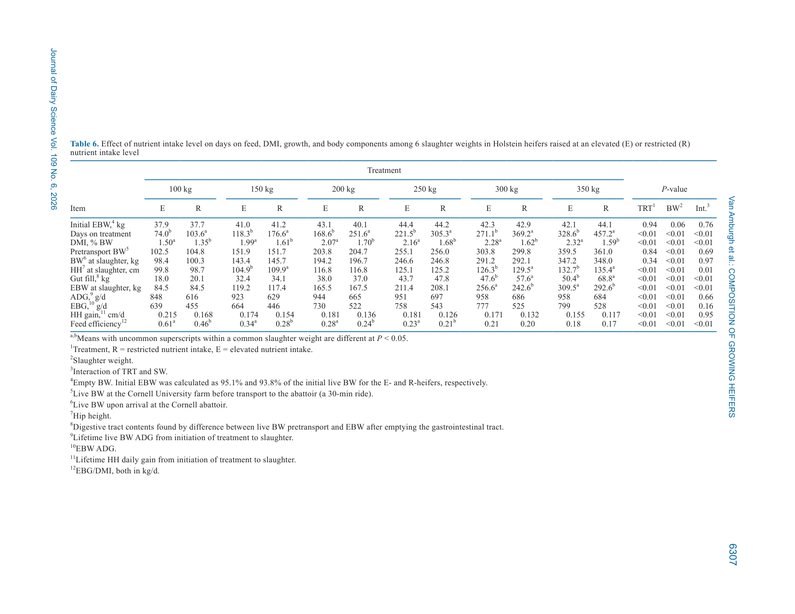
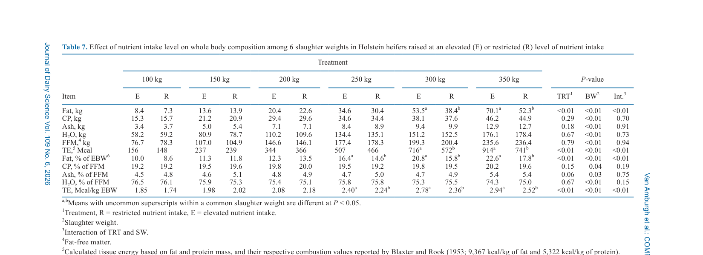
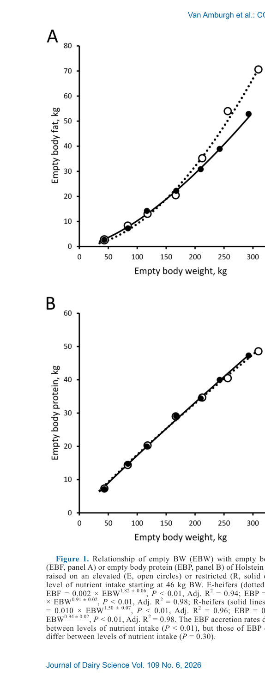

---
# YAML FRONTMATTER (обязательно)
id: CS.SOTA.381
type: sota
format_version: v1.1
knowledge_tier: P2
domain: cattle-science
area: feeding
subarea: heifer-growth
subarea2: body-composition
category: field-study
year: 2026
authors: "Van Amburgh, M. E., Ross, D. A., Lintault, L., and Molano, R. A."
title: "Growth performance, efficiency, and composition of Holstein heifers fed 2 levels of nutrient intake from 44 to 350 kilograms body weight"
journal: "Journal of Dairy Science"
volume: "109"
issue: "6"
pages: "6301-6317"
doi: "10.3168/jds.2025-27700"
publisher: "Elsevier / ADSA"
open_access: true
license: "CC BY"
language: ru
freshness_window: "2026-08-05 — 2028-08-05"
sota_edition: "1.0"
derivation:
  - source: "Van Amburgh et al., 2026, Journal of Dairy Science (109:6)"
    type: "ConservativeRetextualization (FPF A.6.3)"
    reopen_trigger: "DOI: 10.3168/jds.2025-27700"
tags:
  - heifer
  - growth
  - body-composition
  - serial-slaughter
  - nutrient-intake
  - energy-retention
  - puberty
  - holstein
related:
  - id: CS.SOTA.XXX
    type: foundational
    note: "NASEM 2021 — потребности растущих телок; константы конверсии FBW→EBW и ADG→EBG, которые статья показывает избыточно упрощёнными"
    relevance: high
  - id: CS.SOTA.366
    type: complementary
    note: "Fukami et al., 2026 — метаболические эффекты жирности ЗЦМ у телят; тот же вопрос уровня питания на ранней фазе роста"
    relevance: medium
---

# CS.SOTA.381: Van Amburgh et al. (2026) — Рост, эффективность и состав тела телок Holstein при двух уровнях потребления нутриентов от 44 до 350 кг массы тела

> **Навигация:** [2. Аннотация](#2-аннотация-abstract) · [3. Введение](#3-введение) · [4. Методология](#4-методология) · [5. Результаты](#5-результаты) · [6. Интерпретация](#6-интерпретация-и-обсуждение) · [7. Критический анализ](#7-критический-анализ) · [8. Выводы](#8-выводы) · [9. FAQ](#9-faq) · [10. Практика](#10-практическое-применение) · [12. Источники](#12-источники)

---

# 2. АННОТАЦИЯ (Abstract)

## 2.1. Перевод Abstract

Опубликованных данных о влиянии различий в потреблении нутриентов, начатом вскоре после рождения и продолженном за пределы пубертата, на характеристики роста телок Holstein не существовало. Целью исследования была оценка влияния двух уровней потребления нутриентов на характеристики роста и состав тела телок Holstein на стадиях от раннего возраста до половины зрелой массы тела. Начиная с 44 кг, тёлки (n = 78) были распределены на повышенный (E) или ограниченный (R) уровень потребления нутриентов, рассчитанные на среднесуточный прирост (ADG) 950 и 650 г соответственно. Шесть телок были забиты при ~46 кг как базовая линия состава тела; из оставшихся по 6 телок на обработку забивали с шагом 50 кг от 100 до 350 кг. Повышенное потребление нутриентов увеличивало суточные приросты высоты в крестце и массы пустого тела (empty body weight, EBW) и ожидаемо снижало возраст достижения общей массы тела. Фактические приросты за жизнь близко соответствовали целевым ADG обеих групп, при этом E-тёлки конвертировали корм в прирост эффективнее R-тёлок до 250 кг. E-тёлки достигли пубертата на 107 дней раньше и с этого момента были стабильно ниже в крестце, чем R-тёлки. Доля содержимого ЖКТ в массе тела не была константой в ходе роста и после 250 кг зависела от уровня питания, будучи ниже у E-тёлок. Бо́льшая доля фракции крови и органов и общей жировой массы снижала вклад остальных фракций в EBW у E-тёлок. Содержание жира росло, а воды снижалось и в EBW, и в приросте по мере роста; эти изменения усиливались у E после 200 кг, снижая долю прироста обезжиренной массы (fat-free mass, FFM) в приросте EBW. Масса финального и отложенного белка от уровня питания не зависела. Содержание белка в EBW и в приросте было снижено у E, но в приросте FFM — одинаково. Содержание золы в приросте FFM было ниже у E. Изменения в отложении жира приводили к эквивалентным изменениям задержанной энергии. Повышенное потребление и белка, и энергии улучшало рост и кормовую эффективность без влияния на рост постной массы и без увеличения упитанности примерно до 30 % зрелой массы тела. С учётом меняющегося вклада содержимого ЖКТ и жира в прирост массы тела эти данные могут быть использованы для уточнения описаний потребностей в нутриентах и ожидаемого роста телок Holstein до 350 кг (Van Amburgh et al., 2026, p. 6301).

## 2.2. Key Claims

**Claim 1: Повышенный уровень питания с рождения ускоряет рост без ущерба постному росту примерно до 30 % зрелой массы.**
- **Утверждение:** E-тёлки (цель 950 г/д) достигли lifetime ADG 930 г/д против 663 г/д у R (цель 650 г/д), EBG 730 против 501 г/д; 350 кг достигнуты на 129 дней раньше (328.6 vs 457.2 д). Масса отложенного белка, золы и воды между обработками не различалась (P > 0.17–0.20); различия накапливались только в жире после ~200 кг.
- **Evidence:** Модифицированный серийный забой (serial slaughter), 78 телок, 6 убойных масс, по 6 телок на обработку на массу.
- **Уверенность:** 0.82 (уникальный полный датасет 44–350 кг, прямые измерения состава тела; ограничение — n = 6 на точку и данные 2001–2003 гг.).
- **Цитата:** "The elevated intake of both protein and energy improved growth and feed efficiency without affecting lean growth or increasing adiposity up to approximately 30% of the heifer's mature BW." (Van Amburgh et al., 2026, p. 6301)

**Claim 2: Константы конверсии FBW→EBW и ADG→EBG в моделях (CNCPS, NASEM) избыточно упрощают реальную динамику.**
- **Утверждение:** Доля EBW в полной массе тела (FBW) варьировала от 77.5 % до 85.9 %, доля EBG в ADG — от 70.5 % до 84.9 %; обе зависели от уровня питания, убойной массы и их взаимодействия. Применяемые моделями константы (85.5 % для FBW→EBW; 85–96 % для ADG→EBG) завышали EBG и EBW для R-тёлок и для всех телок легче 250 кг и были адекватны только для E-тёлок тяжелее 300 кг.
- **Evidence:** Прямые измерения содержимого ЖКТ (gut fill) на 6 убойных массах; содержимое ЖКТ варьировало 14.1–22.5 % массы тела.
- **Уверенность:** 0.80 (прямые измерения; согласуется с Waldo et al., 1997 и Stamey Lanier et al., 2021; ограничение — одна порода, одна система кормления).
- **Цитата:** "The constants of 85.5%, to convert FBW to EBW, and of 85% to 96%, to convert ADG to EBG, used by different growth models... oversimplify the dynamics observed in these ratios over the course of development and related to the level of nutrient intake." (Van Amburgh et al., 2026, p. 6312)

**Claim 3: Отложение жира ускоряется уровнем питания после ~28 % зрелой массы (аллометрическая точка пересечения EBW ≈ 149 кг).**
- **Утверждение:** Аллометрический коэффициент накопления жира пустого тела (EBF) был выше у E (EBF = 0.002 × EBW^1.82) чем у R (EBF = 0.010 × EBW^1.50; P < 0.01); кривые пересекались при EBW 149 кг (≈182 кг FBW ≈ 28 % зрелой массы). Накопление белка пустого тела (EBP) между обработками не различалось (P = 0.30). При 350 кг жир составлял 22.6 % EBW у E против 17.8 % у R.
- **Evidence:** Аллометрические регрессии Y = aX^b (Huxley, 1932), Adj. R² 0.94–0.98; полный химический анализ 4 фракций тела.
- **Уверенность:** 0.83 (высокое качество регрессий; механизм «дилюции» FFM жиром подтверждён прямыми анализами).
- **Цитата:** "The EBF accretion rates differed between levels of nutrient intake (P < 0.01), but those of EBP did not differ between levels of nutrient intake (P = 0.30)." (Van Amburgh et al., 2026, p. 6309)

**Claim 4: Повышенное питание сдвигает пубертат на 107 дней раньше при той же массе тела в пубертат.**
- **Утверждение:** E-тёлки достигли пубертата в 246 дней против 353 у R (P < 0.01), при одинаковой массе тела в пубертат (270 vs 288 кг, P = 0.09) — в среднем ~280 кг ≈ 43 % зрелой массы; E-тёлки при этом были ниже в крестце (124 vs 128 см, P = 0.03).
- **Evidence:** 17 тёлок, достигших пубертата до забоя (10 E, 7 R); прогестерон плазмы 2 раза в неделю после 225 кг, порог >1 нг/мл.
- **Уверенность:** 0.70 (малый n достигших пубертата; согласуется с Capuco et al., 1995, Radcliff et al., 1997 и моделью Frisch, 1991).
- **Цитата:** "...E-heifers in the current study reached puberty 107 d before R-heifers. Despite this marked difference in age, BW at puberty was not affected by the level of nutrient intake and averaged 280 kg, corresponding to approximately 43% of the mature BW..." (Van Amburgh et al., 2026, p. 6314)

**Claim 5: Энергия задерживается преимущественно в жире; белковая составляющая задержанной энергии не зависит от уровня питания.**
- **Утверждение:** Общая задержанная энергия (RE) при 350 кг составила 854.8 Мкал у E против 679.6 у R (P < 0.01); суточная RE — 2.57 против 1.45 Мкал/д. RE в форме белка не различалась (P = 0.77), вся разница — в RE в форме жира (633.1 vs 465.4 Мкал при 350 кг). Энергетическая плотность прироста (RE/EBG) росла от ~2.2 до 3.17 Мкал/кг у E и 2.70 у R. Наклоны регрессии RE: жир 0.95 / белок 0.05 (E) против 0.87 / 0.13 (R); точка равного вклада жира и белка ~1.2 Мкал/д — почти как у Waldo et al. (1997).
- **Evidence:** Расчёт тканевой энергии по теплотам сгорания Blaxter and Rook (1953): 9 367 ккал/кг жира, 5 322 ккал/кг белка.
- **Уверенность:** 0.80 (прямые измерения жира и белка; расчётная энергия — модельная величина, не калориметрия).
- **Цитата:** "Although the E-heifers retained more of the total RE as fat than R-heifers the total RE as protein were unaffected by level of nutrient intake." (Van Amburgh et al., 2026, p. 6314)

---

# 3. ВВЕДЕНИЕ

## 3.1. Контекст и значимость проблемы

Химический состав тела растущих телок Holstein определяет точность прогнозов потребностей в нутриентах: модели (CNCPS, NASEM 2021) конвертируют живую массу в массу пустого тела и прирост живой массы в прирост пустого тела через фиксированные константы, от которых зависят расчёты энергии и белка на рост. При этом состав прироста напрямую связан с последующей продуктивностью: изменения состава тела в фазе роста относительно зрелой массы при отёле, вероятно, отвечают за бо́льшую часть негативного эффекта до- и постпубертатной скорости роста на удой первой лактации, независимо от развития молочной железы (Van Amburgh et al., 2019; цит. по Van Amburgh et al., 2026, p. 6301).

Известно, что изменения состава тела при разной скорости роста или уровне потребления энергии происходят за счёт различий в массе висцеральных тканей и — главным образом — за счёт «дилюции» золы, воды и белка жиром (Reid et al., 1968; Garrett, 1987; McLeod and Baldwin, 2000). Состав обезжиренного прироста (FFM) считается в значительной мере нечувствительным к массе тела и уровню питания (Fortin et al., 1980; Waldo et al., 1997). Однако серийных убойных данных, описывающих состав отложенных тканей растущей тёлки Holstein за пределами отъёма и через пубертат, практически не было — за исключением данных Cornell 1950–60-х гг. (Fortin et al., 1980) и работ с диапазоном от ~100–180 кг до пубертата (Waldo et al., 1997; Moallem et al., 2004b), не учитывавших влияние доотъёмного питания.

## 3.2. Обзор литературы (краткий)

1. **Fortin et al. (1980)** — серийный забой Holstein и Angus разных полов; базовая аллометрия состава тела (данные 1950–60-х).
2. **Waldo et al. (1997)** — компоненты роста телок Holstein на люцерновом и кукурузном силосе, 180 кг → пубертат; меньше жировой ткани, чем ожидалось, возможно из-за селекции на удой.
3. **Moallem et al. (2004b)** — состав тела и массы органов допубертатных телок от ~100 кг; эффекты соматотропина и нерасщепляемого белка.
4. **Diaz et al. (2001); Tikofsky et al. (2001); Brown et al. (2005); Bartlett et al. (2006); Stamey Lanier et al. (2021)** — состав тела доотъёмных телят при разных уровнях питания.
5. **Radcliff et al. (1997); Van Amburgh et al. (1998)** — ускоренный рост за счёт белка и энергии снижает возраст пубертата и первого отёла без ущерба росту в крестце, молочной железе и удою.
6. **Meyer et al. (2006a,b)** — сопутствующие публикации того же эксперимента: развитие молочной железы (паренхима, жировая подушка, пролиферация эпителия).

## 3.3. Гипотеза и цель исследования

**Цель:** Описать влияние двух уровней потребления нутриентов, начатых в раннем возрасте, на характеристики роста, эффективность и состав тела тёлки Holstein на разных стадиях развития — через пубертат и до половины зрелой массы тела. Дополнительная цель — обеспечить энергию для целевых скоростей роста так, чтобы белок не был наиболее лимитирующим нутриентом (Van Amburgh et al., 2026, p. 6302).

**Primary outcomes:** ADG, прирост EBW (EBG) и высоты в крестце (HH), кормовая эффективность (EBG/DMI), химический состав EBW и прироста (жир, белок, зола, вода, FFM), задержанная энергия (RE).
**Secondary outcomes:** Вклад фракций тела (голова-шкура-конечности-хвост, HHFT; кровь и органы, BO; молочная железа, MG; туша, CA) в EBW и его компоненты; возраст и масса в пубертат.

---

# 4. МЕТОДОЛОГИЯ

## 4.1. Дизайн исследования

| Параметр | Описание |
|----------|----------|
| **Тип исследования** | Модифицированный серийный забой (serial slaughter) с множественными интервалами; полностью рандомизированный дизайн |
| **Место и период** | Cornell University (Ithaca, NY) и Cornell Dairy Teaching and Research Center (Harford, NY); октябрь 2001 — июль 2003 |
| **Животные** | 78 тёлок Holstein, куплены в течение 1 недели после рождения с 5 ферм; зрелая масса исходных стад 657 ± 117 кг (4 из 5 ферм, середина 4-й лактации) |
| **Обработки** | Повышенный (E; цель ADG 950 г/д) или ограниченный (R; цель 650 г/д) уровень потребления нутриентов с прибытия (44.2 кг, 9.9 д) |
| **Схема забоя** | 6 телок базовой линии при 45.8 ± 1.3 кг (~21 д); далее по 6 телок на обработку на каждую убойную массу: 100, 150, 200, 250, 300, 350 кг |
| **Содержание** | До 150 кг — индивидуальные станки в тепличной конструкции; после 150 кг — фристойл, индивидуальное кормление через Calan gate |
| **Пубертат** | С 225 кг — кровь из яремной вены 2 раза в неделю; прогестерон РИА (Coat-A-Count); >1 нг/мл = функциональное жёлтое тело = пубертат |
| **Статистика** | R 4.3.1, lme4/lmer; смешанные модели: фиксированные — обработка (и убойная масса + взаимодействие для убойных данных), случайный — месяц набора; emmeans, Tukey; взаимодействия проверялись при P ≤ 0.10; аллометрия Y = aX^b через nlme; значимость P ≤ 0.05 |

## 4.2. Кормление

**До отъёма:** E — ЗЦМ 28 % СП / 20 % жира (Cows Match, Land O'Lakes) из расчёта 0.32 Мкал потреблённой энергии на кг МТ^0.75; R — ЗЦМ 22 % СП / 20 % жира при 0.20 Мкал/кг МТ^0.75. Отъём с ~42 д (снижение молока до 50 % на 7 дней, полное устранение к ~50 д); R-тёлки получали молоко на 7 дней дольше для выравнивания массы при отъёме. Стартер 26 % СП (Agway) — примерно с 1-й недели до 2 недель после отъёма (Van Amburgh et al., 2026, p. 6302, Table 1).

**После отъёма:** три общих TMR, сформулированных по CNCPS v5 так, чтобы прогнозируемые ME- и MP-допустимые приросты были сходны внутри диапазона масс для обоих целевых темпов: TMR 1 с 10 до 13 нед (24.3 % СП), TMR 2 до ~200 кг (19.0 % СП), TMR 3 от 200 кг до забоя (17.2 % СП; ME 2.43–2.47 Мкал/кг СВ). По NASEM (2021) рационы обеспечивали белок для 980 г/д прироста во всех диапазонах — белок не лимитировал рост (Van Amburgh et al., 2026, p. 6303, Table 2). Количество корма корректировалось еженедельно для удержания целевых темпов роста.

## 4.3. Забой и тканевой анализ

Тело делилось на 4 фракции: (1) голова, шкура, конечности, хвост (HHFT); (2) молочная железа (MG); (3) кровь и органы без MG (BO–MG); (4) туша (CA; правая половина как представительная). ЖКТ очищался от содержимого для определения наполнения ЖКТ (gut fill) и массы пустого тела (EBW). Фракции измельчались (проход 18 мм + 6 проходов 8 мм), лиофилизировались; СВ — 105°C 72 ч; анализы жира, N (×6.25) и золы по AOAC. Тканевая энергия (TE) рассчитывалась по Blaxter and Rook (1953): 9 367 ккал/кг жира и 5 322 ккал/кг белка (Van Amburgh et al., 2026, p. 6304). Для каждой тёлки начальный EBW и состав рассчитывались по живой массе при постановке и данным базовой группы соответствующей обработки. В данной работе MG объединена с BO–MG в единую фракцию BO.

## 4.4. Медиа-инвентарь

| ID | Тип | Описание | Файл | Статус |
|----|-----|----------|------|--------|
| Table 6 | Таблица | Дни на кормлении, DMI, рост, наполнение ЖКТ, EBW, ADG/EBG/HH-прирост, кормовая эффективность по 6 убойным массам (повёрнутая страница, отрендерена с поворотом) | `table-6-growth-feed-efficiency.png` | ✅ Встроено |
| Table 7 | Таблица | Химический состав пустого тела (жир, СП, зола, вода, FFM, TE) по 6 убойным массам (повёрнутая страница, отрендерена с поворотом) | `table-7-body-composition.png` | ✅ Встроено |
| Fig. 1 | График | Аллометрические отношения EBW с жиром (EBF, панель A) и белком (EBP, панель B) пустого тела | `figure-1-allometric-ebf-ebp.png` | ✅ Встроено |
| Tables 1–5, 8–10 | Таблицы | Состав кормов (1, 2), исходные/отъёмные измерения (3), базовая линия (4), DMI и дни на кормах (5), состав отложенных тканей (8), задержанная энергия (9), пубертат (10) | — | ⏭️ Пропущено как PNG; ключевые числа приведены в тексте разделов 4–5 |
| Suppl. Fig. S1–S2, Tables S1–S2 | Доп. материалы | Наполнение ЖКТ, вклад фракций, FFM-прирост, регрессии RE | — | ❌ Не извлечены (вынесены в Supplement, hdl.handle.net/1813/121477) |

---

# 5. РЕЗУЛЬТАТЫ

## 5.1. Рост, потребление и кормовая эффективность

**Соответствует:** Table 6 (и Table 5)

*Источник: Van Amburgh et al., 2026, p. 6307 (Table 6).*

**Описание:**
На старте группы не различались (44.2 кг, 9.9 д, 82.4 см). К отъёму E-тёлки были тяжелее и выше (83.9 vs 74.0 кг; 93.9 vs 92.4 см; P < 0.01) при доотъёмном ADG 882 vs 590 г/д. Lifetime ADG составил 848–958 г/д у E против 616–697 г/д у R по убойным массам (средние 930 vs 663 г/д), EBG — 639–799 vs 446–543 г/д (средние 730 vs 501 г/д). До 350 кг E-тёлкам потребовалось на 129 дней меньше (328.6 vs 457.2 д; P < 0.01). ADG и EBG росли с массой тела в обеих группах. DMI в % массы тела был выше у E на всех массах (2.32 vs 1.59 % при 350 кг). Кормовая эффективность (EBG/DMI) снижалась с ростом и была выше у E до 250 кг (0.61 vs 0.46 при 100 кг; 0.23 vs 0.21 при 250 кг), после чего сравнялась (0.18 vs 0.17 при 350 кг). Транспортная усушка — 3.96 % массы, не зависела от обработки и массы.

**Механистическая интерпретация:**
Исчезновение преимущества E в кормовой эффективности после 250 кг, несмотря на бо́льшую долю EBG в ADG, связывается с бо́льшим содержанием жира в приросте E: жировая ткань энергетически плотнее, но легче мышечной и структурной, так как содержит меньше воды (Van Amburgh et al., 2026, p. 6313).

**Ключевые цифры:**
- Дни до 350 кг: 328.6 (E) vs 457.2 (R), P < 0.01.
- DMI: ЗЦМ 1.20 vs 0.76 кг/д; TMR 3 — 6.72 vs 4.59 кг/д (P < 0.01, Table 5).
- Кормовая эффективность: 0.61 vs 0.46 (100 кг) → 0.18 vs 0.17 (350 кг).
- Высота в крестце при забое: E ниже R при 150, 300 и 350 кг (132.7 vs 135.4 см при 350 кг; взаимодействие P = 0.01).

## 5.2. Наполнение ЖКТ и соотношение EBW/FBW

**Описание:**
Наполнение ЖКТ (gut fill) не было константой: в % массы тела оно варьировало 14.1–22.5 %, было максимальным при 150 кг (P < 0.02) независимо от обработки, а после 250 кг — больше у R (68.8 vs 50.4 кг при 350 кг; взаимодействие P < 0.01). Соответственно, доля EBW в живой массе варьировала 77.5–85.9 %, доля EBG в ADG — 70.5–84.9 %; отношение EBG:ADG к EBW:FBW составляло 90.7 % до 150 кг и росло с 95.6 % (200 кг) до 98 % (350 кг) (Van Amburgh et al., 2026, p. 6312).

**Механистическая интерпретация:**
Гипертрофия ЖКТ, запущенная резким ростом потребления твёрдого корма при отъёме, продолжается примерно до 150 кг (~2 массы при отъёме) — здесь доля содержимого ЖКТ максимальна, а доля EBW минимальна. У тёлок ad libitum содержимое ЖКТ относительно массы тела на ~4 % меньше, чем при ограниченном кормлении (Anrique, 1976); упитанность отрицательно связана с относительным наполнением ЖКТ независимо от массы (Lofgreen et al., 1962) — это объясняет расхождение E и R после 250 кг.

## 5.3. Химический состав пустого тела

**Соответствует:** Table 7

*Источник: Van Amburgh et al., 2026, p. 6308 (Table 7).*

**Описание:**
Общие массы белка (EBP), золы и воды в пустом теле от обработки не зависели (P > 0.17). Жир: больше у E при 300 и 350 кг (70.1 vs 52.3 кг при 350 кг; взаимодействие P < 0.01); в % EBW — 22.6 vs 17.8 % при 350 кг. Белок в % EBW ниже у E (16.6 vs 16.8 %, P = 0.01); по массам — стабилен ~17 % до 200 кг, затем снижается до ~16 %. Зола в % EBW ниже у E (4.0 vs 4.3 %, P < 0.01). FFM и его содержание воды и белка от обработки не зависели (P > 0.15); тенденция к меньшей золе в FFM у E (4.8 vs 5.0 %, P = 0.06). Тканевая энергия при 350 кг: 914 vs 741 Мкал; TE на кг EBW — 2.94 vs 2.52 Мкал/кг (P < 0.01).

**Ключевые цифры:**
- Жир, % EBW (E vs R): 10.0 vs 8.6 (100 кг) → 22.6 vs 17.8 (350 кг).
- Вода в % EBW ниже у E при трёх тяжёлых массах (P < 0.01, data not shown).
- Базовая линия (~46 кг): жир 6.1–6.2 % EBW, СП 16.5–16.9 %, вода 73.2–73.4 % (Table 4).

## 5.4. Аллометрия жира и белка

**Соответствует:** Figure 1

*Источник: Van Amburgh et al., 2026, p. 6309 (Figure 1).*

**Описание:**
Уравнения: E — EBF = 0.002 × EBW^1.82±0.06 (Adj. R² = 0.94); R — EBF = 0.010 × EBW^1.50±0.07 (Adj. R² = 0.96); коэффициенты b различаются (P < 0.01). Для белка: E — EBP = 0.261 × EBW^0.91±0.02; R — EBP = 0.225 × EBW^0.94±0.02 (Adj. R² = 0.98 оба); b не различаются (P = 0.30). Приравнивание уравнений EBF даёт точку пересечения при EBW 149 кг ≈ 182 кг FBW ≈ 28 % зрелой массы: до неё массы жира групп перекрываются, после — E накапливает жир быстрее (Van Amburgh et al., 2026, p. 6312).

**Механистическая интерпретация:**
Результат согласуется с данными NASEM (2016) о влиянии уровня питания на состав тела начиная с 26–40 % зрелой массы и подтверждает классический принцип: задержка белка относительно жира снижается с ростом массы и потребления энергии; энергия сверх возможностей белковой задержки откладывается жиром (Byers, 1982). Состав обезжиренного прироста при этом инвариантен к уровню питания — ключевая проверка модели «дилюции».

## 5.5. Фракции тела и отложенные ткани

**Описание (Supplemental Table S1, Table 8):**
Доля BO в EBW больше у E (23.4 vs 21.7 %, P < 0.01) — за счёт роста ЖКТ и печени при большем потреблении СВ из относительно грубых рационов (McLeod and Baldwin, 2000); соответственно ниже вклад туши (59.9 vs 61.0 %) и HHFT (16.7 vs 17.3 %). Из EBF у E бо́льшая доля приходится на жир BO (28.3 vs 23.7 %) и меньшая — на жир туши (59.0 vs 61.8 %): молочные породы накапливают относительно больше жира во внутренних депо (Wright and Russel, 1984). В отложенных тканях (Table 8): задержка белка, золы и воды от обработки не зависела (P > 0.20), жира — больше у E на двух тяжёлых массах (67.6 vs 49.7 кг при 350 кг). Суточные скорости задержки всех компонентов выше у E (белок: 121.1 vs 82.4 г/д; жир: 204.5 vs 106.8 г/д при 350 кг). Доля жира в EBG: 25.2 vs 19.9 % при 350 кг; белка в EBG: 16.7 vs 17.0 % в среднем (P = 0.02).

## 5.6. Задержанная энергия и пубертат

**Описание (Tables 9, 10):**
Суточная RE: 2.57 vs 1.45 Мкал/д при 350 кг; RE как белок одинакова (0.64 vs 0.44 Мкал/д при 350 кг; TRT P < 0.01 для суточных, но общая масса RE-CP не различалась, P = 0.77). Доля RE-белка в общей RE снижалась с 43.2/50.2 % (E/R, 100 кг) до 26.1/31.5 % (350 кг). Пубертат (n = 17): возраст 246 vs 353 д (P < 0.01), масса 270 vs 288 кг (P = 0.09), высота в крестце 124 vs 128 см (P = 0.03), число овуляций до забоя не различалось (3.3 vs 4.6, P = 0.28).

---

# 6. ИНТЕРПРЕТАЦИЯ И ОБСУЖДЕНИЕ

## 6.1. Связь с гипотезой

Цель достигнута полностью: датасет впервые описывает рост, эффективность и состав тела тёлки Holstein при двух уровнях питания, начатых почти с рождения и продолженных почти до пубертата и до половины зрелой массы. Белок действительно не лимитировал рост: при одинаковых рационах после отъёма задержка белка не различалась между группами, а при той же суточной RE тёлки E задерживали бо́льшую долю энергии в белке — то есть R-тёлки были лимитированы энергией для использования диетического белка, а не белком (Van Amburgh et al., 2026, p. 6314).

## 6.2. Сравнение с литературой

| Исследование | Согласие/Противоречие/Расширение |
|--------------|----------------------------------|
| Fortin et al. (1980); Waldo et al. (1997) | **Согласуется** — рост доли жира в EBW и приросте при большем потреблении |
| NASEM (2016) | **Согласуется** — влияние уровня питания на состав с 26–40 % зрелой массы; здесь точка уточнена: ~28 % (EBW 149 кг) |
| Waldo et al. (1997) — регрессии RE | **Согласуется частично** — наклоны жир/белок у R (0.87/0.13) близки к 0.89/0.11; у E (0.95/0.05) выше; точка равного вклада ~1.2 Мкал/д почти идентична |
| Moallem et al. (2004b) | **Расширяет** — при сходных массах тёлки этой работы жирнее и с меньшим белком; вероятная причина — разное доотъёмное питание |
| Reid et al. (1964); Steele et al. (2023) | **Согласуется** — пубертат при ~43 % зрелой массы (диапазон 43–55 % для разных линий Holstein) |
| Frisch (1991); Fantuz et al. (2024) | **Согласуется** — пубертат как функция массы/упитанности, а не возраста |
| Stamey Lanier et al. (2021) | **Согласуется** — динамика ЖКТ влияет на EBG:ADG после отъёма и на прогнозы потребностей |

## 6.3. Механистические выводы

1. **Инвариантность FFM-прироста:** Состав обезжиренного прироста (белок, вода, энергетическая плотность) не зависел от уровня питания и массы — подтверждение базовой посылки моделей роста (Fortin et al., 1980; Garrett, 1987) на современной генетике.
2. **Жир — дилюент:** Весь избыток энергии сверх возможности белковой задержки откладывается жиром; аллометрический коэффициент накопления жира чувствителен к уровню питания (b = 1.82 vs 1.50), белка — нет.
3. **ЖКТ как источник ошибки моделей:** Накопление содержимого ЖКТ до 150 кг и его зависимость от уровня питания после 250 кг делают фиксированные константы FBW→EBW и ADG→EBG источником систематической ошибки — завышения EBG у R и у лёгких телок.
4. **Висцеральное направление жира:** Дополнительный жир E-тёлок концентрируется в депо BO (omentum, mesenterium, perirenal) — согласуется с Drackley et al. (2014) у коров и объясняет слабую чувствительность BCS к изменениям жировых запасов (Heine et al., 2021).
5. **Пубертат массо-зависим:** Возраст пубертата сдвигается на 107 дней при той же массе (~280 кг ≈ 43 % зрелой), что поддерживает модель порогового развития/упитанности Frisch (1991).

---

# 7. КРИТИЧЕСКИЙ АНАЛИЗ

## 7.1. Сильные стороны

- **Уникальный датасет:** первый серийный забой Holstein от 44 до 350 кг с уровнем питания, заданным с первой недели жизни, — 6 точек вместо традиционных «база + конец».
- **Прямые измерения:** полный химический анализ 4 фракций тела, прямое определение содержимого ЖКТ, а не косвенные оценки (BCS, ультразвук).
- **Контроль лимитации белка:** рационы пересматривались по CNCPS/NASEM, белок гарантированно не лимитировал — чистый эффект уровня энергии/потребления.
- **Связь с молочной железой:** те же животные описаны в Meyer et al. (2006a,b) — возможность сопоставления состава тела и развития паренхимы.
- **Современная статистика:** смешанные модели (lme4), аллометрия через nlme, коррекция Tukey.

## 7.2. Ограничения

**Внутренние:**
- **Данные собраны в 2001–2003 гг.** — генетический прогресс Holstein за 20+ лет (зрелая масса, скорость роста) может сдвигать абсолютные значения, хотя соотношения должны быть устойчивее [интерполяция].
- **n = 6 на точку** — ограниченная мощность для взаимодействий; пубертатный анализ — всего 17 тёлок.
- **Начальный состав — расчётный:** исходные EBW и состав каждой тёлки экстраполированы из базовой группы (n = 3 на обработку).
- **Тканевая энергия — расчётная** по теплотам сгорания 1953 г., не калориметрия.
- **Анализы крахмала и сахаров кормов не проводились** (Van Amburgh et al., 2026, p. 6304).

**Внешние:**
- **Одна порода, один исследовательский центр, стойловое содержание** — перенос на пастбищные системы и другие породы ограничен.
- **Зрелая масса исходных стад 657 кг** — для стад с иной зрелой массой точки в %-ах зрелой массы сместятся.
- **Обработка смешивает белок и энергию до отъёма** (разные ЗЦМ: 28 vs 22 % СП) — доотъёмные эффекты не полностью атрибутируемы энергии.

## 7.3. Применимость к российским условиям

- **Прямой вывод для выращивания ремонтных телок:** ускоренное выращивание (~950 г/д) при адекватном белке не «пережиривает» тёлку примерно до 200 кг живой массы — раньше пубертата и убойных 250+ кг дополнительное отложение жира минимально; это поддерживает программы интенсивного выращивания, распространённые в РФ.
- **Контроль по массе, не возрасту:** пубертат наступает при ~43 % зрелой массы стада; для российских стад Holstein со зрелой массой ~650–700 кг ориентир пубертата — 280–300 кг, первого осеменения — по массе и росту, с учётом того, что быстрорастущие тёлки будут ниже в крестце при той же массе.
- **Ошибка моделей при ограниченном кормлении:** при дефицитном кормлении (типичная ситуация весной при скудной кормовой базе) стандартные константы NASEM/CNCPS завышают оценку прироста пустого тела — прогнозы потребностей для таких телок систематически занижены [интерполяция].
- **Климатический фактор не изучался** — работа в стойловых условиях штата Нью-Йорк; для холодных периодов содержания в РФ энергетические поправки нужны дополнительно [guess].

---

# 8. ВЫВОДЫ

## 8.1. Ключевые выводы автора (перевод)

Исследование дополняет и расширяет прежние работы о составе растущих Holstein. Увеличение содержания жира, ведущее к дилюции обезжиренной массы тела по мере роста массы, усиливалось повышенным потреблением нутриентов только после ~30 % зрелой массы тела и без влияния на постный рост. До этой точки зрелости повышенное потребление и белка, и энергии улучшало рост и кормовую эффективность. Дополнительное накопление жира при повышенном потреблении было выраженнее в висцеральных депо. Ускоренный рост давал ожидаемое снижение возраста при общей массе, включая возраст пубертата (−107 д). Учёт меняющегося вклада содержимого ЖКТ и жира в прирост массы тела в ходе развития и в зависимости от уровня питания может уточнить текущие описания потребностей в нутриентах и ожидаемого роста телок Holstein до половины пути к зрелости (Van Amburgh et al., 2026, p. 6314–6315).

## 8.2. Ключевые выводы (структурировано)

1. **До ~30 % зрелой массы** повышенное питание (белок + энергия) улучшает рост и кормовую эффективность без избыточного обжирения и без ущерба постному росту.
2. **Отложенный белок не зависит от уровня питания** — различия между группами целиком в жире и задержанной энергии жира.
3. **Константы FBW→EBW (85.5 %) и ADG→EBG (85–96 %) моделей завышают** прирост пустого тела для ограниченно кормленных и лёгких (<250 кг) телок; нужен динамический подход (Williams et al., 1992).
4. **Пубертат массо-зависим:** ~280 кг ≈ 43 % зрелой массы; ускоренный рост сдвигает его на 107 дней раньше при меньшей высоте в крестце.
5. **Дополнительный жир откладывается висцерально** — BCS может не улавливать различия в упитанности растущих телок.

## 8.3. Ключевые сообщения для лекции

1. Состав обезжиренного прироста тёлки инвариантен к уровню питания — вся «избыточная» энергия идёт в жир, и только после ~28–30 % зрелой массы это становится заметным в составе тела.
2. «Прирост на весах» ≠ «прирост тела»: содержимое ЖКТ составляет 14–22 % живой массы и меняется с возрастом и кормлением — константы конверсии в моделях завышают рост слабо кормленных телок.
3. Интенсивное выращивание до 200 кг живой массы физиологически «безопасно» по упитанности — белковый рост идентичен, жира не больше.
4. Пубертат тёлки — функция массы и упитанности (~43 % зрелой массы), а не возраста: ускоренное выращивание сдвигает его на 3.5 месяца раньше.
5. Дополнительный жир растущей тёлки прячется внутри (висцеральные депо) — внешняя оценка упитанности его недооценивает.

---

# 9. FAQ

**Вопрос 1: Почему быстрый рост до ~200 кг не обжиривает тёлку?**
Ответ: Потому что задержка белка лимитирована физиологически, а не рационом в этой фазе: аллометрические кривые накопления жира E и R пересекаются только при EBW ~149 кг (~28 % зрелой массы). До этой точки дополнительная энергия идёт преимущественно в рост FFM, и массы жира групп статистически перекрываются (Van Amburgh et al., 2026, p. 6312).

**Вопрос 2: Почему кормовая эффективность E-тёлок перестаёт быть выше после 250 кг?**
Ответ: Прирост E становится жирнее (25.2 % жира в EBG при 350 кг против 19.9 % у R). Жировая ткань содержит меньше воды и легче на единицу энергии — на единицу DMI откладывается меньше килограммов EBG, хотя энергии задерживается больше (2.57 vs 1.45 Мкал/д) (Van Amburgh et al., 2026, p. 6313).

**Вопрос 3: Насколько ошибаются модели NASEM/CNCPS при оценке прироста пустого тела?**
Ответ: Константа 85.5 % (FBW→EBW) и диапазон 85–96 % (ADG→EBG) адекватны только для хорошо кормленных телок тяжелее 300 кг. Для ограниченно кормленных и для телок легче 250 кг реальные доли ниже (EBW/FBW от 77.5 %, EBG/ADG от 70.5 %) — модель завышает прирост пустого тела и, следовательно, занижает оценку потребности в нутриентах на единицу реального прироста [интерполяция из Van Amburgh et al., 2026, p. 6312].

**Вопрос 4: Когда тёлка достигает пубертата — по возрасту или по массе?**
Ответ: По массе и упитанности. E- и R-тёлки достигли пубертата при статистически одинаковой массе (~280 кг, ~43 % зрелой), но с разницей в возрасте 107 дней. Это согласуется с моделью Frisch (1991) о пороговой жировой массе для начала репродуктивной функции (Van Amburgh et al., 2026, p. 6314).

**Вопрос 5: Где откладывается лишний жир у интенсивно выращиваемых телок?**
Ответ: Преимущественно во внутренних (висцеральных) депо — сальник, брыжейка, околопочечная клетчатка: доля жира фракции крови и органов в общем жире тела у E 28.3–30.1 % против 23.7–25.6 % у R. Поэтому внешняя оценка кондиции (BCS) эти различия улавливает слабо (Van Amburgh et al., 2026, p. 6313).

---

# 10. ПРАКТИЧЕСКОЕ ПРИМЕНЕНИЕ

## 10.1. Алгоритм использования данных

1. **Задать целевой темп роста** по зрелой массе стада: 950 г/д (интенсивная программа) достижим без обжирения до ~200 кг живой массы при белке, покрывающем ~980 г/д прироста.
2. **Контролировать белок как не-лимитирующий:** рационы формулировать так, чтобы MP допускал прирост не ниже целевого (в работе — проверка по CNCPS/NASEM на каждом диапазоне масс).
3. **Пересматривать рацион по фазам:** переход стартер → фуражный TMR (~10–13 нед) → фаза до 200 кг → фаза 200–350 кг, с еженедельной корректировкой дачи по привесам.
4. **Оценивать пубертат по массе:** ориентир ~43 % зрелой массы стада; вести мониторинг привесов и высоты в крестце еженедельно.
5. **После 250 кг — контроль упитанности:** с этой массы избыток энергии начинает уходить в висцеральный жир; корректировать энергию рациона, не полагаясь только на BCS.

## 10.2. Типичные ошибки

- **Оценка прироста только по живой массе:** содержимое ЖКТ (14–22 % массы) искажает реальный тканевый прирост, особенно сразу после отъёма и при ограниченном кормлении.
- **Применение фиксированных констант EBW/EBG к ограниченно кормленным тёлкам** — завышение ожидаемого прироста и неверная оценка потребностей.
- **Страх «пережирить» тёлку интенсивным кормлением до 200 кг** — данные показывают отсутствие избыточного жира в этой фазе при адекватном белке.
- **Оценка упитанности только по BCS** — дополнительный жир уходит в висцеральные депо.
- **Ориентация осеменения на возраст** — пубертат массо-зависим; возрастной критерий при разных программах выращивания даёт разброс в 3+ месяца.

## 10.3. Пограничные сценарии

- **Стадо с зрелой массой >700 кг:** все пороги в %-ах зрелой массы смещаются вверх по килограммам (пубертат ~300 кг; точка ускоренного жироотложения >200 кг) [интерполяция].
- **Пастбищное выращивание:** сезонные колебания потребления делают уровень питания нестабильным — динамика gut fill и EBG/ADG будет варьировать сильнее [guess].
- **Ограниченное кормление после 250 кг:** накопленный к этому моменту жир у E-тёлок не «рассасывается» обратно — состав отложенного далее прироста определяется текущим рационом [guess].

---

# 11. ИНСТРУМЕНТЫ И ШАБЛОНЫ

## 11.1. Ключевые числовые ориентиры

| Параметр | Значение | Комментарий |
|----------|----------|-------------|
| Целевые ADG (E / R) | 950 / 650 г/д | Фактические lifetime: 930 / 663 г/д |
| Точка пересечения кривых жира | EBW 149 кг ≈ 182 кг FBW ≈ 28 % зрелой массы | До неё уровень питания не влияет на жирность тела |
| EBW/FBW | 77.5–85.9 % (не константа!) | Константа моделей 85.5 % завышена для R и <250 кг |
| EBG/ADG | 70.5–84.9 % | Константы моделей 85–96 % завышены для R и <250 кг |
| Наполнение ЖКТ | 14.1–22.5 % живой массы | Максимум при ~150 кг; у R больше после 250 кг |
| Пубертат | ~280 кг ≈ 43 % зрелой массы | Возраст: 246 д (E) vs 353 д (R) |
| Жир в EBW при 350 кг | 22.6 % (E) vs 17.8 % (R) | Белок EBW: 16.6 vs 16.8 % |
| RE/EBG | 2.16 → 3.17 Мкал/кг (E) | Энергетическая плотность прироста растёт с массой |
| Точка равного вклада жир/белок в RE | ~1.2 Мкал/д | Согласуется с Waldo et al. (1997) |
| Транспортная усушка | 3.96 % живой массы | Не зависит от обработки и массы |

## 11.2. Ресурсы

- Аллометрические уравнения (Figure 1): EBF = 0.002 × EBW^1.82 (E); EBF = 0.010 × EBW^1.50 (R); EBP = 0.261 × EBW^0.91 (E); EBP = 0.225 × EBW^0.94 (R) — для прогноза состава тела по массе пустого тела.
- Supplemental material статьи: https://hdl.handle.net/1813/121477 (Figure S1–S2, Table S1–S2: наполнение ЖКТ, вклад фракций, FFM-прирост, регрессии RE).

---

# 12. ИСТОЧНИКИ

## 12.1. Первоисточник

Van Amburgh, M. E., Ross, D. A., Lintault, L., and Molano, R. A. 2026. Growth performance, efficiency, and composition of Holstein heifers fed 2 levels of nutrient intake from 44 to 350 kilograms body weight. Journal of Dairy Science 109(6):6301-6317. DOI: 10.3168/jds.2025-27700.

## 12.2. Ключевые статьи (цитированные в работе)

- Fortin, A., et al. 1980. Effect of level of energy intake and influence of breed and sex on the chemical composition of cattle. J. Anim. Sci. 51:604–614. [базовая аллометрия, серийный забой Cornell 1950–60-х]
- Waldo, D. R., Tyrrell, H. F., Capuco, A. V., and Rexroad, C. E. Jr. 1997. Components of growth in Holstein heifers fed either alfalfa or corn silage diets to produce two daily gains. J. Dairy Sci. 80:1674–1684.
- Moallem, U., et al. 2004b. Bovine somatotropin and rumen-undegradable protein effects in prepubertal dairy heifers: Effects on body composition and organ and tissue weights. J. Dairy Sci. 87:3869–3880.
- Diaz, M. C., Van Amburgh, M. E., et al. 2001. Composition of growth of Holstein calves fed milk replacer from birth to 105-kilogram body weight. J. Dairy Sci. 84:830–842.
- Meyer, M. J., Capuco, A. V., Ross, D. A., Lintault, L. M., and Van Amburgh, M. E. 2006a,b. Developmental and nutritional regulation of the prepubertal bovine mammary gland: I и II. J. Dairy Sci. 89:4289–4304. [сопутствующие публикации того же эксперимента]
- Stamey Lanier, J., et al. 2021. Influence of starter crude protein content on growth and body composition of dairy calves in an enhanced early nutrition program. J. Dairy Sci. 104:3082–3097.
- NASEM. 2021. Nutrient Requirements of Dairy Cattle. 8th rev. ed. National Academies Press. [константы конверсии, проверка адекватности белка рационов]
- NASEM. 2016. Nutrient Requirements of Beef Cattle. 8th rev. ed. [влияние уровня питания на состав с 26–40 % зрелой массы]
- Frisch, R. E. 1991. Body weight, body fat, and ovulation. Trends Endocrinol. Metab. 2:191–197. [модель пороговой упитанности для пубертата]
- Williams, C. B., Keele, J. W., and Waldo, D. R. 1992. A computer model to predict empty body weight in cattle from diet and animal characteristics. J. Anim. Sci. 70:3215–3222. [динамический подход к оценке EBW]
- Blaxter, K. L., and Rook, J. A. F. 1953. The heat of combustion of the tissues of cattle in relation to their chemical composition. Br. J. Nutr. 7:83–91. [теплоты сгорания для расчёта TE/RE]

## 12.3. Внешние источники [вне статьи]

Отсутствуют — все интерпретационные ссылки в данном SoTA взяты из списка литературы первоисточника.

---

# 13. ЖУРНАЛ ОБРАБОТКИ

## 13.1. WorkPlan

| Шаг | Действие | Статус |
|-----|----------|--------|
| 1 | Чтение полного текста PDF (17 страниц) | ✅ |
| 2 | Извлечение метаданных (авторы, DOI, страницы, лицензия) | ✅ |
| 3 | Извлечение медиа (Figure 1 — crop левой колонки; Tables 6–7 — рендер повёрнутых страниц с поворотом 90°, Table 7 дополнительно обрезана) | ✅ |
| 4 | Анализ дизайна (модифицированный серийный забой, 2 уровня питания × 6 убойных масс) | ✅ |
| 5 | Выделение Key Claims с оценкой уверенности | ✅ |
| 6 | Описание методологии (обработки, кормление, забой, статистика) | ✅ |
| 7 | Детализация результатов (рост, gut fill, состав тела, аллометрия, RE, пубертат) | ✅ |
| 8 | Критический анализ и применимость к РФ | ✅ |
| 9 | FAQ, практическое применение, числовые ориентиры | ✅ |
| 10 | Формирование YAML frontmatter | ✅ |
| 11 | Сохранение файла | ✅ |

## 13.2. Work Record

| Параметр | Значение |
|----------|----------|
| **Время обработки** | ~45 мин |
| **Строк в файле** | ~430 |
| **Число Key Claims** | 5 |
| **Число источников** | 12 (первоисточник + 11 цитированных; внешних вне статьи — 0) |
| **Число медиа** | 3 (2 таблицы + 1 фигура); Tables 1–5, 8–10 представлены ключевыми числами в тексте (ограничение бюджета медиа — 1–2 ключевых по заданию; выбраны центральные Table 6, Table 7 и Figure 1) |
| **Неразборчивые места PDF** | Нет; текстовый слой полный. Таблицы 6–9 в PDF повёрнуты на 90° — отрендерены с поворотом |
| **Расхождение текст/таблица** | Текст (p. 6314) сообщает P = 0.32 для сходства RE как белок, тогда как Table 9 указывает TRT P = 0.77 для «RE as CP, Mcal»; в Key Claim 5 и разделе 5.6 использовано табличное значение (0.77) |
| **FPF compliance** | A.7 (результаты — наблюдения модели эксперимента), A.6.3 (консервативная переработка, reopen trigger DOI), A.10 (якоря доказательств со страницами; метки [интерполяция]/[guess] там, где выход за текст статьи) |

---

*SoTA создан: 2026-08-05*
*Обработано: Kimi Code CLI, batch-обработка new-articles июнь 2026 (JDS 109:6)*
