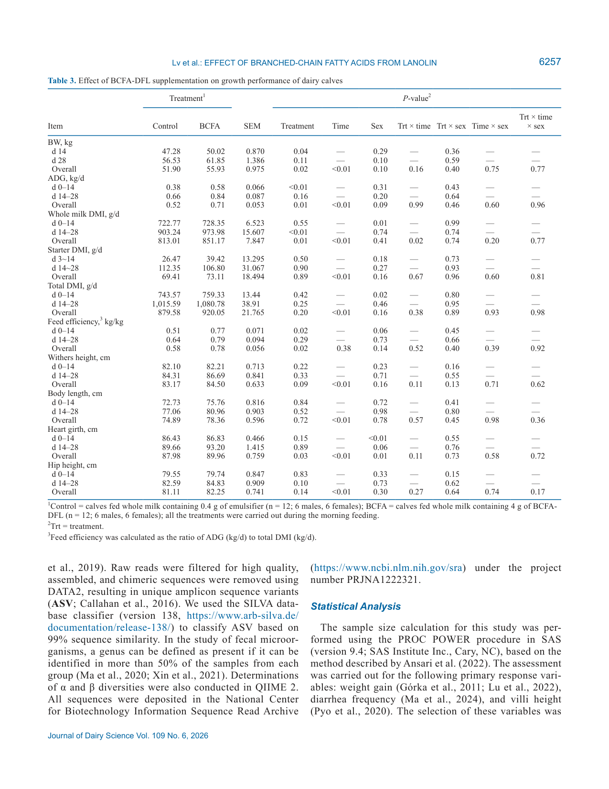
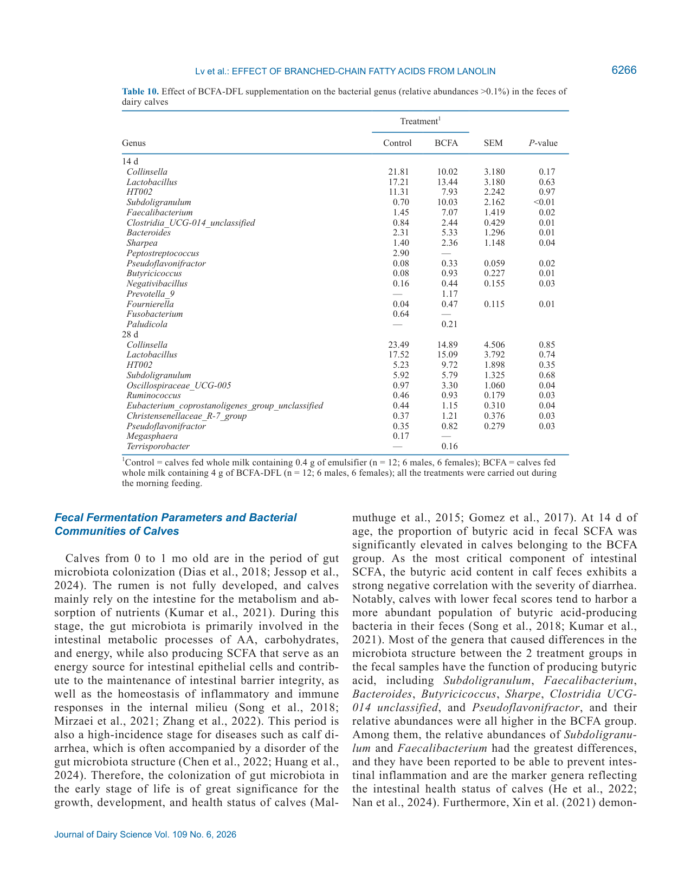

---
# YAML FRONTMATTER (обязательно)
id: CS.SOTA.385
type: sota
format_version: v1.1
knowledge_tier: P2
domain: cattle-science
area: feeding
subarea: calf-nutrition
subarea2: gut-health
category: field-study
year: 2026
authors: "Lv, J., Cao, Y., Wang, S., Zhu, Y., Liu, Y., and Xin, H."
title: "Lanolin-derived branched-chain fatty acids supplementation in early-life Holstein calves"
journal: "Journal of Dairy Science"
volume: "109"
issue: "6"
pages: "6252-6273"
doi: "10.3168/jds.2025-27787"
publisher: "Elsevier / ADSA"
open_access: true
license: "CC BY"
language: ru
freshness_window: "2026-08-05 — 2028-08-05"
sota_edition: "1.0"
derivation:
  - source: "Lv et al., 2026, Journal of Dairy Science (109:6)"
    type: "ConservativeRetextualization (FPF A.6.3)"
    reopen_trigger: "DOI: 10.3168/jds.2025-27787"
tags:
  - branched-chain-fatty-acids
  - lanolin
  - calf
  - diarrhea
  - gut-microbiota
  - intestinal-immunity
  - butyrate
  - holstein
related:
  - id: CS.SOTA.366
    type: complementary
    note: "Питание молочных телят: жирность ЗЦМ и метаболический профиль (JDS, июль 2026)"
    relevance: medium
  - id: CS.SOTA.XXX
    type: foundational
    note: "NASEM 2021 — потребности телят в энергии и питательных веществах, раннее выращивание"
    relevance: high
---

# CS.SOTA.385: Lv et al. (2026) — Скармливание разветвлённых жирных кислот из ланолина новорождённым тёлкам Holstein

> **Навигация:** [2. Аннотация](#2-аннотация-abstract) · [3. Введение](#3-введение) · [4. Методология](#4-методология) · [5. Результаты](#5-результаты) · [6. Интерпретация](#6-интерпретация-и-обсуждение) · [7. Критический анализ](#7-критический-анализ) · [8. Выводы](#8-выводы) · [9. FAQ](#9-faq) · [10. Практика](#10-практическое-применение) · [12. Источники](#12-источники)

---

# 2. АННОТАЦИЯ (Abstract)

## 2.1. Перевод Abstract

Целью исследования была оценка влияния разветвлённых жирных кислот из ланолина (branched-chain fatty acids derived from lanolin, BCFA-DFL) на рост, переваримость, метаболиты крови, развитие кишечника и структуру фекальной микробиоты телят в возрасте от 0 до ~28 дней. Двадцать четыре новорождённых телёнка Holstein (масса при рождении 41.88 ± 4.56 кг) были распределены по рандомизированным блокам на контрольную группу (цельное молоко без добавки) и опытную (BCFA, цельное молоко + 4 г/д BCFA-DFL). Телята группы BCFA имели более высокие среднесуточный прирост (ADG), конверсию корма, обхват груди и общую кажущуюся переваримость нутриентов при неизменном общем потреблении СВ. Холестерин и гаптоглобин плазмы были ниже, чем в контроле. Добавка снижала частоту и длительность диареи и число дней медикаментозного лечения. В тонком кишечнике телят BCFA повышалась экспрессия генов белков плотных контактов (TJP1, CLDN2), β-дефенсинов 1 и 4, REG3α и REG3γ и IL-10 при снижении экспрессии IL-1β и TNF-α. В фекалиях выросли общее содержание короткоцепочечных жирных кислот (SCFA) и доли изомасляной и масляной кислот; на 14-й день увеличилась относительная численность Subdoligranulum и Faecalibacterium, а Prevotella_9 впервые появилась только в группе BCFA. Работа закладывает основу применения BCFA-DFL для здоровья кишечника молодых жвачных.

## 2.2. Key Claims

**Claim 1: BCFA-DFL (4 г/д) улучшает рост и конверсию корма телят 0–28 дней без изменения общего потребления СВ.**
- **Утверждение:** ADG за весь период 0.71 vs 0.52 кг/д (P = 0.01); конверсия корма 0.78 vs 0.58 кг/кг (P = 0.02); BW на 14 день 50.02 vs 47.28 кг (P = 0.04); обхват груди 89.96 vs 87.98 см (P = 0.03); общее DMI не различалось (920.05 vs 879.58 г/д, P = 0.20).
- **Evidence:** Рандомизированный блочный дизайн, n = 12/группу, повторные измерения, power analysis (α = 0.05, мощность 0.85).
- **Уверенность:** 0.72 (адекватный расчёт выборки, но одно стадо, короткий период 28 д, эффект частично опосредован меньшей заболеваемостью диареей).
- **Цитата:** "Calves fed BCFA-DFL had higher ADG, feed efficiency, heart girth, and total-tract apparent digestibility of nutrients, but the treatments did not affect total DMI." (Lv et al., 2026, p. 6252)

**Claim 2: BCFA-DFL снижает частоту и длительность диареи и потребность в лечении.**
- **Утверждение:** Вероятность диареи в контроле выше (OR = 2.86; 95% CI = 1.591–5.149; P < 0.01); вероятность медикаментозного лечения выше (OR = 2.88; P = 0.01); длительность диареи 2.75 vs 6.42 д/телёнка (P = 0.01); частота диареи 9.82% vs 22.92% (P < 0.01); дни лечения 1.17 vs 3.08 (P < 0.01). Ректальная температура не различалась.
- **Evidence:** Логистическая регрессия (PROC GLIMMIX) и регрессия Пуассона (PROC GENMOD), ежедневный мониторинг фекального балла.
- **Уверенность:** 0.75 (большие размеры эффекта, узкие CI для OR диареи; ограничение — одна ферма, летний период).
- **Цитата:** "The BCFA-DFL supplementation reduced the frequency of diarrhea, the duration of diarrhea, and the number of medication doses required for treating diarrhea." (Lv et al., 2026, p. 6252)

**Claim 3: BCFA-DFL повышает кажущуюся переваримость нутриентов в целом по ЖКТ.**
- **Утверждение:** Переваримость СВ 75.66 vs 70.21% (P < 0.01); NDF 61.25 vs 54.32% (P < 0.01); ADF 40.47 vs 28.79% (P < 0.01); СП 80.14 vs 73.78% (P < 0.01).
- **Evidence:** Сбор фекалий каждые 6 ч в течение 3 сут (26–28 д), маркер — кислотонерастворимая зола.
- **Уверенность:** 0.70 (стандартная методика маркера; механизм — предположительно через целостность кишечного барьера, прямых измерений абсорбции нет).
- **Цитата:** "the total-tract apparent digestibility of DM, NDF, ADF, and CP was significantly higher in calves supplemented with BCFA (P < 0.01)" (Lv et al., 2026, p. 6259)

**Claim 4: BCFA-DFL усиливает экспрессию генов барьерной и противовоспалительной функции тонкого кишечника.**
- **Утверждение:** Повышение экспрессии TJP1 (ZO-1) в двенадцатиперстной и подвздошной кишке, CLDN2 в двенадцатиперстной и тощей, DEFB1/DEFB4, REG3α/REG3γ (тощая, P < 0.01) и IL-10 во всех трёх отделах (P < 0.05); снижение IL-1β (двенадцатиперстная, тощая) и TNF-α (тощая) (P < 0.05). Морфометрия ворсин/крипт значимо не менялась (тенденция к снижению глубины крипт и росту отношения ворсина:крипта в илеуме, P = 0.08).
- **Evidence:** qPCR тканей тонкого кишечника забитых бычков (n = 6/группу, 29 д); H&E-гистология.
- **Уверенность:** 0.62 (молекулярные маркеры убедительны, но n = 6 и только самцы; морфология не подтверждает эффект).
- **Цитата:** "feeding BCFA-DFL increased the gene relative expression of tight junction protein 1, claudin 2, β-defensin-1, β-defensin 4, ... and IL-10 in the small intestine of calves, while decreasing ... IL-1β and TNF-α." (Lv et al., 2026, p. 6252)

**Claim 5: BCFA-DFL сдвигает фекальную микробиоту и брожение в сторону бутирато-продуцирующих родов на 14-й день жизни.**
- **Утверждение:** На 14 день Subdoligranulum 10.03 vs 0.70% (P < 0.01), Faecalibacterium 7.07 vs 1.45% (P = 0.02), Bacteroides 5.33 vs 2.31% (P = 0.01); Prevotella_9 и Paludicola — только в группе BCFA, Peptostreptococcus и Fusobacterium — только в контроле; общий SCFA и доля масляной кислоты выше (бутират 18.52 vs 9.48% на 14 д, P < 0.01); α-разнообразие (Shannon, Simpson, Pielou_e) выше на 14 д, β-разнообразие различается. На 28 день различия микробиоты сглаживаются.
- **Evidence:** 16S rRNA V3–V4 ампликонное секвенирование (QIIME2, SILVA 138), n = 10/группу; ГХ анализ SCFA.
- **Уверенность:** 0.68 (согласуется с прежними маркерными данными команды — Xin et al., 2021; ассоциативный характер, причинность не доказана).
- **Цитата:** "the relative abundance of Subdoligranulum and Faecalibacterium was significantly increased in the feces of calves fed BCFA-DFL at 14 d of age, and Prevotella_9 was the first to appear in the BCFA group at 14 d of age." (Lv et al., 2026, p. 6252)

---

# 3. ВВЕДЕНИЕ

## 3.1. Контекст и значимость проблемы

Диарея — первичная причина заболеваемости телят до отъёма, особенно в первый месяц жизни, и главный фактор угрозы их выживанию (Mõtus et al., 2018; Pempek et al., 2019). Около 2-недельного возраста телята проходят критический переход от пассивного к активному иммунитету, когда иммунный статус наиболее уязвим (Hulbert and Moisá, 2016; Urie et al., 2018). Одновременно кишечная микробиота начинает колонизироваться и взаимодействовать со слизистым иммунитетом (Dias et al., 2018; Du et al., 2023). Диарея нарушает структуру и функции микробиоты, ухудшает рост и негативно влияет на последующую продуктивность и воспроизводство (Aghakeshmiri et al., 2017; Moreira et al., 2026). Поэтому нутритивные интервенции, нацеленные на раннюю микробиоту и слизистый иммунитет, рассматриваются как перспективная стратегия профилактики кишечных расстройств телят.

## 3.2. Обзор литературы (краткий)

1. **Ran-Ressler et al. (2011); Yan et al. (2017, 2018); Zhang et al. (2024)** — BCFA подавляют кишечное воспаление у мышей и в клеточных моделях, регулируя IL-1β, IL-8, IL-10, и повышают экспрессию IL-10 в кишечнике.
2. **Kaneda (1977)** — 90% липидов Bacillus subtilis составляют BCFA; BCFA — компоненты бактериальных липидов.
3. **Xin et al. (2021)** — фекальные BCFA (anteiso-C15:0, iso-C16:0, iso-C17:0, iso-C18:0 и др.) — маркеры, различающие здоровых и диарейных телят; их уровни положительно коррелируют с численностью Subdoligranulum.
4. **Zhang et al. (2025)** — BCFA смягчают LPS-индуцированное повышение экспрессии воспалительных факторов (IL-1β, IL-8, TNF-α, IFN-γ) в эпителиальных клетках тонкого кишечника телёнка (in vitro).
5. **Yao and Hammond (2006); Wang et al. (2020)** — ланолин, побочный продукт промывки шерсти, — дешёвый источник, богатый BCFA; существует отработанный процесс разделения и обогащения.
6. **Kumar et al. (2021)** — рубец новорождённого телёнка неразвит, режим всасывания близок к моногастричным — обоснование переноса доз из моногастричных моделей.

## 3.3. Гипотеза и цель исследования

**Гипотеза (неявная):** экзогенная добавка BCFA-DFL улучшает кишечное здоровье и снижает заболеваемость диареей у телят раннего возраста, что отражается на росте и обмене.

**Цель:** Оценить влияние BCFA-DFL (4 г/д в цельном молоке) на частоту диареи и кишечное здоровье телят 0–28 дней с комплексной оценкой роста, переваримости и обмена.

**Primary outcomes (для расчёта выборки):** прирост массы, частота диареи, высота ворсин (α = 0.05, мощность 0.85).
**Secondary outcomes:** переваримость нутриентов, метаболиты и цитокины плазмы, гистоморфология и генная экспрессия тонкого кишечника, фекальные SCFA, структура микробиоты.

---

# 4. МЕТОДОЛОГИЯ

## 4.1. Дизайн исследования

| Параметр | Описание |
|----------|----------|
| **Тип исследования** | Рандомизированный блочный кормовой эксперимент (2 обработки), блоки по массе и дате рождения |
| **Место** | Zhongye Pasture (46.93°N, 124.81°E; Daqing, Китай), июнь–июль 2024 |
| **Животные** | 24 телёнка Holstein (12 тёлок, 12 бычков); масса при рождении 41.88 ± 4.56 кг; контроль 41.58 ± 4.12 кг, BCFA 42.17 ± 4.60 кг |
| **Обработки** | Контроль: цельное молоко + 0.4 г эмульгатора (n = 12; 6♂/6♀); BCFA: цельное молоко + 4 г/д BCFA-DFL в виде 40 мл эмульсии (0.1 г/мл) в утреннее кормление |
| **Состав добавки** | BCFA-DFL: всего BCFA 84.82% от ЖК (iso 44.62%, anteiso 40.20%); доминируют anteiso-C15:0 (16.56%), iso-C14:0 (14.47%), iso-C16:0 (14.27%), anteiso-C17:0 (8.22%); ~15% прямоцепочечных ЖК (Table 2) |
| **Обоснование дозы** | Экстраполяция из исследования на мышах C57BL/6J: 100 мг/кг МТ подавляло воспаление при E. coli K99 → фиксированные 4 г/д по средней МТ телят |
| **Кормление** | Цельное пастеризованное молоко в 0600 и 1800 по программе (Figure 1), контроль через Calf Feeding Management system; стартер (19.73% СП) и вода ад либитум с 3 д |
| **Молозиво** | 4 л в первые 2 ч + 2 л в течение 6 ч через зонд; Brix > 22%; сывороточный IgG ≥ 10 г/л через 24 ч |
| **Период** | 0–28 д; бычки (n = 6/группу) забиты на 29 д для забора тканей кишечника |
| **Расчёт выборки** | PROC POWER (SAS 9.4) по приросту, частоте диареи, высоте ворсин: 12 телят на рост, 4 на кишечник (α = 0.05, мощность 0.85) |
| **Статистика** | SAS 9.4: PROC MIXED (блок — случайный эффект; обработка, пол, время + взаимодействия — фиксированные; ковариаты — исходные МТ/промеры; выбор ковариационной структуры по cAIC); GLIMMIX (логистика для диареи/температуры/лечения, OR); GENMOD (Пуассон для длительности/частоты); Wilcoxon для микробиоты (R 4.1.2); значимость P ≤ 0.05, тенденции 0.05 < P ≤ 0.10 |

## 4.2. Анализы

- **Молоко и стартер:** состав (жир, белок, лактоза, СВ) — анализатор FOSS; DM, ADF, CP, EE, зола по AOAC; NDF по Van Soest.
- **Кровь (14 и 28 д):** ОБ, альбумин, ТГ, холестерин, LDLC, HDLC — Mindray BS-2000M2; NEFA — колориметрия; инсулин, гаптоглобин (HP), SAA, IL-1β, IL-6, IL-8, IL-10 — ELISA.
- **Фекальные SCFA (14 и 28 д):** ГХ (Shimadzu GC-2010), кротоновая кислота как внутренний стандарт.
- **Переваримость:** фекалии каждые 6 ч, 3 сут (26–28 д), маркер — кислотонерастворимая зола.
- **Гистология:** H&E, срезы 4 мкм, высота ворсин и глубина крипт (ZYFviewer).
- **qPCR:** 2−∆∆Ct, ткани двенадцатиперстной/тощей/подвздошной кишки.
- **Микробиом:** 16S rRNA V3–V4 (341F/805R), NovaSeq PE250, QIIME2 + DADA2, SILVA 138; NCBI SRA PRJNA1222321.

## 4.3. Медиа-инвентарь

| ID | Тип | Описание | Файл | Статус |
|----|-----|----------|------|--------|
| Table 2 | Таблица | Состав BCFA-DFL (25 ЖК, суммы iso/anteiso) | — | ✅ Числа приведены markdown-таблицей (раздел 5.1) |
| Table 3 | Таблица | Рост, DMI, конверсия, промеры по фазам | `table-3-growth-performance.png` | ✅ Встроено |
| Table 4 | Таблица | Кажущаяся переваримость DM/NDF/ADF/CP | — | ✅ Числа приведены markdown-таблицей (раздел 5.2) |
| Table 5 | Таблица | Логистическая модель: температура, диарея, лечение (OR) | — | ✅ Числа приведены markdown-таблицей (раздел 5.3) |
| Table 6 | Таблица | Пуассон-регрессия: длительность/частота диареи, лечение | — | ✅ Числа приведены markdown-таблицей (раздел 5.3) |
| Table 7 | Таблица | Метаболиты и цитокины плазмы | — | ✅ Ключевые числа в тексте раздела 5.4 |
| Table 8 | Таблица | Гистоморфология тонкого кишечника | — | ✅ Числа приведены в тексте раздела 5.5 |
| Table 9 | Таблица | Фекальные SCFA (14 и 28 д) | — | ✅ Ключевые числа в тексте раздела 5.6 |
| Table 10 | Таблица | Роды фекальной микробиоты (>0.1%), 14 и 28 д | `table-10-fecal-microbiota.png` | ✅ Встроено |
| Fig. 1 | Схема | Программа выпойки цельного молока по возрасту | — | ❌ Не извлечена (схема расписания, низкая информационная ценность) |
| Fig. 2 | Микрофото | H&E-микрофотографии тонкого кишечника | — | ❌ Не извлечена (качественная иллюстрация; различий нет) |
| Fig. 3 | График | Относительная экспрессия mRNA генов кишечника | — | ❌ Не извлечена (результаты переданы в тексте 5.5) |
| Fig. 4 | График | Микробиота: phylum/genus, α/β-разнообразие | — | ❌ Не извлечена (результаты переданы в тексте 5.6 и Table 10) |

> **Примечание:** по заданию обрабатывающего агента отобрано 2 ключевые таблицы (Table 3 — рост, Table 10 — микробиота). Остальные таблицы приведены полными markdown-таблицами или ключевыми числами в тексте раздела 5.

---

# 5. РЕЗУЛЬТАТЫ

## 5.1. Состав BCFA-DFL

**Соответствует:** Table 2

| Показатель | Содержание (% от общих ЖК, mean ± SD) |
|------------|----------------------------------------|
| anteiso-C15:0 | 16.56 ± 0.12 |
| iso-C14:0 | 14.47 ± 0.72 |
| iso-C16:0 | 14.27 ± 0.19 |
| anteiso-C17:0 | 8.22 ± 0.32 |
| anteiso-C19:0 | 6.00 ± 0.58 |
| iso-C18:0 | 5.28 ± 0.44 |
| Сумма iso-BCFA | 44.62 ± 0.50 |
| Сумма anteiso-BCFA | 40.20 ± 0.89 |
| **Всего BCFA** | **84.82 ± 1.22** |
| Прочие (прямоцепочечные ЖК) | 15.18 ± 1.22 |

*Источник: Lv et al., 2026, p. 6256 (Table 2).*

**Описание:** Цепочки ЖК сконцентрированы в диапазоне C10–C21. Из прямоцепочечных доминирует C14:0 (5.49%). Ненасыщенные ЖК (C16:1, C18:1) — менее 1% каждая. Продукт получен омылением и осаждением кальциевых мыла ланолина с последующим мочевинным комплексообразованием (60°C, затем 4°C, 12 ч) и экстракцией петролейным эфиром; для скармливания переведён в наноэмульсию (Tween-80 : соевый лецитин = 3:2; BCFA-DFL : вода : эмульгатор = 10:89:1; 15,000 об/мин).

## 5.2. Рост и переваримость

**Соответствует:** Table 3, Table 4

*Источник: Lv et al., 2026, p. 6257 (Table 3).*

**Описание:**
Телята BCFA опережали контроль по ADG в период 0–14 д (0.58 vs 0.38 кг/д, P < 0.01) и за весь период (0.71 vs 0.52 кг/д, P = 0.01); BW на 14 д выше (50.02 vs 47.28 кг, P = 0.04), на 28 д — численно выше (61.85 vs 56.53 кг, P = 0.11). Конверсия корма выше: 0.77 vs 0.51 кг/кг (0–14 д, P = 0.02) и 0.78 vs 0.58 (общая, P = 0.02). Потребление молока выше в период 14–28 д (973.98 vs 903.24 г/д, P < 0.01); потребление стартера и общее DMI не различались. Обхват груди больше (89.96 vs 87.98 см общая, P = 0.03); высота в холке — тенденция (P = 0.09); длина тела и высота в крестце не менялись.

| Переваримость, % | Контроль | BCFA | SEM | P (обработка) |
|------------------|----------|------|-----|----------------|
| DM | 70.21 | 75.66 | 0.864 | <0.01 |
| NDF | 54.32 | 61.25 | 1.440 | <0.01 |
| ADF | 28.79 | 40.47 | 2.000 | <0.01 |
| CP | 73.78 | 80.14 | 0.838 | <0.01 |

*Источник: Lv et al., 2026, p. 6258 (Table 4).*

**Механистическая интерпретация:** различия ADG в 14–28 д частично объясняются меньшим отказом от молока у телят без диареи (доотъёмный ADG положительно коррелирует с потреблением молока — Johnson et al., 2018). Рост переваримости авторы связывают с повышенной экспрессией ZO-1 — ключевого фактора целостности кишечного барьера (Shuai et al., 2023) [интерполяция авторов].

## 5.3. Диарея и здоровье

**Соответствует:** Table 5, Table 6

| Показатель | Контроль | BCFA | OR (95% CI) / SEM | P |
|------------|----------|------|--------------------|---|
| Диарея (фекальный балл ≥ 3), OR | — | — | 2.86 (1.591–5.149) | <0.01 |
| Лечение диареи, OR | — | — | 2.88 (1.246–6.642) | 0.01 |
| Повышенная ректальная температура (≥39.4°C), OR | — | — | 1.66 (0.535–5.144) | 0.38 |
| Длительность диареи, д/телёнка | 6.42 | 2.75 | 0.214 | 0.01 |
| Частота диареи, % | 22.92 | 9.82 | 0.232 | <0.01 |
| Дни лечения диареи | 3.08 | 1.17 | 0.316 | <0.01 |
| Дни с повышенной температурой | 1.83 | 1.25 | 0.513 | 0.26 |

*Источник: Lv et al., 2026, p. 6259–6260 (Table 5, Table 6). OR — для сравнения «контроль vs BCFA».*

**Описание:** Вероятность диареи и лечения почти втрое выше в контроле; частота диареи снижена с 22.92% до 9.82% телёнко-дней. Половых различий по диарее, температуре и лечению нет. Авторы отмечают, что часть телят группы BCFA не болела диареей вовсе (Lv et al., 2026, p. 6264).

## 5.4. Метаболиты и цитокины плазмы

**Соответствует:** Table 7

**Описание:** Холестерин плазмы ниже у BCFA (2.80 vs 3.33 ммоль/л, P = 0.04); гаптоглобин ниже (32.78 vs 35.08 мкг/мл, P = 0.02); LDLC (0.56 vs 0.75 ммоль/л, P = 0.09) и IL-1β (41.84 vs 44.52 нг/л, P = 0.09) — тенденции к снижению. TG, NEFA, HDLC, общий белок, альбумин, инсулин, SAA, IL-6, IL-8, IL-10 плазмы не различались (P > 0.10).

**Механистическая интерпретация:** снижение холестерина авторы объясняют возможным подавлением синтеза холестерина через регуляцию гена HMGCR — по аналогии с BCFA из масла яка у мышей (Tan et al., 2023). Снижение HP и IL-1β согласуется с меньшей воспалительной нагрузкой и меньшей заболеваемостью диареей.

## 5.5. Гистоморфология и генная экспрессия тонкого кишечника

**Соответствует:** Table 8, Figure 2, Figure 3

**Описание:**
Морфометрия (n = 6 бычков/группу, 29 д): значимых различий по высоте ворсин, глубине крипт и их отношению в двенадцатиперстной, тощей и подвздошной кишке нет (P > 0.05). В илеуме — тенденции: глубина крипт 370 vs 405 мкм (P = 0.08), отношение ворсина:крипта 1.54 vs 1.40 (P = 0.08).

Генная экспрессия (qPCR, Figure 3):
- **Барьер:** TJP1 (ZO-1) ↑ в двенадцатиперстной и подвздошной кишке (P < 0.05); CLDN2 ↑ в двенадцатиперстной и тощей (P < 0.05).
- **Антимикробные пептиды:** DEFB1, DEFB4 ↑ (P < 0.05); REG3α и REG3γ ↑ в тощей кишке (P < 0.01).
- **Цитокины:** IL-10 ↑ во всех трёх отделах (P < 0.05); IL-1β ↓ в двенадцатиперстной и тощей, TNF-α ↓ в тощей (P < 0.05).
- Остальные гены (OCLN, TLR4 и др.) — без изменений.

## 5.6. Фекальное брожение и микробиота

**Соответствует:** Table 9, Table 10, Figure 4

*Источник: Lv et al., 2026, p. 6266 (Table 10).*

**Описание:**
SCFA: общий SCFA выше у BCFA (P = 0.02; на 28 д 133.09 vs 101.33 мкмоль/г). Бутират: 18.52 vs 9.48% на 14 д (P < 0.01; взаимодействие обработка × время P = 0.01); на 28 д различий нет. Изобутират выше на 28 д (3.54 vs 1.79%, P = 0.02); изовалерат выше на 28 д (4.61 vs 2.46%; взаимодействие P < 0.01). Ацетат, пропионат, валерат не менялись.

Микробиота (n = 10/группу): на 14 д α-разнообразие (Shannon, Simpson, Pielou_e) выше у BCFA (P < 0.05), β-разнообразие различается (PCA); Chao1 не различается. Доминируют Collinsella, Lactobacillus, HT002 в обеих группах. На 28 д различия α/β-разнообразия исчезают; выше Oscillospiraceae_UCG-005, Ruminococcus, Christensenellaceae_R-7, Pseudoflavonifractor (P < 0.05).

**Ключевые цифры (14 д, относительная численность %):**
- Subdoligranulum: 10.03 vs 0.70 (P < 0.01)
- Faecalibacterium: 7.07 vs 1.45 (P = 0.02)
- Bacteroides: 5.33 vs 2.31 (P = 0.01)
- Clostridia_UCG-014_unclassified: 2.44 vs 0.84 (P = 0.01)
- Butyricicoccus: 0.93 vs 0.08 (P = 0.01)
- Pseudoflavonifractor: 0.33 vs 0.08 (P = 0.02; выше и на 28 д: 0.82 vs 0.35, P = 0.03)
- Только в BCFA: Prevotella_9 (1.17), Paludicola (0.21)
- Только в контроле: Peptostreptococcus (2.90), Fusobacterium (0.64)

---

# 6. ИНТЕРПРЕТАЦИЯ И ОБСУЖДЕНИЕ

## 6.1. Связь с гипотезой

Гипотеза подтверждена в основных положениях: BCFA-DFL снизил заболеваемость диареей, улучшил рост и переваримость, модулировал кишечный иммунный профиль и микробиоту в сторону «здорового» паттерна. Ростовой эффект авторы атрибутируют преимущественно улучшению кишечного здоровья, опосредованному синергией иммунных факторов и микробиоты (Lv et al., 2026, p. 6268).

## 6.2. Сравнение с литературой

| Исследование | Согласие/Противоречие/Расширение |
|--------------|----------------------------------|
| Ran-Ressler et al. (2011), мыши/крысы | **Согласуется** — IL-10 ↑ в кишечнике, защита от энтероколита |
| Zhang et al. (2024), мыши с колитом | **Согласуется** — BCFA ↓ TNF-α/IL-1β, ↑ IL-10; здесь впервые in vivo на телятах |
| Xin et al. (2021), телята | **Согласуется и расширяет** — BCFA как маркеры здоровья; здесь показано, что экзогенные BCFA повышают Subdoligranulum, с которым они коррелировали |
| Chang et al. (2022), олигосахариды молока | **Согласуется** — сопоставимая величина прироста ADG при снижении диареи |
| Schinwald et al. (2022) | **Согласуется** — различия ADG из-за диареи видны уже к 14 д |
| Mellors et al. (2023); Welboren et al. (2023) | **Согласуется** — изменение жирнокислотного профиля жидкого рациона меняет экспрессию белков целостности, но не морфометрию ворсин |
| Goetz et al. (2021); Marcato et al. (2024) | **Противоречит** — там высокий холестерин крови положительно связан с выживаемостью телят; здесь холестерин снижен при лучшем здоровье (авторы объясняют прямым эффектом BCFA на синтез холестерина) |
| Tan et al. (2023), мыши | **Согласуется** — BCFA подавляют синтез холестерина (HMGCR) и LDLC |

## 6.3. Механистические выводы

1. **Цепочка «BCFA → микробиота → бутират → барьер»:** BCFA — компоненты мембранных липидов микробов и могут облегчать колонизацию комменсалов (Ran-Ressler et al., 2011). Роды, различившие группы (Subdoligranulum, Faecalibacterium, Bacteroides, Butyricicoccus и др.), — преимущественно бутирато-продуценты; бутират — источник энергии для энтероцитов и регулятор барьерных генов (ZO-1, OCLN, CLDN) и антимикробных пептидов через GPR43 (Zhao et al., 2018; Feng et al., 2018).
2. **Иммунный гомеостаз как драйвер колонизации:** авторы заключают, что ранняя колонизация полезной микробиоты благоприятно модулируется иммунной регуляцией хозяина (IL-10 ↑, IL-1β/TNF-α ↓) — согласуется с Gamsjäger et al. (2023), Nishihara et al. (2024).
3. **Изобутират/изовалерат как маркеры белкового брожения:** рост этих КЖК при равном DMI интерпретирован как бóльшая доступность диетических белков/пептидов для микробного метаболизма в толстой кишке [интерполяция авторов].
4. **Холестерин:** снижение — вероятное прямое действие BCFA на синтез (HMGCR), а не ухудшение здоровья; вопрос о долгосрочном значении для телёнка открыт.

---

# 7. КРИТИЧЕСКИЙ АНАЛИЗ

## 7.1. Сильные стороны

- **Первая in vivo работа с BCFA у жвачных** — трансляция клеточных/мышиных данных на телёнка (Lv et al., 2026, p. 6253).
- **Комплексность:** рост + переваримость + здоровье (ежедневный мониторинг) + плазма + гистология + qPCR + 16S-микробиом + SCFA в одном эксперименте.
- **Формализованный расчёт выборки** (PROC POWER; 12/группу на рост, α = 0.05, мощность 0.85) — редкость для телятных добавок.
- **Дешёвое сырьё:** ланолин — побочный продукт шерстомойки; обогащение до 84.82% BCFA отработанным процессом — экономически реалистичный путь (Yao and Hammond, 2006; Wang et al., 2020).
- **Открытые данные:** секвенсы в NCBI SRA (PRJNA1222321).

## 7.2. Ограничения

**Внутренние:**
- **Малая выборка для молекулярных конечных точек:** ткани кишечника — только бычки (n = 6/группу); эффекты у тёлок на кишечник не установлены (признано авторами, p. 6268).
- **Одна ферма, один сезон** (июнь–июль 2024, Daqing) — внешняя валидность ограничена.
- **Одна доза (4 г/д), один период (28 д):** нет дозозависимости и долгосрочных исходов (отъём, последующая продуктивность).
- **Короткое окно микробиома:** по одной точке отбора на возраст; внутридневная вариабельность не учтена (признано авторами).
- **Причинность микробиомных сдвигов не доказана:** ассоциативный дизайн; прямое действие BCFA на Subdoligranulum требует in vitro культивирования (пока не культивируется — Nan et al., 2024).
- **Контроль эмульгатора:** контроль получал 0.4 г эмульгатора, тогда как BCFA-группа — эмульсию из 4 г BCFA-DFL с той же эмульгаторной системой; вклад самой эмульсионной матрицы в дозе 40 мл полностью не выделен.
- **Различие ADG частично опосредовано диареей** — нельзя отделить прямой трофический эффект BCFA от эффекта «меньше болели».

**Внешние:**
- **Цельное молоко, а не ЗЦМ** — перенос на системы с ЗЦМ требует проверки (эмульсия готовилась под молоко).
- **Китайская кормовая база и генетика стада** — специфичны.

## 7.3. Применимость к российским условиям

- **Актуальность высокая:** диарея телят — ведущая причина потерь и в РФ; интервенция направлена на первые 28 дней — критическое окно и для российских молочных комплексов.
- **Сырьевая база:** ланолин доступен в РФ как побочный продукт первичной обработки шерсти; однако промышленного производства обогащённого BCFA-премикса в РФ нет [вне статьи: guess] — требуется локализация технологии (омыление → мочевинное комплексообразование).
- **Формат внесения:** наноэмульсия в молоко технологична для молочных такси/автоматов выпойки; для ЗЦМ потребуется валидация стабильности эмульсии.
- **Антибиотикосбережение:** снижение дней лечения с 3.08 до 1.17 (P < 0.01) — аргумент для хозяйств, сокращающих применение антибиотиков у телят.
- **Необходимая валидация в РФ:** доза на кг МТ при более тяжёлых телятах, зимний период, ЗЦМ-рационы, отечественные породы.

---

# 8. ВЫВОДЫ

## 8.1. Ключевые выводы автора (перевод)

Добавка BCFA-DFL в раннем возрасте благоприятно влияет на рост, обмен и кишечное здоровье телят: предотвращает и смягчает диарею, положительно регулирует экспрессию генов, связанных с целостностью слизистой, воспалением и иммунитетом, способствует ранней колонизации полезных кишечных бактерий и усиливает брожение в толстой кишке. Ростостимулирующий эффект BCFA-DFL преимущественно объясняется улучшением кишечного здоровья, опосредованным синергией кишечных иммунных факторов и микробиоты (Lv et al., 2026, p. 6268).

## 8.2. Ключевые выводы (структурировано)

1. **BCFA-DFL 4 г/д снижает заболеваемость диареей** (частота 9.82 vs 22.92%, OR = 2.86 для контроля) и потребность в лечении.
2. **Рост и конверсия улучшаются** (ADG 0.71 vs 0.52 кг/д; конверсия 0.78 vs 0.58) без изменения общего DMI — эффект опосредован здоровьем кишечника.
3. **Переваримость всех нутриентов выше** (DM +5.45 п.п., CP +6.36 п.п., ADF +11.68 п.п.).
4. **Кишечный иммунный профиль сдвигается в противовоспалительную сторону** (ZO-1, CLDN2, дефенсины, REG3, IL-10 ↑; IL-1β, TNF-α ↓) — без изменения морфометрии ворсин.
5. **Микробиота 14-дневных телят сдвигается к бутирато-продуцентам** (Subdoligranulum ×14, Faecalibacterium ×5); эффект ослабевает к 28 д — критическое окно действия ~2 недели.

## 8.3. Ключевые сообщения для лекции

1. Разветвлённые ЖК — не только маркеры здоровья кишечника телёнка (Xin et al., 2021), но и функциональная добавка: экзогенные BCFA из дешёвого ланолина воспроизводят «здоровый» фенотип.
2. Механизм двухконтурный: прямой иммуно-модулирующий (IL-10 ↑, IL-1β/TNF-α ↓) и микробиомный (колонизация бутирато-продуцентов → бутират → барьерные гены).
3. Окно максимального эффекта — первые 2 недели жизни, когда проходят переход пассивный→активный иммунитет и начальная колонизация микробиоты.
4. Холестерин плазмы телёнка — не однозначный маркер здоровья: BCFA снижают его, вероятно, прямым действием на синтез (HMGCR), при лучшем состоянии животных.
5. Практическая ценность — антибиотикосбережение: вдвое меньше дней лечения диареи.

---

# 9. FAQ

**Вопрос 1: Что такое BCFA-DFL и зачем брать именно ланолин?**
Ответ: Разветвлённые жирные кислоты (BCFA) — ЖК с метильной группой у предпоследнего (iso-) или третьего от конца (anteiso-) атома углерода; обладают противовоспалительными свойствами, но чистые BCFA крайне дороги. Ланолин — дешёвый побочный продукт промывки шерсти, богатый BCFA; отработанный процесс (омыление, кальциевые мыла, мочевинное комплексообразование) даёт продукт с 84.82% BCFA (Lv et al., 2026, p. 6253, 6256).

**Вопрос 2: Почему доза 4 г/день?**
Ответ: Прямых исследований BCFA-DFL на жвачных не было; доза экстраполирована из эксперимента команды на мышах C57BL/6J — 100 мг/кг МТ подавляло воспаление при E. coli K99; пересчёт по средней МТ телят дал фиксированные 4 г/д в виде 40 мл эмульсии в утреннее молоко (Lv et al., 2026, p. 6254). Дозозависимость не изучена.

**Вопрос 3: BCFA-DFL меняет строение ворсин кишечника?**
Ответ: Нет. Высота ворсин, глубина крипт и их отношение во всех отделах тонкой кишки значимо не менялись; только тенденция к меньшей глубине крипт и большему отношению ворсина:крипта в илеуме (P = 0.08). Эффект реализуется на уровне генной экспрессии барьерных и иммунных белков, а не морфологии — что согласуется с Mellors et al. (2023) и Welboren et al. (2023).

**Вопрос 4: Это пробиотик?**
Ответ: Нет, это пребиотикоподобная липидная добавка. BCFA — компоненты мембранных липидов бактерий и, по гипотезе авторов, облегчают колонизацию комменсалов (Subdoligranulum ×14 на 14 д); прямое действие на конкретные роды ещё требует in vitro подтверждения, т.к. Subdoligranulum не культивируется (Nan et al., 2024).

**Вопрос 5: Почему эффект на микробиоту виден на 14 день, но исчезает к 28?**
Ответ: Колонизация микробиоты динамична (Du et al., 2023); к 28 дню Subdoligranulum становится доминантным и в контроле (5.92 vs 5.79%, P = 0.68). Интервенция ускоряет «правильную» колонизацию в критическое окно (~2 недели), а дальше микробиота контроля догоняет — но диарейный ущерб в контроле к этому моменту уже нанесён.

---

# 10. ПРАКТИЧЕСКОЕ ПРИМЕНЕНИЕ

## 10.1. Алгоритм внедрения (по материалам статьи)

1. **Целевая группа:** телята 0–28 дней, особенно в первые 2 недели (окно максимального эффекта на микробиоту).
2. **Доза:** 4 г/д BCFA-DFL (~100 мг/кг МТ) в утреннее кормление молоком, в форме наноэмульсии (BCFA-DFL : вода : эмульгатор = 10:89:1; эмульгатор Tween-80 : соевый лецитин = 3:2; гомогенизация 15,000 об/мин).
3. **Базовый менеджмент обязателен:** молозиво 4 л ≤ 2 ч + 2 л ≤ 6 ч (Brix > 22%, IgG ≥ 10 г/л); добавка не заменяет молозивный протокол.
4. **Мониторинг эффекта:** ежедневный фекальный балл (4-балльная шкала), частота диареи (% телёнко-дней), дни лечения; ориентир — снижение частоты диареи с ~23% к ~10%.
5. **Ожидаемые приоритеты контроля:** ADG 0–14 д, потребление молока в 14–28 д (маркер скрытой диареи — отказ от молока).

## 10.2. Типичные ошибки

- **Ожидание эффекта на морфологию ворсин** — маркером служат генная экспрессия и клинические исходы, а не гистометрия.
- **Интерпретация снижения холестерина как ухудшения** — при BCFA-DFL это, вероятно, прямой метаболический эффект, а не признак болезни.
- **Перенос дозы 4 г/д на любые условия** — доза выведена из мышиной модели для ~40 кг МТ; для более тяжёлых телят и других рационов (ЗЦМ) нужна валидация.
- **Использование как лечебного средства** — в работе показан профилактический эффект; лечение развившейся диареи не изучалось.
- **Пренебрежение эмульсионной формой** — BCFA-DFL гидрофобен; сухое внесение в молоко без эмульгирования не воспроизводит протокол.

## 10.3. Пограничные сценарии

- **Стартовая диарея до начала добавки** — эффективность не установлена (в работе добавка с рождения).
- **Тёлки как объект кишечных эффектов** — ткани брались только у бычков; экстраполяция кишечных эффектов на тёлок условна (рост/диарея измерялись у обоих полов, половых различий не было).
- **Системы на ЗЦМ** — стабильность эмульсии и биодоступность в ЗЦМ не проверялись.
- **Поздний старт (>14 д)** — окно микробиомного эффекта, вероятно, упущено; остаются иммуномодулирующий и метаболический контуры, но это не подтверждено данной работой.

---

# 11. ИНСТРУМЕНТЫ И ШАБЛОНЫ

## 11.1. Ключевые числовые ориентиры

| Параметр | Значение | Комментарий |
|----------|----------|-------------|
| Доза BCFA-DFL | 4 г/д (~100 мг/кг МТ) | Эмульсия 40 мл, 0.1 г/мл, утреннее молоко |
| Чистота продукта | 84.82% BCFA (iso 44.62 / anteiso 40.20) | Ланолин, мочевинное комплексообразование |
| ADG 0–28 д | 0.71 vs 0.52 кг/д (P = 0.01) | BCFA vs контроль |
| Конверсия корма | 0.78 vs 0.58 кг/кг (P = 0.02) | Прирост/общее DMI |
| Частота диареи | 9.82 vs 22.92% (P < 0.01) | Телёнко-дни; OR контроля 2.86 |
| Длительность диареи | 2.75 vs 6.42 д (P = 0.01) | Дней на телёнка |
| Дни лечения | 1.17 vs 3.08 (P < 0.01) | Антибиотикосбережение |
| Переваримость CP | 80.14 vs 73.78% (P < 0.01) | Маркер AIA, 26–28 д |
| Бутират в фекалиях (14 д) | 18.52 vs 9.48% SCFA (P < 0.01) | К 28 д сглаживается |
| Subdoligranulum (14 д) | 10.03 vs 0.70% (P < 0.01) | Маркерный род здоровья (Xin et al., 2021) |

## 11.2. Данные и ресурсы

- Секвенсы микробиома: NCBI SRA, проект PRJNA1222321.
- Supplemental material (праймеры qPCR): https://doi.org/10.17632/psnh67b8ws.1
- Процесс обогащения BCFA из ланолина: Wang et al. (2020); Yao and Hammond (2006).

---

# 12. ИСТОЧНИКИ

## 12.1. Первоисточник

Lv, J., Cao, Y., Wang, S., Zhu, Y., Liu, Y., and Xin, H. 2026. Lanolin-derived branched-chain fatty acids supplementation in early-life Holstein calves. Journal of Dairy Science 109(6):6252-6273. DOI: 10.3168/jds.2025-27787.

## 12.2. Ключевые статьи (цитированные в работе)

- Xin, H., et al. 2021. Fecal BCFA as markers distinguishing healthy from diarrheic calves; correlation with Subdoligranulum. [маркерная база работы]
- Ran-Ressler, R. R., et al. 2011. BCFA in vernix caseosa composition alleviate necrotizing enterocolitis in rats via IL-10. J. Nutr.
- Zhang, et al. 2024. Goat milk BCFA prevent DSS-induced colitis in mice (TNF-α/IL-1β ↓, IL-10 ↑).
- Zhang, et al. 2025. BCFA mitigate LPS-induced inflammation in calf small intestinal epithelial cells. [in vitro предшественник]
- Tan, et al. 2023. Yak butter BCFA inhibit cholesterol synthesis via HMGCR in mice.
- Kumar, S., et al. 2021. Gut health of newborn calves — monogastric-like absorption.
- Chang, et al. 2022. Milk oligosaccharides reduce diarrhea and increase ADG in newborn calves.
- Schinwald, et al. 2022. Diarrhea-driven ADG differences observable by 14 d.
- Nan, et al. 2024. Subdoligranulum — uncultured intestinal probiotic.
- Mellors, et al. 2023; Welboren, et al. 2023. Fatty acid profile of liquid diet, tight junction expression vs villus morphology.
- Nishihara, et al. 2024; Gamsjäger, et al. 2023. Host immune homeostasis as core driver of microbiota colonization.

## 12.3. Внешние источники [вне статьи]

- NASEM. 2021. Nutrient Requirements of Dairy Cattle. 8th rev. ed. National Academies Press. [ foundational reference, не цитируется в Lv et al., 2026 — контекст потребностей телят раннего возраста ]

---

# 13. ЖУРНАЛ ОБРАБОТКИ

## 13.1. WorkPlan

| Шаг | Действие | Статус |
|-----|----------|--------|
| 1 | Чтение полного текста PDF (22 страницы) | ✅ |
| 2 | Извлечение метаданных (авторы, DOI, страницы, issue 6) | ✅ |
| 3 | Извлечение медиа (2 ключевые таблицы: Table 3, Table 10 — рендер страниц PNG, dpi 150) | ✅ |
| 4 | Анализ дизайна (рандомизированные блоки, power analysis) | ✅ |
| 5 | Выделение Key Claims с оценкой уверенности | ✅ |
| 6 | Описание методологии (добавка, доза, анализы, статистика) | ✅ |
| 7 | Детализация результатов (рост, диарея, плазма, кишечник, микробиом) | ✅ |
| 8 | Критический анализ и применимость к РФ | ✅ |
| 9 | FAQ, практическое применение, инструменты | ✅ |
| 10 | Формирование YAML frontmatter | ✅ |
| 11 | Сохранение файла | ✅ |

## 13.2. Work Record

| Параметр | Значение |
|----------|----------|
| **Время обработки** | ~45 мин |
| **Строк в файле** | ~430 |
| **Число Key Claims** | 5 |
| **Число источников** | 13 (первоисточник + 11 цитированных + 1 внешний) |
| **Число медиа** | 2 (Table 3, Table 10 — полные страницы PNG; остальные таблицы — markdown) |
| **Проблемы PDF** | Table 3 продолжается на с. 6258 (промеры); часть строк Table 3 в текстовой выгрузке обрезана — значения промеров (обхват груди, высота в холке/крестце) сверены по рендеру страницы. Фигуры 1–4 не извлекались (по заданию — 1–2 ключевых медиа). |
| **FPF compliance** | A.7 (строгое разделение модели и реальности), A.6.3 (консервативная переработка), A.10 (якоря доказательств с номерами страниц) |

---

*SoTA создан: 2026-08-05*
*Обработано: Kimi Code CLI (субагент SoTA-обработки, JDS Vol. 109 №6)*
