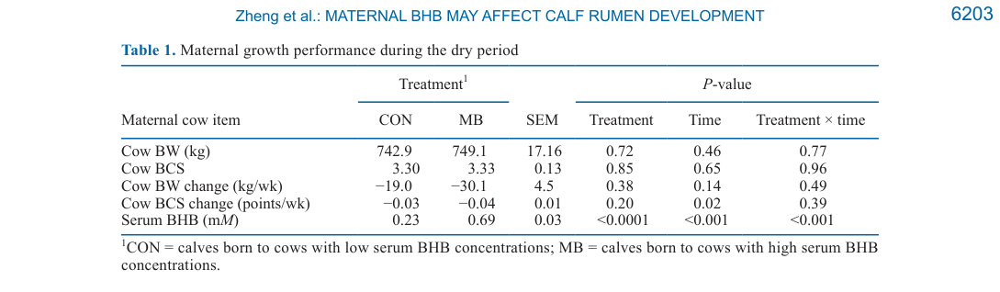
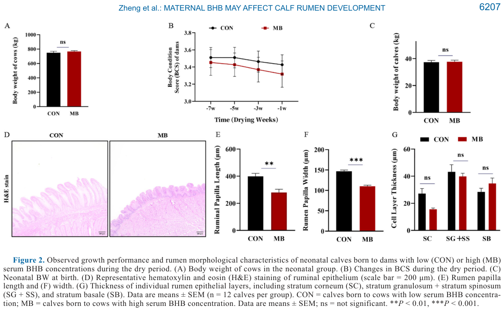

---
# YAML FRONTMATTER (обязательно)
id: CS.SOTA.386
type: sota
format_version: v1.1
knowledge_tier: P2
domain: cattle-science
area: feeding
subarea: dry-period-nutrition
subarea2: calf-rumen-development
category: field-study
year: 2026
authors: "Zheng, J., Zhang, Y., Zhao, X., Gai, Y., Luo, F., Gu, Z., Mao, S., Ma, G., Ghaffari, M. H., and Chen, Y."
title: "Maternal β-hydroxybutyrate during the dry period is associated with altered epithelial cell regulation and rumen morphology of offspring as calves"
journal: "Journal of Dairy Science"
volume: "109"
issue: "6"
pages: "6201-6215"
doi: "10.3168/jds.2025-27835"
publisher: "Elsevier / ADSA"
open_access: true
license: "CC BY"
language: ru
freshness_window: "2026-08-05 — 2028-08-05"
sota_edition: "1.0"
derivation:
  - source: "Zheng et al., 2026, Journal of Dairy Science (109:6)"
    type: "ConservativeRetextualization (FPF A.6.3)"
    reopen_trigger: "DOI: 10.3168/jds.2025-27835"
  - source: "NRC, 2001 — Nutrient Requirements of Dairy Cattle, 7th rev. ed."
    type: "foundational"
    relevance: "Нормы формулирования TMR сухостойных коров в исследовании"
tags:
  - beta-hydroxybutyrate
  - dry-period
  - maternal-programming
  - calf
  - rumen-development
  - ppargamma
  - epithelial-barrier
  - inflammation
related:
  - id: CS.SOTA.XXX
    type: foundational
    note: "NRC 2001 / NASEM 2021 — энергетические потребности сухостойных коров, отрицательный энергетический баланс"
    relevance: high
  - id: CS.SOTA.366
    type: complementary
    note: "Метаболические профили телят при разной жирности ЗЦМ (JDS, том 109) — постнатальное питание телят как второй фактор развития рубца"
    relevance: medium
---

# CS.SOTA.386: Zheng et al. (2026) — Материнский β-гидроксибутират в сухостойный период ассоциирован с изменённой регуляцией эпителиальных клеток и морфологией рубца телят

> **Навигация:** [2. Аннотация](#2-аннотация-abstract) · [3. Введение](#3-введение) · [4. Методология](#4-методология) · [5. Результаты](#5-результаты) · [6. Интерпретация](#6-интерпретация-и-обсуждение) · [7. Критический анализ](#7-критический-анализ) · [8. Выводы](#8-выводы) · [9. FAQ](#9-faq) · [10. Практика](#10-практическое-применение) · [12. Источники](#12-источники)

---

# 2. АННОТАЦИЯ (Abstract)

## 2.1. Перевод Abstract

Сухостойный период — критическая стадия развития плода, в течение которой питательный и метаболический статус матери тесно связан с постнатальным ростом и развитием органов телят. Среди метаболических индикаторов повышенные концентрации β-гидроксибутирата (BHB) в сыворотке коров в этот период привлекают всё больше внимания, однако их связь с развитием рубца потомства остаётся слабо изученной. Целью работы была оценка влияния высокого материнского BHB в сухостой на развитие рубца новорождённых и месячных телят. Сорок восемь коров Holstein со сходными массой тела, лактацией и сроком отёла наблюдались весь сухостой; по концентрациям BHB сыворотки на неделях −7, −5, −3 и −1 коров разделили на группу низкого BHB (CON; 0.23 ± 0.02 мМ; n = 24) и высокого BHB (MB; 0.69 ± 0.03 мМ; n = 24). Ткани рубца телят забирали при рождении и в 1 месяц для оценки морфологии и воспалительных реакций. Материнский BHB не влиял на массу тела телёнка при рождении; однако телята от коров MB имели бо́льшую массу рубца, но меньшие длину и ширину сосочков, что указывает на нарушение структурного развития. Маркеры целостности рубцового эпителия были изменены в группе MB: снижена экспрессия белка плотных контактов Claudin1 и повышена экспрессия воспалительных цитокинов. Экспрессия рецептора PPARγ (peroxisome proliferator-activated receptor gamma) у телят MB была заметно снижена, что согласуется с морфологическими изменениями и воспалением. В заключение: высокий материнский BHB в сухостой может нарушать развитие рубца телят потенциально через маркеры эпителиального барьера, регуляцию метаболических генов и PPARγ-опосредованный воспалительный сигналинг. Результаты подчёркивают важность кормовых стратегий в сухостой для снижения материнских метаболических нарушений и поддержки оптимального развития рубцового эпителия потомства (Zheng et al., 2026, p. 6201).

## 2.2. Key Claims

**Claim 1: Высокий материнский BHB в сухостой (даже ниже порога субклинического кетоза) ассоциирован с задержкой развития сосочков рубца телят.**
- **Утверждение:** У телят от коров MB (средний BHB 0.69 мМ против 0.23 мМ у CON) длина и ширина сосочков рубца снижены и при рождении (P < 0.05), и в 1 месяц (длина P = 0.01, ширина P = 0.05); толщина рогового слоя (stratum corneum) численно меньше на ~36% у новорождённых (P = 0.07) и на ~23% у месячных (P = 0.052).
- **Evidence:** 48 пар корова–телёнок, гистоморфометрия H&E (n = 12 на группу на возраст), два возраста терминального забора.
- **Уверенность:** 0.68 (консистентный эффект в двух возрастах и на морфологическом, и на молекулярном уровнях; ограничения: ассоциативный дизайн без манипуляции BHB, группы сформированы по медиане, телятные исходы не обеспечены power-анализом).
- **Цитата:** "calves from MB cows showed association with increased rumen mass but reduced papilla length and width, indicating association with impaired structural development." (Zheng et al., 2026, p. 6201)

**Claim 2: Масса тела телёнка при рождении и в 1 месяц не зависит от материнского BHB — рубец чувствительнее к материнскому метаболическому статусу, чем общий рост тела.**
- **Утверждение:** Масса телёнка при рождении не различалась между группами (P = 0.85), как и масса тела в 1 месяц (P = 0.55); при этом масса рубца у телят MB была значимо больше (P = 0.03 и P = 0.01) — вероятно, за счёт мускулатуры и гидратации ткани, а не функционального эпителия.
- **Evidence:** Линейные модели с фиксированным эффектом группы; Supplemental Table S4.
- **Уверенность:** 0.70 (прямые измерения, согласуется с Ling et al., 2018 — нарушения роста проявляются при более тяжёлом NEB/клиническом кетозе; диапазон BHB в работе 0.11–1.01 мМ — ниже клинического порога).
- **Цитата:** "Consistent with the relatively low maternal BHB levels in the current study, calf BW was unaffected; however, rumen mass was significantly increased, suggesting that the rumen is more sensitive to maternal BHB fluctuations than overall body growth." (Zheng et al., 2026, p. 6210)

**Claim 3: Высокий материнский BHB ассоциирован с ослаблением эпителиального барьера рубца телёнка (плотные контакты, кератины) и компенсаторным ростом MUC1.**
- **Утверждение:** У новорождённых MB снижена мРНК генов целостности эпителия (MMP2, CLDN1, KRT18, KRT15; P < 0.05), повышена MUC1 (P < 0.05); в 1 месяц паттерн сохраняется (MMP2, CDH1, CLDN1, KRT18, KRT15 ↓). На уровне белка (western blot) Claudin1 снижен, Mucin1 повышен в обоих возрастах (P < 0.05).
- **Evidence:** qPCR (2−ΔΔCt, референсы 18S rRNA + GAPDH) + валидация western blot, нормировка к β-тубулину.
- **Уверенность:** 0.72 (двойная валидация мРНК→белок для ключевых маркеров; воспроизводимость между двумя возрастами; ограничение — барьерная функция оценена по маркерам, без прямых измерений проницаемости).
- **Цитата:** "Protein-level analyses using western blot confirmed that Claudin1 expression was decreased, whereas MUC1 expression was increased in MB calves (P < 0.05; Figure 3D–E), consistent with mRNA expression patterns." (Zheng et al., 2026, p. 6207)

**Claim 4: Рубец телят от высоко-BHB коров демонстрирует провоспалительный профиль и подавление PPARγ — механистическая связка PPARγ–NF-κB.**
- **Утверждение:** У новорождённых MB повышены IL1B, NFKB1, CCL2, IL6, NLRP3 (P < 0.05); в 1 месяц остаются повышенными TNF, NFKB1, CCL2, IL6. Одновременно снижены гены жирнокислотного обмена и белок PPARγ в обоих возрастах (P < 0.05). Авторы интерпретируют это как снятие PPARγ-опосредованного подавления NF-κB.
- **Evidence:** qPCR-панели воспалительных и метаболических генов; western blot PPARγ.
- **Уверенность:** 0.62 (согласуется с Li et al., 2022 — BHB индуцирует воспалительный ответ в бычьих клетках; однако механизм PPARγ–NF-κB показан только ассоциативно, причинность не доказана; [интерполяция] авторов).
- **Цитата:** "PPARG expression was significantly decreased in MB calves at both neonatal and 1-mo-old stages (P < 0.05; Figure 6E–G)." (Zheng et al., 2026, p. 6209)

**Claim 5: Гены пролиферации/дифференцировки эпителия и кетогенеза рубца подавлены у телят MB в обоих возрастах.**
- **Утверждение:** Снижена экспрессия Wnt/β-catenin-каскада и регуляторов клеточного цикла (новорождённые: TCF7, CTNNB1, WNT3, WNT1, TGFB1, CCND1; 1 месяц: MYC, AXIN2, LEF1, TCF7, CTNNB1, WNT3, CCND1; P < 0.05) и генов кетогенеза/транспорта КЦЖ (HMGCS2, SLC16A1/MCT1; P < 0.05); маркер апоптоза CASP3 не изменялся.
- **Evidence:** qPCR-панели в двух возрастах.
- **Уверенность:** 0.66 (конвергентный паттерн по многим генам в двух возрастах; ограничение — только мРНК для большинства генов, множественные сравнения без указанной поправки для генных панелей).
- **Цитата:** "In calves exposed to high maternal BHB, key ketogenesis-related genes (HMGCS2, SLC16A1) were downregulated (Figures 3B and 5B), indicating disruption of epithelial energy metabolism in the rumen." (Zheng et al., 2026, p. 6212)

---

# 3. ВВЕДЕНИЕ

## 3.1. Контекст и значимость проблемы

Сухостойный период (~8 недель до отёла) критичен для регенерации молочной железы и развития плода следующего производственного цикла (Neville, 1974; Sørensen and Enevoldsen, 1991). В фазу быстрого роста плода и органогенеза даже умеренные сдвиги материнского метаболизма могут иметь долгосрочные последствия для роста, созревания и функции тканей плода (McLaren, 1965; Reynolds et al., 2022). Переход к лактации сопровождается отрицательным энергетическим балансом (NEB), ростом липолиза и концентрации BHB — доминирующего кетонового тела и признанного биомаркера кетоза (Duffield et al., 2009). Влияние высокого BHB на здоровье самой коровы описано хорошо, а последствия для развития органов потомства — недостаточно (Zheng et al., 2026, p. 6201–6202).

Рубец — главный пищеварительный орган жвачных; при рождении он недоразвит и слабо кератинизирован, что ограничивает всасывание ЛЖК (Hinders and Owen, 1965). Толщина и дифференцировка эпителия, особенно рогового слоя, — ключевые индикаторы функциональной зрелости (Ragionieri et al., 2016). Раннее развитие рубца чувствительно как к материнскому метаболизму, так и к постнатальному рациону (Reynolds et al., 2022), однако было неизвестно, программирует ли материнский BHB в сухостой структуру и барьерную функцию рубца новорождённого.

## 3.2. Обзор литературы (краткий)

1. **Connor et al. (2013, 2014); Steele et al. (2015)** — сигнальные пути развития рубцового эпителия: PPAR, Hippo, Wnt/β-catenin, NF-κB; эффекторы MYC, CCND1, TGFB1, LEF1/TCF.
2. **Sun et al. (2021b)** — центральная роль PPARγ в обновлении эпителия, липидном обмене и целостности барьера.
3. **Alharthi et al. (2021); Wang et al. (2025)** — высокий материнский BHB связан с активацией NF-κB, инфламмасомы NLRP3 и каспаз-зависимым апоптозом.
4. **Qi et al. (2021)** — внутривенная инфузия BHB у яков снижала микробное разнообразие и повышала долю патогенов — BHB как сигнальная молекула мукозального иммунитета.
5. **Gai et al. (2025)** — сопутствующее исследование той же когорты: материнский BHB и функция бурой жировой ткани новорождённых телят.

## 3.3. Гипотеза и цель исследования

**Гипотеза:** Высокий материнский BHB в сухостой нарушает ключевые регуляторные сети — прежде всего сигналинг PPARγ и его взаимодействие с воспалительными путями, — управляющие развитием рубцового эпителия и барьерной функцией, что в конечном счёте ухудшает целостность и абсорбтивную функцию эпителия (Zheng et al., 2026, p. 6202).

**Цель:** Оценить, ассоциирован ли высокий материнский BHB в сухостой с изменениями морфологии рубца телёнка, дифференцировки эпителия и экспрессии ключевых воспалительных генов и белков, связанных с целостностью барьера, липидным обменом и воспалительной регуляцией, у новорождённых и месячных телят.

---

# 4. МЕТОДОЛОГИЯ

## 4.1. Дизайн исследования

| Параметр | Описание |
|----------|----------|
| **Тип исследования** | Ретроспективный вторичный анализ предопределённой подвыборки когорты; наблюдательная группировка по природному уровню BHB (не РКИ) |
| **Место и период** | Коммерческая ферма HSMD Dairy, Цзинань, провинция Шаньдун, Китай; сентябрь–декабрь 2023 |
| **Животные** | Из 60 многолактационных коров Holstein отобраны 48: сопоставимые BCS, лактация, срок отёла; полные данные BHB; один живой телёнок (все — самцы, подтверждено УЗИ); без клинических метаболических/репродуктивных нарушений послеродово. Исключены 12: неполные данные/потеря проб (3), сбой контроля качества (8), некетотические осложнения (1) |
| **Группы** | По медиане среднего BHB сухостоя (0.45 мМ): CON ≤ 0.45 мМ (0.23 ± 0.02 мМ; n = 24); MB > 0.45 мМ (0.69 ± 0.03 мМ; n = 24) |
| **Коровы** | МТ 746.0 ± 8.50 кг; лактация 1.95 ± 0.16; фристоллы, TMR 2×/сут (0700 и 1700) по NRC (2001) и Du et al. (2018) |
| **Телята** | Молозиво 100 г/кг МТ сразу после рождения + 2 кормления в первые 12 ч; терминальный забор в 24 ч или в 1 мес (пентобарбитал натрия 10 мл в/в); n = 12 на группу на возраст |
| **Ослепление** | Исследователи не знали групповой принадлежности на всех этапах и при анализе данных |
| **Этика** | IACUC Nanjing Agricultural University, протокол #20230625N12 |

## 4.2. Измерения и анализы

- **BHB сыворотки:** кровь из копчиковой вены на неделях −7, −5, −3, −1; тест-полоски Abbott Diabetes Care (предварительная валидация групп) + бычий sandwich-ELISA (Meimian, #MM-5100301); внутрисерийный CV 2.5%, межсерийный 1.5%.
- **Морфометрия:** ткань вентрального мешка рубца; фиксация 4% PFA; срезы 4–5 мкм; H&E; ImageJ 1.54g; длина/ширина сосочков и толщина слоёв эпителия; 3 непересекающихся поля × 5 измерений на пробу; идентификация слоёв по Goosen (1976), Graham and Simmons (2005), Baldwin and Connor (2017).
- **qPCR:** TRIzol, DNase; критерии MIQE (Bustin et al., 2009); эффективность праймеров 90–110%, R² > 0.985; метод 2−ΔΔCt; референсные гены 18S rRNA и GAPDH (валидированы для рубца КРС).
- **Western blot:** Claudin1, Mucin1, PPARγ; нормировка к β-тубулину; хемилюминесценция, ChemiDoc MP (Bio-Rad).

## 4.3. Статистический анализ

- R v4.3.1 (lme4, lmerTest); графики — GraphPad Prism 8.0.
- **Power-анализ** (пакет simr): n > 5 коров/группу даёт ~80% мощности при α = 0.05 для различения материнского BHB; телятные исходы объявлены вторичными и исследовательскими и индивидуально не обеспечены мощностью (нет априорных оценок дисперсии) (Zheng et al., 2026, p. 6206).
- Материнские повторные измерения (BHB, МТ, BCS): линейные смешанные модели (группа, неделя, взаимодействие; корова — случайный эффект); контрасты MB vs CON внутри недели с поправкой Holm.
- Телятные исходы (одно измерение на животное): линейные модели с фиксированным эффектом группы; проверка допущений Shapiro–Wilk и Levene; при нарушениях — трансформации Box–Cox; степени свободы по Satterthwaite.
- Значимость P < 0.05; тенденция 0.05 ≤ P < 0.10.

## 4.4. Медиа-инвентарь

| ID | Тип | Описание | Файл | Статус |
|----|-----|----------|------|--------|
| Table 1 | Таблица | Показатели коров в сухостой (МТ, BCS, изменения, BHB сыворотки) | `table-1-maternal-dry-period-performance.png` | ✅ Встроено |
| Fig. 1 | Схема+график | Дизайн эксперимента (A) и динамика BHB коров (B, C) | — | ⏭️ Пропущено (ключевые числа BHB приведены в тексте 5.1) |
| Fig. 2 | График+фото | Морфология рубца новорождённых (H&E, длина/ширина сосочков, толщина слоёв) | `figure-2-neonatal-rumen-morphology.png` | ✅ Встроено |
| Fig. 3–6 | Графики | qPCR-панели и western blot (новорождённые и месячные; воспаление; PPARγ) | — | ⏭️ Пропущено (состав генов и направление эффектов детально перечислены в 5.3–5.5) |

> **Примечание:** В основном тексте статьи только одна таблица (Table 1); остальные таблицы (S1–S4) — в дополнительных материалах (Mendeley Data, doi:10.17632/mc9kmdgr6f.1). Числа папиллярной морфометрии и масс телят в основном тексте даны только как P-значения; точные значения — в Supplemental Table S4 (в распоряжении обработчика отсутствует) → помечено «не указано в статье (основной текст)».

---

# 5. РЕЗУЛЬТАТЫ

## 5.1. Материнский BHB и показатели коров в сухостой

**Соответствует:** Table 1, Figure 1B–C

*Источник: Zheng et al., 2026, p. 6203 (Table 1).*

**Описание:**
Средний BHB сухостоя: CON 0.23 мМ против MB 0.69 мМ (P < 0.0001). По неделям до отёла (−7/−5/−3/−1): CON — 0.19, 0.23, 0.26, 0.24 мМ (диапазон 0.11–0.53); MB — 0.32, 0.74, 0.86, 0.82 мМ (диапазон 0.20–1.01). Общий диапазон исследования 0.11–1.01 мМ — ниже порога субклинического кетоза 1.2 мМ (Zheng et al., 2026, p. 6206). МТ коров (742.9 vs 749.1 кг; P = 0.72), BCS (3.30 vs 3.33; P = 0.85), изменение МТ (−19.0 vs −30.1 кг/нед; P = 0.38) и BCS (−0.03 vs −0.04 балла/нед; P = 0.20) между группами не различались — группы различаются только по BHB, а не по видимой мобилизации тканей.

**Ключевые цифры:**
- BHB сыворотки: 0.23 vs 0.69 мМ (SEM 0.03; P < 0.0001; время P < 0.001; взаимодействие P < 0.001)
- МТ коров: 742.9 vs 749.1 кг (SEM 17.16; P = 0.72)
- BCS: 3.30 vs 3.33 (SEM 0.13; P = 0.85)

## 5.2. Рост телят и масса рубца

**Описание:**
Масса телёнка при рождении не различалась между группами (P = 0.85); в 1 месяц — также без различий (P = 0.55) (Zheng et al., 2026, p. 6206–6207; точные значения масс — в Supplemental Table S4, в основном тексте не указаны). Масса рубца у телят MB была значимо больше (P = 0.03 и P = 0.01 для двух возрастных страт); авторы приписывают это увеличению мускулатуры и гидратации ткани, а не развитию абсорбтивного эпителия (Zheng et al., 2026, p. 6209).

## 5.3. Морфология рубца новорождённых и месячных телят

**Соответствует:** Figure 2, Figure 4

*Источник: Zheng et al., 2026, p. 6207 (Figure 2).*

**Описание:**
При рождении у телят MB длина (P < 0.01 по фигуре; в тексте P < 0.05) и ширина сосочков (P < 0.001 по фигуре) значимо меньше, чем у CON; толщина слоёв SG+SS и SB не различалась (P ≥ 0.22); роговой слой (stratum corneum, SC) численно тоньше на ~36% (тенденция, P = 0.07). В 1 месяц картина сохраняется: длина сосочков P = 0.01, ширина P = 0.05; SC тоньше на ~23% (тенденция, P = 0.052); SG/SS (P = 0.36) и SB (P = 0.89) без различий (Zheng et al., 2026, p. 6207–6208; точные микрометрические значения — в Supplemental Table S4, в основном тексте не указаны; по столбцам Figure 2E–F визуально: длина ~400 vs ~280 мкм, ширина ~150 vs ~115 мкм — [чтение с графика, не точные данные]).

**Механистическая интерпретация:**
Сосочки рубца — главная абсорбтивная поверхность для ЛЖК; их длина и ширина определяют ёмкость всасывания (Sutton et al., 1963; Dijkstra et al., 1992). Задержка папиллярного роста при неизменной массе тела указывает на органоспецифическую чувствительность к материнскому метаболическому статусу: рубец реагирует на умеренный сдвиг BHB, которого недостаточно для задержки общего роста плода (Zheng et al., 2026, p. 6210).

## 5.4. Экспрессия генов и белков эпителиального барьера

**Соответствует:** Figure 3, Figure 5

**Новорождённые (Zheng et al., 2026, p. 6207):**
- Целостность эпителия ↓: MMP2, CLDN1, KRT18, KRT15 (P < 0.05)
- MUC1 ↑ (P < 0.05) — трансмембранный муцин эпителиальной защиты, маркер мукозального стресса
- Пролиферация/дифференцировка ↓: TCF7, CTNNB1, WNT3, WNT1, TGFB1, CCND1 (P < 0.05)
- Кетогенез/транспорт КЦЖ ↓: HMGCS2, SLC16A1 (P < 0.05)
- CASP3 (апоптоз) — без различий (P > 0.05)
- Белок: Claudin1 ↓, Mucin1 ↑ (P < 0.05, western blot)

**1 месяц (Zheng et al., 2026, p. 6208):**
- Целостность эпителия ↓: MMP2, CDH1, CLDN1, KRT18, KRT15, MUC1 (P < 0.05) — примечательно, что мРНК MUC1 в этом возрасте снижена, тогда как белок Mucin1 повышен (P < 0.05); авторы не комментируют это расхождение
- Пролиферация/дифференцировка ↓: MYC, AXIN2, LEF1, TCF7, CTNNB1, WNT3, CCND1 (P < 0.05)
- Кетогенез ↓: SLC16A1, HMGCS2 (P < 0.05)
- CASP3 — без различий
- Белок: Claudin1 ↓, Mucin1 ↑ (P < 0.05)

**Механистическая интерпретация:**
Плотные контакты в зернистом и шиповатом слоях поддерживают барьерную целостность эпителия; снижение Claudin1 и кератинов (KRT18, KRT15) вероятно ослабляет барьер и повышает проницаемость, что согласуется с ростом MUC1 как ответа на мукозальный стресс (Zheng et al., 2026, p. 6212). Подавление HMGCS2 (лимитирующий фермент рубцового кетогенеза) и SLC16A1/MCT1 (транспортёр КЦЖ) указывает на нарушение энергетического обмена эпителия (Zhuang et al., 2023).

## 5.5. Воспаление и ось PPARγ–NF-κB

**Соответствует:** Figure 6

**Описание:**
У новорождённых MB повышена экспрессия IL1B, NFKB1, CCL2, IL6 и NLRP3 (P < 0.05); в 1 месяц повышены TNF, NFKB1, CCL2, IL6 (P < 0.05) (Zheng et al., 2026, p. 6208–6209). Гены жирнокислотного обмена снижены в обоих возрастах; белок PPARγ (western blot) значимо снижен у телят MB и при рождении, и в 1 месяц (P < 0.05) (Zheng et al., 2026, p. 6209).

**Механистическая интерпретация:**
PPARγ подавляет сигналинг NF-κB, снижая продукцию цитокинов (Dreyer et al., 1992; Blanquart et al., 2003). Снижение PPARγ в модели Zheng et al. снимает это торможение, что согласуется с наблюдаемой активацией NFKB1, NLRP3-инфламмасомы и провоспалительных цитокинов — постулируемый механизм PPARγ–NF-κB cross-talk (Zheng et al., 2026, p. 6212). **Важно:** механизм установлен ассоциативно; прямой манипуляции BHB или PPARγ в работе не было.

---

# 6. ИНТЕРПРЕТАЦИЯ И ОБСУЖДЕНИЕ

## 6.1. Связь с гипотезой

Гипотеза подтверждена на уровне ассоциаций: высокий материнский BHB в сухостой связан с задержкой папиллярного развития, ослаблением маркеров барьера, провоспалительным сдвигом и подавлением PPARγ — все элементы постулируемой регуляторной сети изменились в предсказанном направлении и консистентно в двух возрастах. Однако причинность не доказана: BHB не манипулировался экспериментально, а группы сформированы по природной медиане (0.45 мМ) — возможны нерешённые конфаундеры (Zheng et al., 2026, p. 6213).

## 6.2. Сравнение с литературой

| Исследование | Согласие/Противоречие/Расширение |
|--------------|----------------------------------|
| Wang et al. (2024c), NEB у овец | **Согласуется межвидово** — у ягнят от NEB-овцематок короче сосочки и снижены гены целостности эпителия (BDH1, CLDN1, MCT1, ZO-1); там также ↓ масса при рождении и отъёме (у Zheng et al. масса не изменилась — более мягкий метаболический стресс) |
| Ling et al. (2018) | **Согласуется** — нарушения роста потомства проявляются при более тяжёлом NEB/клиническом кетозе; при BHB < 1.2 мМ масса тела телёнка сохранна |
| Li et al. (2022) | **Согласуется** — NEFA и BHB индуцируют окислительный стресс и воспаление (TNF, IL6, IL1B) в бычьих клетках in vitro |
| Sun et al. (2021b); Alharthi et al. (2021) | **Согласуется** — высокий BHB связан с активацией NF-κB, NLRP3 и каспазных путей при кетозе |
| Gai et al. (2025), та же когорта | **Расширяет** — материнский BHB того же стада ассоциирован с нарушением функции бурой жировой ткани телят; вместе работы показывают мультиорганное программирование |

## 6.3. Механистические выводы

1. **Органоспецифическое программирование:** при умеренном материнском BHB (< 1.2 мМ) общий рост плода сохранен, но рубец демонстрирует морфологическую и молекулярную задержку — рубец чувствительнее тела к материнскому метаболизму (Zheng et al., 2026, p. 6210).
2. **Барьерная дисфункция:** снижение Claudin1 + кератинов при росте MUC1 — паттерн хронического мукозального стресса и, вероятно, повышенной проницаемости эпителия [интерполяция авторов: прямые измерения проницаемости не проводились].
3. **Воспалительный тонус:** устойчивая активация NFKB1/NLRP3/цитокинов с рождения до месяца указывает на запрограммированный, а не транзиторный воспалительный профиль.
4. **PPARγ как узел:** подавление PPARγ связывает метаболический (↓ гены β-окисления, ↓ кетогенез) и воспалительный (↑ NF-κB-цитокины) компоненты — гипотетический механизм cross-talk (Zheng et al., 2026, p. 6212).
5. **Без апоптоза:** CASP3 не изменён в обоих возрастах — нарушение носит регуляторно-воспалительный, а не дегенеративный характер.

---

# 7. КРИТИЧЕСКИЙ АНАЛИЗ

## 7.1. Сильные стороны

- **Чётко определённые группы** по серийным измерениям BHB (4 точки сухостоя, ELISA с CV 2.5%/1.5%), а не по разовому анализу.
- **Многоуровневая валидация:** морфология (H&E) + мРНК (qPCR по MIQE, два референсных гена) + белок (western blot) для ключевых маркеров.
- **Два возраста терминального забора** (рождение и 1 мес) — показана устойчивость эффектов, а не транзиторный феномен.
- **Ослепление исследователей** на всех этапах; заявленный power-анализ для материнского признака.
- **Баланс фоновых характеристик:** группы не различаются по МТ, BCS и их динамике — снижает риск грубого конфаундирования общей мобилизацией тканей.
- **Конвергенция с независимыми данными** (овцы, Wang et al., 2024c; in vitro, Li et al., 2022).

## 7.2. Ограничения

**Внутренние (частично признаны авторами, p. 6213):**
- **Ассоциативный, не причинный дизайн:** BHB природный, не манипулирован; конфаундеры (NEFA, глюкоза, потребление СВ, микробиом, тонкие различия управления) не контролировались.
- **Группировка по медиане** (0.45 мМ) — отсечка внутриферменная, не валидированный физиологический порог; обе группы ниже уровня субклинического кетоза.
- **Барьерная функция — только по маркерам:** нет прямых измерений проницаемости (например, транспорт макромолекул, TEER, Юссинг-камера).
- **Телятные исходы не обеспечены мощностью** (авторы прямо указывают: вторичные, исследовательские эндпоинты); n = 12 на страту.
- **Расхождение мРНК/белок для MUC1 в 1 мес** не объяснено.
- **Только телята-самцы, одна ферма, одна порода** — ограниченная генерализуемость.
- **Долгосрочные последствия** (продуктивность, здоровье рубца после отъёма) не измерялись.

**Внешние:**
- Рацион по NRC (2001) на одной коммерческой ферме Китая; перенос на другие системы кормления сухостоя требует проверки.
- Экстремумы BHB (0.11–1.01 мМ) не покрывают субклинический/клинический кетоз — нельзя экстраполировать дозозависимость выше 1.2 мМ.

## 7.3. Применимость к российским условиям

- **Мониторинг сухостоя:** вывод поддерживает контроль BHB уже в сухостой, а не только после отёла. Практический ориентир из работы: средний BHB сухостоя > 0.45 мМ (по 4 измерениям за −7…−1 нед) — группа риска для потомства [вне статьи: валидированных порогов BHB сухостоя для РФ не существует; отсечка 0.45 мМ — медиана одной фермы].
- **Кормовая база:** при дисбалансе энергии в сухостойных рационах (избыток крахмала в дальнем сухостое либо, наоборот, дефицит энергии в близком к отёлу периоде) риск умеренной гиперкетонемии сопоставим; стратегия — контролируемая энергия сухостоя по NASEM (2021).
- **Выращивание телят:** если материнский сухостой проходил при повышенном BHB, потомству целесообразно уделить повышенное внимание к стимуляции развития рубца (ранний стартер, структурная клетчатка) [guess: прямой компенсации внутриутробной задержки сосочков рационом в статье не проверялось].
- **Доступность метода:** BHB сыворотки измеряется стандартными тест-полосками/ELISA — технологически воспроизводимо в условиях РФ без спецоборудования.

---

# 8. ВЫВОДЫ

## 8.1. Ключевые выводы автора (перевод)

Высокие концентрации материнского BHB в сухостойный период, даже ниже субклинического диапазона, ассоциированы со сниженным развитием и функцией рубца телят без изменения массы при рождении. Телята от высоко-BHB коров показали сниженную экспрессию в рубце генов эпителиальной целостности, дифференцировки и ключевых метаболических маркеров наряду с ростом воспалительных медиаторов. Совокупно данные указывают, что даже умеренное повышение материнского BHB может программировать дисфункцию рубцового эпителия через PPARγ–NF-κB cross-talk. Результаты подчёркивают чувствительность рубца к материнскому метаболическому статусу и открывают потенциальные кормовые или терапевтические стратегии оптимизации энергетического обмена коров в сухостой для улучшения здоровья рубца потомства (Zheng et al., 2026, p. 6213).

## 8.2. Ключевые выводы (структурировано)

1. **BHB сухостоя 0.69 vs 0.23 мМ** (оба ниже порога кетоза) уже различает потомство по развитию рубца.
2. **Масса телёнка сохранна, рубец — нет:** органоспецифическая чувствительность; масса рубца ↑ (мускулатура/гидратация), сосочки короче и уже.
3. **Барьер ослаблен:** ↓ Claudin1/кератины/пролиферативные гены Wnt-каскада, ↑ MUC1 — паттерн мукозального стресса.
4. **Запрограммированное воспаление:** ↑ NFKB1, NLRP3, IL1B, IL6, TNF, CCL2 устойчиво до 1 месяца.
5. **PPARγ подавлен** в обоих возрастах — кандидатный узел связи метаболизма и воспаления (ассоциативно).

## 8.3. Ключевые сообщения для лекции

1. Сухостой — это программирование потомства: умеренный материнский BHB (< 1.2 мМ), не трогающий массу телёнка, уже задерживает развитие его рубца.
2. Рубец — «канарейка» материнского метаболизма: морфология и генные панели реагируют раньше, чем рост тела.
3. Механистическая ось PPARγ–NF-κB связывает кетоновый статус коровы с воспалительным тонусом рубца телёнка.
4. Пороговое мышление «кетоз/нет кетоза» недостаточно: важен весь субклинический градиент BHB сухостоя.

---

# 9. FAQ

**Вопрос 1: Это доказывает, что высокий BHB сухостоя повреждает рубец телёнка?**
Ответ: Нет, работа ассоциативная. Коров разделили по природному BHB (медиана 0.45 мМ), экспериментальной манипуляции не было. Авторы прямо признают: «the study relies on associative rather than causative evidence… leaving potential confounding factors unresolved» (Zheng et al., 2026, p. 6213). Для причинности нужна инфузия BHB или кормовая индукция в контролируемом дизайне.

**Вопрос 2: Почему масса рубца больше, если его развитие задержано?**
Ответ: Масса рубца у MB-телят выше (P = 0.03/0.01), но сосочки короче и уже. Авторы интерпретируют прирост массы как увеличение мускулатуры и гидратации ткани (воспалительный отёк), а не функционального абсорбтивного эпителия (Zheng et al., 2026, p. 6209). Масса органа ≠ функциональная зрелость.

**Вопрос 3: Какой порог BHB сухостоя считать тревожным по этой статье?**
Ответ: Статья не даёт валидированного порога — отсечка 0.45 мМ это медиана конкретного стада. Практический вывод ограничен: средний BHB сухостоя ~0.7 мМ ассоциирован с нежелательными исходами потомства; все значения ниже общепринятого порога субклинического кетоза 1.2 мМ, поэтому «отсутствие кетоза» не гарантирует оптимальное программирование рубца.

**Вопрос 4: Что такое PPARγ–NF-κB cross-talk и почему он важен?**
Ответ: PPARγ — ядерный рецептор, регулирующий липидный обмен и подавляющий воспалительный путь NF-κB (Blanquart et al., 2003). В работе у MB-телят белок PPARγ снижен в обоих возрастах, а NFKB1, NLRP3 и цитокины повышены — согласуется со снятием PPARγ-торможения воспаления. Это кандидатный механизм, но доказан только корреляционно (Zheng et al., 2026, p. 6212).

**Вопрос 5: Сохраняются ли эффекты после месяца и влияют ли на продуктивность?**
Ответ: В статье не указано. Терминальный забор проведён только в 24 ч и в 1 мес; долгосрочные физиологические последствия авторы прямо относят к ограничениям: «the long-term physiological consequences require further direct measurement» (Zheng et al., 2026, p. 6213).

---

# 10. ПРАКТИЧЕСКОЕ ПРИМЕНЕНИЕ

## 10.1. Мониторинг и управление BHB сухостоя (алгоритм)

1. **Серийный мониторинг BHB сухостоя:** измерения на неделях −7, −5, −3, −1 (как в работе) или минимум 2 точки (−3 и −1); тест-полоски пригодны для групповой валидации (Zheng et al., 2026, p. 6202–6203).
2. **Флаг риска:** средний BHB сухостоя, устойчиво превышающий медиану стада (в работе 0.45 мМ) — корова-кандидат в группу внимания по потомству [интерполяция из дизайна].
3. **Кормовая коррекция:** контролируемая энергия сухостоя (избегать как перекорма, так и дефицита в близкий к отёлу период); рацион в работе формулировался по NRC (2001) — для РФ актуальны нормы NASEM (2021).
4. **Маркировка потомства:** телята от высоко-BHB коров — приоритетный контроль развития рубца: раннее введение стартера, качественная структурная клетчатка, контроль потребления твёрдого корма [guess: компенсаторная эффективность в статье не проверялась].

## 10.2. Типичные ошибки

- **«Нет кетоза — всё в порядке»:** эффекты показаны при BHB 0.69 мМ — вдвое ниже порога субклинического кетоза 1.2 мМ.
- **Оценка развития рубца по массе органа:** масса рубца MB-телят выше при задержанных сосочках — масса вводит в заблуждение.
- **Атрибуция причинности:** ассоциативный дизайн не оправдывает немедленной смены протоколов без подтверждающих интервенционных работ.
- **Игнорирование пола телёнка:** в работе только самцы — перенос на тёлочек не валидирован.

## 10.3. Пограничные сценарии

- **Корова с BHB сухостоя 0.5–1.0 мМ без клиники:** по данным работы — зона риска программирования рубца потомства; усилить кормовой аудит сухостоя.
- **Сезонные/кормовые стрессы** (переход на новые партии силоса, жара в сухостое): ожидать сдвигов BHB внутри «субклинического» диапазона — именно они в фокусе статьи.
- **Племенная работа:** телёнок от высоко-BHB коровы не обязан иметь сниженную массу при рождении (P = 0.85) — отбор по массе не отфильтрует риск.

---

# 11. ИНСТРУМЕНТЫ И ШАБЛОНЫ

## 11.1. Ключевые числовые ориентиры

| Параметр | Значение | Комментарий |
|----------|----------|-------------|
| Отсечка групп по BHB сухостоя | 0.45 мМ (медиана стада) | Не валидированный порог |
| Средний BHB: CON vs MB | 0.23 ± 0.02 vs 0.69 ± 0.03 мМ | P < 0.0001 |
| По неделям (−7/−5/−3/−1): CON | 0.19 / 0.23 / 0.26 / 0.24 мМ | Диапазон 0.11–0.53 |
| По неделям (−7/−5/−3/−1): MB | 0.32 / 0.74 / 0.86 / 0.82 мМ | Диапазон 0.20–1.01 |
| Порог субклинического кетоза | 1.2 мМ | Все коровы ниже порога |
| Масса телёнка при рождении | P = 0.85 (без различий) | Точные значения — Suppl. S4 |
| Масса рубца MB vs CON | ↑ (P = 0.03 и P = 0.01) | Мускулатура/гидратация |
| Роговой слой (SC) у MB | −36% (новорожд., P = 0.07); −23% (1 мес, P = 0.052) | Тенденции |
| CV ELISA BHB | 2.5% (внутрисер.) / 1.5% (межсер.) | Качество измерений |
| Размер выборки | 24 коровы/группа; 12 телят/группа/возраст | Телятные исходы без power |

---

# 12. ИСТОЧНИКИ

## 12.1. Первоисточник

Zheng, J., Zhang, Y., Zhao, X., Gai, Y., Luo, F., Gu, Z., Mao, S., Ma, G., Ghaffari, M. H., and Chen, Y. 2026. Maternal β-hydroxybutyrate during the dry period is associated with altered epithelial cell regulation and rumen morphology of offspring as calves. Journal of Dairy Science 109(6):6201-6215. DOI: 10.3168/jds.2025-27835. Open access (CC BY). Received 2025-10-26; accepted 2026-02-14. Дополнительные материалы: https://doi.org/10.17632/mc9kmdgr6f.1

## 12.2. Ключевые статьи (цитированные в работе)

- Gai, Y., Ma, G., et al. 2025. Effects of maternal blood beta-hydroxybutyrate on brown adipose tissue functions and thermogenic and metabolic health in neonatal calves. J. Dairy Sci. 108:6439-6454. [сопутствующая публикация той же когорты]
- Wang, Z., et al. 2024. Negative energy balance affects perinatal ewe performance, rumen morphology, rumen flora structure, and placental function. J. Anim. Physiol. Anim. Nutr. 108:1747-1760. [межвидовое подтверждение]
- Ling, T., Hernandez-Jover, M., Sordillo, L. M., and Abuelo, A. 2018. Maternal late-gestation metabolic stress is associated with changes in immune and metabolic responses of dairy calves. J. Dairy Sci. 101:6568-6580.
- Li, C., et al. 2022. Transcriptome analysis reveals that NEFA and β-hydroxybutyrate induce oxidative stress and inflammatory response in bovine mammary epithelial cells. Metabolites 12:1060.
- Sun, X., et al. 2021. Oxidative stress, NF-κB signaling, NLRP3 inflammasome, and caspase apoptotic pathways are activated in mammary gland of ketotic Holstein cows. J. Dairy Sci. 104:849-861.
- Duffield, T. F., et al. 2009. Impact of hyperketonemia in early lactation dairy cows on health and production. J. Dairy Sci. 92:571-580.
- Baldwin, R. L., and Connor, E. E. 2017. Rumen function and development. Vet. Clin. North Am. Food Anim. Pract. 33:427-439.
- Connor, E. E., et al. 2013, 2014. Gene expression/regulators of calf rumen epithelium during weaning. Funct. Integr. Genomics 13:133-142; J. Dairy Sci. 97:4193-4207.
- Zhuang, Y., et al. 2023. Roles of exogenous β-hydroxybutyrate for rumen epithelium development in young goats. Anim. Nutr. 15:10-21.
- Reynolds, L. P., et al. 2022. Maternal nutrition and developmental programming of offspring. Reprod. Fertil. Dev. 35:19-26.
- Blanquart, C., et al. 2003. PPARs: regulation of transcriptional activities and roles in inflammation. J. Steroid Biochem. Mol. Biol. 85:267-273.
- NRC. 2001. Nutrient Requirements of Dairy Cattle. 7th rev. ed. National Academies Press. [нормы рациона сухостоя в исследовании]

## 12.3. Внешние источники [вне статьи]

- NASEM. 2021. Nutrient Requirements of Dairy Cattle. 8th rev. ed. National Academies Press. [foundational reference, не цитируется в Zheng et al., 2026 — актуальная замена NRC 2001 для нормирования сухостоя в РФ]

---

# 13. ЖУРНАЛ ОБРАБОТКИ

## 13.1. WorkPlan

| Шаг | Действие | Статус |
|-----|----------|--------|
| 1 | Чтение полного текста PDF (15 страниц) | ✅ |
| 2 | Извлечение метаданных (авторы, DOI, страницы, лицензия) | ✅ |
| 3 | Извлечение медиа (Table 1 — единственная таблица основного текста; Figure 2 — ключевая морфология) | ✅ |
| 4 | Анализ дизайна (ретроспективная группировка по медиане BHB, 2 возраста забора) | ✅ |
| 5 | Выделение Key Claims с оценкой уверенности | ✅ |
| 6 | Описание методологии (отбор когорты, ELISA, гистология, qPCR, WB, статистика) | ✅ |
| 7 | Детализация результатов (BHB, морфология, генные панели, воспаление, PPARγ) | ✅ |
| 8 | Критический анализ и применимость к РФ | ✅ |
| 9 | FAQ, практическое применение, инструменты | ✅ |
| 10 | Формирование YAML frontmatter | ✅ |
| 11 | Сохранение файла | ✅ |

## 13.2. Work Record

| Параметр | Значение |
|----------|----------|
| **Время обработки** | ~45 мин |
| **Строк в файле** | ~430 |
| **Число Key Claims** | 5 |
| **Число источников** | 14 (первоисточник + 12 цитированных + 1 внешний) |
| **Число медиа** | 2 (Table 1 + Figure 2; в основном тексте статьи только 1 таблица, остальные — supplemental) |
| **Пропущенные медиа** | Fig. 1 (схема дизайна + динамика BHB; числа приведены в тексте), Fig. 3–6 (qPCR/WB-панели; состав генов и направления эффектов полностью перечислены в 5.3–5.5) |
| **Неразборчивые места** | Точные микрометрические значения сосочков и масс телят — только в Supplemental Table S4 (вне PDF); визуальные оценки с Figure 2 помечены как чтение с графика |
| **FPF compliance** | A.7 (строгое разделение модели и реальности), A.6.3 (консервативная переработка), A.10 (якоря доказательств с указанием страниц) |

---

*SoTA создан: 2026-08-05*
*Обработано: Kimi Code CLI (subagent SoTA-batch, июнь 2026, JDS 109:6)*
