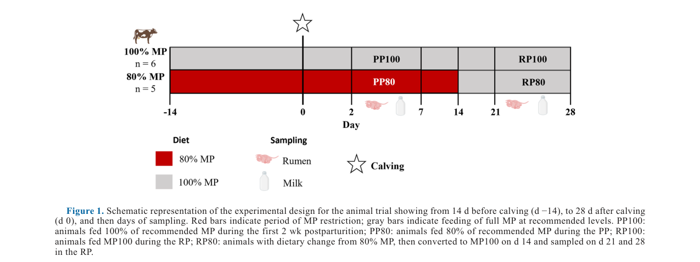
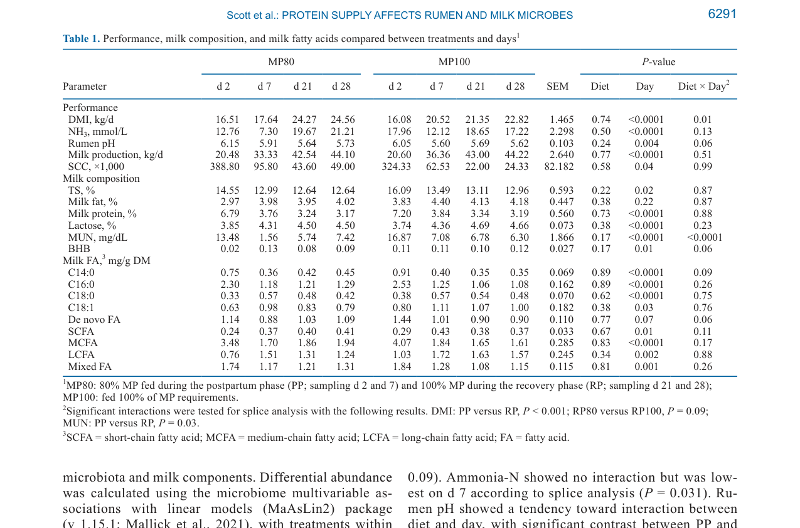
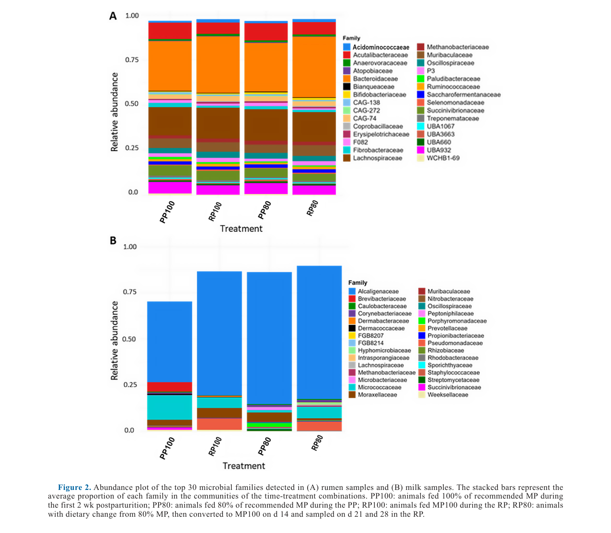

---
# YAML FRONTMATTER (обязательно)
id: CS.SOTA.388
type: sota
format_version: v1.1
knowledge_tier: P2
domain: cattle-science
area: feeding
subarea: transition-cow-nutrition
subarea2: rumen-milk-microbiota
category: field-study
year: 2026
authors: "Scott, J., Brouard, J. S., Drouin, G., Ouellet, D. R., Ster, C., and Petri, R. M."
title: "Microbiota changes in rumen and milk corresponding to dietary protein intake in transition dairy cows"
journal: "Journal of Dairy Science"
volume: "109"
issue: "6"
pages: "6287-6300"
doi: "10.3168/jds.2025-27576"
publisher: "Elsevier / ADSA"
open_access: true
license: "Open Government Licence v3 (Crown Copyright)"
language: ru
freshness_window: "2026-08-05 — 2028-08-05"
sota_edition: "1.0"
derivation:
  - source: "Scott et al., 2026, Journal of Dairy Science (109:6)"
    type: "ConservativeRetextualization (FPF A.6.3)"
    reopen_trigger: "DOI: 10.3168/jds.2025-27576"
tags:
  - transition-cow
  - metabolizable-protein
  - rumen-microbiota
  - milk-microbiota
  - shotgun-metagenomics
  - nitrogen-efficiency
  - negative-energy-balance
  - holstein
related:
  - id: CS.SOTA.135
    type: extends
    note: "Zang et al. (2021) — снижение MP в ранней лактации: продуктивность, метаболиты крови, здоровье; результаты Scott et al. согласуются (нет различий по продуктивности и здоровью)"
    relevance: high
  - id: CS.SOTA.272
    type: complementary
    note: "Arshad et al. (2026) — влияние обеспеченности MP на метаболизм CD4+ T-лимфоцитов; иммунный срез той же проблематики белкового питания транзита"
    relevance: medium
  - id: CS.SOTA.300
    type: foundational
    note: "NASEM 2021 — белковые потребности (MP-система), база для формулирования рационов MP80/MP100"
    relevance: high
---

# CS.SOTA.388: Scott et al. (2026) — Изменения микробиоты рубца и молока в ответ на потребление диетического белка у коров в транзитный период

> **Навигация:** [2. Аннотация](#2-аннотация-abstract) · [3. Введение](#3-введение) · [4. Методология](#4-методология) · [5. Результаты](#5-результаты) · [6. Интерпретация](#6-интерпретация-и-обсуждение) · [7. Критический анализ](#7-критический-анализ) · [8. Выводы](#8-выводы) · [9. FAQ](#9-faq) · [10. Практика](#10-практическое-применение) · [12. Источники](#12-источники)

---

# 2. АННОТАЦИЯ (Abstract)

## 2.1. Перевод Abstract

В транзитный период у молочных коров возрастает заболеваемость из-за отрицательного энергетического баланса (NEB), затрагивающего метаболический и иммунный статус. Ограничение продукции молока в начале лактации улучшает метаболический статус, однако ранее тестированные стратегии либо снижали надой до конца лактации, либо были трудны для крупных ферм. Исследование оценивало влияние временного снижения обеспеченности метаболическим белком (MP) в транзит на микробиоту рубца и молока и их метаболический состав. Коровы обработки (n = 5) получали 80% потребности в MP (MP80) с 14 дня до отёла до 14 дня после, затем переводились на рацион 100% MP (MP100) ещё на 14 дней. Контроль (n = 6) получал MP100 весь эксперимент. Пробы рубцового содержимого и молока брали в фазу постпартум (PP) на 2 и 7 день и после смены рациона в фазу восстановления (RP) на 21 и 28 день. ДНК всех проб анализировали shotgun-метагеномным секвенированием (Illumina NovaSeq); молоко дополнительно — на состав, рубцовую жидкость — на КЖК и аммиачный азот. Значимые изменения микробного состава были почти исключительно связаны с днём сэмплинга; исключение — семейство Micrococcaceae, дифференциально более обильное в молоке MP100-группы в PP. Работа применила метагеномный подход к влиянию изменённой обеспеченности белком на микробиоту рубца и молока как на две отдельные экосистемы (Scott et al., 2026, p. 6287).

## 2.2. Key Claims

**Claim 1: День лактации — доминирующий фактор изменчивости микробиоты; 20%-е снижение MP почти не сдвигает состав сообществ.**
- **Утверждение:** Значимые изменения микробного состава рубца и молока почти исключительно связаны с эффектом дня сэмплинга, а не диеты; 30 наиболее обильных семейств рубца не различались значимо между MP80 и MP100.
- **Evidence:** Shotgun-метагеномика рубца (Kraken2/Bracken, GTDB r214) и молока (MetaPhlAn 4); смешанная модель с повторными измерениями, n = 11 коров; дифференциальный анализ MaAsLin2.
- **Уверенность:** 0,75 (консистентно по нескольким статистическим подходам; ограничение — малый n = 5/6 и недостаточная полнота геномных баз для рубцовых бактерий).
- **Цитата:** "Significant changes to the microbial composition were almost exclusively associated with the effect of day of sampling" (Scott et al., 2026, p. 6287).

**Claim 2: Единственный дифференциально обильный таксон — Micrococcaceae (род Kocuria) в молоке фазы PP: обильнее у коров на полном MP.**
- **Утверждение:** В молоке PP семейство Micrococcaceae было значимо ниже у MP80 против MP100 (контраст PP80 vs PP100, P = 0,05); род Kocuria — оппортунистический патоген кожи и молока, интересен в контексте One Health.
- **Evidence:** MaAsLin2 с контрольной группой восстановления как референсом; подтверждено анализом только PP-проб с MP100 как референсом (Figure 3B).
- **Уверенность:** 0,62 (высокая внутригрупповая вариация молочного микробиома; авторы сами осторожны в атрибуции к диете).
- **Цитата:** "...the family Micrococcaceae, which was found to be differentially abundant in the MP100 compared with the 80% group in PP milk samples" (Scott et al., 2026, p. 6287).

**Claim 3: Азотный статус отражает смену рациона: мочевинный азот молока (MUN) — единственный продуктивный показатель с выраженным взаимодействием диета × день.**
- **Утверждение:** MUN показал значимое взаимодействие диета × день (P < 0,0001); среднее по фазам 9,75 мг/дл в PP против 6,56 мг/дл в RP (P < 0,001); на день 28 MP80 был выше MP100 (7,42 vs 6,30 мг/дл, P = 0,032).
- **Evidence:** Смешанная модель, контрасты фаз и splice-анализ по дням (Table 1).
- **Уверенность:** 0,70 (значимые P, но интерпретация затруднена высокими значениями сразу после отёла у обеих групп: 13,48–16,87 мг/дл на день 2).
- **Цитата:** "Milk urea nitrogen showed a significant interaction between diet and day, and contrast analysis showed an effect of phase with an average of 9.75 mg/dL in the PP phase compared with 6.56 in the RP (P < 0.001)" (Scott et al., 2026, p. 6291).

**Claim 4: Возврат на 100% MP после 2-недельной рестрикции полностью восстанавливает систему: остаточных различий по продуктивности и микробиоте нет.**
- **Утверждение:** В фазе RP (дни 21–28) не выявлено остаточных эффектов на надой и дифференциальную обилие таксонов; выявлена лишь тенденция к большему потреблению СВ (DMI) у ранее рестриктированных коров (RP80 vs RP100, P = 0,09).
- **Evidence:** Дифференциальный анализ таксонов (рубец и молоко) — нулевые различия в RP; Table 1 (надой 44,10 vs 44,22 кг/д на день 28, P диеты = 0,77).
- **Уверенность:** 0,68 (согласуется с Zang et al., 2021 и сопутствующей статьёй Tapp et al., 2025; короткое окно наблюдения RP — 14 дней).
- **Цитата:** "Differential abundance analyses also revealed no lasting differences in microbial abundances between the previously restricted MP80 and the MP100 cows, indicating a full system return to normal" (Scott et al., 2026, p. 6298).

**Claim 5: Рубцовые семейства коррелируют с продуктивностью и здоровьем вымени — кандидаты в биомаркеры, но не доказанные механизмы.**
- **Утверждение:** Acidaminococcaceae положительно коррелировали с надоем (r > 0,52, P ≤ 0,001) и лактозой молока (r > 0,74, P ≤ 0,001); Fibrobacteraceae — положительно с SCC (r > 0,42, P ≤ 0,01) и de novo ЖК, Ruminococcaceae — отрицательно с SCC (r > −0,35, P ≤ 0,05). Статус: [интерполяция] — корреляционные связи без причинности.
- **Evidence:** Spearman-корреляции по всем обработкам (Figure 5).
- **Уверенность:** 0,55 (корреляции умеренные, не скорректированы на множественные сравнения явно; гипотезогенерирующий характер).
- **Цитата:** "Rumen family Acidaminococcaceae was positively correlated with total milk production (r > 0.52; P ≤ 0.001) as well as the lactose content of the milk (r > 0.74; P ≤ 0.001)" (Scott et al., 2026, p. 6296).

---

# 3. ВВЕДЕНИЕ

## 3.1. Контекст и значимость проблемы

В раннюю лактацию коровы находятся в отрицательном энергетическом балансе (NEB): потребление корма отстаёт от растущих затрат на синтез молока, и корова мобилизует жировую ткань и мышечный белок (Bauman and Currie, 1980; McArt et al., 2013 — цит. по Scott et al., 2026, p. 6287). Рубцовые микробы — ключевой поставщик энергии хозяину через короткоцепочечные жирные кислоты (SCFA) и микробный белок. Избыточное белковое кормление сверх метаболической ёмкости в транзит снижает эффективность утилизации азота, повышает экскрецию N с навозом и уменьшает рентабельность (Zang et al., 2021). При этом, в отличие от энергетически богатых рационов, белково-богатые рационы заметно не влияют на выход микробного белка и обилие родов, участвующих в энергетическом обмене (Belanche et al., 2012; Jami et al., 2014). Недавние работы показали, что снижение потребления белка может оптимизировать микробную эффективность и азотную экономику (Rehman et al., 2020; Leduc et al., 2023). Возможные связи между микробиотой рубца и микробиотой молока при диетических воздействиях отмечались ранее (Jami et al., 2013; Lima et al., 2015), но целостный «двухэкосистемный» анализ при временной белковой рестрикции отсутствовал — этот пробел закрывает работа (Scott et al., 2026, p. 6288).

## 3.2. Обзор литературы (краткий)

1. **Bauman and Currie (1980); McArt et al. (2013)** — NEB и мобилизация резервов как метаболическая рамка транзита.
2. **Bergman (1990); Van Soest (1994)** — SCFA как основной источник энергии жвачного; роль микробной ферментации.
3. **Belanche et al. (2012); Jami et al. (2014)** — слабое влияние уровня белка рациона на рубцовый микробиом (в отличие от углеводов).
4. **Zang et al. (2021)** — снижение MP в ранней лактации: без различий по эффективности кормления, надою, составу молока и здоровью.
5. **Rehman et al. (2020); Leduc et al. (2023)** — снижение белка/RDP повышает азотную эффективность.
6. **Jami et al. (2013); Lima et al. (2015); Pitta et al. (2014)** — временная динамика рубцового микробиома в транзит и связи рубцовых и молочных сообществ.

## 3.3. Гипотеза и цель исследования

**Гипотеза 1:** Снижение MP в раннюю лактацию повышает микробную эффективность рубца и утилизацию энергии, улучшая азотную эффективность транзитных коров.
**Гипотеза 2:** Возврат к 100% MP через 2 недели постпартум вместе с ростом DMI переведёт микробиоту рубца и молока к полной метаболической ёмкости, повышая надой и улучшая постпартумное здоровье (Scott et al., 2026, p. 6288).

**Цель:** Исследовать связи между энергетическими потребностями, ролью рубцовых микробов и влиянием обеспеченности белком на качество молока с фокусом на взаимодействие микробиоты рубца и молока при временно сниженном MP.

**Primary outcomes:** таксономический состав и предсказанный функциональный профиль микробиоты рубца и молока.
**Secondary outcomes:** DMI, рубцовые pH и NH₃, надой, состав молока (белок, жир, лактоза, MUN, BHB, ЖК-профиль), SCC.

---

# 4. МЕТОДОЛОГИЯ

## 4.1. Дизайн исследования

| Параметр | Описание |
|----------|----------|
| **Тип исследования** | Контролируемый кормовой эксперимент, 2 группы, повторные измерения; отчётность по ARRIVE 2.0 |
| **Место** | Sherbrooke Research and Development Centre, Agriculture and Agri-Food Canada (QC, Канада); разрешение комитета по содержанию животных № 591 |
| **Животные** | 11 фистулированных многоплодных (multiparous) коров Holstein, включены с дня −28 до +28 от отёла |
| **Обработки** | MP80 (n = 5): 80% потребности в MP с дня −14 до +14, затем MP100 (дни 15–28, «восстановление»); MP100 (n = 6): 100% MP весь период (под прогнозный надой 40 кг/д) |
| **Формулирование** | Модель CNCPS v. 6.55; все рационы изоэнергетичны; состав рационов — в Tapp et al. (2025) |
| **Содержание** | Привязное, TMR 2 раза/день (0915 и 2100 ч), вода ад либитум |
| **Фазы сэмплинга** | PP (postpartum phase): дни 2 и 7; RP (recovery phase): дни 21 и 28 |
| **Статистика** | SAS 9.4; смешанная модель с повторными мерами (день — repeated, корова — subject, гетерогенная авторегрессионная ковариация); фиксированные эффекты: диета, день, взаимодействие; slicing и ортогональные контрасты по фазам (PP100 vs PP80, RP100 vs RP80); P ≤ 0,05, тенденции 0,05–0,10 |

*Источник: Scott et al., 2026, p. 6289 (Figure 1). Красные полосы — период рестрикции MP (80%); серые — полное обеспечение MP. Сэмплинг рубца и молока на дни 2, 7, 21, 28.*

## 4.2. Сбор образцов и анализы

- **Рубец:** дни 2, 7, 21, 28 через 2 ч после утреннего кормления; ~150 г целого содержимого из 5 точек рубца (краниально-вентральная, краниально-дорсальная, каудально-вентральная, каудально-дорсальная, медиальная), гомогенизация; подпроба для ДНК — на −80°C; жидкая фракция — pH немедленно; NH₃ стабилизирован 6 N HCl, −20°C; колориметрия по Weatherburn (1967) при 625 нм (Scott et al., 2026, p. 6288–6289).
- **Молоко:** дойка 2 раза/день (0700 и 1900 ч); асептические пробы утренней дойки в те же дни; бронопол + 4°C → Lactanet (лактоза, белок, жир, SCC, ЖК-профиль); подпробы −80°C для ДНК.
- **ДНК:** метод double bead-beating plus column (DBB+C, по Zaheer et al., 2018, с модификациями): два раунда bead-beating (Omni Bead Ruptor 24, 4000 rpm, 3 мин), инкубация 70°C, осаждение изопропанолом (для молока — с со-осадителем GlycoBlue), RNase A, Proteinase K, колонки QIAamp Fast DNA Stool Mini Kit; контроль чистоты 260/280 и 260/230 (NanoDrop 8000), целостность — гель-электрофорез 1% (p. 6289).

## 4.3. Секвенирование и биоинформатика

- **Платформа:** Illumina NovaSeq 6000, paired-end 150 bp (Genome Quebec); пайплайн AAFC metagenomics_nf (Nextflow, открыт на GitHub); данные — BioProject PRJNA1311556.
- **Препроцессинг:** fastp 0.23.4 (адаптеры/качество); удаление хозяйской ДНК — маппинг на PhiX + геном ARS-UCD 1.3 (Bowtie2 2.5.1), немаппирующиеся чтения — BEDtools 2.30.0.
- **Таксономия:** рубец — Kraken2 2.1.2 + Bracken 2.9, база GTDB r214, confidence score 0,5; молоко — MetaPhlAn 4.0 с родной базой.
- **MAG:** сборка MEGAHIT (индивидуальная и ко-сборка по дням, --min-contig-len 1000), биннинг MetaBAT2, качество CheckM2 (>90% полнота, <5% контаминация), дедупликация dRep 2.4.3; из молока восстановлено лишь 5 MAG — исключены из функционального анализа из-за недостаточной глубины; функциональное профилирование только для рубца — DRAM 1.4.6 на 402 MAG (99 путей), таксономия MAG — GTDB-Tk 2.1.1 (r214.2); дифференциальные пути — LEfSe (p. 6290).
- **Дифференциальная обилие таксонов:** MaAsLin2 1.15.1 (обработки внутри фаз — фиксированный эффект, коровы — случайный, референс — контроль в RP); корреляции — Spearman (PROC CORR), градации: fair 0,30–0,50, moderate 0,5–0,7, strong 0,70–0,9, substantial > 0,90 (p. 6290–6291).

## 4.4. Медиа-инвентарь

| ID | Тип | Описание | Файл | Статус |
|----|-----|----------|------|--------|
| Fig. 1 | Схема | Дизайн эксперимента: периоды MP80/MP100 и дни сэмплинга | `figure-1-experimental-design.png` | ✅ Встроено |
| Table 1 | Таблица | Продуктивность, состав молока и молочные ЖК по обработкам и дням | `table-1-performance-milk-composition.png` | ✅ Встроено |
| Fig. 2 | График | Топ-30 микробных семейств рубца (A) и молока (B) по обработкам | `figure-2-top30-families-rumen-milk.png` | ✅ Встроено |
| Table 2 | Таблица | Индексы разнообразия и относительная обилие семейств в рубце | — | ❌ Не извлечён (текстовое извлечение PDF дало артефакт переплетения колонок; ключевые значения приведены текстом в 5.3) |
| Table 3 | Таблица | Индексы разнообразия и относительная обилие семейств в молоке | — | ❌ Не извлечён (та же причина; ключевые значения — в 5.4) |
| Fig. 3 | График | Дифференциальная обилие (MaAsLin2): теплокарта топ-30 семейств рубца (A), боксплот Micrococcaceae (B) | — | ❌ Не извлечён (пересказ в 5.5) |
| Fig. 4 | Теплокарта | Обилие функциональных путей рубца (азотный обмен, метаногенез, SCFA) | — | ❌ Не извлечён (пересказ в 5.6) |
| Fig. 5 | Теплокарта | Spearman-корреляции семейств рубца с компонентами молока | — | ❌ Не извлечён (пересказ в 5.7) |

---

# 5. РЕЗУЛЬТАТЫ

## 5.1. Продуктивность и рубцовые метаболиты

**Соответствует:** Table 1

*Источник: Scott et al., 2026, p. 6291 (Table 1).*

**Описание:**
DMI рос после дня 2 с взаимодействием день × диета (P = 0,01); контраст PP vs RP значим (P < 0,001), тенденция к большему DMI у RP80 против RP100 (P = 0,09). NH₃ без взаимодействия, минимум на день 7 (splice, P = 0,031). Рубцовый pH — тенденция к взаимодействию (P = 0,06), контраст PP vs RP P = 0,002, минимум на день 7 (P = 0,024). Надой рос, SCC снижался с днями (P = 0,04); эффекта диеты нет (P = 0,77 и 0,58). MUN — значимое взаимодействие диета × день (P < 0,0001): среднее PP 9,75 мг/дл против RP 6,56 мг/дл (P < 0,001); splice: RP на день 21 тенденция (P = 0,089), на день 28 значимо (P = 0,032). BHB молока — тенденция к взаимодействию без конкретного фактора.

**Ключевые цифры (MP80 vs MP100 по дням 2/7/21/28):**
- DMI, кг/д: 16,51 / 17,64 / 24,27 / 24,56 против 16,08 / 20,52 / 21,35 / 22,82 (диета P = 0,74; день P < 0,0001; взаимодействие P = 0,01).
- Надой, кг/д: 20,48 / 33,33 / 42,54 / 44,10 против 20,60 / 36,36 / 43,00 / 44,22 (диета P = 0,77).
- MUN, мг/дл: 13,48 / 1,56 / 5,74 / 7,42 против 16,87 / 7,08 / 6,78 / 6,30 (взаимодействие P < 0,0001).
- Рубцовый pH: 6,15 / 5,91 / 5,64 / 5,73 против 6,05 / 5,60 / 5,69 / 5,62 (день P = 0,004).
- NH₃, ммоль/л: 12,76 / 7,30 / 19,67 / 21,21 против 17,96 / 12,12 / 18,65 / 17,22 (диета P = 0,50).

**Механистическая интерпретация:** Изоэнергетичность рационов и сопоставимый DMI объясняют отсутствие различий по надою; снижение MUN после отёла у обеих групп отражает разрешение NEB и рост потребления, а более высокий MUN у MP80 на день 28 может отражать перестройку азотного обмена после возврата на полный MP [интерпретация авторов: p. 6291, 6297–6298].

## 5.2. Состав молока и жирнокислотный профиль

**Соответствует:** Table 1 (блоки Milk composition, Milk FA)

**Описание:**
Сухие вещества молока (TS) снижались с ростом надоя (день P = 0,02); жирность не менялась (P = 0,22). Белок молока снижался с 6,79–7,20% (день 2) до 3,17–3,19% (день 28) без эффекта диеты (P = 0,73). Лактоза росла до дня 21, затем стабилизировалась. C14:0 и de novo ЖК — тенденции к взаимодействию; C14:0 максимален сразу после отёла (контраст PP vs RP, P < 0,001; RP80 vs RP100, P = 0,015; splice день 21, P = 0,049). C16:0, MCFA и смешанные ЖК — эффект дня с максимумом после отёла (PP vs RP, P < 0,001); C16:0 и MCFA выше в RP80 (P < 0,001) (Scott et al., 2026, p. 6291–6292).

## 5.3. Таксономический профиль рубца

**Соответствует:** Figure 2A, Table 2

*Источник: Scott et al., 2026, p. 6293 (Figure 2). Стековые столбцы — средняя доля каждого семейства по комбинациям время × обработка.*

**Описание:**
Доминируют Bacteroidaceae и Lachnospiraceae — в сумме чуть менее 50% относительной обилие без эффекта диеты. Bacteroidaceae ниже в PP против RP (25,9% vs 32,5%; контраст P = 0,004). Erysipelotrichaceae — единственное семейство со значимым взаимодействием диета × день (P < 0,001): контраст PP80 vs PP100 P = 0,05, splice день 7 (0,011% vs 0,007% MP80 vs MP100, P = 0,03). Эффект обработки без взаимодействия: Ruminococcaceae (P = 0,05) и Paludibacteraceae (P = 0,04) — оба обильнее в MP100; Ruminococcaceae снижены на день 7 (P = 0,01), контраст PP100 > PP80 (P = 0,002). Treponemataceae — контраст PP80 vs PP100 (P = 0,007), минимум на день 2. Fibrobacteraceae выше сразу после отёла, чем на день 21 (0,02% vs 0,002%; PP vs RP, P = 0,001). Индекс Шеннона рубца: эффект дня, минимум на день 7 (5,87 H в обеих группах); splice — различие обработок на день 2 (MP80 6,37 vs MP100 6,54, P = 0,04) (Scott et al., 2026, p. 6292, Table 2).

## 5.4. Таксономический профиль молока

**Соответствует:** Figure 2B, Table 3

**Описание:**
Доминирующее семейство молока — Alcaligenaceae (род Achromobacter), до 72% сообщества (группы RP80 и PP80); тенденция к большей обилие у MP80 (P = 0,07; контраст PP80 vs PP100, P = 0,057). Индекс Шеннона молока: взаимодействие диета × день (P = 0,04), эффект фазы (PP vs RP, P = 0,008), splice — тенденция на день 7 (P = 0,08). Moraxellaceae — эффект дня (P = 0,01), тенденция к взаимодействию (P = 0,09). Micrococcaceae — контраст PP80 vs PP100 (P = 0,05), splice — тенденции на дни 7 (P = 0,058) и 28 (P = 0,0458). Nitrobacteraceae — рост обилие к концу эксперимента (день P = 0,05; фаза P = 0,014). Methanobacteriaceae, Hyphomicrobiaceae и Rhodobacteraceae детектированы только в молоке MP80-животных. Анализ проведён несмотря на низкое покрытие чтениями из-за бычьей контаминации (Supplemental Table S3) — авторы прямо оговаривают обзорный характер анализа молочного микробиома (Scott et al., 2026, p. 6292–6293).

**Механистическая интерпретация:** Achromobacter — типичные бактерии порчи сырого молока (протеазы, липазы), Kocuria — комменсал кожи млекопитающих и оппортунистический патоген; присутствие в молоке не означает персистентной колонизации вымени — возможен транзитный характер из среды (p. 6297–6298).

## 5.5. Дифференциальная обилие таксонов

**Соответствует:** Figure 3

**Описание:**
MaAsLin2 с референсом RP100: в рубце 30 наиболее различающихся семейств почти идентичны у MP80 и MP100 в PP; в RP у MP80-коров значимых различий нет. В молоке аналогично различий нет. Отдельный анализ только PP-проб (референс MP100): рубец — без значимых различий; молоко — Micrococcaceae значимо ниже в MP80 (Figure 3B) (Scott et al., 2026, p. 6293–6295).

## 5.6. Функциональное профилирование рубца

**Соответствует:** Figure 4

**Описание:**
Из молока восстановлено только 5 MAG — функциональный анализ выполнен лишь для рубца (402 MAG). Профили метаболизма 4 групп (фаза × диета) очень схожи. Путь конверсии монометиламина в аммиак уникально частично детектирован у MP80 в PP; путь конверсии азота в аммиак у MP80 обильнее в PP, чем в RP; путь «ацетат → метан, часть 1» представлен слабее; конверсия нитрата в нитрит детектирована только в RP (Scott et al., 2026, p. 6295).

## 5.7. Корреляции микробиоты с путями и компонентами молока

**Соответствует:** Figure 5, Supplemental Figures S1–S2

**Описание:**
В PP у MP100 семейство UBA660 (неполно охарактеризованный Bacillales, Firmicutes) сильно отрицательно ассоциировано с продукцией ацетата и путём ацетат → метан (r > −0,72; P ≤ 0,005); у MP80 в PP сильных корреляций (|r| > 0,70) не найдено. Большинство ассоциаций — в RP; у MP80 все положительные ассоциации связаны с Ruminococcaceae (0,76 < r < 0,81; P ≤ 0,01) и касаются продукции SCFA (ацетат, бутират, L-лактат, формиат) и аммиака из азота; отрицательные — восстановление нитрита в аммиак, продукция D-лактата, конверсия пирувата в ацетил-КоА. Пять семейств существенно отрицательно коррелированы с конверсией пирувата: UBA660, Erysipelotrichaceae, Acidaminococcaceae, Anaerovoracaceae, Bianqueaceae (r < −0,90; P ≤ 0,003) (Scott et al., 2026, p. 6295–6296).

**Рубец ↔ молоко (независимо от обработки):** Acidaminococcaceae + надой (r > 0,52, P ≤ 0,001) и + лактоза (r > 0,74, P ≤ 0,001); Fibrobacteraceae − надой (r > −0,35, P ≤ 0,05) и − лактоза (r > −0,48, P ≤ 0,01), + смешанные ЖК, C16:0–2, de novo ЖК и + SCC (r > 0,42, P ≤ 0,01); Ruminococcaceae − SCC (r > −0,35, P ≤ 0,05); Selenomonadaceae + лактоза (r > 0,60, P ≤ 0,001); Acidaminococcaceae и DMI − белок молока (r > −0,61 и r > −0,63, P ≤ 0,001) (p. 6296).

---

# 6. ИНТЕРПРЕТАЦИЯ И ОБСУЖДЕНИЕ

## 6.1. Связь с гипотезой

Гипотеза 1 (снижение MP повысит микробную эффективность и азотную утилизацию) **подтверждена лишь косвенно**: стабильность рубцового микробиома и отсутствие различий по продуктивности совместимы с сохранением эффективности при меньшем белке, но прямых измерений азотной экскреции и воспаления нет — авторы сами указывают это как направление дальнейших работ (Scott et al., 2026, p. 6298). Гипотеза 2 (возврат на 100% MP восстановит полную ёмкость системы) **подтверждена**: остаточных различий в RP не выявлено ни по продуктивности, ни по таксономии.

## 6.2. Сравнение с литературой

| Исследование | Согласие/Противоречие/Расширение |
|--------------|----------------------------------|
| Zang et al. (2021) | **Согласуется** — варьирование MP в транзит не меняло эффективность кормления, надой, состав молока и здоровье |
| Tapp et al. (2025, тот же эксперимент) | **Дополняет** — MP-рестрикция не влияла на BW; надой MP80 тенденциозно ниже в период рестрикции; тенденция к большему DMI у MP80 |
| Belanche et al. (2012); Jami et al. (2014) | **Согласуется** — уровень белка рациона слабо влияет на рубцовый микробиом (в отличие от углеводов) |
| Bobbo et al. (2020) | **Согласуется** — Ruminococcaceae связаны с продукцией SCFA и низким SCC |
| Chuang et al. (2021) | **Расширяет** — Selenomonadaceae продуцируют пропионат из сукцината Fibrobacteraceae: возможная синтрофия, формирующая профиль ферментации |
| Monteiro et al. (2022); Zhang et al. (2025) | **Контекст** — связи кишечного микробиома с продуктивностью и иммунной модуляцией |

## 6.3. Механистические выводы

1. **Стабильность рубцового ядра:** при изоэнергетичных рационах и сопоставимом DMI 20%-е снижение MP не сдвигает доминирующие семейства; вариация объясняется отёлом и паттерном потребления (день сэмплинга) (p. 6297).
2. **Азотная перенастройка видна в путях, не в таксонах:** рост обилие пути монометиламин → аммиак у MP80 в PP указывает на сдвиг метаболического баланса при дефиците MP при неизменном составе сообщества (p. 6295, 6298).
3. **Молочный микробиом чувствительнее рубцового к диете:** единственные диетические сигналы (Micrococcaceae ↓, Alcaligenaceae тенденция ↑ в MP80) — в молоке; оба рода (Kocuria, Achromobacter) связаны со средой/кожей и пищевой безопасностью, что ставит вопрос об источнике (вымя vs среда) (p. 6297–6298).
4. **Потенциальная экономия энергии:** энергия, сэкономленная на избыточном белковом обмене и детоксикации аммиака, может перенаправляться на иммунитет и снижать риск NEB, кетоза и жировой инфильтрации печени [предположение авторов, требует валидации по воспалению и экскреции N] (p. 6298).
5. **Синтрофические связи:** противоположные корреляции Fibrobacteraceae и Ruminococcaceae с SCC могут отражать различия ролей в рубце, конкурентное исключение или взаимодействие с иммунитетом хозяина [интерполяция авторов] (p. 6298).

---

# 7. КРИТИЧЕСКИЙ АНАЛИЗ

## 7.1. Сильные стороны

- **Shotgun-метагеномика вместо 16S** — видовое разрешение и функциональное профилирование (DRAM, 402 MAG), редкое для малых животных экспериментов.
- **Двухэкосистемный дизайн:** одновременный анализ рубца и молока у одних и тех же коров — системная рамка.
- **Восстановительная фаза (crossover-подобная):** перевод MP80 на MP100 позволил проверить обратимость эффектов — ключевое практическое свойство.
- **Открытость:** пайплайн metagenomics_nf на GitHub, данные в SRA (PRJNA1311556), отчётность по ARRIVE 2.0.
- **Связка с сопутствующей публикацией** (Tapp et al., 2025) — иммунно-метаболический контекст того же эксперимента.

## 7.2. Ограничения

**Внутренние:**
- **Малая выборка:** n = 5 vs 6; мощность для слабых эффектов микробиоты ограничена; power analysis в статье не приведён (критерии отбора описаны в Tapp et al., 2025).
- **Молочный микробиом с низким покрытием:** сильная бычья контаминация чтений, всего 5 MAG из молока — функциональный анализ молока невозможен; таксономия молока носит обзорный характер.
- **Разные таксономические пайплайны** для рубца (Kraken2/Bracken) и молока (MetaPhlAn 4) — сопоставление экосистем ограничено методически.
- **Неполнота геномных баз рубца** — идентификация до рода/вида ограничена (признано авторами, p. 6297).
- **Нет прямых измерений азотного баланса** (экскреция N, воспаление) — главный практический вывод о «азотной эффективности» опирается на косвенные данные.
- **Короткое окно:** наблюдение до 28 дня; долгосрочные эффекты на лактацию не оценены.

**Внешние:**
- **Одна исследовательская ферма**, привязное содержание, канадская Holstein-генетика.
- **Фистулированные коровы** — сэмплинг через фистулу может отличаться от естественной динамики [guess].
- **Прогнозный надой 40 кг/д** как база MP100 — перенос на высокопродуктивные стада (>45 кг/д) требует пересчёта дозы рестрикции.

## 7.3. Применимость к российским условиям

- **Концепция переносима:** временная (−14…+14 д) умеренная MP-рестрикция (80%) с обязательным возвратом к норме — инструмент снижения затрат на белковые компоненты и азотной нагрузки на экологию без потерь продуктивности (в рамках 28 дней).
- **Формулирование по CNCPS:** в РФ доступ к CNCPS/AMTS есть не везде; при формулировании по другим системам (например, упрощённый баланс БП/НБП) рестрикция должна подтверждаться расчётом именно MP, а не сырого протеина [guess].
- **Мониторинг:** MUN как доступный индикатор азотного статуса при смене белковой стратегии; ориентиры фаз: PP ~9,75 мг/дл, RP ~6,5 мг/дл (значения этой работы, p. 6291).
- **Экологический аспект:** снижение экскреции N актуально для крупных комплексов РФ при ужесточении экологических требований; прямые измерения экскреции в работе отсутствуют — нужна локальная валидация.
- **Микробиом молока и безопасность:** сигналы по Achromobacter/Kocuria — повод для контроля микробиологии сырого молока при смене рационов, а не для смены санитарных норм [интерполяция].

---

# 8. ВЫВОДЫ

## 8.1. Ключевые выводы автора (перевод)

Хотя необходимы дальнейшие исследования азотной экскреции и параметров воспаления у коров ранней лактации при 2-недельном снижении MP, минимальные таксономические сдвиги и стабильные микробные функции, наблюдавшиеся в этом исследовании, указывают, что временная MP-рестрикция — жизнеспособная нутритивная стратегия повышения азотной эффективности без ущерба для здоровья и продуктивности коров (Scott et al., 2026, p. 6298).

## 8.2. Ключевые выводы (структурировано)

1. **Микробиота рубца транзитной коровы устойчива к 20%-му снижению MP** — доминирует эффект дня лактации, а не диеты.
2. **Единственный диетический сигнал — в молоке:** Micrococcaceae (Kocuria) обильнее при полном MP; Alcaligenaceae (Achromobacter) тенденциозно обильнее при рестрикции — оба таксона значимы для пищевой безопасности/One Health.
3. **MUN — чувствительный индикатор смены белкового рациона** (взаимодействие диета × день, P < 0,0001).
4. **Эффекты полностью обратимы:** возврат на 100% MP на 14-й день постпартум — без остаточных различий к 28-му дню.
5. **Функциональный, а не таксономический ответ рубца:** сдвиги путей азотного обмена (монометиламин → аммиак) при стабильном составе сообщества.
6. **Корреляции рубец–молоко** (Acidaminococcaceae ↔ надой/лактоза; Fibrobacteraceae ↔ SCC) — кандидаты в биомаркеры, требуют причинной проверки.

## 8.3. Ключевые сообщения для лекции

1. Рубцовый микробиом в транзит меняется прежде всего «по календарю» (день от отёла), а не по уровню белка рациона — при изоэнергетичных рационах.
2. Двухнедельная рестрикция MP до 80% — безопасный «белковый кредит»: система полностью возвращается к норме за 2 недели восстановления.
3. Микробиом молока ≠ микробиом рубца: именно молоко дало единственные диетические сигналы, но его метагеномика технически сложна (хозяйская ДНК).
4. MUN — простой фермерский маркер азотной перестройки при манипуляциях белком рациона.
5. Корреляции рубцовых семейств с SCC и составом молока открывают направление «нутрициология микробиома» — от таксонов к функциям.

---

# 9. FAQ

**Вопрос 1: Почему снижение белка на 20% не изменило рубцовый микробиом?**
Ответ: Рационы были изоэнергетичны, DMI сопоставим, а уровень белка сам по себе слабо влияет на рубцовое сообщество (Belanche et al., 2012; Jami et al., 2014 — цит. по Scott et al., 2026, p. 6288). Основную вариацию объясняет день лактации (отёл, рост потребления), а не диета (p. 6297).

**Вопрос 2: Что за Micrococcaceae/Kocuria и почему это важно?**
Ответ: Kocuria — комменсал кожи млекопитающих и оппортунистический патоген, находимый в молоке кРС; виды способны к антибиотикорезистентности, что интересно в контексте One Health (Savini et al., 2010; Kandi et al., 2016). В работе семейство было обильнее у коров на полном MP в первые 2 недели (P = 0,05), но высокая вариация не позволяет твёрдо связать это с диетой (p. 6297).

**Вопрос 3: Почему молочный микробиом не получил функционального анализа?**
Ответ: Из-за доминирования бычьей (хозяйской) ДНК в пробах молока покрытие микробных чтений оказалось низким — удалось восстановить только 5 MAG против 402 из рубца. Таксономический анализ выполнен (MetaPhlAn 4), но с оговоркой об обзорном характере (p. 6290, 6292).

**Вопрос 4: Опасна ли временная MP-рестрикция для продуктивности всей лактации?**
Ответ: В окне до 28 дней остаточных эффектов нет (надой 44,10 vs 44,22 кг/д на день 28, P = 0,77); согласуется с Zang et al. (2021). Данных за пределами 28 дня в статье нет — долгосрочная безопасность не оценивалась (p. 6291, 6298).

**Вопрос 5: Что показывает MUN в этой работе и как это использовать?**
Ответ: MUN — единственный показатель молока со значимым взаимодействием диета × день: высокий сразу после отёла (13,5–16,9 мг/дл), падение к дню 7, фазные различия (PP 9,75 vs RP 6,56 мг/дл). Для практики: при смене белковой стратегии MUN отражает азотную перестройку раньше, чем состав микробиоты (p. 6291).

---

# 10. ПРАКТИЧЕСКОЕ ПРИМЕНЕНИЕ

## 10.1. Алгоритм внедрения временной MP-рестрикции

1. **База:** сформулировать транзитный рацион по MP-системе (CNCPS или аналог) под прогнозный надой (~40 кг/д в работе).
2. **Рестрикция:** снизить обеспеченность MP до 80% с дня −14 до +14 от отёла, сохранив рацион изоэнергетичным (энергию не трогать).
3. **Возврат:** на день +14 обязательно вернуть 100% MP — обратимость эффектов показана только при таком протоколе.
4. **Мониторинг:** MUN молока еженедельно (ожидать высокие значения на день 2–7 после отёла у всех коров, затем нормализацию); DMI — тенденция к росту после возврата нормальна.
5. **Контроль качества молока:** микробиологический мониторинг сырого молока при смене рациона (сигналы по Achromobacter/Kocuria — обзорные, не нормативные).

## 10.2. Типичные ошибки

- **Снижать энергию вместе с белком** — эффекты работы показаны только для изоэнергетичной замены; энергодефицит в транзит усугубит NEB.
- **Продлевать рестрикцию дольше 4 недель (−14…+14)** — протокол валидирован лишь в этом окне; возврат к 100% MP обязателен.
- **Оценивать успех по таксономии микробиоты** — ответ функциональный (пути), а не таксономический; практические маркеры — MUN, надой, DMI.
- **Интерпретировать молочный микробиом как микробиом вымени** — часть таксонов транзитна из среды; не путать с маститной этиологией.
- **Экстраполировать на первотёлок** — в работе только многоплодные коровы.

## 10.3. Пограничные сценарии

- **Стадо с высокой заболеваемостью транзита (кетоз, жировая печень):** стратегия потенциально выгодна (экономия энергии на детоксикации аммиака), но прямых данных по воспалению нет — внедрять с контролем BHB/NEFA [интерполяция авторов, p. 6298].
- **Высокопродуктивные стада (>45 кг/д):** база MP100 в работе — 40 кг/д; пересчёт обязателен.
- **Дефицит RDP при рестрикции:** снижение MP не должно уводить рубцово-расщепляемый белок ниже потребностей микробиома — контроль NH₃ рубца (в работе 7–21 ммоль/л).
- **Экологические ограничения по азоту:** стратегия кандидатна, но экскреция N не измерялась — нужны прямые балансовые данные.

---

# 11. ИНСТРУМЕНТЫ И ШАБЛОНЫ

## 11.1. Ключевые числовые ориентиры

| Параметр | Значение | Комментарий |
|----------|----------|-------------|
| Протокол рестрикции | 80% MP, дни −14…+14 от отёла | Затем 100% MP |
| Изоэнергетичность | Обязательна | Энергия не изменялась |
| MUN: PP vs RP | 9,75 vs 6,56 мг/дл | P < 0,001 |
| MUN день 28: MP80 vs MP100 | 7,42 vs 6,30 мг/дл | P = 0,032 |
| Надой день 28: MP80 vs MP100 | 44,10 vs 44,22 кг/д | P = 0,77 — без различий |
| DMI тенденция RP80 vs RP100 | P = 0,09 | Компенсаторное потребление |
| Шеннон рубца (минимум) | 5,87 H на день 7 | Одинаково в обеих группах |
| Доминанты рубца | Bacteroidaceae + Lachnospiraceae ≈ 50% | Без эффекта диеты |
| Доминант молока | Alcaligenaceae (Achromobacter) до 72% | Тенденция ↑ в MP80 (P = 0,07) |
| Единственный дифф. таксон | Micrococcaceae ↓ в MP80 (молоко, PP) | P = 0,05 |

## 11.2. Ресурсы

- **Данные:** BioProject PRJNA1311556 (NCBI SRA).
- **Пайплайн:** github.com/AAFC-Bioinfo-AAC/metagenomics_nf (Nextflow).
- **Сопутствующая статья:** Tapp et al., 2025, JDS 108:2795–2807 (иммунный и метаболический статус того же эксперимента).
- **Дополнительные материалы:** Mendeley Data — 10.17632/47xjj8m4js.1 (Figures S1–S2, Tables S1–S2), 10.17632/hb8zdp6bkc.1 (Table S3), 10.17632/ghy98rz5xr.1 (File S1).

---

# 12. ИСТОЧНИКИ

## 12.1. Первоисточник

Scott, J., Brouard, J. S., Drouin, G., Ouellet, D. R., Ster, C., and Petri, R. M. 2026. Microbiota changes in rumen and milk corresponding to dietary protein intake in transition dairy cows. Journal of Dairy Science 109(6):6287-6300. DOI: 10.3168/jds.2025-27576.

## 12.2. Ключевые статьи (цитированные в работе)

- Tapp, G., Lacasse, P., Beaudoin, F., Ouellet, D. R., Malouin, F., and Ster, C. 2025. Impact of a reduced metabolizable protein supply during the transition period on the immune and metabolic status of dairy cows. J. Dairy Sci. 108:2795–2807. [сопутствующая публикация того же эксперимента]
- Zang, Y., Ji, P., Morrison, S. Y., Koba, Y., Grant, R. J., and Dann, H. M. 2021. Reducing metabolizable protein supply: Effects on milk production, blood metabolites, and health in early-lactation dairy cows. J. Dairy Sci. 104:12443–12458.
- Belanche, A., et al. 2012. Shifts in the rumen microbiota due to the type of carbohydrate and level of protein ingested by dairy cattle. J. Nutr. 142:1684–1692.
- Jami, E., White, B. A., and Mizrahi, I. 2014. Potential role of the bovine rumen microbiome in modulating milk composition and feed efficiency. PLoS One 9:e85423.
- Lima, F. S., et al. 2015. Prepartum and postpartum rumen fluid microbiomes: Characterization and correlation with production traits. Appl. Environ. Microbiol. 81:1327–1337.
- Van Amburgh, M. E., et al. 2015. The Cornell Net Carbohydrate and Protein System: Updates to the model and evaluation of version 6.5. J. Dairy Sci. 98:6361–6380. [CNCPS — формулирование рационов]
- Savini, V., et al. 2010. Drug sensitivity and clinical impact of members of the genus Kocuria. J. Med. Microbiol. 59:1395–1402.
- Kandi, V., et al. 2016. Emerging bacterial infection: Identification and clinical significance of Kocuria species. Cureus 8:e731.
- Bronzo, V., et al. 2020. The role of innate immune response and microbiome in resilience of dairy cattle to disease: The mastitis model. Animals 10:1397.
- Pitta, D. W., et al. 2014. Temporal dynamics in the ruminal microbiome of dairy cows during the transition period. J. Anim. Sci. 92:4014–4022.
- Chuang, S.-T., et al. 2021. Investigating the reciprocal interrelationships among the ruminal microbiota, metabolome, and mastitis. Animals 11:3108.
- Monteiro, H. F., et al. 2022. Rumen and lower gut microbiomes relationship with feed efficiency and production traits. Sci. Rep. 12:4904.
- Zhang, H., et al. 2025. Rumen microbes affect the somatic cell counts of dairy cows by modulating glutathione metabolism. mSystems 10:e0109324.

## 12.3. Внешние источники [вне статьи]

- NASEM. 2021. Nutrient Requirements of Dairy Cattle. 8th rev. ed. National Academies Press. [foundational reference, не цитируется в Scott et al., 2026 — рамка MP-потребностей]

---

# 13. ЖУРНАЛ ОБРАБОТКИ

## 13.1. WorkPlan

| Шаг | Действие | Статус |
|-----|----------|--------|
| 1 | Чтение полного текста PDF (14 страниц, PyMuPDF) | ✅ |
| 2 | Извлечение метаданных (авторы, DOI, страницы, лицензия) | ✅ |
| 3 | Извлечение медиа (Figure 1, Table 1, Figure 2 — crop-рендер 150 dpi) | ✅ |
| 4 | Анализ дизайна (2 группы, фазы PP/RP, repeated measures) | ✅ |
| 5 | Выделение Key Claims с оценкой уверенности (5 шт.) | ✅ |
| 6 | Описание методологии (ДНК, секвенирование, биоинформатика, статистика) | ✅ |
| 7 | Детализация результатов (продуктивность, таксономия, функции, корреляции) | ✅ |
| 8 | Критический анализ и применимость к РФ | ✅ |
| 9 | FAQ, практическое применение, инструменты | ✅ |
| 10 | Формирование YAML frontmatter, связи с соседними SoTA | ✅ |
| 11 | Сохранение файла | ✅ |

## 13.2. Work Record

| Параметр | Значение |
|----------|----------|
| **Время обработки** | ~50 мин |
| **Строк в файле** | ~470 |
| **Число Key Claims** | 5 |
| **Число источников** | 15 (первоисточник + 13 цитированных + 1 внешний) |
| **Число медиа** | 3 (Figure 1, Table 1, Figure 2) |
| **Неразборчивые места PDF** | Table 2 и Table 3: текстовое извлечение PyMuPDF дало переплетение колонок (например, строка Bifidobacteriaceae с биологически неправдоподобными значениями ~25–34% — артефакт интерливинга колонок MP80/MP100 с Bacteroidaceae). Полная дигитализация этих таблиц не выполнена; в текст SoTA включены только значения, верифицируемые по связному тексту Results и сноскам таблиц. Figures 3–5 не извлечены (см. медиа-инвентарь), содержание пересказано по тексту. |
| **FPF compliance** | A.7 (строгое разделение модели и реальности), A.6.3 (консервативная переработка), A.10 (якоря доказательств со страницами) |

---

*SoTA создан: 2026-08-05*
*Источник PDF: process/ingestion/Article/июнь/Microbiota-changes-in-rumen-and-milk-corresponding.pdf (JDS 109:6, июнь 2026)*
