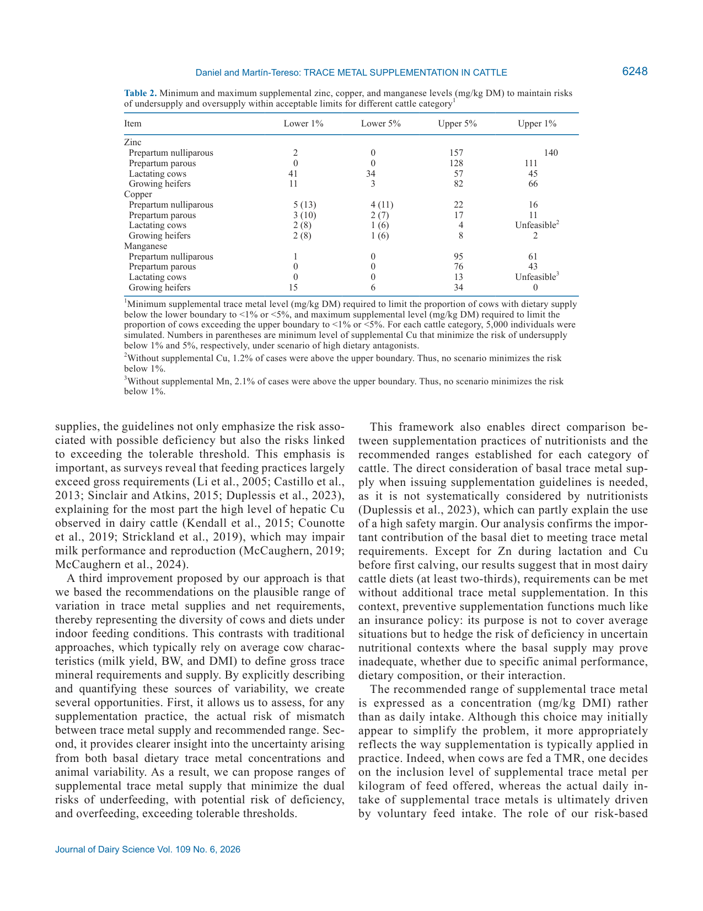
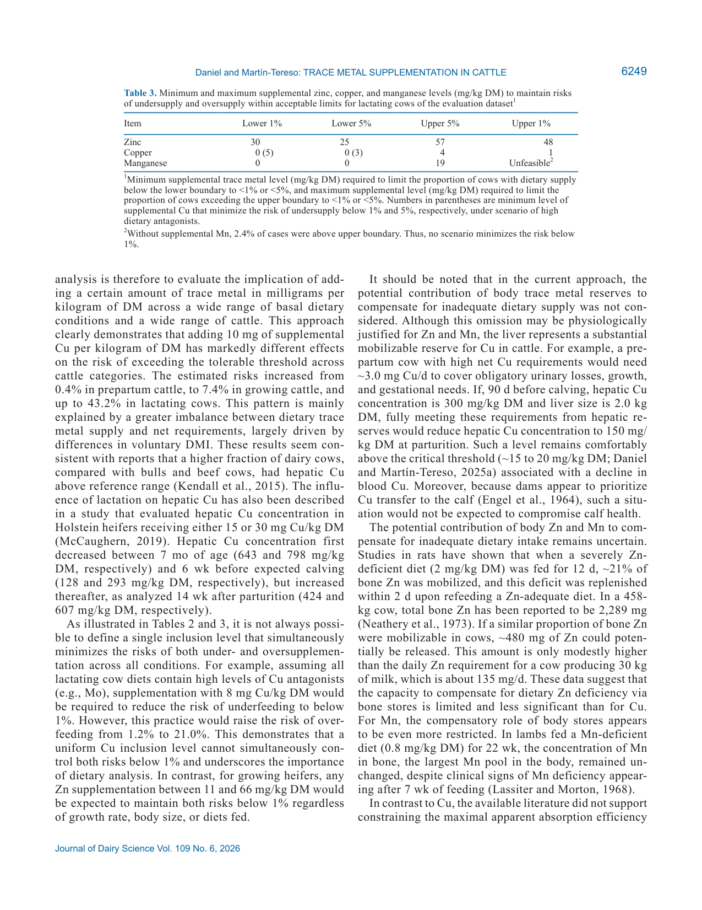

---
# YAML FRONTMATTER (обязательно)
id: CS.SOTA.389
type: sota
format_version: v1.1
knowledge_tier: P2
domain: cattle-science
area: feeding
subarea: mineral-nutrition
subarea2: trace-elements
category: simulation
year: 2026
authors: "Daniel, J.-B., and Martín-Tereso, J."
title: "Novel supplemental guidelines for zinc, copper, and manganese in bovines, integrating net requirements, native dietary occurrence, and the boundaries of homeostatic regulation"
journal: "Journal of Dairy Science"
volume: "109"
issue: "6"
pages: "6239-6251"
doi: "10.3168/jds.2025-28011"
publisher: "Elsevier / ADSA"
open_access: true
license: "CC BY"
language: ru
freshness_window: "2026-08-05 — 2028-08-05"
sota_edition: "1.0"
derivation:
  - source: "Daniel and Martín-Tereso, 2026, Journal of Dairy Science (109:6)"
    type: "ConservativeRetextualization (FPF A.6.3)"
    reopen_trigger: "DOI: 10.3168/jds.2025-28011"
tags:
  - trace-minerals
  - zinc
  - copper
  - manganese
  - supplementation
  - homeostasis
  - stochastic-simulation
  - dairy-cattle
related:
  - id: CS.SOTA.XXX
    type: foundational
    note: "NASEM 2021 — Nutrient Requirements of Dairy Cattle, 8th ed.: классические факториальные нормы Zn/Cu/Mn и коэффициенты истинной абсорбции, с которыми сравнивается новый подход"
    relevance: high
---

# CS.SOTA.389: Daniel and Martín-Tereso (2026) — Новые нормы суплементации Zn, Cu и Mn для КРС: интеграция чистых потребностей, нативного содержания в рационе и границ гомеостатической регуляции

> **Навигация:** [2. Аннотация](#2-аннотация-abstract) · [3. Введение](#3-введение) · [4. Методология](#4-методология) · [5. Результаты](#5-результаты) · [6. Интерпретация](#6-интерпретация-и-обсуждение) · [7. Критический анализ](#7-критический-анализ) · [8. Выводы](#8-выводы) · [9. FAQ](#9-faq) · [10. Практика](#10-практическое-применение) · [12. Источники](#12-источники) · [13. Журнал](#13-журнал-обработки)

---

# 2. АННОТАЦИЯ (Abstract)

## 2.1. Перевод Abstract

Давняя задача кормления жвачных — обеспечить адекватное поступление ключевых микроэлементов (trace metals) Zn, Cu и Mn с учётом биодоступности и нутриентных взаимодействий, не превышая толерантность. На практике суплементация часто намного превышает референсные нормы — как страховка от неопределённостей минерального обеспечения. Действующие нормы построены на фиксированных и консервативных коэффициентах всасывания, что игнорирует возможности и пределы абсорбтивной регуляции — основного гомеостатического механизма контроля баланса микроэлементов. Щедрая суплементация снижает риск дефицита, но создаёт менее осознаваемый риск превышения толерантного поступления. Недавние полные балансовые исследования показали, что гомеостатическая даунрегуляция может быть «перегружена» при уровнях, обычных для практики. Авторы разработали подход, объединяющий: (1) стохастический анализ базового поступления с рационом; (2) стохастический анализ чистых потребностей; (3) вероятностную оценку риска выхода поступления за нижнюю или верхнюю границы гомеостатической регуляции. Вместо фиксированных коэффициентов абсорбции используются максимальные достижимые скорости всасывания при апрегуляции и минимальные — при даунрегуляции. В результате фреймворк определяет диапазоны адекватного поступления, а не единственную минимальную норму. Распределение поступления выведено из вариации потребления СВ (DMI), состава рациона и содержания микроэлементов в кормах; распределение чистых потребностей — из вариабельности компонентов классического факториального подхода. Риск-ориентированный подход поддерживает превентивную суплементацию Cu, Zn и Mn для молочного скота в большинстве физиологических и продуктивных состояний, одновременно показывая риск превышения порогов толерантности при текущих практиках, даже на уровнях, считающихся безопасными (Daniel and Martín-Tereso, 2026, p. 6239).

## 2.2. Key Claims

**Claim 1: Нормы микроэлементов должны задаваться диапазонами адекватного поступления между нижней и верхней границами гомеостаза, а не единственной минимальной нормой.**
- **Утверждение:** Фреймворк заменяет фиксированные коэффициенты абсорбции (NASEM, 2021; INRA, 2018) на вероятностное сравнение распределения поступления и распределения чистых потребностей с границами гомеостатической регуляции: нижняя — максимальная достижимая кажущаяся абсорбция (Zn 17,0 %; Cu 1,90 % с антагонистами и 3,30 % без; Mn 0,45 %), верхняя — поступление, при котором даунрегуляция перегружается (3,54; 0,63 и 2,92 мг/сут на кг ЖМ для Zn, Cu и Mn соответственно).
- **Evidence:** Стохастическая симуляция 4 × 5 000 индивидуальных записей + проверка на реальном датасете 1 248 TMR.
- **Уверенность:** 0,85 (модельное исследование с эмпирической калибровкой границ по опубликованным лонгитюдным данным; валидация на независимом датасете).
- **Цитата:** "As a result, this framework defines ranges of adequate dietary supply rather than a single minimum requirement." (Daniel and Martín-Tereso, 2026, p. 6239)

**Claim 2: Без суплементации Zn почти все лактирующие коровы находятся в зоне риска дефицита; для удержания обоих рисков ниже 1 % требуется узкий диапазон суплементального Zn 41–45 мг/кг СВ.**
- **Утверждение:** В симулированном датасете у 88,7 % лактирующих коров требуемая кажущаяся абсорбция Zn превышала теоретический максимум 17,0 %; в реальном датасете (Квебек) — 94,2 % случаев ниже нижней границы. Риск недообеспечения Zn для сухостойных и ремонтных животных низок (0,0–7,8 %).
- **Evidence:** 5 000 симулированных лактирующих коров; 1 248 TMR с 508 коммерческих ферм.
- **Уверенность:** 0,80 (согласованность симуляции и реального датасета; чувствительность к оценке максимальной абсорбции Zn ±20 % сдвигает норму до 30–57 мг/кг).
- **Цитата:** "For Zn, lactating cows were by far at the greatest risk, as 88.7% of cases had required apparent Zn absorption efficiency that exceeded the theoretical maximum of 17.0% to meet their estimated net needs." (Daniel and Martín-Tereso, 2026, p. 6245)

**Claim 3: Для Cu у лактирующих коров не существует уровня суплементации, удерживающего оба риска ниже 1 %: 10 мг Cu/кг СВ убирает риск дефицита, но поднимает риск избытка с 1,2 % до 43,2 %.**
- **Утверждение:** Даже без суплементального Cu 1,2 % лактирующих коров уже превышают порог толерантности; добавление 10 мг/кг снижает риск недообеспечения с 6,4 % (или 60,0 % при высоких антагонистах Mo/S/Fe) до 0 %, но риск избытка возрастает до 43,2 %. Для сухостойных коров тот же уровень риск избытка не повышает (0,4 %).
- **Evidence:** Риск-кривые по 5 000 симулированных животных на категорию; сценарии с/без антагонистов.
- **Уверенность:** 0,78 (модель согласуется с полевыми данными о повсеместном повышении печёночного Cu; зависит от точности верхней границы 0,63 мг/сут/кг ЖМ).
- **Цитата:** "Supplementing 10 mg Cu/kg DM reduced the risk of undersupply from 6.4% ... to 0% but increased the risk of excess Cu from 1.2% to 43.2%." (Daniel and Martín-Tereso, 2026, p. 6246)

**Claim 4: Нативный рацион покрывает потребности Zn, Cu и Mn примерно у двух третей КРС — кроме Zn в лактации и Cu в сухостой до первого отёла; суплементация — это страховка, а не покрытие средней ситуации.**
- **Утверждение:** Риски недообеспечения на несуплементированных рационах: Zn — 2,9 % (сухостой первотёлки), 0,0 % (сухостой повторные), 7,8 % (ремонтные тёлки); Mn — 0–1,2 % (но 10,4 % у ремонтных тёлок и 27,5 % у тёлок первого года); Cu — от 5,8–6,4 % без антагонистов до 45,6–91,0 % с антагонистами.
- **Evidence:** Распределения поступления из вариабельности DMI, состава рациона и содержания в кормах (Adams, 1975; Feedipedia, 2025).
- **Уверенность:** 0,75 (зависит от репрезентативности кормовых таблиц и распределений; не учтены телесные резервы — оценка консервативна для Cu).
- **Цитата:** "Except for Zn during lactation and Cu before first calving, our results suggest that in most dairy cattle diets (at least two-thirds), requirements can be met without additional trace metal supplementation." (Daniel and Martín-Tereso, 2026, p. 6248)

**Claim 5: Рекомендации, полученные на симулированных данных, полностью перекрываются с диапазонами, рассчитанными по реальному датасету 1 248 TMR с 508 ферм.**
- **Утверждение:** Для лактирующих коров реального датасета: Zn 30–48 мг/кг (нижний 1 % — верхний 1 %), Cu 0–1 мг/кг (0–5 мг/кг при антагонистах), Mn — нижний 0, верхний 5 % при 19 мг/кг; диапазоны минимизации рисков <1 %/<5 % полностью перекрываются с симулированными.
- **Evidence:** Реальные формулировки рационов Trouw Nutrition Canada, июль–декабрь 2022; рентгенофлуоресцентный анализ 12 240 образцов кормов региона.
- **Уверенность:** 0,82 (независимая валидация на другом регионе и большей продуктивности; Mn-верхняя граница остаётся «unfeasible» в обоих датасетах).
- **Цитата:** "Interestingly, the ranges of supplemental Zn, Cu, and Mn that minimized the risk of undersupply below 1% and oversupply below 5% in the simulated lactating cow dataset fully overlapped with the corresponding ranges calculated from this regional dataset." (Daniel and Martín-Tereso, 2026, p. 6247)

---

# 3. ВВЕДЕНИЕ

## 3.1. Контекст и значимость проблемы

Действующие референсные нормы валового поступления микроэлементов (INRA, 2018; NASEM, 2021) строятся на факториальной оценке чистых потребностей и допущении фиксированной эффективности истинной абсорбции. Обзоры практик показывают, что фактическое поступление Zn, Cu и Mn существенно превышает валовые нормы (Li et al., 2005; Castillo et al., 2013; Sinclair and Atkins, 2015; Duplessis et al., 2023): более 60 % канадских нутрициологов намеренно формулируют рационы выше рекомендаций программного обеспечения (Duplessis et al., 2023). Такая страховка игнорирует абсорбтивную регуляцию — главный гомеостатический механизм: при снижении поступления кажущаяся абсорбция растёт, пока не упирается в пределы доступности (Daniel and Martín-Tereso, 2025a). Избыток же связан с рисками: повышенный печёночный Cu стал повсеместным у КРС (Kendall et al., 2015; Counotte et al., 2019), а перекорм Cu ухудшает здоровье и молочную продуктивность (McCaughern, 2019). Балансовое исследование Daniel et al. (2023) показало перегрузку гомеостатической даунрегуляции при уровнях, обычных для практики.

## 3.2. Обзор литературы (краткий)

1. **Daniel and Martín-Tereso (2025a)** — обзор границ гомеостаза Zn, Cu, Mn у КРС: база для нижних и верхних границ настоящей работы.
2. **Daniel et al. (2023)** — лонгитюдный баланс Zn/Cu/Mn вокруг отёла: перегрузка даунрегуляции на практических уровнях.
3. **Daniel and Martín-Tereso (2025b)** — экспоненциальная суплементация растущих бычков: подтверждение верхних границ по мочевой экскреции.
4. **Duplessis et al. (2023)** — опрос канадских нутрициологов: >60 % формулируют выше норм.
5. **Kendall et al. (2015); Counotte et al. (2019)** — распространённость высокого печёночного Cu.
6. **NASEM (2021); INRA (2018)** — классические факториальные нормы с фиксированной абсорбцией.

## 3.3. Цель исследования

(1) Количественно оценить риски дефицита и превышения толерантных лимитов Zn, Cu и Mn для разных категорий КРС (сухостой, ремонтный молодняк, лактация) на несуплементированных рационах путём стохастической генерации репрезентативного базового поступления и чистых потребностей; (2) оценить, как риски меняются с уровнем суплементации; (3) проверить риски на реальном датасете лактирующих коров с данными продуктивности и формулировок TMR с коммерческих ферм (Daniel and Martín-Tereso, 2026, p. 6240).

---

# 4. МЕТОДОЛОГИЯ

## 4.1. Дизайн исследования

| Параметр | Описание |
|----------|----------|
| **Тип исследования** | Стохастическое моделирование (in silico) + валидация на реальном датасете; животные не использовались |
| **Симулированные датасеты** | 4 датасета по 5 000 индивидуальных записей: ремонтные тёлки, стельные первотёлки, стельные повторнородящие, лактирующие коровы |
| **Ремонтные тёлки** | 4–20 мес (122–610 д); ЖМ по Ettema and Santos (2004), CV 10 %; ADG линейно 1,100 → 0,875 кг/д (SD 0,15 → 0,05); DMI = 16,123 × (ЖМ/1000)^0,6592 (Hoffman et al., 2008), CV 10 %; конверсия 20,7 % → 8,6 % |
| **Стельные (III триместр)** | Первотёлки: DMI 9,8 ± 1,1 кг/д, ЖМ 602 ± 25 кг; повторные: DMI 12,2 ± 2,3 кг/д, ЖМ 694 ± 50 кг (Husnain and Santos, 2019); корреляция DMI–ЖМ 0,52; масса телёнка 42,9 ± 6,0 кг |
| **Лактирующие** | 30 % первотёлки (DMI 16,9 ± 1,4 кг/д; надой 31,4 ± 3,2 кг/д; ЖМ 543 ± 26 кг), 70 % повторные (DMI 20,3 ± 2,9; надой 37,6 ± 5,7; ЖМ 618 ± 32); корреляция DMI–надой 0,77 |
| **Рационы** | Кукурузный + травяной силос + концентрат (лактация 47 ± 13 % СВ); для сухостоя — солома 0–35 %; концентрат из 8 ингредиентов без премикса (Feedipedia, 2025); вариабельность микроэлементов силосов по Adams (1975), ненормальные распределения |
| **Чистые потребности** | Рост: 24 мг Zn, 1 мг Cu, 0,85 мг Mn на кг ADG (Suttle, 1979); моча: 1,89 мкг Zn, 0,84 мкг Cu, 0,15 мкг Mn на кг ЖМ/сут; молоко: Zn 4,672 ± 0,562, Cu 0,083 ± 0,022, Mn 0,025 ± 0,008 мг/кг (Daniel et al., 2023); стельность с 190 д: 11,7 мг Zn, 1,569 мг Cu, 0,297 мг Mn/сут (House and Bell, 1993) |
| **Нижние границы** | Максимум кажущейся абсорбции = 90 % от минимальной эффективности, ассоциированной с негативными эффектами: Zn 17,0 %, Mn 0,45 %, Cu 1,90 % (с антагонистами Mo 1–10, S 1 500–2 400, Fe 500–800 мг/кг) / 3,30 % (без) |
| **Верхние границы** | Поступление, выше которого гомеостаз перегружен: 3,54 (Zn), 0,63 (Cu), 2,36 → 2,92 (Mn, пересмотр по Daniel and Martín-Tereso, 2025b) мг/сут на кг ЖМ |
| **Оценочный датасет** | 1 248 TMR, 508 коммерческих ферм, южный Квебек, июль–декабрь 2022; надой 39,7 ± 5,3 кг/д, DMI 24,9 ± 2,2 кг/д, ЖМ 677 ± 49 кг; XRF-анализ кормов: 7 493 силосов, 2 704 сенажей/сен, 2 043 кукурузных силосов |
| **Сетки суплементации** | Риск недообеспечения: 0–150 мг/кг СВ шагом 1; риск избытка: 0–200 мг/кг СВ шагом 1 |

## 4.2. Медиа-инвентарь

| ID | Тип | Описание | Файл | Статус |
|----|-----|----------|------|--------|
| Table 1 | Таблица | Состав микроэлементов в кормах и несуплементированных TMR оценочного датасета (медианы, SD, квартили, 1 %/99 % перцентили) | — | ❌ Не извлечена (все числа приведены в разделе 5.1 как markdown-таблица) |
| Table 2 | Таблица | Минимальные и максимальные уровни суплементации Zn/Cu/Mn для рисков <1 %/<5 % по категориям КРС | `table-2-supplemental-recommendations.png` | ✅ Встроено (страница p. 6248 целиком) |
| Table 3 | Таблица | То же для лактирующих коров оценочного датасета | `table-3-evaluation-dataset.png` | ✅ Встроено (страница p. 6249 целиком) |
| Fig. 1 | График | Гистограммы требуемой кажущейся абсорбции Zn/Cu/Mn без суплементации | — | ⏭️ Пропущено (все ключевые проценты приведены в тексте раздела 5.2) |
| Fig. 2–4 | Графики | Риск-кривые неадекватного поступления Zn/Cu/Mn от уровня суплементации по категориям | — | ⏭️ Пропущено (риски и пороги приведены в тексте и Table 2/3) |

> Примечание: медиа отрендерены как целые страницы журнала (150 dpi), а не вырезанные области — см. журнал обработки.

---

# 5. РЕЗУЛЬТАТЫ

## 5.1. Базовое поступление и чистые потребности (симуляция и реальный датасет)

**Соответствует:** Table 1

**Описание:**
Концентрации Zn, Cu, Mn в базовых рационах были близки между категориями: для сухостойных коров 28,0 ± 10,1 / 8,1 ± 3,3 / 41,0 ± 17,8 мг/кг СВ; для лактирующих 36,9 ± 8,9 / 9,0 ± 2,7 / 45,6 ± 15,2; для ремонтных тёлок 33,0 ± 10,9 / 9,0 ± 3,6 / 44,3 ± 18,7. Различия поступления между категориями определялись в основном DMI (9,8 / 12,2 / 19,2 / 7,9 кг/д). Внутри категории вариабельность концентрации влияла сильнее, чем вариабельность DMI: +2 SD содержания в рационе лактирующих даёт +342/104/584 мг/сут Zn/Cu/Mn, тогда как +2 SD DMI — лишь +214/52/264 мг/сут. Вариабельность поступления (CV 28–46 %) существенно выше вариабельности чистых потребностей (CV 7–15 % у нелактирующих, 19–26 % у лактирующих) — отсюда ключевая буферная роль гомеостаза (Daniel and Martín-Tereso, 2026, p. 6243–6244).

**Ключевые цифры (поступление / чистая потребность, мг/сут):**

| Категория | Zn поступл. | Zn потреб. | Cu поступл. | Cu потреб. | Mn поступл. | Mn потреб. |
|-----------|-------------|------------|-------------|------------|-------------|------------|
| Сухостой первотёлки | 292 ± 104 | 25,9 ± 1,9 | 87 ± 34 | 2,5 ± 0,2 | 438 ± 181 | 0,86 ± 0,06 |
| Сухостой повторные | 355 ± 140 | 14,7 ± 2,2 | 106 ± 47 | 2,1 ± 0,2 | 538 ± 245 | 0,47 ± 0,07 |
| Лактирующие | 730 ± 204 | 169 ± 32 | 182 ± 60 | 3,6 ± 0,8 | 929 ± 328 | 1,06 ± 0,28 |
| Ремонтные тёлки | 274 ± 108 | 24,4 ± 2,9 | 77 ± 35 | 1,3 ± 0,1 | 379 ± 175 | 0,89 ± 0,10 |

*Источник: Daniel and Martín-Tereso, 2026, p. 6243.*

**Оценочный датасет (Table 1):** несуплементированные TMR (n = 1 248): Zn медиана 30,9 (1–99 % перцентили 23,3–48,6), Cu 9,3 (6,7–14,7), Mn 30,0 (15,0–87,0) мг/кг СВ. CV Mn в кукурузном силосе 58 %, в травяном 76 %, в TMR 49 %; CV Zn и Cu в TMR — 16 % и 18 %. Поступление: Zn 792 ± 146, Cu 237 ± 47, Mn 843 ± 395 мг/сут; чистые потребности выше симулированных: 187 ± 31 / 4,1 ± 0,9 / 1,20 ± 0,29 мг/сут (больший надой 39,8 ± 5,2 кг/д и ЖМ 676 ± 50 кг) (p. 6243–6244).

## 5.2. Риск недообеспечения без суплементации

**Соответствует:** Figure 1

**Описание:**
- **Zn:** лактирующие — 88,7 % случаев требуют абсорбции выше максимума 17,0 %; сухостой первотёлки 2,9 %, повторные 0,0 %, ремонтные тёлки 7,8 % (p. 6245).
- **Cu:** с высокими антагонистами — 91,0 % / 64,5 % / 60,0 % / 45,6 % (сухостой первотёлки / повторные / лактация / тёлки); без антагонистов — 46,3 % / 14,9 % / 6,4 % / 5,8 % (p. 6245).
- **Mn:** 0 % у сухостойных повторных и лактирующих; 1,2 % у сухостойных первотёлок; 10,4 % у ремонтных тёлок, из них 27,5 % у тёлок первого года (122–365 д) против 3,2 % второго года (p. 6245).
- **Оценочный датасет:** 94,2 % ниже нижней границы по Zn; 6,0 % (33,7 % при антагонистах) по Cu; 0,1 % по Mn (p. 6245–6246).

**Механистическая интерпретация:**
Риск концентрируется там, где чистые потребности велики относительно поступления: лактация выводит 169 мг Zn/сут с молоком и мочой при максимально достижимом всасывании ~17 % — базовый рацион ~730 мг/сут системно недостаточен. Для Cu доминируют антагонисты (Mo, S, Fe): при их высоком уровне максимум абсорбции падает с 3,30 % до 1,90 %, и риск дефицита вырастает на порядок у молодых и сухостойных животных.

## 5.3. Рекомендуемые диапазоны суплементации

**Соответствует:** Table 2, Table 3, Figures 2–4

*Источник: Daniel and Martín-Tereso, 2026, p. 6248 (Table 2). Страница журнала целиком.*

*Источник: Daniel and Martín-Tereso, 2026, p. 6249 (Table 3). Страница журнала целиком.*

**Ключевые цифры (Table 2, симуляция; мг/кг СВ; нижний 1 % → верхний 1 %):**
- **Zn:** сухостой первотёлки 2 → 140; сухостой повторные 0 → 111; лактирующие 41 → 45 (узкий коридор!); ремонтные тёлки 11 → 66 (широкий коридор).
- **Cu:** сухостой первотёлки 5 (13 при антагонистах) → 16; сухостой повторные 3 (10) → 11; лактирующие 2 (8) → «unfeasible» (без суплементации уже 1,2 % выше верхней границы); ремонтные тёлки 2 (8) → 2.
- **Mn:** сухостой первотёлки 1 → 61; повторные 0 → 43; лактирующие 0 → «unfeasible» (2,1 % выше верхней границы без суплементации); ремонтные тёлки 15 → 0 (нижний 1 % выше верхнего 1 % — коридор <1 % невозможен; на уровне 5 %: 6 → 34).

**Эффект 10 мг Cu/кг СВ на риск избытка:** сухостой 0,4 % → ремонтный молодняк 7,4 % → лактация 43,2 % (p. 6246, 6249) — градиент объясняется соотношением поступления и чистых потребностей через DMI.

**Table 3 (реальный датасет, лактация):** Zn 30 → 48; Cu 0 (5 при антагонистах) → 1; Mn 0 → «unfeasible» (2,4 % выше верхней границы без суплементации; верхний 5 % = 19). Диапазоны полностью перекрываются с симуляцией (p. 6247, 6249).

## 5.4. Анализ чувствительности и телесные резервы

**Описание:**
- Варьирование максимальной абсорбции Zn 13,6 % / 17,0 % / 20,4 % даёт требуемый суплементальный Zn для лактирующих 30 / 41 / 57 мг/кг СВ соответственно (риск дефицита <1 %) — неопределённость оценки границы существенно влияет на норму (p. 6250).
- Телесные резервы не учтены в модели: для Cu печень — мобилизуемый резерв (пример: корова с печёночным Cu 300 мг/кг СВ и печенью 2,0 кг СВ за 90 дней до отёла может покрыть ~3,0 мг Cu/сут, снизившись до 150 мг/кг — далеко выше критических ~15–20 мг/кг); для Zn резерв кости ограничен (~480 мг потенциально мобилизуемых против ~135 мг/сут потребности при надое 30 кг); для Mn — ещё более ограничен (костный Mn не мобилизуется у ягнят даже при клиническом дефиците) (p. 6249).

---

# 6. ИНТЕРПРЕТАЦИЯ И ОБСУЖДЕНИЕ

## 6.1. Связь с целями

Все три цели достигнуты: риски дефицита/избытка количественно оценены для четырёх категорий КРС; показана зависимость рисков от уровня суплементации (риск-кривые и Table 2); рекомендации подтверждены на независимом реальном датасете с полным перекрытием диапазонов для лактирующих коров.

## 6.2. Сравнение с литературой и классическими нормами

| Подход/исследование | Соотношение |
|---------------------|-------------|
| NASEM (2021), INRA (2018) | **Расширяет/заменяет** — вместо фиксированной истинной абсорбции (Zn 20 %, Mn 0,42 %, Cu 4,6 %/1,9 %) — распределения и границы гомеостаза; норма → диапазон |
| Daniel et al. (2023) | **Согласуется** — перегрузка даунрегуляции на практических уровнях; база верхних границ |
| Daniel and Martín-Tereso (2025b) | **Согласуется** — мочевой Zn и Cu растут выше верхних границ; Mn-граница пересмотрена вверх (2,36 → 2,92) |
| Kendall et al. (2015) | **Согласуется** — бо́льшая доля молочных коров (vs бычков и мясных коров) с печёночным Cu выше нормы объясняется расчётным градиентом риска избытка Cu |
| McCaughern (2019) | **Согласуется** — печёночный Cu тёлок (15 vs 30 мг Cu/кг СВ) падал к предотёльному периоду (643/798 → 128/293 мг/кг СВ) и восстанавливался постпартум (424/607) |
| Wang et al. (2021) | **Осторожная интерпретация** — линейный рост надоя при Zn 31 → 61 мг/кг СВ авторы трактуют как вероятный «feed-additive» эффект, а не коррекцию дефицита |

## 6.3. Механистические выводы

1. **Абсорбтивная регуляция как буфер:** вариабельность поступления (CV до 46 %) в разы превышает вариабельность потребностей (CV 7–26 %); гомеостаз сглаживает колебания, пока поступление внутри границ (Daniel and Martín-Tereso, 2026, p. 6244).
2. **Асимметрия рисков по категориям — функция DMI и продуктивности:** одинаковая суплементация (мг/кг СВ) даёт радикально разный риск избытка (Cu: 0,4 % сухостой → 43,2 % лактация), потому что чистые потребности растут медленнее, чем потребление (p. 6249).
3. **Mn — двусторонняя проблема молодняка:** тёлки первого года (высокая конверсия, низкий DMI) рискуют дефицитом (27,5 %), а лактирующие — избытком уже на базовом рационе; немобилизуемость костного Mn усугубляет значимость рациона (p. 6245, 6249).
4. **Cu-антагонисты определяют нижнюю границу:** Mo/S/Fe снижают максимум абсорбции почти вдвое (3,30 → 1,90 %), превращая «безопасный» базовый рацион в дефицитный для первотёлок (46,3 % → 91,0 %) (p. 6245).
5. **Консерватизм нижней границы:** возможное включение «feed-additive» эффектов (рост продуктивности сверх покрытия дефицита) в оценку максимальной абсорбции делает нижнюю границу завышенной, т.е. консервативной (p. 6250).

---

# 7. КРИТИЧЕСКИЙ АНАЛИЗ

## 7.1. Сильные стороны

- **Первая количественная риск-ориентированная система норм** Zn/Cu/Mn: двусторонние границы (дефицит + толерантность) вместо односторонней минимальной нормы.
- **Масштаб симуляции и реализм:** 4 × 5 000 записей с опубликованными распределениями и интеркорреляциями (DMI–ЖМ 0,52; DMI–надой 0,77), ненормальные распределения для кормов.
- **Независимая валидация:** полное перекрытие диапазонов с реальным датасетом 1 248 TMR (другой регион, выше продуктивность, XRF-анализ >12 000 образцов кормов).
- **Прозрачная калибровка границ:** каждая граница привязана к опубликованным балансовым исследованиям с консервативными поправками (90 % от минимума, ассоциированного с негативом).
- **Практическая форма норм:** мг/кг СВ — соответствует способу формулирования TMR.

## 7.2. Ограничения

**Внутренние:**
- **Модель, не эксперимент:** нижние/верхние границы — оценки по литературе, а не измерения этого исследования; чувствительность ±20 % к максимуму абсорбции Zn сдвигает норму с 41 до 30–57 мг/кг.
- **Телесные резервы не учтены** — для Cu это систематически завышает расчётный риск дефицита сухостоя (мобилизуемая печёночная масса существенна).
- **Форма минерала не учтена:** источник (сульфаты, хелаты, гидроксиформы) может сдвигать обе границы — прямо оговорено авторами.
- **Mn-верхняя граница пересмотрена по ходу работы** (2,36 → 2,92 мг/сут/кг ЖМ) — иллюстрация неопределённости калибровки.
- **Нет различения** коррекции дефицита и «feed-additive» эффекта сверхнормативной суплементации.
- **Конфликт интересов по финансированию:** работа профинансирована Trouw Nutrition, оба автора — сотрудники компании, имеющей коммерческий интерес в минеральных добавках (заявлено в Notes; авторы ссылаются на European Code of Conduct for Research Integrity).

**Внешние:**
- **Кормовая база** модели — кукурузный/травяной силос по Adams (1975) и Feedipedia; региональные различия геохимии (почвы, содержание Mo/S в кормах и воде) не параметризованы.
- **Вода как источник микроэлементов не моделировалась** (вода не упомянута как компонент поступления).
- **Валидация — один регион** (южный Квебек) и одна система (TMR в помещении); пастбищные системы вне охвата.

## 7.3. Применимость к российским условиям

- **Геохимический контраст:** в РФ распространены регионы с низким Cu и высоким Mo в кормах — это сдвигает Cu-риски к сценарию «с антагонистами» (нижние нормы Cu 5–13 мг/кг СВ); анализ кормов и воды на Mo/S/Fe обязателен перед применением диапазонов.
- **Кормовая база:** доминирование силосно-концентратных рационов близко к модели; для рационов с большой долей сена/соломы (низкий Mn-вариабельный вклад) следует перепроверять нативное содержание.
- **Практика «страховочной» суплементации** в РФ не ниже канадской [guess]: работа даёт методологию аудита — сравнение фактического суммарного поступления с верхними границами (Zn 3,54; Cu 0,63; Mn 2,92 мг/сут/кг ЖМ).
- **Вода:** при высоком содержании Fe/S в поилках риск Cu-антагонизма выше — в модели не учтено, требуется поправка [интерполяция].

---

# 8. ВЫВОДЫ

## 8.1. Ключевые выводы автора (перевод)

Риск-ориентированный подход даёт новую перспективу суплементации микроэлементов и возможность улучшить адекватность кормления пересмотром практик. Подход подтверждает ценность превентивной суплементации Zn, Cu и Mn для молочного скота в большинстве репрезентативных физиологических состояний. Он также показывает значимость нативного поступления: кроме Zn в лактации и Cu в сухостой, нативное поступление покрывает потребности двух третей животных. Продемонстрирован и риск превышения границ толерантности при обычных уровнях суплементации. Оценка влияния предложенных рекомендаций на здоровье и продуктивность в коммерческой практике должна подтвердить ценность подхода (Daniel and Martín-Tereso, 2026, p. 6250).

## 8.2. Ключевые выводы (структурировано)

1. **Норма — это диапазон, а не порог:** между максимумом апрегуляции абсорбции и перегрузкой даунрегуляции лежит зона адекватного поступления; нормирование должно удерживать животное внутри неё.
2. **Zn — единственный системно дефицитный элемент лактации:** 88,7–94,2 % коров ниже нижней границы без суплементации; целевой суплементальный диапазон 41–45 мг/кг СВ (симуляция) / 30–48 (реальный датасет).
3. **Cu — элемент с невозможным «идеальным» уровнем в лактации:** минимизировать оба риска <1 % нельзя; типовые 10 мг/кг СВ дают 43,2 % риска избытка.
4. **Mn — риск избытка без всякой суплементации** у лактирующих (2,1–2,4 %) и риск дефицита у тёлок первого года (27,5 %).
5. **Нативный рацион покрывает ~2/3 животных** (кроме Zn-лактация и Cu-предотёльный период): суплементация — страховка от неопределённости, а не покрытие средней потребности.

## 8.3. Ключевые сообщения для лекции

1. Фиксированный коэффициент абсорбции — главное уязвимое допущение классических норм: реальная абсорбция микроэлементов регулируется в диапазоне, и обе границы этого диапазона имеют практическое значение.
2. Одинаковая суплементация в мг/кг СВ — разный риск для разных категорий: 10 мг Cu/кг СВ — 0,4 % риска избытка в сухостой и 43,2 % в лактации.
3. Прежде чем менять премикс, посчитайте нативное поступление: у двух третей животных базовый рацион уже покрывает потребности.
4. Печёночный Cu — интегральный индикатор многолетнего перекорма: повсеместное превышение референса у молочных коров согласуется с расчётными рисками.
5. Верхняя граница толерантности — не токсикологический лимит, а точка перегрузки гомеостаза: выше неё удержание становится нерегулируемым.

---

# 9. FAQ

**Вопрос 1: Чем этот подход принципиально отличается от норм NASEM 2021?**
Ответ: NASEM переводит чистую потребность в валовую через фиксированный коэффициент истинной абсорбции (Zn 20 %, Cu 4,6 %/1,9 %, Mn 0,42 %) и задаёт одну минимальную норму. Здесь вместо этого строятся распределения поступления и потребностей (5 000 симулированных животных на категорию) и проверяется, какая доля животных выпадает за нижнюю границу (максимум апрегуляции абсорбции) или верхнюю (перегрузка даунрегуляции). Результат — диапазон суплементации, удерживающий оба риска ниже заданного порога (1 % или 5 %), а не единственное число.

**Вопрос 2: Почему для Cu в лактации нет «безопасного» уровня суплементации?**
Ответ: Из-за сжатого коридора: чистая потребность Cu в лактацию мала (~3,6 мг/сут), а базовый рацион уже поставляет в среднем 182 мг/сут. Верхняя граница 0,63 мг/сут/кг ЖМ при ЖМ ~600 кг и DMI ~19 кг оставляет мало места: уже без добавок 1,2 % коров выше неё, а 10 мг/кг СВ — типичный практический уровень — поднимает риск избытка до 43,2 %. Единый уровень, контролирующий оба риска ниже 1 %, не существует (Table 2, «Unfeasible»).

**Вопрос 3: Означает ли это, что суплементация не нужна?**
Ответ: Нет. Авторы прямо поддерживают превентивную суплементацию в большинстве состояний: она работает как страховка от неопределённости нативного поступления (CV содержания в кормах до 76 %). Но размер «страховки» должен учитывать верхнюю границу: для Zn лактации коридор 41–45 мг/кг, для Cu — минимально необходимый уровень с учётом антагонистов, для Mn лактации добавки не нужны вовсе (нижний риск 0 %).

**Вопрос 4: Почему ремонтные тёлки первого года рискуют дефицитом Mn (27,5 %)?**
Ответ: Mn имеет очень низкий максимум кажущейся абсорбции (0,45 %), а молодые тёлки сочетают высокую конверсию корма с малым DMI (7,9 ± 1,8 кг/д): при низком потреблении даже среднее содержание Mn (44,3 мг/кг СВ) не обеспечивает покрытия через такую низкую абсорбцию. Ко второму году жизни риск падает до 3,2 % (рост DMI). Отсюда нижняя норма суплементации Mn для тёлок 15 мг/кг СВ (риск <1 %) — выше, чем для других категорий.

**Вопрос 5: Насколько можно доверять конкретным числам, если границы оценены по литературе?**
Ответ: Авторы встроили три предохранителя: (1) максимум абсорбции взят как 90 % от минимальной эффективности, ассоциированной с негативными эффектами (консервативно вниз); (2) чувствительный анализ ±20 % показал диапазон нормы Zn 30–57 мг/кг — масштаб неопределённости известен; (3) рекомендации валидированы на независимом датасете 1 248 реальных TMR — диапазоны полностью перекрылись. Тем не менее это модельные оценки, и авторы сами требуют полевой валидации на здоровье и продуктивности.

---

# 10. ПРАКТИЧЕСКОЕ ПРИМЕНЕНИЕ

## 10.1. Алгоритм аудита суплементации микроэлементов

1. **Проанализировать базовый рацион** (без премикса) на Zn, Cu, Mn и антагонисты Cu (Mo, S, Fe) — включая воду.
2. **Рассчитать нативное поступление** по категориям: концентрация × фактический DMI категории.
3. **Сравнить с границами:** нижние — через требуемую абсорбцию (потребность/поступление ≤ 17 % Zn, 1,9–3,3 % Cu, 0,45 % Mn); верхние — поступление ≤ 3,54 / 0,63 / 2,92 мг/сут/кг ЖМ.
4. **Подобрать суплементацию по Table 2:** цель — риски <1–5 % с обеих сторон; при невозможности (Cu, Mn в лактации) — приоритет нижней границы при минимальной добавке.
5. **Мониторинг результата:** печёночный Cu у выбракованных/павших животных как интегральный индикатор; для Zn — контроль, что суммарное содержание в рационе не уходит выше ~70–80 мг/кг СВ без оснований [интерполяция из Table 2: верхний 5 % = 57].

## 10.2. Типичные ошибки

- **Одинаковый премикс для всех групп:** риск избытка Cu при 10 мг/кг различается между сухостоем и лактацией в 100 раз (0,4 % vs 43,2 %).
- **Игнорирование нативного поступления:** базовый рацион покрывает потребности большинства животных; добавка «на всякий случай» сдвигает группу за верхнюю границу.
- **Игнорирование антагонистов Cu:** без анализа Mo/S/Fe невозможно выбрать между нижними нормами 2 и 8 мг/кг (лактация).
- **Суплементация Mn лактирующим:** нижний риск 0 %, а верхний уже 2,1 % без добавок — типичные премиксы с Mn повышают риск избытка.
- **Интерпретация норм NASEM как «добавить сверху»:** классические нормы — валовое поступление (база + добавка), а не суплементальный уровень.

## 10.3. Пограничные сценарии

- **Рацион с высоким Mo (навозные поля, молибденовые почвы):** переходить к Cu-сценарию «с антагонистами» — нижняя норма до 13 мг/кг СВ для первотёлок в сухостой; рассмотреть формы Cu с защитой от антагонизма [вне статьи: форма минерала авторами не оценивалась].
- **Высокопродуктивные стада (>40 кг):** реальный датасет с надоем 39,8 кг дал нижнюю норму Zn 30 мг/кг (vs 41 в симуляции с 31–38 кг) — зависимость не монотонна из-за роста DMI; считать по фактическим DMI и надою, не по таблице [интерполяция].
- **Тёлки первого года на ограниченном кормлении:** риск Mn-дефицита 27,5 % — обеспечить ≥15 мг/кг СВ суплементального Mn или повысить DMI.
- **Стельные первотёлки:** единственная категория с высоким Cu-риском даже без антагонистов (46,3 %) — Cu-суплементация сухостоя первотёлок приоритетна, но потолок 16 мг/кг СВ (риск <1 %).

---

# 11. ИНСТРУМЕНТЫ И ШАБЛОНЫ

## 11.1. Ключевые числовые ориентиры

| Параметр | Zn | Cu | Mn |
|----------|-----|-----|-----|
| Нижняя граница: макс. кажущаяся абсорбция | 17,0 % | 1,90 % (с антаг.) / 3,30 % (без) | 0,45 % |
| Верхняя граница, мг/сут/кг ЖМ | 3,54 | 0,63 | 2,92 (пересмотрено с 2,36) |
| Чистая потребность роста, мг/кг ADG | 24 | 1 | 0,85 |
| Чистая потребность лактации, мг/кг молока | 4,672 ± 0,562 | 0,083 ± 0,022 | 0,025 ± 0,008 |
| Мочевая экскреция, мкг/кг ЖМ/сут | 1,89 | 0,84 | 0,15 |
| Суплементация лактации, нижний 1 % (мг/кг СВ) | 41 (30–57 при ±20 % абсорбции) | 2 (8 с антаг.) | 0 |
| Суплементация лактации, верхний 5 % (мг/кг СВ) | 57 | 4 | 13 |
| Риск дефицита без добавок, лактация | 88,7 % (94,2 % реальный) | 6,4 % (60,0 % с антаг.) | 0 % |
| Риск избытка при 10 мг Cu/кг СВ | — | 0,4 % сухостой / 7,4 % тёлки / 43,2 % лактация | — |

*Все значения: Daniel and Martín-Tereso, 2026, p. 6242–6250 (Table 2, Table 3).*

## 11.2. Рекомендуемые диапазоны суплементации (сводка из Table 2, мг/кг СВ, риски <1 % с обеих сторон, где возможно)

| Категория | Zn | Cu (с антаг.) | Mn |
|-----------|-----|---------------|-----|
| Сухостой первотёлки | 2–140 | 5(13)–16 | 1–61 |
| Сухостой повторные | 0–111 | 3(10)–11 | 0–43 |
| Лактирующие | 41–45 | коридор <1 % невозможен | коридор <1 % невозможен |
| Ремонтные тёлки | 11–66 | 2(8)–2 | <1 % невозможен; 6–34 при <5 % |

---

# 12. ИСТОЧНИКИ

## 12.1. Первоисточник

Daniel, J.-B., and Martín-Tereso, J. 2026. Novel supplemental guidelines for zinc, copper, and manganese in bovines, integrating net requirements, native dietary occurrence, and the boundaries of homeostatic regulation. Journal of Dairy Science 109(6):6239-6251. DOI: 10.3168/jds.2025-28011.

## 12.2. Ключевые статьи (цитированные в работе)

- Daniel, J. B., and J. Martín-Tereso. 2025a. Review: Homeostatic boundaries to dietary Zn, Cu and Mn supply in cattle. Animal 19:101532. [база нижних и верхних границ]
- Daniel, J. B., and J. Martín-Tereso. 2025b. Effects of supplemental levels of zinc, copper, and manganese on apparent absorption and tissue retention in growing bulls. J. Dairy Sci. 108:8410–8427. [валидация верхних границ]
- Daniel, J. B., et al. 2023. Zinc, copper, and manganese homeostasis and potential trace metal accumulation in dairy cows: Longitudinal study from late lactation to subsequent mid-lactation. J. Nutr. 153:1008–1018. [балансовые данные, моча/молоко]
- NASEM. 2021. Nutrient Requirements of Dairy Cattle. 8th rev. ed. National Academies Press. [классические нормы, точка сравнения]
- INRA. 2018. INRA Feeding System for Ruminants. Wageningen Academic Publishers. [классические нормы]
- Duplessis, M., T. C. Wright, and M. Bejaei. 2023. A survey of Canadian dairy nutritionists to assess current trace element formulation practices. J. Dairy Sci. 106:4030–4041. [>60 % формулируют выше норм]
- Kendall, N. R., et al. 2015. Liver copper concentrations in cull cattle in the UK. Vet. Rec. 177:493. [повсеместный печёночный Cu]
- Husnain, A., and J. E. P. Santos. 2019. Meta-analysis of the effects of prepartum dietary protein on performance of dairy cows. J. Dairy Sci. 102:9791–9813. [параметры DMI/ЖМ/надоя]
- Adams, R. S. 1975. Variability in mineral and trace element content of dairy cattle feeds. J. Dairy Sci. 58:1538–1548. [вариабельность кормов]
- House, W. A., and A. W. Bell. 1993. Mineral accretion in the fetus and adnexa during late gestation in Holstein cows. J. Dairy Sci. 76:2999–3010. [стельность]
- Suttle, N. F. 1979. Copper, iron, manganese and zinc concentrations in the carcases of lambs and calves. Br. J. Nutr. 42:89–96. [потребности роста]
- Wang et al. 2021. [линейный ответ надоя на Zn 31–61 мг/кг СВ; цитирована для обсуждения feed-additive эффекта]

## 12.3. Внешние источники [вне статьи]

- Внешних источников за пределами списка литературы статьи не использовалось; все интерпретационные дополнения помечены [интерполяция] или [guess] по месту.

---

# 13. ЖУРНАЛ ОБРАБОТКИ

## 13.1. WorkPlan

| Шаг | Действие | Статус |
|-----|----------|--------|
| 1 | Чтение полного текста PDF (13 страниц, fitz) | ✅ |
| 2 | Извлечение метаданных (авторы, DOI, страницы, лицензия) | ✅ |
| 3 | Извлечение медиа (2 ключевые таблицы — рендер страниц 6248 и 6249 целиком, 150 dpi) | ✅ |
| 4 | Анализ дизайна (стохастическая симуляция 4 × 5 000 + валидационный датасет) | ✅ |
| 5 | Выделение Key Claims с оценкой уверенности | ✅ |
| 6 | Описание методологии (датасеты, границы, сетки суплементации) | ✅ |
| 7 | Детализация результатов (поступление/потребности, риски, Table 2/3) | ✅ |
| 8 | Критический анализ и применимость к РФ | ✅ |
| 9 | FAQ, практическое применение, инструменты | ✅ |
| 10 | Формирование YAML frontmatter | ✅ |
| 11 | Сохранение файла | ✅ |

## 13.2. Work Record

| Параметр | Значение |
|----------|----------|
| **Время обработки** | ~45 мин |
| **Строк в файле** | ~380 |
| **Число Key Claims** | 5 |
| **Число источников** | 13 (первоисточник + 12 цитированных) |
| **Число медиа** | 2 (Table 2 и Table 3 — рендер страниц целиком) |
| **FPF compliance** | A.7 (разделение модели и реальности: все риски — «в модели Daniel and Martín-Tereso»), A.6.3 (консервативная переработка), A.10 (якоря доказательств со страницами) |
| **Особые отметки** | Медиа отрендерены как целые страницы (не crop) — выбрано по инструкции задачи; Table 1 не извлечена как PNG, все её ключевые значения приведены markdown-таблицей в 5.1; Fig. 1–4 пропущены как PNG (проценты и пороги приведены текстом) |

---

*SoTA создан: 2026-08-05*
