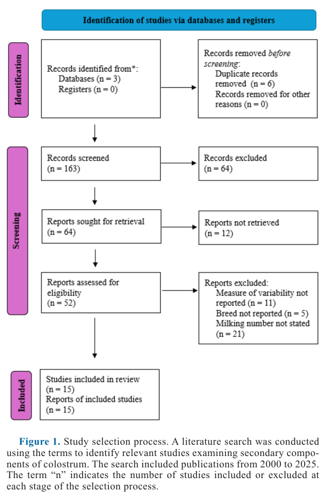
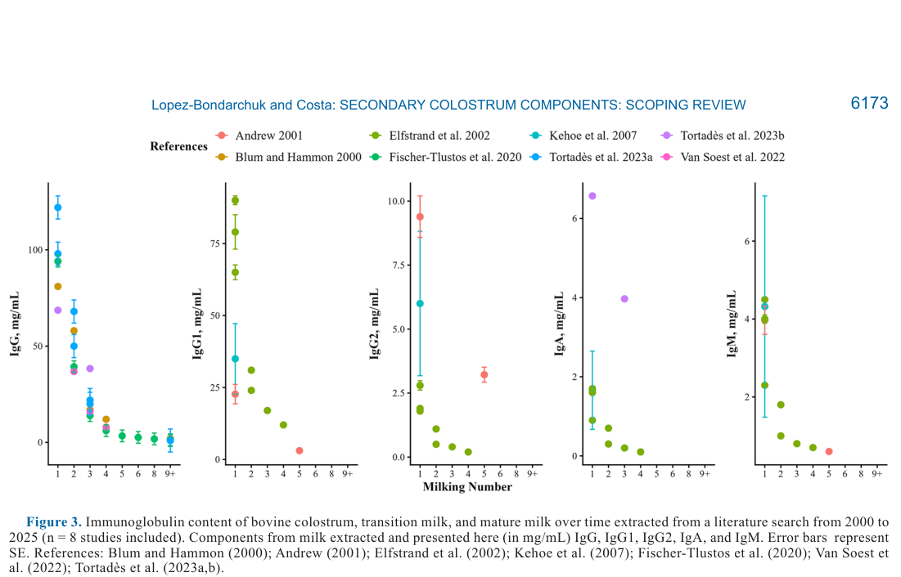

---
# YAML FRONTMATTER (обязательно)
id: CS.SOTA.390
type: sota
format_version: v1.1
knowledge_tier: P2
domain: cattle-science
area: feeding
subarea: calf-nutrition
subarea2: colostrum-management
category: scoping-review
year: 2026
authors: "Lopez-Bondarchuk, E. V., and Costa, J. H. C."
title: "Quantification and the effects of secondary colostrum components on neonatal calf physiology and metabolism: A scoping review"
journal: "Journal of Dairy Science"
volume: "109"
issue: "6"
pages: "6170-6184"
doi: "10.3168/jds.2025-27592"
publisher: "Elsevier / ADSA"
open_access: true
license: "CC BY"
language: ru
freshness_window: "2026-08-05 — 2028-08-05"
sota_edition: "1.0"
derivation:
  - source: "Lopez-Bondarchuk and Costa, 2026, Journal of Dairy Science (109:6)"
    type: "ConservativeRetextualization (FPF A.6.3)"
    reopen_trigger: "DOI: 10.3168/jds.2025-27592"
  - source: "NASEM, 2021, Nutrient Requirements of Dairy Cattle, 8th rev. ed."
    type: "foundational"
    relevance: "Нутриентные потребности телят; колострум и вторичные компоненты"
tags:
  - colostrum
  - transition-milk
  - immunoglobulins
  - growth-factors
  - cytokines
  - oligosaccharides
  - passive-immunity
  - scoping-review
related:
  - id: CS.SOTA.366
    type: complementary
    note: "ЗЦМ и метаболизм телят — смежная тема жидкого выкармливания новорождённых (JDS, июль 2026)"
    relevance: medium
  - id: CS.SOTA.XXX
    type: foundational
    note: "NASEM 2021 — потребности телят, роль молозива, дефицит витаминов при рождении"
    relevance: high
---

# CS.SOTA.390: Lopez-Bondarchuk and Costa (2026) — Количественная оценка и эффекты вторичных компонентов молозива на физиологию и метаболизм новорождённого телёнка: скоупинговый обзор

> **Навигация:** [2. Аннотация](#2-аннотация-abstract) · [3. Введение](#3-введение) · [4. Методология](#4-методология) · [5. Результаты](#5-результаты) · [6. Интерпретация](#6-интерпретация-и-обсуждение) · [7. Критический анализ](#7-критический-анализ) · [8. Выводы](#8-выводы) · [9. FAQ](#9-faq) · [10. Практика](#10-практическое-применение) · [12. Источники](#12-источники)

---

# 2. АННОТАЦИЯ (Abstract)

## 2.1. Перевод Abstract

Молозиво крупного рогатого скота образуется в недели, предшествующие отёлу, и секретируется коровой после отёла, служа полноценным источником питания для новорождённого телёнка. Исследования традиционно подчёркивали важность своевременного выпаивания молозива, фокусируясь преимущественно на переносе иммуноглобулина G (IgG) и оценке пассивного иммунитета в течение 24–48 ч после приёма. Однако накапливающиеся данные указывают, что «вторичные» компоненты — цитокины, олигосахариды, жирные кислоты, ферменты и другие нутриенты — также играют критическую роль в метаболизме и физиологическом развитии. В этом скоупинговом обзоре (scoping review) поиском по базам данных идентифицировано 15 источников, опубликованных между январём 2000 и апрелём 2025 г. Эти исследования описывают кинетику вторичных компонентов от молозива через переходное молоко (transition milk) к зрелому молоку. В отличие от зрелого молока, молозиво и переходное молоко уникально богаты IgG, IgA и IgM, а также цитокинами и олигосахаридами, поддерживающими здоровье кишечника и защиту от патогенов; их концентрации снижаются от молозива к седьмому доению. Факторы роста IGF-I и TGF-β присутствуют в молозиве в значительно более высоких концентрациях и экспоненциально снижаются со временем; показано, что они усиливают рост эпителия желудочно-кишечного тракта (ЖКТ) и абсорбцию нутриентов. Гормоны (пролактин, кортизол) также экспоненциально снижаются после первого доения. Авторы заключают: несмотря на обширные исследования IgG, IgA, IgM, цитокинов и олигосахаридов, лишь немногие работы комплексно квантифицировали другие компоненты; большинство изучало один компонент или связанную группу, и ни одно не исследовало целостно вторичные компоненты в молозиве, переходном и зрелом молоке; также ни одно исследование не оценивало влияние факторов менеджмента на переходное молоко — что определяет потребность в дальнейших исследованиях.

## 2.2. Key Claims

**Claim 1: Вторичные компоненты молозива резко превышают их концентрации в зрелом молоке и кинетически снижаются от доения к доению.**
- **Утверждение:** IgG составляет 68.64–122.00 мг/мл в молозиве против <2 мг/мл в зрелом молоке; IgA снижается с 0.9–6.57 мг/мл до <1 мг/мл к 4-му доению; IgM — с 2.30–4.50 мг/мл до <1 мг/мл к 5-му доению. IgG образует 73–86% всех иммуноглобулинов молозива (IgG1: 22.7–90 мг/мл; IgG2: 1.8–9.39 мг/мл).
- **Evidence:** Агрегация 8 исследований (Blum and Hammon, 2000; Andrew, 2001; Elfstrand et al., 2002; Kehoe et al., 2007; Fischer-Tlustos et al., 2020; Van Soest et al., 2022; Tortadès et al., 2023a,b), Figure 3.
- **Уверенность:** 0.85 (конвергенция 8 независимых исследований за 25 лет; согласованная кинетика снижения).
- **Цитата:** "IgG ranges from 68.64 to 122.00 mg/mL in colostrum compared with <2 mg/mL in mature milk" (Lopez-Bondarchuk and Costa, 2026, p. 6175)

**Claim 2: Факторы роста и гормоны молозива присутствуют в концентрациях, на порядки превышающих зрелое молоко, и снижаются экспоненциально.**
- **Утверждение:** IGF-I: 330–870 мкг/л в молозиве → 150 мкг/л в переходном молоке; TGF-β2: 154–310 мкг/л → 66 мкг/л; пролактин 280 мкг/л против 15 мкг/л в зрелом молоке; инсулин 65 против 1 мкг/л; глюкагон 0.16 против 0.01 мкг/л.
- **Evidence:** 3 исследования для факторов роста (Blum and Hammon, 2000; Elfstrand et al., 2002; Tortadès et al., 2023a), 1 исследование для гормонов (Blum and Hammon, 2000), Figures 4–5.
- **Уверенность:** 0.70 (согласованные диапазоны, но гормоны — по единственному источнику 2000 г.; авторы сами отмечают ограничения чувствительности анализов для GH).
- **Цитата:** "Insulin-like growth factor-I concentrations range from 330 to 870 µg/L in colostrum, decreasing to 150 µg/L in transition milk." (Lopez-Bondarchuk and Costa, 2026, p. 6176)

**Claim 3: Цитокины молозива превышают уровни зрелого молока в сотни раз и вовлечены в раннюю иммунную настройку телёнка.**
- **Утверждение:** TNF-α: 5.00–956.55 мкг/мл в молозиве против 2.00–4.58 мкг/мл в зрелом молоке; IL-1β: 844.24 против 0.49–3.43; IL-6: 77.08 против 0.06–0.22; IFN-γ: 261.37 против 0.00–0.21 мкг/мл. Провоспалительные цитокины транзиторно детектируются в сыворотке телят после выпойки молозива.
- **Evidence:** 2 исследования (Blum and Hammon, 2000; Hagiwara et al., 2000), Figure 7; функциональные данные: Yamanaka et al., 2003a,b; Peetsalu et al., 2022.
- **Уверенность:** 0.65 (всего 2 источника квантификации; очень широкий диапазон TNF-α указывает на межлабораторную вариабельность методов).
- **Цитата:** "TNF-α is present at 5.00 to 956.55 µg/mL in colostrum versus 2.00 to 4.58 µg/mL in mature milk" (Lopez-Bondarchuk and Costa, 2026, p. 6178)

**Claim 4: Олигосахариды и профиль жирных кислот молозива качественно отличаются от зрелого молока и выполняют защитные функции в ЖКТ.**
- **Утверждение:** 3′-сиалиллактоза (3′SL): 600–920 мкг/г в молозиве против 70 мкг/г в зрелом молоке; 6′SL: 100–160 против 50; 6′SLN: 130–160 против 30; дисиалиллактоза (DSL): 230 против 40 мкг/г. Пальмитиновая кислота: 32.5% против 27.2%; ARA, EPA, DPA, DHA выше в молозиве; НЖК 69.9% против 66.9%; масляная кислота, напротив, растёт (1.58% → 4.08%).
- **Evidence:** 2 исследования для олигосахаридов (Nakamura et al., 2003; Fischer-Tlustos et al., 2020), 1 исследование для жирных кислот (Wilms et al., 2022), Figures 8–9.
- **Уверенность:** 0.68 (согласованные паттерны, но узкая эмпирическая база: n = 1–2 исследования на класс компонентов).
- **Цитата:** "3′-sialyllactose (3′SL) is present at 600 to 920 µg/g in colostrum versus 70 µg/g in mature milk" (Lopez-Bondarchuk and Costa, 2026, p. 6178–6179)

**Claim 5: Литература по вторичным компонентам фрагментирована — нет ни одного целостного исследования и ни одного исследования влияния менеджмента на переходное молоко.**
- **Утверждение:** Большинство работ изучало один компонент или связанную группу; ни одна не охватывала целостно вторичные компоненты молозива, переходного и зрелого молока; эффекты факторов менеджмента на состав переходного молока не исследованы.
- **Evidence:** Систематический скрининг по PRISMA: из 163 записей после скрининга осталось 15 исследований; 37 отчётов исключены из-за отсутствия меры вариабельности (n = 11), породы (n = 5) или номера доения (n = 21).
- **Уверенность:** 0.88 (прямой результат протокола обзора с явными критериями включения/исключения).
- **Цитата:** "Also, no study has investigated the effects of management and other factors in the transition milk of dairy cows, underscoring the need for further investigation." (Lopez-Bondarchuk and Costa, 2026, p. 6170)

---

# 3. ВВЕДЕНИЕ

## 3.1. Контекст и значимость проблемы

Телята молочных пород рождаются агаммаглобулинемическими: котиледонарная плацента жвачных не пропускает иммунные факторы к плоду in utero, поэтому выживание телёнка зависит от пассивного переноса иммунитета с молозивом (Weaver et al., 2000). Национальный мониторинг здоровья животных США (NAHMS; USDA, 2021a) сформулировал бенчмарки качества молозива (IgG), количества и своевременности выпойки, что способствовало снижению заболеваемости и смертности телят: в 2014 г. они составляли 33.9% и 5.0% соответственно против более высоких показателей 1994 и 2007 гг. (USDA, 1994, 2007, 2021b; Lombard et al., 2020) (Lopez-Bondarchuk and Costa, 2026, p. 6170–6171).

За последнее десятилетие исследовательский фокус охватил: управление сухостоем для качества молозива (Mann et al., 2016; Westhoff et al., 2024b), эффекты сбора и консервации (Stewart et al., 2005; Abdelsattar et al., 2022; Denholm, 2022), доставку и абсорбцию компонентов телёнком (Conneely et al., 2014; Desjardins-Morrissette et al., 2018; Lopez et al., 2020) и продлённое выкармливание молозивом/переходным молоком после первых 24–48 ч (Van Soest et al., 2020; Zwierzchowski et al., 2020; Bahadori-Moghaddam et al., 2023). При этом собственно вторичные компоненты (цитокины, олигосахариды, жирные кислоты, ферменты, гормоны, факторы роста) остаются слабо квантифицированными — этот пробел и закрывает обзор (Lopez-Bondarchuk and Costa, 2026, p. 6171).

## 3.2. Обзор литературы (краткий)

1. **NASEM (2021)** — базовый текст по потребностям КРС; подчёркивает растущий интерес к вторичным компонентам молозива.
2. **Baumrucker et al. (2010, 2014, 2021)** — механизм колострогенеза: масс-трансфер IgG1 через FcRn-рецептор в вымя до отёла.
3. **Blum and Hammon (2000)** — ключевой источник квантификации: Ig, факторы роста, гормоны, цитокины молозива и их влияние на ЖКТ телёнка.
4. **Fischer-Tlustos et al. (2020, 2021, 2024)** — олигосахариды и биоактивные компоненты по доениям; эффект паритета.
5. **Wilms et al. (2022)** — жирнокислотный профиль молозива, переходного и зрелого молока.

## 3.3. Гипотеза и цель исследования

**Цель (обзорная):** систематически картировать, квантифицировать и описать доступные доказательства, идентифицировать пробелы и прояснить ограничения литературы по «вторичным» компонентам молозива и их роли в метаболизме и физиологическом развитии новорождённого телёнка (Lopez-Bondarchuk and Costa, 2026, p. 6171).

**Подцели:**
1. Описать процесс колострогенеза и факторы менеджмента, влияющие на состав молозива и переходного молока.
2. Систематически собрать количественные значения вторичных компонентов из статей 2000–2025 гг. и обобщить их естественный состав и кинетику; при наличии данных — сравнить концентрации по последовательным доениям.
3. Обсудить эффекты этих компонентов на развитие телёнка и обозначить пробелы литературы.

---

# 4. МЕТОДОЛОГИЯ

## 4.1. Дизайн обзора

| Параметр | Описание |
|----------|----------|
| **Тип** | Скоупинговый обзор (scoping review) по руководству PRISMA (Page et al., 2021) |
| **Базы данных** | Google Scholar, PubMed, Science Direct |
| **Поисковые строки** | "bovine colostrum" в комбинации с "vitamins and minerals", "enzymes", "fatty acids", "oligosaccharides", "cytokines", "amino acids and proteins", "hormones", "growth factors" |
| **Временное окно** | Январь 2000 — апрель 2025 (25 лет; обоснование: развитие аналитических технологий, селекции и менеджмента телят) |
| **Язык** | Только английский |
| **Скрининг** | Один рецензент; title/abstract → full-text; Mendeley v. 2.132.2 для дедупликации |
| **Критерии включения** | Молозиво коров без крупных нутритивных/санитарных интервенций до отёла; квантификация вторичного компонента по номеру доения; указаны порода, число наблюдений и мера вариабельности (SD или SE) |
| **Экстракция данных** | Вручную в MS Excel из таблиц и фигур; WebPlotDigitizer V.5.2 (Rohatgi, 2024) для оценки чисел по фигурам; визуализация в R V. 4.4.1 |
| **Итог** | 163 записи после скрининга → 64 исключены → 52 оценены на элигибильность → 15 исследований включено (Figure 1) |

## 4.2. Операциональные определения

В обзоре приняты границы: **молозиво** — первое доение в течение 24 ч после отёла; **переходное молоко** — доения 2–6 (дни 2–3 постпартум); **зрелое молоко** — 7-е доение и далее (Lopez-Bondarchuk and Costa, 2026, p. 6172).

## 4.3. Медиа-инвентарь

> **Примечание:** Статья не содержит таблиц — вся квантификация представлена в 9 фигурах. Извлечены 2 ключевые фигуры (PRISMA-поток и иммуноглобулины); остальные пересказаны с числами из текста.

| ID | Тип | Описание | Файл | Статус |
|----|-----|----------|------|--------|
| Fig. 1 | Схема | PRISMA-поток отбора исследований (163 → 15) | `figure-1-study-selection.png` | ✅ Встроено |
| Fig. 2 | График | Валовой состав (зола, жир, лактоза, белок, TS) по доениям, n = 9 исследований | — | ❌ Не извлечён (значения приведены в тексте обзора обобщённо) |
| Fig. 3 | График | Иммуноглобулины (IgG, IgG1, IgG2, IgA, IgM) по доениям, n = 8 исследований | `figure-3-immunoglobulins.png` | ✅ Встроено |
| Fig. 4 | График | Факторы роста (GH, IGF-I, TGF-β2), n = 3 исследования | — | ❌ Не извлечён |
| Fig. 5 | График | Гормоны (глюкагон, инсулин, пролактин), n = 1 исследование | — | ❌ Не извлечён |
| Fig. 6 | График | Аминокислоты (свободные и белок-связанные) и лактоферрин, n = 3 исследования | — | ❌ Не извлечён |
| Fig. 7 | График | Цитокины (IL-1β, IL-6, IFN-γ, TNF-α), n = 2 исследования | — | ❌ Не извлечён |
| Fig. 8 | График | Олигосахариды (3′SL, 6′SL, 6′SLN, DSL), n = 2 исследования | — | ❌ Не извлечён |
| Fig. 9 | График | Жирные кислоты (C4:0, C16:0, ARA, EPA, DPA, DHA), n = 1 исследование | — | ❌ Не извлечён |

---

# 5. РЕЗУЛЬТАТЫ

## 5.1. Отбор исследований (PRISMA)

**Соответствует:** Figure 1

*Источник: Lopez-Bondarchuk and Costa, 2026, p. 6171 (Figure 1).*

**Описание:**
Идентифицировано записей из 3 баз данных; до скрининга удалено 6 дубликатов. Проскринировано 163 записи, исключено 64. Запрошено 64 отчёта, не получено 12. Оценено на элигибильность 52 отчёта; исключены: отсутствие меры вариабельности (n = 11), неуказанная порода (n = 5), неуказанный номер доения (n = 21). Включено 15 исследований.

**Ключевые цифры:**
- 163 записи на скрининге → 15 включённых исследований (9.2%).
- Наиболее частая причина исключения на этапе элигибильности — отсутствие привязки компонента к номеру доения (n = 21 из 37 исключённых).

## 5.2. Колострогенез и факторы менеджмента

**Описание (без отдельной фигуры; обзорный раздел, p. 6172–6174):**
Колострогенез — активный перенос IgG и биоактивных компонентов в секрет молочной железы за дни/недели до отёла; ключевой механизм — FcRn-опосредованная трансцитоз IgG1 (Baumrucker et al., 2021). Молозиво содержит больше белка, натрия и хлоридов и меньше калия и лактозы, чем зрелое молоко; SCC повышено из-за «подтекающих» плотных контактов (tight junctions) (Baumrucker et al., 2021; Nguyen and Neville, 1998).

Факторы, влияющие на состав (p. 6173–6174):
- **Энергия сухостойного рациона:** Mann et al. (2016) — высокоэнергетические рационы ассоциированы с более низким IgG, более высоким инсулином и большей долей de novo жирных кислот в молозиве; Richards et al. (2020) и Vasquez et al. (2021) эффекта не нашли — вероятно, из-за выравнивания суммарного потребления энергии через снижение DMI.
- **Метаболизируемый белок (MP):** изменял объём молозива у коров 2-й лактации и повышал выход жира (Westhoff et al., 2024a).
- **Холин (румен-протектированный):** положительный эффект на выход/качество молозива (Zenobi et al., 2018; Swartz et al., 2022; Holdorf et al., 2023); румен-протектированный аргинин — на объём (Souza Simões et al., 2024).
- **Порода и паритет:** значимо влияют на IgG (Kessler et al., 2020); у первотёлок выше инсулин (концентрация и выход), у многолактационных — выход лактоферрина (Fischer-Tlustos et al., 2024); Ca, P, Mg молозива ниже у многолактационных (Kume and Tanabe, 1993).
- **Окситоцин:** 40 МЕ повышали объём молозива у первотёлок без изменения состава (Mann et al., 2024); 20 МЕ — только концентрацию IgG, без роста объёма (Sutter et al., 2019).
- **Минералы:** органические формы микроэлементов в ряде случаев повышали IgG, Ca, Mg; селен стабильно повышал Se молозива, эффект на IgG неконсистентен (Van Emon et al., 2020).

## 5.3. Иммуноглобулины

**Соответствует:** Figure 3

*Источник: Lopez-Bondarchuk and Costa, 2026, p. 6173 (Figure 3).*

**Описание:**
Концентрации Ig существенно выше в молозиве, чем в зрелом молоке, и монотонно снижаются по доениям. IgG: 68.64–122.00 мг/мл (молозиво) → <2 мг/мл (зрелое молоко). IgA: 0.9–6.57 мг/мл → <1 мг/мл к 4-му доению. IgM: 2.30–4.50 мг/мл → <1 мг/мл к 5-му доению. IgG составляет 73–86% всех Ig молозива; IgG1 (22.7–90 мг/мл) значительно превышает IgG2 (1.8–9.39 мг/мл) (Lopez-Bondarchuk and Costa, 2026, p. 6175).

**Механистическая интерпретация:**
IgG обеспечивает системный и мукозальный иммунитет — нейтрализацию вирусов и токсинов, агглютинацию и опсонизацию бактерий (Barrington and Parish, 2001; Vlasova and Saif, 2021). IgA действует локально в ЖКТ, IgM активирует комплемент, незрелый при рождении (Chase et al., 2008). Абсорбция ограничена феноменом закрытия кишечника (gut closure): кишечная проницаемость прекращается через 12–24 ч после рождения (Stott et al., 1979) (Lopez-Bondarchuk and Costa, 2026, p. 6175).

## 5.4. Факторы роста и гормоны

**Соответствует:** Figure 4, Figure 5 (не извлечены; значения из текста)

**Описание:**
- IGF-I: 330–870 мкг/л (молозиво) → 150 мкг/л (переходное молоко).
- TGF-β2: 154–310 мкг/л → 66 мкг/л.
- GH: 0.03–0.17 мкг/л в молозиве, стабилизируется на 0.03–0.04 мкг/л на доениях 2–4; авторы отмечают, что низкие значения GH, вероятно, отражают пределы чувствительности стандартных анализов (Elfstrand et al., 2002) (Lopez-Bondarchuk and Costa, 2026, p. 6176).
- Пролактин: 280 мкг/л против 15 мкг/л в зрелом молоке; глюкагон: 0.16 против 0.01; инсулин: 65 против 1 мкг/л (Blum and Hammon, 2000) (p. 6177).

**Механистическая интерпретация:**
Рецепторы IGF присутствуют в тощей и подвздошной кишке (Baumrucker et al., 1994); системные эффекты IGF-I ограничены — плазменный IGF-I не растёт после 24 ч. Нативные молозивные IGF-I/IGF-II стимулируют пролиферацию эпителия, тогда как рекомбинантный IGF-I такого эффекта не давал (Bühler et al., 1998); инъекции GH на фоне выпойки молозива у телят ассоциировались со сниженным развитием ЖКТ (Bühler et al., 1998). Инсулин плазмы после выпойки — преимущественно результат эндогенной секреции (Hammon et al., 2000), тогда как глюкагон, вероятно, поступает из молозива и отражает активный глюконеогенез раннего периода (Hammon and Blum, 1998). Добавление инсулина до фармакологических уровней в молозиво не влияло на абсорбцию IgG (Hare et al., 2023) (Lopez-Bondarchuk and Costa, 2026, p. 6176–6177).

## 5.5. Аминокислоты, белки, цитокины

**Соответствует:** Figure 6, Figure 7 (не извлечены; значения из текста)

**Аминокислоты и белки (p. 6177–6178):**
- Свободный Val: 46.5 мкмоль/л (молозиво) против 11.6 (зрелое молоко); свободный Met: 6.0 → 3.2 мкмоль/л к 5-му доению; свободный Glu, напротив, растёт: 10 → 108.6 мкмоль/л.
- Свободные His и Lys достигают пика в переходном молоке (доение 3: 357.9 мкмоль/л; доение 2: 4.5 мкмоль/л) и снижаются к зрелому молоку (130.7 и 3.3 мкмоль/л).
- Свободный Tau максимален в молозиве: 193.7 → 15.6 мкмоль/л.
- Белок-связанные АК стабильно выше в молозиве: His 16,424 против 4,665; Lys 57,815 против 15,486; Met 13,486 против 3,608; Thr 53,663 против 8,434; Val 64,680 против 13,362 мкмоль/л.
- Протеом: 138 уникальных белков молозива, 514 общих со зрелым молоком (Nissen et al., 2017). Лактоферрин: 0.72–1.28 мг/мл → 0.18–0.19 мг/мл (Kehoe et al., 2007; Tortadès et al., 2023a).

**Цитокины (p. 6178):**
TNF-α: 5.00–956.55 против 2.00–4.58 мкг/мл; IL-1β: 844.24 против 0.49–3.43; IL-6: 77.08 против 0.06–0.22; IFN-γ: 261.37 против 0.00–0.21 мкг/мл (Blum and Hammon, 2000; Hagiwara et al., 2000).

**Механистическая интерпретация:**
Фетальные энтероциты отвечают за захват крупных молекул (включая цитокины) в первые 24–48 ч (Guilloteau et al., 2009). После выпойки IL-6, IL-1β, TNF-α транзиторно циркулируют в сыворотке телёнка (Peetsalu et al., 2022; Yamanaka et al., 2003a): IL-6 стимулирует продукцию белков острой фазы и дифференцировку B-клеток (Tanaka et al., 2014), IL-1β активирует макрофаги и нейтрофилы (Rider et al., 2011), TNF-α рекрутирует иммунные клетки и повышает проницаемость эндотелия (Playford et al., 2000). При этом избыток провоспалительных цитокиновых мРНК может быть вреден для неоната (Hagiwara et al., 2001).

## 5.6. Олигосахариды и жирные кислоты

**Соответствует:** Figure 8, Figure 9 (не извлечены; значения из текста)

**Олигосахариды (p. 6178–6179):**
3′SL: 600–920 против 70 мкг/г; 6′SL: 100–160 против 50; 6′SLN: 130–160 против 30; DSL: 230 против 40 мкг/г (Nakamura et al., 2003; Fischer-Tlustos et al., 2020). Олигосахариды сохраняются в подвздошной и ободочной кишке телёнка (Fischer et al., 2018), поддерживают Bifidobacterium и связывают энтеротоксигенную E. coli (Martín et al., 2003). Термообработка молозива повышала присутствие сиалилолигосахаридов, не меняя их соотношения (Fischer et al., 2018). Маннан-олигосахариды при добавлении в молозиво снижали абсорбцию IgG (Brady et al., 2015).

**Жирные кислоты (p. 6179–6180):**
Пальмитиновая кислота (C16:0): 32.5% против 27.2%; ARA (C20:4n-6): 0.462% против 0.127%; EPA (C20:5n-3): 0.101% против 0.027%; DPA (C22:5n-3): 0.173% против 0.032%; DHA (C22:6n-3): 0.013% против 0.003%; масляная кислота (C4:0) — обратный тренд: 1.58% → 4.08%. НЖК: 69.9% против 66.9%; de novo ЖК: 26.1% против 24.5%; разветвлённые ЖК: 1.33% против 1.52%; cis-МНЖК: 24.2% против 24.1%; trans-МНЖК: 4.38% против 3.87%; n-3 ПНЖК: 0.444% против 0.305%; суммарные ПНЖК: 3.22% против 2.62% (Wilms et al., 2022).

**Механистическая интерпретация:**
DHA поддерживает созревание мозга и иммунного развития; DPA — развитие нервной системы и потенциальный резерв DHA/EPA; ARA и EPA — предшественники эйкозаноидов (созревание иммунитета); C16:0 — энергетический субстрат и прекурсор липидов мозга; масляная кислота предположительно поддерживает кишечную проницаемость первых дней (пиноцитоз Ig), однако добавление бутирата в заменитель молозива снижало пассивный перенос иммунитета (Hiltz and Laarman, 2019) (Lopez-Bondarchuk and Costa, 2026, p. 6180).

## 5.7. Витамины, минералы, ферменты

**Описание (p. 6180):**
- **Витамины молозива:** ретинол ~4.9 мкг/г, токоферол 2.92 мкг/г, витамин E 77.17 мкг/г жира, тиамин 0.9 мкг/г, рибофлавин 4.55 мкг/г, B12 0.6 мкг/г (Kehoe et al., 2007). Телята рождаются витаминодефицитными из-за отсутствия плацентарного переноса (NASEM, 2021).
- **Минералы:** Ca 54.20–55.71 ммоль/л против 28.30–33.50 в зрелом молоке; P 41.91–52.80 против 23.00–30.00; Mg 12.10–13.44 против 4.40–5.60; Na 37.83; K 36.31 ммоль/л; Zn 272.13; Fe 12.51; Cu 3.34; Mn 0.1 мкмоль/л (Kehoe et al., 2007; Tsioulpas et al., 2007; Valldecabres and Silva-del-Río, 2022).
- **Ферменты:** лактопероксидаза и лизоцим поддерживают здоровье кишечника (Pakkanen and Aalto, 1997); ингибиторы трипсина защищают IgG от протеолиза и ассоциированы с концентрацией IgG у Jersey (Quigley et al., 1995a); добавление соевого ингибитора трипсина повышало сывороточный IgG (Quigley et al., 1995b); термообработка снижает ферментативную и биоактивную активность молозива (Mann et al., 2020).

---

# 6. ИНТЕРПРЕТАЦИЯ И ОБСУЖДЕНИЕ

## 6.1. Связь с целями обзора

Все три подцели достигнуты: колострогенез и факторы менеджмента систематизированы; количественные значения вторичных компонентов собраны и визуализированы по доениям (Figures 2–9); пробелы явно сформулированы. Главный содержательный результат — консистентная картина экспоненциального снижения биоактивных концентраций от молозива к зрелому молоку при выраженном разрыве эмпирической базы: для гормонов и жирных кислот — по одному исследованию, для цитокин и олигосахаридов — по два (Lopez-Bondarchuk and Costa, 2026, p. 6170, 6180–6181).

## 6.2. Сравнение с литературой

| Исследование | Согласие/Противоречие/Расширение |
|--------------|----------------------------------|
| NASEM (2021) | **Расширяет** — количественно заполняет обозначенный NASEM интерес к вторичным компонентам |
| Fischer-Tlustos et al. (2021); Silva et al. (2024); Poonia and Shiva (2022) | **Согласуется** — предыдущие нарративные обзоры о важности биоактивных компонентов; данный обзор добавляет систематическую квантификацию по доениям |
| Blum and Hammon (2000) | **Опирается** — единственный источник по гормонам и один из двух по цитокинам; обзор показывает, что за 25 лет эти данные почти не реплицированы |
| Van Soest et al. (2020, 2022); Zwierzchowski et al. (2020); Tortadès et al. (2023b) | **Расширяет** — кинетика компонентов даёт биологическое обоснование продлённой выпойки молозива/переходного молока |

## 6.3. Механистические выводы

1. **Окно биоактивности ограничено первыми доениями:** концентрации практически всех вторичных компонентов падают в 5–100 раз к 5–7-му доению — переходное молоко (доения 2–6) сохраняет промежуточные, но всё ещё значимые уровни (Lopez-Bondarchuk and Costa, 2026, p. 6170).
2. **Закрытие кишечника — общий ограничитель:** абсорбция Ig и других крупных молекул прекращается через 12–24 ч (Stott et al., 1979); казеин молозива, сворачиваясь химозином, замедляет пассаж и влияет на абсорбцию жироассоциированных компонентов (Davenport et al., 2000) (p. 6175).
3. **Фетальное программирование модулирует эффект:** тепловой стресс коровы и преждевременный отёл снижают зрелость кишечника и экспрессию рецепторов IGF-I/IGF-II, что меняет эффективность использования вторичных компонентов (Tao and Dahl, 2013; Bittrich et al., 2004) (p. 6174).
4. **Не все компоненты работают «чем больше, тем лучше»:** экзогенный GH и рекомбинантный IGF-I не воспроизводили эффекты нативных компонентов (Bühler et al., 1998); маннан-олигосахариды и бутират в добавках снижали пассивный перенос (Brady et al., 2015; Hiltz and Laarman, 2019).

---

# 7. КРИТИЧЕСКИЙ АНАЛИЗ

## 7.1. Сильные стороны

- **Прозрачный протокол PRISMA** с явными критериями включения (номер доения, порода, n, мера вариабельности) — это сразу отсекло недостаточно репортируемые работы (37 из 52 на этапе элигибильности).
- **Количественная агрегация по номеру доения** — редкая для обзоров молозива форма: читатель получает кинетику, а не точечные значения.
- **Честное отражение пробелов:** для каждой фигуры указано n включённых исследований (от 1 до 9), что позволяет взвесить доказательность.
- **Связка «состав → функция → менеджмент»:** квантификация сопровождается обсуждением биологических эффектов и факторов сухостоя.

## 7.2. Ограничения

**Внутренние:**
- **Скрининг одним рецензентом** — риск субъективных ошибок отбора (в обзоре не заявлена проверка согласия второго рецензента).
- **Часть значений оцифрована с фигур** (WebPlotDigitizer) — точность ниже табличных данных; меры вариабельности в агрегате не пересчитывались (мета-анализа нет).
- **Гетерогенность методов анализа** за 25 лет: диапазон TNF-α 5.00–956.55 мкг/мл указывает на межлабораторную вариабельность, не только биологическую.
- **Единственные источники** для гормонов (Blum and Hammon, 2000) и жирных кислот (Wilms et al., 2022); значения GH ограничены чувствительностью анализов.

**Внешние:**
- **Только англоязычные публикации** — возможен языковой сдвиг.
- **Преобладание Holstein** в исходных исследованиях — перенос на Jersey и другие породы ограничен (хотя Kessler et al., 2020 показали породные различия IgG).
- **Эффекты компонентов оценены по разнородным исследованиям**, а не в рамках самого обзора — причинность «компонент → исход телёнка» остаётся на уровне литературных данных.

## 7.3. Применимость к российским условиям

- **Прямая применимость квантификации высокая:** биохимия молозива не зависит от страны; диапазоны IgG, IGF-I, цитокин и олигосахаридов применимы как референсы и для российского Holstein-поголовья.
- **Менеджмент сухостоя:** выводы о влиянии энергии рациона, MP, холина и аргинина на состав молозива релевантны российским системам кормления сухостойных коров, однако отечественные данные по вторичным компонентам отсутствуют [guess: локальная валидация диапазонов желательна].
- **Переходное молоко как ресурс:** на фермах РФ переходное молоко чаще всего утилизируется или идёт в общий танк; обзор даёт биологическое обоснование его целевого использования для телят первых дней жизни (доения 2–6) — это низкозатратная мера, не требующая оборудования.
- **Холодный сезон:** обзор не рассматривает климат; в условиях холодных отёлов РФ потребность телёнка в энергетической и иммунной поддержке выше, что усиливает значимость качественного молозива и переходного молока [интерполяция из Claim 1 и Claim 4].

---

# 8. ВЫВОДЫ

## 8.1. Ключевые выводы автора (перевод)

Молозиво КРС играет критическую роль в раннем развитии телёнка, поставляя иммуноглобулины, факторы роста, гормоны, аминокислоты и другие биоактивные соединения, поддерживающие иммунную функцию, рост и развитие ЖКТ. По сравнению с обширной литературой по IgG, работы, описывающие вторичные компоненты, относительно немногочисленны, а их динамика по последовательным доениям охарактеризована слабо. Этот пробел открывает возможность для исследований, которые позволят контекстуализировать значение компонентов для развития телёнка и информировать более прицельные стратегии менеджмента — такие как продлённая выпойка молозива и использование переходного молока, — улучшая управление молозивом и неонатальные исходы (Lopez-Bondarchuk and Costa, 2026, p. 6180–6181).

## 8.2. Ключевые выводы (структурировано)

1. **Молозиво ≠ зрелое молоко по всем классам биоактивных веществ:** разрыв составляет от 2–3 раз (минералы, НЖК) до сотен раз (цитокины, IGF-I, олигосахариды).
2. **Переходное молоко (доения 2–6)** — недооценённый промежуточный продукт с сохраняющимися уровнями Ig, факторов роста и олигосахаридов.
3. **Кинетика — экспоненциальное снижение:** основная доля вторичных компонентов исчезает к 5–7-му доению.
4. **Литература фрагментирована:** 15 исследований за 25 лет, ни одного целостного, ни одного по влиянию менеджмента на переходное молоко.
5. **Менеджмент сухостоя имеет значение:** энергия рациона, MP, холин, аргинин, окситоцин, минеральные формы и паритет влияют на состав молозива.

## 8.3. Ключевые сообщения для лекции

1. Молозиво — это не только IgG: цитокины, факторы роста, олигосахариды и гормоны формируют иммунитет, ЖКТ и метаболизм телёнка в первые часы жизни.
2. Каждое следующее доение «разбавляет» биоактивность: IGF-I падает с 330–870 до 150 мкг/л уже в переходном молоке — ценность раннего сбора молозива количественно доказана.
3. Переходное молоко — бесплатный «второй эшелон» неонатальной поддержки: его целевая выпойка обоснована составом, а не только традицией.
4. Закрытие кишечника (12–24 ч) — жёсткий дедлайн для всего спектра крупных молекул, а не только для IgG.

---

# 9. FAQ

**Вопрос 1: Что авторы называют «вторичными» компонентами молозива?**
Ответ: Цитокины, олигосахариды, жирные кислоты, ферменты, гормоны, факторы роста, аминокислоты, витамины и минералы — всё, кроме классической триады «качество-количество-своевременность» по IgG. Термин введён авторами обзора для систематизации (Lopez-Bondarchuk and Costa, 2026, p. 6170–6171).

**Вопрос 2: Насколько быстро падают концентрации биоактивных веществ после первого доения?**
Ответ: Экспоненциально. IgG: до <2 мг/мл в зрелом молоке; IGF-I: с 330–870 до 150 мкг/л уже в переходном; пролактин: с 280 до 15 мкг/л; 3′SL: с 600–920 до 70 мкг/г. Основная биоактивная «нагрузка» сосредоточена в первых 2–6 доениях (p. 6175–6179).

**Вопрос 3: Есть ли смысл выпаивать телятам переходное молоко после первых суток?**
Ответ: Обзор даёт биологическое обоснование: переходное молоко сохраняет значимые уровни Ig, факторов роста и олигосахаридов, а отдельные исследования (Van Soest et al., 2022; Tortadès et al., 2023b; Bahadori-Moghaddam et al., 2023) показывают стимуляцию развития кишечника и влияние на метаболом. Прямых исследований эффектов менеджмента на состав переходного молока нет — это заявленный пробел (p. 6170).

**Вопрос 4: Можно ли добавлять вторичные компоненты (олигосахариды, бутират, IGF-I) искусственно?**
Ответ: Результаты неоднозначны: маннан-олигосахариды снижали абсорбцию IgG (Brady et al., 2015), бутират в заменителе молозива снижал пассивный перенос (Hiltz and Laarman, 2019), рекомбинантный IGF-I и GH не воспроизводили эффекты нативных компонентов (Bühler et al., 1998). Нативный матрикс молозива пока не воспроизводим добавками (p. 6176–6180).

**Вопрос 5: Что известно о влиянии кормления сухостойных коров на вторичные компоненты?**
Ответ: Энергия рациона сухостоя (Mann et al., 2016: выше энергия → ниже IgG, выше инсулин и de novo ЖК), MP (Westhoff et al., 2024a: объём и жир), румен-протектированные холин (Zenobi et al., 2018; Swartz et al., 2022) и аргинин (Souza Simões et al., 2024), органические минералы и селен (Van Emon et al., 2020) — все влияют на состав молозива. Для переходного молока таких исследований нет (p. 6173–6174).

---

# 10. ПРАКТИЧЕСКОЕ ПРИМЕНЕНИЕ

## 10.1. Алгоритм использования данных обзора на ферме

1. **Сбор молозива:** первое доение — в течение 24 ч после отёла; именно оно несёт максимальные концентрации всех вторичных компонентов (IgG 68.64–122 мг/мл, IGF-I 330–870 мкг/л).
2. **Учёт паритета и породы:** у первотёлок выше инсулин, у многолактационных — лактоферрин; минеральные концентрации (Ca, P, Mg) выше у первотёлок — приоритет качественного молозива от многолактационных коров сохраняется по IgG (Kessler et al., 2020).
3. **Переходное молоко (доения 2–6):** не смешивать с товарным молоком без необходимости — целевая выпойка телятам 2–3 дня жизни сохраняет часть биоактивной поддержки.
4. **Сухостой:** контролировать энергию рациона (избыток → разбавление IgG), рассмотреть румен-протектированный холин; обеспечить органические формы Se/Zn при дефиците.
5. **Консервация:** учитывать, что термообработка снижает ферментативную/биоактивную активность (Mann et al., 2020), хотя и повышает долю сиалилолигосахаридов (Fischer et al., 2018).

## 10.2. Типичные ошибки

- **Оценка молозива только по IgG (рефрактометр/колострометр)** — игнорируется весь спектр вторичных компонентов, не коррелирующий напрямую с плотностью.
- **Выпойка «зрелого» молока первых дней вместо переходного** — потеря остаточных уровней факторов роста и олигосахаридов.
- **Ожидание эффекта от экзогенных добавок** (IGF-I, GH, бутират) — эмпирически не воспроизводят нативный матрикс.
- **Игнорирование фетального программирования:** телята от теплострессированных или недоношенных коров имеют незрелый ЖКТ и сниженную экспрессию рецепторов — им требуется приоритет в качестве и своевременности молозива.

## 10.3. Пограничные сценарии

- **Недоношенный телёнок:** снижена зрелость кишечника и рецепторов IGF — окно абсорбции и эффективность компонентов ниже; приоритет ранней выпойки максимального качества (Bittrich et al., 2004).
- **Телёнок от коровы после теплового стресса:** снижено внутриутробное снабжение аминокислотами и рост плода — дефицитный старт усиливает требования к молозиву (Tao and Dahl, 2013).
- **Дефицит молозива (банк):** при заморозке учитывать, что часть биоактивности (ферменты) чувствительна к обработке; приоритет — свежее молозиво первого доения для телят первых часов.

---

# 11. ИНСТРУМЕНТЫ И ШАБЛОНЫ

## 11.1. Ключевые числовые ориентиры (референсы состава)

| Компонент | Молозиво (доение 1) | Переходное молоко | Зрелое молоко | Источник (цит. в обзоре) |
|-----------|--------------------:|------------------:|--------------:|--------------------------|
| IgG, мг/мл | 68.64–122.00 | снижение по доениям | <2 | Blum and Hammon, 2000; др. (8 иссл.) |
| IgG1 / IgG2, мг/мл | 22.7–90 / 1.8–9.39 | — | <1 | Elfstrand et al., 2002; др. |
| IGF-I, мкг/л | 330–870 | 150 | — | Blum and Hammon, 2000; Elfstrand et al., 2002 |
| TGF-β2, мкг/л | 154–310 | 66 | — | Blum and Hammon, 2000 |
| Пролактин, мкг/л | 280 | — | 15 | Blum and Hammon, 2000 |
| Инсулин, мкг/л | 65 | — | 1 | Blum and Hammon, 2000 |
| TNF-α, мкг/мл | 5.00–956.55 | — | 2.00–4.58 | Blum and Hammon, 2000; Hagiwara et al., 2000 |
| IL-6, мкг/мл | 77.08 | — | 0.06–0.22 | те же |
| 3′SL, мкг/г | 600–920 | — | 70 | Nakamura et al., 2003; Fischer-Tlustos et al., 2020 |
| Лактоферрин, мг/мл | 0.72–1.28 | — | 0.18–0.19 | Kehoe et al., 2007; Tortadès et al., 2023a |
| C16:0, % от ЖК | 32.5 | — | 27.2 | Wilms et al., 2022 |
| НЖК, % от ЖК | 69.9 | — | 66.9 | Wilms et al., 2022 |
| Ca, ммоль/л | 54.20–55.71 | — | 28.30–33.50 | Kehoe et al., 2007; др. |
| Свободный Tau, мкмоль/л | 193.7 | — | 15.6 | Zanker et al., 2000 |

> «—» означает «не указано в статье» для данной фазы.

## 11.2. Операциональные границы

- Молозиво: первое доение ≤24 ч после отёла.
- Переходное молоко: доения 2–6 (дни 2–3 постпартум).
- Зрелое молоко: 7-е доение и далее (Lopez-Bondarchuk and Costa, 2026, p. 6172).
- Закрытие кишечника телёнка: 12–24 ч после рождения (Stott et al., 1979).

---

# 12. ИСТОЧНИКИ

## 12.1. Первоисточник

Lopez-Bondarchuk, E. V., and Costa, J. H. C. 2026. Quantification and the effects of secondary colostrum components on neonatal calf physiology and metabolism: A scoping review. Journal of Dairy Science 109(6):6170-6184. DOI: 10.3168/jds.2025-27592.

## 12.2. Ключевые статьи (цитированные в работе)

- Blum, J. W., and H. Hammon. 2000. Colostrum effects on the gastrointestinal tract, and on nutritional, endocrine and metabolic parameters in neonatal calves. Livest. Prod. Sci. 66:151–159. [единственный источник по гормонам; со-источник по цитокинам]
- Fischer-Tlustos, A. J., et al. 2020. Oligosaccharide concentrations in colostrum, transition milk, and mature milk of primi- and multiparous Holstein cows. J. Dairy Sci. 103:3683–3695.
- Wilms, J. N., et al. 2022. Fatty acid profile characterization in colostrum, transition milk, and mature milk. J. Dairy Sci. 105:4692–4710.
- Hagiwara, K., et al. 2000. Detection of cytokines in bovine colostrum. Vet. Immunol. Immunopathol. 76:183–190.
- Nakamura, T., et al. 2003. Concentrations of sialyloligosaccharides in bovine colostrum and milk. J. Dairy Sci. 86:1315–1320.
- Nissen, A., et al. 2017. Colostrum and milk protein rankings — proteomics approach. J. Dairy Sci. 100:2711–2728.
- Kehoe, S. I., et al. 2007. A survey of bovine colostrum composition and colostrum management practices on Pennsylvania dairy farms. J. Dairy Sci. 90:4108–4116.
- Stott, G. H., et al. 1979. Colostral immunoglobulin transfer in calves I. Period of absorption. J. Dairy Sci. 62:1632–1638. [закрытие кишечника]
- Mann, S., et al. 2016. Effect of dry period dietary energy level on volume, IgG, insulin, and fatty acid composition of colostrum. J. Dairy Sci. 99:1515–1526.
- Kessler, E. C., et al. 2020. Colostrum composition and IgG content in dairy and dual-purpose cattle breeds. J. Anim. Sci. 98:skaa237.
- Van Soest, B., et al. 2022. Transition milk stimulates intestinal development of neonatal Holstein calves. J. Dairy Sci. 105:7011–7022.
- Tortadès, M., et al. 2023a. The biological value of transition milk: IgG, IGF-I and lactoferrin. Animal 17:100861.
- NASEM. 2021. Nutrient Requirements of Dairy Cattle. 8th rev. ed. National Academies Press.
- Page, M. J., et al. 2021. The PRISMA 2020 statement. J. Clin. Epidemiol. 134:178–189.

## 12.3. Внешние источники [вне статьи]

Внешние источники за пределами списка литературы обзора не использовались. Все интерполяции и догадки помечены в тексте ([интерполяция], [guess]).

---

# 13. ЖУРНАЛ ОБРАБОТКИ

## 13.1. WorkPlan

| Шаг | Действие | Статус |
|-----|----------|--------|
| 1 | Чтение полного текста PDF (15 страниц) | ✅ |
| 2 | Извлечение метаданных (авторы, DOI, страницы, лицензия) | ✅ |
| 3 | Извлечение медиа (Figure 1 PRISMA, Figure 3 Ig — crop по колонкам, dpi 150) | ✅ |
| 4 | Анализ протокола обзора (PRISMA, критерии включения) | ✅ |
| 5 | Выделение Key Claims с оценкой уверенности | ✅ |
| 6 | Описание методологии и медиа-инвентаря (9 фигур, таблиц нет) | ✅ |
| 7 | Детализация результатов по классам компонентов (Ig, факторы роста, гормоны, АК, цитокины, олигосахариды, ЖК, витамины/минералы, ферменты) | ✅ |
| 8 | Критический анализ и применимость к РФ | ✅ |
| 9 | FAQ, практическое применение, числовые ориентиры | ✅ |
| 10 | Формирование YAML frontmatter | ✅ |
| 11 | Сохранение файла | ✅ |

## 13.2. Work Record

| Параметр | Значение |
|----------|----------|
| **Время обработки** | ~35 мин |
| **Строк в файле** | ~390 |
| **Число Key Claims** | 5 |
| **Число источников** | 15 (первоисточник + 14 цитированных) |
| **Число медиа** | 2 извлечённых фигуры (Fig. 1, Fig. 3) из 9; таблицы в статье отсутствуют |
| **Неразборчивые места** | Нет; текст извлечён полностью. Значения для Fig. 2, 4–9 взяты из текста статьи (не оцифровывались с графиков) |
| **FPF compliance** | A.7 (результаты — наблюдения в рамках обзорной модели литературы), A.6.3 (консервативная переработка с reopen trigger DOI), A.10 (якоря доказательств со страницами) |

---

*SoTA создан: 2026-08-05*
*Обработано: Kimi Code CLI (субагент), по заданию SoTA-обработки JDS Vol. 109, №6, июнь 2026*
