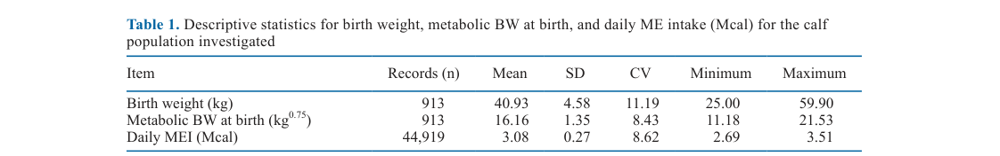
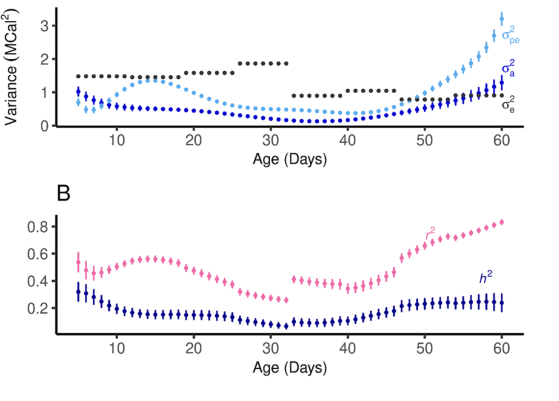
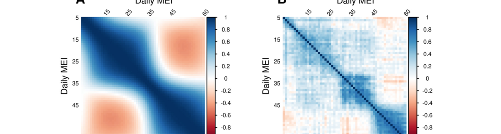

---
# YAML FRONTMATTER (обязательно)
id: CS.SOTA.378
type: sota
format_version: v1.1
knowledge_tier: P2
domain: cattle-science
area: genetics
subarea: genetic-parameters
subarea2: calf-feed-efficiency
category: field-study
year: 2026
authors: "Phillips, A. G. R., Makanjuola, B. O., Miglior, F., Schenkel, F. S., Steele, M. A., Baes, C. F., and Jahnel, R. E."
title: "Estimating genetic variation and heritability of metabolizable energy intake of dairy calves during the rearing period"
journal: "Journal of Dairy Science"
volume: "109"
issue: "6"
pages: "6444-6456"
doi: "10.3168/jds.2025-27356"
publisher: "Elsevier / ADSA"
open_access: true
license: "CC BY"
language: ru
freshness_window: "2026-08-05 — 2028-08-05"
sota_edition: "1.0"
derivation:
  - source: "Phillips et al., 2026, Journal of Dairy Science (109:6)"
    type: "ConservativeRetextualization (FPF A.6.3)"
    reopen_trigger: "DOI: 10.3168/jds.2025-27356"
tags:
  - calf
  - metabolizable-energy-intake
  - heritability
  - repeatability
  - random-regression-model
  - feed-efficiency
  - genetic-parameters
  - holstein
related:
  - id: CS.SOTA.355
    type: complementary
    note: "Генетические параметры продуктивных признаков молочного скота (JDS 109, 2026) — методология оценки (ко)вариаций"
    relevance: medium
  - id: CS.SOTA.366
    type: complementary
    note: "Метаболические профили телят на ЗЦМ разной жирности (JDS 109:7, 2026) — фенотипический контекст потребления энергии телятами"
    relevance: medium
  - id: CS.SOTA.XXX
    type: foundational
    note: "NASEM 2021 — система обменной энергии и потребности телят [foundational reference, не цитируется в Phillips et al., 2026]"
    relevance: high
---

# CS.SOTA.378: Phillips et al. (2026) — Оценка генетической вариации и наследуемости потребления обменной энергии молочными телятами в период выращивания

> **Навигация:** [2. Аннотация](#2-аннотация-abstract) · [3. Введение](#3-введение) · [4. Методология](#4-методология) · [5. Результаты](#5-результаты) · [6. Интерпретация](#6-интерпретация-и-обсуждение) · [7. Критический анализ](#7-критический-анализ) · [8. Выводы](#8-выводы) · [9. FAQ](#9-faq) · [10. Практика](#10-практическое-применение) · [12. Источники](#12-источники)

---

# 2. АННОТАЦИЯ (Abstract)

## 2.1. Перевод Abstract

Селекция кормоэффективных животных стала ключевым фокусом молочной отрасли, однако большинство исследований генетического потенциала кормовой эффективности (feed efficiency, FE) сосредоточено на взрослых животных, что оставляет пробел в понимании FE молодняка. Потребление обменной энергии (metabolizable energy intake, MEI) из заменителя молока и твёрдого корма может служить мерой ранней кормовой эффективности, поскольку охватывает обе формы рациона телёнка. Целью исследования была оценка компонентов дисперсии и генетических параметров MEI молочных телят за период выращивания (с 5-го по 60-й день жизни). Проанализировано 44 919 ежедневных записей потребления корма от 913 телят Holstein, собранных с июля 2016 по июнь 2024 г. Одно-признаковая модель случайной регрессии (random regression model, RRM) использована для оценки генетических параметров суточного MEI. Средняя наследуемость (heritability, h²) и повторяемость (repeatability, r²) суточного MEI составили 0.17 (SE = 0.03) и 0.50 (SE = 0.03) соответственно, с наибольшими значениями обоих параметров на 5–18 и 47–60 днях жизни. Генетические параметры были минимальны в переходный период отъёма (дни 28–32). Генетические корреляции между суточными MEI варьировали от −0.46 до 0.99, что, вероятно, отражает физиологические изменения пищеварения при переходе от жидкого рациона к твёрдому. Авторы заключают, что суточный MEI телят в период выращивания демонстрирует потенциал для генетической селекции, при этом генетические параметры наибольшие в первые (недели 1–2) и последние две (недели 7–8) недели жизни. Необходимы дальнейшие исследования на больших выборках и в нескольких стадах для подтверждения результатов.

## 2.2. Key Claims

**Claim 1: Суточный MEI телёнка наследуем (h² = 0.17) — селекция по потреблению энергии молодняка возможна.**
- **Утверждение:** Средняя наследуемость суточного MEI за первые 2 месяца жизни составила 0.17 (SE = 0.03) при среднем генетическом SD 0.69 Мкал; средняя повторяемость — 0.50 (SE = 0.03).
- **Evidence:** 44 919 суточных записей от 913 телят Holstein, педигри 7 878 животных / 12 поколений, одно-признаковая RRM в ASReml 4.2.
- **Уверенность:** 0.72 (большое число записей, корректная модель с гетерогенными остатками; ограничения: одно стадо, педигри без геномики, авторы сами указывают на малую выборку для генетических оценок).
- **Цитата:** "Average heritability and repeatability (SE) for daily MEI were 0.17 (SE = 0.03) and 0.50 (SE = 0.03), respectively." (Phillips et al., 2026, p. 6444)

**Claim 2: Генетические параметры MEI динамичны: максимум в начале и в конце периода выращивания, минимум в переход отъёма.**
- **Утверждение:** h² колебалась от 0.07 (SE = 0.02) до 0.32 (SE = 0.07); r² — от 0.26 (SE = 0.02) до 0.83 (SE = 0.01). Максимум h² — на 5-й день жизни и с ~40-го дня; минимум — на 32-й день. Повторяемость минимальна на 28–32 днях (начало отъёма).
- **Evidence:** RRM на полиномах Лежандра (3-я степень — аддитивная генетика, 4-я — постоянная среда), гетерогенная остаточная дисперсия по 8 недельным периодам.
- **Уверенность:** 0.75 (устойчивый паттерн кривых + SE для каждой точки; оговорка авторов: краевые значения могут быть завышены полиномами Лежандра).
- **Цитата:** "Genetic parameters for daily MEI were lowest during the weaning transition from d 28 to 32 of life." (Phillips et al., 2026, p. 6444)

**Claim 3: MEI — генетически разный признак в раннем и позднем возрасте.**
- **Утверждение:** Генетические корреляции между суточными MEI варьировали от −0.46 до 0.99: сильные положительные между соседними днями (в пределах недели), умеренные отрицательные — между записями 2–3-й и 6–8-й недель жизни. Фенотипические корреляции: от −0.30 до 0.81.
- **Evidence:** Тепловые карты корреляций (Figure 3); интерпретация через переход ЖКТ от псевдомоногастрического пищеварения к рубцовому.
- **Уверенность:** 0.70 (широкий диапазон корреляций + согласованная физиологическая интерпретация; точечные значения корреляций зависят от степени полинома).
- **Цитата:** "Genetic correlations among daily MEI were highly variable, ranging from −0.46 to 0.99, likely reflecting the physiological changes in digestion as calves transitioned from a liquid to solid diet." (Phillips et al., 2026, p. 6444)

**Claim 4: Переходный период отъёма целесообразно исключать из генетической оценки FE телят.**
- **Утверждение:** Снижение h² и r² на 28–32 днях может быть связано с неточностью измерения потребления твёрдого корма (выдача без учёта остатков) и сложностью разделения энергии молока и стартера; исключение переходной фазы повысит надёжность ранних FE-признаков. Предложено делить оценку на две биологические фазы: псевдомоногастрическую (молочный рацион) и рубцовую (твёрдый корм).
- **Evidence:** Минимум генетических параметров в отъём + отсутствие весов для остатков стартера (записи as-offered).
- **Уверенность:** 0.62 (логичный вывод авторов из собственных данных и ограничений измерения; прямой валидации на независимом наборе нет — статус: [интерполяция] авторов).
- **Цитата:** "Excluding the transition phase from genetic evaluations may therefore enhance the reliability of early-life feed efficiency traits." (Phillips et al., 2026, p. 6453)

**Claim 5: Генетического тренда по MEI за 2016–2024 гг. не выявлено — признак не был объектом селекции.**
- **Утверждение:** Ежегодные фенотипы суточного MEI варьировали мало; EBV фенотипированных животных относительно стабильны (небольшой подъём 2016→2017, далее плато до 2024).
- **Evidence:** Регрессия EBV на год рождения (Figure 4B).
- **Уверенность:** 0.68 (прямое наблюдение в данных; интерпретация «отсутствие селекционного давления» — правдоподобная, но косвенная).
- **Цитата:** "The genetic trend did become more positive from 2016 to 2017 and then showed minimal change from 2017 onward to 2024." (Phillips et al., 2026, p. 6449)

---

# 3. ВВЕДЕНИЕ

## 3.1. Контекст и значимость проблемы

Выращивание ремонтного молодняка — самая затратная ранняя фаза производства: около 46% всех расходов предотъёмного периода связаны с кормом и кормлением, а молочная диета делает предотъёмный период наиболее дорогой стадией выращивания ремонтных тёлок (Hawkins et al., 2019, цит. по Phillips et al., 2026, p. 6444). Ограничение молочного рациона ради экономии ухудшает рост, повышает восприимчивость к болезням и снижает благополучие телят. Альтернативная стратегия — селекция кормоэффективных телят: животных, которые потребляют меньше корма при том же росте. Однако генетическая селекция по FE исторически сфокусирована на взрослых коровах (через остаточное потребление корма, residual feed intake, RFI), а понимание FE молодняка ограничено: функция ЖКТ, кормовое поведение и приоритеты распределения нутриентов у телят принципиально иные.

Ключевая методологическая проблема: классический показатель потребления — DMI (потребление сухого вещества) — непригоден для предотъёмных телят, поскольку не учитывает энергию жидкого рациона. Потребление обменной энергии (MEI) из обеих составляющих рациона (ЗЦМ + стартер) отражает реальную утилизацию энергии и потому предложено как фенотип для оценки ранней FE (Phillips et al., 2026, p. 6445).

## 3.2. Обзор литературы (краткий)

1. **Koch et al. (1963); Kennedy et al. (1993)** — определение RFI как меры кормовой эффективности.
2. **Gonzalez-Recio et al. (2014); Houlahan et al. (2024)** — генетические параметры FE у взрослых коров; положительные генетические корреляции RFI тёлок и коров.
3. **da Silva et al. (2023)** — обзор RFI у предотъёмных телят: пробел знаний по генетике FE молодняка.
4. **Drackley (2008)** — MEI как более адекватная мера потребления у телят на смешанном рационе.
5. **Jamrozik and Schaeffer (1997); Khanal et al. (2022)** — RRM-подход для продольных данных потребления.
6. **Graham et al. (2024)** — генетические параметры потребления молока телятами по данным автоматических кормушек с геномикой (h² = 0.46).

## 3.3. Гипотеза и цель исследования

**Цель:** Оценить компоненты дисперсии и генетические параметры (наследуемость, повторяемость, генетические корреляции) суточного MEI молочных телят за период выращивания с использованием RRM-подхода (Phillips et al., 2026, p. 6445).

**Primary outcomes:** h² и r² суточного MEI по возрастам (дни 5–60).
**Secondary outcomes:** компоненты дисперсии (аддитивная генетическая, постоянная средовая, остаточная), генетические и фенотипические корреляции между суточными MEI, генетический тренд EBV по годам рождения.

---

# 4. МЕТОДОЛОГИЯ

## 4.1. Дизайн исследования

| Параметр | Описание |
|----------|----------|
| **Тип исследования** | Ретроспективная оценка генетических параметров на популяционных записях (field-study; RRM-анализ) |
| **Место** | Ontario Dairy Research Centre (Elora, ON, Канада) |
| **Период сбора данных** | Июль 2016 — июнь 2024 (Abstract, p. 6444; в разделе Animals указано «July 2016 to April 2024», p. 6445 — расхождение в статье) |
| **Животные** | 913 телят Holstein; 44 919 суточных записей MEI (по 49 записей на телёнка в среднем; до 56 дней-тестов на животное) |
| **Педигри** | 7 878 животных, 12 поколений; 198 отцов, дочерей на отца: 1–66 |
| **Диета** | ЗЦМ 150 г/л (26% СП, 18% жира; 4.55 Мкал ОЭ/кг порошка) на автокормушке; стартер 22.1% СП, 27.63% крахмала, 14.27% NDF (88% СВ; 2.51 Мкал ОЭ/кг СВ) |
| **Схема отъёма** | Ограничение ЗЦМ с 28-го дня (макс. 12 л/д), ступенчатое снижение 0.5 л/д до конца отъёма на 57-й день |
| **Оборудование** | Автоматические кормушки Forster Technik с RFID (2 комнаты-профилактория, R1 и R2, до 15 телят); стартер дозировался порциями по 30 г до 6 кг/д **без взвешивания остатков** (записи as-offered) |
| **Здоровье** | Диарея диагностировалась визуально + ректальная температура; учтена как фиксированный эффект (ежедневная инцидентность) |
| **Этика** | Утверждено University of Guelph Animal Care Committee (AUP 4445, AUP 5290) |

Особенность данных: 120 телят участвовали в испытании стартеров (Parsons et al., 2022; 2 уровня молока × 2 типа стартера, кормление через calf rail) — эффект испытания (5 уровней) включён в модель как фиксированный.

## 4.2. Статистический анализ

- **Модель:** одно-признаковая животная-модель случайной регрессии (ASReml 4.2; обработка в R).
- **Фиксированные эффекты:** год-сезон, возраст (неделя, категориальный), испытание (5 уровней), ежедневная инцидентность диареи, линейный эффект метаболической массы при рождении (MBW = масса^0.75).
- **Случайные эффекты:** аддитивная генетика и постоянная среда — регрессионные коэффициенты на нормированных полиномах Лежандра (3-я степень для аддитивной генетики, 4-я — для постоянной среды).
- **Остатки:** гетерогенная дисперсия по 8 недельным периодам (дни 5–11, 12–18, …, 54–60).
- **Выбор модели:** по AIC и биологической осмысленности параметров (без признаков перепараметризации).
- **SE генетических параметров:** аппроксимация первым порядком ряда Тейлора (дельта-метод; адаптировано из Jahnel et al., 2023; Fischer et al., 2004).
- **Генетический тренд:** EBV фенотипированных животных (сумма по 56 дням-тестам) регрессированы на год рождения.

## 4.3. Медиа-инвентарь

| ID | Тип | Описание | Файл | Статус |
|----|-----|----------|------|--------|
| Table 1 | Таблица | Описательная статистика: масса при рождении, MBW, суточный MEI | `table-1-descriptive-statistics.png` | ✅ Встроено |
| Fig. 1 | График | MEI (Мкал) по неделям жизни (столбцы с SE) | — | ❌ Не извлечён (пересказан в тексте 5.2; вторичен относительно Fig. 2) |
| Fig. 2 | График | (A) Компоненты дисперсии MEI; (B) h² и r² по дням жизни | `figure-2-genetic-parameters.png` | ✅ Встроено |
| Fig. 3 | Тепловая карта | Генетические (A) и фенотипические (B) корреляции суточных MEI | `figure-3-correlation-heatmaps.png` | ✅ Встроено |
| Fig. 4 | График | (A) Фенотипы MEI по годам; (B) генетический тренд EBV | — | ❌ Не извлечён (ключевые значения пересказаны в 5.5) |

В статье единственная таблица (Table 1) — извлечена и встроена (жёсткое правило шаблона выполнено).

---

# 5. РЕЗУЛЬТАТЫ

## 5.1. Описательная статистика

**Соответствует:** Table 1

*Источник: Phillips et al., 2026, p. 6449 (Table 1).*

**Описание:**
Средний суточный MEI составил 3.08 Мкал (SD = 0.27; CV = 8.62%; диапазон 2.69–3.51). Масса при рождении 40.93 кг (SD = 4.58), метаболическая масса при рождении 16.16 кг^0.75 (SD = 1.35 по таблице; в тексте p. 6448 указано SD = 1.36 — расхождение в статье). Диарея зарегистрирована у 205 телят (22.5% популяции), у 36 из них — более одного эпизода; пик инцидентности — на 11-й день жизни, наибольшая заболеваемость — в первые 4 недели.

**Ключевые цифры:**
- Суточный MEI: 3.08 ± 0.27 Мкал (n = 44 919 записей)
- Масса при рождении: 40.93 ± 4.58 кг (n = 913)
- MBW при рождении: 16.16 ± 1.35 кг^0.75

## 5.2. Динамика MEI по возрастам

**Соответствует:** Figure 1 (не извлечена; пересказ по тексту)

**Описание:**
Суточный MEI был минимален в начале периода выращивания и рос с 3.08 Мкал (SD = 0.27) на 1-й неделе до пика 3.51 Мкал (SD = 0.27) на 3-й неделе жизни; минимальные оценки MEI отмечены на 5-й неделе (Figure 1, p. 6448). Снижение после 4-й недели связано с началом ограничения ЗЦМ на 28-й день (старт отъёма) и индивидуальной вариацией потребления твёрдого корма (Phillips et al., 2026, p. 6449). *Примечание:* значения динамики MEI — средние по неделям из смоделированных/наблюдаемых записей; фактическое окно наблюдения — дни 5–60 жизни.

## 5.3. Компоненты дисперсии, наследуемость и повторяемость

**Соответствует:** Figure 2

*Источник: Phillips et al., 2026, p. 6448 (Figure 2).*

**Описание:**
Средние суточные дисперсии: аддитивная генетическая 0.47 (SE = 0.10), постоянная средовая 0.92 (SE = 0.07), остаточная 1.25 (SE = 0.03). Постоянная средовая и остаточная дисперсии превышали аддитивную на протяжении почти всего периода, кроме 1-й и 8-й недель жизни. Постоянная средовая дисперсия росла между 10-м и 15-м днями, затем постепенно снижалась до 42-го дня; обе дисперсии (генетическая и постоянная средовая) минимальны на 31–41 днях. Остаточная дисперсия пиковала на 4-й неделе и была выше в первый месяц, чем во второй.

Наследуемость суточного MEI: средняя 0.17 (SE = 0.03), диапазон 0.07 (SE = 0.02) — 0.32 (SE = 0.07); максимум на 5-м дне, минимум на 32-м, рост с ~40-го дня до 60-го. Повторяемость: средняя 0.50 (SE = 0.03), диапазон 0.26 (SE = 0.02) — 0.83 (SE = 0.01); минимум на 28–32 днях.

**Механистическая интерпретация:**
Минимум параметров в отъёмный переход отражает одновременно (а) перестройку ЖКТ от переваривания молока в сычуге к рубцовому пищеварению и (б) измерительный шум: потребление стартера записывалось без учёта остатков (as-offered), что завышает ошибку именно в фазу, когда доля твёрдого корма растёт (Phillips et al., 2026, p. 6452–6453). Рост h² к концу периода согласуется с более стабильным потреблением твёрдого корма и бо́льшим числом записей на 45–60 днях.

**Ключевые цифры:**
- σ²a = 0.47 ± 0.10; σ²pe = 0.92 ± 0.07; σ²e = 1.25 ± 0.03 (средние суточные)
- h² = 0.17 ± 0.03 (средняя); диапазон 0.07–0.32
- r² = 0.50 ± 0.03 (средняя); диапазон 0.26–0.83
- Генетическое SD MEI: 0.69 Мкал

## 5.4. Генетические и фенотипические корреляции

**Соответствует:** Figure 3

*Источник: Phillips et al., 2026, p. 6450 (Figure 3).*

**Описание:**
Генетические корреляции между суточными MEI: от −0.46 до 0.99. Сильные положительные — между последовательными днями; ослабевают, когда интервал превышает 7 дней. Умеренные отрицательные — между записями 2–3-й и 6–8-й недель. Фенотипические корреляции: от −0.30 до 0.81, с аналогичным паттерном; слабые отрицательные между ранними и поздними записями, начиная примерно с 45-го дня.

**Механистическая интерпретация:**
Отрицательные корреляции «ранний–поздний возраст» указывают, что MEI — генетически разные признаки на разных фазах: в первый месяц ЖКТ телёнка функционирует как у моногастричного (молоко → сычуг через глоточный рефлекс), затем рубец созревает (с 38% до 61% массы желудка к 8 неделям; Diao et al., 2019, цит. по Phillips et al., 2026, p. 6452). Фенотипическая отрицательная связь отражает и подавление потребления стартера высоким потреблением молока (каждые +100 г СВ жидкого корма → −13…−93 г СВ твёрдого; Silva et al., 2019, цит. там же).

## 5.5. Фенотипический и генетический тренды

**Соответствует:** Figure 4 (не извлечена; пересказ по тексту)

**Описание:**
За 8 лет (2016–2024) ежегодные фенотипы суточного MEI варьировали мало (Figure 4A). Генетический тренд EBV фенотипированных животных относительно стабилен: небольшой подъём с 2016 к 2017 г., далее минимальные изменения до 2024 г. (Figure 4B, p. 6449). Авторы связывают отсутствие направленного тренда с тем, что селекция по FE велась на тёлках и коровах, а не на предотъёмных телятах.

---

# 6. ИНТЕРРЕТАЦИЯ И ОБСУЖДЕНИЕ

## 6.1. Связь с гипотезой

Цель достигнута: компоненты дисперсии и генетические параметры суточного MEI оценены по всему периоду выращивания. Результаты подтверждают исходное предположение, что MEI — динамичный признак: его генетическая архитектура меняется с физиологическим развитием телёнка, что требует учёта фазы при построении будущего FE-признака для молодняка.

## 6.2. Сравнение с литературой

| Исследование | Согласие/Противоречие/Расширение |
|--------------|----------------------------------|
| Karacaören et al. (2006) — h² DMI первотёлок 0.12–0.34 (средн. 0.23) | **Согласуется** — h² MEI телят (0.17) того же низко-умеренного диапазона, что и потребление у взрослых |
| Houlahan et al. (2024) — h² DMI первотёлок 0.15–0.29 за 305 дней | **Согласуется** — аналогичный диапазон и методология RRM |
| Graham et al. (2024) — h² суточного потребления молока телятами 0.46 (с геномикой) | **Противоречит частично** — заметно выше; различия: геномные матрицы родства, запись с 1-го дня, масса при рождении вместо MBW как ковариата |
| Negussie et al. (2019) — редкие записи DMI (1 раз/неделю), 8–46 дочерей на отца → надёжность EBV 0.4–0.8 | **Расширяет** — обоснование работоспособности оценки при разреженных записях; в Phillips et al. 1–66 дочерей на отца |
| Oliveira et al. (2019) — обзор RRM | **Согласуется методологически** — завышение полиномов Лежандра на краях траектории как причина высоких дисперсий в начале и конце периода |

## 6.3. Механистические выводы

1. **Две биологические фазы MEI:** псевдомоногастрическая (молочный рацион, сычуг) и рубцовая (твёрдый корм) — генетически частично различные признаки, что поддерживает их раздельную оценку или группировку MEI по месяцам (Phillips et al., 2026, p. 6452–6453).
2. **Измерение лимитирует оценку:** отсутствие взвешивания остатков стартера вносит систематическую ошибку, вероятно объясняющую минимум h²/r² в отъёмный переход.
3. **Гетерогенные остатки отражают смену диеты:** снижение остаточной дисперсии после 1-го месяца связано с ограничением ЗЦМ с 28-го дня (более унифицированные дачи молока).
4. **Обучение кормушке искажает ранние записи:** телята осваивают автокормушку в среднем за 31.4 ч (Medrano-Galarza et al., 2018, цит. по статье) — меньше записей в первые недели, что может влиять на ранние оценки.
5. **Еженедельные записи достаточны:** сильные генетические корреляции внутри недельных окон позволяют оценивать MEI по недельным, а не суточным измерениям [интерполяция авторов из Figure 3A].

---

# 7. КРИТИЧЕСКИЙ АНАЛИЗ

## 7.1. Сильные стороны

- **Крупный лонгитюдный массив:** 44 919 суточных записей от 913 телят за 8 лет; глубокий педигри (7 878 животных, 12 поколений).
- **Адекватная модель:** RRM с полиномами Лежандра + гетерогенные остатки по 8 недельным периодам; выбор степени полинома по AIC; SE через дельта-метод.
- **Фенотип MEI вместо DMI:** корректный учёт обеих форм рациона телёнка (ЗЦМ + стартер) — методологическое преимущество перед DMI-оценками.
- **Учёт помех:** диарея (ежедневная инцидентность), испытание стартеров, год-сезон и MBW включены в модель.
- **Данные точного животноводства:** автоматические кормушки с RFID дают индивидуальные суточные фенотипы без ручного труда.

## 7.2. Ограничения

**Внутренние:**
- **Одно стадо, педигри без геномики:** авторы прямо указывают на малую выборку для генетических оценок и необходимость подтверждения на нескольких стадах; h² = 0.46 у Graham et al. (2024) с геномикой показывает чувствительность оценки к типу матрицы родства.
- **Стартер as-offered:** нет весов остатков — систематическая ошибка измерения твёрдого корма, критичная в отъёмный переход.
- **Краевая инфляция полиномов:** высокие дисперсии на 1-й и 8-й неделях могут быть артефактом полиномов Лежандра (Oliveira et al., 2019, цит. по статье).
- **Пропущенные записи:** болезнь, тепловой стресс или сытость → пропуски визитов; RRM устойчива к пропускам, но оценки в разреженные периоды менее стабильны.
- **Валидации стартер-кормушек нет:** точность автоматических молочных кормушек обсуждалась в литературе, валидационных исследований твёрдокормовых кормушек не существует (Phillips et al., 2026, p. 6453).

**Внешние:**
- **Одна порода (Holstein), одна исследовательская станция:** перенос на коммерческие стада и другие породы требует осторожности.
- **Специфический протокол отъёма** (фиксированный старт на 28-й день независимо от потребления стартера) — не типичен для всех систем выращивания.

## 7.3. Применимость к российским условиям

- **Автоматические кормушки как источник фенотипов:** в РФ распространённость автокормушек для телят ниже канадской (16% коммерческих стад Канады на 2017 г.; Medrano-Galarza et al., 2017, цит. по статье) — сбор суточных MEI-фенотипов возможен в первую очередь на крупных технологичных комплексах и племенных ядрах.
- **Голштинская популяция РФ** генетически близка к североамериканской — оценки h² североамериканских Holstein ориентировочно переносимы, но требуют верификации на отечественных педигри [guess].
- **Практический вывод для племенной работы:** при построении оценки FE молодняка в РФ целесообразно сразу закладывать взвешивание остатков стартера и раздельную оценку фаз «молоко/твёрдый корм», а переход отъёма исключать из оценки (Claim 4).
- **Диарея как ковариата:** высокая инцидентность диареи (22.5%) влияет на MEI — в российских условиях с иным уровнем ветеринарного контроля эффект заболеваемости на потребление следует учитывать обязательно.

---

# 8. ВЫВОДЫ

## 8.1. Ключевые выводы автора (перевод)

Результаты исследования раскрывают изменчивое генетическое влияние на потребление корма молочными телятами в период выращивания. Оценённые генетические параметры менялись в течение периода, что подчёркивает необходимость учёта динамики MEI и биологических процессов кормления и пищеварения по мере созревания телят. MEI наследуем и демонстрирует потенциал как мера потребления корма для оценки FE телят, однако необходимы дальнейшие исследования на больших наборах данных и в дополнительных стадах для подтверждения результатов (Phillips et al., 2026, p. 6453).

## 8.2. Ключевые выводы (структурировано)

1. **Суточный MEI телёнка наследуем:** h² = 0.17 (SE = 0.03), r² = 0.50 (SE = 0.03) — селекция по раннему потреблению энергии возможна.
2. **Генетические параметры динамичны:** максимумы на 5–18 и 47–60 днях, минимум в отъёмный переход (28–32 дни).
3. **MEI — генетически разные признаки в раннем и позднем возрасте:** корреляции от −0.46 до 0.99 отражают перестройку ЖКТ.
4. **Отъёмный переход — источник шума:** исключение фазы 28–32 дней и раздельная оценка «молочной» и «рубцовой» фаз повысят надёжность FE-признаков.
5. **Генетического тренда нет (2016–2024):** признак не был под селекционным давлением — потенциал отбора не использован.

## 8.3. Ключевые сообщения для лекции

1. Потребление корма телёнка — не один признак, а последовательность генетически различных состояний: «молочная» и «рубцовая» фазы наследуются частично независимо (корреляции до −0.46).
2. Наследуемость потребления энергии телёнком (0.17) того же порядка, что у взрослых коров (0.15–0.29) — ранняя селекция по FE имеет генетическую основу.
3. Качество измерения определяет качество оценки: без взвешивания остатков стартера отъёмный период «проваливает» h² и r².
4. Автоматические кормушки — готовая инфраструктура генетической оценки молодняка: 8 лет записей одной станции дали ~45 тыс. суточных фенотипов.
5. Селекция по FE исторически игнорировала телят — генетический тренд MEI нулевой, т.е. резерв прогресса не задействован.

---

# 9. FAQ

**Вопрос 1: Почему для телят используют MEI, а не привычный DMI?**
Ответ: В первые 2 месяца телёнок получает и жидкий (ЗЦМ), и твёрдый корм; DMI без учёта энергии молочного рациона искажает оценку потребления. MEI суммирует обменную энергию обеих составляющих (4.55 Мкал/кг порошка ЗЦМ + 2.51 Мкал/кг СВ стартера) и отражает реальную утилизацию энергии (Phillips et al., 2026, p. 6445).

**Вопрос 2: Наследуемость 0.17 — это много или мало для селекции?**
Ответ: Это низко-умеренная наследуемость, сопоставимая с h² потребления корма у взрослых коров (0.12–0.34 по Karacaören et al., 2006; 0.15–0.29 по Houlahan et al., 2024). При генетическом SD 0.69 Мкал и высокой повторяемости (0.50) признак отвечает на отбор, но прогресс будет умеренным; геномика (h² = 0.46 у Graham et al., 2024) может существенно поднять точность оценки.

**Вопрос 3: Почему наследуемость падает именно в период отъёма (28–32 дни)?**
Ответ: Две причины: (1) измерительная — стартер учитывался без взвешивания остатков, а именно в отъём его доля растёт; (2) биологическая — ЖКТ перестраивается с переваривания молока на рубцовое пищеварение, и индивидуальная вариация успешности отъёма максимальна. Авторы предлагают исключать переходную фазу из генетической оценки (p. 6453).

**Вопрос 4: Что означают отрицательные генетические корреляции между ранним и поздним MEI?**
Ответ: Телята, генетически предрасположенные к высокому потреблению молока в первые недели, склонны к меньшему потреблению (энергии) на 6–8 неделях — вероятно, из-за подавления потребления стартера насыщением молочным рационом и задержки развития рубца. Практически: отбор на высокий ранний MEI без учёта поздней фазы может ухудшать переход на твёрдый корм [интерполяция из данных статьи].

**Вопрос 5: Можно ли уже включать MEI телят в селекционные индексы?**
Ответ: Напрямую — преждевременно: оценки получены на одном стаде без геномики, авторы сами требуют подтверждения на больших выборках. Подготовительные шаги: развёртывание записи MEI на фермах с автокормушками, взвешивание остатков стартера, переход к геномным матрицам родства и раздельной оценке фаз.

---

# 10. ПРАКТИЧЕСКОЕ ПРИМЕНЕНИЕ

## 10.1. Алгоритм внедрения (для племенной фермы с автокормушками)

1. **Инфраструктура:** автоматические молочные и стартер-кормушки с RFID-идентификацией; дооснащение весами остатков стартера (устранение главного источника ошибки).
2. **Запись:** ежедневные MEI = ME из ЗЦМ + ME из стартера; контроль окна записи дни 5–60; фиксация эпизодов диареи ежедневно.
3. **Педигри/геномика:** минимум — полный педигри ≥3 поколений; предпочтительно — SNP-генотипирование телят (по примеру Graham et al., 2024).
4. **Модель оценки:** RRM с полиномами Лежандра, гетерогенные остатки по неделям; ковариаты — год-сезон, MBW при рождении, диарея, испытания.
5. **Структура признака:** оценивать «молочную» (≈5–27 дни) и «рубцовую» (≈40–60 дни) фазы раздельно; переход 28–32 дней исключить.
6. **Верификация:** сопоставление EBV телят с последующими RFI/DMI тёлок и коров — проверка связи раннего и взрослого FE [вне статьи: общая логика Gonzalez-Recio et al., 2014].

## 10.2. Типичные ошибки

- **Оценка MEI без учёта фазы:** усреднение по всему периоду маскирует генетическую гетерогенность признака (корреляции до −0.46).
- **Доверие к данным отъёмного перехода:** записи 28–32 дней с as-offered стартером систематически зашумлены.
- **Игнорирование диареи:** 22.5% телят болели; заболевание подавляет потребление и смещает ранние оценки, даже при учёте в модели.
- **Экстраполяция h² с одного стада:** педигри-оценка 0.17 и геномная 0.46 (Graham et al.) различаются в 2.7 раза — тип матрицы родства критичен.
- **Отбор только на высокий ранний MEI:** риск ухудшить переход на твёрдый корм через отрицательные корреляции с поздним MEI [интерполяция].

## 10.3. Пограничные сценарии

- **Ферма без автокормушек:** сбор суточных индивидуальных MEI невозможен — оценка FE телят недоступна; альтернатива — групповые записи и масса отъёма [вне статьи].
- **Ранний перевод в группу (до 5-го дня):** окно записи смещается; обучение кормушке (~31 ч) сокращает число ранних записей — учитывать разреженность данных.
- **Вспышка диареи в профилактории:** повышенная доля пропущенных и заниженных записей MEI — проверять остаточную дисперсию соответствующих недель.
- **Индивидуальный отъём по потреблению стартера (вместо фиксированного 28-го дня):** структура данных меняется — модель потребует эффекта возраста старта отъёма; 10 из 108 телят не достигают целевого потребления стартера даже при индивидуальном отъёме (Welk et al., 2022, цит. по статье).

---

# 11. ИНСТРУМЕНТЫ И ШАБЛОНЫ

## 11.1. Ключевые числовые ориентиры

| Параметр | Значение | Комментарий |
|----------|----------|-------------|
| Средняя h² суточного MEI | 0.17 (SE = 0.03) | Диапазон 0.07–0.32 по дням |
| Средняя r² суточного MEI | 0.50 (SE = 0.03) | Диапазон 0.26–0.83 |
| Генетическое SD MEI | 0.69 Мкал | Основа для расчёта ответа на отбор |
| Средний суточный MEI | 3.08 ± 0.27 Мкал | Пик 3.51 Мкал на 3-й неделе |
| Компоненты дисперсии | σ²a 0.47 / σ²pe 0.92 / σ²e 1.25 | Среда > генетика — управление важнее отбора в коротком горизонте |
| Окно минимума параметров | Дни 28–32 | Отъёмный переход — исключать из оценки |
| Генетические корреляции MEI | −0.46…0.99 | Отрицательные «ранний–поздний» возраст |
| Энергетичность рационов | ЗЦМ 4.55 Мкал ОЭ/кг порошка; стартер 2.51 Мкал ОЭ/кг СВ | Конвертеры потребления в MEI |
| Дочерей на отца | 1–66 (198 отцов) | Ориентир достаточности: 8–46 на отца для надёжности EBV 0.4–0.8 (Negussie et al., 2019) |

## 11.2. Онлайн-ресурсы

- Supplemental material к статье (таблицы S1–S4, рисунки S1–S2): https://doi.org/10.5281/zenodo.18710387
- Resilient Dairy Genome Project: http://www.resilientdairy.ca/
- Net-Zero Dairy Genome Project: https://www.ndgp.ca

---

# 12. ИСТОЧНИКИ

## 12.1. Первоисточник

Phillips, A. G. R., Makanjuola, B. O., Miglior, F., Schenkel, F. S., Steele, M. A., Baes, C. F., and Jahnel, R. E. 2026. Estimating genetic variation and heritability of metabolizable energy intake of dairy calves during the rearing period. Journal of Dairy Science 109(6):6444-6456. DOI: 10.3168/jds.2025-27356. Open access, CC BY. Received August 1, 2025; accepted February 24, 2026.

## 12.2. Ключевые статьи (цитированные в работе)

- Graham, J. R., Montes, M. E., Pedrosa, V. B., et al. 2024. Genetic parameters for calf feeding traits derived from automated milk feeding machines and number of bovine respiratory disease treatments in North American Holstein calves. J. Dairy Sci. 107:2175–2193. [геномная оценка h² потребления молока телятами = 0.46]
- Houlahan, K., Schenkel, F. S., Miglior, F., et al. 2024. Estimation of genetic parameters for feed efficiency traits using random regression models in dairy cattle. J. Dairy Sci. 107:1523–1534. [h² DMI первотёлок 0.15–0.29; методология RRM]
- Karacaören, B., Jaffrézic, F., and Kadarmideen, H. N. 2006. Genetic parameters for functional traits in dairy cattle from daily random regression models. J. Dairy Sci. 89:791–798. [h² DMI 0.12–0.34]
- Negussie, E., Mehtiö, T., Mäntysaari, P., et al. 2019. Reliability of breeding values for feed intake and feed efficiency traits in dairy cattle. J. Dairy Sci. 102:7248–7262. [надёжность EBV при разреженных записях]
- da Silva, C. S., Leão, J. M., Lage, C. F. A., et al. 2023. Residual feed intake as an efficiency metric for pre-weaning dairy calves: What do we know? Life 13:1727. [пробел знаний по FE телят]
- Drackley, J. K. 2008. Calf nutrition from birth to breeding. Vet. Clin. North Am. Food Anim. Pract. 24:55–86. [обоснование MEI]
- Oliveira, H. R., Brito, L. F., Lourenco, D. A. L., et al. 2019. Invited review: Advances and applications of random regression models. J. Dairy Sci. 102:7664–7683. [краевая инфляция полиномов Лежандра]
- Jamrozik, J., and Schaeffer, L. R. 1997. Estimates of genetic parameters for a test day model with random regressions. J. Dairy Sci. 80:762–770. [методологическая основа RRM]
- Khan, M. A., Bach, A., Weary, D. M., and von Keyserlingk, M. A. G. 2016. Invited review: Transitioning from milk to solid feed in dairy heifers. J. Dairy Sci. 99:885–902. [физиология отъёмного перехода]
- Hawkins, A., Burdine, K., Amaral-Phillips, D., and Costa, J. H. C. 2019. An economic analysis of the costs associated with pre-weaning management strategies for dairy heifers. Animals 9:471. [46% затрат — корм]

## 12.3. Внешние источники [вне статьи]

- NASEM. 2021. Nutrient Requirements of Dairy Cattle. 8th rev. ed. National Academies Press. [foundational reference, не цитируется в Phillips et al., 2026 — система обменной энергии и потребности телят как рамка интерпретации MEI]

---

# 13. ЖУРНАЛ ОБРАБОТКИ

## 13.1. WorkPlan

| Шаг | Действие | Статус |
|-----|----------|--------|
| 1 | Чтение полного текста PDF (13 страниц) | ✅ |
| 2 | Извлечение метаданных (авторы, DOI, страницы, лицензия) | ✅ |
| 3 | Извлечение медиа (Table 1 + Figure 2 + Figure 3, обрезка, проверка рендера) | ✅ |
| 4 | Анализ дизайна (RRM, полиномы Лежандра, гетерогенные остатки) | ✅ |
| 5 | Выделение Key Claims с оценкой уверенности | ✅ |
| 6 | Описание методологии (животные, диета, модель) | ✅ |
| 7 | Детализация результатов (дисперсии, h²/r², корреляции, тренды) | ✅ |
| 8 | Критический анализ и применимость к РФ | ✅ |
| 9 | FAQ, практическое применение, числовые ориентиры | ✅ |
| 10 | Формирование YAML frontmatter | ✅ |
| 11 | Сохранение файла | ✅ |

## 13.2. Work Record

| Параметр | Значение |
|----------|----------|
| **Время обработки** | ~45 мин |
| **Строк в файле** | ~430 |
| **Число Key Claims** | 5 |
| **Число источников** | 12 (первоисточник + 10 цитированных + 1 внешний) |
| **Число медиа** | 3 (Table 1, Figure 2, Figure 3 — PNG, 150 dpi, обрезка по координатам, визуальная проверка) |
| **Не извлечённые медиа** | Figure 1, Figure 4 — пересказаны текстом (вторичные относительно Figure 2; выбор задокументирован в инвентаре 4.3) |
| **Расхождения в самой статье** | (1) Период сбора данных: «July 2016 to June 2024» (Abstract, p. 6444) vs «July 2016 to April 2024» (Animals, p. 6445); (2) SD метаболической массы: 1.36 (текст, p. 6448) vs 1.35 (Table 1, p. 6449). Оба зафиксированы в разделах 4.1 и 5.1 |
| **FPF compliance** | A.7 (строгое разделение модели и реальности), A.6.3 (консервативная переработка с reopen trigger DOI), A.10 (якоря доказательств со страницами) |

---

*SoTA создан: 2026-08-05*
*Обработано: JDS 109:6 (июнь 2026), area=genetics*
