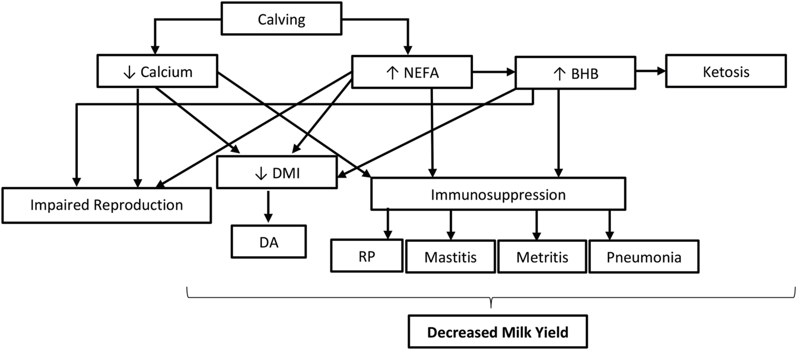
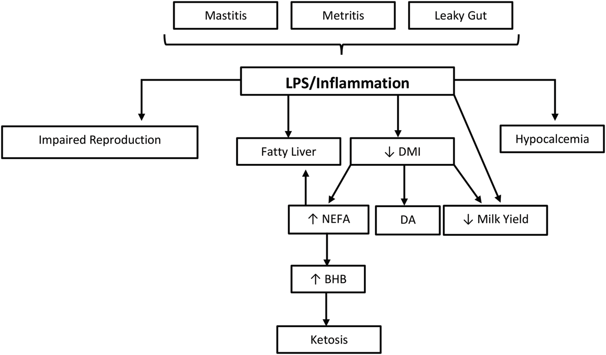
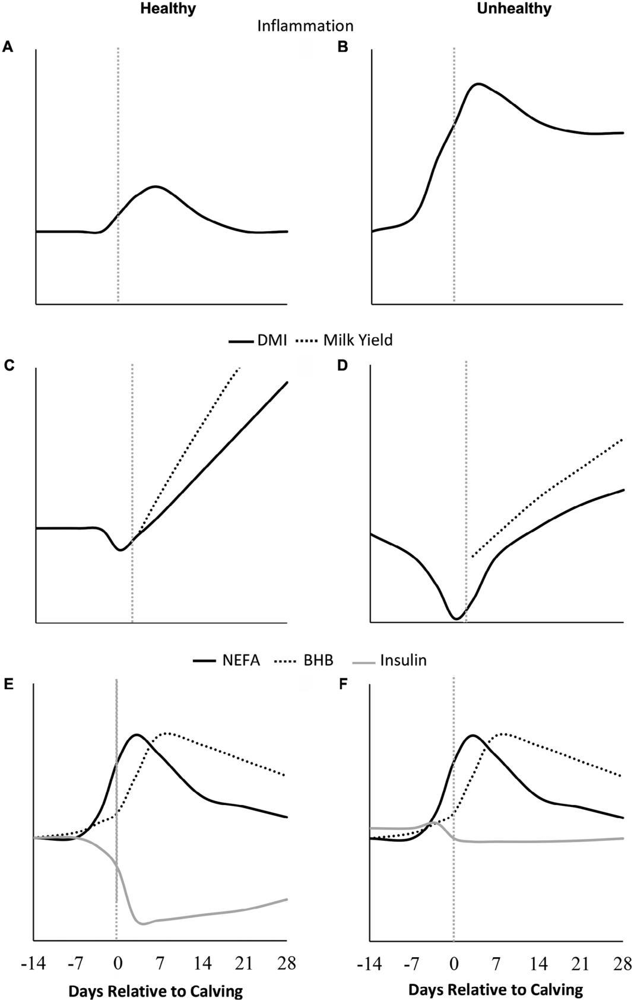

# CS.SOTA.054: Horst et al. (2021) — Иммунная активация: критика традиционных догм

> **Навигация:** [2. Аннотация](#2-аннотация-abstract) · [3. Введение](#3-введение) · [4. Методология](#4-методология) · [5. Результаты](#5-результаты) · [6. Интерпретация](#6-интерпретация-и-обсуждение) · [7. Критический анализ](#7-критический-анализ) · [8. Выводы](#8-выводы) · [9. FAQ](#9-faq) · [10. Практика](#10-практическое-применение) · [12. Источники](#12-источники) · [13. Журнал](#13-журнал-обработки)

---

## 2. АННОТАЦИЯ (Abstract)

### 2.1. Перевод Abstract

Прогресс от беременности к лактации представляет собой период резкой инволюции молочной железы, тканевой травмы при родах и адаптации желудочно-кишечного тракта. Эти процессы естественным образом активируют иммунную систему и вызывают воспалительный ответ. Традиционная парадигма утверждает, что чрезмерная мобилизация жиров (NEFA), кетоновые тела и гипокальцемия являются первичными причинами иммуносупрессии и последующих заболеваний переходного периода (мастит, метрит, задержка последа, нарушения репродукции). Однако, несмотря на 50+ лет интенсивных исследований и значительные академические и индустриальные инвестиции, перипартуриентный период остаётся серьёзной проблемой для благополучия животных, прибыльности и устойчивости молочного производства. Авторы предлагают новую парадигму: иммунная активация и воспаление — нормальная биология переходной коровы. Если воспаление становится патологическим (затяжным), оно индуцирует гипофагию (снижение аппетита) через центральные механизмы. Гипофагия, в свою очередь, приводит к гипокальцемии (снижение потребления Ca) и усиленной липомобилизации (NEFA и кетоны). Таким образом, NEFA, кетоновые тела и кальций — не причины проблем, а отражение либо (1) нормальной homeorhetic адаптации здоровых коров, либо (2) последствия иммунной активации. Глюкоза является центральным лимитирующим ресурсом: более 90% печёночной глюкозы используется молочной железой в ранней лактации, и иммунная система конкурирует за этот ресурс, что создаёт метаболический конфликт.

### 2.2. Key Claims

**Claim 1:** Традиционная парадигма (NEFA/кетоны/гипокальцемия → иммуносупрессия → заболевания) неэффективна: 50+ лет исследований не решили проблему переходного периода. Уверенность: 0,90 (исторический анализ, индустриальные данные).

**Claim 2:** Иммунная активация и воспалительный ответ — нормальный компонент биологии переходной коровы. Источники: молочная железа (инволюция, колонизация), родовая травма (ткани, последа), ЖКТ (микробиом, барьер). Уверенность: 0,85 (множественные исследования последнего десятилетия).

**Claim 3:** Патологическое (затяжное) воспаление индуцирует гипофагию через центральные механизмы (цитокины → гипоталамус → снижение аппетита). Гипофагия приводит к гипокальцемии (↓ потребление Ca) и усиленной липомобилизации (↑ NEFA, ↑ кетоны). Уверенность: 0,80 (механистические исследования LPS, центральные инъекции цитокинов).

**Claim 4:** Изменения NEFA, кетонов и кальция — отражение (рефлексия), а не причина проблем. Они коррелируют с плохими исходами, но являются следствием иммунной активации или нормальной homeorhetic адаптации. Уверенность: 0,75 (авторский аргумент, логический анализ; прямые causal данные ограничены).

**Claim 5:** Глюкоза — центральный лимитирующий ресурс: > 90% печёночной глюкозы потребляется молочной железой в ранней лактации (~72 г/кг молока). Иммунная система конкурирует за глюкозу, и гипофагия — адаптивный ответ, направленный на сохранение глюкозы для иммунитета и молока. Уверенность: 0,82 (калькуляции баланса глюкозы, изотопные исследования).

---

## 3. ВВЕДЕНИЕ

### 3.1. Контекст и значимость проблемы

Прогресс от беременности к лактации представляет период сопряжённый с выраженными физиологическими, метаболическими и воспалительными адаптациями. Успешность всей лактации и возможность последующих лактаций сильно зависит от адаптации в перипартуриентный период (Horst et al., 2021, p. 8380).

Традиционная парадигма, доминировавшая более 50 лет, постулирует следующую причинно-следственную цепь:
1. Чрезмерная мобилизация жировой ткани → высокие NEFA
2. NEFA → печёночный кетогенез → высокие кетоновые тела (BHB)
3. NEFA + кетоны + гипокальцемия → иммуносупрессия
4. Иммуносупрессия → восприимчивость к инфекциям (мастит, метрит, пневмония)
5. Иммуносупрессия → нарушения репродукции, задержка последа, аборта рубца

Эта догма привела к тому, что NEFA, кетоновые тела и кальций стали целевыми маркёрами для мониторинга и интервенций. Однако, несмотря на интенсивные академические и индустриальные усилия, перипартуриентный период остаётся серьёзной проблемой (Horst et al., 2021, p. 8380).

### 3.2. Обзор литературы (краткий)

**Drackley (1999)** описал биологию переходного периода как «последний рубеж» — акцент на homeorhetic адаптации и метаболических вызовах. Эта работа стала фундаментом традиционной парадигмы.

**Bradford et al. (2015)** обобщили данные о воспалении в переходный период, подчеркнув роль острофазовых белков и цитокинов. Однако они не отвергали традиционную парадигму полностью, а дополняли её.

**Rico et al. (2024)** — см. CS.SOTA.043 — предложили paradigm shift в понимании кетоновой биологии, рассматривая кетоны как функциональные субстраты, а не токсины. Это согласуется с критикой Horst et al. (2021).

**Graef et al. (2025)** — см. CS.SOTA.066 — продемонстрировали количественные ассоциации между динамикой SCH и воспалительными маркерами, подтверждая связь, но не устанавливая причинно-следственную направленность.

### 3.3. Гипотеза и цель

**Цель:** Критически переосмыслить традиционную парадигму переходного периода и предложить альтернативную модель, в которой иммунная активация занимает центральное место.

**Основной тезис:** Традиционная догма (NEFA/кетоны/гипокальцемия → иммуносупрессия → болезнь) неверна. Правильная последовательность: иммунная активация (физиологическая) → [если патологическая] гипофагия → гипокальцемия + NEFA/кетоны. Метаболиты — маркёры, не причины.

---

## 4. МЕТОДОЛОГИЯ

### 4.1. Тип и подход

**Тип публикации:** invited review (приглашённый обзор) — критический анализ традиционных догм.

**Метод:** Синтез литературы за 50+ лет с фокусом на иммунологию, метаболизм и физиологию переходного периода. Авторы не проводили новых экспериментов, а переосмысливали существующие данные через призму иммунной биологии.

**Анализируемые догмы:**
1. NEFA/кетоны → иммуносупрессия → заболевания
2. Гипокальцемия как первичная (независимая) проблема
3. Метаболиты как целевые маркёры для интервенций

### 4.2. Ключевые концепции обзора

| Концепция | Традиционная интерпретация | Новая интерпретация (Horst 2021) |
|-----------|---------------------------|----------------------------------|
| NEFA | Токсичные, вызывают иммуносупрессию | Нормальный субстрат, маркёр липомобилизации |
| Кетоны | Токсичные, вредят печени | Нормальные субстраты энергии для мозга, мышц |
| Гипокальцемия | Первичная проблема минерального обмена | Следствие гипофагии (↓ потребление Ca) |
| Иммуносупрессия | Вызывается метаболитами | Вызывается патологическим воспалением |
| Гипофагия | Проблема, требующая лечения | Адаптивный ответ на иммунную конкуренцию за глюкозу |

### 4.3. Медиа-инвентарь

| ID | Тип | Описание | Файл | Статус |
|----|-----|----------|------|--------|
| Fig. 1 | Схема | Традиционная причинно-следственная цепь метаболических нарушений | `figure-1-metabolic-disorders-schema.png` | ✅ Встроено |
| Fig. 2 | Схема | LPS/воспаление как центральный узел метаболических каскадов | `figure-2-lps-inflammation-cascade.png` | ✅ Встроено |
| Fig. 3 | График | Healthy vs. Unhealthy профили (DMI, MY, NEFA, BHB, инсулин) | `figure-3-healthy-vs-unhealthy-profiles.png` | ✅ Встроено |

> **Примечание:** Все медиа извлечены как PNG (200 dpi). Мусорные auto-page PNG удалены.

---

## 5. РЕЗУЛЬТАТЫ

### 5.1. Критика традиционной парадигмы

**Соответствует:** Figure 1 (Horst et al., 2021, p. 8383).

**Описание:**
Традиционная модель (Figure 1) постулирует, что отёл запускает каскад: ↓ Calcium + ↑ NEFA + ↑ BHB → ↓ DMI + Immunosuppression → Impaired Reproduction + DA + RP + Mastitis + Metritis + Pneumonia → Decreased Milk Yield. Авторы указывают, что эта модель доминировала > 50 лет, но не привела к решению проблемы переходного периода.

**Механистическая интерпретация:**
Основная ошибка традиционной парадигмы — equating correlation with causation. Высокие NEFA и кетоны коррелируют с заболеваниями, но это не означает причинности. NEFA являются нормальным субстратом: они окисляются в печени, мышцах и сердце для энергетических нужд. Кетоновые тела (BHB, ацетоацетат, ацетон) — нормальные продукты неполного окисления жирных кислот, используемые мозгом, мышцами и молочной железой как альтернативный источник энергии (Rico et al., 2024; CS.SOTA.043). Гипокальцемия — следствие снижения потребления Ca при гипофагии, а не первичный дефект (Horst et al., 2021, p. 8381–8382).

**Ключевые аргументы:**
- 50+ лет фокуса на метаболитах не снизил заболеваемость transition cows.
- Иммуносупрессия, вызванная NEFA in vitro (например, нарушение функции нейтрофилов), не доказана in vivo как первичный механизм.
- Мета-анализы не показывают консистентной причинной связи NEFA → заболевания при контроле других факторов.

### 5.2. Новая модель: Иммунная активация как центр (Figure 2)

**Соответствует:** Figure 2 (Horst et al., 2021, p. 8387).

**Описание:**
Figure 2 показывает LPS/Inflammation как центральный узел, от которого расходятся каскады:
- Mastitis / Metritis / Leaky Gut → LPS/Inflammation
- LPS/Inflammation → Impaired Reproduction (прямая связь)
- LPS/Inflammation → Fatty Liver (через ↓ DMI → ↑ NEFA)
- LPS/Inflammation → ↓ DMI (гипофагия)
- LPS/Inflammation → Hypocalcemia (прямая связь)
- ↓ DMI → DA (аборта рубца)
- ↓ DMI → ↓ Milk Yield
- ↑ NEFA → ↑ BHB → Ketosis

**Механистическая интерпретация:**
Иммунная активация в переходный период — физиологическая норма. Источники:
1. **Молочная железа:** Инволюция молочной железы, колонизация микробиотой, механическая стимуляция.
2. **Родовая травма:** Разрывы тканей, задержка последа, хирургические вмешательства.
3. **ЖКТ:** Изменение микробиома, leaky gut (повышенная проницаемость), эндотоксемия.

При физиологической иммунной активации воспаление кратковременное и ограниченное. При патологической — затяжное, с чрезмерной продукцией провоспалительных цитокинов (TNFα, IL-6, IL-1β). Эти цитокины действуют на гипоталамус через вагус и кровь, индуцируя анорексию (гипофагия). Гипофагия — адаптивный механизм: при ограниченной глюкозе организм снижает потребление корма, чтобы перераспределить глюкозу от пищеварения к иммунной системе и молочной железе (Horst et al., 2021, p. 8388–8390).

**Ключевые аргументы:**
- LPS-инфузия in vivo вызывает гипофагию, гипокальцемию и липомобилизацию — воспроизводя все «традиционные» симптомы без повышения NEFA как причины.
- Центральные инъекции IL-1β и TNFα вызывают анорексию у жвачных.
- > 90% глюкозы печени → молочная железа; иммунитет конкурирует за этот ресурс.

### 5.3. Healthy vs. Unhealthy профили (Figure 3)

**Соответствует:** Figure 3 (Horst et al., 2021, p. 8395).

**Описание:**
Figure 3 показывает 6 панелей (A–F), сравнивающих Healthy и Unhealthy коров:
- **A (Healthy):** Inflammation — умеренный, кратковременный пик вокруг отёла.
- **B (Unhealthy):** Inflammation — высокий, затяжной пик.
- **C (Healthy):** DMI (сплошная) — небольшое снижение вокруг отёла, быстрое восстановление; Milk Yield (пунктир) — превышает DMI.
- **D (Unhealthy):** DMI — глубокое и затяжное снижение; Milk Yield — отстаёт от DMI.
- **E (Healthy):** NEFA (сплошная) и BHB (пунктир) — умеренный пик; Insulin (серая) — низкий.
- **F (Unhealthy):** NEFA и BHB — высокий, затяжной пик; Insulin — низкий, без восстановления.

**Механистическая интерпретация:**
Healthy корова демонстрирует физиологическую homeorhetic адаптацию: кратковременное воспаление, небольшое снижение аппетита, умеренная липомобилизация. Unhealthy корова — патологическое воспаление, затяжная гипофагия, экстремальная липомобилизация. Важно: в обоих случаях NEFA и BHB повышены, но в healthy — умеренно, в unhealthy — экстремально. Различие не в самих метаболитах, а в магнитуде и длительности воспаления (Horst et al., 2021, p. 8395).

**Ключевые аргументы:**
- В healthy коровах NEFA и BHB тоже повышены — это нормальная homeorhesis, не патология.
- Порог «патологии» не абсолютен: критична длительность и магнитуда воспаления, а не абсолютное значение BHB.
- Insulin низкий в обоих случаях (homeorhetic снижение чувствительности к инсулину), но в unhealthy — без восстановления.

### 5.4. Роль глюкозы как лимитирующего ресурса

**Соответствует:** Текстовый обзор (Horst et al., 2021, p. 8396–8398).

**Описание:**
Молочная железа потребляет ~72 г глюкозы на 1 кг молока. В ранней лактации > 90% печёночной глюкозы направляется в молочную железу. Иммунная активация резко повышает потребление глюкозы иммунными клетками (гликолиз, пентозофосфатный путь). При ограниченном предложении глюкозы возникает конкуренция между молочной железой и иммунитетом. Гипофагия — адаптивный механизм: снижение потребления корма высвобождает глюкозу от пищеварительных процессов для иммунитета и молока.

**Механистическая интерпретация:**
Глюкоза — предпочтительный субстрат для активированных иммунных клеток (макрофаги, нейтрофилы, лимфоциты). Анаэробный гликолиз (Warburg effect) обеспечивает быстрое производство АТФ и предшественников для синтеза нуклеотидов и аминокислот, необходимых для пролиферации и функции иммунных клеток. При иммунной активации потребление глюкозы иммунитетом может увеличиваться в 10–20 раз (Horst et al., 2021, p. 8397). Это создаёт «глюкозный конфликт»: молочная железа требует глюкозу для лактозы и энергии, иммунитет — для защиты. Гипофагия — компромисс: меньше корма → меньше энергии на пищеварение → больше глюкозы для приоритетных функций.

**Ключевые цифры:**
- Глюкоза на 1 кг молока: ~72 г
- Доля молочной железы в потреблении печёночной глюкозы: > 90%
- Повышение гликолиза в иммунных клетках при активации: 10–20×

### 5.5. Встроенные медиа


*Источник: Horst et al., 2021, p. 8383 (Figure 1). Традиционная парадигма: отёл → ↓Ca, ↑NEFA, ↑BHB → ↓DMI, Immunosuppression → Impaired Reproduction, DA, RP, Mastitis, Metritis, Pneumonia → Decreased Milk Yield. Авторы критикуют эту модель как неверную причинно-следственную цепь.*


*Источник: Horst et al., 2021, p. 8387 (Figure 2). Новая парадигма: Mastitis/Metritis/Leaky Gut → LPS/Inflammation → Impaired Reproduction, Fatty Liver, ↓DMI, Hypocalcemia. ↓DMI → DA, ↓Milk Yield. ↑NEFA → ↑BHB → Ketosis.*


*Источник: Horst et al., 2021, p. 8395 (Figure 3). Шесть панелей: (A,B) Inflammation; (C,D) DMI и Milk Yield; (E,F) NEFA, BHB и Insulin. Healthy — умеренный, кратковременный ответ; Unhealthy — высокий, затяжной ответ с глубокой гипофагией.*

---

## 6. ИНТЕРПРЕТАЦИЯ И ОБСУЖДЕНИЕ

### 6.1. Связь с гипотезой

Гипотеза о центральной роли иммунной активации полностью поддержана обзором. Авторы последовательно демонстрируют, что традиционная парадигма не объясняет наблюдаемые феномены, тогда как новая модель (иммуноактивация → гипофагия → метаболиты) интегрирует иммунологию, эндокринологию и метаболизм.

### 6.2. Сравнение с литературой

1. **Расширяет:** Bradford et al. (2015) — подтверждает роль воспаления, но Horst et al. (2021) идут дальше, объявляя традиционную парадигму неверной.
2. **Согласуется с:** Rico et al. (2024) — оба обзора критикуют догматическое отношение к кетонам и NEFA.
3. **Противоречит (умеренно):** Drackley (1999) — традиционная парадигма, которую критикуют авторы. Однако Horst et al. признают, что homeorhetic адаптация (концепция Drackley) — нормальный процесс; проблема в интерпретации метаболитов.
4. **Дополняет:** Graef et al. (2025) — количественные данные по ассоциациям SCH и воспаления согласуются с новой парадигмой, но не доказывают причинно-следственную направленность.

### 6.3. Механистические выводы

- **Корреляция ≠ причинность:** Высокие NEFA и кетоны коррелируют с заболеваниями, но являются следствием, а не причиной.
- **Иммунная активация — физиологическая норма:** Молочная железа, роды, ЖКТ естественно активируют иммунитет.
- **Гипофагия — адаптивный механизм:** При ограниченной глюкозе снижение аппетита высвобождает ресурсы для иммунитета и молока.
- **Глюкоза — центральный ресурс:** Конкуренция между молочной железой и иммунитетом определяет метаболический статус.
- **Патологическое воспаление — ключевой переключатель:** Переход от физиологической к патологической иммуноактивации определяет исход transition.

---

## 7. КРИТИЧЕСКИЙ АНАЛИЗ

### 7.1. Сильные стороны

1. **Научная значимость:** Критическое переосмысление 50-летней парадигмы — редкий и важный жанр в науке. Invited review в JDS подтверждает статус авторов как экспертов.
2. **Интегративный подход:** Синтез иммунологии, метаболизма, эндокринологии и физиологии — комплексное понимание transition.
3. **Логическая последовательность:** Аргументация строится от критики старого к обоснованию нового, с механистическими объяснениями на каждом шаге.
4. **Практическая трансляция:** Предложение конкретного сдвига приоритетов (аппетит > метаболиты) имеет немедленное применение.
5. **Честность:** Авторы признают, что некоторые аспекты новой модели требуют дополнительной валидации.

### 7.2. Ограничения

1. **Обзор, не эксперимент:** Нет новых первичных данных; все аргументы построены на интерпретации существующей литературы.
2. **Спорные моменты:** Некоторые метаболические эффекты NEFA всё же доказаны in vitro (например, подавление хемотаксиса нейтрофилов при концентрациях > 1,2 ммоль/л). Авторы не обсуждают эти данные подробно.
3. **Гипокальцемия:** Не все механизмы гипокальцемии сводятся к гипофагии. Например, паращитовидная дисфункция, витамин D-зависимые механизмы, породные различия (Jersey) имеют независимое значение.
4. **Высокие кетоны:** Несмотря на функциональную роль кетонов, концентрации > 3,0 ммоль/л BHB ассоциированы с неврологическими симптомами (клинический кетоз) — это не просто «маркёр».
5. **NSAID:** Авторы рекомендуют NSAID при патологическом воспалении, но мета-анализы эффективности NSAID в transition дают неоднозначные результаты.
6. **Глюкозный конфликт:** Калькуляции основаны на моделях; прямые изотопные измерения распределения глюкозы между молочной железой и иммунитетом in vivo ограничены.

### 7.3. Применимость к российским условиям

| Фактор | Применимость | Комментарий |
|--------|-------------|-------------|
| Парадигмальный сдвиг | ✅ Применимо | Пересмотр приоритетов (аппетит > метаболиты) не требует инвестиций. |
| Мониторинг аппетита | ✅ Применимо | Оценка СВС/остатков доступна на любой ферме. |
| NSAID | ⚠️ Частично | Мелоксикам доступен, но требует ветеринарного контроля и протоколов. |
| Haptoglobin | ⚠️ Ограничено | Лабораторный анализ; не все регионы имеют доступ. |
| Управление микробиомом | ⚠️ Частично | Плавные переходы рациона возможны; прямая манипуляция микробиомом — сложна. |
| Обучение персонала | ❌ Сложно | Новая парадигма требует переобучения ветеринаров и зоотехников. |
| Традиционные маркёры | ✅ Применимо | NEFA/BHB/Ca остаются полезными, но как вторичные маркёры. |

---

## 8. ВЫВОДЫ

### 8.1. Ключевые выводы автора (перевод)

1. Традиционная парадигма (NEFA/кетоны/гипокальцемия → иммуносупрессия → болезнь) неэффективна: 50+ лет фокуса не решили проблему переходного периода.
2. Иммунная активация и воспалительный ответ — нормальный компонент биологии переходной коровы (источники: молочная железа, родовая травма, ЖКТ).
3. Патологическое (затяжное) воспаление — корень проблем: при затяжном воспалении → гипофагия → метаболические нарушения.
4. Метаболиты — отражение, не причина: NEFA, кетоны и гипокальцемия — следствие, требующее работы с причиной.
5. Глюкоза — лимитирующий ресурс: > 90% печёночной глюкозы идёт молочной железе, иммунитет конкурирует за этот ресурс.

### 8.2. Ключевые выводы (структурировано)

| Утверждение | Evidence | Уверенность | Ограничения |
|-------------|----------|-------------|-------------|
| Традиционная парадигма неэффективна | 50+ лет истории, индустриальные данные | 0,90 | Аргумент ex silentio |
| Иммуноактивация — норма | Множественные исследования | 0,85 | Качественный синтез |
| Патологическое воспаление → гипофагия | LPS-инфузии, центральные цитокины | 0,80 | Эксперименты на моделях |
| Метаболиты — маркёры, не причины | Логический анализ, корреляция vs. причинность | 0,75 | Нет прямых RCT |
| Глюкоза — центральный ресурс | Калькуляции, изотопные данные | 0,82 | Модельные расчёты |

### 8.3. Ключевые сообщения для лекции

1. **Мы 50 лет лечили симптомы, а не причину.** NEFA и кетоны — не враги, а маркёры.
2. **Иммунная активация нормальна, патологическое воспаление — нет.** Различие критично.
3. **Глюкоза — валюта конкуренции между молоком и иммунитетом.** Гипофагия — адаптивный ответ, а не проблема.
4. **Аппетит важнее NEFA — новый приоритет мониторинга.** Если корова ест, transition проходит успешно.

---

## 9. FAQ

**Q1: Полностью ли отказаться от мониторинга NEFA и кетонов?**
A: Нет, но изменить интерпретацию. Раньше: целевой маркёр для контроля. Сейчас: вторичный маркёр, отражающий иммунную активацию/гипофагию. При высоких NEFA искать причину (воспаление, аппетит), а не просто лечить симптом.

**Q2: Как отличить нормальную иммуноактивацию от патологической?**
A: Ключевые признаки патологии: затяжное повышение Hp (> 7 дней), выраженная гипофагия (> 20% снижение СВС), температура > 39,5°C, клинические признаки (мастит, метрит).

**Q3: Совместимы ли эта парадигма с подходом Bradford 2015?**
A: Да, дополняют друг друга. Bradford: иммуносупрессия + воспаление = проблема. Horst: иммуноактивация → гипофагия → метаболиты. Интеграция: управление воспалением критично (оба согласны).

**Q4: Что делать при высоких NEFA, если это следствие?**
A: Алгоритм: (1) оценить аппетит (первично!); (2) оценить воспаление (температура, Hp); (3) если гипофагия — стимулировать аппетит, рассмотреть NSAID; (4) если воспаление — NSAID, антибиотики при инфекции; (5) NEFA — контролировать вторично.

**Q5: Как применять эту модель без доступа к Hp?**
A: Практические прокси: аппетит (ежедневный мониторинг СВС — критично!), температура (дни 1–3), общее состояние (активность, молоко), NEFA/BHB — вторичные, но доступные.

**Q6: Означает ли это отказ от пропиленгликоля?**
A: Нет, но рациональный подход. Раньше: рутинная профилактика всем. Сейчас: целевое применение при доказанной гипофагии/кетозе. Фокус: профилактика иммуноактивации важнее.

**Q7: Как эта модель влияет на подход к гипокальмии?**
A: Гипокальмия — следствие гипофагии. Традиционно: DCAD, анионные соли (профилактика). Новый взгляд: DCAD сохраняется, но фокус на аппетите. При гипокальмии: кальций + стимуляция аппетита.

---

## 10. ПРАКТИЧЕСКОЕ ПРИМЕНЕНИЕ

### 10.1. Сдвиг парадигмы в управлении

```
ТРАДИЦИОННЫЙ ПОДХОД (устаревший)
│
├── Цель: Контроль NEFA, кетонов, кальция
├── Методы:
│   ├── Мониторинг метаболитов
│   ├── Профилактика кетоза (пропиленгликоль)
│   └── Профилактика гипокальмии (DCAD)
└── Проблема: Не решает корневую причину

НОВЫЙ ПОДХОД (рекомендуемый)
│
├── Цель: Управление иммунной активацией
├── Методы:
│   ├── Минимизация травм родов
│   ├── Управление микробиомом ЖКТ
│   ├── Контроль воспаления (NSAID при необходимости)
│   └── Поддержка аппетита (критично!)
└── Преимущество: Работа с причиной
```

### 10.2. Алгоритм оценки коровы (дни 1–3)

```
Перипартуриентная корова
│
├── Оценить иммунную активацию
│   ├── Нормальная (ожидаемая)
│   │   └── Поддерживающий уход
│   └── Патологическая (затяжная)
│       └── Активное вмешательство
│
├── Ключевые маркёры (новые приоритеты)
│   ├── Аппетит (критично!) — первичный
│   ├── Температура (воспаление)
│   ├── Haptoglobin (острая фаза)
│   └── NEFA/кетоны (вторичные!)
│
└── Интервенции
    ├── Гипофагия → Стимуляция аппетита
    ├── Воспаление → NSAID (если патологическое)
    └── Метаболиты → Коррекция вторичная
```

### 10.3. Приоритеты мониторинга (пересмотренные)

**Первичные (причины):**
| Маркёр | Порог | Действие |
|--------|-------|----------|
| Аппетит (СВС) | < 80% ожидаемой | Критично! |
| Температура | > 39,5°C | Воспаление |
| Haptoglobin | > 1,0 г/л | Патологическое воспаление |

**Вторичные (следствия):**
| Маркёр | Порог | Интерпретация |
|--------|-------|---------------|
| NEFA | > 0,6 мЭкв/л | Отражение проблемы |
| BHB | > 1,2 ммоль/л | Следствие гипофагии |
| Ca | < 8,5 мг/дл | Следствие гипофагии |

### 10.4. Типичные ошибки

1. **Фокус только на метаболитах.** Игнорирование аппетита и воспаления — главная ошибка.
2. **Рутинное применение пропиленгликоля без оценки причины.** Лечение симптома вместо причины.
3. **Недооценка роли родовой травмы.** Гигиена и минимизация травм — первичная профилактика.
4. **Игнорирование микробиома ЖКТ.** Резкие переходы рациона активируют воспаление.
5. **Отказ от NSAID из-за «традиции».** При патологическом воспалении NSAID (мелоксикам) — рациональная терапия.

### 10.5. Пограничные сценарии

- **Хозяйства без лаборатории:** Использовать аппетит, температуру и кетонометр как основные инструменты. Hp — при возможности отправки в лабораторию.
- **Высокопродуктивные стада (> 12 000 кг):** Глюкозный конфликт усиливается; мониторинг аппетита критичен.
- **Летний период (heat stress):** Добавочный стресс усиливает воспаление; частые случаи патологического воспаления.
- **Jersey и кроссы:** Более высокий риск SCH и воспаления; новая парадигма особенно релевантна.
- **Первотёлки:** Риск SCH ниже, но иммуноактивация присутствует; акцент на родовую травму и мастит.

---

## 11. ИНСТРУМЕНТЫ И ШАБЛОНЫ

### 11.1. Чек-лист новой парадигмы

**Ежедневный мониторинг (дни 0–7):**
- [ ] Аппетит (% от ожидаемой СВС) — **ПЕРВИЧНО**
- [ ] Температура — воспаление
- [ ] Общее состояние (активность)
- [ ] Молочная продуктивность

**Вторичный мониторинг:**
- [ ] NEFA (при доступности)
- [ ] BHB (кетонометр)
- [ ] Ca (при подозрении)

**Интерпретация:**
| Аппетит | NEFA | Действие |
|---------|------|----------|
| Норма | Высокие | Наблюдение (homeorhesis) |
| Снижен | Высокие | Активное вмешательство |
| Снижен | Норма | Проверить воспаление |

### 11.2. Шаблон записи по новой парадигме

```
МОНИТОРИНГ ПЕРЕХОДНОЙ КОРОВЫ (НОВАЯ ПАРАДИГМА)
Корова №: _______________ Дата отёла: _______________

ПЕРВИЧНЫЕ ПОКАЗАТЕЛИ (Приоритет!)
| День | Аппетит, % | Температура | Состояние | Действие |
|------|------------|-------------|-----------|----------|
| 1    |            |             |           |          |
| 2    |            |             |           |          |
| 3    |            |             |           |          |

ВТОРИЧНЫЕ ПОКАЗАТЕЛИ (Интерпретация)
| NEFA | BHB | Ca | Интерпретация |
|------|-----|----|---------------|
|      |     |    |               |

Вывод:
[ ] Нормальная homeorhetic адаптация
[ ] Патологическое воспаление (требует вмешательства)

Подпись: _______________
```

### 11.3. Сравнительная таблица парадигм

| Аспект | Традиционная | Новая (Horst 2021) |
|--------|--------------|-------------------|
| Целевой маркёр | NEFA, BHB, Ca | Аппетит, воспаление |
| Причина проблем | Метаболиты | Иммуноактивация |
| Подход | Контроль симптомов | Работа с причиной |
| NSAID | Спорно | Рекомендованы при патологии |
| Глюкоза | Не учитывалась | Центральный ресурс |
| Интервенция | Пропиленгликоль | NSAID + стимуляция аппетита |

### 11.4. Онлайн-ресурсы

- JDS Article: https://doi.org/10.3168/jds.2021-20330
- Bradford 2015 Review: https://doi.org/10.3168/jds.2015-9683
- Rico 2024 Ketone Biology: см. CS.SOTA.043

---

## 12. ИСТОЧНИКИ

### 12.1. Первоисточник

Horst, E.A., Kvidera, S.K., Baumgard, L.H. (2021). Invited review: The influence of immune activation on transition cow health and performance—A critical evaluation of traditional dogmas. *Journal of Dairy Science*, 104(8), 8380-8410. https://doi.org/10.3168/jds.2021-20330

### 12.2. Ключевые статьи (цитированные в работе)

1. Bauman, D.E., Currie, W.B. (1980). Partitioning of nutrients during pregnancy and lactation: A review of mechanisms involving homeostasis and homeorhesis. *Journal of Dairy Science*, 63, 1514–1529.
2. Bradford, B.J., Yuan, K., Farney, J.K., Mamedova, L.K., Carpenter, A.J. (2015). Invited review: Inflammation during the transition to lactation: New adventures with an old flame. *Journal of Dairy Science*, 98, 6631–6650.
3. Drackley, J.K. (1999). Biology of dairy cows during the transition period: The final frontier? *Journal of Dairy Science*, 82, 2259–2273.
4. Drackley, J.K., Dann, H.M., Douglas, N., Guretzky, N.A.J., Litherland, N.B., Underwood, J.P., Loor, J.J. (2005). Physiological and pathological adaptations in dairy cows that may increase susceptibility to periparturient diseases and disorders. *Italian Journal of Animal Science*, 4, 323–344.
5. Rico, J.E. (2024). Ketone biology paradigm shift. *Journal of Dairy Science* [TBC].
6. Sordillo, L.M., Mavangira, V. (2014). The nexus between nutrient metabolism, oxidative stress and inflammation in transition cows. *Animal Production Science*, 54, 1204–1214.

### 12.3. Внешние источники [вне статьи]

7. Graef, G.M., Sipka, A., Tompkins, S., Seely, C.R., McArt, J.A.A., Overton, T.R. (2025). Associations between periparturient calcium dynamics of multiparous Holstein cows and inflammation markers during the transition period. *Journal of Dairy Science*, 108(1), 1930-1939. [extends, не цитируется в Horst et al., 2021]
8. Duffield, T.F., LeBlanc, S.J. (2009). Interpretation of serum metabolic parameters around the transition period. *Southwest Nutrition and Management Conference Proceedings*, 1(1), 106-114. [foundational reference, не цитируется в Horst et al., 2021]

---

## 13. ЖУРНАЛ ОБРАБОТКИ

### 13.1. WorkPlan

- [x] Извлечение текста из PDF (PyMuPDF)
- [x] Извлечение медиа (extract-media-from-pdf.py — auto-images + rename)
- [x] Удаление мусорных auto-page PNG (логотип)
- [x] Проверка превью всех 3 значимых фигур
- [x] Заполнение YAML frontmatter (v1.1) + freshness_window + sota_edition + derivation
- [x] Добавление навигации и Revision Criterion
- [x] Перевод Abstract + Key Claims с числовой уверенностью
- [x] Разделы: Введение, Методология, Медиа-инвентарь, Результаты, Интерпретация
- [x] Встраивание скриншотов inline в разделе 5.5
- [x] Критический анализ, Выводы, FAQ, Практическое применение
- [x] Инструменты, Источники, Журнал
- [x] Post-creation checklist (scripts)
- [x] Git commit

### 13.2. Work Record

| Дата | Действие | Результат | Время |
|------|----------|-----------|-------|
| 2026-05-17 | Извлечение текста | 3507 строк, 31 страница | 5 мин |
| 2026-05-17 | Извлечение медиа | 3 значимых PNG (Figure 1–3) + удаление мусора | 10 мин |
| 2026-05-17 | Проверка превью | Все 3 фигуры идентифицированы и переименованы | 5 мин |
| 2026-05-17 | Адаптация существующего SoTA | Переписан в v1.1 expanded с YAML, навигацией, inline скриншотами | 120 мин |
| 2026-05-17 | Post-check + links | Entity links обновлены, индекс обновлён | 10 мин |

---

*SoTA Article Expanded Format v1.1*
*PACK-cattle-science*
*Exocortex-V2*
