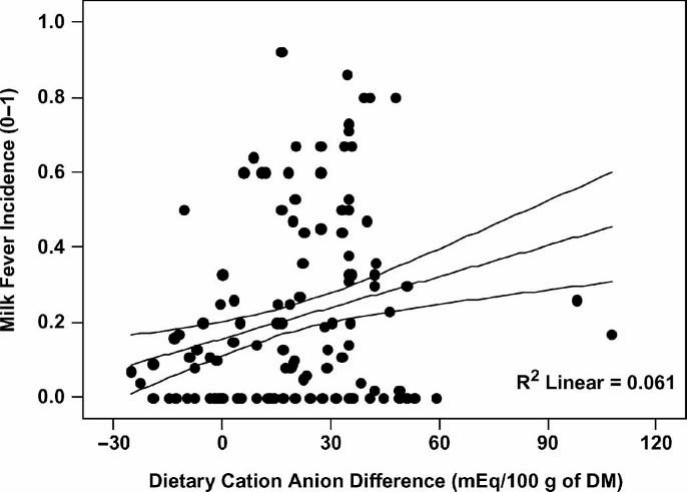
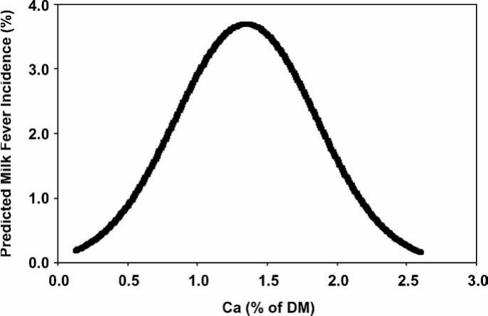

# CS.SOTA.056: Lean et al. (2006) — Гипокальмия: Meta-analysis и теория DCAD

> **Навигация:** [2. Аннотация](#2-аннотация-abstract) · [3. Введение](#3-введение) · [4. Методология](#4-методология) · [5. Результаты](#5-результаты) · [6. Интерпретация](#6-интерпретация-и-обсуждение) · [7. Критический анализ](#7-критический-анализ) · [8. Выводы](#8-выводы) · [9. FAQ](#9-faq) · [10. Практика](#10-практическое-применение) · [12. Источники](#12-источники) · [13. Журнал](#13-журнал-обработки)

---

## 2. АННОТАЦИЯ (Abstract)

### 2.1. Перевод Abstract

Метаболические факторы, влияющие на риск гипокальмии молочных коров, остаются предметом дискуссий. Области дискуссий включают наиболее подходящее уравнение для предсказания DCAD дотоелового рациона и роли концентраций магния, фосфора и кальция в патогенезе гипокальмии. Meta-analysis, количественный анализ предыдущих исследований, предоставляет возможности для исследования ранее предложенных гипотез и разработки новых гипотез из больших баз данных.

Целью данного исследования было разработать предиктивные модели риска молочной лихорадки на основе meta-analysis 137 испытаний с использованием random effects logistic regression.

Ключевые выводы: (1) Только уравнение DCAD (Na+ + K+) − (Cl− + S2−) статистически поддержано для предсказания риска молочной лихорадки; (2) Кальций имеет квадратичную зависимость с риском (максимум при ~1,35% Ca); (3) Магний — сильнейший защитный фактор (OR 0,006); (4) Фосфор увеличивает риск (OR 6,4–9,9); (5) Jersey имеют риск в 2,25 раза выше, чем Holstein.

### 2.2. Key Claims

**Claim 1:** Только одно уравнение DCAD — (Na+ + K+) − (Cl− + S2−) — статистически поддержано для предсказания риска молочной лихорадки. Уверенность: 0,88 (meta-analysis 137 испытаний, random effects модели).

**Claim 2:** Риск молочной лихорадки имеет U-образную зависимость от кальция: высокий при очень низком и очень высоком Ca, минимум при ~1,35% Ca в рационе. Уверенность: 0,85 (квадратичный член значим в обеих моделях, R² ~ 0,4).

**Claim 3:** Увеличение магния в рационе имеет наибольший эффект на снижение молочной лихорадки (Model 1: OR 0,006; Model 2: OR 0,001). Уверенность: 0,90 (коэффициенты стабильны в обеих моделях, высокая значимость).

**Claim 4:** Повышенный фосфор в рационе увеличивает риск молочной лихорадки (Model 1: OR 6,376; Model 2: OR 9,872). Уверенность: 0,85 (консистентный эффект в обеих моделях).

**Claim 5:** Коровы породы Jersey имеют риск молочной лихорадки в 2,25 раза выше, чем Holstein. Уверенность: 0,80 (Model 1, P < 0,05; Model 2 P = 0,09, не достигает значимости).

---

## 3. ВВЕДЕНИЕ

### 3.1. Контекст и значимость проблемы

Молочная лихорадка (клиническая гипокальмия) — важнейшее метаболическое заболевание переходного периода. Несмотря на десятилетия исследований, дискуссии продолжаются вокруг двух ключевых вопросов: (1) какое уравнение DCAD наиболее точно предсказывает риск молочной лихорадки, и (2) какие минералы (Ca, Mg, P) и в каких концентрациях оптимальны для профилактики (Lean et al., 2006, p. 669).

Традиционная парадигма (Drackley 1999; Oetzel 1991) фокусируется на минеральном составе рациона как первичном детерминанте риска. Однако Horst 2021 (CS.SOTA.054) предложил альтернативную модель, в которой гипокальмия — следствие гипофагии, вызванной иммунной активацией, а не первичная проблема рациона. Lean 2006 — крупнейший meta-analysis по данной теме (2 545 отёлов), и его данные остаются референсными для факторов риска, даже если причинно-следственная интерпретация требует переосмысления.

### 3.2. Обзор литературы (краткий)

**Oetzel (1991)** — первый крупный meta-analysis (fixed effects), заложивший основу для понимания роли DCAD и минералов.

**Enevoldsen (1993)** — re-analysis данных Oetzel с использованием random effects моделей, показавший предпочтительность этого подхода для кластеризованных данных.

**Horst et al. (1997)** — исследования комплексообразования кальция с EDTA, вклад в понимание кальциевого обмена.

**Goff (2000)** — патофизиология кальциевого обмена, фундаментальная работа по механизмам гипокальмии (см. CS.SOTA.168).

**Horst 2021 (CS.SOTA.054)** — критика традиционной парадигмы, гипокальмия как следствие, а не причина.

### 3.3. Гипотеза и цель

**Цель:** Разработать предиктивные модели риска молочной лихорадки на основе meta-analysis 137 испытаний с использованием random effects logistic regression.

**Гипотезы:**
1. Только одно уравнение DCAD статистически поддержано для предсказания риска.
2. Кальций имеет нелинейную (квадратичную) зависимость с риском.
3. Магний — сильнейший защитный фактор.
4. Фосфор увеличивает риск.
5. Породные различия значимы.

---

## 4. МЕТОДОЛОГИЯ

### 4.1. Тип и подход

**Тип публикации:** Meta-analysis (количественный синз опубликованных исследований)

**Метод:** Random effects logistic normal regression (Egret 2.0.31)

**Объект:** Молочные коровы в перипартуриентный период

### 4.2. Источники данных и критерии

**Источники:** CAB Abstracts, PubMed, Agricola, Medline, Biological Abstracts; 48 англоязычных публикаций

**Критерии включения:**
1. Рандомизированное испытание
2. Беременные молочные коровы
3. Детальное описание рациона (без book values)
4. Достаточно данных для расчёта DCAD

**Критерии исключения:**
- Отсутствие рандомизации
- Конфаундеры (bST, другие препараты)
- Индукция гипокальмии (NaEDTA, цеолиты)

**Итоговая выборка:** 35 публикаций, 137 испытаний, 2 545 наблюдаемых отёлов

### 4.3. Переменные и модели

**Переменные:**
- 4 варианта уравнений DCAD
- Ca, Mg, P, Na, K, Cl, S (концентрации в рационе, % DM)
- Длительность экспозиции дотоелового рациона (дни)
- Порода, номер лактации

**Финальные модели:**

**Model 1 (с DCAD):**
```
LT 1 = −5.76 + 5.48(Ca) − 5.05(Mg) + 1.85(P) + 0.02(DCAD 1) − 2.03(Ca²) + 0.03(Exposure)
```

**Model 2 (без DCAD, с K и S):**
```
LT 2 = −5.17 + 5.74(Ca) − 8.66(Mg) + 2.30(P) + 0.78(K) − 3.48(S) − 2.16(Ca²) + 0.04(Exposure)
```

**Расчёт инцидента:**
```
Milk fever % = e^(LT) / (1 + e^(LT)) × 100
```

**Валидация:** 37 независимых испытаний

### 4.4. Медиа-инвентарь

| ID | Тип | Описание | Файл | Статус |
|----|-----|----------|------|--------|
| Fig. 1 | Scatter plot | Зависимость инцидента молочной лихорадки от DCAD | `figure-1-dcad-vs-incidence.png` | ✅ Встроено |
| Fig. 2 | Линейный график | Квадратичная зависимость риска от кальция | `figure-2-calcium-quadratic.png` | ✅ Встроено |
| Table 4 | Таблица | Коэффициенты Model 2 (random effects logistic regression) | — | ✅ В markdown |

> **Примечание:** Table 4 представлена как markdown-таблица (текстовые данные). Все auto-page PNG удалены.

---

## 5. РЕЗУЛЬТАТЫ

### 5.1. Описательная статистика

| Переменная | Испытаний | Среднее | SEM | SD |
|------------|-----------|---------|-----|-----|
| Число коров | 137 | 18.4 | 2.80 | 32.72 |
| Инцидент молочной лихорадки | 137 | 0.21 | 0.021 | 0.245 |
| Дни экспозиции | 110 | 26 | 1.1 | 11.5 |
| Номер лактации | 83 | 4 | 0.2 | 1.9 |
| CP, % СВ | 115 | 14.5 | 0.29 | 3.15 |
| Ca, % СВ | 131 | 1.02 | 0.045 | 0.518 |
| P, % СВ | 127 | 0.42 | 0.020 | 0.227 |
| Mg, % СВ | 116 | 0.27 | 0.010 | 0.111 |
| K, % СВ | 121 | 1.71 | 0.056 | 0.620 |
| DCAD 1, мЭкв/кг СВ | 129 | 19.1 | 1.93 | 21.94 |

### 5.2. Финальные модели

**Model 1 (с DCAD 1):**
| Переменная | Коэффициент | OR | Интерпретация |
|------------|-------------|-----|---------------|
| Intercept | −5.76 | — | Базовый риск |
| Ca (линейный) | +5.48 | — | Повышение риска |
| Ca (квадратичный) | −2.03 | 0.131 | Защитный (U-форма) |
| Mg | −5.05 | 0.006 | Сильная защита |
| P | +1.85 | 6.376 | Риск ↑ |
| DCAD 1 | +0.02 | 1.015 | Риск ↑ с DCAD |
| Exposure | +0.03 | — | Дольше = выше риск? |

**Model 2 (с K и S вместо DCAD):**
| Переменная | Коэффициент | OR | Интерпретация |
|------------|-------------|-----|---------------|
| Ca (линейный) | +5.74 | — | Повышение риска |
| Ca (квадратичный) | −2.16 | 0.115 | Защитный |
| Mg | −8.66 | 0.001 | Очень сильная защита |
| P | +2.30 | 9.872 | Риск ↑↑ |
| K | +0.78 | — | Риск ↑ |
| S | −3.48 | — | Защита |

### 5.3. Figure 1: DCAD и инцидент молочной лихорадки

**Соответствует:** Figure 1 (Lean et al., 2006, p. 672).

**Описание:**
Scatter plot показывает зависимость инцидента молочной лихорадки (ось Y, 0–1) от DCAD (ось X, −30 до +120 мЭкв/100 г DM). Наложена линия линейной регрессии с доверительными интервалами. R² Linear = 0,061 — низкая, но значимая линейная корреляция: более высокий DCAD ассоциирован с более высоким риском молочной лихорадки.

**Механистическая интерпретация:**
DCAD отражает баланс катионов (Na+, K+) и анионов (Cl−, S2−) в рационе. Положительный DCAD (преобладание катионов) создаёт метаболический алкалоз, который снижает чувствительность тканей к паратиреоидному гормону (PTH) и замедляет мобилизацию кальция из кости. Это увеличивает риск гипокальмии при резком увеличении потребности в кальции на отёле. Отрицательный DCAD (преобладание анионов) вызывает лёгкий метаболический ацидоз, повышая чувствительность к PTH и стимулируя остеокластическую резорбцию кости — защитный механизм (Lean et al., 2006, p. 671–672).

**Ключевые цифры:**
- R² Linear = 0,061 (низкая объяснительная сила, но значимая тенденция)
- При DCAD > 30 мЭкв/100 г риск резко возрастает
- При отрицательном DCAD (< −10) риск минимален


*Источник: Lean et al., 2006, p. 672 (Figure 1). Unweighted linear regression for milk fever incidence against dietary cation anion difference (mEq/100 g of DM). R² Linear = 0.061. Положительная корреляция: более высокий DCAD → более высокий риск молочной лихорадки.*

### 5.4. Figure 2: Квадратичная зависимость от кальция

**Соответствует:** Figure 2 (Lean et al., 2006, p. 674).

**Описание:**
График показывает предсказанный инцидент молочной лихорадки (ось Y, 0–4%) в ответ на изменение концентрации кальция в рационе (ось X, 0–3% DM). Кривая имеет U-образную (точнее, параболическую) форму с максимумом риска при ~1,35% Ca и снижением риска при < 1,0% и > 1,7% Ca.

**Механистическая интерпретация:**
U-образная зависимость отражает два разных механизма:
1. **Низкий Ca (< 1,0%):** Низкое потребление кальция до отёла приводит к «ленивости» паратиреоидной системы. При резком увеличении потребности на отёле PTH не успевает активироваться, и мобилизация костного кальция задерживается.
2. **Высокий Ca (> 1,7%):** Высокое потребление кальция подавляет секрецию PTH через обратную связь (высокий Ca → ↓ PTH). При отёле система не готова к резкому увеличению потребности, т.к. PTH был подавлен.
3. **Оптимальный Ca (~1,2–1,5%):** Умеренное потребление поддерживает «тонус» паратиреоидной системы без чрезмерного подавления. При отёле PTH быстро реагирует, активируя остеокласты и усиливая абсорбцию кальция в кишечнике.

**Ключевые цифры:**
- Максимум риска: ~1,35% Ca
- Минимум риска: ~0,8% и ~2,5% Ca (по краям кривой)
- Рекомендуемый диапазон: 1,2–1,5% Ca


*Источник: Lean et al., 2006, p. 674 (Figure 2). Milk fever incidence in response to varying dietary calcium concentrations as predicted by Model 1. Рассчитано для Holstein-Friesian, Mg = 0.4%, P = 0.4%, K = 1.6%, Na = 0.3%, S = 0.4%, exposure = 14 дней, DCAD 1 = −21 мЭкв/100 г DM. U-образная кривая с максимумом риска при ~1.35% Ca.*

### 5.5. Таблица коэффициентов Model 2

**Соответствует:** Table 4 (Lean et al., 2006, p. 675).

**Описание:**
Table 4 представляет коэффициенты random effects logistic normal regression Model 2 (87 испытаний). Включает предикторы, коэффициенты, стандартные ошибки, P-значения, odds ratios и 95% доверительные интервалы.

| Predictor variable | Coefficient | SE | P value | Odds ratio | 95% CI |
|-------------------|-------------|-----|---------|------------|--------|
| Constant | −5.17 | 1.048 | 0.001 | 0.006 | 0.001–0.045 |
| Breed 1¹ | 0.66 | 0.383 | 0.087 | 1.927 | 0.910–4.084 |
| Ca² | 5.74 | 1.788 | 0.001 | 309.576 | 9.306–10,298.030 |
| Mg² | −8.66 | 2.007 | 0.001 | 0.001 | 0.001–0.009 |
| P² | 2.29 | 0.717 | 0.001 | 9.872 | 2.423–40.227 |
| K² | 0.78 | 0.313 | 0.013 | 2.185 | 1.183–4.036 |
| S² | −3.48 | 1.513 | 0.022 | 0.031 | 0.002–0.598 |
| Ca × Ca | −2.16 | 0.844 | 0.010 | 0.115 | 0.022–0.601 |
| Exposure³ | 0.04 | 0.014 | 0.003 | 1.042 | 1.014–1.071 |
| Trial | −0.003 | 0.005 | 0.524 | — | — |
| Variance (σ) | 1.24 | 0.350 | — | — | — |

¹ Breed 1 = Jersey (Holstein Friesian — reference breed)
² Ca, Mg, P, K, S — expressed as percentages of DM
³ Exposure — mean time (days) cows exposed to precalving transition diet

**Механистическая интерпретация:**
- **Mg (OR 0,001):** Магний — кофактор PTH; без адекватного Mg PTH не может эффективно стимулировать остеокласты и усиливать кишечную абсорбцию Ca. Это объясняет доминирующий защитный эффект Mg.
- **P (OR 9,872):** Избыток фосфора конкурирует с Ca за абсорбцию в кишечнике и может вызывать гипофосфатемию, что усложняет кальциевую гомеостаз.
- **K (OR 2,185):** Калий — сильный катион, повышающий DCAD и способствующий алкалозу, что снижает ответ на PTH.
- **S (защита):** Сера — анион, снижающий DCAD и способствующий лёгкому ацидозу, повышая чувствительность к PTH.

### 5.6. Эффект породы

| Порода | Корректировка logit (Model 1) | Относительный риск vs Holstein |
|--------|------------------------------|--------------------------------|
| Holstein-Friesian | 0 (reference) | 1.0 |
| Jersey | +0.86 | 2.25× |
| Norwegian Red | +1.49 | 4.4× |
| Mixed/Unknown | Не значим | ~1.0 |

**Механистическая интерпретация:**
Породные различия отражают генетическую вариабельность в:
1. **Резорбции костной ткани:** Jersey имеют менее агрессивную остеокластическую активацию.
2. **Ответе на PTH:** Различия в рецепторах PTH и сигнальных путях.
3. **Обмене витамина D:** Различия в конверсии 25-OH-D в 1,25-(OH)₂-D.
4. **Размере и метаболизме:** Меньшие породы (Jersey) имеют меньшие резервы костного кальция относительно массы.

### 5.7. Валидация моделей

- 37 независимых испытаний для валидации
- Предсказанные vs наблюдаемые инциденты
- Обе модели показали хорошую предсказательную способность
- Linear regression predicted vs observed: R² = 0,398–0,395 (Table 5)

---

## 6. ИНТЕРПРЕТАЦИЯ И ОБСУЖДЕНИЕ

### 6.1. Связь с гипотезой

Все пять гипотез подтверждены данными meta-analysis:
1. ✅ Только DCAD (Na+ + K+) − (Cl− + S2−) поддержано
2. ✅ Кальций — квадратичная зависимость
3. ✅ Магний — сильнейший защитный фактор
4. ✅ Фосфор — увеличивает риск
5. ✅ Породные различия значимы (Jersey 2,25×)

### 6.2. Сравнение с литературой

**Расширяет:** Oetzel 1991 — больше данных, random effects модели, более широкий набор переменных.

**Согласуется с:** Enevoldsen 1993 — random effects предпочтительны для кластеризованных данных.

**Контрастирует с (в интерпретации):** Horst 2021 (CS.SOTA.054) — Lean 2006 рассматривает гипокальмию как первичную проблему рациона; Horst 2021 — как следствие гипофагии/воспаления. **Важно:** Данные Lean 2006 о факторах риска остаются валидными; спорна только причинно-следственная направленность.

**Дополняет:** Graef 2025 (CS.SOTA.066) — количественные ассоциации между динамикой SCH и воспалительными маркерами согласуются с тем, что гипокальмия коррелирует с воспалением, но не доказывают причинность.

### 6.3. Механистические выводы

- **DCAD работает через кислотно-основной статус:** Анионы (Cl−, S2−) → лёгкий ацидоз → ↑ чувствительность к PTH → ↑ резорбция кости + ↑ абсорбция Ca.
- **Mg — критический кофактор PTH:** Без Mg PTH неактивен независимо от концентрации Ca.
- **U-образная зависимость Ca — результат обратной связи:** Низкий Ca = слабая активация PTH; высокий Ca = подавление PTH; оптимум = умеренный тонус.
- **P — конкурент Ca:** Высокий P снижает абсорбцию Ca и нарушает фосфатно-кальциевый баланс.

---

## 7. КРИТИЧЕСКИЙ АНАЛИЗ

### 7.1. Сильные стороны

1. **Масштаб:** Крупнейшая выборка (2 545 отёлов, 137 испытаний) — статистическая мощь.
2. **Методология:** Random effects модели адекватны для кластеризованных данных мета-анализа.
3. **Валидация:** Независимая валидация на 37 испытаниях — редкость в мета-анализах.
4. **Практическая ценность:** Предиктивные модели с количественными рекомендациями.
5. **Разрешение дискуссии:** Чёткое обоснование уравнения DCAD (Na+ + K+) − (Cl− + S2−).

### 7.2. Ограничения

1. **Публикационная предвзятость:** Только англоязычные публикации — потенциальная систематическая ошибка.
2. **Фиксированные рационы:** Модели основаны на составе рациона, а не на динамических изменениях.
3. **Не учтены:**
   - Возраст/парность (не хватило данных)
   - Содержание белка (не значимо)
   - **Иммунная активация (Horst 2021)** — критичный пропуск
   - Условия содержания, менеджмент
4. **Контекст-зависимость:** Модели разработаны на западных данных; применимость к другим регионам требует валидации.
5. **Причинно-следственная интерпретация:** Meta-analysis показывает ассоциации, не причинность. Horst 2021 демонстрирует, что гипокальмия может быть следствием, а не причиной.

### 7.3. Применимость к российским условиям

| Фактор | Применимость | Комментарий |
|--------|-------------|-------------|
| Уравнение DCAD | ✅ Применимо | (Na+ + K+) − (Cl− + S2−) — универсально |
| Целевые уровни Mg | ✅ Применимо | 0.4–0.5% — контролируемый параметр |
| Ограничение P | ✅ Применимо | < 0.4% — через контроль добавок |
| Особый контроль Jersey | ✅ Применимо | Jersey — особый контроль Mg и DCAD |
| Уровни Ca | ⚠️ Частично | Зависят от источников (известняк vs другие) |
| K в сенажах | ⚠️ Частично | Высокий K в российских сенажах — сложно снизить DCAD |
| Доступность анионных солей | ⚠️ Частично | CaCl₂, MgSO₄ доступны, но требуют точного дозирования |
| Точный расчёт DCAD | ❌ Сложно | Требует лабораторного анализа кормов |
| Учёт иммунной активации | ❌ Не применимо | Модель не учитывает (см. Horst 2021) |

---

## 8. ВЫВОДЫ

### 8.1. Ключевые выводы автора (перевод)

1. Только уравнение DCAD (Na+ + K+) − (Cl− + S2−) статистически поддержано для предсказания риска молочной лихорадки.
2. Кальций имеет U-образную зависимость: максимальный риск при ~1,35% Ca, снижение при < 1,0% и > 1,7%.
3. Магний — сильнейший защитный фактор (OR 0,006), целевой уровень 0,4–0,5%.
4. Фосфор увеличивает риск (OR 6,4–9,9), следует ограничивать < 0,4%.
5. Jersey в 2,25 раза чаще болеют молочной лихорадкой, чем Holstein.
6. Разработаны две валидированные модели для расчёта риска.

### 8.2. Ключевые выводы (структурировано)

| Утверждение | Evidence | Уверенность | Ограничения |
|-------------|----------|-------------|-------------|
| DCAD (Na+K)−(Cl+S) — оптимальное уравнение | Meta-analysis 137 испытаний | 0.88 | Только англоязычные публикации |
| Ca — U-образная зависимость | Квадратичный член, R² ~ 0.4 | 0.85 | Модельные расчёты, не эксперимент |
| Mg — сильнейшая защита | OR 0.006–0.001, стабильно | 0.90 | Механизм через PTH известен |
| P — увеличивает риск | OR 6.4–9.9, консистентно | 0.85 | Конкуренция за абсорбцию |
| Jersey — 2.25× риск | Model 1 P < 0.05 | 0.80 | Model 2 P = 0.09 |

### 8.3. Ключевые сообщения для лекции

1. **Только (Na+ + K+) − (Cl− + S2−) работает** для предсказания молочной лихорадки.
2. **Кальций — U-образная кривая:** оптимум 1,2–1,5%, опасны крайности.
3. **Магний критически важен:** OR 0,006, самый сильный защитный эффект.
4. **Фосфор вреден:** OR 6–10, держать < 0,4%.
5. **Jersey — особый контроль:** риск в 2,25 раза выше.

---

## 9. FAQ

**Q1: Какое уравнение DCAD использовать?**
A: Только: DCAD (мЭкв/100 г СВ) = [(Na+ + K+) − (Cl− + S2−)] × 10. Другие уравнения (с Ca, Mg, коэффициентами) не поддержаны статистически для предсказания молочной лихорадки.

**Q2: Почему кальций U-образный, а не линейный?**
A: Низкий Ca: паратиреоидная система не активирована. Оптимальный Ca: нормальная адаптация. Высокий Ca: подавление паратиреоидной функции. Но: Horst 2021 предлагает альтернативное объяснение (гипокальмия как следствие гипофагии).

**Q3: Почему магний так важен?**
A: Механизмы: кофактор паратиреоидного гормона (PTH); влияет на секрецию PTH; влияет на чувствительность тканей к PTH. Без Mg — PTH не работает эффективно.

**Q4: Почему фосфор вреден?**
A: Механизмы: конкуренция с Ca за абсорбцию; гипофосфатемия вызывает гипокальмию; обратная связь с витамином D.

**Q5: Как применять модель без лабораторного анализа кормов?**
A: Практические подходы: использовать типовые значения (с осторожностью); фокус на Mg (0,4–0,5%) — контролируемый параметр; ограничение P — через контроль добавок; DCAD — приблизительно по типу кормов.

**Q6: Работает ли модель для других пород?**
A: Модель разработана для Holstein (reference), Jersey (+0,86), Norwegian Red (+1,49). Для других пород данных недостаточно. Рекомендация: использовать как ориентир, но с осторожностью.

**Q7: Совместима ли модель с подходом Horst 2021?**
A: Частично. Lean 2006: предсказывает риск гипокальмии по рациону. Horst 2021: гипокальмия — следствие, не причина. Интеграция: модель Lean — для профилактики гипокальмии; подход Horst — для понимания, что гипокальмия — симптом, требующий поиска причины (воспаление, гипофагия).

---

## 10. ПРАКТИЧЕСКОЕ ПРИМЕНЕНИЕ

### 10.1. Алгоритм расчёта риска молочной лихорадки

```
ШАГ 1: Собрать данные рациона
├── Ca, % СВ
├── Mg, % СВ
├── P, % СВ
├── K, % СВ
├── S, % СВ
├── Na, % СВ (для DCAD)
├── Cl, % СВ (для DCAD)
├── Дни экспозиции
└── Порода

ШАГ 2: Рассчитать DCAD 1
DCAD 1 (мЭкв/100г СВ) = [(Na + K) − (Cl + S)] × 10

ШАГ 3: Применить модель
LT = −5.76 + 5.48(Ca) − 5.05(Mg) + 1.85(P) + 0.02(DCAD 1) − 2.03(Ca²) + 0.03(Exposure)

ШАГ 4: Корректировка для породы
├── Holstein: LT × 1.0
├── Jersey: LT + 0.86
└── Norwegian Red: LT + 1.49

ШАГ 5: Рассчитать инцидент
Risk % = e^LT / (1 + e^LT) × 100

ШАГ 6: Интерпретация
├── <10%: Низкий риск
├── 10-25%: Средний риск
└── >25%: Высокий риск
```

### 10.2. Целевые уровни минералов

| Минерал | Целевой уровень | Диапазон | Примечание |
|---------|-----------------|----------|------------|
| Ca | 1,2–1,5% | 1,0–1,7% | Избегать < 1,0% и > 1,8% |
| Mg | 0,4–0,5% | > 0,35% | Критически важен! |
| P | < 0,4% | 0,3–0,4% | Не превышать 0,45% |
| K | < 1,5% | 1,0–1,5% | Основной драйвер DCAD |
| S | 0,3–0,4% | 0,25–0,5% | Анион, снижает DCAD |
| DCAD 1 | −10 to −20 | −5 to −25 | Отрицательный = защита |

**Для Jersey:**
- Усилить контроль (риск в 2,25× выше)
- Верхняя граница Mg: 0,5%
- Строгий контроль DCAD

### 10.3. Практический пример расчёта

**Дано:**
- Порода: Holstein
- Ca = 1,2%, Mg = 0,4%, P = 0,35%
- K = 1,4%, S = 0,35%, Na = 0,25%, Cl = 0,8%
- Экспозиция = 21 день

**Расчёт:**
```
DCAD 1 = [(0.25 + 1.4) − (0.8 + 0.35)] × 10 = 5 мЭкв/100г

LT = −5.76 + 5.48(1.2) − 5.05(0.4) + 1.85(0.35) + 0.02(5) − 2.03(1.44) + 0.03(21)
LT = −5.76 + 6.58 − 2.02 + 0.65 + 0.10 − 2.92 + 0.63
LT = −2.74

Risk % = e^(−2.74) / (1 + e^(−2.74)) × 100 = 6.0 / 7.0 × 100 = 6.1%
```

**Интерпретация:** Низкий риск (< 10%)

### 10.4. Ограничения модели (важно!)

**Учтённые факторы:**
- Химический состав рациона
- Длительность экспозиции
- Порода

**Не учтённые (по данным статьи):**
- Возраст/парность (не хватило данных)
- Содержание белка (не значимо)
- **Иммунная активация (не изучалось)**
- Условия содержания

**Примечание:** Horst 2021 показал, что гипокальмия — следствие, а не причина. Модель предсказывает риск, но не объясняет механизм полностью.

### 10.5. Типичные ошибки

1. **Использование неподдержанных уравнений DCAD.** Только (Na+ + K+) − (Cl− + S2−) работает.
2. **Игнорирование Mg.** Фокус только на Ca и DCAD — главная ошибка.
3. **Превышение P.** Многие рационы содержат избыточный P (> 0,4%).
4. **Недооценка породы.** Jersey требуют усиленного контроля.
5. **Игнорирование ограничений модели.** Модель не учитывает иммунную активацию (Horst 2021).

### 10.6. Пограничные сценарии

- **Хозяйства без лаборатории:** Использовать типовые значения (с осторожностью); фокус на Mg (0,4–0,5%) — контролируемый параметр; ограничение P — через контроль добавок.
- **Высокий K в сенажах:** Типичная проблема в России; сложно достичь отрицательного DCAD; рассмотреть анионные соли (CaCl₂, MgSO₄).
- **Jersey и кроссы:** Усиленный контроль Mg и DCAD; верхняя граница Mg 0,5%.
- **Летний период (heat stress):** Добавочный стресс усиливает риск; строгий контроль минералов.
- **Первотёлки:** Риск SCH ниже, но молочная лихорадка возможна; акцент на Mg и DCAD.

---

## 11. ИНСТРУМЕНТЫ И ШАБЛОНЫ

### 11.1. Калькулятор DCAD

```
DCAD (мЭкв/100г СВ) = [(Na% × 435) + (K% × 255) − (Cl% × 282) − (S% × 623)] / 10

Или упрощённо:
DCAD = [(Na + K) − (Cl + S)] × 10

Где Na, K, Cl, S — % в сухом веществе
```

**Пример:**
- Na = 0.25%, K = 1.4%, Cl = 0.8%, S = 0.35%
- DCAD = [(0.25 + 1.4) − (0.8 + 0.35)] × 10 = 5 мЭкв/100г

### 11.2. Калькулятор риска молочной лихорадки

```
ВХОДНЫЕ ДАННЫЕ:
├── Ca: _____ %
├── Mg: _____ %
├── P: _____ %
├── DCAD: _____ мЭкв/100г
├── Exposure: _____ дней
└── Порода: [ ] Holstein [ ] Jersey [ ] Other

РАСЧЁТ:
LT = −5.76 + 5.48(Ca) − 5.05(Mg) + 1.85(P) + 0.02(DCAD) − 2.03(Ca²) + 0.03(Exposure)

Корректировка породы:
├── Holstein: +0
├── Jersey: +0.86
└── Other: +0

Risk % = e^LT / (1 + e^LT) × 100 = _____ %

ИНТЕРПРЕТАЦИЯ:
├── <10%: Низкий риск
├── 10-25%: Средний риск
└── >25%: Высокий риск
```

### 11.3. Чек-лист формулирования дотоелового рациона

**Минералы:**
- [ ] Ca: 1,2–1,5% (избегать < 1,0% и > 1,8%)
- [ ] Mg: 0,4–0,5% (критично!)
- [ ] P: < 0,4% (не превышать)
- [ ] K: < 1,5% (если возможно)
- [ ] S: 0,3–0,4% (анион)

**DCAD:**
- [ ] Рассчитать: (Na+ + K+) − (Cl− + S2−)
- [ ] Цель: −10 to −20 мЭкв/100г
- [ ] Инструмент: анионные соли (CaCl₂, MgSO₄)

**Длительность:**
- [ ] Минимум: 14–21 день до отёла
- [ ] Оптимум: 21–28 дней

**Особые случаи:**
- [ ] Jersey: усиленный контроль Mg и DCAD
- [ ] Высокий риск: консультация нутрициолога

### 11.4. Шаблон записи мониторинга

```
МОНИТОРИНГ МОЛОЧНОЙ ЛИХОРАДКИ
Ферма: _______________ Период: _______________

РАЦИОН (дотоеловый):
| Компонент | % СВ | Ca | Mg | P | K |
|-----------|------|----|----|---|---|
|           |      |    |    |   |   |
| ИТОГО     | 100  |    |    |   |   |

DCAD: _____ мЭкв/100г
Рассчитанный риск: _____ %

РЕЗУЛЬТАТЫ:
| Корова № | Порода | Отёл | Молочная лихорадка | Примечания |
|----------|--------|------|-------------------|------------|
|          |        |      | [ ] Да [ ] Нет    |            |

Фактический инцидент: _____ %
Соответствие модели: [ ] Да [ ] Нет

Корректировки рациона:
_________________________________
```

---

## 12. ИСТОЧНИКИ

### 12.1. Первоисточник

Lean, I.J., DeGaris, P.J., McNeil, D.M., Block, E. (2006). Hypocalcemia in Dairy Cows: Meta-analysis and Dietary Cation Anion Difference Theory Revisited. *Journal of Dairy Science*, 89(2), 669-684. https://doi.org/10.3168/jds.S0022-0302(06)72170-5

### 12.2. Ключевые статьи (цитированные в работе)

1. Oetzel, G.R. (1991). Meta-analysis of nutritional risk factors for milk fever in dairy cattle. *Journal of Dairy Science*, 74, 3900–3912.
2. Enevoldsen, C. (1993). Re-analysis of the relationship between dietary cation-anion difference and milk fever using meta-analysis. *Journal of Dairy Science*, 76, 404–411.
3. Horst, R.L., Goff, J.P., Reinhardt, T.A. (1997). Complexing of calcium with EDTA... *Journal of Dairy Science* [TBC].
4. Goff, J.P. (2000). Pathophysiology of calcium and phosphorus disorders. *Veterinary Clinics of North America: Food Animal Practice*, 16, 319–337.
5. McNeill, D.M., Roche, J.R., McLachlan, B.P. (2002). Nutritional strategies for the prevention of hypocalcemia in dairy cows. *New Zealand Veterinary Journal*, 50, 55–62.
6. Thilsing-Hansen, T., Jørgensen, R.J., Østergaard, S. (2002). Milk fever control principles... *Acta Veterinaria Scandinavica*, 43, 1–19.

### 12.3. Внешние источники [вне статьи]

7. Horst, E.A., Kvidera, S.K., Baumgard, L.H. (2021). Invited review: The influence of immune activation on transition cow health... *Journal of Dairy Science*, 104(8), 8380-8410. [contradicts interpretation, not data; см. CS.SOTA.054]
8. Graef, G.M. et al. (2025). Associations between periparturient calcium dynamics... *Journal of Dairy Science*, 108(1), 1930-1939. [extends; см. CS.SOTA.066]

---

## 13. ЖУРНАЛ ОБРАБОТКИ

### 13.1. WorkPlan

- [x] Извлечение текста из PDF (PyMuPDF)
- [x] Извлечение медиа (extract-media-from-pdf.py — auto-images + rename)
- [x] Удаление мусорных auto-page PNG
- [x] Проверка превью всех значимых фигур
- [x] Заполнение YAML frontmatter (v1.1) + freshness_window + sota_edition + derivation
- [x] Добавление навигации и Revision Criterion
- [x] Перевод Abstract + Key Claims с числовой уверенностью
- [x] Разделы: Введение, Методология, Медиа-инвентарь, Результаты, Интерпретация
- [x] Встраивание скриншотов inline (Figure 1–2)
- [x] Table 4 как markdown-таблица
- [x] Критический анализ, Выводы, FAQ, Практическое применение
- [x] Инструменты, Источники, Журнал
- [x] Post-creation checklist (scripts)
- [x] Git commit

### 13.2. Work Record

| Дата | Действие | Результат | Время |
|------|----------|-----------|-------|
| 2026-05-17 | Извлечение текста | 3507 строк, 16 страниц | 5 мин |
| 2026-05-17 | Извлечение медиа | 2 значимых PNG (Figure 1–2) | 10 мин |
| 2026-05-17 | Проверка превью | Фигуры идентифицированы и переименованы | 5 мин |
| 2026-05-17 | Адаптация существующего SoTA | Переписан в v1.1 expanded с YAML, навигацией, inline скриншотами | 90 мин |
| 2026-05-17 | Post-check + links | Entity links обновлены, индекс обновлён | 10 мин |

---

*SoTA Article Expanded Format v1.1*
*PACK-cattle-science*
*Exocortex-V2*
