# CS.SOTA.066: Graef et al. (2025) — Динамика кальция и воспалительные маркеры в переходный период

> **Навигация:** [2. Аннотация](#2-аннотация-abstract) · [3. Введение](#3-введение) · [4. Методология](#4-методология) · [5. Результаты](#5-результаты) · [6. Интерпретация](#6-интерпретация-и-обсуждение) · [7. Критический анализ](#7-критический-анализ) · [8. Выводы](#8-выводы) · [9. FAQ](#9-faq) · [10. Практика](#10-практическое-применение) · [12. Источники](#12-источники) · [13. Журнал](#13-журнал-обработки)

---

## 2. АННОТАЦИЯ (Abstract)

### 2.1. Перевод Abstract

Недавние исследования показали, что правильная классификация коров на основе их перипартуриентного статуса имеет важные импликации для рисков здоровья, продуктивности и репродукции в послеродовом периоде. Однако динамика кальция крови и воспаление изучены значительно меньше. Целью данного исследования было определить связь между динамикой субклинической гипокальцемии (SCH) и концентрациями сывороточного амилоид-А (SAA), гаптоглобина (Hp), фактора некроза опухоли-α (TNFα), интерферона-γ (IFNγ) и интерлейкина-10 (IL-10), ППК и молочной продуктивностью в первые 9 недель лактации. Данные 96 мультипарных коров Хольштейн были ретроспективно классифицированы на 4 группы на основе концентрации общего кальция (tCa) в 1 и 5 DIM: нормокальциемия (NC; tCa > 1,95 ммоль/л в 1 DIM и > 2,32 ммоль/л в 5 DIM, n = 53); транзиторная SCH (tSCH; tCa ≤ 1,95 в 1 DIM и > 2,32 в 5 DIM, n = 15); задержанная SCH (dSCH; tCa > 1,95 в 1 DIM и ≤ 2,32 в 5 DIM, n = 15); и персистирующая SCH (pSCH; tCa ≤ 1,95 в 1 DIM и ≤ 2,32 в 5 DIM, n = 13). Дородовые концентрации IL-10 тенденциально выше у tSCH по сравнению с NC, dSCH и pSCH. Послеродовые концентрации Hp, SAA и TNFα различались между группами. SAA и Hp были наивысшими в группе pSCH в день 3, а TNFα — наивысшим у коров dSCH независимо от времени. Результаты указывают, что различная динамика SCH ассоциирована с различными паттернами воспалительных маркеров, и повышенные концентрации провоспалительных биомаркеров сопровождают некоторые категории гипокальцемии в ранний период лактации.

### 2.2. Key Claims

**Claim 1:** Коровы с персистирующей SCH (pSCH) имеют наивысшие послеродовые концентрации Hp (0,96 г/мл, 95% ДИ = 0,40–2,29) и SAA (101,14 ммоль/л, 95% ДИ = 42,47–240,86), значительно превышающие другие группы. Уверенность: 0,85 (n = 96, взаимодействие группа × время: Hp P = 0,03; SAA P < 0,001).

**Claim 2:** Коровы с задержанной SCH (dSCH) демонстрируют повышенный TNFα независимо от времени измерения, хотя различия между группами по TNFα, IFNγ и IL-10 не достигают статистической значимости (P = 0,42; P = 0,64; P = 0,66 соответственно). Уверенность: 0,58 (низкая статистическая мощность, n = 13–15 в подгруппах).

**Claim 3:** Коровы с транзиторной SCH (tSCH) имеют тенденцию к повышенному дородовому IL-10 (73,08 пг/мл, 95% ДИ = 25,48–209,64) по сравнению с NC, dSCH и pSCH (P = 0,12). Уверенность: 0,52 (тенденция, широкие ДИ).

**Claim 4:** ППК в первые 3 недели послеродово значительно ниже у pSCH (17,3 кг/сут) по сравнению с другими группами, но за 9 недель различий между группами не обнаружено (P = 0,54). Уверенность: 0,72 (n = 96, взаимодействие группа × время P < 0,001).

**Claim 5:** Молочная продуктивность (MY) за 9 недель: tSCH — наивысшая (47,3 кг/сут), pSCH — наинизшая (43,8 кг/сут), dSCH превосходит NC и pSCH (P < 0,001). Уверенность: 0,78 (n = 96, статистически значимые различия, но контрадикторные данные в литературе).

**Claim 6:** Порог tCa 2,32 ммоль/л в 5 DIM, выбранный на основе различий в молочной продуктивности, разделяет коров на группы с различным воспалительным профилем. Уверенность: 0,70 (эксплораторный анализ, циркулярное обоснование порога через продуктивность).

---

## 3. ВВЕДЕНИЕ

### 3.1. Контекст и значимость проблемы
n
Переход от поздней гестации к началу лактации — критическая точка адаптации к быстрым метаболическим изменениям. Этот период характеризуется значительным снижением ППК пренатально и постнатально, не удовлетворяющим энергетические и нутриентные потребности молочной продуктивности (Bauman & Currie, 1980). Одновременно происходит 2–3-кратный скачок потребности в кальции при отёле (Drackley et al., 2005; Goff et al., 2014).

Клиническая гипокальцемия относительно хорошо контролируется в системах содержания молочного скота (Reinhardt et al., 2011). Субклиническая гипокальцемия (SCH) более распространена и ассоциирована с повышенным риском других перипартуриентных расстройств, снижением послеродового ППК, ухудшением репродуктивных показателей и потерями молочной продуктивности (Neves et al., 2018; McArt & Neves, 2020; Seely & McArt, 2022).

Недавние исследования выделили 4 различные категории SCH на основе динамики tCa в 1, 2 и 4 DIM (McArt & Neves, 2020):
- **NC** (normocalcemia) — нормокальциемия
- **tSCH** (transient SCH) — транзиторная SCH (восстановление кальция к 4 DIM)
- **dSCH** (delayed SCH) — задержанная SCH (снижение кальция после 1 DIM)
- **pSCH** (persistent SCH) — персистирующая SCH (низкий кальций на протяжении 4 DIM)

Эти группы существенно различаются по риску заболеваний, продуктивности и репродукции (Neves et al., 2018; McArt & Neves, 2020).

### 3.2. Обзор литературы (краткий)

#### 3.2.1. Воспаление в переходный период

По завершении гестации и начале лактагенеза острое воспаление считается нормальным, если оно ограничено по длительности и тяжести (Bradford & Swartz, 2020). Воспалительные медиаторы, высвобождаемые из макрофагов и тканей, тесно вовлечены в быстрые метаболические изменения: повышенная мобилизация липидов, изменения эндокринной функции, окислительный стресс (Sordillo & Aitken, 2009; Trevisi et al., 2015). Однако неконтролируемое или неразрешающееся воспаление увеличивает риск перипартуриентных заболеваний, выбраковки и снижает продуктивность (Drackley, 1999; Bertoni et al., 2015; Bradford et al., 2015).

#### 3.2.2. Связь кальция и иммунного ответа

Быстрое снижение концентрации кальция в крови является консервированным ответом на активированный иммунный ответ (Collage et al., 2013). Повышенная внутриклеточная концентрация Ca — ключевая черта иммунного ответа, и несколько исследователей обнаружили ассоциации между тяжёлыми воспалительными реакциями и снижением концентрации кальция в крови послеродово (Kimura et al., 2006; Bertoni et al., 2008). Внутривенные LPS-челленджи индуцируют быстрое истощение циркулирующего Ca (Waldron et al., 2003; Horst et al., 2020; Chandler et al., 2022).

#### 3.2.3. Классификация SCH dynamics

McArt & Neves (2020) и Seely et al. (2021) установили, что динамика SCH (а не однократное измерение) определяет риски для здоровья и продуктивности. pSCH ассоциирована с наихудшими исходами, tSCH — с промежуточными, dSCH — с неоднозначными результатами.

### 3.3. Гипотеза и цель исследования

**Цель:** Оценить паттерны острофазовых белков (Hp, SAA) и цитокинов (TNFα, IFNγ, IL-10) пренатально и постнатально у коров, ретроспективно распределённых в 4 группы на основе tCa в 1 и 5 DIM.

**Гипотеза:** SAA, Hp, TNFα, IFNγ и IL-10 тесно ассоциированы с группой кальциевого статуса, причём наибольшее повышение провоспалительных маркеров наблюдается у коров с SCH послеродово, а противовоспалительного IL-10 — у нормокальцемичных и tSCH коров.

---

## 4. МЕТОДОЛОГИЯ

### 4.1. Дизайн эксперимента

**Тип исследования:** ретроспективное когортное исследование (retrospective cohort).

**Объект:** 96 мультипарных коров Хольштейн из предыдущего исследования (Graef et al., 2025).

**Период:** октябрь 2019 — октябрь 2020.

**Локация:** Cornell University Ruminant Center (Harford, NY). Индивидуальные стойла с привязью (tiestalls).

**Power analysis:** пост-хок расчёт мощности (ClinCalc) при риске ошибки I рода 5% — 92,4% мощность для обнаружения различий в дневном удое 3 кг/сут (± 1,2 кг/сут).

### 4.2. Животные и условия содержания

- **Порода:** Holstein.
- **n = 96**, мультипарные (паритет 2 и ≥ 3).
- **Распределение по паритету:** паритет 2 — 59 коров (61%), паритет ≥ 3 — 37 коров (39%).
- **Содержание:** индивидуальные стойла с привязью.
- **Кормление:** 1 раз в день (0700–0900 h для дойных, 0700–1100 h для сухостойных).
- **Доение:** 3×/сут (0600, 1400, 2200 h).
- **Мониторинг здоровья:** ежедневные физические осмотры до 10 DIM (температура, ЧДД, руминация, метрит).
- **Диагностика заболеваний:** клиническая гипокальцемия, метрит, задержка последа, мастит, аборта рубца, кетонурия (Ketostix, Bayer).
- **Исключение:** коровы, получавшие дополнительный Ca (орально, в/в), антибиотики или противовоспалительные препараты, исключены из анализа.

### 4.3. Классификация по кальциевому статусу

Классификация проводилась ретроспективно на основе tCa в 1 и 5 DIM (в отличие от предыдущих работ, использовавших 1 и 4 DIM):

| Группа | tCa 1 DIM | tCa 5 DIM | n | Интерпретация |
|--------|-----------|-----------|---|---------------|
| NC | > 1,95 ммоль/л | > 2,32 ммоль/л | 53 | Нормокальциемия |
| tSCH | ≤ 1,95 ммоль/л | > 2,32 ммоль/л | 15 | Транзиторная SCH (восстановление) |
| dSCH | > 1,95 ммоль/л | ≤ 2,32 ммоль/л | 15 | Задержанная SCH (снижение после отёла) |
| pSCH | ≤ 1,95 ммоль/л | ≤ 2,32 ммоль/л | 13 | Персистирующая SCH |

**Определение порога 2,32 ммоль/л для 5 DIM:**
Интерквартильный размах tCa в 5 DIM был разделён на 23 порога с интервалом 0,02 ммоль/л. Для каждого порога построены обобщённые линейные смешанные модели (MIXED) с фиксированными эффектами недели лактации, статуса Ca в 5 DIM и их взаимодействия. Выбран порог, при котором коровы ниже порога давали наименьший удой, а выше — наибольший (Table 1). Этот подход может содержать элемент циркулярного обоснования.

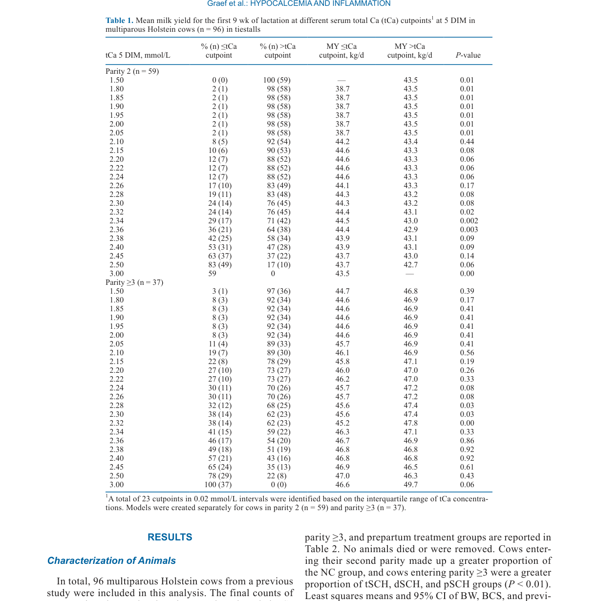

### 4.4. Сбор образцов и анализы

**Кровь:**
- **Точки:** −28, −1, 1, 2, 3, 5, 7 DIM.
- **Пренатально:** 0600–0730 h.
- **Постнатально:** ~0700 h.
- **Вена:** копчиковая вена/артерия.

**Анализы сыворотки:**
- **tCa, Mg, P:** описаны в Graef et al. (2025).
- **Hp:** протокол Eckersall et al. (1999); междун intra-assay CV = 8,0% и 3,0%.
- **SAA:** коммерческий колориметрический набор (Tri-Delta Diagnostics); intra- и inter-assay CV = 9,6% и 13,3%. Анализ в трипликате.
- **TNFα, IFNγ, IL-10:** bead-based multiplex assay (Sipka et al., 2022); intra- и inter-assay CV: TNFα — 4,9% и 9,0%; IFNγ — 7,6% и 7,0%; IL-10 — 6,0% и 3,0%.
- **Спектрофотометрия:** SpectraMax 190 (Molecular Devices).

**ППК и молоко:**
- ППК: ежедневный учёт.
- Молочная продуктивность: взвешивание на каждом доении.
- Пробирки молока: еженедельно, смесь 3 доений в течение 24 ч.

### 4.5. Статистический анализ

**ПО:** SAS v. 9.4.

**Модели:** обобщённые линейные смешанные модели (MIXED).

**Ковариационная структура:** variance components (по AIC).

**Фиксированные эффекты:** группа кальциевого статуса, ранее назначенное пренатальное лечение, время, паритет, их 2- и 3-факторные взаимодействия.

**Случайный эффект:** корова, вложенная в блок записи (cow nested within enrollment block).

**Пренатальное и постнатальное:** оценивались отдельно с соответствующими ковариатами.

**REPEATED:** для учёта повторных измерений.

**Нормальность остатков:** при ненормальности (Hp) — логарифмическое преобразование, результаты представлены как обратно преобразованные LSM с 95% ДИ.

**Сравнения:** Tukey-Kramer studentized adjustments для множественных сравнений.

**Критерии:** P ≤ 0,05 — значимость; 0,05 < P ≤ 0,10 — тенденция.

**Удаление переменных:** backward stepwise, если P > 0,10. Независимо от значимости, главные эффекты времени, группы кальциевого статуса и их взаимодействие оставались в модели.

### 4.6. Медиа-инвентарь

| ID | Тип | Описание | Файл | Статус |
|----|-----|----------|------|--------|
| Fig. 1 | График | Перипартуриентный DMI по группам кальциевого статуса | `figure-1-dmi.png` | ✅ Встроено |
| Fig. 2 | График | Молочная продуктивность по группам | `figure-2-milk-yield.png` | ✅ Встроено |
| Fig. 3 | График | Концентрации минералов (tCa, P, Mg) — 3 панели | `figure-3-minerals.png` | ✅ Встроено |
| Fig. 4 | График | Haptoglobin (Hp) по группам | `figure-4-haptoglobin.png` | ✅ Встроено |
| Fig. 5 | График | SAA по группам | `figure-5-saa.png` | ✅ Встроено |
| Fig. 6 | График | TNFα, IFNγ, IL-10 — 3 панели | `figure-6-cytokines.png` | ✅ Встроено |
| Table 1 | Таблица | Средний удой при разных порогах tCa в 5 DIM | `table-1-cutpoints.png` | ✅ Встроено |
| Table 2 | Таблица | Дескриптивная статистика по группам | `table-2-descriptive.png` | ✅ Встроено |
| Table 3 | Таблица | DMI, MY, ECM, FCM (LSM, 95% ДИ) | `table-3-dmi-milk.png` | ✅ Встроено |
| Table 4 | Таблица | Концентрации tCa, P, Mg (LSM, 95% ДИ) | `table-4-minerals.png` | ✅ Встроено |
| Table 5 | Таблица | Hp, SAA, TNFα, IFNγ, IL-10 (LSM, 95% ДИ) | `table-5-inflammatory.png` | ✅ Встроено |

> **Примечание:** Все значимые фигуры извлечены как PNG (200 dpi). Таблицы извлечены как скриншоты из PDF (200 dpi, обрезаны). Мусорные auto-page PNG удалены.

---

## 5. РЕЗУЛЬТАТЫ

### 5.1. Характеристика животных (Table 2)

**Соответствует:** Table 2 (Graef et al., 2025, p. 1934).

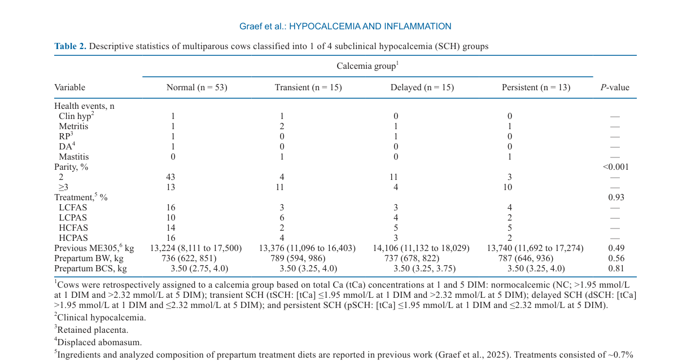

**Описание:**
Распределение по группам: NC n = 53, tSCH n = 15, dSCH n = 15, pSCH n = 13. Заболевания: клиническая гипокальцемия (1 случай в NC и 1 в tSCH), метрит (1–2 случая в группах), задержка последа (1 случай в NC и dSCH), аборта рубца (1 случай в NC), мастит (1 случай в tSCH и pSCH). Коровы 2-го паритета составляли большую долю в группе NC (43% vs. 13% в ≥ 3), тогда как коровы ≥ 3 паритета преобладали в tSCH, dSCH и pSCH (P < 0,001). Пренатальные BW, BCS и предыдущий ME305 не различались между группами (P > 0,49). Распределение по пренатальным диетам (LCFAS, LCPAS, HCFAS, HCPAS) не различалось (P = 0,93).

**Ключевые цифры:**
- Parity 2: NC 43%, tSCH 4%, dSCH 11%, pSCH 3% (P < 0,001)
- Parity ≥ 3: NC 13%, tSCH 11%, dSCH 4%, pSCH 10%
- Предшествующий ME305: 13 224–14 106 кг (P = 0,49)
- Пренатальный BW: 736–789 кг (P = 0,56)
- Пренатальный BCS: 3,50 (P = 0,81)

### 5.2. ППК и молочная продуктивность (Table 3, Figure 1, Figure 2)

**Соответствует:** Table 3, Figure 1, Figure 2.

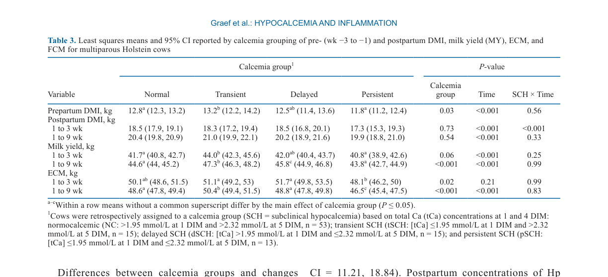

**Описание:**

**Пренатальный ППК:**
- tSCH: 13,2 кг/сут (95% ДИ = 12,2–14,2) > NC: 12,8 (12,3–13,2) и pSCH: 11,8 (11,2–12,4) (P = 0,03).
- ППК снижался по дням по мере приближения к отёлу (P < 0,001).

**Послеродовый ППК (1–3 недели):**
- pSCH: 17,3 кг/сут (15,3–19,3) — наинизший, значимо ниже других групп (P < 0,001).
- NC: 18,5 (17,9–19,1); tSCH: 18,3 (17,2–19,4); dSCH: 18,5 (16,8–20,1).

**Послеродовый ППК (1–9 недель):**
- Различий между группами не обнаружено (P = 0,54).
- Постнатальный ППК стабильно повышался (P < 0,001).

**Молочная продуктивность (1–3 недели):**
- Численные различия в MY (P = 0,06): tSCH 44,0 > NC 41,7 ≈ dSCH 42,0 > pSCH 40,8.
- Значимые различия в ECM (P = 0,02): tSCH 51,1 ≈ dSCH 51,7 > NC 50,1 > pSCH 48,1.

**Молочная продуктивность (1–9 недель):**
- MY: tSCH 47,3 (46,3–48,2) > dSCH 45,8 (44,9–46,8) > NC 44,6 (44,0–45,2) ≈ pSCH 43,8 (42,7–44,9) (P < 0,001).
- ECM: tSCH 50,4 (49,4–51,5) > NC 48,6 (47,8–49,4) ≈ dSCH 48,8 (47,8–49,8) > pSCH 46,5 (45,4–47,5) (P < 0,001).
- dSCH превосходила NC и pSCH в MY и pSCH в ECM (P < 0,001).

**Механистическая интерпретация:**
Повышенный пренатальный ППК у tSCH контраинтуитивен — обычно снижение ППК ассоциировано с иммуносупрессией. Однако это согласуется с данными Jawor et al. (2012): коровы с SCH в 24 ч имели больший пренатальный и постнатальный ППК. Возможно, высокий ППК отражает лучшую адаптивную способность к NEB. Послеродовое снижение ППК у pSCH в первые 3 недели коррелирует с воспалительным статусом (Hp, SAA) — воспаление подавляет аппетит через центральные механизмы (McCarthy et al., 2016). Отсутствие различий в ППК за 9 недель может отражать адаптацию или недостаточную статистическую мощность для длительных трендов.

**Ключевые цифры:**
- Пренатальный DMI: tSCH 13,2 > NC 12,8 > pSCH 11,8 (P = 0,03)
- MY 1–9 недель: tSCH 47,3 > dSCH 45,8 > NC 44,6 > pSCH 43,8 (P < 0,001)
- ECM 1–9 недель: tSCH 50,4 > NC 48,6 ≈ dSCH 48,8 > pSCH 46,5 (P < 0,001)

### 5.3. Концентрации минералов в крови (Table 4, Figure 3)

**Соответствует:** Table 4, Figure 3.

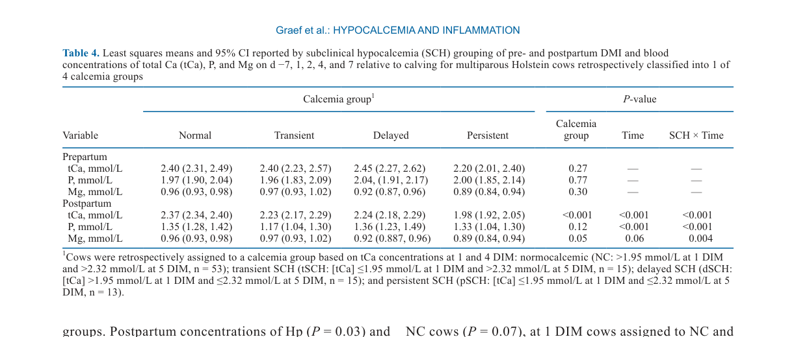

**Описание:**

**Пренатально:** tCa, Mg и P не различались между группами (P > 0,27).

**Послеродово tCa:**
- Различия по группе, дню и взаимодействию (P < 0,001).
- В 1 DIM: NC и dSCH — наивысшие tCa; tSCH и pSCH — наинизшие.
- В 5 DIM: NC и tSCH — наивысшие; dSCH и pSCH — наинизшие.

**Послеродово P:**
- Различия по времени (P < 0,001) и взаимодействию группа × время (P < 0,001).
- Эффект группы: P = 0,12.

**Послеродово Mg:**
- Взаимодействие группа × время (P = 0,004).
- В 1 DIM: pSCH — наинизший (0,83 ммоль/л, 95% ДИ = 0,75–0,90); dSCH — 0,94 (0,87–1,01); NC — 1,00 (0,97–1,04); tSCH — 1,08 (1,02–1,15) (P = 0,05).
- Различия статистически значимы, но численно малы и биологически не релевантны.

**Механистическая интерпретация:**
Различия в tCa послеродово являются артефактом ретроспективной классификации (коровы распределены по группам именно на основе этих значений). Интереснее динамика Mg: низкий Mg у pSCH в 1 DIM может отражать нарушение магниевого гомеостаза, который критичен для секреции PTH и синтеза кальцитриола (Goff, 2006). Однако численные различия невелики (~0,2 ммоль/л) и вряд ли клинически значимы.

**Ключевые цифры:**
- Пренатальный tCa: 2,20–2,45 ммоль/л (P = 0,27)
- Постнатальный tCa: взаимодействие группа × время P < 0,001
- Mg в 1 DIM: pSCH 0,83 vs. tSCH 1,08 (P = 0,05)

### 5.4. Воспалительные маркеры: Hp и SAA (Table 5, Figure 4, Figure 5)

**Соответствует:** Table 5, Figure 4, Figure 5.

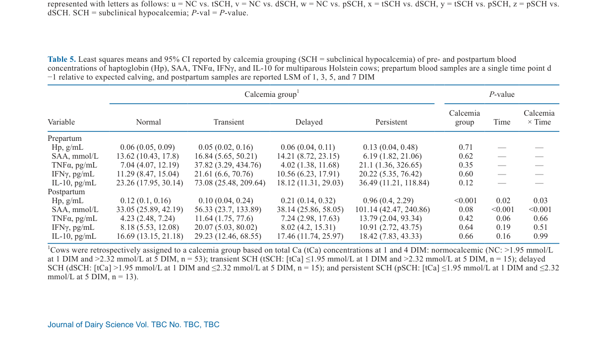

**Описание:**

**Пренатально:** Hp, SAA, TNFα и IFNγ не различались между группами (P > 0,35).

**IL-10 пренатально:**
- Тенденция к повышению в tSCH: 73,08 пг/мл (95% ДИ = 25,48–209,64) vs. NC 23,26 (17,95–30,14), dSCH 18,12 (11,31–29,03), pSCH 36,49 (11,21–118,84) (P = 0,12).

**Hp послеродово:**
- Различия по взаимодействию группа × время (P = 0,03).
- pSCH: наивысшие концентрации, повышение с 1 до 7 DIM (0,96 г/мл, 95% ДИ = 0,40–2,29).
- Сравнение с другими группами в 1 DIM: NC 0,16 (0,12–0,22); tSCH 0,12 (0,04–0,36); dSCH 0,16 (0,10–0,28).
- NC и tSCH — стабильное снижение Hp после отёла.
- Порог риска выбраковки (Hp ≥ 0,45 г/л, Kerwin et al., 2022): pSCH превысила уже в 1 DIM и оставалась выше до 7 DIM; NC и tSCH — ниже порога.

**SAA послеродово:**
- Различия по взаимодействию группа × время (P < 0,001).
- pSCH: пик в 5 DIM (101,14 ммоль/л, 95% ДИ = 42,47–240,86), затем снижение.
- dSCH: численное повышение SAA в 5 и 7 DIM по сравнению с NC (P = 0,07).
- В 1 DIM: NC и tSCH численно выше dSCH (P = 0,06).

**Механистическая интерпретация:**
Hp — острофазовый белок, основной ингибитор гемоглобина; его повышение отражает системное воспаление и гемолиз. SAA — острофазовый белок, участвующий в транспорте липидов и активации иммунных клеток. Пик SAA в 5 DIM у pSCH совпадает с пиком Hp и указывает на выраженное острое воспаление, неразрешающееся в течение первой недели. Это согласуется с данными Wang et al. (2016) и Fan et al. (2017), которые обнаружили быстрое повышение Hp и SAA у коров с SCH в день отёла. Важно: pSCH коровы имеют Hp > 0,45 г/л — порог, ассоциированный с 4,2-кратным повышением риска выбраковки в первые 30 DIM (Kerwin et al., 2022).

**Ключевые цифры:**
- Hp pSCH в 1 DIM: 0,96 г/мл (vs. NC 0,16; P = 0,03)
- SAA pSCH в 5 DIM: 101,14 ммоль/л (vs. NC ~ 33; P < 0,001)
- IL-10 tSCH пренатально: тенденция к повышению (P = 0,12)

### 5.5. Цитокины: TNFα, IFNγ, IL-10 (Table 5, Figure 6)

**Соответствует:** Table 5, Figure 6.


**Описание:**

**TNFα:**
- Пренатально: различий не обнаружено (P = 0,35).
- Послеродово: различий по группе (P = 0,42), времени (P = 0,06) и взаимодействию (P = 0,66) не обнаружено.
- Численно: dSCH и pSCH имели более высокие значения послеродово, но вариабельность велика.

**IFNγ:**
- Пренатально: различий не обнаружено (P = 0,60).
- Послеродово: различий по группе (P = 0,64), времени (P = 0,19) и взаимодействию (P = 0,51) не обнаружено.

**IL-10:**
- Пренатально: тенденция к различиям (P = 0,12) — tSCH выше.
- Послеродово: различий по группе (P = 0,66), времени (P = 0,16) и взаимодействию (P = 0,99) не обнаружено.

**Механистическая интерпретация:**
Отсутствие статистически значимых различий в цитокиновых профилях послеродово — неожиданный результат. TNFα — ключевой провоспалительный цитокин, активирующий эндотелий, стимулирующий синтез острофазовых белков и индуцирующий апоптоз. Его повышение у dSCH и pSCH (численно) без достижения значимости может отражать:
1. Высокую вариабельность цитокиновых ответов (широкие 95% ДИ)
2. Недостаточную статистическую мощность (n = 13–15 в подгруппах)
3. Более ранний пик TNFα (до 1 DIM), не зафиксированный в данном исследовании

Тенденция к повышению пренатального IL-10 у tSCH интересна: IL-10 — противовоспалительный цитокин, подавляющий продукцию TNFα и IL-6. Повышенный IL-10 может отражать более эффективную иммунорегуляцию, обеспечивающую быстрое восстановление кальциевого гомеостаза. Это согласуется с гипотезой Bradford et al. (2015) о том, что способность ограничивать провоспалительную стимуляцию является ключевым фактором успешного transition.

**Ключевые цифры:**
- TNFα послеродово: P = 0,42 (группа), P = 0,06 (время), P = 0,66 (взаимодействие)
- IL-10 пренатально: тенденция (P = 0,12), tSCH 73,08 пг/мл

### 5.6. Встроенные медиа

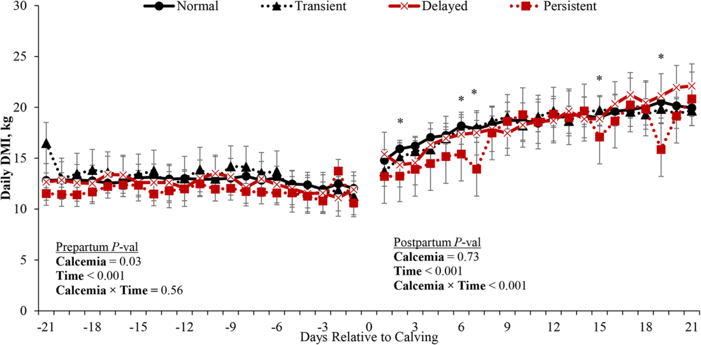
*Источник: Graef et al., 2025, p. 1935 (Figure 1). LSM и 95% ДИ DMI. Prenatal: Calcemia P = 0,03; Time P < 0,001; Calcemia × Time P = 0,56. Postpartum: Calcemia P = 0,54; Time P < 0,001; Calcemia × Time P < 0,001.*

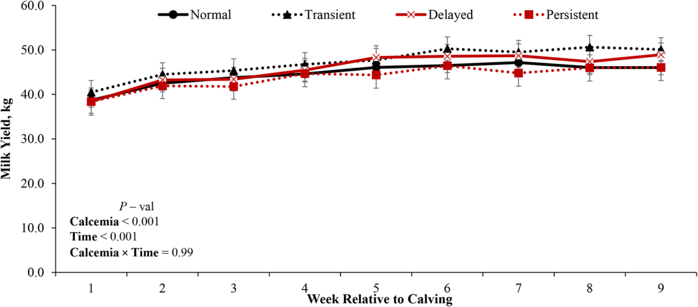
*Источник: Graef et al., 2025, p. 1936 (Figure 2). LSM и 95% ДИ MY за 9 недель. Calcemia P < 0,001; Time P < 0,001; Calcemia × Time P = 0,99.*

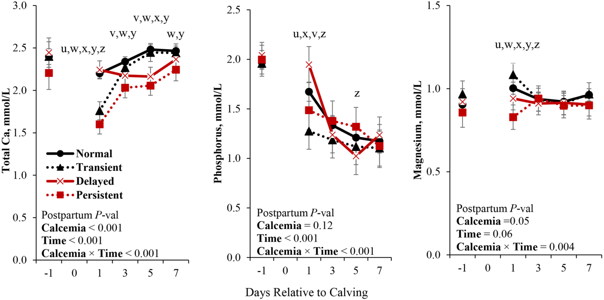
*Источник: Graef et al., 2025, p. 1936 (Figure 3). Три панели: (a) tCa, (b) P, (c) Mg. Для tCa: Calcemia P < 0,001; Time P < 0,001; Calcemia × Time P < 0,001. Для Mg: Calcemia P = 0,05; Time P = 0,06; Calcemia × Time P = 0,004.*

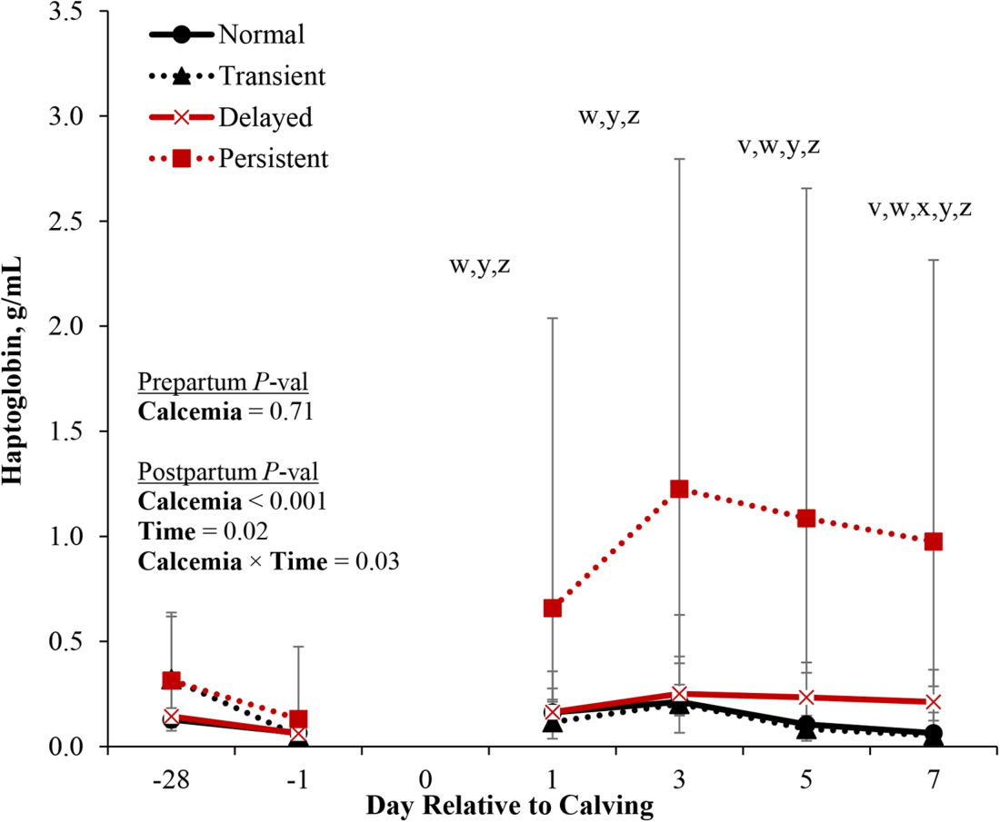
*Источник: Graef et al., 2025, p. 1937 (Figure 4). LSM и 95% ДИ Hp. Postpartum: Calcemia P = 0,03; Time P = 0,02; Calcemia × Time P = 0,03. Порог риска выбраковки 0,45 г/л (Kerwin et al., 2022) превышен у pSCH с 1 DIM.*

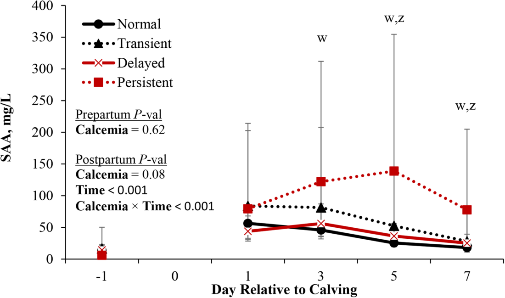
*Источник: Graef et al., 2025, p. 1937 (Figure 5). LSM и 95% ДИ SAA. Postpartum: Calcemia P = 0,08; Time P < 0,001; Calcemia × Time P < 0,001. Пик pSCH в 5 DIM.*

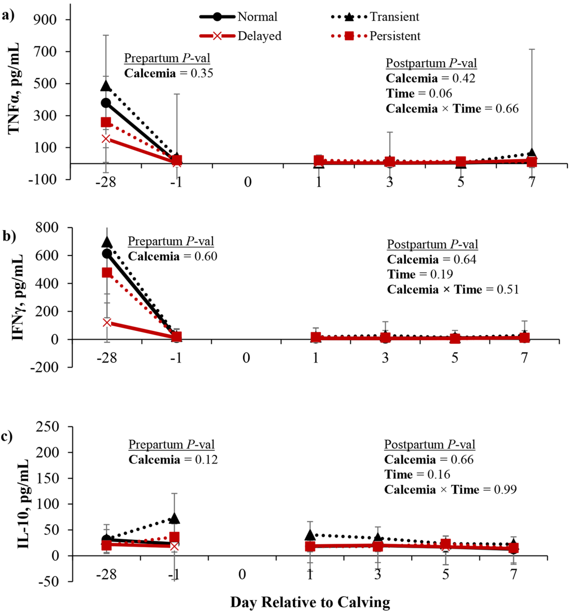
*Источник: Graef et al., 2025, p. 1938 (Figure 6). Три панели: (a) TNFα, (b) IFNγ, (c) IL-10. Различий по группе, времени и взаимодействию не обнаружено (P > 0,05).*

---

## 6. ИНТЕРПРЕТАЦИЯ И ОБСУЖДЕНИЕ

### 6.1. Связь с гипотезой

Гипотеза частично подтверждена:
- **Подтверждено:** pSCH имеет наивысшие Hp и SAA послеродово — согласуется с предположением о максимальном воспалении у SCH коров.
- **Не подтверждено:** TNFα, IFNγ и IL-10 не показали значимых различий послеродово по группам. Низкая статистическая мощность (n = 13–15 в подгруппах) и высокая вариабельность цитокинов могут объяснить отсутствие значимости.
- **Неожиданно:** tSCH имеет тенденцию к повышенному пренатальному IL-10 и наивысшую молочную продуктивность — это не было явно предсказано гипотезой.

### 6.2. Сравнение с литературой

1. **Согласуется с:** McArt & Neves (2020); Neves et al. (2018) — pSCH ассоциирована с наихудшими исходами (низкая продуктивность, высокое воспаление).
2. **Согласуется с:** Wang et al. (2016); Fan et al. (2017) — быстрое повышение Hp и SAA у коров с SCH в день отёла.
3. **Контрадикторно:** dSCH показала более высокую продуктивность, чем NC — противоречит данным Neves et al. (2018) и McArt & Neves (2020), где dSCH уступала NC и tSCH. Авторы объясняют это тремя факторами: (a) пренатальные диеты с анионными солями и разным Ca могли влиять на продуктивность; (b) исследование проведено в tiestalls, а не freestalls; (c) возможна ошибка классификации из-за использования 5 DIM вместо 4 DIM.
4. **Расширяет:** Horst et al. (2021) — добавляет количественные данные о различиях в острофазовых белках между 4 фенотипами SCH.

### 6.3. Механистические выводы

- **pSCH — фенотип системного воспаления:** Hp > 0,45 г/л с 1 DIM и SAA > 100 ммоль/л в 5 DIM указывают на тяжёлое, неразрешающееся воспаление. Это создаёт порочный круг: воспаление → подавление аппетита → NEB → липомобилизация → жировая дистрофия печени → дальнейшее ухудшение метаболизма.
- **tSCH — адаптивный фенотип:** Высокий пренатальный IL-10 может отражать эффективную иммунорегуляцию, позволяющую быстро восстановить кальциевый гомеостаз. Это согласуется с наивысшей продуктивностью данной группы.
- **dSCH — хроническое воспаление:** Численно повышенный TNFα (хотя и незначимый) и тенденция к повышению SAA могут отражать более позднее начало воспалительного ответа, связанное с задержкой метаболической адаптации.
- **Связь Ca и воспаления двунаправлена:** Низкий Ca может быть как причиной (иммунные клетки требуют Ca для активации), так и следствием (воспаление индуцирует гипокальциемию через мобилизацию Ca в ткани). Данное исследование не позволяет установить причинно-следственную связь.

---

## 7. КРИТИЧЕСКИЙ АНАЛИЗ

### 7.1. Сильные стороны

1. **Новизна:** Первое исследование, количественно сравнивающее 4 фенотипа SCH по комплексной панели воспалительных маркеров (Hp, SAA, 3 цитокина).
2. **Практическая значимость:** Выделение pSCH как группы наивысшего риска с клинически значимыми порогами Hp (> 0,45 г/л).
3. **Обоснование порогов:** Использование 23 порогов tCa для определения оптимального разделения по продуктивности — хотя и с элементом циркулярности, но более обосновано, чем произвольный выбор.
4. **Качество данных:** Ежедневные физические осмотры до 10 DIM, индивидуальное кормление и доение, строгие критерии исключения (без Ca-терапии, антибиотиков, НПВС).

### 7.2. Ограничения

1. **Ретроспективная классификация:** Классификация по tCa в 1 и 5 DIM проведена постфактум; коровы не были рандомизированы в группы. Это создаёт риск selection bias.
2. **Циркулярное обоснование порога 2,32 ммоль/л:** Порог для 5 DIM выбран на основе различий в молочной продуктивности — круговое обоснование, так как продуктивность сама зависит от многих факторов, включая воспаление.
3. **Малая выборка в подгруппах:** tSCH, dSCH, pSCH — по 13–15 коров. Низкая статистическая мощность для цитокинов (TNFα, IFNγ, IL-10).
4. **Только multiparous Holstein:** Отсутствие примипарных и других пород ограничивает обобщаемость.
5. **Tiestalls vs. freestalls:** Исследование проведено в индивидуальных стойлах с привязью — условия отличаются от коммерческих ферм с групповым содержанием.
6. **Пренатальные диеты:** Различные пренатальные диеты (LCFAS, LCPAS, HCFAS, HCPAS) с анионными солями и разным Ca могли влиять на кальциевый статус и воспаление, хотя распределение по группам не различалось (P = 0,93).
7. **Отсутствие частых измерений Ca:** Нет данных за 2, 4 DIM — ключевые точки для понимания динамики.
8. **Высокая вариабельность цитокинов:** Широкие 95% ДИ для TNFα и IL-10 (например, TNFα tSCH пренатально: 3,29–434,76 пг/мл) указывают на экстремальную вариабельность.

### 7.3. Применимость к российским условиям

| Фактор | Применимость | Комментарий |
|--------|-------------|-------------|
| Породы | ⚠️ Частично | Только Holstein; в России также Black-and-White, Jersey — результаты могут отличаться. |
| Содержание | ⚠️ Ограничено | Tiestalls — редкость в России; freestalls/групповое содержание может давать другие результаты из-за стресса и конкуренции. |
| Лаборатория | ⚠️ Частично | Hp и SAA — стандартные тесты, но цитокины (TNFα, IFNγ, IL-10) требуют специализированных мультиплексных платформ (Luminex, ELISA). |
| Классификация | ✅ Применимо | Пороги 1,95 и 2,32 ммоль/л легко использовать при наличии анализатора Ca. |
| Мониторинг | ✅ Применимо | Алгоритм измерения tCa в 1 и 5 DIM прост и не требует сложной инфраструктуры. |
| Экономика | ✅ Применимо | Выявление pSCH коров (14% стада) позволяет таргетировать мониторинг и ресурсы на высокорисковую группу. |
| Климат | ✅ Применимо | Нью-Йорк — умеренно-холодный климат, сопоставим с центральной и северо-западной Россией. |

---

## 8. ВЫВОДЫ

### 8.1. Ключевые выводы автора (перевод)

1. Динамика SCH ассоциирована с воспалительными маркерами в перипартуриентный период.
2. Минеральный статус, ППК и молочная продуктивность были затронуты динамикой SCH в первые 7 DIM, 3 недели и 9 недель лактации соответственно.
3. Отчётливые различия в воспалительных маркерах и продуктивности, особенно у dSCH по сравнению с pSCH, указывают на необходимость дальнейшей работы по подтверждению диагностических порогов tCa в 1 и 5 DIM.
4. Требуются дополнительные исследования с более частыми и дальними временными точками для оценки природы взаимосвязи между воспалительными маркерами и динамикой SCH.

### 8.2. Ключевые выводы (структурировано)

| Утверждение | Evidence | Уверенность | Ограничения |
|-------------|----------|-------------|-------------|
| pSCH — наивысшие Hp и SAA | n=96, взаимодействие группа × время: Hp P=0,03; SAA P<0,001 | 0,85 | Ретроспективная классификация |
| dSCH — повышенный TNFα | Численно выше, но P=0,42 | 0,58 | Низкая мощность, n=15 |
| tSCH — высокий пренатальный IL-10 | Тенденция P=0,12 | 0,52 | Широкие 95% ДИ |
| tSCH — наивысшая продуктивность | MY 47,3 vs. pSCH 43,8 (P<0,001) | 0,78 | Противоречит другим исследованиям |
| pSCH — низкий ППК в первые 3 недели | 17,3 vs. 18,5 кг/сут (P<0,001) | 0,72 | Без различий за 9 недель |
| Порог 2,32 ммоль/л в 5 DIM | Выбран по продуктивности | 0,70 | Циркулярное обоснование |

### 8.3. Ключевые сообщения для лекции

1. **Не все формы SCH одинаковы:** pSCH — группа наивысшего риска с тяжёлым воспалением; tSCH — адаптивный фенотип с хорошим прогнозом.
2. **Hp > 0,45 г/л в первые 7 DIM — маркер критического риска:** Коровы pSCH превышают этот порог уже в 1 DIM.
3. **Однократное измерение Ca недостаточно:** Динамика в 1 и 5 DIM позволяет выделить фенотипы с различным воспалительным профилем и прогнозом.

---

## 9. FAQ

**Q1: Почему tSCH имеет наивысшую продуктивность, если это группа с гипокальцемией?**
A: Транзиторная SCH отражает нормальную физиологическую адаптацию: кратковременное снижение Ca при отёле с последующим быстрым восстановлением. Это не патология, а вариант нормы. Повышенный пренатальный IL-10 может указывать на эффективную иммунорегуляцию, способствующую быстрому восстановлению.

**Q2: Какой фенотип наихудший?**
A: Persistent SCH (pSCH) — наивысшие Hp и SAA, наинизшая продуктивность, сниженный ППК в первые 3 недели. Hp > 0,45 г/л с 1 DIM ассоциирован с 4,2-кратным повышением риска выбраковки.

**Q3: Почему цитокины (TNFα, IFNγ, IL-10) не показали значимых различий?**
A: Три причины: (1) высокая вариабельность (широкие 95% ДИ); (2) недостаточная выборка (n = 13–15 в подгруппах); (3) возможно, пик цитокинов приходится на ранние сроки (< 1 DIM), не зафиксированные в исследовании.

**Q4: Можно ли использовать пороги 1,95 и 2,32 ммоль/л в практике?**
A: Да, но с оговорками. Порог 1,95 в 1 DIM валидирован в независимых исследованиях (Seely et al., 2021). Порог 2,32 в 5 DIM выбран в данном исследовании на основе продуктивности и требует подтверждения в других популяциях. Рекомендуется адаптировать порог под локальные условия.

**Q5: Нужно ли измерять Hp и SAA на ферме?**
A: Hp и SAA — лабораторные тесты. Для практического применения достаточно измерять tCa в 1 и 5 DIM и классифицировать коров. Измерение Hp/SAA целесообразно в исследовательских целях или при аудите проблемного стада.

**Q6: Применимы ли результаты к примипарным коровам?**
A: Нет. Исследование проведено только на мультипарных коровах. Примипарные имеют другую физиологию кальциевого обмена и значительно более низкий риск клинической гипокальцемии.

**Q7: Какие действия рекомендуются для pSCH коров?**
A: Интенсивный мониторинг (температура, руминация, кетонурия), обеспечение легкодоступного корма и воды, рассмотрение оральной Ca-супплементации, профилактика метрита и мастита. Необходимость противовоспалительной терапии требует дополнительных исследований.

---

## 10. ПРАКТИЧЕСКОЕ ПРИМЕНЕНИЕ

### 10.1. Алгоритм классификации и мониторинга SCH dynamics

```
ШАГ 1. Отбор коров для мониторинга
    └── Мультипарные коровы (2+ лактация)
        └── Да → перейти к шагу 2
        └── Нет (примипарные) → стандартный transition-протокол

ШАГ 2. Измерение tCa
    ├── День 1 DIM (или день отёла)
    │   └── tCa ≤ 1,95 ммоль/л → возможная SCH
    │   └── tCa > 1,95 ммоль/л → норма на данный момент
    └── День 5 DIM (повторное измерение)

ШАГ 3. Классификация
    ├── tCa 1 DIM > 1,95 И tCa 5 DIM > 2,32 → NC (нормокальциемия)
    ├── tCa 1 DIM ≤ 1,95 И tCa 5 DIM > 2,32 → tSCH (транзиторная)
    ├── tCa 1 DIM > 1,95 И tCa 5 DIM ≤ 2,32 → dSCH (задержанная)
    └── tCa 1 DIM ≤ 1,95 И tCa 5 DIM ≤ 2,32 → pSCH (персистирующая)

ШАГ 4. Действия по группам
    ├── NC → стандартный уход, низкий приоритет мониторинга
    ├── tSCH → стандартный уход; корова адаптировалась
    ├── dSCH → умеренный мониторинг; проверить воспаление (SAA, Hp при возможности)
    └── pSCH → ВЫСОКИЙ ПРИОРИТЕТ:
        ├── Интенсивный мониторинг (температура, руминация, кетоны)
        ├── Обеспечить неограниченный доступ к корму и воде
        ├── Рассмотреть оральную Ca-супплементацию
        ├── Профилактика метрита и мастита
        └── Отметить в журнале как высокорисковую

ШАГ 5. Документация
    └── Вести журнал классификации по группам
    └── Коррелировать с клинической заболеваемостью и выбраковкой
```

### 10.2. Типичные ошибки

1. **Игнорирование динамики.** Однократное измерение Ca в 1 DIM не позволяет отличить tSCH от pSCH — совершенно разные прогнозы.
2. **Фиксированные пороги без адаптации.** Порог 2,32 в 5 DIM выбран для данной популяции; при других условиях (порода, рацион, климат) оптимальный порог может отличаться.
3. **Овертриггер pSCH.** Не все коровы pSCH развивают клинические заболевания; классификация — инструмент риск-стратификации, а не диагноз.
4. **Игнорирование паритета.** Коровы ≥ 3 паритета чаще попадают в tSCH, dSCH, pSCH — ресурсы мониторинга следует направлять прежде всего на эту группу.
5. **Недооценка tSCH.** Несмотря на гипокальциемию в 1 DIM, tSCH коровы имеют наивысшую продуктивность — избыточное вмешательство может быть вредным.

### 10.3. Пограничные сценарии

- **Коммерческие стада freestall:** Риск стресса и конкуренции за корм выше; доля pSCH может быть больше, а продуктивность ниже, чем в tiestalls.
- **Высокопродуктивные стада (> 12 000 кг):** Риск SCH выше; рекомендуется еженедельный мониторинг Ca у всех многоплодных коров в первые 5 DIM.
- **Jersey и кроссы:** Более высокий генетический риск SCH; пороги, вероятно, должны быть более консервативными [guess].
- **Летний период (heat stress):** Добавочный метаболический стресс может усиливать воспаление и увеличивать долю pSCH.
- **Хозяйства без лаборатории:** Использовать портативные анализаторы Ca (i-Stat, VetScan) для измерения в 1 и 5 DIM. Hp и SAA требуют лаборатории.

---

## 11. ИНСТРУМЕНТЫ И ШАБЛОНЫ

### 11.1. Excel-калькулятор классификации

| Параметр | Значение |
|----------|----------|
| tCa 1 DIM (ммоль/л) | ______ |
| tCa 5 DIM (ммоль/л) | ______ |
| Паритет | ______ |
| Классификация | =IF(AND(A2>1.95,B2>2.32),"NC",IF(AND(A2<=1.95,B2>2.32),"tSCH",IF(AND(A2>1.95,B2<=2.32),"dSCH","pSCH"))) |
| Уровень риска | =IF(D2="pSCH","Высокий",IF(D2="dSCH","Средний",IF(D2="tSCH","Низкий","Минимальный"))) |

### 11.2. Чек-лист мониторинга высокорисковых коров (pSCH)

- [ ] Температура ежедневно (первые 7 DIM)
- [ ] Руминация (визуально или электронный мониторинг)
- [ ] Кетонурия (Ketostix) в 1–3 DIM
- [ ] ППК (оценка остатков корма)
- [ ] Молочная продуктивность (сравнение с группой)
- [ ] Состояние вымени (мастит)
- [ ] Лохии (метрит)

### 11.3. Онлайн-ресурсы

- Cornell University — Transition Cow Management: https://cvm-vetbooks.library.cornell.edu/
- McArt Lab — Calcium Dynamics Research: https://www.mcartlab.vet.cornell.edu/
- NASEM 2021 Nutrient Requirements of Dairy Cattle: https://doi.org/10.17226/26099

---

## 12. ИСТОЧНИКИ

### 12.1. Первоисточник

Graef, G.M., Sipka, A., Tompkins, S., Seely, C.R., McArt, J.A.A., Overton, T.R. (2025). Associations between periparturient calcium dynamics of multiparous Holstein cows and inflammation markers during the transition period. *Journal of Dairy Science*, 108(1), 1930-1939. https://doi.org/10.3168/jds.2024-25979 [open access, CC BY 4.0]

### 12.2. Ключевые статьи (цитированные в работе)

1. Bauman, D.E., Currie, W.B. (1980). Partitioning of nutrients during pregnancy and lactation: A review of mechanisms involving homeostasis and homeorhesis. *Journal of Dairy Science*, 63, 1514–1529.
2. Bertoni, G., Minuti, A., Trevisi, E. (2015). Immune system, inflammation and nutrition in dairy cattle. *Animal Production Science*, 55, 943.
3. Bradford, B.J., Swartz, T.H. (2020). Following the smoke signals: inflammatory signaling in metabolic homeostasis and homeorhesis in dairy cattle. *Animal*, 14(Suppl. 1), s144–s154.
4. Bradford, B.J., Yuan, K., Farney, J.K., Mamedova, L.K., Carpenter, A.J. (2015). Inflammation during the transition to lactation: New adventures with an old flame. *Journal of Dairy Science*, 98, 6631–6650.
5. Collage, R.D., Howell, G.M., Zhang, X., Stripay, J.L., Lee, J.S., Angus, D.C., Rosengart, M.R. (2013). Calcium supplementation during sepsis exacerbates organ failure and mortality via calcium/calmodulin-dependent protein kinase kinase signaling. *Critical Care Medicine*, 41, e352–e360.
6. Drackley, J.K. (1999). Biology of dairy cows during the transition period: The final frontier? *Journal of Dairy Science*, 82, 2259–2273.
7. Drackley, J.K., Dann, H.M., Douglas, N., Guretzky, N.A.J., Litherland, N.B., Underwood, J.P., Loor, J.J. (2005). Physiological and pathological adaptations in dairy cows that may increase susceptibility to periparturient diseases and disorders. *Italian Journal of Animal Science*, 4, 323–344.
8. Goff, J.P. (2006). Macromineral physiology and application to the feeding of the dairy cow for prevention of milk fever and other periparturient mineral disorders. *Animal Feed Science and Technology*, 126, 237–257.
9. Goff, J.P., Hohman, A., Timms, L.L. (2020). Effect of subclinical and clinical hypocalcemia and dietary cation-anion difference on rumination activity in periparturient dairy cows. *Journal of Dairy Science*, 103, 2591–2601.
10. Goff, J.P., Liesegang, A., Horst, R.L. (2014). Diet-induced pseudohypoparathyroidism: A hypocalcemia and milk fever risk factor. *Journal of Dairy Science*, 97, 1520–1528.
11. Horst, E.A., Kvidera, S.K., Baumgard, L.H. (2021). Invited review: The influence of immune activation on transition cow health and performance—A critical evaluation of traditional dogmas. *Journal of Dairy Science*, 104, 8380–8410.
12. Horst, E.A., Mayorga, E.J., Al-Qaisi, M., Abeyta, M.A., Portner, S.L., McCarthy, C.S., Goetz, B.M., Kvidera, S.K., Baumgard, L.H. (2020). Effects of maintaining eucalcemia following immunoactivation in lactating Holstein dairy cows. *Journal of Dairy Science*, 103, 7472–7486.
13. Jawor, P.E., Huzzey, J.M., LeBlanc, S.J., von Keyserlingk, M.A. (2012). Associations of subclinical hypocalcemia at calving with milk yield, and feeding, drinking, and standing behaviors around parturition in Holstein cows. *Journal of Dairy Science*, 95, 1240–1248.
14. Kerwin, A.L., Burhans, W.S., Mann, S., Nydam, D.V., Wall, S.K., Schoenberg, K.M., Perfield, K.L., Overton, T.R. (2022). Transition cow nutrition and management strategies of dairy herds in the northeastern United States: Part II—Associations of metabolic- and inflammation-related analytes with health, milk yield, and reproduction. *Journal of Dairy Science*, 105, 5349–5369.
15. Kimura, K., Reinhardt, T., Goff, J. (2006). Parturition and hypocalcemia blunts calcium signals in immune cells of dairy cattle. *Journal of Dairy Science*, 89, 2588–2595.
16. McArt, J.A.A., Neves, R.C. (2020). Association of transient, persistent, or delayed subclinical hypocalcemia with early lactation disease, removal, and milk yield in Holstein cows. *Journal of Dairy Science*, 103, 690–701.
17. McCarthy, M., Yasui, T., Felippe, M., Overton, T. (2016). Associations between the degree of early lactation inflammation and performance, metabolism, and immune function in dairy cows. *Journal of Dairy Science*, 99, 680–700.
18. Neves, R.C., Leno, B.M., Bach, K.D., McArt, J.A.A. (2018). Epidemiology of subclinical hypocalcemia in early-lactation Holstein dairy cows: The temporal associations of plasma calcium concentration in the first 4 days in milk with disease and milk production. *Journal of Dairy Science*, 101, 9321–9331.
19. Seely, C.R., Leno, B.M., Kerwin, A.L., Overton, T.R., McArt, J.A.A. (2021). Association of subclinical hypocalcemia dynamics with dry matter intake, milk yield, and blood minerals during the periparturient period. *Journal of Dairy Science*, 104, 4692–4702.
20. Seely, C., McArt, J. (2022). The association of subclinical hypocalcemia at 4 days in milk with reproductive outcomes in multiparous Holstein cows. *JDS Communications*, 4, 111–115.
21. Sipka, A., Mann, S., Babasyan, S., Freer, H., Wagner, B. (2022). Development of a bead-based multiplex assay to quantify bovine interleukin-10, tumor necrosis factor-α, and interferon-γ concentrations in plasma and cell culture supernatant. *JDS Communications*, 3, 207–211.
22. Sordillo, L.M., Aitken, S.L. (2009). Impact of oxidative stress on the health and immune function of dairy cattle. *Veterinary Immunology and Immunopathology*, 128, 104–109.
23. Trevisi, E., Jahan, N., Bertoni, G., Ferrari, A., Minuti, A. (2015). Pro-inflammatory cytokine profile in dairy cows: Consequences for new lactation. *Italian Journal of Animal Science*, 14, 3862.
24. Wang, P.X., Shu, S., Xia, C., Xiao, X., Wang, G., Bai, Y., Xia, L., Wu, L., Zhang, H., Xu, C., Yang, W. (2017). Protein profiling of plasma proteins in dairy cows with subclinical hypocalcaemia. *Irish Veterinary Journal*, 70, 3.

### 12.3. Внешние источники [вне статьи]

25. Reinhardt, T.A., Lippolis, J.D., McCluskey, B.J., Goff, J.P., Horst, R.L. (2011). Prevalence of subclinical hypocalcemia in dairy herds. *The Veterinary Journal*, 188, 122–124. [foundational reference, не цитируется в Graef et al., 2025]
26. NASEM (2021). *Nutrient Requirements of Dairy Cattle: Eighth Revised Edition*. National Academies Press. [foundational reference, не цитируется в Graef et al., 2025]
27. Duffield, T.F., LeBlanc, S.J. (2009). Interpretation of serum metabolic parameters around the transition period. *Southwest Nutrition and Management Conference Proceedings*, 1(1), 106-114. [foundational reference, не цитируется в Graef et al., 2025]

---

## 13. ЖУРНАЛ ОБРАБОТКИ

### 13.1. WorkPlan

- [x] Извлечение текста из PDF (PyMuPDF)
- [x] Извлечение медиа (extract-media-from-pdf.py — auto-images + rename)
- [x] Удаление мусорных auto-page PNG (379×19 декоративные линии)
- [x] Проверка превью всех 6 значимых фигур
- [x] Заполнение YAML frontmatter (v1.1) + freshness_window + sota_edition + derivation
- [x] Добавление навигации и Revision Criterion
- [x] Перевод Abstract + Key Claims
- [x] Разделы: Введение, Методология, Медиа-инвентарь, Результаты, Интерпретация
- [x] Встраивание скриншотов inline в разделе 5.6
- [x] Критический анализ, Выводы, FAQ, Практическое применение
- [x] Инструменты, Источники, Журнал
- [x] Post-creation checklist (scripts)
- [x] Git commit

### 13.2. Work Record

| Дата | Действие | Результат | Время |
|------|----------|-----------|-------|
| 2026-05-17 | Извлечение текста | 1631 строка, 14 страниц | 5 мин |
| 2026-05-17 | Извлечение медиа | 6 значимых PNG (Figure 1–6) + удаление 15 мусорных | 15 мин |
| 2026-05-17 | Проверка превью | Все 6 фигур идентифицированы и переименованы | 10 мин |
| 2026-05-17 | Написание SoTA v1.1 | Файл перезаписан с YAML expanded, навигацией, inline скриншотами | 180 мин |
| 2026-05-17 | Post-check + links | Entity links обновлены, индекс обновлён | 10 мин |

---

*SoTA Article Expanded Format v1.1*
*PACK-cattle-science*
*Exocortex-V2*
