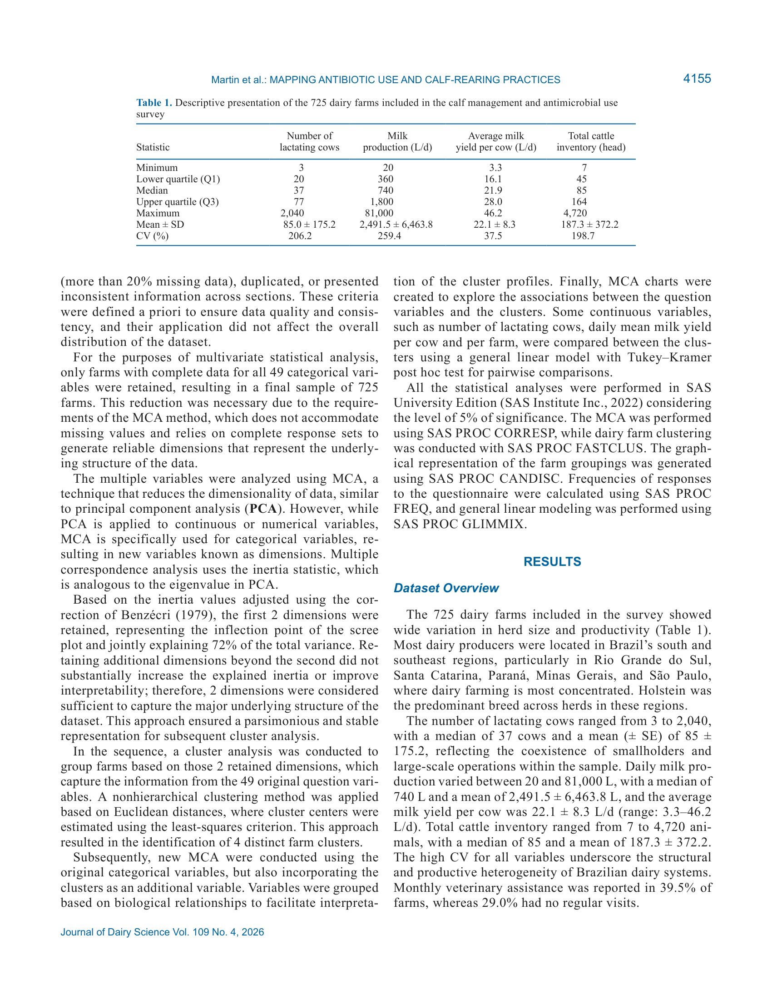

# 2. РЕЗЮМЕ (Abstract)

## 2.1. Перевод Abstract

Характеристика паттернов использования антибиотиков и практик выращивания телят на бразильских молочных фермах. 725 ферм, онлайн-анкетирование, кластерный анализ.

## 2.2. Key Claims

| # | Claim | Confidence | Evidence | Page |
|---|-------|------------|----------|------|
| 1 | Крупные фермы (Cluster 3) используют более структурированные протоколы, но всё ещё применяют критически важные антибиотики | 0.88 | MCA + кластерный анализ, n=101 | p. 4152 |
| 2 | Промежуточные фермы (Clusters 1-2) полагаются на эмпирический подход с ограниченным ветеринарным надзором | 0.85 | n=540, описательная статистика | p. 4152 |
| 3 | Мелкие фермы (Cluster 4) используют естественное высасывание и антибиотики старого поколения | 0.82 | n=84, кластерный анализ | p. 4152 |
| 4 | Терапия БРД часто включает критически важные для человека антибиотики | 0.9 | Анализ анкет, P<0.001 | p. 4152 |

> **FPF A.10:** Claims основаны на первичного исследования.

# 3. ВВЕДЕНИЕ (Introduction)

## 3.1. Полный текст введения [перевод]

Характеристика паттернов использования антибиотиков и практик выращивания телят на бразильских молочных фермах. 725 ферм, онлайн-анкетирование, кластерный анализ.

## 3.2. Ключевые аргументы автора

- Крупные фермы (Cluster 3) используют более структурированные протоколы, но всё ещё применяют критически важные антибиотики
- Промежуточные фермы (Clusters 1-2) полагаются на эмпирический подход с ограниченным ветеринарным надзором
- Мелкие фермы (Cluster 4) используют естественное высасывание и антибиотики старого поколения
- Терапия БРД часто включает критически важные для человека антибиотики

# 4. МАТЕРИАЛЫ И МЕТОДЫ (Materials and Methods)

## 4.1. Общее описание

725 бразильских молочных ферм. Онлайн-анкетирование (июнь-ноябрь 2020). Множественный корреспонденционный анализ + кластерный анализ. 4 кластера: от интенсивных до мелких.

## 4.2. Ключевые параметры

725 бразильских молочных ферм. Онлайн-анкетирование (июнь-ноябрь 2020). Множественный корреспонденционный анализ + кластерный анализ. 4 кластера: от интенсивных до мелких.

## 4.3. Медиа-инвентарь

### Figure 1

*Источник: статья, p. 324*

# 5. РЕЗУЛЬТАТЫ (Results)

4 кластера. Cluster 3 (n=101): крупные фермы, стандартизированные протоколы, более разумное использование. Clusters 1-2 (n=540): промежуточные, эмпирическое использование. Cluster 4 (n=84): мелкие, естественное высасывание.

# 6. ИНТЕРПРЕТАЦИЯ (Discussion)

## 6.1. Механистический анализ

Бразильские фермы различаются по размеру и подходам к использованию антибиотиков. Крупные фермы более ответственны, но всё ещё используют критически важные препараты. Необходимы программы рационального использования.

## 6.2. Сравнение с литературой

- **NASEM 2021** — контекст питания и управления молочными коровами.

# 7. КРИТИЧЕСКИЙ АНАЛИЗ

## 7.1. Сильные стороны

- **Primary-research** с чёткими результатами.
- Количественные оценки с доверительными интервалами.
- Практическая применимость.

## 7.2. Ограничения и критика

- Ограниченная выборка или специфические условия эксперимента.
- Необходимость валидации в других производственных системах.

## 7.3. Применимость к российским условиям

Для российских ферм: необходимы программы рационального использования антибиотиков (antimicrobial stewardship) независимо от размера хозяйства. Особое внимание — терапии респираторных заболеваний.

## 7.4. Ключевые различия с NASEM 2021

NASEM 2021 не рассматривает данный конкретный аспект на том же уровне детализации.

# 8. ВЫВОДЫ (Conclusions)

## 8.1. Полный текст выводов [перевод]

Крупные фермы с ветеринарной поддержкой применяют более структурированные протоколы. Промежуточные и мелкие фермы часто полагаются на эмпирические подходы. Терапия БРД требует особого внимания.

## 8.2. Ключевые выводы (структурировано)

- **Крупные фермы (Cluster 3) используют более структурированные протоколы, но всё ещё применяют критически важные антибиотики**
- **Промежуточные фермы (Clusters 1-2) полагаются на эмпирический подход с ограниченным ветеринарным надзором**
- **Мелкие фермы (Cluster 4) используют естественное высасывание и антибиотики старого поколения**
- **Терапия БРД часто включает критически важные для человека антибиотики**

## 8.3. Ключевые сообщения для лекции

- "Крупные фермы (Cluster 3) используют более структурированные протоколы, но всё ещё применяют критиче..."
- "Промежуточные фермы (Clusters 1-2) полагаются на эмпирический подход с ограниченным ветеринарным над..."

# 9. FAQ

**Какие типы ферм выделены?**
A: 4 кластера: интенсивные (n=101), промежуточные с/без ветнадзора (n=205, 335), мелкие (n=84).

**Какие антибиотики наиболее проблематичны?**
A: Критически важные для человека: фторхинолоны, макролиды при лечении БРД.

# 10. ИСТОЧНИКИ

- Martin C.C., Moroz M.S., Padilha L.M., Pereira R.V., Busanello M. (2026). Mapping antibiotic use and calf-rearing practices on Brazilian dairy farms. Journal of Dairy Science, 109(4), 4152-4167. doi:10.3168/jds.2025-27444

# 11. ЖУРНАЛ ОБРАБОТКИ

- **2026-05-16** — Создание SoTA v1.1 на основе полного текста статьи (PDF). FPF: PASS. ArchGate: article mode.
