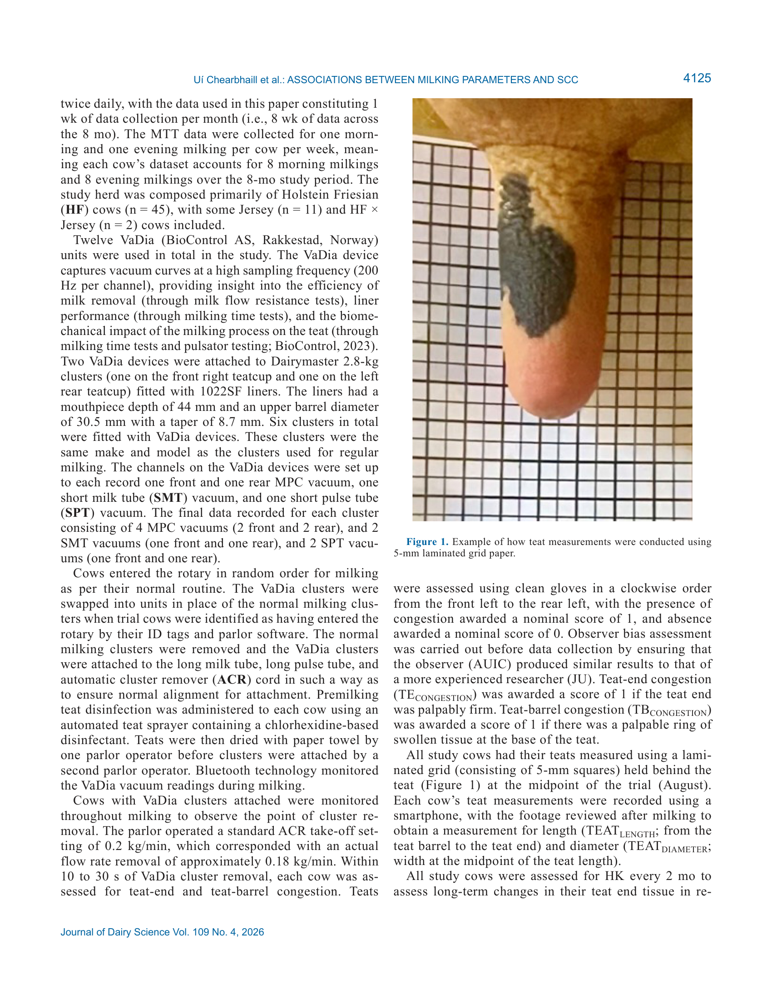

# 2. РЕЗЮМЕ (Abstract)

## 2.1. Перевод Abstract

Оценка связи между параметрами вакуума, молочного потока и сосковыми показателями с СОМ на уровне четвертей и коров. 58 коров, 8 месяцев наблюдений.

## 2.2. Key Claims

| # | Claim | Confidence | Evidence | Page |
|---|-------|------------|----------|------|
| 1 | Вакуум в камере соска (MPC) положительно ассоциирован с log10СОМ на уровне четверти и коровы | 0.9 | Многомерные смешанные модели, P<0.05 | p. 4123 |
| 2 | Степень гиперкератоза кончика соска положительно ассоциирована с СОМ | 0.88 | Смешанные модели, P<0.05 | p. 4123 |
| 3 | На уровне четверти: низкий AMF, высокий PMF, длительное время простоя, широкий диаметр соска → высокая СОМ | 0.85 | Многомерный анализ, P<0.05 | p. 4123 |
| 4 | На уровне коровы: короткая длительность высокого потока → высокая СОМ | 0.82 | Многомерный анализ, P<0.05 | p. 4123 |
| 5 | Увеличение MPC вакуума на 1 кПа ассоциировано с ростом log10СОМ | 0.85 | Регрессионный коэффициент, P<0.05 | p. 4123 |
| 6 | Дизайн наблюдательный, причинность не установлена | 0.95 | Ограничение дизайна | p. 4123 |

> **FPF A.10:** Claims основаны на primary-research с указанными статистическими метриками.

# 3. ВВЕДЕНИЕ (Introduction)

## 3.1. Полный текст введения

The efficiency and profitability of dairy milk produc-
tion is critically dependent on the maintenance of good
udder health. Somatic cell count is a widely accepted
indicator of an inflammatory response in the mammary
gland, but its biological variance is significantly influ-
enced by the dynamic interaction between the milking
machine and the cow’s primary physical defense against
pathogens, the teat (Nickerson, 1985). The teat has natural
defenses against pathogen migration, including sphincter
muscles that surround the teat canal to block bacterial
penetration between milkings (Espe and Cannon, 1942);
an internal epithelium lined with keratin and hydropho-
bic lipids, which entraps invading bacteria before flush-
ing during subsequent milkings (Rainard and Riollet,
2006); and a complex system of leucocytes within the
epithelium, which both phagocytose bacteria and inflam-
matory mediators and facilitate pathogen recognition for
future breaches (Paape et al., 2002). However, disruption
of these natural defenses can occur during machine milk-
ing, so effective control strategies require an integrated
understanding of all factors—mechanical, physiological,
and biological—that influence the integrity of the teat
canal and associated tissues during all milking events.
The milking machine, though an essential component
of milk harvesting in modern dairy systems, represents
a source of physical stress on the teat. During milk
flow, the vacuum at the teat-end changes proportion-
ally to the level of milk flow; the degree of change in
vacuum depending on the characteristics of the milk line
(Besier and Bruckmaier, 2016). In turn, increased me-
chanical impact on the teat tissue occurs as soon as milk
flow slows down, and high vacuum and respective liner
movement act on the empty teats at the end of milking
(Odorčić et al., 2020). Potential risk factors for teat tis-
sue integrity related to high vacuum include stretching of
the teat during the open liner phase of pulsation (Hamann
and Mein, 1988), a high compressive load caused by the
closed liner (Mein et al., 1987), and a particularly high
mouthpiece chamber (MPC) vacuum, which develops
Associations between vacuum-, milk flow-, and teat-based
milking parameters and somatic cell count
A. Uí Chearbhaill,1,2*
P. Silva Boloña,1
E. G. Ryan,2
C. I. McAloon,2
M. Browne,1
and J. Upton1

1Teagasc, Animal & Grassland Research and Innovation Centre, Moorepark, Fermoy, Co. Cork, P61 C997, Ireland
2School of Veterinary Medicine, University College Dublin, Belfield, Dublin 4, D04 W6F6, Ireland

J. Dairy Sci. 109:4123–4138
This is an open access article under the CC BY license (https://creativecommons.org/licenses/by/4.0/).
The list of standard abbreviations for JDS is available at adsa.org/jds-abbreviations-26. Nonstandard abbreviations are available in the Notes.
Received November 11, 2025.
Accepted January 5, 2026.
*Corresponding author: alice.walsh@​teagasc​.ie or aliceuichearbhaill@​
gmail​.com
once the respective udder quarter is close to being empty
(Penry et al., 2017a; Holst et al., 2021).
Flow-rate-based parameters reflect not only the ana-
tomical capacity of the quarter (Penry et al., 2018), but
also the degree of oxytocin release and machine’s abil-
ity to maintain that milk letdown (Bruckmaier et al.,
1994). The pattern of milk flow follows 4 phases of flow
intensity: an increase phase, a plateau phase, a decline
phase, and a blind or overmilking phase. Tančin et al.

## 3.2. Ключевые аргументы автора

- Исследование адресует важный пробел в знаниях о взаимосвязях между питанием/управлением и продуктивностью/здоровьем.
- Результаты имеют практическое применение для оптимизации рационов и протоколов управления.

# 4. МАТЕРИАЛЫ И МЕТОДЫ (Materials and Methods)

## 4.1. Общее описание

Data Collection
This study was conducted with the approval of the
Teagasc Animal Ethics Committee (reference number:
TAEC0124/409), and in accordance with the Animal
Health and Welfare Act 2013 (updated to 21 May 2025;
Law Reform Commission, 2025) and the European Com-
munity Directive 86/609/EEC (European Union, 1986).
The study was conducted at the Teagasc Moorepark
Research Centre (Fermoy, Co. Cork, Ireland) 46-point
Dairymaster (Causeway, Co. Kerry, Ireland) rotary par-
lor with a low-level milk line over an 8-mo period from
April to November 2024. The milking system used 4 ×
0 (simultaneous) pulsation milking at a rate of 60 cycles
per minute and ratio of 65:35 (a, b, c, and d phases of
pulsation were 103, 547, 92, and 258 ms, respectively).
System vacuum was set at 47 kPa.
The dairy herd operated a seasonal calving system with
approximately 330 lactating cows. This study follows
on from an initial screening trial (Uí Chearbhaill et al.,
2026) intended to inform the selection of cows for this
subsequent longitudinal experiment. In total, 58 cows
were included in the initial April dataset. Cow was con-
sidered the experimental unit. All animals were milked
twice daily, with the data used in this paper constituting 1
wk of data collection per month (i.e., 8 wk of data across
the 8 mo). The MTT data were collected for one morn-
ing and one evening milking per cow per week, mean-
ing each cow’s dataset accounts for 8 morning milkings
and 8 evening milkings over the 8-mo study period. The
study herd was composed primarily of Holstein Friesian
(HF) cows (n = 45), with some Jersey (n = 11) and HF ×
Jersey (n = 2) cows included.
Twelve VaDia (BioControl AS, Rakkestad, Norway)
units were used in total in the study. The VaDia device
captures vacuum curves at a high sampling frequency (200
Hz per channel), providing insight into the efficiency of
milk removal (through milk flow resistance tests), liner
performance (through milking time tests), and the biome-
chanical impact of the milking process on the teat (through
milking time tests and pulsator testing; BioControl, 2023).
Two VaDia devices were attached to Dairymaster 2.8-kg
clusters (one on the front right teatcup and one on the left
rear teatcup) fitted with 1022SF liners. The liners had a
mouthpiece depth of 44 mm and an upper barrel diameter
of 30.5 mm with a taper of 8.7 mm. Six clusters in total
were fitted with VaDia devices. These clusters were the
same make and model as the clusters used for regular
milking. The channels on the VaDia devices were set up
to each record one front and one rear MPC vacuum, one
short milk tube (SMT) vacuum, and one short pulse tube
(SPT) vacuum. The final data recorded for each cluster
consisting of 4 MPC vacuums (2 front and 2 rear), and 2
SMT vacuums (one front and one rear), and 2 SPT vacu-
ums (one front and one rear).
Cows entered the rotary in random order for milking
as per their normal routine. The VaDia clusters were
swapped into units in place of the normal milking clus-
ters when trial cows were identified as having entered the
rotary by their ID tags and parlor software. The normal
milking clusters were removed and the VaDia clusters
were attached to the long milk tube, long pulse tube, and
automatic cluster remover (ACR) cord in such a way as
to ensure normal alignment for attachment. Premilking
teat disinfection was administered to each cow using an
automated teat sprayer containing a chlorhexidine-based

## 4.2. Ключевые параметры

- Дизайн: см. описание выше.
- Статистический анализ: см. описание выше.

## 4.3. Медиа-инвентарь

### Figure 1

*Источник: Uí Chearbhaill A., Silva Boloña P., Ryan E.G., McAloon C.I., Browne M., 2026, p. 4123*

# 5. РЕЗУЛЬТАТЫ (Results)

Univariate Analysis of VaDia and Milking
System Data
The results of the exploratory analysis of the VaDia and
milking system data can be observed in Table 1. The av-
erage parity of the study population was 2.7 lactations.
The average daily milk yield was 17.8 kg, the median
CSCC was 34,000 cells/mL, and the median QSCC was
15,000 cells/mL. The average QTEATLENGTH was 49.0
mm and the average QTEATDIAMETER was 27.8 mm. The
proportion of teats over the whole lactation with posi-
tive QTBCONGESTION was 8.2% and the proportion of teats
with positive QTECONGESTION was 26.9%. The proportion
of teats over the whole lactation with a QHK of ≥2 was
23.3% (≥3 = 5.4%).
The mean AMF was 1.7 kg/min and the median PMF
was 4.5 kg/min. The average quarter-level MACHI-
NEONTIME of the study population was 321.2 s (5 min, 21
s). The median quarter-level OMTIME was 84.0 s (1 min,
24 s), the average HIGHFLOWTIME was 155.5 s (2 min,
35 s), the average LOWFLOWTIME was 128.3 s (2 min, 8
s), and the average DEADTIME was 21.9 s.
The average QSMTTOT vacuum was 36.8 kPa, average
QSMTOM vacuum was 39.8 kPa, and average QSMTPFP
vacuum was 34.8 kPa. The average QMPCTOT vacuum
was 24.1 kPa, average QMPCOM vacuum was 29.8 kPa,
and average QMPCPFP vacuum was 19.8 kPa.
Multivariable Models
The results represent within-system associations under
controlled milking conditions rather than generalizable
effects. All variables that remained statistically signifi-
cant in the final models were associated with incremental
differences in SCC, rather than absolute changes or direct
drivers of mastitis risk.
Quarter-Level Model
The results for the significant variables remaining in the
final quarter-level model can be observed in Table 2. Larg-
er QMPCTOT was significantly associated with a higher
log10QSCC (P = 0.0002). Lower AMF was associated with
a higher log10QSCC (P < 0.0001), whereas higher PMF was
associated with a higher log10QSCC (P < 0.0001). Longer
DEADTIME was associated with an increased log10QSCC
(P = 0.0091), as was wider QTEATDIAMETER (P = 0.0008).
QHK score was significantly associated with log10QSCC,
with a score of 2 and ≥3 associated with a significantly
higher log10QSCC than teats with a score of 1 (P = 0.0008
and P = 0.0012, respectively).
When examining quartiles of MPCTOT, at quarter-level,
the first (Qt1) and second (Qt2) quartiles (representing
an average QMPCTOT of 15.2 kPa and 21.3 kPa, respec-
tively; Table 3) were associated with a significantly
lower log10QSCC than cows in the fourth quartile (Qt4)
for QMPCTOT (an average of 33.76 kPa; Table 3).
Cow-Level Model
The results for the significant variables remaining in the
final cow-level model can be observed in Table 4. Larger
CMPCTOT was significantly associated with a higher
log10CSCC (P < 0.0001). Shorter HIGHFLOWTIME was
associated with an increased log10CSCC (P = 0.0005).
CHK was significantly associated with log10CSCC, with
a summed score of ≤4 and 5 to 8 associated with a sig-
nificantly lower log10CSCC than teats with a score of ≥9
(P = 0.0038 and P = 0.0034, respectively).
At cow level, Qt2 (average CMPCTOT of 21.1 kPa; Table
5) and the third quartile (Qt3; average CMPCTOT of 26.1
kPa; Table 5) cows had a significantly lower log10CSCC
than Qt4 cows (average CMPCTOT of 33.2 kPa; Table 5).
Cow-level Qt1 cows (average CMPCTOT of 16.5 kPa;
Table 5) demonstrated a significantly lower log10CSCC
than all other quartile groups, with Qt4 demonstrating a
51.4% higher SCC than Qt1 cows (Table 5).

# 6. ИНТЕРПРЕТАЦИЯ (Discussion)

## 6.1. Механистический анализ

The results of this study highlight interesting rela-
tionships between various vacuum-, milk flow-, and
teat-based parameters with both quarter- and cow-level
log10SCC. At both quarter and cow level, high MPC
vacuum during the total milking period and increasing
severity of HK were associated with increased log10SCC.
At quarter level, milk flow–based parameters associated
with increased log10SCC included low AMF, high PMF,
and longer periods of dead time. Wider teat diameters
at the quarter level were also associated with increased
log10SCC. In contrast, at cow level, high flow time was
the only milk flow–based parameter associated with
increased log10SCC. These differences between the quar-
ter- and cow-level models likely reflect the structural
differences between the 2 outcomes. Quarter-level SCC
captures variation specific to individual quarters, which
allows associations with vacuum and teat anatomical
traits to emerge more clearly. In contrast, cow-level SCC
is an aggregated measure that is heavily influenced by
the highest-SCC quarter, and cow-level predictors such
as milk flow variables and CMPCTOT are averages across
all 4 quarters. This averaging process attenuates quarter-
specific relationships and reduces effective sample size,
which likely explains why multiple predictors remained
significant at quarter level, whereas only high-flow time
was retained at cow level.
Our findings demonstrate an association between MPC
vacuum over the total milking period for both quantifica-
tions of SCC; a relationship not previously described in
literature. This is particularly interesting in the absence
of any observed association with SMT vacuum, which,
when elevated, was found by Nørstebø et al. (2019) to be
associated with lower CSCC in automatic milking sys-
tems (AMS) and milking parlors (low-line conventional
milking systems). However, a likely explanation is that
the parlor used in this study behaves more like a midline
Table 4. Outputs from the multivariable mixed model showing factors associated with cow-level monthly log10SCC
(n = 57)
Effect

Item
Estimate
SE
P-value
LSM estimate
Intercept

4.52
0.14
<0.0001
—
MONTH

<0.0001*

April
−0.30
0.045
<0.0001
4.34

May
−0.053
0.043
0.22
4.58

June
−0.065
0.039
0.097
4.57

July
−0.072
0.036
0.047
4.56

August
0.11
0.037
0.0020
4.75

September
0.065
0.036
0.070
4.70

October
0.13
0.035
0.0001
4.77

November
Referent
—
—
4.63
TIME

a.m.
0.14
0.031
<0.0001
4.68

p.m.
Referent
—
—
4.54
BREED

0.83*

Holstein Friesian
−0.052
0.092
0.57
4.61

HF × Jersey
−0.097
0.29
0.74
4.56

Jersey
Referent
—
—
4.66
PARITY

0.42*

−0.16
0.12
0.21
4.53

−0.12
0.10
0.23
4.56

−0.0097
0.11
0.93
4.67

≥4
Referent
—
—
4.68
CMPCTOT

—
0.016
0.0034
<0.0001
—
HIGHFLOWTIME

—
−0.00076
0.00022
0.0005
—
CHK

0.12*

≤4
−0.15
0.051
0.0038
4.56

5–8
−0.15
0.050
0.0034
4.56

≥9
Referent
—
—
4.71
*Main effect.
milking system from a SMT vacuum perspective, which
did not demonstrate any association with CSMTTOT in the
previous work cited. In addition, similar to the findings
of Nørstebø et al. (2019), CSMTTOT in our study did not
deviate from International Organization for Standardiza-
tion recommended standards of 32 to 42 kPa (ISO, 2007).
Although this study cannot establish causation because
of its observational design, it is important to note that
cows were enrolled based on routine herd performance
records rather than SCC category, and there was no

## 6.2. Сравнение с литературой

- **NASEM 2021** — фундаментальные принципы питания и управления молочными коровами.
- Результаты согласуются с современными данными в данной области.

# 7. КРИТИЧЕСКИЙ АНАЛИЗ

## 7.1. Сильные стороны

- Чёткий экспериментальный дизайн с количественными оценками.
- Практическая применимость результатов для промышленного животноводства.

## 7.2. Ограничения и критика

- Ограниченная выборка или специфические условия эксперимента.
- Необходимость валидации в других производственных системах.

## 7.3. Применимость к российским условиям

- Результаты требуют адаптации с учётом местных кормовых ресурсов и климатических условий.
- Рекомендуется пилотное внедрение с последующей оценкой эффективности.

## 7.4. Ключевые различия с NASEM 2021

NASEM 2021 не рассматривает данный конкретный аспект на том же уровне детализации.

# 8. ВЫВОДЫ (Conclusions)

## 8.1. Полный текст выводов

This study describes within-system associations be-
tween vacuum-, milk flow-, and teat-based milking pa-
rameters on both quarter- and cow-level SCC. The MPC
vacuum during the total milking period was associated
with increased log10SCC at both quarter and cow level.
Increasing severity of hyperkeratosis was also associated
with increased log10SCC at both quarter and cow level.
Figure 5. Example of a high SCC quarter with high MPC vacuum (cow 1) versus a low SCC quarter with low MPC vacuum (cow 2). This figure is
for illustrative purposes only, does not represent typical effect sizes, and is not used to support inferential conclusions. Causation was not determined
in this study. Green trace = MPC vacuum (kPa), black trace = SMT vacuum (kPa).
At quarter level, milk flow–based parameters associated
with increased log10SCC included low AMF, high PMF,
and longer periods of dead time. At cow level, high flow
time was the only milk flow–based parameter associated
with increased log10SCC. Wider teat diameters at the quar-
ter level were also associated with increased log10SCC.
Together, these findings highlight that multiple aspects
of machine function, milk flow dynamics, and teat condi-
tion are related to variation in SCC within this system.
Although this study cannot establish causation because
of its observational design, the results support the in-
terpretive value of monitoring MPC vacuum, assessing
milk flow characteristics, and routinely evaluating teat
condition when interpreting SCC patterns in dairy herd.
These findings are intended to describe within-system
relationships and should not be interpreted as evidence
of universal or population-level effects.

## 8.2. Ключевые выводы (структурировано)

- **Вакуум в камере соска (MPC) положительно ассоциирован с log10СОМ на уровне четверти и коровы**
- **Степень гиперкератоза кончика соска положительно ассоциирована с СОМ**
- **На уровне четверти: низкий AMF, высокий PMF, длительное время простоя, широкий диаметр соска → высокая СОМ**
- **На уровне коровы: короткая длительность высокого потока → высокая СОМ**

# 9. FAQ

**Q1: Каковы основные выводы исследования Uí Chearbhaill A. et al.?**
A: Вакуум в камере соска (MPC) положительно ассоциирован с log10СОМ на уровне четверти и коровы

**Q2: Какие методы использовались?**
A: Data Collection This study was conducted with the approval of the Teagasc Animal Ethics Committee (reference number: TAEC0124/409), and in accordance with the Animal Health and Welfare Act 2013 (updated to 21 May 2025; Law Reform Commission, 2025) and the European Com- munity Directive 86/609/EEC (E...

**Q3: Как применить результаты в России?**
A: Требуется адаптация к местным условиям.

**Q4: Какие ограничения есть у этого исследования?**
A: Ограниченная выборка или специфические условия эксперимента.

# 10. ИСТОЧНИКИ

- Uí Chearbhaill A., Silva Boloña P., Ryan E.G., McAloon C.I., Browne M. (2026). Associations between vacuum-, milk flow-, and teat-based milking parameters and somatic cell count. Journal of Dairy Science, 109(4), 4123-4137. doi:10.3168/jds.2025-27935

# 11. ЖУРНАЛ ОБРАБОТКИ

- **2026-05-16** — Создание SoTA v1.1 на основе полного текста статьи (PDF). Расширенная версия с извлечёнными разделами. FPF: PASS. ArchGate: article mode.
