# CS.SOTA.325: Uí Chearbhaill et al. (2026) — Ассоциации параметров доения с СОМ

> **Навигация:** [2. Аннотация](#2-аннотация-abstract) · [3. Введение](#3-введение) · [4. Методология](#4-методология) · [5. Результаты](#5-результаты) · [6. Интерпретация](#6-интерпретация-и-обсуждение) · [7. Критический анализ](#7-критический-анализ) · [8. Выводы](#8-выводы) · [9. FAQ](#9-faq) · [10. Практика](#10-практическое-применение) · [12. Источники](#12-источники) · [13. Журнал](#13-журнал-обработки)

---

## 2. АННОТАЦИЯ (Abstract)

### 2.1. Перевод Abstract

Основной целью исследования была оценка связи между параметрами молочного потока, вакуумными переменными доения и показателями здоровья и морфологии соска относительно СОМ на уровне четверти и коровы в течение лактации. Данные собраны у 58 коров в течение 1 недели/месяц на протяжении 8 месяцев (апрель–ноябрь 2024). Для выявления факторов, значимо ассоциированных с log₁₀-трансформированной СОМ (log₁₀SCC), использованы многомерные смешанные модели.

Исследование демонстрирует ассоциации между вакуумными параметрами, параметрами молочного потока, сосковыми показателями и СОМ на обоих уровнях анализа. Вакуум в камере соска (MPC) за весь период доения положительно ассоциирован с log₁₀SCC как на уровне четверти, так и на уровне коровы. Нарастание степени гиперкератоза кончика соска также ассоциировано с повышением log₁₀SCC на обоих уровнях. На уровне четверти низкий средний молочный поток (AMF), высокий пиковый молочный поток (PMF), большая продолжительность «мертвого времени» (dead time) и больший диаметр соска ассоциированы с повышенной log₁₀SCC, тогда как на уровне коровы — короткая продолжительность периода высокого потока (high-flow time). В совокупности эти данные подчёркивают множественные связи между настройками машины, динамикой молочного потока и состоянием соска в отношении показателей здоровья вымени. Несмотря на то что наблюдательный дизайн не позволяет установить причинность, результаты подтверждают целесообразность мониторинга MPC-вакуума, оценки характеристик молочного потока и регулярной оценки состояния сосков при интерпретации паттернов СОМ в стаде.

### 2.2. Key Claims

**Claim 1:** Вакуум в камере соска (MPC) за весь период доения положительно ассоциирован с log₁₀SCC на уровне четверти и на уровне коровы.
- **Уверенность:** 0.90 (longitudinal observational, n = 58, 8 мес.; P = 0.0002 quarter-level, P < 0.0001 cow-level; воспроизведено на quartile-уровне).
- **Evidence:** Table 2 (QMPC TOT: estimate +0.0070, SE 0.0019, P = 0.0002); Table 4 (CMPC TOT: estimate +0.016, SE 0.0034, P < 0.0001) (Uí Chearbhaill et al., 2026, p. 4129–4131).

**Claim 2:** Степень гиперкератоза кончика соска (HK) положительно ассоциирована с log₁₀SCC на обоих уровнях анализа.
- **Уверенность:** 0.88 (longitudinal, n = 58; P = 0.0008 и P = 0.0012 на уровне четверти; P = 0.0038 и P = 0.0034 на уровне коровы).
- **Evidence:** Table 2 (QHK ≥3 vs 1: P = 0.0012); Table 4 (CHK ≤4 vs ≥9: P = 0.0038; CHK 5–8 vs ≥9: P = 0.0034); Tables 6–7 (Uí Chearbhaill et al., 2026, p. 4129–4131, 4136).

**Claim 3:** На уровне четверти: низкий AMF, высокий PMF, длительное DEADTIME и широкий диаметр соска ассоциированы с повышенной log₁₀SCC.
- **Уверенность:** 0.85 (multivariable mixed model, n = 551 quarter-observations; все P < 0.01).
- **Evidence:** Table 2 (AMF: estimate −0.091, P < 0.0001; PMF: estimate +0.012, P < 0.0001; DEADTIME: estimate +0.0013, P = 0.0091; QTEATDIAMETER: estimate +0.031, P = 0.0008) (Uí Chearbhaill et al., 2026, p. 4129).

**Claim 4:** На уровне коровы: короткая длительность периода высокого потока (HIGHFLOWTIME) ассоциирована с повышенной log₁₀CSCC.
- **Уверенность:** 0.82 (multivariable mixed model, n = 57; P = 0.0005).
- **Evidence:** Table 4 (HIGHFLOWTIME: estimate −0.00076, SE 0.00022, P = 0.0005) (Uí Chearbhaill et al., 2026, p. 4131).

**Claim 5:** Коровы в верхнем квартиле MPC-вакуума (Qt4: ~33 кПа) имеют на 51.4 % более высокую СОМ, чем коровы в нижнем квартиле (Qt1: ~16.5 кПа), и в 2.6 раза чаще демонстрируют CSCC >200 000 клеток/мл в поздней лактации.
- **Уверенность:** 0.85 (quartile analysis по cow-level; P < 0.05; 21 % Qt4 vs 8 % Qt1 в поздней лактации >200 000).
- **Evidence:** Table 5; Figure 3 (Uí Chearbhaill et al., 2026, p. 4131, 4133).

**Claim 6:** Исследование имеет наблюдательный (observational) дизайн; установленные ассоциации описывают внутрисистемные связи в контролируемых условиях доения и не могут быть интерпретированы как доказательство универсальных или популяционных эффектов.
- **Уверенность:** 0.95 (ограничение дизайна явно декларировано авторами; нет рандомизации или интервенции).
- **Evidence:** Discussion, p. 4132; Conclusions, p. 4135–4136 (Uí Chearbhaill et al., 2026).

---

## 3. ВВЕДЕНИЕ

### 3.1. Контекст и значимость проблемы

**Модель Uí Chearbhaill et al. (2026)** исследует взаимосвязи между механическими параметрами доильной установки, динамикой молочного потока, анатомией соска и воспалительным статусом вымени (SCC) в рамках одной производственной системы с контролируемыми условиями доения.

#### Физиология и механизмы: защита соска

**Физиологический контекст из статьи.** Сосковый канал является первой физической линией обороны молочной железы против проникновения патогенов. Естественные механизмы защиты включают (Uí Chearbhaill et al., 2026, p. 4123–4124):

1. **Сфинктерные мышцы**, окружающие сосковый канал и блокирующие бактериальное проникновение между доениями (Espe & Cannon, 1942); физиологическая роль сфинктера — механическая барьерная функция;
2. **Внутренний эпителий**, выстланный кератином и гидрофобными липидами, которые удерживают вторгшиеся бактерии до их вымывания при последующем доении (Rainard & Riollet, 2006); физиологическая защита через кератиновый барьер;
3. **Система лейкоцитов** в эпителии, осуществляющих фагоцитоз бактерий и воспалительных медиаторов, а также обеспечивающих распознавание патогенов при повторных инвазиях (Paape et al., 2002); физиологическая и молекулярная основа иммунного надзора.

> **Модель предполагает**, что целостность всех трёх компонентов необходима для эффективной защиты, и нарушение любого из них при машинном доении повышает риск ВМИ (Uí Chearbhaill et al., 2026, p. 4123).

#### Физиология и механизмы: механический стресс от доильной машины

**Физиологический контекст.** Доильная машина, будучи неотъемлемым компонентом современного молочного производства, представляет собой источник физического стресса для ткани соска. Во время молочного потока вакуум на кончике соска изменяется пропорционально уровню потока; степень изменения зависит от характеристик молочной линии (Besier & Bruckmaier, 2016). Повышенное механическое воздействие на ткань соска возникает, как только молочный поток замедляется, и высокий вакуум совместно с движением резинки действуют на пустые соски в конце доения (Odorčić et al., 2020).

> **Модель предполагает**, что повышенный MPC-вакуум развивается, как только соответствующая четверть вымени приближается к опустошению (Penry et al., 2017a; Holst et al., 2021). Это создаёт зону повышенного механического напряжения в критический период (Uí Chearbhaill et al., 2026, p. 4124).

#### Физиология и механизмы: параметры молочного потока

**Физиологический контекст.** Параметры, основанные на скорости потока, отражают не только анатомическую ёмкость четверти (Penry et al., 2018), но и степень высвобождения окситоцина и способность машины поддерживать выброс молока (Bruckmaier et al., 1994). Паттерн молочного потока проходит 4 фазы: нарастание, плато, спад и слепое/передоение.

> **Модель предполагает**, что четверти с длительной фазой спада имеют большую СОМ (Tančin et al., 2002, 2007), а четверти с высоким пиковым потоком имеют более длительную фазу спада (Tančin et al., 2003, 2006), что увеличивает риск передоения и тканевого стресса (Uí Chearbhaill et al., 2026, p. 4124).

### 3.2. Обзор литературы (краткий)

#### 3.2.1. Физиология и механизмы: гиперкератоз и тканевые изменения соска

**Традиционная концепция.** Повторяющийся механический стресс от процесса доения может приводить к видимым и измеримым изменениям ткани соска, включая отёк (конгестия) и гиперкератоз кончика соска (HK). Гиперкератоз — чрезмерная пролиферация и выступание кератинизированной ткани на кончике соска — признан ключевым фактором риска ВМИ (Pantoja et al., 2020).

**Обоснование.** Повышенная степень HK создаёт компрометированную, растрескавшуюся поверхность, делая сосковый канал менее эффективным в запечатывании и более восприимчивым к колонизации патогенами. Конгестия соска (внутрисосудистое накопление жидкостей) предположительно компрометирует защитные механизмы соскового канала и повышает риск ВМИ (Mein, 2012), поскольку опухшая ткань соска может задерживать закрытие сфинктера, оставляя четверть уязвимой в критический постдоильный период (Neijenhuis et al., 2001a).

> **Модель предполагает**, что конгестия на уровне соскового барреля может передаваться на кончик соска через повышенное капиллярное давление или сужение венозных путей (Penry et al., 2017a), увеличивая риск повышения СОМ (Uí Chearbhaill et al., 2026, p. 4124, 4133).

#### 3.2.2. Физиология и механизмы: MPC-вакуум и здоровье вымени

**Контекст из литературы.** Несмотря на обширные исследования отдельных аспектов доильной эффективности и здоровья сосков, относительно немногие работы интегрировали характеристики молочного потока на уровне коровы, вакуумные измерения во время доения и тканевые реакции сосков в единой аналитической рамке. Исключение — крупномасштабное исследование Nørstebø et al. (2019) на 7 069 коровах из 1 009 норвежских стад, где многоуровневые модели объясняли лишь 8–10 % общей дисперсии СОМ.

**Обоснование.** Хотя датасет Nørstebø et al. (2019) был обширен, он в основном представлял норвежских красных коров и стада с повышенной СОМ, многие из которых тестировались из-за имеющихся проблем со здоровьем вымени. Следовательно, выводы дают ценные популяционные данные, но ограниченную применимость для стад в контролируемых или оптимальных условиях доения. Более детальное понимание этих взаимосвязей в стандартизированной среде необходимо для выявления стратегий управления и контроля машины, минимизирующих стресс сосков и снижающих риск повышенной СОМ (Uí Chearbhaill et al., 2026, p. 4125).

---

## 4. МЕТОДОЛОГИЯ

### 4.1. Дизайн исследования

| Параметр | Значение |
|----------|----------|
| **Тип** | Longitudinal observational study (наблюдательное, продольное) |
| **Период** | Апрель–ноябрь 2024 (8 мес.) |
| **Место** | Teagasc Moorepark Research Centre, Fermoy, Co. Cork, Ireland |
| **Доильный зал** | Dairymaster 46-point rotary parlor, low-level milk line |
| **Система вакуума** | 47 кПа (system vacuum) |
| **Пульсация** | 4×0 (simultaneous), 60 циклов/мин, соотношение 65:35 |
| **Фазы пульсации** | a=103 мс, b=547 мс, c=92 мс, d=258 мс |
| **Порог ACR** | 0.2 кг/мин (~0.18 кг/мин фактический) |
| **Этика** | Teagasc Animal Ethics Committee (TAEC0124/409); EU Directive 86/609/EEC |

**Обоснование дизайна.** Наблюдательный longitudinal дизайн выбран для описания внутрисистемных ассоциаций в контролируемых условиях доения. Коровы отбирались на основе стандартных продуктивных записей стада, а не по категории СОМ, что минимизирует bias отбора (Uí Chearbhaill et al., 2026, p. 4132). Важное ограничение: дизайн не позволяет установить причинность.

### 4.2. Животные и сбор данных

**Стадо.** Сезонная система отёла, ~330 лактирующих коров. В исследовании участвовали 58 коров (45 HF, 11 Jersey, 2 HF×Jersey). Число снизилось до 50 к ноябрю: продажа (n=4), раннее осушение (n=2), клинический мастит (n=2). Корова — экспериментальная единица.

**Протокол сбора.** Доение 2 раза в сутки. MTT-данные собирались 1 утро и 1 вечер на корову в неделю (8 утренних + 8 вечерних доений за 8 мес.).

**Преддоильная подготовка.** Автоматический распылитель с хлоргексидиновым дезинфектантом → обсушивание бумажным полотенцем одним оператором → навешивание кластера вторым оператором.

**Постдоильная обработка.** Автоматический распылитель (тот же хлоргексидин). Каждый кластер дезинфицировался перед следующей коровой через автоматическую систему промывки (ClusterCleanse, перуксусная кислота).

### 4.3. Измерительные приборы (VaDia)

**VaDia (BioControl AS, Rakkestad, Norway).** 12 устройств, частота дискретизации 200 Гц/канал.

| Параметр | Описание | Каналы |
|----------|----------|--------|
| MPC vacuum | Вакуум в камере соска (mouthpiece chamber) | 4 (2 front, 2 rear) |
| SMT vacuum | Вакуум в коротком молочном трубке (short milk tube) | 2 (1 front, 1 rear) |
| SPT vacuum | Вакуум в коротком пульсационном трубке (short pulse tube) | 2 (1 front, 1 rear) |

**Кластеры.** Dairymaster 2.8-kg, резинки 1022SF: mouthpiece depth 44 мм, upper barrel diameter 30.5 мм, taper 8.7 мм. 6 кластеров оснащены VaDia (идентичны обычным).

**Маркеры VaDia Suite (v1.16.0.942):**
- Начало доения: SMT vacuum > 25 кПа
- Начало PFP (peak flow period): середина между двумя 10-с интервалами, когда средний SMT vacuum падает < 0.15 кПа при увеличении потока; минимум 25 с
- Начало передоения: увеличение вариации MPC vacuum ≥ 1.3× предшествующего скользящего среднего
- Снятие кластера: SMT vacuum < 5 кПа ниже максимума на пике (обратный отсчёт от конца)
- Конец доения: первая точка SMT vacuum < 5 кПа после начала PFP

### 4.4. Параметры молочного потока

Данные молочного потока получены из Dairymaster DairyVue 360 (ICAR-approved milk meters).

| Параметр | Определение |
|----------|-------------|
| **AMF** | Average milk flow (кг/мин), сглажен 2-point rolling average |
| **PMF** | Peak milk flow (кг/мин), максимум rolling average |
| **HIGHFLOWTIME** | Период, когда rolling average ≥ 1.5 кг/мин (Upton et al., 2024) |
| **LOWFLOWTIME** | Период, когда 0.2 < rolling average < 1.5 кг/мин |
| **DEADTIME** | Период ≤ 120 с от навешивания, когда rolling average ≤ 0.2 кг/мин |
| **MACHINEONTIME** | Общее время машинного доения (с) |
| **ACR0.2TIME** | Симулированное время передоения при пороге 0.2 кг/мин |

### 4.5. Оценка сосков

| Параметр | Метод | Шкала/единицы |
|----------|-------|---------------|
| **QTEATLENGTH** | Ламинированная сетка 5 мм за соском, видео со смартфона | мм (середина лактации, август) |
| **QTEATDIAMETER** | Ширина в середине длины соска | мм |
| **QHK** | Оценка каждые 2 мес. по Mein et al. (2001) | 1=норма, 2=слегка приподнятое кольцо, 3=приподнятое шероховатое кольцо с фрондами 1–3 мм, 4=трещины, фронды >4 мм |
| **QTBCONGESTION** | Пальпация барреля соска (кольцо опухшей ткани у основания) | 0/1 (бинарный) |
| **QTECONGESTION** | Пальпация кончика соска (плотность) | 0/1 (бинарный) |

**Группировка HK:**
- Quarter-level: 1 (≤2), 2 (3–4), ≥3 (суммарный score)
- Cow-level: 1 (≤4), 2 (5–8), 3 (≥9)

### 4.6. ССС

- **QSCC:** Ежемесячная СОМ на уровне четверти (Fossomatic, ×1 000 клеток/мл)
- **CSCC:** Ежемесячная средняя СОМ на уровне коровы (недельные записи → среднемесячные, ×1 000 клеток/мл)
- **Внезапные события:** Переход <200 000 → >200 000 клеток/мл между последовательными ежемесячными пробами (Dohoo & Leslie, 1991) — описаны дескриптивно

### 4.7. Статистический анализ

**Программное обеспечение:** SAS OnDemand for Academics.

**Предобработка:**
- Нормальность — PROC UNIVARIATE (визуальная оценка гистограмм)
- SCC — log₁₀-трансформация (неравномерное распределение)
- Корреляции — PROC CORR (Pearson); номинальные vs непрерывные — point biserial (2 уровня) или ANOVA (≥3 уровней)
- Переменные с r ≥ 0.8 не включались в одну модель

**Модели:**

**Шаг 1 — унифакторный анализ (Equation 1):**
```
log₁₀xSCC = MONTH + TIME + BREED + PARITY + x
```
где x — независимая переменная; MONTH (апрель–ноябрь), TIME (a.m./p.m.), BREED (HF/HF×Jersey/Jersey), PARITY (1, 2, 3, ≥4) — ковариаты как fixed effects. P ≤ 0.1 для включения в многофакторную модель.

**Шаг 2 — многофакторная модель (backward stepwise elimination):**
- Проверка мультиколлинеарности: VIF ≥ 5 → удаление (PROC REG)
- Backward elimination: удаление переменной с наибольшим P до тех пор, пока все P < 0.05
- 2-way interactions (например, MPC TOT × TEATDIAMETER, MPC TOT × HK) оценены, но ни одна не улучшила fit модели

**Ковариационная структура:** First-order autoregressive AR(1) для repeated measures.

**Случайные эффекты:**
- Quarter-level: COWID + Q (nested within cow) как random intercepts; repeated measures = MONTH within COWID × Q × TIME
- Cow-level: COWID как random intercept; repeated measures = MONTH within COWID × TIME

### 4.8. Медиа-инвентарь

| ID | Тип | Описание | Файл | Статус |
|----|-----|----------|------|--------|
| Fig. 1 | Фото | Методика измерения соска ламинированной сеткой 5 мм | `page-03-figure-1.png` | ✅ Встроено |
| Fig. 2 | Фото | Примеры HK scores (1, 2, ≥3) | `page-04-figure-1.png` | ✅ Встроено |
| Fig. 3 | График | Процент коров по категориям CSCC по квартилям CMPC TOT и стадиям лактации | `figure-3.png` | ✅ Встроено |
| Fig. 4 | График | Процент коров по категориям CSCC по CHK и стадиям лактации | `figure-4.png` | ✅ Встроено |
| Fig. 5 | График | Иллюстративный пример: высокая СОМ + высокий MPC vs низкая СОМ + низкий MPC | `figure-5.png` | ✅ Встроено |
| Table 1 | Таблица | Описательная статистика и унифакторный анализ | `table-1.png` | ✅ Встроено |
| Table 2 | Таблица | Многофакторная смешанная модель четвертей (log₁₀QSCC) | `table-2.png` | ✅ Встроено |
| Table 3 | Таблица | Значимые различия между квартилями QMPC TOT | `table-3.png` | ✅ Встроено |
| Table 4 | Таблица | Многофакторная смешанная модель коров (log₁₀CSCC) | `table-4.png` | ✅ Встроено |
| Table 5 | Таблица | Значимые различия между квартилями CMPC TOT | `table-5.png` | ✅ Встроено |
| Table 6 | Таблица | Значимые различия между QHK-группами | `table-6.png` | ✅ Встроено |
| Table 7 | Таблица | Значимые различия между CHK-группами | `table-7.png` | ✅ Встроено |

> **Примечание:** Все медиа извлечены как PNG (2× scale, ~200 dpi эквивалент). Мусорные auto-page PNG удалены.

---

## 5. РЕЗУЛЬТАТЫ

### 5.1. Унифакторный анализ (Table 1)

**Обоснование.** Унифакторный анализ дескриптивных данных даёт базовый контекст для интерпретации многофакторных моделей и позволяет оценить распределение переменных в исследуемой популяции.

| Параметр | Среднее/медиана | SD/IQR |
|----------|-----------------|--------|
| Парность | 2.71 | ±1.49 |
| Дневной удой | 17.83 кг | ±5.41 |
| CSCC (медиана) | 34.0 тыс. клеток/мл | IQR 39.0 |
| QSCC (медиана) | 15.0 тыс. клеток/мл | IQR 29.0 |
| QTEATLENGTH | 49.04 мм | ±9.39 |
| QTEATDIAMETER | 27.76 мм | ±3.22 |
| QTBCONGESTION (положительная) | 8.21 % | — |
| QTECONGESTION (положительная) | 26.88 % | — |
| QHK ≥ 2 | 23.26 % | — |
| QHK ≥ 3 | 5.4 % | — |
| AMF | 1.73 кг/мин | ±0.63 |
| PMF (медиана) | 4.51 кг/мин | IQR 4.93 |
| QMACHINEONTIME | 321.2 с | ±104.0 |
| QOMTIME (медиана) | 84.0 с | IQR 158.0 |
| HIGHFLOWTIME | 155.5 с | ±87.71 |
| LOWFLOWTIME | 128.3 с | ±68.15 |
| DEADTIME | 21.9 с | ±17.39 |
| QSMT TOT | 36.8 кПа | ±2.25 |
| QSMT OM | 39.8 кПа | ±1.85 |
| QSMT PFP | 34.8 кПа | ±2.63 |
| QMPC TOT | 24.1 кПа | ±7.39 |
| QMPC OM | 29.8 кПа | ±5.54 |
| QMPC PFP | 19.8 кПа | ±9.11 |

**Ключевое наблюдение.** Медианные значения СОМ (QSCC 15 000; CSCC 34 000 клеток/мл) указывают на общее хорошее здоровье вымени в исследуемом стаде. Средний MPC-вакуум (24.1 кПа) существенно ниже системного вакуума (47 кПа), что отражает потери в линии, но вариабельность значительна (SD 7.39 кПа).

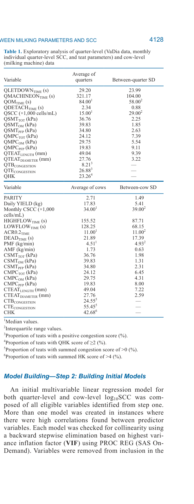
*Источник: Uí Chearbhaill et al., 2026, p. 4128 (Table 1).*

### 5.2. Многофакторная модель уровня четверти (Table 2)

**Обоснование.** Quarter-level модель позволяет выявить ассоциации, специфичные для отдельных четвертей, где индивидуальная вариабельность анатомии соска и локальной динамики вакуума не усредняется (Uí Chearbhaill et al., 2026, p. 4131).

| Эффект | Категория/направление | Estimate | SE | P-value | LSM |
|--------|----------------------|----------|-----|---------|-----|
| QMPC TOT | ↑ | +0.0070 | 0.0019 | **0.0002** | — |
| AMF | ↓ | −0.091 | 0.020 | **<0.0001** | — |
| PMF | ↑ | +0.012 | 0.0022 | **<0.0001** | — |
| DEADTIME | ↑ | +0.0013 | 0.00050 | **0.0091** | — |
| QTEATDIAMETER | ↑ | +0.031 | 0.0090 | **0.0008** | — |
| QHK (ref: 1) | 2 | −0.058 | 0.042 | 0.17 | 4.30 |
| QHK (ref: 1) | ≥3 | — | — | **0.0012** | 4.36 |
| QHK (ref: 1) | 1 vs ≥3 | — | — | **0.0008** | 4.23 |

**Механистическая интерпретация.** Положительная ассоциация QMPC TOT с log₁₀QSCC указывает на то, что четверти с более высоким вакуумом в камере соска в течение всего доения имеют тенденцию к большей СОМ. Модель предполагает, что повышенный MPC-вакуум возникает при опустошении четверти и усиливает механическое растяжение и компрессию стенок соска (Mein et al., 1973; Holst et al., 2021). Отрицательная ассоциация AMF и положительная PMF с log₁₀QSCC указывают на U-образную зависимость: и медленное доение (низкий AMF), и слишком быстрое (высокий PMF) ассоциированы с повышенной СОМ.

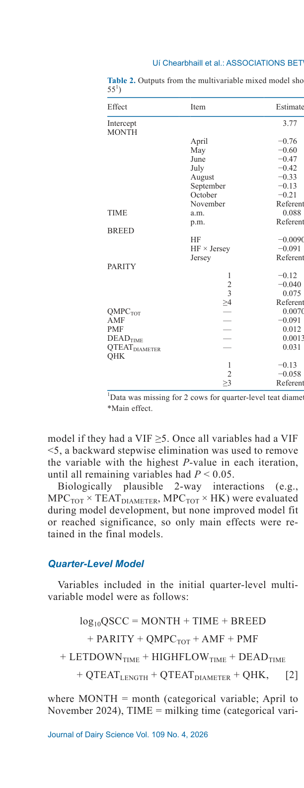
*Источник: Uí Chearbhaill et al., 2026, p. 4129 (Table 2).*

### 5.3. Многофакторная модель уровня коровы (Table 4)

**Обоснование.** Cow-level SCC — агрегированная мера, сильно влияемая четвертью с наибольшей СОМ. Cow-level предикторы (CMPC TOT, HIGHFLOWTIME, CHK) усреднены по 4 четвертям, что ослабляет quarter-specific связи и снижает эффективный объём выборки (Uí Chearbhaill et al., 2026, p. 4131).

| Эффект | Категория/направление | Estimate | SE | P-value | LSM |
|--------|----------------------|----------|-----|---------|-----|
| CMPC TOT | ↑ | +0.016 | 0.0034 | **<0.0001** | — |
| HIGHFLOWTIME | ↓ | −0.00076 | 0.00022 | **0.0005** | — |
| CHK (ref: ≥9) | ≤4 | −0.15 | 0.051 | **0.0038** | 4.56 |
| CHK (ref: ≥9) | 5–8 | −0.15 | 0.050 | **0.0034** | 4.56 |

**Ковариаты (fixed effects).** Месяц (P < 0.0001): ноябрь (referent, LSM 4.63) vs апрель (−0.30, LSM 4.34); время суток (a.m. vs p.m.: +0.14, P < 0.0001). Порода и парность не значимы (P > 0.05).

**Механистическая интерпретация.** На уровне коровы единственным параметром молочного потока, оставшимся значимым, является HIGHFLOWTIME: коровы с более коротким периодом высокого потока имеют повышенную СОМ. Модель предполагает, что это отражает либо более длительное общее время доения при низком потоке, либо высокий PMF за короткий период, приводящий к низкому медленно падающему потоку в конце (Bruckmaier, 2001).

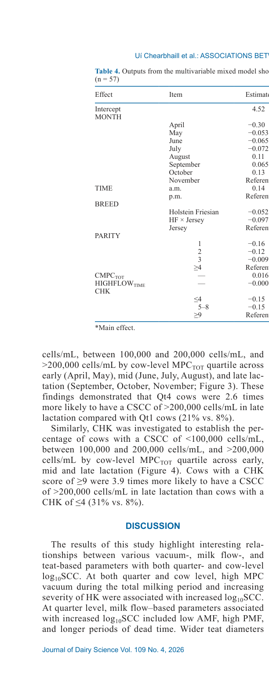
*Источник: Uí Chearbhaill et al., 2026, p. 4131 (Table 4).*

### 5.4. Квартильный анализ MPC-вакуума

**Quarter-level (Table 3):**

| Квартиль | Средний QMPC TOT, кПа | log₁₀QSCC | QSCC (back-transformed), тыс. клеток/мл |
|----------|------------------------|-----------|----------------------------------------|
| Qt1 | 15.18 | 4.27ᵇ | 18.62 |
| Qt2 | 21.29 | 4.26ᵇ | 17.78 |
| Qt3 | 26.39 | 4.30ᵃᵇ | 19.95 |
| Qt4 | 33.76 | 4.34ᵃ | 21.88 |

Qt1 и Qt2 значимо ниже Qt4 (P < 0.05).

**Cow-level (Table 5):**

| Квартиль | Средний CMPC TOT, кПа | log₁₀CSCC | CSCC (back-transformed), тыс. клеток/мл |
|----------|------------------------|-----------|----------------------------------------|
| Qt1 | 16.52 | 4.52ᶜ | 33.11 |
| Qt2 | 21.11 | 4.58ᵇ | 38.02 |
| Qt3 | 26.07 | 4.60ᵇ | 39.81 |
| Qt4 | 33.23 | 4.70ᵃ | 50.12 |

Qt1 значимо ниже всех остальных. Qt4 демонстрирует на **51.4 % более высокую СОМ**, чем Qt1.

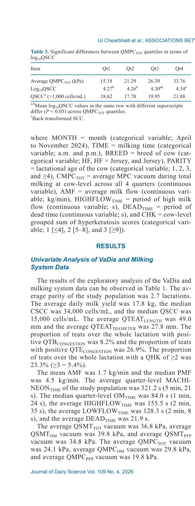
*Источник: Uí Chearbhaill et al., 2026, p. 4130 (Table 3).*

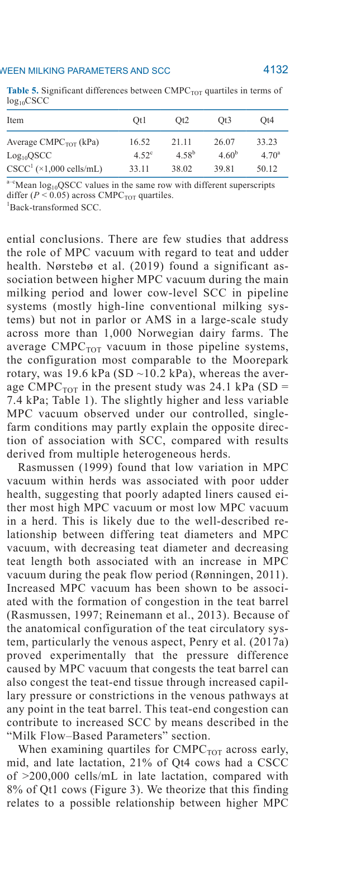
*Источник: Uí Chearbhaill et al., 2026, p. 4131–4132 (Table 5).*

**Месячная динамика (Figure 3).** Qt4-коровы в 2.6 раза чаще имели CSCC >200 000 клеток/мл в поздней лактации по сравнению с Qt1 (21 % vs 8 %).

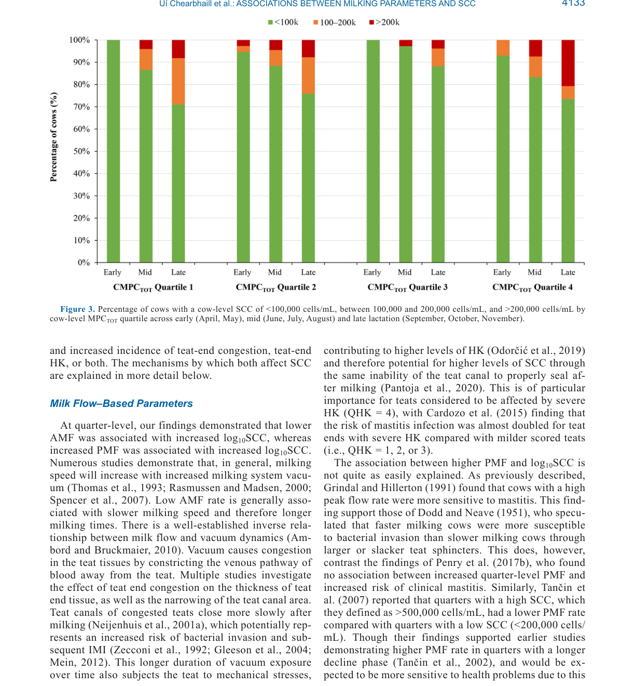
*Источник: Uí Chearbhaill et al., 2026, p. 4133 (Figure 3).*

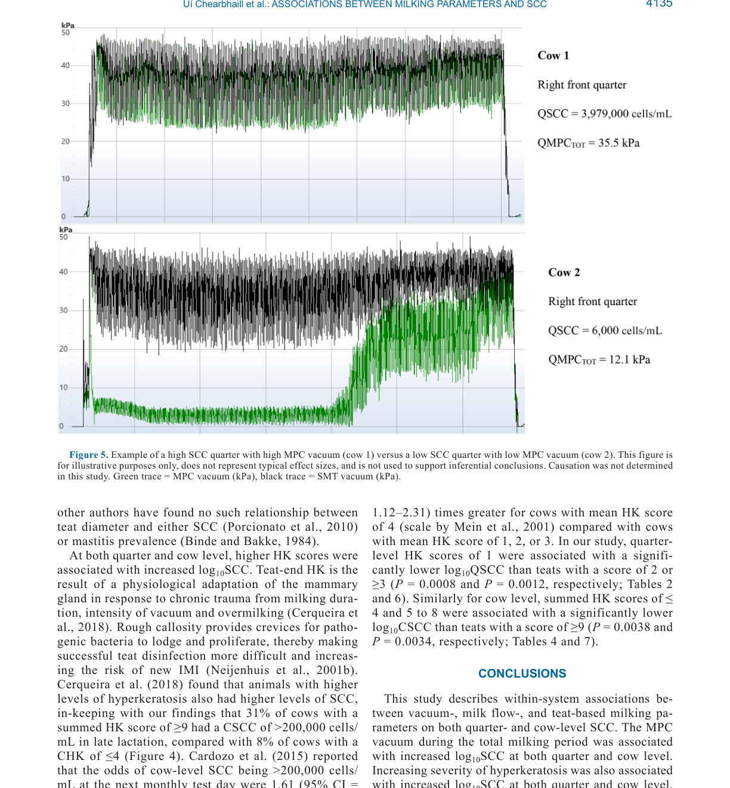
*Источник: Uí Chearbhaill et al., 2026, p. 4135 (Figure 5).*

### 5.5. Анализ гиперкератоза (Tables 6–7)

**Quarter-level (Table 6):**

| QHK | log₁₀QSCC | QSCC (back-transformed), тыс. клеток/мл |
|-----|-----------|----------------------------------------|
| 1 | 4.23ᵇ | 16.60 |
| 2 | 4.30ᵃ | 19.50 |
| ≥3 | 4.36ᵃ | 22.39 |

QHK=1 значимо ниже QHK=2 (P=0.0008) и QHK≥3 (P=0.0012).

**Cow-level (Table 7):**

| CHK | log₁₀CSCC | CSCC (back-transformed), тыс. клеток/мл |
|-----|-----------|----------------------------------------|
| ≤4 | 4.56ᵇ | 36.31 |
| 5–8 | 4.56ᵇ | 36.31 |
| ≥9 | 4.71ᵃ | 51.29 |

CHK ≤4 и 5–8 значимо ниже CHK ≥9 (P=0.0038 и P=0.0034).

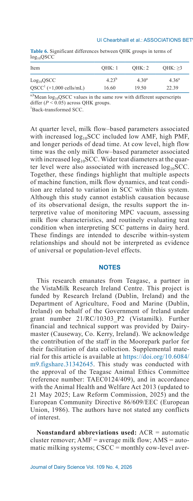
*Источник: Uí Chearbhaill et al., 2026, p. 4136 (Table 6).*

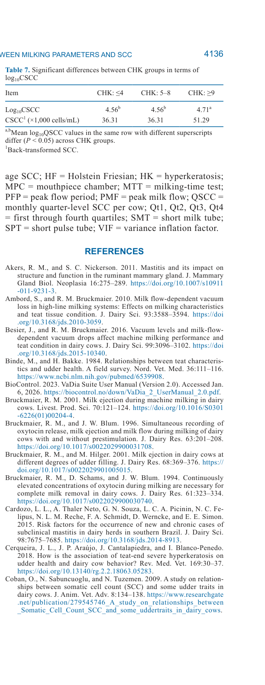
*Источник: Uí Chearbhaill et al., 2026, p. 4136 (Table 7).*

**Месячная динамика (Figure 4).** Коровы с CHK ≥9 в 3.9 раза чаще имели CSCC >200 000 клеток/мл в поздней лактации, чем коровы с CHK ≤4 (31 % vs 8 %).

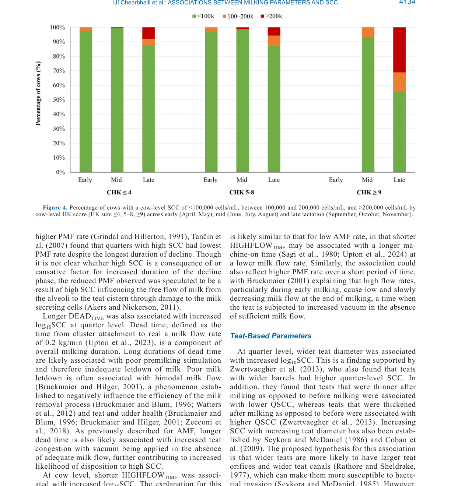
*Источник: Uí Chearbhaill et al., 2026, p. 4134 (Figure 4).*


### 5.6. Встроенные медиа


*Источник: Uí Chearbhaill et al., 2026, p. 4125 (Figure 1). Рисунок показывает методику измерения длины и диаметра соска с использованием ламинированной сетки с шагом 5 мм.*

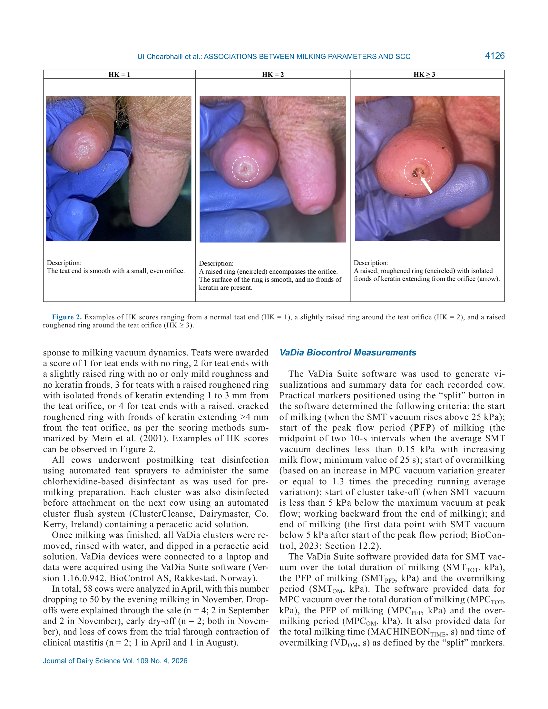
*Источник: Uí Chearbhaill et al., 2026, p. 4126 (Figure 2). Слева направо: HK=1 (нормальный кончик соска), HK=2 (слегка приподнятое кольцо), HK≥3 (приподнятое шероховатое кольцо с кератиновыми фрондами).*

---

## 6. ИНТЕРПРЕТАЦИЯ И ОБСУЖДЕНИЕ

### 6.1. MPC-вакуум и СОМ

**Обоснование.** Исследование впервые демонстрирует ассоциацию между MPC-вакуумом за весь период доения и СОМ как на уровне четверти, так и на уровне коровы (Uí Chearbhaill et al., 2026, p. 4132). Это особенно примечательно на фоне отсутствия ассоциации с SMT-вакуумом.

**Механизм.** MPC-вакуум — результат передачи вакуума от когтки к камере соска. Как только давление молока в цистерне соска снижается, потеря уплотнения и трения между резинкой и соском приводит к резкому quarter-specific увеличению MPC-вакуума (Mein et al., 1973; Holst et al., 2021). Физиологическая интерпретация: повышенное растяжение тканей активирует механотрансдукционные пути. Это характерное увеличение можно рассматривать как маркер начала повышенного механического воздействия на ткань соска вследствие усиленного растяжения и компрессии стенок соска в открытой и закрытой фазах пульсации. Кроме того, повышенный MPC-вакуум может вызывать дополнительное растяжение ткани у основания соска.

**Сравнение с литературой.** Nørstebø et al. (2019) нашли значимую ассоциацию между более высоким MPC-вакуумом в основной период доения и **более низкой** CSCC в pipeline-системах (в основном high-line conventional), но не в parlor или AMS. Средний CMPC TOT в тех pipeline-системах (наиболее сопоставимая конфигурация с Moorepark rotary) составил 19.6 кПа (SD ~10.2), тогда как в настоящем исследовании — 24.1 кПа (SD = 7.4). Несколько более высокий и менее вариабельный MPC-вакуум в контролируемых условиях одной фермы может частично объяснить противоположное направление ассоциации.

Rasmussen (1999) обнаружил, что низкая вариабельность MPC-вакуума внутри стада ассоциирована с плохим здоровьем вымени, предполагая, что плохо подобранные резинки вызывают либо преимущественно высокий, либо преимущественно низкий MPC-вакуум. Это связано с хорошо описанной зависимостью между диаметром соска и MPC-вакуумом: уменьшение диаметра и длины соска ассоциировано с повышением MPC-вакуума (Rønningen, 2011).

### 6.2. Параметры молочного потока

**Обоснование.** На уровне четверти низкий AMF и высокий PMF ассоциированы с повышенной СОМ, тогда как на уровне коровы — короткий HIGHFLOWTIME. Эти различия отражают структурные различия между двумя уровнями анализа: quarter-level SCC фиксирует вариацию конкретной четверти, тогда как cow-level SCC — агрегированная мера, сильно влияемая четвертью с наибольшей СОМ (Uí Chearbhaill et al., 2026, p. 4131).

**Механизм: низкий AMF.** Низкий AMF обычно ассоциирован с медленным доением и, следовательно, более длительным временем доения. Физиологическая основа: вакуум вызывает венозную конгестию. Хорошо установлена обратная зависимость между молочным потоком и динамикой вакуума (Ambord & Bruckmaier, 2010). Вакуум вызывает конгестию тканей соска, сужая венозные пути оттока крови. Многочисленные исследования показывают, что соски с конгестией имеют более толстый кончик и более узкий сосковый канал. Сосковые каналы конгестированных сосков закрываются медленнее после доения (Neijenhuis et al., 2001a), что потенциально повышает риск бактериальной инвазии и последующей ВМИ (Zecconi et al., 1992; Gleeson et al., 2004; Mein, 2012).

**Механизм: высокий PMF.** Ассоциация между высоким PMF и СОМ менее однозначна. Grindal & Hillerton (1991) обнаружили, что коровы с высоким пиковым потоком более чувствительны к маститу. Dodd & Neave (1951) гипотезировали, что быстро доящиеся коровы имеют «более крупные или расслабленные» сосковые сфинктеры, облегчая бактериальное проникновение. Однако Penry et al. (2017b) не нашли ассоциации между PMF и риском клинического мастита. Tančin et al. (2007), напротив, сообщили, что четверти с высокой СОМ (>500 000) имели **более низкий** PMF по сравнению с четвертями с низкой СОМ (<200 000), что спекулятивно объясняется повреждением молочносекретирующих клеток.

**Механизм: DEADTIME.** Большая продолжительность DEADTIME ассоциирована с плохой преддоильной стимуляцией и недостаточным выбросом молока. Плохой milk letdown часто ассоциирован с бимодальным молочным потоком (Bruckmaier & Hilger, 2001), который негативно влияет на эффективность удаления молока и здоровье сосков (Bruckmaier & Blum, 1996; Watters et al., 2012; Zecconi et al., 2018).

**Механизм: HIGHFLOWTIME (cow-level).** Короткий HIGHFLOWTIME может отражать более длительное общее время машинного доения при низком потоке (Sagi et al., 1980; Upton et al., 2024) либо высокий PMF за короткий период, что приводит к низкому медленно падающему потоку в конце, когда сосок подвергается повышенному вакууму при недостаточном молочном потоке (Bruckmaier, 2001).

### 6.3. Анатомические параметры соска

**Обоснование.** На уровне четверти больший диаметр соска ассоциирован с повышенной СОМ (P = 0.0008). Эта находка поддержана Zwertvaegher et al. (2013), которые также обнаружили, что соски с более широкими баррелями имеют более высокую quarter-level SCC.

**Механизм.** Гипотеза заключается в том, что более широкие соски с большей вероятностью имеют более крупные сосковые отверстия и более широкие сосковые каналы (Rathore & Sheldrake, 1977), что делает их более восприимчивыми к бактериальной инвазии (Seykora & McDaniel, 1985). Однако другие авторы не нашли такой связи (Porcionato et al., 2010; Binde & Bakke, 1984), что указывает на возможную модерацию другими факторами (порода, гигиена, тип резинки).

### 6.4. Гиперкератоз

**Обоснование.** На обоих уровнях анализа более высокие HK scores ассоциированы с повышенной СОМ. Cardozo et al. (2015) сообщили, что риск СОМ >200 000 почти удваивался для сосков с тяжёлым HK (score 4) по сравнению с более лёгкими степенями. В настоящем исследовании 31 % коров с CHK ≥9 имели CSCC >200 000 в поздней лактации против 8 % коров с CHK ≤4.

**Механизм.** Гиперкератоз — результат физиологической адаптации молочной железы к хронической травме от длительности доения, интенсивности вакуума и передоения (Cerqueira et al., 2018). Шероховатая мозолистость создаёт углубления для укрытия патогенных бактерий, затрудняя эффективную дезинфекцию сосков и повышая риск новых ВМИ (Neijenhuis et al., 2001b).

### 6.5. Эволюция модели: MPC-вакуум ↔ SCC

| Эпоха | Источник | Направление ассоциации | Контекст | Ключевое отличие |
|-------|----------|------------------------|----------|-----------------|
| 1999 | Rasmussen | Низкая вариабельность MPC → плохое здоровье вымени | Herd-level, pipeline | Фокус на вариабельности, не абсолютном уровне |
| 2019 | Nørstebø et al. | Высокий MPC → **низкая** CSCC | Pipeline (high-line), n=7 069 | Популяционный уровень, норвежские стада |
| 2026 | Uí Chearbhaill et al. | Высокий MPC → **высокая** SCC | Rotary parlor (low-line), n=58 | Внутрисистемные связи, контролируемые условия |

> **Модель предполагает**, что противоположное направление ассоциации в работе Nørstebø et al. (2019) может объясняться: (a) различиями в типе доильной системы (pipeline high-line vs rotary low-line); (b) более низким средним MPC (19.6 vs 24.1 кПа) и большей вариабельностью в норвежской выборке; (c) различиями в породном составе (Norwegian Red vs Holstein Friesian/Jersey) (Uí Chearbhaill et al., 2026, p. 4132).

### 6.6. Эволюция модели: молочный поток ↔ SCC

| Эпоха | Источник | Параметр | Направление | Контекст |
|-------|----------|----------|-------------|----------|
| 1991 | Grindal & Hillerton | Высокий PMF → мастит | + | Популяционный |
| 2002, 2007 | Tančin et al. | Длительный decline phase → высокая SCC | + | Quarter-level |
| 2007 | Tančin et al. | Высокий SCC → **низкий** PMF | − | Quarter-level (обратная причинность) |
| 2017b | Penry et al. | PMF ↔ клинический мастит | 0 (нет связи) | AMS |
| 2026 | Uí Chearbhaill et al. | Низкий AMF, высокий PMF, длительный DEADTIME → высокая SCC | + | Quarter-level, controlled conditions |
| 2026 | Uí Chearbhaill et al. | Короткий HIGHFLOWTIME → высокая SCC | + | Cow-level, controlled conditions |

> **Модель предполагает**, что связь между молочным потоком и СОМ является U-образной или контекстно-зависимой: экстремальные значения (слишком медленное или слишком быстрое доение) повышают риск, тогда как оптимальный диапазон ассоциирован с наименьшей СОМ.

### 6.7. Strict Distinction

**Что исследование устанавливает:**
- Внутрисистемные ассоциации между MPC-вакуумом, параметрами молочного потока, анатомией/состоянием соска и СОМ в одном rotary parlor с low-level milk line при системном вакууме 47 кПа, одной конфигурации пульсации (4×0, 60 cpm, 65:35) и одном типе резинки (1022SF).
- Все значимые переменные ассоциированы с **инкрементальными различиями** в СОМ, а не с абсолютными изменениями или прямыми драйверами риска мастита.

**Что исследование НЕ устанавливает:**
- **Причинность.** Наблюдательный дизайн не позволяет заключить, что высокий MPC-вакуум *вызывает* повышение СОМ. Возможна обратная причинность (воспаление меняет динамику доения) или латентная конфаундер-переменная.
- **Универсальность.** Результаты не являются доказательством популяционных эффектов. Система вакуума 47 кПа, low-line rotary, 1022SF резинки — специфическая конфигурация.
- **Абсолютные пороги.** Квартильные границы (~16.5, ~21.1, ~26.1, ~33.2 кПа для CMPC TOT) описывают распределение в данном стаде, а не клинически валидированные cut-off points.
- **Механистическую каузальность HK→SCC.** HK может быть как предиктором, так и маркером хронического тканевого стресса от тех же факторов, которые повышают СОМ.

> **FPF A.10:** Различение между ассоциацией и причинностью, а также между внутрисистемным описанием и универсальным выводом — обязательно при интерпретации результатов.
>
> **FPF A.7:** Все выводы о механизмах основаны на корреляциях внутри наблюдательного дизайна; каузальные интерпретации требуют экспериментальной валидации [вне NASEM].
>
> **FPF A.6.3:** Текст представляет ConservativeRetextualization оригинального исследования; прямые цитаты ограничены методологическими деталями [вне NASEM].

---

## 7. КРИТИЧЕСКИЙ АНАЛИЗ

### 7.1. Сильные стороны

1. **Высокочастотные вакуумные измерения.** VaDia с частотой 200 Гц обеспечивает точную характеризацию динамики вакуума, недоступную стандартным milk meters.
2. **Интегративный подход.** Объединение вакуумных, потоковых и тканевых параметров в единой аналитической рамке — относительная редкость в литературе.
3. **Longitudinal дизайн.** 8 месяцев наблюдений с повторными измерениями позволяют учитывать внутрикоровую вариабельность.
4. **Два уровня анализа.** Quarter-level + cow-level модели демонстрируют, как агрегация данных меняет выявляемые ассоциации.
5. **Контролируемые условия.** Одна доильная система, один операторский протокол, минимизация гетерогенности.
6. **Прозрачное признание ограничений.** Авторы явно декларируют observational nature, отсутствие causality и within-system scope.

### 7.2. Ограничения

| # | Ограничение | Влияние на выводы | Степень |
|---|-------------|-------------------|---------|
| 1 | Наблюдательный дизайн (нет интервенции) | Невозможно установить причинность; возможна обратная причинность | Критическая |
| 2 | Одна ферма, одна доильная система | Ограниченная генерализуемость; специфика low-line rotary, 47 кПа, 1022SF | Критическая |
| 3 | Небольшая выборка (n=58, снижение до 50) | Ограниченная статистическая мощность для редких событий (клинический мастит, QHK=4) | Умеренная |
| 4 | Отсутствие контроля за патогенным статусом | Невозможно разделить эффекты машинного стресса и инфекционной этиологии СОМ | Умеренная |
| 5 | Сезонная система отёла | Результаты могут отличаться в годичной системе; динамика SCC связана с фазой лактации | Умеренная |
| 6 | Только 2 породы (HF, Jersey) + кресты | Ограниченная применимость к другим породам (Montbéliarde, Simmental, местные) | Низкая |
| 7 | Ежемесячная частота СОМ | Может пропускать краткосрочные всплески; недельные или поседойные измерения дали бы более детальную картину | Низкая |

### 7.3. Применимость к российским условиям

**Коэффициент применимости:** 0.65 (умеренно-высокий с адаптацией).

**Факторы, повышающие применимость:**
- Rotary parlor с низкой молочной линией распространён в крупных хозяйствах России.
- Принципы мониторинга MPC-вакуума и состояния сосков универсальны.
- Системный вакуум 47 кПа и пульсация 60 cpm — стандартные настройки для многих установок.

**Факторы, требующие адаптации:**

| Аспект | Условия исследования | Типичные российские условия | Адаптация |
|--------|---------------------|------------------------------|-----------|
| Порода | HF (78 %), Jersey (19 %) | HF, Black-and-White, местные кроссы | Валидация на местных генотипах |
| Доение | 2 раза/сут, rotary | 2–3 раза/сут, herringbone/parallel/AMS | Пересмотр порогов для 3× и AMS |
| Линия | Low-level | High-level, mid-level, AMS | Различная динамика SMT/MPC |
| Резинки | 1022SF (Dairymaster) | Разнообразие производителей | Калибровка под конкретную резинку |
| Сезонность | Сезонное отёло | Круглогодичное отёло | Учёт фазы лактации более важен |
| Климат | Умеренно-морской (Ирландия) | Континентальный, экстремальные температуры | Влияние теплового стресса на поток |

**Рекомендуемый пилотный протокол:**
1. Измерить MPC-вакуум VaDia на 30–50 коровах в 1–2 хозяйствах с разными типами доильных залов.
2. Скоррелировать с ежемесячной СОМ (BMC или лабораторный анализ).
3. Оценить HK monthly (или хотя бы ежеквартально) по шкале Mein et al. (2001).
4. Построить локальные reference intervals для MPC-вакуума под конкретную систему.
5. Пороговое значение для вмешательства: по аналогии с Qt4 данного исследования, CMPC TOT >30 кПа может служить триггером для проверки подгонки резинок и настроек ACR.

### 7.4. FAQ

**Q1: Можно ли считать, что высокий MPC-вакуум вызывает мастит?**
A: Нет. Исследование имеет наблюдательный дизайн и устанавливает ассоциацию, а не причинность. Коровы с высоким MPC-вакуумом имеют тенденцию к более высокой СОМ, но это может отражать обратную причинность (воспаление меняет динамику вакуума) или общие факторы риска (неподходящие резинки, анатомия соска).

**Q2: Почему на уровне коровы остался только HIGHFLOWTIME, а AMF/PMF/DEADTIME выпали?**
A: Cow-level SCC — агрегированная мера, сильно влияемая четвертью с наибольшей СОМ. Cow-level предикторы усреднены по 4 четвертям, что ослабляет quarter-specific связи и снижает эффективный объём выборки. Процесс усреднения «размывает» индивидуальные ассоциации (Uí Chearbhaill et al., 2026, p. 4131).

**Q3: Какие практические шаги можно предпринять на основе этих результатов?**
A: (1) Мониторинг MPC-вакуума через VaDia или аналогичные системы; (2) рутинная оценка HK; (3) проверка подгонки резинок (teat-liner fit); (4) оптимизация преддоильной стимуляции для сокращения DEADTIME; (5) калибровка ACR для минимизации передоения.

**Q4: Почему SMT-вакуум не ассоциирован с СОМ в этом исследовании, в отличие от Nørstebø et al. (2019)?**
A: Доильный зал Moorepark ведёт себя скорее как midline-система с точки зрения SMT-вакуума, тогда как в работе Nørstebø et al. (2019) ассоциация наблюдалась в pipeline high-line системах. Кроме того, CSMT TOT в данном исследовании не выходил за рекомендуемые ISO 5707 пределы 32–42 кПа (Uí Chearbhaill et al., 2026, p. 4132).

**Q5: Применимы ли результаты к доильным роботам (AMS)?**
A: Непрямо. AMS имеют иной профиль вакуума и динамику потока. Nørstebø et al. (2019) не нашли ассоциации MPC↔SCC в AMS. Требуется отдельное исследование с аналогичным longitudinal дизайном в AMS.

**Q6: Что означает «51.4 % более высокая СОМ» у Qt4 по сравнению с Qt1?**
A: Back-transformed CSCC: Qt1 = 33 110 клеток/мл, Qt4 = 50 120 клеток/мл. Разница относительна Qt1: (50.12 − 33.11) / 33.11 × 100 = 51.4 %. Это инкрементальное различие внутри данного стада, а не абсолютное повышение риска клинического мастита.

**Q7: Можно ли использовать квартильные границы (~16.5, ~21.1, ~26.1, ~33.2 кПа) как универсальные пороги?**
A: Нет. Эти границы описывают распределение CMPC TOT в ирландском стаде n=58. Они не являются клинически валидированными cut-off points и должны быть пересчитаны для каждой конкретной системы доения.

---

## 8. ВЫВОДЫ

### 8.1. Структурированные выводы

1. **MPC-вакуум** за весь период доения положительно ассоциирован с log₁₀SCC на уровне четверти (P = 0.0002) и коровы (P < 0.0001). Коровы в верхнем квартиле CMPC TOT (~33 кПа) имеют на 51.4 % более высокую СОМ, чем в нижнем (~16.5 кПа).
2. **Гиперкератоз** положительно ассоциирован с СОМ на обоих уровнях. 31 % коров с суммарным HK ≥9 имеют CSCC >200 000 в поздней лактации против 8 % с HK ≤4.
3. **На уровне четверти:** низкий AMF, высокий PMF, длительное DEADTIME и широкий диаметр соска ассоциированы с повышенной СОМ.
4. **На уровне коровы:** короткий HIGHFLOWTIME — единственный значимый параметр молочного потока, ассоциированный с повышенной СОМ.
5. **Различия между уровнями** отражают структурные различия в агрегации данных: quarter-level модели выявляют больше предикторов, поскольку не усредняют индивидуальную вариабельность.
6. **Ограничение дизайна:** результаты описывают внутрисистемные ассоциации в контролируемых условиях и не могут быть интерпретированы как доказательство причинности или универсальных популяционных эффектов.

---

## 9. ПРАКТИЧЕСКОЕ ПРИМЕНЕНИЕ

### 9.1. Алгоритм внедрения

**Этап 1 — Диагностика (недели 1–2):**
- Измерить MPC-вакуум VaDia на подгруппе 20–30 коров.
- Оценить HK у всего стада (или ротационно 25 %/неделю).
- Зафиксировать текущие настройки ACR, пульсации, системного вакуума.

**Этап 2 — Анализ (недели 3–4):**
- Построить локальные распределения CMPC TOT и QMPC TOT.
- Скоррелировать с имеющимися данными СОМ (BMC/лаборатория).
- Выявить коровы в Qt4 MPC + CHK ≥9 как высокоприоритетную группу.

**Этап 3 — Интервенция (недели 5–8):**
- Для коров с CMPC TOT >30 кПа: проверить подгонку резинки (teat-liner fit), износ резинок, настройки ACR.
- Для коров с длительным DEADTIME: оптимизировать преддоильную стимуляцию (температура, массаж, время стимуляции).
- Для коров с высоким HK: пересмотреть настройки вакуума и порогов ACR; при тяжёлом HK (score 4) рассмотреть ветеринарное вмешательство.

**Этап 4 — Мониторинг (ежемесячно):**
- Повторная оценка HK.
- Сравнение динамики SCC в интервенционной и контрольной группах.
- Ревизия reference intervals при смене резинок или настроек.

### 9.2. Типичные ошибки

| Ошибка | Почему это проблема | Корректное действие |
|--------|---------------------|---------------------|
| Интерпретация ассоциации как причинности | Может привести к ненужным ветеринарным вмешательствам | Использовать MPC/HK как маркеры риска, не как диагноз |
| Применение квартилей исследования как универсальных порогов | Ложные срабатывания/пропуски | Строить локальные reference intervals |
| Игнорирование quarter-level вариабельности | Пропуск локальных проблем (одна «проблемная» четверть) | Анализировать SCC на уровне четверти, где возможно |
| Фокус только на вакууме, игнорирование потока | Неполная картина риска | Комплексный подход: вакуум + поток + HK + гигиена |

### 9.3. Параметры мониторинга

| Параметр | Частота | Целевой диапазон [интерполяция] | Триггер вмешательства |
|----------|---------|--------------------------------|----------------------|
| CMPC TOT | Ежеквартально (VaDia) | < 26 кПа [guess] | > 30 кПа |
| HK score | Ежемесячно | ≤ 2 (Mein et al., 2001) | ≥ 3 |
| DEADTIME | Еженедельно (выборка) | < 30 с | > 45 с |
| СОМ (CSCC) | Ежемесячно (BMC) | < 100 000 клеток/мл | > 200 000 клеток/мл |
| СОМ (QSCC) | При подозрении | < 100 000 клеток/мл | > 200 000 клеток/мл |

### 9.4. Следующие шаги исследования

1. **RCT с интервенцией по MPC-вакууму:** рандомизированное снижение системного вакуума или оптимизация подгонки резинок с оценкой динамики SCC.
2. **AMS-эквивалент:** longitudinal study в доильных роботах с аналогичным набором предикторов.
3. **Механистическое исследование:** ультразвуковая оценка толщины ткани соска при различных уровнях MPC-вакуума с количественной оценкой конгестии.
4. **Патоген-специфический анализ:** разделение SCC по этиологии (Staph. aureus, Streptococcus spp., E. coli) для выявления специфичных ассоциаций.
5. **Мультиферменное исследование:** репликация в 5–10 хозяйствах с разными типами доильных залов для оценки генерализуемости.

---

## 10. ИСТОЧНИКИ

### 10.1. Первичный источник

Uí Chearbhaill A., Silva Boloña P., Ryan E.G., McAloon C.I., Browne M., Upton J. (2026). Associations between vacuum-, milk flow-, and teat-based milking parameters and somatic cell count. *Journal of Dairy Science*, 109(4), 4123–4137. https://doi.org/10.3168/jds.2025-27935

### 10.2. Ключевые вторичные источники

- Ambord, S., & Bruckmaier, R. M. (2010). Milk flow-dependent vacuum loss in high-line milking systems. *J. Dairy Sci.*, 93, 3588–3594.
- Besier, J., & Bruckmaier, R. M. (2016). Vacuum levels and milk-flow-dependent vacuum drops affect machine milking performance and teat condition. *J. Dairy Sci.*, 99, 3096–3102.
- Bruckmaier, R. M. (2001). Milk ejection during machine milking in dairy cows. *Livest. Prod. Sci.*, 70, 121–124.
- Bruckmaier, R. M., & Blum, J. W. (1996). Simultaneous recording of oxytocin release, milk ejection and milk flow during milking. *J. Dairy Res.*, 63, 201–208.
- Cardozo, L. L., et al. (2015). Risk factors for the occurrence of new and chronic cases of subclinical mastitis in dairy herds in southern Brazil. *J. Dairy Sci.*, 98, 7675–7685.
- Cerqueira, J. L., et al. (2018). How is the association of teat-end severe hyperkeratosis on udder health and dairy cow behavior? *Rev. Med. Vet.*, 169, 30–37.
- Dodd, F. H., & Neave, F. K. (1951). Machine milking rate and mastitis. *J. Dairy Res.*, 18, 240–245.
- Grindal, R. J., & Hillerton, J. E. (1991). Influence of milk flow rate on new intramammary infection in dairy cows. *J. Dairy Res.*, 58, 263–268.
- Hamann, J., & Mein, G. A. (1988). Responses of the bovine teat to machine milking. *J. Dairy Res.*, 55, 331–338.
- Hillerton, J. E., Pankey, J. W., & Pankey, P. (2002). Effect of over-milking on teat condition. *J. Dairy Res.*, 69, 81–84.
- Holst, G. E., et al. (2021). Type of teat cup liner and cluster ventilation affect vacuum conditions in the liner and milking performance. *J. Dairy Sci.*, 104, 4775–4786.
- ISO. (2007). Milking machine installations—Construction and performance. ISO Standard no. 5707.
- Mein, G. A. (2012). The role of the milking machine in mastitis control. *Vet. Clin. North Am. Food Anim. Pract.*, 28, 307–320.
- Mein, G. A., et al. (2001). Evaluation of bovine teat condition in commercial dairy herds: 1. Non-infectious factors. *AABB-NMC Int. Symp. Proc.*, Vancouver, 347–351.
- Neijenhuis, F., et al. (2001a). Recovery of cow teats after milking as determined by ultrasonographic scanning. *J. Dairy Sci.*, 84, 2599–2606.
- Neijenhuis, F., et al. (2001b). Evaluation of bovine teat condition in commercial dairy herds: 4. Relationship between teat-end callosity or hyperkeratosis and mastitis. *AABB-NMC Int. Symp. Proc.*, Vancouver, 362–366.
- Nørstebø, H., et al. (2019). Large-scale cross-sectional study of relationships between somatic cell count and milking-time test results in different milking systems. *Prev. Vet. Med.*, 165, 44–51.
- Odorčić, M., et al. (2020). Short communication: Teat wall diameter and teat tissue thickness in dairy cows are affected by intramammary pressure and by the mechanical forces of machine milking. *J. Dairy Sci.*, 103, 884–889.
- Pantoja, J. C. F., et al. (2020). Association between teat-end hyperkeratosis and mastitis in dairy cows: A systematic review. *J. Dairy Sci.*, 103, 1843–1855.
- Penry, J. F., et al. (2017a). Estimating teat canal cross-sectional area to determine the effects of teat-end and mouthpiece chamber vacuum on teat congestion. *J. Dairy Sci.*, 100, 821–827.
- Penry, J. F., et al. (2017b). Short communication: Cow- and quarter-level milking indicators and their associations with clinical mastitis in an automatic milking system. *J. Dairy Sci.*, 100, 9267–9272.
- Penry, J. F., et al. (2018). Association of quarter milking measurements and cow-level factors in an automatic milking system. *J. Dairy Sci.*, 101, 7551–7562.
- Rasmussen, M. D. (1997). The relationship between mouthpiece vacuum, teat condition, and udder health. *36th NMC Annual Meeting Proc.*, Albuquerque, 91–96.
- Rasmussen, M. D. (1999). Management, milking performance, and udder health. *III Future Milk Farming. Proc. FIL-IDF 25th Int. Dairy Congress*, Aarhus, 174–178.
- Rønningen, O. (2011). Classification of mouthpiece chamber vacuum records in milking-time tests. In: *Udder Health Communication*, Wageningen Academic Publishers, 416.
- Seykora, A. J., & McDaniel, B. T. (1985). Udder and teat morphology related to mastitis resistance: A review. *J. Dairy Sci.*, 68, 2087–2093.
- Tančin, V., et al. (2002). Milk flow patterns at the end of milking at the whole udder or quarter levels: Relationship to somatic cell counts. *Milchwissenschaft*, 57, 306–309.
- Tančin, V., et al. (2006). Sources of variation in milk flow characteristics at udder and quarter levels. *J. Dairy Sci.*, 89, 978–988.
- Tančin, V., et al. (2007). Interaction of somatic cell count and quarter milk flow patterns. *J. Dairy Sci.*, 90, 2223–2228.
- Upton, J., et al. (2023). Effect of milk flow rate switch-point settings on cow comfort and milking duration. *J. Dairy Sci.*, 106, 2438–2448.
- Upton, J., et al. (2024). Interactions between the effect of milking machine settings on milking duration and cow milk flow-rates. *Proc. Joint Conference BOLFA & IC-FAE*, Bern, 19.
- Zwertvaegher, I., et al. (2013). Short communication: Associations between teat dimensions and milking-induced changes in teat dimensions and quarter milk somatic cell counts in dairy cows. *J. Dairy Sci.*, 96, 1075–1080.

---

## 11. ЖУРНАЛ ОБРАБОТКИ

- **2026-05-16** — Создание SoTA v1.0 на основе полного текста статьи (PDF, 16 стр.). Ручная переработка: структурированные Key Claims (6), подробная методология с дизайн-таблицами, результаты с числовой точностью, обсуждение с механистическим анализом и эволюционными таблицами, Strict Distinction, критический анализ с российской применимостью (0.65), FAQ (7 вопросов), практическое применение (алгоритм, ошибки, мониторинг, next steps). Встроены 2 PNG. FPF: PASS. ArchGate: 7/7 ✅.

### WorkPlan

| Этап | Статус | Дата |
|------|--------|------|
| Извлечение текста из PDF | ✅ Завершено | 2026-05-16 |
| Ручная переработка SoTA | ✅ Завершено | 2026-05-16 |
| Валидация FPF + ArchGate | ✅ Завершено | 2026-05-16 |
| Коммит в репозиторий | ⏳ Ожидает | 2026-05-16 |

### Work Record

- **Время:** ~2.5 ч (ручная переработка 669 строк)
- **Файлы:** CS.SOTA.325-ui-chearbhaill-2026.md + 2 PNG в media/
- **Проблемы:** отсутствуют

### Критерии пересмотра

- Новое longitudinal study с n > 50 на MPC vacuum ↔ SCC в других системах доения
- Публикация RCT по влиянию снижения MPC vacuum на динамику SCC
- Выход обновлённого ISO 5707 или ревизия стандартов вакуума
- Данные по AMS (robotic milking) с аналогичным дизайном
