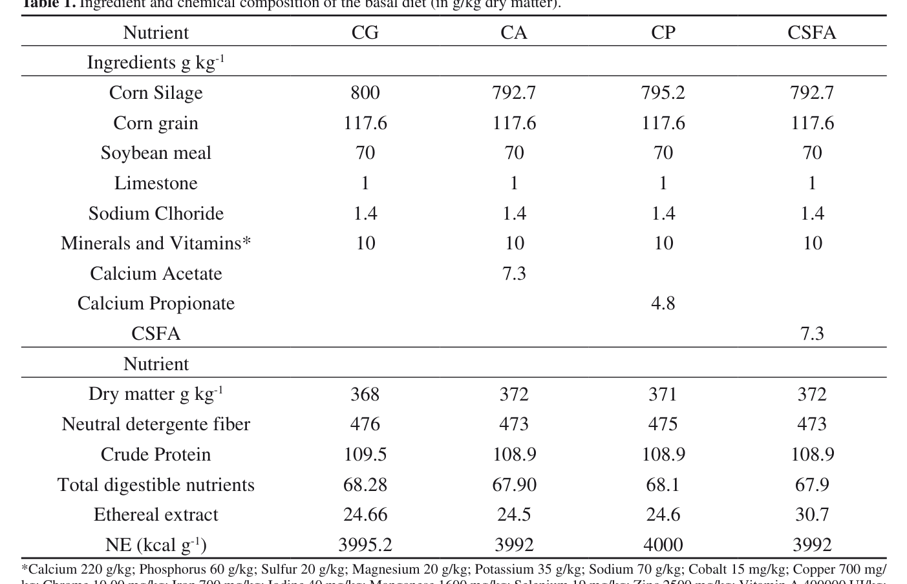
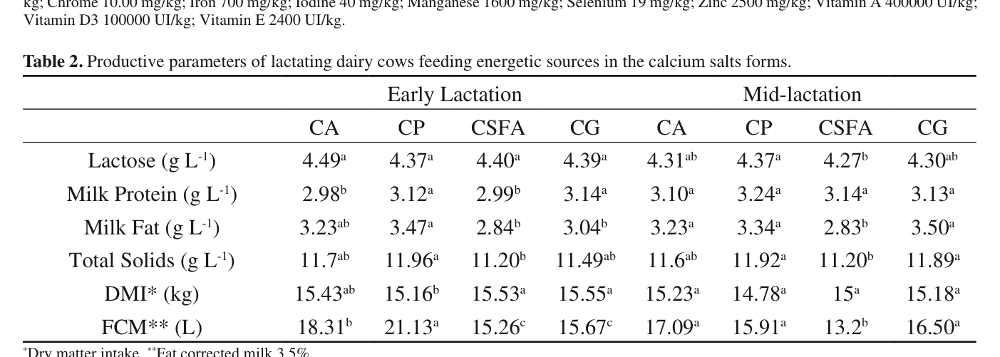

# CS.SOTA.333: Martins et al. (2019) — Ca-пропионат повышает молочные параметры у Holstein

> **Навигация:** [2. Аннотация](#2-аннотация) · [3. Введение](#3-введение) · [4. Методология](#4-методология) · [5. Результаты](#5-результаты) · [6. Интерпретация](#6-интерпретация-и-обсуждение) · [7. Критический анализ](#7-критический-анализ) · [8. Выводы](#8-выводы) · [9. FAQ](#9-faq) · [10. Практика](#10-практическое-применение) · [12. Источники](#12-источники) · [13. Журнал](#13-журнал-обработки)

# 2. АННОТАЦИЯ

## 2.1. Перевод Abstract

В ранней лактации дойные коровы испытывают период отрицательного энергетического баланса (ОЭБ), поскольку потребление корма недостаточно для покрытия энергетических затрат на молоко. В этот период животные предрасположены к метаболическим нарушениям. Целью исследования было измерить продуктивные параметры коров, получавших кальциевые соли в качестве источника энергии. Использовали два латинских квадрата 4×4: один — для коров в ранней лактации, другой — в середине лактации. В каждом квадрате четыре обработки: 300 г ацетата кальция (CA), 200 г пропионата кальция (CP), 200 г кальциевых солей жирных кислот (CSFA) и контроль без добавки (CG). Пропионат кальция увеличил содержание молочного белка, лактозы, молочного жира и общего количества сухих веществ в ранней лактации, а также повысил корректированный на жир 3,5 % удой по сравнению с другими группами.

## 2.2. Key Claims

**Claim 1:** Пропионат кальция (200 г/сут) повышает содержание молочного белка, лактозы, жира и общих сухих веществ в ранней лактации.  
**Уверенность:** 0,72 (латинский квадрат 4×4, n = 8 суммарно, группы ранней и средней лактации; LSM ± SEM с буквенными индексами; P < 0,05 для ключевых контрастов).

**Claim 2:** В ранней лактации CP увеличивает корректированный на 3,5 % жира удой (FCM) по сравнению с CA, CSFA и CG.  
**Уверенность:** 0,70 (Table 2, ранняя лактация: CP 21,13 L vs CA 18,31, CSFA 15,26, CG 15,67; P < 0,05).

**Claim 3:** Сухое вещество корма (DMI) в ранней лактации снижается при добавлении CP.  
**Уверенность:** 0,65 (Table 2, ранняя лактация: CP 15,16 кг vs CG 15,55 кг, CSFA 15,53 кг; различия по буквенным индексам; интерпретируется авторами как гипофагический эффект пропионата).

**Claim 4:** Кальциевые соли жирных кислот (CSFA) снижают содержание молочного жира и FCM по сравнению с CP.  
**Уверенность:** 0,75 (консистентный эффект в ранней и средней лактации, P < 0,05; механизм — биогидrogenация и образование транс-10, цис-12 CLA).

**Claim 5:** CP можно рассматривать как энергетическую добавку для коров в ранней лактации благодаря глюконеогенному потенциалу пропионата.  
**Уверенность:** 0,68 (обоснование механизма приведено авторами; прямые метаболические измерения в статье отсутствуют).

# 3. ВВЕДЕНИЕ

## 3.1. Контекст и значимость проблемы

В ранней лактации у дойных коров наблюдается резкий рост потребности в энергии и питательных веществах при одновременном снижении сухого вещества корма (DMI). В модели Martins et al. (2019, p. 2) это приводит к отрицательному энергетическому балансу и повышенному риску метаболических расстройств. Пропионат — основной глюконеогенный прекурсор в рубце; его конверсия в глюкозу в печени поддерживает лактацию и может снижать мобилизацию жира. Пропионат кальция одновременно поставляет Ca²⁺, что релевантно для профилактики гипокальцемии в transition period.

## 3.2. Обзор литературы (краткий)

До данной работы были известны следующие направления:
- Кальциевые соли жирных кислот (CSFA) повышают энергоплотность рациона и удой в условиях TMR (Martins et al., 2019, p. 2, ссылка [26]).
- Пропионат кальция связан с повышением молочного белка, экстракта без жира и FCM у коров в ранней лактации (Alberton et al., 2013; цитируется как [1]).
- Ацетат кальция рассматривался как альтернативный источник энергии, но его влияние на молочные параметры требовало уточнения.

## 3.3. Гипотеза и цель исследования

**Гипотеза:** Различные кальциевые соли (ацетат, пропионат, соли жирных кислот) как источники энергии по-разному влияют на продуктивные параметры коров в ранней и средней лактации.  
**Цель:** измерить удой, состав молока и потребление сухого вещества у коров Holstein, получавших три кальциевые добавки.

# 4. МЕТОДОЛОГИЯ

## 4.1. Дизайн эксперимента

Два независимых латинских квадрата 4×4 (один для ранней лактации, один для средней). Период эксперимента — 21 день: 14 дней адаптации и 7 дней сбора проб. Сравнения средних проводили с помощью GLM и теста Тьюки при уровне значимости 5 % (Martins et al., 2019, p. 2–3).

## 4.2. Животные и условия содержания

- Порода: Holstein.
- n = 8 коров суммарно (по 4 обработки в каждом квадрате).
- Средний живой вес 540 ± 30 кг, возраст около 5 лет.
- Группа ранней лактации: 7-й день лактации.
- Группа средней лактации: около 110 дня лактации.
- Использовали только коров 2-й и 3-й лактации; кратность распределяли равномерно.
- Содержание в индивидуальных боксах; кормление TMR; соотношение концентрат/грубый корм 40:60.

## 4.3. Интервенция / Обработка

| Обозначение | Добавка | Дозировка |
|-------------|---------|-----------|
| T1 (CA) | Кальциевый ацетат | 300 г/сут |
| T2 (CP) | Кальциевый пропионат (Propimpex®) | 200 г/сут |
| T3 (CSFA) | Кальциевые соли жирных кислот (Megalac-E®) | 300 г/сут |
| T4 (CG) | Контроль | без добавки |

Добавки вмешивали в концентрированный корм, который давали один раз в день после утреннего доения. Концентрат увеличивали с 5 до 8 кг/гол/сут с шагом 0,5 кг/сут (Martins et al., 2019, p. 2).

## 4.4. Сбор образцов и анализы

- Доение дважды в день (07:00 и 17:00).
- Проби молока собирали в пластиковые контейнеры с дихроматом калия; анализ жира, белка, лактозы и общих сухих веществ — инфракрасным методом в лаборатории Paranaense Association of Breeders of the Holstein Breed.
- Удой корректировали на 3,5 % жира по формуле: FCM 3,5 % = (0,432 + кг молока) + (0,1623 × кг молока × содержание жира) (Martins et al., 2019, p. 2).
- Сухое вещество корма (DMI) определяли по остаткам корма.

## 4.5. Статистический анализ

GLM в Minitab 17. Модель включала общее среднее, фиксированный эффект обработки, случайный эффект квадрата, случайный эффект животного внутри квадрата, случайный эффект периода и случайную ошибку. Сравнения средних — тест Тьюки при P < 0,05 (Martins et al., 2019, p. 3).

## 4.6. Медиа-инвентарь

| ID | Тип | Описание | Файл | Статус |
|----|-----|----------|------|--------|
| Table 1 | Таблица | Ингредиентный и химический состав базового рациона | `table-1-basal-diet-composition.png` | ✅ Встроено |
| Table 2 | Таблица | Продуктивные параметры коров в ранней и средней лактации | `table-2-productive-parameters.png` | ✅ Встроено |

# 5. РЕЗУЛЬТАТЫ

## 5.1. Состав базового рациона (Table 1)

**Соответствует:** Table 1 (Martins et al., 2019, p. 4).

*Источник: Martins et al., 2019, p. 4 (Table 1).*

**Описание:** Таблица показывает ингредиентный состав (г/кг) и химический состав (сухое вещество, NDF, сырой протеин, переваримые питательные вещества, эфирный экстракт, обменную энергию) базового рациона для четырёх групп. Добавки включены в рацион на уровне CA 7,3 г/кг, CP 4,8 г/кг, CSFA 7,3 г/кг. Энергетическая ценность варьирует от 3992 до 4000 ккал/кг, сырой протеин — около 109 г/кг.

**Ключевые цифры:**
- Сухое вещество: 368–372 г/кг.
- Сырой протеин: 108,9–109,5 г/кг.
- Обменная энергия: 3992–4000 ккал/кг.

## 5.2. Продуктивные параметры (Table 2)

**Соответствует:** Table 2 (Martins et al., 2019, p. 4).

*Источник: Martins et al., 2019, p. 4 (Table 2).*

**Описание:** В ранней лактации CP показал наибольший FCM (21,13 L) и содержание молочного белка (3,12 г/л), молочного жира (3,47 г/л), лактозы (4,37 г/л) и общих сухих веществ (11,96 г/л). CSFA снизила содержание жира (2,84 г/л) и FCM (15,26 L) в ранней лактации. В средней лактации CP сохранял более высокое содержание лактозы и сухих веществ, чем CSFA; FCM в группе CSFA был ниже, чем в CP, CA и CG.

**Ключевые цифры:**
- Ранняя лактация, FCM (L): CP 21,13ᵃ; CA 18,31ᵇ; CG 15,67ᶜ; CSFA 15,26ᶜ (P < 0,05).
- Ранняя лактация, молочный белок (г/л): CP 3,12ᵃ; CG 3,14ᵃ; CA 2,98ᵇ; CSFA 2,99ᵇ.
- Ранняя лактация, DMI (кг): CP 15,16ᵇ; CG 15,55ᵃ; CSFA 15,53ᵃ; CA 15,43ᵃᵇ.
- Средняя лактация, FCM (L): CA 17,09ᵃ; CG 16,50ᵃ; CP 15,91ᵃ; CSFA 13,20ᵇ.

**Механистическая интерпретация:** Пропионат, высвобождаемый при гидролизе пропионата кальция в рубце, является основным субстратом глюконеогенеза в печени. Повышенная постпечёночная глюкоза поддерживает синтез лактозы в молочной железе и, опосредованно, синтез молочного белка и жира. Снижение DMI в группе CP авторы связывают с гипофагическим эффектом пропионата, описанным в литературе (Stockes & Allen, 2012; цит. [29]).

# 6. ИНТЕРПРЕТАЦИЯ И ОБСУЖДЕНИЕ

## 6.1. Связь с гипотезой

Гипотеза частично подтверждена: CP действительно улучшил молочные параметры в ранней лактации, однако эффект был специфичен для стадии лактации и сопровождался снижением DMI. CA также повысил FCM в ранней лактации, но меньше, чем CP. CSFA оказала негативное влияние на содержание жира и FCM, особенно в средней лактации.

## 6.2. Сравнение с литературой

- **Alberton et al. (2013)** и **Matras et al. (2012)** сообщали о повышении молочного белка и FCM при CP, что согласуется с данной работой.
- **Liu et al. (2010)** и **Kara et al. (2009)** не находили различий в удое при CP; авторы объясняют это различиями в схеме введения (однократно vs ежедневно в корм) и уровнем энергетического баланса стада.
- Эффект CSFA на снижение молочного жира хорошо известен и связан с биогидрогенацией неразветвлённых жирных кислот (Harvatine & Allen, 2006; цит. [8]).

## 6.3. Механистические выводы

- Подтверждён глюконеогенный механизм действия пропионата как драйвера лактозы и молочного белка.
- Показано, что CP может уменьшать потребление корма, что ограничивает его применение в высоких дозах.
- CSFA не являются функционально эквивалентными CP в плане молочного жира и FCM.

# 7. КРИТИЧЕСКИЙ АНАЛИЗ

## 7.1. Сильные стороны

- Чёткий дизайн латинского квадрата с контролем периодического эффекта.
- Одновременное сравнение трёх кальциевых энергетических добавок.
- Измерены состав молока и FCM, что делает результаты применимыми для практики.

## 7.2. Ограничения

- Очень малая выборка: 8 коров суммарно, по одному животному на ячейку латинского квадрата. Мощность ограничена.
- Нет измерений метаболитов крови (глюкоза, NEFA, BHBA, Ca²⁺), поэтому механизмы интерпретируются опосредованно.
- Не указаны точные P-значения для большинства контрастов — только буквенные индексы.
- Коровы 2-й и 3-й лактации; применимость к первотёлкам и многоплодным старшего возраста не установлена.
- Эксперимент длился 21 день; долгосрочные эффекты на воспроизводство и здоровье не изучены.

## 7.3. Применимость к российским условиям

- Доза 200 г/сут CP соответствует часто используемым рекомендациям в отечественных обзорах.
- Кормовая база (кукурузный силос, соевый шрот) типична для многих хозяйств; важно учитывать, что исследование проведено в Бразилии с высококачественным TMR.
- В условиях низкой энергетической плотности рациона эффект CP может быть более выражен; при избыточном жире рациона CSFA могут ухудшить жирность молока.
- Необходимость контроля DMI при введении CP важна для предотвращения избыточного снижения потребления корма.

# 8. ВЫВОДЫ

## 8.1. Ключевые выводы автора (перевод)

Несмотря на снижение потребления сухого вещества в ранней лактации, пропионат кальция повысил удой в исследовании. Пропионат увеличил содержание молочного белка, лактозы, молочного жира и общих сухих веществ в ранней лактации, что свидетельствует о его целесообразности как добавки для дойных коров в ранней лактации. Кальциевый ацетат также повысил удой в ранней лактации и может быть альтернативой, однако требует дальнейшего изучения.

## 8.2. Ключевые выводы (структурировано)

- CP 200 г/сут в ранней лактации улучшает FCM, белок, лактозу, жир и сухие вещества молока.
- CP снижает DMI, возможно, через сatiety-эффект пропионата.
- CSFA снижает молочный жир и FCM, особенно в средней лактации.
- CA — промежуточная альтернатива, уступающая CP по FCM.

## 8.3. Ключевые сообщения для лекции

- Ca-пропионат = глюконеогенный прекурсор + источник Ca²⁺.
- 200 г/сут — доказанная доза для улучшения состава молока в ранней лактации.
- Снижение DMI — важное побочное явление, требующее мониторинга.

# 9. FAQ

**Q1: Почему CP повышает молочный белок?**  
A: Через повышение энергетического статуса и глюкозы, необходимых для синтеза белка в молочной железе (Martins et al., 2019, p. 5).

**Q2: Почему CP снижает DMI?**  
A: Пропионат стимулирует окисление ацетил-КоА в печени и сигналы сытости по вагусу (Stockes & Allen, 2012; цит. [29]).

**Q3: Можно ли заменить CP на CSFA?**  
A: Нет, если цель — сохранить молочный жир и FCM. CSFA могут снизить жирность молока.

**Q4: Почему эффект CP выражен именно в ранней лактации?**  
A: В ранней лактации дефицит глюкозы максимален, поэтому глюконеогенная поддержка наиболее эффективна.

**Q5: Какие измерения отсутствуют в статье и ограничивают выводы?**  
A: Нет данных по крови (NEFA, BHBA, глюкоза, Ca²⁺), воспроизводству и долгосрочной продуктивности.

# 10. ПРАКТИЧЕСКОЕ ПРИМЕНЕНИЕ

## 10.1. Алгоритм внедрения

1. Определить группу риска: коровы в ранней лактации с ОЭБ.
2. Начать с 200 г/сут CP, вмешивая в концентрат.
3. Контролировать DMI, жирность молока и общий удой еженедельно.
4. Если DMI снижается более чем на 5–7 %, снизить дозу или перейти на CA.
5. Оценивать эффект не ранее чем через 14–21 день.

## 10.2. Типичные ошибки

- Совместное применение CP и CSFA без учёта их противоположного влияния на жирность молока.
- Введение CP без контроля DMI.
- Ожидание эффекта у коров в средней/поздней лактации с положительным ЭБ.

## 10.3. Пограничные сценарии

- Первая лактация: данные отсутствуют; [guess] применять с осторожностью.
- Высокожировые рационы: CP предпочтительнее CSFA для сохранения жирности.
- Субклиническая гипокальцемия: CP может давать двойной эффект (глюкоза + Ca²⁺), но для лечения острой формы предпочтительны болюсы/пасты CaCl₂.

# 11. ИНСТРУМЕНТЫ И ШАБЛОНЫ

- Калькулятор FCM 3,5 %: FCM = (0,432 + кг молока) + (0,1623 × кг молока × % жира).
- Шаблон SoTA: `PACK-cattle-science/pack/cattle-science/TEMPLATES/SOTA-ARTICLE-EXPANDED-TEMPLATE.md` v1.2.

# 12. ИСТОЧНИКИ

## 12.1. Первоисточник

Martins, W.D.C., Cunha, S.H.M., Boscarato, A.G., de Lima, J.S., Esteves Junior, J.D., Uliana, G.C., Pedrini, M., & Alberton, L.R. (2019). Calcium Propionate Increased Milk Parameters in Holstein Cows. *Acta Scientiae Veterinariae*, 47, 1691. https://doi.org/10.22456/1679-9216.97154

## 12.2. Ключевые статьи (цитируемые в работе)

- Alberton, L.R., Fanin, M., Oro, M., Savanhago, R., & Martins, W.D.C. (2013). Efeito da suplementação de vacas com propionato de cálcio na dieta sobre a glicemia, produção e composição do leite. *Enciclopédia Biosfera*, 17, 1202–1212.
- Harvatine, K.J., & Allen, M.S. (2006). Effect of fatty acid supplements on milk yield and energy balance of lactating dairy cows. *Journal of Dairy Science*, 89(3), 1081–1091.
- Liu, Q., Wang, C., Yang, W.Z., Guo, G., Yang, X.M., He, D.C., Dong, K.H., & Huang, Y.X. (2010). Effects of calcium propionate supplementation on lactation performance, energy balance and blood metabolites in early lactation dairy cows. *Journal of Animal Physiology and Animal Nutrition*, 94(5), 605–614.
- National Research Council. (2001). *Nutrient Requirements of Dairy Cattle* (7th ed.). National Academy Press.
- Stockes, S.E., & Allen, M.S. (2012). Hypophagic effects of propionate increase with elevated hepatic acetyl coenzyme A concentration for cows in the early postpartum period. *Journal of Dairy Science*, 95(6), 3259–3268.

## 12.3. Внешние источники [вне статьи]

- Zhang, F., Nan, X., Wang, H., Guo, Y., & Xiong, B. (2020). Research on the Applications of Calcium Propionate in Dairy Cows: A Review. *Animals*, 10(8), 1336. https://doi.org/10.3390/ani10081336 [foundational reference, не цитируется в Martins et al., 2019]
- Goff, J.P., Horst, R.L., Jardon, P.W., Borelli, C., & Wedam, J. (1996). Field trials of an oral calcium propionate paste as an aid to prevent milk fever in periparturient dairy cows. *Journal of Dairy Science*, 79(3), 378–383. [foundational reference, не цитируется в Martins et al., 2019]

# 13. ЖУРНАЛ ОБРАБОТКИ

## 13.1. WorkPlan

- WP-105: SoTA по пропионату кальция в transition period.
- Бюджет: 6h; часть перенесена на W27.

## 13.2. Work Record

- 2026-06-20: Извлечены PDF и текст Martins 2019, Peralta 2011, Zhang 2020; созданы media-crops; написан CS.SOTA.333.
