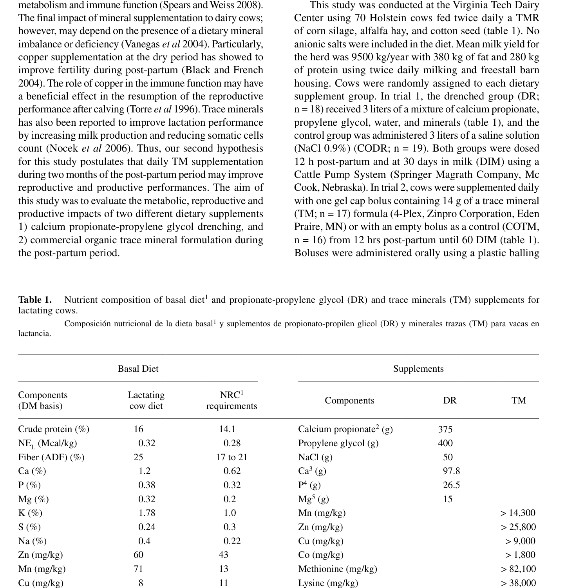
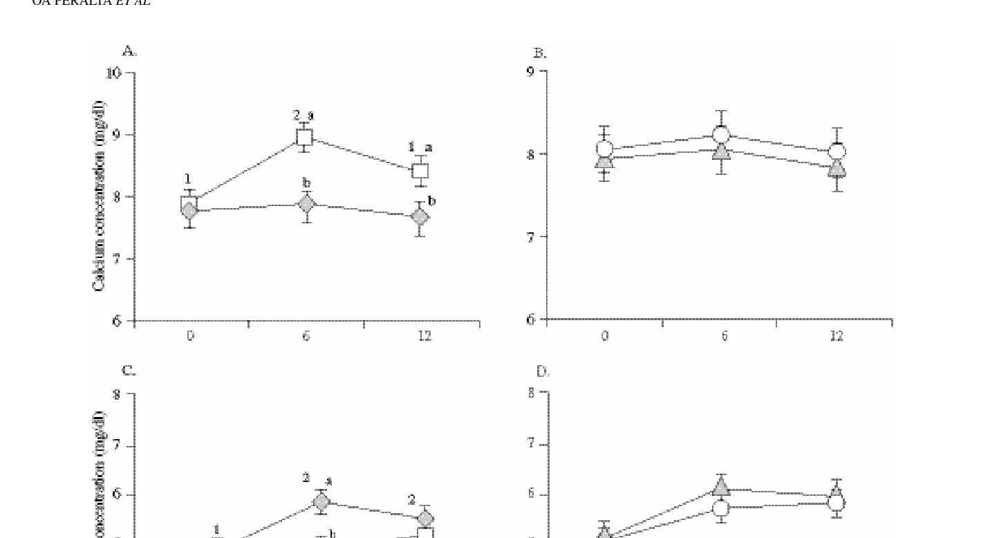
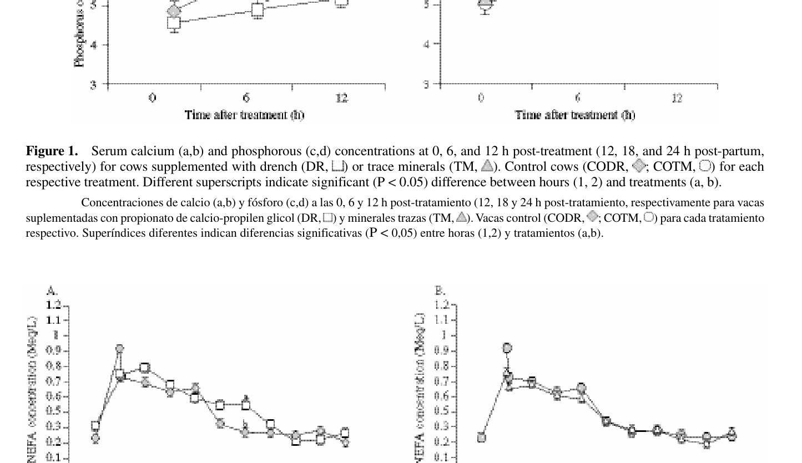
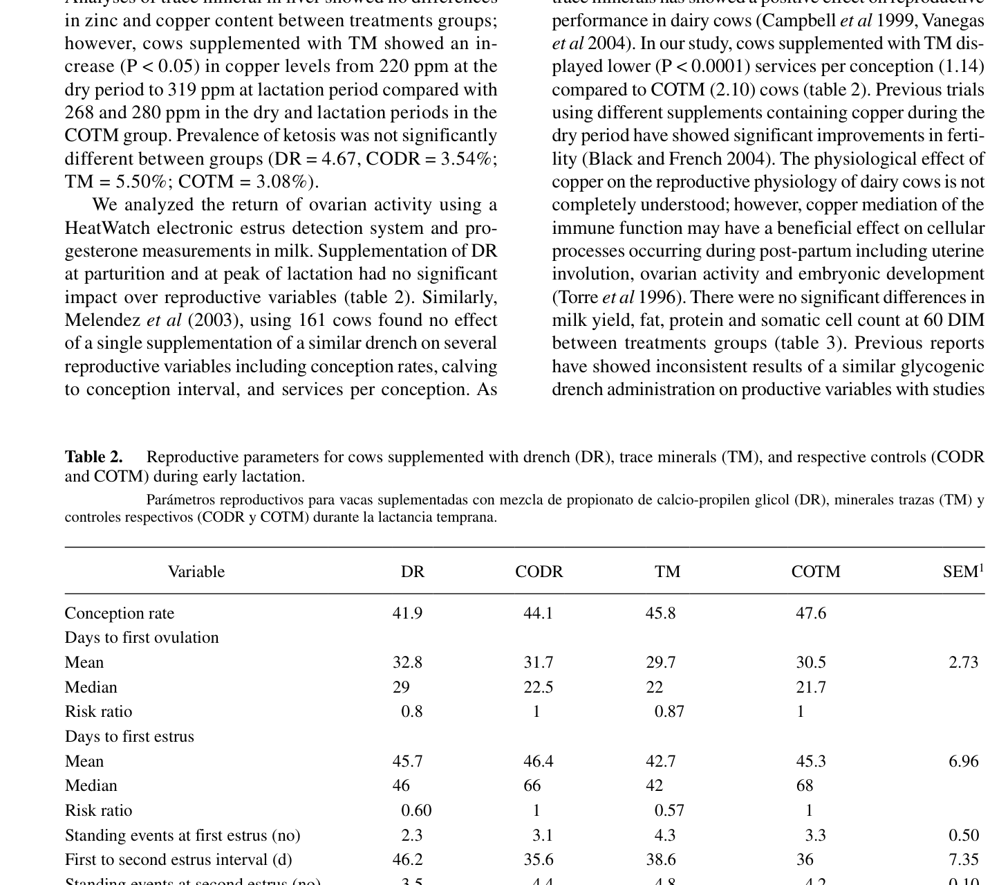
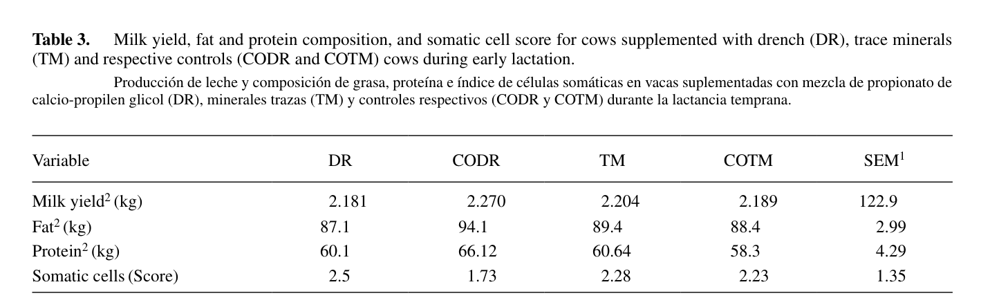

# CS.SOTA.334: Peralta et al. (2011) — Ca-пропионат + пропиленгликоль в transition period

> **Навигация:** [2. Аннотация](#2-аннотация) · [3. Введение](#3-введение) · [4. Методология](#4-методология) · [5. Результаты](#5-результаты) · [6. Интерпретация](#6-интерпретация-и-обсуждение) · [7. Критический анализ](#7-критический-анализ) · [8. Выводы](#8-выводы) · [9. FAQ](#9-faq) · [10. Практика](#10-практическое-применение) · [12. Источники](#12-источники) · [13. Журнал](#13-журнал-обработки)

# 2. АННОТАЦИЯ

## 2.1. Перевод Abstract

Целью исследования была оценка влияния смеси пропионата кальция с пропиленгликолем (DR) и коммерческой органической микроэлементной добавки 4-Plex (TM) на репродуктивную и молочную продуктивность коров в послеродовом периоде. В опыте 1 лактирующие коровы (n = 37) были случайно распределены на группу DR (n = 18) и контроль CODR (n = 19); обработку проводили в момент отёла и на 30-й день лактации. В опыте 2 коровы (n = 33) получали либо TM (n = 17), либо плацебо COTM (n = 16) ежедневно с 12 ч послеродово до 60-го дня лактации. Добавление DR повысило концентрацию кальция в сыворотке (P < 0,05), но не повлияло на NEFA, кетоновые тела, удой и состав молока. TM снизило количество осеменений на одну стельность (P < 0,0001) по сравнению с COTM.

## 2.2. Key Claims

**Claim 1:** Однократное внесение 3 л смеси Ca-пропионат (375 г) + пропиленгликоль (400 г) в 12 ч послеродово повышает сывороточный кальций в течение 6–12 ч.  
**Уверенность:** 0,75 (RCT внутри фермы, n = 18/19, измерения 0, 6, 12 ч после обработки; P < 0,05; рис. 1A).

**Claim 2:** DR не снижает концентрацию NEFA и не влияет на молочные параметры в первые 60 дней лактации.  
**Уверенность:** 0,70 (Table 3, отсутствие значимых различий; Peralta et al., 2011, p. 69).

**Claim 3:** Ежедневное внесение микроэлементной добавки 4-Plex снижает количество осеменений на стельность (1,14 vs 2,10).  
**Уверенность:** 0,78 (Table 2, P < 0,0001; n = 17/16).

**Claim 4:** DR не улучшает репродуктивные показатели (время до первой овуляции, до первой охоты, процент стельности).  
**Уверенность:** 0,72 (Table 2, отсутствие значимых различий).

**Claim 5:** Смесь Ca-пропионат + пропиленгликоль может быть полезна как источник Ca²⁺, но недостаточна для коррекции ОЭБ при однократном внесении.  
**Уверенность:** 0,68 (интерполяция на основе кинетики Ca и отсутствия эффекта на NEFA).

# 3. ВВЕДЕНИЕ

## 3.1. Контекст и значимость проблемы

Переходный период у высокопродуктивных коров характеризуется снижением потребления корма, мобилизацией жировых запасов, риском субклинической гипокальцемии и кетоза. Пропионат кальция и пропиленгликоль используются как источник глюкозы и кальция, тогда как органические микроэлементы (Cu, Zn, Mn, Co) влияют на иммунитет и фертильность. В модели Peralta et al. (2011) проверяли, достаточно ли одно- и двукратного внесения энергетическо-кальциевой смеси и ежедневного внесения микроэлементов для улучшения метаболизма и воспроизводства.

## 3.2. Обзор литературы (краткий)

- Goff et al. (1996) показали, что Ca-пропионат в момент отёла и через 12 ч снижает частоту субклинической гипокальцемии.
- Пропиленгликоль снижает NEFA и BHB, повышает глюкозу и инсулин (Christensen et al., 1997; Studer et al., 1993).
- Микроэлементы, особенно медь, могут улучшать фертильность послеродово (Black & French, 2004; Torre et al., 1996).

## 3.3. Гипотеза и цель исследования

**Гипотеза:** Смесь Ca-пропионат + пропиленгликоль в момент отёла и на пике лактации улучшит метаболические, репродуктивные и продуктивные показатели; ежедневная микроэлементная добавка в течение двух месяцев послеродово улучшит фертильность.  
**Цель:** оценить метаболические, репродуктивные и продуктивные эффекты DR и TM у коров transition period.

# 4. МЕТОДОЛОГИЯ

## 4.1. Дизайн эксперимента

Два параллельных полевых испытания на одном стаде Holstein в Virginia Tech Dairy Center.
- Опыт 1: две группы, рандомизация, контролируемое исследование.
- Опыт 2: две группы, рандомизация, плацебо-контролируемое исследование.

## 4.2. Животные и условия содержания

- 70 коров Holstein, средний удой стада 9500 кг/год.
- Рацион: TMR на основе кукурузного силоса, люцернового сена и хлопкового семени; анионные соли не использовались.
- Дважды в день доение, беспривязное содержание.

## 4.3. Интервенция / Обработка

**Опыт 1 — DR (drench):**
- DR (n = 18): 3 л смеси, содержащей Ca-пропионат 375 г, пропиленгликоль 400 г, NaCl 50 г, Ca 97,8 г, P 26,5 г, Mg 15 г.
- CODR (n = 19): 3 л физиологического раствора (0,9 % NaCl).
- Внесение: через 12 ч после отёла и на 30-й день лактации (DIM) с помощью Cattle Pump System.

**Опыт 2 — TM (trace minerals):**
- TM (n = 17): один гелевый болюс 4-Plex (14 г) ежедневно с 12 ч послеродово до 60 DIM.
- COTM (n = 16): пустой болюс.

## 4.4. Сбор образцов и анализы

- Кальций и фосфор в сыворотке: 0, 6, 12 ч после обработки (соответствует 12, 18, 24 ч послеродово).
- NEFA: венепункция в 7 дней до отёла, в момент отёла, при обработке и еженедельно в течение 9 недель послеродово (Wako NEFA C kit).
- Молоко: 3 раза в неделю до 60 DIM — жир, белок, соматические клетки, ацетоацетат (Ketocheck).
- Печёночная биопсия: за 30 дней до и через 30 дней после отёла — Cu, Zn (ICP-AES).
- Овуляция: прогестерон в молоке 3 раза в неделю с 7 DIM до 60 DIM.
- Охота: HeatWatch; искусственное осеменение после 60-дневного добровольного перерыва.

## 4.5. Статистический анализ

SAS 9.1.3. Линейная смешанная модель с повторными измерениями (сложная симметрия) для Ca, P, NEFA, Cu, Zn и соматических клеток. Фиксированные эффекты: обработка, день отбора, кратность, взаимодействия. Интервалы от отёла до первой овуляции и охоты — Lifetest и log-rank. PROC Phreg — hazard ratio. GLM — удой, жир, белок до 60 DIM. Логистическая регрессия — наличие ацетоацетата. Уровень значимости P < 0,05 (Peralta et al., 2011, p. 67).

## 4.6. Медиа-инвентарь

| ID | Тип | Описание | Файл | Статус |
|----|-----|----------|------|--------|
| Table 1 | Таблица | Состав базового рациона и добавок DR/TM | `table-1-nutrient-composition.png` | ✅ Встроено |
| Figure 1 | График | Сывороточный Ca и P в 0, 6, 12 ч после обработки | `figure-1-calcium-phosphorus.png` | ✅ Встроено |
| Figure 2 | График | Сывороточные NEFA до и после отёла | `figure-2-nefa.png` | ✅ Встроено |
| Table 2 | Таблица | Репродуктивные параметры | `table-2-reproductive-parameters.png` | ✅ Встроено |
| Table 3 | Таблица | Удой и состав молока до 70 DIM | `table-3-milk-composition.png` | ✅ Встроено |

# 5. РЕЗУЛЬТАТЫ

## 5.1. Состав рациона и добавок (Table 1)

**Соответствует:** Table 1 (Peralta et al., 2011, p. 66).

*Источник: Peralta et al., 2011, p. 66 (Table 1).*

**Описание:** Базовый рацион содержал 16 % сырого протеина, 0,32 Mcal/kg NEL, 25 % ADF, 1,2 % Ca, 0,38 % P. Добавка DR включала 375 г Ca-пропионата (98 % чистоты, 80,6 г Ca) и 400 г пропиленгликоля. Добавка TM обеспечивала высокие уровни Zn, Mn, Cu, Co, а также метионин и лизин.

## 5.2. Динамика кальция и фосфора (Figure 1)

**Соответствует:** Figure 1 (Peralta et al., 2011, p. 68).

*Источник: Peralta et al., 2011, p. 68 (Figure 1).*

**Описание:** У коров группы DR концентрация Ca в сыворотке (панель A) повысилась к 6 ч после обработки и оставалась выше контроля до 12 ч (P < 0,05). Панели B и D (контрольные группы TM/COTM) не показали различий. Фосфор в группе DR (панель C) имел тенденцию к снижению, что авторы интерпретируют как гомеостатический ответ на повышение Ca.

**Механистическая интерпретация:** Растворимый Ca-пропионат повышает ионизированный Ca в просвете ЖКТ, усиливая пассивную абсорбцию через межклеточные тесные контакты рубцовой эпителии. Эффект сохраняется ≥12 ч, что согласуется с более медленной желудочно-кишечной абсорбцией по сравнению с CaCl₂ (Goff & Horst, 1994).

## 5.3. Динамика NEFA (Figure 2)

**Соответствует:** Figure 2 (Peralta et al., 2011, p. 68).

*Источник: Peralta et al., 2011, p. 68 (Figure 2).*

**Описание:** NEFA резко повышались в момент отёла у всех групп, но между DR и CODR (панель A), а также TM и COTM (панель B) значимых различий не обнаружено. Авторы отмечают неожиданно высокий пик NEFA на 35-й день у группы DR, объяснение которого не установлено.

**Механистическая интерпретация:** Однократное внесение глюкогенного прекурсора в 12 ч послеродово недостаточно для существенной коррекции липолиза, поскольку ОЭБ формируется за несколько дней до отёла и сохраняется в течение 1–3 недель послеродово. Для снижения NEFA необходимо более длительное введение пропиленгликоля (≥10 дней), как показано Studer et al. (1993) и Grummer et al. (1994).

## 5.4. Репродуктивные параметры (Table 2)

**Соответствует:** Table 2 (Peralta et al., 2011, p. 69).

*Источник: Peralta et al., 2011, p. 69 (Table 2).*

**Описание:** DR не влиял на возвращение овариальной активности, дни до первой охоты, число стояний, интервал между охотами, дни до первого осеменения. TM снизил количество осеменений на стельность до 1,14 по сравнению с 2,10 у COTM (P < 0,0001).

**Ключевые цифры:**
- Services per conception: TM 1,14ᵃ vs COTM 2,10ᵇ (SEM 0,26; P < 0,0001).
- Conception rate: DR 41,9; CODR 44,1; TM 45,8; COTM 47,6 %.
- Days to first ovulation (mean): DR 32,8; CODR 31,7; TM 29,7; COTM 30,5 дней.

## 5.5. Молочная продуктивность (Table 3)

**Соответствует:** Table 3 (Peralta et al., 2011, p. 70).

*Источник: Peralta et al., 2011, p. 70 (Table 3).*

**Описание:** Накопленный за 70 дней удой, жир, белок и соматический счёт не различались между группами DR/CODR и TM/COTM.

**Ключевые цифры:**
- Milk yield (кг/70 дней): DR 2 181; CODR 2 270; TM 2 204; COTM 2 189 (SEM 122,9).
- Fat (кг/70 дней): DR 87,1; CODR 94,1; TM 89,4; COTM 88,4.
- Protein (кг/70 дней): DR 60,1; CODR 66,12; TM 60,64; COTM 58,3.

# 6. ИНТЕРПРЕТАЦИЯ И ОБСУЖДЕНИЕ

## 6.1. Связь с гипотезой

Гипотеза частично подтверждена только для TM (снижение services per conception). Гипотеза о положительном метаболическом и репродуктивном эффекте DR не подтвердилась: Ca в сыворотке повысился, но не было эффекта на NEFA, кетоновые тела, удой и фертильность.

## 6.2. Сравнение с литературой

- **Goff et al. (1996):** однократное или двукратное внесение Ca-пропионата снижало частоту молочной лихорадки. В исследовании Peralta et al. субклиническая гипокальцемия не была частым явлением, поэтому профилактический эффект на клинический исход не проявился.
- **Melendez et al. (2003):** однократная энергетическая добавка не влияла на репродуктивные показатели — согласуется с данной работой.
- **Miyoshi et al. (2001):** длительное внесение пропиленгликоля послеродово улучшало овариальную активность. Peralta et al. использовали однократную смесь, что объясняет отсутствие эффекта.

## 6.3. Механистические выводы

- Ca-пропионат эффективно повышает сывороточный Ca в течение ≥12 ч за счёт медленной, но продолжительной абсорбции.
- Однократное глюкогенное вмешательство недостаточно для снижения липолиза, если оно не сопровождается коррекцией DMI или продолжительной терапией.
- Микроэлементы, вероятно, влияют на фертильность через медь и иммунный ответ, а не через метаболизм энергии.

# 7. КРИТИЧЕСКИЙ АНАЛИЗ

## 7.1. Сильные стороны

- Полевое RCT с разумным контролем (плацебо/раствор NaCl).
- Широкий спектр измерений: метаболиты, молоко, печёночные микроэлементы, репродуктивные события.
- Репродуктивный эффект TM подтверждён высокой статистической значимостью.

## 7.2. Ограничения

- В опыте 1 DR — смесь Ca-пропионата и пропиленгликоля; невозможно разделить эффекты двух компонентов.
- Малая выборка (n = 18/19 и 17/16), ограниченная мощность для отсутствия различий.
- Нет группы чистого Ca-пропионата без пропиленгликоля.
- Добавка вносилась через 12 ч после отёла, а не в момент отёла; возможно, поздно для профилактики острой гипокальцемии.
- Стадо имело высокое энергетическое состояние, что могло минимизировать эффект глюкогенной поддержки.

## 7.3. Применимость к российским условиям

- Доза 375 г Ca-пропионата (~80 г Ca) в 3 л в 12 ч послеродово применима, но менее удобна, чем болюсы/пасты.
- Для коров с риском субклинической гипокальцемии профилактика Ca-пропионатом оправдана; при отсутствии гипокальцемии эффект на молочные параметры не доказан.
- Микроэлементные добавки могут быть полезны при подтверждённом дефиците Cu/Zn, но TM-эффект в данном исследовании может быть связан со спецификой стада США.

# 8. ВЫВОДЫ

## 8.1. Ключевые выводы автора (перевод)

Смесь Ca-пропионат + пропиленгликоль в момент отёла и на пике лактации эффективно повышала кальций в сыворотке вскоре после обработки, но не было достаточно для вызова других метаболических, репродуктивных или продуктивных ответов. Ежедневное внесение микроэлементной добавки в течение 60 дней послеродово снизило количество осеменений на стельность, но не повлияло на другие репродуктивные или продуктивные переменные.

## 8.2. Ключевые выводы (структурировано)

- DR повышает сывороточный Ca, но не корректирует NEFA и не улучшает удой.
- DR не влияет на репродуктивные параметры.
- Органическая микроэлементная добавка 4-Plex снижает services per conception.
- Добавки не влияют на удой и состав молока в первые 70 DIM.

## 8.3. Ключевые сообщения для лекции

- Ca-пропионат как профилактика гипокальцемии: да; как корректор ОЭБ: требуется продолжительное внесение.
- Пропиленгликоль и Ca-пропионат в одной смеси не заменяют контроль DMI и энергетический баланс рациона.
- Микроэлементы могут влиять на фертильность независимо от энергетического статуса.

# 9. FAQ

**Q1: Почему DR повысил Ca, но не снизил NEFA?**  
A: Повышение Ca связано с поглощением Ca²⁺; однократная доза глюкогенного прекурсора недостаточна для преодоления ОЭБ (Peralta et al., 2011, p. 69).

**Q2: Сколько Ca содержалось в DR?**  
A: 80,6 г Ca в 375 г Ca-пропионата 98 % чистоты (Table 1).

**Q3: Почему TM снизил services per conception?**  
A: Вероятно, через медь и иммунную функцию; Cu в печени повысился у группы TM (P < 0,05) (Peralta et al., 2011, p. 69).

**Q4: Можно ли по этой статье рекомендовать DR для повышения удоя?**  
A: Нет, удой не различался между группами (Table 3).

**Q5: Почему эффект DR на репродуктивные показатели отсутствует?**  
A: Интервал между внесениями (30 дней) и однократный характер обработки, вероятно, недостаточны для системного метаболического эффекта.

# 10. ПРАКТИЧЕСКОЕ ПРИМЕНЕНИЕ

## 10.1. Алгоритм внедрения

1. Для коров с риском гипокальцемии: рассмотреть профилактическое внесение Ca-пропионата/пропиленгликоля в 12–24 ч послеродово.
2. Не ожидать от однократной дrench-терапии улучшения удоя или NEFA.
3. При длительной глюкогенной поддержке использовать пропиленгликоль 300–500 мл/сут в течение 7–10 дней.
4. Микроэлементные добавки вводить только при подтверждённом дефиците или по результатам анализа кормов.

## 10.2. Типичные ошибки

- Использование Ca-пропионата как замены контролю DMI и энергии рациона.
- Ожидание репродуктивного эффекта от однократной дозы.
- Игнорирование различий между «профилактика гипокальцемии» и «коррекция кетоза/ОЭБ».

## 10.3. Пограничные сценарии

- Острая молочная лихорадка: предпочтительны более быстро всасывающиеся формы Ca (CaCl₂, в/в терапия).
- Высокий удой >40 кг/сут: [guess] эффект DR на Ca может быть более критичен, но поддержка энергии требует продолжительной стратегии.

# 11. ИНСТРУМЕНТЫ И ШАБЛОНЫ

- Шаблон SoTA: `PACK-cattle-science/pack/cattle-science/TEMPLATES/SOTA-ARTICLE-EXPANDED-TEMPLATE.md` v1.2.
- Для мониторинга: протокол измерения Ca, P, NEFA, BHB в transition period.

# 12. ИСТОЧНИКИ

## 12.1. Первоисточник

Peralta, O.A., Monardes, D., Duchens, M., Moraga, L., & Nebel, R.L. (2011). Supplementing transition cows with calcium propionate-propylene glycol drenching or organic trace minerals: implications on reproductive and lactation performances. *Archivos de Medicina Veterinaria*, 43(1), 65–71. https://doi.org/10.4067/S0301-732X2011000100010

## 12.2. Ключевые статьи (цитируемые в работе)

- Black, D.H., & French, N.P. (2004). Effects of three types of trace element supplementation on the fertility of three commercial dairy herds. *Veterinary Record*, 154, 652–658.
- Christensen, J.O., Grummer, R.R., Rasmussen, F.E., & Bertics, S.J. (1997). Effect of method of delivery of propylene glycol on plasma metabolites of feed-restricted cattle. *Journal of Dairy Science*, 80, 563–568.
- Goff, J.P., Horst, R.L., Jardon, P.W., Borelli, C., & Wedam, J. (1996). Field trials of an oral calcium propionate paste as an aid to prevent milk fever in periparturient dairy cows. *Journal of Dairy Science*, 79(3), 378–383.
- Melendez, P., Donovan, G.A., Risco, C.A., Littel, R., & Goff, J.P. (2003). Effect of calcium-energy supplement on calving-related disorders, fertility and milk yield during the transition period in cows fed anionic diets. *Theriogenology*, 60, 843–854.
- Miyoshi, S., Pate, J.L., & Palquist, D.L. (2001). Effects of propylene glycol drenching on energy balance, plasma glucose, plasma insulin, ovarian function and conception in dairy cows. *Animal Reproduction Science*, 68, 29–43.
- Studer, V.A., Grummer, R.R., & Bertics, S.J. (1993). Effect of prepartum propylene glycol administration on periparturient fatty liver in dairy cows. *Journal of Dairy Science*, 76, 2931–2939.

## 12.3. Внешние источники [вне статьи]

- Zhang, F., Nan, X., Wang, H., Guo, Y., & Xiong, B. (2020). Research on the Applications of Calcium Propionate in Dairy Cows: A Review. *Animals*, 10(8), 1336. https://doi.org/10.3390/ani10081336 [foundational reference, не цитируется в Peralta et al., 2011]
- Martins, W.D.C., et al. (2019). Calcium Propionate Increased Milk Parameters in Holstein Cows. *Acta Scientiae Veterinariae*, 47, 1691. [foundational reference, не цитируется в Peralta et al., 2011]

# 13. ЖУРНАЛ ОБРАБОТКИ

## 13.1. WorkPlan

- WP-105: SoTA по пропионату кальция в transition period.
- Бюджет: 6h; часть перенесена на W27.

## 13.2. Work Record

- 2026-06-20: Извлечены PDF и текст Peralta 2011; созданы media-crops; написан CS.SOTA.334.
