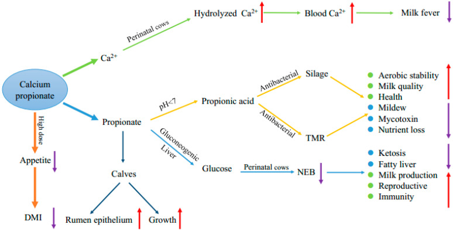

# CS.SOTA.335: Zhang et al. (2020) — Обзор применения Ca-пропионата у дойных коров

> **Навигация:** [2. Аннотация](#2-аннотация) · [3. Введение](#3-введение) · [4. Методология обзора](#4-методология-обзора) · [5. Результаты по направлениям](#5-результаты-по-направлениям) · [6. Интерпретация](#6-интерпретация-и-обсуждение) · [7. Критический анализ](#7-критический-анализ) · [8. Выводы](#8-выводы) · [9. FAQ](#9-faq) · [10. Практика](#10-практическое-применение) · [12. Источники](#12-источники) · [13. Журнал](#13-журнал-обработки)

# 2. АННОТАЦИЯ

## 2.1. Перевод Abstract

Пропионат кальция — безопасная пищевая и кормовая добавка, метаболизируемая как источник Ca²⁺ и прекурсор глюкозы. В перинатальный период у дойных коров многие животные не справляются с резкими метаболическими, эндокринными и физиологическими изменениями, что приводит к кетозу, жировой дистрофии печени вследствие отрицательного энергетического баланса (ОЭБ) и молочной лихорадке из-за гипокальцемии. Пропионовая кислота — основной глюконеогенный прекурсор и один из наиболее безопасных антигрибковых агентов. Пропионат кальция гидролизуется в рубце до пропионовой кислоты и Ca²⁺, что делает его перспективной добавкой для смягчения ОЭБ и молочной лихорадки, а также для предотвращения порчи кормов и стимуляции развития рубца у телят.

## 2.2. Key Claims

**Claim 1:** Ca-пропионат гидролизуется в рубце на Ca²⁺ и пропионат, которые являются физиологическими компонентами рубцового содержимого.  
**Уверенность:** 0,95 (обзор, multiple references; Zhang et al., 2020, p. 2, §2.1–2.3).

**Claim 2:** Пропионат является основным глюконеогенным прекурсором у жвачных; Ca-пропионат может смягчать ОЭБ и снижать NEFA/BHBA при дозировке около 200 г/сут.  
**Уверенность:** 0,78 (обзор, ссылка на Liu et al. 2010 и Martins et al. 2019; Zhang et al., 2020, p. 5, §3.3).

**Claim 3:** Ca-пропионат является источником Ca²⁺ и может снижать частоту молочной лихорадки/субклинической гипокальцемии, хотя менее быстро, чем CaCl₂.  
**Уверенность:** 0,80 (Pehrson et al. 1998; Goff et al. 1996; Kara et al. 2009; Zhang et al., 2020, p. 6, §3.4).

**Claim 4:** Ca-пропионат обладает антигрибковыми свойствами и может улучшать аэробную стабильность силоса и TMR, особенно в жарком и влажном климате.  
**Уверенность:** 0,75 (in vitro/in silo studies; Dong et al. 2017; Wen et al. 2017; Zhang et al., 2020, p. 4–5, §3.1–3.2).

**Claim 5:** Высокие дозы Ca-пропионата могут снижать потребление корма (гипофагический эффект пропионата); оптимальная и максимальная дозы для дойных коров требуют дальнейшего изучения.  
**Уверенность:** 0,72 (Oba & Allen 2003; Zhang et al., 2020, p. 7, §4).

# 3. ВВЕДЕНИЕ

## 3.1. Контекст и значимость проблемы

Высокопродуктивные коровы в transition period сталкиваются с резким ростом потребности в глюкозе и кальции. ОЭБ сопровождается мобилизацией жира, ростом NEFA и BHBA, что повышает риск кетоза и жировой инфильтрации печени. Гипокальцемия в перипартум периоде усугубляет риск молочной лихорадки и вторичных заболеваний. Одновременно корма в жарком климате склонны к плесневению и образованию микотоксинов. Ca-пропионат, согласно Zhang et al. (2020), одновременно решает несколько задач: поставляет глюкогенный субстрат, повышает Ca²⁺ и подавляет плесневые грибы.

## 3.2. Обзор литературы (краткий)

До 2020 года были опубликованы:
- Исследования по антибактериальным и антигрибковым свойствам Ca-пропионата в пищевой и кормовой промышленности.
- Полевые и лабораторные работы по влиянию Ca-пропионата на метаболизм переходного периода (Goff et al. 1996; Pehrson et al. 1998; Liu et al. 2010; Martins et al. 2019).
- Работы по влиянию пропионата на развитие рубцовой эпителии у телят.

## 3.3. Цель обзора

Систематизировать современные знания о свойствах Ca-пропионата, механизмах действия и областях применения у дойных коров и телят, выявить ограничения и направления дальнейших исследований.

# 4. МЕТОДОЛОГИЯ ОБЗОРА

## 4.1. Тип обзора

Нарративный обзор (narrative review) с обобщением экспериментальных, обзорных и книжных источников. Систематический поиск и мета-анализ не проводились.

## 4.2. Источники

Более 70 цитирований, включая первичные исследования в *Journal of Dairy Science*, *Animals*, *Animal Feed Science and Technology*, а также справочные материалы.

## 4.3. Медиа-инвентарь

| ID | Тип | Описание | Файл | Статус |
|----|-----|----------|------|--------|
| Figure 1 | Схема | Обобщающая схема применения Ca-пропионата | `figure-1-applications-schematic.png` | ✅ Встроено |

# 5. РЕЗУЛЬТАТЫ ПО НАПРАВЛЕНИЯМ

## 5.1. Физико-химические и антибактериальные свойства

**Соответствует:** §2.1–2.2 (Zhang et al., 2020, p. 2–3).

Ca-пропионат — органическая соль, (CH₃CH₂COO)₂Ca, растворимая в воде и щелочная в растворе. В кислой среде гидролизуется до Ca²⁺ и пропионовой кислоты. Антимикробная активность зависит от доли недиссоциированной пропионовой кислоты: при pH 4,5 недиссоциировано 71 %, при pH 6 — 7 %. Максимальная pH, при которой наблюдается измеримая активность, — около 5,0–5,5 (Suhr & Nielsen, 2004; цит. [13]).

**Ключевые цифры:**
- pH 4,5 → 71 % недиссоциированной пропионовой кислоты.
- pH 6,0 → 7 % недиссоциированной пропионовой кислоты.
- Порог pH для активности Ca-пропионата ≈ 5,0–5,5.

## 5.2. Применение в силосе и TMR

**Соответствует:** §3.1–3.2 (Zhang et al., 2020, p. 4–5).

Ca-пропионат может подавлять рост плесневых грибов (Aspergillus flavus, Cladosporium, Penicillium) и Clostridia, снижать содержание бутировой кислоты и потери сухого вещества, повышать аэробную стабильность силоса. Dong et al. (2017) рекомендовали 10 г/кг свежего веса люцернового силоса. В TMR Ca-пропионат замедляет порчу в жаркую погоду, однако оптимальная доза для TMR в практике не установлена.

## 5.3. Глюконеогенез и ОЭБ

**Соответствует:** §3.3 (Zhang et al., 2020, p. 5–6).

Пропионат поглощается рубцовой эпителией, по портальной вене поступает в печень и конвертируется в глюкозу. В кормленых коровах пропионат обеспечивает до 60 % гепатического высвобождения глюкозы (Duplessis et al., 2017; цит. [23]). Ca-пропионат увеличивает концентрацию пропионата в рубце, снижает NEFA и BHBA, повышает глюкозу и инсулин.

**Ключевые цифры:**
- Liu et al. (2010): оптимальная доза ≈ 200 г/гол/сут для улучшения энергетического статуса.
- McNamara & Valdez (2005): 0,125 кг/сут Ca-пропионата повысил DMI на 11 % препартум и 13 % постпартум.
- Martins et al. (2019): 200 г/сут Ca-пропионата повысил удой и содержание белка, лактозы и жира в молоке (см. CS.SOTA.333).

## 5.4. Профилактика молочной лихорадки

**Соответствует:** §3.4 (Zhang et al., 2020, p. 6).

Ca-пропионат менее растворим, чем CaCl₂, но более растворим, чем лактат, сульфат и карбонат Ca, нейтрален по вкусу и не раздражает слизистую. Он повышает ионизированный Ca в просвете ЖКТ, усиливая абсорбцию через межклеточные контакты.

**Ключевые цифры:**
- Pehrson et al. (1998): Ca-пропионат (120 г Ca суммарно) снизил частоту молочной лихорадки с 36,0 до 25,3 % (сопоставимо с CaCl₂ — 23,2 %).
- Goff et al. (1996): паста с Ca-пропионатом снизила частоту молочной лихорадки с 50 до 29 %.
- Kara et al. (2009): два зонда по 0,68 кг Ca-пропионата (отёл и через 24 ч) эффективны при лечении молочной лихорадки.

## 5.5. Развитие рубца у телят

**Соответствует:** §3.5 (Zhang et al., 2020, p. 6–7).

Пропионат, включая Ca-пропионат, может стимулировать рост рубцовых сосочков и экспрессию GPR41/GPR43 у телят. Zhang et al. (2018) сообщили, что 5 % Ca-пропионата в молочном заменителе и стартовом корме увеличил длину сосочков и экспрессию циклина D1. Cao et al. (2020) подтвердили улучшение привесов и развития рубца при 5 % Ca-пропионата.

## 5.6. Схема приложений (Figure 1)

**Соответствует:** Figure 1 (Zhang et al., 2020, p. 7).

*Источник: Zhang et al., 2020, p. 7 (Figure 1).*

**Описание:** Схема показывает, что Ca-пропионат расщепляется на Ca²⁺ и пропионат. Ca²⁺ повышает Ca в крови и снижает риск молочной лихорадки. Пропионат действует как антибактериальный агент в силосе и TMR, как глюконеогенный прекурсор у перинатальных коров (снижение ОЭБ) и как стимулятор рубцовой эпителии у телят. При высоких дозах Ca-пропионат может снижать аппетит и DMI.

# 6. ИНТЕРПРЕТАЦИЯ И ОБСУЖДЕНИЕ

## 6.1. Связь с целью обзора

Обзор достигает цели: систематизированы четыре основных направления применения Ca-пропионата, механизмы и ограничения. Основной акцент сделан на дуальном механизме — Ca²⁺ + пропионат.

## 6.2. Сравнение с литературой

- **Goff et al. (1996)** и **Pehrson et al. (1998):** данные по профилактике молочной лихорадки согласуются с обобщением Zhang et al. (2020).
- **Liu et al. (2010)** и **Martins et al. (2019):** поддерживают рекомендацию о дозе ~200 г/сут для метаболической поддержки.
- **Oba & Allen (2003):** подтверждают гипофагический эффект пропионата при высоких дозах.

## 6.3. Механистические выводы

- Ca-пропионат обеспечивает два независимых, но синергетических эффекта: глюконеогенез и Ca²⁺.
- Антигрибковый эффект ограничен кислой средой (pH < 5,5), что важно при его использовании в силосе.
- Эффект на развитие рубца связан с пропионат-чувствительными рецепторами GPR41/GPR43.

# 7. КРИТИЧЕСКИЙ АНАЛИЗ

## 7.1. Сильные стороны

- Широкий охват механизмов и областей применения.
- Ясная схема дуального механизма действия (Figure 1).
- Привязка к практическим дозировкам из первичных исследований.
- Открыто обсуждены ограничения и перспективные направления.

## 7.2. Ограничения

- Обзор нарративный: отсутствуют критерии включения/исключения, оценка качества и мета-анализ.
- Часть цитируемых исследований проведена на других видах (бройлеры, крысы, овцы), что ограничивает прямую экстраполяцию на дойных коров.
- Рекомендации по дозировке для TMR, силоса и профилактики молочной лихорадки разрозненны.

## 7.3. Применимость к российским условиям

- Ca-пропионат доступен как кормовая добавка; доза 200 г/сут в ранней лактации применима в условиях интенсивных хозяйств.
- Использование в силосе/ТМР для снижения микотоксинов актуально в жаркий сезон, но в холодном климате экономический эффект может быть ниже.
- Необходимость мониторинга DMI при введении высоких доз сохраняется.

# 8. ВЫВОДЫ

## 8.1. Ключевые выводы авторов (перевод)

Ca-пропионат — безопасная и надёжная добавка. Его гидролиз даёт Ca²⁺ и пропионовую кислоту, что позволяет использовать его для: (1) подавления плесени в силосе и TMR; (2) снижения ОЭБ у перинатальных коров; (3) профилактики молочной лихорадки; (4) стимуляции развития рубцовой эпителии у телят. Избыточное внесение может подавлять аппетит.

## 8.2. Ключевые выводы (структурировано)

- Механизм: Ca²⁺ + пропионат.
- Оптимальная доза для поддержки энергии — около 200 г/гол/сут.
- Ca-пропионат — альтернатива CaCl₂ для профилактики гипокальцемии.
- Антигрибковый эффект зависит от pH среды.
- Высокие дозы снижают DMI.

## 8.3. Ключевые сообщения для лекции

- Ca-пропионат — это не только источник Ca, но и глюкогенный прекурсор.
- 200 г/сут — стартовая доза для поддержки в transition period.
- Для силоса эффективность зависит от pH и влажности.

# 9. FAQ

**Q1: Почему Ca-пропионат снижает риск молочной лихорадки, если усваивается медленнее CaCl₂?**  
A: За счёт более длительного повышения Ca в крови и меньшего раздражения слизистой (Zhang et al., 2020, p. 6).

**Q2: Какая доза Ca-пропионата считается оптимальной для коров в transition period?**  
A: Обзор указывает на ~200 г/сут на основе Liu et al. (2010) и Martins et al. (2019); для профилактики гипокальцемии используют однократные болюсы/пасты (Zhang et al., 2020, p. 5–6).

**Q3: Почему Ca-пропионат не всегда повышает удой?**  
A: Эффект зависит от уровня ОЭБ, дозы, длительности внесения и сопутствующего рациона (Zhang et al., 2020, p. 5).

**Q4: Можно ли Ca-пропионат использовать в силосе?**  
A: Да, 10 г/кг свежей массы люцернового силоса улучшает ферментацию и аэробную стабильность (Dong et al., 2017).

**Q5: Каковы основные риски Ca-пропионата?**  
A: При передозировке — гипофагия и снижение DMI (Zhang et al., 2020, p. 7).

# 10. ПРАКТИЧЕСКОЕ ПРИМЕНЕНИЕ

## 10.1. Алгоритм внедрения

1. Определить цель: профилактика гипокальцемии, поддержка энергии, консервант корма или развитие рубца у телят.
2. Для поддержки энергии в transition period: начать с 150–200 г/сут CP, оценить DMI через 7–14 дней.
3. Для профилактики гипокальцемии: болюс/паста Ca-пропионата в момент отёла и через 12–24 ч.
4. Для силоса: 10 г/кг свежей массы (по данным Dong et al. 2017) или коммерческий консервант на основе пропионата.
5. Мониторинг: Ca²⁺, NEFA/BHBA, DMI, удой, жирность молока.

## 10.2. Типичные ошибки

- Использование Ca-пропионата как единственной меры при тяжёлом ОЭБ.
- Игнорирование гипофагического эффекта при дозах >250–300 г/сут.
- Ожидание антигрибкового эффекта в нейтральных или щелочных кормах.

## 10.3. Пограничные сценарии

- Высокожировые рационы: CP предпочтительнее CSFA, но может усиливать сытость.
- Телята: 5 % CP в молочном заменителе/стартере может улучшать развитие рубца.
- Жаркий климат: CP в силосе/TMR может снижать микотоксины.

# 11. ИНСТРУМЕНТЫ И ШАБЛОНЫ

- Шаблон SoTA: `PACK-cattle-science/pack/cattle-science/TEMPLATES/SOTA-ARTICLE-EXPANDED-TEMPLATE.md` v1.2.
- Калькулятор энергетического баланса transition cow (NASEM 2021 / NRC 2001).

# 12. ИСТОЧНИКИ

## 12.1. Первоисточник

Zhang, F., Nan, X., Wang, H., Guo, Y., & Xiong, B. (2020). Research on the Applications of Calcium Propionate in Dairy Cows: A Review. *Animals*, 10(8), 1336. https://doi.org/10.3390/ani10081336

## 12.2. Ключевые статьи (цитируемые в обзоре)

- Dong, Z., Yuan, X., Wen, A., Desta, S.T., & Shao, T. (2017). Effects of calcium propionate on the fermentation quality and aerobic stability of alfalfa silage. *Asian-Australasian Journal of Animal Sciences*, 30(9), 1278–1284.
- Goff, J.P., Horst, R.L., Jardon, P.W., Borelli, C., & Wedam, J. (1996). Field trials of an oral calcium propionate paste as an aid to prevent milk fever in periparturient dairy cows. *Journal of Dairy Science*, 79(3), 378–383.
- Liu, Q., Wang, C., Yang, W.Z., Guo, G., Yang, X.M., He, D.C., Dong, K.H., & Huang, Y.X. (2010). Effects of calcium propionate supplementation on lactation performance, energy balance and blood metabolites in early lactation dairy cows. *Journal of Animal Physiology and Animal Nutrition*, 94(5), 605–614.
- Oba, M., & Allen, M.S. (2003). Dose-response effects of intraruminal infusion of propionate on feeding behavior of lactating cows in early or midlactation. *Journal of Dairy Science*, 86(9), 2922–2931.
- Pehrson, B., Svensson, C., & Jonsson, M. (1998). A comparative study of the effectiveness of calcium propionate and calcium chloride for the prevention of parturient paresis in dairy cows. *Journal of Dairy Science*, 81(7), 2011–2016.

## 12.3. Внешние источники [вне статьи]

- Martins, W.D.C., et al. (2019). Calcium Propionate Increased Milk Parameters in Holstein Cows. *Acta Scientiae Veterinariae*, 47, 1691. https://doi.org/10.22456/1679-9216.97154 [foundational reference, не цитируется в Zhang et al., 2020]
- Peralta, O.A., Monardes, D., Duchens, M., Moraga, L., & Nebel, R.L. (2011). Supplementing transition cows with calcium propionate-propylene glycol drenching or organic trace minerals. *Archivos de Medicina Veterinaria*, 43(1), 65–71. [foundational reference, не цитируется в Zhang et al., 2020]

# 13. ЖУРНАЛ ОБРАБОТКИ

## 13.1. WorkPlan

- WP-105: SoTA по пропионату кальция в transition period.
- Бюджет: 6h; часть перенесена на W27.

## 13.2. Work Record

- 2026-06-20: Извлечён полный текст Zhang 2020 из PMC HTML; скачана Figure 1; написан CS.SOTA.335.
