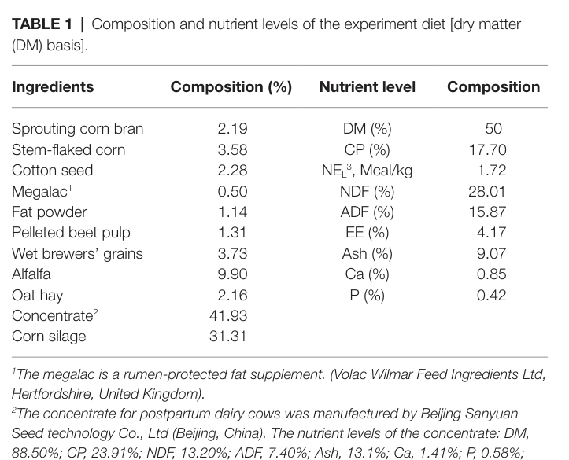
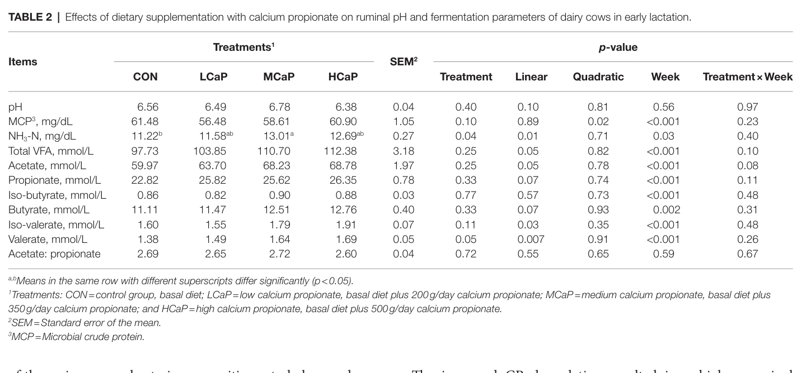
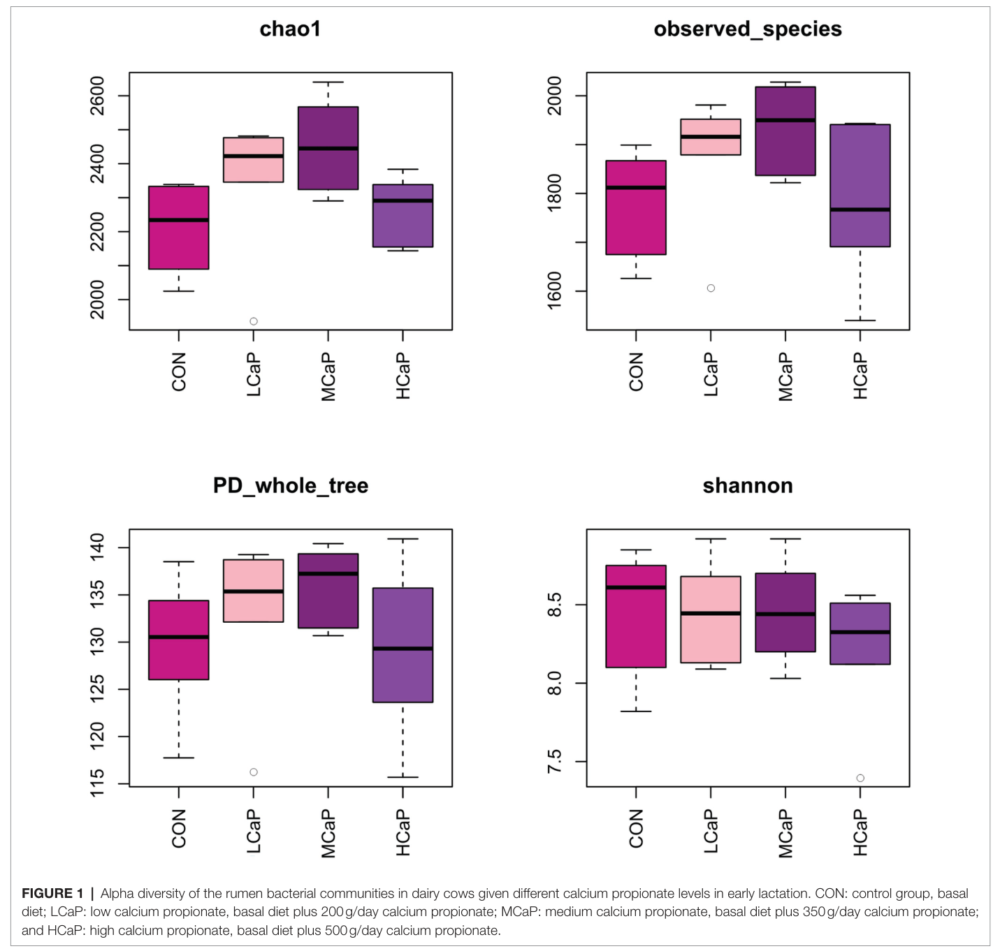
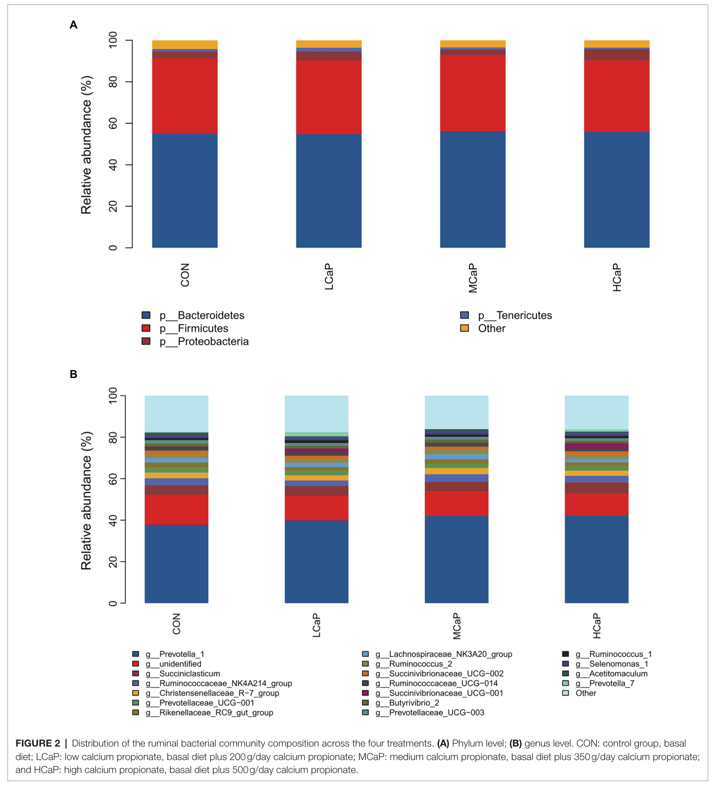
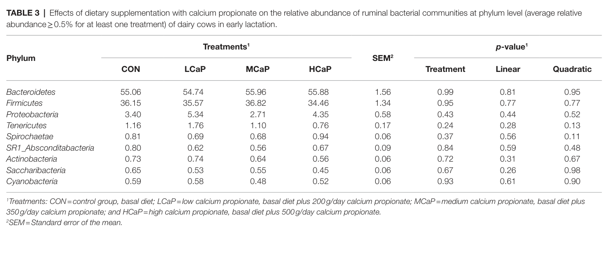
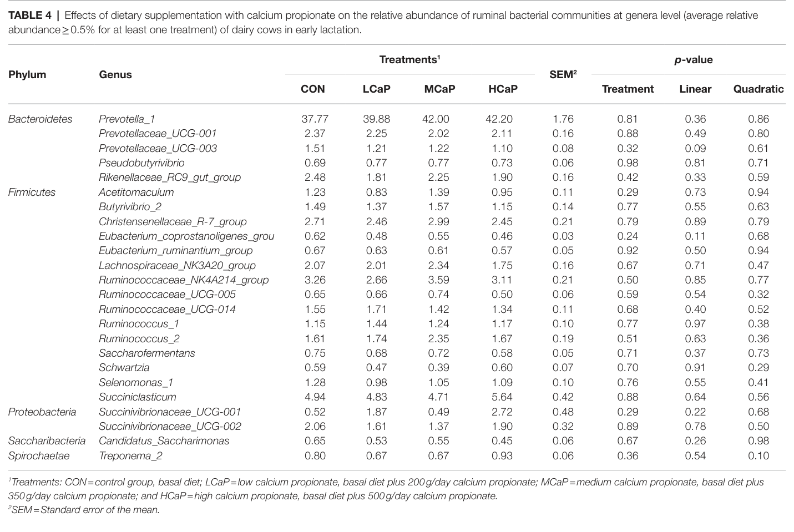

# CS.SOTA.336: Zhang et al. (2022) — Минорные эффекты пропионата кальция на основной состав рубцовой бактериальной сообщества коров в начале лактации

> **Навигация:** [2. Аннотация](#2-аннотация-abstract) · [3. Введение](#3-введение) · [4. Методология](#4-методология) · [5. Результаты](#5-результаты) · [6. Интерпретация](#6-интерпретация-и-обсуждение) · [7. Критический анализ](#7-критический-анализ) · [8. Выводы](#8-выводы) · [9. FAQ](#9-faq) · [10. Практика](#10-практическое-применение) · [11. Инструменты](#11-инструменты-и-шаблоны) · [12. Источники](#12-источники) · [13. Журнал обработки](#13-журнал-обработки)

# 2. АННОТАЦИЯ (Abstract)

## 2.1. Перевод Abstract

Раннелактационный период у высокопродуктивных молочных коров характеризуется резким ростом потребности в энергии и кальции, что часто проявляется в виде отрицательного энергетического баланса и субклинической гипокальциемии. Пропионат кальция используется как источник кальция и глюконеогенного предшественника, однако влияние различных доз добавки на рубцовую микробиоту раннелактационных коров изучено недостаточно. В полевом исследовании 24 многоплодных коровы породы Holstein в начале лактации были случайно распределены на четыре группы (n = 6): контроль (CON), низкая доза пропионата кальция (LCaP, 200 г/сут), средняя доза (MCaP, 350 г/сут) и высокая доза (HCaP, 500 г/сут). Добавку вводили перорально в течение 35 суток после отела. Параметры рубцового брожения измеряли еженедельно, а состав бактериального сообщества оценивали по 16S рРНК-генному секвенированию пробы рубцового содержимого, взятой на 35-е сутки. При одинаковом базовом рационе pH рубца не различалась между группами. С увеличением дозы пропионата кальция содержание микробного сырого белка (МСБ) снижалось квадратично (p = 0,02), а концентрация аммонийного азота (NH₃-N) линейно возрастала (p = 0,01). Линейно увеличивались общая концентрация летучих жирных кислот (ЛЖК, p = 0,05), ацетат (p = 0,05), изовалерианат (p = 0,03) и валерианат (p = 0,007), тогда как пропионат и бутират демонстрировали линейную тенденцию к росту (p = 0,07). Доминирующими филами оставались Bacteroidetes, Firmicutes и Proteobacteria, а доминирующими родами — Prevotella_1 и Succiniclasticum. Пропионат кальция квадратично повысил показатели альфа-разнообразия Chao1 (p = 0,02) и observed species (p = 0,03), но мало повлиял на относительную обилие основных бактерий на уровне филумов и родов. Таким образом, в условиях данного исследования добавка пропионата кальция улучшала параметры рубцового брожения и бактериальное разнообразие, не изменяя при этом основной состав рубцовой бактериальной сообщества (Zhang et al., 2022, pp. 1, 4–8).

## 2.2. Key Claims

> **Примечание.** Каждое утверждение сопровождается числовой оценкой уверенности по шкале 0,0–1,0 и якорем доказательств. Статус `[интерполяция]` обозначает логический вывод из данных статьи; `[guess]` — практическую догадку без прямой эмпирической базы.

**Claim 1.** При одинаковом базовом ТМР-рационе пероральная добавка пропионата кальция в дозах 200–500 г/сут не изменила pH рубца и молярное соотношение ацетат:пропионат у раннелактационных многоплодных коров Holstein в течение 35 суток после отела.
**Уверенность:** 0,82 (полевое исследование с повторными измерениями, n = 6/группа, p = 0,40 и p = 0,72 соответственно; единственное исследование, отсутствует маскирование).
**Якорь:** (Zhang et al., 2022, Table 2).

**Claim 2.** Добавка пропионата кальция линейно повысила общую концентрацию ЛЖК (p = 0,05), ацетат (p = 0,05), изовалерианат (p = 0,03), валерианат (p = 0,007) и NH₃-N (p = 0,01); пропионат и бутират показали линейную тенденцию к увеличению (p = 0,07); концентрация МСБ снижалась квадратично (p = 0,02).
**Уверенность:** 0,80 (одно исследование, n = 6/группа, ортогональные полиномиальные контрасты, α = 0,05; ограничение — выборка мала для оценки индивидуальной вариабельности).
**Якорь:** (Zhang et al., 2022, Table 2).

**Claim 3.** Показатели альфа-разнообразия Chao1 и observed species отвечали на добавку пропионата кальция квадратично (p = 0,02 и p = 0,03), с максимумом в группе MCaP (350 г/сут); PD_whole_tree, Shannon и Simpson не изменились.
**Уверенность:** 0,78 (16S-анализ одноточечных проб на 35-е сутки, n = 6/группа; ограничение — поперечный срез в один момент времени).
**Якорь:** (Zhang et al., 2022, Figure 1; Supplementary Table S3).

**Claim 4.** Бета-разнообразие, оцененное по PCoA и NMDS на расстоянии Bray-Curtis, не показало чёткого разделения групп на уровне OTU.
**Уверенность:** 0,75 (n = 24 суммарно, одна временная точка; не позволяет оценить динамику).
**Якорь:** (Zhang et al., 2022, p. 8).

**Claim 5.** Относительная обилие доминирующих филумов и большинства родов рубцовых бактерий не зависело от дозы пропионата кальция; лишь Prevotellaceae_UCG-003 имел тенденцию к линейному снижению (p = 0,09).
**Уверенность:** 0,76 (16S-анализ относительной обилии, n = 6/группа; ограничение — чувствительность к глубине секвенирования и классификационной базе SILVA128).
**Якорь:** (Zhang et al., 2022, Tables 3, 4).

**Claim 6a.** [интерполяция] Повышенная концентрация NH₃-N на фоне сниженного МСБ может отражать увеличение протока микробного белка в тонкий кишечник вследствие более высокого молочного синтеза, что согласуется с данными по продуктивности из сопутствующего исследования.
**Уверенность:** 0,55 (механистическая интерпретация авторов, прямые измерения протока МСБ и удоя в данной статье отсутствуют).
**Якорь:** (Zhang et al., 2022, pp. 8–9).

**Claim 6b.** [guess] В условиях данной модели доза 350 г/сут пропионата кальция может быть близка к оптимуму для богатства/разнообразия рубцовых бактерий, тогда как 500 г/сут может его превышать.
**Уверенность:** 0,60 (квадратичный отклик альфа-разнообразия и визуальное сравнение групп; единственное исследование, без повторного тестирования).
**Якорь:** (Zhang et al., 2022, Figure 1; p. 9).

**Claim 7.** [guess] Перенос результатов на другие породы, рационы, климатические условия и системы содержания требует отдельной валидации.
**Уверенность:** 0,50 (ограничение внешней валидности; одна ферма, один генотип, один сезон).
**Якорь:** [интерполяция: внешняя валидность ограничена дизайном].

# 3. ВВЕДЕНИЕ

## 3.1. Контекст и значимость проблемы

Переходный и раннелактационный периоды являются критическими для молочных коров высокой продуктивности. В первые недели после отела потребность коровы в энергии и питательных веществах резко возрастает вследствие начала лактации, тогда как сухое вещество корма потребляется недостаточно для покрытия этих потребностей. В результате формируется отрицательный энергетический баланс (ОЭБ), сопровождаемый мобилизацией жировых запасов и риском кетоза и жировой дистрофии печени (Kara, 2013; Zebeli et al., 2015). Одновременно падение уровня ионизированного кальция в плазме вокруг отела повышает частоту субклинической гипокальциемии, которая связана с повышенным риском молочной лихорадки, аномалии преджелудка, кетоза, эндометрита и других метаболических и инфекционных заболеваний (Couto Serrenho et al., 2021). Согласно оценкам, субклиническая гипокальциемия встречается у 25–40 % многоплодных коров, что обусловливает значительные экономические потери вследствие снижения удоя, плодовитости и увеличения ветеринарных затрат [вне статьи: Reinhardt et al., 2011; Oetzel, 2011].

Пропионат является основным глюконеогенным субстратом у жвачных: в печени он обеспечивает 60–74 % синтеза глюкозы (Aschenbach et al., 2010). Пропионат кальция в рубце диссоциирует на ионы Ca²⁺ и пропионовую кислоту, что одновременно адресует два метаболических нарушения раннего послеродового периода — дефицит кальция и недостаток глюкозного эквивалента (Goff et al., 1996; Zhang et al., 2020). Поэтому понимание влияния пропионата кальция не только на метаболизм, но и на рубцовое брожение и микробиоту имеет практическое значение для обоснования дозировок и механизмов действия.

## 3.2. Обзор литературы (краткий)

До настоящего исследования основной массив данных о пропионате кальция касался лактационной продуктивности и метаболических показателей. Goff et al. (1996) показали, что пероральное введение пасты с пропионатом кальция при отеле и через 12 ч снижает частоту субклинической гипокальциемии и молочной лихорадки. Liu et al. (2010) сообщили, что 100–300 г/сут пропионата кальция улучшают переваримость питательных веществ и энергетический статус раннелактационных коров. В полевом исследовании Martins et al. (2019; см. также CS.SOTA.333) добавка 200 г/сут пропионата кальция повысила удой в ранней лактации. Авторы же (Zhang et al., 2022; связанная статья того же коллектива) ранее установили, что пропионат кальция квадратично увеличивает удой и потребление сухого вещества, с оптимальной дозой около 350 г/сут. Обзор Zhang et al. (2020; CS.SOTA.335) систематизировал применение пропионата кальция у молочных коров, указывая на его роль как источника кальция и гликогенного предшественника.

В то же время данные о влиянии пропионата кальция на рубцовое брожение и бактериальное сообщество раннелактационных коров были фрагментарными. Yao et al. (2017) не обнаружили существенных изменений состава рубцовой бактериальной сообщества у откормочных быков при добавке пропионата кальция, тогда как Cao et al. (2020) сообщили о снижении разнообразия и изменении микробиоты у телят до и после отъёма. Эти противоречивые данные обусловили необходимость исследования дозозависимых эффектов именно у раннелактационных молочных коров.

## 3.3. Гипотеза и цель исследования

**Гипотеза:** различные уровни кормления пропионатом кальция при одинаковом базовом рационе по-разному изменяют параметры рубцового брожения и бактериальное сообщество раннелактационных молочных коров.

**Основная цель (primary outcome):** оценить влияние доз пропионата кальция (0, 200, 350 и 500 г/сут) на рубцовое брожение и состав бактериального сообщества у высокопродуктивных коров в начале лактации.

**Вторичные цели (secondary outcomes):** (i) динамика pH, концентрации ЛЖК, NH₃-N и МСБ в рубце на протяжении 5 недель; (ii) показатели альфа- и бета-разнообразия рубцовых бактерий на 35-е сутки; (iii) относительная обилие доминирующих филумов и родов в ответ на добавку.

# 4. МЕТОДОЛОГИЯ

## 4.1. Дизайн эксперимента

Исследование представляет собой полевое (field-study) рандомизированное экспериментальное исследование с параллельными группами и повторными измерениями параметров брожения. Животные распределялись в блоки по многоплодию (2-я, 3-я, 4-я и последующие лактации), удою предыдущей лактации, скорректированному на 305 дней (12 672 ± 312 кг), и предполагаемой дате отела. Внутри блоков коровы случайным образом назначались в одну из четырёх групп (n = 6/группа). Маскирование (blinding) персонала и исследователей в статье не описано. Расчёт мощности и размера выборки не приведён.

## 4.2. Животные и условия содержания

Объектом исследования были 24 многоплодные коровы породы Holstein в начале лактации, содержавшиеся на демонстрационной ферме China-Israel (Пекин, Китай) в период с сентября по декабрь 2020 г. Коровы содержались в индивидуальных стойлах с свободным доступом к воде. Доение проводилось трижды в сутки (6:00, 14:00, 22:00). После доения коровам предлагали полнорационный корм (TMR) *ad libitum* с остатками 5–10 %. Базовый TMR был одинаковым для всех групп и сформирован согласно рекомендациям NRC (2001) (Zhang et al., 2022, p. 2).

## 4.3. Интервенция / Обработка

Группы:

| Группа            | Обозначение | Доза пропионата кальция, г/сут |
| ----------------------- | ---------------------- | ------------------------------------------------------- |
| Контроль        | CON                    | 0                                                       |
| Низкая доза   | LCaP                   | 200                                                     |
| Средняя доза | MCaP                   | 350                                                     |
| Высокая доза | HCaP                   | 500                                                     |

Пропионат кальция (Jiangsu Runpu Food Technology Co., Ltd., Ляньюньган, Китай) вводили перорально (oral drench) три раза в сутки в равных долях после доения, начиная с отела и до 35-го дня лактации. Группа CON получала только базовый TMR.

## 4.4. Сбор образцов и анализы

- **Проба TMR.** Еженедельно в течение двух последовательных дней из кормушек отбирали пробы TMR, компоновали в одну пробу в неделю, сушили при 55 °C в течение 48 ч и измельчали через сито 1 мм. Определяли сухое вещество (105 °C, 3 ч), сырой протеин по Кьельдалю, эфирный экстракт, золу, кальций (атомно-абсорбционная спектрофотометрия), фосфор (молибдovanadate method), NDF (с α-амилазой, с остаточной золой) и ADF по методикам AOAC (2005) и Van Soest et al. (1991) (Zhang et al., 2022, pp. 2–3).
- **Рубцовое содержимое.** На 7-, 14-, 21-, 28- и 35-е сутки лактации рубцовое содержимое отбирали у шести коров каждой группы через ротовой зонд перед утренним кормлением. Первые 150 мл сбросили для уменьшения загрязнения слюной. pH измеряли сразу (Sartorius PB-10). Фильтрат (≈10 мл) закисляли 25 % метафосфорной кислотой (5:1) и хранили при −20 °C. Профиль ЛЖК анализировали газовой хроматографией (Agilent 6890 N, колонка HP-FFAP), NH₃-N — колориметрически, МСБ — по методу Makkar et al. (1982) (Zhang et al., 2022, p. 3).
- **ДНК.** По 2 мл рубцовой жидкости каждой коровы на 35-е сутки замораживали в жидком азоте для экстракции ДНК. Микробную ДНК извлекали коммерческим набором (MoBio Laboratories), контролировали качество на 1 % агарозном геле и спектрофотометре NanoDrop 2000. Амплифицировали гипервариабельный регион V3–V4 бактериального 16S рРНК-гена праймерами 338F/806R. Библиотеки секвенировали парно-концевым методом 2 × 300 на Illumina MiSeq (Zhang et al., 2022, pp. 3–4).

## 4.5. Статистический анализ

Анализ параметров брожения, индексов альфа-разнообразия и относительной обилии филумов/родов выполняли процедурой MIXED в SAS 9.4. Для повторных измерений параметров брожения в модель включали фиксированные эффекты обработки, недели лактации, их взаимодействия и случайный эффект блока. Для микробиологических данных фиксированным эффектом была обработка, случайным — блок. В качестве структуры ковариационной матрицы ошибок использовали compound symmetry. Для сравнения средних между группами применяли множественный тест Дункана. Ортогональные полиномиальные контрасты оценивали линейный и квадратичный отклики на возрастающую дозу пропионата кальция; коэффициенты генерировали процедурой IML SAS с поправкой на неравномерный шаг доз (0, 200, 350, 500 г/сут). Результаты представлены как наименьшие квадратичные средние ± стандартная ошибка среднего (SEM). Статистически значимыми считали различия при p ≤ 0,05; тенденция определялась при 0,05 < p ≤ 0,10 (Zhang et al., 2022, p. 4).

## 4.6. Медиа-инвентарь (ПОЛНЫЙ)

| ID       | Тип         | Описание                                                                                                                                     | Файл                                         | Статус        |
| -------- | -------------- | ---------------------------------------------------------------------------------------------------------------------------------------------------- | ------------------------------------------------ | ------------------- |
| Table 1  | Таблица | Состав и нутриентный уровень экспериментального рациона (DM basis)                                 | `table-1-composition-nutrient-levels.png`      | ✅ Встроено |
| Table 2  | Таблица | Влияние пропионата кальция на pH и параметры брожения рубца                                         | `table-2-rumen-fermentation.png`               | ✅ Встроено |
| Figure 1 | График   | Альфа-разнообразие рубцовых бактериальных сообществ (Chao1, observed_species, PD_whole_tree, Shannon) | `figure-1-alpha-diversity.png`                 | ✅ Встроено |
| Figure 2 | График   | Распределение бактериального сообщества по филумам (A) и родам (B)                               | `figure-2-bacterial-community-composition.png` | ✅ Встроено |
| Table 3  | Таблица | Относительная обилие бактериальных филумов                                                                    | `table-3-phylum-relative-abundance.png`        | ✅ Встроено |
| Table 4  | Таблица | Относительная обилие бактериальных родов                                                                        | `table-4-genera-relative-abundance.png`        | ✅ Встроено |

> **Примечание.** Дополнительные материалы (Supplementary Tables S1–S3 и Supplementary Figures S1–S3) доступны онлайн, но не включены в основной PDF и в настоящий SoTA не извлекались.

# 5. РЕЗУЛЬТАТЫ

> **Правило FPF A.7:** Все результаты представляют собой наблюдения в рамках описанной экспериментальной модели; их нельзя автоматически экстраполировать на все раннелактационные коровы без учёта дизайна и ограничений.

## 5.1. Состав и нутриентный уровень экспериментального рациона

**Соответствует:** Table 1.

*Источник: Zhang et al., 2022, p. 3 (Table 1).*

**Описание:** Базовый TMR был одинаковым для всех четырёх групп. По сухому веществу рацион состоял из концентрата (41,93 %), кукурузного силоса (31,31 %), люцерны (9,90 %), влажной пивной дробины (3,73 %), stem-flaked corn (3,58 %), овсяного сена (2,16 %), пророщенной кукурузной отруби (2,19 %), хлопкового семени (2,28 %), гранулированной свёкловичной жома (1,31 %), жирового порошка (1,14 %) и мегалака (0,50 %). Нутриентный уровень (DM basis): DM 50 %, сырой протеин 17,70 %, NEL 1,72 Мкал/кг, NDF 28,01 %, ADF 15,87 %, эфирный экстракт 4,17 %, зола 9,07 %, Ca 0,85 %, P 0,42 % (Zhang et al., 2022, Table 1).

| Показатель               | Значение |
| ---------------------------------- | ---------------- |
| DM, %                              | 50               |
| Сырой протеин, %       | 17,70            |
| NEL, Мкал/кг                 | 1,72             |
| NDF, %                             | 28,01            |
| ADF, %                             | 15,87            |
| Эфирный экстракт, % | 4,17             |
| Зола, %                        | 9,07             |
| Ca, %                              | 0,85             |
| P, %                               | 0,42             |

## 5.2. Параметры рубцового брожения

**Соответствует:** Table 2.

*Источник: Zhang et al., 2022, p. 5 (Table 2).*

**Описание:** В течение 5 недель после отела добавка пропионата кальция не повлияла на pH рубца (p = 0,40) и на молярное соотношение ацетат:пропионат (p = 0,72). Концентрация МСБ снизалась квадратично (p = 0,02) с ростом дозы. Концентрация NH₃-N линейно возрастала (p = 0,01), при этом в группе MCaP значение было выше, чем в CON (13,01 vs 11,22 мг/дл; p < 0,05 по буквенным индексам). Общая концентрация ЛЖК линейно увеличивалась (p = 0,05) от 97,73 ммоль/л в CON до 112,38 ммоль/л в HCaP. Линейно возрастали ацетат (p = 0,05), изовалерианат (p = 0,03) и валерианат (p = 0,007). Пропионат и бутират показали линейную тенденцию к увеличению (p = 0,07). Изобутират не изменился (Zhang et al., 2022, Table 2).

| Показатель                      | CON     | LCaP     | MCaP    | HCaP     | SEM  | Линейный p | Квадратичный p |
| ----------------------------------------- | ------- | -------- | ------- | -------- | ---- | ------------------ | -------------------------- |
| pH                                        | 6,56    | 6,49     | 6,78    | 6,38     | 0,04 | 0,10               | 0,81                       |
| МСБ, мг/дл                         | 61,48   | 56,48    | 58,61   | 60,90    | 1,05 | 0,89               | 0,02                       |
| NH₃-N, мг/дл                         | 11,22^b | 11,58^ab | 13,01^a | 12,69^ab | 0,27 | 0,01               | 0,71                       |
| Общие ЛЖК, ммоль/л          | 97,73   | 103,85   | 110,70  | 112,38   | 3,18 | 0,05               | 0,82                       |
| Ацетат, ммоль/л               | 59,97   | 63,70    | 68,23   | 68,78    | 1,97 | 0,05               | 0,78                       |
| Пропионат, ммоль/л         | 22,82   | 25,82    | 25,62   | 26,35    | 0,78 | 0,07               | 0,74                       |
| Изобутират, ммоль/л       | 0,86    | 0,82     | 0,90    | 0,88     | 0,03 | 0,57               | 0,73                       |
| Бутират, ммоль/л             | 11,11   | 11,47    | 12,51   | 12,76    | 0,40 | 0,07               | 0,93                       |
| Изовалерианат, ммоль/л | 1,60    | 1,55     | 1,79    | 1,91     | 0,07 | 0,03               | 0,35                       |
| Валерианат, ммоль/л       | 1,38    | 1,49     | 1,64    | 1,69     | 0,05 | 0,007              | 0,91                       |
| Ацетат:пропионат           | 2,69    | 2,65     | 2,72    | 2,60     | 0,04 | 0,55               | 0,65                       |

^a,b^ Средние в одной строке с различными надстрочными индексами достоверно различаются (p < 0,05).

**Механистическая интерпретация:** Отсутствие изменения pH при росте общей концентрации ЛЖК авторы объясняют слабощелочной природой водного раствора пропионата кальция, который может нейтрализовать часть водородных ионов (Zhang et al., 2022, p. 8). Линейный рост NH₃-N при квадратичном снижении МСБ интерпретируется как сдвиг баланса между деградацией белка и использованием аммония микробами: либо меньше NH₃-N инкорпорируется в микробную биомассу, либо увеличивается потребление МСБ (проток в тонкий кишечник) вследствие повышенного молочного синтеза (Zhang et al., 2022, p. 8). Рост концентрации ЛЖК без изменения их молярных пропорций (Supplementary Table S1) указывает на повышение общей микробной ферментации углеводов, а не на смену ферментационного профиля.

## 5.3. Глубина секвенирования и альфа-разнообразие

**Соответствует:** Figure 1; Supplementary Tables S2, S3.

*Источник: Zhang et al., 2022, p. 6 (Figure 1).*

**Описание:** После фильтрации и контроля качества получили 1 642 279 высококачественных прочтений гена 16S рРНК V3–V4 из 24 проб, в среднем 68 428 прочтений на пробу (минимум 35 721; максимум 163 397). Длина прочтений была преимущественно 420–440 п.н. (Supplementary Table S2). На уровне сходства ≥ 97 % выявлено 3 442 операционные таксономические единицы (OTU); количество OTU в группах CON, LCaP, MCaP и HCaP составило 2 938, 3 096, 3 025 и 2 928 соответственно. Кривые разрежения (Supplementary Figure S2) свидетельствовали о достаточной глубине секвенирования (Zhang et al., 2022, pp. 5–6).

Альфа-разнообразие отвечало на добавку пропионата кальция избирательно: Chao1 (p = 0,02) и observed species (p = 0,03) повышались квадратично, тогда как PD_whole_tree, Shannon и Simpson не изменились (Figure 1; Supplementary Table S3). Визуально максимальные значения Chao1 и observed species приходились на группу MCaP (350 г/сут), а в группе HCaP (500 г/сут) они снижались относительно MCaP (Zhang et al., 2022, p. 6).

**Ключевые цифры:**

- Общее число прочтений: 1 642 279; среднее на пробу 68 428 (min–max: 35 721–163 397).
- Chao1: квадратичный эффект p = 0,02.
- Observed species: квадратичный эффект p = 0,03.
- PD_whole_tree, Shannon, Simpson: p > 0,10.

**Механистическая интерпретация:** Квадратичный отклик богатства таксонов может отражать дозозависимое влияние пропионата/кальция на среду обитания микробов: умеренная доза (350 г/сут) способствует более разнообразным сообществам, тогда как высокая доза (500 г/сут) может оказывать стабилизирующее или конкурирующее давление, снижая богатство (Zhang et al., 2022, p. 9). Однако отсутствие изменений в индексах Шеннона и Симпсона показывает, что добавка не влияла на равномерность и доминирование в сообществе.

## 5.4. Бактериальное сообщество на уровне филумов

**Соответствует:** Figure 2A; Table 3.

*Источник: Zhang et al., 2022, p. 7 (Figure 2A).*

*Источник: Zhang et al., 2022, p. 8 (Table 3).*

**Описание:** Во всех группах доминировали филумы Bacteroidetes (средняя относительная обилие 55,41 ± 1,56 %), Firmicutes (35,75 ± 1,34 %), Proteobacteria (3,95 ± 0,58 %) и Tenericutes (1,20 ± 0,17 %). Добавка пропионата кальция практически не влияла на относительную обилие всех представленных в Table 3 филумов: p-value Treatment для Bacteroidetes = 0,99, Firmicutes = 0,95, Proteobacteria = 0,43, Tenericutes = 0,24, остальные филумы > 0,10 (Zhang et al., 2022, Table 3; Figure 2A).

| Phylum                 | CON   | LCaP  | MCaP  | HCaP  | SEM  | Treatment p | Linear p | Quadratic p |
| ---------------------- | ----- | ----- | ----- | ----- | ---- | ----------- | -------- | ----------- |
| Bacteroidetes          | 55,06 | 54,74 | 55,96 | 55,88 | 1,56 | 0,99        | 0,81     | 0,95        |
| Firmicutes             | 36,15 | 35,57 | 36,82 | 34,46 | 1,34 | 0,95        | 0,77     | 0,77        |
| Proteobacteria         | 3,40  | 5,34  | 2,71  | 4,35  | 0,58 | 0,43        | 0,44     | 0,52        |
| Tenericutes            | 1,16  | 1,76  | 1,10  | 0,76  | 0,17 | 0,24        | 0,28     | 0,13        |
| Spirochaetae           | 0,81  | 0,69  | 0,68  | 0,94  | 0,06 | 0,37        | 0,56     | 0,11        |
| SR1_Absconditabacteria | 0,80  | 0,62  | 0,56  | 0,67  | 0,09 | 0,84        | 0,59     | 0,48        |
| Actinobacteria         | 0,73  | 0,74  | 0,64  | 0,56  | 0,06 | 0,72        | 0,31     | 0,67        |
| Saccharibacteria       | 0,65  | 0,53  | 0,55  | 0,45  | 0,06 | 0,67        | 0,26     | 0,98        |
| Cyanobacteria          | 0,59  | 0,58  | 0,48  | 0,52  | 0,06 | 0,93        | 0,61     | 0,90        |

**Механистическая интерпретация:** Стабильность высокоуровневой структуры сообщества объясняется использованием одинакового базового TMR для всех групп. Ключевой фактор, определяющий структуру рубцовой микробиоты при постоянном соотношении кормовых и концентрированных компонентов, — это именно рациональная матрица, а не отдельная добавка в изученном диапазоне доз (Bi et al., 2018; Zhang et al., 2022, p. 9).

## 5.5. Бактериальное сообщество на уровне родов

**Соответствует:** Figure 2B; Table 4.

*Источник: Zhang et al., 2022, p. 7 (Figure 2B).*

*Источник: Zhang et al., 2022, p. 8 (Table 4).*

**Описание:** На уровне рода выявлено 254 таксона, принадлежащих к 19 филумам. 16 общих доминирующих родов имели относительную обилие > 1 % хотя бы в одной группе. Преобладали Prevotella_1 (40,46 ± 1,76 %) и Succiniclasticum (5,03 ± 0,42 %). Добавка пропионата кальция не повлияла на относительную обилие большинства родов. Лишь обилие Prevotellaceae_UCG-003 имело тенденцию к линейному снижению с ростом дозы (p = 0,09) (Zhang et al., 2022, Table 4).

| Phylum           | Genus                                   | CON   | LCaP  | MCaP  | HCaP  | SEM  | Treatment p | Linear p | Quadratic p |
| ---------------- | --------------------------------------- | ----- | ----- | ----- | ----- | ---- | ----------- | -------- | ----------- |
| Bacteroidetes    | *Prevotella_1*                        | 37,77 | 39,88 | 42,00 | 42,20 | 1,76 | 0,81        | 0,36     | 0,86        |
| Bacteroidetes    | *Prevotellaceae_UCG-001*              | 2,37  | 2,25  | 2,02  | 2,11  | 0,16 | 0,88        | 0,49     | 0,80        |
| Bacteroidetes    | *Prevotellaceae_UCG-003*              | 1,51  | 1,21  | 1,22  | 1,10  | 0,08 | 0,32        | 0,09     | 0,61        |
| Bacteroidetes    | *Pseudobutyrivibrio*                  | 0,69  | 0,77  | 0,77  | 0,73  | 0,06 | 0,98        | 0,81     | 0,71        |
| Bacteroidetes    | *Rikenellaceae_RC9_gut_group*         | 2,48  | 1,81  | 2,25  | 1,90  | 0,16 | 0,42        | 0,33     | 0,59        |
| Firmicutes       | *Acetitomaculum*                      | 1,23  | 0,83  | 1,39  | 0,95  | 0,11 | 0,29        | 0,73     | 0,94        |
| Firmicutes       | *Butyrivibrio_2*                      | 1,49  | 1,37  | 1,57  | 1,15  | 0,14 | 0,77        | 0,55     | 0,63        |
| Firmicutes       | *Christensenellaceae_R-7_group*       | 2,71  | 2,46  | 2,99  | 2,45  | 0,21 | 0,79        | 0,89     | 0,79        |
| Firmicutes       | *Eubacterium_coprostanoligenes_group* | 0,62  | 0,48  | 0,55  | 0,46  | 0,03 | 0,24        | 0,11     | 0,68        |
| Firmicutes       | *Eubacterium_ruminantium_group*       | 0,67  | 0,63  | 0,61  | 0,57  | 0,05 | 0,92        | 0,50     | 0,94        |
| Firmicutes       | *Lachnospiraceae_NK3A20_group*        | 2,07  | 2,01  | 2,34  | 1,75  | 0,16 | 0,67        | 0,71     | 0,47        |
| Firmicutes       | *Ruminococcaceae_NK4A214_group*       | 3,26  | 2,66  | 3,59  | 3,11  | 0,21 | 0,50        | 0,85     | 0,77        |
| Firmicutes       | *Ruminococcaceae_UCG-005*             | 0,65  | 0,66  | 0,74  | 0,50  | 0,06 | 0,59        | 0,54     | 0,32        |
| Firmicutes       | *Ruminococcaceae_UCG-014*             | 1,55  | 1,71  | 1,42  | 1,34  | 0,11 | 0,68        | 0,40     | 0,52        |
| Firmicutes       | *Ruminococcus_1*                      | 1,15  | 1,44  | 1,24  | 1,17  | 0,10 | 0,77        | 0,97     | 0,38        |
| Firmicutes       | *Ruminococcus_2*                      | 1,61  | 1,74  | 2,35  | 1,67  | 0,19 | 0,51        | 0,63     | 0,36        |
| Firmicutes       | *Saccharofermentans*                  | 0,75  | 0,68  | 0,72  | 0,58  | 0,05 | 0,71        | 0,37     | 0,73        |
| Firmicutes       | *Schwartzia*                          | 0,59  | 0,47  | 0,39  | 0,60  | 0,07 | 0,70        | 0,91     | 0,29        |
| Firmicutes       | *Selenomonas_1*                       | 1,28  | 0,98  | 1,05  | 1,09  | 0,10 | 0,76        | 0,55     | 0,41        |
| Firmicutes       | *Succiniclasticum*                    | 4,94  | 4,83  | 4,71  | 5,64  | 0,42 | 0,88        | 0,64     | 0,56        |
| Proteobacteria   | *Succinivibrionaceae_UCG-001*         | 0,52  | 1,87  | 0,49  | 2,72  | 0,48 | 0,29        | 0,22     | 0,68        |
| Proteobacteria   | *Succinivibrionaceae_UCG-002*         | 2,06  | 1,61  | 1,37  | 1,90  | 0,32 | 0,89        | 0,78     | 0,50        |
| Saccharibacteria | *Candidatus_Saccharimonas*            | 0,65  | 0,53  | 0,55  | 0,45  | 0,06 | 0,67        | 0,26     | 0,98        |
| Spirochaetae     | *Treponema_2*                         | 0,80  | 0,67  | 0,67  | 0,93  | 0,06 | 0,36        | 0,54     | 0,10        |

**Механистическая интерпретация:** Род *Prevotella_1*, способный разрушать крахмал и белок, оставался доминантом; его численное увеличение в группах с добавкой совпало с ростом NH₃-N, что согласуется с корреляцией между протеолитической активностью Prevotella и концентрацией NH₃-N (He et al., 2018; Cao et al., 2020). Высокая обилие *Succiniclasticum* характерна для коров, получающих высококонцентрированные рационы, и в данном исследовании не зависело от дозы пропионата кальция (Zhang et al., 2022, p. 9).

# 6. ИНТЕРПРЕТАЦИЯ И ОБСУЖДЕНИЕ

## 6.1. Связь с гипотезой

Гипотеза о дозозависимом влиянии пропионата кальция на рубцовое брожение и бактериальное сообщество подтверждена частично. Эффекты на брожение и альфа-разнообразие были статистически значимыми, тогда как на высокоуровневый таксономический состав сообщества (доминирующие филумы и роды) влияние было минимальным. Таким образом, в условиях единого базового TMR добавка модулировала *функциональные* показатели рубца (концентрация ЛЖК, NH₃-N, МСБ) и *богатство* сообщества, но не меняла его *структуру* (Zhang et al., 2022, pp. 8–9).

## 6.2. Сравнение с литературой

- **Продуктивность и метаболизм.** Рост общей концентрации ЛЖК согласуется с данными Liu et al. (2010), которые сообщили об улучшении переваримости и энергетического статуса при добавке пропионата кальция, и с результатами Martins et al. (2019; CS.SOTA.333), где 200 г/сут повышали удой. В companion-исследовании того же коллектива оптимальная доза для молочной продуктивности и потребления сухого вещества составила 350 г/сут (Zhang et al., 2022, Anim. Feed Sci. Technol.; CS.SOTA.335). В настоящей работе доза 350 г/сут также соответствовала максимуму Chao1 и observed species, что указывает на совпадение оптимума для продуктивности и микробного богатства в данной модели.
- **Рубцовая микробиота.** Yao et al. (2017) не обнаружили существенных изменений состава рубцовой бактериальной сообщества у откормочных быков при добавке пропионата кальция — это согласуется с результатами настоящего исследования. Напротив, Cao et al. (2020) сообщили о снижении разнообразия и изменении микробиоты у телят до и после отъёма. Авторы объясняют различия видовым/возрастным статусом животных и составом базового рациона (Zhang et al., 2022, p. 9).
- **Роль рациона.** Bi et al. (2018) показали, что при одинаковом соотношении корма и концентрата различия в энергетическом уровне рациона на 8 % мало влияют на состав рубцовой бактериальной сообщества у телочек. Настоящее исследование подтверждает, что при неизменной рациональной матрице отдельная добавка пропионата кальция в изученном диапазоне доз не перестраивает доминирующую микробиоту.

## 6.3. Механистические выводы

1. **Буферный эффект и pH.** Пропионат кальция диссоциирует в рубце на Ca²⁺ и пропионовую кислоту; водный раствор имеет слабощелочную реакцию. Поэтому повышение общей концентрации ЛЖК не сопровождалось снижением pH (Zhang et al., 2020, 2022, p. 8).
2. **Глюконеогенез и энергетический статус.** Пропионат — главный предшественник глюкозы в печени жвачных. Увеличение общей концентрации ЛЖК и стимуляция абсорбции ЛЖК могут способствовать снижению ОЭБ в ранней лактации (Bergman, 1990; Dieho et al., 2017; Zhang et al., 2022, p. 8).
3. **МСБ и NH₃-N.** Линейный рост NH₃-N при квадратичном снижении МСБ может отражать либо снижение инкорпорации аммония в микробную биомассу, либо увеличение протока МСБ из рубца в тонкий кишечник вследствие повышенного синтеза молочного белка. Прямые измерения протока МСБ в работе не проводились, поэтому данный механизм остаётся интерпретацией авторов (Zhang et al., 2022, p. 8) [интерполяция].
4. **Непротеолитические молярные пропорции.** Несмотря на рост абсолютных концентраций ацетата, пропионата и бутиратa, их молярные пропорции не изменились (Supplementary Table S1). Это свидетельствует о том, что добавка повышает общую микробную ферментацию, но не меняет ферментационный тип. Возможно, быстрая абсорбция пропионата рубцовым эпителием также предотвращает накопление пропионата в рубце в момент отбора пробы (Zhang et al., 2022, p. 8).
5. **Альфа-разнообразие.** Квадратичный отклик Chao1 и observed species указывает на дозозависимое влияние на богатство сообщества: 350 г/сут может быть близко к оптимуму, тогда как 500 г/сут снижает богатство относительно MCaP. Механизм может включать конкурентное давление пропионата/кальция на чувствительные таксоны [интерполяция].
6. **Таксономическая стабильность.** Отсутствие значимых изменений в относительной обилии доминирующих филумов и родов объясняется идентичностью базового TMR. Основным драйвером структуры сообщества остаётся рацион, а не добавка пропионата кальция в изученном диапазоне (Zhang et al., 2022, p. 9).

# 7. КРИТИЧЕСКИЙ АНАЛИЗ

## 7.1. Сильные стороны

- **Рандомизированный блочный дизайн** с распределением по многоплодию, удою предыдущей лактации и дате отела снижает влияние конфаундеров (Zhang et al., 2022, p. 2).
- **Повторные измерения** параметров брожения на 7-, 14-, 21-, 28- и 35-е сутки позволяют оценить динамику в ранней лактации.
- **Четыре дозовых уровня** (0, 200, 350, 500 г/сут) с ортогональными полиномиальными контрастами дают информацию о дозозависимости.
- **Единый базовый TMR** изолирует эффект добавки от различий в рационе.
- **Высокая глубина секвенирования** (в среднем > 68 тыс. прочтений/пробу) и использование SILVA128 обеспечивают надёжную таксономическую аннотацию.
- **Релевантная модель:** высокопродуктивные многоплодные коровы Holstein в начале лактации — целевая группа для применения пропионата кальция.

## 7.2. Ограничения

- **Малый размер выборки:** n = 6 коров на группу ограничивает статистическую мощность для обнаружения умеренных эффектов и не позволяет надёжно оценить индивидуальную вариабельность.
- **Отсутствие маскирования** персонала и лабораторного персонала повышает риск систематических ошибок при сборе образцов и анализе.
- **Одна временная точка для микробиоты:** пробы для 16S секвенирования отбирали только на 35-е сутки; это не позволяет проследить динамику микробиоты после отела.
- **Одна ферма, один сезон, одна порода:** внешняя валидность ограничена; результаты могут не переноситься на другие климатические зоны, системы содержания или генотипы.
- **Конфундирование Ca и пропионата:** пропионат кальция содержит и Ca²⁺, и пропионат; исследование не разделяет их вклада.
- **Отсутствие функциональных данных:** 16S-анализ не даёт прямой информации о метагеномном потенциале или экспрессии генов.
- **Пероральный зонд против кормовой смеси:** способ введения (oral drench) может давать иной паттерн поступления добавки в рубец, чем смешивание с TMR, что ограничивает переносимость на практику.
- **Сопутствующие данные по продуктивности** представлены в отдельной публикации, что затрудняет прямую связь микробиологических и производственных исходов в одном файле.

## 7.3. Применимость к российским условиям

- **Породы.** Основная молочная порода в России — голштинизированный скот, генетически близкий к использованным в исследовании коровам Holstein; физиологические механизмы, вероятно, схожи.
- **Рационы.** Базовый TMR в работе включал кукурузный силос, люцерну, концентрат и защищённый жир (Megalac). В российских хозяйствах распространены аналогичные компоненты, однако соотношение кормов/концентратов, качество силоса и минеральный состав могут отличаться. Эффект добавки будет зависеть от адекватности базового рациона.
- **Климат и содержание.** Исследование проведено в Пекине осенью/зимой; в российских условиях зимнего содержания потребление сухого вещества, стресс и микроклимат могут менять ответ на добавку.
- **Нормативная база.** Рацион сформирован по NRC (2001). В настоящее время доступны обновлённые рекомендации NASEM (2021; CS.ENTITY.215), которые могут изменить нормы кальция, энергии и углеводов для переходных коров; при адаптации результатов рекомендуется ориентироваться на современные стандарты.
- **Практическая трансляция.** Добавка пропионата кальция может рассматриваться как вспомогательный инструмент для раннелактационных коров с риском ОЭБ/гипокальциемии, но не заменяет сбалансированный рацион и ветеринарный мониторинг.

# 8. ВЫВОДЫ

## 8.1. Ключевые выводы автора (перевод)

Добавка пропионата кальция раннелактационным молочным коровам при одинаковом базовом TBR-рационе не оказывала значимого влияния на основной состав рубцовой бактериальной сообщества. Доминирующими филами во всех группах оставались Bacteroidetes, Firmicutes и Proteobacteria. Вместе с тем пропионат кальция повышал альфа-разнообразие рубцовых бактерий и улучшал параметры рубцового брожения. Исследование может служить основой для дальнейшего изучения применения пропионата кальция в коррекции ОЭБ и гипокальциемии у коров в начале лактации (Zhang et al., 2022, p. 9).

## 8.2. Ключевые выводы (структурировано)

1. **Брожение:** при неизменном pH и соотношении ацетат:пропионат добавка пропионата кальция линейно повысила общие ЛЖК, ацетат, NH₃-N, изовалерианат и валерианат; пропионат и бутират — в тенденции; МСБ снизился квадратично.
2. **Разнообразие:** Chao1 и observed species отреагировали квадратично с максимумом на дозе 350 г/сут; PD_whole_tree, Shannon и Simpson не изменились.
3. **Состав сообщества:** на уровне филумов и родов значимых эффектов почти не обнаружено; лишь *Prevotellaceae_UCG-003* имел тенденцию к линейному снижению (p = 0,09).
4. **Механизм:** стабильность таксономической структуры объясняется идентичным базовым TMR; функциональные изменения брожения, вероятно, связаны с диссоциацией пропионата кальция и повышенной абсорбцией ЛЖК.
5. **Ограничение:** результаты получены в одном исследовании с малым n и требуют подтверждения в независимых популяциях.

## 8.3. Ключевые сообщения для лекции

- Пропионат кальция — это одновременно источник кальция и глюконеогенного субстрата; в рубце он диссоциирует на Ca²⁺ и пропионат.
- При одинаковом рационе добавка пропионата кальция улучшает *функцию* рубца (концентрация ЛЖК), но почти не меняет *структуру* доминирующей микробиоты.
- Альфа-разнообразие отвечает на добавку квадратично; в данной модели 350 г/сут выглядит более благоприятно, чем 500 г/сут.
- Молярные пропорции ацетата, пропионата и бутиратa не меняются, что указывает на повышение общей ферментации, а не смену ферментационного типа.
- Малый размер выборки и отсутствие маскирования ограничивают уверенность в выводах; практические рекомендации требуют локальной валидации.

# 9. FAQ

**Q1. Какие дозы пропионата кальция изучались?**
A. 0 (контроль), 200, 350 и 500 г/сут на  корову в течение 35 суток после отела (Zhang et al., 2022, p. 2).

**Q2. Почему pH рубца не изменился, хотя концентрация ЛЖК выросла?**
A. Водный раствор пропионата кальция слабощелочной; его буферный эффект, вероятно, компенсировал дополнительные водородные ионы от ЛЖК (Zhang et al., 2022, p. 8).

**Q3. Изменилась ли микробиота?**
A. Структура доминирующих филумов и родов практически не изменилась. Изменились только показатели богатства (Chao1, observed species), причём максимум приходился на дозу 350 г/сут (Zhang et al., 2022, Figure 1).

**Q4. Какова практическая рекомендация по дозе?**
A. В условиях данного исследования 350 г/сут соответствовало максимуму альфа-разнообразия и ранее показанному оптимуму для удоя и потребления сухого вещества в companion-исследовании. Доза 500 г/сут снижала Chao1/observed species относительно MCaP [guess].

**Q5. Можно ли применять результаты к другим породам?**
A. Исследование проведено на Holstein; механизмы, вероятно, общие, но для других пород, генотипов и условий содержания требуется отдельная валидация [guess].

**Q6. Какие основные ограничения исследования?**
A. Малый размер выборки (n = 6/группа), отсутствие маскирования, одна ферма/сезон/порода, микробиота измерена в одну временную точку (35-е сутки), отсутствие функциональных метагеномных данных.

**Q7. Нужно ли включать пропионат кальция в рацион всем раннелактационным коровам?**
A. Нет. Добавка может быть полезна коровам с высоким риском ОЭБ и субклинической гипокальциемии, но только на фоне сбалансированного рациона и мониторинга [guess].

# 10. ПРАКТИЧЕСКОЕ ПРИМЕНЕНИЕ

## 10.1. Алгоритм внедрения

1. **Оценить риск.** Выделить раннелактационных многоплодных коров с историей субклинической гипокальциемии, кетоза или высокой ожидаемой продуктивностью.
2. **Проверить базовый рацион.** Убедиться, что TMR сбалансирован по энергии, белку, кальцию, фосфору и структурной ценности (NDF, физическая форма корма). Добавка не компенсирует дефициты рациона.
3. **Выбрать дозу.** В качестве отправной точки рассмотреть 200–350 г/сут пропионата кальция; превышение 500 г/сут в данной модели не дало дополнительного улучшения и снизило альфа-разнообразие [guess].
4. **Способ введения.** Учитывать, что в исследовании использовался пероральный зонд. При внесении в TMR биодоступность и паттерн поступления в рубец могут отличаться.
5. **Мониторинг.** Контролировать pH рубца, концентрацию кетоновых тел в моче/крови, удой, потребление сухого вещества и общее состояние. Оценивать эффект через 3–4 недели.
6. **Корректировка.** При отсутствии эффекта или негативной динамике пересмотреть дозу, рацион или диагностику.

## 10.2. Типичные ошибки

- **Использование добавки как замены сбалансированному рациону.** Пропионат кальция не компенсирует дефицит энергии или избыток концентрата.
- **Чрезмерная дозировка.** Ожидание пропорционального улучшения при увеличении дозы свыше 350–500 г/сут не подтверждено данными; высокие дозы могут снижать микробное богатство.
- **Игнорирование индивидуальной вариабельности.** Малый размер выборки в исследовании означает, что отдельные коровы могут реагировать иначе.
- **Отсутствие мониторинга pH.** Хотя в исследовании pH не снизился, в других рационах высокие дозы пропионатов могут влиять на кислотно-щелочной баланс.

## 10.3. Пограничные сценарии

- **Субклиническая гипокальциемия.** Пропионат кальция может быть особенно полезен, но тяжёлые случаи требуют парентеральной терапии под ветеринарным контролем.
- **Кетоз / ожирение.** Добавка обеспечивает глюконеогенный субстрат, однако при ожирении и тяжёлом ОЭБ эффект может быть недостаточным без коррекции энергетического баланса.
- **Риск субклинического кислого рубца (SARA).** При высококонцентрированных рационах добавка пропионата кальция не заменяет буферные добавки и контроль физической структуры корма.
- **Жаркий стресс.** В условиях жары потребление сухого вещества снижается; эффективность любой добавки может быть ограничена [guess].

# 11. ИНСТРУМЕНТЫ И ШАБЛОНЫ

Для данной статьи специализированные калькуляторы и шаблоны не требуются. При адаптации результатов к конкретному хозяйству рекомендуется использовать:

- **NASEM (2021) Nutrient Requirements of Dairy Cattle** для формирования базового рациона (CS.ENTITY.215).
- **Стандартные программы мониторинга переходного периода:** контроль кальция крови вокруг отела, кетоновых тел в моче/крови, pH рубца и динамики удоя.
- **Шаблон SoTA** из `PACK-cattle-science/pack/cattle-science/TEMPLATES/SOTA-ARTICLE-EXPANDED-TEMPLATE.md` для обработки сопутствующих первичных исследований.

# 12. ИСТОЧНИКИ

## 12.1. Первоисточник

Zhang, F., Wang, Y., Wang, H., Nan, X., Guo, Y., & Xiong, B. (2022). Calcium propionate supplementation has minor effects on major ruminal bacterial community composition of early lactation dairy cows. *Frontiers in Microbiology*, 13, 847488. https://doi.org/10.3389/fmicb.2022.847488

## 12.2. Ключевые статьи (цитируемые в работе)

- Aschenbach, J. R., Kristensen, N. B., Donkin, S. S., Hammon, H. M., & Penner, G. B. (2010). Gluconeogenesis in dairy cows: the secret of making sweet milk from sour dough. *IUBMB Life*, 62, 869–877. https://doi.org/10.1002/iub.400
- Bergman, E. N. (1990). Energy contributions of volatile fatty acids from the gastrointestinal tract in various species. *Physiological Reviews*, 70, 567–590. https://doi.org/10.1152/physrev.1990.70.2.567
- Bi, Y. L., Zeng, S. Q., Zhang, R., Diao, Q. Y., & Tu, Y. (2018). Effects of dietary energy levels on rumen bacterial community composition in Holstein heifers under the same forage to concentrate ratio condition. *BMC Microbiology*, 18, 69. https://doi.org/10.1186/s12866-018-1213-9
- Cao, N., Wu, H., Zhang, X. Z., Meng, Q. X., & Zhou, Z. M. (2020). Calcium propionate supplementation alters the ruminal bacterial and archaeal communities in pre- and postweaning calves. *Journal of Dairy Science*, 103, 3204–3218. https://doi.org/10.3168/jds.2019-16964
- Couto Serrenho, R., DeVries, T. J., Duffield, T. F., & LeBlanc, S. J. (2021). Graduate student literature review: what do we know about the effects of clinical and subclinical hypocalcemia on health and performance of dairy cows? *Journal of Dairy Science*, 104, 6304–6326. https://doi.org/10.3168/jds.2020-19371
- Dieho, K., van Baal, J., Kruijt, L., Bannink, A., Schonewille, J. T., Carreno, D., et al. (2017). Effect of supplemental concentrate during the dry period or early lactation on rumen epithelium gene and protein expression in dairy cattle during the transition period. *Journal of Dairy Science*, 100, 7227–7245. https://doi.org/10.3168/jds.2016-12403
- Goff, J. P., Horst, R. L., Jardon, P. W., Borelli, C., & Wedam, J. (1996). Field trials of an oral calcium propionate paste as an aid to prevent milk fever in periparturient dairy cows. *Journal of Dairy Science*, 79, 378–383. https://doi.org/10.3168/jds.S0022-0302(96)76375-0
- He, Y., Niu, W. J., Qiu, Q. H., Xia, C. Q., Shao, T. Q., Wang, H. B., et al. (2018). Effect of calcium salt of long-chain fatty acids and alfalfa supplementation on performance of Holstein bulls. *Oncotarget*, 9, 3029–3042. https://doi.org/10.18632/oncotarget.23073
- Liu, Q., Wang, C., Guo, G., Yang, W. Z., Dong, K. H., Huang, Y. X., et al. (2009). Effects of calcium propionate on rumen fermentation, urinary excretion of purine derivatives and feed digestibility in steers. *Journal of Agricultural Science*, 147, 201–209. https://doi.org/10.1017/S0021859609008429
- Liu, Q., Wang, C., Yang, W. Z., Guo, G., Yang, X. M., He, D. C., et al. (2010). Effects of calcium propionate supplementation on lactation performance, energy balance and blood metabolites in early lactation dairy cows. *Journal of Animal Physiology and Animal Nutrition*, 94, 605–614. https://doi.org/10.1111/j.1439-0396.2009.00945.x
- Martins, W. D. C., Cunha, S. H. M., Boscarato, A. G., De Lima, J. S., Junior, J. D. E., Uliana, G. C., et al. (2019). Calcium propionate increased milk parameters in Holstein cows. *Acta Scientiae Veterinariae*, 47, 1691. https://doi.org/10.22456/1679-9216.97154
- Yao, Q., Li, Y., Meng, Q., & Zhou, Z. (2017). The effect of calcium propionate on the ruminal bacterial community composition in finishing bulls. *Asian-Australasian Journal of Animal Sciences*, 30, 495–504. https://doi.org/10.5713/ajas.16.0469
- Zhang, F., Nan, X. M., Wang, H., Guo, Y. M., & Xiong, B. H. (2020). Research on the applications of calcium propionate in dairy cows: a review. *Animals*, 10, 1336. https://doi.org/10.3390/ani10081336
- Zhang, F., Zhao, Y., Wang, Y., Wang, H., Guo, Y., & Xiong, B. (2022). Effects of calcium propionate on milk performance and serum metabolome of dairy cows in early lactation. *Animal Feed Science and Technology*, 283, 115185. https://doi.org/10.1016/j.anifeedsci.2021.115185
- Zebeli, Q., Ghareeb, K., Humer, E., Metzler-Zebeli, B. U., & Besenfelder, U. (2015). Nutrition, rumen health and inflammation in the transition period and their role on overall health and fertility in dairy cows. *Research in Veterinary Science*, 103, 126–136. https://doi.org/10.1016/j.rvsc.2015.09.020

## 12.3. Внешние источники [вне статьи]

- NASEM. (2021). *Nutrient Requirements of Dairy Cattle* (8th rev. ed.). National Academies Press. [foundational reference, не цитируется в Zhang et al., 2022]
- Oetzel, G. R. (2011). An update on hypocalcemia on dairy farms. *Proceedings of the American Association of Bovine Practitioners*, 44, 163–164. [foundational reference, не цитируется в Zhang et al., 2022]
- Reinhardt, T. A., Lippolis, J. D., McCluskey, B. J., Goff, J. P., & Horst, R. L. (2011). Prevalence of subclinical hypocalcemia in dairy herds. *The Veterinary Journal*, 188, 122–124. [foundational reference, не цитируется в Zhang et al., 2022]

# 13. ЖУРНАЛ ОБРАБОТКИ

## 13.1. WorkPlan

1. Изучить шаблон расширенного SoTA для статей (`SOTA-ARTICLE-EXPANDED-TEMPLATE.md`).
2. Прочитать извлечённый текст PDF (`zhang-2022-frontiers.txt`).
3. Извлечь таблицы и значимые фигуры из PDF в PNG-скриншоты с обрезкой.
4. Сформировать YAML frontmatter с метаданными, тегами и связями.
5. Написать разделы 2–13, обеспечив числовые оценки уверенности и якоря доказательств.
6. Проверить отсутствие придуманных чисел и P-значений.
7. Сверить медиа-инвентарь с встроенными изображениями.
8. Сообщить пилоту путь к файлу и список медиа-файлов.

## 13.2. Work Record

| Дата   | Действие                                             | Результат                                                                                                                      | Исполнитель |
| ---------- | ------------------------------------------------------------ | --------------------------------------------------------------------------------------------------------------------------------------- | ---------------------- |
| 2026-06-28 | Прочитан шаблон и исходный текст | Структура и данные подготовлены                                                                             | Kimi Code CLI          |
| 2026-06-28 | Извлечены 6 PNG из PDF                            | `table-1-*`, `table-2-*`, `table-3-*`, `table-4-*`, `figure-1-*`, `figure-2-*`                                              | Kimi Code CLI          |
| 2026-06-28 | Создан SoTA-файл                                   | `/home/asus/IWE/PACK-cattle-science/pack/cattle-science/06-sota/health/CS.SOTA.336-zhang-2022-calcium-propionate-rumen-microbiota.md` | Kimi Code CLI          |
| 2026-06-28 | Проверка наличия файлов и медиа   | Файл и 6 PNG подтверждены                                                                                              | Kimi Code CLI          |

---

*SoTA создан по шаблону SOTA-ARTICLE-EXPANDED-TEMPLATE.md (v1.2), PACK-cattle-science.*
