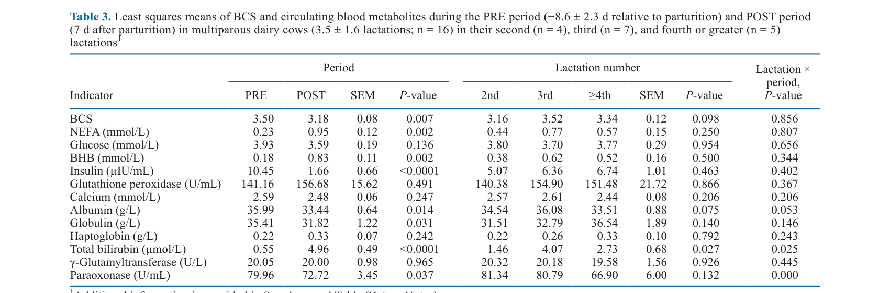
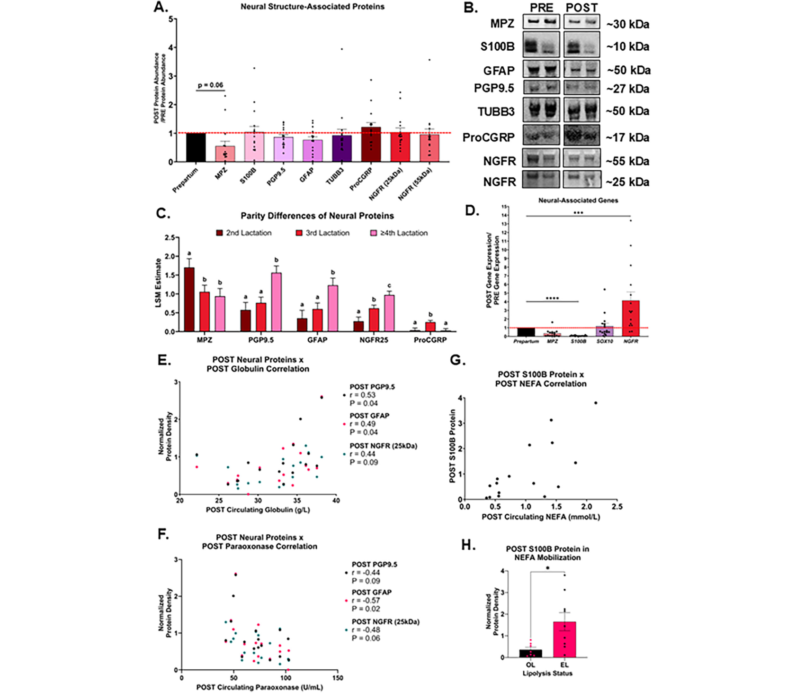
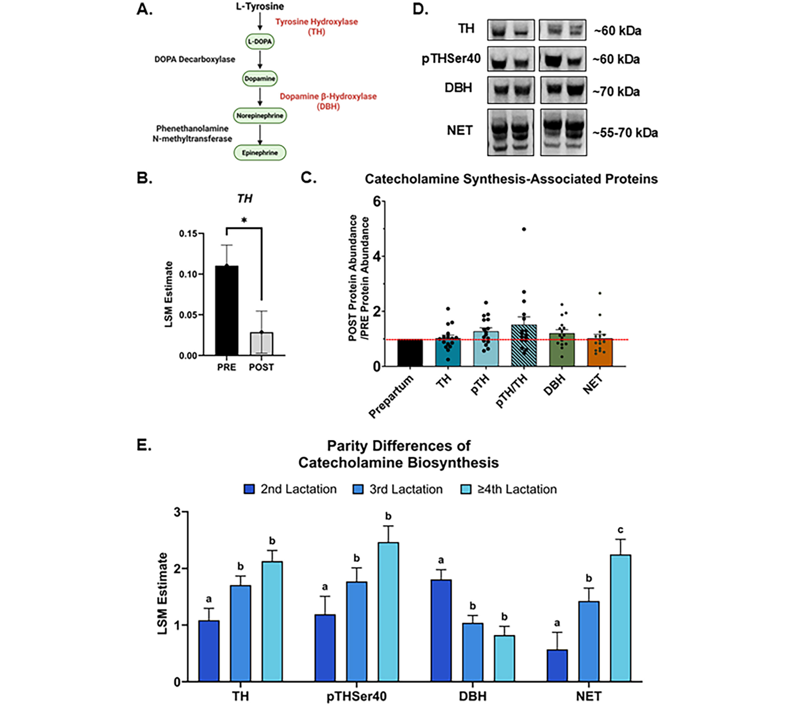

---
# YAML FRONTMATTER (обязательно)
id: CS.SOTA.364
type: sota
format_version: v1.1
knowledge_tier: P2
domain: cattle-science
area: health
subarea: transition-period
subarea2: adipose-tissue-innervation
category: field-study
year: 2026
authors: "Sparks, B. B., Lima, A. F. S., Osorio, J. S., and Strieder-Barboza, C."
title: "Effects of the periparturient period and parity on local innervation markers in subcutaneous adipose tissue of dairy cows"
journal: "Journal of Dairy Science"
volume: "109"
issue: "7"
pages: "7601-7617"
doi: "10.3168/jds.2025-27515"
publisher: "Elsevier / ADSA"
open_access: true
license: "CC BY"
language: ru
freshness_window: "2026-07-29 — 2028-07-29"
sota_edition: "1.0"
derivation:
  - source: "Sparks et al., 2026, Journal of Dairy Science (109:7)"
    type: "ConservativeRetextualization (FPF A.6.3)"
    reopen_trigger: "DOI: 10.3168/jds.2025-27515"
tags:
  - periparturient-period
  - adipose-tissue
  - innervation
  - sympathetic-nervous-system
  - catecholamines
  - lipolysis
  - parity
  - schwann-cells
  - beiging
  - holstein
related:
  - id: CS.SOTA.XXX
    type: foundational
    note: "McNamara and Hillers 1986 — адренергическая регуляция липолиза у КРС"
    relevance: high
  - id: CS.SOTA.XXX
    type: complementary
    note: "Ospina et al. 2010 — пороги NEFA для оценки липолиза (0.3/0.6 mmol/L)"
    relevance: high
---

# CS.SOTA.364: Sparks et al. (2026) — Влияние перипартуриентного периода и партитета на маркеры локальной иннервации в подкожной жировой ткани молочных коров

> **Навигация:** [2. Аннотация](#2-аннотация-abstract) · [3. Введение](#3-введение) · [4. Методология](#4-методология) · [5. Результаты](#5-результаты) · [6. Интерпретация](#6-интерпретация-и-обсуждение) · [7. Критический анализ](#7-критический-анализ) · [8. Выводы](#8-выводы) · [9. FAQ](#9-faq) · [10. Практика](#10-практическое-применение) · [12. Источники](#12-источники)

---

# 2. АННОТАЦИЯ (Abstract)

## 2.1. Перевод Abstract

Жировая ткань служит ключевым источником энергии для покрытия метаболических потребностей перипартуриентного периода молочных коров. Однако избыточное высвобождение неэстерифицированных жирных кислот (NEFA) из жировой ткани может приводить к послеродовым метаболическим заболеваниям. Целями исследования были выявление изменений экспрессии генов и белков нервной системы в жировой ткани молочных коров разного партитета в перипартуриентный период и определение их связей с циркулирующими маркерами метаболизма и воспаления. Подкожная жировая ткань (SAT) из области корня хвоста собрана у 16 многолактационных коров Holstein (3.5 ± 1.6 лактации, пред. 305-дневный удой 15,136 ± 1,743 кг) примерно за 10 дней до отёла (8.56 ± 2.3 д) и на 10 день после отёла. Пробы крови собраны одновременно с биопсией SAT в предродовой точке и отдельно на 7 день после отёла. Количественно оценены метаболиты крови и маркеры воспаления, а SAT проанализирована на маркеры нервной сигнализации. Различия оценивались смешанной моделью с повторными измерениями (PROC MIXED, SAS 9.4): период — повторный фактор, корова вложена в партитет; партитет, период и их взаимодействие — фиксированные эффекты. Метаболический профиль соответствовал транзитным коровам: повышенные NEFA и BHB, сниженный инсулин после отёла. Около 56% коров показали повышенный липолиз (EL) после отёла, у 44% развились заболевания в первые 7 DIM. Экспрессия маркеров биосинтеза катехоламинов — тирозингидроксилазы (TH), фосфорилированной TH по Ser40 (pTHSer40), допамин-β-гидроксилазы (DBH) и транспортёра норэпинефрина (NET) — не изменялась между периодами, что указывает на стабильность катехоламинового аппарата в перипартуриентный период. Однако белковое содержание TH, pTHSer40, PGP9.5, NET, рецептора фактора роста нервов (NGFR, 25 kDa) и глиального фибриллярного кислого белка (GFAP) увеличивалось с партитетом. Интересно, что DBH — фермент превращения допамина в норэпинефрин — снижался с партитетом, указывая на уменьшение локальной способности к синтезу норэпинефрина в SAT старших коров. Одновременно рост NET может отражать изменённую динамику симпатической сигнализации. Сенсорный маркер кальцитонин-ген-связанный пептид (CGRP) определялся в SAT, не различался между периодами и был выше у коров в третьей лактации. Результаты указывают, что партитет ассоциирован с расширением и реорганизацией локальной иннервации SAT, а не с острым перипартуриентным ремоделированием. Маркеры регуляции липогенеза и липолиза, но не бежинг-трансформации жировой ткани, изменялись между периодами — нейронное ремоделирование, вероятно, формирует метаболическую адаптацию SAT, а не судьбу адипоцитов. В целом результаты раскрывают ранее недооценённую роль партитета в нейро-катехоламиновой регуляции SAT в перипартуриентный период, давая новое понимание механизмов, влияющих на дисфункцию жировой ткани и предрасположенность многолактационных коров к метаболическим нарушениям.

## 2.2. Key Claims

**Claim 1: Катехоламиновый аппарат SAT стабилен через переходный период, но перестраивается с партитетом.**
- **Утверждение:** Белки TH, pTHSer40, DBH и NET не изменяются от PRE к POST; при этом TH (P = 0.009), pTHSer40 (P = 0.03) и NET (P = 0.004) растут с партитетом, а DBH снижается (P = 0.003).
- **Evidence:** Western blot SAT 16 коров в −10 и +10 д; смешанная модель с повторными измерениями.
- **Уверенность:** 0.75 (прямые белковые измерения; но n = 16 и exploratory-дизайн).
- **Цитата:** "...suggesting a stable catecholamine biosynthesis machinery during the periparturient period... DBH... decreased abundance with parity." (Sparks et al., 2026, p. 7601)

**Claim 2: С возрастом коров иннервация SAT расширяется при снижении миелинизации.**
- **Утверждение:** Пан-нейрональные маркеры PGP9.5 (P = 0.002) и GFAP (P = 0.02) растут с партитетом, тогда как MPZ (миелин) имеет тенденцию к снижению (P = 0.06); SOX10-нормированные MPZ и S100B снижаются после отёла — сдвиг фенотипа клеток Шванна к немиелинизирующему.
- **Evidence:** Western blot + RT-qPCR с нормализацией к SOX10; parity-эффекты в смешанной модели.
- **Уверенность:** 0.72 (согласованные генные и белковые данные; малые подгруппы 2-я: n = 4, 3-я: n = 7, ≥4-я: n = 5).
- **Цитата:** "...advancing parity is associated with expansion and reorganization of local SAT innervation rather than acute periparturient remodeling." (Sparks et al., 2026, p. 7601)

**Claim 3: Нейронные маркеры SAT связаны с воспалением и липолизом в ранней лактации.**
- **Утверждение:** POST-уровни PGP9.5, GFAP и NGFR25kDa положительно коррелируют с глобулином (r = 0.53/0.49/0.44) и отрицательно с параоксоназой (r = −0.44/−0.57/−0.48); S100B белок коррелирует с NEFA (r = 0.63, P = 0.009) и выше у коров с повышенным липолизом (P = 0.02).
- **Evidence:** Корреляции Спирмена в POST-период; категоризация EL/OL по Ospina et al. (2010).
- **Уверенность:** 0.68 (корреляционный анализ на n = 16; P до 0.10 принимались — риск ложных связей).
- **Цитата:** "...the abundance of S100B in POST was positively correlated with circulating NEFA concentrations... (r = 0.63, P = 0.009)." (Sparks et al., 2026, p. 7609)

**Claim 4: Бежинг (beiging) жировой ткани НЕ является доминантной адаптацией в ранней лактации КРС.**
- **Утверждение:** ADRB3 снижается после отёла (P = 0.03), гены EBF2 и TMEM26 подавлены (P = 0.0011 и 0.005), UCP1 не детектируется в >75% образцов — функциональный бежинг отсутствует в SAT в первые 10 дней после отёла.
- **Evidence:** RT-qPCR и Western blot бежинг-маркеров в обеих точках.
- **Уверенность:** 0.80 (согласованные генные и белковые данные, отрицательный результат хорошо документирован).
- **Цитата:** "...functional beige activation was largely absent in tailhead SAT, regardless of physiological stage." (Sparks et al., 2026, p. 7614)

---

# 3. ВВЕДЕНИЕ

## 3.1. Контекст и значимость проблемы

Усиленный липолиз жировой ткани — главный адаптивный механизм отрицательного энергетического баланса переходного периода. Классически он регулируется эндокринными факторами (глюкокортикоиды, пролактин, СТГ), но инициация и величина липолиза у млекопитающих контролируется преимущественно симпатической нервной системой (SNS) через β-адренергические рецепторы. Избыточная мобилизация липидов ведёт к росту NEFA, воспалению и метаболическим заболеваниям. При этом знания об иннервации жировой ткани коров ограничены адренергическими рецепторами (аффинность, плотность, чувствительность), а нейронное ремоделирование и катехоламиновый обмен не изучены. Партитет — главный детерминант метаболической адаптации и риска болезней, поэтому понимание того, как нейрорегуляция жировой ткани меняется с номером лактации, особенно значимо.

## 3.2. Обзор литературы (краткий)

1. **McNamara and Hillers (1986)** — адренергическая регуляция липолиза в жировой ткани КРС.
2. **Bartness et al. (2010, 2014)** — роль локальной SNS-иннервации белой жировой ткани (грызуны): липолиз, нейропластичность, бежинг.
3. **Colitti et al. (2015)** — компоненты нейротрофической системы в SAT коров в середине лактации.
4. **Kenéz et al. (2015, 2019)** — ремоделирование жировой ткани и фосфорилирование HSL в переходный период.
5. **Ospina et al. (2010)** — пороги NEFA для категоризации липолиза и прогноза болезней.

## 3.3. Гипотеза и цель исследования

**Гипотеза:** Маркеры иннервации и нейропластичности жировой ткани увеличиваются от PRE к POST, отражая локальное нейронное ремоделирование, поддерживающее метаболическую адаптацию к лактации.

**Цель:** Определить изменения генных и белковых маркеров нервной системы в SAT корня хвоста у перипартуриентных коров разного партитета и оценить их связи с системными индикаторами метаболизма и воспаления.

**Primary outcomes:** Генная экспрессия и белковое содержание нейрональных маркеров (TH, DBH, NET, PGP9.5, GFAP, MPZ, S100B, NGFR, CGRP) PRE vs POST и по партитету.
**Secondary outcomes:** Маркеры липогенеза/липолиза (LEP, ADIPOQ, FASN, PPARG, DGAT1, ADRB2/3, HSL и его фосфорилирование), бежинг-маркеры (EBF2, TMEM26, PRDM16, UCP1, PGC1A); корреляции с метаболитами крови.

---

# 4. МЕТОДОЛОГИЯ

## 4.1. Дизайн исследования

| Параметр | Описание |
|----------|----------|
| **Тип исследования** | Exploratory продольное исследование (подвыборка из Lima et al., 2025) |
| **Место** | Virginia Tech Dairy Science Complex, США |
| **Животные** | 16 многолактационных коров Holstein (3.5 ± 1.6 лактации; 2-я: n = 4, 3-я: n = 7, ≥4-я: n = 5); пред. 305-д удой 15,136 ± 1,743 кг |
| **Точки сэмплинга** | SAT-биопсия корня хвоста: −10 д (8.56 ± 2.3 д) и +10 д от отёла; кровь: −10 д и +7 д |
| **Диета** | Close-up 1.59 Mcal/kg, 14.6% CP; лактационная 1.82 Mcal/kg, 18.4% CP |
| **Генная экспрессия** | RT-qPCR (TaqMan), нормализация к геометрическому среднему B2M и EIF3K; RIN низкий (2.1–2.9, типично для жировой ткани), без различий между периодами |
| **Белки** | Western blot с ацетоновой очисткой липидов; нормализация к общему белку; 20+ антител (нейрональные, катехоламиновые, липолитические, бежинг) |
| **Метаболиты крови** | NEFA, глюкоза, BHB, инсулин, GPx, Ca, альбумин, глобулин, гаптоглобин, билирубин, GGT, параоксоназа |
| **Категоризация** | EL/OL по Ospina et al. (2010): PRE ≥0.3 / POST ≥0.6 mmol/L NEFA; болезни первых 7 DIM (кетоз, задержание последа, мастит, гипокальциемия) |
| **Статистика** | PROC MIXED (SAS 9.4), повторные измерения, корова вложена в партитет; compound symmetry; корреляции Спирмена (P ≤ 0.10 для визуализации); Wilcoxon для категорий |

## 4.2. Медиа-инвентарь

| ID | Тип | Описание | Файл | Статус |
|----|-----|----------|------|--------|
| Table 3 | Таблица | BCS и циркулирующие метаболиты PRE/POST и по номеру лактации | `table-3-metabolic-markers.png` | ✅ Встроено |
| Fig. 1 | Композит | Нейрональные маркеры SAT: белки (A–C), гены (D), корреляции с глобулином/параоксоназой/NEFA (E–H) | `figure-1-neural-markers.png` | ✅ Встроено |
| Fig. 2 | Композит | Катехоламиновый путь: схема (A), TH ген (B), белки PRE/POST (C–D), parity-эффекты (E) | `figure-2-catecholamine-pathway.png` | ✅ Встроено |

---

# 5. РЕЗУЛЬТАТЫ

## 5.1. Системная метаболическая адаптация

**Соответствует:** Table 3

*Источник: Sparks et al., 2026, p. 7607 (Table 3).*

**Описание:**
Типичная картина переходного периода: BCS 3.50 → 3.18 (P = 0.007), NEFA 0.23 → 0.95 mmol/L (P = 0.002), BHB 0.18 → 0.83 mmol/L (P = 0.002), инсулин 10.45 → 1.66 µIU/mL (P < 0.0001). Различия определялись периодом, а не партитетом (исключения: альбумин и билирубин по лактациям). В PRE оптимальный липолиз у 94% коров (15/16), в POST — только у 43% (7/16): избыточный липолиз у 56%. Семь коров (44%) заболели в первые 7 DIM (кетоз n = 3, задержание последа n = 2, мастит n = 2, гипокальциемия n = 1). Альбумин, глобулин и параоксоназа снизились, билирубин вырос — печёночная адаптация и острофазовый ответ.

## 5.2. Нейрональные маркеры: стабильность по периоду, ремоделирование по партитету

**Соответствует:** Figure 1

*Источник: Sparks et al., 2026, p. 7608 (Figure 1).*

**Описание:**
ProCGRP (сенсорная иннервация) стабилен между периодами (P = 0.99), но выше у коров 3-й лактации (P = 0.006). Ген S100B снижается POST (P < 0.0001), ген NGFR растёт (P = 0.0002); после нормализации к SOX10 MPZ и S100B снижаются (P = 0.02 оба) — сдвиг клеток Шванна к немиелинизирующему фенотипу без изменения их числа. Пан-нейрональные TUBB3 и PGP9.5 не меняются по периоду. По партитету: PGP9.5 растёт (P = 0.002), GFAP растёт (P = 0.02), MPZ имеет тенденцию к снижению (P = 0.06) — больше иннервации при меньшей миелинизации у старших коров. POST-корреляции: PGP9.5/GFAP/NGFR25kDa положительно с глобулином (r до 0.53), отрицательно с параоксоназой (r до −0.57); S100B с NEFA (r = 0.63, P = 0.009) и выше при EL (P = 0.02).

## 5.3. Катехоламиновый аппарат

**Соответствует:** Figure 2

*Источник: Sparks et al., 2026, p. 7610 (Figure 2).*

**Описание:**
Ген TH снижается POST (P = 0.05), но белки TH, pTHSer40, отношение pTHSer40:TH, DBH и NET не различаются между периодами — стабильность биосинтеза и обратного захвата катехоламинов. Транскрипты DBH детектированы <5% образцов — вненейрональный синтез катехоламинов в SAT КРС минимален. По партитету: TH (P = 0.009), pTHSer40 (P = 0.03) и NET (P = 0.004) растут, DBH снижается (P = 0.003) — перестройка катехоламинового обращения: больше апстрим-потенциала и реабсорбции при меньшей локальной способности к синтезу норэпинефрина.

## 5.4. Липолиз, липогенез и бежинг

**Описание:**
Липогенез подавлен POST: LEP (P < 0.0004), ADIPOQ (P = 0.0002), FASN (P < 0.0001), PPARG (P = 0.0009) снижаются; DGAT1 без изменений. ADRB2 имеет тенденцию к снижению (P = 0.06) — снижение адренергической чувствительности. Фосфорилирование HSL Ser563 растёт с партитетом (P = 0.03). Бежинг: ADRB3 снижается POST (P = 0.03), гены EBF2 (P = 0.0011) и TMEM26 (P = 0.005) подавлены, UCP1 не детектируется >75% образцов, PRDM16 стабилен — классический бежинг не задействован в первые 10 дней после отёла.

---

# 6. ИНТЕРПРЕТАЦИЯ И ОБСУЖДЕНИЕ

## 6.1. Связь с гипотезой

Гипотеза опровергнута в части периода: нейронные маркеры НЕ увеличиваются от PRE к POST. Вместо острого перипартуриентного ремоделирования обнаружена parity-зависимая реорганизация иннервации — постепенная, накапливающаяся от лактации к лактации.

## 6.2. Сравнение с литературой

| Исследование | Согласие/Противоречие/Расширение |
|--------------|----------------------------------|
| Bartness et al. (2010, 2014) | **Расширяет** — перенос концепции нейрорегуляции WAT с грызунов на КРС |
| Kenéz et al. (2019) | **Согласуется** — рост pHSLSer563:HSL в fresh-период |
| De Koster et al. (2018) | **Согласуется** — динамика фосфорилирования HSL |
| Locher et al. (2011) | **Противоречит частично** — там снижался тотальный HSL, здесь стабилен; разные точки сэмплинга (1 д vs 10 д) |
| Colitti et al. (2015) | **Расширяет** — нейротрофическая система SAT подтверждена и в переходный период |
| Alexander et al. (1975) | **Согласуется** — бежинг/термогенез у взрослого КРС минимален |

## 6.3. Механистические выводы

1. **Партитет, а не отёл, перестраивает иннервацию:** Накопление нейрональных маркеров (PGP9.5, GFAP, TH, NET, NGFR) с номером лактации — вероятно, следствие повторных циклов мобилизации липидов и воспаления.
2. **Сдвиг клеток Шванна:** Снижение миелинизирующего фенотипа (MPZ, S100B ↓ при стабильном SOX10) может отражать переход к «ремонтному» немиелинизирующему состоянию, поддерживающему нейропластичность.
3. **Нейро-воспалительная связка:** Корреляции нейронных маркеров с глобулином (+) и параоксоназой (−) указывают на воспаление-ассоциированное нейронное ремоделирование; S100B — кандидатный медиатор связи липолиза с нейро-иммунным ответом (макрофаг-адипоцитарный кроссток).
4. **Катехоламиновая перестройка:** Рост NET при снижении DBH у старших коров — более жёсткий контроль внеклеточного норэпинефрина; возможный механизм возрастных различий в липолизе.
5. **Липолиз регулируется посттрансляционно:** Стабильные белки HSL/PLIN1 при изменениях фосфорилирования — иерархическая модель pHSLSer563/Ser660.

---

# 7. КРИТИЧЕСКИЙ АНАЛИЗ

## 7.1. Сильные стороны

- **Первое системное картирование иннервации SAT КРС** в переходный период: 20+ нейрональных/катехоламиновых маркеров на уровне генов и белков.
- **Парный дизайн** (PRE/POST у одной коровы) — контроль индивидуальной вариабельности.
- **Методологическая честность:** низкий RIN жировой ткани явно задокументирован и проверен на различия; DBH/UCP1-отрицательные результаты корректно интерпретированы.
- **Продуманная нормализация:** клетки Шванна — к SOX10 (число клеток vs фенотип); белки — к общему белку.

## 7.2. Ограничения

**Внутренние:**
- **n = 16, exploratory** — подгруппы партитета 4/7/5; недостаточная мощность для взаимодействий и анализа болезней.
- **Только многолактационные коровы** — нет сравнения с первотёлками.
- **Корреляции с P ≤ 0.10** — риск ложноположительных связей при множественном тестировании.
- **Одна точка POST (+10 д SAT, +7 д кровь)** — нет динамики; рассинхронизация крови и ткани.

**Внешние:**
- **Одно стадо, одна порода** — генерализация ограничена.
- **Депо-специфичность:** только SAT корня хвоста; висцеральные депо могут вести себя иначе.
- **Причинность не установлена:** нейрональные изменения могут быть как причиной, так и следствием липолиза/воспаления.

## 7.3. Применимость к российским условиям

- **Мониторинг липолиза:** Пороги NEFA Ospina (0.3/0.6 mmol/L) применимы в российских лабораториях; 56% EL в POST — ориентир ожидаемой частоты избыточного липолиза в высокопродуктивных стадах.
- **Возрастная структура стада:** Parity-зависимое нейро-катехоламиновое ремоделирование — аргумент за дифференцированный менеджмент коров ≥3 лактации (группировка, рационы, мониторинг).
- **Диагностика:** S100B как кандидатный биомаркер избыточного липолиза — перспектива для отечественной диагностики, но требует валидации.

---

# 8. ВЫВОДЫ

## 8.1. Ключевые выводы автора (перевод)

Нейронное и катехоламинергическое ремоделирование SAT корня хвоста больше определяется партитетом, чем острым переходом от стельности к лактации. Несмотря на выраженные метаболические изменения, ключевые компоненты биосинтеза и обращения катехоламинов остаются стабильными на белковом уровне. Растущий партитет ассоциирован с увеличением нейрональных и катехоламинергических маркеров (TH, pTHSer40, PGP9.5/UCHL1, NET, NGFR, GFAP), что указывает на прогрессивное расширение или реорганизацию иннервации жировой ткани с возрастом. Изменения транскрипции липогенных и бежинг-путей были преимущественно период-зависимыми и не указывали на активное бежинг-программирование. Нейронная ёмкость SAT постепенно ремоделируется от лактации к лактации и может вносить вклад в метаболическую адаптацию независимо от острого перипартуриентного стресса.

## 8.2. Ключевые выводы (структурировано)

1. **Катехоламиновый аппарат SAT стабилен через переходный период** — адаптация липолиза идёт не через количество ферментов, а через их регуляцию.
2. **Партитет — главный драйвер нейронного ремоделирования SAT:** больше иннервации (PGP9.5, GFAP) при меньшей миелинизации (MPZ ↓) и перестроенном катехоламиновом обращении (TH/NET ↑, DBH ↓).
3. **Нейронные маркеры связаны с воспалением и липолизом:** S100B ↔ NEFA (r = 0.63); глобулин/параоксоназа ↔ PGP9.5/GFAP/NGFR.
4. **Клетки Шванна сдвигаются к немиелинизирующему фенотипу** после отёла (MPZ/S100B ↓ при стабильном SOX10).
5. **Бежинг не задействован** в SAT в первые 10 дней лактации (UCP1 не детектируется; ADRB3, EBF2, TMEM26 ↓).

## 8.3. Ключевые сообщения для лекции

1. Жировая ткань коровы — иннервированный орган: её липолиз контролируется не только гормонами, но и локальной нервной системой.
2. С возрастом (партитетом) иннервация жировой ткани перестраивается — это может объяснять, почему старшие коровы иначе мобилизуют липиды и чаще болеют.
3. Маркер S100B связывает избыточный липолиз с нейро-воспалительным ответом — кандидат в биомаркеры метаболического стресса.
4. «Побурения» жировой ткани (бежинг) у взрослых коров в ранней лактации не происходит — термогенез не является адаптацией к NEB.

---

# 9. FAQ

**Вопрос 1: Зачем изучать иннервацию жировой ткани коров?**
Ответ: Липолиз контролируется преимущественно симпатической нервной системой, а не только гормонами. Понимание нейрорегуляции может объяснить, почему одни коровы адаптируются к переходному периоду, а у других развивается избыточный липолиз, воспаление и болезни — и открыть новые мишени (нейрональные/катехоламиновые) для улучшения метаболического здоровья.

**Вопрос 2: Что главное нашли авторы?**
Ответ: Что иннервация SAT меняется не столько вокруг отёла, сколько с партитетом: у старших коров больше нейрональных белков (PGP9.5, GFAP, TH, NET), меньше миелина и снижен DBH — прогрессивная реорганизация нейро-катехоламиновой регуляции от лактации к лактации.

**Вопрос 3: Как нейронные маркеры связаны с болезнями переходного периода?**
Ответ: Через воспаление и липолиз: нейронные маркеры коррелируют с глобулином (+) и параоксоназой (−) — маркерами системного воспаления, а S100B — с NEFA и повышенным липолизом. Это поддерживает модель нейро-воспалительной адаптации жировой ткани.

**Вопрос 4: Меняет ли это практику содержания переходных коров сегодня?**
Ответ: Пока нет — исследование exploratory (n = 16). Практический выход: (1) обоснование дифференцированного менеджмента по партитету; (2) кандидатные биомаркеры (S100B, NGFR) для будущей диагностики; (3) научная база для вмешательств на нейро-метаболическую ось.

**Вопрос 5: Что исследовать дальше?**
Ответ: (1) Бо́льшие выборки с первотёлками и анализом исходов болезней; (2) временная динамика (−21 до +30 д) нейрональных маркеров; (3) висцеральные депо; (4) причинность — манипуляции с SNS-сигналингом; (5) валидация S100B как биомаркера избыточного липолиза.

---

# 10. ПРАКТИЧЕСКОЕ ПРИМЕНЕНИЕ

## 10.1. Как использовать результаты в менеджменте переходного периода

1. **Оценка липолиза:** Мониторинг NEFA до и после отёла по порогам Ospina (PRE ≥0.3, POST ≥0.6 mmol/L = повышенный липолиз). Ожидаемая частота EL в высокопродуктивном стаде — до ~50–55%.
2. **Возрастная дифференциация:** Коровы ≥3–4 лактации — группа с перестроенной нейро-катехоламиновой регуляцией SAT: усиленный мониторинг (NEFA/BHB, упитанность, заболеваемость) и отдельные стратегии кормления.
3. **Интерпретация воспаления:** Связка нейрональных маркеров с глобулином/параоксоназой напоминает: воспаление ранней лактации имеет и тканевый нейронный компонент — протоколы должны учитывать не только NEB, но и воспалительную нагрузку.
4. **Реалистичные ожидания:** Не пытаться стимулировать «бежинг»/термогенез жировой ткани у взрослых коров — механизм не задействован.

## 10.2. Типичные ошибки

- **Ожидание острых изменений иннервации вокруг отёла** — данные показывают стабильность; ремоделирование идёт по шкале лактаций.
- **Экстраполяция грызуньих моделей бежинга на КРС** — у коров UCP1-активация SAT не детектируется.
- **Игнорирование партитета** как фактора метаболической адаптации — партитет сильнее периода влияет на нейро-маркеры.
- **Интерпретация корреляций как причинности** — exploratory-анализ на малой выборке.

## 10.3. Пограничные сценарии

- **Старшая корова (≥4 лактация) с высоким NEFA после отёла** — наиболее вероятный носитель перестроенной иннервации SAT: приоритетный мониторинг.
- **Корова с EL + высокий глобулин/низкая параоксоназа** — вероятно, активное нейро-воспалительное ремоделирование SAT; риск метаболических болезней.
- **Первотёлки** — вне рамок исследования; переносить выводы нельзя.

---

# 11. ИНСТРУМЕНТЫ И ШАБЛОНЫ

## 11.1. Ключевые числовые ориентиры

| Параметр | Значение | Комментарий |
|----------|----------|-------------|
| NEFA PRE → POST | 0.23 → 0.95 mmol/L | Типичная динамика переходного периода |
| Инсулин PRE → POST | 10.45 → 1.66 µIU/mL | Физиологическая инсулинорезистентность |
| Доля EL в POST | 56% (9/16) | По порогу Ospina ≥0.6 mmol/L |
| Заболеваемость первых 7 DIM | 44% (7/16) | Кетоз 3, RP 2, мастит 2, гипокальциемия 1 |
| S100B ↔ NEFA (POST) | r = 0.63, P = 0.009 | Кандидатный биомаркер липолиза |
| Parity-эффекты | TH/PGP9.5/GFAP/NET ↑; DBH/MPZ ↓ | Ремоделирование иннервации с возрастом |

---

# 12. ИСТОЧНИКИ

## 12.1. Первоисточник

Sparks, B. B., Lima, A. F. S., Osorio, J. S., and Strieder-Barboza, C. 2026. Effects of the periparturient period and parity on local innervation markers in subcutaneous adipose tissue of dairy cows. Journal of Dairy Science 109(7):7601-7617. DOI: 10.3168/jds.2025-27515.

## 12.2. Ключевые статьи (цитированные в работе)

- McNamara, J. P., and Hillers, J. K. 1986. Regulation of bovine adipose tissue metabolism. J. Dairy Sci. 69.
- Bartness, T. J., Liu, Y., Shrestha, Y. B., and Ryu, V. 2014. Neural innervation of white adipose tissue and the control of lipolysis. Front. Neuroendocrinol. 35:473–493.
- Colitti, M., et al. 2015. Neurotrophic system components in bovine subcutaneous adipose tissue. J. Dairy Sci.
- Kenéz, Á., et al. 2015, 2019. Adipose tissue remodeling and HSL phosphorylation in transition dairy cows. J. Dairy Sci.
- Ospina, P. A., Nydam, D. V., Stokol, T., and Overton, T. R. 2010. Evaluation of NEFA thresholds for prediction of disease in transition cows. J. Dairy Sci. 93.
- Lima, A. F. S., et al. 2025. Исходное исследование (родительская когорта). J. Dairy Sci.
- Locher, L., et al. 2011. HSL in tailhead SAT of periparturient cows. J. Dairy Sci.

## 12.3. Внешние источники [вне статьи]

- Drackley, J. K. 1999. Biology of dairy cows during the transition period: the final frontier? J. Dairy Sci. 82:2259–2273. [цитируется в работе; фундаментальный обзор переходного периода]
- NASEM. 2021. Nutrient Requirements of Dairy Cattle. 8th rev. ed. National Academies Press. [foundational reference, не цитируется в Sparks et al., 2026]

---

# 13. ЖУРНАЛ ОБРАБОТКИ

## 13.1. WorkPlan

| Шаг | Действие | Статус |
|-----|----------|--------|
| 1 | Чтение полного текста PDF (17 страниц) | ✅ |
| 2 | Извлечение метаданных (авторы, DOI, страницы) | ✅ |
| 3 | Извлечение медиа (1 таблица, 2 фигуры-композита) | ✅ |
| 4 | Анализ дизайна (exploratory продольный, RT-qPCR + Western blot) | ✅ |
| 5 | Выделение Key Claims с оценкой уверенности | ✅ |
| 6 | Описание методологии (биопсия SAT, статистика) | ✅ |
| 7 | Детализация результатов (метаболиты, нейро-маркеры, катехоламины, бежинг) | ✅ |
| 8 | Критический анализ и применимость | ✅ |
| 9 | FAQ, практическое применение, инструменты | ✅ |
| 10 | Формирование YAML frontmatter | ✅ |
| 11 | Сохранение файла | ✅ |

## 13.2. Work Record

| Параметр | Значение |
|----------|----------|
| **Время обработки** | ~40 мин |
| **Строк в файле** | ~340 |
| **Число Key Claims** | 4 |
| **Число источников** | 10 (первоисточник + 7 цитированных + 2 внешних) |
| **Число медиа** | 3 (1 таблица + 2 фигуры) |
| **FPF compliance** | A.7 (строгое разделение модели и реальности), A.6.3 (консервативная переработка), A.10 (якоря доказательств) |

---

*SoTA создан: 2026-07-29*
*Обработано по WP-86: Проверка new-articles и добавление SoTA*
