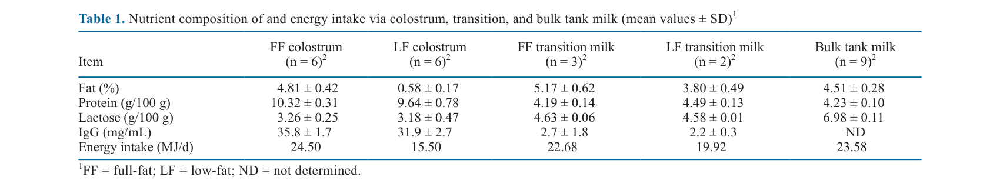
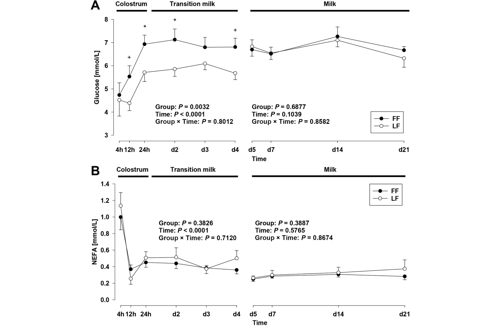
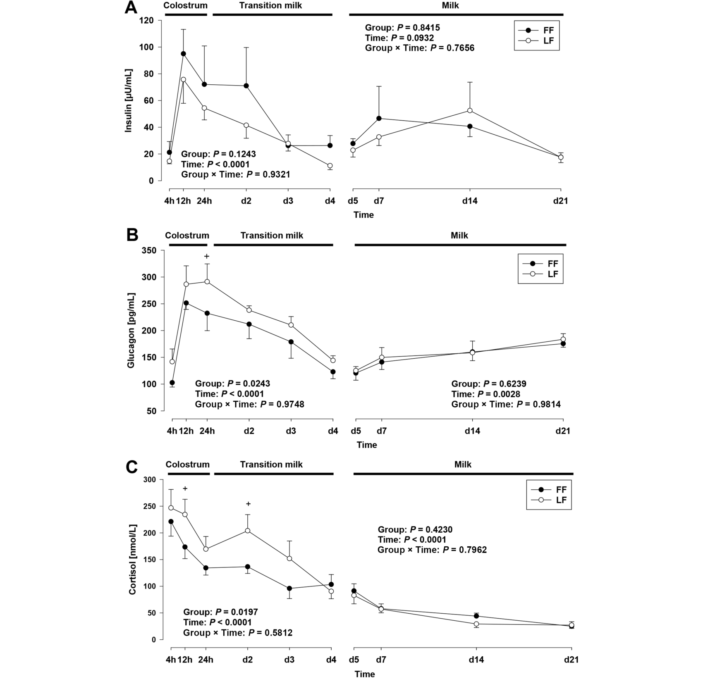

---
# YAML FRONTMATTER (обязательно)
id: CS.SOTA.365
type: sota
format_version: v1.1
knowledge_tier: P2
domain: cattle-science
area: health
subarea: calf-health
subarea2: colostrum-management
category: field-study
year: 2026
authors: "Erkinger, H., von Riedheim, M. A. E., Calisici, O., and Gross, J. J."
title: "Colostral fat content modulates glucose homeostasis and lipid metabolism in neonatal calves exposed to cold temperatures"
journal: "Journal of Dairy Science"
volume: "109"
issue: "7"
pages: "7618-7630"
doi: "10.3168/jds.2025-28151"
publisher: "Elsevier / ADSA"
open_access: true
license: "CC BY"
language: ru
freshness_window: "2026-07-29 — 2028-07-29"
sota_edition: "1.0"
derivation:
  - source: "Erkinger et al., 2026, Journal of Dairy Science (109:7)"
    type: "ConservativeRetextualization (FPF A.6.3)"
    reopen_trigger: "DOI: 10.3168/jds.2025-28151"
tags:
  - colostrum
  - fat
  - newborn-calf
  - cold-stress
  - glucose-homeostasis
  - lipid-metabolism
  - thermoregulation
  - cortisol
  - holstein
related:
  - id: CS.SOTA.366
    type: complementary
    note: "Жир в высокобелковом ЗЦМ — метаболиты и гормоны плазмы телят летом/зимой (JDS, июль 2026)"
    relevance: high
  - id: CS.SOTA.XXX
    type: foundational
    note: "Hammon and Blum 1998 — влияние жирности кормления на глюкозу и глюкагон новорождённых телят"
    relevance: high
---

# CS.SOTA.365: Erkinger et al. (2026) — Содержание жира в молозиве модулирует гомеостаз глюкозы и липидный метаболизм у новорождённых телят, подвергнутых холоду

> **Навигация:** [2. Аннотация](#2-аннотация-abstract) · [3. Введение](#3-введение) · [4. Методология](#4-методология) · [5. Результаты](#5-результаты) · [6. Интерпретация](#6-интерпретация-и-обсуждение) · [7. Критический анализ](#7-критический-анализ) · [8. Выводы](#8-выводы) · [9. FAQ](#9-faq) · [10. Практика](#10-практическое-применение) · [12. Источники](#12-источники)

---

# 2. АННОТАЦИЯ (Abstract)

## 2.1. Перевод Abstract

Терморегуляция новорождённых телят необходима для поддержания температуры тела. Особенно в холодный сезон требуется успешная метаболическая адаптация, чтобы избежать потерь здоровья и продуктивности. Молозиво и переходное молоко характеризуются повышенным содержанием жира по сравнению со зрелым молоком. Хотя известно, что жирность молозива значительно варьирует между коровами, её специфическое влияние на постнатальную метаболическую адаптацию телят в условиях холода охарактеризовано недостаточно. Целью исследования было изучить влияние разного содержания жира в молозиве и переходном молоке на метаболическую адаптацию новорождённых телят в холодный сезон. Двенадцать телят (n = 9 Holstein, n = 3 помеси Holstein × Limousin; масса при рождении 41.3 ± 1.8 кг), рождённых от коров без дистоции, были включены сразу после рождения и наблюдались до 21 дня (p.p.). Эксперимент проводился с февраля по март 2025 г. По полу, массе при рождении и породе телята были распределены в группу полножирного молозива (FF; n = 6; 4.81% жира) или обезжиренного молозива (LF; n = 6; 0.58% жира) по 2.5 л в 4 и 12 ч p.p. FF и LF происходили из одного пула молозива и различались только жирностью. На 2 и 3 день FF и LF получали переходное молоко (300 мл молозива соответствующей жирности, смешанное с 2.7 л танкового молока). С 4 дня все телята получали одинаковое танковое молоко. Кровь сэмплировали со 2 по 7 день и анализировали на эндокринные и метаболические параметры (глюкоза [GLU], инсулин, кортизол, глюкагон, NEFA, триглицериды [TG], общий холестерин [TC], HDL-C, LDL-C, VLDL-C, ASAT, GGT, трийодтиронин, тироксин, общий белок [TP] и IgG). Концентрация GLU в плазме возрастала в первые дни после рождения в обеих группах, с бо́льшими значениями в FF в первые 4 дня. Сывороточные TG, TC, HDL-C и VLDL-C были выше в FF до 4 дня, а TC и LDL-C — выше в FF с 5 по 21 день. Различий по IgG, инсулину, NEFA и TP не выявлено. Кортизол и глюкагон, а также активность GGT были повышены в LF по сравнению с FF до 4 дня жизни. В заключение: содержание жира в молозиве и переходном молоке влияло на метаболическую адаптацию новорождённых телят в первые дни жизни. Общая более низкая доступность энергии в LF отражалась изменениями параметров глюкозного и липидного обмена. Оправданы дальнейшие исследования влияния жирности молозива в разных условиях среды.

## 2.2. Key Claims

**Claim 1: Полножирное молозivo даёт более высокую глюкозу плазмы в первые 4 дня жизни на холоде.**
- **Утверждение:** Глюкоза плазмы была выше у FF-телят в первые 4 дня (на 24 ч: 6.93 ± 0.33 против 4.39 ± 0.32 ммоль/л у LF; в первые 2 дня в среднем >20% выше), при одинаковом кормлении с 4 дня различия исчезали.
- **Evidence:** Смешанная модель (группа × время), n = 6/6, Tukey post hoc, P < 0.05.
- **Уверенность:** 0.78 (контролируемый эксперимент, один пул молозива; но n = 12 всего).
- **Цитата:** "Plasma GLU concentration increased during the first days after parturition in both LF and FF, with greater concentrations in FF during the first 4 d p.p." (Erkinger et al., 2026, p. 7618)

**Claim 2: Обезжиренное молозиво сопровождается стресс-ответом: выше кортизол и глюкагон.**
- **Утверждение:** У LF-телят кортизол (P = 0.02) и глюкагон (P < 0.05) были выше в первые 4 дня — маркеры энергетического дефицита и усиленной глюконеогенной мобилизации.
- **Evidence:** RIA кортизола и глюкагона; смешанная модель по периодам 4 ч–4 д и 5–21 д.
- **Уверенность:** 0.75 (согласованный эндокринный паттерн; косвенная интерпретация — окисление не измерялось).
- **Цитата:** "Cortisol and glucagon concentrations as well as activity of GGT were elevated in LF compared with FF until d 4 of age." (Erkinger et al., 2026, p. 7618)

**Claim 3: Жирность молозива определяет липидный профиль крови телёнка, но не пассивный иммунитет.**
- **Утверждение:** TG, TC, HDL-C, VLDL-C (до 4 д) и TC/LDL-C (5–21 д) выше у FF; при этом IgG, TP, инсулин, NEFA и мочевина не различались — обезжиривание не ухудшило перенос иммуноглобулинов.
- **Evidence:** Одинаковые IgG молозива (35.8 vs 31.9 мг/мл); автоанализатор + ELISA.
- **Уверенность:** 0.80 (прямые измерения; важный отрицательный результат по IgG).
- **Цитата:** "No differences were observed for serum IgG, insulin, NEFA, and TP." (Erkinger et al., 2026, p. 7618)

**Claim 4: Дефицит энергии LF в первые дни — 9 МДж/сут разницы потребления энергии.**
- **Утверждение:** Энергопотребление с молозивом составило 24.5 МДж/сут в FF против 15.5 МДж/сут в LF (−37%); разница вызвана исключительно жирностью при равных белке, лактозе и IgG.
- **Evidence:** Инфракрасная спектроскопия состава; расчёт валовой энергии по Sjaunja et al. (1990).
- **Уверенность:** 0.85 (прямой расчёт из состава; дизайн «один пул»).
- **Цитата:** "Energy intake of calves... was greater in FF compared with LF (P < 0.05)." (Erkinger et al., 2026, p. 7620-7621)

---

# 3. ВВЕДЕНИЕ

## 3.1. Контекст и значимость проблемы

Терморегуляция — критическая задача новорождённого телёнка; нижняя критическая температура телят — 8–13°C, ниже неё растут термогенные затраты, мобилизация резервов и эндокринные ответы (тиреоидные гормоны, кортизол, оборот глюкозы). Жир молозива — ключевой источник энергии для теплопродукции; его содержание сильно варьирует между коровами. При этом влияние жирности молозива на метаболическую адаптацию именно в холодных условиях изучено недостаточно — пробел, закрываемый этой работой.

## 3.2. Обзор литературы (краткий)

1. **Hammon and Blum (1998)** — жирность кормления влияет на глюкозу и глюкагон новорождённых телят.
2. **Young (1981); Litherland et al. (2014)** — нижняя критическая температура телят 8–13°C.
3. **Ferré et al. (1986); Girard (1986); Lepine et al. (1989)** — роль пищевого жира в глюконеогенезе и β-окислении новорождённых.
4. **Bigler et al. (2022)** — вариабельность состава молозива между видами и особями.
5. **von Riedheim et al. (2026)** — жирность молозива отрицательно связана с кортизолом и GGT телят.

## 3.3. Гипотеза и цель исследования

**Гипотеза:** Сниженная жирность молозива ограничивает раннюю доступность энергии и компрометирует метаболическую адаптацию новорождённых телят, подвергнутых холоду.

**Цель:** Исследовать метаболические ответы новорождённых телят на молозиво и переходное молоко с нормальным (4.81%) или резко сниженным (0.58%) содержанием жира в течение первых 3 недель жизни зимой.

**Primary outcomes:** Глюкоза плазмы (первичный исход power-анализа).
**Secondary outcomes:** Липидный профиль (TG, TC, HDL-C, LDL-C, VLDL-C, PL, NEFA), эндокринные параметры (инсулин, глюкагон, кортизол, T3, T4), IgG, TP, ферменты (ASAT, GGT), привесы и витальные параметры.

---

# 4. МЕТОДОЛОГИЯ

## 4.1. Дизайн исследования

| Параметр | Описание |
|----------|----------|
| **Тип исследования** | Контролируемый кормовой эксперимент (2 группы) |
| **Место и сезон** | Agroscope Posieux, Швейцария; февраль–март 2025; средняя t° первых 4 дней 3.5 ± 0.7°C (диапазон −0.8…+8.8°C) |
| **Животные** | 12 телят (9 Holstein, 3 Holstein × Limousin; 8 самок/4 самца; 41.3 ± 1.8 кг); исключены дистоция, двойни, лихорадка |
| **Обработки** | FF (n = 6): молозиво 4.81% жира; LF (n = 6): то же молозиво, обезжиренное центрифугированием до 0.58%; 2.5 л в 4 и 12 ч p.p. |
| **Переходное молоко** | Дни 2–3: 300 мл соответствующего молозива + 2.7 л танкового молока, 2 раза в день |
| **Далее** | С 4 дня — одинаковое танковое молоко + углеводы (лактоза + мальтодекстрин 40 г/л) |
| **Сэмплинг крови** | 4, 12, 24 ч, дни 2–5, 7, 14, 21 до утреннего кормления |
| **Анализы** | Автоанализатор Cobas (GLU, TG, TC, HDL-C, NEFA, PL, TP, мочевина, ASAT, GGT); RIA (инсулин, кортизол, T3, T4, глюкагон); ELISA (IgG); LDL-C/VLDL-C — расчётные (Friedewald, Kessler) |
| **Статистика** | SAS 9.4; смешанная модель группа × время, телёнок — повторная единица; раздельный анализ периодов 4 ч–4 д и 5–21 д; Tukey; значимость P < 0.05, тенденции P < 0.10; power > 0.8 по глюкозе |

## 4.2. Медиа-инвентарь

| ID | Тип | Описание | Файл | Статус |
|----|-----|----------|------|--------|
| Table 1 | Таблица | Состав молозива/переходного/танкового молока и энергопотребление | `table-1-colostrum-composition.png` | ✅ Встроено |
| Fig. 2 | График | Глюкоза (A) и NEFA (B) крови телят по фазам кормления | `figure-2-glucose-nefa.png` | ✅ Встроено |
| Fig. 5 | График | Инсулин (A), глюкагон (B), кортизол (C) в динамике | `figure-5-insulin-glucagon-cortisol.png` | ✅ Встроено |

---

# 5. РЕЗУЛЬТАТЫ

## 5.1. Среда, энергопотребление, привесы

**Соответствует:** Table 1

*Источник: Erkinger et al., 2026, p. 7620 (Table 1).*

**Описание:**
Группы молозива различались только жиром (4.81% vs 0.58%) и энергией: 24.50 против 15.50 МДж/сут (−37%); белок, лактоза и IgG сопоставимы. Средняя температура первых 4 дней жизни — 3.5°C (ниже критического диапазона телят 8–13°C). Масса тела росла у всех телят (FF: 42.8 → 62.5 кг; LF: 39.8 → 60.2 кг к 21 д); привесы не различались (P = 0.61). Витальные параметры (ЧДД, ЧСС, ректальная температура) — в норме в обеих группах.

## 5.2. Глюкоза и NEFA

**Соответствует:** Figure 2

*Источник: Erkinger et al., 2026, p. 7622 (Figure 2).*

**Описание:**
Глюкоза росла в обеих группах после рождения, но у FF — круче и выше: на 24 ч 6.93 ± 0.33 против 4.39 ± 0.32 ммоль/л; групповые различия значимы в период 4 ч–4 д (P < 0.05), с 5 дня различий нет (P = 0.69). NEFA максимальны при рождении и резко падают к 12 ч после первого кормления в обеих группах; групповых различий по NEFA не выявлено.

## 5.3. Липидный профиль

**Описание:**
TG выше в FF в первые 4 дня (P = 0.02); PL выше в FF (4 ч–4 д: P < 0.0001; 5–21 д: тенденция P = 0.09); TC и HDL-C выше в FF на всём наблюдении (P < 0.05); VLDL-C выше в FF до 4 д; LDL-C не различался до 4 д, затем тенденция к повышению в FF (5–21 д: P = 0.07). Картина соответствует большему всасыванию пищевого жира у FF.

## 5.4. Эндокринные параметры и ферменты

**Соответствует:** Figure 5

*Источник: Erkinger et al., 2026, p. 7626 (Figure 5).*

**Описание:**
Инсулин не различался между группами. Глюкагон выше в LF до 4 дня (P < 0.05) — активация глюконеогенеза при энергодефиците. Кортизол снижался у всех, но был ниже в FF в первые 4 дня (P = 0.02). T3 и T4 максимальны при рождении и снижались без групповых различий — снижение нельзя объяснить только энергодефицитом. GGT-активность выше в LF на всём периоде (P < 0.05); ASAT, TP, IgG, мочевина — без различий.

---

# 6. ИНТЕРПРЕТАЦИЯ И ОБСУЖДЕНИЕ

## 6.1. Связь с гипотезой

Гипотеза подтверждена: сниженная жирность молозива ограничила раннюю доступность энергии — LF-телята показали более низкую глюкозу, повышенные глюкагон и кортизол (маркеры компенсаторной мобилизации), тогда как FF-телята имели лучший гомеостаз глюкозы при той же холодовой нагрузке.

## 6.2. Сравнение с литературой

| Исследование | Согласие/Противоречие/Расширение |
|--------------|----------------------------------|
| Hammon and Blum (1998) | **Согласуется** — жирность кормления влияет на глюкозу и липиды телят |
| von Riedheim et al. (2026) | **Согласуется** — больше жира в молозиве → ниже кортизол и GGT |
| Kurz and Willett (1991); Bittrich et al. (2002) | **Согласуется** — рост глюкозы в первые 24 ч независимо от обработки |
| Grongnet et al. (1985); Kinsbergen et al. (1994) | **Противоречит частично** — снижение T3/T4 не объясняется только энергодефицитом (различий между группами нет) |
| Lepine et al. (1989) | **Согласуется** — дефицит кормления повышает кортизол новорождённых |

## 6.3. Механистические выводы

1. **Жир как глюкозосберегающее топливо:** Большее энергопотребление FF позволяло окислять жир и «сберегать» глюкозу — отсюда более высокая глюкоза плазмы при меньшем кортизоле.
2. **Компенсация в LF:** Повышенные глюкагон и кортизол запускают глюконеогенез (вероятные субстраты — аминокислоты из протеолиза, хотя мочевина не различалась) и периферическую инсулинорезистентность.
3. **Перенос IgG не зависит от жирности:** Обезжиривание молозива не ухудшило пассивный иммунитет — жир и IgG можно оценивать как независимые характеристики качества молозива.
4. **GGT как возможный маркер печёночной нагрузки:** Повышенная GGT в LF может отражать усиленную метаболическую активность печени при энергодефиците (согласуется с отрицательной корреляцией жирности молозива и GGT у von Riedheim et al., 2026).

---

# 7. КРИТИЧЕСКИЙ АНАЛИЗ

## 7.1. Сильные стороны

- **Чистый дизайн «один пул»:** FF и LF — одно и то же молозиво, различающееся только жирностью (центрифугирование); исключены различия по IgG, белку, лактозе.
- **Реалистичная холодовая нагрузка:** натурные зимние условия (средняя 3.5°C), а не климат-камера.
- **Широкая панель:** 20+ метаболических и эндокринных параметров на 10 временных точках до 21 дня.
- **Power-анализ** по первичному исходу (глюкоза).

## 7.2. Ограничения

**Внутренние:**
- **n = 12 (6/6)** — ограниченная мощность для вторичных исходов.
- **Смешанная порода и пол** (Holstein и помеси Limousin; 8/4 по полу) — возможный шум при малой выборке.
- **Окисление субстратов не измерялось** — гипотеза «жир сберегает глюкозу» не доказана прямыми измерениями.
- **Умеренный холод** — авторы признают: при более сильном холоде различия были бы выраженнее.

**Внешние:**
- **Экстремальная обработка:** 0.58% жира — сильное обезжиривание, не типичное для практики; дозовая зависимость не установлена.
- **Один сезон, одна станция** — перенос на другие климатические зоны ограничен.
- **Краткосрочность:** здоровье и продуктивность оценивались только до 21 дня.

## 7.3. Применимость к российским условиям

- **Зимние отёлы в России** — холодовая нагрузка на телят выше швейцарской; актуальность жирности молозива ещё больше.
- **Практика оценки молозива:** В российских хозяйствах качество молозива оценивают по IgG (рефрактометр/Brix); работа показывает, что жирность/энергетичность — независимое измерение качества, особенно зимой.
- **Температурный ориентир:** нижняя критическая температура телёнка 8–13°C — большая часть телятников в РФ зимой работает ниже неё.

---

# 8. ВЫВОДЫ

## 8.1. Ключевые выводы автора (перевод)

Адекватная жирность молозива играет ключевую роль в поддержании метаболической стабильности телят на холоде. Телята, получавшие молозиво и молоко с резко сниженной жирностью, имели отчётливо более низкие концентрации глюкозы плазмы в холодных условиях. Напротив, кормление полножирным молозивом сопровождалось более низкими кортизолом и глюкагоном и улучшенным гомеостазом глюкозы. Практически это означает, что менеджмент и оценка качества молозива должны учитывать не только концентрацию иммуноглобулинов, но и энергетичность/жирность первых кормлений. В стадах с зимними отёлами жирное молозиво может помочь предотвратить ранний энергодефицит, снизить восприимчивость к болезням и поддержать оптимальный рост.

## 8.2. Ключевые выводы (структурировано)

1. **Жир молозива — критический энергетический ресурс новорождённого на холоде:** полножирное молозиво (4.81%) обеспечивало +9 МДж/сут против обезжиренного (0.58%).
2. **Энергодефицит LF виден по глюкозе (−20% и более в первые 2 дня) и стресс-эндокринологии** (кортизол, глюкагон ↑).
3. **Пассивный иммунитет не страдает от обезжиривания** — IgG и TP одинаковы.
4. **Липидный профиль крови телёнка отражает жирность молозива** (TG, TC, HDL-C, VLDL-C).
5. **Качество молозива — это не только IgG:** оценка должна включать жирность/энергию, особенно при зимних отёлах.

## 8.3. Ключевые сообщения для лекции

1. Телёнок рождается с минимальными жировыми запасами — жир молозива является главным топливом терморегуляции на холоде.
2. Разница 4.8% против 0.6% жира в молозиве = разница ~9 МДж энергии в сутки и −20% глюкозы крови в первые 2 дня жизни.
3. Стресс-ответ на «голодное» молозиво: рост кортизола и глюкагона — телёнок вынужден включать глюконеогенез.
4. Brix-рефрактометр измеряет IgG, но не энергию — зимой оценивайте молозиво и по жиру.

---

# 9. FAQ

**Вопрос 1: Почему жирность молозива важна именно зимой?**
Ответ: Нижняя критическая температура телёнка — 8–13°C; ниже неё резко растут затраты на термогенез. Жир молозива — самый энергоплотный компонент первого кормления (в работе: 24.5 vs 15.5 МДж/сут). Зимой дефицит энергии напрямую компрометирует терморегуляцию и гомеостаз глюкозы.

**Вопрос 2: Ухудшает ли обезжиренное молозиво иммунитет телёнка?**
Ответ: Нет. IgG сыворотки, общий белок и динамика их всасывания не различались между группами — перенос иммуноглобулинов от жирности не зависит. Страдает энергетика, а не иммунитет.

**Вопрос 3: Как быстро проявляется эффект жирности молозива?**
Ответ: В первые же сутки: глюкоза у FF выше уже на 12–24 ч (6.93 против 4.39 ммоль/л на 24 ч), различия держатся первые 4 дня — ровно период различного кормления. С 5 дня, когда все перешли на одинаковое молоко, различия по глюкозе исчезают.

**Вопрос 4: Есть ли долгосрочные эффекты?**
Ответ: К 21 дню привесы и витальные параметры не различались — компенсаторные механизмы выровняли развитие. Но ранний энергодефицит на фоне холода потенциально повышает риск заболеваний (в работе не оценивался из-за малой выборки). TC и LDL-C оставались выше у FF до 21 дня.

**Вопрос 5: Что делать, если молозиво «водянистое» (низкий жир)?**
Ответ: В холодный сезон — усилить энергетику первых кормлений: использовать молозиво от коров с высоким жиром, рассмотреть энергетические добавки/удвоение объёма кормлений в первые дни, обеспечить сухую подстилку и защиту от сквозняков (снижение термогенных затрат). Конкретные протоколы добавок — предмет дальнейших исследований.

---

# 10. ПРАКТИЧЕСКОЕ ПРИМЕНЕНИЕ

## 10.1. Алгоритм зимнего менеджмента молозива

1. **Оценка молозива:** IgG (Brix ≥22%) + жирность. Признаки низкого жира: водянистая консистенция, отсутствие сливочного слоя при отстое.
2. **Зимой (t° < 8°C):** приоритизировать жирное молозиво для первых двух кормлений (4 и 12 ч); банк молозива формировать с учётом жирности.
3. **Объём и частота:** 2.5 л в 4 ч и 12 ч (как в работе) — минимальный стандарт; на сильном холоде рассмотреть 3-е кормление переходным молоком.
4. **Снижение холодовой нагрузки:** сухая глубокая подстилка, конуры/плёнка, отсутствие сквозняков — каждый градус ниже 8°C повышает энергопотребность.
5. **Мониторинг:** вялость, слабый сосательный рефлекс, переохлаждение ушей/конечностей — признаки энергодефицита; ректальная температура и ЧДД ежедневно первую неделю.

## 10.2. Типичные ошибки

- **Оценка молозива только по IgG** — жирность не коррелирует с Brix; «хорошее» по Brix молозиво может быть энергетически бедным.
- **Одинаковый молозивный протокол круглый год** — зимой энергопотребность телёнка выше.
- **Перенос выводов на ЗЦМ** — исследование о молозиве; для ЗЦМ см. CS.SOTA.366 (жир в высокобелковом ЗЦМ).
- **Ожидание различий в привесах как индикатора проблемы** — привесы к 21 дню не различались, но метаболический стресс первых дней был значимым.

## 10.3. Пограничные сценарии

- **Зимний отёл + молозиво с низким жиром + слабый телёнок** — наихудшая комбинация: приоритетное жирное молозиво из банка + согревание.
- **Помесные телята (мясной отёл)** — в работе порода не давала эффекта, но выборка мала.
- **Молозиво от первотёлок** — жирность и IgG обычно ниже; зимой использовать для вторых кормлений.

---

# 11. ИНСТРУМЕНТЫ И ШАБЛОНЫ

## 11.1. Ключевые числовые ориентиры

| Параметр | Значение | Комментарий |
|----------|----------|-------------|
| Нижняя критическая температура телёнка | 8–13°C | Ниже — рост термогенных затрат |
| Жирность FF/LF молозива | 4.81% / 0.58% | Один пул, обезжиривание центрифугой |
| Энергопотребление с молозивом | 24.5 vs 15.5 МДж/сут | −37% при обезжиривании |
| Глюкоза 24 ч (FF vs LF) | 6.93 vs 4.39 ммоль/л | Разница >20% в первые 2 дня |
| Кортизол первые 4 дня | LF > FF (P = 0.02) | Маркер энергетического стресса |
| Схема кормления молозивом | 2.5 л в 4 ч и 12 ч | Стандарт исследования |

---

# 12. ИСТОЧНИКИ

## 12.1. Первоисточник

Erkinger, H., von Riedheim, M. A. E., Calisici, O., and Gross, J. J. 2026. Colostral fat content modulates glucose homeostasis and lipid metabolism in neonatal calves exposed to cold temperatures. Journal of Dairy Science 109(7):7618-7630. DOI: 10.3168/jds.2025-28151.

## 12.2. Ключевые статьи (цитированные в работе)

- Hammon, H. M., and Blum, J. W. 1998. Metabolic and endocrine traits of neonatal calves fed colostrum and milk replacer differing in fat content. J. Anim. Sci.
- von Riedheim, M. A. E., et al. 2026. Colostral fat content and cortisol/GGT in calves. [связанная работа группы]
- Bigler, N. A., Bruckmaier, R. M., and Gross, J. J. 2022. Implications of placentation type on species-specific colostrum properties in mammals. J. Anim. Sci. 100:skac287.
- Litherland, N. B., et al. 2014. Lower critical temperature of neonatal calves. J. Dairy Sci.
- Bittrich, S., et al. 2002. Physiological traits in preterm calves during their first week of life. J. Anim. Physiol. Anim. Nutr. 86:185–198.
- Sjaunja, L. O., et al. 1990. Component-based gross energy equation for milk. [метод расчёта энергии]

## 12.3. Внешние источники [вне статьи]

- NASEM. 2021. Nutrient Requirements of Dairy Cattle. 8th rev. ed. National Academies Press. [foundational reference, не цитируется в Erkinger et al., 2026]
- McGuirk, S. M. 2008. Disease management of dairy calves and heifers. Vet. Clin. North Am. Food Anim. Pract. [цитируется в работе; скоринг здоровья телят]

---

# 13. ЖУРНАЛ ОБРАБОТКИ

## 13.1. WorkPlan

| Шаг | Действие | Статус |
|-----|----------|--------|
| 1 | Чтение полного текста PDF (13 страниц) | ✅ |
| 2 | Извлечение метаданных (авторы, DOI, страницы) | ✅ |
| 3 | Извлечение медиа (1 таблица, 2 фигуры) | ✅ |
| 4 | Анализ дизайна (кормовой эксперимент, один пул молозива) | ✅ |
| 5 | Выделение Key Claims с оценкой уверенности | ✅ |
| 6 | Описание методологии (обработки, анализы, статистика) | ✅ |
| 7 | Детализация результатов (глюкоза, липиды, эндокринология) | ✅ |
| 8 | Критический анализ и применимость | ✅ |
| 9 | FAQ, практическое применение, инструменты | ✅ |
| 10 | Формирование YAML frontmatter | ✅ |
| 11 | Сохранение файла | ✅ |

## 13.2. Work Record

| Параметр | Значение |
|----------|----------|
| **Время обработки** | ~35 мин |
| **Строк в файле** | ~330 |
| **Число Key Claims** | 4 |
| **Число источников** | 9 (первоисточник + 6 цитированных + 2 внешних) |
| **Число медиа** | 3 (1 таблица + 2 фигуры) |
| **FPF compliance** | A.7 (строгое разделение модели и реальности), A.6.3 (консервативная переработка), A.10 (якоря доказательств) |

---

*SoTA создан: 2026-07-29*
*Обработано по WP-86: Проверка new-articles и добавление SoTA*
