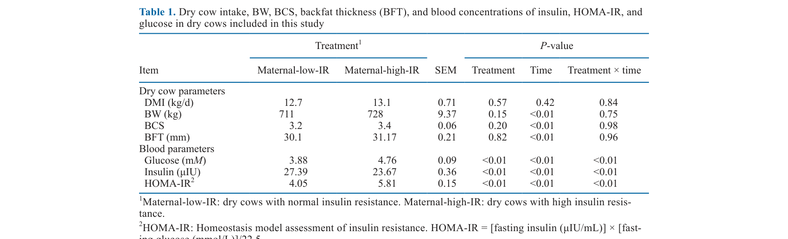
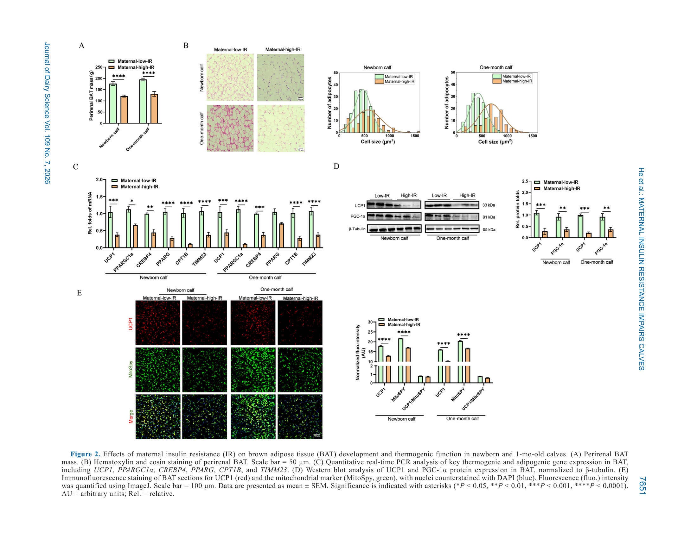
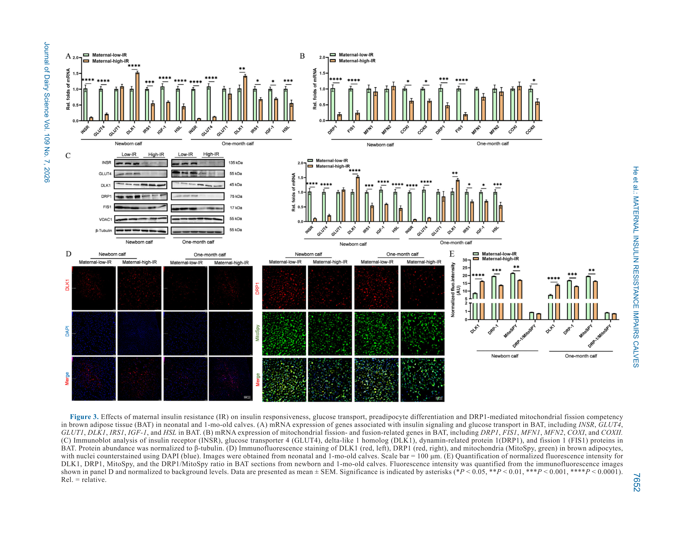

---
# YAML FRONTMATTER (обязательно)
id: CS.SOTA.367
type: sota
format_version: v1.1
knowledge_tier: P2
domain: cattle-science
area: health
subarea: calf-health
subarea2: developmental-programming
category: field-study
year: 2026
authors: "He, R., Ma, G., Hu, Z., Gai, Y., Zhang, Y., Huang, S., Mao, S., Hosseini Ghaffari, M., and Chen, Y."
title: "Maternal insulin resistance during late gestation impairs brown adipose tissue development and thermogenic function in calves"
journal: "Journal of Dairy Science"
volume: "109"
issue: "7"
pages: "7643-7658"
doi: "10.3168/jds.2025-28031"
publisher: "Elsevier / ADSA"
open_access: true
license: "CC BY"
language: ru
freshness_window: "2026-07-29 — 2028-07-29"
sota_edition: "1.0"
derivation:
  - source: "He et al., 2026, Journal of Dairy Science (109:7)"
    type: "ConservativeRetextualization (FPF A.6.3)"
    reopen_trigger: "DOI: 10.3168/jds.2025-28031"
tags:
  - calf
  - insulin-resistance
  - brown-adipose-tissue
  - mitochondrial-dynamics
  - ucp1
  - dlk1
  - late-gestation
  - dry-cow
  - holstein
related:
  - id: CS.SOTA.365
    type: complementary
    note: "Жир молозива и терморегуляция новорождённых телят на холоде (JDS, июль 2026)"
    relevance: high
  - id: CS.SOTA.XXX
    type: foundational
    note: "Symonds et al. 2011, 2015 — роль BAT в не-shivering термогенезе новорождённых"
    relevance: high
---

# CS.SOTA.367: He et al. (2026) — Инсулинорезистентность матери в позднюю гестацию ухудшает развитие бурой жировой ткани и термогенез у телят

> **Навигация:** [2. Аннотация](#2-аннотация-abstract) · [3. Введение](#3-введение) · [4. Методология](#4-методология) · [5. Результаты](#5-результаты) · [6. Интерпретация](#6-интерпретация-и-обсуждение) · [7. Критический анализ](#7-критический-анализ) · [8. Выводы](#8-выводы) · [9. FAQ](#9-faq) · [10. Практика](#10-практическое-применение) · [12. Источники](#12-источники)

---

# 2. АННОТАЦИЯ (Abstract)

## 2.1. Перевод Abstract

Исследование изучало влияние материнской инсулинорезистентности (IR) в позднюю гестацию на развитие бурой жировой ткани (BAT) и термогенную функцию новорождённых телят. Отобрано 44 сухостойные коровы Holstein. Пробы крови в сухостой оценивались на инсулин и глюкозу; материнская IR оценивалась по HOMA-IR. Коровы разделены на 2 группы: материнская низкая IR (n = 22) и высокая IR (n = 22). Сразу после рождения телята отделялись от матерей и наблюдались за ростом. Здоровье телят мониторилось от рождения до 1 месяца 3 раза в неделю стандартизированным клиническим скорингом (фекальная консистенция, кашель, назальные выделения, ЧДД). Масса тела, длина, высота в холке и ректальная температура записывались при рождении; глюкоза крови оценивалась после глюкозо-толерантного теста (GTT). При рождении (n = 10/группу) и в 1 месяц (n = 12/группу) телята были убиты, собрана периренальная BAT для гистологии и молекулярных анализов. Термогенные и митохондриальные маркеры оценивались на уровне мРНК и белка (qPCR, western blot). Стромально-сосудистые фракции (SVF) из BAT новорождённых культивировались в гипергликемических и гиперинсулинемических условиях для оценки дифференцировки в бурые адипоциты, формирования липидных капель и экспрессии термогенных маркеров (UCP1, DRP1). Результаты: материнская IR значимо повышала инсулин и глюкозу сыворотки коров, но не влияла на BCS и толщину спинного жира (BFT). При рождении телята от high-IR матерей имели значимо меньшую массу периренальной BAT и более крупные бурые адипоциты. Экспрессия термогенных маркеров (UCP1, PGC-1α) была подавлена, митохондриальная плотность в BAT значимо снижена. Эффекты сохранялись в 1 месяц: продолжающиеся снижения массы BAT, митохондриальной плотности и термогенной экспрессии. Телята high-IR показали нарушенную глюкозотолерантность (замедленный клиренс глюкозы в GTT) и повышенную клиническую заболеваемость (выше фекальные и кашлевые скоры, чаще диарея). In vitro SVF показали сниженное формирование липидных капель и подавленную термогенную экспрессию. Маркеры митохондриального деления DRP1 и FIS1 были подавлены в группе high-IR. Результаты указывают, что материнская IR в позднюю гестацию нарушает развитие BAT, митохондриальную динамику и глюкозный обмен новорождённых телят с долгосрочными последствиями для термогенной функции и метаболического здоровья.

## 2.2. Key Claims

**Claim 1: Материнская IR снижает массу BAT телёнка на ~30% при рождении и в 1 месяц.**
- **Утверждение:** Периренальная BAT у телят high-IR матерей: 120.8 ± 4.5 г против 180.0 ± 7.2 г при рождении (−33%) и 138.8 ± 11.0 г против 194.2 ± 4.3 г в 1 месяц (−29%); бурые адипоциты крупнее (562.5 vs 466.7 мкм² при рождении; 680.8 vs 424.2 мкм² в 1 мес).
- **Evidence:** 44 коровы, HOMA-IR-стратификация; взвешивание депо + гистология (H&E, ImageJ).
- **Уверенность:** 0.85 (прямые морфометрические измерения, две временные точки, P < 0.01).
- **Цитата:** "Calves born to high-IR dams exhibited significantly reduced perirenal BAT mass... and increased brown adipocyte size." (He et al., 2026, p. 7648)

**Claim 2: Термогенный аппарат BAT подавлен: UCP1, PGC-1α и митохондриальная плотность снижены.**
- **Утверждение:** Гены UCP1, CREBP4, CPT1B подавлены; белки UCP1 (P < 0.01) и PGC-1α (P = 0.02) снижены; митохондриальная плотность в BAT снижена (P < 0.01) — и при рождении, и в 1 месяц.
- **Evidence:** qPCR + western blot + иммунофлюоресценция (UCP1/MitoSpy).
- **Уверенность:** 0.82 (согласованные мРНК/белок/гистология).
- **Цитата:** "Gene expression of thermogenic markers, such as UCP1 and PGC-1α, was downregulated, and mitochondrial density in BAT was significantly reduced." (He et al., 2026, p. 7643)

**Claim 3: Материнская IR нарушает глюкозный обмен телёнка без влияния на рост.**
- **Утверждение:** Телята high-IR имели нарушенную глюкозотолерантность (AUC GTT выше, P < 0.01) и сниженные INSR/GLUT4 в BAT; при этом масса, рост в холке, длина тела и температура не различались.
- **Evidence:** GTT в 4 недели (250 мг/кг в/в; пробы 0–90 мин); qPCR/WB INSR и GLUT4.
- **Уверенность:** 0.78 (прямой функциональный тест; рост не затронут — эффект ткане-специфичен).
- **Цитата:** "Maternal-high-IR calves exhibited impaired glucose tolerance, with delayed glucose clearance in the GTT." (He et al., 2026, p. 7643)

**Claim 4: Механизм — митохондриальный дисбаланс (DRP1/FIS1 ↓) и активация DLK1; воспроизводится in vitro.**
- **Утверждение:** Маркеры деления митохондрий DRP1 и FIS1 подавлены (слияние MFN1/2 не изменено), ингибитор адипогенеза DLK1 повышен; SVF-культуры в гипергликемии/гиперинсулинемии воспроизвели дефекты: меньше липидных капель, UCP1 ↓, DLK1 ↑, DRP1 ↓.
- **Evidence:** In vivo BAT (белок/мРНК) + in vitro SVF-дифференцировка с 7 градациями глюкозы/инсулина.
- **Уверенность:** 0.75 (in vitro подтверждение механизма; но пул SVF и суррогатные IR-условия).
- **Цитата:** "Mitochondrial fission markers DRP1 and FIS1 were downregulated in the maternal-high-IR group." (He et al., 2026, p. 7643)

---

# 3. ВВЕДЕНИЕ

## 3.1. Контекст и значимость проблемы

В позднюю гестацию у коровы развивается физиологическая инсулинорезистентность, повышающая глюкозу крови; трансплацентарный перенос глюкозы может вызывать фетальную гиперинсулинемию и избыточное накопление жира плодом. У человека и грызунов материнская гипергликемия/IR связаны с долгосрочными метаболическими нарушениями потомства, включая дисфункцию бурой жировой ткани. BAT развивается преимущественно в позднюю гестацию и критична для не-shivering термогенеза новорождённого через UCP1. Функция BAT зависит от митохондриальной динамики (слияние MFN1/2, деление DRP1/FIS1), которую гипергликемия может нарушать. Для КРС системных данных о влиянии материнской IR на BAT телят не было.

## 3.2. Обзор литературы (краткий)

1. **Bell and Bauman (1997)** — адаптации глюкозного обмена в беременность и лактацию; норма глюкозы КРС ≤3.9 мМ.
2. **De Koster and Opsomer (2013)** — инсулинорезистентность у сухостойных коров.
3. **Symonds et al. (2011, 2015)** — BAT и термогенез новорождённых жвачных.
4. **Boutant et al. (2017); Mooli et al. (2020)** — митохондриальная динамика в BAT.
5. **Hudak and Sul (2013); Charalambous et al. (2014)** — DLK1 как ингибитор адипогенеза.

## 3.3. Гипотеза и цель исследования

**Гипотеза:** Материнская IR в позднюю гестацию изменяет развитие BAT и метаболическую функцию новорождённых телят.

**Цель:** Исследовать влияние материнской IR на массу и развитие BAT, митохондриальную динамику и глюкозный обмен телят, и определить долгосрочные последствия для термогенной функции.

**Primary outcomes:** Масса периренальной BAT, термогенная экспрессия (UCP1, PGC-1α), митохондриальная плотность.
**Secondary outcomes:** GTT, INSR/GLUT4, митохондриальная динамика (DRP1, FIS1, MFN1/2), DLK1, здоровье и рост телят до 1 месяца; in vitro SVF-дифференцировка.

---

# 4. МЕТОДОЛОГИЯ

## 4.1. Дизайн исследования

| Параметр | Описание |
|----------|----------|
| **Тип исследования** | Ретроспективная HOMA-IR-стратификация + последующее наблюдение потомства + in vitro валидация |
| **Место** | Shandong High Speed Modern Dairy Farm, Китай; сентябрь–декабрь 2023 |
| **Коровы** | 44 сухостойные Holstein (паритет 1.9 ± 0.14; 742 кг; сухостой 66.8 д); только мужские плоды (УЗИ-определение пола) |
| **Группы** | Low-IR (n = 22; HOMA-IR 4.21 ± 0.16; глюкоза 3.88 мМ) vs high-IR (n = 22; HOMA-IR 6.07 ± 0.12; глюкоза 4.76 мМ — выше нормы ≤3.9 мМ) |
| **Мониторинг коров** | Кровь на нед. 1, 3, 5, 7 сухостоя (инсулин ELISA, глюкоза); DMI, BW, BCS, BFT еженедельно |
| **Телята** | Отделение <1 ч; молозиво 6 л × 2/д, затем пастеризованное цельное молоко до 30 д; скоринг здоровья 3×/нед; среда 12.4 ± 5.2°C |
| **Точки убоя** | Рождение (n = 10/группу) и 1 месяц (n = 12/группу); периренальная BAT: масса, H&E, qPCR, WB, иммунофлюоресценция |
| **GTT** | В 4 недели: 250 мг/кг глюкозы в/в после 12-ч голодания; пробы 0–90 мин |
| **In vitro** | SVF из BAT новорождённых; дифференцировка в бурые адипоциты (индометацин/IBMX/дексаметазон/инсулин/T3); 7 обработок глюкоза × инсулин (CON, MG, HG, MI, HI, MR, HR); Oil Red O |
| **Статистика** | R 4.4.0, lme4; смешанные модели (обработка × время, корова — случайный эффект); power-анализ simr; значимость P < 0.05 |

## 4.2. Медиа-инвентарь

| ID | Тип | Описание | Файл | Статус |
|----|-----|----------|------|--------|
| Table 1 | Таблица | Параметры сухостойных коров: DMI, BW, BCS, BFT, глюкоза, инсулин, HOMA-IR | `table-1-dry-cow-parameters.png` | ✅ Встроено |
| Fig. 2 | Композит | Развитие BAT: масса (A), гистология (B), гены (C), белки (D), иммунофлюоресценция (E) | `figure-2-bat-development.png` | ✅ Встроено |
| Fig. 3 | Композит | Инсулиновая сигнализация, митохондриальная динамика и DLK1 в BAT | `figure-3-mitochondrial-dynamics.png` | ✅ Встроено |

---

# 5. РЕЗУЛЬТАТЫ

## 5.1. Параметры сухостойных коров

**Соответствует:** Table 1

*Источник: He et al., 2026, p. 7648 (Table 1).*

**Описание:**
Группы не различались по DMI (12.7 vs 13.1 кг/д), BW, BCS и BFT — то есть высокая IR не была связана с ожирением. Глюкоза: 4.76 vs 3.88 мМ (P < 0.01); HOMA-IR: 5.81 vs 4.05 (P < 0.01). Примечание: в строке «Insulin» таблицы значения 27.39 (low-IR) и 23.67 (high-IR) противоречат тексту («инсулин выше в high-IR») и расчёту HOMA-IR — вероятно, значения переставлены при вёрстке (по HOMA-IR и глюкозе инсулин high-IR должен быть ~27.5 µIU/mL). См. раздел 7.2.

## 5.2. Рост, глюкозотолерантность и здоровье телят

**Описание:**
Масса тела, высота в холке, длина тела и ректальная температура телят не различались между группами ни при рождении, ни в динамике до 1 месяца (P ≥ 0.10). GTT в 4 недели: у high-IR телят замедленный клиренс глюкозы — более высокая глюкоза и AUC (P < 0.01). Здоровье: численно выше фекальные скоры (P = 0.05), кашлевые скоры (P = 0.07) и частота диареи (30.9% vs 14.4%, P = 0.09) у high-IR телят.

## 5.3. Морфометрия и функция BAT

**Соответствует:** Figure 2

*Источник: He et al., 2026, p. 7651 (Figure 2).*

**Описание:**
Масса периренальной BAT снижена у high-IR телят: −33% при рождении (120.8 vs 180.0 г) и −29% в 1 месяц (138.8 vs 194.2 г; P < 0.01). Бурые адипоциты крупнее (P < 0.01) — меньше клеток на поле. Термогенные гены (UCP1, CREBP4, CPT1B) и белки (UCP1, PGC-1α) подавлены; митохондриальная плотность (MitoSpy) и отношение UCP1/MitoSpy снижены в обеих точках.

## 5.4. Инсулиновая сигнализация, митохондриальная динамика, DLK1 и in vitro

**Соответствует:** Figure 3

*Источник: He et al., 2026, p. 7652 (Figure 3).*

**Описание:**
INSR и GLUT4 (мРНК и белок) снижены у high-IR телят при рождении и в 1 месяц (P < 0.01) — признак инсулинорезистентности самой BAT. DLK1 (ингибитор адипогенеза) повышен на мРНК, белке и по иммунофлюоресценции. Маркеры митохондриального деления DRP1 и FIS1 подавлены, слияние (MFN1/2) не изменено — дисбаланс динамики. In vitro: гипергликемия и гиперинсулинемия (особенно комбинированные MR/HR) подавляли формирование липидных капель, UCP1, DRP1 и повышали DLK1 — воспроизведение in vivo дефектов.

---

# 6. ИНТЕРПРЕТАЦИЯ И ОБСУЖДЕНИЕ

## 6.1. Связь с гипотезой

Гипотеза подтверждена: материнская IR в позднюю гестацию нарушает развитие BAT, митохондриальную динамику и глюкозный обмен телят. При этом соматический рост не затронут — программирование ткане-специфично (метаболические ткани), что делает его «невидимым» при стандартном мониторинге роста.

## 6.2. Сравнение с литературой

| Исследование | Согласие/Противоречие/Расширение |
|--------------|----------------------------------|
| Moley et al. (1998); Yu et al. (2019) | **Согласуется** — материнская гипергликемия подавляет развитие BAT плода |
| Schwartz et al. (1994) | **Противоречит** — там материнская гипергликемия давала макросомию; здесь рост не изменён (уровень гипергликемии умеренный) |
| Boutant et al. (2017) | **Согласуется** — митохондриальная динамика критична для термогенеза BAT |
| Hudak and Sul (2013) | **Согласуется/Расширяет** — DLK1 как медиатор подавления адипогенеза при материнской IR |
| Bell and Bauman (1997) | **Использовано** — порог нормы глюкозы ≤3.9 мМ для классификации |

## 6.3. Механистические выводы

1. **Материнская гипергликемия → фетальная гиперинсулинемия → подавление бурого адипогенеза:** трансплацентарная глюкоза программирует BAT плода; DLK1 — ключевой медиатор (ингибирует дифференцировку и UCP1).
2. **Митохондриальный дисбаланс:** подавление деления (DRP1/FIS1) при сохранном слиянии нарушает оборот митохондрий и их плотность — энергетическая ёмкость BAT падает.
3. **Инсулинорезистентность наследуется тканево:** INSR/GLUT4 снижены в BAT телят high-IR — периферическая IR потомства, подтверждённая нарушенным GTT.
4. **Долгосрочность:** эффекты сохраняются минимум до 1 месяца — окно программирования в поздней гестации имеет постнатальные последствия для терморегуляции и метаболизма.
5. **Термогенная уязвимость:** меньшая масса BAT + подавленный UCP1 → сниженная способность к не-shivering термогенезу — риск переохлаждения у телят зимних отёлов от IR-матерей.

---

# 7. КРИТИЧЕСКИЙ АНАЛИЗ

## 7.1. Сильные стороны

- **Многоуровневый дизайн:** морфология → мРНК → белок → иммунофлюоресценция → функциональный тест (GTT) → in vitro валидация механизма.
- **Контроль смешивающих факторов:** только мужские телята, одинаковые DMI/BW/BCS/BFT матерей, отсутствие клинических болезней, пул молозива.
- **Две временные точки** — показана персистенция эффектов.
- **Механистическая глубина:** впервые для КРС связаны материнская IR, DLK1 и митохондриальная динамика BAT.

## 7.2. Ограничения

**Внутренние:**
- **Несогласованность Table 1:** значения инсулина (27.39 vs 23.67 µIU) противоречат тексту и расчёту HOMA-IR — вероятно, строка перепутана при вёрстке; интерпретация инсулина матерей требует осторожности (выявлено при обработке SoTA).
- **HOMA-IR не валидирован для КРС:** человеческая формула без видоспецифичной поправки; авторы используют как относительный индикатор.
- **Причина IR неизвестна:** группы сформированы ретроспективно; что привело к high-IR (питание, генетика, воспаление, печёночная чувствительность) — не оценивалось.
- **Пул SVF** в in vitro — индивидуальная вариабельность доноров скрыта.

**Внешние:**
- **Одна ферма, один сезон** — генерализация ограничена.
- **Умеренная гипергликемия** (4.76 мМ) — при более выраженной IR эффекты могут быть сильнее; перенос на крайние случаи неопределён.
- **Только 1 месяц наблюдения** — долгосрочные последствия (лактационная продуктивность потомства) неизвестны.
- **Холодовая нагрузка слабая** (12.4°C средняя; <9°C лишь 2.8% времени) — термогенный дефицит не был вызван экологически.

## 7.3. Применимость к российским условиям

- **Зимние отёлы в РФ:** сочетание материнской IR (частая у высокопродуктивных стад) и реального холода делает дефицит BAT клинически значимым — риск гипотермии и диареи телят.
- **Мониторинг сухостоя:** глюкоза и инсулин сухостойных коров (HOMA-IR как относительный индекс) — дешёвый кандидатный скрининг группы риска «нездоровых» телят.
- **Профилактика:** работа добавляет аргумент против перекорма и метаболических нарушений в сухостой — последствия измеримы у потомства на клеточном уровне.

---

# 8. ВЫВОДЫ

## 8.1. Ключевые выводы автора (перевод)

Материнская IR и гипергликемия в позднюю гестацию значимо нарушают развитие и функцию BAT новорождённых телят. Хотя материнская IR минимально влияла на массу при рождении и ранний рост, она привела к нарушению глюкозного обмена, компрометированному развитию BAT и митохондриальной дисфункции потомства. Телята от high-IR матерей показали сниженную массу периренальной BAT, увеличенные бурые адипоциты, подавленную термогенную экспрессию и сниженную митохондриальную плотность. Эффекты сохранялись в 1 месяц. In vitro эксперименты подтвердили: гиперинсулинемия нарушает дифференцировку бурых адипоцитов и митохондриальную динамику. Повышенный DLK1 указывает на нарушенный адипогенез. Результаты подчёркивают критическую роль метаболического здоровья матери в метаболическом программировании потомства.

## 8.2. Ключевые выводы (структурировано)

1. **Материнская IR снижает массу BAT телёнка на ~30%** — и при рождении, и в 1 месяц.
2. **Термогенный аппарат подавлен:** UCP1, PGC-1α, митохондриальная плотность ↓; адипоциты крупнее.
3. **Рост не затронут, но метаболизм — да:** нарушенный GTT, INSR/GLUT4 ↓ в BAT.
4. **Механизм:** DLK1 ↑ (подавление адипогенеза) + митохондриальный дисбаланс (DRP1/FIS1 ↓).
5. **Здоровье телят:** тенденция к большей заболеваемости (фекальные/кашлевые скоры, диарея 30.9% vs 14.4%).

## 8.3. Ключевые сообщения для лекции

1. Метаболическое здоровье сухостойной коровы программирует терморегуляцию телёнка: IR матери → на треть меньше бурого жира у новорождённого.
2. Эффект «невидим» по росту: телята выглядят нормально, но их термогенная и глюкозная устойчивость снижена — показать можно только тестами (GTT, тканевые маркеры).
3. Бурый жир — главный «обогреватель» новорождённого; его дефицит критичен именно при зимних отёлах.
4. DLK1 и митохондриальная динамика (DRP1/FIS1) — молекулярные мишени материнского метаболического программирования.

---

# 9. FAQ

**Вопрос 1: Что такое бурый жир и зачем он телёнку?**
Ответ: BAT — ткань не-shivering термогенеза: окисляет глюкозу и ЖК с выделением тепла через UCP1, не давая новорождённому переохладиться. У телят основные депо — шея, перикард и периренальная область (~50% массы BAT). Развивается в позднюю гестацию — именно в окно действия материнской IR.

**Вопрос 2: Как IR матери влияет на BAT плода, если плацента КРС не пропускает инсулин?**
Ответ: Через глюкозу: материнская гипергликемия усиливает трансплацентарный перенос глюкозы → фетальная гиперинсулинемия → активация DLK1 и подавление бурого адипогенеза + митохондриальный дисбаланс. In vitro комбинация высоких глюкозы и инсулина воспроизвела эти дефекты напрямую.

**Вопрос 3: Виден ли эффект без лабораторных анализов?**
Ответ: Почти нет. Масса, рост и температура телят не различались. Косвенные признаки: чуть худшие фекальные/кашлевые скоры и больше диареи (тенденции). Дефицит проявляется при нагрузке — холоде (термогенез) или GTT (глюкозный клиренс).

**Вопрос 4: Можно ли измерить риск на ферме?**
Ответ: Кандидатный подход: глюкоза + инсулин сухостойных коров с расчётом HOMA-IR (относительный индекс; пороги для КРС не валидированы). Коровы с устойчиво высокой глюкозой (>3.9 мМ) в сухостой — группа риска рождения телят с ослабленной терморегуляцией.

**Вопрос 5: Что делать практически?**
Ответ: (1) Не допускать метаболических нарушений в сухостой (контроль энергии рациона, BCS); (2) телят от IR-матерей зимой — приоритетная защита от холода (конуры, жилеты, сухая подстилка, усиленное молозиво); (3) исследовательски — мониторинг глюкозы/инсулина сухостоя как предиктора здоровья телят.

---

# 10. ПРАКТИЧЕСКОЕ ПРИМЕНЕНИЕ

## 10.1. Алгоритм снижения риска для телят от IR-матерей

1. **Скрининг сухостоя:** глюкоза натощак (норма ≤3.9 мМ) на нед. 1–7 сухостоя; при систематическом превышении — маркировка коровы как IR-риск.
2. **Кормление сухостоя:** контроль энергетической плотности и DMI, предотвращение жирового перекорма (хотя BCS/BFT в работе не различались — IR возможна без ожирения).
3. **Роддом:** телята от IR-матерей — в группу усиленного наблюдения (особенно зимой): сухая глубокая подстилка, отсутствие сквозняков, при t° < 9°C — конуры/жилеты.
4. **Молозиво:** качественное жирное молозиво 6 л в первые 12 ч (см. CS.SOTA.365 — жир молозива как топливо терморегуляции).
5. **Мониторинг:** скоринг здоровья 3×/нед (фекалии, кашель, ЧДД) — у high-IR телят тенденция к худшим скорам; при диарее — раннее вмешательство.

## 10.2. Типичные ошибки

- **Оценка телёнка только по массе и росту** — метаболический дефицит BAT не виден по антропометрии.
- **Считать, что IR бывает только у жирных коров** — в работе BCS и BFT групп не различались.
- **Использование человеческих порогов HOMA-IR как абсолютных** — для КРС это относительный индекс внутри популяции.
- **Игнорирование сухостоя как окна программирования** — вмешательства после рождения телёнка уже поздни для BAT.

## 10.3. Пограничные сценарии

- **IR-мать + зимний отёл + слабое молозиво** — тройной удар по терморегуляции: максимальный приоритет защиты телёнка.
- **Умеренная гипергликемия сухостоя без клиники** — не «норма»: эффект на потомство доказан уже при 4.76 мМ.
- **Повторные диареи в телятнике** — проверить, не концентрируются ли случаи у телят от метаболически нарушенных матерей.

---

# 11. ИНСТРУМЕНТЫ И ШАБЛОНЫ

## 11.1. Ключевые числовые ориентиры

| Параметр | Значение | Комментарий |
|----------|----------|-------------|
| Норма глюкозы КРС (сухостой) | ≤3.9 мМ | Bell and Bauman, 1997; high-IR группа: 4.76 мМ |
| HOMA-IR групп | 4.05 (low) vs 5.81 (high) | Относительный индекс, среднее по нед. 1–7 |
| Масса периренальной BAT | 180.0 → 120.8 г (новорожд.), 194.2 → 138.8 г (1 мес) | −30% при материнской IR |
| GTT | AUC выше у high-IR телят (P < 0.01) | Нарушенный клиренс глюкозы |
| Диарея (1 мес) | 14.4% vs 30.9% | Тенденция (P = 0.09) |
| Нижняя критическая t° телёнка | ~9°C | Защита от холода ниже порога |

---

# 12. ИСТОЧНИКИ

## 12.1. Первоисточник

He, R., Ma, G., Hu, Z., Gai, Y., Zhang, Y., Huang, S., Mao, S., Hosseini Ghaffari, M., and Chen, Y. 2026. Maternal insulin resistance during late gestation impairs brown adipose tissue development and thermogenic function in calves. Journal of Dairy Science 109(7):7643-7658. DOI: 10.3168/jds.2025-28031.

## 12.2. Ключевые статьи (цитированные в работе)

- Bell, A. W., and Bauman, D. E. 1997. Adaptations of glucose metabolism during pregnancy and lactation. J. Mammary Gland Biol. Neoplasia 2:265–278.
- De Koster, J. D., and Opsomer, G. 2013. Insulin resistance in dairy cows. Vet. Clin. North Am. Food Anim. Pract.
- Symonds, M. E., et al. 2011, 2015. Brown adipose tissue and thermogenesis in neonatal ruminants.
- Boutant, M., et al. 2017. Mfn2 is critical for brown adipose tissue thermogenic function. EMBO J. 36:1543–1558.
- Hudak, C. S., and Sul, H. S. 2013. Pref-1/DLK1, a gatekeeper of adipogenesis. Front. Endocrinol.
- Matthews, D. R., et al. 1985. HOMA: insulin resistance and β-cell function from fasting glucose and insulin. Diabetologia 28:412–419.

## 12.3. Внешние источники [вне статьи]

- NASEM. 2021. Nutrient Requirements of Dairy Cattle. 8th rev. ed. National Academies Press. [foundational reference, не цитируется в He et al., 2026]
- Silva, F. L. M., and Bittar, C. M. M. 2019. Thermoregulation of dairy calves. Sci. Agric. [цитируется в работе; нижняя критическая температура 9°C]

---

# 13. ЖУРНАЛ ОБРАБОТКИ

## 13.1. WorkPlan

| Шаг | Действие | Статус |
|-----|----------|--------|
| 1 | Чтение полного текста PDF (16 страниц) | ✅ |
| 2 | Извлечение метаданных (авторы, DOI, страницы) | ✅ |
| 3 | Извлечение медиа (1 таблица, 2 фигуры-композита; фигуры — рендер с поворотом) | ✅ |
| 4 | Анализ дизайна (HOMA-IR стратификация + in vitro) | ✅ |
| 5 | Выделение Key Claims с оценкой уверенности | ✅ |
| 6 | Описание методологии (GTT, гистология, SVF-культура) | ✅ |
| 7 | Детализация результатов (BAT, митохондрии, DLK1) | ✅ |
| 8 | Критический анализ (включая несогласованность Table 1) и применимость | ✅ |
| 9 | FAQ, практическое применение, инструменты | ✅ |
| 10 | Формирование YAML frontmatter | ✅ |
| 11 | Сохранение файла | ✅ |

## 13.2. Work Record

| Параметр | Значение |
|----------|----------|
| **Время обработки** | ~45 мин |
| **Строк в файле** | ~345 |
| **Число Key Claims** | 4 |
| **Число источников** | 9 (первоисточник + 6 цитированных + 2 внешних) |
| **Число медиа** | 3 (1 таблица + 2 фигуры) |
| **Замечание по качеству источника** | Table 1: значения инсулина противоречат тексту/HOMA-IR (отмечено в 5.1 и 7.2) |
| **FPF compliance** | A.7 (строгое разделение модели и реальности), A.6.3 (консервативная переработка), A.10 (якоря доказательств) |

---

*SoTA создан: 2026-07-29*
*Обработано по WP-86: Проверка new-articles и добавление SoTA*
