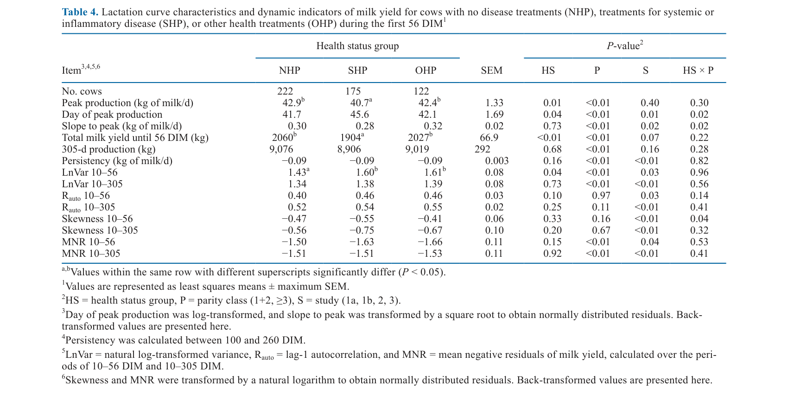
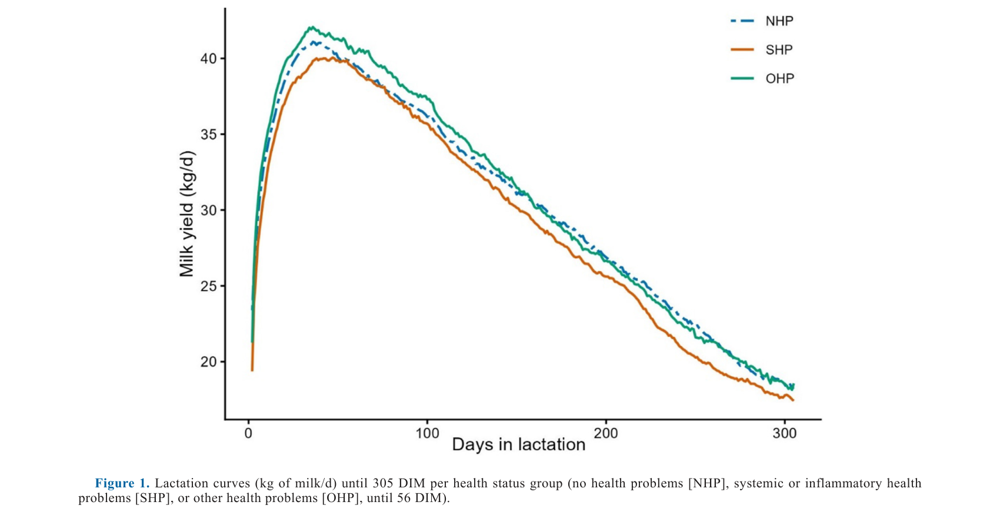
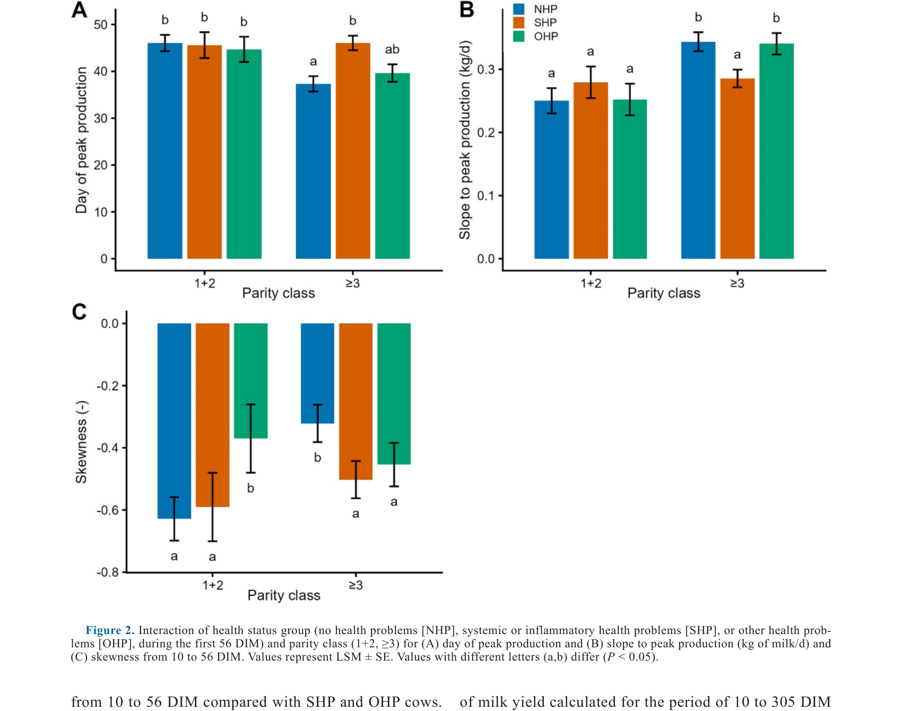

---
# YAML FRONTMATTER (обязательно)
id: CS.SOTA.368
type: sota
format_version: v1.1
knowledge_tier: P2
domain: cattle-science
area: health
subarea: disease-monitoring
subarea2: milk-yield-dynamics
category: field-study
year: 2026
authors: "de Bruijn, B. G. C., van Dixhoorn, I. D. E., Kemp, B., and van Knegsel, A. T. M."
title: "Milk yield dynamics as indicators for disease in dairy cows"
journal: "Journal of Dairy Science"
volume: "109"
issue: "7"
pages: "7659-7678"
doi: "10.3168/jds.2026-28422"
publisher: "Elsevier / ADSA"
open_access: true
license: "CC BY"
language: ru
freshness_window: "2026-07-29 — 2028-07-29"
sota_edition: "1.0"
derivation:
  - source: "de Bruijn et al., 2026, Journal of Dairy Science (109:7)"
    type: "ConservativeRetextualization (FPF A.6.3)"
    reopen_trigger: "DOI: 10.3168/jds.2026-28422"
tags:
  - milk-yield
  - disease
  - dynamic-indicator
  - lactation-curve
  - resilience
  - health-monitoring
  - lnvar
  - holstein
related:
  - id: CS.SOTA.XXX
    type: foundational
    note: "Poppe et al. 2020, 2021 — резилиентность и динамические индикаторы удоя (LnVar, Rauto)"
    relevance: high
  - id: CS.SOTA.XXX
    type: foundational
    note: "Hostens et al. 2012 — болезни ранней лактации и форма лактационной кривой"
    relevance: high
---

# CS.SOTA.368: de Bruijn et al. (2026) — Динамика молочной продуктивности как индикатор заболеваний у молочных коров

> **Навигация:** [2. Аннотация](#2-аннотация-abstract) · [3. Введение](#3-введение) · [4. Методология](#4-методология) · [5. Результаты](#5-результаты) · [6. Интерпретация](#6-интерпретация-и-обсуждение) · [7. Критический анализ](#7-критический-анализ) · [8. Выводы](#8-выводы) · [9. FAQ](#9-faq) · [10. Практика](#10-практическое-применение) · [12. Источники](#12-источники)

---

# 2. АННОТАЦИЯ (Abstract)

## 2.1. Перевод Abstract

Молочные коровы переносят большинство заболеваний в ранней лактации, и болезни связаны с потерями молока. Флуктуации удоя ранее предлагались как добавленная ценность для мониторинга здоровья. Целью исследования было изучить связи между статусом здоровья в первые 56 DIM и двумя типами динамики удоя: (1) характеристиками лактационной кривой и (2) динамическими индикаторами удоя, вычисленными из отклонений от лактационной кривой. Объединены данные о суточных удоях и лечении болезней из 4 предыдущих экспериментов. Коровы категоризованы тремя способами по лечениям до 56 DIM: (1) в 3 группы по статусу здоровья: без проблем (NHP), системные или воспалительные проблемы (SHP), прочие проблемы (OHP); (2) по числу лечений (0, 1, ≥2); (3) по наличию лечений мастита, эндометрита, болезней копыт и конечностей, вагинальных выделений или кистозных яичников. Характеристики лактационной кривой рассчитаны по 5-дневному скользящему среднему: пик продукции, день пика, наклон к пику, суммарный удой до 56 DIM, 305-дневная продукция и персистентность. Динамические индикаторы вычислены из отклонений за периоды 10–56 и 10–305 DIM: логарифмированная дисперсия (LnVar), автокорреляция лага-1 (Rauto), асимметрия (skewness) и среднее отрицательных остатков (MNR). Связи оценивались смешанными моделями. Пик продукции и суммарный удой до 56 DIM были ниже у SHP-коров по сравнению с NHP или OHP. Коровы партитета ≥3 в SHP имели более поздний день пика и меньший наклон к пику. Персистентность и 305-дневная продукция не зависели от статуса здоровья. Коровы с проблемами здоровья (SHP и OHP) имели более высокий LnVar, чем NHP. Коровы, леченные от эндометрита или кистозных яичников, имели более высокий Rauto по лактации. MNR 10–56 DIM был ниже у коров с болезнями копыт и конечностей, но MNR не давал добавленной ценности для других типов лечения, как и skewness. LnVar 10–56 DIM рос с числом лечений. Это указывает, что коровы с проблемами здоровья в ранней лактации имеют больше пертурбаций удоя, но точный ответ зависит от типа болезни и числа лечений. В заключение: характеристики лактационной кривой специфично указывают на коров с системными/воспалительными проблемами, а динамические индикаторы — и на них, и на коров с прочими проблемами. Влияние конкретных болезней на динамику удоя требует дальнейшего изучения для применения в фермерских инструментах мониторинга здоровья.

## 2.2. Key Claims

**Claim 1: Системные/воспалительные болезни первых 56 DIM снижают пик и ранний удой, но не 305-дневную продукцию.**
- **Утверждение:** SHP-коровы имели пик 40.7 vs 42.9 кг/д (NHP) и суммарный удой за 56 DIM 1,904 vs 2,060 кг; 305-дневная продукция и персистентность не различались.
- **Evidence:** 519 лактаций 385 коров из 4 экспериментов; смешанные модели с поправкой на исследование и партитет.
- **Уверенность:** 0.85 (большой объединённый датасет, согласуется с Hostens et al., 2012).
- **Цитата:** "Peak production and total milk yield until 56 DIM were lower in SHP cows compared with NHP or OHP cows." (de Bruijn et al., 2026, p. 7659)

**Claim 2: LnVar (лог-дисперсия отклонений) растёт при любых проблемах здоровья и с числом лечений.**
- **Утверждение:** LnVar 10–56 DIM: NHP 1.43 < SHP 1.60 = OHP 1.61 (P = 0.04); по числу лечений: 0 → 1.43, 1 → 1.55, ≥2 → 1.69 (P = 0.02).
- **Evidence:** Динамические индикаторы из отклонений от индивидуальных квантильных лактационных кривых (q = 0.7, полином 4 ст.).
- **Уверенность:** 0.80 (прямые вычисления на больших рядах; эффект умеренный по величине).
- **Цитата:** "Cows with health problems (SHP and OHP) during the first 56 DIM had a higher LnVar than cows without treatment for health problems (NHP)." (de Bruijn et al., 2026, p. 7659)

**Claim 3: Ответ динамики удоя болезнь-специфичен: Rauto — эндометрит и кистозные яичники, MNR/LnVar — копыта.**
- **Утверждение:** Эндометрит и кистозные яичники повышали Rauto (10–56 и 10–305 DIM; P < 0.05) — более затяжные отклонения; болезни копыт повышали LnVar 10–56 и Rauto 10–305 и снижали MNR — более глубокие провалы; мастит снижал пик (37.6 vs 42.7 кг/д) и 305-д удой (7,845 vs 9,021 кг).
- **Evidence:** Анализ по 5 типам лечений с наибольшей инцидентностью (таблицы 6–7).
- **Уверенность:** 0.75 (болезнь-специфичные подгруппы n = 56–76; согласованность с Kok et al., 2021 по маститу частичная).
- **Цитата:** "...cows treated for endometritis or cystic ovaries had a higher Rauto through lactation compared with healthy cows." (de Bruijn et al., 2026, p. 7659)

**Claim 4: Эффекты болезней на форму кривой концентрируются у коров партитета ≥3.**
- **Утверждение:** Поздний день пика и меньший наклон к пику при SHP, мастите, эндометрите, болезнях копыт и выделениях — только у партитета ≥3; у партитета 1–2 различий нет.
- **Evidence:** Значимые взаимодействия статус здоровья × партитет (P = 0.01–0.05) для дня пика, наклона, асимметрии.
- **Уверенность:** 0.78 (консистентный паттерн по нескольким болезням).
- **Цитата:** "Cows of parity ≥3 in SHP had a later day of peak production and lower slope to peak production compared with NHP and OHP cows of parity ≥3." (de Bruijn et al., 2026, p. 7659)

---

# 3. ВВЕДЕНИЕ

## 3.1. Контекст и значимость проблемы

Около трети коров переносят хотя бы одну клиническую болезнь в ранней лактации — с потерями молока, затратами на лечение и риском выбраковки. Динамика удоя предлагалась как инструмент мониторинга здоровья: пертурбации лактационной кривой отражают, как корова отвечает на вызовы и восстанавливается (теория резилиентности Scheffer et al., 2018). Резилиентные коровы минимально затрагиваются вызовами и быстро возвращаются к базовой линии. Индикаторы LnVar и Rauto связаны с племенными ценностями (здоровье вымени, фертильность, долголетие) и клиническим маститом, но связи с другими болезнями и их частотой не оценивались.

## 3.2. Обзор литературы (краткий)

1. **Hostens et al. (2012)** — метаболические болезни <30 DIM сдвигают пик и меняют форму кривой.
2. **Poppe et al. (2020, 2021)** — динамические индикаторы резилиентности из суточных удоев (LnVar, Rauto).
3. **Kok et al. (2021)** — клинический мастит отражается в LnVar ↑ и Rauto ↓ отклонений удоя.
4. **Scheffer et al. (2018); Berghof et al. (2019)** — теория резилиентности и её количественные индикаторы.
5. **Elgersma et al. (2018); Keßler et al. (2025)** — индикаторы резилиентности и племенные ценности.

## 3.3. Гипотеза и цель исследования

**Гипотеза (рабочая):** Коровы с болезнями ранней лактации имеют больше пертурбаций удоя; MNR удоя, как и MNR шагов, может быть индикатором резилиентности при болезнях.

**Цель:** Исследовать связи между (1) характеристиками лактационной кривой до 305 DIM и лечениями в первые 56 DIM и (2) динамическими индикаторами удоя (10–56 и 10–305 DIM) и лечениями — по группам здоровья, числу лечений и типам болезней.

**Primary outcomes:** LnVar, Rauto, skewness, MNR; пик, день пика, наклон, удой 56 DIM, 305-д продукция, персистентность — по группам NHP/SHP/OHP.
**Secondary outcomes:** Те же показатели по числу лечений (0/1/≥2) и по 5 типам болезней (мастит, эндометрит, копыта, выделения, кистозные яичники).

---

# 4. МЕТОДОЛОГИЯ

## 4.1. Дизайн исследования

| Параметр | Описание |
|----------|----------|
| **Тип исследования** | Ретроспективный анализ объединённых данных 4 экспериментов |
| **Источники** | van Knegsel et al. 2014 (1a), Chen et al. 2015 (1b), van Hoeij et al. 2017 (2), Burgers et al. 2021 (3) — Dairy Campus, Нидерланды |
| **Данные** | 176,827 суточных записей удоя; 519 лактаций 385 коров Holstein Friesian; дойка 2×/день |
| **Лечения** | Регистрация по фермерским протоколам; дедупликация: повтор ≤10 д = один случай (копыта ≤28 д) |
| **Группы здоровья** | NHP (без лечений, n = 222); SHP (эндометрит, лихорадка, гипокальциемия, мастит, задержание последа, смещение сычуга; n = 175); OHP (кистозные яичники, выделения, копыта, кишечные, прочие; n = 122) |
| **Лактационная кривая** | 5-дневное скользящее среднее; пик, день пика, наклон 10 DIM→пик, удой 56 DIM, 305-д, персистентность (100–260 DIM) |
| **Динамические индикаторы** | Индивидуальная квантильная кривая (q = 0.7, полином 4 ст., quantreg); отклонения yt − ŷt; LnVar, Rauto, skewness, MNR за 10–56 и 10–305 DIM; первые 10 DIM исключены; лактации с >5% пропусков отброшены |
| **Статистика** | SAS 9.4 PROC MIXED: статус здоровья/число лечений/тип болезни × партитет (1–2 vs ≥3) + исследование; обработка исследования — случайный эффект; Tukey; P < 0.05 |

## 4.2. Медиа-инвентарь

| ID | Тип | Описание | Файл | Статус |
|----|-----|----------|------|--------|
| Table 4 | Таблица | Характеристики кривой и динамические индикаторы по группам здоровья | `table-4-lactation-by-health-status.png` | ✅ Встроено |
| Fig. 1 | График | Лактационные кривые до 305 DIM по группам NHP/SHP/OHP | `figure-1-lactation-curves-health.png` | ✅ Встроено |
| Fig. 2 | График | Взаимодействие статуса здоровья × партитет: день пика (A), наклон (B), асимметрия (C) | `figure-2-parity-interactions.png` | ✅ Встроено |

---

# 5. РЕЗУЛЬТАТЫ

## 5.1. Группы здоровья и динамика удоя

**Соответствует:** Table 4, Figure 1

*Источник: de Bruijn et al., 2026, p. 7664 (Table 4).*

*Источник: de Bruijn et al., 2026, p. 7664 (Figure 1).*

**Описание:**
SHP-коровы: пик 40.7 кг/д против 42.9 (NHP) и 42.4 (OHP); удой за 56 DIM: 1,904 против 2,060 и 2,027 кг (P ≤ 0.01). 305-д продукция (≈9,000 кг) и персистентность не различались — потери сконцентрированы в ранней фазе. LnVar 10–56 DIM выше у SHP и OHP (1.60/1.61 vs 1.43; P = 0.04). По партитету: у ≥3 — поздний пик и меньший наклон при SHP; у 1–2 различий нет. Партитет ≥3 сам по себе имеет выше LnVar и ниже MNR.

## 5.2. Взаимодействие со статусом здоровья и партитетом

**Соответствует:** Figure 2

*Источник: de Bruijn et al., 2026, p. 7665 (Figure 2).*

**Описание:**
У коров партитета ≥3 день пика максимален при SHP (≈46 д), минимален при NHP (≈42 д); наклон к пику ниже при SHP. У партитета 1–2 форма кривой от статуса здоровья не зависит. Асимметрия: у ≥3 NHP менее отрицательная, у 1–2 — наоборот у OHP менее отрицательная.

## 5.3. Число лечений

**Описание:**
Удой за 56 DIM снижался с числом лечений: 2,059 (0) → 1,978 (1) → 1,915 кг (≥2; P < 0.01). LnVar 10–56 рос градуированно: 1.43 → 1.55 → 1.69 (P = 0.02). День пика позже при ≥1 лечении только у партитета ≥3. Пик продукции имел тенденцию к снижению (P = 0.05).

## 5.4. Типы болезней

**Описание:**
Мастит: пик 37.6 vs 42.7 кг/д, удой 56 DIM 1,763 vs 2,054 кг и 305-д 7,845 vs 9,021 кг — наиболее разрушительная болезнь для продукции (все P < 0.01). Эндометрит: пик и удой 56 DIM ниже, Rauto выше (затяжные отклонения). Кистозные яичники: Rauto выше по обоим периодам, LnVar 10–305 выше; форма кривой не затронута (305-д даже численно выше: 9,550 кг, P = 0.05). Копыта: LnVar 10–56 и Rauto 10–305 выше, MNR ниже — глубокие провалы без потери пика. Выделения: эффекты слабые/через партитет.

---

# 6. ИНТЕРПРЕТАЦИЯ И ОБСУЖДЕНИЕ

## 6.1. Связь с гипотезой

Гипотеза подтверждена с уточнениями: коровы с болезнями действительно имеют больше пертурбаций удоя (LnVar), но MNR удоя оказался информативен только для болезней копыт — в отличие от MNR шагов. Ответ динамики удоя болезнь-специфичен: системные/воспалительные болезни бьют по форме кривой (пик, ранний удой), а динамические индикаторы ловят и «прочие» болезни.

## 6.2. Сравнение с литературой

| Исследование | Согласие/Противоречие/Расширение |
|--------------|----------------------------------|
| Hostens et al. (2012) | **Согласуется в целом** — метаболические болезни сдвигают пик позже и ниже; различия в деталях по 305-д и персистентности |
| Kok et al. (2021) | **Расширяет/частично противоречит** — там мастит давал Rauto ↓, здесь Rauto не изменён при мастите, но ↑ при эндометрите и кистозных яичниках |
| Poppe et al. (2021) | **Расширяет** — LnVar/Rauto связаны не только с племенными ценностями, но и с зарегистрированными клиническими лечениями |
| Poppe et al. (2022) | **Противоречит частично** — MNR шагов универсален, MNR удоя — только для копыт |

## 6.3. Механистические выводы

1. **Системные болезни → снижение потолка продукции:** воспаление и лихорадка подавляют пик и ранний удой (мастит наиболее сильно), но коровы «догоняют» к 305 дням.
2. **Rauto как маркер затяжности:** эндометрит и кистозные яичники — гормонально опосредованные болезни с длительным влиянием на цикл удоя → высокая автокорреляция отклонений.
3. **LnVar как интегральный маркер нестабильности:** растёт при любых болезнях и градуированно с их числом — кандидатный универсальный скрининг-признак.
4. **Партитет ≥3 как фактор уязвимости:** именно у старших коров болезни искажают форму кривой — вероятно, меньший физиологический резерв.

---

# 7. КРИТИЧЕСКИЙ АНАЛИЗ

## 7.1. Сильные стороны

- **Крупный объединённый датасет:** 519 лактаций, 176,827 суточных записей, 4 контролируемых эксперимента одного исследовательского центра.
- **Трёхосевая категоризация:** группы здоровья × число лечений × типы болезней — дифференцированный ответ «какая болезнь как влияет».
- **Квантильные индивидуальные кривые (q = 0.7)** — ожидаемая траектория «без помех», устойчивая к выбросам.
- **Учёт партитета и исследования** как смешивающих факторов.

## 7.2. Ограничения

**Внутренние:**
- **Лечения ≠ заболеваемость:** регистрировались лечения по фермерским протоколам, а не диагнозы; субклинические случаи невидимы, порог лечения варьирует.
- **Исследовательское стадо:** продуктивность ~28 кг/д — ниже коммерческих высокопродуктивных стад; перенос порогов индикаторов ограничен.
- **Умеренные размеры эффектов:** различия LnVar 1.43 vs 1.60 — статистически значимы, но для индивидуальной диагностики малы (групповой уровень).
- **Множественное тестирование:** десятки моделей по 5 болезням × индикаторам без формальной коррекции.

**Внешние:**
- **Данные 2010–2021 гг.** — генетика и менеджмент меняются; актуальность порогов требует ревалидации.
- **Нет внешней валидации** на независимых коммерческих стадах.
- **Экспериментальные обработки исходных исследований** (длина сухостоя, VWP) могут влиять на динамику удоя — учтены только случайным эффектом.

## 7.3. Применимость к российским условиям

- **Доильные системы с суточным учётом удоя** (роботы, счётчики) распространены в крупных российских хозяйствах — данные для индикаторов уже собираются.
- **LnVar — прагматичный кандидат** для внедрения в фермерский софт как флаг «нестабильности удоя» в первые 56 DIM; пороги нужно калибровать на стадо.
- **Партитет-стратегия мониторинга:** форма кривой (пик, день пика) информативна прежде всего для коров ≥3 лактации — приоритетная группа для автоматических алертов.

---

# 8. ВЫВОДЫ

## 8.1. Ключевые выводы автора (перевод)

Форма лактационной кривой и флуктуации удоя в первые 56 DIM связаны со статусом здоровья в первые 56 DIM. Характеристики лактационной кривой специфично указывают на коров с системными или воспалительными проблемами, а динамические индикаторы — и на них, и на коров с прочими проблемами. Пик продукции и суммарный удой до 56 DIM ниже у коров с системными/воспалительными проблемами. Коровы с проблемами здоровья имеют больше пертурбаций удоя, причём ответ болезнь-зависим. Влияние конкретных болезней и числа лечений на динамику удоя требует дальнейшего изучения для применения в фермерских инструментах мониторинга здоровья.

## 8.2. Ключевые выводы (структурировано)

1. **Системные/воспалительные болезни снижают пик (−2.2 кг/д) и ранний удой (−150 кг за 56 DIM)** — но не 305-дневную продукцию.
2. **LnVar первых 56 DIM — универсальный маркер:** выше при любых болезнях и растёт с числом лечений (1.43 → 1.69).
3. **Болезнь-специфичность индикаторов:** Rauto — эндометрит/кистозные яичники (затяжные отклонения); LnVar и MNR — копыта; форма кривой — мастит (единственная болезнь с потерей 305-д: −1,176 кг).
4. **Партитет ≥3 — группа, где болезни искажают форму кривой** (поздний пик, малый наклон).
5. **MNR и skewness ограниченно полезны** для удоя — в отличие от показателей активности.

## 8.3. Ключевые сообщения для лекции

1. Суточный удой — это бесплатный поток данных о здоровье: пертурбации кривой отражают болезни первых 56 DIM.
2. Два семейства индикаторов дополняют друг друга: форма кривой ловит системные болезни, динамические индикаторы — все типы.
3. Резилиентность коровы измерима: LnVar (разброс отклонений) и Rauto (затяжность отклонений) — кандидаты для автоматического мониторинга.
4. Старшие коровы (≥3 лактации) — приоритет для алертов по форме кривой: у них болезни видны в ней отчётливее всего.

---

# 9. FAQ

**Вопрос 1: Что такое LnVar и Rauto простыми словами?**
Ответ: Это меры нестабильности суточного удоя относительно «ожидаемой» индивидуальной лактационной кривой. LnVar — насколько сильно удой скачет (дисперсия отклонений); Rauto — насколько отклонения затяжные (если вчера удой упал, упадёт ли и сегодня — автокорреляция). Здоровая резилиентная корова: низкий LnVar и низкий Rauto.

**Вопрос 2: Можно ли по этим индикаторам диагностировать болезнь у конкретной коровы?**
Ответ: Пока нет — связи установлены на групповом уровне, а различия умеренные. Индикаторы — кандидаты для флага риска («эта корова нестабильна — проверить»), а не диагноза. Болезнь-специфичные паттерны (Rauto при эндометрите и т.п.) требуют подтверждения на коммерческих стадах.

**Вопрос 3: Почему мастит — единственная болезнь с потерей 305-дневного удоя?**
Ответ: Мастит поражает продуцирующую ткань вымени напрямую и в работе имел высокую инцидентность (56 случаев до 56 DIM); потери: пик −5 кг/д, 305-д −1,176 кг. Остальные болезни бьют по ранней фазе, но коровы компенсируют потери до конца лактации.

**Вопрос 4: Почему эффекты видны в основном у коров ≥3 лактации?**
Ответ: Вероятно, у старших коров меньше физиологический резерв и выше базовая вариабельность удоя (их LnVar выше даже без болезней), поэтому болезнь сильнее искажает траекторию к пику. У молодых коров форма кривой устойчивее.

**Вопрос 5: Что нужно для внедрения на ферме?**
Ответ: (1) Суточные записи удоя (уже есть в большинстве систем); (2) расчёт индивидуальной ожидаемой кривой (квантильная регрессия q = 0.7, полином 4 ст.); (3) еженедельный расчёт LnVar отклонений за скользящее окно; (4) калибровка порогов алерта на собственном стаде; (5) валидация против зарегистрированных лечений.

---

# 10. ПРАКТИЧЕСКОЕ ПРИМЕНЕНИЕ

## 10.1. Алгоритм пилотного мониторинга по динамике удоя

1. **Данные:** суточные удои всех коров с 10 DIM; исключить лактации с >5% пропусков.
2. **Ожидаемая кривая:** квантильная регрессия (q = 0.7) полиномом 4 степени по каждой лактации (или по группе-партитету при малом опыте).
3. **Отклонения:** ежедневно yt − ŷt.
4. **Индикатор:** LnVar отклонений за окно 10–56 DIM; флаг при превышении стада-специфичного порога (ориентир из работы: больные 1.60–1.69 против здоровых 1.43 — калибровать!).
5. **Уточнение:** при флаге — проверка на системные болезни (мастит: также смотреть падение пика), эндометрит/кисты (Rauto), копыта (глубокие провалы, MNR).
6. **Приоритет:** коровы ≥3 лактации — отдельный, более чувствительный порог по форме кривой (день пика >45, малый наклон).
7. **Оценка:** ежемесячно сопоставлять флаги с журналом лечений; корректировать пороги.

## 10.2. Типичные ошибки

- **Использование литературных порогов без калибровки** — продуктивность и регистрация лечений специфичны для стада.
- **Ожидание диагностики конкретной болезни** — индикаторы групповые; это флаг риска, а не диагноз.
- **Игнорирование первых 10 DIM** — там кривая плохо аппроксимируется; включать эти дни в отклонения нельзя.
- **Смешение «лечение» и «болезнь»** — субклиника не попадает в данные; индикаторы отражают лечённые случаи.
- **Выводы по MNR/skewness удоя** — слабая информативность, не строить на них алерты.

## 10.3. Пограничные сценарии

- **Корова ≥3 лактации с поздним пиком (>45 DIM) и малым наклоном** — высокий приоритет проверки (системная болезнь до 56 DIM вероятна).
- **Высокий LnVar без зарегистрированного лечения** — возможная субклиническая болезнь или нестабильное кормление/доение; повторная проверка.
- **Высокий Rauto после лечения эндометрита** — затяжное течение; контроль репродуктивного статуса.

---

# 11. ИНСТРУМЕНТЫ И ШАБЛОНЫ

## 11.1. Ключевые числовые ориентиры (калибровать на стадо!)

| Параметр | NHP (здоровы) | Больные | Комментарий |
|----------|---------------|---------|-------------|
| Пик продукции | 42.9 кг/д | SHP: 40.7; мастит: 37.6 | −2.2…−5.3 кг/д |
| Удой 56 DIM | 2,060 кг | SHP: 1,904; мастит: 1,763 | −150…−300 кг |
| 305-д продукция | ~9,000 кг | мастит: 7,845 кг | Только мастит |
| LnVar 10–56 | 1.43 | SHP/OHP: 1.60–1.61; ≥2 лечения: 1.69 | Универсальный маркер |
| Rauto 10–305 | 0.52 | эндометрит/кисты: выше (P < 0.05) | Затяжные отклонения |
| День пика (партитет ≥3) | ~42 д | SHP: ~46 д | Только у старших |

## 11.2. Расчётная схема индикаторов

1. Суточный удой = сумма доёк; исключить 1–10 DIM и записи после 305 DIM.
2. Квантильная кривая: yt = β0 + β1t + β2t² + β3t³ + β4t⁴ при q = 0.7 (R: quantreg).
3. Отклонения yt − ŷt; LnVar = ln(var(отклонений)); Rauto = cor(e_t, e_{t−1}); MNR = mean(отклонений < 0).

---

# 12. ИСТОЧНИКИ

## 12.1. Первоисточник

de Bruijn, B. G. C., van Dixhoorn, I. D. E., Kemp, B., and van Knegsel, A. T. M. 2026. Milk yield dynamics as indicators for disease in dairy cows. Journal of Dairy Science 109(7):7659-7678. DOI: 10.3168/jds.2026-28422.

## 12.2. Ключевые статьи (цитированные в работе)

- Hostens, M., Ehrlich, J., Van Ranst, B., and Opsomer, G. 2012. On-farm evaluation of the effect of metabolic diseases on the shape of the lactation curve. J. Dairy Sci.
- Poppe, M., Veerkamp, R. F., van Pelt, M. L., and Mulder, H. A. 2020, 2021. Exploration of resilience indicators from daily milk yield. J. Dairy Sci.
- Kok, A., et al. 2021. Milk yield deviations and clinical mastitis. J. Dairy Sci.
- Scheffer, M., et al. 2018. Quantifying resilience of humans and other animals. PNAS.
- Burgers, E. E. A., et al. 2021, 2023. Voluntary waiting period and lactation curve characteristics. J. Dairy Sci.
- van Knegsel, A. T. M., et al. 2014; Chen, J., et al. 2015; van Hoeij, R. J., et al. 2017. Исходные эксперименты (длина сухостоя). J. Dairy Sci.

## 12.3. Внешние источники [вне статьи]

- NASEM. 2021. Nutrient Requirements of Dairy Cattle. 8th rev. ed. National Academies Press. [foundational reference, не цитируется в de Bruijn et al., 2026]
- LeBlanc, S. 2010. Monitoring metabolic health of dairy cattle in the transition period. J. Reprod. Dev. [цитируется в работе; контекст болезней переходного периода]

---

# 13. ЖУРНАЛ ОБРАБОТКИ

## 13.1. WorkPlan

| Шаг | Действие | Статус |
|-----|----------|--------|
| 1 | Чтение полного текста PDF (20 страниц) | ✅ |
| 2 | Извлечение метаданных (авторы, DOI, страницы) | ✅ |
| 3 | Извлечение медиа (1 таблица, 2 фигуры) | ✅ |
| 4 | Анализ дизайна (объединённый ретроспективный, 4 исследования) | ✅ |
| 5 | Выделение Key Claims с оценкой уверенности | ✅ |
| 6 | Описание методологии (квантильные кривые, индикаторы, категоризация) | ✅ |
| 7 | Детализация результатов (группы, число лечений, типы болезней) | ✅ |
| 8 | Критический анализ и применимость | ✅ |
| 9 | FAQ, практическое применение, инструменты | ✅ |
| 10 | Формирование YAML frontmatter | ✅ |
| 11 | Сохранение файла | ✅ |

## 13.2. Work Record

| Параметр | Значение |
|----------|----------|
| **Время обработки** | ~40 мин |
| **Строк в файле** | ~340 |
| **Число Key Claims** | 4 |
| **Число источников** | 9 (первоисточник + 6 цитированных + 2 внешних) |
| **Число медиа** | 3 (1 таблица + 2 фигуры) |
| **FPF compliance** | A.7 (строгое разделение модели и реальности), A.6.3 (консервативная переработка), A.10 (якоря доказательств) |

---

*SoTA создан: 2026-07-29*
*Обработано по WP-86: Проверка new-articles и добавление SoTA*
