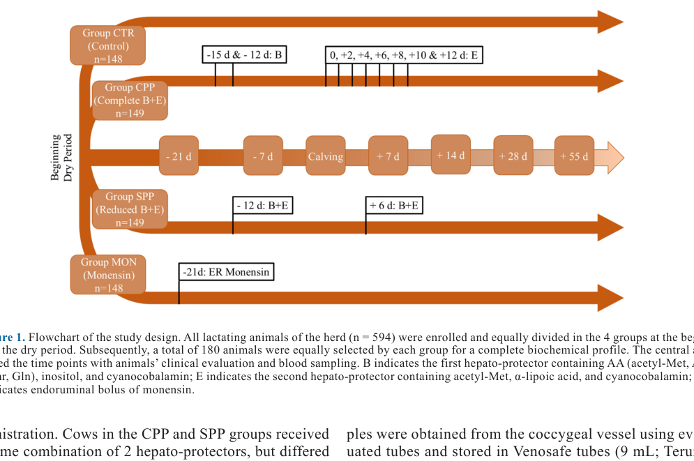
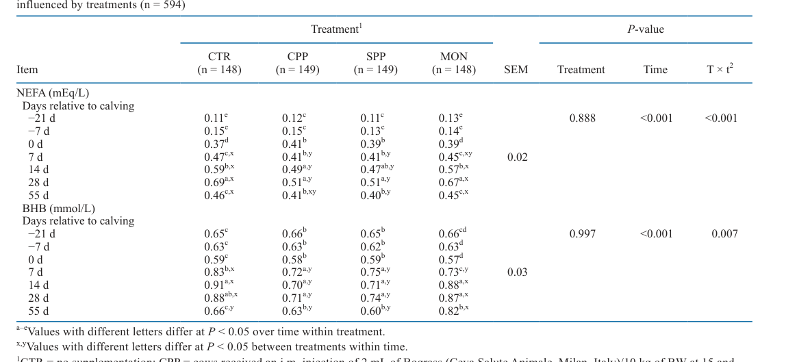
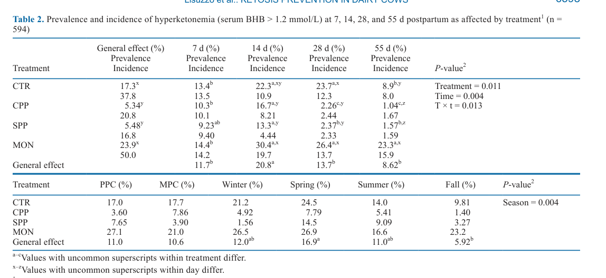
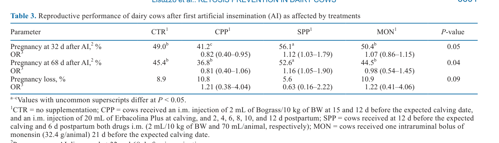
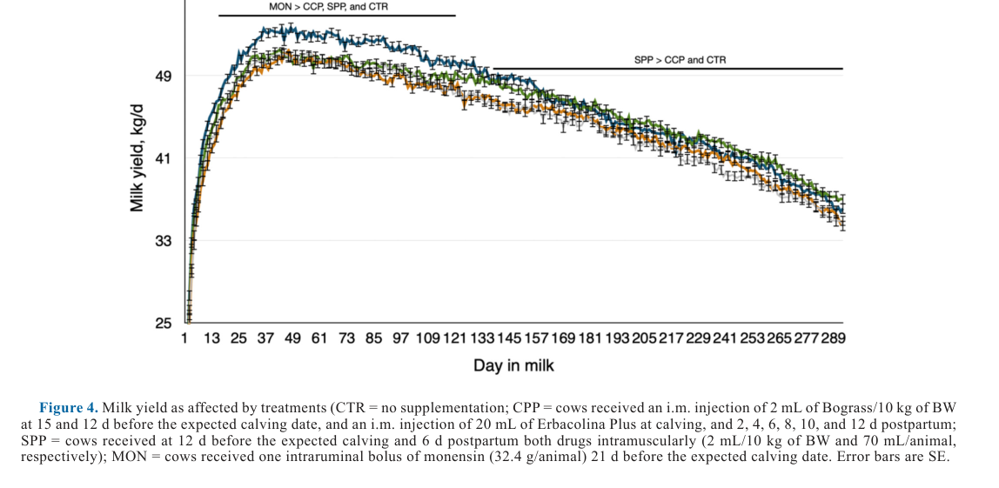

---
# YAML FRONTMATTER (обязательно)
id: CS.SOTA.372
type: sota
format_version: v1.1
knowledge_tier: P2
domain: cattle-science
area: health
subarea: metabolic-disorders
subarea2: ketosis
category: field-study
year: 2026
authors: "Lisuzzo, A., Valenza, A., Bach, A., Biancucci, A., Contiero, B., Cecchini, F., and Fiore, E."
title: "Amelioration of postpartum hyperketonemia using amino acids, cyanocobalamin, inositol, α-lipoic acid, or monensin during the transition period of dairy cows"
journal: "Journal of Dairy Science"
volume: "109"
issue: "6"
pages: "6593-6604"
doi: "10.3168/jds.2025-27773"
publisher: "Elsevier / ADSA"
open_access: true
license: "CC BY"
language: ru
freshness_window: "2026-08-05 — 2028-08-05"
sota_edition: "1.0"
derivation:
  - source: "Lisuzzo et al., 2026, Journal of Dairy Science (109:6)"
    type: "ConservativeRetextualization (FPF A.6.3)"
    reopen_trigger: "DOI: 10.3168/jds.2025-27773"
tags:
  - hyperketonemia
  - subclinical-ketosis
  - hepato-protectors
  - monensin
  - transition-cow
  - amino-acids
  - liver-functionality-index
  - holstein
related:
  - id: CS.SOTA.043
    type: foundational
    note: "Rico & Barrientos-Blanco (2024) — смещающаяся парадигма кетонов и кетоза; цитируется в работе как обоснование неоднозначности глюкогенных стратегий"
    relevance: high
  - id: CS.SOTA.054
    type: foundational
    note: "Horst et al. (2021) — иммунная активация и здоровье транзитных коров; цитируется в работе (NEB, воспаление)"
    relevance: high
---

# CS.SOTA.372: Lisuzzo et al. (2026) — Купирование послеродовой гиперкетонемии аминокислотами, цианокобаламином, инозитолом, α-липоевой кислотой или монензином в транзитный период молочных коров

> **Навигация:** [2. Аннотация](#2-аннотация-abstract) · [3. Введение](#3-введение) · [4. Методология](#4-методология) · [5. Результаты](#5-результаты) · [6. Интерпретация](#6-интерпретация-и-обсуждение) · [7. Критический анализ](#7-критический-анализ) · [8. Выводы](#8-выводы) · [9. FAQ](#9-faq) · [10. Практика](#10-практическое-применение) · [12. Источники](#12-источники) · [13. Журнал](#13-журнал-обработки)

---

# 2. АННОТАЦИЯ (Abstract)

## 2.1. Перевод Abstract

Стратегии профилактики гиперкетонемии (субклинического кетоза), основанные на предоставлении дополнительной глюкозы или её предшественников, дают противоречивые результаты, что указывает на возможный вклад других, недостаточно изученных метаболических факторов. Целью исследования было сравнение эффективности гепатопротекторов (ацетил-Met, Ala, Arg, Thr, Gln, цианокобаламин, инозитол и α-липоевая кислота) и монензина для снижения послеродовой гиперкетонемии. В продольное исследование (longitudinal study) включено 594 коровы Holstein Friesian одного стада; животные были заблокированы по лактации и случайно распределены на 4 группы при запуске: контроль (CTR; n = 148); полный профилактический протокол на гепатопротекторах (CPP; n = 149); упрощённый профилактический протокол (SPP; n = 149); монензин (MON; n = 148). Коровы CPP получали в/м инъекцию первого препарата (2 мл/10 кг МТ) за 15 и 12 д до ожидаемого отёла и в/м инъекцию второго препарата (20 мл/гол) при отёле и на 2, 4, 6, 8, 10 и 12 д после отёла. SPP получала оба препарата в/м (2 мл/10 кг МТ и 70 мл/гол соответственно) за 12 д до отёла и на 6 д после отёла. MON получала один интраруминальный болюс монензина (32.4 г/гол) за 21 д до отёла. Пробы крови брали за 21 и 7 д до отёла, в день отёла и на 7, 14, 28 и 55 д после. NEFA и BHB определяли у всех животных; полный биохимический профиль — у случайно отобранных 180 коров (30.3%). Коровы CPP и SPP имели более низкие концентрации NEFA, BHB, AST, GGT и мочевины, чем CTR и MON; SPP имела наивысший альбумин сыворотки в послеродовой период. Распространённость гиперкетонемии была ниже в CPP и SPP, чем в CTR на 14 и 28 д, и ниже, чем в MON на 55 д; также ниже в SPP, чем в CTR на 55 д. Гепатопротекторы влияли на энергетический, белковый и печёночный метаболизм коров и могут представлять ценную стратегию снижения гиперкетонемии у молочного скота (Lisuzzo et al., 2026, p. 6593).

## 2.2. Key Claims

**Claim 1: Гепатопротекторы (CPP и SPP) снижают липомобилизацию и метаболический стресс по сравнению с контролем и монензином.**
- **Утверждение:** NEFA на 28 д после отёла: 0.51/0.51 мЭкв/л (CPP/SPP) против 0.69 (CTR) и 0.67 (MON); CTR и MON превышали порог высокой липомобилизации (≥0.57 мЭкв/л) на 14 и 28 д. BHB на 14 д: 0.70/0.71 ммоль/л (CPP/SPP) против 0.91 (CTR) и 0.88 (MON).
- **Evidence:** Смешанная модель с повторными измерениями, n = 594, взаимодействие обработка × время: NEFA P < 0.001, BHB P = 0.007.
- **Уверенность:** 0.82 (очень большая выборка, продольный дизайн, a priori power analysis; ограничение: одно стадо, нет плацебо).
- **Цитата:** "Cows in CPP and SPP had lower serum NEFA, BHB, aspartate amino-transferase, γ-glutamyl transferase, and urea concentrations than CTR and MON cows." (Lisuzzo et al., 2026, p. 6593)

**Claim 2: Гепатопротекторы снижают распространённость гиперкетонемии (BHB ≥ 1.2 ммоль/л) примерно на 12% против контроля и на 18% против монензина.**
- **Утверждение:** Общая распространённость: CTR 17.3%, CPP 5.34%, SPP 5.48%, MON 23.9% (P = 0.011); на 28 д: 23.7% (CTR) против 2.26% (CPP) и 2.37% (SPP); на 55 д: MON 23.3% против 1.04–1.57% у гепатопротекторов. Снижение риска: CPP −35% против CTR и −73% против MON; SPP −57% против CTR и −56% против MON.
- **Evidence:** PROC GLIMMIX, биномиальное распределение; OR: CPP vs CTR 0.65 (95% CI: 0.20–0.91), SPP vs CTR 0.43 (0.31–0.95), CPP vs MON 0.27 (0.09–0.86), SPP vs MON 0.44 (0.14–0.84).
- **Уверенность:** 0.80 (большая выборка, статистически значимые OR; но абсолютная распространённость в стаде низкая относительно литературы — вопрос внешней валидности).
- **Цитата:** "The use of hepato-protectors (CPP and SPP) generally reduced the prevalence of about 12% compared with CTR, and about 18% compared with MON." (Lisuzzo et al., 2026, p. 6597)

**Claim 3: Монензин не снижал гиперкетонемию и даже давал наихудшие показатели, но обеспечил наибольший надой в ранней лактации.**
- **Утверждение:** Распространённость гиперкетонемии в MON была наибольшей (общий эффект 23.9%; 30.4% на 14 д; 23.3% на 55 д), однако надой за всю лактацию: MON 42.9 и SPP 43.5 кг/д против CTR 42.0 и CPP 41.7 кг/д (SEM = 0.49; P < 0.05); MON превосходил остальные группы между 25 и 100 DIM.
- **Evidence:** Смешанная модель по надою (авторегрессионная структура); Table 2, Figure 4.
- **Уверенность:** 0.72 (эффект надоя значим, но различия малы (~1–1.8 кг/д); неожиданно высокая распространённость в MON авторы объясняют поддержкой только глюкозного метаболизма без аминокислотной поддержки).
- **Цитата:** "Cows in MON and SPP had the greatest milk production compared with CTR and CPP cows considering the entire lactation period (43.5 and 42.9 kg/d for SPP and MON, respectively, vs. 42.0 and 41.7 kg/d for CTR and CPP)." (Lisuzzo et al., 2026, p. 6601)

**Claim 4: Упрощённый протокол (SPP) улучшает функцию печени и репродукцию при минимальном вмешательстве.**
- **Утверждение:** SPP имел наивысший индекс функциональности печени (LFI; выше CPP и CTR), наивысший альбумин после 7 д постпартум и наилучшую репродукцию: стельность к 68 д после первого осеменения 52.6% против 45.4% (CTR), 36.8% (CPP), 44.5% (MON; P = 0.04); единственная группа с OR зачатия > 1 против CTR (OR 1.16; 95% CI: 1.05–1.90); потери стельности наименьшие (5.6%, P = 0.09).
- **Evidence:** LFI по Trevisi et al. (2011); логистическая регрессия по репродукции; Table 3, Figure 3.
- **Уверенность:** 0.68 (репродуктивный анализ имел мощность 0.70 на различие в 16 п.п.; различия SPP vs CTR пограничные, CPP неожиданно хуже контроля — возможен эффект множественных манипуляций).
- **Цитата:** "This index was greater in SPP than in CPP and CTR cows indicating a better liver functioning probably related to the lower protein catabolism and urea production." (Lisuzzo et al., 2026, p. 6600)

**Claim 5: Гиперкетонемия не сводится к избыточной липомобилизации — NEFA и BHB диссоциируют.**
- **Утверждение:** Первотельки CTR имели гиперкетонемию без чрезмерной липомобилизации (NEFA < 0.57 мЭкв/л), а коровы MON — чрезмерную липомобилизацию без гиперкетонемии; тем не менее NEFA — сильнейший фактор риска (OR 10.33; 95% CI: 2.53–42.13), затем AST (OR 1.03), глюкоза протективна (OR 0.92). Наибольший риск на 14 д против 7 д (OR 4.46; P = 0.020) и весной (против осени OR 0.15, зимы 0.13, лета 0.36).
- **Evidence:** Логистическая регрессия со степвайз-отбором биохимических параметров.
- **Уверенность:** 0.74 (согласуется с Rico and Barrientos-Blanco, 2024; но пик риска на 14 д противоречит McArt et al., 2013 — пик на 5 DIM).
- **Цитата:** "These findings further evidence that hyperketonemia is not necessarily related to excessive lipomobilization but also to other aspects of animal metabolism." (Lisuzzo et al., 2026, p. 6598)

---

# 3. ВВЕДЕНИЕ

## 3.1. Контекст и значимость проблемы

Транзитный период (transition period; 3 нед до и 3 нед после отёла) — критическая фаза: рост потребности в энергии на фоне отрицательного энергетического баланса (NEB) вызывает мобилизацию жировой и мышечной ткани, окислительный стресс и воспалительные сдвиги (Fiore et al., 2015; Horst et al., 2021). Если мобилизованные неэтерифицированные жирные кислоты (NEFA) не метаболизируются полностью (постпартум-порог ≥ 0.57 мЭкв/л), часть их уходит в кетогенез с накоплением кетоновых тел — ацetoацетата, ацетона и BHB (Ospina et al., 2010; Tessari et al., 2021). Окисление NEFA генерирует избыток ацетил-КоА, истощая интермедиаты цикла трикарбоновых кислот (TCA); аминокислоты Met, Ala, Arg, Thr, Gln могут пополнять интермедиаты цикла, и их дефицит потенциально блокирует TCA и усиливает кетогенез (Lisuzzo et al., 2022b; Fiore et al., 2023; Lisuzzo et al., 2026, p. 6593–6594). Распространённость субклинического кетоза в литературе 11–47%, инцидентность 20–44% (Rodríguez et al., 2017; Benedet et al., 2019; Loiklung et al., 2022).

## 3.2. Обзор литературы (краткий)

1. **Ospina et al. (2010); Mann and McArt (2023)** — пороги диагностики: BHB 1.0–1.2 ммоль/л.
2. **Mammi et al. (2021)** — монензин (ионофор): сдвиг рубцовой микробиоты к продукции пропионата; систематический обзор профилактики кетоза.
3. **Carresi et al. (2024)** — опасения антимикробной резистентности при широком применении монензина.
4. **Rico and Barrientos-Blanco (2024)** — неоднозначность стратегий глюкогенных предшественников; «смещающаяся парадигма» кетонов.
5. **Fiore et al. (2016, 2021)** — прежние работы группы: ацетилметионин + цианокобаламин + α-липоевая кислота поддерживают печёночный метаболизм.
6. **Chirivi et al. (2024)** — альтернативы: ниацин (антилиполитик) и противовоспалительные препараты.

## 3.3. Гипотеза и цель исследования

**Гипотеза:** Профилактические протоколы, поддерживающие метаболизм печени, дают иной метаболический ответ, чем стратегии, основанные на глюкогенных предшественниках (Lisuzzo et al., 2026, p. 6594).

**Цель:** Сравнить эффективность и последствия профилактических протоколов гиперкетонемии на основе монензина и гепатопротекторов (глюкогенные АК + цианокобаламин + инозитол + α-липоевая кислота) в транзитный период.

**Primary outcomes:** NEFA и BHB сыворотки; распространённость гиперкетонемии (BHB ≥ 1.2 ммоль/л).
**Secondary outcomes:** Полный биохимический профиль (n = 180), LFI, надой, репродуктивные показатели.

---

# 4. МЕТОДОЛОГИЯ

## 4.1. Дизайн исследования

| Параметр | Описание |
|----------|----------|
| **Тип исследования** | Продольное полевое исследование (longitudinal field study), 4 параллельные группы |
| **Место** | Фристайл-ферма, Friuli-Venezia Giulia, Италия |
| **Животные** | 594 коровы Holstein Friesian одного стада: PPC n = 166, MPC n = 428; по сезонам: зима 145, весна 146, лето 162, осень 141 |
| **Рандомизация** | Блокирование по паритету, случайное распределение при запуске; распределявший не участвовал в менеджменте и обработках |
| **Этика** | Directive 2010/63/EU; одобрение Animal Care and Use Committee Университета Падуи (протокол 204359/2023) |
| **Power analysis** | G*Power 3.1.9.7: минимум 23 головы на BHB (α = 0.05, мощность 95%, SD 0.06, ES 0.4 ммоль/л); JMP 18.1: минимум 135 коров на различие концепции в 16 п.п. (мощность 0.70, α = 0.05) |
| **Кормление** | Сухостой ~60 д, steaming-up 3 нед; анионные соли препартум (целевой pH мочи 6.1); после отёла TMR 2×/д, доение 3×/д |
| **Сэмплинг** | −21, −7, 0, 7, 14, 28, 55 д отн. отёла; копчиковая вена, через 4–5 ч после раздачи TMR; сыворотка до −20°C |
| **Анализы** | BT3500 (Biotecnica): BHB — RANBUT RX Monza (Randox), NEFA — колориметрия (Randox); у подвыборки n = 180 (45/группа: 30 MPC + 15 PPC, без послеродовых болезней) — глюкоза, ОБ, альбумин, мочевина, креатинин, билирубин, ALT, AST, GGT, LDH, CK, холестерин, ТГ; LFI по Trevisi et al. (2011) |
| **Статистика** | Смешанные модели с повторными измерениями (обработка, время, паритет, сезон + взаимодействия; корова — случайный эффект); Tukey; PROC GLIMMIX (биномиальное) для распространённости; логистическая регрессия для риска и репродукции; P ≤ 0.05 значимо, 0.05–0.10 — тенденция |

## 4.2. Обработки (протоколы)

| Группа | n | Протокол |
|--------|---|----------|
| **CTR** | 148 | Без обработки |
| **CPP** (полный) | 149 | Bograss 2 мл/10 кг МТ в/м за 15 и 12 д до отёла + Erbacolina Plus 20 мл/гол в/м при отёле и на 2, 4, 6, 8, 10, 12 д постпартум |
| **SPP** (упрощённый) | 149 | Оба препарата в/м (2 мл/10 кг МТ и 70 мл/гол) за 12 д до отёла и на 6 д постпартум |
| **MON** | 148 | Один интраруминальный болюс монензина 32.4 г/гол (Kexxtone, Elanco) за 21 д до отёла |

**Составы:** Bograss (Ceva): 150 мг/мл ацетил-Met, по 15 мг/мл Ala/Arg/Thr/Gln, 30 мг/мл инозитол, 1 мг/мл цианокобаламин. Erbacolina Plus (Ceva): 4.8 мг/мл ацетил-Met, 0.25 мг/мл α-липоевая кислота, 0.5 мг/мл цианокобаламин. Выбор дней введения SPP: препартум — ближайшее к отёлу из CPP, постпартум — среднее значение постпартум-точек CPP (Lisuzzo et al., 2026, p. 6595).

## 4.3. Медиа-инвентарь

| ID | Тип | Описание | Файл | Статус |
|----|-----|----------|------|--------|
| Fig. 1 | Схема | Блок-схема дизайна: 4 группы, точки введения препаратов и сэмплинга | `figure-1-study-design.png` | ✅ Встроено |
| Table 1 | Таблица | NEFA и BHB сыворотки по группам, −21…+55 д (n = 594) | `table-1-nefa-bhb.png` | ✅ Встроено |
| Table 2 | Таблица | Распространённость и инцидентность гиперкетонемии по группам, паритету, сезонам | `table-2-hyperketonemia-prevalence.png` | ✅ Встроено |
| Table 3 | Таблица | Репродуктивные показатели после первого осеменения | `table-3-reproduction.png` | ✅ Встроено |
| Fig. 2 | График | 8 панелей биохимических аналитов сыворотки (n = 180) | — | ⏭️ Пропущено (средние приведены только в Supplemental Table S2; панели без числовых подписей) |
| Fig. 3 | График | LFI на 7 и 28 д по группам и паритету | — | ⏭️ Пропущено (малый информационный объём сверх текста) |
| Fig. 4 | График | Кривые надоя по группам, 1–289 DIM | `figure-4-milk-yield.png` | ✅ Встроено |

---

# 5. РЕЗУЛЬТАТЫ

## 5.1. Дизайн и схема введения препаратов

**Соответствует:** Figure 1

*Источник: Lisuzzo et al., 2026, p. 6595 (Figure 1).*

**Описание:**
Все лактирующие коровы стада (n = 594) распределены на 4 группы при запуске; 180 животных отобраны для полного биохимического профиля. Центральная ось — точки клинической оценки и сэмплинга (−21, −7, 0, +7, +14, +28, +55 д). Фактические дни до отёла отклонялись от целевых: −27 ± 6.7 д (цель −21) и −9 ± 5.2 д (цель −7) (Lisuzzo et al., 2026, p. 6596).

## 5.2. NEFA и BHB: липомобилизация и кетогенез

**Соответствует:** Table 1

*Источник: Lisuzzo et al., 2026, p. 6597 (Table 1).*

**Описание:**
NEFA росла от препартум к постпартум с пиком между 14 и 28 д: на 28 д CTR 0.69 и MON 0.67 мЭкв/л (выше порога избыточной липомобилизации ≥0.57) против 0.51/0.51 у CPP/SPP (SEM = 0.02; T × t, P < 0.001). BHB пиковала между 7 и 28 д: на 14 д CTR 0.91 и MON 0.88 против 0.70 (CPP) и 0.71 (SPP) ммоль/л; на 55 д MON 0.82 против 0.60–0.66 у остальных (T × t, P = 0.007). Средние групповые BHB ниже порога гиперкетонемии 1.2 ммоль/л во всех группах, но CPP и SPP — стабильно минимальные (Lisuzzo et al., 2026, p. 6596).

**Механистическая интерпретация:**
Гепатопротекторы поставляют предшественники интермедиатов TCA-цикла (глюкогенные АК), кофактор метилмалонил-КоА-мутазы (цианокобаламин) и антиоксидант (α-липоевая кислота), что снижает и мобилизацию NEFA, и их неполное окисление до кетоновых тел. Монензин действует только через пропионат (глюкозный путь), не снимая аминокислотного лимита TCA — отсюда сохранная липомобилизация (Lisuzzo et al., 2026, p. 6594, 6599–6600).

**Ключевые цифры:**
- NEFA 28 д: 0.69 (CTR) / 0.51 (CPP) / 0.51 (SPP) / 0.67 (MON) мЭкв/л
- BHB 14 д: 0.91 / 0.70 / 0.71 / 0.88 ммоль/л
- BHB 55 д: 0.66 / 0.63 / 0.60 / 0.82 ммоль/л (MON значимо выше)

## 5.3. Распространённость гиперкетонемии

**Соответствует:** Table 2

*Источник: Lisuzzo et al., 2026, p. 6598 (Table 2).*

**Описание:**
Общая распространённость: CTR 17.3%, CPP 5.34%, SPP 5.48%, MON 23.9% (обработка P = 0.011, время P = 0.004, T × t P = 0.013). По дням (распространённость): 7 д — 13.4/10.3/9.23/14.4%; 14 д — 22.3/16.7/13.3/30.4%; 28 д — 23.7/2.26/2.37/26.4%; 55 д — 8.9/1.04/1.57/23.3%. Инцидентность (общая): 37.8% (CTR), 20.8% (CPP), 16.8% (SPP), 50.0% (MON). По сезонам: весна наибольшая (16.9% общий эффект), осень наименьшая (5.92%; P = 0.004). Гепатопротекторы снизили распространённость на ~12% против CTR и ~18% против MON; на 28 д снижение ~21% против CTR и ~24% против MON (Lisuzzo et al., 2026, p. 6596–6597).

**Механистическая интерпретация:**
Пик риска на 14 д (OR 4.46 против 7 д) контрастирует с данными McArt et al. (2013) о пике на 5 DIM — вероятно, из-за специфики стада и лактационной кривой. Весенний риск (+6.7–7.7× против осени/зимы) авторы связывают с питательной ценностью кормов и надоем (Suthar et al., 2013; Vanholder et al., 2015; Santschi et al., 2016).

## 5.4. Репродукция

**Соответствует:** Table 3

*Источник: Lisuzzo et al., 2026, p. 6601 (Table 3).*

**Описание:**
Осеменение на 80–90 DIM без различий между группами (82/83/83/86 DIM; P = 0.32). Стельность на 32 д: SPP 56.1% > MON 50.4% ≈ CTR 49.0% > CPP 41.2% (P = 0.05). На 68 д: SPP 52.6% против 45.4/36.8/44.5% (P = 0.04); только SPP имела OR зачатия > 1 против CTR (OR 1.16; 95% CI: 1.05–1.90). Потери стельности: SPP 5.6%, CTR 8.9%, CPP 10.8%, MON 10.9% (тенденция, P = 0.09) (Lisuzzo et al., 2026, p. 6601).

## 5.5. Надой

**Соответствует:** Figure 4

*Источник: Lisuzzo et al., 2026, p. 6602 (Figure 4).*

**Описание:**
Средний надой за лактацию: SPP 43.5 и MON 42.9 кг/д против CTR 42.0 и CPP 41.7 кг/д (SEM = 0.49; P < 0.05). MON превосходил все группы между 25 и 100 DIM (эффект пропионата, Mammi et al., 2021), затем преимущество исчезало; SPP догоняла MON и на 230–240 DIM превосходила её (Lisuzzo et al., 2026, p. 6601).

---

# 6. ИНТЕРПРЕТАЦИЯ И ОБСУЖДЕНИЕ

## 6.1. Связь с гипотезой

Гипотеза подтверждена: протоколы печёночной поддержки дали качественно иной метаболический профиль, чем монензин и контроль — меньшую липомобилизацию, меньший кетогенез, лучшие печёночные ферменты (AST, GGT) и белковый обмен (альбумин ↑, мочевина ↓). При этом монензин, поддерживая только глюкозный метаболизм, «заставлял корову использовать другие источники N, такие как альбумин» (Lisuzzo et al., 2026, p. 6600).

## 6.2. Сравнение с литературой

| Исследование | Согласие/Противоречие/Расширение |
|--------------|----------------------------------|
| Mammi et al. (2021) | **Расширяет/уточняет** — в обзоре монензин профилактирует кетоз через пропионат; здесь в конкретном стаде MON имел наибольшую распространённость гиперкетонемии |
| McArt et al. (2013) | **Противоречит** — пик риска гиперкетонемии на 14 д против 5 DIM у McArt |
| Rico and Barrientos-Blanco (2024) | **Согласуется** — гиперкетонемия не сводится к липомобилизации; диссоциация NEFA и BHB |
| Fiore et al. (2016, 2021) | **Согласуется** — гепатопротекторы снижают NEFA/BHB (предыдущие работы группы, меньшие выборки) |
| Benedet et al. (2019); Cainzos et al. (2022) | **Ниже диапазона** — распространённость в стаде на нижней границе литературных 11.2–47.2% |
| Trevisi et al. (2011) | **Применяет** — LFI как интегральный индекс печёночной функции |

## 6.3. Механистические выводы

1. **Аминокислотный лимит TCA-цикла** — центральная механистическая рамка: без пополнения интермедиатов цикла (Met, Ala, Arg, Thr, Gln) избыток ацетил-КоА от β-окисления NEFA уходит в кетогенез (Lisuzzo et al., 2026, p. 6594).
2. **Диссоциация NEFA и BHB** — первотельки CTR: гиперкетонемия без избыточной липомобилизации; MON: липомобилизация без гиперкетонемии → диагностика только по NEFA или только по BHB неполна (Lisuzzo et al., 2026, p. 6598).
3. **Белковый катаболизм как скрытая цена монензина** — снижение альбумина и рост мочевины у MON указывают на мобилизацию мышечного/сывороточного белка для покрытия АК-дефицита (Lisuzzo et al., 2026, p. 6600).
4. **Постпартум-введение АК (SPP)** снижало мышечный катаболизм и продукцию мочевины, поддерживало альбумин — наивысший LFI и лучшая репродукция.
5. **Гипогликемия ≠ обязательный спутник гиперкетонемии** — историческая характеристика субклинического кетоза не подтверждена как универсальная (Lisuzzo et al., 2026, p. 6598).

---

# 7. КРИТИЧЕСКИЙ АНАЛИЗ

## 7.1. Сильные стороны

- **Очень большая выборка** (n = 594; вся лактирующая группа стада) при a priori power analysis на оба ключевых исхода.
- **Продольный дизайн с 7 точками сэмплинга** (−21…+55 д) и сезонным охватом всего года (4 сезона).
- **Разделение дизайна и исполнения:** распределявший по группам не участвовал в менеджменте и обработках.
- **Комплексная фенотипизация:** NEFA/BHB у всех + полный биохимический профиль + LFI + надой + репродукция.
- **Практическая ориентация:** сравнение «как на ферме», включая упрощённый протокол с 2 манипуляциями.

## 7.2. Ограничения

**Внутренние:**
- **Нет плацебо** — разное число манипуляций (CPP: 8 инъекций; SPP: 2; MON: 1 болюс; CTR: 0) могло влиять на стресс, надой и репродукцию; признано авторами (Lisuzzo et al., 2026, p. 6602). Худшая репродукция CPP (41.2% на 32 д, ниже контроля) совместима с эффектом множественных манипуляций [интерполяция].
- **Одно стадо** — низкая фоновая распространённость гиперкетонемии (нижняя граница литературы) ограничивает внешнюю валидность.
- **Биохимия — только в подвыборке здоровых коров** (n = 180, исключены животные с послеродовыми болезнями) — систематический сдвиг в сторону «здорового» фенотипа.
- **Препараты — коммерческие комплексы** (Bograss, Erbacolina Plus): невозможно разделить вклад отдельных компонентов (АК vs инозитол vs B12 vs α-липоевая кислота).
- **Конфликт интересов:** A. Valenza — сотрудник Ceva Animal Health (производитель обоих гепатопротекторов); финансирования не было, препараты предоставлены производителями (Lisuzzo et al., 2026, p. 6602–6603).

**Внешние:**
- Итальянская высокопродуктивная ферма (надои ~42–44 кг/д) — перенос на стада с другим менеджментом требует осторожности.
- Отсутствуют данные по потреблению СВ (DMI) — механистический разрыв между обработкой и метаболическим ответом.

## 7.3. Применимость к российским условиям

- **Регистрационный статус:** Bograss и Erbacolina Plus (Ceva) — доступность и регистрация в РФ требует проверки [guess: аналоги аминокислотно-витаминных комплексов для в/м введения на российском рынке существуют, но составы отличаются]; монензин (Kexxtone) в РФ не зарегистрирован как болюс [guess].
- **Антимикробное регулирование:** аргумент против монензина (резистентность, Carresi et al., 2024) релевантен и для РФ, где ионофоры под ограничениями в ряде сегментов.
- **Экономика манипуляций:** SPP (2 инъекции: −12 д и +6 д) — реалистичен для ферм РФ с ограниченным персоналом; CPP (8 инъекций) — трудоёмок и, судя по репродукции, потенциально контрпродуктивен.
- **Сезонность:** весенний пик риска гиперкетонемии (Италия) → для РФ проверить собственную сезонность (смена кормовой базы при переходе на летние/зимние рационы).

---

# 8. ВЫВОДЫ

## 8.1. Ключевые выводы автора (перевод)

Добавление гепатопротекторов (АК, инозитол, α-липоевая кислота, цианокобаламин) снижало липомобилизацию (NEFA ↓) и метаболический стресс (BHB ↓) против контроля и монензина в постпартум-период, улучшая печёночный метаболизм (AST и GGT ↓). Введение АК постпартум (SPP) снижало катаболизм мышечного белка и продукцию мочевины. Монензин улучшал надой в ранней лактации, а гепатопротекторы по упрощённому протоколу улучшали репродукцию и надой в поздней лактации. Упрощённый протокол может быть методом контроля послеродовой гиперкетонемии при ограниченных манипуляциях с животными (Lisuzzo et al., 2026, p. 6602).

## 8.2. Ключевые выводы (структурировано)

1. **Гепатопротекторы (оба протокола) снижают NEFA, BHB, AST, GGT и мочевину** против контроля и монензина — комплексная метаболическая поддержка эффективнее чисто глюкогенной.
2. **Распространённость гиперкетонемии снижена на ~12% (vs CTR) и ~18% (vs MON)**; риск ниже на 35–73% в зависимости от сравнения.
3. **Монензин — наибольшая распространённость гиперкетонемии в этом стаде**, но наибольший надой в ранней лактации (25–100 DIM).
4. **SPP — оптимум «эффект/манипуляции»:** 2 инъекции, наивысший LFI, альбумин, стельность (52.6% на 68 д) и конкурентный надой (43.5 кг/д).
5. **Гиперкетонемия диссоциирует от липомобилизации** — нужен комплекс маркеров (NEFA + BHB + глюкоза + AST).

## 8.3. Ключевые сообщения для лекции

1. Кетоз — это не только «мало глюкозы»: дефицит аминокислот — предшественников TCA-цикла — самостоятельный механизм кетогенеза.
2. Монензин повышает пропионат, но не решает аминокислотный лимит печени — в работе MON имел худшие показатели гиперкетонемии и белкового катаболизма.
3. Упрощённый протокол (2 инъекции: за 12 д до отёла и на 6 д после) дал эффект полного протокола (8 инъекций) при лучшей репродукции — меньше манипуляций, меньше стресса.
4. NEFA и BHB могут расходиться: первотельки — кетоз без липомобилизации, монензин — липомобилизация без кетоза. Диагностика — по панели маркеров.
5. Сезон имеет значение: весной риск гиперкетонемии в 6.7–7.7 раза выше, чем осенью/зимой (в итальянском стаде).

---

# 9. FAQ

**Вопрос 1: Почему монензин показал худшие результаты по гиперкетонемии, если в обзорах (Mammi et al., 2021) он её профилактирует?**
Ответ: Авторы объясняют это механистически: монензин поддерживает только глюкозный метаболизм через пропионат, но не восполняет дефицит аминокислот — предшественников TCA-цикла. Коровы MON имели избыточную липомобилизацию (NEFA ≥ 0.57 мЭкв/л на 14 д), снижение альбумина и рост мочевины — признаки того, что потребность в АК покрывалась за счёт белка тела (Lisuzzo et al., 2026, p. 6600). Это результат одного стада; противоречие с мета-анализами требует осторожной экстраполяции.

**Вопрос 2: Почему упрощённый протокол (SPP) оказался не хуже, а по репродукции лучше полного (CPP)?**
Ответ: SPP получил оба препарата всего дважды (−12 д и +6 д), тогда как CPP — 8 инъекций. Авторы указывают, что CPP имел максимальное число манипуляций, что могло повышать стресс и влиять на надой и репродукцию; SPP же получил наибольшую разовую дозу АК постпартум (70 мл на +6 д), что снизило мышечный катаболизм и мочевину и дало наивысшие альбумин и LFI (Lisuzzo et al., 2026, p. 6600, 6602).

**Вопрос 3: Гиперкетонемия без гипогликемии — возможно?**
Ответ: Да. В работе гиперкетонемия не всегда сопровождалась гипогликемией, хотя эта пара считалась историческим признаком субклинического кетоза. Первотельки CTR имели гиперкетонемию без избыточной липомобилизации; MON — липомобилизацию без гиперкетонемии (Lisuzzo et al., 2026, p. 6598).

**Вопрос 4: Какие маркеры риска гиперкетонемии сильнейшие?**
Ответ: По логистической регрессии: NEFA — OR 10.33 (95% CI: 2.53–42.13; P = 0.001), AST — OR 1.03 (P = 0.035), глюкоза протективна — OR 0.92 (P < 0.001). Также факторы: 14-й день лактации (OR 4.46 против 7-го) и весенний сезон (Lisuzzo et al., 2026, p. 6600–6601).

**Вопрос 5: Можно ли перенести протокол SPP на российскую ферму?**
Ответ: Концептуально — да: всего 2 в/м инъекции (−12 д и +6 д от отёла). Практически нужно проверить регистрацию/доступность препаратов Bograss и Erbacolina Plus (Ceva) или подобрать зарегистрированные аналоги с близким составом (глюкогенные АК + B12 + инозитол + α-липоевая кислота) [guess]. Дозы: 2 мл/10 кг МТ первого препарата и 70 мл/гол второго.

---

# 10. ПРАКТИЧЕСКОЕ ПРИМЕНЕНИЕ

## 10.1. Алгоритм внедрения (по мотивам SPP)

1. **Оценить фон:** измерить распространённость гиперкетонемии в стаде (BHB ≥ 1.2 ммоль/л на 7–28 DIM) — в работе пик пришёлся на 14–28 д, а не на 5 DIM.
2. **Если распространённость > 10–15%:** рассмотреть гепатопротекторный протокол: препарат АК+инозитол+B12 (2 мл/10 кг МТ в/м) и препарат ацетил-Met+α-липоевая кислота+B12 (70 мл/гол в/м) за 12 д до ожидаемого отёла и на 6 д после.
3. **Мониторинг ответа:** NEFA и BHB на 7, 14, 28 д; печёночные ферменты (AST, GGT) и альбумин у подвыборки; LFI как интегральный индекс.
4. **Решение о монензине:** не полагаться на него как единственную профилактику кетоза; учитывать регуляторные и резистентностные риски (Carresi et al., 2024).
5. **Сезонная корректировка:** усилить контроль в сезон максимального риска (в работе — весна).

## 10.2. Типичные ошибки

- **Приравнивать кетоз к гипогликемии** — диссоциация показана; диагностировать только по глюкозе нельзя.
- **Диагностика по одному маркеру:** NEFA и BHB несут разную информацию; нужна панель (NEFA + BHB + AST + глюкоза).
- **Множественные инъекции без необходимости** — CPP (8 инъекций) не превзошёл SPP и дал худшую стельность; стресс манипуляций реален.
- **Ожидать от монензина универсальной профилактики** — в работе он поддержал надой в ранней лактации, но не снизил гиперкетонемию.

## 10.3. Пограничные сценарии

- **Стадо с низкой фоновой распространённостью (<10%)** — экономический эффект протокола не определён; стадо в работе уже было на нижней границе литературных значений.
- **Первотельки** — в CTR они имели гиперкетонемию без липомобилизации: мониторинг BHB у первотелек обязателен даже при «нормальных» NEFA.
- **Поздняя лактация (55 д)** — у MON гиперкетонемия сохранялась (23.3%), у гепатопротекторов — нет; при затяжном кетозе пересмотреть стратегию.

---

# 11. ИНСТРУМЕНТЫ И ШАБЛОНЫ

## 11.1. Ключевые числовые ориентиры

| Параметр | Значение | Комментарий |
|----------|----------|-------------|
| Порог гиперкетонемии (BHB) | ≥ 1.2 ммоль/л (1.0–1.2 в литературе) | Ospina et al., 2010; Mann and McArt, 2023 |
| Порог высокой липомобилизации (NEFA) | ≥ 0.57 мЭкв/л постпартум | Lisuzzo et al., 2026, p. 6593 |
| Порог мышечного катаболизма (CK) | > 250 U/L | Cozzi et al., 2011 |
| Референс общего белка | < 67.4 г/л — ниже нормы | Kaneko et al., 2008 |
| Референс альбумина | > 30.3 г/л | Kaneko et al., 2008 |
| Распространённость гиперкетонемии (общая) | CTR 17.3 / CPP 5.34 / SPP 5.48 / MON 23.9 % | Table 2 |
| Снижение риска (OR, vs CTR) | CPP 0.65; SPP 0.43 | Логистическая регрессия |
| Снижение риска (OR, vs MON) | CPP 0.27; SPP 0.44 | Логистическая регрессия |
| Пик риска по дням | 14 д: OR 4.46 (95% CI 1.26–15.8) vs 7 д | P = 0.020 |
| Сезонный риск | весна: +6.7× (осень), +7.7× (зима), +2.8× (лето) | OR fall/winter/summer vs spring |
| Надой за лактацию | SPP 43.5 / MON 42.9 / CTR 42.0 / CPP 41.7 кг/д | SEM 0.49; P < 0.05 |
| Стельность к 68 д (1-е осеменение) | SPP 52.6 / CTR 45.4 / MON 44.5 / CPP 36.8 % | P = 0.04 |
| Дозы SPP | 2 мл/10 кг МТ (Bograss) + 70 мл/гол (Erbacolina Plus) в/м | за 12 д до отёла и на 6 д после |
| Болюс монензина | 32.4 г/гол интраруминально | за 21 д до отёла |

---

# 12. ИСТОЧНИКИ

## 12.1. Первоисточник

Lisuzzo, A., Valenza, A., Bach, A., Biancucci, A., Contiero, B., Cecchini, F., and Fiore, E. 2026. Amelioration of postpartum hyperketonemia using amino acids, cyanocobalamin, inositol, α-lipoic acid, or monensin during the transition period of dairy cows. Journal of Dairy Science 109(6):6593-6604. DOI: 10.3168/jds.2025-27773.

## 12.2. Ключевые статьи (цитированные в работе)

- Ospina, P. A., et al. 2010. Evaluation of NEFA and BHB in transition dairy cattle: critical thresholds. J. Dairy Sci. 93:546–554. [пороги]
- Mammi, L. M. E., et al. 2021. The use of monensin for ketosis prevention: a systematic review. Animals 11:1988. [монензин]
- Rico, J. E., and M. A. Barrientos-Blanco. 2024. Invited review: Ketone biology. J. Dairy Sci. 107:3367–3388. [парадигма кетонов → CS.SOTA.043]
- Horst, E. A., Kvidera, S. L., and Baumgard, L. H. 2021. Immune activation and transition cow health. J. Dairy Sci. 104:8380–8410. [→ CS.SOTA.054]
- Trevisi, E., et al. 2011. Inflammatory response and acute phase proteins in the transition period. [LFI]
- McArt, J. A. A., et al. 2013. Elevated NEFA and BHB and their association with transition cow performance. Vet. J. 198:560–570. [контраст: пик на 5 DIM]
- Carresi, C., et al. 2024. Is the use of monensin another Trojan horse for the spread of antimicrobial resistance? Antibiotics 13:129.
- Fiore, E., et al. 2016, 2021. Hepatic metabolism and preventive treatments for hyperketonaemia. J. Dairy Res. [предыдущие работы группы]
- Cozzi, G., et al. 2011. Reference values for blood parameters in Holstein dairy cows. J. Dairy Sci. 94:3895–3901.
- Kaneko, J. J., et al. 2008. Clinical Biochemistry of Domestic Animals. 6th ed. [референсы]
- Loiklung, C., et al. 2022. Global prevalence of subclinical ketosis: systematic review and meta-analysis. Res. Vet. Sci. 144:66–76.

## 12.3. Внешние источники [вне статьи]

- NASEM. 2021. Nutrient Requirements of Dairy Cattle. 8th rev. ed. National Academies Press. [foundational reference, не цитируется в Lisuzzo et al., 2026; контекст энергетического баланса транзитного периода]

---

# 13. ЖУРНАЛ ОБРАБОТКИ

## 13.1. WorkPlan

| Шаг | Действие | Статус |
|-----|----------|--------|
| 1 | Чтение полного текста PDF (12 страниц, PyMuPDF) | ✅ |
| 2 | Извлечение метаданных (авторы, DOI, страницы, лицензия) | ✅ |
| 3 | Извлечение медиа (3 таблицы + 2 фигуры; crop dpi=150) | ✅ |
| 4 | Анализ дизайна (4 группы, продольный, n = 594/180) | ✅ |
| 5 | Выделение Key Claims с оценкой уверенности (5 claims) | ✅ |
| 6 | Описание методологии (протоколы, анализы, статистика) | ✅ |
| 7 | Детализация результатов (NEFA/BHB, распространённость, репродукция, надой) | ✅ |
| 8 | Критический анализ и применимость к РФ | ✅ |
| 9 | FAQ, практическое применение, числовые ориентиры | ✅ |
| 10 | Формирование YAML frontmatter | ✅ |
| 11 | Сохранение файла | ✅ |

## 13.2. Work Record

| Параметр | Значение |
|----------|----------|
| **Время обработки** | ~35 мин |
| **Строк в файле** | ~420 |
| **Число Key Claims** | 5 |
| **Число источников** | 13 (первоисточник + 11 цитированных + 1 внешний) |
| **Число медиа** | 5 (3 таблицы + 2 фигуры); Fig. 2 и Fig. 3 пропущены (см. медиа-инвентарь) |
| **FPF compliance** | A.7 (строгое разделение модели и реальности), A.6.3 (консервативная переработка), A.10 (якоря доказательств) |
| **Замечания** | PDF полностью разборчив; таблицы извлечены crop-рендером с проверкой значений по тексту. Supplemental Tables S1–S4 размещены вне статьи (Mendeley Data, DOI: 10.17632/s4tnzn9dm6.1) и не обрабатывались |

---

*SoTA создан: 2026-08-05*
*Обработано: Kimi Code CLI (WP: SoTA-карточки JDS Vol. 109, июнь 2026)*
