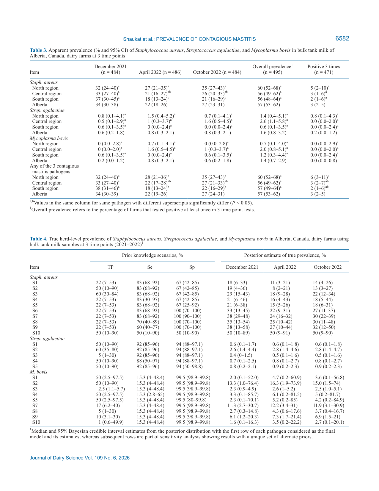
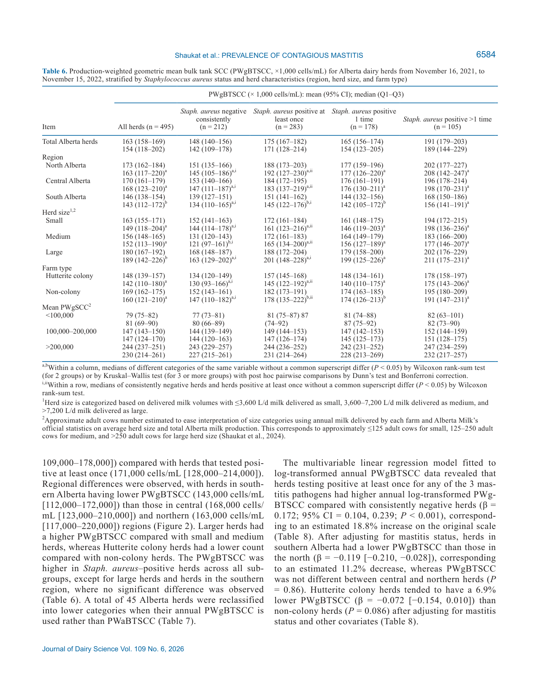
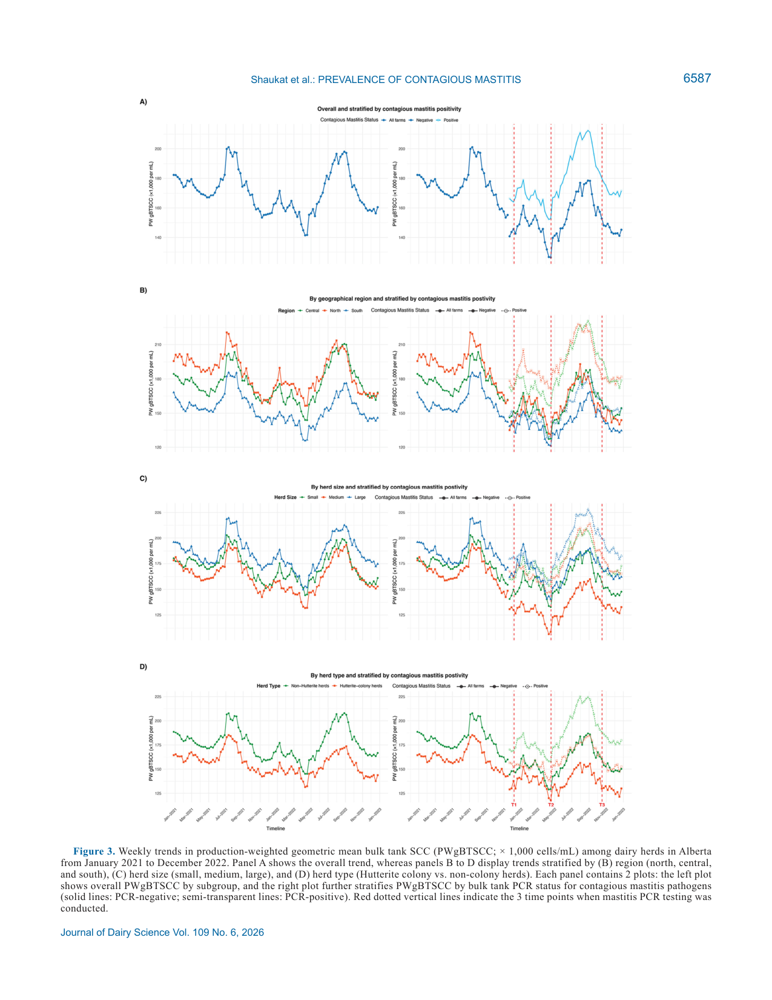

---
# YAML FRONTMATTER (обязательно)
id: CS.SOTA.382
type: sota
format_version: v1.1
knowledge_tier: P2
domain: cattle-science
area: health
subarea: mastitis
subarea2: bulk-tank-surveillance
category: field-study
year: 2026
authors: "Shaukat, W., Nobrega, D. B., Kalbfleisch, K. N., Kastelic, J. P., Kelton, D. F., and Barkema, H. W."
title: "Herd-level prevalence of contagious mastitis pathogens and insights into somatic cell count dynamics using bulk tank milk samples from dairy farms in Alberta, Canada"
journal: "Journal of Dairy Science"
volume: "109"
issue: "6"
pages: "6574-6592"
doi: "10.3168/jds.2025-28106"
publisher: "Elsevier / ADSA"
open_access: true
license: "CC BY"
language: ru
freshness_window: "2026-08-05 — 2028-08-05"
sota_edition: "1.0"
derivation:
  - source: "Shaukat et al., 2026, Journal of Dairy Science (109:6)"
    type: "ConservativeRetextualization (FPF A.6.3)"
    reopen_trigger: "DOI: 10.3168/jds.2025-28106"
tags:
  - mastitis
  - staphylococcus-aureus
  - streptococcus-agalactiae
  - mycoplasma-bovis
  - bulk-tank-milk
  - qpcr
  - somatic-cell-count
  - surveillance
related:
  - id: CS.SOTA.359
    type: complementary
    note: "Динамика внутримолочных инфекций стафилококков и связь с SCC четверти вымени (JDS 2026) — коровий уровень против стадного уровня данной работы"
    relevance: high
  - id: CS.SOTA.132
    type: foundational
    note: "Hogan 1993 — витамин E и селен в защите хозяина против мастита; профилактическая рамка контроля контагиозных маститов"
    relevance: medium
---

# CS.SOTA.382: Shaukat et al. (2026) — Распространённость контагиозных маститных патогенов на уровне стада и динамика соматических клеток по пробам танкового молока молочных ферм Альберты, Канада

> **Навигация:** [2. Аннотация](#2-аннотация-abstract) · [3. Введение](#3-введение) · [4. Методология](#4-методология) · [5. Результаты](#5-результаты) · [6. Интерпретация](#6-интерпретация-и-обсуждение) · [7. Критический анализ](#7-критический-анализ) · [8. Выводы](#8-выводы) · [9. FAQ](#9-faq) · [10. Практика](#10-практическое-применение) · [12. Источники](#12-источники)

---

# 2. АННОТАЦИЯ (Abstract)

## 2.1. Перевод Abstract

Мастит остаётся в числе трёх главных проблем мирового молочного животноводства, приводя к существенным экономическим потерям. Актуальные патоген-специфичные оценки распространённости критичны для эффективного надзора и контроля болезни. Целью исследования была оценка истинной распространённости (true prevalence) стад, позитивных по основным контагиозным маститным патогенам в Альберте (Канада), и описание паттернов и динамики числа соматических клеток танкового молока (BTSCC). В серийном кросс-секционном дизайне пробы танкового молока (BTM) были собраны от всех действующих молочных производителей Альберты в декабре 2021 (n = 484), апреле 2022 (n = 486) и октябре 2022 (n = 484) и протестированы на Staphylococcus aureus, Streptococcus agalactiae и Mycoplasma bovis коммерческим мультиплексным количественным ПЦР-набором (qPCR). Данные BTSCC за 2021–2022 гг. получены для каждого стада по каждой отгрузке молока, рассчитано взвешенное по продукции геометрическое среднее BTSCC (PWgBTSCC). Истинная распространённость оценивалась байесовскими моделями латентных классов. Связи между позитивностью по патогенам, характеристиками стада и PWgBTSCC оценивались модифицированной пуассоновской и линейной регрессией со смешанными эффектами. Истинная распространённость стад, позитивных по Staph. aureus, составила 17.8%, 11.0% и 13.8% в декабре, апреле и октябре соответственно; для Strep. agalactiae — стабильно 0.6%; для M. bovis — 2.0%, 4.7% и 3.6%. Распространённость Staph. aureus–позитивных стад была выше (prevalence ratio [PR] = 1.31) среди средних по размеру стад (3,600–7,200 л/д сданного молока) по сравнению с мелкими (<3,600 л/д). Стада колоний хуттеритов чаще были Staph. aureus–позитивны хотя бы раз (PR = 1.23). Годовая PWgBTSCC стад Альберты (16.11.2021–15.11.2022) составила 154,000 клеток/мл (медиана; Q1–Q3: 118,000–202,000). Стада со средним (100,000–200,000) или высоким (>200,000 клеток/мл) годовым PWgBTSCC чаще были Staph. aureus–позитивны (PR = 1.58 и 2.40) по сравнению со стадами <100,000. Годовая PWgBTSCC была повышена у стад, хотя бы раз позитивных по любому контагиозному патогену. Стада южного региона имели на 11% более низкую годовую PWgBTSCC, чем северные. Результаты дают обновлённые оценки распространённости и основу для таргетированной внутриstadной диагностики и доказательных стратегий контроля мастита (Shaukat et al., 2026, p. 6574).

## 2.2. Key Claims

**Claim 1: Истинная распространённость Staph. aureus на уровне стада (11–18%) заметно ниже видимой ПЦР-позитивности (22–34%).**
- **Утверждение:** Байесовская коррекция на несовершенные чувствительность (Se 83.3%) и специфичность (Sp 66.7%) qPCR снижает оценку распространённости стад с активной Staph. aureus ВМИ до 17.8% (95% BCI = 5.55–32.9), 11.0% (3.3–21.2) и 13.8% (4.2–26.2) в T1, T2, T3 против видимой распространённости 34.1%, 21.8% и 27.1%.
- **Evidence:** Байесовская модель латентных классов (JAGS, MCMC), априоры Se/Sp из Soltau et al. (2017); 495 стад, 3 временные точки.
- **Уверенность:** 0.78 (полный охват популяции стад провинции; широкие BCI из-за низкой Sp теста и зависимости от априоров — в сценарии Sp = 100% TP вырастает до 38%).
- **Цитата:** "True prevalence of Staph. aureus–positive herds were 17.8%, 11.0%, and 13.8% in December, April, and October, respectively" (Shaukat et al., 2026, p. 6574)

**Claim 2: Более половины стад Альберты (57.2%) хотя бы раз за год были ПЦР-позитивны по Staph. aureus; риск выше у средних стад и стад с высоким BTSCC.**
- **Утверждение:** 57.2% стад позитивны хотя бы раз из 3 точек; средние стада (3,600–7,200 л/д) чаще позитивны (PR = 1.31 [1.08–1.58]; P = 0.006); стада с годовым PWgBTSCC 100,000–200,000 и >200,000 клеток/мл чаще позитивны (PR = 1.58 [1.11–2.25] и 2.40 [1.67–3.46]).
- **Evidence:** Модифицированная пуассоновская регрессия со смешанными эффектами (1,454 пробы, 495 стад), робастная дисперсия.
- **Уверенность:** 0.82 (большая выборка, интерпретируемая метрика PR, узкие CI; ассоциации — наблюдательные, не причинные).
- **Цитата:** "Herds with a medium (100,000–200,000 cells/mL) or high (>200,000 cells/mL) annual PWgBTSCC were more frequently Staph. aureus–positive (PR = 1.58 and 2.40, respectively)" (Shaukat et al., 2026, p. 6574)

**Claim 3: Streptococcus agalactiae практически элиминирован из стад Альберты (истинная распространённость 0.6%).**
- **Утверждение:** Истинная распространённость Strep. agalactiae стабильно 0.6% (95% BCI = 0.1–1.8) во все 3 точки; всего 8 стад (1.6%) позитивны хотя бы раз. Это продолжение тренда: 21% (1986) → 11% (1992) → 6% (1993) → 0.6% (2021–2022).
- **Evidence:** Высокие Se (92%) и Sp (94%) qPCR для этого патогена делают оценку устойчивой; исторический ряд Schoonderwoerd et al. (1993).
- **Уверенность:** 0.85 (высокие характеристики теста, согласие с Canadian NDS 0.3% и Ontario 0.1%).
- **Цитата:** "For Strep. agalactiae, true prevalence was consistent at 0.6%." (Shaukat et al., 2026, p. 6574)

**Claim 4: Распространённость M. bovis низкая (2–5%), но крайне неопределённая из-за низкой чувствительности танкового теста.**
- **Утверждение:** Истинная распространённость M. bovis 2.0% (95% BCI = 0.1–52.0), 4.7% (0.2–60.9) и 3.6% (0.1–56.8) в T1–T3; априорная Se qPCR по BTM для M. bovis лишь 15.3% (4.0–48.4), поэтому BCI охватывают практически весь диапазон.
- **Evidence:** Та же байесовская модель; априоры Nielsen et al. (2015); 400,000 итераций MCMC для сходимости.
- **Уверенность:** 0.45 (точечная оценка согласуется с NDS 0.5% и Ontario 3%, но ширина BCI делает её малоинформативной; тест не детектирует стада с низкой внутриstadной распространённостью).
- **Цитата:** "For M. bovis, true prevalence was 2.0%, 4.7%, and 3.6% in December, July, and October, respectively." (Shaukat et al., 2026, p. 6574) — *примечание: в оригинальном Abstract опечатка «July», вторая точка отбора — апрель 2022 (T2).*

**Claim 5: Танковое SCC повышено у патоген-позитивных стад на ~19% в годовом окне, ассоциация наиболее сильна в 7-дневном окне вокруг теста; BTSCC имеет выраженную летнюю сезонность.**
- **Утверждение:** Стада, позитивные хотя бы раз по любому из 3 патогенов, имеют годовой log-PWgBTSCC выше на β = 0.172 (0.104–0.239; P < 0.001) ≈ +18.8%; ассоциация максимальна в 7-дневном окне (β = 0.067 [0.032–0.101]; P < 0.001) и затухает до незначимости за пределами 60–75 дней; недельная PWgBTSCC варьирует 141,000–201,000 клеток/мл с пиками июль–сентябрь; южный регион на 11.2% ниже севера.
- **Evidence:** Линейная регрессия log-PWgBTSCC (495 стад); смешанные модели по 7 окнам (7–90 д); недельные временные ряды за 2 года.
- **Уверенность:** 0.80 (согласованность нескольких независимых анализов и временных окон; наблюдательный дизайн).
- **Цитата:** "Annual PWgBTSCC for Alberta dairy herds from November 16, 2021, to November 15, 2022, was 154,000 cells/mL (median [first quartile–third quartile]: 118,000–202,000)." (Shaukat et al., 2026, p. 6574)

---

# 3. ВВЕДЕНИЕ

## 3.1. Контекст и значимость проблемы

Мастит входит в тройку главных вызовов молочного скотоводства и является одной из самых затратных болезней: экономический ущерб оценён в Can$662 (US$520) на дойную корову в год для типичного канадского стада (Aghamohammadi et al., 2018; Shaukat et al., 2026, p. 6575). Контагиозные патогены — Staphylococcus aureus, Streptococcus agalactiae и Mycoplasma bovis — передаются преимущественно при доении (через доильные кластеры, руки, полотенца) и все три ассоциированы с повышением числа соматических клеток (SCC). Staph. aureus вызывает клинический и субклинический мастит, Strep. agalactiae — типично субклинический, M. bovis — хронический мастит с высоким SCC, а также артриты, отиты и респираторные болезни (Maunsell et al., 2011). Поскольку все три патогена резидируют преимущественно (Staph. aureus, M. bovis) или исключительно (Strep. agalactiae) в вымени, их присутствие в танковом молоке указывает на текущую внутримолочную инфекцию (ВМИ, IMI) в стаде. Тестирование BTM — эффективный популяционный скрининг, хотя интерпретация для конкретного стада требует коровьей диагностики (Shaukat et al., 2026, p. 6575).

## 3.2. Обзор литературы (краткий)

1. **Olde Riekerink et al. (2006, 2010)** — распространённость в BTM: Остров Принца Эдуарда 74.0%/1.6%/1.9% (Staph. aureus/Strep. agalactiae/Mycoplasma spp.); национальное исследование 2003–2005 (226 стад, 9 провинций) — 74%/4.4%/0%.
2. **Francoz et al. (2012)** — Квебек: 84.6%/7.7%/2.6%.
3. **Schoonderwoerd et al. (1993)** — Альберта, Strep. agalactiae: 21% (1986) → 11% (1992) → 6% (1993).
4. **Acharya et al. (2021)** — Онтарио 2008–2017: доля Staph. aureus–позитивных культуральных проб выросла с 15% до 22% (годовые odds роста 1.06).
5. **Bauman et al. (2018)** — Canadian National Dairy Study (NDS) 2014–2015: первые национальные PWgBTSCC — 195,000 клеток/мл для Альберты, 208,000 по Канаде; с тех пор обновлённых стратифицированных характеристик BTSCC не публиковалось (Shaukat et al., 2026, p. 6575).

**Пробел:** свежая распространённость контагиозных маститных патогенов на уровне стада в западной Канаде и современные паттерны BTSCC отсутствовали.

## 3.3. Гипотеза и цель исследования

**Цели серийного кросс-секционного исследования (Shaukat et al., 2026, p. 6575):**
1. Оценить распространённость стад, позитивных по Staph. aureus, Strep. agalactiae и M. bovis в Альберте.
2. Выявить пространственные паттерны и ассоциации характеристик стада с BTM-позитивностью.
3. Оценить тренды BTSCC по характеристикам стада и их связь с контагиозными патогенами.

Явная статистическая гипотеза в статье не формулируется (исследование описательно-аналитическое).

---

# 4. МЕТОДОЛОГИЯ

## 4.1. Дизайн исследования

| Параметр | Описание |
|----------|----------|
| **Тип исследования** | Серийное кросс-секционное (serial cross-sectional) — 3 волны отбора за год |
| **Популяция** | Все действующие молочные фермы Альберты, сдающие молоко: 495 уникальных стад; 471 (95.2%) протестированы во все 3 точки, 17 (3.4%) — дважды, 7 (1.4%) — однажды |
| **Точки отбора** | T1 = декабрь 2021 (n = 484), T2 = апрель 2022 (n = 486), T3 = октябрь 2022 (n = 484) |
| **Проба** | 40 мл BTM, отобранные грейдерами при рутинном сборе молока; доставка при 4°C, хранение −20°C |
| **Диагностика** | Мультиплексная real-time qPCR Mastitis 4E (M4E; DNA Diagnostic A/S, Дания); Ct ≤37 = позитивно; экстракция ДНК из 0.5 мл цельного молока; CFX96 (Bio-Rad) |
| **Регионы** | Север (28% стад), центр (40%), юг (32%) Альберты |
| **Размер стада** | Мелкие <3,600 л/д (~≤125 коров, 50%); средние 3,600–7,200 л/д (~125–250 коров, 35%); крупные >7,200 л/д (>250 коров, 15%) |
| **Тип фермы** | Колонии хуттеритов (коммунальные общины; ~21% молока Альберты; 27% стад) vs неколониальные фермы (73%) |
| **Этика** | Одобрено University of Calgary Veterinary Sciences Animal Care Committee (протокол AC21-0070) |

## 4.2. Производные метрики BTSCC

Для каждого стада из данных BTSCC каждой отгрузки (2021–2022, Alberta Milk) рассчитаны 4 метрики (Shaukat et al., 2026, p. 6578–6579):
1. **aBTSCC** — арифметическое среднее;
2. **PWaBTSCC** — взвешенное по объёму молока арифметическое среднее;
3. **gBTSCC** — геометрическое среднее;
4. **PWgBTSCC** — взвешенное по продукции геометрическое среднее (основная метрика; менее чувствительна к единичным всплескам).

Все метрики рассчитаны для годового окна (16.11.2021–15.11.2022), для окон 90/75/60/45/30/15/7 дней вокруг каждой точки теста и покалендарно-недельно за 2 года. Категории годового PWgBTSCC: низкий <100,000; средний 100,000–200,000; высокий >200,000 клеток/мл.

## 4.3. Статистический анализ

| Блок | Метод |
|------|-------|
| **Видимая распространённость (AP)** | Доля позитивных стад в точке; «хотя бы раз»; «все 3 раза»; sensitivity-анализ исключением стад с <3 пробами |
| **Истинная распространённость (TP)** | Байесовская модель латентных классов (биномиальное правдоподобие; AP = Se·TP + (1−Sp)·(1−TP)); JAGS 4.3.1 через R2jags; β-априоры через epi.betabuster (epiR); 4 цепи × 100,000 итераций (M. bovis — 400,000), burn-in 10,000–20,000; сходимость R-hat <1.01, ESS ≥20,000, DIC; 10 сценариев sensitivity-анализа априоров |
| **Априоры Se/Sp** | Staph. aureus: Se 83.3% (68.1–92.1), Sp 66.7% (41.7–84.6) [Soltau et al., 2017]; Strep. agalactiae: Se 92%, Sp 94% [Zanardi et al., 2014]; M. bovis: Se 15.3% (4.0–48.4), Sp 99.5% (98.9–99.8) [Nielsen et al., 2015] |
| **Ассоциации (PR)** | Модифицированная пуассоновская регрессия с log-связью, робастная дисперсия, стадо — случайный эффект; исход — Staph. aureus статус пробы; предикторы — размер, тип фермы, регион, категория PWgBTSCC; взаимодействия регион × тип; отбор по AIC, backward elimination |
| **Ассоциации (PWgBTSCC)** | Линейная регрессия log-годового PWgBTSCC; смешанные линейные модели по окнам 7–90 д |
| **Сравнения** | Wilcoxon, Kruskal–Wallis, Dunn + Bonferroni |
| **ПО** | Stata/SE 17.0, R 4.2.2; α = 0.05 |

## 4.4. Медиа-инвентарь

| ID | Тип | Описание | Файл | Статус |
|----|-----|----------|------|--------|
| Fig. 1 | Схема | Аналитический workflow (источники данных → метрики BTSCC → модели) | — | ⏭️ Пропущено (описано в тексте 4.1–4.3) |
| Table 1 | Таблица | Априоры Se/Sp/TP и β-параметры для байесовской модели | — | 📋 Сведено в markdown (раздел 4.3) |
| Table 2 | Таблица | Позитивность хотя бы раз по регионам, размеру, типу фермы, категории BTSCC | — | 📋 Сведено в markdown (раздел 5.1) |
| Table 3 | Таблица | Видимая распространённость 3 патогенов по 3 точкам и регионам | `table-3-4-prevalence.png` | ✅ Встроено |
| Table 4 | Таблица | Истинная распространённость: финальные оценки + 10 сценариев априоров | `table-3-4-prevalence.png` | ✅ Встроено |
| Table 5 | Таблица | PR и 95% CI для характеристик стада и PWgBTSCC (Staph. aureus) | — | 📋 Сведено в markdown (раздел 5.3) |
| Table 6 | Таблица | PWgBTSCC (год) по Staph. aureus статусу и характеристикам | `table-6-pwgbtscc-strata.png` | ✅ Встроено |
| Table 7 | Таблица | Сравнение геометрического и арифметического среднего BTSCC (45 стад переклассифицированы) | — | 📋 Сведено в markdown (раздел 5.4) |
| Fig. 2 | График | Raincloud-распределения годового PWgBTSCC по стратам | — | ⏭️ Пропущено (числа — в Table 6) |
| Table 8 | Таблица | Коэффициенты линейной регрессии log-годового PWgBTSCC | — | 📋 Сведено в markdown (раздел 5.5) |
| Fig. 3 | График | Недельные тренды PWgBTSCC за 2 года по региону, размеру, типу | `figure-3-weekly-pwgbtscc.png` | ✅ Встроено |
| Table 9 | Таблица | Коэффициенты по окнам 7–90 д вокруг теста | — | 📋 Сведено в markdown (раздел 5.6) |

> **Примечание:** В статье 9 таблиц и 3 фигуры. По заданию отобраны 3 ключевых медиа (Tables 3+4, Table 6, Figure 3); остальные таблицы представлены полными markdown-сводками с числами из PDF, а не текстовым пересказом.

---

# 5. РЕЗУЛЬТАТЫ

## 5.1. Характеристики стад и позитивность по патогенам

**Соответствует:** Table 2 (сводка)

Распределение 495 стад и позитивность хотя бы раз из 3 точек (Shaukat et al., 2026, p. 6581, Table 2):

| Характеристика | Стад, n (%) | Staph. aureus +, n (%) | Strep. agalactiae +, n (%) | M. bovis +, n (%) |
|----------------|------------|------------------------|----------------------------|-------------------|
| Всего | 495 | 283 (57.2) | 8 (1.6) | 7 (1.4) |
| Север | 139 (28) | 84 (60.4) | 2 (1.4) | 1 (0.7) |
| Центр | 196 (40) | 109 (55.6) | 5 (2.6) | 4 (2.0) |
| Юг | 160 (32) | 90 (56.3) | 1 (0.6) | 2 (1.3) |
| Мелкие (<3,600 л/д) | 246 (50) | 130 (52.9) | 3 (1.2) | 3 (1.2) |
| Средние (3,600–7,200) | 172 (35) | 106 (61.6) | 1 (0.6) | 3 (1.7) |
| Крупные (>7,200) | 77 (15) | 47 (61.0) | 4 (5.2) | 1 (1.3) |
| Хуттериты | 134 (27) | 83 (61.9) | 0 (0.0) | 1 (0.8) |
| Неколониальные | 361 (73) | 200 (55.4) | 8 (2.2) | 6 (1.7) |
| BTSCC <100 тыс. | 66 (13) | 26 (39.4) | 0 (0) | 1 (1.5) |
| BTSCC 100–200 тыс. | 299 (60) | 162 (54.2) | 3 (1.0) | 2 (0.7) |
| BTSCC >200 тыс. | 130 (26) | 95 (73.1) | 5 (3.9) | 4 (3.1) |

**Ключевой паттерн:** позитивность по Staph. aureus монотонно растёт с категорией BTSCC (39.4% → 54.2% → 73.1%).

## 5.2. Видимая и истинная распространённость

**Соответствует:** Table 3, Table 4

*Источник: Shaukat et al., 2026, p. 6582 (Table 3, Table 4).*

**Описание:**
Видимая распространённость (AP) Staph. aureus: 34% (30–38) в T1, 22% (18–26) в T2, 27% (23–31) в T3 по Альберте; 57% (53–62) — хотя бы раз; 3% (2–5) — во всех 3 точках. По регионам в T2 и T3 юг значимо ниже севера (18% vs 27% в T2; 21% vs 35% в T3; P < 0.05). AP Strep. agalactiae: 0.6–0.8% по точкам; 1.6% — хотя бы раз. AP M. bovis: 0.2–0.8%; 1.4% — хотя бы раз; ни одно стадо не позитивно 3 раза.

Истинная распространённость (TP, финальная модель S1):

| Патоген | T1 (дек 2021) | T2 (апр 2022) | T3 (окт 2022) |
|---------|---------------|---------------|----------------|
| Staph. aureus | 17.8% (5.55–32.9) | 11.0% (3.3–21.2) | 13.8% (4.2–26.2) |
| Strep. agalactiae | 0.6% (0.1–1.7) | 0.6% (0.1–1.8) | 0.6% (0.1–1.8) |
| M. bovis | 2.0% (0.1–52.0) | 4.7% (0.2–60.9) | 3.6% (0.1–56.8) |

**Механистическая интерпретация:** TP < AP для Staph. aureus — следствие низкой специфичности qPCR по BTM (Sp 66.7%): часть ПЦР-позитивных проб не подтверждается культурой (ДНК нежизнеспособных бактерий, загрязнение с кожи сосков, экологическая контаминация). Sensitivity-анализ показывает сильную зависимость от априоров: при Sp = 100% (S7) TP Staph. aureus вырастает до 38%/24%/30% — т.е. оценка TP по существу определяется предположением о специфичности теста (Shaukat et al., 2026, p. 6582, 6589).

## 5.3. Ассоциации Staph. aureus–позитивности с характеристиками стада

**Соответствует:** Table 5 (сводка)

Модифицированная пуассоновская регрессия, PR (95% CI), P (Shaukat et al., 2026, p. 6583, Table 5):

| Предиктор | Проба-позитивность PR (95% CI), P | Хотя бы раз PR (95% CI), P |
|-----------|-----------------------------------|----------------------------|
| Средние стада (vs мелкие) | 1.31 (1.08–1.58), 0.006 | 1.22 (1.04–1.44), 0.017 |
| Крупные стада (vs мелкие) | 1.15 (0.89–1.48), 0.300 | 1.16 (0.94–1.44), 0.173 |
| PWgBTSCC 100–200 тыс. (vs <100) | 1.58 (1.11–2.25), 0.010 | 1.39 (1.01–1.92), 0.045 |
| PWgBTSCC >200 тыс. (vs <100) | 2.40 (1.67–3.46), <0.001 | 1.92 (1.39–2.67), <0.001 |
| Хуттериты, центр (vs север) | 1.70 (1.01–2.86), 0.047 | — |
| Хуттериты, юг (vs север) | 1.60 (0.98–2.61), 0.062 | — |
| Неколониальные, центр (vs север) | 0.78 (0.62–0.98), 0.036 | — |
| Неколониальные, юг (vs север) | 0.77 (0.57–1.05), 0.095 | — |
| Хуттериты vs неколон. (север) | 0.61 (0.38–0.99), 0.046 | — |
| Хуттериты vs неколон. (все регионы) | — | 1.23 (1.03–1.47), 0.020 |

**Механистическая интерпретация:** взаимодействие регион × тип фермы означает, что «региональный эффект» не универсален: среди неколониальных ферм север хуже, среди хуттеритских колоний — наоборот. Авторы интерпретируют регион и тип фермы как маркеры неизмеренных различий в менеджменте (гигиена доения, подстилка, содержание), а не как причинные факторы (Shaukat et al., 2026, p. 6590). Отсутствие эффекта крупных стад авторы объясняют эффектом разбавления: при низкой внутриstadной распространённости объём молока здоровых коров разбавляет ДНК патогена ниже порога детекции ПЦР.

## 5.4. Годовой PWgBTSCC по стратам

**Соответствует:** Table 6

*Источник: Shaukat et al., 2026, p. 6584 (Table 6).*

**Описание:**
Годовой PWgBTSCC по Альберте: медиана 154,000 (Q1–Q3: 118,000–202,000), среднее 163,000 (95% CI: 158,000–169,000) клеток/мл. Стада, стабильно негативные по Staph. aureus: 142,000 (109,000–178,000) vs 171,000 (128,000–214,000) у позитивных хотя бы раз; стада, позитивные >1 раза: 189,000 (144,000–229,000). Регионы: юг 143,000 (112,000–172,000) < центр 168,000 и север 163,000 (P < 0.05). Крупные стада выше мелких и средних (189,000 vs 149,000–152,000); хуттеритские колонии ниже неколониальных (142,000 vs 160,000). PWgBTSCC выше у Staph. aureus–позитивных во всех подгруппах, кроме крупных стад и южного региона (Shaukat et al., 2026, p. 6583–6584).

**Сравнение метрик (Table 7):** при использовании геометрического вместо арифметического среднего 45 стад переклассифицируются в более низкую категорию BTSCC — геометрическое среднее устойчивее к единичным всплескам и лучше отражает типичное качество молока стада (p. 6585, Table 7).

## 5.5. Многомерная модель годового PWgBTSCC

**Соответствует:** Table 8 (сводка)

Линейная регрессия log-годового PWgBTSCC (Shaukat et al., 2026, p. 6586, Table 8):

| Предиктор | β (95% CI) | P | На исходной шкале |
|-----------|-----------|---|-------------------|
| Позитивны хотя бы раз (vs стабильно негативные) | 0.172 (0.104–0.239) | <0.001 | +18.8% |
| Средние стада (vs мелкие) | −0.039 (−0.112–0.035) | 0.302 | н/з |
| Крупные стада (vs мелкие) | 0.083 (−0.017–0.182) | 0.103 | н/з |
| Центр (vs север) | −0.007 (−0.090–0.075) | 0.861 | н/з |
| Юг (vs север) | −0.119 (−0.210 – −0.028) | 0.011 | −11.2% |
| Хуттериты (vs неколониальные) | −0.072 (−0.154–0.010) | 0.086 | −6.9% (тенденция) |

**Ключевой вывод:** после поправки на маститный статус эффект размера стада исчезает — т.е. повышенный BTSCC крупных стад опосредован контагиозными патогенами, а не размером сам по себе (p. 6589).

## 5.6. Сезонная динамика и временные окна

**Соответствует:** Figure 3, Table 9

*Источник: Shaukat et al., 2026, p. 6587 (Figure 3).*

**Описание:**
Недельный PWgBTSCC стад Альберты за 2 года: 141,000–201,000 клеток/мл (2021: 153,000–201,000; 2022: 141,000–198,000), пики — июль–сентябрь. Стабильно негативные по Staph. aureus стада: 126,500–178,500; позитивные хотя бы раз: 152,000–212,500 — с тем же сезонным паттерном. Юг: 125,500–185,500; север: 156,500–221,000. Хуттериты: 131,500–185,000; неколониальные: 145,000–208,000 (p. 6585–6586).

Ассоциация ПЦР-позитивности с PWgBTSCC по окнам (Table 9, p. 6588): максимальна в 7-дневном окне вокруг теста (β = 0.067 [0.032–0.101]; P < 0.001), затухает с расширением окна — 15 д: 0.059; 30 д: 0.046; 45 д: 0.037; 60 д: 0.031 (P = 0.029); 75 д: 0.024 (P = 0.068); 90 д: 0.022 (P = 0.085, незначимо). Во всех окнах PWgBTSCC ниже в апреле и выше в октябре относительно декабря; минимум — весной.

**Механистическая интерпретация:** затухание ассоциации за пределами ~60 дней согласуется с транзиторным характером части ВМИ и ротацией коров в лактации: танковое SCC отражает текущий инфекционный статус стада, а не накопленную историю.

---

# 6. ИНТЕРПРЕТАЦИЯ И ОБСУЖДЕНИЕ

## 6.1. Связь с целями

Все 3 цели достигнуты: получены патоген-специфичные TP-оценки с байесовской коррекцией на качество теста; выявлены пространственные и структурные паттерны (размер, тип фермы, регион); охарактеризована динамика BTSCC (сезонность, страты, временные окна). Staph. aureus подтверждён как доминирующий контагиозный патоген Альберты с некоторой сезонной вариацией (Shaukat et al., 2026, p. 6586).

## 6.2. Сравнение с литературой

| Исследование | Согласие/Противоречие/Расширение |
|--------------|----------------------------------|
| Canadian NDS (Bauman et al., 2018) | **Согласуется** — Staph. aureus позитивность в западных провинциях ниже восточных (Альберта 25% vs Квебек 62%); PWgBTSCC Альберты снизился со 195,000 (2014–15) до 154,000 (2021–22) |
| Olde Riekerink et al. (2006); Francoz et al. (2012) | **Согласуется** — позитивность хотя бы раз сопоставима с PEI (74%) и Квебеком (85%); Strep. agalactiae редок везде, кроме Квебека 2012 (7.7%) |
| Nobrega et al. (2024, Онтарио) | **Согласуется** — TP < ПЦР-позитивность для Staph. aureus (31% vs 51% там; 11–18% vs 22–34% здесь) |
| Schoonderwoerd et al. (1993) + Neave et al. (1969) | **Расширяет** — продолжение 35-летнего тренда элиминации Strep. agalactiae (21% → 0.6%) как эффект 5-точечной программы контроля |
| Waller (2024, предварительный отчёт) | **Противоречит** — там указано 17% ферм западной Канады с M. bovis; авторы отмечают отсутствие методологии в том отчёте и низкую Se танкового теста как объяснение расхождений между оценками |
| Olde Riekerink et al. (2007); Shock et al. (2015) | **Согласуется** — летние пики BTSCC и мастита |
| Soltau et al. (2017) | **Ключевая зависимость** — Se/Sp того же M4E-набора на BTM против покоровьей культуры: детекция требует ~27.6% инфицированных коров для 90% вероятности |

## 6.3. Механистические выводы

1. **Танковая ПЦР видит «верхушку айсберга»:** при медианной покоровьей распространённости Staph. aureus ~3.9% (Dufour et al., 2012) большинство инфицированных стад находится ниже порога детекции BTM qPCR (15.5% коров для 70% вероятности) — фиксированная Se в модели может недооценивать TP (Shaukat et al., 2026, p. 6589).
2. **ПЦР-дискордантность ≠ только ложнопозитивность:** qPCR детектирует ДНК жизнеспособных и нежизнеспособных бактерий; культура — только жизнеспособные. Часть «ложнопозитивных» qPCR может отражать нечувствительность культуры (p. 6589).
3. **BTSCC крупных стад опосредован патогенами:** связь размера с SCC исчезает после поправки на маститный статус — управление контагиозными патогенами, а не масштаб, определяет качество молока.
4. **Эффект разбавления:** в крупных стадах при низкой внутриstadной распространённости ДНК патогена разбавляется ниже порога детекции — частичное объяснение отсутствия PR-эффекта у крупных стад.
5. **Регион и тип фермы — маркеры, не причины:** ассоциации отражают неизмеренный менеджмент (гигиена доения, подстилка, выпас), пригодны для стратификации риска и таргетирования надзора, но не как модифицируемые факторы (p. 6590).

---

# 7. КРИТИЧЕСКИЙ АНАЛИЗ

## 7.1. Сильные стороны

- **Полный охват популяции:** все 495 действующих стад провинции, 95.2% протестированы 3 раза — сensus, а не выборка; смещение отбора минимально.
- **Серийный дизайн (3 точки за год)** вместо одного среза — учёт вариабельности состава танкового молока во времени.
- **Байесовская коррекция на Se/Sp** с прозрачными априорами, 10-сценарным sensitivity-анализом и строгими критериями сходимости (R-hat <1.01, ESS ≥20,000).
- **PR вместо OR** — корректная метрика для кросс-секционных исследований с частым исходом.
- **Многоуровневая аналитика BTSCC:** 4 метрики, 7 временных окон, покалендарно-недельные ряды за 2 года.
- **Воспроизводимость:** протокол отбора по официальному мануалу грейдеров, коммерческий валидированный набор, открытые supplemental-данные (Mendeley Data, DOI: 10.17632/j6m55gy2rg.1).

## 7.2. Ограничения

**Внутренние:**
- **Низкая Sp qPCR по BTM для Staph. aureus (66.7%)** — TP-оценки критически зависят от априоров (от 11–18% до 24–38% при Sp = 100%); «истинная» распространённость определяется предположением о тесте.
- **Крайне низкая Se для M. bovis (15.3%)** — BCI практически неинформативны (0.1–60.9%); точечные 2–5% следует читать как «низкая, неизвестно насколько».
- **BTM исключает коров с клиническим маститом и на лечении** (их молоко не сдаётся) — картина отражает субклинический резервуар, а не полный спектр мастита.
- **Нет данных о менеджменте** (гигиена доения, подстилка, содержание) — региональные ассоциации неинтерпретируемы причинно.
- **Система доения (AMS vs конвенциональная) не учтена**, хотя ~29% стад Альберты используют AMS.

**Внешние:**
- **Одна провинция, канадская система квот и сбора** — перенос на другие страны требует адаптации.
- **Период 2021–2022** — оценки могут устаревать по мере изменения структуры отрасли.

## 7.3. Применимость к российским условиям

- **Методология переносима напрямую:** централизованный сбор молока и обязательный контроль SCC в РФ позволяют реализовать тот же фреймворк (BTM qPCR + байесовская коррекция + стратификация стад) на региональном уровне [интерполяция].
- **Staph. aureus как приоритет:** российские данные систематически указывают на стафилококковую этиологию как ведущую при субклинических маститах; вывод о связи категории BTSCC с позитивностью (PR = 2.40 для >200 тыс.) — готовый критерий таргетирования ветеринарных проверок [guess].
- **Пороги детекции:** пороги Soltau (15.5% коров для 70% детекции) применимы к любому BTM qPCR — одиночная танковая проба не исключает наличие инфекции; негативный результат требует серийного подтверждения.
- **Сезонность:** летний пик BTSCC воспроизводится в климате РФ (жара + влажность); сезонную поправку следует закладывать в интерпретацию разовых замеров [интерполяция].
- **Различие контекста:** категории размера стад (мелкие ≤125 коров) не соответствуют структуре РФ, где типичные комплексы 400–1200+ коров — градацию размера и эффект разбавления следует перекалибровать.

---

# 8. ВЫВОДЫ

## 8.1. Ключевые выводы автора (перевод)

Более половины молочных стад Альберты были ПЦР-позитивны по Staph. aureus в BTM хотя бы раз за 3 отбора в течение года, хотя оценённая истинная распространённость ниже и варьирует между точками. Среди трёх контагиозных патогенов истинная распространённость наибольшая для Staph. aureus, затем M. bovis; Strep. agalactiae детектирован в единичных стадах. Стада северного региона чаще Staph. aureus–позитивны; стада хуттеритских колоний чаще позитивны хотя бы раз. BTSCC ниже в южном регионе и повышен в 60-дневном окне вокруг теста, но не за его пределами. Применение этого надзорного и аналитического фреймворка к рутинным данным танкового молока в других молочных регионах обеспечивает актуальные патоген-специфичные оценки распространённости и поддерживает бенчмаркинг, стратификацию риска, раннее обнаружение популяционных сдвигов и таргетированное развёртывание ресурсов надзора и контроля (Shaukat et al., 2026, p. 6590–6591).

## 8.2. Ключевые выводы (структурировано)

1. **Staph. aureus — доминирующий контагиозный патоген Альберты:** AP 22–34% по точкам, 57.2% хотя бы раз; TP 11–18% после коррекции на качество теста.
2. **Strep. agalactiae практически элиминирован** (TP 0.6%) — подтверждение эффективности 5-точечной программы контроля.
3. **M. bovis редок (TP 2–5%), но оценка крайне неопределённа** из-за низкой чувствительности танкового теста.
4. **Категория BTSCC — практический маркер риска:** стада >200,000 клеток/мл позитивны по Staph. aureus в 2.4 раза чаще, чем <100,000.
5. **BTSCC сезонен (пик июль–сентябрь) и пространственно структурирован** (юг на 11% ниже севера); годовой PWgBTSCC Альберты 154,000 клеток/мл — улучшение относительно 195,000 в 2014–2015.
6. **Ассоциация мастит-позитивности с BTSCC локальна во времени** (~60 дней) — разовая проба отражает текущий, а не исторический статус.

## 8.3. Ключевые сообщения для лекции

1. Один танковый ПЦР-тест — это скрининг популяции, а не диагноз стада: порог детекции ~15–28% инфицированных коров делает негативный результат недостаточным для исключения инфекции.
2. Различайте видимую и истинную распространённость: без коррекции на Se/Sp оценки по BTM qPCR систематически смещены (для Staph. aureus — вверх почти вдвое из-за Sp 67%).
3. BTSCC >200,000 клеток/мл — операционный триггер для внутриstadной диагностики контагиозных патогенов (PR = 2.4).
4. История Strep. agalactiae в Альберте (21% → 0.6% за 35 лет) — доказательный прецедент элиминации контагиозного патогена программой гигиены доения.
5. Сезонность и временные окна BTSCC: интерпретировать разовый замер SCC без поправки на сезон и окно нельзя.

---

# 9. FAQ

**Вопрос 1: Почему истинная распространённость Staph. aureus (11–18%) ниже видимой ПЦР-позитивности (22–34%)?**
Ответ: qPCR по танковому молоку имеет специфичность лишь ~67% относительно покоровьей культуры (Soltau et al., 2017): часть позитивных проб отражает ДНК нежизнеспособных бактерий, контаминацию с кожи сосков или из среды. Байесовская модель латентных классов вычитает эту долю ложнопозитивных результатов. При этом сами авторы подчёркивают, что часть «ложнопозитивности» может быть нечувствительностью культуры — граница не абсолютна (Shaukat et al., 2026, p. 6589).

**Вопрос 2: Негативная танковая ПЦР по M. bovis означает, что стадо свободно?**
Ответ: Нет. Чувствительность BTM qPCR для M. bovis ~15% (Nielsen et al., 2015): стадо с низкой внутриstadной распространённостью почти гарантированно даст негативный результат. Детекция требует ~27.6% инфицированных коров для 90% вероятности. Кроме того, M. bovis у молодняка проявляется артритами, отитами и респираторными болезнями, которые танковое молоко не отражает (Shaukat et al., 2026, p. 6586–6587).

**Вопрос 3: Почему крупные стада не чаще позитивны, хотя средние — чаще (PR = 1.31)?**
Ответ: Авторы предполагают эффект разбавления: в крупных стадах при низкой внутриstadной распространённости молоко здоровых коров разбавляет ДНК патогена ниже порога детекции ПЦР. Косвенное подтверждение — в лонгитюдных рядах различия позитивных и негативных стад по PWgBTSCC сильнее именно в средних стадах (Shaukat et al., 2026, p. 6589).

**Вопрос 4: Чем геометрическое среднее BTSCC лучше арифметического?**
Ответ: Геометрическое среднее устойчиво к единичным всплескам SCC (например, одна отгрузка с вспышкой мастита). В работе 45 из 495 стад переклассифицированы в более низкую категорию при переходе от арифметического к геометрическому среднему — т.е. арифметическое среднее систематически «наказывает» стада за редкие всплески, тогда как геометрическое лучше отражает типичный уровень качества молока (Shaukat et al., 2026, p. 6585, Table 7).

**Вопрос 5: Как использовать результаты для надзора в своём регионе?**
Ответ: Фреймворк из 4 шагов: (1) серийный отбор BTM у всех стад региона в 3+ временных точках; (2) мультиплексная qPCR на контагиозные патогены; (3) байесовская коррекция распространённости на валидированные Se/Sp теста; (4) интеграция с рутинными данными BTSCC для стратификации риска и таргетирования внутриstadной диагностики (стада с PWgBTSCC >200,000 и позитивные хотя бы раз — первоочередные). Подход применим везде, где есть централизованный сбор молока (Shaukat et al., 2026, p. 6590).

---

# 10. ПРАКТИЧЕСКОЕ ПРИМЕНЕНИЕ

## 10.1. Алгоритм внедрения (региональный надзор за контагиозными маститами)

1. **Организовать серийный отбор BTM:** 3 точки в год (например, зима/весна/осень) через существующую инфраструктуру приёмки молока; единый протокол отбора и холодовой цепи (4°C).
2. **Тестировать мультиплексной qPCR** на Staph. aureus, Strep. agalactiae, M. bovis; зафиксировать порог Ct (в работе ≤37).
3. **Оценивать истинную распространённость** байесовской моделью латентных классов с априорами Se/Sp из валидационных исследований того же набора; обязательно проводить sensitivity-анализ априоров.
4. **Рассчитывать PWgBTSCC** (взвешенное по продукции геометрическое среднее) как базовую метрику качества молока стада — устойчивее к всплескам, чем арифметическое среднее.
5. **Стратифицировать риск:** стада с годовым PWgBTSCC >200,000 клеток/мл и/или позитивные хотя бы раз — приоритет для внутриstadной покоровьей диагностики (культура/ПЦР индивидуальных проб).
6. **Интерпретировать с поправками:** сезон (летний пик), размер стада (разбавление), окно ±60 дней вокруг теста.

## 10.2. Типичные ошибки

- **Трактовка одной негативной танковой ПЦР как «стадо свободно»** — при Se 15–83% и пороге детекции 15–28% коров это недопустимо; нужна серия проб.
- **Использование арифметического среднего BTSCC** для бенчмаркинга стад — завышает оценку за счёт редких всплесков (45 стад из 495 переклассифицированы).
- **Игнорирование сезонности** — сравнение стад по разовым замерам в разные сезоны без поправки (разброс 141–201 тыс. клеток/мл по году).
- **Причинная интерпретация региональных ассоциаций** — регион/тип фермы суть маркеры неизмеренного менеджмента, а не модифицируемые факторы.
- **Сравнение «видимой» распространённости между регионами/периодами без коррекции на характеристики теста** — смещённые выводы.

## 10.3. Пограничные сценарии

- **Стадо с BTSCC <100,000 и негативной ПЦР:** вероятность контагиозного резервуара минимальна (39.4% таких стад всё же позитивны хотя бы раз — скрининг не отменяется, но приоритет низкий).
- **Позитивная ПЦР по M. bovis в одной точке:** учитывая Sp 99.5%, результат скорее истинный — немедленная внутриstadная диагностика, включая молодняк (артриты, отиты, КРБ).
- **Крупное стадо с негативной ПЦР, но BTSCC >200,000:** возможна недетекция из-за разбавления — приоритетная покоровья диагностика несмотря на негативный танк.
- **Резкий рост BTSCC летом:** отличать сезонный подъём (популяционный пик июль–сентябрь) от вспышки в стаде — сравнивать с собственным базовым рядом стада, а не с абсолютным порогом.

---

# 11. ИНСТРУМЕНТЫ И ШАБЛОНЫ

## 11.1. Ключевые числовые ориентиры

| Параметр | Значение | Комментарий |
|----------|----------|-------------|
| TP Staph. aureus (Альберта, 2021–22) | 17.8 / 11.0 / 13.8% (T1/T2/T3) | BCI широкие: 3–33% |
| TP Strep. agalactiae | 0.6% (0.1–1.8) | Стабильно во времени |
| TP M. bovis | 2.0 / 4.7 / 3.6% | BCI 0.1–60% — неинформативны |
| AP Staph. aureus хотя бы раз | 57.2% | 3% позитивны все 3 раза |
| Годовой PWgBTSCC Альберты | 154,000 (118,000–202,000) клеток/мл | Медиана (Q1–Q3) |
| PR: PWgBTSCC >200 тыс. vs <100 тыс. | 2.40 (1.67–3.46) | Триггер таргетирования |
| PR: средние vs мелкие стада | 1.31 (1.08–1.58) | 3,600–7,200 л/д vs <3,600 |
| Позитивность → годовой PWgBTSCC | +18.8% (β = 0.172) | P < 0.001 |
| Юг vs север (PWgBTSCC) | −11.2% (β = −0.119) | P = 0.011 |
| Окно ассоциации тест ↔ BTSCC | ≤60 д (макс. при 7 д) | За пределами — незначимо |
| Порог детекции BTM qPCR (Staph. aureus) | 15.5% коров → 70%; 27.6% → 90% | Soltau et al., 2017 |
| Se/Sp qPCR BTM: Staph. aureus | 83.3% / 66.7% | Soltau et al., 2017 |
| Se/Sp qPCR BTM: Strep. agalactiae | 92% / 94% | Zanardi et al., 2014 |
| Se/Sp qPCR BTM: M. bovis | 15.3% / 99.5% | Nielsen et al., 2015 |
| Ущерб от мастита | Can$662 (US$520)/корова/год | Aghamohammadi et al., 2018 |
| Сезонный диапазон PWgBTSCC | 141,000–201,000 клеток/мл | Пик июль–сентябрь |

## 11.2. Онлайн-ресурсы

- Supplemental-материалы статьи: Mendeley Data, DOI: 10.17632/j6m55gy2rg.1
- Набор Mastitis 4E (M4E): DNA Diagnostic A/S (dna-diagnostic.com)
- Мануал отбора танковых проб: Alberta's Bulk Milk Grader Manual and Study Guide (Government of Alberta, 2020)

---

# 12. ИСТОЧНИКИ

## 12.1. Первоисточник

Shaukat, W., Nobrega, D. B., Kalbfleisch, K. N., Kastelic, J. P., Kelton, D. F., and Barkema, H. W. 2026. Herd-level prevalence of contagious mastitis pathogens and insights into somatic cell count dynamics using bulk tank milk samples from dairy farms in Alberta, Canada. Journal of Dairy Science 109(6):6574-6592. DOI: 10.3168/jds.2025-28106. Open access (CC BY).

## 12.2. Ключевые статьи (цитированные в работе)

- Soltau, J. B., et al. 2017. Within-herd prevalence thresholds for herd-level detection of mastitis pathogens using multiplex real-time PCR in bulk tank milk samples. J. Dairy Sci. 100:8287–8295. [априоры Se/Sp, пороги детекции]
- Nielsen, P. K., et al. 2015. Latent class analysis of bulk tank milk PCR and ELISA testing for herd level diagnosis of Mycoplasma bovis. Prev. Vet. Med. 121:338–342. [априоры M. bovis]
- Zanardi, G., et al. 2014. Comparing real-time PCR and bacteriological cultures for Streptococcus agalactiae and Staphylococcus aureus in bulk-tank milk samples. J. Dairy Sci. 97:5592–5598. [Sp qPCR 67%]
- Bauman, C. A., et al. 2018. Canadian National Dairy Study: Herd-level milk quality. J. Dairy Sci. 101:2679–2691. [NDS: PWgBTSCC, предыдущие оценки]
- Olde Riekerink, R. G. M., et al. 2006, 2007, 2010. [предыдущие канадские оценки распространённости; сезонность SCC]
- Francoz, D., et al. 2012. Prevalence of contagious mastitis pathogens in bulk tank milk in Québec. Can. Vet. J. 53:1071.
- Nobrega, D. B., et al. 2024. Prevalence and spatial distribution of infectious diseases of dairy cattle in Ontario, Canada. J. Dairy Sci. 107:5029–5040.
- Shaukat, W., et al. 2024. Herd-level prevalence of bovine leukemia virus, Salmonella Dublin, and Neospora caninum in Alberta dairy herds using ELISA on bulk tank milk. J. Dairy Sci. 107:8313–8328. [та же популяция, региональная схема]
- Aghamohammadi, M., et al. 2018. Herd-level mastitis-associated costs on Canadian dairy farms. Front. Vet. Sci. 5:100. [экономика]
- Neave, F. K., et al. 1969. Control of mastitis in the dairy herd by hygiene and management. J. Dairy Sci. 52:696–707. [5-точечная программа]
- Dufour, S., et al. 2012. [медианная покоровьая распространённость Staph. aureus 3.9%]
- Fonseca Martinez, B. A., et al. 2017. [PR vs OR в кросс-секционных исследованиях]

## 12.3. Внешние источники [вне статьи]

- Внешние источники, не цитируемые в Shaukat et al. (2026), при обработке не использовались.

---

# 13. ЖУРНАЛ ОБРАБОТКИ

## 13.1. WorkPlan

| Шаг | Действие | Статус |
|-----|----------|--------|
| 1 | Чтение полного текста PDF (19 страниц, извлечение PyMuPDF) | ✅ |
| 2 | Извлечение метаданных (авторы, DOI 10.3168/jds.2025-28106, страницы 6574–6592) | ✅ |
| 3 | Извлечение медиа (рендер страниц: Tables 3+4, Table 6, Figure 3, dpi 150) | ✅ |
| 4 | Анализ дизайна (серийный кросс-секционный census, байесовские латентные классы) | ✅ |
| 5 | Выделение Key Claims с оценкой уверенности | ✅ |
| 6 | Описание методологии (qPCR M4E, метрики BTSCC, модели) | ✅ |
| 7 | Детализация результатов (TP/AP, PR, PWgBTSCC, сезонность, окна) | ✅ |
| 8 | Критический анализ и применимость к РФ | ✅ |
| 9 | FAQ, практическое применение, числовые ориентиры | ✅ |
| 10 | Формирование YAML frontmatter | ✅ |
| 11 | Сохранение файла | ✅ |

## 13.2. Work Record

| Параметр | Значение |
|----------|----------|
| **Время обработки** | ~50 мин |
| **Строк в файле** | ~430 |
| **Число Key Claims** | 5 |
| **Число источников** | 13 (первоисточник + 12 цитированных) |
| **Число медиа** | 3 PNG (страницы с Tables 3+4, Table 6, Figure 3); остальные таблицы — полные markdown-сводки |
| **Проблемы PDF** | Неразборчивых мест нет; в оригинальном Abstract опечатка «July» вместо «April» для T2 (M. bovis); формулы 1–13 извлекаются фрагментированно (MathML-разметка), сверены по текстовому описанию |
| **Отступления от шаблона** | По заданию отрендерены 3 ключевых медиа вместо всех 12; Tables 1, 2, 5, 7, 8, 9 представлены полными markdown-сводками с числами из PDF (не текстовым пересказом) |
| **FPF compliance** | A.7 (модель ≠ реальность: TP-оценки привязаны к априорам теста), A.6.3 (консервативная переработка), A.10 (якоря доказательств со страницами) |

---

*SoTA создан: 2026-08-05*
*Обработано: серия SoTA-карточек JDS Vol. 109 No. 6 (июнь 2026)*
