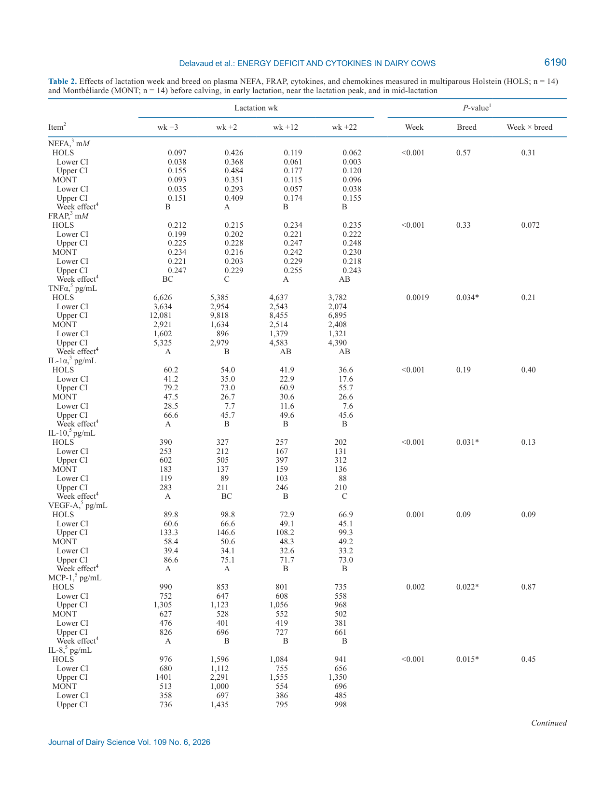
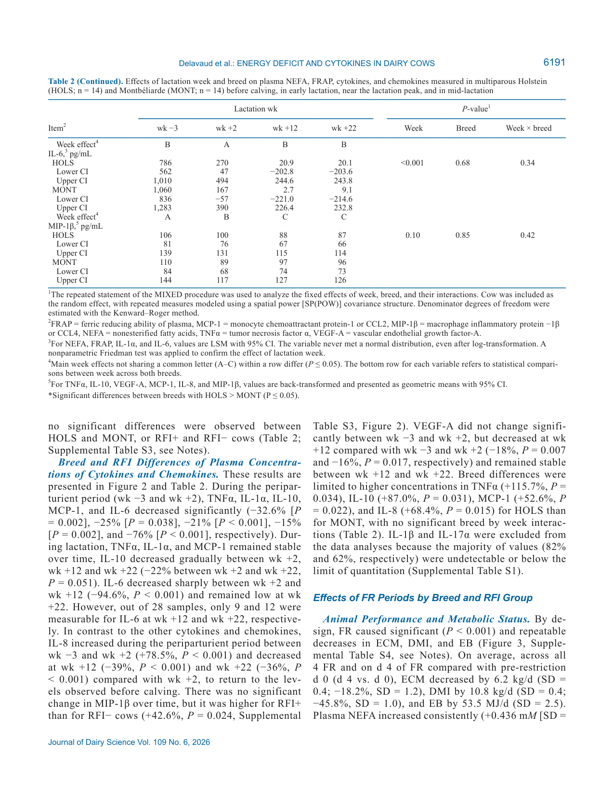
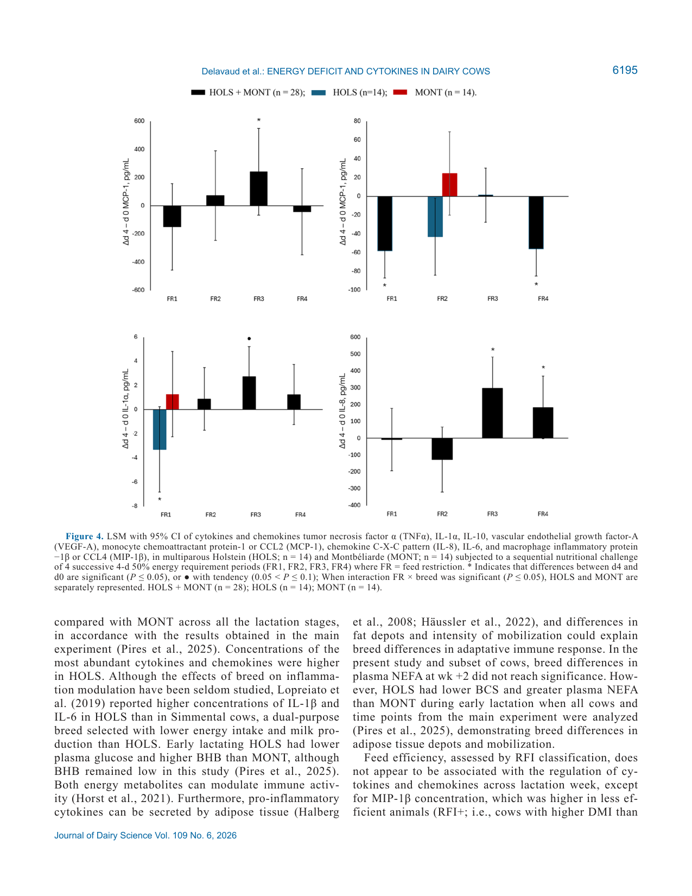
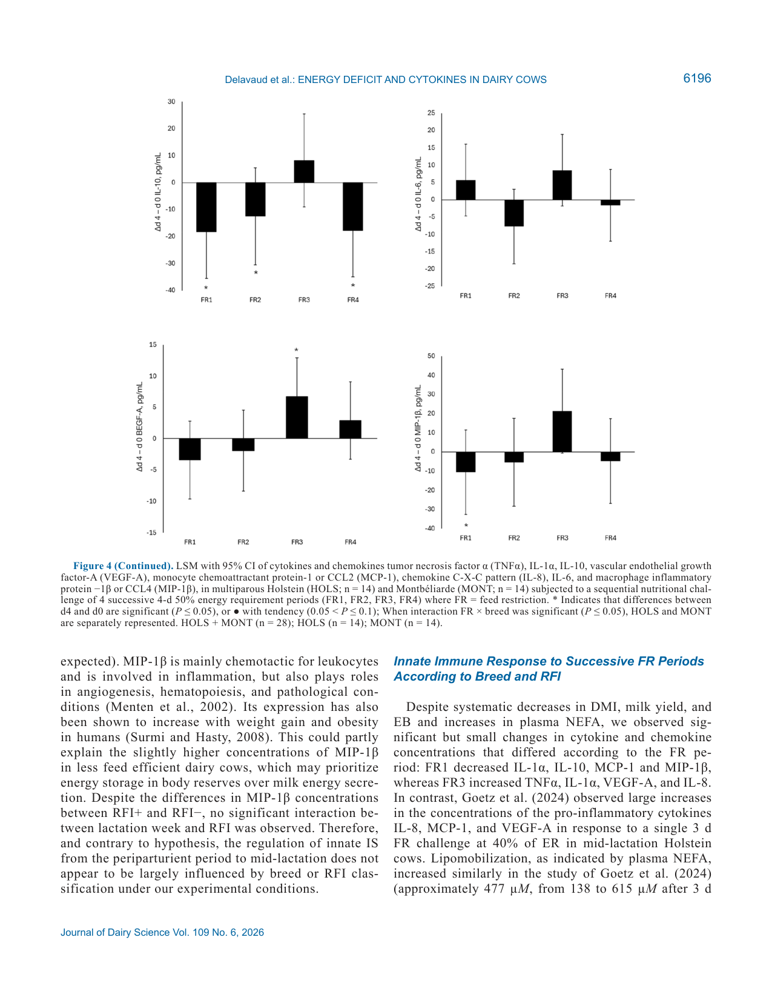

---
# YAML FRONTMATTER (обязательно)
id: CS.SOTA.383
type: sota
format_version: v1.1
knowledge_tier: P2
domain: cattle-science
area: health
subarea: transition-cow
subarea2: innate-immunity
category: field-study
year: 2026
authors: "Delavaud, C., De La Torre, A., Durand, D., Ortigues-Marty, I., Cassar-Malek, I., Bonnet, M., and Pires, J. A. A."
title: "Inflammatory status in Holstein and Montbéliarde cows during the periparturient period and sequential feed restriction challenges"
journal: "Journal of Dairy Science"
volume: "109"
issue: "6"
pages: "6185-6200"
doi: "10.3168/jds.2025-27694"
publisher: "Elsevier / ADSA"
open_access: true
license: "CC BY"
language: ru
freshness_window: "2026-08-05 — 2028-08-05"
sota_edition: "1.0"
derivation:
  - source: "Delavaud et al., 2026, Journal of Dairy Science (109:6)"
    type: "ConservativeRetextualization (FPF A.6.3)"
    reopen_trigger: "DOI: 10.3168/jds.2025-27694"
tags:
  - cytokines
  - inflammation
  - residual-feed-intake
  - feed-restriction
  - negative-energy-balance
  - holstein
  - montbeliarde
  - transition-cow
related:
  - id: CS.SOTA.312
    type: foundational
    note: "NASEM 2021 — транзитный период: энергетический баланс, потребности, физиология липомобилизации"
    relevance: high
---

# CS.SOTA.383: Delavaud et al. (2026) — Воспалительный статус коров Holstein и Montbéliarde в околоотёльный период и при последовательных ограничениях кормления

> **Навигация:** [2. Аннотация](#2-аннотация-abstract) · [3. Введение](#3-введение) · [4. Методология](#4-методология) · [5. Результаты](#5-результаты) · [6. Интерпретация](#6-интерпретация-и-обсуждение) · [7. Критический анализ](#7-критический-анализ) · [8. Выводы](#8-выводы) · [9. FAQ](#9-faq) · [10. Практика](#10-практическое-применение) · [12. Источники](#12-источники)

---

# 2. АННОТАЦИЯ (Abstract)

## 2.1. Перевод Abstract

Околоотёльный период молочных коров характеризуется изменениями врождённого воспалительного статуса (inflammatory status, IS), однако физиологическое происхождение этих изменений остаётся неясным. Целями исследования были оценка влияний породы и кормовой эффективности на IS в околоотёльный период, среднюю лактацию и при последовательном нутрициональном челлендже (sequential nutritional challenge, SNC) из 4 подряд идущих 4-дневных периодов ограничения кормления (feed restriction, FR). Четырнадцать многотельных коров Holstein (HOLS) и 14 Montbéliarde (MONT) были отобраны a posteriori из 40 животных по экстремальному остаточному потреблению корма (residual feed intake, RFI) за первые 10 недель лактации и классифицированы как RFI+ (от 0.42 до 2.34 кг СВ/д, n = 14) или RFI− (от −2.38 до −0.44 кг СВ/д, n = 14). Коров наблюдали с недели −3 по +22 лактации. Начиная с 86 ± 9 дней в молоке (DIM), коровы прошли 4 периода 4-дневного FR с покрытием 50% индивидуальной потребности в чистой энергии (FR1–FR4) с восстановительными периодами ad libitum по 10, 3, 3 и 10 дней соответственно. Кровь из копчиковых сосудов брали перед утренним кормлением на неделях −3, +2, +12 и +22 и на дни 0 и 4 каждого FR. Плазму анализировали панелью Milliplex Bovine Cytokine/Chemokine Panel (Merck). У обеих пород TNFα, IL-1α, IL-10, моноцитарный хемоаттрактантный белок-1 (MCP-1) и IL-6 были значимо ниже на неделе +2, чем на неделе −3, и оставались стабильными в лактацию, тогда как IL-8 вырос на неделе +2 относительно недели −3. Концентрации TNFα, IL-10, MCP-1 и IL-8 были выше у HOLS, чем у MONT. Концентрация макрофагального воспалительного белка-1β (MIP-1β) была выше у RFI+, чем у RFI−. Значимые эффекты FR на врождённый IS были малы и несистематичны от FR1 к FR4. SNC вызвал относительно небольшие изменения концентраций цитокинов и хемокинов, что указывает: отрицательный энергетический баланс не влиял на IS, несмотря на консистентные метаболические ответы. Порода, фенотипическая кормовая эффективность и повторные ограничения кормления оказали ограниченное влияние на IS.

## 2.2. Key Claims

**Claim 1: Околоотёльная перестройка врождённого IS реальна: большинство цитокинов снижаются к 2-й неделе лактации, IL-8 — растёт.**
- **Утверждение:** Между неделей −3 и неделей +2 значимо снизились TNFα (−32.6%; P = 0.002), IL-1α (−25%; P = 0.038), IL-10 (−21%; P < 0.001), MCP-1 (−15%; P = 0.002) и IL-6 (−76%; P < 0.001); IL-8, напротив, вырос на +78.5% (P < 0.001) и вернулся к доотёльному уровню к неделе +12.
- **Evidence:** 28 многотельных коров двух пород, повторные измерения плазмы, мультиплексная панель из 10 цитокинов/хемокинов; паттерн согласуется с Trevisi et al. (2015), Lopreiato et al. (2019), Kuhla (2020).
- **Уверенность:** 0.80 (консистентный межпородный паттерн, воспроизводимость в литературе; ограничение — 2 из 10 аналитов (IL-1β, IL-17α) исключены из-за недетектируемости).
- **Цитата:** "For both breeds, tumor necrosis factor α (TNFα), IL-1α, IL-10, monocyte chemoattractant protein-1 (MCP-1) and IL-6 were significantly lower on wk +2 than wk −3 and remained steady through lactation, but IL-8 increased at wk +2 compared with wk −3." (Delavaud et al., 2026, p. 6185)

**Claim 2: HOLS системно «воспалительнее» MONT по абсолютным концентрациям, но временные паттерны у пород одинаковы.**
- **Утверждение:** Концентрации TNFα (+115.7%; P = 0.034), IL-10 (+87.0%; P = 0.031), MCP-1 (+52.6%; P = 0.022) и IL-8 (+68.4%; P = 0.015) выше у HOLS, чем у MONT; значимых взаимодействий порода × неделя нет.
- **Evidence:** Смешанная модель с повторными измерениями (SP(POW), Kenward–Roger), n = 14/порода; согласуется с Lopreiato et al. (2019) — IL-1β и IL-6 выше у HOLS, чем у Simmental.
- **Уверенность:** 0.68 (порода и RFI не полностью независимы и анализировались раздельными моделями; n умеренное; различия в жировых депо и липомобилизации показаны в основном эксперименте, но не в этом поднаборе).
- **Цитата:** "Concentrations in TNFα, IL-10, MCP-1 and IL-8 were higher in HOLS than MONT." (Delavaud et al., 2026, p. 6185)

**Claim 3: Фенотипическая кормовая эффективность (RFI) почти не связана с регуляцией цитокинов — кроме MIP-1β.**
- **Утверждение:** MIP-1β выше у менее эффективных коров (RFI+) на +42.6% (P = 0.024); других эффектов RFI и взаимодействий RFI × неделя не выявлено.
- **Evidence:** Экстремальный RFI-отбор (RFI+ = +1.24 ± 0.17 кг СВ/д; RFI− = −1.13 ± 0.13 кг СВ/д), 7 коров на породу × RFI-группу.
- **Уверенность:** 0.60 (единичный маркер из панели; механистическая связь с приоритизацией запасов тела — интерпретация авторов по аналогии с человеческими данными об ожирении).
- **Цитата:** "Concentration in macrophage inflammatory protein −1β (MIP-1β) was higher in RFI+ than RFI−." (Delavaud et al., 2026, p. 6185)

**Claim 4: Повторные короткие ограничения кормления (50% потребности, 4 дня × 4 раза) НЕ индуцируют системное воспаление, несмотря на глубокий отрицательный энергобаланс.**
- **Утверждение:** FR воспроизводимо снижали ECM (−6.2 кг/д; −18.2%), DMI (−10.8 кг/д; −45.8%) и EB (−53.5 МДж/д) и повышали NEFA (+0.436 мМ; +623.8%), но эффекты на цитокины были малы (±7–48%) и несистематичны: FR1 снижал MCP-1/IL-10, FR3 повышал TNFα/VEGF-A/IL-8, FR4 — смешанный паттерн; кумулятивного эффекта от FR1 к FR4 не выявлено.
- **Evidence:** SNC-модель, каждое животное — свой контроль (d 4 vs d 0, парные t-тесты); прямое сравнение с Goetz et al. (2024), где одиночный 3-дневный FR при 40% ER дал крупный рост IL-8, MCP-1, VEGF-A при сопоставимом подъёме NEFA (~477 против ~440 µM).
- **Уверенность:** 0.72 (сильный внутриживотный дизайн и консистентный метаболический ответ; ограничение — анализы FR2–FR4 выполнены через 18 мес. после FR1 другими лотами наборов, межпериодные сравнения не проводились).
- **Цитата:** "The SNC induced relatively small changes in cytokine and chemokine concentrations, indicating that negative energy balance did not affect IS, despite consistent metabolic responses." (Delavaud et al., 2026, p. 6185)

**Claim 5: Выраженная межиндивидуальная вариабельность цитокинового профиля — часть коров сохраняет субклиническое воспаление без клинических событий.**
- **Утверждение:** 2 HOLS и 2 MONT сохраняли повышенные TNFα и MCP-1 на неделе +2 при отсутствии клинических событий; у 3 из 4 воспаление разрешилось к неделе +12, у 1 коровы повышенные TNFα, MCP-1, IL-1α, VEGF-A и IL-10 держались до недели +22.
- **Evidence:** Постхок-наблюдение индивидуальных профилей; согласуется с Trevisi et al. (2025).
- **Уверенность:** 0.55 (описательное наблюдение на 4 животных, без формального теста).
- **Цитата:** "...2 HOLS and 2 MONT maintained elevated TNFα and MCP-1 at wk +2, suggesting likely inflammation despite absence of clinical events." (Delavaud et al., 2026, p. 6194)

---

# 3. ВВЕДЕНИЕ

## 3.1. Контекст и значимость проблемы

Околоотёльный период молочных коров сопровождается гормональными и нутриционными сдвигами с мобилизацией жира, белка и минералов костной ткани для поддержки старта лактации (Pires et al., 2013; Valldecabres et al., 2018). После отёла коровы часто находятся в отрицательном энергетическом балансе (negative energy balance) несмотря на постепенный рост потребления сухого вещества (Butler et al., 1981). Сам отёл модулирует врождённый иммунитет (Hughes et al., 2014), а корове ранней лактации приходится распределять нутриенты между метаболическими и воспалительными ответами. Остаётся неясным, является ли системное воспаление причиной или следствием сниженного потребления корма, отрицательного энергобаланса и липомобилизации в этот период (Horst et al., 2021). Это принципиальный вопрос и для кормовой эффективности: при тяжёлом воспалении активированные иммунные клетки потребляют глюкозу — Kvidera et al. (2017a) оценили, что в первые 12 ч после LPS-челленджа корове средней лактации требуется более 1 кг глюкозы для поддержания эугликемии. Провоспалительный статус, таким образом, может отвлекать лимитирующие нутриенты от секреции молока, влияя и на продуктивность, и на эффективность конверсии корма (Delavaud et al., 2026, p. 6186).

## 3.2. Обзор литературы (краткий)

1. **Pascottini et al. (2019); Esposito et al. (2020)** — эффекты FR на воспалительные ответы вокруг отёла: неясно, вызывает ли тяжёлый FR сам по себе системное воспаление.
2. **Perkins et al. (2002); Moyes et al. (2009); Pires et al. (2019)** — модели средней и ранней лактации с LPS/S. uberis: ограниченные эффекты недокорма на воспалительные показатели.
3. **Kvidera et al. (2017b)** — при 5-дневном FR на уровне 40% потребности росли позитивные белки острой фазы (гаптоглобин, сывороточный амилоид A, LPS-связывающий белок); ответ зависит от тяжести FR.
4. **Horst et al. (2020)** — корреляции маркеров воспаления с проницаемостью кишечного барьера: гипотеза «дырявого кишечника» как источника системного воспаления при FR.
5. **Abeyta et al. (2023); Marins et al. (2023); Piantoni et al. (2023)** — ряд работ не обнаружил воспалительных ответов на экспериментальный FR в поздней стельности и средней лактации.
6. **Pires et al. (2025)** — основной эксперимент: HOLS давали больше ECM при меньшем энергобалансе и больших NEFA, MONT сохраняли более высокую упитанность (BCS); различия проявлялись и на первых фазах SNC.

## 3.3. Гипотеза и цель исследования

**Гипотезы (Delavaud et al., 2026, p. 6186):**
1. Врождённый IS модифицируется в околоотёльный период.
2. Эта модуляция различается по породе и фенотипической кормовой эффективности (RFI), отражая разную приоритизацию нутриентов между молочной продуктивностью и непродуктивными функциями.
3. Индуцированный FR модулирует врождённый IS, причём ответы меняются от FR1 к FR4.
4. Модель SNC позволит выявить различия в воспалительной устойчивости (inflammatory robustness — величина и направление ответа на каждый FR) между породами и группами кормовой эффективности.

**Цель:** Сравнить врождённый IS коров от околоотёльного периода до средней лактации и в ходе SNC вблизи пика лактации; оценить различия между стадиями лактации, породами и RFI-классификацией. IS оценивали панелью цитокинов и хемокинов врождённого иммунитета.

---

# 4. МЕТОДОЛОГИЯ

## 4.1. Дизайн исследования

| Параметр | Описание |
|----------|----------|
| **Тип исследования** | Поднабор контролируемого кормового эксперимента; продольный дизайн + повторный внутриживотный челлендж (SNC) |
| **Место** | Herbipôle Research Unit (INRAE, UE1414, Theix, Франция); сентябрь 2019 — май 2020 |
| **Этика** | APAFIS#16859-2015043014541577v7 (комитет Овернь-Рона-Альпы и Минобрнауки Франции) |
| **Животные** | 28 многотельных коров: 14 HOLS + 14 MONT, отобраны a posteriori из 40 (18 HOLS, 22 MONT) по экстремальному фенотипическому RFI; 7 коров на каждую комбинацию порода × RFI-группа |
| **RFI-фенотипирование** | RFI = остаток множественной регрессии DMI на [порода + секреция молочной энергии + МТ^0.75 + ΔМТ за 10 нед.] по данным первых 10 недель лактации; интервалы: RFI+ 0.42–2.34 кг СВ/д (среднее +1.24, SD = 0.17), RFI− −2.38…−0.44 кг СВ/д (среднее −1.13, SD = 0.13) |
| **Период наблюдения** | От 4 недель до ожидаемого отёла до 22 недель лактации (отёлы 03.10–23.12.2019) |
| **Содержание** | Общая секция беспривязного содержания, индивидуальные кормовые места с автоматическими гейтами (Dairy Gates 3, Sodalec) |
| **Рацион** | TMR: до отёла соотношение объёмистые:концентраты 88:12 (NEL 6.62 МДж/кг СВ); после отёла 56:44 (NEL 7.41 МДж/кг СВ); выдача с 10% остатков (ad libitum вне FR) |
| **SNC** | Начало на 86 ± 9 DIM: 4 периода 4-дневного FR (дни 0–4) с покрытием 50% индивидуальной потребности в NEL (по МТ и надою/составу молока за неделю до FR1); восстановление ad libitum 10, 3, 3 и 10 дней после FR1–FR4 соответственно; каждое животное — свой контроль |
| **Доение/взвешивание** | Доение 2×/сут (0730 и 1530); надой ежедневно; взвешивание еженедельно до отёла и после каждого доения в лактацию |

## 4.2. Сбор образцов и анализы

- **Кровь:** из копчиковых сосудов в EDTA-пробирки (1.95 мг/мл), утром до кормления: нед. −3 (−16 ± 5 DIM), нед. +2 (13 ± 2 DIM), нед. +12 (86 ± 9 DIM), нед. +22 (155 ± 10 DIM); в периоды FR — день 0 и день 4 каждого FR + день 7 после FR4. Проба дня 0 FR1 совпадает с неделей +12.
- **Плазма:** центрифугирование 1,400 × g, 15 мин, 4°C в течение 30 мин после взятия; хранение при −80°C.
- **Цитокины/хемокины:** Milliplex Bovine Cytokine/Chemokine Magnetic Bead Panel 1 (BCYT1–33K-10, Merck): IL-1β, IL-1α, IL-17α, TNFα, IL-6, IL-10, IL-8, MCP-1 (CCL2), MIP-1β (CCL4), VEGF-A; разведение 1:2; Luminex 200 (Bio-Rad), Bio-Plex Manager 6.0, регрессия Logistic-5PL; концентрации в пг/мл.
- **Контроль качества анализа:** домашние плазменные контроли (стельность, ранняя лактация, пик лактации) по 20 определений на 4 планшетах; внутрисерийная вариация 1.76–7.73%, промежуточная воспроизводимость 3.82–12.9%. IL-1β и IL-17α исключены из анализа: 82% и 62% значений недетектируемы или ниже LLOQ. Для IL-6 на нед. +12 и +22 измеримы лишь 9 и 12 из 28 проб.
- **NEFA:** Fujifilm Wako; CV 4.0%/4.6%. **FRAP** (ferric reducing ability of plasma, мМ Fe²⁺-экв./л): нед. −3, +2, +12 (дни 0 и 4 FR1); CV 3.0%/8.4%.

## 4.3. Статистический анализ

- SAS 9.4 (MIXED, repeated; ковариационная структура SP(POW); степени свободы по Kenward–Roger); XLSTAT Basic 2024.2.1 для непараметрики.
- Логарифмирование при нарушении нормальности/гомоскедастичности; для EB, NEFA, FRAP, IL-1α, IL-6 (ненормальны и после трансформации) — непараметрический тест Фридмана по эффекту недели.
- Порода и RFI не полностью независимы → эффекты породы и RFI (и их взаимодействия с неделей) анализировались **в двух раздельных моделях**. Корова — случайный эффект. Планшетный эффект исключён (незначим).
- Анализы FR2–FR4 выполнены через 18 мес. после FR1 наборами других производственных лотов → эффекты FR анализировались **отдельно внутри каждого периода**, межпериодные сравнения не проводились. Разности день 4 − день 0 тестировались парными t-тестами (α = 0.05).
- Данные — LSM с 95% CI; обратно трансформированные — геометрические средние с 95% CI. Значимость P ≤ 0.05; тенденции 0.05 < P ≤ 0.1. Связи цитокинов с продуктивностью — корреляции Спирмена.

## 4.4. Медиа-инвентарь

| ID | Тип | Описание | Файл | Статус |
|----|-----|----------|------|--------|
| Table 2 (ч. 1) | Таблица | NEFA, FRAP, цитокины и хемокины плазмы по неделям лактации и породам (стр. 6190) | `table-2-cytokines-peripartum-p1.png` | ✅ Встроено |
| Table 2 (ч. 2) | Таблица | Продолжение Table 2: IL-6, MIP-1β (стр. 6191) | `table-2-cytokines-peripartum-p2.png` | ✅ Встроено |
| Figure 4 (ч. 1) | График | Цитокины/хемокины в ходе SNC (FR1–FR4, d 0 vs d 4), стр. 6195 | `figure-4-snc-cytokines-p1.png` | ✅ Встроено |
| Figure 4 (ч. 2) | График | Продолжение Figure 4, стр. 6196 | `figure-4-snc-cytokines-p2.png` | ✅ Встроено |

> Примечание: Table 1 (продуктивные показатели по породам) и Table 3 (цитокины в FR-периоды) в PDF встроены как текст и полностью отражены в разделе 5 в виде markdown-таблиц. Figure 1 (схема дизайна), Figure 2 (цитокины по неделям, породам и RFI), Figure 3 (ECM/DMI/EB/NEFA в SNC) — не извлечены; их содержание передано текстом и числами. Согласно заданию обработки отрендерены 2 ключевых медиа-элемента (Table 2 и Figure 4, оба двухстраничные).

---

# 5. РЕЗУЛЬТАТЫ

## 5.1. Продуктивность и метаболический статус в околоотёльный период и среднюю лактацию

**Соответствует:** Table 1, Table 2 (NEFA, FRAP)

**Описание:**
DMI рос с 14.5 кг/д (95% CI 13.4–15.7) на неделе −3 до 21.8 кг/д (20.6–22.9) на неделе +2, далее до 24.6 кг/д (23.4–25.7) на неделе +12 и с тенденцией к снижению до 23.1 кг/д на неделе +22 (P = 0.084 против нед. +12). DMI выше у HOLS, чем у MONT: 22.0 (21.0–23.0) против 20.0 (19.0–21.0) кг/д (P = 0.005). ECM выше у HOLS: 36.0 (34.0–38.0) против 31.7 (29.7–33.8) кг/д (P = 0.005). Энергобаланс резко падал на неделе +2 (HOLS −8.8 МДж/д; MONT +0.7 МДж/д), породных различий не было, но EB выше у RFI+, чем у RFI−: 19.7 (15.1–24.4) против 6.81 (1.70–11.9) МДж/д (P < 0.001). МТ пород сходна (P = 0.36): 770 против 737 кг на неделе −3.

**Ключевые цифры (Table 1):**

| Показатель | Порода | нед. −3 | нед. +2 | нед. +12 | нед. +22 | P (неделя) | P (порода) |
|-----------|--------|---------|---------|----------|----------|------------|------------|
| DMI, кг/д | HOLS | 15.2 | 22.4 | 26.1 | 24.3 | <0.001 | 0.005 |
| DMI, кг/д | MONT | 13.9 | 21.1 | 23.0 | 21.9 | | |
| ECM, кг/д | HOLS | — | 37.8 | 37.5 | 32.8 | 0.006 | 0.005 |
| ECM, кг/д | MONT | — | 32.3 | 33.4 | 29.6 | | |
| EB, МДж/д | HOLS | 32.7 | −8.8 | 16.6 | 19.8 | <0.001 | 0.34 |
| EB, МДж/д | MONT | 25.6 | 0.7 | 9.0 | 11.6 | | |

*Источник: Delavaud et al., 2026, p. 6189 (Table 1). Значения — LSM; CI опущены для компактности, приведены в оригинале.*

**Метаболический статус (Table 2):** NEFA на неделе +2 вырос на +310% против недели −3 (0.426 мМ у HOLS, 0.351 мМ у MONT; P < 0.001), на +231% против недели +12 и на +392% против недели +22. FRAP (антиоксидантная ёмкость плазмы) вырос на неделе +12 на +6.7% против недели −3 (0.223 мМ; P = 0.005) и на +10.4% против недели +2 (P < 0.001) — то есть антиоксидантная ёмкость снижена именно в ранней лактации. Породных и RFI-различий по NEFA и FRAP в этом поднаборе не выявлено (P = 0.57 и 0.33 соответственно).

## 5.2. Цитокины и хемокины: временная динамика, порода, RFI

**Соответствует:** Table 2, Figure 2

*Источник: Delavaud et al., 2026, p. 6190 (Table 2).*

*Источник: Delavaud et al., 2026, p. 6191 (Table 2, Continued).*

**Описание:**
В околоотёльный период (нед. −3 → +2) значимо снизились: TNFα (−32.6%, P = 0.002), IL-1α (−25%, P = 0.038), IL-10 (−21%, P < 0.001), MCP-1 (−15%, P = 0.002), IL-6 (−76%, P < 0.001). В лактацию TNFα, IL-1α и MCP-1 оставались стабильными; IL-10 постепенно снижался (−22% между нед. +2 и +22, P = 0.051); IL-6 упал ещё на −94.6% между нед. +2 и +12 (P < 0.001) и оставался низким. IL-8 — единственный маркер с противоположной динамикой: +78.5% (P < 0.001) на неделе +2, затем −39% и −36% (P < 0.001) к нед. +12 и +22, с возвратом к доотёльному уровню. MIP-1β не менялся во времени, но был выше у RFI+, чем у RFI− (+42.6%, P = 0.024). VEGF-A не менялся в период отёла, но снизился на неделе +12 (−18% против нед. −3, P = 0.007; −16% против нед. +2, P = 0.017).

**Ключевые цифры (Table 2, геометрические средние или LSM, пг/мл):**

| Аналит | Порода | нед. −3 | нед. +2 | нед. +12 | нед. +22 | P (неделя) | P (порода) |
|--------|--------|---------|---------|----------|----------|------------|------------|
| TNFα | HOLS | 6,626 | 5,385 | 4,637 | 3,782 | 0.0019 | 0.034* |
| TNFα | MONT | 2,921 | 1,634 | 2,514 | 2,408 | | |
| IL-1α | HOLS | 60.2 | 54.0 | 41.9 | 36.6 | <0.001 | 0.19 |
| IL-1α | MONT | 47.5 | 26.7 | 30.6 | 26.6 | | |
| IL-10 | HOLS | 390 | 327 | 257 | 202 | <0.001 | 0.031* |
| IL-10 | MONT | 183 | 137 | 159 | 136 | | |
| VEGF-A | HOLS | 89.8 | 98.8 | 72.9 | 66.9 | 0.001 | 0.09 |
| VEGF-A | MONT | 58.4 | 50.6 | 48.3 | 49.2 | | |
| MCP-1 | HOLS | 990 | 853 | 801 | 735 | 0.002 | 0.022* |
| MCP-1 | MONT | 627 | 528 | 552 | 502 | | |
| IL-8 | HOLS | 976 | 1,596 | 1,084 | 941 | <0.001 | 0.015* |
| IL-8 | MONT | 513 | 1,000 | 554 | 696 | | |
| IL-6 | HOLS | 786 | 270 | 20.9 | 20.1 | <0.001 | 0.68 |
| IL-6 | MONT | 1,060 | 167 | 2.7 | 9.1 | | |
| MIP-1β | HOLS | 106 | 100 | 88 | 87 | 0.10 | 0.85 |
| MIP-1β | MONT | 110 | 89 | 97 | 96 | | |

*Источник: Delavaud et al., 2026, p. 6190–6191 (Table 2). \* — HOLS > MONT (P ≤ 0.05). TNFα, IL-10, VEGF-A, MCP-1, IL-8, MIP-1β — геометрические средние после обратной трансформации; NEFA, FRAP, IL-1α, IL-6 — LSM.*

**Механистическая интерпретация (авторы):** Синхронное снижение про- и противовоспалительных маркеров (TNFα и IL-10 вместе) указывает не на «затухание воспаления», а на общую перестройку иммунного тонуса после отёла; противоположная динамика IL-8 может объясняться индукцией его транскрипции сывороточным амилоидом A через NF-κB (He et al., 2003; Ceciliani et al., 2012). Согласно этому, IL-1α, IL-10, MCP-1, TNFα и VEGF-A сильно коррелировали между собой (0.64 < r < 0.91, P < 0.001), но не с IL-8.

## 5.3. Эффекты последовательных ограничений кормления (SNC)

**Соответствует:** Figure 3, Figure 4, Table 3

*Источник: Delavaud et al., 2026, p. 6195 (Figure 4).*

*Источник: Delavaud et al., 2026, p. 6196 (Figure 4, Continued).*

**Метаболический ответ (контроль корректности челленджа):** По дизайну FR вызывал значимые и воспроизводимые снижения: ECM −6.2 кг/д (SD = 0.4; −18.2%), DMI −10.8 кг/д (SD = 0.4; −45.8%), EB −53.5 МДж/д (SD = 2.5); NEFA рос на +0.436 мМ (SD = 0.016; +623.8%, P < 0.001). FRAP (измерен только в FR1) снизился на −12.7% (P < 0.001).

**Воспалительный ответ (Table 3, Figure 4):**

| FR-период | Значимые изменения (d 4 vs d 0) |
|-----------|----------------------------------|
| FR1 | MCP-1 −9.3% (P = 0.001); IL-10 −7.3% (P < 0.05); IL-1α −7.9% только у HOLS (P = 0.007; день × порода P = 0.01); MIP-1β −19.3% только у RFI+ (P < 0.001; день × RFI P = 0.003) |
| FR2 | Только IL-10 −9.4% (P < 0.01) |
| FR3 | TNFα +8.5% (P = 0.01); IL-1α +7.7% (P = 0.06, тенденция); VEGF-A +8.5% (P < 0.05); IL-8 +48.4% (P = 0.001) |
| FR4 | IL-8 +38% (P = 0.01); IL-10 −14.9% и MCP-1 −9.9% (оба P < 0.001) |

*Источник: Delavaud et al., 2026, p. 6193, 6197 (текст Results; Table 3).*

**Породные/RFI-различия в SNC:** IL-8 в FR1 выше у HOLS, чем у MONT (+64.7%, P = 0.02). MIP-1β выше у RFI+, чем у RFI−, в FR2 (+44.7%, P = 0.03), с тенденциями в FR3 (+58.4%, P = 0.09) и FR4 (+39.2%, P = 0.07).

**Механистическая интерпретация (авторы):** Отсутствие кумуляции подтверждается тем, что концентрации на день 0 каждого FR оставались стабильно низкими от FR1 к FR4, а IL-10 снижался после FR1, FR2 и FR4 — то есть противовоспалительный путь не активировался за неимением сильного провоспалительного стимула. Наблюдаемые эффекты малы по сравнению с внутривенными/внутривыменными LPS-челленджами (Opgenorth et al., 2024a,b).

## 5.4. Корреляционный анализ

FRAP положительно коррелировал с EB (r = 0.28, P < 0.001) и ECM (r = 0.37, P < 0.001) и отрицательно с NEFA (r = −0.41, P < 0.001) по точкам нед. −3, +2, дни 0/4 FR1 и нед. +22 (Supplemental Figure S1).

---

# 6. ИНТЕРПРЕТАЦИЯ И ОБСУЖДЕНИЕ

## 6.1. Связь с гипотезами

| Гипотеза | Вердикт авторов |
|----------|-----------------|
| 1. IS модифицируется в околоотёльный период | **Подтверждена** — снижение большинства цитокинов к нед. +2, рост IL-8 |
| 2. Модуляция различается по породе и RFI | **Опровергнута** — временные паттерны одинаковы; различия только в абсолютных уровнях (порода) и MIP-1β (RFI) |
| 3. FR модулирует IS с изменением ответа от FR1 к FR4 | **Подтверждена слабо** — эффекты малы и несистематичны |
| 4. SNC выявит различия воспалительной устойчивости | **Опровергнута** — немногочисленные взаимодействия невоспроизводимы между FR |

## 6.2. Сравнение с литературой

| Исследование | Согласие/Противоречие/Расширение |
|--------------|----------------------------------|
| Trevisi et al. (2015); Lopreiato et al. (2019); Kuhla (2020) | **Согласуется** — снижение IL-1β, IL-6, TNFα в ранней лактации с минимумом на 7–14 день |
| Lopreiato et al. (2019) | **Согласуется** — IL-1β и IL-6 выше у HOLS, чем у Simmental (двунаправленная порода) |
| Goetz et al. (2024) | **Противоречит** — там одиночный 3-дневный FR (40% ER) дал крупный рост IL-8, MCP-1, VEGF-A при сопоставимом подъёме NEFA (~477 µM против ~440 µM здесь); различие не объясняется тяжестью липомобилизации |
| Kvidera et al. (2017b); Horst et al. (2020) | **Не подтверждается в данной модели** — гипотеза нарушения кишечного барьера и системного воспаления при FR не нашла отражения в цитокиновых ответах |
| Ma et al. (2024) | **Согласуется** — кластеризация коров ранней лактации по профилям EB показала слабые связи EB с IS; воспаление ассоциировалось с конкретными клиническими событиями |
| Perkins et al. (2002); Moyes et al. (2009); Pires et al. (2019); Abeyta et al. (2023); Marins et al. (2023); Piantoni et al. (2023) | **Согласуется** — ограниченные эффекты FR/недокорма на показатели воспаления |
| Cortese et al. (2024); Opgenorth et al. (2024b) | **Расширяет** — иммунная дисфункция ранней лактации не означает снижения способности отвечать на инфекцию: воспаление высоко индуцибельно |

## 6.3. Механистические выводы

1. **Отрицательный EB ≠ системное воспаление.** Модель SNC с воспроизводимым глубоким энергодефицитом (−53.5 МДж/д) и 6-кратным ростом NEFA не вызвала консистентного цитокинового ответа. Метаболический стресс сам по себе, вероятно, не является достаточным воспалительным стимулом (Delavaud et al., 2026, p. 6198; Ma et al., 2024).
2. **Околоотёльная перестройка IS — норма, а не патология.** Триггеры — неинфекционные факторы (экспульсия последа, инволюция матки, ремоделирование жировой ткани) и бактериальная защита матки после нормального отёла (Trevisi et al., 2025; Singh et al., 2008); последующий спад маркеров может отражать кортизол-опосредованную иммуносупрессию (Hughes et al., 2014).
3. **IL-8 регулируется иначе, чем остальная панель.** Его рост на нед. +2 при синхронном падении остальных маркеров и отсутствие корреляций с ними указывают на отдельный регуляторный контур (вероятно, через амилоид A → NF-κB).
4. **Породные различия IS — количественные, а не качественные.** HOLS «живут» на более высоком фоне цитокинов (вероятные механизмы: бóльшие жировые депо и интенсивность липомобилизации — адипоциты секретируют провоспалительные цитокины (Halberg et al., 2008; Häussler et al., 2022); более низкая глюкоза и более высокий BHB в ранней лактации (Pires et al., 2025)), но динамика регуляции идентична MONT.
5. **MIP-1β как маркер приоритизации запасов.** Рост его экспрессии при наборе массы и ожирении у человека (Surmi and Hasty, 2008) может частично объяснять более высокие концентрации у менее эффективных коров (RFI+), приоритизирующих запасание энергии в теле [интерполяция авторов].

---

# 7. КРИТИЧЕСКИЙ АНАЛИЗ

## 7.1. Сильные стороны

- **Уникальная модель SNC:** 4 последовательных воспроизводимых энергетических челленджа с внутриживотным контролем — редкая возможность тестировать кумуляцию и воспалительную устойчивость.
- **Широкая мультиплексная панель** (10 аналитов) с жёстким контролем качества (домашние плазменные контроли, 20 определений, прозрачная отчётность по LOD/LLOQ; исключение IL-1β и IL-17α — методологически честное решение).
- **Двухпородный дизайн + экстремальный RFI-отбор** позволяют разделить эффекты породы и кормовой эффективности.
- **Консистентный метаболический контроль челленджа** (DMI −45.8%, NEFA +623.8%) доказывает, что отсутствие воспалительного ответа — не артефакт «слабого» ограничения.
- **Прямая проверка 4 априорных гипотез** с явными вердиктами, включая опровержения.

## 7.2. Ограничения

**Внутренние:**
- **Умеренное n:** 7 коров на ячейку порода × RFI; мощности могло не хватить для слабых взаимодействий.
- **Аналитический разрыв:** анализы FR2–FR4 выполнены через 18 мес. после FR1 другими лотами наборов → межпериодные сравнения невозможны, вывод о «некумулятивности» частично опирается на стабильность d 0-уровней, измеренных разными лотами.
- **Отбор a posteriori по RFI** за первые 10 недель лактации: RFI-фенотип в раннюю лактацию смешан с энергобалансом; порода и RFI не полностью независимы (пришлось строить раздельные модели).
- **2 из 10 аналитов исключены** (IL-1β, IL-17α недетектируемы), IL-6 измерим не во всех пробах — панель врождённого иммунитета неполна.
- **FRAP измерен не во всех точках** (только нед. −3, +2 и в FR1).

**Внешние:**
- **Одна исследовательская станция, одна рационная система** (TMR 56:44) — перенос на другие системы кормления ограничен.
- **Только многотельные коровы двух пород** — применимость к первотёлкам и другим породам не показана.
- **Отсутствие воспалительного «позитивного контроля»** (например, LPS-челлендж после FR) — нельзя исключить, что FR меняет ответ на иммунный стимул, не меняя базальный IS [интерполяция].
- **Противоречие с Goetz et al. (2024)** (единственный FR, но крупный цитокиновый ответ) не разрешено: различия в породе, длительности, глубине FR (40% против 50% ER) или методике измерения остаются открытыми.

## 7.3. Применимость к российским условиям

- **Породный контраст релевантен:** в РФ доминирует Holstein; Montbéliarde и симментальская используются как «конкурентные» молочные/комбинированные породы. Вывод о более высоком воспалительном фоне HOLS при идентичной динамике — аргумент за породо-специфичные референсные интервалы цитокинов, а не за разные протоколы управления транзитным периодом.
- **Практический смысл для кормления:** краткосрочные перебои с выдачей корма (4-дневные провалы до 50% потребности — сценарий, реалистичный для российских хозяйств при перебоях с заготовкой/логистикой) сами по себе вряд ли вызовут системное воспаление у здоровых коров средней лактации; риски концентрируются вокруг клинических событий, а не энергодефицита как такового.
- **Мониторинг:** цитокиновые панели для рутинного мониторинга в РФ пока недоступны; операциональные прокси — NEFA/BHB и клинический осмотр. Работа предостерегает от интерпретации высокого NEFA как маркера воспаления [интерполяция].

---

# 8. ВЫВОДЫ

## 8.1. Ключевые выводы автора (перевод)

Большинство цитокинов снизились на неделе +2 относительно доотёльного уровня и далее показывали сходные профили до недели +22, за исключением IL-8, выросшего на неделе +2. Хотя породные различия выявлены для TNFα, IL-10, MCP-1 и IL-8 (в целом выше у HOLS, чем у MONT), врождённый IS следовал сходным временным паттернам у обеих пород в околоотёльный период. Фенотипическая кормовая эффективность не модулировала врождённый IS, кроме более высокого MIP-1β у менее эффективных коров (RFI+). SNC индуцировал слабые и невоспроизводимые изменения концентраций цитокинов и хемокинов, указывая, что повторные короткие FR и связанный с ними отрицательный EB не влияли на врождённый IS, несмотря на консистентные метаболические ответы. Порода, фенотипическая кормовая эффективность и повторные ограничения кормления не модулируют врождённый IS в значительной степени.

## 8.2. Ключевые выводы (структурировано)

1. **Околоотёльная перестройка IS подтверждена:** падение TNFα/IL-1α/IL-10/MCP-1/IL-6 к нед. +2 при росте IL-8 — воспроизводимый физиологический паттерн обеих пород.
2. **HOLS > MONT по фону цитокинов** (TNFα +115.7%, IL-10 +87.0%, IL-8 +68.4%, MCP-1 +52.6%), но динамика регуляции идентична.
3. **RFI почти не связан с IS:** единственный сигнал — MIP-1β выше у менее эффективных коров (+42.6%).
4. **Энергодефицит без воспаления:** 4 × 4-дневных FR (50% потребности) не вызвали консистентного или кумулятивного цитокинового ответа при глубоком метаболическом ответе.
5. **Воспалительная устойчивость не различается** между породами и RFI-группами в этой модели.

## 8.3. Ключевые сообщения для лекции

1. Высокий NEFA и отрицательный энергобаланс — это метаболический стресс, а не автоматически воспаление: в модели SNC 6-кратный рост NEFA не сопровождался системным цитокиновым ответом.
2. Падение большинства цитокинов после отёла — физиологическая норма; рост IL-8 в ранней лактации — тоже (отдельный регуляторный контур).
3. Порода смещает «базовую линию» воспалительного фона (HOLS выше MONT), но не ломает временную регуляцию — референсы должны быть породо-специфичны.
4. Кормовая эффективность (RFI) — не иммунологический признак: кроме MIP-1β, цитокиновая регуляция у эффективных и неэффективных коров одинакова.
5. Решение о диагностике воспаления должно опираться на клинические события, а не на показатели энергетического баланса (согласуется с Ma et al., 2024).

---

# 9. FAQ

**Вопрос 1: Вызывает ли ограничение кормления воспаление у коров?**
Ответ: В данной модели — нет. Четыре 4-дневных периода FR с покрытием 50% потребности в NEL давали лишь малые (±7–48%) и несистематичные изменения цитокинов, несмотря на снижение DMI на 45.8% и рост NEFA на 623.8%. Это согласуется с большинством работ (Pascottini et al., 2019; Abeyta et al., 2023; Marins et al., 2023; Piantoni et al., 2023), хотя противоречит Goetz et al. (2024), где одиночный более жёсткий FR (40% ER) дал крупный ответ — вопрос о пороге тяжести остаётся открытым.

**Вопрос 2: Почему IL-8 ведёт себя противоположно остальным цитокинам после отёла?**
Ответ: Точный механизм не установлен, но авторы предлагают контур через позитивный белок острой фазы — сывороточный амилоид A, который стимулирует транскрипцию IL-8 через активацию NF-κB (He et al., 2003). Косвенное подтверждение: IL-8 не коррелировал с остальной панелью, тогда как IL-1α, IL-10, MCP-1, TNFα и VEGF-A коррелировали между собой с r = 0.64–0.91.

**Вопрос 3: Holstein «более воспалённые», чем Montbéliarde — это плохо?**
Ответ: Не обязательно. HOLS имели более высокие концентрации TNFα, IL-10, MCP-1 и IL-8 при идентичной временной динамике и более высокой продуктивности (ECM 36.0 против 31.7 кг/д). Это различие фоновых уровней, а не признак болезни; возможные механизмы — бóльшие жировые депо и интенсивность липомобилизации (адипозная секреция цитокинов) и метаболические различия ранней лактации.

**Вопрос 4: Связана ли кормовая эффективность с иммунным статусом?**
Ответ: Практически нет. Из всей панели только MIP-1β был выше у менее эффективных коров (RFI+, +42.6%, P = 0.024). Гипотеза о том, что эффективные коровы иначе приоритизируют нутриенты для иммунных функций, в этой работе не подтвердилась.

**Вопрос 5: Можно ли использовать NEFA как маркер воспаления?**
Ответ: Нет. В модели SNC NEFA рос в 6 раз при практически неизменном воспалительном статусе; независимо Ma et al. (2024) показали слабые связи энергобаланса с IS. NEFA — маркер липомобилизации и энергодефицита; воспаление следует оценивать отдельно (клиника, белки острой фазы, при доступности — цитокины).

---

# 10. ПРАКТИЧЕСКОЕ ПРИМЕНЕНИЕ

## 10.1. Алгоритм внедрения (для консультанта/зоотехника)

1. **Разделять понятия «метаболический стресс» и «воспаление»** в оценке транзитных коров: высокие NEFA/BHB требуют кормовых корректировок, но не являются основанием для противовоспалительных интервенций без клиники.
2. **При перебоях с кормлением** (краткосрочные провалы выдачи до ~50% потребности на несколько дней) у здоровых коров средней лактации не ожидать системного воспалительного каскада; приоритет — восстановление потребления и контроль продуктивности.
3. **При интерпретации лабораторных цитокиновых данных** (исследовательские проекты) учитывать породную специфику фоновых уровней и физиологическую околоотёльную перестройку (падение панели к 2-й неделе, пик IL-8).
4. **Фокус мониторинга воспаления** — коровы с клиническими событиями (метрит, мастит, ламинит), а не коровы с отрицательным энергобалансом per se.

## 10.2. Типичные ошибки

- **Приравнивать высокий NEFA к воспалению** — в данной работе эта связь не подтверждена ни на индивидуальном, ни на групповом уровне.
- **Интерпретировать падение цитокинов после отёла как «иммунодефицит»** — свежие данные (Cortese et al., 2024; Opgenorth et al., 2024b) показывают, что воспалительная индуцибельность в ранней лактации сохранена.
- **Ожидать кумулятивного воспаления при повторных недокормах** — базовые уровни цитокинов на день 0 каждого FR не росли от FR1 к FR4.
- **Использовать единые референсы цитокинов для разных пород** — фоновые уровни HOLS системно выше.

## 10.3. Пограничные сценарии

- **Корова с клиническим событием + отрицательный EB** — именно здесь воспаление наиболее вероятно (Ma et al., 2024); энергодефицит ухудшает ресурс для иммунного ответа (глюкозные затраты активированного иммунитета > 1 кг/12 ч, Kvidera et al., 2017a).
- **Более жёсткое или длительное ограничение (≤40% ER, ≥5 дней)** — по Kvidera et al. (2017b) и Goetz et al. (2024) возможен выход на воспалительный ответ; результаты настоящей работы не экстраполируются за пределы 50% ER × 4 дня [интерполяция].
- **Первотёлки и другие породы** — не изучены; переносить выводы с осторожностью [guess].

---

# 11. ИНСТРУМЕНТЫ И ШАБЛОНЫ

## 11.1. Ключевые числовые ориентиры

| Параметр | Значение | Комментарий |
|----------|----------|-------------|
| Глубина FR в модели SNC | 50% индивидуальной потребности в NEL, 4 дня × 4 периода | Без системного воспаления |
| Метаболический ответ на FR | DMI −45.8%; ECM −18.2%; EB −53.5 МДж/д; NEFA +623.8% | Контроль корректности челленджа |
| Околоотёльные сдвиги (нед. −3 → +2) | TNFα −32.6%; IL-1α −25%; IL-10 −21%; MCP-1 −15%; IL-6 −76%; IL-8 +78.5% | Норма для обеих пород |
| Породный фон (HOLS vs MONT) | TNFα +115.7%; IL-10 +87.0%; IL-8 +68.4%; MCP-1 +52.6% | Количественное, не качественное различие |
| RFI-сигнал | MIP-1β +42.6% у RFI+ | Единственный маркер из панели |
| RFI-группы | RFI+ = +1.24 ± 0.17; RFI− = −1.13 ± 0.13 кг СВ/д | Экстремальный отбор из 40 коров |
| Глюкозная стоимость иммунитета | > 1 кг глюкозы / 12 ч после LPS | Kvidera et al., 2017a [цитируется в работе] |

## 11.2. Онлайн-ресурсы

- Суплементарные материалы статьи: https://doi.org/10.5281/zenodo.17206880 (Tables S1–S6, Figure S1)
- Сокращения JDS: adsa.org/jds-abbreviations-26

---

# 12. ИСТОЧНИКИ

## 12.1. Первоисточник

Delavaud, C., De La Torre, A., Durand, D., Ortigues-Marty, I., Cassar-Malek, I., Bonnet, M., and Pires, J. A. A. 2026. Inflammatory status in Holstein and Montbéliarde cows during the periparturient period and sequential feed restriction challenges. Journal of Dairy Science 109(6):6185-6200. DOI: 10.3168/jds.2025-27694. Работа выполнена в рамках проекта GenTORE (EU Horizon 2020, грант 727213).

## 12.2. Ключевые статьи (цитированные в работе)

- Pires, J. A. A., De La Torre, A., Barreto-Mendes, L., Cassar-Malek, I., Ortigues-Marty, I., and Blanc, F. 2025. Production and metabolic responses of Montbéliarde and Holstein cows during the periparturient period and a sequential feed-restriction challenge. J. Dairy Sci. 108:1495–1508. [основной эксперимент, из которого отобран поднабор]
- Goetz, B. M., et al. 2024. Effects of a multistrain Bacillus-based direct-fed microbial on gastrointestinal permeability and biomarkers of inflammation during and following feed restriction in mid-lactation Holstein cows. J. Dairy Sci. 107:6192–6210. [противоречащий результат: крупный цитокиновый ответ на FR]
- Ma, J., et al. 2024. Time profiles of energy balance in dairy cows in association with metabolic status, inflammatory status, and disease. J. Dairy Sci. 107:9960–9977. [EB слабо связан с IS; воспаление — с клиническими событиями]
- Kvidera, S. K., et al. 2017a. Glucose requirements of an activated immune system in lactating Holstein cows. J. Dairy Sci. 100:2360–2374. [>1 кг глюкозы/12 ч при LPS]
- Kvidera, S. K., et al. 2017b. Characterizing effects of feed restriction and GLP-2 administration on biomarkers of inflammation and intestinal morphology. J. Dairy Sci. 100:9402–9417. [рост белков острой фазы при FR 40% ER]
- Horst, E. A., et al. 2020, 2021. Intestinal permeability and inflammation; immune activation and transition cow health. J. Dairy Sci. [рамка «дырявого кишечника» и критика догм]
- Trevisi, E., et al. 2015, 2025. Pro-inflammatory cytokine profile; immunometabolism of transition cows. [околоотёльная динамика цитокинов]
- Lopreiato, V., et al. 2019. Immunometabolic status of Simmental vs Holstein cows. J. Dairy Sci. 102:9312–9327. [породные различия IL-1β, IL-6]
- Pascottini, O. B., et al. 2019; Perkins, K. H., et al. 2002; Moyes, K. M., et al. 2009; Pires, J. A. A., et al. 2019. [FR и иммунные челленджи — ограниченные эффекты]
- Opgenorth, J., et al. 2024a,b; Cortese, V. S., et al. 2024. [индуцибельность воспаления в ранней лактации]
- Surmi, B. K., and Hasty, A. H. 2008. Macrophage infiltration into adipose tissue. Future Lipidol. 3:545–556. [MIP-1β и ожирение]

## 12.3. Внешние источники [вне статьи]

- NASEM. 2021. Nutrient Requirements of Dairy Cattle. 8th rev. ed. National Academies Press. [foundational reference, не цитируется в Delavaud et al., 2026] — энергетические потребности и рамка отрицательного энергобаланса транзитного периода; SoTA: CS.SOTA.312.

---

# 13. ЖУРНАЛ ОБРАБОТКИ

## 13.1. WorkPlan

| Шаг | Действие | Статус |
|-----|----------|--------|
| 1 | Чтение полного текста PDF (16 страниц) | ✅ |
| 2 | Извлечение метаданных (авторы, DOI, страницы, лицензия) | ✅ |
| 3 | Извлечение медиа (Table 2 — 2 стр., Figure 4 — 2 стр., рендер целых страниц 150 dpi) | ✅ |
| 4 | Анализ дизайна (поднабор по RFI, SNC 4×FR, двухмодельная статистика) | ✅ |
| 5 | Выделение Key Claims с оценкой уверенности | ✅ |
| 6 | Описание методологии (панель Milliplex, QC, статистика) | ✅ |
| 7 | Детализация результатов (перипартум, порода, RFI, SNC) | ✅ |
| 8 | Критический анализ и применимость к РФ | ✅ |
| 9 | FAQ, практическое применение, инструменты | ✅ |
| 10 | Формирование YAML frontmatter | ✅ |
| 11 | Сохранение файла | ✅ |

## 13.2. Work Record

| Параметр | Значение |
|----------|----------|
| **Время обработки** | ~45 мин |
| **Строк в файле** | ~420 |
| **Число Key Claims** | 5 |
| **Число источников** | 14 (первоисточник + 12 цитированных + 1 внешний) |
| **Число медиа** | 4 PNG (Table 2 — 2 страницы; Figure 4 — 2 страницы; рендер целых страниц, dpi = 150) |
| **Медиа не извлечены** | Figure 1 (схема дизайна), Figure 2 (цитокины по неделям/RFI), Figure 3 (ECM/DMI/EB/NEFA в SNC), Table 1 и Table 3 (переданы markdown-таблицами в разделе 5); согласно заданию — 1–2 ключевых медиа |
| **Проблемы извлечения** | В Figure 2 (caption) указано «wk +22 (155 ± 28 DIM)» против «155 ± 10 DIM» в методах — принято значение методов; Table 3 в PDF содержит много пустых ячеек при текстовом извлечении (двухколоночная вёрстка), числа сверены с текстом Results |
| **FPF compliance** | A.7 (разделение модели и реальности), A.6.3 (консервативная переработка, reopen trigger = DOI), A.10 (якоря доказательств со страницами) |

---

*SoTA создан: 2026-08-05*
*Обработано: Kimi Code CLI (одиночная карточка, JDS 109:6, июнь 2026)*
