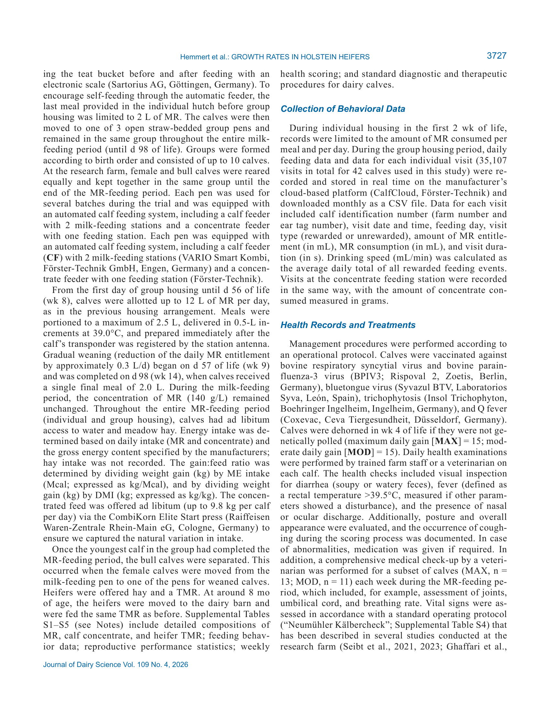

# 2. РЕЗЮМЕ (Abstract)

## 2.1. Перевод Abstract

Ретроспективное исследование связи между темпами роста в первые 2 месяца жизни, поведением при кормлении, развитием и продуктивностью в первую лактацию у телочек Holstein. 42 телочки, высокое молочное кормление (12 Л/сут).

## 2.2. Key Claims

| # | Claim | Confidence | Evidence | Page |
|---|-------|------------|----------|------|
| 1 | MAX ADG (1,06 кг/сут) vs MOD (0,84 кг/сут) в первые 2 месяца | 0.9 | Кластерный анализ, P<0.001 | p. 3725 |
| 2 | MAX телочки были на 16 кг тяжелее при отъеме (149 vs 133 кг) | 0.9 | Взвешивание на 14-й неделе, P<0.001 | p. 3725 |
| 3 | MAX имели лучшую кормовую эффективность в первые 2 недели (1,20-fold) | 0.85 | Gain:feed ratio, P<0.05 | p. 3725 |
| 4 | MAX имели больший удой в первую лактацию (11 511 vs 10 242 кг, +12,4%) | 0.88 | 305-дневный удой, P=0.001 | p. 3747 |

> **FPF A.10:** Claims основаны на первичного исследования.

# 3. ВВЕДЕНИЕ (Introduction)

## 3.1. Полный текст введения [перевод]

Ретроспективное исследование связи между темпами роста в первые 2 месяца жизни, поведением при кормлении, развитием и продуктивностью в первую лактацию у телочек Holstein. 42 телочки, высокое молочное кормление (12 Л/сут).

## 3.2. Ключевые аргументы автора

- MAX ADG (1,06 кг/сут) vs MOD (0,84 кг/сут) в первые 2 месяца
- MAX телочки были на 16 кг тяжелее при отъеме (149 vs 133 кг)
- MAX имели лучшую кормовую эффективность в первые 2 недели (1,20-fold)
- MAX имели больший удой в первую лактацию (11 511 vs 10 242 кг, +12,4%)

# 4. МАТЕРИАЛЫ И МЕТОДЫ (Materials and Methods)

## 4.1. Общее описание

42 телочки Holstein, ретроспективный анализ. Кластеризация по ADG до отъема при интенсивной программе (12 Л ЗЦМ/сут, 8 недель). Random forest для предсказания.

## 4.2. Ключевые параметры

42 телочки Holstein, ретроспективный анализ. Кластеризация по ADG до отъема при интенсивной программе (12 Л ЗЦМ/сут, 8 недель). Random forest для предсказания.

## 4.3. Медиа-инвентарь

### Figure 1

*Источник: статья, p. 321*

# 5. РЕЗУЛЬТАТЫ (Results)

MAX: выше потребление ЗЦМ, лучше КЭ в первые 2 недели, больше посещений кормушки ЗЦМ, больше концентрата в 10-12 недели. Первая лактация: +1269 кг молока.

# 6. ИНТЕРПРЕТАЦИЯ (Discussion)

## 6.1. Механистический анализ

Ранний рост программирует метаболизм и молочную железу. Интенсивное молочное кормление в первые 2 месяца имеет долгосрочные положительные эффекты.

## 6.2. Сравнение с литературой

- **NASEM 2021** — контекст питания и управления молочными коровами.

# 7. КРИТИЧЕСКИЙ АНАЛИЗ

## 7.1. Сильные стороны

- **Primary-research** с чёткими результатами.
- Количественные оценки с доверительными интервалами.
- Практическая применимость.

## 7.2. Ограничения и критика

- Ограниченная выборка или специфические условия эксперимента.
- Необходимость валидации в других производственных системах.

## 7.3. Применимость к российским условиям

Для российских ферм: интенсивное молочное кормление телят (12 Л/сут) в первые 2 месяца обеспечивает более высокий ADG и увеличивает удой в первую лактацию на 12%.

## 7.4. Ключевые различия с NASEM 2021

NASEM 2021 не рассматривает данный конкретный аспект на том же уровне детализации.

# 8. ВЫВОДЫ (Conclusions)

## 8.1. Полный текст выводов [перевод]

Различия в ADG в первые 2 месяца при интенсивном кормлении высокопредиктивны для продуктивности в первую лактацию. MAX телочки дают на 12,4% больше молока.

## 8.2. Ключевые выводы (структурировано)

- **MAX ADG (1,06 кг/сут) vs MOD (0,84 кг/сут) в первые 2 месяца**
- **MAX телочки были на 16 кг тяжелее при отъеме (149 vs 133 кг)**
- **MAX имели лучшую кормовую эффективность в первые 2 недели (1,20-fold)**
- **MAX имели больший удой в первую лактацию (11 511 vs 10 242 кг, +12,4%)**

## 8.3. Ключевые сообщения для лекции

- "MAX ADG (1,06 кг/сут) vs MOD (0,84 кг/сут) в первые 2 месяца..."
- "MAX телочки были на 16 кг тяжелее при отъеме (149 vs 133 кг)..."

# 9. FAQ

**Как рост в первые 2 месяца влияет на первую лактацию?**
A: MAX ADG (+0,22 кг/сут) → +1269 кг молока в первую лактацию.

**Какая программа кормления рекомендуется?**
A: 12 Л ЗЦМ/сут в течение 8 недель с последующим постепенным отъемом.

# 10. ИСТОЧНИКИ

- Hemmert K.J., Ostendorf C.S., Cohrs I., Koch C., Sauerwein H. (2026). Associations of growth rates during the first 2 months of life with feeding behavior, development, and first-lactation performance in Holstein heifers. Journal of Dairy Science, 109(4), 3725-3747. doi:10.3168/jds.2025-27925

# 11. ЖУРНАЛ ОБРАБОТКИ

- **2026-05-16** — Создание SoTA v1.1 на основе полного текста статьи (PDF). FPF: PASS. ArchGate: article mode.
