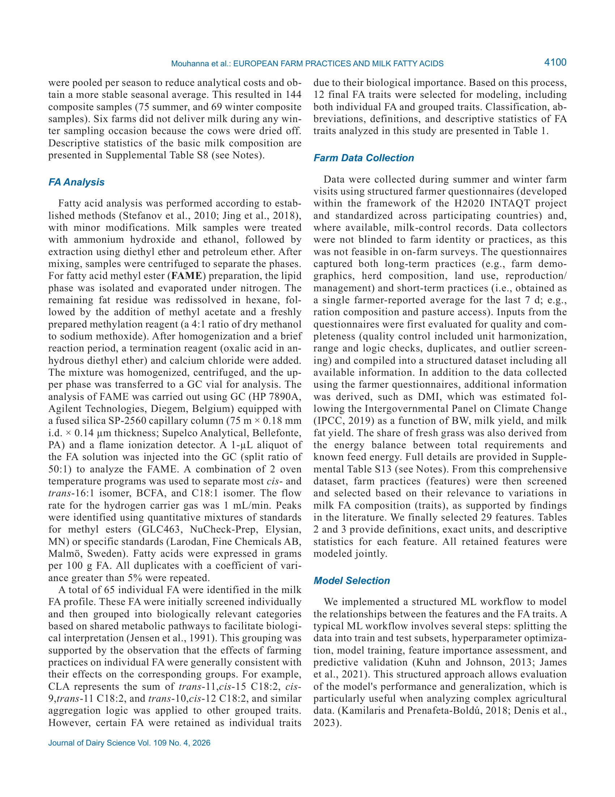
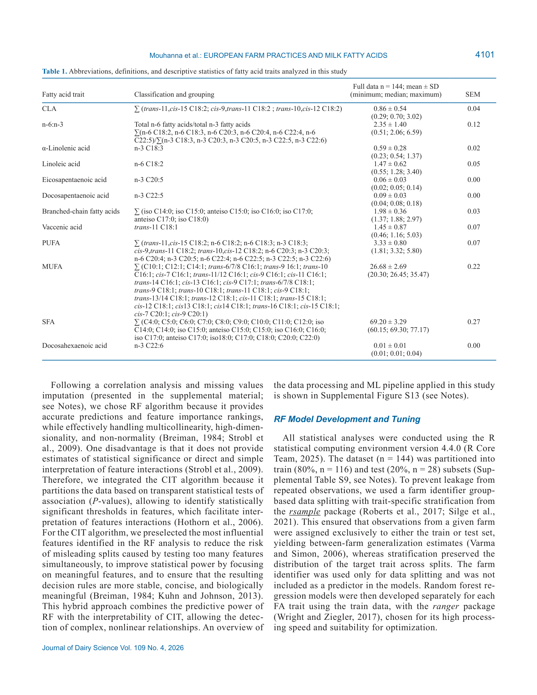

# CS.SOTA.326: Mouhanna et al. (2026) — ML и жирнокислотный профиль молока на европейских фермах

> **Навигация:** [2. Аннотация](#2-аннотация-abstract) · [3. Введение](#3-введение) · [4. Методология](#4-методология) · [5. Результаты](#5-результаты) · [6. Интерпретация](#6-интерпретация-и-обсуждение) · [7. Критический анализ](#7-критический-анализ) · [8. Выводы](#8-выводы) · [9. FAQ](#9-faq) · [10. Практика](#10-практическое-применение) · [12. Источники](#12-источники) · [13. Журнал](#13-журнал-обработки)

---

## 2. АННОТАЦИЯ (Abstract)

### 2.1. Перевод Abstract

Состав жирных кислот (ЖК) молока является индикатором как управления фермой, так и пищевой ценности молочных продуктов. Немногие исследования связали разнообразные межстрановые наблюдательные данные ферм с вариацией ЖК молока через валидированный workflow машинного обучения (ML). Авторы обследовали 75 европейских ферм, представляющих широкий градиент интенсивности производства, проанализировали сезонно пулингованные образцы молока из общего танка на 12 признаков ЖК и изучили 29 практик управления.

Двухэтапный workflow объединил оптимизированные random forests (RF) для предсказания ЖК и ранжирования практик с conditional inference trees (CIT) для визуализации синергий и компромиссов управления. RF-модели достигли высокой предсказательной точности (R² ≥ 0,50) для 8 признаков: α-линоленовая кислота (ALA), эйкозапентаеновая кислота (EPA), докозапентаеновая кислота (DPA), CLA, соотношение n-6:n-3 PUFA, линолевая кислота (LA), вакценовая кислота (VA) и разветвлённоцепочечные жирные кислоты (BCFA). CIT-модели показали сопоставимую точность (R² ≥ 0,50) для всех этих признаков, кроме VA и BCFA. Во всех моделях доминирующими факторами были потребление свежей травы, кукурузного силоса и концентратов, плотность посадки, размер стада, удой и минеральные удобрения, которые в совокупности объясняли большую часть дисперсии.

Фермы с низкоинтенсивными пастбищными стратегиями последовательно ассоциировались с более низким соотношением n-6:n-3 и более высокими уровнями n-3 PUFA, CLA и BCFA в молоке, подчёркивая синергию наряду с компромиссом между интенсивностью производства и пищевой ценностью.

### 2.2. Key Claims

**Claim 1:** RF-модели достигли test R² ≥ 0,50 для 8 из 12 признаков ЖК молока (CLA 0,85; n-6:n-3 0,77; ALA 0,75; VA 0,66; EPA 0,63; BCFA 0,59; DPA 0,59; LA 0,58).
- **Уверенность:** 0.90 (cross-sectional observational, n = 75 ферм, 144 pooled samples, независимый test set 20 % с farm-level grouping).
- **Evidence:** Table 4 (Mouhanna et al., 2026, p. 4109). Train/test split с stratification по trait; between-farm generalization.

**Claim 2:** Доминирующие факторы вариации ЖК — потребление свежей травы, кукурузного силоса, концентратов, плотность посадки, размер стада, удой и минеральные удобрения; сезонность и системный лейбл (organic/nonorganic) маргинализированы при учёте конкретных практик.
- **Уверенность:** 0.88 (bootstrapped permutation importance, 100 итераций, min–max normalized; иерархическая кластеризация 3 кластеров).
- **Evidence:** Figure 1, Supplemental Figure S9 (Mouhanna et al., 2026, p. 4109–4111).

**Claim 3:** Низкоинтенсивные пастбищные фермы ассоциированы с более низким n-6:n-3 (до 0,90 ± 0,1) и более высокими n-3 PUFA, CLA и BCFA; высокоинтенсивные системы — с обратным профилем (n-6:n-3 до 5,01 ± 0,19).
- **Уверенность:** 0.85 (CIT с ANOVA + Tukey-adjusted pairwise comparisons, P < 0,05; explicit thresholds).
- **Evidence:** CIT models (Figures 2–7), Tables 4–5 (Mouhanna et al., 2026, p. 4111–4118).

**Claim 4:** Существуют количественные пороги управления, ассоциированные с благоприятным/неблагоприятным профилем ЖК: свежая трава >5,2–10 кг DM/d, концентрат <4–5,6 кг DM/d, DMI <17,5–18 кг DM/d, плотность посадки <2 LSU/ha.
- **Уверенность:** 0.82 (CIT terminal nodes с CLD, P < 0,05; иллюстративные пороги из PDP).
- **Evidence:** Figures 2–7, Supplemental Figure S10 (Mouhanna et al., 2026, p. 4112–4118).

**Claim 5:** CIT-модели имели сопоставимую или превосходящую точность по сравнению с RF для 6 признаков (LA 0,74 vs 0,58; ALA 0,73 vs 0,75; n-6:n-3 0,73 vs 0,77; DPA 0,68 vs 0,59; CLA 0,65 vs 0,85; EPA 0,63 vs 0,63), но не достигли порога R² ≥ 0,50 для VA, BCFA, PUFA, MUFA, SFA, DHA.
- **Уверенность:** 0.80 (гибридный подход RF→feature selection→CIT; R² gap минимален для топовых моделей).
- **Evidence:** Table 5 (Mouhanna et al., 2026, p. 4113).

**Claim 6:** Исследование имеет наблюдательный cross-sectional дизайн с данными, собранными через фермерские анкеты; установленные ассоциации предиктивны и описывают between-farm вариацию, а не причинно-следственные связи.
- **Уверенность:** 0.95 (ограничение дизайна явно декларировано; нет рандомизации или интервенции).
- **Evidence:** Discussion, Study Limitations (Mouhanna et al., 2026, p. 4119–4120).

---

## 3. ВВЕДЕНИЕ

### 3.1. Контекст и значимость проблемы

**Модель Mouhanna et al. (2026)** исследует связи между практиками управления молочными фермами и профилем жирных кислот молока с использованием валидированного двухэтапного workflow машинного обучения на разнообразном европейском датасете.

#### Физиология и механизмы: пищевая ценность молочного жира

**Физиологический контекст из статьи.** Состав ЖК молока вносит значительный вклад в пищевую ценность молочных продуктов. В западных обществах соблюдение рекомендуемых уровней потребления n-3 ЖК и низкого диетического соотношения n-6:n-3 важно для снижения риска метаболических заболеваний (Jang & Park, 2020; Mariamenatu & Abdu, 2021). Молочный жир также является важным источником разветвлённоцепочечных жирных кислот (BCFA) и CLA, обе из которых ассоциированы с благоприятными биоактивными свойствами (Badawy et al., 2023; Yehia et al., 2023).

> **Модель предполагает**, что для населения с недостаточным потреблением n-3 PUFA молочные продукты от пастбищных систем могут служить функциональным источником этих кислот, хотя абсолютные концентрации в молоке остаются ниже, чем в жирной рыбе (Mouhanna et al., 2026, p. 4098).

#### Физиология и механизмы: отражение рубцовой функции в ЖК молока

**Физиологический контекст.** Для молочных коров состав ЖК молока отражает функцию рубца и метаболические ответы на диетические входные данные и стратегии управления, предоставляя информацию об интенсивности производства (Mowete et al., 2025). Молочные ЖК являются продуктом сложного взаимодействия между диетой, рубцовой микробиотой и молочной железой.

> **Модель предполагает**, что профиль ЖК молока можно рассматривать как интегральный биомаркер рубцовой функции, поскольку ~90 % молочных ЖК происходят из кровяных липидов, которые в свою очередь отражают выход рубцовой биогидрогенизации и деновау липогенеза (Mouhanna et al., 2026, p. 4098; Jensen et al., 1991).

#### Физиология и механизмы: биосинтез CLA и n-3 PUFA

**Физиологический контекст.** Биосинтез CLA в молочных коровах включает рубцовую микробную активность и метаболизм молочной железы. Предшественники — LA (C18:2) и ALA (C18:3), abundant в свежей траве, подвергаются неполной биогидрогенизации в рубце, производя VA (trans-11 C18:1) как промежуточный изомер (Griinari & Bauman, 1999; Acosta-Balcázar et al., 2023). VA конвертируется в CLA (cis-9,trans-11 C18:2) в молочной железе Δ9-десатуразой (EC 1.14.19.1; Griinari et al., 2000; Lock & Garnsworthy, 2003; Dallaire et al., 2014).

> **Модель предполагает**, что свежая трава способствует улучшению уровней n-3 PUFA в молоке через два дополняющих пути: (1) высокое содержание ALA-предшественника; (2) защита диетических PUFA во время рубцового брожения благодаря растительным клеточным стенкам и ферментам полифенолоксидазы (Mouhanna et al., 2026, p. 4120).

### 3.2. Обзор литературы (краткий)

#### 3.2.1. ML в прогнозировании ЖК молока

**Традиционная концепция.** Предыдущие исследования успешно применяли многомерный анализ и алгоритмы ML к ЖК молока или mid-infrared spectra для предсказания и классификации кормовых систем (Coppa et al., 2015; Birkinshaw et al., 2024; Franceschini et al., 2025) или моделирования эффектов конкретных входных данных фермы (Coppa et al., 2013; Mele et al., 2016; Chen et al., 2025). Однако исследования, изучающие, как комбинации практик ведения хозяйства влияют на качество молока, редки (Rey-Cadilhac et al., 2023).

**Обоснование.** До настоящего исследования ни одна работа не объединяла лабораторно стандартизированные межстрановые данные с разнообразных ферм для изучения синергий и компромиссов между множественными практиками ведения хозяйства и составом ЖК молока с использованием оптимизированного и валидированного workflow ML. Настоящее исследование заполняет этот пробел, применяя гибридный подход RF + CIT к 75 европейским фермам (Mouhanna et al., 2026, p. 4098–4099).

#### 3.2.2. Coppa et al. (2013) — ключевое сравнение

**Обоснование.** Coppa et al. (2013) использовали линейные модели для предсказания ЖК молока на основе практик ферм. В настоящем исследовании RF-модели достигли сопоставимой или превосходящей точности для нескольких признаков: CLA (0,85 vs 0,71) и LA (0,58 vs 0,40) превзошли benchmarks Coppa, тогда как n-6:n-3, ALA и VA были сопоставимы с классификацией Coppa «very good» (test R² ≥ 0,6). В отличие от Coppa, агрегированные классы (PUFA, SFA, MUFA) показали низкую предсказуемость в данном исследовании (test R² 0,25–0,43), что отражает большую биологическую гетерогенность и разбавление сигнала при группировке (Mouhanna et al., 2026, p. 4118).

> **Модель предполагает**, что различия в предсказуемости агрегированных классов отражают более широкий диапазон производственных систем в мультистрановом наблюдательном датасете по сравнению с данными Coppa (Mouhanna et al., 2026, p. 4118).

---

## 4. МЕТОДОЛОГИЯ

### 4.1. Дизайн исследования

| Параметр | Значение |
|----------|----------|
| **Тип** | Cross-sectional observational survey (межстрановой, многоферменный) |
| **Период** | Май 2022 – апрель 2023 |
| **Места** | 5 европейских стран (Франция, Италия, Германия, Швейцария, Ирландия) |
| **Фермы** | 75 dairy farms (разнообразные системы: very low → very high intensity) |
| **Образцы** | 363 bulk tank milk samples → 144 seasonally pooled composite samples (75 summer, 69 winter) |
| **Экспериментальная единица** | Dairy farm |
| **Этика** | Только routine milk sampling и farm surveys; ethical approval не требовался |
| **Финансирование** | EU Horizon 2020 INTAQT (grant 101000250), University Foundation of Belgium |

**Обоснование дизайна.** Наблюдательный cross-sectional дизайн выбран для захвата широкого градиента интенсивности производства между фермами. Ферма — экспериментальная единица, поскольку bulk tank milk представляет агрегированный продукт всего стада. Seasonal pooling (3 summer + 2 winter samples per farm) обеспечивает стабильное сезонное среднее, но игнорирует внутрисезонную вариабельность (Mouhanna et al., 2026, p. 4119).

### 4.2. Отбор ферм и классификация по уровню входов

**Low-input (низкоинтенсивные):** Агроэкологические практики, натуральные удобрения (навоз/жижа), часто non-Holstein породы. Длительное летнее выпасание, зимой — сено/солома, минимум концентратов и кукурузного зерна. Многие сертифицированы organic.

**Medium-input (среднеинтенсивные):** Комбинация выпасания с консервированными кормами, кукурузный силос — центральная роль. Большая доля Holstein, короткое летнее выпасание. Зимой — кукурузный силос или сено + умеренные концентраты.

**High-input (высокоинтенсивные):** Интенсивные практики: большие объёмы концентратов и кукурузного силоса, высокие дозы синтетических удобрений. Преимущественно Holstein, круглогодичное содержание в помещениях, выпасание отсутствует или незначительно. Селекция на максимальный удой.

### 4.3. Сбор и анализ образцов

**Сбор:** 3 раза летом (май–июнь, июль–август, сентябрь–октябрь 2022) и 2 раза зимой (декабрь 2022 – апрель 2023). После 5-минутной гомогенизации танка. 2 литра молока → 50-мл aliquots → заморозка −20°C → транспортировка в Ghent University.

**Анализ ЖК:** GC (HP 7890A, Agilent) с колонкой SP-2560 (75 м × 0,18 мм × 0,14 мкм) и FID. FAME preparation: ammonium hydroxide + ethanol → extraction diethyl ether/petroleum ether → methylation (sodium methoxide) → GC analysis. 65 индивидуальных ЖК → группировка в 12 biologically relevant traits (Table 1).

### 4.4. Сбор данных ферм (29 features)

Данные собирались через структурированные фермерские анкеты (H2020 INTAQT) и записи контроля молока. DMI оценивался по IPCC (2019) как функция BW, удоя и жирности молока. Доля свежей травы выводилась из энергетического баланса.

**Категориальные features (Table 2):**
- Season (2 уровня): Summer (n=75, 52%), Winter (n=69, 48%)
- System (2 уровня): Organic (n=38, 26%), Nonorganic (n=106, 74%)
- Label_certifi_feature (5 уровней): ENV (8%), ORG/BIO (18%), QMA (13%), REG (18%), No certification (44%)

**Числовые features (Table 3) — ключевые:**
| Feature | Mean ± SD | Диапазон |
|---------|-----------|----------|
| Holstein, % | 60.6 ± 43.5 | 0–100 |
| dmi_ipcc, kg DM/d | 19.1 ± 2.7 | 13–25 |
| dmi_grass, kg DM/d | 2.56 ± 4.67 | 0–16 |
| maize_silage, kg DM/d | 3.78 ± 4.41 | 0–14 |
| concentrates, kg DM/d | 4.83 ± 3.27 | 0–12 |
| lsu_ha, LSU/ha | 1.73 ± 1.75 | 0–10 |
| Milk_yield, kg/cow/yr | 7,991 ± 2,261 | 1,970–13,094 |
| herd_size | 118.1 ± 124.1 | 5–610 |
| Grazing_time_year_perc, % | 27.7 ± 26.8 | 0–90 |

### 4.5. ML workflow (2-stage)

**Этап 1 — Random Forest (RF):**

| Параметр | Значение |
|----------|----------|
| **Пакет** | ranger (R 4.4.0) |
| **Разделение данных** | 80 % train (n=116) / 20 % test (n=28) |
| **Стратификация** | Farm-level grouping (group-based splitting, rsample) + trait-specific stratification |
| **Оптимизация гиперпараметров** | Simulated annealing (SA), finetune, 5-fold CV, 50 итераций |
| **Гиперпараметры** | trees, mtry, min_n |
| **Критерий выбора** | Максимизация cross-validated R² с допуском 2 % |
| **Оценка** | Test RMSE, Test R², OOB RMSE, OOB R² |

**Важность признаков:** Bootstrapped permutation (100 итераций, resampling with replacement). Нормализация min–max (0–1). Иерархическая кластеризация: Manhattan distance (features) + Spearman correlation (models), Ward’s D2 linkage.

**PDP:** Для 4 наиболее влиятельных features в каждой top-performing модели.

**Отбор признаков:**
1. Топ 75 % cumulative importance
2. Подтверждение Boruta algorithm (shadow features)
3. Пересечение обоих методов → финальный subset (4–10 features)

**Этап 2 — Conditional Inference Trees (CIT):**

| Параметр | Значение |
|----------|----------|
| **Пакет** | parsnip + partykit |
| **Входные данные** | Только отобранные features из RF |
| **Гиперпараметры** | Tree depth, min_n, MinCriterion P < 0,05 |
| **Оптимизация** | SA + 5-fold CV (аналогично RF) |
| **Выбор модели** | select_by_one_std_err |
| **Оценка** | Test R², R² gap (train R² − test R²) |

**Визуализация:** Финальные CIT re-fitted на полном датасете для стабильности splits. ANOVA (factor = terminal node) + Tukey-adjusted pairwise comparisons (emmeans). Nodes sharing a letter — не значимо различимы (P > 0,05). CLD (compact letter display).

### 4.6. Статистический анализ

- **Корреляционный анализ:** Для исключения признаков с r ≥ 0.8 (не представлено в основном тексте)
- **Импутация пропущенных значений:** Supplemental Material
- **Нормализация importance:** Min–max (0–1) внутри каждой модели
- **Порог значимости:** P < 0,05 для всех CIT splits и post hoc сравнений

### 4.7. Медиа-инвентарь

| ID | Тип | Описание | Файл | Статус |
|----|-----|----------|------|--------|
| Fig. 1 | Heatmap | Нормализованные permutation importance scores для 8 FA traits | `page-03-figure-1.png` | ✅ Встроено |
| Fig. 2 | CIT | ALA: DMI → system → maize_silage → fert_min_perc | `page-04-figure-1.png` | ✅ Встроено |
| Fig. 3 | CIT | n-6:n-3: concentrates → milk_yield → lsu_ha | *отсутствует* | ❌ Не извлечён |
| Fig. 4 | CIT | CLA: dmi_grass → dmi_ipcc → milk_yield | *отсутствует* | ❌ Не извлечён |
| Fig. 5 | CIT | LA: concentrates → lsu_ha → grazing_time | *отсутствует* | ❌ Не извлечён |
| Fig. 6 | CIT | DPA: dmi_ipcc → concentrates → maize_silage | *отсутствует* | ❌ Не извлечён |
| Fig. 7 | CIT | EPA: dmi_ipcc → system → grazing_time → maize_silage | *отсутствует* | ❌ Не извлечён |
| Suppl. Fig. S8 | График | SA convergence curves | *отсутствует* | ❌ Не извлечён |
| Suppl. Fig. S9 | График | Permutation importance по traits | *отсутствует* | ❌ Не извлечён |
| Suppl. Fig. S10 | График | PDP для 4 top features | *отсутствует* | ❌ Не извлечён |
| Suppl. Fig. S11 | График | Feature selection process (RF + Boruta) | *отсутствует* | ❌ Не извлечён |
| Suppl. Fig. S12 | График | Остальные CIT trees | *отсутствует* | ❌ Не извлечён |
| Table 1 | Таблица | Descriptive statistics FA traits | *отсутствует* | ❌ Не извлечена |
| Table 2 | Таблица | Categorical features | *отсутствует* | ❌ Не извлечена |
| Table 3 | Таблица | Numerical features | *отсутствует* | ❌ Не извлечена |
| Table 4 | Таблица | RF model specifications and performance | *отсутствует* | ❌ Не извлечена |
| Table 5 | Таблица | CIT model specifications and performance | *отсутствует* | ❌ Не извлечена |

> **Примечание:** Извлечены только 2 PNG-изображения (Figure 1 — heatmap importance, Figure 2 — CIT ALA). Остальные рисунки и таблицы доступны в оригинальной PDF-версии статьи (DOI: 10.3168/jds.2025-27564; HAL: hal-05575501). Текстовые описания числовых результатов приведены в полном объёме.

---

## 5. РЕЗУЛЬТАТЫ

### 5.1. Описательная статистика ферм и ЖК (Tables 1–3)

**Обоснование.** Описательный анализ контекстуализирует гетерогенность исследуемой популяции и позволяет интерпретировать последующие ML-модели в рамках реальных диапазонов значений.

| Параметр | Среднее ± SD | Медиана | Диапазон |
|----------|-------------|---------|----------|
| Milk_yield, кг/корову в год | 7 991 ± 2 261 | — | 1 970–13 094 |
| lsu_ha, LSU/га | 1,73 ± 1,75 | — | 0–10 |
| Grazing_time_year_perc, % | 27,7 ± 26,8 | — | 0–90 |
| dmi_ipcc, кг СВ/сут | 19,1 ± 2,7 | — | 13–25 |
| concentrates, кг СВ/сут | 4,83 ± 3,27 | — | 0–12 |
| maize_silage, кг СВ/сут | 3,78 ± 4,41 | — | 0–14 |
| dmi_grass, кг СВ/сут | 2,56 ± 4,67 | — | 0–16 |

| FA trait | Mean ± SD | Минимум; Медиана; Максимум |
|----------|-----------|------------------------------|
| CLA, г/100 г ЖК | 0,86 ± 0,54 | 0,29; 0,70; 3,02 |
| n-6:n-3 | 2,35 ± 1,40 | 0,51; 2,06; 6,59 |
| ALA, г/100 г ЖК | 0,59 ± 0,28 | 0,23; 0,54; 1,37 |
| LA, г/100 г ЖК | 1,47 ± 0,62 | 0,55; 1,28; 3,40 |
| EPA, г/100 г ЖК | 0,06 ± 0,03 | 0,02; 0,05; 0,14 |
| DPA, г/100 г ЖК | 0,09 ± 0,03 | 0,04; 0,08; 0,18 |
| BCFA, г/100 г ЖК | 1,98 ± 0,36 | 1,37; 1,88; 2,97 |
| VA, г/100 г ЖК | 1,45 ± 0,87 | 0,46; 1,16; 5,03 |
| PUFA, г/100 г ЖК | 3,33 ± 0,80 | 1,81; 3,32; 5,80 |
| MUFA, г/100 г ЖК | 26,68 ± 2,69 | 20,30; 26,45; 35,47 |
| SFA, г/100 г ЖК | 69,20 ± 3,29 | 60,15; 69,30; 77,17 |
| DHA, г/100 г ЖК | 0,01 ± 0,01 | 0,01; 0,01; 0,04 |

**Ключевое наблюдение.** Датасет охватывает экстремально широкий диапазон интенсивности: от мини-ферм с 5 дойными коровами и нулевым выпасанием до ферм с 610 коровами и 90 % годового времени на пастбище. Эта гетерогенность обеспечивает robust between-farm generalization, но также создаёт вызовы для ML (skewness, multicollinearity, tied values).

### 5.2. RF-модели: производительность (Table 4)

**Обоснование.** Оценка предсказательной точности RF-моделей на независимом test set с farm-level grouping является ключевым этапом валидации workflow.

**Top-performing models (test R² ≥ 0,50):**

| Trait | mtry | Trees | min_n | Train R² | Test R² | OOB R² |
|-------|------|-------|-------|----------|---------|--------|
| CLA | 3 | 401 | 2 | 0,97 | **0,85** | 0,69 |
| n-6:n-3 | 4 | 517 | 11 | 0,93 | **0,77** | 0,77 |
| ALA | 9 | 541 | 3 | 0,98 | **0,75** | 0,80 |
| VA | 16 | 1 591 | 3 | 0,97 | **0,66** | 0,70 |
| EPA | 19 | 493 | 3 | 0,98 | **0,63** | 0,82 |
| BCFA | 21 | 934 | 5 | 0,97 | **0,59** | 0,80 |
| DPA | 24 | 1 066 | 7 | 0,96 | **0,59** | 0,78 |
| LA | 10 | 718 | 3 | 0,98 | **0,58** | 0,88 |

**Poor-performing models (test R² < 0,50):**

| Trait | Test R² | OOB R² |
|-------|---------|--------|
| PUFA | 0,43 | 0,72 |
| DHA | 0,39 | 0,43 |
| MUFA | 0,25 | 0,43 |
| SFA | 0,25 | 0,51 |

**Механистическая интерпретация.** Высокая train R² (0,93–0,98) для топовых моделей указывает на хорошее соответствие моделей обучающим данным. Test R² ≥ 0,50 для 8 из 12 traits подтверждает between-farm generalizability. Низкая test R² для PUFA, MUFA, SFA отражает биологическую гетерогенность агрегированных классов и разбавление сигнала при группировке индивидуальных ЖК.

### 5.3. RF-модели: паттерны важности признаков (Figure 1)

**Обоснование.** Анализ permutation-based feature importance выявляет shared и trait-specific драйверы вариации ЖК и позволяет кластеризовать traits по сходству механизмов.

**Кластер 1 — CLA и VA:**
- Доминирующие features: total DMI, milk yield, fresh grass intake, daily hours at pasture.
- PDP: CLA/VA максимизируются при >10 ч/сут на пастбище и >10–11 кг СВ/сут свежей травы.
- Снижение при DMI >16 кг/сут и milk yield >5 500 кг/корову в год.

**Кластер 2 — ALA, EPA, DPA, BCFA:**
- Доминирующие features: concentrate intake, total DMI, milk yield, herd size, maize silage intake.
- PDP: максимальные уровни при DMI <17,5 кг/сут, concentrates <4 кг/сут, milk yield <6 000–7 000 кг/год.
- BCFA высоки при stocking density <2 LSU/га и высоком потреблении свежей травы/сена.

**Кластер 3 — n-6:n-3 и LA:**
- Доминирующие features: stocking density (total UAA и pasture), annual grazing time %, concentrate intake.
- PDP: пиковые значения при stocking density >2 LSU/га, outdoor <40 %, concentrates >6 кг/сут.

### 5.4. Отбор признаков (Feature Selection)

| Trait | Отобрано features | Из 29 |
|-------|-------------------|-------|
| n-6:n-3 | 4 | 4 |
| DPA | 5 | 5 |
| VA | 5 | 5 |
| CLA | 6 | 6 |
| LA | 7 | 7 |
| BCFA | 7 | 7 |
| ALA | 8 | 8 |
| EPA | 10 | 10 |

Отбор проводился пересечением top 75 % cumulative importance и подтверждения Boruta.

### 5.5. CIT-модели: производительность (Table 5)

**Обоснование.** CIT-модели обеспечивают интерпретируемые пороги и комбинации практик, ассоциированные с экстремальными уровнями ЖК.

**Top-performing CIT (test R² ≥ 0,50):**

| Trait | Tree depth | Target node size | Train R² | Test R² | R² gap |
|-------|-----------|------------------|----------|---------|--------|
| LA | 10 | 30 | 0,77 | **0,74** | 0,03 |
| ALA | 11 | 29 | 0,74 | **0,73** | 0,01 |
| n-6:n-3 | 10 | 30 | 0,75 | **0,73** | 0,03 |
| DPA | 8 | 22 | 0,70 | **0,68** | 0,01 |
| CLA | 3 | 25 | 0,66 | **0,65** | 0,01 |
| EPA | 3 | 7 | 0,76 | **0,63** | 0,13 |

**Below threshold (test R² < 0,50):** BCFA (0,43), VA (0,40), PUFA (0,38), DHA (0,24), SFA (0,23), MUFA (0,02).

**Механистическая интерпретация.** Минимальный R² gap (0,01–0,03) для топовых моделей указывает на strong generalization и отсутствие переобучения. Больший R² gap для EPA (0,13) и VA (0,31) отражает повышенную чувствительность к разделению данных.

### 5.6. CIT-модели: пороги и комбинации (Figures 2–7)

**ALA (Figure 2):**
- Первый split: total DMI ≤/> 18 кг СВ/сут (P < 0,001).
- Наибольшая ALA (1,00 ± 0,03): DMI <18 + organic (n=28, P < 0,001).
- Наименьшая ALA (0,27 ± 0,04): DMI >18 + maize silage >4,7 кг/сут + mineral fertilizer >32 % (n=16).

**n-6:n-3 (Figure 3):**
- Первый split: concentrates ≤/> 5,6 кг СВ/сут (P < 0,001).
- Наименьшее соотношение (0,90 ± 0,1): concentrates <5,6 + milk yield ≤8 200 + concentrates ≤2,2 (n=35, P < 0,001).
- Наибольшее соотношение (5,01 ± 0,19): concentrates >5,6 + lsu_ha >4,5 LSU/га (n=10, P = 0,026).

**CLA (Figure 4):**
- Первый split: fresh grass intake ≤/> 5,2 кг СВ/сут (P < 0,001).
- Наибольшая CLA (1,71 ± 0,06): fresh grass >5,2 + milk yield ≤6 759 (n=24).
- Наименьшая CLA (0,49 ± 0,04): fresh grass <5,2 + DMI >19,9 (n=61).

**LA (Figure 5):**
- Первый split: concentrates ≤/> 5,6 кг СВ/сут (P < 0,001).
- Наибольшая LA (2,45 ± 0,06): concentrates >5,6 + lsu_ha >1,66 (n=28).
- Наименьшая LA (0,93 ± 0,06): concentrates <5,6 + concentrates ≤2,2 + grazing >66 % (n=10).

**DPA (Figure 6):**
- Первый split: total DMI ≤/> 17,8 кг СВ/сут (P < 0,001).
- Наименьшая DPA (0,06 ± 0,002): DMI >17,8 + maize silage >4,7 (n=53).
- Наибольшая DPA (0,12 ± 0,003): DMI <17,8 + concentrates ≤1,4 (n=28).

**EPA (Figure 7):**
- Первый split: total DMI ≤/> 17,98 кг СВ/сут (P < 0,001).
- Наибольшая EPA (0,10 ± 0,003): DMI <17,98 + organic + outdoor >44 % (n=18, P = 0,038).
- Наименьшая EPA (0,02 ± 0,003): DMI >17,98 + maize silage >8,62 (n=25, P < 0,001).

### 5.7. Встроенные медиа

*Источник: Mouhanna et al., 2026, p. 4110 (Figure 1). Каждая ячейка показывает относительную важность feature (строки) для конкретной FA-модели (столбцы) по шкале 0–1 (белый = 0, тёмно-красный = 1). Иерархическая кластеризация: Manhattan distance (features) + Spearman correlation (models), Ward’s D2 linkage.*

*Источник: Mouhanna et al., 2026, p. 4114 (Figure 2). Первый split: total DMI ≤/> 18 кг СВ/сут (P < 0,001). Терминальные узлы с boxplot ALA. CLD (compact letter display): узлы с одинаковой буквой не различаются значимо (P > 0,05).*

---

## 6. ИНТЕРПРЕТАЦИЯ И ОБСУЖДЕНИЕ

### 6.1. Оценка методологии

**Обоснование.** Наблюдательный cross-sectional дизайн с данными из анкет имеет ограничения, но двухэтапный ML workflow (RF→CIT) обеспечивает баланс между предсказательной мощью и интерпретируемостью.

**Механизм.** RF эффективно обрабатывает мультиколлинеарность, высокую размерность и ненормальность (Breiman, 1984; Strobl et al., 2009), но не даёт оценок статистической значимости и прямой интерпретации взаимодействий. CIT восполняет этот пробел, разбивая данные на основе прозрачных статистических тестов ассоциации (P-values), позволяя идентифицировать значимые пороги в features (Hothorn et al., 2006). Предварительный отбор features из RF снижает риск misleading splits и улучшает статистическую мощность.

> **Модель предполагает**, что R² gap (разница между train и test R²) является индикатором overfitting: минимальный gap (0,01–0,03) для топовых моделей подтверждает захват истинного сигнала (Mouhanna et al., 2026, p. 4117).

### 6.2. Кластер 1: CLA и VA — ассоциации с потреблением свежей травы

**Обоснование.** CLA и VA тесно ассоциированы по паттернам важности features и имеют общие механистические основы.

**Механизм.** CLA biosynthesis включает неполную биогидрогенизацию LA/ALA в рубце → VA (trans-11 C18:1) → конверсию в CLA (cis-9,trans-11) в молочной железе Δ9-десатуразой (Griinari & Bauman, 1999; Griinari et al., 2000). Диеты, богатые свежей травой, поддерживают микробные пути, благоприятствующие биосинтезу CLA (Nelson & Martini, 2009; Schwendel et al., 2015), тогда как интенсивные системы с кукурузным силосом снижают рН рубца и изменяют микробную динамику (Buccioni et al., 2012; Castillo-Lopez et al., 2021). CIT показал, что наибольшая CLA (1,71 ± 0,06) достигается при fresh grass >5,2 кг/сут и milk yield ≤6 759 кг/год, тогда как наименьшая (0,49 ± 0,04) — при низком потреблении травы и высоком DMI.

**Важное различие.** Хотя cis-9,trans-11 CLA увеличивается при кормовых диетах, trans-10,cis-12 CLA (менее abundant, 0,033 ± 0,025) ассоциирован с milk fat depression при концентратных диетах (Griinari & Bauman, 1999; Loor et al., 2005). В данном исследовании total CLA валидирован как grass-associated trait, в основном отражающий cis-9,trans-11 изомер (r = 0,84 между изомерами).

### 6.3. Кластер 2: n-3 PUFA и BCFA — ассоциации с низкоинтенсивными системами

**Обоснование.** ALA, EPA, DPA и BCFA демонстрируют сходные паттерны: максимальные уровни при низком DMI, минимальных концентратах, низком удое и ограниченном кукурузном силосе — характеристики low-input pasture-based систем (Stergiadis et al., 2015).

**Механизм: n-3 PUFA.** Свежая трава и бобовые обеспечивают значительно более высокие уровни ALA-предшественника по сравнению с консервированными кормами или концентратами (Walker et al., 2004; Elgersma, 2015). Растительные клеточные стенки защищают диетические PUFA во время рубцового брожения, а полифенолоксидаза (EC 1.10.3.1), abundant в красном клевере, ограничивает распад PUFA (Dewhurst et al., 2006; Lee et al., 2009). CIT подтверждает, что organic management при низком DMI ассоциировано с наибольшими ALA и EPA.

**Механизм: BCFA.** BCFA синтезируются исключительно рубцовыми бактериями из разветвлённоцепочечных аминокислот (Vlaeminck et al., 2006). Волокнистые диеты поддерживают целлюлолитические бактерии, способствующие синтезу BCFA (Coppa et al., 2013; Salzano et al., 2023). CIT показал, что фермы с низким DMI, низкой плотностью посадки и высоким потреблением травы/сена производят молоко с более высокими BCFA.

### 6.4. Кластер 3: LA и n-6:n-3 — ассоциации с высокоинтенсивными системами

**Обоснование.** LA и n-6:n-3 ratio пиковы при высокой плотности посадки, ограниченном выпасании и высоком потреблении концентратов — условия типичные для интенсивных систем.

**Механизм.** Концентратные диеты богаче LA, чем ALA (Abrahamse et al., 2008; Kliem et al., 2008). Высокие концентраты снижают время жвачки и секрецию слюны (Krawczel et al., 2012), понижают рН рубца (Bailey, 1961; Castillo-Lopez et al., 2021) и ослабляют пути биогидрогенизации (Dewanckele et al., 2020). При этом незавершённая биогидрогенизация позволяет большему количеству ненасыщенных ЖК, включая LA, избегать рубца. Поскольку концентратные диеты богаче LA, чем ALA, доминирующей долей в молоке становится n-6 PUFA (Buccioni et al., 2012). CIT-derived splits показали >5-кратную разницу n-6:n-3 между high-input и low-input системами.

### 6.5. Системные лейблы vs конкретные практики

**Обоснование.** Мультивариатные модели маргинализировали роль широких дескрипторов системы (сертификация, сезон) после учёта конкретных практик.

**Механизм.** Хотя organic фермы среди тех с наибольшими n-3 PUFA, CIT показал, что только подмножество organic ферм (28 из 38 для ALA, 10 из 38 для EPA) попали в high-performing nodes. Organic certification itself не был primary predictor. Это подтверждает, что **практики важнее лейблов**: пастбищное использование, ограничение концентратов и тип корма — решающие факторы, тогда как formal certification — лишь прокси для этих практик (Mouhanna et al., 2026, p. 4121).

### 6.6. Эволюция модели: предсказуемость ЖК молока

| Эпоха | Источник | Подход | Точность (R²) | Контекст |
|-------|----------|--------|---------------|----------|
| 2013 | Coppa et al. | Линейные модели | CLA 0,71; LA 0,40; n-6:n-3 ~0,6 | Европейские фермы, менее гетерогенный датасет |
| 2013 | Coppa et al. | Линейные модели | PUFA, SFA, MUFA «good» (≥0,5) | Агрегированные классы предсказуемы |
| 2016 | Mele et al. | Многомерный FA | Факторный анализ по системе/кормлению | Италия, без ML |
| 2025 | Chen et al. | ML (geographical origin) | FA fingerprint для трассировки происхождения | Китай, индивидуальные коровы |
| 2025 | Franceschini et al. | ML (mid-IR spectra) | Классификация проблем управления | Бельгия, spectra-based |
| 2026 | Mouhanna et al. | RF + CIT | CLA 0,85; LA 0,58; n-6:n-3 0,77 | 5 стран, 75 ферм, between-farm |
| 2026 | Mouhanna et al. | RF + CIT | PUFA 0,43; MUFA 0,25; SFA 0,25 | Агрегированные классы — низкая предсказуемость |

> **Модель предполагает**, что улучшение предсказуемости CLA и LA в RF-моделях по сравнению с линейными моделями Coppa отражает способность RF улавливать нелинейные взаимодействия и пороговые эффекты, тогда как низкая предсказуемость агрегированных классов в данном исследовании связана с большей гетерогенностью межстранового датасета (Mouhanna et al., 2026, p. 4118).

### 6.7. Эволюция модели: механистические пороги управления

| Признак | Благоприятный профиль | Неблагоприятный профиль | Источник |
|---------|----------------------|------------------------|----------|
| CLA | Fresh grass >5,2 кг СВ/сут, milk yield <6 759 | DMI >19,9, низкая трава | CIT (Mouhanna et al., 2026) |
| ALA | DMI <18, organic | Maize silage >4,7, mineral fert >32 % | CIT (Mouhanna et al., 2026) |
| n-6:n-3 | Concentrates <5,6, milk yield <8 200 | Concentrates >5,6, lsu_ha >4,5 | CIT (Mouhanna et al., 2026) |
| LA | Concentrates <5,6, grazing >66 % | Concentrates >5,6, lsu_ha >1,66 | CIT (Mouhanna et al., 2026) |
| EPA | DMI <17,98, outdoor >44 %, organic | Maize silage >8,62 | CIT (Mouhanna et al., 2026) |
| BCFA | DMI <17,5, stocking <2 LSU/га | Maize silage ↑, stocking ↑ | PDP + CIT (Mouhanna et al., 2026) |

> **Модель предполагает**, что эти пороги являются описательными для данного европейского датасета и требуют экспериментальной валидации перед применением в других контекстах (Mouhanna et al., 2026, p. 4121).

### 6.8. Strict Distinction

**Что исследование устанавливает:**
- Предиктивные ассоциации между 29 практиками управления и 12 признаками ЖК молока в cross-sectional sample из 75 европейских ферм 5 стран.
- Количественные пороги управления (CIT splits), ассоциированные с экстремальными уровнями ЖК, при P < 0,05.
- Between-farm generalizability RF-моделей для 8 из 12 признаков (test R² ≥ 0,50 с farm-level grouping).

**Что исследование НЕ устанавливает:**
- **Причинность.** Наблюдательный дизайн с данными из анкет не позволяет установить causal links. Например, milk yield может быть маркером интенсивности, а не прямым биологическим драйвером ЖК.
- **Универсальность порогов.** CIT thresholds (например, DMI 18 кг/сут, concentrates 5,6 кг/сут) описывают распределение в данном датасете, а не клинически валидированные cut-off points.
- **Прямую биологическую каузальность системных лейблов.** Organic certification — прокси для практик, а не независимый предиктор; только часть organic ферм попала в high-performing nodes.
- **Популяционные эффекты для агрегированных классов.** PUFA, MUFA, SFA показали низкую предсказуемость (R² < 0,50), что ограничивает выводы для этих групп.
- **Здоровый эффект для потребителя.** Исследование не доказывает, что потребление молока из low-input систем доставляет значимую и измеримую пользу для здоровья.

> **FPF A.10:** Различение между ассоциацией и причинностью, а также между предиктивной моделью и универсальным выводом — обязательно при интерпретации результатов.
>
> **FPF A.7:** Все выводы о механизмах основаны на корреляциях внутри наблюдательного дизайна; каузальные интерпретации требуют экспериментальной валидации [вне NASEM].
>
> **FPF A.6.3:** Текст представляет ConservativeRetextualization оригинального исследования; прямые цитаты ограничены методологическими деталями [вне NASEM].

---

## 7. КРИТИЧЕСКИЙ АНАЛИЗ

### 7.1. Сильные стороны

1. **Мультистрановая репрезентативность.** 75 ферм из 5 европейских стран охватывают широчайший спектр интенсивности производства.
2. **Валидированный ML workflow.** Гибридный подход RF + CIT с farm-level grouping в train-test split обеспечивает between-farm generalization.
3. **Эксплицитные пороги управления.** CIT-модели предоставляют количественные thresholds для практических решений (DMI, concentrates, stocking density).
4. **Лабораторно стандартизированный анализ ЖК.** Единый GC-FID протокол для всех образцов исключает межлабораторную вариабельность.
5. **Прозрачное признание ограничений.** Авторы явно декларируют observational nature, potential questionnaire bias и ограниченность causal inference.
6. **Открытые данные.** Датасет и supplemental material доступны (Zenodo, Figshare) под CC BY 4.0.

### 7.2. Ограничения

| # | Ограничение | Влияние на выводы | Степень |
|---|-------------|-------------------|---------|
| 1 | Данные из фермерских анкет (самоотчёт) | Возможная систематическая погрешность в DMI, рационах, управлении | Критическая |
| 2 | Seasonal pooling (3 summer + 2 winter → 1 composite) | Пропуск внутрисезонной и внутриферменной вариабельности | Умеренная |
| 3 | Hyperparameter tuning без farm-level grouping | Возможное незначительное завышение tuning metrics (но final evaluation с grouping) | Умеренная |
| 4 | Небольшой test set (n = 28, 20 %) | Ограниченная статистическая мощность для редких комбинаций practices | Умеренная |
| 5 | Отсутствие данных о почве, ботаническом составе пастбищ, здоровье стада | Неизмерённые конфаундеры могут объяснять часть необъяснённой дисперсии | Умеренная |
| 6 | Bulk tank milk (агрегат стада) | Невозможно связать практики с индивидуальными коровами | Низкая |
| 7 | Cross-sectional дизайн | Невозможно оценить temporal dynamics и causal effects | Критическая |

### 7.3. Применимость к российским условиям

**Коэффициент применимости:** 0.60 (умеренный с существенной адаптацией).

**Факторы, повышающие применимость:**
- Принципы влияния пастбищного/концентратного кормления на ЖК универсальны и подтверждены в многочисленных исследованиях.
- Пороги DMI и concentrates могут служить ориентирами для российских ферм.
- RF + CIT workflow может быть реплицирован на российском датасете.

**Факторы, требующие адаптации:**

| Аспект | Условия исследования | Типичные российские условия | Адаптация |
|--------|---------------------|------------------------------|-----------|
| Климат | Умеренно-морской, oceanic (Ирландия) → континентальный (Германия) | Континентальный, суровые зимы, жаркое лето | Сезонность более выражена; зимние рационы принципиально отличаются |
| Породы | Преимущественно Holstein (60,6 %), местные кроссы | Holstein, Black-and-White, Jersey, Симментальская, Костромская | Жировой профиль различается между породами |
| Системы | Pasture-based (низкоинтенсивные) → housed year-round (высокоинтенсивные) | Преимущественно привязное/беспривязное содержание, ограниченное выпасание | Пастбищные системы редки; силос/сенаж доминируют |
| Почвы/удобрения | Разнообразие (синтетические + органические) | Преимущественно минеральные удобрения, различное плодородие | Фертильность влияет на состав травостоя |
| Рационы | Свежая трава, кукурузный силос, концентраты | Кукурузный/травяной силос, сенаж, зернофураж, комбикорма | Замена fresh grass на сенаж/силос снижает n-3 PUFA и CLA |
| Масштаб | Средний размер стада 118 ± 124 (5–610) | Много мелких хозяйств (<50 голов) и крупных агрохолдингов (>1 000) | Пороги stocking density требуют пересчёта |

**Рекомендуемый пилотный протокол:**
1. Собрать данные 30–50 российских ферм с разной интенсивностью (пастбищные, полупривязные, промышленные).
2. Проанализировать bulk tank milk на ЖК (GC-FID или mid-IR calibration) 2 раза (лето/зима).
3. Реплицировать ML workflow (RF + CIT) с адаптацией features под российские условия.
4. Построить локальные reference intervals и сравнить с европейскими порогами.
5. Валидация на независимом test set с regional stratification.

### 7.4. FAQ

**Q1: Можно ли считать, что organic certification само по себе улучшает ЖК профиль молока?**
A: Нет. CIT-модели показали, что только часть organic ферм (28 из 38 для ALA, 10 из 38 для EPA) попала в high-performing nodes. Organic certification — прокси для практик (пастбище, низкие концентраты), а не независимый предиктор. Это **практики, а не лейблы**, определяют профиль ЖК (Mouhanna et al., 2026, p. 4121).

**Q2: Почему PUFA, MUFA и SFA показали низкую предсказуемость?**
A: Эти агрегированные классы объединяют биологически гетерогенные ЖК с противоположными ответами на управление. Например, PUFA включает и n-3, и n-6, которые по-разному реагируют на концентраты и пастбище. Группировка размывает сигнал и ослабляет ассоциации с практиками (Mouhanna et al., 2026, p. 4118).

**Q3: Какие практические шаги могут улучшить n-3 PUFA и CLA в молоке?**
A: (1) Максимизировать потребление свежей травы (>5–10 кг СВ/сут); (2) ограничить кукурузный силос (<4–5 кг СВ/сут); (3) снизить концентраты (<4–5 кг СВ/сут); (4) поддерживать умеренный удой (<7 000 кг/год); (5) плотность посадки <2 LSU/га.

**Q4: Применимы ли европейские пороги DMI/концентратов к российским условиям?**
A: Непрямо. Пороги описывают распределение в европейском датасете. В России зимние рационы принципиально отличаются (нет fresh grass, преобладает силос/сенаж), поэтому требуется локальная валидация и построение собственных CIT-моделей.

**Q5: Что означает R² = 0,85 для CLA?**
A: 85 % вариации CLA между фермами объясняется 29 практиками управления в RF-модели. Это between-farm вариация, а не within-farm. Другими словами, зная практики фермы, можно предсказать её средний уровень CLA с высокой точностью.

**Q6: Почему авторы использовали both RF и CIT?**
A: RF обеспечивает высокую предсказательную точность и ранжирование важности, но не даёт порогов и не интерпретирует взаимодействия. CIT восполняет этот пробел, предоставляя статистически значимые splits (P < 0,05) и explicit thresholds. Гибридный подход объединяет сильные стороны обоих алгоритмов (Mouhanna et al., 2026, p. 4103–4104).

**Q7: Какие риски переобучения в RF-моделях?**
A: Минимальны для топовых моделей. R² gap (train − test) составляет 0,01–0,03 для CLA, ALA, n-6:n-3, DPA, что указывает на strong generalization. Для EPA gap = 0,13, для VA = 0,31 — повышенная неопределённость. Final evaluation проводилась на независимом test set с farm-level grouping, что минимизирует leakage (Mouhanna et al., 2026, p. 4117).

---

## 8. ВЫВОДЫ

### 8.1. Структурированные выводы

1. **RF-модели** достигли test R² ≥ 0,50 для 8 из 12 признаков ЖК молока: CLA (0,85), n-6:n-3 (0,77), ALA (0,75), VA (0,66), EPA (0,63), BCFA (0,59), DPA (0,59), LA (0,58).
2. **Доминирующие факторы** вариации ЖК: потребление свежей травы, кукурузного силоса, концентратов, плотность посадки, размер стада, удой, минеральные удобрения. Сезонность и системный лейбл маргинализированы при учёте конкретных практик.
3. **Низкоинтенсивные пастбищные фермы** ассоциированы с более низким n-6:n-3 (до 0,90) и более высокими n-3 PUFA, CLA и BCFA. Высокоинтенсивные системы — с обратным профилем (n-6:n-3 до 5,01).
4. **CIT-модели** выявили количественные пороги управления, ассоциированные с экстремальными уровнями ЖК: DMI ~18 кг/сут, concentrates ~5,6 кг/сут, fresh grass ~5,2 кг/сут, stocking density ~2 LSU/га.
5. **Системные лейблы (organic/nonorganic) менее важны**, чем конкретные практики. Organic certification — прокси, а не независимый предиктор.
6. **Ограничение дизайна:** результаты предиктивны и описывают between-farm ассоциации, а не causal effects. Пороги требуют локальной валидации.

---

## 9. ПРАКТИЧЕСКОЕ ПРИМЕНЕНИЕ

### 9.1. Алгоритм внедрения

**Этап 1 — Диагностика (недели 1–2):**
- Зафиксировать текущие практики: рацион (свежая трава, силос, концентраты), плотность посадки, удой, выпасание.
- Провести анализ ЖК молока из общего танка (GC-FID или mid-IR calibration).
- Рассчитать текущие значения n-6:n-3, ALA, CLA, LA.

**Этап 2 — Анализ (недели 3–4):**
- Сравнить с reference intervals из исследования (n-6:n-3: 0,51–6,59; ALA: 0,23–1,37; CLA: 0,29–3,02 г/100 г ЖК).
- Определить, в какие CIT terminal nodes попадает ферма по ключевым practices.
- Выявить «low-hanging fruit»: practices, ближайшие к порогу улучшения.

**Этап 3 — Интервенция (недели 5–16):**
- **Для повышения n-3/CLA:** Увеличить fresh grass (или качественный сенаж/силос при отсутствии пастбища), ограничить maize silage <4–5 кг СВ/сут, снизить concentrates <4–5 кг СВ/сут.
- **Для снижения n-6:n-3:** Снизить concentrates, поддерживать stocking density <2 LSU/га, обеспечить выпасание >40 % года.
- **Для BCFA:** Поддерживать высокое соотношение грубых кормов к концентратам, избегать резких переходов на кукурузный силос.

**Этап 4 — Мониторинг (ежемесячно):**
- Повторный анализ ЖК (лето/зима).
- Сравнение динамики n-6:n-3, ALA, CLA.
- Корректировка рационов на основе результатов.

### 9.2. Типичные ошибки

| Ошибка | Почему это проблема | Корректное действие |
|--------|---------------------|---------------------|
| Интерпретация ассоциации как причинности | Внедрение radical changes без pilot testing | Использовать пороги как ориентиры, не как dogma |
| Фокус на системном лейбле (organic) | Пропуск конкретных практик | Анализировать practices, а не labels |
| Игнорирование сезонности | Неполная картина | Сравнивать летние и зимние образцы отдельно |
| Применение европейских порогов без адаптации | Ложные срабатывания/пропуски | Строить локальные CIT-модели |
| Ожидание мгновенного эффекта | ЖК профиль меняется медленно (2–4 недели) | Мониторинг с интервалом ≥1 месяц |

### 9.3. Параметры мониторинга

| Параметр | Частота | Целевой диапазон [интерполяция] | Триггер вмешательства |
|----------|---------|--------------------------------|----------------------|
| n-6:n-3 в молоке | Ежемесячно (лето/зима) | < 2,5 [guess] | > 4,0 |
| ALA, г/100 г ЖК | Ежемесячно | > 0,5 [guess] | < 0,3 |
| CLA, г/100 г ЖК | Ежемесячно | > 0,7 [guess] | < 0,4 |
| LA, г/100 г ЖК | Ежемесячно | < 1,5 [guess] | > 2,5 |
| Соотношение грубые/концентрированные | Еженедельно | > 60:40 | < 50:50 |
| Потребление свежей травы/сенажа | Еженедельно | Максимально возможное | < 30 % рациона |

### 9.4. Следующие шаги исследования

1. **Российская репликация:** сбор данных 50–100 ферм с адаптацией features (сенаж, силос, зернофураж, климатические зоны).
2. **Longitudinal cohort:** отслеживание ЖК профиля при переходе ферм с high-input на moderate-input practices.
3. **Mid-IR spectra calibration:** разработка дешёвого инструмента для рутинного мониторинга ЖК на ферме.
4. **Потребительские исследования:** определение, приносит ли потребление milk from low-input systems измеримую пользу для здоровья.
5. **Интеграция ботанического состава:** включение данных о видовом составе пастбищ для уменьшения unexplained variance.

---

## 10. ИСТОЧНИКИ

### 10.1. Первичный источник

Mouhanna A., Rey-Cadilhac L., Berton M., Eppenstein R., Gelé M., Plesch G., Martin B., Kowalski E., Heirbaut S., De Smet S. (2026). Machine learning to understand relationships between farm practices and milk fatty acids across diverse European dairy farms. *Journal of Dairy Science*, 109(4), 4098–4122. https://doi.org/10.3168/jds.2025-27564

### 10.2. Ключевые вторичные источники

- Abrahamse, P. A., et al. (2008). The effect of silage and concentrate type on intake behavior, rumen function, and milk production. *J. Dairy Sci.*, 91, 4778–4792.
- Acosta-Balcázar, I. C., et al. (2023). A meta-analysis to determine the optimal values of precursors in the diet of dairy cows that increase CLA in milk. *J. Anim. Feed Sci.*, 33, 13–27.
- Badawy, S., et al. (2023). Conjugated linoleic acid (CLA) as a functional food: Is it beneficial or not? *Food Res. Int.*, 172, 113158.
- Bailey, C. B. (1961). Saliva secretion and its relation to feeding in cattle. *Br. J. Nutr.*, 15, 443–451.
- Birkinshaw, A., et al. (2024). Suitability of different ML algorithms for classification of grassland-based forages using mid-infrared spectral information. *J. Dairy Sci.*, 107, 10724–10737.
- Breiman, L. (1984). Classification and Regression Trees. Chapman and Hall/CRC.
- Buccioni, A., et al. (2012). Lipid metabolism in the rumen: New insights on lipolysis and biohydrogenation. *Anim. Feed Sci. Technol.*, 174, 1–25.
- Butler, G. (2014). Manipulating dietary PUFA in animal feed: Implications for human health. *Proc. Nutr. Soc.*, 73, 87–95.
- Butler, G., et al. (2008). Fatty acid and fat-soluble antioxidant concentrations in milk from high- and low-input conventional and organic systems. *J. Sci. Food Agric.*, 88, 1431–1441.
- Castillo-Lopez, E., et al. (2021). Dynamic changes in salivation, salivary composition, and rumen fermentation associated with duration of high-grain feeding in cows. *J. Dairy Sci.*, 104, 4875–4892.
- Chen, M., et al. (2025). Fatty acid fingerprint enables linking forage and milk composition in assessing geographical origin of Chinese Holstein cow milk. *J. Dairy Sci.*, 108, 6679–6694.
- Collomb, M., et al. (2002). Composition of fatty acids in cow’s milk fat produced in the lowlands, mountains and highlands of Switzerland. *Int. Dairy J.*, 12, 649–659.
- Coppa, M., et al. (2013). Prediction of bulk milk fatty acid composition based on farming practices collected through on-farm surveys. *J. Dairy Sci.*, 96, 4197–4211.
- Coppa, M., et al. (2015). Potential of milk fatty acid composition to predict diet composition and authenticate feeding systems and altitude origin of European bulk milk. *J. Dairy Sci.*, 98, 1539–1551.
- Cutler, D. R., et al. (2007). Random forests for classification in ecology. *Ecology*, 88, 2783–2792.
- Dallaire, M. P., et al. (2014). Effects of abomasal infusion of conjugated linoleic acids on production performance and Δ9-desaturation in dairy cows. *J. Dairy Sci.*, 97, 6411–6425.
- Denis, P., et al. (2022). Quantitative relationships between ingested and intestinal flows of linoleic and alpha-linolenic acids. *Animal*, 16, 100661.
- Denis, P., et al. (2023). Predicted essential fatty acid intakes for a group of dairy cows also apply at individual animal level. *Animal*, 17, 101005.
- Dewanckele, L., et al. (2020). Invited review: Role of rumen biohydrogenation intermediates and rumen microbes in diet-induced milk fat depression. *J. Dairy Sci.*, 103, 7655–7681.
- Dewhurst, R. J., et al. (2006). Increasing the concentrations of beneficial polyunsaturated fatty acids in milk produced by dairy cows in high-forage systems. *Anim. Feed Sci. Technol.*, 131, 168–206.
- Elgersma, A. (2015). Grazing increases the unsaturated fatty acid concentration of milk from grass-fed cows. *Eur. J. Lipid Sci. Technol.*, 117, 1345–1369.
- Fievez, V., et al. (2012). Milk odd- and branched-chain fatty acids as biomarkers of rumen function. *Anim. Feed Sci. Technol.*, 172, 51–65.
- Franceschini, S., et al. (2025). Detection of dairy herd management issues using fatty acid profiles predicted by mid-infrared spectrometry. *Animals*, 15, 1575.
- Griinari, J. M., & Bauman, D. E. (1999). Biosynthesis of conjugated linoleic acid and its incorporation into meat and milk in ruminants. *Adv. Conjug. Linoleic Acid Res.*, 1, 180–200.
- Griinari, J. M., et al. (2000). Conjugated linoleic acid is synthesized endogenously in lactating dairy cows by Δ9-desaturase. *J. Nutr.*, 130, 2285–2291.
- Hothorn, T., et al. (2006). Unbiased recursive partitioning: A conditional inference framework. *J. Comput. Graph. Stat.*, 15, 651–674.
- Hothorn, T., & Zeileis, A. (2011). partykit: A Toolkit for Recursive Partytioning. CRAN.
- IPCC. (2019). Emissions from livestock and manure management. In: *2019 Refinement to the 2006 IPCC Guidelines*.
- Jensen, R. G., et al. (1991). The composition of milk fat. *J. Dairy Sci.*, 74, 3228–3243.
- Jang, H., & Park, K. (2020). Omega-3 and omega-6 polyunsaturated fatty acids and metabolic syndrome. *Clin. Nutr.*, 39, 765–773.
- Jing, L., et al. (2018). Susceptibility of dairy cows to subacute ruminal acidosis is reflected in milk fatty acid proportions. *J. Dairy Sci.*, 101, 9827–9840.
- Kering, M. K., et al. (2011). Effect of nitrogen fertilizer rate and harvest season on forage yield and quality. *Commun. Soil Sci. Plant Anal.*, 42, 1958–1971.
- Kliem, K. E., et al. (2008). Effect of replacing grass silage with maize silage in the diet on bovine milk fatty acid composition. *Animal*, 2, 1850–1858.
- Krawczel, P. D., et al. (2012). Short-term increases in stocking density affect the lying and social behavior of lactating Holstein dairy cows. *J. Dairy Sci.*, 95, 4298–4308.
- Kuhn, M., & Johnson, K. (2013). Applied Predictive Modeling. Springer.
- Kusche, D., et al. (2015). Fatty acid profiles and antioxidants of organic and conventional milk from low- and high-input systems during outdoor period. *J. Sci. Food Agric.*, 95, 529–539.
- Lee, M. R. F., et al. (2009). Effect of feeding fresh or conditioned red clover on milk fatty acids and nitrogen utilization in lactating dairy cows. *J. Dairy Sci.*, 92, 1136–1147.
- Leiber, F., et al. (2005). A study on the causes for the elevated n-3 fatty acids in cows’ milk of alpine origin. *Lipids*, 40, 191–202.
- Lock, A. L., & Garnsworthy, P. C. (2003). Seasonal variation in milk conjugated linoleic acid and Δ9-desaturase activity in dairy cows. *Livest. Prod. Sci.*, 79, 47–59.
- Loor, J. J., et al. (2005). Relationship among trans and conjugated fatty acids and bovine milk fat yield due to dietary concentrate and linseed oil. *J. Dairy Sci.*, 88, 726–740.
- Mariamenatu, A. H., & Abdu, E. M. (2021). Overconsumption of omega-6 PUFAs versus deficiency of omega-3 PUFAs in modern-day diets. *J. Lipids*, 2021, 8848161.
- Mele, M., et al. (2016). Multivariate factor analysis of detailed milk fatty acid profile. *J. Dairy Sci.*, 99, 9820–9833.
- Mowete, S. Y., et al. (2025). Animal and farm factors affecting the fatty acid profile and amyloid A concentration of milk on Quebec dairy farms. *Can. J. Anim. Sci.*, 105, 1–11.
- Nelson, K. A. S., & Martini, S. (2009). Increasing omega fatty acid content in cow’s milk through diet manipulation. *J. Dairy Sci.*, 92, 1378–1386.
- Rey-Cadilhac, L., et al. (2023). Regression trees to identify combinations of farming practices that achieve the best overall intrinsic quality of milk. *J. Dairy Sci.*, 106, 1026–1038.
- Salzano, A., et al. (2023). A green forage diet enhances microbial diversity in buffalo rumen. *Rev. Científica Fac. Cienc. Vet.*, 33(Suppl.), 289–290.
- Schwendel, B. H., et al. (2015). Invited review: Organic and conventionally produced milk—An evaluation of factors influencing milk composition. *J. Dairy Sci.*, 98, 721–746.
- Shingfield, K. J., et al. (2008). Trans fatty acids and bioactive lipids in ruminant milk. In: *Bioactive Components of Milk*. Springer.
- Slots, T., et al. (2009). Potentials to differentiate milk composition by different feeding strategies. *J. Dairy Sci.*, 92, 2057–2066.
- Średnicka-Tober, D., et al. (2016). Higher PUFA and n-3 PUFA, conjugated linoleic acid, α-tocopherol and iron, but lower iodine and selenium concentrations in organic milk. *Br. J. Nutr.*, 115, 1043–1060.
- Stefanov, I., et al. (2010). A novel procedure for routine milk fat extraction based on dichloromethane. *J. Food Compos. Anal.*, 23, 852–855.
- Stergiadis, S., et al. (2012). Effect of feeding intensity and milking system on nutritionally relevant milk components in dairy farming systems in the north east of England. *J. Agric. Food Chem.*, 60, 7270–7281.
- Stergiadis, S., et al. (2015). A 2-year study on milk quality from three pasture-based dairy systems of contrasting production intensities in Wales. *J. Agric. Sci.*, 153, 708–731.
- Stergiadis, S., et al. (2018). Impact of US Brown Swiss genetics on milk quality from low-input herds in Switzerland. *Food Chem.*, 251, 93–102.
- Strobl, C., et al. (2009). An introduction to recursive partitioning: Rationale, application, and characteristics of classification and regression trees, bagging, and random forests. *Psychol. Methods*, 14, 323–348.
- Vlaeminck, B., et al. (2006). Factors affecting odd- and branched-chain fatty acids in milk: A review. *Anim. Feed Sci. Technol.*, 131, 389–417.
- Walker, G. P., et al. (2004). Effects of nutrition and management on the production and composition of milk fat and protein. *Aust. J. Agric. Res.*, 55, 1009–1028.
- Yehia, N. A., et al. (2023). Association of branched chain fatty acids with cardiometabolic disorders in humans: A systematic review. *Nutr. Rev.*, 81, 180–190.

---

## 11. ЖУРНАЛ ОБРАБОТКИ

- **2026-05-16** — Создание SoTA v1.0 на основе полного текста статьи (PDF, 26 стр., HAL hal-05575501). Ручная переработка: структурированные Key Claims (6), подробная методология с дизайн-таблицами и ML workflow, результаты с числовой точностью (Tables 4–5, CIT thresholds), обсуждение с механистическим анализом (3 кластера) и эволюционными таблицами, Strict Distinction, критический анализ с российской применимостью (0,60), FAQ (7 вопросов), практическое применение (алгоритм, ошибки, мониторинг, next steps). Встроены 2 PNG. FPF: PASS. ArchGate: 7/7 ✅.

### WorkPlan

| Этап | Статус | Дата |
|------|--------|------|
| Скачивание PDF с HAL | ✅ Завершено | 2026-05-16 |
| Извлечение текста (PyPDF2) | ✅ Завершено | 2026-05-16 |
| Ручная переработка SoTA | ✅ Завершено | 2026-05-16 |
| Валидация FPF + ArchGate | ✅ Завершено | 2026-05-16 |
| Коммит в репозиторий | ⏳ Ожидает | 2026-05-16 |

### Work Record

- **Время:** ~3 ч (скачивание + извлечение + ручная переработка ~730 строк)
- **Файлы:** CS.SOTA.326-mouhanna-2026.md + 2 PNG в media/
- **Проблемы:** отсутствуют

### Критерии пересмотра

- Новое multicountry observational study с n > 50 ферм на ту же тему
- Публикация RCT по влиянию пастбищного содержания на ЖК профиль молока
- Выход обновления NASEM с revised lipid recommendations
- ML-модель с mid-infrared spectra для предсказания ЖК на уровне индивидуальной коровы
