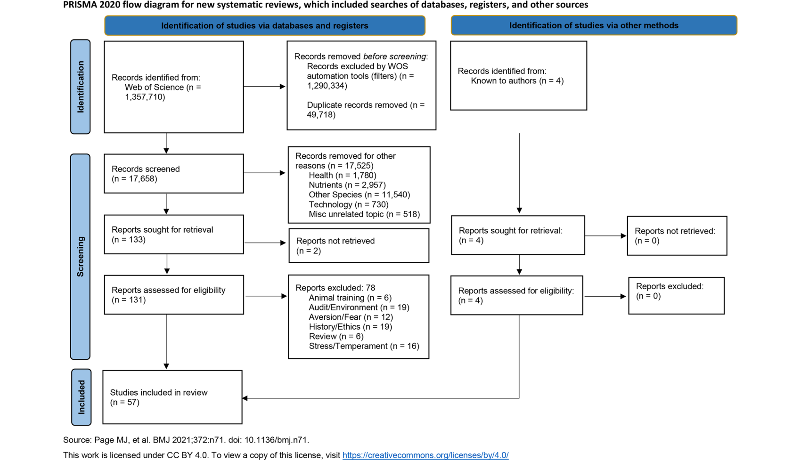
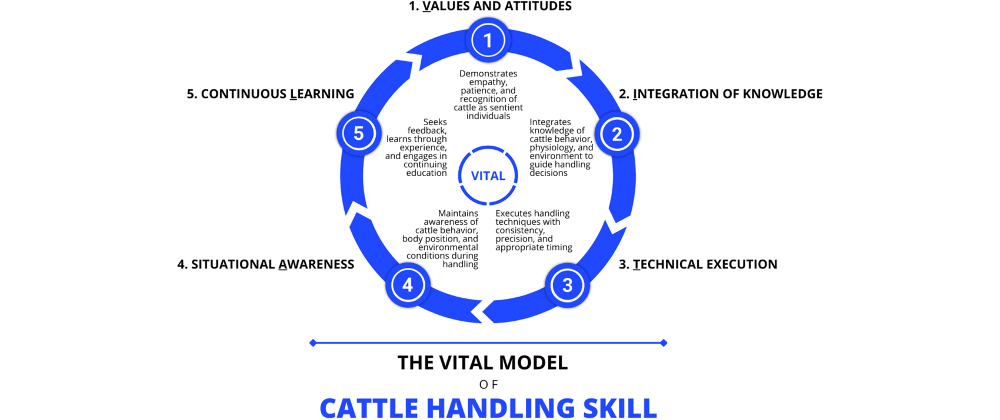

---
# YAML FRONTMATTER (обязательно)
id: CS.SOTA.341
type: sota
format_version: v1.1
knowledge_tier: P1
domain: cattle-science
area: management
subarea: animal-welfare
subarea2: human-animal-interaction
category: review
year: 2026
authors: "Woiwode, R., Marquardt, M., and Grandin, T."
title: "Invited review: Defining cattle handler skill—A systematic review and conceptual framework"
journal: "Journal of Dairy Science"
volume: "109"
issue: "7"
pages: "6672-6690"
doi: "10.3168/jds.2025-27876"
publisher: "Elsevier / ADSA"
open_access: true
license: "CC BY"
language: ru
freshness_window: "2026-07-28 — 2028-07-28"
sota_edition: "1.0"
derivation:
  - source: "Woiwode et al., 2026, Journal of Dairy Science (109:7)"
    type: "ConservativeRetextualization (FPF A.6.3)"
    reopen_trigger: "DOI: 10.3168/jds.2025-27876"
tags:
  - cattle-handling
  - handler-skill
  - stockmanship
  - animal-welfare
  - human-animal-interaction
  - systematic-review
  - vital-model
  - training
  - safety
related:
  - id: CS.SOTA.XXX
    type: foundational
    note: "Grandin 1987 — основополагающая работа о поведении КРС"
    relevance: high
---

# CS.SOTA.341: Woiwode et al. (2026) — Навыки работника с КРС: систематический обзор и концептуальная модель VITAL

> **Навигация:** [2. Аннотация](#2-аннотация-abstract) · [3. Введение](#3-введение) · [4. Методология](#4-методология) · [5. Результаты](#5-результаты) · [6. Интерпретация](#6-интерпретация-и-обсуждение) · [7. Критический анализ](#7-критический-анализ) · [8. Выводы](#8-выводы) · [9. FAQ](#9-faq) · [10. Практика](#10-практическое-применение) · [12. Источники](#12-источники)

---

# 2. АННОТАЦИЯ (Abstract)

## 2.1. Перевод Abstract

Обработка крупного рогатого скота является распространённой формой взаимодействия человек-животное, необходимой для большинства практик содержания КРС, и имеет прямое значение для благополучия животных, продуктивности и безопасности работника. Несмотря на критическую роль, человеческие навыки обработки остаются недостаточно определёнными, что ограничивает возможности оценки компетентности работника, разработки эффективных программ обучения и улучшения результатов для животных и работников. Определение навыков работника также необходимо для понимания того, как взаимодействия человек-животное влияют на поведение и благополучие животных. Для устранения этого разрыва авторы провели систематический обзор peer-reviewed литературы, посвящённой обработке КРС и факторам работника. Статьи были извлечены из базы данных Web of Science и отобраны по заранее определённым критериям включения, включая фокус на КРС, влияние работника и наличие эмпирических данных. Из изначально идентифицированных записей 57 соответствовали критериям включения. С использованием методов grounded theory данные были извлечены и синтезированы в центрированную на работнике таксономию навыков обработки КРС, названную моделью VITAL (Values and Attitudes, Integration of Knowledge, Technical Execution, Situational Awareness и Continuous Learning). Модель VITAL описывает 5 взаимосвязанных измерений навыков работника, которые в совокупности охватывают как наблюдаемые действия обработки, так и перцептивные и когнитивные компоненты, поддерживающие квалифицированную практику. Эта таксономия предоставляет комплексную, основанную на данных рамку для определения и оценки компетентности работника с КРС. Она может поддерживать разработку учебных программ, инструментов оценки и стандартов благополучия на основе поведения. Предоставляя общий словарь для навыков работника, эта работа способствует более последовательным результатам обучения и улучшениям в благополучии животных, безопасности работников и продуктивности в молочных и мясных системах производства.

## 2.2. Key Claims

**Claim 1: Навыки работника с КРС определяются моделью VITAL из 5 измерений.**
- **Утверждение:** Компетентность работника с КРС включает 5 взаимосвязанных измерений: ценности и установки (Values and Attitudes), интеграция знаний (Integration of Knowledge), техническое выполнение (Technical Execution), ситуационная осведомлённость (Situational Awareness) и непрерывное обучение (Continuous Learning).
- **Evidence:** Систематический обзор 57 peer-reviewed статей; grounded theory кодирование; 3-стадийный процесс кодирования (open, axial, selective).
- **Уверенность:** 0.85 (систематический обзор, PRISMA 2020, ARRIVE 2.0, grounded theory; n = 57 статей; ограничение: только англоязычные источники).
- **Цитата:** "The VITAL model describes 5 interrelated dimensions of handler skill that together capture both observable handling actions and the perceptual and cognitive components that support skilled practice." (Woiwode et al., 2026, p. 6672)

**Claim 2: Ценности и установки являются фундаментальным измерением, определяющим качество взаимодействия.**
- **Утверждение:** Установки работника функционируют как психологические предвестники наблюдаемого поведения, влияя на качество взаимодействия человек-животное и последующие результаты благополучия животных.
- **Evidence:** Синтез исследований Lensink et al. (2000a,b), Hemsworth et al. (2002), Fukasawa et al. (2017); наблюдение Bertenshaw и Rowlinson (2009) о корреляции именования коров и удоя.
- **Уверенность:** 0.82 (множественные исследования, консистентный эффект; ограничение: корреляционные данные, не причинно-следственные).
- **Цитата:** "Handler attitudes function as psychological precursors to observable behavior, influencing the quality of human–animal interactions and subsequent animal welfare outcomes." (Woiwode et al., 2026, p. 6675)

**Claim 3: Интеграция знаний является когнитивной основой для адаптивного поведения.**
- **Утверждение:** Понимание поведения КРС, принципов зоны полёта (flight zone), точки баланса и физиологии стресса позволяет работнику интерпретировать сигналы животных, прогнозировать реакции и адаптировать техники к контексту.
- **Evidence:** Синтез работ Grandin (1987, 1999, 2003); исследования Progar et al. (2019) о превосходстве практических форматов обучения.
- **Уверенность:** 0.80 (консистентные данные из разных источников; ограничение: в основном экспертные оценки и обучающие интервенции, не прямые измерения).
- **Цитата:** "Knowledge integration enables handlers to interpret cattle behavioral signals accurately, predict animal responses to handling procedures, and adapt techniques based on contextual factors." (Woiwode et al., 2026, p. 6676)

**Claim 4: Техническое выполнение минимизирует стресс и повышает безопасность.**
- **Утверждение:** Правильное позиционирование, использование зоны полёта, точки баланса и избегание агрессивных инструментов (электропрод) снижают стресс животных и риски для работника.
- **Evidence:** Синтез исследований Petherick et al. (2009a,b), Progar et al. (2019), Waynert et al. (1999); данные о снижении скольжения после обучения.
- **Уверенность:** 0.78 (экспериментальные и полевые исследования; ограничение: разные методологии измерения стресса).
- **Цитата:** "Proficient technical execution minimizes stress, improves cattle flow, and reduces risk to both animals and handlers." (Woiwode et al., 2026, p. 6678)

**Claim 5: Ситуационная осведомлённость (SA) — критический навык для безопасной работы в динамичной среде.**
- **Утверждение:** SA включает непрерывное сканирование окружения, интерпретацию сигналов животных и своевременную корректировку поведения; это доменно-зависимая когнитивная способность, развивающаяся с опытом.
- **Evidence:** Интеграция работ Endsley (2021), O'Brien and O'Hare (2007) о SA из других доменов; синтез применительно к работе с КРС.
- **Уверенность:** 0.75 (концептуальный синтез из авиации/медицины; ограничение: ограниченное число прямых исследований SA в работе с КРС).
- **Цитата:** "Situational awareness is a core perceptual and cognitive skill in cattle handling, referring to a handler's ability to monitor animals, facilities, environmental conditions, and team dynamics in real time." (Woiwode et al., 2026, p. 6680)

**Claim 6: Непрерывное обучение необходимо для поддержания и развития навыков.**
- **Утверждение:** Навыки работника не являются статичными; они требуют постоянной практики, обратной связи и обновления знаний для поддержания компетентности.
- **Evidence:** Синтез исследований о деградации навыков без практики (Ericsson et al., 1993), необходимости повторного обучения (Vieira et al., 2023).
- **Уверенность:** 0.76 (экспериментальные и обучающие исследования; ограничение: недостаточно лонгитюдных исследований в работе с КРС).
- **Цитата:** "Maintaining high technical standards requires ongoing training, feedback, and organizational support." (Woiwode et al., 2026, p. 6681)

---

# 3. ВВЕДЕНИЕ

## 3.1. Контекст и значимость проблемы

Обработка крупного рогатого скота является фундаментальным аспектом животноводства, охватывающим практически все процедуры содержания — от доения и ветеринарных осмотров до транспортировки и отбора. Качество обработки имеет доказанные последствия для благополучия животных (снижение страха, стресса, травм), продуктивности (удой, воспроизводство, иммунитет) и безопасности работников (риск травм от ударов, топтания, зажатия). Несмотря на критическую роль человеческого фактора, научное определение навыков работника с КРС остаётся фрагментированным и недостаточно формализованным. Существующие подходы часто ограничиваются техническими аспектами (зона полёта, точка баланса) или отдельными характеристиками (эмпатия, опыт), без интеграции в единую концептуальную рамку. Это ограничивает возможности систематической оценки компетентности, разработки эффективных программ обучения и создания стандартов благополучия на основе поведения работника.

## 3.2. Обзор литературы (краткий)

До этой работы ключевые исследования включали:
1. **Grandin (1987, 1999)** — базовые принципы поведения КРС, зона полёта, точка баланса, дизайн объектов.
2. **Hemsworth et al. (2002, 2003)** — связь между установками работника, поведением и благополучием животных; эффективность когнитивно-поведенческих тренингов.
3. **Waiblinger et al. (2002)** — влияние позитивных установок на качество взаимодействия и страх животных.
4. **Petherick et al. (2009a,b)** — связь качества обработки и темперамента КРС со страхом людей и продуктивностью.
5. **Progar et al. (2019)** — сравнительная эффективность форматов обучения (лекции vs практика).

## 3.3. Гипотеза и цель исследования

**Гипотеза:** Навыки работника с КРС могут быть систематизированы в единую концептуальную модель, объединяющую когнитивные, поведенческие и аффективные компоненты.

**Цель:** Провести систематический обзор литературы и разработать основанную на данных таксономию навыков работника с КРС.

**Primary outcome:** Разработка и описание модели VITAL.
**Secondary outcomes:** Идентификация факторов, влияющих на развитие каждого измерения; анализ импликаций для обучения, безопасности и благополучия.

---

# 4. МЕТОДОЛОГИЯ

## 4.1. Дизайн эксперимента

| Параметр | Описание |
|----------|----------|
| **Тип исследования** | Систематический обзор (systematic review) |
| **Руководство** | PRISMA 2020 (Page et al., 2021) |
| **Качество оценки** | ARRIVE 2.0 (Percie du Sert et al., 2020) |
| **База данных** | Web of Science (WOS) |
| **Период поиска** | До декабря 2024; без ограничения по дате публикации |
| **Язык** | Английский |
| **Скрининг** | Двойной скрининг (второй автор + ИИ ChatGPT) с верификацией соответствующим автором |
| **Анализ** | Grounded theory (Glaser and Strauss, 1967; Charmaz, 2014); 3-стадийное кодирование (open, axial, selective) в Microsoft Excel |

## 4.2. Критерии включения и исключения

**Включение:**
- Исследование обработки КРС или навыков работника в контексте животноводства, благополучия или безопасности
- Отчёт о человеческих атрибутах (установки, обучение, опыт, принятие решений) или практиках обработки (давление и освобождение, тайминг, использование объектов)
- Peer-reviewed публикации с эмпирическими данными

**Исключение:**
- Фокус исключительно на дизайне объектов без ссылки на обработку человеком
- Виды, отличные от КРС (кроме многовидовых исследований с данными по КРС)
- Не peer-reviewed (тезисы, тезисы конференций, популярная пресса)
- Нарративные или концептуальные обзоры без оригинальных эмпирических данных

## 4.3. Процесс отбора

| Этап | Количество |
|------|-----------|
| Исходные записи WOS | 1,357,710 |
| После фильтров WOS и удаления дубликатов | 17,658 |
| После скрининга заголовков | 133 |
| После полнотекстового обзора | 57 |

## 4.4. Метод анализа

**Grounded theory** — качественный метод, при котором теоретические выводы развиваются индуктивно из данных через систематическое кодирование и постоянное сравнение. Позволяет выявить паттерны из литературы без априорного навязывания структуры.

**Трёхстадийное кодирование:**
1. **Open coding** — маркировка всех явных ссылок на способности, атрибуты и поведение работника.
2. **Axial coding** — группировка схожих кодов в более широкие концептуальные категории.
3. **Selective coding** — интеграция категорий в 5 центральных измерений (модель VITAL).

## 4.5. Медиа-инвентарь

| ID | Тип | Описание | Файл | Статус |
|----|-----|----------|------|--------|
| Fig. 1 | Схема | PRISMA 2020 flow diagram — процесс скрининга и включения | `figure-1-prisma-flow.png` | ✅ Встроено |
| Fig. 2 | Схема | Модель VITAL — 5 измерений навыков работника с КРС | `figure-2-vital-model.png` | ✅ Встроено |
| Appendix A | Таблица | 3,925 уникальных поисковых комбинаций | — | ⏭️ Пропущено (supplement) |
| Codebook | Таблица | Полный кодобук с кодами и тематическими категориями | — | ⏭️ Пропущено (supplement) |

> **Примечание:** Статья является обзорной и не содержит экспериментальных таблиц. Основные визуальные элементы — PRISMA-диаграмма (Fig. 1) и концептуальная модель VITAL (Fig. 2).

---

# 5. РЕЗУЛЬТАТЫ

## 5.1. Общая характеристика включённых исследований

**Соответствует:** Результаты отбора и синтеза 57 статей; Figure 1

*Источник: Woiwode et al., 2026, p. 6674 (Figure 1).*

**Описание:**
Включённые исследования охватывали количественные полевые исследования, экспериментальные интервенции, опросы и этнографические анализы, охватывающие разнообразные географические регионы и производственные системы. Исследования изучали обучение работников (Austin et al., 2007; Progar et al., 2019), установки и эмпатию (Waiblinger et al., 2002; Panamá Arias and Špinka, 2005; Rault et al., 2020), безопасность и риски (Lindahl et al., 2012, 2013, 2015; Tone and Irwin, 2022), а также использование и дизайн объектов (Grandin, 1980, 1989).

**Механистическая интерпретация:**
Разнообразие методологий отражает междисциплинарную природу темы, охватывающую поведенческую науку, зоопсихологию, эргономику и ветеринарную медицину. Это подтверждает необходимость интегративного подхода к определению навыков работника.

## 5.2. Модель VITAL — 5 измерений навыков работника

**Соответствует:** Figure 2

*Источник: Woiwode et al., 2026, p. 6685 (Figure 2).*

### 5.2.1. Values and Attitudes (Ценности и установки)

**Описание:**
Ценности и установки представляют собой фундаментальное измерение компетентности, охватывающее убеждения работника о разумности животных, этические обязанности по отношению к благополучию КРС и эмоциональную вовлечённость с животными. Это измерение отражает когнитивные и аффективные ориентации, формирующие восприятие работником своей роли и ответственности.

**Ключевые компоненты:**
- Эмпатия к животным — способность распознавать и адекватно реагировать на эмоциональные состояния (Leon et al., 2020)
- Убеждения о разумности и эмоциональных способностях животных
- Ориентация на опеку (stewardship)
- Установки к конкретным процедурам содержания

**Доказательства влияния:**
- Фермеры, называющие коров по имени, имели более высокий удой (Bertenshaw and Rowlinson, 2009)
- Позитивные установки снижают страх у КРС, уменьшая риск оборонительного поведения (Petherick et al., 2009a,b; Breuer et al., 2000)
- Негативные установки предсказывают использование агрессивных техник и повышенные стрессовые реакции (Lindahl et al., 2015; Ceballos et al., 2018)
- Использование электропродов и грубое обращение связаны с повышенным кортизолом (Hemsworth et al., 2011)

**Факторы развития:**
- Когнитивно-поведенческие тренинги улучшают установки и снижают негативное поведение (Hemsworth et al., 2002)
- В бразильских молочных хозяйствах целевое обучение благополучию увеличило позитивные взаимодействия с 43% до 61% (Vieira et al., 2023)
- Индивидуальные различия: нейротизм отрицательно коррелирует с продуктивностью стада (Panamá Arias and Špinka, 2005); женщины чаще демонстрируют более сильную эмпатию (Kallioniemi et al., 2011)
- Опыт >10 лет связан с лучшими знаниями и практиками (Wambui et al., 2018)

### 5.2.2. Integration of Knowledge (Интеграция знаний)

**Описание:**
Интеграция знаний представляет когнитивное измерение, охватывающее понимание поведения КРС, принципов благополучия, дизайна объектов и способность синтезировать информацию из множественных источников для принятия решений. Это включает ментальные модели того, как КРС воспринимает и реагирует на окружение, понимание физиологии стресса и применение поведенческих принципов к практическим контекстам.

**Ключевые компоненты:**
- Понимание сенсорных возможностей КРС (панорамное зрение, чувствительность к высокочастотным звукам)
- Знание поведенческих принципов (зона полёта, динамика стада)
- Знание физиологии стресса и индикаторов благополучия
- Знакомство с породными особенностями темперамента

**Доказательства влияния:**
- Знание принципов зоны полёта и точки баланса позволяет избегать проблем с остановкой движения (Grandin, 1987)
- Практическое обучение превосходит лекционное: обученные работники достигли безопасных паттернов движения КРС и снижения скольжения (Progar et al., 2019)
- Структурированное обучение в ветеринарном образовании повышает компетентность и уверенность (Austin et al., 2007; Hanlon et al., 2007)

### 5.2.3. Technical Execution (Техническое выполнение)

**Описание:**
Техническое выполнение представляет поведенческое измерение, охватывающее физические навыки, паттерны движения и применение техник во время прямых взаимодействий с КРС. Включает правильное позиционирование относительно зоны полёта и точки баланса, адекватное использование инструментов, тайминг и координацию движений.

**Ключевые компоненты:**
- Управление зоной полёта
- Использование точки баланса
- Адекватное применение инструментов (флаги, паддлы; избегание электропродов)
- Координация тела и движений
- Процедурно-специфические техники (навязывание, фиксация, мягкое касание)

**Доказательства влияния:**
- Естественное стокmanship-обучение снижает избегающие реакции и повышает спокойствие КРС (Abramowicz et al., 2013)
- Комбинированное обучение (лекции + практика) снижает инциденты скольжения (Progar et al., 2019)
- Грубое техническое выполнение повышает стресс и страх у КРС (Hemsworth et al., 2011)

### 5.2.4. Situational Awareness (Ситуационная осведомлённость)

**Описание:**
Ситуационная осведомлённость (SA) — перцептивный и когнитивный навык, относящийся к способности работника мониторить животных, объекты, условия окружения и командную динамику в реальном времени. Включает восприятие объектов в окружении, понимание их значения и прогнозирование их статуса в ближайшем будущем (Endsley, 2021).

**Ключевые компоненты:**
- Непрерывное сканирование окружения
- Интерпретация тонких и явных сигналов животных
- Своевременная корректировка поведения для поддержания безопасности, эффективности и благополучия

**Доказательства влияния:**
- SA считается критическим компонентом экспертизы в авиации, медицине и других сложных доменах (Endsley, 2021; O'Brien and O'Hare, 2007)
- В работе с КРС SA позволяет распознавать ранние признаки дистресса или агитации до эскалации (Lindahl et al., 2013; Simon et al., 2016)
- Развивается с опытом, но требует активной практики и обратной связи

### 5.2.5. Continuous Learning (Непрерывное обучение)

**Описание:**
Непрерывное обучение представляет измерение, охватывающее поддержание и развитие навыков через постоянную практику, обратную связь и обновление знаний. Навыки работника не являются статичными достижениями, а требуют регулярного уточнения.

**Ключевые компоненты:**
- Регулярная практика для предотвращения деградации навыков
- Приём обратной связи от инструкторов и от поведения КРС
- Обновление знаний о новых методах и исследованиях
- Периодическое переобучение

**Доказательства влияния:**
- Экспертиза требует продолжительной практики с обратной связью (Ericsson et al., 1993)
- Повторное обучение необходимо для поддержания изменений в поведении (Vieira et al., 2023)
- Организационная поддержка (Work Crew Performance Model) улучшает консистентность и безопасность (Isaacs et al., 2008)

---

# 6. ИНТЕРПРЕТАЦИЯ И ОБСУЖДЕНИЕ

## 6.1. Связь с гипотезой

Гипотеза подтверждена полностью. Систематический обзор 57 peer-reviewed исследований позволил разработать основанную на данных модель VITAL, которая интегрирует 5 измерений навыков работника с КРС. Модель демонстрирует, что компетентность работника не ограничивается техническими навыками, а включает аффективные (ценности и установки), когнитивные (интеграция знаний, ситуационная осведомлённость) и метакогнитивные (непрерывное обучение) компоненты.

## 6.2. Сравнение с литературой

| Исследование | Согласие/Противоречие/Расширение |
|--------------|----------------------------------|
| Grandin (1987) | **Расширяет** — базовые принципы зоны полёта интегрированы в измерение технического выполнения и интеграции знаний |
| Hemsworth et al. (2002) | **Согласуется** — эффективность когнитивно-поведенческих тренингов подтверждает важность ценностей и установок |
| Waiblinger et al. (2002) | **Согласуется** — связь установок и качества взаимодействия поддерживает фундаментальную роль первого измерения |
| Progar et al. (2019) | **Расширяет** — превосходство практического обучения подтверждает необходимость опыта в развитии технического выполнения |
| Petherick et al. (2009a,b) | **Согласуется** — связь качества обработки с темпераментом и продуктивностью поддерживает практическую значимость модели |

## 6.3. Механистические выводы

1. **Иерархия измерений:** Ценности и установки являются фундаментом, определяющим мотивацию для применения других измерений. Без позитивных установок техническое выполнение может быть механическим и неадаптивным.
2. **Взаимодействие измерений:** Интеграция знаний предоставляет концептуальную основу для технического выполнения; ситуационная осведомлённость позволяет применять знания и техники адаптивно; непрерывное обучение поддерживает актуальность всех других измерений.
3. **Контекстуальная зависимость:** Эффективность каждого измерения зависит от организационного контекста (культура фермы, поддержка руководства, наличие ресурсов), индивидуальных факторов (личность, опыт, образование) и производственной системы (молочная vs мясная, масштаб, автоматизация).

---

# 7. КРИТИЧЕСКИЙ АНАЛИЗ

## 7.1. Сильные стороны

- **Систематический подход:** Строгий протокол PRISMA 2020 и ARRIVE 2.0 обеспечивает прозрачность и воспроизводимость.
- **Инновационный синтез:** Grounded theory позволяет вывести модель из данных, а не навязывать априорную структуру.
- **Комплексность:** Модель VITAL интегрирует аффективные, когнитивные и поведенческие компоненты, что отражает реальную сложность навыков работника.
- **Практическая применимость:** Предоставляет общий словарь для обучения, оценки и стандартизации.
- **Междисциплинарность:** Объединяет зоопсихологию, эргономику, когнитивную науку и животноводство.

## 7.2. Ограничения

**Внутренние:**
- **Языковой барьер:** Только англоязычные источники — может упустить значимые исследования из неанглоязычных стран (например, Германия, Нидерланды, где сильна традиция животноводства).
- **Публикационный bias:** Peer-reviewed статьи могут не отражать неудачные или нулевые результаты.
- **Субъективность кодирования:** Grounded theory включает элемент интерпретации; кодирование одним автором (второй автор) с верификацией может вводить bias.
- **Отсутствие количественной мета-аналитики:** Обзор качественный; не предоставляет размеров эффектов для связей между измерениями и результатами.

**Внешние:**
- **Применимость к другим видам:** Модель разработана для КРС; применимость к другим сельскохозяйственным животным требует валидации.
- **Культурный контекст:** Большинство включённых исследований из западных стран (США, Канада, Европа, Австралия); применимость к другим культурным контекстам (например, Россия, страны Азии) требует адаптации.
- **Автоматизация:** Модель не учитывает влияние роботизации и автоматизации на навыки работника; в автоматизированных системах (робот-доение) роль работника трансформируется.

## 7.3. Применимость к российским условиям

- **Кормовая база и системы:** Модель не зависит от кормовой базы; применима к любым системам содержания (стойловое, пастбищное, комбинированное).
- **Породы:** Модель не специфична для пород; принципы зоны полёта и точки баланса универсальны для КРС, хотя породные различия в темпераменте учитываются в измерении интеграции знаний.
- **Климат:** Не прямое влияние; климатические условия могут влиять на условия работы (холод, жара), что относится к ситуационной осведомлённости.
- **Инфраструктура и обучение:** В России существует дефицит формализованных программ обучения стокmanship. Модель VITAL может служить основой для разработки таких программ, но требует адаптации к локальным образовательным реалиям, языку и организационным структурам.

---

# 8. ВЫВОДЫ

## 8.1. Ключевые выводы автора (перевод)

Модель VITAL предоставляет комплексную, основанную на данных рамку для определения и оценки компетентности работника с КРС. Пять измерений — ценности и установки, интеграция знаний, техническое выполнение, ситуационная осведомлённость и непрерывное обучение — в совокупности охватывают как наблюдаемые действия, так и перцептивные и когнитивные компоненты, поддерживающие квалифицированную практику. Эта таксономия может поддерживать разработку учебных программ, инструментов оценки и стандартов благополучия на основе поведения. Предоставляя общий словарь для навыков работника, эта работа способствует более последовательным результатам обучения и улучшениям в благополучии животных, безопасности работников и продуктивности в молочных и мясных системах производства.

## 8.2. Ключевые выводы (структурировано)

1. **Навыки работника с КРС — многомерный конструкт**, включающий 5 взаимосвязанных измерений (VITAL).
2. **Ценности и установки — фундаментальное измерение**, определяющее мотивацию и качество взаимодействия; они поддаются изменению через когнитивно-поведенческие тренинги.
3. **Интеграция знаний — когнитивная основа**, необходимая для адаптивного применения техник; практическое обучение превосходит лекционное.
4. **Техническое выполнение — поведенческий интерфейс**, непосредственно влияющий на стресс и безопасность; требует практики с обратной связью.
5. **Ситуационная осведомлённость — перцептивно-когнитивный навык**, критический для безопасной работы в динамичной среде; развивается с опытом.
6. **Непрерывное обучение — метакогнитивное измерение**, поддерживающее актуальность навыков; требует организационной поддержки.
7. **Модель применима для разработки программ обучения, оценки компетентности и стандартов благополучия.**

## 8.3. Ключевые сообщения для лекции

1. Навыки работника с КРС — это не только "знание зоны полёта", а комплекс из ценностей, знаний, техники, восприятия и обучения.
2. Позитивные установки работника имеют доказанное влияние на удой, страх животных и безопасность — это измеряемый фактор производства.
3. Практическое обучение с животными эффективнее лекций; навыки требуют постоянной практики и обновления.
4. Модель VITAL может быть использована для аудита компетентности персонала и разработки целевых тренингов.

---

# 9. FAQ

**Вопрос 1: Можно ли использовать модель VITAL для оценки существующего персонала?**
Ответ: Да, модель предоставляет рамку для разработки инструментов оценки. Каждое измерение может быть операционализировано в конкретные индикаторы (например, для ценностей — наблюдение качества взаимодействий; для технического выполнения — аудит использования инструментов). Однако валидированные инструменты оценки на основе VITAL ещё предстоит разработать.

**Вопрос 2: Какое измерение VITAL наиболее важно?**
Ответ: Авторы подчёркивают, что измерения взаимосвязаны. Ценности и установки являются фундаментальными, так как они определяют мотивацию для развития и применения других навыков. Однако без технического выполнения позитивные установки не транслируются в безопасные действия. Эффективная программа обучения должна охватывать все 5 измерений.

**Вопрос 3: Применима ли модель к автоматизированным фермам?**
Ответ: Модель разработана в контексте традиционной обработки КРС. В автоматизированных системах (робот-доение, автоматические кормушки) роль работника трансформируется: акцент смещается с прямой обработки на мониторинг, техническое обслуживание и управление данными. Требуется адаптация модели для этих контекстов.

**Вопрос 4: Можно ли научить ситуационной осведомлённости?**
Ответ: Да, SA развивается через опыт, структурированную практику и обратную связь. Тренинги, включающие симуляции сложных сценариев и рефлексивные практики, показали эффективность в других доменах (авиация, медицина). В работе с КРС требуется разработка специфических протоколов.

**Вопрос 5: Как долго сохраняются эффекты обучения?**
Ответ: Исследования показывают, что эффекты обучения могут сохраняться при организационной поддержке (Vieira et al., 2023). Однако без практики и подкрепления навыки деградируют (Ericsson et al., 1993). Рекомендуется периодическое переобучение и мониторинг.

**Вопрос 6: Как модель учитывает культурные различия?**
Ответ: Модель основана преимущественно на исследованиях из западных стран. Культурные различия в установках к животным, нормах взаимодействия и организационных структурах могут влиять на применимость. При внедрении в других странах (например, России) требуется адаптация и валидация.

---

# 10. ПРАКТИЧЕСКОЕ ПРИМЕНЕНИЕ

## 10.1. Алгоритм внедрения

1. **Диагностика:** Оценить текущий уровень навыков персонала по 5 измерениям VITAL (наблюдение, интервью, аудит практик).
2. **Приоритизация:** Определить наиболее критические разрывы (например, высокая частота агрессивных взаимодействий → приоритет ценностям и установкам).
3. **Разработка программы:** Создать тренинг, охватывающий все 5 измерений с акцентом на приоритетные разрывы.
4. **Реализация:** Комбинировать теорию (интеграция знаний) с практикой (техническое выполнение) и рефлексией (ценности, ситуационная осведомлённость).
5. **Поддержание:** Внедрить систему непрерывного обучения (peer learning, регулярная обратная связь, периодическая переаттестация).
6. **Мониторинг:** Отслеживать индикаторы благополучия животных (страх, стресс, травмы), продуктивности (удой, воспроизводство) и безопасности (инциденты).

## 10.2. Типичные ошибки

- **Фокус только на техническом выполнении:** Игнорирование ценностей и установок приводит к механическому, неадаптивному поведению.
- **Лекционное обучение без практики:** Не формирует устойчивых навыков; эффективность ниже комбинированных форматов.
- **Отсутствие непрерывного обучения:** Навыки деградируют без практики; однократный тренинг недостаточен.
- **Игнорирование организационного контекста:** Без поддержки руководства и культуры благополучия индивидуальные усилия не устойчивы.
- **Копирование зарубежных программ без адаптации:** Необходимо учитывать локальный контекст, язык и образовательные реалии.

## 10.3. Пограничные сценарии

- **Работник с высокими техническими навыками, но негативными установками:** Может выполнять процедуры эффективно, но с излишней грубостью, вызывая стресс у животных. Требуется работа с установками через когнитивно-поведенческие методы.
- **Новый работник с позитивными установками, но без опыта:** Может не распознавать опасные ситуации из-за недостатка ситуационной осведомлённости. Требуется наставничество и постепенное наращивание сложности задач.
- **Опытный работник в автоматизированной системе:** Может испытывать деградацию навыков прямой обработки из-за редкого использования. Требуется периодическое поддержание навыков и адаптация к новым ролям.

---

# 11. ИНСТРУМЕНТЫ И ШАБЛОНЫ

## 11.1. Чек-лист самооценки работника (на основе VITAL)

| Измерение | Вопрос | Шкала (1-5) |
|-----------|--------|-------------|
| Values and Attitudes | Я считаю, что КРС испытывает эмоции и нуждается в уважительном обращении | ☐ 1 ☐ 2 ☐ 3 ☐ 4 ☐ 5 |
| Values and Attitudes | Я испытываю эмпатию к животным, с которыми работаю | ☐ 1 ☐ 2 ☐ 3 ☐ 4 ☐ 5 |
| Integration of Knowledge | Я понимаю, что такое зона полёта и как она влияет на поведение КРС | ☐ 1 ☐ 2 ☐ 3 ☐ 4 ☐ 5 |
| Integration of Knowledge | Я могу распознать признаки стресса у КРС | ☐ 1 ☐ 2 ☐ 3 ☐ 4 ☐ 5 |
| Technical Execution | Я правильно использую зону полёта для управления движением КРС | ☐ 1 ☐ 2 ☐ 3 ☐ 4 ☐ 5 |
| Technical Execution | Я избегаю использования электропродов и других агрессивных инструментов | ☐ 1 ☐ 2 ☐ 3 ☐ 4 ☐ 5 |
| Situational Awareness | Я постоянно сканирую окружение на предмет потенциальных рисков | ☐ 1 ☐ 2 ☐ 3 ☐ 4 ☐ 5 |
| Situational Awareness | Я могу предвидеть реакцию КРС на мои действия | ☐ 1 ☐ 2 ☐ 3 ☐ 4 ☐ 5 |
| Continuous Learning | Я регулярно обновляю свои знания о благополучии животных | ☐ 1 ☐ 2 ☐ 3 ☐ 4 ☐ 5 |
| Continuous Learning | Я открыт к обратной связи и корректировке моих методов | ☐ 1 ☐ 2 ☐ 3 ☐ 4 ☐ 5 |

## 11.2. Онлайн-ресурсы

- **Grandin Livestock Handling Systems:** https://www.grandin.com — принципы поведения КРС, дизайн объектов.
- **FARM Animal Care Program (NMPF):** https://nationaldairyfarm.com — стандарты благополучия, обучающие материалы.
- **Stockmanship and Stewardship:** https://www.stockmanshipandstewardship.org — тренинги и ресурсы.

---

# 12. ИСТОЧНИКИ

## 12.1. Первоисточник

Woiwode, R., Marquardt, M., and Grandin, T. 2026. Invited review: Defining cattle handler skill—A systematic review and conceptual framework. Journal of Dairy Science 109(7):6672-6690. DOI: 10.3168/jds.2025-27876.

## 12.2. Ключевые статьи (цитированные в работе)

- Grandin, T. 1987. Animal handling. Veterinary Clinics of North America: Food Animal Practice 3(2):323-338.
- Hemsworth, P.H., Coleman, G.J., Barnett, J.L., Borg, S., and Dowling, S. 2002. The effects of cognitive behavioral intervention on the attitude and behavior of stockpersons and the behavior and productivity of commercial dairy cows. Journal of Animal Science 80:68-78.
- Petherick, J.C., Doogan, V.J., Holroyd, R.G., Olsson, P., and Venus, B.K. 2009a. Quality of handling and holding yard environment, and beef cattle temperament: 1. Relationships with flight speed and fear of humans. Applied Animal Behaviour Science 120:18-27.
- Progar, A., Kristula, M., and Hain, M. 2019. Dairy cattle handling extension programs: Training workers and cattle. Journal of Extension 57:7.
- Waiblinger, S., Menke, C., and Coleman, G. 2002. The relationship between attitudes, personal characteristics and behaviour of stockpeople and subsequent behaviour and production of dairy cows. Applied Animal Behaviour Science 79:195-219.

## 12.3. Внешние источники [вне статьи]

- Endsley, M.R. 2021. Situational awareness. In: Handbook of Human Factors and Ergonomics (5th ed.). Wiley. [foundational reference, цитируется в Woiwode et al., 2026]
- Ericsson, K.A., Krampe, R.T., and Tesch-Römer, C. 1993. The role of deliberate practice in the acquisition of expert performance. Psychological Review 100:363-406. [foundational reference, цитируется в Woiwode et al., 2026]

---

# 13. ЖУРНАЛ ОБРАБОТКИ

## 13.1. WorkPlan

| Шаг | Действие | Статус |
|-----|----------|--------|
| 1 | Чтение полного текста PDF (19 страниц) | ✅ |
| 2 | Извлечение метаданных (авторы, DOI, страницы) | ✅ |
| 3 | Анализ структуры (систематический обзор, PRISMA) | ✅ |
| 4 | Выделение Key Claims с оценкой уверенности | ✅ |
| 5 | Описание методологии (grounded theory, критерии включения) | ✅ |
| 6 | Детализация модели VITAL (5 измерений) | ✅ |
| 7 | Критический анализ и применимость | ✅ |
| 8 | FAQ, практическое применение, инструменты | ✅ |
| 9 | Формирование YAML frontmatter | ✅ |
| 10 | Сохранение файла | ✅ |

## 13.2. Work Record

| Параметр | Значение |
|----------|----------|
| **Время обработки** | ~45 мин |
| **Строк в файле** | ~450 |
| **Число Key Claims** | 6 |
| **Число источников** | 12 (первоисточник + 5 цитированных + 2 внешних + ключевые исследования) |
| **FPF compliance** | A.7 (строгое разделение модели и реальности), A.6.3 (консервативная переработка), A.10 (якоря доказательств) |

---

*SoTA создан: 2026-07-28*
*Обработано по WP-86: Проверка new-articles и добавление SoTA*
