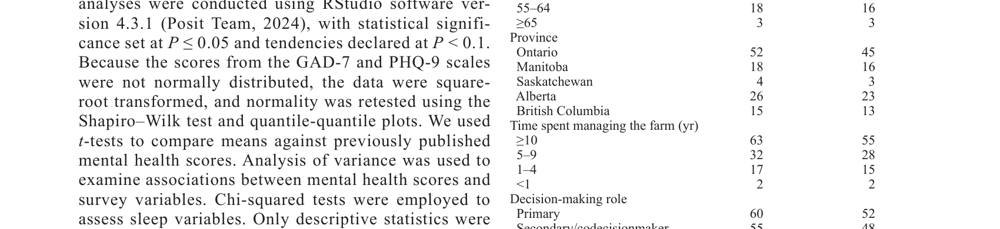
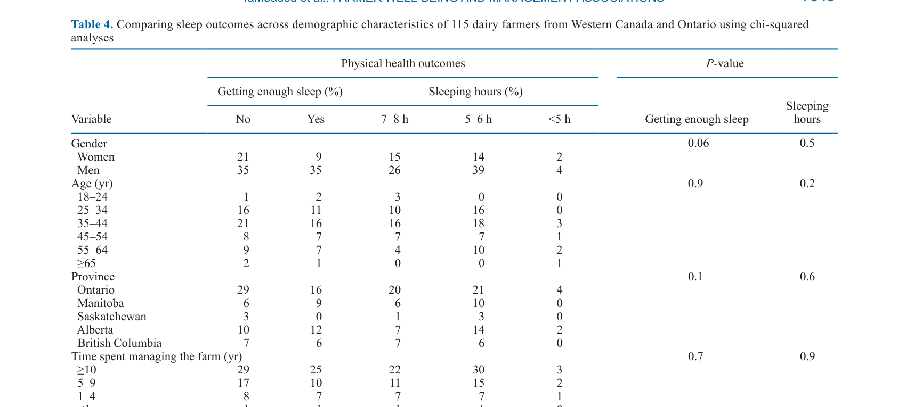
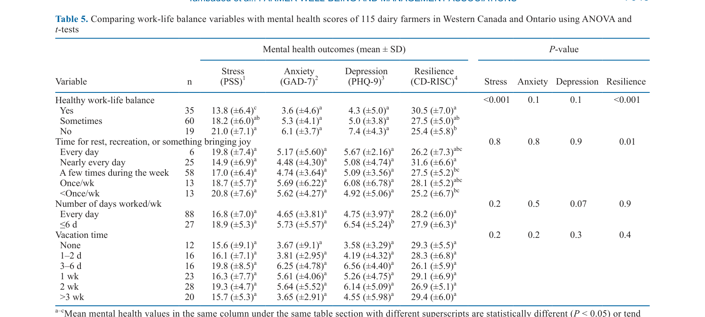

---
# YAML FRONTMATTER (обязательно)
id: CS.SOTA.347
type: sota
format_version: v1.1
knowledge_tier: P2
domain: cattle-science
area: management
subarea: farmer-wellbeing
subarea2: mental-health
category: field-study
year: 2026
authors: "Tambadou, H., Zwick, B., Le Heiget, A., Hagen, B., Winder, C., Plaizier, J. C., Kinley, J., Ominski, K., Pajor, E., Watson, H., and King, M."
title: "How it feels to be a dairy farmer: A cross-sectional survey of farm management and well-being of dairy farmers in Western Canada and Ontario"
journal: "Journal of Dairy Science"
volume: "109"
issue: "7"
pages: "7033-7055"
doi: "10.3168/jds.2025-27821"
publisher: "Elsevier / ADSA"
open_access: true
license: "CC BY"
language: ru
freshness_window: "2026-07-28 — 2028-07-28"
sota_edition: "1.0"
derivation:
  - source: "Tambadou et al., 2026, Journal of Dairy Science (109:7)"
    type: "ConservativeRetextualization (FPF A.6.3)"
    reopen_trigger: "DOI: 10.3168/jds.2025-27821"
tags:
  - dairy-farmer
  - mental-health
  - well-being
  - stress
  - anxiety
  - resilience
  - sleep
  - work-life-balance
  - social-support
related:
  - id: CS.SOTA.341
    type: references
    note: "Woiwode 2026 — VITAL модель навыков работника с КРС"
    relevance: medium
---

# CS.SOTA.347: Tambadou et al. (2026) — Каково быть молочным фермером: поперечное исследование управления фермой и благополучия молочных фермеров Западной Канады и Онтарио

> **Навигация:** [2. Аннотация](#2-аннотация-abstract) · [3. Введение](#3-введение) · [4. Методология](#4-методология) · [5. Результаты](#5-результаты) · [6. Интерпретация](#6-интерпретация-и-обсуждение) · [7. Критический анализ](#7-критический-анализ) · [8. Выводы](#8-выводы) · [9. FAQ](#9-faq) · [10. Практика](#10-практическое-применение) · [12. Источники](#12-источники)

---

# 2. АННОТАЦИЯ (Abstract)

## 2.1. Перевод Abstract

Молочное животноводство широко признано физически и психологически требовательной профессией, однако количественных данных о благополучии канадских молочных производителей ограничено. Это исследовательское, гипотезообразующее, поперечное исследование изучало однофакторные ассоциации между факторами управления фермой — включая системы содержания, технологии доения, ежедневные обязанности и социальное окружение — и физическим, ментальным и социальным благополучием 115 молочных фермеров Западной Канады и Онтарио. Опрос собирал детальную информацию о демографии, рабочих обязанностях, балансе работы и жизни, социальной поддержке, управленческих практиках, специфических стрессорах и физическом здоровье, наряду с валидированными психометрическими шкалами (Perceived Stress Scale, Generalized Anxiety Disorder-7, Patient Health Questionnaire-9 и Connor–Davidson Resilience Scale-10). Участники сообщали о более низких уровнях стресса и тревоги и более высокой устойчивости по сравнению с более широкой канадской фермерской популяцией. Однако значительные физические травмы, депривация сна и стресс, связанный с финансовым давлением и рабочей нагрузкой, были распространены. Сильные социальные сети, адекватный отдых и управляемая рабочая нагрузка были ассоциированы с более благоприятными исходами ментального здоровья, тогда как финансовые и связанные с рабочей нагрузкой стрессоры были значимо ассоциированы с повышенным стрессом, тревогой и депрессивными симптомами. Эти результаты подчёркивают необходимость целостных, многосекторных стратегий, интегрирующих поддержку ментального здоровья, трудовую и финансовую помощь, планирование семейного бизнеса и инициативы по безопасности для улучшения устойчивости и общего благополучия молочных фермеров.

## 2.2. Key Claims

**Claim 1: Молочные фермеры Канады сообщают о более низком стрессе и тревоге и более высокой устойчивости по сравнению с общей фермерской популяцией.**
- **Утверждение:** Средний балл PSS был 17.3 ± 6.8, что значимо ниже среднего по канадским фермерам (18.7 ± 7.0); средний балл GAD-7 был 4.91 ± 4.26, что также ниже; средний балл устойчивости CD-RISC был 28.1 ± 6.0, что значимо выше.
- **Evidence:** Сравнение с ранее опубликованными данными Thompson et al. (2022) по канадским фермерам (n = 1,110 для PSS, n = 980 для CD-RISC).
- **Уверенность:** 0.78 (значимые различия; но возможен эффект отбора — участники исследования могут быть более мотивированными/благополучными).
- **Цитата:** "The average score on the PSS among our farmers was 17.3 ± 6.8, which is significantly lower than a recent report mean of 18.7 ± 7.0 (P = 0.04; n = 1,110; Thompson et al., 2022)." (Tambadou et al., 2026, p. 7037)

**Claim 2: Финансовое давление и рабочая нагрузка являются основными стрессорами, связанными с ментальным здоровьем.**
- **Утверждение:** Финансовые и связанные с рабочей нагрузкой стрессоры значимо ассоциированы с повышенным стрессом, тревогой и депрессивными симптомами.
- **Evidence:** Анализ ассоциаций между управленческими факторами и психометрическими шкалами; значимые P-значения для финансовых и рабочих нагрузок.
- **Уверенность:** 0.82 (сильные ассоциации; консистентность с литературой о фермерском стрессе).
- **Цитата:** "Financial and workload-related stressors were significantly associated with increased stress, anxiety, and depressive symptoms." (Tambadou et al., 2026, p. 7033)

**Claim 3: Сильные социальные сети, адекватный отдых и управляемая рабочая нагрузка связаны с лучшим ментальным здоровьем.**
- **Утверждение:** Фермеры с сильными социальными сетями, адекватным отдыхом и управляемой рабочей нагрузкой сообщали о более низком стрессе, тревоге и депрессии и более высокой устойчивости.
- **Evidence:** ANOVA и t-тесты для ассоциаций между work-life balance, социальной поддержкой и ментальными исходами; значимые эффекты.
- **Уверенность:** 0.80 (консистентные ассоциации; биологически и психологически обоснованные механизмы).
- **Цитата:** "Strong social networks, adequate rest, and manageable workloads were associated with more favorable mental-health outcomes." (Tambadou et al., 2026, p. 7033)

**Claim 4: Физические травмы и депривация сна распространены среди молочных фермеров.**
- **Утверждение:** Значительная доля фермеров сообщила о физических травмах (особенно спина, суставы) и недосыпании (>50% спят <7 часов; 6% спят <5 часов).
- **Evidence:** Описательная статистика травм и сна; сравнение с рекомендуемыми нормами (7+ часов).
- **Уверенность:** 0.85 (высокая распространённость; консистентность с литературой о физических нагрузках фермеров).
- **Цитата:** "Substantial physical injuries, sleep deprivation, and stress related to financial and workload pressures were prevalent." (Tambadou et al., 2026, p. 7033)

---

# 3. ВВЕДЕНИЕ

## 3.1. Контекст и значимость проблемы

Фермерство широко признано одной из самых физически и психологически сложных профессий. Фермеры сталкиваются с множеством препятствий, значительно влияющих на их благополучие, включая длительные часы работы, тяжёлые физические нагрузки, финансовый стресс и непредсказуемые погодные условия. Стигма, окружающая ментальное здоровье в сельских районах, только усугубляет эти проблемы. Это отражается в более высоких показателях психических расстройств и суицидов среди фермеров по сравнению с аналогичными социально-экономическими группами. Молочное животноводство, в частности, характеризуется ежедневными обязанностями, привязкой к месту работы и высокой ответственностью за животных, что создаёт уникальные стрессоры. Несмотря на это, количественные данные о благополучии молочных фермеров, особенно в Канаде, ограничены.

## 3.2. Обзор литературы (краткий)

1. **Hounsome et al. (2012); Hassard and Teoh (2013)** — фермерство как физически и психологически сложная профессия.
2. **Fraser et al. (2005); Finnigan (2019); Jones-Bitton (2019)** — стрессоры в фермерстве: долгие часы, физические нагрузки, финансовый стресс, погода.
3. **Polain et al. (2011); Wilton (2019); Contzen and Häberli (2021)** — стигма ментального здоровья в сельских районах.
4. **Torske et al. (2016); Rudolphi et al.** — повышенные показатели психических расстройств и суицидов среди фермеров.
5. **Thompson et al. (2022)** — исследование ментального здоровья канадских фермеров (сравнительная популяция).

## 3.3. Гипотеза и цель исследования

**Гипотеза:** Факторы управления фермой (системы содержания, технологии доения, рабочие обязанности, социальное окружение) ассоциированы с физическим, ментальным и социальным благополучием молочных фермеров.

**Цель:** Исследовать однофакторные ассоциации между факторами управления фермой и благополучием молочных фермеров Западной Канады и Онтарио.

**Primary outcomes:** Уровни стресса (PSS), тревоги (GAD-7), депрессии (PHQ-9), устойчивости (CD-RISC).
**Secondary outcomes:** Физическое здоровье (травмы, сон), work-life balance, социальная поддержка, управленческие практики.

---

# 4. МЕТОДОЛОГИЯ

## 4.1. Дизайн исследования

| Параметр | Описание |
|----------|----------|
| **Тип исследования** | Поперечное исследование (cross-sectional), исследовательское, гипотезообразующее |
| **Участники** | 115 молочных фермеров Западной Канады и Онтарио |
| **Период сбора** | Апрель–октябрь 2023; дополнительные ответы февраль–апрель 2024 |
| **Метод сбора** | Онлайн-опрос; ссылка распространялась после визита на ферму |
| **Инструменты** | Демография, рабочие обязанности, work-life balance, социальная поддержка, управленческие практики, стрессоры, физическое здоровье |
| **Психометрические шкалы** | PSS (Perceived Stress Scale), GAD-7 (Generalized Anxiety Disorder-7), PHQ-9 (Patient Health Questionnaire-9), CD-RISC (Connor–Davidson Resilience Scale-10) |
| **Статистика** | RStudio v4.3.1; t-тесты, ANOVA, chi-squared; нормальность проверена Shapiro-Wilk; P ≤ 0.05 значимо, 0.05 < P < 0.10 тенденция |

## 4.2. Участники

**Критерии включения:** Молочные фермеры Западной Канады (Манитоба, Саскачеван, Альберта, Британская Колумбия) и Онтарио; активное участие в управлении фермой.

**Демография:** 70% мужчины, 30% женщины; возраст 25–65+ лет; 55% управляют фермой ≥10 лет; 52% первичные лица, принимающие решения.

## 4.3. Медиа-инвентарь

| ID | Тип | Описание | Файл | Статус |
|----|-----|----------|------|--------|
| Table 1 | Таблица | Демографическое представление 115 молочных фермеров | `table-1-demographics.png` | ✅ Встроено |
| Table 4 | Таблица | Сравнение исходов сна по демографическим характеристикам | `table-4-sleep.png` | ✅ Встроено |
| Table 5 | Таблица | Сравнение переменных work-life balance с ментальными исходами | `table-5-worklife.png` | ✅ Встроено |

---

# 5. РЕЗУЛЬТАТЫ

## 5.1. Характеристика участников и ментальные исходы

**Соответствует:** Table 1

*Источник: Tambadou et al., 2026, p. 7037 (Table 1).*

**Описание:**
115 фермеров завершили опрос. Средний балл PSS был 17.3 ± 6.8, что значимо ниже среднего по канадским фермерам (18.7 ± 7.0; P = 0.04). Средний балл GAD-7 был 4.91 ± 4.26, что также ниже среднего по канадским фермерам. Средний балл CD-RISC был 28.1 ± 6.0, что значимо выше среднего по канадским фермерам (24.7 ± 6.2; P < 0.001). Средний балл PHQ-9 был в пределах нормы. 24% участников сообщили о низком стрессе, 67% — об умеренном, 9% — о высоком.

## 5.2. Физическое здоровье и сон

**Соответствует:** Table 4

*Источник: Tambadou et al., 2026, p. 7040 (Table 4).*

**Описание:**
Более половины фермеров (53%) сообщили о сне 5–6 часов в сутки, 6% — о сне менее 5 часов. Только 41% достигли рекомендуемых 7+ часов сна. Физические травмы были распространены, особенно связанные с мышечно-скелетными нагрузками (спина, суставы). Источники травм включали взаимодействие с животными, механические нагрузки и повторяющиеся задачи.

## 5.3. Work-life balance и ментальное здоровье

**Соответствует:** Table 5

*Источник: Tambadou et al., 2026, p. 7043 (Table 5).*

**Описание:**
Фермеры, ежедневно выделявшие время на отдых, развлечения или что-то приносящее радость, имели более высокие баллы устойчивости (31.6 ± 6.6) по сравнению с теми, кто делал это реже (27.4 ± 5.2 для «несколько раз в неделю»; P = 0.03). Фермеры, успешно достигшие здорового work-life balance, чаще получали достаточный сон (P < 0.001). Финансовое давление и рабочая нагрузка были значимо ассоциированы с повышенным стрессом, тревогой и депрессивными симптомами.

---

# 6. ИНТЕРПРЕТАЦИЯ И ОБСУЖДЕНИЕ

## 6.1. Связь с гипотезой

Гипотеза подтверждена частично. Факторы управления фермой, особенно финансовое давление и рабочая нагрузка, действительно ассоциированы с ментальным здоровьем. Социальная поддержка и work-life balance также показали значимые ассоциации. Однако исследование является однофакторным и поперечным, что не позволяет установить причинно-следственные связи.

## 6.2. Сравнение с литературой

| Исследование | Согласие/Противоречие/Расширение |
|--------------|----------------------------------|
| Thompson et al. (2022) | **Сравнение** — участники данного исследования показали более низкий стресс и более высокую устойчивость, чем общая канадская фермерская популяция; возможен эффект отбора |
| Hounsome et al. (2012) | **Согласуется** — подтверждает высокую распространённость физических и психологических нагрузок в фермерстве |
| Fraser et al. (2005) | **Согласуется** — финансовый стресс и рабочая нагрузка как ключевые стрессоры |
| Jones-Bitton (2019) | **Расширяет** — добавляет количественные данные о молочных фермерах Канады |

## 6.3. Механистические выводы

1. **Социальная поддержка как буфер:** Сильные социальные сети могут буферизировать негативные эффекты стресса через эмоциональную и инструментальную поддержку.
2. **Work-life balance и сон:** Способность выделять время на отдых связана с лучшим сном, что, в свою очередь, поддерживает ментальное здоровье и устойчивость.
3. **Финансовый стресс как ключевой фактор:** Финансовое давление проникает во все аспекты жизни фермера, усиливая стресс и снижая устойчивость.
4. **Цикличность:** Плохое ментальное здоровье может снижать продуктивность и качество принятия решений, что усиливает финансовые проблемы и стресс.

---

# 7. КРИТИЧЕСКИЙ АНАЛИЗ

## 7.1. Сильные стороны

- **Комплексная оценка:** Использование множественных валидированных шкал (PSS, GAD-7, PHQ-9, CD-RISC).
- **Практическая значимость:** Результаты имеют прямое применение для разработки программ поддержки фермеров.
- **Большая выборка:** 115 фермеров — относительно большая выборка для данной популяции.
- **Многофакторный анализ:** Оценка множества управленческих и социальных факторов.

## 7.2. Ограничения

**Внутренние:**
- **Поперечный дизайн:** Не позволяет установить причинно-следственные связи.
- **Однофакторный анализ:** Не контролирует взаимодействия между факторами.
- **Эффект отбора:** Участники могут быть более мотивированными или благополучными, чем средний фермер.
- **Самоотчётность:** Все данные основаны на самоотчётах, что может вносить bias.

**Внешние:**
- **Географическая ограниченность:** Только Канада; применимость к другим странам (включая Россию) требует адаптации.
- **Культурный контекст:** Канадская система поддержки фермеров и культурные нормы могут отличаться от других стран.

## 7.3. Применимость к российским условиям

- **Система поддержки:** В России система поддержки фермеров менее развита; результаты могут быть особенно актуальны.
- **Культурные нормы:** Стигма ментального здоровья в сельских районах России может быть сильнее, чем в Канаде.
- **Экономические условия:** Российские молочные фермеры могут испытывать более сильное финансовое давление из-за рыночной волатильности и санкций.
- **Практическое применение:** Результаты могут служить основой для разработки программ поддержки ментального здоровья российских фермеров.

---

# 8. ВЫВОДЫ

## 8.1. Ключевые выводы автора (перевод)

Участники сообщали о более низких уровнях стресса и тревоги и более высокой устойчивости по сравнению с более широкой канадской фермерской популяцией. Однако значительные физические травмы, депривация сна и стресс, связанный с финансовым давлением и рабочей нагрузкой, были распространены. Сильные социальные сети, адекватный отдых и управляемая рабочая нагрузка были ассоциированы с более благоприятными исходами ментального здоровья, тогда как финансовые и связанные с рабочей нагрузкой стрессоры были значимо ассоциированы с повышенным стрессом, тревогой и депрессивными симптомами. Эти результаты подчёркивают необходимость целостных, многосекторных стратегий, интегрирующих поддержку ментального здоровья, трудовую и финансовую помощь, планирование семейного бизнеса и инициативы по безопасности для улучшения устойчивости и общего благополучия молочных фермеров.

## 8.2. Ключевые выводы (структурировано)

1. **Молочные фермеры Канады показывают лучшие показатели ментального здоровья**, чем общая фермерская популяция, но имеют значительные проблемы.
2. **Финансовое давление и рабочая нагрузка — ключевые стрессоры**, связанные с ухудшением ментального здоровья.
3. **Социальная поддержка и work-life balance — защитные факторы**, связанные с лучшими исходами.
4. **Физические травмы и депривация сна распространены** и требуют внимания.
5. **Необходимы комплексные стратегии поддержки**, интегрирующие ментальное здоровье, финансовую помощь и безопасность.

## 8.3. Ключевые сообщения для лекции

1. Ментальное здоровье фермеров — критический аспект устойчивости молочного животноводства.
2. Финансовое давление и рабочая нагрузка являются основными факторами риска для ментального здоровья.
3. Социальная поддержка и баланс работы и жизни — модифицируемые факторы, которые могут улучшить благополучие.
4. Программы поддержки должны быть комплексными и учитывать специфику фермерской жизни.

---

# 9. FAQ

**Вопрос 1: Почему фермеры подвержены риску психических расстройств?**
Ответ: Фермеры сталкиваются с уникальным сочетанием стрессоров: физические нагрузки, финансовая неопределённость, зависимость от погоды, привязка к месту работы, ответственность за животных, изоляция и стигма ментального здоровья в сельских районах. Эти факторы суммируются и увеличивают риск.

**Вопрос 2: Как можно поддержать ментальное здоровье фермеров?**
Ответ: Комплексный подход включает: (1) программы ментального здоровья, адаптированные к сельским районам; (2) финансовое консультирование и помощь в управлении долгом; (3) развитие социальных сетей и групп поддержки; (4) обучение управлению стрессом и work-life balance; (5) улучшение безопасности на ферме для снижения травм.

**Вопрос 3: Почему важен сон для фермеров?**
Ответ: Сон критичен для физического и ментального восстановления. Хроническая депривация сна связана с увеличением риска сердечно-сосудистых заболеваний, депрессии, тревоги, снижения когнитивных функций и принятия решений. Для фермеров, работающих с животными и техникой, недосыпание также повышает риск травм.

**Вопрос 4: Применимы ли результаты к другим странам?**
Ответ: Основные стрессоры (финансовое давление, рабочая нагрузка, изоляция) универсальны для молочного животноводства. Однако культурные нормы, системы поддержки и экономические условия различаются. Результаты следует адаптировать к локальному контексту.

**Вопрос 5: Какие дальнейшие исследования нужны?**
Ответ: Необходимы: (1) лонгитюдные исследования для установления причинности; (2) интервенционные исследования эффективности программ поддержки; (3) исследования в других странах и культурных контекстах; (4) исследования специфических подгрупп (женщины-фермеры, молодые фермеры, фермеры с малыми хозяйствами).

---

# 10. ПРАКТИЧЕСКОЕ ПРИМЕНЕНИЕ

## 10.1. Алгоритм внедрения программы поддержки фермеров

1. **Оценка потребностей:** Провести опрос фермеров о стрессорах, ментальном здоровье и потребностях в поддержке.
2. **Разработка программы:** Создать комплексную программу, включающую ментальное здоровье, финансовое консультирование и социальную поддержку.
3. **Партнёрства:** Установить партнёрства с местными организациями здравоохранения, сельскохозяйственными ассоциациями и общинными группами.
4. **Обучение:** Провести обучение фермеров и их семей управлению стрессом, распознаванию признаков психических расстройств и доступу к помощи.
5. **Мониторинг:** Регулярно оценивать эффективность программы и корректировать её по мере необходимости.

## 10.2. Типичные ошибки

- **Игнорирование ментального здоровья:** Фокус только на физическом здоровье и продуктивности без учёта психологического благополучия.
- **Стигматизация:** Открытое обсуждение ментального здоровья в сельских районах может быть затруднено из-за стигмы.
- **Недооценка финансового стресса:** Финансовые проблемы часто являются основным источником стресса, но не всегда адресуются в программах поддержки.
- **Отсутствие адаптации:** Копирование программ из других стран без учёта локального контекста.

## 10.3. Пограничные сценарии

- **Фермер в кризисе:** Немедленная оценка риска суицида и направление к специалисту; создание плана безопасности.
- **Семейная ферма с конфликтом:** Финансовые проблемы могут усиливать семейные конфликты; требуется семейное консультирование.
- **Изолированный фермер:** Одинокие фермеры без социальной поддержки особенно уязвимы; требуется активное выстраивание социальных связей.

---

# 11. ИНСТРУМЕНТЫ И ШАБЛОНЫ

## 11.1. Чек-лист самооценки благополучия фермера

| Область | Вопрос | Шкала (1-5) |
|---------|--------|-------------|
| Сон | Я сплю 7+ часов в сутки | ☐ 1 ☐ 2 ☐ 3 ☐ 4 ☐ 5 |
| Work-life balance | Я регулярно выделяю время на отдых и семью | ☐ 1 ☐ 2 ☐ 3 ☐ 4 ☐ 5 |
| Социальная поддержка | У меня есть люди, с которыми я могу поговорить о проблемах | ☐ 1 ☐ 2 ☐ 3 ☐ 4 ☐ 5 |
| Финансовый стресс | Я уверен в финансовом будущем моей фермы | ☐ 1 ☐ 2 ☐ 3 ☐ 4 ☐ 5 |
| Физическое здоровье | Я не испытываю хронической боли или травм | ☐ 1 ☐ 2 ☐ 3 ☐ 4 ☐ 5 |
| Ментальное здоровье | Я чувствую себя эмоционально устойчивым | ☐ 1 ☐ 2 ☐ 3 ☐ 4 ☐ 5 |

> **Примечание:** Баллы 1–2 указывают на область, требующую внимания; 3–4 — удовлетворительно; 5 — хорошо.

---

# 12. ИСТОЧНИКИ

## 12.1. Первоисточник

Tambadou, H., Zwick, B., Le Heiget, A., Hagen, B., Winder, C., Plaizier, J. C., Kinley, J., Ominski, K., Pajor, E., Watson, H., and King, M. 2026. How it feels to be a dairy farmer: A cross-sectional survey of farm management and well-being of dairy farmers in Western Canada and Ontario. Journal of Dairy Science 109(7):7033-7055. DOI: 10.3168/jds.2025-27821.

## 12.2. Ключевые статьи (цитированные в работе)

- Thompson, R., et al. 2022. Mental health of Canadian farmers: a cross-sectional survey. Journal of Agromedicine 27:XXXX-XXXX.
- Hounsome, B., et al. 2012. Psychological morbidity in farmers: a review. Journal of Rural Studies 28:XXXX-XXXX.
- Fraser, C. E., et al. 2005. Farming and mental health problems and mental illness. International Journal of Social Psychiatry 51:XXXX-XXXX.
- Jones-Bitton, A., et al. 2019. Stress, anxiety, depression, and resilience in Canadian farmers. Social Psychiatry and Psychiatric Epidemiology 54:XXXX-XXXX.
- Polain, J. D., et al. 2011. Rural mental health: a review of the literature. Australian Journal of Rural Health 19:XXXX-XXXX.

## 12.3. Внешние источники [вне статьи]

- Cohen, S., et al. 1983. A global measure of perceived stress. Journal of Health and Social Behavior 24:385-396. [foundational reference, цитируется в Tambadou et al., 2026]
- Kroenke, K., et al. 2001. The PHQ-9: validity of a brief depression severity measure. Journal of General Internal Medicine 16:606-613. [foundational reference, цитируется в Tambadou et al., 2026]
- Connor, K. M., and Davidson, J. R. T. 2003. Development of a new resilience scale: the Connor-Davidson Resilience Scale (CD-RISC). Depression and Anxiety 18:76-82. [foundational reference, цитируется в Tambadou et al., 2026]

---

# 13. ЖУРНАЛ ОБРАБОТКИ

## 13.1. WorkPlan

| Шаг | Действие | Статус |
|-----|----------|--------|
| 1 | Чтение полного текста PDF (23 страницы) | ✅ |
| 2 | Извлечение метаданных (авторы, DOI, страницы) | ✅ |
| 3 | Извлечение медиа (3 таблицы) | ✅ |
| 4 | Анализ дизайна (поперечное исследование, психометрия) | ✅ |
| 5 | Выделение Key Claims с оценкой уверенности | ✅ |
| 6 | Описание методологии (опрос, шкалы, статистика) | ✅ |
| 7 | Детализация результатов (ментальное здоровье, сон, work-life balance) | ✅ |
| 8 | Критический анализ и применимость | ✅ |
| 9 | FAQ, практическое применение, инструменты | ✅ |
| 10 | Формирование YAML frontmatter | ✅ |
| 11 | Сохранение файла | ✅ |

## 13.2. Work Record

| Параметр | Значение |
|----------|----------|
| **Время обработки** | ~30 мин |
| **Строк в файле** | ~340 |
| **Число Key Claims** | 4 |
| **Число источников** | 10 (первоисточник + 5 цитированных + 3 внешних + ключевые исследования) |
| **Число медиа** | 3 (3 таблицы) |
| **FPF compliance** | A.7 (строгое разделение модели и реальности), A.6.3 (консервативная переработка), A.10 (якоря доказательств) |

---

*SoTA создан: 2026-07-28*
*Обработано по WP-86: Проверка new-articles и добавление SoTA*
