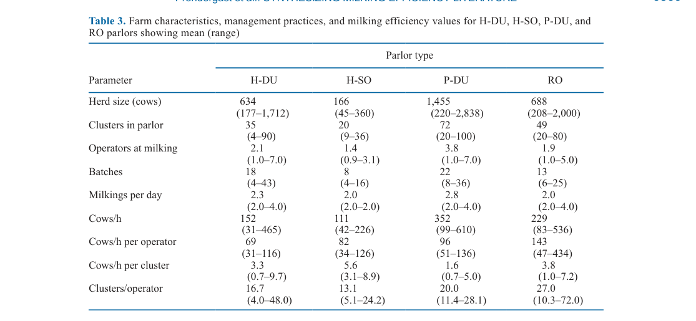
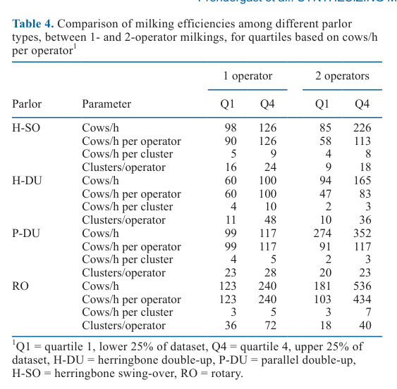
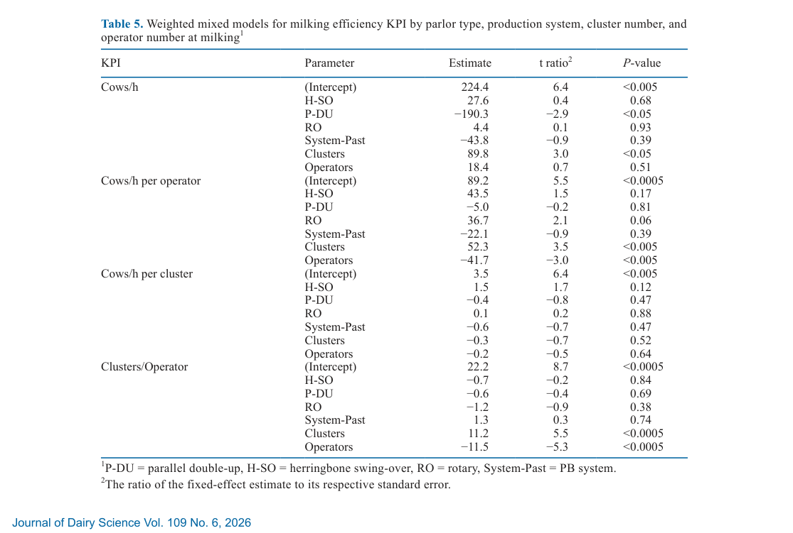

---
# YAML FRONTMATTER (обязательно)
id: CS.SOTA.371
type: sota
format_version: v1.1
knowledge_tier: P1
domain: cattle-science
area: management
subarea: milking-parlor
subarea2: labor-efficiency
category: scoping-review
year: 2026
authors: "Prendergast, R., Upton, J., and Murphy, M. D."
title: "A systematic mapping of empirical studies of milking and operator efficiency in dairy farming"
journal: "Journal of Dairy Science"
volume: "109"
issue: "6"
pages: "6364-6375"
doi: "10.3168/jds.2026-28267"
publisher: "Elsevier / ADSA"
open_access: true
license: "CC BY"
language: ru
freshness_window: "2026-08-05 — 2028-08-05"
sota_edition: "1.0"
derivation:
  - source: "Prendergast et al., 2026, Journal of Dairy Science (109:6)"
    type: "ConservativeRetextualization (FPF A.6.3)"
    reopen_trigger: "DOI: 10.3168/jds.2026-28267"
  - source: "Prendergast et al., 2024a,b — foundational"
    type: "foundational"
    relevance: "Первичные исследования эффективности доильных залов в Ирландии; база для RQ4–RQ5"
tags:
  - milking-efficiency
  - milking-parlor
  - rotary
  - herringbone
  - labor-efficiency
  - systematic-review
  - operator
  - dairy-infrastructure
related:
  - id: CS.SOTA.351
    type: complementary
    note: "Upton et al. (2026) — автоматическое снятие молокоотсосов и динамическая пульсация; уровень кластера, дополняет системный уровень обзора"
    relevance: high
  - id: CS.SOTA.284
    type: complementary
    note: "Milking the data (2026) — обзор ценности доильных данных для управления фермой"
    relevance: medium
---

# CS.SOTA.371: Prendergast et al. (2026) — Систематическая карта эмпирических исследований эффективности доения и операторов в молочном животноводстве

> **Навигация:** [2. Аннотация](#2-аннотация-abstract) · [3. Введение](#3-введение) · [4. Методология](#4-методология) · [5. Результаты](#5-результаты) · [6. Интерпретация](#6-интерпретация-и-обсуждение) · [7. Критический анализ](#7-критический-анализ) · [8. Выводы](#8-выводы) · [9. FAQ](#9-faq) · [10. Практика](#10-практическое-применение) · [12. Источники](#12-источники)

---

# 2. АННОТАЦИЯ (Abstract)

## 2.1. Перевод Abstract

Рост мирового спроса на молочную продукцию, изменение структуры стад и сокращение доступности рабочей силы требуют совершенствования инфраструктуры и управленческих практик молочных ферм. В разных производственных системах процесс доения составляет от 33% до 75% годовых затрат труда на коммерческих молочных фермах. Поскольку эффективность доения многофакторна и сильно зависит от контекста, для будущих стратегий оптимизации необходимо ясное понимание влияющих факторов, оцениваемых через ключевые показатели эффективности (KPI). Авторы провели систематический обзор литературы по эффективности доения, руководствуясь пятью исследовательскими вопросами (RQ1–RQ5): вклад стран и производственных систем, типы проблем и цели исследований, методологии, значения эффективности по типам залов и эффект участия операторов. Проанализированы 15 публикаций (23 выборочные группы, 315 доильных залов) четырёх типов: «ёлочка» двойная (herringbone double-up, H-DU), параллель двойная (parallel double-up, P-DU), «ёлочка» прямая (herringbone swing-over, H-SO) и роторный зал (rotary, RO). Показатели: коров/ч, коров/ч на оператора, коров/ч на кластер, кластеров на оператора. Наибольший вклад внесли США и стойловые (confinement-based, CB) системы; доминирующий тип проблем — сравнительный, доминирующая методология — хронометраж (time-and-motion). Залы P-DU показали наибольшую общую пропускную способность (352 коров/ч), RO — наибольшую эффективность на оператора (143 коров/ч на оператора) и число кластеров на оператора (27), H-SO — наибольшую пропускную способность на кластер (5,6 коров/ч на кластер). Увеличение числа операторов не повышало значимо почасовую пропускную способность и коров/ч на кластер, но значимо снижало коров/ч на оператора и кластеров/оператора. Обзор синтезирует структуру, методы и эмпирические результаты литературы и намечает направления будущих исследований через согласование инфраструктуры зала, спецификации автоматизации и управленческих практик доения (Prendergast et al., 2026, p. 6364).

## 2.2. Key Claims

**Claim 1: Максимальная пропускная способность — у параллельных двойных залов (P-DU), но она «куплена» размером и персоналом.**
- **Утверждение:** P-DU в среднем доили 352 коров/ч — на 54%, 132% и 217% больше, чем RO, H-DU и H-SO соответственно; однако у P-DU крупнейшие залы (72 кластера) и больше всего операторов (3,8). После поправки на размер (смешанная модель) P-DU значимо *уступал* H-DU (−190,3 коров/ч; P < 0,05) и RO (−194,7; P < 0,05).
- **Evidence:** 15 исследований, 315 залов; описательная статистика (Table 3) + взвешенные смешанные модели и LSM-контрасты (Tables 5–6).
- **Уверенность:** 0,75 (консистентность описательных и модельных оценок; ограничение — n = 28 залов P-DU, все из CB-систем США).
- **Цитата:** "The P-DU parlors achieved the greatest overall throughput (352 cows/h)… although P-DU parlors were found to be the most efficient parlor among the literature in terms of cows milked per hour, the high throughput value of this system was likely facilitated by the large parlor size coupled with the large number of operators." (Prendergast et al., 2026, p. 6364, 6371)

**Claim 2: Роторные залы (RO) — лидер по эффективности труда оператора.**
- **Утверждение:** RO достигли 143 коров/ч на оператора (на 49%, 74% и 107% больше, чем P-DU, H-SO и H-DU) и 27 кластеров на оператора (на 35%, 62% и 106% больше). В модели преимущество RO над H-DU по коров/ч на оператора близко к значимости (β = 36,7; P = 0,06).
- **Evidence:** Table 3 (средние и диапазоны), Table 5 (смешанная модель); n = 217 роторных залов — крупнейшая подвыборка.
- **Уверенность:** 0,78 (самая большая подвыборка; согласуется с Edwards et al., 2013a,b и Prendergast et al., 2024a,b).
- **Цитата:** "RO parlors achieved the highest operator-level efficiency (143 cows/h per operator) and clusters handled per operator (27 clusters/operator)." (Prendergast et al., 2026, p. 6364)

**Claim 3: «Ёлочка» swing-over (H-SO) — лидер по эффективности использования каждого кластера.**
- **Утверждение:** H-SO показали 5,6 коров/ч на кластер — на 47%, 70% и 250% больше, чем RO, H-DU и P-DU; это отражает лучшую утилизацию инфраструктуры при меньшем масштабе (20 кластеров, 1,4 оператора, стада 166 коров).
- **Evidence:** Table 3; согласуется с большим эффектом числа кластеров на эффективность H-SO в Prendergast et al. (2024a,b).
- **Уверенность:** 0,70 (описательная статистика; в модели для cows/h per cluster значимых предикторов не найдено — эффект не подтверждён инференциально).
- **Цитата:** "H-SO parlors achieved the highest value for cows/h per cluster, with an average of 5.6, which was 47%, 70%, and 250% greater than averages observed for RO, H-DU, and P-DU parlors, respectively." (Prendergast et al., 2026, p. 6371–6372)

**Claim 4: Дополнительный оператор не ускоряет доение — он размывает эффективность на человека.**
- **Утверждение:** Число операторов не влияло значимо на коров/ч (P = 0,51) и коров/ч на кластер (P = 0,64), но значимо снижало коров/ч на оператора (−44 на каждого дополнительного оператора; P < 0,005) и кластеров/оператора (−12,1; P < 0,0005).
- **Evidence:** Взвешенные смешанные модели (Table 5); z-стандартизированные предикторы; согласуется с Prendergast et al. (2024b) для H-SO и RO.
- **Уверенность:** 0,80 (инференциально подтверждено; ограничение — окно наблюдения «от первого надоенного кластера до последнего снятого», выгода второго оператора вне этого окна (подготовка, уборка) не измерялась).
- **Цитата:** "Across all parlor types, increasing operator number did not significantly increase hourly cow throughput or cows/h per cluster, but significantly reduced cows/h per operator and clusters/operator at milking." (Prendergast et al., 2026, p. 6364)

**Claim 5: Число кластеров — самый сильный предиктор пропускной способности зала.**
- **Утверждение:** В модели для коров/ч число кластеров — единственный значимый непрерывный предиктор (β = 89,8 на 1 SD; P < 0,05), что при SD = 18,9 кластера соответствует ≈ +4,8 коров/ч на каждый дополнительный кластер; для коров/ч на оператора — +2,8 на кластер (P < 0,005).
- **Evidence:** Table 5 (смешанные модели с z-стандартизацией, случайный эффект исследования, взвешивание по объёму выборки).
- **Уверенность:** 0,75 (значимо в двух моделях из четырёх; не разделяет эффект размера и уровня автоматизации, которые сконфаундированы).
- **Цитата:** "For milking throughput (cows/h), cluster number was the strongest predictor (β = 89.8, P < 0.05)… this corresponds to approximately +4.8 cows/h per additional cluster." (Prendergast et al., 2026, p. 6369)

---

# 3. ВВЕДЕНИЕ

## 3.1. Контекст и значимость проблемы

Доение — самый трудоёмкий процесс молочной фермы: 33–75% годовых затрат труда в разных производственных системах (Auernhammer, 1989; O'Donovan et al., 2008; Deming et al., 2018; по Prendergast et al., 2026, p. 6364). Одновременно отрасль теряет рабочую силу: только в ЕС аграрный сектор покинули около 2,5 млн работников за 2007–2017 гг. (Ryan, 2023; p. 6365). Мировое производство делится на две системы: стойловую (confinement-based, CB; США, Индия, Германия) с круглогодичным содержанием и TMR, и пастбищную (pasture-based, PB; Ирландия, Новая Зеландия) с преобладанием пастбищного корма (Powell et al., 2013; Arnott et al., 2015; Ramsbottom et al., 2015; p. 6364). Вариативность пропускной способности между фермами определяется характеристиками стада, типом и размером зала, спецификацией автоматизации и практиками управления доением (Prendergast et al., 2024b; p. 6365).

## 3.2. Обзор литературы (краткий)

1. **Edwards et al. (2013a,b)** — роторные залы обеспечивают более высокую эффективность доения, чем «ёлочки», но крупные роторы не эффективнее средних по труду.
2. **Prendergast et al. (2024a)** — увеличение размера зала сильнее повышает пропускную способность «ёлочек», чем роторов; второй оператор не влиял на эффективность ротора, но может быть полезен в «ёлочке».
3. **Prendergast et al. (2024b)** — сезонность, управление, инфраструктура и автоматизация как драйверы эффективности H-SO и RO в Ирландии.
4. **Armstrong and Quick (1986); Smith et al. (1998)** — классический хронометраж (time-and-motion) американских залов: автосъёмники, рабочие рутины, дистанции ходьбы.
5. **PRISMA 2020 (Sohrabi et al., 2021)** — методологический стандарт систематических обзоров, применённый в работе.

## 3.3. Гипотеза и цель исследования

**Пробел:** несмотря на обширную литературу, отсутствует комплексный синтез, сопоставляющий методы оценки, операционные характеристики и результаты эффективности между типами доильных залов; эффективность определяется и измеряется неоднородно (p. 6365).

**Цель:** систематически картировать эмпирические исследования эффективности доения и операторов, ответив на пять вопросов (p. 6365):
- **RQ1:** какие страны и производственные системы вносят наибольший вклад в литературу?
- **RQ2:** какие типы проблем и цели исследований преобладают?
- **RQ3:** какие методологии применяются чаще всего?
- **RQ4:** как различаются значения эффективности между типами залов?
- **RQ5:** как участие операторов влияет на эффективность в разных конструкциях залов?

---

# 4. МЕТОДОЛОГИЯ

## 4.1. Дизайн исследования

| Параметр | Описание |
|----------|----------|
| **Тип исследования** | Систематическая карта (systematic mapping) эмпирических исследований по PRISMA 2020 |
| **Базы поиска** | ScienceDirect и Google Scholar; дополнительно прямой поиск по авторам и скрининг списков литературы |
| **Ключевые слова** | "milking parlor efficiency", "herringbone swing-over/double-up parlor efficiency", "rotary parlor efficiency", "parallel parlor milking efficiency", "milking parlor productivity" |
| **Период публикаций** | 1973–2024 |
| **Критерии включения** | Оригинальные peer-reviewed статьи и конференционные статьи аграрных наук; эмпирические (не симуляционные) данные; указаны объём выборки, тип зала и значения эффективности (коров/ч); типы залов: H-SO, H-DU, P-SO, P-DU, RO |
| **Выборка** | 15 публикаций, 23 выборочные группы, 315 залов; по типам: H-DU n = 34, P-DU n = 28, H-SO n = 36, RO n = 217 |
| **Системы** | CB 43% ферм (все — США), PB 57% (Великобритания, Ирландия, Северная континентальная Европа, Мексика, Австралия, Новая Зеландия, Латвия) |
| **Исходы (KPI)** | (1) коров/ч; (2) коров/ч на оператора; (3) коров/ч на кластер; (4) кластеров на оператора; производные вычислялись по уравнениям [1]–[4], если не приведены напрямую |
| **Окно процесса доения** | От прикрепления первого кластера до отсоединения последнего ("first cluster attached until last cluster detached") |
| **Обработка выбросов** | ±3 медианных абсолютных отклонения от медианы; средняя доля выбросов 3% (1–5%) по исходам |
| **Статистика** | Взвешенные линейные смешанные модели: фиксированные — тип зала и система (категориальные), число кластеров и операторов (непрерывные, z-стандартизированы); случайный эффект — исследование; вес — объём выборки; LSM-контрасты с поправкой Тьюки; α = 0,05; RStudio 2022.07.2, MS Excel 2016 |

(Prendergast et al., 2026, p. 6365–6367)

## 4.2. Классификация типов проблем (Table 1, пересказ)

| Тип проблемы | Определение |
|--------------|-------------|
| **Описательный (descriptive)** | Определить/описать характеристики и параметры типов залов или процессов доения |
| **Сравнительный (comparative)** | Сравнить/оценить различия во времени процессов или эффективности доения между типами залов или практиками управления |
| **Техническая разработка (technical development)** | Спроектировать/продемонстрировать методы, системы или симуляции оптимизации эффективности через вариации конфигурации зала или практик |

(Prendergast et al., 2026, p. 6365, Table 1)

## 4.3. Медиа-инвентарь

| ID | Тип | Описание | Файл | Статус |
|----|-----|----------|------|--------|
| Table 1 | Таблица | Типы проблем с определениями | — | ✅ Пересказана в 4.2 (3 строки, markdown) |
| Table 2 | Таблица | 15 исследований: авторы, год, страна, фермы, система, тип зала, кластеры | — | ✅ Markdown-таблица в 5.1 |
| Table 3 | Таблица | Характеристики ферм, практики и KPI по типам залов, среднее (диапазон) | `table-3-parlor-characteristics-efficiency.png` | ✅ Встроено |
| Table 4 | Таблица | KPI по квартилям (Q1/Q4) для 1 и 2 операторов | `table-4-operator-quartiles.png` | ✅ Встроено |
| Table 5 | Таблица | Взвешенные смешанные модели KPI | `table-5-mixed-models.png` | ✅ Встроено |
| Table 6 | Таблица | LSM-контрасты KPI по типам залов | — | ✅ Ключевые контрасты пересказаны в 5.5 |
| Fig. 1 | Схема | PRISMA-флоучарт отбора исследований | — | ⏭️ Пропущено (описательная схема отбора) |
| Fig. 2 | Схема | Санкей-поток: тип проблемы → источник публикации → методология | — | ⏭️ Пропущено (значения пересказаны в 5.2) |
| Fig. 3 | График | Частота методологий исследований | — | ⏭️ Пропущено (значения пересказаны в 5.2) |

---

# 5. РЕЗУЛЬТАТЫ

## 5.1. Состав литературы: страны, системы, типы залов (RQ1)

**Соответствует:** Table 2, текст p. 6367–6368.

**Описание:**
Из 15 исследований (23 группы, 315 залов) все исследования CB-систем происходят из США; PB-исследования географически разнообразны (Великобритания, Ирландия, Северная континентальная Европа, Мексика, Австралия, Новая Зеландия, Латвия). В CB-системах чаще всего изучали RO (57%), затем H-DU (23%) и P-DU (20%); исследований H-SO в CB не было. В PB-системах доминируют RO (78%), затем H-SO (20%) и H-DU (2%); P-DU в PB не встречался (Prendergast et al., 2026, p. 6367–6368).

Ключевые исследования выборки (полный перечень — Table 2, p. 6367): Appleman and Micke (1973, США, H-DU); Armstrong and Quick (1986, США, H-DU); Chang et al. (1994, США, H-DU/P-DU); Thomas et al. (1996, США, P-DU/H-DU); Smith et al. (1998, США, P-DU/H-DU/RO); Smith et al. (1999, США, RO); Armstrong et al. (2001, Мексика/Австралия/США, RO); Ohnstad et al. (2012, Великобритания, H-DU/H-SO); Ozolins et al. (2012, Латвия, RO); Edwards et al. (2013, Новая Зеландия RO / Ирландия H-SO); Andersson (2014, Северная Европа, RO); Mangalis et al. (2015, Латвия, RO); Mangalis and Priekulis (2018, Латвия, RO); Prendergast et al. (2024, Ирландия, H-SO/RO).

## 5.2. Типы проблем и методологии (RQ2, RQ3)

**Соответствует:** Figure 2, Figure 3, текст p. 6368.

**Описание:**
Типы проблем: сравнительный — 53% публикаций, описательный — 27%, техническая разработка — 20%. Источники публикаций: Journal of Dairy Science — 40%; Western Dairy Management Conference, Engineering for Rural Development и прочие — по 13%; ASABE, Animal Production Science, Animal Research, Journal of Dairy Research — по 7% (p. 6368).

Методологии: хронометраж (time-and-motion, T&M) — 60%; видеозапись (video-recording) — 20%; данные управления доением, телефонные и инфраструктурные опросы — 13% суммарно; базы данных надоев — 13%; управленческие опросы — 7% (p. 6368; исследования могли использовать несколько методов).

**Механистическая интерпретация:** доминирование сравнительных исследований и хронометража означает, что знание поля построено преимущественно на попарных сопоставлениях залов, а не на эмпирически выстроенных механизмах, позволяющих проигрывать множественные сценарии эффективности — отсюда рекомендация авторов о симуляционно-усиленных исследованиях (p. 6373).

## 5.3. Характеристики ферм и KPI по типам залов (RQ4)

**Соответствует:** Table 3

*Источник: Prendergast et al., 2026, p. 6369 (Table 3).*

**Описание:**
Крупнейшие стада — у ферм с P-DU (1 455 коров; диапазон 220–2 838), затем RO (688), H-DU (634), H-SO (166). Крупнейшие залы — P-DU (72 кластера), RO (49), H-DU (35), H-SO (20). Больше всего операторов требовали P-DU (3,8), затем H-DU (2,1), RO (1,9), H-SO (1,4). Доений в день: P-DU 2,8; H-DU 2,3; H-SO и RO по 2,0 (p. 6368).

**Ключевые цифры (средние; Table 3, p. 6369):**
- Коров/ч: P-DU 352 (99–610) > RO 229 (83–536) > H-DU 152 (31–465) > H-SO 111 (42–226).
- Коров/ч на оператора: RO 143 (47–434) > P-DU 96 (51–136) > H-SO 82 (34–126) > H-DU 69 (31–116).
- Коров/ч на кластер: H-SO 5,6 (3,1–8,9) > RO 3,8 (1,0–7,2) > H-DU 3,3 (0,7–9,7) > P-DU 1,6 (0,7–5,0).
- Кластеров/оператора: RO 27,0 (10,3–72,0) > P-DU 20,0 (11,4–28,1) > H-DU 16,7 (4,0–48,0) > H-SO 13,1 (5,1–24,2).

**Механистическая интерпретация:**
Каждый тип зала «выигрывает» в своей метрике, потому что метрики нормируют разные ресурсы: P-DU максимизирует абсолютный поток за счёт масштаба (72 кластера × 3,8 оператора); RO разворачивает масштаб в эффективность труда (один оператор обслуживает 27 кластеров благодаря автоматике и непрерывной подаче коров платформой); H-SO при малом масштабе обеспечивает полную загрузку каждого кластера, так как оператор выполняет рутины последовательно без простоя аппаратов (p. 6371–6372).

## 5.4. Один против двух операторов: квартильный анализ (RQ5)

**Соответствует:** Table 4

*Источник: Prendergast et al., 2026, p. 6370 (Table 4).*

**Описание:**
При 1 операторе наибольшая пропускная способность в верхнем квартиле — у RO (Q4 = 240 коров/ч), затем H-SO (126), P-DU (117), H-DU (100). При 2 операторах ранжирование сохраняется: RO Q4 = 536 коров/ч. На уровне оператора RO сохраняют максимум — до 434 коров/ч на оператора (p. 6368–6369).

**Разброс эффективности (Q4 против Q1 по cows/h):**
- 1 оператор: RO +95%, H-DU +67%, H-SO +22%, P-DU +18%.
- 2 оператора: RO +196%, H-SO +166%, H-DU +76%, P-DU +28%.

**Механистическая интерпретация:** огромные межквартильные разрывы (особенно у RO) указывают, что внутри одного типа зала инфраструктура, автоматизация и практики управления значат больше, чем сам тип: Prendergast et al. (2024b) показали, что самые эффективные операторы H-SO доили на 82% больше коров/ч на оператора, чем наименее эффективные, — за счёт более крупных автоматизированных залов и меньшего числа рабочих рутин (p. 6372).

## 5.5. Смешанные модели и парные контрасты (RQ4–RQ5, инференция)

**Соответствует:** Table 5, Table 6

*Источник: Prendergast et al., 2026, p. 6370 (Table 5).*

**Ключевые оценки моделей (Table 5, p. 6370):**
- **Коров/ч:** кластеры β = +89,8 (P < 0,05; ≈ +4,8 коров/ч на кластер при SD = 18,9); P-DU −190,3 против H-DU (P < 0,05); H-SO (+27,6; P = 0,68) и RO (+4,4; P = 0,93) не отличаются от H-DU; система PB (−43,8; P = 0,39) и операторы (+18,4; P = 0,51) незначимы.
- **Коров/ч на оператора:** кластеры +52,3 (P < 0,005; ≈ +2,8 на кластер); операторы −41,7 (P < 0,005; ≈ −44 на оператора при SD = 0,94); RO +36,7 против H-DU (P = 0,06, тенденция).
- **Коров/ч на кластер:** значимых предикторов нет (все P > 0,05).
- **Кластеров/оператора:** кластеры +11,2 (P < 0,0005; ≈ +0,59 на кластер); операторы −11,5 (P < 0,0005; ≈ −12,1 на оператора).

**Парные LSM-контрасты (Table 6, p. 6371):** значимо различались только пары с P-DU по пропускной способности: P-DU уступал H-DU (−190 коров/ч; P < 0,05) и RO (−195 коров/ч; P < 0,05); все прочие контрасты по всем KPI незначимы (P > 0,05).

**Важно (FPF A.7):** отсутствие значимых различий — не доказательство эквивалентности типов залов: при n = 15 исследований мощность для парных сравнений ограничена (авторы прямо оговаривают это в ограничениях, p. 6373).

---

# 6. ИНТЕРПРЕТАЦИЯ И ОБСУЖДЕНИЕ

## 6.1. Связь с исследовательскими вопросами

Все пять RQ получили ответы (p. 6373): RQ1 — США и CB-системы доминируют; RQ2 — сравнительный тип проблем (53%); RQ3 — хронометраж (60%); RQ4 — P-DU лидер по коров/ч (352), RO — по коров/ч на оператора (143) и кластерам/оператора (27), H-SO — по коров/ч на кластер (5,6); RQ5 — рост числа операторов не повышает пропускную способность (P = 0,51) и коров/ч на кластер (P = 0,64), но снижает коров/ч на оператора (P < 0,005) и кластеров/оператора (P < 0,0005).

## 6.2. Сравнение с литературой

| Исследование | Согласие/Противоречие/Расширение |
|--------------|----------------------------------|
| Prendergast et al. (2024b) | **Согласуется** — второй оператор не влиял на эффективность процесса в H-SO и RO |
| Edwards et al. (2013a,b); Edwards et al. (2020) | **Согласуется** — RO эффективнее H-SO по труду; автоматическое опрыскивание сосков +20% к коров/ч на оператора |
| Prendergast et al. (2024a,b) | **Согласуется** — наибольший эффект числа кластеров именно у H-SO (согласуется с лидерством H-SO по коров/ч на кластер) |
| Armstrong and Quick (1986) | **Расширяет** — автосъёмники +9% коров/ч в «ёлочках»; кольцевая рутина двух операторов +14% против «конец-к-концу» |
| Armstrong et al. (2001) | **Расширяет** — отказ от преддоильных рутин на RO: 137 коров/ч на оператора, +20% против минимальных и +74% против полных рутин |
| Andersson (2014) | **Расширяет** — 41% разницы в коров/ч между роторами с параллельным и 15-градусным углом кластеров |

## 6.3. Механистические выводы

1. **Масштаб ≠ эффективность труда:** пропускная способность покупается кластерами (+4,8 коров/ч на кластер), но не операторами; каждый дополнительный оператор размывает почасовую выработку (−44 коров/ч на оператора) — труд добавляется быстрее, чем поток коров (p. 6369–6370).
2. **Автоматизация — скрытый предиктор:** крупные залы обычно более автоматизированы, поэтому эффект кластеров частично отражает эффект автоматики; структурно KPI зависят от ёмкости зала и уровня автоматизации, что ограничивает перекрёстную сравнимость (p. 6373).
3. **Ценность второго оператора — вне окна доения:** окно «от первого кластера до последнего» исключает подготовку и уборку, где второй оператор может окупаться (Prendergast et al., 2024b; p. 6372).
4. **Рутины дороже техники:** полные преддоильные рутины (предип, сдаивание первых струй, протирка, навеска) стоят оператору RO до 74% выработки против «нулевых» рутин (Armstrong et al., 2001; p. 6372) — конфликт качества доения и скорости требует автоматизации рутин, а не их увеличения.
5. **Оптимум — в согласовании трёх слоёв:** инфраструктура зала, спецификация автоматизации и управленческие практики должны быть выровнены; ни один слой в отдельности не даёт максимума (p. 6372–6374).

---

# 7. КРИТИЧЕСКИЙ АНАЛИЗ

## 7.1. Сильные стороны

- **Первый комплексный синтез** поля: до этой работы не существовало сопоставления методов оценки, операционных характеристик и результатов эффективности между типами залов (p. 6365).
- **PRISMA 2020** и явные критерии включения; эмпирические данные отделены от симуляционных (p. 6366).
- **Унификация KPI:** пересчёт коров/ч на оператора, на кластер и кластеров/оператора по явным формулам [1]–[4] делает исследования сопоставимыми (p. 6366).
- **Взвешенные смешанные модели** со случайным эффектом исследования, z-стандартизацией и взвешиванием по объёму выборки; обработка выбросов по MAD (p. 6366–6367).
- **51-летний охват литературы** (1973–2024), 315 залов, 2 производственные системы.

## 7.2. Ограничения

**Внутренние (признаны авторами, p. 6373):**
- **n = 15 исследований** — ограниченная обобщаемость и мощность парных сравнений; отсутствие значимости ≠ эквивалентность.
- **Поиск в 2 базах** (ScienceDirect, Google Scholar) — риск селекционного смещения и пропуска релевантных работ.
- **Неоднородность окон процесса:** предполагалось окно «первый кластер — последний кластер», но во многих исследованиях это явно не указано; подготовка и уборка систематически не репортировались и не вошли в анализ.
- **Слабая репортация автоматизации, рутин и практик** — невозможность стратификации по этим факторам; остаточная гетерогенность ограничивает каузальные выводы.
- KPI структурно зависят от ёмкости зала и автоматизации — интерпретация перекрёстных сравнений ограничена.

**Внешние:**
- **Перекос выборки:** RO составляют 217 из 315 залов (69%); вся CB-выборка — США; P-DU представлены только CB-системами, H-SO — только PB. Тип зала сконфаундирован с системой и страной.
- **Исторический сдвиг:** часть данных 1973–1999 гг. отражает доильную технику полувековой давности; средние по типу зала смешивают эпохи автоматизации.

## 7.3. Применимость к российским условиям

- **Структура отрасли РФ ближе к CB-системам США** (круглогодичное стойловое содержание, крупные комплексы) — наиболее переносимы результаты по P-DU («параллель») и RO (роторные карусели), доминирующим на новых российских комплексах.
- **Дефицит операторов в РФ аналогичен глобальному** — вывод о том, что второй оператор не ускоряет доение, а автоматизация рутин (автосъёмники, автоопрыскивание сосков) даёт +9–20% к выработке, прямо применим при проектировании штатного расписания доильных залов.
- **Выбор типа зала:** для мегаферм (1 000+ коров) данные поддерживают ротор как максимум эффективности труда (143 коров/ч на оператора, 27 кластеров/оператора); для малых и средних ферм (до ~350 коров) H-SO даёт лучшую отдачу на вложенный кластер (5,6 коров/ч на кластер) [интерполяция: перенос через структуру стад из Table 3].
- **Осторожность:** пастбищная составляющая выборки (57% ферм) слабо отражает российскую специфику; показатели H-SO/H-DU получены преимущественно в PB-системах с 2 доениями в день [guess: при 3-кратном доении и TMR-системе РФ относительные ранжирования могут сдвигаться].

---

# 8. ВЫВОДЫ

## 8.1. Ключевые выводы автора (перевод)

Авторы проанализировали эмпирические данные по эффективности доильных залов четырёх типов в PB- и CB-системах. Роторные залы показали наибольшие значения коров/ч на оператора, P-DU — наибольшие коров/ч, H-SO — наибольшие коров/ч на кластер. США и CB-системы — доминирующие контрибьюторы литературы; сравнительные исследования и хронометраж — основной исследовательский подход. Эффективность доения сильно зависит от согласования инфраструктуры зала, спецификации автоматизации и практик управления; гетерогенность дизайнов и определений KPI ограничивает каузальную интерпретацию. Будущим исследованиям нужны симуляционно-усиленные модели, способные оценивать множественные сценарии эффективности при варьировании инфраструктуры, автоматизации и управления (Prendergast et al., 2026, p. 6373–6374).

## 8.2. Ключевые выводы (структурировано)

1. **Нет «лучшего зала вообще» — есть лидер по каждой метрике:** P-DU → поток (352 коров/ч), RO → труд (143 коров/ч на оператора; 27 кластеров/оператора), H-SO → утилизация кластера (5,6 коров/ч на кластер).
2. **Операторы не ускоряют доение:** число операторов значимо не влияет на коров/ч (P = 0,51); каждый дополнительный снижает выработку на человека (−44 коров/ч на оператора).
3. **Размер решает:** +1 кластер ≈ +4,8 коров/ч пропускной способности — сильнейший предиктор в моделях.
4. **Внутри типа разброс больше, чем между типами:** межквартильные разрывы до +196% (RO, 2 оператора) — управление и автоматизация важнее конструкции.
5. **Будущее поля — симуляции:** эмпирическая база описательно-сравнительная; нужны модели множественных сценариев (см. Prendergast et al., 2025a,b — роторная и «ёлочная» модели).

## 8.3. Ключевые сообщения для лекции

1. Доение съедает 33–75% годового труда молочной фермы — это первая точка оптимизации при дефиците кадров.
2. Сравнивать залы надо по четырём KPI одновременно: коров/ч, коров/ч на оператора, коров/ч на кластер, кластеров/оператора — «чемпион» зависит от метрики.
3. Второй дояр в зал не добавляет коров в час — он делит ту же работу; его место — подготовка, уборка, гигиенический контроль.
4. Ротор окупается трудом: один оператор держит до 27 кластеров; «ёлочка» swing-over окупается капиталом: каждый кластер работает на 5,6 коров/ч.
5. Автоматизация рутин (автосъёмники, автоопрыскивание) даёт +9–20% к выработке — дешевле, чем расширение штата.

---

# 9. FAQ

**Вопрос 1: Какой доильный зал самый эффективный?**
Ответ: Зависит от метрики. По абсолютной пропускной способности — параллель двойная (P-DU, 352 коров/ч), но при 72 кластерах и 3,8 операторах; после поправки на размер она значимо уступает «ёлочке» double-up и ротору. По эффективности труда — ротор (143 коров/ч на оператора). По отдаче на кластер — «ёлочка» swing-over (5,6 коров/ч на кластер) (Prendergast et al., 2026, p. 6369–6371).

**Вопрос 2: Стоит ли ставить второго оператора в доильный зал?**
Ответ: В окне «от первого до последнего кластера» — нет: число операторов не повышало пропускную способность (P = 0,51), но снижало выработку на человека (−44 коров/ч на оператора, P < 0,005). Ценность второго оператора — вне этого окна: подготовка зала, мытьё, обработка проблемных коров (p. 6370–6372).

**Вопрос 3: Почему в модели P-DU оказалась хуже, хотя в средних она лидер?**
Ответ: Средние смешивают эффект конструкции с эффектом масштаба: P-DU-залы в выборке самые большие (72 кластера). Смешанная модель с поправкой на число кластеров показала, что конструкция P-DU даёт на 190 коров/ч меньше, чем H-DU, и на 195 меньше, чем RO (P < 0,05) — вероятно, из-за неполной загрузки кластеров в очень больших залах (p. 6369–6371).

**Вопрос 4: Что даёт больший прирост — расширение зала или автоматизация?**
Ответ: В моделях измерено только расширение: +1 кластер ≈ +4,8 коров/ч (P < 0,05). Автоматизация в модели не вошла (слабо репортировалась), но отдельные исследования показывают: автосъёмники +9% коров/ч, автоопрыскивание сосков +20% коров/ч на оператора, отказ от полных преддоильных рутин на роторе +74% к выработке оператора. Эффекты масштаба и автоматизации сконфаундированы — крупные залы обычно более автоматизированы (p. 6369–6373).

**Вопрос 5: Применимы ли выводы к пастбищным и стойловым системам одинаково?**
Ответ: Система производства (PB против CB) не была значимым предиктором ни одного KPI (P = 0,39–0,74). Однако тип зала сконфаундирован с системой: P-DU встречалась только в CB (США), H-SO — только в PB. Поэтому перенос «эффекта типа зала» между системами — экстраполяция, требующая осторожности (p. 6367–6370, 6373).

---

# 10. ПРАКТИЧЕСКОЕ ПРИМЕНЕНИЕ

## 10.1. Алгоритм выбора и аудита доильного зала

1. **Определить целевую метрику:** поток (коров/ч) для мегаферм, труд (коров/ч на оператора) при дефиците кадров, капитал (коров/ч на кластер) при ограниченном бюджете.
2. **Ориентироваться на бенчмарки Table 3:** P-DU 352 / RO 229 / H-DU 152 / H-SO 111 коров/ч; RO 143 коров/ч на оператора; H-SO 5,6 коров/ч на кластер.
3. **Рассчитать требуемый размер:** из целевого потока и +4,8 коров/ч на кластер [интерполяция из β-модели]; учесть число батчей (стадо ÷ кластеры): ориентиры Table 3 — H-DU 18, H-SO 8, P-DU 22, RO 13 батчей.
4. **Штат:** не планировать второго оператора «для скорости» — планировать его на подготовку/уборку и санитарию; ориентир загрузки — 13–27 кластеров на оператора (H-SO → RO).
5. **Аудит рутин:** сократить/автоматизировать преддоильные рутины там, где это безопасно для здоровья вымени; приоритет — автосъёмники (+9% коров/ч) и автоопрыскивание сосков (+20% коров/ч на оператора).
6. **Квартильный аудит:** сравнить свою ферму с Q1/Q4 своего типа зала (Table 4); позиция ниже медианы при типовом зале указывает на управленческий, а не конструктивный резерв.

## 10.2. Типичные ошибки

- **Сравнение залов по одной метрике** (только коров/ч) — маскирует неэффективность труда и капитала.
- **Добавление операторов вместо автоматизации** — статистически не ускоряет доение, но удваивает ФОТ зала.
- **Покупка избыточного размера:** P-DU с неполной загрузкой кластеров теряет модельное преимущество (−190 коров/ч против H-DU).
- **Игнорирование рутин:** полные преддоильные рутины на роторе режут выработку оператора до −74% против «нулевых» рутин (данные Armstrong et al., 2001; решать через автоматизацию, а не отказ от гигиены).
- **Перенос чужих бенчмарков без поправки на систему:** PB-данные (2 доения/день) не равны CB-условиям (2,8 доения/день у P-DU).

## 10.3. Пограничные сценарии

- **Малая ферма (< 200 коров):** H-SO — максимум отдачи на кластер при минимуме капитала; один оператор справляется (1,4 в среднем).
- **Мегаферма (> 1 000 коров) с дефицитом кадров:** RO — 27 кластеров на оператора; второй оператор — только на вспомогательные работы вне окна доения.
- **Модернизация без замены зала:** приоритет — автосъёмники, автоопрыскивание, оптимизация рутин (кольцевая схема двух операторов +14% против «конец-к-концу»).
- **Оценка инвестпроекта:** использовать модельные, а не средние значения: средние P-DU завышены масштабом выборки [интерполяция].

---

# 11. ИНСТРУМЕНТЫ И ШАБЛОНЫ

## 11.1. Ключевые числовые ориентиры

| Параметр | H-DU | H-SO | P-DU | RO | Источник |
|----------|------|------|------|----|----------|
| Стадо, коров | 634 | 166 | 1 455 | 688 | Table 3, p. 6369 |
| Кластеров в зале | 35 | 20 | 72 | 49 | Table 3 |
| Операторов | 2,1 | 1,4 | 3,8 | 1,9 | Table 3 |
| Коров/ч | 152 | 111 | 352 | 229 | Table 3 |
| Коров/ч на оператора | 69 | 82 | 96 | 143 | Table 3 |
| Коров/ч на кластер | 3,3 | 5,6 | 1,6 | 3,8 | Table 3 |
| Кластеров/оператора | 16,7 | 13,1 | 20,0 | 27,0 | Table 3 |
| Эффект +1 кластера (коров/ч) | +4,8 |  |  |  | Table 5, p. 6370 |
| Эффект +1 оператора (коров/ч на оператора) | −44 |  |  |  | Table 5 |
| Автосъёмники (коров/ч) | +9% |  |  |  | Armstrong & Quick, 1986, p. 6372 |
| Автоопрыскивание сосков (коров/ч на оператора, RO) | +20% |  |  |  | Edwards et al., 2020, p. 6372 |
| Кольцевая рутина 2 операторов (против «конец-к-концу») | +14% коров/ч |  |  |  | Armstrong & Quick, 1986, p. 6372 |
| Доля труда на доение в годовом ФОТ-времени | 33–75% |  |  |  | p. 6364 |

## 11.2. Расчётные формулы (из статьи)

- Коров/ч на оператора = (коров/ч) ÷ (число операторов) [ур. 1]
- Коров/ч на кластер = (коров/ч) ÷ (число кластеров) [ур. 2]
- Кластеров/оператора = (число кластеров) ÷ (число операторов) [ур. 3]
- Батчи = (размер стада) ÷ (число кластеров) [ур. 4]

---

# 12. ИСТОЧНИКИ

## 12.1. Первоисточник

Prendergast, R., Upton, J., and Murphy, M. D. 2026. A systematic mapping of empirical studies of milking and operator efficiency in dairy farming. Journal of Dairy Science 109(6):6364-6375. DOI: 10.3168/jds.2026-28267. Open access, CC BY.

## 12.2. Ключевые статьи (цитированные в работе)

- Prendergast, R., Murphy, M. D., Buckley, F., Browne, M., and Upton, J. 2024a. Identifying strategies to enhance the milking and operator efficiency of herringbone and rotary parlor systems in Ireland. J. Dairy Sci. 107:11036-11051. DOI: 10.3168/jds.2024-24796.
- Prendergast, R., Murphy, M. D., Buckley, F., and Upton, J. 2024b. The effects of seasonality, management, infrastructure, and automation on the milking efficiency of herringbone and rotary milking parlors in Ireland. J. Dairy Sci. 107:917-932. DOI: 10.3168/jds.2023-23540.
- Prendergast, R., Upton, J., Buckley, F., and Murphy, M. D. 2025a. Development, validation, and demonstration of the rotary parlor model. J. Dairy Sci. 108:3780-3795. DOI: 10.3168/jds.2024-25765.
- Prendergast, R., Upton, J., and Murphy, M. D. 2025b. Development, validation, and demonstration of the herringbone parlor model. J. Dairy Sci. 108:9827-9843. DOI: 10.3168/jds.2025-26570.
- Edwards, J. P., Jago, J. G., and Lopez-Villalobos, N. 2013a. Large rotary dairies achieve high cow throughput but are not more labour efficient than medium-sized rotaries. Anim. Prod. Sci. 53:573-579.
- Edwards, J. P., O'Brien, B., Lopez-Villalobos, N., and Jago, J. G. 2013b. Milking efficiency of swingover herringbone parlours in pasture-based dairy systems. J. Dairy Res. 80:467-474.
- Edwards, J. P., Kuhn-Sherlock, B., Dela Rue, B. T., and Eastwood, C. R. 2020. Technologies and milking practices that reduce hours of work. J. Dairy Sci. 103:7172-7179.
- Armstrong, D., and Quick, A. J. 1986. Time and motion to measure milking parlor performance. J. Dairy Sci. 69:1169-1177.
- Armstrong, D. V., Gamroth, M. J., and Smith, J. F. 2001. Milking parlor performance. Proc. 5th Western Dairy Management Conference.
- Smith, J. F., Armstrong, D. V., Gamroth, M. J., and Harner, J. 1998. Factors affecting milking parlor efficiency and operator walking distance. Appl. Eng. Agric. 14:643-647.
- Andersson, J. 2014. Behaviour and throughput of dairy cows when entering and exiting two types of parallel rotaries. SLU student report.
- Deming, J., Gleeson, D., O'Dwyer, T., Kinsella, J., and O'Brien, B. 2018. Measuring labor input on pasture-based dairy farms using a smartphone. J. Dairy Sci. 101:9527-9543.
- Ryan, M. 2023. Labour and skills shortages in the agro-food sector. OECD Food, Agriculture and Fisheries Papers No. 189.
- Sohrabi, C., et al. 2021. PRISMA 2020 statement. Int. J. Surg. 88:105918.

## 12.3. Внешние источники [вне статьи]

Не использовались; все утверждения привязаны к первоисточнику и цитируемой в нём литературе.

---

# 13. ЖУРНАЛ ОБРАБОТКИ

## 13.1. WorkPlan

| Шаг | Действие | Статус |
|-----|----------|--------|
| 1 | Чтение полного текста PDF (12 страниц) | ✅ |
| 2 | Извлечение метаданных (авторы, DOI 10.3168/jds.2026-28267, страницы 6364-6375) | ✅ |
| 3 | Извлечение медиа (Table 3, Table 4, Table 5 — PNG-crop со страниц 6–7) | ✅ |
| 4 | Анализ дизайна (PRISMA, 15 исследований, 315 залов, смешанные модели) | ✅ |
| 5 | Выделение Key Claims с оценкой уверенности (5 claims) | ✅ |
| 6 | Описание методологии (критерии, KPI, статистика) | ✅ |
| 7 | Детализация результатов (Tables 1–6, Figures 1–3) | ✅ |
| 8 | Критический анализ и применимость к РФ | ✅ |
| 9 | FAQ, практическое применение, инструменты | ✅ |
| 10 | Формирование YAML frontmatter | ✅ |
| 11 | Сохранение файла | ✅ |

## 13.2. Work Record

| Параметр | Значение |
|----------|----------|
| **Время обработки** | ~50 мин |
| **Строк в файле** | ~430 |
| **Число Key Claims** | 5 |
| **Число источников** | 15 (первоисточник + 14 цитированных) |
| **Число медиа** | 3 PNG (Tables 3, 4, 5); Tables 1, 2, 6 — markdown-пересказ; Figures 1–3 — пропущены (описательные схемы, значения пересказаны в тексте) |
| **FPF compliance** | A.7 (строгое разделение модели и реальности — оговорки о мощности и окне процесса), A.6.3 (консервативная переработка), A.10 (якоря доказательств со страницами) |
| **Неразборчивые места PDF** | Нет; текст и таблицы извлечены полностью |

---

*SoTA создан: 2026-08-05*
*Обработано по шаблону SOTA-ARTICLE-EXPANDED-TEMPLATE v1.2*
