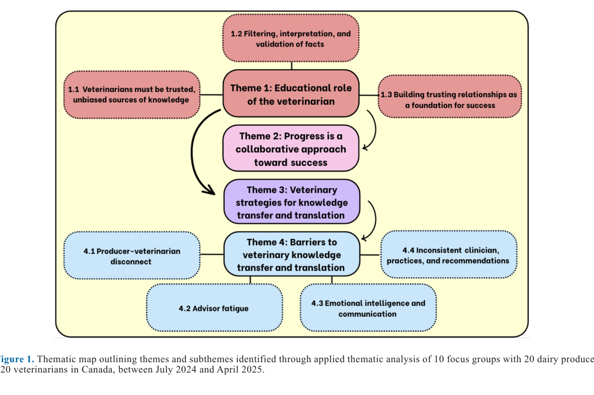

---
# YAML FRONTMATTER (обязательно)
id: CS.SOTA.379
type: sota
format_version: v1.1
knowledge_tier: P3
domain: cattle-science
area: management
subarea: knowledge-transfer-extension
subarea2: veterinary-advisory-communication
category: field-study
year: 2026
authors: "Carter, H., Ritter, C., Morabito, E., Denis-Robichaud, J., Roy, J.-P., LeBlanc, S. J., and Renaud, D. L."
title: "Exploring veterinary knowledge extension methods and perceived barriers among Canadian dairy veterinarians and producers: A qualitative focus group study"
journal: "Journal of Dairy Science"
volume: "109"
issue: "6"
pages: "6351-6363"
doi: "10.3168/jds.2025-28116"
publisher: "Elsevier / ADSA"
open_access: true
license: "CC BY"
language: ru
freshness_window: "2026-08-05 — 2028-08-05"
sota_edition: "1.0"
derivation:
  - source: "Carter et al., 2026, Journal of Dairy Science (109:6)"
    type: "ConservativeRetextualization (FPF A.6.3)"
    reopen_trigger: "DOI: 10.3168/jds.2025-28116"
tags:
  - knowledge-transfer
  - extension
  - veterinarian
  - communication
  - focus-group
  - qualitative-research
  - dairy-producer
  - advisory
related:
  - id: CS.SOTA.354
    type: complementary
    note: "Восприятие и установки консультантов животноводства (Бразилия) — смежная качественная работа о роли советников на молочных фермах"
    relevance: medium
---

# CS.SOTA.379: Carter et al. (2026) — Методы трансфера знаний ветеринарами и воспринимаемые барьеры среди канадских ветеринаров и производителей молока: качественное исследование фокус-групп

> **Навигация:** [2. Аннотация](#2-аннотация-abstract) · [3. Введение](#3-введение) · [4. Методология](#4-методология) · [5. Результаты](#5-результаты) · [6. Интерпретация](#6-интерпретация-и-обсуждение) · [7. Критический анализ](#7-критический-анализ) · [8. Выводы](#8-выводы) · [9. FAQ](#9-faq) · [10. Практика](#10-практическое-применение) · [12. Источники](#12-источники) · [13. Журнал](#13-журнал-обработки)

---

# 2. АННОТАЦИЯ (Abstract)

## 2.1. Перевод Abstract

Это качественное исследование изучало взгляды ветеринаров и производителей на роль ветеринаров в трансфере и трансляции знаний (knowledge transfer and translation, KTT) для молочных производителей и на барьеры успеха существующих KTT-стратегий. Было проведено 5 фокус-групп с 20 молочными производителями в Онтарио (Канада) и 5 фокус-групп с 20 ветеринарами крупного рогатого скота по всей Канаде. Прикладной тематический анализ (applied thematic analysis) выявил 4 основные темы: (1) образовательная роль ветеринара; (2) прогресс как совместный путь к успеху; (3) ветеринарные стратегии KTT; (4) ветеринарные барьеры KTT. Участники считали, что роль ветеринара смещается от клинициста к советнику фермы (farm advisor), при этом ветеринары ценятся за новую информацию и выступают как непредвзятый фильтр информации, позволяющий клиентам принимать практичные и обоснованные управленческие решения. Однако разрыв коммуникации между производителями и ветеринарами обе группы назвали барьером KTT. Завоевание уважения клиента критично для отношений производитель–ветеринар: оно порождает доверие и, в конечном счёте, эффективное и вовлечённое распространение знаний. Обе группы отметили, что успех производителя — совместное усилие, требующее внедрения прогрессивных передовых практик управления (best management practices), для чего эффективный KTT необходим. Малые групповые и большие ежегодные встречи, проводимые ветеринарами или совместно с другими фермерскими советниками, признаны ценными, но индивидуализация KTT дополнительно вовлечёт производителей и может снизить «усталость советника» (advisor fatigue) — барьер, отмеченный ветеринарами. Дополнительные барьеры: необходимость усиления эмоционального интеллекта ветеринаров и несогласованность советов и практик между ветеринарами — оба снижают доверие производителей и принятие рекомендаций. Таким образом, выявление и внедрение решений барьеров KTT для обеих сторон оптимизирует успешное и своевременное внедрение передовых практик (Carter et al., 2026, p. 6351).

## 2.2. Key Claims

**Claim 1: Роль ветеринара смещается от клинициста к советнику фермы.**
- **Утверждение:** И ветеринары, и производители единогласно согласились, что образовательная роль ветеринара стада — значимая и растущая часть его ответственности; ветеринар ценится не только за здоровье животных, но и за новую информацию по управлению фермой в целом.
- **Evidence:** 10 фокус-групп (20 производителей + 20 ветеринаров), прикладной тематический анализ, насыщение данных достигнуто.
- **Уверенность:** 0,80 (качественное исследование с двусторонней выборкой, единогласие обеих групп, согласуется с Lam et al., 2011; Ritter et al., 2020; Cobo-Angel et al., 2021; ограничение — нельзя генерализовать количественно).
- **Цитата:** "We are really moving toward the advisory role in large animal medicine, so I think that's where we can make the biggest difference for the farm." [V3_5] (Carter et al., 2026, p. 6355)

**Claim 2: Ветеринар — непредвзятый фильтр, интерпретатор и валидатор информации.**
- **Утверждение:** Производители перегружены объёмом доступной информации и нехваткой времени; от ветеринара ожидают отбора применимого к конкретной ферме контента и проверки достоверности источников (включая онлайн-информацию и корпоративно окрашенные исследования). Peer learning между производителями ценен, но сравнивается с «испорченным телефоном» — источник информации часто сомнителен.
- **Evidence:** Подтема 1.2 тематического анализа; цитаты обеих групп участников.
- **Уверенность:** 0,78 (согласованные высказывания обеих групп; качественный дизайн без количественной меры распространённости).
- **Цитата:** "There's so much information we have access to, and there's not enough hours in the day to sift through it. So, I think relying on the professionals like veterinarians to sift through it first is huge." [P2_5] (Carter et al., 2026, p. 6356)

**Claim 3: Доверие и прочные отношения — фундамент принятия рекомендаций; ключевые качества — консистентность, частота поддержки, прозрачность, эмпатия.**
- **Утверждение:** Уважение клиента → доверие → принятие рекомендаций и улучшение протоколов. Производители готовятся к визитам ветеринара как к «часу вопросов»; ветеринары связывают эффективность обучения клиентов с качеством уважительных отношений.
- **Evidence:** Подтема 1.3; прямые цитаты P1_4, V4_1, P3_1, P5_2, P4_1.
- **Уверенность:** 0,80 (согласуется с Bard et al., 2019 — предсказуемость поведения ветеринара как опора отношений; Gröndal et al., 2023).
- **Цитата:** "I think the respect from farmers, and the ability to communicate effectively with them, creates a good relationship, thereby earning their trust, and thereby being able to improve upon protocols and treatments on their farm." [V4_1] (Carter et al., 2026, p. 6357)

**Claim 4: KTT наиболее эффективен при индивидуализации; оптимальное окно передачи свежих знаний — 2 недели после обучения ветеринара.**
- **Утверждение:** Обе группы признали, что KTT эффективнее всего, когда информация индивидуализирована под клиента (включая использование собственных производственных показателей фермы); полезны малые практические группы и большие ежегодные встречи, коллаборация с другими советниками (нутрициологи, специалисты по копытам), соцсети для молодых производителей; 2 недели после непрерывного образования (continuing education, CE) — оптимальное время донесения нового до клиентов, иначе «оно теряется».
- **Evidence:** Тема 3 тематического анализа; цитаты V2_3, P3_3, V3_4, V3_2.
- **Уверенность:** 0,72 (конвергентные мнения обеих групп; «окно 2 недель» — единичное экспертное суждение участника, не валидированная метрика).
- **Цитата:** "If the vet is using your own [performance] numbers, it's obviously going to resonate more." [P3_3] (Carter et al., 2026, p. 6357)

**Claim 5: Четыре взаимосвязанных барьера KTT — разрыв производитель–ветеринар, усталость советника, дефицит эмоционального интеллекта и несогласованность рекомендаций.**
- **Утверждение:** Снижение частоты визитов (в т.ч. из-за технологий вроде систем детекции охоты) и стоимость услуг ослабляют отношения и доверие; ветеринары демотивируются, когда протоколы «остаются в папке»; мягкие навыки (soft skills) не преподаются в ветеринарных школах, молодые ветеринары сообщают о синдроме самозванца (imposter syndrome); различия между клиниками и врачами подрывают доверие — предлагаются SOP в многоврачебных практиках.
- **Evidence:** Тема 4 с четырьмя подтемами; цитаты V2_1, P3_5, V3_4, V5_2, V3_1, V5_1.
- **Уверенность:** 0,75 (богатая конвергенция цитат; барьеры подтверждены внешней литературой — Kogan et al., 2020; Espetvedt et al., 2013).
- **Цитата:** "Then you leave thinking the client understood, we created a nice treatment protocol, and then it ends up in a binder with a bunch of fly droppings on it." [V3_4] (Carter et al., 2026, p. 6358)

---

# 3. ВВЕДЕНИЕ

## 3.1. Контекст и значимость проблемы

Канадский молочный сектор быстро эволюционировал за последние десятилетия и продолжает меняться под давлением технологий и экономики (Barkema et al., 2015; Jelinski et al., 2015, 2020; von Keyserlingk et al., 2024 — цит. по Carter et al., 2026, p. 6351). У производителей много возможностей учиться, но практическая интерпретация и внедрение результатов затруднены (Carter et al., 2026). Ветеринары — один из самых влиятельных и доверенных источников информации по здоровью животных для молочных производителей (Gerber et al., 2020; Cobo-Angel et al., 2021), однако их потенциал как преподавателей реализуется не полностью (Cobo-Angel et al., 2021; Farrell et al., 2023). Импакт научного исследования определяется не только самим исследованием, но и эффективностью сопряжённого KTT — это центральный тезис работы (Carter et al., 2026, p. 6361–6362).

## 3.2. Обзор литературы (краткий)

1. **Gerber et al. (2020); Cobo-Angel et al. (2021)** — ветеринары как наиболее доверенный источник информации по здоровью животных.
2. **Carter et al. (2026, JDS 109:1480–1491)** — сопутствующее исследование той же группы: производители предпочитают практическое, очное обучение в малых интерактивных группах.
3. **Cobo-Angel et al. (2021); Farrell et al. (2023)** — образовательные возможности ветеринаров реализуются не полностью.
4. **Bard et al. (2019)** — предсказуемое поведение ветеринара как опора отношений с фермером (Великобритания).
5. **Ritter et al. (2019, 2021)** — факторы готовности производителей принимать рекомендации после визитов; структура визитов herd health в Канаде.

## 3.3. Гипотеза и цель исследования

**Гипотеза:** явная гипотеза в качественном дизайне не формулировалась; использована парадигма критического реализма (critical realism), предполагающая, что принятие образовательных программ определяется и внутренними установками, и внешними факторами (Fletcher, 2017 — цит. по Carter et al., 2026, p. 6352).

**Цель:** получить понимание взглядов производителей и ветеринаров на KTT-стратегии, используемые ветеринарами, и на барьеры эффективного трансфера и внедрения знаний, чтобы оптимизировать KTT под нужды обеих сторон (Carter et al., 2026, p. 6352).

**Primary outcomes:** темы и подтемы восприятия роли ветеринара, стратегий и барьеров KTT (качественные).
**Secondary outcomes:** характеристики участников; предложения по оптимизации KTT.

---

# 4. МЕТОДОЛОГИЯ

## 4.1. Дизайн исследования

| Параметр | Описание |
|----------|----------|
| **Тип исследования** | Качественное исследование, 10 фокус-групп; парадигма критического реализма; отчётность по SRQR (O'Brien et al., 2014) |
| **Период** | Июль 2024 — апрель 2025 |
| **Участники** | 40 всего: 20 производителей (5 очных групп по 3–5 чел., Онтарио, залы общественных центров) + 20 ветеринаров (5 виртуальных групп по 3–5 чел., вся Канада) |
| **Критерии включения** | Производители: ≥25 лактирующих коров; ветеринары: опыт обслуживания молочных стад |
| **Рекрутинг** | Производители — целевая (purposive) выборка через практикующих ветеринаров + снежный ком; объявление на Dairy at Guelph не дало участников. Ветеринары — рассылка по листсервам CABV и OABP (~750 приглашений → 18 участников) + личные приглашения (5 приглашено → 2 участника) |
| **Модерация** | HC — 9 групп на английском; JDR — 1 группа на французском; длительность 40–90 мин, в среднем 67 мин; невербальные заметки во всех группах |
| **Транскрипция** | Otter.ai + сверка с аудио; французская сессия переведена ChatGPT (GPT-5) с проверкой билингвальным членом команды |
| **Анализ** | Прикладной тематический анализ (Guest et al., 2012); индуктивное кодирование NVivo 14 и Quirkos 2.5.3; двойное кодирование HC+EM с reconciliation кодбука; тематическая карта; member checking всем участникам (замечаний не поступило) |
| **Этика** | REB University of Guelph #24-03-020 и #0142; информированное письменное согласие; выпадений не было |
| **Финансирование** | Agriculture and Agri-Food Canada; Dairy Farmers of Canada |

## 4.2. Характеристики участников

**Производители (n = 20):** 13 мужчин, 7 женщин; медиана (диапазон) возраста 38 (21–68) лет; все из юго-западного Онтарио; 90 % владельцы, 10 % менеджеры; медиана стада 94 (50–600) лактирующих коров; 55 % автоматизированные системы доения (AMS), 30 % доильный зал, 15 % привязное содержание; 80 % с послесредним образованием (Carter et al., 2026, p. 6354).

**Ветеринары (n = 20):** 12 мужчин, 8 женщин; медиана возраста 49 (27–72) года; медиана стажа 22,5 (2–51) года; провинции: Британская Колумбия (1), Альберта (3), Саскачеван (1), Манитоба (1), Онтарио (6), Квебек (3), Нью-Брансуик (1), Новая Шотландия (1), Остров Принца Эдуарда (2), Ньюфаундленд (1); 13 исключительно по КРС, 7 смешанной практики (Carter et al., 2026, p. 6354).

## 4.3. Гайды дискуссий (Tables 1 и 2)

Статья содержит две методологические таблицы — полуструктурированные гайды фокус-групп (Carter et al., 2026, p. 6354–6355):

- **Table 1 (ветеринары, 14 вопросов):** блок «Барьеры принятия образовательных программ для ветеринаров» (30 мин; вопросы 1–6: опыт, впечатление, соответствие практике, доступ, мотивация, формат); блок «Барьеры KTT между ветеринарами и производителями» (30 мин; вопросы 7–11: сложности трансфера, готовность производителей, улучшение программ, коммуникационные барьеры, коллаборация); блок об антимикробной стюардship при болезнях телят (вопросы 12–13) + финальный открытый вопрос.
- **Table 2 (производители, 10 вопросов):** блок «Барьеры и оптимизация образовательных программ» (50 мин): опыт, источники информации о программах, мотивация, влияние контента и формата, выгоды, готовность участвовать в программах вне интересов, воспринимаемая полезность, способы повышения принятия, желаемые темы + финальный открытый вопрос.
- Оба гайда включают стандартные уточняющие промпты («Could you tell me more about that?» и др.). После первой ветеринарной группы один вопрос дополнен follow-up; гайд производителей не менялся.

> **Примечание SoTA:** Tables 1–2 — методологические инструменты (списки вопросов), а не таблицы результатов; в SoTA воспроизведены в сжатом структурированном виде (полный текст — в первоисточнике, p. 6354–6355). Отмечено в Журнале обработки.

## 4.4. Медиа-инвентарь

| ID | Тип | Описание | Файл | Статус |
|----|-----|----------|------|--------|
| Fig. 1 | Схема | Тематическая карта: 4 темы и 8 подтем прикладного тематического анализа | `figure-1-thematic-map.png` | ✅ Встроено |
| Table 1 | Гайд | Дискуссионный гайд ветеринарных фокус-групп (14 вопросов) | — | ✅ Воспроизведён сжато в разделе 4.3 |
| Table 2 | Гайд | Дискуссионный гайд производительских фокус-групп (10 вопросов) | — | ✅ Воспроизведён сжато в разделе 4.3 |

---

# 5. РЕЗУЛЬТАТЫ

## 5.1. Тематическая карта: 4 темы

**Соответствует:** Figure 1

*Источник: Carter et al., 2026, p. 6356 (Figure 1).*

**Описание:**
Прикладной тематический анализ выявил 4 темы (Carter et al., 2026, p. 6354):

1. **Образовательная роль ветеринара** — подтемы: 1.1 ветеринары должны быть доверенными непредвзятыми источниками знаний; 1.2 фильтрация, интерпретация и валидация фактов; 1.3 построение доверительных отношений как фундамент успеха.
2. **Прогресс — совместный путь к успеху** — изменения требуют времени, ощущаемой потребности и подотчётности обеих сторон.
3. **Ветеринарные стратегии KTT** — индивидуализация, многоканальность, групповые форматы, коллаборации, соцсети.
4. **Барьеры ветеринарного KTT** — подтемы: 4.1 разрыв производитель–ветеринар; 4.2 усталость советника; 4.3 эмоциональный интеллект и коммуникация; 4.4 несогласованные клиницисты, практики и рекомендации.

## 5.2. Тема 1: Образовательная роль ветеринара

**Подтема 1.1 — доверенный непредвзятый источник.** Производители: [P1_3] «ваш ветеринар — один из столпов вашего бизнеса… они знают вашу ферму и техническую информацию» (p. 6355). Ветеринары подчёркивали независимость совета в отличие от коммерческих представителей: [V3_5] «Мы не пытаемся им что-то продать, как представитель фармкомпании… наша роль — дать независимый совет» (p. 6355). Ценность CE ветеринаров подтверждена обеими группами: [P5_1] «Ветеринары стали больше фокусироваться на образовании вне повседневных дел, чем раньше» (p. 6355–6356).

**Подтема 1.2 — фильтрация и валидация.** Нехватка времени — первичный барьер образования для всех производителей; от ветеринара ждут отбора применимого (p. 6356). Ветеринары расширяют свою роль до валидации достоверности: [V5_2] «Всё больше корпоративного влияния на исследования… какова точность онлайн-информации… нужен кто-то, кто скажет производителям правильное сообщение» (p. 6356). Peer learning ценен, но рискован: [V3_1] «это как игра в испорченный телефон… источник информации часто сомнительный» (p. 6356).

**Подтема 1.3 — доверительные отношения.** Производители готовятся к визитам: [P3_1] «Это не просто разговор; это час вопросов. Мы готовимся заранее» (p. 6356–6357). Качества, формирующие уважение: «консистентность» [P3_1], «частая поддержка» и «прозрачность» [P5_2], «эмпатия» [P4_1] (p. 6357).

## 5.3. Тема 2: Прогресс — совместный путь к успеху

Изменения не мгновенны: [P3_1] «нужно несколько повторений, чтобы привилось»; [V2_1] «это непрекращающаяся битва» (p. 6357). Производители избегают некритичных изменений из-за риска: [P3_5] «Если что-то поменял и не сработало — это полгода-год, чтобы вернуться назад» (p. 6357). Необходима ощущаемая потребность: [V4_3] «если он не видит нужды в изменении, я могу говорить час… Должна быть та боль, которая делает их готовыми меняться» (p. 6357). Подотчётность двусторонняя: производители требуют, чтобы ветеринары не предполагали их знания: [P3_4] «если нам нужно что-то знать, ветеринар должен сказать, а не предполагать, что мы в курсе» (p. 6357).

## 5.4. Тема 3: Стратегии KTT

- **Индивидуализация:** [V2_3] «приходится работать с людьми/фермами индивидуально»; [P3_3] «если ветеринар использует ваши собственные показатели, это резонирует сильнее» (p. 6357).
- **Многоканальность:** [V3_4] «нужно диверсифицировать источники: мы напрямую, плюс буклеты и письменные статьи» (p. 6357).
- **Форматы:** практические тренинги и малые группы — эффективнее для прогресса; большие ежегодные встречи — инклюзивнее и шире охват общих тем (p. 6357).
- **Коллаборации:** совместные встречи с нутрициологами и специалистами по копытам усиливают сообщение и служат обучением для самих ветеринаров; приглашение клиентов на CE для ветеринаров — эффективно, но масштабируемо слабо (p. 6357–6358).
- **Соцсети:** растущий инструмент охвата, аудитория — преимущественно молодые производители (p. 6358).
- **Окно 2 недель:** оптимальное время делиться свежим после CE, иначе «теряешь след» [V3_2] (p. 6358).
- **Подача важнее контента:** [V1_3] «я думаю, что важно для конкретного фермера, каков его угол мотивации»; признание дефицита навыков KTT: [V3_1] «инструментов много, но у меня, вероятно, нет подготовки использовать их в полную силу» (p. 6358).

## 5.5. Тема 4: Барьеры KTT

**Подтема 4.1 — разрыв производитель–ветеринар.** Информационная гонка: [V2_1] «часто производители получают информацию одновременно с нами или раньше… это заставляет нас выглядеть глупо» (p. 6358). Технологии сокращают визиты: [P3_5] «системы детекции охоты могут фактически делать preg check. Я перешёл с herd health раз в две недели на раз в шесть недель… ветеринар меньше времени на ферме… и теряешь отношения» (p. 6358). Следствие — недоверие: [P2_5] «начинаешь не доверять людям, которые должны быть образованы и должны тебя обучать» (p. 6358).

**Подтема 4.2 — усталость советника.** Демотивация при отсутствии внедрения: [V3_4] про протокол «в папке с мушиными следами» (p. 6358); ощущение «потраченного времени» и желание «сдаться по клиенту» [V3_2]; переоценка успеха: [V2_3] «если не хотят слушать — их дело, но я чувствую, что сделал своё» (p. 6358).

**Подтема 4.3 — эмоциональный интеллект и коммуникация.** Мягкие навыки — самосознание, социальная осознанность, эмпатия — критичны: [V3_1] «soft skills и коммуникация колоссально важны в этой работе»; производитель о критике: [P2_5] «они указывают на 100 вещей, которые вы делаете не так… но это не корень моей проблемы» (p. 6358–6359). Навыки не преподаются: [V5_2] «не знаю, почему мы проходим ветшколу без курса, как взаимодействовать с производителями и как их обучать» (p. 6359). Синдром самозванца у молодых: [V3_1] «много imposter syndrome при выезде на ферму, особенно без реального опыта»; «train the trainer» как решение (p. 6359).

**Подтема 4.4 — несогласованность.** [P3_1] «все ветеринары не равны — это сильно влияет на то, что они приносят на ферму»; [P2_1] — сменный врач говорил как о известном, хотя основной ветеринар этого никогда не сообщал; [V5_1] — необходимость SOP в многоврачебных практиках и доказательной медицины; [P3_5] — несогласованность подрывает доверие: «начинаешь гадать, кто был бы более прав» (p. 6359).

---

# 6. ИНТЕРПРЕТАЦИЯ И ОБСУЖДЕНИЕ

## 6.1. Связь с целью исследования

Цель достигнута: получена двусторонняя карта восприятия KTT-роли ветеринара, стратегий и барьеров. Главный вывод авторов: от ветеринаров ожидают роли доверенных преподавателей, обеспечивающих успех производителей, при наличии множества барьеров с обеих сторон (Carter et al., 2026, p. 6359).

## 6.2. Сравнение с литературой

| Исследование | Согласие/Противоречие/Расширение |
|--------------|----------------------------------|
| Lam et al. (2011); Ritter et al. (2020); Cobo-Angel et al. (2021) | **Согласуется** — ветеринары как ценный источник управленческой информации |
| Espetvedt et al. (2013); Cobo-Angel et al. (2023) | **Согласуется** — различия порогов лечения и записи болезней между ветеринарами (несогласованность) |
| Bard et al. (2019) | **Согласуется** — предсказуемость поведения ветеринара как опора отношений |
| Kareskoski (2023) | **Расширяет** — аккредитованное CE как инструмент стандартизации рекомендаций |
| Winder et al. (2015); Gröndal et al. (2023) | **Согласуется** — частота визитов связана с принятием практик (обезболивание при дебуддинге) и с устойчивыми отношениями |
| Sumner et al. (2018a); Ciaravino et al. (2023) | **Согласуется** — рассогласование целей и восприятий производителей и ветеринаров |
| Carter et al. (2026) — сопутствующая | **Расширяет** — assumption-based communication как источник недопонимания; малые группы и бенчмаркинг как индивидуализация групповых форматов |
| Roche et al. (2020) | **Ограничивает** — соцсети менее значимы как источник, чем другие методы KTT; использовать как дополнение |
| Kogan et al. (2020); McGregor et al. (2008) | **Согласуется** — imposter syndrome в ветеринарии; связь CE по коммуникации с ментальным здоровьем ветеринаров |

## 6.3. Механистические выводы

1. **Коммуникация — сквозной механизм:** все четыре барьера (разрыв, усталость, эмоциональный интеллект, несогласованность) связаны с коммуникацией; эффективная коммуникация улучшает клинические исходы, удовлетворённость и комплаенс (Artemiou et al., 2014 — цит. по Carter et al., 2026, p. 6360).
2. **Assumption-based communication:** рекомендации на предположении о знаниях и приоритетах клиента без проверки → недопонимание → отказ от уточнений и вовлечения (Carter et al., 2026; Janke et al., 2021).
3. **Частота контакта → отношения → доверие → принятие:** технологии сокращают поводы для визитов, что размывает канал KTT; предложено переназначать рутинные визиты herd health на совместное планирование (Ritter et al., 2021 — цит. по Carter et al., 2026, p. 6360).
4. **Индивидуализация в групповых форматах:** бенчмаркинг (анонимное сравнение с коллегами) в групповых встречах как компромисс между эффективностью группы и персональной значимостью (Sumner et al., 2018b).
5. **Follow-up:** последующий контакт после первичного трансфера знаний поддерживает подотчётность, мотивацию и проверку применимости на ферме (Ritter et al., 2019; Svensson et al., 2019).

---

# 7. КРИТИЧЕСКИЙ АНАЛИЗ

## 7.1. Сильные стороны

- **Двусторонний дизайн:** одновременный опрос производителей и ветеринаров (по 20 человек) выявляет расхождения перспектив (например, беспокойство о редких визитах выражено у производителей, но не у ветеринаров).
- **Методологическая строгость качественного исследования:** SRQR-отчётность, заявление о позиционности и рефлексивности команды, двойное кодирование с reconciliation кодбука, тематическая карта, member checking, исследовательский журнал решений.
- **Доказанное насыщение:** новых тем не возникло в последних 2 производительских и последней ветеринарной группе; информационная мощность (Malterud et al., 2016) обоснована (Carter et al., 2026, p. 6361).
- **Национальный охват ветеринаров:** 10 провинций, разный возраст, стаж и типы практик — консистентность выявленных барьеров.

## 7.2. Ограничения

**Внутренние (признаны авторами, p. 6361):**
- **Селективная выборка:** добровольцы-ветеринары, вероятно, более заинтересованы в KTT, чем популяция в целом; отклик на рассылку ~750 → 18 участников (~2,4 %) [интерполяция: низкий отклик усиливает self-selection bias].
- **Convenience + snowball sampling** мог достигать более вовлечённых и экстравертных участников.
- **Виртуальный формат ветеринарных групп** ограничивает невербальные наблюдения (смягчено уверенным владением видеосвязью участниками).
- **Смешанные группы производители+ветеринары не проводились** — возможны другие инсайты (сделано сознательно ради откровенности).
- **Возраст производителей ниже среднего по Онтарио** — перенос на старшую демографию осторожный.

**Внешние:**
- **Нельзя генерализовать** (прямое заявление авторов): качественный дизайн, n = 40, одна страна.
- **Производители — только юго-западное Онтарио** (наиболее концентрированный регион молочного производства Канады); в изолированных регионах барьеры, вероятно, выражены сильнее.
- **Система квот Канады** специфична: экономика визитов, структура практик и роль ветеринара иные, чем в странах без supply management [вне статьи: сравнение систем].

## 7.3. Применимость к российским условиям

- **Структурное сходство барьеров:** разрыв коммуникации, несогласованность рекомендаций между специалистами и дефицит мягких навыков универсальны для консультационных систем [guess: в РФ ситуация обострена дефицитом ветеринарных кадров и большими расстояниями].
- **Роль «ветеринара-советника» в РФ только формируется:** модель zootechnical/veterinary consulting на крупных холдингах ближе к описанной «advisory role», чем традиционная районная ветеринария [guess].
- **Практические переносимые элементы:** SOP для многоврачебных практик/холдингов, переназначение рутинных визитов на совместное планирование, бенчмаркинг в групповых встречах, индивидуализация через собственные показатели фермы, «окно 2 недель» после обучения специалиста.
- **Осторожность:** экономика услуг (производители называли ветеринарную поддержку «too expensive», p. 6358) и модель оплаты консалтинга в РФ отличаются от канадских [guess].

---

# 8. ВЫВОДЫ

## 8.1. Ключевые выводы автора (перевод)

Участвовавшие производители и ветеринары подчеркнули важность образовательной роли ветеринара стада, в частности валидации информации из других источников. Принятие KTT производителями зависело от доверия и силы отношений с ветеринаром, выстроенных через консистентную и ясную коммуникацию. Коммуникационные навыки и дефицит времени названы барьерами эффективного KTT. Образование — катализатор изменений и прогресса; поэтому KTT должен доставляться стратегиями, смягчающими эти барьеры: например, бенчмаркинг-контент в групповых встречах для индивидуальной рефлексии и включение коммуникации и KTT в CE ветеринаров. Импакт научного исследования зависит не только от самого исследования, но и от эффективности связанного KTT (Carter et al., 2026, p. 6361–6362).

## 8.2. Ключевые выводы (структурировано)

1. **Роль ветеринара смещается к советнику фермы** — ценность в новизне информации и непредвзятой валидации.
2. **Доверие — валюта KTT:** уважение → доверие → принятие рекомендаций; строится консистентностью, частотой, прозрачностью, эмпатией.
3. **Индивидуализация решает:** собственные показатели фермы в материалах резонируют сильнее обобщённого контента.
4. **Четыре барьера взаимосвязаны:** разрыв контакта, усталость советника, дефицит эмоционального интеллекта, несогласованность рекомендаций — все снижают доверие.
5. **Системные решения:** SOP в многоврачебных практиках, CE по коммуникации (включая невербальную), «train the trainer», бенчмаркинг в групповых форматах, follow-up после трансфера.

## 8.3. Ключевые сообщения для лекции

1. Импакт исследования определяется не только наукой, но и доставкой знаний: слабый KTT обнуляет сильное исследование.
2. Ветеринар — фильтр информационного шума: производитель перегружен и ждёт отбора и валидации применимого к его ферме.
3. Доверие строится предсказуемостью: несогласованные советы разных врачей разрушают канал KTT быстрее, чем его строят визиты.
4. Технологии имеют побочный эффект: автоматизация (детекция охоты) сокращает визиты и размывает отношения — компенсируйте переназначением визитов на консалтинг.
5. Усталость советника — реальный барьер: если протоколы «лежат в папке», меняйте метрику успеха и формат (малые группы, бенчмаркинг, follow-up).

---

# 9. FAQ

**Вопрос 1: Почему именно ветеринары, а не другие советники, занимают центральное место в KTT?**
Ответ: Ветеринары — один из самых влиятельных и доверенных источников информации по здоровью животных (Gerber et al., 2020; Cobo-Angel et al., 2021). Участники подчёркивали их независимость: в отличие от коммерческих представителей, ветеринар «не пытается что-то продать» [V3_5], что делает его совет воспринимаемым как непредвзятый (Carter et al., 2026, p. 6355).

**Вопрос 2: Какие форматы KTT признаны наиболее эффективными?**
Ответ: Практические тренинги и малые группы — для целевого прогресса с заинтересованными; большие ежегодные встречи — для широкого охвата общих тем; совместные встречи с другими советниками (нутрициологи, копытные специалисты) усиливают доверие к сообщению; соцсети — дополнительный канал для молодых производителей, но не замена очным форматам (Roche et al., 2020). Ключевой модификатор всех форматов — индивидуализация под ферму (Carter et al., 2026, p. 6357–6358, 6360).

**Вопрос 3: Что такое «усталость советника» и как с ней работать?**
Ответ: Демотивация ветеринара, когда рекомендации не внедряются («протокол в папке с мушиными следами» [V3_4]). Часть ветеринаров переопределяет успех как «я сделал свою часть» [V2_3]. Рабочие противодействия по логике статьи: индивидуализация KTT для повышения вовлечения, follow-up для подотчётности, фокус на ощущаемой потребности производителя («должна быть боль» [V4_3]) (Carter et al., 2026, p. 6357–6358).

**Вопрос 4: Почему несогласованность рекомендаций так разрушительна?**
Ответ: Доверие строится на предсказуемости (Bard et al., 2019). Когда сменный врач даёт иное, чем основной, производитель «начинает гадать, кто был бы более прав» [P3_5] — подрывается доверие ко всей системе советов. Решения: SOP в многоврачебных практиках [V5_1], аккредитованное CE для стандартизации рекомендаций (Kareskoski, 2023) (Carter et al., 2026, p. 6359).

**Вопрос 5: Можно ли переносить результаты на другие страны и системы?**
Ответ: С осторожностью. Авторы прямо заявляют, что результаты не генерализуемы: качественный дизайн, n = 40, производители только из юго-западного Онтарио, ветеринары-добровольцы вероятно более заинтересованы в KTT. Однако насыщение данных достигнуто, а барьеры согласуются с литературой из Швеции, Великобритании и Нордических стран — это поддерживает переносимость на уровне концепций, но не количественных оценок (Carter et al., 2026, p. 6361).

---

# 10. ПРАКТИЧЕСКОЕ ПРИМЕНЕНИЕ

## 10.1. Алгоритм усиления KTT на ферме / в практике

1. **Диагностика канала:** оценить частоту и структуру контактов ветеринар–ферма; при сокращении визитов из-за технологий — явно переназначить часть рутинных визитов на совместное планирование управления (Ritter et al., 2021).
2. **Индивидуализация контента:** использовать собственные показатели фермы в материалах и встречах; в групповых форматах добавлять анонимный бенчмаркинг (Sumner et al., 2018b).
3. **Окно 2 недель:** после любого CE специалиста — запланировать донесение нового до клиентов в течение 2 недель (Carter et al., 2026, p. 6358).
4. **Стандартизация:** внедрить SOP для ключевых протоколов в многоврачебных практиках/холдингах; опираться на доказательную медицину [V5_1].
5. **Коммуникационная гигиена:** открытые вопросы, уточняющие вопросы клиента, проверка совпадения целей вместо assumption-based коммуникации (Dysart et al., 2011; Janke et al., 2021); CE по вербальной и невербальной коммуникации для ветеринаров (Pun, 2020; Carmichael and Mizrahi, 2023).
6. **Follow-up:** после первичного трансфера — контрольный контакт для подотчётности и корректировки под реалии фермы (Ritter et al., 2019; Svensson et al., 2019).

## 10.2. Типичные ошибки

- **Предполагать знания клиента** — производители прямо критикуют: «ветеринар должен сказать, а не предполагать» [P3_4].
- **Критика без попадания в корень проблемы** — «100 вещей, которые вы делаете не так» закрывает восприимчивость [P2_5].
- **Один канал на всех** — отсутствие диверсификации (лично + печатные материалы + цифровые) снижает охват [V3_4].
- **Игнорировать усталость советника** — без переопределения метрик успеха и follow-up ветеринар «сдаётся по клиенту».
- **Соцсети как замена очного KTT** — соцсети менее значимы как источник; только дополнение (Roche et al., 2020).

## 10.3. Пограничные сценарии

- **Высокая автоматизация + редкие визиты** — риск размывания отношений: заранее планировать консультационные повестки визитов.
- **Молодой ветеринар на новой ферме** — imposter syndrome: помогают «train the trainer»-инициативы и готовые инструменты сообщений [V3_1].
- **Многоврачебная практика без SOP** — максимальный риск несогласованности и потери доверия; приоритет — стандартизация протоколов.
- **Традиционный производитель, не видящий потребности в изменении** — сначала создать ощущаемую потребность (данные фермы, бенчмаркинг), затем рекомендации; прямое «говорить час» не работает [V4_3].

---

# 11. ИНСТРУМЕНТЫ И ШАБЛОНЫ

## 11.1. Ключевые числовые ориентиры и инструменты

| Параметр | Значение | Комментарий |
|----------|----------|-------------|
| Дизайн | 10 фокус-групп, 40 участников | 5 очных (производители, Онтарио) + 5 виртуальных (ветеринары, Канада) |
| Период сбора | Июль 2024 — апрель 2025 | Длительность сессий 40–90 мин, в среднем 67 мин |
| Стад-фильтр производителей | ≥25 лактирующих коров | Медиана стада участников 94 (50–600) |
| Окно передачи после CE | 2 недели | «Иначе теряешь след» [V3_2] |
| Отклик ветеринаров на рассылку | ~750 приглашений → 18 участников | Self-selection; +2 через личные связи |
| Насыщение | Нет новых тем в последних 2 производительских и последней ветеринарной группе | Saunders et al., 2018; Malterud et al., 2016 |
| Качества, строящие доверие | Консистентность, частота поддержки, прозрачность, эмпатия | [P3_1], [P5_2], [P4_1] |

## 11.2. Онлайн-ресурсы и методологические инструменты (упомянутые в статье)

- **SRQR** (O'Brien et al., 2014) — стандарт отчётности качественных исследований.
- **Applied Thematic Analysis** (Guest et al., 2012) — метод анализа; NVivo 14, Quirkos 2.5.3 — ПО кодирования.
- **Открытые/уточняющие вопросы** (Dysart et al., 2011; Janke et al., 2021) — коммуникационные инструменты против assumption-based communication.
- **Бенчмаркинг в групповых встречах** (Sumner et al., 2018b) — индивидуализация групповых форматов.

---

# 12. ИСТОЧНИКИ

## 12.1. Первоисточник

Carter, H., Ritter, C., Morabito, E., Denis-Robichaud, J., Roy, J.-P., LeBlanc, S. J., and Renaud, D. L. 2026. Exploring veterinary knowledge extension methods and perceived barriers among Canadian dairy veterinarians and producers: A qualitative focus group study. Journal of Dairy Science 109(6):6351-6363. DOI: 10.3168/jds.2025-28116.

## 12.2. Ключевые статьи (цитированные в работе)

- Carter, H., Ritter, C., Brindle, J., Roy, J.-P., and Renaud, D. L. 2026. Dairy farmers' perception of barriers associated with the uptake of educational programs: A qualitative focus group study in Ontario, Canada. J. Dairy Sci. 109:1480–1491. DOI: 10.3168/jds.2025-27445. [сопутствующее исследование той же группы]
- Bard, A. M., et al. 2019. Veterinarian and farmer perceptions of relational factors influencing the enactment of veterinary advice on dairy farms in the UK. J. Dairy Sci. 102:10379–10394.
- Ritter, C., et al. 2019. Factors associated with dairy farmers' satisfaction and preparedness to adopt recommendations after veterinary herd health visits. J. Dairy Sci. 102:4280–4293.
- Ritter, C., et al. 2021. Herd health and production management visits on Canadian dairy cattle farms: Structure, goals, and topics discussed. J. Dairy Sci. 104:7996–8008.
- Sumner, C. L., et al. 2018b. How benchmarking motivates farmers to improve dairy calf management. J. Dairy Sci. 101:3323–3333.
- Svensson, C., et al. 2019. Trust, feasibility, and priorities influence Swedish dairy farmers' adherence and nonadherence to veterinary advice. J. Dairy Sci. 102:10360–10368.
- Gröndal, H., et al. 2023. Trust, agreements, and occasional breakdowns: Veterinarians' perspectives on farmer-veterinarian relationships. J. Dairy Sci. 106:534–546.
- Roche, S. M., et al. 2020. Communication preferences and social media engagement among Canadian dairy producers. J. Dairy Sci. 103:12128–12139.
- Kogan, L. R., et al. 2020. Veterinarians and impostor syndrome: An exploratory study. Vet. Rec. 187:271.
- Guest, G., MacQueen, K., and Namey, E. 2012. Introduction to applied thematic analysis. Sage. [методология]
- Malterud, K., et al. 2016. Sample size in qualitative interview studies: Guided by information power. Qual. Health Res. 26:1753–1760.

## 12.3. Внешние источники [вне статьи]

- Внешние источники не добавлялись; все ссылки в разделах 6–7 — на литературу, цитируемую в первоисточнике.

---

# 13. ЖУРНАЛ ОБРАБОТКИ

## 13.1. WorkPlan

| Шаг | Действие | Статус |
|-----|----------|--------|
| 1 | Чтение полного текста PDF (13 страниц) | ✅ |
| 2 | Извлечение метаданных (авторы, DOI, страницы, финансирование) | ✅ |
| 3 | Извлечение медиа (Figure 1 — тематическая карта, crop стр. 6) | ✅ |
| 4 | Анализ дизайна (10 фокус-групп, applied thematic analysis, SRQR) | ✅ |
| 5 | Выделение Key Claims с оценкой уверенности | ✅ |
| 6 | Описание методологии (участники, рекрутинг, анализ; Tables 1–2 — сжато) | ✅ |
| 7 | Детализация результатов по 4 темам и 8 подтемам с цитатами | ✅ |
| 8 | Критический анализ и применимость к РФ | ✅ |
| 9 | FAQ, практическое применение, инструменты | ✅ |
| 10 | Формирование YAML frontmatter | ✅ |
| 11 | Сохранение файла | ✅ |

## 13.2. Work Record

| Параметр | Значение |
|----------|----------|
| **Время обработки** | ~35 мин |
| **Строк в файле** | ~430 |
| **Число Key Claims** | 5 |
| **Число источников** | 12 (первоисточник + 11 цитированных; внешних не добавлено) |
| **Число медиа** | 1 (Figure 1 — тематическая карта); Tables 1–2 — дискуссионные гайды (списки вопросов), воспроизведены сжато в разделе 4.3, как PNG не извлекались (методологический, не результативный контент) |
| **Особенности PDF** | Текст извлечён полностью, неразборчивых мест нет; квантифицированных таблиц результатов в статье нет (качественный дизайн) |
| **FPF compliance** | A.7 (результаты — восприятия участников в рамках данной выборки, не универсальные истины), A.6.3 (консервативная переработка, reopen trigger — DOI), A.10 (якоря: страницы и коды участников) |

---

*SoTA создан: 2026-08-05*
